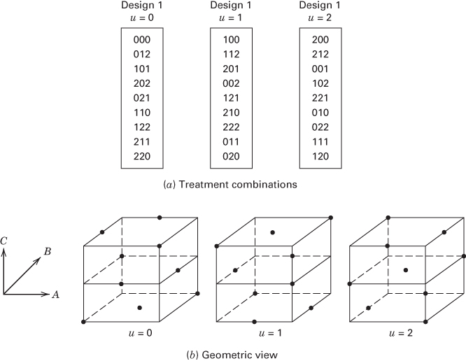

# 9.3 $3^{k}$ 因子设计的部分重复

部分重复的思想也适用于 $3^{k}$ 因子设计。即使 $k$ 不大，完整重复所需试验次数也可能很多，因此其分式设计值得研究。不过，下文会看到，有些设计的别名结构相当复杂。

## 9.3.1 $3^{k}$ 因子设计的三分之一分式

$3^{k}$ 设计中最大的真分式是包含 $3^{k-1}$ 次试验的三分之一分式，称为 $3^{k-1}$ 分式因子设计。构造时，选取一个占 2 个自由度的交互作用分量（通常选最高阶交互作用），将完整设计划分为三个区组；每个区组就是一个 $3^{k-1}$ 分式设计，任选其一即可。如果定义区组的分量为 $AB^{\alpha_2}C^{\alpha_3}\cdots K^{\alpha_k}$，那么

$$
I=AB^{\alpha_2}C^{\alpha_3}\cdots K^{\alpha_k}
$$

称为该分式因子设计的**定义关系**。从 $3^{k-1}$ 设计估计的每个主效应或交互作用分量都有两个别名，可将该效应分别乘以 $I$ 和 $I^2$，并按模 3 化简得到。

例如，考虑 $3^3$ 设计的三分之一分式。可选 ABC、$AB^2C$、$ABC^2$ 或 $AB^2C^2$ 中任一分量来构造设计。因此，实际上有 12 个不同的三分之一分式，由

$$
x_1+\alpha_2x_2+\alpha_3x_3\equiv u\pmod3,\qquad
\alpha_2,\alpha_3\in\{1,2\},\quad u\in\{0,1,2\}
$$

定义。若选择 $AB^2C^2$，所得 $3^{3-1}$ 设计的每个分式含 $3^2=9$ 个处理组合，满足

$$
x_1+2x_2+2x_3\equiv u\pmod3,\qquad u=0,1,2.
$$

三个分式见图 9.9。

**图 9.9** 定义关系为 $I=AB^2C^2$ 的 $3^3$ 设计的三个三分之一分式

无论实施图 9.9 中的哪一个 $3^{3-1}$ 分式设计，将各效应分别乘以定义关系中的 $AB^2C^2$ 及其平方，即得下列别名结构：

$$
\begin{aligned}
A&=A(AB^2C^2)=A^2B^2C^2=ABC,\\
A&=A(AB^2C^2)^2=A^3B^4C^4=BC,\\
B&=B(AB^2C^2)=AB^3C^2=AC^2,\\
B&=B(AB^2C^2)^2=A^2B^5C^4=ABC^2,\\
C&=C(AB^2C^2)=AB^2C^3=AB^2,\\
C&=C(AB^2C^2)^2=A^2B^4C^5=AB^2C,\\
AB&=AB(AB^2C^2)=A^2B^3C^2=AC,\\
AB&=AB(AB^2C^2)^2=A^3B^5C^4=BC^2.
\end{aligned}
$$

因此，该设计的 8 个自由度实际估计的是以下四组混合效应，每组占 2 个自由度：

$$
A+BC+ABC,\qquad B+AC^2+ABC^2,\qquad
C+AB^2+AB^2C,\qquad AB+AC+BC^2.
$$

只有当各交互作用相对于主效应都很小时，设计才可能有实际用途。主效应与两因子交互作用互为别名，所以这是分辨度 III 的设计。

这些别名关系十分复杂。如果 BC 交互作用较大，它会扭曲 A 主效应的估计，也使 $AB+AC+BC^2$ 难以解释。除非能假定所有交互作用均可忽略，否则很难使用该设计。

在结束讨论 $3_{\mathrm{III}}^{3-1}$ 设计之前，注意图 9.9 中 $u=0$ 的设计。令 A 对应行、B 对应列，可将其写成

<table><tr><td>000</td><td>012</td><td>021</td></tr><tr><td>101</td><td>110</td><td>122</td></tr><tr><td>202</td><td>211</td><td>220</td></tr></table>

这是一个 $3\times3$ 拉丁方。对 $3_{\mathrm{III}}^{3-1}$ 设计作唯一解释所需的“交互作用可忽略”假设，在拉丁方设计中也有对应要求。不过，两类设计的出发点不同：前者来自部分重复，后者来自随机化限制。由表 4.13 可知，共有 12 个不同的 $3\times3$ 拉丁方，恰好对应上述 12 个 $3^{3-1}$ 分式因子设计。

定义关系为 $I=AB^{\alpha_2}C^{\alpha_3}\cdots K^{\alpha_k}$ 的 $3^{k-1}$ 设计，还可以用与 $2^{k-p}$ 系列类似的方法构造。先按 0、1、2 记号列出 $k-1$ 个因子的完整三水平因子设计，共 $3^{k-1}$ 次试验；这是第 8 章所说的**基础设计**。随后令第 $k$ 个因子的水平 $x_k$ 等于前面因子的某个最高阶交互作用分量，即

$$
x_k=\beta_1x_1+\beta_2x_2+\cdots+\beta_{k-1}x_{k-1},\tag{9.5}
$$

其中 $\beta_i\equiv(3-\alpha_k)\alpha_i\pmod3$（$1\leq i\leq k-1$）。这样得到尽可能高的分辨度。

例如，按此方法生成表 9.6 中定义关系为 $I=AB^2CD$ 的 $3_{\mathrm{IV}}^{4-1}$ 设计。表中各处理组合的前三位恰好构成完整 $3^3$ 设计的 27 次试验。对于 $AB^2CD$，$\alpha_1=\alpha_3=\alpha_4=1$、$\alpha_2=2$，于是 $\beta_1=2$、$\beta_2\equiv4\equiv1\pmod3$、$\beta_3=2$，故式（9.5）成为

$$
x_4\equiv2x_1+x_2+2x_3\pmod3.\tag{9.6}
$$

第四个因子的水平应满足此式。例如，前三位为 000、010、110 时，右侧分别为 0、1、3（模 3 后为 0）。

**表 9.6** 定义关系为 $I=AB^2CD$ 的 $3_{\mathrm{IV}}^{4-1}$ 设计

<table><tr><td>0000</td><td>0012</td><td>2221</td></tr><tr><td>0101</td><td>0110</td><td>0021</td></tr><tr><td>1100</td><td>0211</td><td>0122</td></tr><tr><td>1002</td><td>1011</td><td>0220</td></tr><tr><td>0202</td><td>1112</td><td>1020</td></tr><tr><td>1201</td><td>1210</td><td>1121</td></tr><tr><td>2001</td><td>2010</td><td>1222</td></tr><tr><td>2102</td><td>2111</td><td>2022</td></tr><tr><td>2200</td><td>2212</td><td>2120</td></tr></table>

所得设计有 26 个自由度，可用于计算 13 个主效应及交互作用分量（连同其别名）的平方和。效应的别名按常规方法求得。例如，A 的两个别名为 $A(AB^2CD)=ABC^2D^2$ 和 $A(AB^2CD)^2=BC^2D^2$。可以验证，四个主效应均不与两因子交互作用分量混杂，但某些两因子交互作用分量彼此互为别名。这再次表明别名结构很复杂；若存在较大的两因子交互作用，往往难以将其区分开。

$3^{k-1}$ 设计的统计分析仍使用常规因子试验方差分析方法。交互作用分量的平方和可按 9.1 节的方法计算。解释结果时应记住，这些分量本身没有直接的实际意义。

## 9.3.2 其他 $3^{k-p}$ 分式因子设计

当 $k$ 中等或较大时，进一步缩小 $3^k$ 设计的分式可能更合适。一般可构造其 $(1/3)^p$ 分式（$p<k$），包含 $3^{k-p}$ 次试验，称为 $3^{k-p}$ 分式因子设计。例如，$3^{k-2}$ 是九分之一分式，$3^{k-3}$ 是二十七分之一分式。

构造 $3^{k-p}$ 设计时，先选择 $p$ 个交互作用分量，用它们把完整 $3^k$ 设计的处理组合划为 $3^p$ 个区组；每个区组即一个 $3^{k-p}$ 分式因子设计。任一分式的定义关系 $I$ 包含最初选定的 $p$ 个分量，以及它们自动产生的 $(3^p-2p-1)/2$ 个广义交互作用。任一主效应或交互作用分量的别名，可将该效应分别与定义关系中的相应元素相乘并按模 3 化简得到。

也可先列出完整 $3^{k-p}$ 设计的处理组合，再按 9.3.1 节的方法，将额外的 $p$ 个因子定义为某些交互作用分量，以生成试验安排。

下面构造一个 $3^{4-2}$ 设计，即 $3^4$ 设计的九分之一分式。选择 $AB^2C$ 和 BCD 两个交互作用分量，其广义交互作用为

$$
(AB^2C)(BCD)=AC^2D,\qquad
(AB^2C)(BCD)^2=ABD^2.
$$

因此定义关系为 $I=AB^2C=BCD=AC^2D=ABD^2$，设计的分辨度为 III。先列出因子 A、B 的 $3^2$ 完整设计，再令

$$
x_3\equiv2x_1+x_2,\qquad x_4\equiv2x_2+2x_3\pmod3,
$$

即可得到表 9.7 的九个处理组合。这等价于用 $AB^2C$、BCD 将完整 $3^4$ 设计划成九个区组，再选取其中一个。

**表 9.7** 定义关系为 $I=AB^2C$ 和 $I=BCD$ 的 $3_{\mathrm{III}}^{4-2}$ 设计

<table><tr><td>0000</td><td>0111</td><td>0222</td></tr><tr><td>1021</td><td>1102</td><td>1210</td></tr><tr><td>2012</td><td>2120</td><td>2201</td></tr></table>

该设计有 8 个自由度，可估计四个主效应及其别名。将效应分别乘以 $AB^2C$、BCD、$AC^2D$、$ABD^2$ 及它们的平方，并按模 3 化简，可得到完整的别名结构，见表 9.8。

**表 9.8** 表 9.7 所示 $3_{\mathrm{III}}^{4-2}$ 设计的别名结构

<table><tr><td>效应</td><td colspan="8">别名</td></tr><tr><td></td><td colspan="4">$I$</td><td colspan="4">$I^{2}$</td></tr><tr><td>$A$</td><td>$ABC^{2}$</td><td>$ABCD$</td><td>$ACD^{2}$</td><td>$AB^{2}D$</td><td>$BC^{2}$</td><td>$AB^{2}C^{2}D^{2}$</td><td>$CD^{2}$</td><td>$BD^{2}$</td></tr><tr><td>$B$</td><td>$AC$</td><td>$BC^{2}D^{2}$</td><td>$ABC^{2}D$</td><td>$AB^{2}D^{2}$</td><td>$ABC$</td><td>$CD$</td><td>$AB^{2}C^{2}D$</td><td>$AD^{2}$</td></tr><tr><td>$C$</td><td>$AB^{2}C^{2}$</td><td>$BC^{2}D$</td><td>$AD$</td><td>$ABCD^{2}$</td><td>$AB^{2}$</td><td>$BD$</td><td>$ACD$</td><td>$ABC^{2}D^{2}$</td></tr><tr><td>$D$</td><td>$AB^{2}CD$</td><td>$BCD^{2}$</td><td>$AC^{2}D^{2}$</td><td>$AB$</td><td>$AB^{2}CD^{2}$</td><td>$BC$</td><td>$AC^{2}$</td><td>$ABD$</td></tr></table>

由别名结构可知，只有交互作用不存在或可忽略时，该设计才有用。此外，若 A 对应行、B 对应列，表 9.7 的设计也是一个希腊—拉丁方。

Connor 和 Zelen（1959）为 $4\leq k\leq10$ 的情况整理了大量设计。该手册为美国国家标准局编制，是现有最完整的 $3^{k-p}$ 分式设计表。

本节多次提到 $3^{k-p}$ 分式设计别名关系的复杂性。当 $k$ 达到 4 或 5，完整 $3^k$ 设计的规模通常迫使试验者选用较小的分式。但这些设计的别名关系涉及各占 2 个自由度的交互作用分量；若交互作用不可忽略，结果可能难以解释，甚至无法解释。而且，无法像二水平设计那样简单地用折叠等增广方法合并多个分式，以分离显著交互作用。虽然存在曲率时常有人建议使用 $3^k$ 设计，第 11 章将介绍更高效的替代设计。