# 9.5 非正规分式因子设计

第 8 章介绍的正规二水平分式因子设计，是现代工业筛选试验的常用工具。分辨度 IV 尤其受欢迎：它避免了分辨度 III 中主效应与两因子交互作用的混杂，所需试验次数又少于分辨度 V。不过，当因子较多，例如 $k\geq9$ 时，也广泛使用分辨度 III 设计。第 8 章讨论了分辨度 III、IV、V 的正规最小偏差 $2^{k-p}$ 分式因子设计。

分辨度 III、IV 设计中的两因子交互作用别名，可能使试验结论含糊。例如，第 8 章的旋涂光刻胶试验采用了 $2^{6-2}$ 设计，发现主效应 A、B、C、E 以及两因子交互作用别名链 $AB+CE$ 很重要。若缺乏外部过程知识，无法判定真实效应来自 AB、CE，还是两者的某种线性组合，必须增补试验。第 8 章演示了完整折叠和部分折叠，也介绍了眼睛调焦时间试验中的分辨度 III $2^{7-4}$ 设计，后者需要折叠才能识别较大的两因子交互作用。

较强的两因子交互作用通常比强主效应少见，但筛选试验中潜在交互作用的数量远多于主效应，因此出现至少一个显著交互作用的可能性仍然很高。试验者往往不愿在结论不清楚后，再投入额外时间与材料。本节说明如何为 6 至 14 个因子选择特定的非正规二水平分式设计，以便在两因子交互作用活跃时尽可能避免后续试验。9.5.1 节介绍 16 次试验中安排 6、7、8 个因子的设计，其中任意两个两因子交互作用都不完全混杂，可替代正规最小偏差分辨度 IV 设计。9.5.2 节介绍 16 次试验中安排 9 至 14 个因子的设计，主效应与两因子交互作用之间没有完全别名，可替代正规最小偏差分辨度 III 设计。本节还讨论评价指标、推荐设计的获得方式及分析方法。

筛选设计主要用于发现活跃因子。因子活跃通常表现为主效应，或该因子参与的两因子交互作用。考虑模型

$$
\mathbf y=\mathbf X\boldsymbol\beta+\boldsymbol\epsilon,\tag{9.7}
$$

其中 $\mathbf X$ 包含截距、全部主效应和两因子交互作用的列，$\boldsymbol\beta$ 是模型参数向量，$\boldsymbol\epsilon$ 是服从 $\mathrm{NID}(0,\sigma^2)$ 的误差向量。例如，16 次试验安排六个因子，并拟合全部主效应与两因子交互作用时，$\mathbf X$ 的列数超过行数，因而不满列秩，$\mathbf X'\mathbf X$ 奇异，通常的最小二乘估计不存在。相对于这个完整模型，任何 16 次试验的设计都是**超饱和设计**。

Booth 和 Cox（1962）提出 $E(s^2)$ 准则来比较超饱和设计：

$$
E(s^2)=\frac{\sum_{i<j}(\mathbf X_i'\mathbf X_j)^2}{k(k-1)},\tag{9.8}
$$

其中 $k$ 是 $\mathbf X$ 的列数。最小化该准则，等价于最小化 $\mathbf X$ 相关矩阵中所有非对角元素的平方和。

去掉截距列后，含六个因子的正规分辨度 IV、16 次试验设计，其相关矩阵为 $21\times21$：六个主效应和 15 个两因子交互作用各占一行、一列。图 9.10 是该设计主分式相关矩阵的方格图。主效应与两因子交互作用的相关系数全为零，因为设计的分辨度为 IV；但每个两因子交互作用至少与另一个两因子交互作用的相关系数为 $+1$，即完全混杂。若使用同一家族中的另一个设计，某些生成元改取负号，相关矩阵中的部分元素会变为 $-1$，但完全混杂仍然存在。

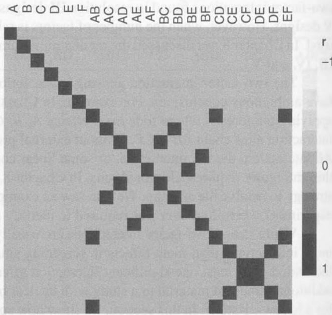

**图 9.10** 正规 $2^{6-2}$ 分辨度 IV 分式因子设计的相关矩阵

Jones 和 Montgomery（2010）建议用相关矩阵的方格图显示分式设计中的别名关系，并比较非正规设计与相应的正规设计。图 9.10 所示的混杂模式，也可以用第 8 章介绍的**别名矩阵**表示。回顾：若拟合模型为

$$
\mathbf y=\mathbf X_1\boldsymbol\beta_1+\boldsymbol\epsilon,
$$

但真实模型为

$$
\mathbf y=\mathbf X_1\boldsymbol\beta_1+\mathbf X_2\boldsymbol\beta_2+\boldsymbol\epsilon,
$$

则 $\mathbf X_2$ 包含拟合模型遗漏的项（例如交互作用），并有

$$
E(\hat{\boldsymbol\beta}_1)
=\boldsymbol\beta_1+
(\mathbf X_1'\mathbf X_1)^{-1}\mathbf X_1'\mathbf X_2\boldsymbol\beta_2
=\boldsymbol\beta_1+\mathbf A\boldsymbol\beta_2.
$$

别名矩阵 $\mathbf A=(\mathbf X_1'\mathbf X_1)^{-1}\mathbf X_1'\mathbf X_2$ 显示遗漏的活跃效应如何使拟合模型的参数估计产生偏差。每一行对应一个已拟合参数，非零元素表示相应的遗漏项带来的偏差程度。

在正规设计中，$\mathbf A$ 的每个元素只可能为 0 或 $\pm1$。元素为 0，表示 $\mathbf X_1$ 与 $\mathbf X_2$ 对应的两列正交；为 $\pm1$，表示两列完全相关。非正规设计的别名关系更复杂。若 $\mathbf X_1$ 对应主效应模型、$\mathbf X_2$ 对应两因子交互作用，则正交的 16 次试验非正规设计中，别名矩阵元素可取 $0,\pm1,\pm0.5$；其中少数设计没有 $\pm1$ 元素。

Bursztyn 和 Steinberg（2006）建议用 $\operatorname{tr}(\mathbf A\mathbf A')$（等价于 $\operatorname{tr}(\mathbf A'\mathbf A)$）度量设计的总偏差。他们用此指标比较计算机模拟设计；它同样适用于筛选设计的排序。

## 9.5.1 16 次试验中的 6、7、8 因子非正规分式设计

Jones 和 Montgomery（2010）提出这些设计，作为常规正规最小偏差分式的替代方案。Hall（1961）找到五个包含 15 个因子、16 次试验的**非同构正交设计**。非同构指无法通过交换行、交换列或重标因子，使其中一个设计变成另一个。Jones 和 Montgomery 从 Hall 设计的列中选择使 $E(s^2)$ 和 $\operatorname{tr}(\mathbf A\mathbf A')$ 最小的列组，对所有非同构正交投影进行搜索。表 9.14 至 9.18 为 Hall 设计，表 9.19 给出 16 次试验非同构正交设计的个数。

**表 9.14** Hall I 设计

<table><tr><td>试验序号</td><td>A</td><td>B</td><td>C</td><td>D</td><td>E</td><td>F</td><td>G</td><td>H</td><td>J</td><td>K</td><td>L</td><td>M</td><td>N</td><td>P</td><td>Q</td></tr><tr><td>1</td><td>-1</td><td>-1</td><td>1</td><td>-1</td><td>1</td><td>1</td><td>-1</td><td>-1</td><td>1</td><td>1</td><td>-1</td><td>1</td><td>-1</td><td>-1</td><td>1</td></tr><tr><td>2</td><td>1</td><td>-1</td><td>-1</td><td>-1</td><td>-1</td><td>1</td><td>1</td><td>-1</td><td>-1</td><td>1</td><td>1</td><td>1</td><td>1</td><td>-1</td><td>-1</td></tr><tr><td>3</td><td>-1</td><td>1</td><td>-1</td><td>-1</td><td>1</td><td>-1</td><td>1</td><td>-1</td><td>1</td><td>-1</td><td>1</td><td>1</td><td>-1</td><td>1</td><td>-1</td></tr><tr><td>4</td><td>1</td><td>1</td><td>1</td><td>-1</td><td>-1</td><td>-1</td><td>-1</td><td>-1</td><td>-1</td><td>-1</td><td>-1</td><td>1</td><td>1</td><td>1</td><td>1</td></tr><tr><td>5</td><td>-1</td><td>-1</td><td>1</td><td>1</td><td>-1</td><td>-1</td><td>1</td><td>-1</td><td>1</td><td>1</td><td>-1</td><td>-1</td><td>1</td><td>1</td><td>-1</td></tr><tr><td>6</td><td>1</td><td>-1</td><td>-1</td><td>1</td><td>1</td><td>-1</td><td>-1</td><td>-1</td><td>-1</td><td>1</td><td>1</td><td>-1</td><td>-1</td><td>1</td><td>1</td></tr><tr><td>7</td><td>-1</td><td>1</td><td>-1</td><td>1</td><td>-1</td><td>1</td><td>-1</td><td>-1</td><td>1</td><td>-1</td><td>1</td><td>-1</td><td>1</td><td>-1</td><td>1</td></tr><tr><td>8</td><td>1</td><td>1</td><td>1</td><td>1</td><td>1</td><td>1</td><td>1</td><td>-1</td><td>-1</td><td>-1</td><td>-1</td><td>-1</td><td>-1</td><td>-1</td><td>-1</td></tr><tr><td>9</td><td>-1</td><td>-1</td><td>1</td><td>-1</td><td>1</td><td>1</td><td>-1</td><td>1</td><td>-1</td><td>-1</td><td>1</td><td>-1</td><td>1</td><td>1</td><td>-1</td></tr><tr><td>10</td><td>1</td><td>-1</td><td>-1</td><td>-1</td><td>-1</td><td>1</td><td>1</td><td>1</td><td>1</td><td>-1</td><td>-1</td><td>-1</td><td>-1</td><td>1</td><td>1</td></tr><tr><td>11</td><td>-1</td><td>1</td><td>-1</td><td>-1</td><td>1</td><td>-1</td><td>1</td><td>1</td><td>-1</td><td>1</td><td>-1</td><td>-1</td><td>1</td><td>-1</td><td>1</td></tr><tr><td>12</td><td>1</td><td>1</td><td>1</td><td>-1</td><td>-1</td><td>-1</td><td>-1</td><td>1</td><td>1</td><td>1</td><td>1</td><td>-1</td><td>-1</td><td>-1</td><td>-1</td></tr><tr><td>13</td><td>-1</td><td>-1</td><td>1</td><td>1</td><td>-1</td><td>-1</td><td>1</td><td>1</td><td>-1</td><td>-1</td><td>1</td><td>1</td><td>-1</td><td>-1</td><td>1</td></tr><tr><td>14</td><td>1</td><td>-1</td><td>-1</td><td>1</td><td>1</td><td>-1</td><td>-1</td><td>1</td><td>1</td><td>-1</td><td>-1</td><td>1</td><td>1</td><td>-1</td><td>-1</td></tr><tr><td>15</td><td>-1</td><td>1</td><td>-1</td><td>1</td><td>-1</td><td>1</td><td>-1</td><td>1</td><td>-1</td><td>1</td><td>-1</td><td>1</td><td>-1</td><td>1</td><td>-1</td></tr><tr><td>16</td><td>1</td><td>1</td><td>1</td><td>1</td><td>1</td><td>1</td><td>1</td><td>1</td><td>1</td><td>1</td><td>1</td><td>1</td><td>1</td><td>1</td><td>1</td></tr></table>

**表 9.15**[^1] Hall II 设计

| 试验号 | A | B | C | D | E | F | G | H | J | K | L | M | N | P | Q |
| --- | --- | --- | --- | --- | --- | --- | --- | --- | --- | --- | --- | --- | --- | --- | --- |
| 1 | 1 | 1 | 1 | 1 | 1 | 1 | 1 | 1 | 1 | 1 | 1 | 1 | 1 | 1 | 1 |
| 2 | 1 | 1 | 1 | 1 | 1 | 1 | 1 | −1 | −1 | −1 | −1 | −1 | −1 | −1 | −1 |
| 3 | 1 | 1 | 1 | −1 | −1 | −1 | −1 | 1 | 1 | 1 | 1 | −1 | −1 | −1 | −1 |
| 4 | 1 | 1 | 1 | −1 | −1 | −1 | −1 | −1 | −1 | −1 | −1 | 1 | 1 | 1 | 1 |
| 5 | 1 | −1 | −1 | 1 | 1 | −1 | −1 | 1 | 1 | −1 | −1 | 1 | 1 | −1 | −1 |
| 6 | 1 | −1 | −1 | 1 | 1 | −1 | 1 | −1 | −1 | 1 | 1 | −1 | −1 | 1 | 1 |
| 7 | 1 | −1 | −1 | −1 | −1 | 1 | 1 | 1 | 1 | −1 | −1 | −1 | −1 | 1 | 1 |
| 8 | 1 | −1 | −1 | −1 | −1 | 1 | 1 | −1 | −1 | 1 | 1 | 1 | 1 | −1 | −1 |
| 9 | −1 | 1 | −1 | 1 | −1 | 1 | −1 | 1 | −1 | 1 | −1 | 1 | −1 | 1 | −1 |
| 10 | −1 | 1 | −1 | 1 | −1 | 1 | −1 | −1 | 1 | −1 | 1 | −1 | 1 | −1 | 1 |
| 11 | −1 | 1 | −1 | −1 | 1 | −1 | 1 | 1 | −1 | 1 | −1 | −1 | 1 | −1 | 1 |
| 12 | −1 | 1 | −1 | −1 | 1 | −1 | 1 | −1 | 1 | −1 | 1 | 1 | −1 | 1 | −1 |
| 13 | −1 | −1 | 1 | 1 | −1 | −1 | 1 | 1 | −1 | −1 | 1 | −1 | 1 | 1 | −1 |
| 14 | −1 | −1 | 1 | 1 | −1 | −1 | 1 | −1 | 1 | 1 | −1 | 1 | −1 | −1 | 1 |
| 15 | −1 | −1 | 1 | −1 | 1 | 1 | −1 | 1 | −1 | −1 | 1 | 1 | −1 | −1 | 1 |
| 16 | −1 | −1 | 1 | −1 | 1 | 1 | −1 | −1 | 1 | 1 | −1 | −1 | 1 | 1 | −1 |

**表 9.16** Hall III 设计

<table><tr><td>试验序号</td><td>A</td><td>B</td><td>C</td><td>D</td><td>E</td><td>F</td><td>G</td><td>H</td><td>J</td><td>K</td><td>L</td><td>M</td><td>N</td><td>P</td><td>Q</td></tr><tr><td>1</td><td>1</td><td>1</td><td>1</td><td>1</td><td>1</td><td>1</td><td>1</td><td>1</td><td>1</td><td>1</td><td>1</td><td>1</td><td>1</td><td>1</td><td>1</td></tr><tr><td>2</td><td>1</td><td>1</td><td>1</td><td>1</td><td>1</td><td>1</td><td>1</td><td>-1</td><td>-1</td><td>-1</td><td>-1</td><td>-1</td><td>-1</td><td>-1</td><td>-1</td></tr><tr><td>3</td><td>1</td><td>1</td><td>1</td><td>-1</td><td>-1</td><td>-1</td><td>-1</td><td>1</td><td>1</td><td>1</td><td>1</td><td>-1</td><td>-1</td><td>-1</td><td>-1</td></tr><tr><td>4</td><td>1</td><td>1</td><td>1</td><td>-1</td><td>-1</td><td>-1</td><td>-1</td><td>-1</td><td>-1</td><td>-1</td><td>-1</td><td>1</td><td>1</td><td>1</td><td>1</td></tr><tr><td>5</td><td>1</td><td>-1</td><td>-1</td><td>1</td><td>1</td><td>-1</td><td>-1</td><td>1</td><td>1</td><td>-1</td><td>-1</td><td>1</td><td>1</td><td>-1</td><td>-1</td></tr><tr><td>6</td><td>1</td><td>-1</td><td>-1</td><td>1</td><td>1</td><td>-1</td><td>-1</td><td>-1</td><td>-1</td><td>1</td><td>1</td><td>-1</td><td>-1</td><td>1</td><td>1</td></tr><tr><td>7</td><td>1</td><td>-1</td><td>-1</td><td>-1</td><td>-1</td><td>1</td><td>1</td><td>1</td><td>1</td><td>-1</td><td>-1</td><td>-1</td><td>-1</td><td>1</td><td>1</td></tr><tr><td>8</td><td>1</td><td>-1</td><td>-1</td><td>-1</td><td>-1</td><td>1</td><td>1</td><td>-1</td><td>-1</td><td>1</td><td>1</td><td>1</td><td>1</td><td>-1</td><td>-1</td></tr><tr><td>9</td><td>-1</td><td>1</td><td>-1</td><td>1</td><td>-1</td><td>1</td><td>-1</td><td>1</td><td>-1</td><td>1</td><td>-1</td><td>1</td><td>-1</td><td>1</td><td>-1</td></tr><tr><td>10</td><td>-1</td><td>1</td><td>-1</td><td>1</td><td>-1</td><td>1</td><td>-1</td><td>-1</td><td>1</td><td>-1</td><td>1</td><td>-1</td><td>1</td><td>-1</td><td>1</td></tr><tr><td>11</td><td>-1</td><td>1</td><td>-1</td><td>-1</td><td>1</td><td>-1</td><td>1</td><td>1</td><td>-1</td><td>-1</td><td>1</td><td>1</td><td>-1</td><td>-1</td><td>1</td></tr><tr><td>12</td><td>-1</td><td>1</td><td>-1</td><td>-1</td><td>1</td><td>-1</td><td>1</td><td>-1</td><td>1</td><td>1</td><td>-1</td><td>-1</td><td>1</td><td>1</td><td>-1</td></tr><tr><td>13</td><td>-1</td><td>-1</td><td>1</td><td>1</td><td>-1</td><td>-1</td><td>1</td><td>1</td><td>-1</td><td>-1</td><td>1</td><td>-1</td><td>1</td><td>1</td><td>-1</td></tr><tr><td>14</td><td>-1</td><td>-1</td><td>1</td><td>1</td><td>-1</td><td>-1</td><td>1</td><td>-1</td><td>1</td><td>1</td><td>-1</td><td>1</td><td>-1</td><td>-1</td><td>1</td></tr><tr><td>15</td><td>-1</td><td>-1</td><td>1</td><td>-1</td><td>1</td><td>1</td><td>-1</td><td>1</td><td>-1</td><td>1</td><td>-1</td><td>-1</td><td>1</td><td>-1</td><td>1</td></tr><tr><td>16</td><td>-1</td><td>-1</td><td>1</td><td>-1</td><td>1</td><td>1</td><td>-1</td><td>-1</td><td>1</td><td>-1</td><td>1</td><td>1</td><td>1</td><td>1</td><td>-1</td></tr></table>

**表 9.17** Hall IV 设计

<table><tr><td>试验序号</td><td>A</td><td>B</td><td>C</td><td>D</td><td>E</td><td>F</td><td>G</td><td>H</td><td>J</td><td>K</td><td>L</td><td>M</td><td>N</td><td>P</td><td>Q</td></tr><tr><td>1</td><td>1</td><td>1</td><td>1</td><td>1</td><td>1</td><td>1</td><td>1</td><td>1</td><td>1</td><td>1</td><td>1</td><td>1</td><td>1</td><td>1</td><td>1</td></tr><tr><td>2</td><td>1</td><td>1</td><td>1</td><td>1</td><td>1</td><td>1</td><td>1</td><td>-1</td><td>-1</td><td>-1</td><td>-1</td><td>-1</td><td>-1</td><td>-1</td><td>-1</td></tr><tr><td>3</td><td>1</td><td>1</td><td>1</td><td>-1</td><td>-1</td><td>-1</td><td>-1</td><td>1</td><td>1</td><td>1</td><td>1</td><td>-1</td><td>-1</td><td>-1</td><td>-1</td></tr><tr><td>4</td><td>1</td><td>1</td><td>1</td><td>-1</td><td>-1</td><td>-1</td><td>-1</td><td>-1</td><td>-1</td><td>-1</td><td>-1</td><td>1</td><td>1</td><td>1</td><td>1</td></tr><tr><td>5</td><td>1</td><td>-1</td><td>-1</td><td>1</td><td>1</td><td>-1</td><td>-1</td><td>1</td><td>1</td><td>-1</td><td>-1</td><td>1</td><td>1</td><td>-1</td><td>-1</td></tr><tr><td>6</td><td>1</td><td>-1</td><td>-1</td><td>1</td><td>1</td><td>-1</td><td>-1</td><td>-1</td><td>-1</td><td>1</td><td>1</td><td>-1</td><td>-1</td><td>1</td><td>1</td></tr><tr><td>7</td><td>1</td><td>-1</td><td>-1</td><td>-1</td><td>-1</td><td>1</td><td>1</td><td>1</td><td>1</td><td>-1</td><td>-1</td><td>-1</td><td>-1</td><td>1</td><td>1</td></tr><tr><td>8</td><td>1</td><td>-1</td><td>-1</td><td>-1</td><td>-1</td><td>1</td><td>1</td><td>-1</td><td>-1</td><td>1</td><td>1</td><td>1</td><td>1</td><td>-1</td><td>-1</td></tr><tr><td>9</td><td>-1</td><td>1</td><td>-1</td><td>1</td><td>-1</td><td>1</td><td>-1</td><td>1</td><td>-1</td><td>1</td><td>-1</td><td>1</td><td>-1</td><td>1</td><td>-1</td></tr><tr><td>10</td><td>-1</td><td>1</td><td>-1</td><td>1</td><td>-1</td><td>-1</td><td>1</td><td>1</td><td>-1</td><td>-1</td><td>1</td><td>-1</td><td>1</td><td>-1</td><td>1</td></tr><tr><td>11</td><td>-1</td><td>1</td><td>-1</td><td>-1</td><td>1</td><td>1</td><td>-1</td><td>1</td><td>1</td><td>-1</td><td>1</td><td>1</td><td>-1</td><td>-1</td><td>1</td></tr><tr><td>12</td><td>-1</td><td>1</td><td>-1</td><td>-1</td><td>1</td><td>-1</td><td>1</td><td>-1</td><td>1</td><td>1</td><td>-1</td><td>-1</td><td>1</td><td>1</td><td>-1</td></tr><tr><td>13</td><td>-1</td><td>-1</td><td>1</td><td>1</td><td>-1</td><td>1</td><td>-1</td><td>-1</td><td>1</td><td>-1</td><td>1</td><td>-1</td><td>1</td><td>1</td><td>-1</td></tr><tr><td>14</td><td>-1</td><td>-1</td><td>1</td><td>1</td><td>-1</td><td>-1</td><td>1</td><td>-1</td><td>1</td><td>1</td><td>-1</td><td>1</td><td>-1</td><td>-1</td><td>1</td></tr><tr><td>15</td><td>-1</td><td>-1</td><td>1</td><td>-1</td><td>1</td><td>1</td><td>-1</td><td>1</td><td>-1</td><td>1</td><td>-1</td><td>-1</td><td>1</td><td>-1</td><td>1</td></tr><tr><td>16</td><td>-1</td><td>-1</td><td>1</td><td>-1</td><td>1</td><td>-1</td><td>1</td><td>1</td><td>-1</td><td>-1</td><td>1</td><td>1</td><td>-1</td><td>1</td><td>-1</td></tr></table>

**表 9.18** Hall V 设计

<table><tr><td>试验序号</td><td>A</td><td>B</td><td>C</td><td>D</td><td>E</td><td>F</td><td>G</td><td>H</td><td>J</td><td>K</td><td>L</td><td>M</td><td>N</td><td>P</td><td>Q</td></tr><tr><td>1</td><td>1</td><td>1</td><td>1</td><td>1</td><td>1</td><td>1</td><td>1</td><td>1</td><td>1</td><td>1</td><td>1</td><td>1</td><td>1</td><td>1</td><td>1</td></tr><tr><td>2</td><td>1</td><td>1</td><td>1</td><td>1</td><td>1</td><td>1</td><td>1</td><td>-1</td><td>-1</td><td>-1</td><td>-1</td><td>-1</td><td>-1</td><td>-1</td><td>-1</td></tr><tr><td>3</td><td>1</td><td>1</td><td>1</td><td>-1</td><td>-1</td><td>-1</td><td>-1</td><td>1</td><td>1</td><td>1</td><td>1</td><td>-1</td><td>-1</td><td>-1</td><td>-1</td></tr><tr><td>4</td><td>1</td><td>1</td><td>1</td><td>-1</td><td>-1</td><td>-1</td><td>-1</td><td>-1</td><td>-1</td><td>-1</td><td>-1</td><td>1</td><td>1</td><td>1</td><td>1</td></tr><tr><td>5</td><td>1</td><td>-1</td><td>-1</td><td>1</td><td>1</td><td>-1</td><td>-1</td><td>1</td><td>1</td><td>-1</td><td>-1</td><td>1</td><td>1</td><td>-1</td><td>-1</td></tr><tr><td>6</td><td>1</td><td>-1</td><td>-1</td><td>1</td><td>1</td><td>-1</td><td>-1</td><td>-1</td><td>-1</td><td>1</td><td>1</td><td>-1</td><td>-1</td><td>1</td><td>-1</td></tr><tr><td>7</td><td>1</td><td>-1</td><td>-1</td><td>-1</td><td>-1</td><td>1</td><td>1</td><td>1</td><td>-1</td><td>1</td><td>-1</td><td>1</td><td>-1</td><td>1</td><td>-1</td></tr><tr><td>8</td><td>1</td><td>-1</td><td>-1</td><td>-1</td><td>-1</td><td>1</td><td>1</td><td>-1</td><td>1</td><td>-1</td><td>1</td><td>-1</td><td>1</td><td>-1</td><td>1</td></tr><tr><td>9</td><td>-1</td><td>1</td><td>-1</td><td>1</td><td>-1</td><td>1</td><td>-1</td><td>1</td><td>1</td><td>-1</td><td>-1</td><td>-1</td><td>-1</td><td>1</td><td>1</td></tr><tr><td>10</td><td>-1</td><td>1</td><td>-1</td><td>1</td><td>-1</td><td>1</td><td>-1</td><td>-1</td><td>1</td><td>1</td><td>1</td><td>1</td><td>-1</td><td>-1</td><td>-1</td></tr><tr><td>11</td><td>-1</td><td>1</td><td>-1</td><td>-1</td><td>1</td><td>-1</td><td>1</td><td>1</td><td>-1</td><td>-1</td><td>1</td><td>-1</td><td>1</td><td>1</td><td>-1</td></tr><tr><td>12</td><td>-1</td><td>1</td><td>-1</td><td>-1</td><td>1</td><td>-1</td><td>1</td><td>-1</td><td>1</td><td>1</td><td>-1</td><td>1</td><td>-1</td><td>-1</td><td>1</td></tr><tr><td>13</td><td>-1</td><td>-1</td><td>1</td><td>1</td><td>-1</td><td>-1</td><td>1</td><td>1</td><td>-1</td><td>1</td><td>-1</td><td>-1</td><td>1</td><td>-1</td><td>1</td></tr><tr><td>14</td><td>-1</td><td>-1</td><td>1</td><td>1</td><td>-1</td><td>-1</td><td>1</td><td>-1</td><td>1</td><td>-1</td><td>1</td><td>1</td><td>-1</td><td>1</td><td>-1</td></tr><tr><td>15</td><td>-1</td><td>-1</td><td>1</td><td>-1</td><td>1</td><td>1</td><td>-1</td><td>1</td><td>-1</td><td>-1</td><td>1</td><td>1</td><td>-1</td><td>-1</td><td>1</td></tr><tr><td>16</td><td>-1</td><td>-1</td><td>1</td><td>-1</td><td>1</td><td>1</td><td>-1</td><td>-1</td><td>1</td><td>1</td><td>-1</td><td>-1</td><td>1</td><td>1</td><td>-1</td></tr></table>

**表 9.19** 16 次试验中非同构正交设计的个数

<table><tr><td>因子数</td><td>设计数</td></tr><tr><td>6</td><td>27</td></tr><tr><td>7</td><td>55</td></tr><tr><td>8</td><td>80</td></tr></table>

Jones 和 Montgomery 推荐的非正规设计见表 9.20 至 9.22。表 9.20 的六因子设计取自 Hall II 设计的 D、E、H、K、M、Q 列。图 9.11 比较该设计与相应正规分式的相关矩阵。和正规 $2^{6-2}$ 设计一样，表 9.20 的设计对一阶模型正交；但不同之处是，没有任何一对两因子交互作用互为完全别名。相关矩阵所有非对角元素均为 $0$ 或 $\pm0.5$。Jones 和 Montgomery 因而称其为**无完全混杂设计**。

表 9.21 是推荐的七因子设计，取自 Hall III 的 A、B、D、H、J、M、Q 列；其与正规 $2^{7-3}$ 分式的相关矩阵见图 9.12。它也对一阶模型正交，没有完全混杂的两因子交互作用，非对角相关系数均为 $0$ 或 $\pm0.5$。

表 9.22 是推荐的八因子设计，取自 Hall IV 的 A、B、D、F、H、J、M、O 列；它与正规 $2^{8-4}$ 分式的相关矩阵见图 9.13。它同样对一阶模型正交，两因子交互作用之间没有完全混杂，非对角相关系数只取 $0$ 或 $\pm0.5$。

**表 9.20** 16 次试验的六因子非正规正交设计

<table><tr><td>试验序号</td><td>A</td><td>B</td><td>C</td><td>D</td><td>E</td><td>F</td></tr><tr><td>1</td><td>1</td><td>1</td><td>1</td><td>1</td><td>1</td><td>1</td></tr><tr><td>2</td><td>1</td><td>1</td><td>-1</td><td>-1</td><td>-1</td><td>-1</td></tr><tr><td>3</td><td>-1</td><td>-1</td><td>1</td><td>1</td><td>-1</td><td>-1</td></tr><tr><td>4</td><td>-1</td><td>-1</td><td>-1</td><td>-1</td><td>1</td><td>1</td></tr><tr><td>5</td><td>1</td><td>1</td><td>1</td><td>-1</td><td>1</td><td>-1</td></tr><tr><td>6</td><td>1</td><td>1</td><td>-1</td><td>1</td><td>-1</td><td>1</td></tr><tr><td>7</td><td>-1</td><td>-1</td><td>1</td><td>-1</td><td>-1</td><td>1</td></tr><tr><td>8</td><td>-1</td><td>-1</td><td>-1</td><td>1</td><td>1</td><td>-1</td></tr><tr><td>9</td><td>1</td><td>-1</td><td>1</td><td>1</td><td>1</td><td>-1</td></tr><tr><td>10</td><td>1</td><td>-1</td><td>-1</td><td>-1</td><td>-1</td><td>1</td></tr><tr><td>11</td><td>-1</td><td>1</td><td>1</td><td>1</td><td>-1</td><td>1</td></tr><tr><td>12</td><td>-1</td><td>1</td><td>-1</td><td>-1</td><td>1</td><td>-1</td></tr><tr><td>13</td><td>1</td><td>-1</td><td>1</td><td>-1</td><td>-1</td><td>-1</td></tr><tr><td>14</td><td>1</td><td>-1</td><td>-1</td><td>1</td><td>1</td><td>1</td></tr><tr><td>15</td><td>-1</td><td>1</td><td>1</td><td>-1</td><td>1</td><td>1</td></tr><tr><td>16</td><td>-1</td><td>1</td><td>-1</td><td>1</td><td>-1</td><td>-1</td></tr></table>

**表 9.21** 16 次试验的七因子非正规正交设计

<table><tr><td>试验序号</td><td>A</td><td>B</td><td>C</td><td>D</td><td>E</td><td>F</td><td>G</td></tr><tr><td>1</td><td>1</td><td>1</td><td>1</td><td>1</td><td>1</td><td>1</td><td>1</td></tr><tr><td>2</td><td>1</td><td>1</td><td>1</td><td>-1</td><td>-1</td><td>-1</td><td>-1</td></tr><tr><td>3</td><td>1</td><td>1</td><td>-1</td><td>1</td><td>1</td><td>-1</td><td>-1</td></tr><tr><td>4</td><td>1</td><td>1</td><td>-1</td><td>-1</td><td>-1</td><td>1</td><td>1</td></tr><tr><td>5</td><td>1</td><td>-1</td><td>1</td><td>1</td><td>-1</td><td>1</td><td>-1</td></tr><tr><td>6</td><td>1</td><td>-1</td><td>1</td><td>-1</td><td>1</td><td>-1</td><td>1</td></tr><tr><td>7</td><td>1</td><td>-1</td><td>-1</td><td>1</td><td>-1</td><td>-1</td><td>1</td></tr><tr><td>8</td><td>1</td><td>-1</td><td>-1</td><td>-1</td><td>1</td><td>1</td><td>-1</td></tr><tr><td>9</td><td>-1</td><td>1</td><td>1</td><td>1</td><td>1</td><td>1</td><td>-1</td></tr><tr><td>10</td><td>-1</td><td>1</td><td>1</td><td>-1</td><td>-1</td><td>-1</td><td>1</td></tr><tr><td>11</td><td>-1</td><td>1</td><td>-1</td><td>1</td><td>-1</td><td>1</td><td>1</td></tr><tr><td>12</td><td>-1</td><td>1</td><td>-1</td><td>-1</td><td>1</td><td>-1</td><td>-1</td></tr><tr><td>13</td><td>-1</td><td>-1</td><td>1</td><td>1</td><td>-1</td><td>-1</td><td>-1</td></tr><tr><td>14</td><td>-1</td><td>-1</td><td>1</td><td>-1</td><td>1</td><td>1</td><td>1</td></tr><tr><td>15</td><td>-1</td><td>-1</td><td>-1</td><td>1</td><td>1</td><td>-1</td><td>1</td></tr><tr><td>16</td><td>-1</td><td>-1</td><td>-1</td><td>-1</td><td>-1</td><td>1</td><td>-1</td></tr></table>

**表 9.22** 16 次试验的八因子非正规正交设计

<table><tr><td>试验序号</td><td>A</td><td>B</td><td>C</td><td>D</td><td>E</td><td>F</td><td>G</td><td>H</td></tr><tr><td>1</td><td>1</td><td>1</td><td>1</td><td>1</td><td>1</td><td>1</td><td>1</td><td>1</td></tr><tr><td>2</td><td>1</td><td>1</td><td>1</td><td>1</td><td>-1</td><td>-1</td><td>-1</td><td>-1</td></tr><tr><td>3</td><td>1</td><td>1</td><td>-1</td><td>-1</td><td>1</td><td>1</td><td>-1</td><td>-1</td></tr><tr><td>4</td><td>1</td><td>1</td><td>-1</td><td>-1</td><td>-1</td><td>-1</td><td>1</td><td>1</td></tr><tr><td>5</td><td>1</td><td>-1</td><td>1</td><td>-1</td><td>1</td><td>-1</td><td>1</td><td>-1</td></tr><tr><td>6</td><td>1</td><td>-1</td><td>1</td><td>-1</td><td>-1</td><td>1</td><td>-1</td><td>1</td></tr><tr><td>7</td><td>1</td><td>-1</td><td>-1</td><td>1</td><td>1</td><td>-1</td><td>-1</td><td>1</td></tr><tr><td>8</td><td>1</td><td>-1</td><td>-1</td><td>1</td><td>-1</td><td>1</td><td>1</td><td>-1</td></tr><tr><td>9</td><td>-1</td><td>1</td><td>1</td><td>1</td><td>1</td><td>1</td><td>1</td><td>1</td></tr><tr><td>10</td><td>-1</td><td>1</td><td>1</td><td>-1</td><td>1</td><td>-1</td><td>-1</td><td>-1</td></tr><tr><td>11</td><td>-1</td><td>1</td><td>-1</td><td>1</td><td>-1</td><td>-1</td><td>1</td><td>-1</td></tr><tr><td>12</td><td>-1</td><td>1</td><td>-1</td><td>-1</td><td>-1</td><td>1</td><td>-1</td><td>1</td></tr><tr><td>13</td><td>-1</td><td>-1</td><td>1</td><td>1</td><td>-1</td><td>-1</td><td>-1</td><td>1</td></tr><tr><td>14</td><td>-1</td><td>-1</td><td>1</td><td>-1</td><td>-1</td><td>1</td><td>1</td><td>-1</td></tr><tr><td>15</td><td>-1</td><td>-1</td><td>-1</td><td>1</td><td>1</td><td>1</td><td>-1</td><td>-1</td></tr><tr><td>16</td><td>-1</td><td>-1</td><td>-1</td><td>-1</td><td>1</td><td>-1</td><td>1</td><td>1</td></tr></table>

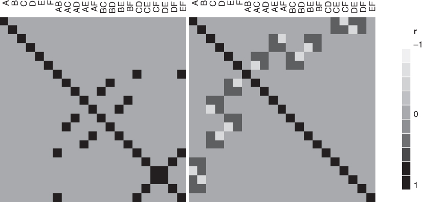

**图 9.11** 六因子设计的相关矩阵：（a）正规 $2^{6-2}$ 分式；（b）非正规无完全混杂设计

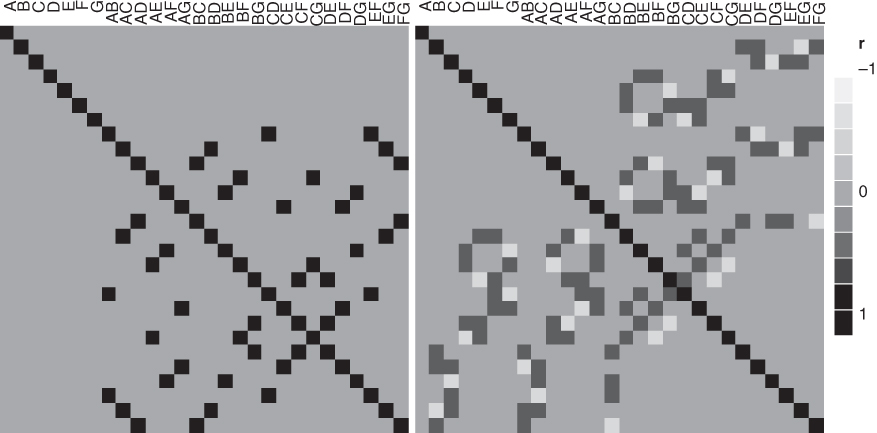

**图 9.12** 七因子设计的相关矩阵：（a）正规 $2^{7-3}$ 分式；（b）非正规无完全混杂设计

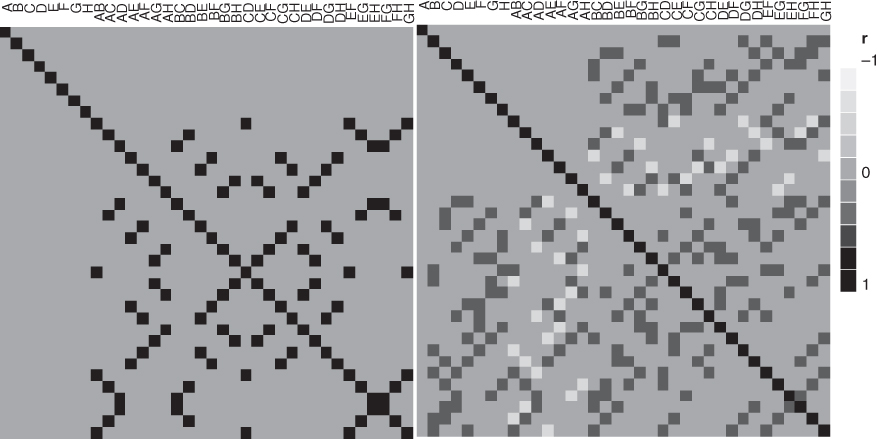

**图 9.13** 八因子设计的相关矩阵：（a）正规 $2^{8-4}$ 分式；（b）非正规无完全混杂设计

表 9.23 比较常用的正规最小偏差分辨度 IV 设计与非正规替代方案。相关矩阵方格图表明，推荐设计在完全混杂的效应对数上优于最小偏差设计，在 $E(s^2)$ 准则上也明显较好。对所有可能的非正规设计，它们还达到迹准则的最小值。避免完全混杂所付出的代价是：某些主效应与两因子交互作用之间存在相关。

**表 9.23** 各设计按评价指标的比较

<table><tr><td>因子数</td><td>设计</td><td>完全混杂的效应对数</td><td> $\mathrm{E}\left( {s}^{2}\right)$ </td><td>Trace(AA&#x27;)</td></tr><tr><td rowspan="2">6</td><td>推荐设计</td><td>0</td><td>7.31</td><td>6</td></tr><tr><td>分辨度 IV</td><td>9</td><td>10.97</td><td>0</td></tr><tr><td rowspan="2">7</td><td>推荐设计</td><td>0</td><td>10.16</td><td>6</td></tr><tr><td>分辨度 IV</td><td>21</td><td>14.20</td><td>0</td></tr><tr><td rowspan="2">8</td><td>推荐设计</td><td>0</td><td>12.80</td><td>10.5</td></tr><tr><td>分辨度 IV</td><td>42</td><td>17.07</td><td>0</td></tr></table>

### 旋涂试验

回顾第 8 章 8.7.2 节的 $2^{6-2}$ 旋涂试验：在硅片上涂布光刻胶，响应为膜厚。六个因子分别是 A＝转速、B＝加速度、C＝体积、D＝时间、E＝光刻胶黏度、F＝排气速率。原设计是正规最小偏差分式。第 8 章分析认为 A、B、C、E 的主效应及别名链 $AB+CE$ 重要。AB 与 CE 完全混杂，要消除分析歧义，必须借助额外知识、假设或试验。原研究采用完整折叠，结果表明 CE 交互作用活跃。

Jones 和 Montgomery（2010）考虑了另一种方案：表 9.20 的六因子无完全混杂设计。表 9.24 为该设计及一组模拟响应。模拟中设定 A、B、C、E 的主效应重要，且 CE 是原研究观察到 $AB+CE$ 别名链效应的真正来源；加入正态随机噪声，使拟合模型的均方根误差与原研究相当，模型参数估计也与原研究相匹配。这样得到一组较公平的模拟数据，代表若最初采用无完全混杂设计时可能观察到的结果。

Jones 和 Montgomery 将所有主效应、两因子交互作用作为候选项，用前向逐步回归分析。之所以可以考虑全部两因子交互作用，是因为其中没有任何两个完全混杂。图 9.14 给出 JMP 的逐步回归输出，最终选择 A、B、C、E 的主效应及 CE 交互作用。因此，这个无完全混杂设计无需新增试验，就明确识别出正确模型。

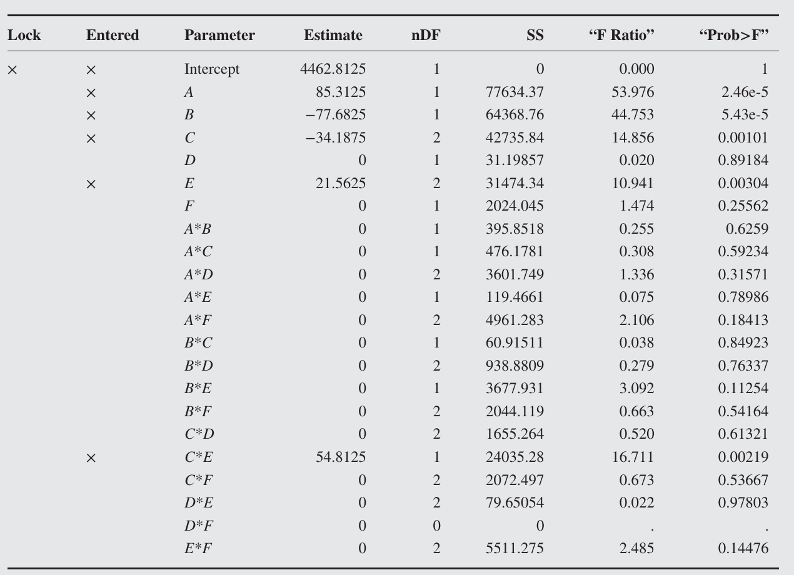

**图 9.14** 表 9.24 无完全混杂设计的 JMP 逐步回归输出

**表 9.24** 光刻胶涂布试验的无完全混杂设计及模拟数据

<table><tr><td>试验序号</td><td>A</td><td>B</td><td>C</td><td>D</td><td>E</td><td>F</td><td>膜厚</td></tr><tr><td>1</td><td>1</td><td>1</td><td>1</td><td>1</td><td>1</td><td>1</td><td>4494</td></tr><tr><td>2</td><td>1</td><td>1</td><td>-1</td><td>-1</td><td>-1</td><td>-1</td><td>4592</td></tr><tr><td>3</td><td>-1</td><td>-1</td><td>1</td><td>1</td><td>-1</td><td>-1</td><td>4357</td></tr><tr><td>4</td><td>-1</td><td>-1</td><td>-1</td><td>-1</td><td>1</td><td>1</td><td>4489</td></tr><tr><td>5</td><td>1</td><td>1</td><td>1</td><td>-1</td><td>1</td><td>-1</td><td>4513</td></tr><tr><td>6</td><td>1</td><td>1</td><td>-1</td><td>1</td><td>-1</td><td>1</td><td>4483</td></tr><tr><td>7</td><td>-1</td><td>-1</td><td>1</td><td>-1</td><td>-1</td><td>1</td><td>4288</td></tr><tr><td>8</td><td>-1</td><td>-1</td><td>-1</td><td>1</td><td>1</td><td>-1</td><td>4448</td></tr><tr><td>9</td><td>1</td><td>-1</td><td>1</td><td>1</td><td>1</td><td>-1</td><td>4691</td></tr><tr><td>10</td><td>1</td><td>-1</td><td>-1</td><td>-1</td><td>-1</td><td>1</td><td>4671</td></tr><tr><td>11</td><td>-1</td><td>1</td><td>1</td><td>1</td><td>-1</td><td>1</td><td>4219</td></tr><tr><td>12</td><td>-1</td><td>1</td><td>-1</td><td>-1</td><td>1</td><td>-1</td><td>4271</td></tr><tr><td>13</td><td>1</td><td>-1</td><td>1</td><td>-1</td><td>-1</td><td>-1</td><td>4530</td></tr><tr><td>14</td><td>1</td><td>-1</td><td>-1</td><td>1</td><td>1</td><td>1</td><td>4632</td></tr><tr><td>15</td><td>-1</td><td>1</td><td>1</td><td>-1</td><td>1</td><td>1</td><td>4337</td></tr><tr><td>16</td><td>-1</td><td>1</td><td>-1</td><td>1</td><td>-1</td><td>-1</td><td>4391</td></tr></table>

## 9.5.2 16 次试验中的 9 至 14 因子非正规分式设计

当因子数中等或较多时，分辨度 III 分式因子设计常用于因子筛选，因为这类设计的试验次数较少，且能有效识别不重要因子，并找出值得后续试验研究的潜在重要因子。16 次试验设计尤其受欢迎，因为所需试验次数通常在多数试验者可用的资源范围内。

可是，正规分辨度 III 设计使主效应与两因子交互作用完全混杂，常导致无法判断哪种效应真正重要。要消除歧义，必须增补试验（例如折叠原分式），或作出效应假设，或借助外部过程知识。与上一小节类似，可以为 9 至 14 个因子构造 16 次试验的无完全混杂设计；若只有少数主效应及两因子交互作用重要，它们可替代常规正规最小偏差分辨度 III 设计。

表 9.25 扩展表 9.19，列出 6 至 15 个因子的 16 次试验非同构非正规设计的数目。表 9.26 至 9.31 的推荐设计，是从相应 Hall 设计中选取特定列而得到的投影。它们的相关矩阵见图 9.15 至 9.20。所有推荐设计均对一阶模型正交（D 效率为 100%），主效应与两因子交互作用的非零相关系数为 $\pm0.5$。

Jones、Shinde 和 Montgomery（2015）指出，这些 16 次试验的无完全混杂设计也可以用 Jones 和 Nachtsheim（2011a）的最小别名算法构造，其目标为

$$
\min\operatorname{tr}(\mathbf A\mathbf A')
\quad\text{满足}\quad D_{\mathrm{eff}}\geq l_D.
$$

这里推荐设计的 D 效率均为 100%。他们还研究了投影性质：所有这些设计在任意三个或四个特定因子的某些投影上都存在完整因子设计结构；也存在主效应与两因子交互作用部分混杂的三因子和四因子投影。三因子投影中，没有两因子交互作用之间的完全别名；某些四因子投影则会出现这种完全别名。由于这些设计均不存在主效应与两因子交互作用的完全别名，值得作为正规分辨度 III 分式的替代方案。

**表 9.25** 16 次试验非同构非正规设计的数目

<table><tr><td>因子数</td><td>非同构设计数</td></tr><tr><td>6</td><td>27</td></tr><tr><td>7</td><td>55</td></tr><tr><td>8</td><td>80</td></tr><tr><td>9</td><td>87</td></tr><tr><td>10</td><td>78</td></tr><tr><td>11</td><td>58</td></tr><tr><td>12</td><td>36</td></tr><tr><td>13</td><td>18</td></tr><tr><td>14</td><td>10</td></tr><tr><td>15</td><td>5</td></tr></table>

**表 9.26** 推荐的九因子、16 次试验无完全混杂设计

<table><tr><td>试验序号</td><td>A</td><td>B</td><td>C</td><td>D</td><td>E</td><td>F</td><td>G</td><td>H</td><td>J</td></tr><tr><td>1</td><td>-1</td><td>-1</td><td>-1</td><td>-1</td><td>-1</td><td>-1</td><td>1</td><td>-1</td><td>1</td></tr><tr><td>2</td><td>-1</td><td>-1</td><td>-1</td><td>1</td><td>-1</td><td>1</td><td>-1</td><td>1</td><td>-1</td></tr><tr><td>3</td><td>-1</td><td>-1</td><td>1</td><td>-1</td><td>1</td><td>1</td><td>1</td><td>1</td><td>-1</td></tr><tr><td>4</td><td>-1</td><td>-1</td><td>1</td><td>1</td><td>1</td><td>-1</td><td>-1</td><td>-1</td><td>1</td></tr><tr><td>5</td><td>-1</td><td>1</td><td>-1</td><td>-1</td><td>1</td><td>1</td><td>-1</td><td>1</td><td>1</td></tr><tr><td>6</td><td>-1</td><td>1</td><td>-1</td><td>1</td><td>1</td><td>-1</td><td>1</td><td>-1</td><td>-1</td></tr><tr><td>7</td><td>-1</td><td>1</td><td>1</td><td>-1</td><td>-1</td><td>-1</td><td>-1</td><td>1</td><td>-1</td></tr><tr><td>8</td><td>-1</td><td>1</td><td>1</td><td>1</td><td>-1</td><td>1</td><td>1</td><td>-1</td><td>1</td></tr><tr><td>9</td><td>1</td><td>-1</td><td>-1</td><td>-1</td><td>1</td><td>-1</td><td>-1</td><td>-1</td><td>-1</td></tr><tr><td>10</td><td>1</td><td>-1</td><td>-1</td><td>1</td><td>1</td><td>1</td><td>1</td><td>1</td><td>1</td></tr><tr><td>11</td><td>1</td><td>-1</td><td>1</td><td>-1</td><td>-1</td><td>1</td><td>-1</td><td>-1</td><td>1</td></tr><tr><td>12</td><td>1</td><td>-1</td><td>1</td><td>1</td><td>-1</td><td>-1</td><td>1</td><td>1</td><td>-1</td></tr><tr><td>13</td><td>1</td><td>1</td><td>-1</td><td>-1</td><td>-1</td><td>1</td><td>1</td><td>-1</td><td>-1</td></tr><tr><td>14</td><td>1</td><td>1</td><td>-1</td><td>1</td><td>-1</td><td>-1</td><td>-1</td><td>1</td><td>1</td></tr><tr><td>15</td><td>1</td><td>1</td><td>1</td><td>-1</td><td>1</td><td>-1</td><td>1</td><td>1</td><td>1</td></tr><tr><td>16</td><td>1</td><td>1</td><td>1</td><td>1</td><td>1</td><td>1</td><td>-1</td><td>-1</td><td>-1</td></tr></table>

**表 9.27** 推荐的十因子、16 次试验无完全混杂设计

<table><tr><td>试验序号</td><td>A</td><td>B</td><td>C</td><td>D</td><td>E</td><td>F</td><td>G</td><td>H</td><td>J</td><td>K</td></tr><tr><td>1</td><td>-1</td><td>-1</td><td>-1</td><td>-1</td><td>1</td><td>-1</td><td>-1</td><td>1</td><td>-1</td><td>1</td></tr><tr><td>2</td><td>-1</td><td>-1</td><td>-1</td><td>1</td><td>1</td><td>1</td><td>-1</td><td>-1</td><td>1</td><td>1</td></tr><tr><td>3</td><td>-1</td><td>-1</td><td>1</td><td>-1</td><td>-1</td><td>1</td><td>1</td><td>1</td><td>1</td><td>1</td></tr><tr><td>4</td><td>-1</td><td>-1</td><td>1</td><td>-1</td><td>1</td><td>-1</td><td>1</td><td>-1</td><td>1</td><td>-1</td></tr><tr><td>5</td><td>-1</td><td>1</td><td>-1</td><td>1</td><td>-1</td><td>1</td><td>1</td><td>1</td><td>-1</td><td>1</td></tr><tr><td>6</td><td>-1</td><td>1</td><td>-1</td><td>1</td><td>1</td><td>-1</td><td>1</td><td>-1</td><td>-1</td><td>-1</td></tr><tr><td>7</td><td>-1</td><td>1</td><td>1</td><td>-1</td><td>-1</td><td>-1</td><td>-1</td><td>1</td><td>-1</td><td>-1</td></tr><tr><td>8</td><td>-1</td><td>1</td><td>1</td><td>1</td><td>-1</td><td>1</td><td>-1</td><td>-1</td><td>1</td><td>-1</td></tr><tr><td>9</td><td>1</td><td>-1</td><td>-1</td><td>-1</td><td>-1</td><td>1</td><td>1</td><td>-1</td><td>-1</td><td>-1</td></tr><tr><td>10</td><td>1</td><td>-1</td><td>-1</td><td>1</td><td>-1</td><td>-1</td><td>-1</td><td>1</td><td>1</td><td>-1</td></tr><tr><td>11</td><td>1</td><td>-1</td><td>1</td><td>1</td><td>-1</td><td>-1</td><td>1</td><td>-1</td><td>-1</td><td>1</td></tr><tr><td>12</td><td>1</td><td>-1</td><td>1</td><td>1</td><td>1</td><td>1</td><td>-1</td><td>1</td><td>-1</td><td>-1</td></tr><tr><td>13</td><td>1</td><td>1</td><td>-1</td><td>-1</td><td>-1</td><td>-1</td><td>-1</td><td>-1</td><td>1</td><td>1</td></tr><tr><td>14</td><td>1</td><td>1</td><td>-1</td><td>-1</td><td>1</td><td>1</td><td>1</td><td>1</td><td>1</td><td>-1</td></tr><tr><td>15</td><td>1</td><td>1</td><td>1</td><td>-1</td><td>1</td><td>1</td><td>-1</td><td>-1</td><td>-1</td><td>1</td></tr><tr><td>16</td><td>1</td><td>1</td><td>1</td><td>1</td><td>1</td><td>-1</td><td>1</td><td>1</td><td>1</td><td>1</td></tr></table>

**表 9.28** 推荐的十一因子、16 次试验无完全混杂设计

<table><tr><td>试验序号</td><td>A</td><td>B</td><td>C</td><td>D</td><td>E</td><td>F</td><td>G</td><td>H</td><td>J</td><td>K</td><td>L</td></tr><tr><td>1</td><td>-1</td><td>-1</td><td>-1</td><td>1</td><td>1</td><td>-1</td><td>-1</td><td>-1</td><td>1</td><td>-1</td><td>1</td></tr><tr><td>2</td><td>-1</td><td>-1</td><td>1</td><td>-1</td><td>-1</td><td>-1</td><td>1</td><td>-1</td><td>1</td><td>-1</td><td>-1</td></tr><tr><td>3</td><td>-1</td><td>-1</td><td>1</td><td>-1</td><td>1</td><td>1</td><td>-1</td><td>1</td><td>-1</td><td>-1</td><td>-1</td></tr><tr><td>4</td><td>-1</td><td>-1</td><td>1</td><td>1</td><td>-1</td><td>1</td><td>1</td><td>1</td><td>-1</td><td>1</td><td>1</td></tr><tr><td>5</td><td>-1</td><td>1</td><td>-1</td><td>-1</td><td>-1</td><td>-1</td><td>-1</td><td>-1</td><td>-1</td><td>1</td><td>1</td></tr><tr><td>6</td><td>-1</td><td>1</td><td>-1</td><td>1</td><td>-1</td><td>1</td><td>1</td><td>-1</td><td>-1</td><td>-1</td><td>-1</td></tr><tr><td>7</td><td>-1</td><td>1</td><td>-1</td><td>1</td><td>1</td><td>1</td><td>-1</td><td>1</td><td>1</td><td>1</td><td>-1</td></tr><tr><td>8</td><td>-1</td><td>1</td><td>1</td><td>-1</td><td>1</td><td>-1</td><td>1</td><td>1</td><td>1</td><td>1</td><td>1</td></tr><tr><td>9</td><td>1</td><td>-1</td><td>-1</td><td>-1</td><td>-1</td><td>1</td><td>-1</td><td>1</td><td>1</td><td>-1</td><td>1</td></tr><tr><td>10</td><td>1</td><td>-1</td><td>-1</td><td>-1</td><td>1</td><td>1</td><td>1</td><td>-1</td><td>-1</td><td>1</td><td>1</td></tr><tr><td>11</td><td>1</td><td>-1</td><td>-1</td><td>1</td><td>-1</td><td>-1</td><td>1</td><td>1</td><td>1</td><td>1</td><td>-1</td></tr><tr><td>12</td><td>1</td><td>-1</td><td>1</td><td>1</td><td>1</td><td>-1</td><td>-1</td><td>-1</td><td>-1</td><td>1</td><td>-1</td></tr><tr><td>13</td><td>1</td><td>1</td><td>-1</td><td>-1</td><td>1</td><td>-1</td><td>1</td><td>1</td><td>-1</td><td>-1</td><td>-1</td></tr><tr><td>14</td><td>1</td><td>1</td><td>1</td><td>-1</td><td>-1</td><td>1</td><td>-1</td><td>-1</td><td>1</td><td>1</td><td>-1</td></tr><tr><td>15</td><td>1</td><td>1</td><td>1</td><td>1</td><td>-1</td><td>-1</td><td>-1</td><td>1</td><td>-1</td><td>-1</td><td>1</td></tr><tr><td>16</td><td>1</td><td>1</td><td>1</td><td>1</td><td>1</td><td>1</td><td>1</td><td>-1</td><td>1</td><td>-1</td><td>1</td></tr></table>

**表 9.29** 推荐的十二因子、16 次试验无完全混杂设计

<table><tr><td>试验序号</td><td>A</td><td>B</td><td>C</td><td>D</td><td>E</td><td>F</td><td>G</td><td>H</td><td>J</td><td>K</td><td>L</td><td>M</td></tr><tr><td>1</td><td>-1</td><td>-1</td><td>-1</td><td>-1</td><td>1</td><td>-1</td><td>-1</td><td>1</td><td>1</td><td>-1</td><td>1</td><td>1</td></tr><tr><td>2</td><td>-1</td><td>-1</td><td>-1</td><td>1</td><td>-1</td><td>1</td><td>1</td><td>1</td><td>-1</td><td>-1</td><td>1</td><td>-1</td></tr><tr><td>3</td><td>-1</td><td>-1</td><td>1</td><td>-1</td><td>-1</td><td>-1</td><td>1</td><td>-1</td><td>1</td><td>1</td><td>-1</td><td>1</td></tr><tr><td>4</td><td>-1</td><td>-1</td><td>1</td><td>1</td><td>1</td><td>1</td><td>-1</td><td>-1</td><td>-1</td><td>1</td><td>-1</td><td>-1</td></tr><tr><td>5</td><td>-1</td><td>1</td><td>-1</td><td>1</td><td>-1</td><td>-1</td><td>-1</td><td>-1</td><td>-1</td><td>-1</td><td>-1</td><td>1</td></tr><tr><td>6</td><td>-1</td><td>1</td><td>-1</td><td>1</td><td>1</td><td>1</td><td>1</td><td>-1</td><td>1</td><td>1</td><td>1</td><td>1</td></tr><tr><td>7</td><td>-1</td><td>1</td><td>1</td><td>-1</td><td>-1</td><td>1</td><td>-1</td><td>1</td><td>1</td><td>-1</td><td>-1</td><td>-1</td></tr><tr><td>8</td><td>-1</td><td>1</td><td>1</td><td>-1</td><td>1</td><td>-1</td><td>1</td><td>1</td><td>-1</td><td>1</td><td>1</td><td>-1</td></tr><tr><td>9</td><td>1</td><td>-1</td><td>-1</td><td>-1</td><td>-1</td><td>1</td><td>-1</td><td>-1</td><td>1</td><td>1</td><td>1</td><td>-1</td></tr><tr><td>10</td><td>1</td><td>-1</td><td>-1</td><td>-1</td><td>1</td><td>-1</td><td>1</td><td>-1</td><td>-1</td><td>-1</td><td>-1</td><td>-1</td></tr><tr><td>11</td><td>1</td><td>-1</td><td>1</td><td>1</td><td>-1</td><td>-1</td><td>-1</td><td>1</td><td>-1</td><td>1</td><td>1</td><td>1</td></tr><tr><td>12</td><td>1</td><td>-1</td><td>1</td><td>1</td><td>1</td><td>1</td><td>1</td><td>1</td><td>1</td><td>-1</td><td>-1</td><td>1</td></tr><tr><td>13</td><td>1</td><td>1</td><td>-1</td><td>-1</td><td>-1</td><td>1</td><td>1</td><td>1</td><td>-1</td><td>1</td><td>-1</td><td>1</td></tr><tr><td>14</td><td>1</td><td>1</td><td>-1</td><td>1</td><td>1</td><td>-1</td><td>-1</td><td>1</td><td>1</td><td>1</td><td>-1</td><td>-1</td></tr><tr><td>15</td><td>1</td><td>1</td><td>1</td><td>-1</td><td>1</td><td>1</td><td>-1</td><td>-1</td><td>-1</td><td>-1</td><td>1</td><td>1</td></tr><tr><td>16</td><td>1</td><td>1</td><td>1</td><td>1</td><td>-1</td><td>-1</td><td>1</td><td>-1</td><td>1</td><td>-1</td><td>1</td><td>-1</td></tr></table>

**表 9.30** 推荐的十三因子、16 次试验无完全混杂设计

<table><tr><td>试验序号</td><td>A</td><td>B</td><td>C</td><td>D</td><td>E</td><td>F</td><td>G</td><td>H</td><td>J</td><td>K</td><td>L</td><td>M</td><td>N</td></tr><tr><td>1</td><td>-1</td><td>-1</td><td>-1</td><td>1</td><td>1</td><td>-1</td><td>-1</td><td>1</td><td>-1</td><td>1</td><td>1</td><td>-1</td><td>1</td></tr><tr><td>2</td><td>-1</td><td>-1</td><td>1</td><td>-1</td><td>-1</td><td>-1</td><td>-1</td><td>-1</td><td>1</td><td>1</td><td>-1</td><td>-1</td><td>1</td></tr><tr><td>3</td><td>-1</td><td>-1</td><td>1</td><td>-1</td><td>1</td><td>1</td><td>1</td><td>1</td><td>1</td><td>-1</td><td>1</td><td>-1</td><td>-1</td></tr><tr><td>4</td><td>-1</td><td>-1</td><td>1</td><td>1</td><td>-1</td><td>1</td><td>1</td><td>1</td><td>-1</td><td>1</td><td>-1</td><td>1</td><td>-1</td></tr><tr><td>5</td><td>-1</td><td>1</td><td>-1</td><td>-1</td><td>-1</td><td>1</td><td>-1</td><td>-1</td><td>-1</td><td>-1</td><td>1</td><td>-1</td><td>-1</td></tr><tr><td>6</td><td>-1</td><td>1</td><td>-1</td><td>-1</td><td>1</td><td>1</td><td>1</td><td>-1</td><td>-1</td><td>1</td><td>-1</td><td>1</td><td>1</td></tr><tr><td>7</td><td>-1</td><td>1</td><td>-1</td><td>1</td><td>-1</td><td>-1</td><td>1</td><td>1</td><td>1</td><td>-1</td><td>1</td><td>1</td><td>1</td></tr><tr><td>8</td><td>-1</td><td>1</td><td>1</td><td>1</td><td>1</td><td>-1</td><td>-1</td><td>-1</td><td>1</td><td>-1</td><td>-1</td><td>1</td><td>-1</td></tr><tr><td>9</td><td>1</td><td>-1</td><td>-1</td><td>-1</td><td>-1</td><td>-1</td><td>1</td><td>-1</td><td>1</td><td>1</td><td>1</td><td>1</td><td>-1</td></tr><tr><td>10</td><td>1</td><td>-1</td><td>-1</td><td>-1</td><td>1</td><td>-1</td><td>-1</td><td>1</td><td>-1</td><td>-1</td><td>-1</td><td>1</td><td>-1</td></tr><tr><td>11</td><td>1</td><td>-1</td><td>-1</td><td>1</td><td>1</td><td>1</td><td>1</td><td>-1</td><td>1</td><td>-1</td><td>-1</td><td>-1</td><td>1</td></tr><tr><td>12</td><td>1</td><td>-1</td><td>1</td><td>1</td><td>-1</td><td>1</td><td>-1</td><td>-1</td><td>-1</td><td>-1</td><td>1</td><td>1</td><td>1</td></tr><tr><td>13</td><td>1</td><td>1</td><td>-1</td><td>1</td><td>-1</td><td>1</td><td>-1</td><td>1</td><td>1</td><td>1</td><td>-1</td><td>-1</td><td>-1</td></tr><tr><td>14</td><td>1</td><td>1</td><td>1</td><td>-1</td><td>-1</td><td>-1</td><td>1</td><td>1</td><td>-1</td><td>-1</td><td>-1</td><td>-1</td><td>1</td></tr><tr><td>15</td><td>1</td><td>1</td><td>1</td><td>-1</td><td>1</td><td>1</td><td>-1</td><td>1</td><td>1</td><td>1</td><td>1</td><td>1</td><td>1</td></tr><tr><td>16</td><td>1</td><td>1</td><td>1</td><td>1</td><td>1</td><td>-1</td><td>1</td><td>-1</td><td>-1</td><td>1</td><td>1</td><td>-1</td><td>-1</td></tr></table>

**表 9.31** 推荐的十四因子、16 次试验无完全混杂设计

<table><tr><td>试验序号</td><td>A</td><td>B</td><td>C</td><td>D</td><td>E</td><td>F</td><td>G</td><td>H</td><td>J</td><td>K</td><td>L</td><td>M</td><td>N</td><td>P</td></tr><tr><td>1</td><td>-1</td><td>-1</td><td>-1</td><td>-1</td><td>1</td><td>-1</td><td>1</td><td>1</td><td>-1</td><td>1</td><td>1</td><td>-1</td><td>-1</td><td>1</td></tr><tr><td>2</td><td>-1</td><td>-1</td><td>-1</td><td>1</td><td>-1</td><td>-1</td><td>1</td><td>-1</td><td>1</td><td>1</td><td>-1</td><td>1</td><td>1</td><td>-1</td></tr><tr><td>3</td><td>-1</td><td>-1</td><td>1</td><td>-1</td><td>-1</td><td>1</td><td>-1</td><td>1</td><td>1</td><td>1</td><td>-1</td><td>-1</td><td>1</td><td>1</td></tr><tr><td>4</td><td>-1</td><td>-1</td><td>1</td><td>1</td><td>1</td><td>1</td><td>1</td><td>-1</td><td>-1</td><td>-1</td><td>1</td><td>-1</td><td>1</td><td>-1</td></tr><tr><td>5</td><td>-1</td><td>1</td><td>-1</td><td>-1</td><td>-1</td><td>1</td><td>1</td><td>-1</td><td>1</td><td>-1</td><td>1</td><td>1</td><td>-1</td><td>1</td></tr><tr><td>6</td><td>-1</td><td>1</td><td>-1</td><td>1</td><td>1</td><td>1</td><td>-1</td><td>1</td><td>-1</td><td>1</td><td>-1</td><td>1</td><td>-1</td><td>-1</td></tr><tr><td>7</td><td>-1</td><td>1</td><td>1</td><td>-1</td><td>-1</td><td>-1</td><td>-1</td><td>1</td><td>-1</td><td>-1</td><td>1</td><td>1</td><td>1</td><td>-1</td></tr><tr><td>8</td><td>-1</td><td>1</td><td>1</td><td>1</td><td>1</td><td>-1</td><td>-1</td><td>-1</td><td>1</td><td>-1</td><td>-1</td><td>-1</td><td>-1</td><td>1</td></tr><tr><td>9</td><td>1</td><td>-1</td><td>-1</td><td>-1</td><td>1</td><td>1</td><td>-1</td><td>-1</td><td>-1</td><td>-1</td><td>-1</td><td>1</td><td>1</td><td>1</td></tr><tr><td>10</td><td>1</td><td>-1</td><td>-1</td><td>1</td><td>-1</td><td>1</td><td>-1</td><td>1</td><td>1</td><td>-1</td><td>1</td><td>-1</td><td>-1</td><td>-1</td></tr><tr><td>11</td><td>1</td><td>-1</td><td>1</td><td>-1</td><td>1</td><td>-1</td><td>-1</td><td>-1</td><td>1</td><td>1</td><td>1</td><td>1</td><td>-1</td><td>-1</td></tr><tr><td>12</td><td>1</td><td>-1</td><td>1</td><td>1</td><td>-1</td><td>-1</td><td>1</td><td>1</td><td>-1</td><td>-1</td><td>-1</td><td>1</td><td>-1</td><td>1</td></tr><tr><td>13</td><td>1</td><td>1</td><td>-1</td><td>-1</td><td>1</td><td>-1</td><td>1</td><td>1</td><td>1</td><td>-1</td><td>-1</td><td>-1</td><td>1</td><td>-1</td></tr><tr><td>14</td><td>1</td><td>1</td><td>-1</td><td>1</td><td>-1</td><td>-1</td><td>-1</td><td>-1</td><td>-1</td><td>1</td><td>1</td><td>-1</td><td>1</td><td>1</td></tr><tr><td>15</td><td>1</td><td>1</td><td>1</td><td>-1</td><td>-1</td><td>1</td><td>1</td><td>-1</td><td>-1</td><td>1</td><td>-1</td><td>-1</td><td>-1</td><td>-1</td></tr><tr><td>16</td><td>1</td><td>1</td><td>1</td><td>1</td><td>1</td><td>1</td><td>1</td><td>1</td><td>1</td><td>1</td><td>1</td><td>1</td><td>1</td><td>1</td></tr></table>

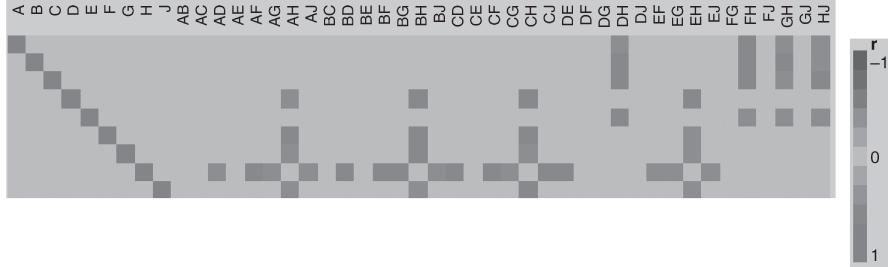

**图 9.15** 九因子无完全混杂设计中主效应与两因子交互作用的相关性

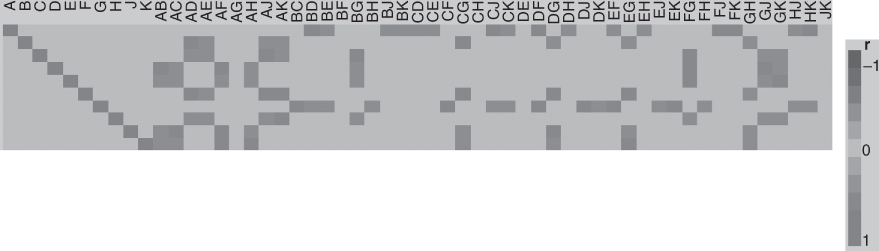

**图 9.16** 十因子无完全混杂设计中主效应与两因子交互作用的相关性

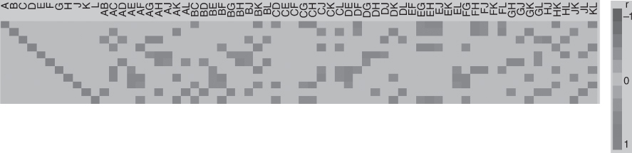

**图 9.17** 十一因子无完全混杂设计中主效应与两因子交互作用的相关性

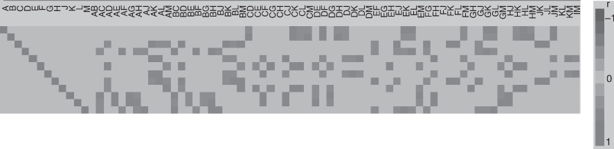

**图 9.18** 十二因子无完全混杂设计中主效应与两因子交互作用的相关性

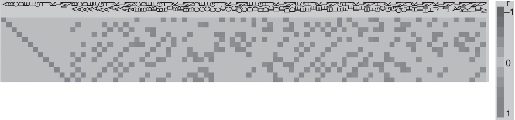

**图 9.19** 十三因子无完全混杂设计中主效应与两因子交互作用的相关性

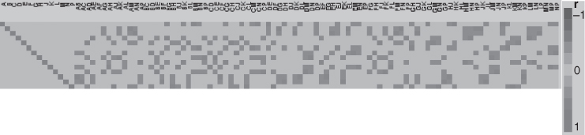

**图 9.20** 十四因子无完全混杂设计中主效应与两因子交互作用的相关性

## 9.5.3 非正规分式因子设计的分析

9.5.1 节用前向选择回归分析了一个六因子、16 次试验的无完全混杂设计，成功找到了正确模型。一般而言，前向选择回归很适合分析非正规设计，在不同情形下还可采用几种变式。

先明确可能关注的模型。假定主效应和两因子交互作用可能重要，而更高阶交互作用可忽略。交互作用可能满足**强遗传性**（也称层级原则）：只有 A、B 两个主效应都在模型中，AB 才纳入模型。实际中这很常见，故分析非正规设计时，假定模型具有强遗传性通常合理。也可能只满足**弱遗传性**：A、B 只要有一个在模型中，就允许纳入 AB。这也比较常见；如果忽略它，可能漏掉较大的交互作用。还有一种较少见的情形：AB 活跃，但 A、B 两个主效应都不活跃。

前向选择回归可采用以下方式：

1. 不要求模型具有层级性，直接进行前向选择；但可能纳入过多交互作用。
2. 只允许满足强遗传性的模型。若选中 AB 而 A、B 尚未进入模型，就把 A、B、AB 整组纳入。
3. 对变量进入模型采用比常用默认值更宽的 $P$ 值门槛。许多软件默认 $P=0.05$，对筛选试验可能过于严格；0.10，甚至 0.15 可能更合适。筛选试验最担心漏掉重要效应，即第二类错误，因此通常相对不那么担心第一类错误。
4. 分两步选择：先从所有主效应中选择，再从与第一步所选主效应满足弱遗传性的两因子交互作用中进行第二次前向选择。
5. 将经验或过程知识提示的重要两因子交互作用也纳入候选项。

另一种方法是使用**所有可能模型回归**的某种变式：拟合特定规模的所有模型，例如所有单因子模型、所有双因子模型，再根据较小的误差均方、强或弱遗传性，或调整后 $R^2$ 的显著增加，缩小待进一步考虑的模型集合。广义回归方法也可能有用。Krishnamoorthy、Montgomery、Jones 和 Borror（2015）演示了用 Dantzig 选择器分析六至八因子的无完全混杂设计。

许多非正规设计具有有用的投影性质，可据此选择分析方法。例如，12 次试验的 Plackett–Burman 设计，在任选四个因子的投影上，支持拟合全部主效应与两因子交互作用的模型。若至多四个主效应看起来较大，就可以针对这四个疑似活跃因子拟合包含主效应和两因子交互作用的模型。同时，最终模型仍可考虑其他候选交互作用。

[^1]: 译者注：第 6 次试验的 G 列在第 9 版原表中印为 1，译表照录；后文表 9.20 使用的是 D、E、H、K、M、Q 列。
