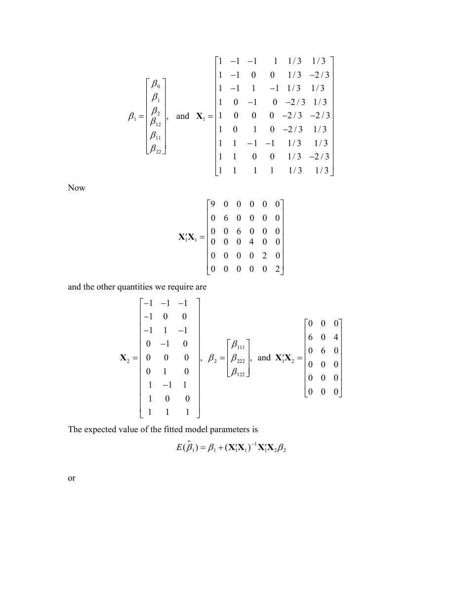

# 第 9 章补充材料

## S9.1 三水平因子设计的 Yates 算法

现在分析因子设计及其分式设计几乎总是使用计算机。不过，Yates 算法也可以改造后用于 $3^k$ 因子设计。这里用例 5.1 的数据说明。原始数据见表 5.1：材料类型 $A$ 与温度 $B$ 各有三个水平，研究它们对电池寿命的影响，每个处理组合重复 $n=4$ 次。

表 1 按标准顺序列出处理组合：逐个引入因子，将新因子的每个水平依次与此前全部水平组合配对。例如，$3^3$ 设计的顺序为 $000,100,200,010,110,210,020,120,220,001,\ldots$。“响应”列是相应处理组合下四次观测的总和。

计算第（1）列时，对“响应”列连续三个数为一组：每组的三数之和放入第一个三分之一；第三个数减第一个数所得的线性分量放入第二个三分之一；第一个数加第三个数、再减去第二个数的两倍所得的二次分量放入最后一个三分之一。例如，第（1）列第 2、5、8 项分别为 $229+479+583=1291$、$-229+583=354$ 和 $229-2(479)+583=-146$。第（2）列由第（1）列用同样方法求得。一般的 $3^k$ 设计要计算 $k$ 列。

“效应”列由左侧处理组合的编码转换得到。例如，$10$ 表示 $A$ 的线性效应 $A_L$；$11$ 表示 $AB$ 交互作用中的 $A_LB_L$ 分量。除数按 $2^r3^tn$ 计算，其中 $r$ 是该效应涉及的因子数，$t$ 是试验因子总数减去该效应中线性分量的个数，$n$ 是重复次数。例如 $B_L$ 的除数为 $2^1 3^1\times4=24$。把第（2）列中的相应元素平方再除以除数，即得效应平方和。

**表 1　例 5.1 中 $3^2$ 设计的 Yates 算法**[^1]

| 处理组合 | 响应合计 | （1） | （2） | 效应 | 除数 | 平方和 |
| :---: | ---: | ---: | ---: | :---: | :---: | ---: |
| 00 | 539 | 1738 | 3799 | — | — | — |
| 10 | 623 | 1291 | 503 | $A_L$ | 24 | 10542.04 |
| 20 | 576 | 770 | −101 | $A_Q$ | 72 | 141.68 |
| 01 | 229 | 37 | −968 | $B_L$ | 24 | 39042.67 |
| 11 | 479 | 354 | 75 | $A_LB_L$ | 16 | 351.56 |
| 21 | 583 | 112 | 307 | $A_QB_L$ | 48 | 1963.52 |
| 02 | 230 | −131 | −74 | $B_Q$ | 72 | 76.06 |
| 12 | 198 | −146 | −559 | $A_LB_Q$ | 48 | 6510.02 |
| 22 | 342 | 176 | 337 | $A_QB_Q$ | 144 | 788.67 |

若 $A$、$B$ 都是定量因子，“平方和”列便给出了方差分析所需的各分量。但本例的材料类型 $A$ 是定性因子，因此将它拆成线性与二次分量并无实际解释意义。总平方和由各个原始观测计算，误差平方和用差减法求得。分析结果见表 2，与例 5.1 的常规方差分析结果基本一致。

**表 2　例 5.1 的 $3^2$ 设计方差分析**[^2]

| 变异来源 | 平方和 | 自由度 | 均方 | $F_0$ | $P$ 值 |
| --- | ---: | ---: | ---: | ---: | ---: |
| $A=A_L+A_Q$ | 10683.72 | 2 | 5341.86 | 7.91 | 0.0020 |
| $B$，温度 | 39118.72 | 2 | 19559.36 | 28.97 | <0.0001 |
| $B_L$ | （39042.67） | （1） | 39042.67 | 57.82 | <0.0001 |
| $B_Q$ | （76.06） | （1） | 76.06 | 0.12 | 0.7314 |
| $AB$ | 9613.78 | 4 | 2403.44 | 3.576 | 0.0186 |
| $A\times B_L$ | （2315.08） | （2） | 1157.54 | 1.71 | 0.1999 |
| $A\times B_Q$ | （7298.70） | （2） | 3649.35 | 5.41 | 0.0106 |
| 误差 | 18230.75 | 27 | 675.21 | — | — |
| 总计 | 77646.97 | 35 | — | — | — |

## S9.2 三水平与混合水平设计的别名关系

第 8 章介绍过求分式因子设计别名关系的一般方法。对于三水平或混合水平设计，可以使用模型的多项式（回归）表示。设拟合模型为

$$
\mathbf y=\mathbf X_1\boldsymbol\beta_1+\boldsymbol\varepsilon,
\qquad
\hat{\boldsymbol\beta}_1=(\mathbf X_1'\mathbf X_1)^{-1}\mathbf X_1'\mathbf y,
$$

其中 $\mathbf y$ 为 $n\times1$ 响应向量，$\mathbf X_1$ 为按拟合模型展开的 $n\times p_1$ 设计矩阵，$\boldsymbol\beta_1$ 为 $p_1\times1$ 参数向量。假设真实模型还包含拟合模型之外的项：

$$
\mathbf y=\mathbf X_1\boldsymbol\beta_1+\mathbf X_2\boldsymbol\beta_2+\boldsymbol\varepsilon.
$$

这里 $\mathbf X_2$ 为 $n\times p_2$ 矩阵，$\boldsymbol\beta_2$ 为相应参数。于是

$$
E(\hat{\boldsymbol\beta}_1)
=\boldsymbol\beta_1+(\mathbf X_1'\mathbf X_1)^{-1}\mathbf X_1'\mathbf X_2\boldsymbol\beta_2
=\boldsymbol\beta_1+\mathbf A\boldsymbol\beta_2.
$$

$\mathbf A=(\mathbf X_1'\mathbf X_1)^{-1}\mathbf X_1'\mathbf X_2$ 称为**别名矩阵**；它的元素说明拟合模型的各参数与遗漏项如何混杂。下面给出两个例子。

### 例 1　三水平设计的二次拟合模型

对一个 $3^2$ 设计，拟合完整二次模型

$$
y=\beta_0+\beta_1x_1+\beta_2x_2+\beta_{12}x_1x_2
+\beta_{11}(x_1^2-\overline{x_1^2})
+\beta_{22}(x_2^2-\overline{x_2^2})+\varepsilon.
$$

减去平方项的均值，是为了使这两项与截距正交。若真实模型另外包含 $\beta_{111}x_1^3+\beta_{222}x_2^3+\beta_{122}x_1x_2^2$，则由各处理组合构造 $\mathbf X_1$ 和 $\mathbf X_2$，再计算别名矩阵。原补充材料中间矩阵较长，保留原页以便核对：

计算结果为[^3]

$$
\mathbf A=
\begin{bmatrix}
0&0&0\\
1&0&2/3\\
0&1&0\\
0&0&0\\
0&0&0\\
0&0&0
\end{bmatrix},
$$

其行依次对应 $\beta_0,\beta_1,\beta_2,\beta_{12},\beta_{11},\beta_{22}$，列依次对应 $\beta_{111},\beta_{222},\beta_{122}$。因此 $E(\hat\beta_1)=\beta_1+\beta_{111}+(2/3)\beta_{122}$，$E(\hat\beta_2)=\beta_2+\beta_{222}$；其余四个估计量的期望等于相应的原参数。

### 例 2　混合水平分式因子设计

考虑教材表 9.10 中的混合水平设计，它容纳四个二水平因子和一个三水平因子。相应的分辨度 III 分式见表 3。

**表 3　混合水平分辨度 III 分式因子设计**

| $x_1$ | $x_2$ | $x_3$ | $x_4$ | $x_5$ |
| ---: | ---: | ---: | ---: | ---: |
| −1 | 1 | 1 | −1 | −1 |
| 1 | −1 | −1 | 1 | −1 |
| −1 | −1 | 1 | 1 | 0 |
| 1 | 1 | −1 | −1 | 0 |
| −1 | 1 | −1 | 1 | 0 |
| 1 | −1 | 1 | −1 | 0 |
| −1 | −1 | −1 | −1 | 1 |
| 1 | 1 | 1 | 1 | 1 |

分辨度 III 设计通常先拟合主效应模型

$$
y=\beta_0+\sum_{i=1}^{5}\beta_i x_i
+\beta_{55}(x_5^2-\overline{x_5^2})+\varepsilon.
$$

其中 $\beta_5x_5$ 与 $\beta_{55}(x_5^2-\overline{x_5^2})$ 分别表示三水平因子 $x_5$ 的线性与二次效应；二次项已与截距正交。现在假定真实模型还包含 $\beta_{12}x_1x_2+\beta_{15}x_1x_5+\beta_{155}x_1(x_5^2-\overline{x_5^2})$。应用上述方法得

$$
\mathbf A=
\begin{bmatrix}
0&0&0\\
0&0&0\\
0&1/2&0\\
0&1/2&0\\
0&0&1/2\\
1&0&0\\
0&0&0
\end{bmatrix}.
$$

行依次对应 $\beta_0,\beta_1,\beta_2,\beta_3,\beta_4,\beta_5,\beta_{55}$，列依次对应 $\beta_{12},\beta_{15},\beta_{155}$。于是

$$
\begin{aligned}
E(\hat\beta_2)&=\beta_2+\tfrac12\beta_{15},&
E(\hat\beta_3)&=\beta_3+\tfrac12\beta_{15},\\
E(\hat\beta_4)&=\beta_4+\tfrac12\beta_{155},&
E(\hat\beta_5)&=\beta_5+\beta_{12}.
\end{aligned}
$$

$\hat\beta_0,\hat\beta_1,\hat\beta_{55}$ 没有这些遗漏项造成的偏倚。也就是说，$x_1$ 与 $x_5$ 交互作用的线性分量分别与 $x_2,x_3$ 的主效应混杂[^3]，二次分量与 $x_4$ 的主效应混杂；$x_1x_2$ 与 $x_5$ 的线性主效应混杂。

## S9.3 三水平设计平方和分解的进一步讨论

本节材料由奥本大学的 Saeed Maghsoodloo 教授提出并整理；作者在原文中向他致谢。

在平衡的 $b^k$ 因子设计中（本章主要取 $b=3$），可以把一个效应定义为恰好占据设计矩阵的一列，因此它恰有 $b-1$ 个自由度。这是因为该列包含 $0,1,\ldots,b-1$ 共 $b$ 个水平。例如，平衡的 $2^3$ 设计有 $A,B,C,AB,AC,BC,ABC$ 七个效应，每个效应占一列、具有 1 个自由度（参见表 6.3）。等间距的平衡 $3^2$ 设计则有 $A,B,AB,AB^2$ 四个效应，每个具有 2 个自由度。表 9.4 中，九个因子水平组合共提供 8 个用于研究正交效应的自由度，恰好分给这四列。

**表 4　与教材表 9.4 对应的设计矩阵（模 3 运算）**

| $A$ | $B$ | $AB=A+B$ | $AB^2=A+2B$ | 处理组合 | 观测值 |
| ---: | ---: | ---: | ---: | :---: | :---: |
| 0 | 0 | 0 | 0 | 00 | −2，−1 |
| 0 | 1 | 1 | 2 | 01 | −3，0 |
| 0 | 2 | 2 | 1 | 02 | 2，3 |
| 1 | 0 | 1 | 1 | 10 | 0，2 |
| 1 | 1 | 2 | 0 | 11 | 1，3 |
| 1 | 2 | 0 | 2 | 12 | 4，6 |
| 2 | 0 | 2 | 2 | 20 | −1，0 |
| 2 | 1 | 0 | 1 | 21 | 5，6 |
| 2 | 2 | 1 | 0 | 22 | 0，−1 |

$A$、$B$ 两列可以先按规定的水平顺序写出；第三列由前两列之和模 3 得到，第四列由 $A+2B$ 模 3 得到。将 $A\times B$ 交互作用按 $AB$、$AB^2$ 正交分解，适用于定性因子，或水平等间距的定量因子。若三水平定量因子的水平间距不等，且不能通过变换使其等间距，就不能按这种方式作正交分解。

在二水平设计中，定量因子的低、高水平常编码为 $-1,+1$；相应的线性对比系数也是 $-1,+1$。若用模 2 运算表示水平，则编码为 $0,1$。定性因子的两种水平中哪一种编为 0，可以任意选择。在三水平设计中，定量因子可同时研究线性与二次效应。平衡三水平设计的线性、二次对比向量分别为

$$
\mathbf L_3=(-1,0,1)',\qquad \mathbf Q_3=(1,-2,1)'.
$$

二者内积为零，故相互正交。

三水平设计的 $A\times B$ 交互作用有 $2\times2=4$ 个自由度，可以分为两个各占 2 个自由度的正交分量 $AB$ 与 $AB^2$。与此不同，二水平设计中的 $A\times B$ 交互作用只占 1 个自由度，通常直接记为 $AB$。因此，三水平设计里的 $AB$ 只是整个 $A\times B$ 交互作用的一部分。这个构造可推广到水平数为素数的设计。例如，五水平设计的 $A\times B$ 有 16 个自由度；若各因子为定性或等间距定量因子，它可以分解成 $AB,AB^2,AB^3,AB^4$ 四个正交分量，每个占 4 个自由度。计算时分别使用模 3、模 5 运算和对应的对比函数。

当水平数不是素数（例如 4 或 6）时，不能直接照搬上述模素数分解。例如，四水平设计中 $A\times B$ 的 9 个自由度不能按模 4 加法正交拆成 $AB,AB^2,AB^3$ 各 3 个自由度；相应列并不构成正交的加性分解。要在这类设计中安排区组混杂或构造分式设计，需要采用**伪因子**等方法。

一般地，若 $b$ 为素数，平衡 $b^k$ 因子设计共有

$$
\frac{b^k-1}{b-1}=\sum_{j=0}^{k-1}b^j
$$

个正交效应（或列），每列占 $b-1$ 个自由度。设计矩阵中只有 $k$ 个主因子列可直接规定，其余列由对比函数和模 $b$ 运算构造。例如，$2^5$ 设计有 31 个一自由度的效应；$3^3$ 设计有 13 个二自由度的效应：

$$
A,B,C,AB,AB^2,AC,AC^2,BC,BC^2,
ABC,AB^2C,ABC^2,AB^2C^2.
$$

该设计有 $27$ 个不同的因子水平组合，却只有这 $13$ 个正交效应列。类似地，$5^2$ 设计有 25 个组合、24 个可用于模型效应的自由度，分为 $A,B,AB,AB^2,AB^3,AB^4$ 六列，每列占 4 个自由度。

模运算的对比函数例如：二水平的 $\xi(AB)=x_1+x_2\pmod 2$；三水平的 $\xi(AB^2C)=x_1+2x_2+x_3\pmod 3$；五水平的 $\xi(AB^3)=x_1+3x_2\pmod 5$。它们的结果分别只可能是 $0,1$；$0,1,2$；以及 $0,1,2,3,4$。

教材表 9.1 数据的 $3^3$ 设计矩阵见表 5。前三列为 $A,B,C$，其余十列均由 $\xi=a_1x_1+a_2x_2+a_3x_3\pmod 3$ 构造，系数按相应效应选择。例如 $ABC^2$ 列取 $\xi=x_1+x_2+2x_3$；该列第 20 行为 $2+0+2(1)\equiv1\pmod 3$。原表跨两页，译表按其前三列及模 3 规则重排了全部 27 行。

**表 5　例 9.1 的 $3^3$ 因子设计矩阵**

| A | B | C | AB | AB² | AC | AC² | BC | BC² | ABC | AB²C | ABC² | AB²C² | 响应 |
| ---: || ---: || ---: || ---: || ---: || ---: || ---: || ---: || ---: || ---: || ---: || ---: || ---: || ---: |
| 0 | 0 | 0 | 0 | 0 | 0 | 0 | 0 | 0 | 0 | 0 | 0 | 0 | -60 |
| 0 | 0 | 1 | 0 | 0 | 1 | 2 | 1 | 2 | 1 | 1 | 2 | 2 | 185 |
| 0 | 0 | 2 | 0 | 0 | 2 | 1 | 2 | 1 | 2 | 2 | 1 | 1 | 9 |
| 0 | 1 | 0 | 1 | 2 | 0 | 0 | 1 | 1 | 1 | 2 | 1 | 2 | -105 |
| 0 | 1 | 1 | 1 | 2 | 1 | 2 | 2 | 0 | 2 | 0 | 0 | 1 | 20 |
| 0 | 1 | 2 | 1 | 2 | 2 | 1 | 0 | 2 | 0 | 1 | 2 | 0 | -70 |
| 0 | 2 | 0 | 2 | 1 | 0 | 0 | 2 | 2 | 2 | 1 | 2 | 1 | -25 |
| 0 | 2 | 1 | 2 | 1 | 1 | 2 | 0 | 1 | 0 | 2 | 1 | 0 | 134 |
| 0 | 2 | 2 | 2 | 1 | 2 | 1 | 1 | 0 | 1 | 0 | 0 | 2 | 67 |
| 1 | 0 | 0 | 1 | 1 | 1 | 1 | 0 | 0 | 1 | 1 | 1 | 1 | 41 |
| 1 | 0 | 1 | 1 | 1 | 2 | 0 | 1 | 2 | 2 | 2 | 0 | 0 | 175 |
| 1 | 0 | 2 | 1 | 1 | 0 | 2 | 2 | 1 | 0 | 0 | 2 | 2 | -28 |
| 1 | 1 | 0 | 2 | 0 | 1 | 1 | 1 | 1 | 2 | 0 | 2 | 0 | -123 |
| 1 | 1 | 1 | 2 | 0 | 2 | 0 | 2 | 0 | 0 | 1 | 1 | 2 | -99 |
| 1 | 1 | 2 | 2 | 0 | 0 | 2 | 0 | 2 | 1 | 2 | 0 | 1 | -126 |
| 1 | 2 | 0 | 0 | 2 | 1 | 1 | 2 | 2 | 0 | 2 | 0 | 2 | 24 |
| 1 | 2 | 1 | 0 | 2 | 2 | 0 | 0 | 1 | 1 | 0 | 2 | 1 | 154 |
| 1 | 2 | 2 | 0 | 2 | 0 | 2 | 1 | 0 | 2 | 1 | 1 | 0 | -51 |
| 2 | 0 | 0 | 2 | 2 | 2 | 2 | 0 | 0 | 2 | 2 | 2 | 2 | -74 |
| 2 | 0 | 1 | 2 | 2 | 0 | 1 | 1 | 2 | 0 | 0 | 1 | 1 | 203 |
| 2 | 0 | 2 | 2 | 2 | 1 | 0 | 2 | 1 | 1 | 1 | 0 | 0 | -85 |
| 2 | 1 | 0 | 0 | 1 | 2 | 2 | 1 | 1 | 0 | 1 | 0 | 1 | -122 |
| 2 | 1 | 1 | 0 | 1 | 0 | 1 | 2 | 0 | 1 | 2 | 2 | 0 | -54 |
| 2 | 1 | 2 | 0 | 1 | 1 | 0 | 0 | 2 | 2 | 0 | 1 | 2 | -113 |
| 2 | 2 | 0 | 1 | 0 | 2 | 2 | 2 | 2 | 1 | 0 | 1 | 0 | -15 |
| 2 | 2 | 1 | 1 | 0 | 0 | 1 | 0 | 1 | 2 | 1 | 0 | 2 | 245 |
| 2 | 2 | 2 | 1 | 0 | 1 | 0 | 1 | 0 | 0 | 2 | 2 | 1 | 58 |

以 $A\times C$ 的平方和为例。按表 5 的 $AC^2$ 列，将响应分为三个水平组，总和分别是 $(AC^2)_0=-100$、$(AC^2)_1=342$、$(AC^2)_2=-77$，总响应和为 165。因此

$$
SS(AC^2)=\frac{(-100)^2+342^2+(-77)^2}{18}-\frac{165^2}{54}=6878.7778.
$$

类似地，按 $AC$ 列得到三个组总和 $-1,141,25$，于是

$$
SS(AC)=\frac{(-1)^2+141^2+25^2}{18}-\frac{165^2}{54}=635.1111.
$$

直接用表 6 的 $A\times C$ 交叉分类结果，减去 $A$、$C$ 的主效应平方和[^4]，也可算出四自由度交互作用的平方和 $SS(A\times C)=7513.8889$。这恰等于 $SS(AC)+SS(AC^2)$，验证了上述正交分解。

**表 6　$A\times C$ 交互作用各组合的响应合计**

| 因子 $A$ | $C=10$ psi | $C=20$ psi | $C=30$ psi |
| --- | ---: | ---: | ---: |
| 类型 1 | −190 | 339 | 6 |
| 类型 2 | −58 | 230 | −205 |
| 类型 3 | −211 | 394 | −140 |

同样，利用表 5 的 $ABC^2$ 列，三个组总和分别为 138、4、23，得到

$$
SS(ABC^2)=\frac{138^2+4^2+23^2}{18}-\frac{165^2}{54}=584.1111.
$$

另外三个分量分别为 $SS(ABC)=18.7778$、$SS(AB^2C)=221.7778$、$SS(AB^2C^2)=3804.1111$。四项之和为 $4628.7778$。由模型平方和扣除 $A,B,C$ 三个主效应和 $A\times B,A\times C,B\times C$ 三个二因子交互作用的平方和，也得到

$$
\begin{aligned}
SS(A\times B\times C)
&=162587.3333-993.7778-61190.3333-69105.3333\\
&\quad-6300.8889-7513.8889-12854.3333\\
&=4628.7778.
\end{aligned}
$$

这说明 $ABC,AB^2C,ABC^2,AB^2C^2$ 是三因子交互作用的四个正交分量。[^5]完整方差分析见教材表 9.2。

[^1]: 译者注：原 PDF 的表 1 将 $B_Q$ 平方和印成 76.96；按 $(-74)^2/72$ 应为 76.06，也与表 2 的温度平方和一致，译表据此修正。

[^2]: 译者注：原表 2 中 $B$ 的均方印为 19558.36，按 $39118.72/2$ 应为 19559.36；$A\times B_Q$ 的均方印为 3649.75，按 $7298.70/2$ 应为 3649.35。译表据计算修正；个别分量的末位与表 1 相差 0.01，属于四舍五入差异。

[^3]: 译者注：原文将线性与二次交互作用分量和 $x_2,x_3,x_4$ 主效应的混杂关系合并表述；上面的别名矩阵给出了各项的具体对应关系。

[^4]: 译者注：原文在 $A\times C$ 的差减公式中，把应扣除的 $SS(C)=69105.3333$ 标作 $SS(B)$；后文又给出 $SS(B)=61190.3333$。译文按数值与因子对应关系修正。

[^5]: 译者注：原文将 $A\times B\times C$ 称为“二阶交互作用”；译文按因子个数称“三因子交互作用”。部分小数末位按原式四舍五入。
