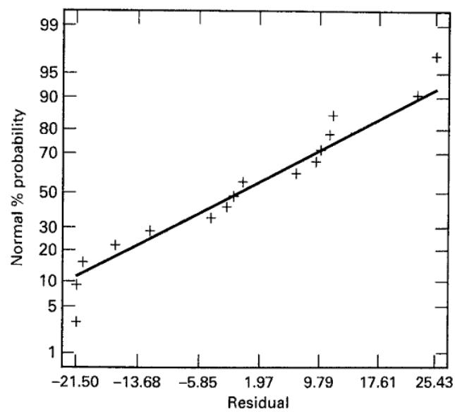
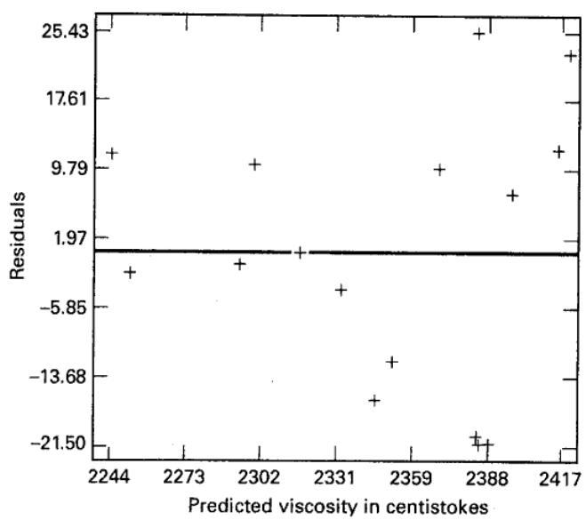
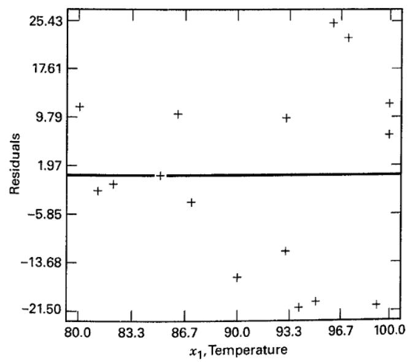
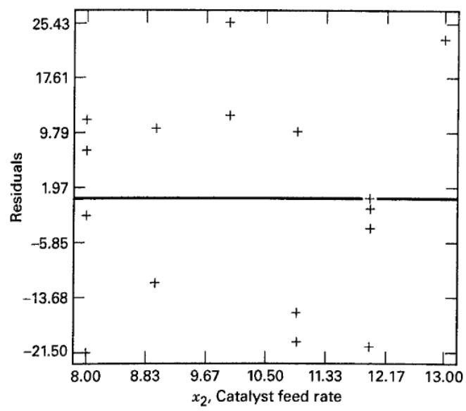
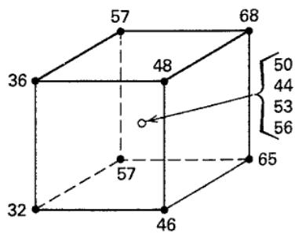

CHAPTER 10

# Fitting Regression Models

## CHAPTER LEARNING OBJECTIVES

1. Understand fitting linear regression models using the method of least squares.

2. Understand basic regression model inference, including tests for significance of regression, tests on individual model parameters and confidence intervals on the parameters.

3. Know how to use the model to estimate the mean response at a specific point and construct the associated confidence interval.

4. Know how to use the model to predict a new response at a specific point and construct the associated prediction interval.

5. Know the difference between a confidence interval on the mean response and a prediction interval on a new response and when each interval is appropriate.

6. Know how to use basic regression model diagnostics, such as residual plots, the PRESS statistic, and measures of leverage and influence.

7. Know how to test for lack of fit of a linear regression model.

## 10.1 Introduction

In many problems two or more variables are related, and it is of interest to model and explore this relationship. For example, in a chemical process the yield of product is related to the operating temperature. The chemical engineer may want to build a model relating yield to temperature and then use the model for prediction, process optimization, or process control.

In general, suppose that there is a single dependent variable or response y that depends on k independent or regressor variables, for example, $x_{1}, x_{2}, \ldots, x_{k}$ . The relationship between these variables is characterized by a mathematical model called a regression model. The regression model is fit to a set of sample data. In some instances, the experimenter knows the exact form of the true functional relationship between y and $x_{1}, x_{2}, \ldots, x_{k}$ , say $y = \phi(x_{1}, x_{2}, \ldots, x_{k})$ . However, in most cases, the true functional relationship is unknown, and the experimenter chooses an appropriate function to approximate $\phi$ . Low-order polynomial models are widely used as approximating functions.

There is a strong interplay between design of experiments and regression analysis. Throughout this book, we have emphasized the importance of expressing the results of an experiment quantitatively, in terms of an empirical model, to facilitate understanding, interpretation, and implementation. Regression models are the basis for this. On numerous occasions, we have shown the regression model that represented the results of an experiment. In this chapter, we present some aspects of fitting these models. More complete presentations of regression are available in Montgomery, Peck, and Vining (2012) and Myers (1990).

Regression methods are frequently used to analyze data from unplanned experiments, such as might arise from observation of uncontrolled phenomena or historical records. Regression methods are also very useful in designed experiments where something has “gone wrong.” We will illustrate some of these situations in this chapter.

## 10.2 Linear Regression Models

We will focus on fitting linear regression models. To illustrate, suppose that we wish to develop an empirical model relating the viscosity of a polymer to the temperature and the catalyst feed rate. A model that might describe this relationship is

$$
y = \beta_ {0} + \beta_ {1} x _ {1} + \beta_ {2} x _ {2} + \epsilon\tag{10.1}
$$

where $y$ represents the viscosity, $x_{1}$ represents the temperature, and $x_{2}$ represents the catalyst feed rate. This is a multiple linear regression model with two independent variables. We often call the independent variables predictor variables or regressors. The term linear is used because Equation 10.1 is a linear function of the unknown parameters $\beta_{0}, \beta_{1}$ , and $\beta_{2}$ . The model describes a plane in the two-dimensional $x_{1}, x_{2}$ space. The parameter $\beta_{0}$ defines the intercept of the plane. We sometimes call $\beta_{1}$ and $\beta_{2}$ partial regression coefficients because $\beta_{1}$ measures the expected change in $y$ per unit change in $x_{1}$ when $x_{2}$ is held constant and $\beta_{2}$ measures the expected change in $y$ per unit change in $x_{2}$ when $x_{1}$ is held constant.

In general, the response variable y may be related to k regressor variables. The model

$$
y = \beta_ {0} + \beta_ {1} x _ {1} + \beta_ {2} x _ {2} + \dots + \beta_ {k} x _ {k} + \epsilon\tag{10.2}
$$

is called a multiple linear regression model with k regressor variables. The parameters $\beta_{j}, j = 0, 1, \ldots, k$ , are called the regression coefficients. This model describes a hyperplane in the k-dimensional space of the regressor variables $\{x_{j}\}$ . The parameter $\beta_{j}$ represents the expected change in response y per unit change in $x_{j}$ when all the remaining independent variables $x_{i} (i \neq j)$ are held constant.

Models that are more complex in appearance than Equation 10.2 may often still be analyzed by multiple linear regression techniques. For example, consider adding an interaction term to the first-order model in two variables, say

$$
y = \beta_ {0} + \beta_ {1} x _ {1} + \beta_ {2} x _ {2} + \beta_ {1 2} x _ {1} x _ {2} + \epsilon\tag{10.3}
$$

If we let $x_{3} = x_{1}x_{2}$ and $\beta_{3} = \beta_{12}$ , then Equation 10.3 can be written as

$$
y = \beta_ {0} + \beta_ {1} x _ {1} + \beta_ {2} x _ {2} + \beta_ {3} x _ {3} + \epsilon\tag{10.4}
$$

which is a standard multiple linear regression model with three regressors. Recall that we presented empirical models like Equations 10.2 and 10.4 in several examples in Chapters 6, 7, and 8 to quantitatively express the results of a two-level factorial design. As another example, consider the second-order response surface model in two variables:

$$
y = \beta_ {0} + \beta_ {1} x _ {1} + \beta_ {2} x _ {x} + \beta_ {1 1} x _ {1} ^ {2} + \beta_ {2 2} x _ {2} ^ {2} + \beta_ {1 2} x _ {1} x _ {2} + \epsilon\tag{10.5}
$$

If we let $x_{3} = x_{1}^{2}, x_{4} = x_{2}^{2}, x_{5} = x_{1}x_{2}, \beta_{3} = \beta_{11}, \beta_{4} = \beta_{22}$ , and $\beta_{5} = \beta_{12}$ , then this becomes

$$
y = \beta_ {0} + \beta_ {1} x _ {1} + \beta_ {2} x _ {2} + \beta_ {3} x _ {3} + \beta_ {4} x _ {4} + \beta_ {5} x _ {5} + \epsilon\tag{10.6}
$$

which is a linear regression model. We have also seen this model in examples earlier in the text. In general, any regression model that is linear in the parameters (the $\beta$ 's) is a linear regression model, regardless of the shape of the response surface that it generates.

In this chapter, we will summarize methods for estimating the parameters in multiple linear regression models. This is often called model fitting. We have used some of these results in previous chapters, but here we give the developments. We will also discuss methods for testing hypotheses and constructing confidence intervals for these models as well as for checking the adequacy of the model fit. Our focus is primarily on those aspects of regression analysis useful in designed experiments. For more complete presentations of regression, refer to Montgomery, Peck, and Vining (2012) and Myers (1990).

## 10.3 Estimation of the Parameters in Linear Regression Models

The method of least squares is typically used to estimate the regression coefficients in a multiple linear regression model. Suppose that n > k observations on the response variable are available, say $y_{1}, y_{2}, \ldots, y_{n}$ . Along with each observed response $y_{i}$ , we will have an observation on each regressor variable and let $x_{ij}$ denote the ith observation or level of variable $x_{j}$ . The data will appear as in Table 10.1. We assume that the error term $\epsilon$ in the model has $E(\epsilon) = 0$ and $V(\epsilon) = \sigma^{2}$ and that the $\{\epsilon_{i}\}$ are uncorrelated random variables.

We may write the model equation (Equation 10.2) in terms of the observations in Table 10.1 as

$$
\begin{array}{l} y _ {i} = \beta_ {0} + \beta_ {1} x _ {i 1} + \beta_ {2} x _ {i 2} + \dots + \beta_ {k} x _ {i k} + \epsilon_ {i} \\ = \beta_ {0} + \sum_ {j = 1} ^ {k} \beta_ {j} x _ {i j} + \epsilon_ {i} \qquad i = 1, 2, \ldots , n \end{array}\tag{10.7}
$$

The method of least squares chooses the $\beta$ 's in Equation 10.7 so that the sum of the squares of the errors, $\epsilon_{i}$ , is minimized. The least squares function is

$$
L = \sum_ {i = 1} ^ {n} \epsilon_ {i} ^ {2} = \sum_ {i = 1} ^ {n} \left(y _ {i} - \beta_ {0} - \sum_ {j = 1} ^ {k} \beta_ {j} x _ {i j}\right) ^ {2}\tag{10.8}
$$

The function $L$ is to be minimized with respect to $\beta_0, \beta_1, \ldots, \beta_k$ . The least squares estimators, say $\hat{\beta}_0, \hat{\beta}_1, \ldots, \hat{\beta}_k$ , must satisfy

$$
\left. \frac {\partial L}{\partial \beta_ {0}} \right| _ {\hat {\beta} _ {0}, \hat {\beta} _ {1}, \dots , \hat {\beta} _ {k}} = - 2 \sum_ {i = 1} ^ {n} \left(y _ {i} - \hat {\beta} _ {0} - \sum_ {j = 1} ^ {k} \hat {\beta} _ {j} x _ {i j}\right) = 0\tag{10.9a}
$$

and

$$
\left. \frac {\partial L}{\partial \beta_ {j}} \right| _ {\hat {\beta} _ {0}, \hat {\beta} _ {1}, \dots , \hat {\beta} _ {k}} = - 2 \sum_ {i = 1} ^ {n} \left(y _ {i} - \hat {\beta} _ {0} - \sum_ {j = 1} ^ {k} \hat {\beta} _ {j} x _ {i j}\right) x _ {i j} = 0 \quad j = 1, 2, \dots , k\tag{10.9b}
$$

## TABLE 10.1

Data for Multiple Linear Regression

<table><tr><td> $y$ </td><td> $x_{1}$ </td><td> $x_{2}$ </td><td> $\cdots$ </td><td> $x_{k}$ </td></tr><tr><td> $y_{1}$ </td><td> $x_{11}$ </td><td> $x_{12}$ </td><td> $\cdots$ </td><td> $x_{1k}$ </td></tr><tr><td> $y_{2}$ </td><td> $x_{21}$ </td><td> $x_{22}$ </td><td> $\cdots$ </td><td> $x_{2k}$ </td></tr><tr><td> $\vdots$ </td><td> $\vdots$ </td><td> $\vdots$ </td><td></td><td> $\vdots$ </td></tr><tr><td> $y_{n}$ </td><td> $x_{n1}$ </td><td> $x_{n2}$ </td><td> $\cdots$ </td><td> $x_{nk}$ </td></tr></table>

Simplifying Equation 10.9a, we obtain

$$
\begin{array}{r} n \hat {\beta} _ {0} + \hat {\beta} _ {1} \sum_ {i = 1} ^ {n} x _ {i 1} + \hat {\beta} _ {2} \sum_ {i = 1} ^ {n} x _ {i 2} + \dots + \hat {\beta} _ {k} \sum_ {i = 1} ^ {n} x _ {i k} = \sum_ {i = 1} ^ {n} y _ {i} \\ \hat {\beta} _ {0} \sum_ {i = 1} ^ {n} x _ {i 1} + \hat {\beta} _ {1} \sum_ {i = 1} ^ {n} x _ {i 1} ^ {2} + \hat {\beta} _ {2} \sum_ {i = 1} ^ {n} x _ {i 1} x _ {i 2} + \dots + \hat {\beta} _ {k} \sum_ {i = 1} ^ {n} x _ {i 1} x _ {i k} = \sum_ {i = 1} ^ {n} x _ {i 1} y _ {i} \\ \vdots \\ \hat {\beta} _ {0} \sum_ {i = 1} ^ {n} x _ {i k} + \hat {\beta} _ {1} \sum_ {i = 1} ^ {n} x _ {i k} x _ {i 1} + \hat {\beta} _ {2} \sum_ {i = 1} ^ {n} x _ {i k} x _ {i 2} + \dots + \hat {\beta} _ {k} \sum_ {i = 1} ^ {n} x _ {i k} ^ {2} = \sum_ {i = 1} ^ {n} x _ {i k} y _ {i} \end{array}\tag{10.10}
$$

These equations are called the least squares normal equations. Note that there are $p = k + 1$ normal equations, one for each of the unknown regression coefficients. The solution to the normal equations will be the least squares estimators of the regression coefficients $\hat{\beta}_{0}, \hat{\beta}_{1}, \ldots, \hat{\beta}_{k}$ .

It is simpler to solve the normal equations if they are expressed in matrix notation. We now give a matrix development of the normal equations that parallels the development of Equation 10.10. The model in terms of the observations, Equation 10.7, may be written in matrix notation as

$$
\mathbf {y} = \mathbf {X} \boldsymbol {\beta} + \epsilon
$$

where

$$
\mathbf {y} = \left[ \begin{array}{c} y _ {1} \\ y _ {2} \\ \vdots \\ y _ {n} \end{array} \right], \quad \mathbf {X} = \left[ \begin{array}{c c c c c} 1 & x _ {1 1} & x _ {1 2} & \dots & x _ {1 k} \\ 1 & x _ {2 1} & x _ {2 2} & \dots & x _ {2 k} \\ \vdots & \vdots & \vdots & & \vdots \\ 1 & x _ {n 1} & x _ {n 2} & \dots & x _ {n k} \end{array} \right], \quad \boldsymbol {\beta} = \left[ \begin{array}{c} \beta_ {0} \\ \beta_ {1} \\ \vdots \\ \beta_ {k} \end{array} \right], \text {   and   } \boldsymbol {\epsilon} = \left[ \begin{array}{c} \epsilon_ {1} \\ \epsilon_ {2} \\ \vdots \\ \epsilon_ {n} \end{array} \right]
$$

In general, y is an $(n \times 1)$ vector of the observations, X is an $(n \times p)$ matrix of the levels of the independent variables, $\beta$ is a $(p \times 1)$ vector of the regression coefficients, and $\epsilon$ is an $(n \times 1)$ vector of random errors.

We wish to find the vector of least squares estimators, $\hat{\beta}$ , that minimizes

$$
L = \sum_ {i = 1} ^ {n} \epsilon_ {i} ^ {2} = \epsilon^ {\prime} \epsilon = (\mathbf {y} - \mathbf {X} \boldsymbol {\beta}) ^ {\prime} (\mathbf {y} - \mathbf {X} \boldsymbol {\beta})
$$

Note that $L$ may be expressed as

$$
\begin{array}{r l} L & = \mathbf {y} ^ {\prime} \mathbf {y} - \beta^ {\prime} \mathbf {X} ^ {\prime} \mathbf {y} - \mathbf {y} ^ {\prime} \mathbf {X} \beta + \beta^ {\prime} \mathbf {X} ^ {\prime} \mathbf {X} \beta \\ & = \mathbf {y} ^ {\prime} \mathbf {y} - 2 \beta^ {\prime} \mathbf {X} ^ {\prime} \mathbf {y} + \beta^ {\prime} \mathbf {X} ^ {\prime} \mathbf {X} \beta \end{array}\tag{10.11}
$$

because $\beta^{\prime}\mathbf{X}^{\prime}\mathbf{y}$ is a $(1\times 1)$ matrix, or a scalar, and its transpose $(\beta^{\prime}\mathbf{X}^{\prime}\mathbf{y})^{\prime} = \mathbf{y}^{\prime}\mathbf{X}\boldsymbol {\beta}$ is the same scalar. The least squares estimators must satisfy

$$
\left. \frac {\partial L}{\partial \boldsymbol {\beta}} \right| _ {\hat {\boldsymbol {\beta}}} = - 2 \mathbf {X} ^ {\prime} \mathbf {y} + 2 \mathbf {X} ^ {\prime} \mathbf {X} \hat {\boldsymbol {\beta}} = \mathbf {0}
$$

which simplifies to

$$
\mathbf {X} ^ {\prime} \mathbf {X} \hat {\boldsymbol {\beta}} = \mathbf {X} ^ {\prime} \mathbf {y}\tag{10.12}
$$

Equation 10.12 is the matrix form of the least squares normal equations. It is identical to Equation 10.10. To solve the normal equations, multiply both sides of Equation 10.12 by the inverse of $\mathbf{X}'\mathbf{X}$ . Thus, the least squares estimator of $\beta$ is

$$
\hat {\boldsymbol {\beta}} = (\mathbf {X} ^ {\prime} \mathbf {X}) ^ {- 1} \mathbf {X} ^ {\prime} \mathbf {y}\tag{10.13}
$$

It is easy to see that the matrix form of the normal equations is identical to the scalar form. Writing out Equation 10.12 in detail, we obtain

$$
\left[ \begin{array}{c c c c c} n & \sum_ {i = 1} ^ {n} x _ {i 1} & \sum_ {i = 1} ^ {n} x _ {i 2} & \dots & \sum_ {i = 1} ^ {n} x _ {i k} \\ \sum_ {i = 1} ^ {n} x _ {i 1} & \sum_ {i = 1} ^ {n} x _ {i 1} ^ {2} & \sum_ {i = 1} ^ {n} x _ {i 1} x _ {i 2} & \dots & \sum_ {i = 1} ^ {n} x _ {i 1} x _ {i k} \\ \vdots & \vdots & \vdots & \dots & \vdots \\ \sum_ {i = 1} ^ {n} x _ {i k} & \sum_ {i = 1} ^ {n} x _ {i k} x _ {i 1} & \sum_ {i = 1} ^ {n} x _ {i k} x _ {i 2} & \dots & \sum_ {i = 1} ^ {n} x _ {i k} ^ {2} \end{array} \right] \left[ \begin{array}{c} \hat {\beta} _ {0} \\ \hat {\beta} _ {1} \\ \vdots \\ \hat {\beta} _ {k} \end{array} \right] = \left[ \begin{array}{c} \sum_ {i = 1} ^ {n} y _ {i} \\ \sum_ {i = 1} ^ {n} x _ {i 1} y _ {i} \\ \vdots \\ \sum_ {i = 1} ^ {n} x _ {i k} y _ {i} \end{array} \right]
$$

If the indicated matrix multiplication is performed, the scalar form of the normal equations (i.e., Equation 10.10) will result. In this form, it is easy to see that $\mathbf{X}'\mathbf{X}$ is a $(p\times p)$ symmetric matrix and $\mathbf{X}'\mathbf{y}$ is a $(p\times 1)$ column vector. Note the special structure of the $\mathbf{X}'\mathbf{X}$ matrix. The diagonal elements of $\mathbf{X}'\mathbf{X}$ are the sums of squares of the elements in the columns of $\mathbf{X}$ , and the off-diagonal elements are the sums of cross products of the elements in the columns of $\mathbf{X}$ . Furthermore, note that the elements of $\mathbf{X}'\mathbf{y}$ are the sums of cross products of the columns of $\mathbf{X}$ and the observations $\{y_i\}$ .

The fitted regression model is

$$
\hat {\mathbf {y}} = \mathbf {X} \hat {\boldsymbol {\beta}}\tag{10.14}
$$

In scalar notation, the fitted model is

$$
\hat {y} _ {i} = \hat {\beta} _ {0} + \sum_ {j = 1} ^ {k} \hat {\beta} _ {j} x _ {i j} \quad i = 1, 2, \dots , n
$$

The difference between the actual observation $y_{i}$ and the corresponding fitted value $\hat{y}_{i}$ is the residual, say $e_{i}=y_{i}-\hat{y}_{i}$ . The $(n\times1)$ vector of residuals is denoted by

$$
\mathbf {e} = \mathbf {y} - \hat {\mathbf {y}}\tag{10.15}
$$

Estimating $\sigma^{2}$ . It is also usually necessary to estimate $\sigma^{2}$ . To develop an estimator of this parameter, consider the sum of squares of the residuals, say

$$
S S _ {E} = \sum_ {i = 1} ^ {n} (y _ {i} - \hat {y} _ {i}) ^ {2} = \sum_ {i = 1} ^ {n} e _ {i} ^ {2} = \mathbf {e} ^ {\prime} \mathbf {e}
$$

Substituting $\mathbf{e} = \mathbf{y} - \hat{\mathbf{y}} = \mathbf{y} - \mathbf{X}\hat{\boldsymbol{\beta}}$ , we have

$$
\begin{array}{r l} S S _ {E} & = (\mathbf {y} - \mathbf {X} \hat {\boldsymbol {\beta}}) ^ {\prime} (\mathbf {y} - \mathbf {X} \hat {\boldsymbol {\beta}}) \\ & = \mathbf {y} ^ {\prime} \mathbf {y} - \hat {\boldsymbol {\beta}} ^ {\prime} \mathbf {X} ^ {\prime} \mathbf {y} - \mathbf {y} ^ {\prime} \mathbf {X} \hat {\boldsymbol {\beta}} + \hat {\boldsymbol {\beta}} ^ {\prime} \mathbf {X} ^ {\prime} \mathbf {X} \hat {\boldsymbol {\beta}} \\ & = \mathbf {y} ^ {\prime} \mathbf {y} - 2 \hat {\boldsymbol {\beta}} ^ {\prime} \mathbf {X} ^ {\prime} \mathbf {y} + \hat {\boldsymbol {\beta}} ^ {\prime} \mathbf {X} ^ {\prime} \mathbf {X} \hat {\boldsymbol {\beta}} \end{array}
$$

Because $\mathbf{X}'\mathbf{X}\hat{\boldsymbol{\beta}} = \mathbf{X}'\mathbf{y}$ , this last equation becomes

$$
S S _ {E} = \mathbf {y} ^ {\prime} \mathbf {y} - \hat {\boldsymbol {\beta}} ^ {\prime} \mathbf {X} ^ {\prime} \mathbf {y}\tag{10.16}
$$

Equation 10.16 is called the error or residual sum of squares, and it has n - p degrees of freedom associated with it. It can be shown that

$$
E (S S _ {E}) = \sigma^ {2} (n - p)
$$

so an unbiased estimator of $\sigma^2$ is given by

$$
\hat {\sigma} ^ {2} = \frac {S S _ {E}}{n - p}\tag{10.17}
$$

Properties of the Estimators. The method of least squares produces an unbiased estimator of the parameter $\beta$ in the linear regression model. This may be easily demonstrated by taking the expected value of $\hat{\beta}$ as follows:

$$
\begin{array}{r l} E (\hat {\boldsymbol {\beta}}) & = E [ (\mathbf {X} ^ {\prime} \mathbf {X}) ^ {- 1} \mathbf {X} ^ {\prime} \mathbf {y} ] = E [ (\mathbf {X} ^ {\prime} \mathbf {X}) ^ {- 1} \mathbf {X} ^ {\prime} (\mathbf {X} \boldsymbol {\beta} + \epsilon) ] \\ & = E [ (\mathbf {X} ^ {\prime} \mathbf {X}) ^ {- 1} \mathbf {X} ^ {\prime} \mathbf {X} \boldsymbol {\beta} + (\mathbf {X} ^ {\prime} \mathbf {X}) ^ {- 1} \mathbf {X} ^ {\prime} \boldsymbol {\epsilon} ] = \boldsymbol {\beta} \end{array}
$$

because $E(\epsilon) = 0$ and $(\mathbf{X}'\mathbf{X})^{-1}\mathbf{X}'\mathbf{X} = \mathbf{I}$ . Thus, $\hat{\beta}$ is an unbiased estimator of $\beta$ .

The variance property of $\hat{\beta}$ is expressed in the covariance matrix:

$$
\operatorname{Cov} (\hat {\boldsymbol {\beta}}) \equiv E \{[ \hat {\boldsymbol {\beta}} - E (\hat {\boldsymbol {\beta}}) ] [ \hat {\boldsymbol {\beta}} - E (\hat {\boldsymbol {\beta}}) ] ^ {\prime} \}\tag{10.18}
$$

which is just a symmetric matrix whose ith main diagonal element is the variance of the individual regression coefficient $\hat{\beta}_{i}$ and whose (ij)th element is the covariance between $\hat{\beta}_{i}$ and $\hat{\beta}_{j}$ . The covariance matrix of $\hat{\beta}$ is

$$
\operatorname{Cov} (\hat {\boldsymbol {\beta}}) = \sigma^ {2} \left(\mathbf {X} ^ {\prime} \mathbf {X}\right) ^ {- 1}\tag{10.19}
$$

If $\sigma^{2}$ in Equation 10.19 is replaced with the estimate $\hat{\sigma}^{2}$ from Equation 10.12, we obtain an estimate of the covariance matrix of $\hat{\beta}$ . The square roots of the main diagonal elements of this matrix are the standard errors of the model parameters.

## EXAMPLE 10.1

Sixteen observations on the viscosity of a polymer (y) and two process variables—reaction temperature $(x_{1})$ and catalyst feed rate $(x_{2})$ —are shown in Table 10.2. We will fit a multiple linear regression model

$$
y = \beta_ {0} + \beta_ {1} x _ {1} + \beta_ {2} x _ {2} + \epsilon
$$

to these data. The X matrix and y vector are

The $\mathbf{X}'\mathbf{X}$ matrix is

$$
\mathbf {X} = \left[ \begin{array}{c c c} 1 & 8 0 & 8 \\ 1 & 9 3 & 9 \\ 1 & 1 0 0 & 1 0 \\ 1 & 8 2 & 1 2 \\ 1 & 9 0 & 1 1 \\ 1 & 9 9 & 8 \\ 1 & 8 1 & 8 \\ 1 & 9 6 & 1 0 \\ 1 & 9 4 & 1 2 \\ 1 & 9 3 & 1 1 \\ 1 & 9 7 & 1 3 \\ 1 & 9 5 & 1 1 \\ 1 & 1 0 0 & 8 \\ 1 & 8 5 & 1 2 \\ 1 & 8 6 & 9 \\ 1 & 8 7 & 1 2 \end{array} \right] \quad \mathbf {y} = \left[ \begin{array}{l} 2 2 5 6 \\ 2 3 4 0 \\ 2 4 2 6 \\ 2 2 9 3 \\ 2 3 3 0 \\ 2 3 6 8 \\ 2 2 5 0 \\ 2 4 0 9 \\ 2 3 6 4 \\ 2 3 7 9 \\ 2 4 4 0 \\ 2 3 6 4 \\ 2 4 0 4 \\ 2 3 1 7 \\ 2 3 0 9 \\ 2 3 2 8 \end{array} \right]
$$

$$
\begin{array}{r l} \mathbf {X} ^ {\prime} \mathbf {X} & = \left[ \begin{array}{c c c c} 1 & 1 & \dots & 1 \\ 8 0 & 9 3 & \dots & 8 7 \\ 8 & 9 & \dots & 1 2 \end{array} \right] \left[ \begin{array}{c c c} 1 & 8 0 & 8 \\ 1 & 9 3 & 9 \\ \vdots & \vdots & \vdots \\ 1 & 8 7 & 1 2 \end{array} \right] \\ & = \left[ \begin{array}{c c c} 1 6 & 1 4 5 8 & 1 6 4 \\ 1 4 5 8 & 1 3 3, 5 6 0 & 1 4, 9 4 6 \\ 1 6 4 & 1 4, 9 4 6 & 1, 7 2 6 \end{array} \right] \end{array}
$$

and the $\mathbf{X}'\mathbf{y}$ vector is

$$
\mathbf {X} ^ {\prime} \mathbf {y} = \left[ \begin{array}{c c c c} 1 & 1 & \dots & 1 \\ 8 0 & 9 3 & \dots & 8 7 \\ 8 & 9 & \dots & 1 2 \end{array} \right] \left[ \begin{array}{c} 2 2 5 6 \\ 2 3 4 0 \\ \vdots \\ 2 3 2 8 \end{array} \right] = \left[ \begin{array}{c} 3 7, 5 7 7 \\ 3, 4 2 9, 5 5 0 \\ 3 8 5, 5 6 2 \end{array} \right]
$$

The least squares estimate of $\pmb{\beta}$ is

$$
\hat {\boldsymbol {\beta}} = (\mathbf {X} ^ {\prime} \mathbf {X}) ^ {- 1} \mathbf {X} ^ {\prime} \mathbf {y}
$$

$$
\hat {\beta} = \left[ \begin{array}{c c c c c} 1 4. 1 7 6 0 0 4 & - 0. 1 2 9 7 4 6 & & - 0. 2 2 3 4 5 3 \\ - 0. 1 2 9 7 4 6 & 1. 4 2 9 1 8 4 \times 1 0 ^ {- 3} & - 4. 7 6 9 4 7 \times 1 0 ^ {- 5} \\ - 0. 2 2 3 4 5 3 & - 4. 7 6 3 9 4 7 \times 1 0 ^ {- 5} & 2. 2 2 2 3 8 1 \times 1 0 ^ {- 2} \end{array} \right] \left[ \begin{array}{c} 3 7. 5 7 7 \\ 3, 4 2 9, 5 5 0 \\ 3 8 5. 5 6 2 \end{array} \right] = \left[ \begin{array}{c} 1 5 6 6. 0 7 7 7 7 \\ 7. 6 2 1 2 9 \\ 8. 5 8 4 8 5 \end{array} \right]
$$

TABLE 10.2  
Viscosity Data for Example 10.1 (Viscosity in Centistokes @ 100°C)

<table><tr><td>Observation</td><td>Temperature ( $x_1$ , °C)</td><td>Catalyst Feed Rate ( $x_2$ , lb/h)</td><td>Viscosity</td></tr><tr><td>1</td><td>80</td><td>8</td><td>2256</td></tr><tr><td>2</td><td>93</td><td>9</td><td>2340</td></tr><tr><td>3</td><td>100</td><td>10</td><td>2426</td></tr><tr><td>4</td><td>82</td><td>12</td><td>2293</td></tr><tr><td>5</td><td>90</td><td>11</td><td>2330</td></tr><tr><td>6</td><td>99</td><td>8</td><td>2368</td></tr><tr><td>7</td><td>81</td><td>8</td><td>2250</td></tr><tr><td>8</td><td>96</td><td>10</td><td>2409</td></tr><tr><td>9</td><td>94</td><td>12</td><td>2364</td></tr><tr><td>10</td><td>93</td><td>11</td><td>2379</td></tr><tr><td>11</td><td>97</td><td>13</td><td>2440</td></tr><tr><td>12</td><td>95</td><td>11</td><td>2364</td></tr><tr><td>13</td><td>100</td><td>8</td><td>2404</td></tr><tr><td>14</td><td>85</td><td>12</td><td>2317</td></tr><tr><td>15</td><td>86</td><td>9</td><td>2309</td></tr><tr><td>16</td><td>87</td><td>12</td><td>2328</td></tr></table>

The least squares fit, with the regression coefficients reported to two decimal places, is

$$
\hat {y} = 1 5 6 6. 0 8 + 7. 6 2 x _ {1} + 8. 5 8 x _ {2}
$$

The first three columns of Table 10.3 present the actual observations $y_{i}$ , the predicted or fitted values $\hat{y}_{i}$ , and the residuals. Figure 10.1 is a normal probability plot of the residuals. Plots of the residuals versus the predicted values $\hat{y}_{i}$ and versus the two variables $x_{1}$ and $x_{2}$ are shown in Figures 10.2, 10.3, and 10.4, respectively. Just as in designed experiments, residual plotting is an integral part of regression model building. These plots indicate that the variance of the observed viscosity tends to increase with the magnitude of viscosity. Figure 10.3 suggests that the variability in viscosity increases as temperature increases.

## TABLE 10.3

Predicted Values, Residuals, and Other Diagnostics from Example 10.1

<table><tr><td>Observation i</td><td> $y_i$ </td><td>Predicted Value  $\hat{y}_i$ </td><td>Residual  $e_i$ </td><td> $h_{ii}$ </td><td>Studentized Residual</td><td> $D_i$ </td><td>R-Student</td></tr><tr><td>1</td><td>2256</td><td>2244.5</td><td>11.5</td><td>0.350</td><td>0.87</td><td>0.137</td><td>0.87</td></tr><tr><td>2</td><td>2340</td><td>2352.1</td><td>-12.1</td><td>0.102</td><td>-0.78</td><td>0.023</td><td>-0.77</td></tr><tr><td>3</td><td>2426</td><td>2414.1</td><td>11.9</td><td>0.177</td><td>0.80</td><td>0.046</td><td>0.79</td></tr><tr><td>4</td><td>2293</td><td>2294.0</td><td>-1.0</td><td>0.251</td><td>-0.07</td><td>0.001</td><td>-0.07</td></tr><tr><td>5</td><td>2330</td><td>2346.4</td><td>-16.4</td><td>0.077</td><td>-1.05</td><td>0.030</td><td>-1.05</td></tr><tr><td>6</td><td>2368</td><td>2389.3</td><td>-21.3</td><td>0.265</td><td>-1.52</td><td>0.277</td><td>-1.61</td></tr><tr><td>7</td><td>2250</td><td>2252.1</td><td>-2.1</td><td>0.319</td><td>-0.15</td><td>0.004</td><td>-0.15</td></tr><tr><td>8</td><td>2409</td><td>2383.6</td><td>25.4</td><td>0.098</td><td>1.64</td><td>0.097</td><td>1.76</td></tr><tr><td>9</td><td>2364</td><td>2385.5</td><td>-21.5</td><td>0.142</td><td>-1.42</td><td>0.111</td><td>-1.48</td></tr><tr><td>10</td><td>2379</td><td>2369.3</td><td>9.7</td><td>0.080</td><td>0.62</td><td>0.011</td><td>0.60</td></tr><tr><td>11</td><td>2440</td><td>2416.9</td><td>23.1</td><td>0.278</td><td>1.66</td><td>0.354</td><td>1.80</td></tr><tr><td>12</td><td>2364</td><td>2384.5</td><td>-20.5</td><td>0.096</td><td>-1.32</td><td>0.062</td><td>-1.36</td></tr><tr><td>13</td><td>2404</td><td>2396.9</td><td>17.1</td><td>0.289</td><td>0.52</td><td>0.036</td><td>0.50</td></tr><tr><td>14</td><td>2317</td><td>2316.9</td><td>0.1</td><td>0.185</td><td>0.01</td><td>0.000</td><td>&lt;0.01</td></tr><tr><td>15</td><td>2309</td><td>2298.8</td><td>10.2</td><td>0.134</td><td>0.67</td><td>0.023</td><td>0.66</td></tr><tr><td>16</td><td>2328</td><td>2332.1</td><td>-4.1</td><td>0.156</td><td>-0.28</td><td>0.005</td><td>-0.27</td></tr></table>

  
■ FIGURE 10.1 Normal probability plot of residuals, Example 10.1

  
■ FIGURE 10.2 Plot of residuals versus predicted viscosity, Example 10.1

  
■ FIGURE 10.3 Plot of residuals versus $x_{1}$ (temperature), Example 10.1

  
■ FIGURE 10.4 Plot of residuals versus $x_{2}$ (feed rate), Example 10.1

Using the Computer. Regression model fitting is almost always done using a statistical software package, such as Minitab or JMP. Table 10.4 shows some of the output obtained when Minitab is used to fit the viscosity regression model in Example 10.1. Many of the quantities in this output should be familiar because they have similar meanings to the quantities in the output displays for computer analysis of data from designed experiments. We have seen many such computer outputs previously in the book. In subsequent sections, we will discuss the analysis of variance and t-test information in Table 10.4 in detail and will show exactly how these quantities were computed.

Fitting Regression Models in Designed Experiments. We have often used a regression model to present the results of a designed experiment in a quantitative form. We now give a complete illustrative example. This is followed by three other brief examples that illustrative other useful applications of regression analysis in designed experiments.

## TABLE 10.4

Minitab Output for the Viscosity Regression Model, Example 10.1

```txt
Regression Analysis
The regression equation is
Viscosity = 1566 + 7.62 Temp + 8.58 Feed Rate
Predictor Coef Std. Dev. T P
Constant 1566.08 61.59 25.43 0.000
Temp 7.6213 0.6184 12.32 0.000
Feed Rat 8.585 2.439 3.52 0.004
S = 16.36 R-Sq = 92.7% R-Sq (adj) = 91.6%
Analysis of Variance
Source DF SS MS F P
Regression 2 44157 22079 82.50 0.000
Residual Error 13 3479 268
Total 15 47636
Source DF Seq SS
Temp 1 40841
Feed Rat 1 3316
```

## EXAMPLE 10.2 Regression Analysis of a $2^{3}$ Factorial Design

A chemical engineer is investigating the yield of a process. Three process variables are of interest: temperature, pressure, and catalyst concentration. Each variable can be run at a low and a high level, and the engineer decides to run a $2^{3}$ design with four center points. The design and the resulting yields are shown in Figure 10.5, where we have shown both the natural levels of the design factor and the +1, -1 coded variable notation normally employed in $2^{k}$ factorial designs to represent the factor levels.

<table><tr><td colspan="4">Process Variables</td><td colspan="3">Coded Variables</td><td rowspan="2">Yield, y</td></tr><tr><td>Run</td><td>Temp (°C)</td><td>Pressure (psig)</td><td>Conc (g/l)</td><td> $x_1$ </td><td> $x_2$ </td><td> $x_3$ </td></tr><tr><td>1</td><td>120</td><td>40</td><td>15</td><td>-1</td><td>-1</td><td>-1</td><td>32</td></tr><tr><td>2</td><td>160</td><td>80</td><td>15</td><td>1</td><td>-1</td><td>-1</td><td>46</td></tr><tr><td>3</td><td>120</td><td>40</td><td>15</td><td>-1</td><td>1</td><td>-1</td><td>57</td></tr><tr><td>4</td><td>160</td><td>80</td><td>15</td><td>1</td><td>1</td><td>-1</td><td>65</td></tr><tr><td>5</td><td>120</td><td>40</td><td>30</td><td>-1</td><td>-1</td><td>1</td><td>36</td></tr><tr><td>6</td><td>160</td><td>80</td><td>30</td><td>1</td><td>-1</td><td>1</td><td>48</td></tr><tr><td>7</td><td>120</td><td>40</td><td>30</td><td>-1</td><td>1</td><td>1</td><td>57</td></tr><tr><td>8</td><td>160</td><td>80</td><td>30</td><td>1</td><td>1</td><td>1</td><td>68</td></tr><tr><td>9</td><td>140</td><td>60</td><td>22.5</td><td>0</td><td>0</td><td>0</td><td>50</td></tr><tr><td>10</td><td>140</td><td>60</td><td>22.5</td><td>0</td><td>0</td><td>0</td><td>44</td></tr><tr><td>11</td><td>140</td><td>60</td><td>22.5</td><td>0</td><td>0</td><td>0</td><td>53</td></tr><tr><td>12</td><td>140</td><td>60</td><td>22.5</td><td>0</td><td>0</td><td>0</td><td>56</td></tr><tr><td colspan="8"> $x_1 = \frac{\text{Temp} - 140}{20}, x_2 = \frac{\text{Pressure} - 60}{20}, x_3 = \frac{\text{Conc} - 22.5}{7.5}$ </td></tr></table>

  
■ FIGURE 10.5 Experimental design for Example 10.2

Suppose that the engineer decides to fit a main effects only model, say

$$
y = \beta_ {0} + \beta_ {1} x _ {1} + \beta_ {2} x _ {2} + \beta_ {3} x _ {3} + \epsilon
$$

For this model, the $\mathbf{X}$ matrix and $\mathbf{y}$ vector are

$$
\mathbf {X} = \left[ \begin{array}{r r r r} 1 & - 1 & - 1 & - 1 \\ 1 & 1 & - 1 & - 1 \\ 1 & - 1 & 1 & - 1 \\ 1 & 1 & 1 & - 1 \\ 1 & - 1 & - 1 & 1 \\ 1 & 1 & - 1 & 1 \\ 1 & - 1 & 1 & 1 \\ 1 & 1 & 1 & 1 \\ 1 & 0 & 0 & 0 \\ 1 & 0 & 0 & 0 \\ 1 & 0 & 0 & 0 \\ 1 & 0 & 0 & 0 \end{array} \right] \text {and} \mathbf {y} = \left[ \begin{array}{l} 3 2 \\ 4 6 \\ 5 7 \\ 6 5 \\ 3 6 \\ 4 8 \\ 5 7 \\ 6 8 \\ 5 0 \\ 4 4 \\ 5 3 \\ 5 6 \end{array} \right]
$$

The $2^{3}$ is an orthogonal design, and even with the added center runs it is still orthogonal. Therefore,

$$
\mathbf {X} ^ {\prime} \mathbf {X} = \left[ \begin{array}{c c c c} 1 2 & 0 & 0 & 0 \\ 0 & 8 & 0 & 0 \\ 0 & 0 & 8 & 0 \\ 0 & 0 & 0 & 8 \end{array} \right] \text {and} \mathbf {X} ^ {\prime} \mathbf {y} = \left[ \begin{array}{c} 6 1 2 \\ 4 5 \\ 8 5 \\ 9 \end{array} \right]
$$

Because the design is orthogonal, the X'X matrix is diagonal, the required inverse is also diagonal, and the vector of least squares estimates of the regression coefficients is

$$
\begin{array}{r l} \hat {\boldsymbol {\beta}} = (\mathbf {X} ^ {\prime} \mathbf {X}) ^ {- 1} \mathbf {X} ^ {\prime} \mathbf {y} & = \left[ \begin{array}{c c c c} 1 / 1 2 & 0 & 0 & 0 \\ 0 & 1 / 8 & 0 & 0 \\ 0 & 0 & 1 / 8 & 0 \\ 0 & 0 & 0 & 1 / 8 \end{array} \right] \left[ \begin{array}{c} 6 1 2 \\ 4 5 \\ 8 5 \\ 9 \end{array} \right] \\ & = \left[ \begin{array}{c} 5 1. 0 0 0 \\ 5. 6 2 5 \\ 1 0. 6 2 5 \\ 1. 1 2 5 \end{array} \right] \end{array}
$$

The fitted regression model is

$$
\hat {y} = 5 1. 0 0 0 + 5. 6 2 5 x _ {1} + 1 0. 6 2 5 x _ {2} + 1. 1 2 5 x _ {3}
$$

As we have made use of on many occasions, the regression coefficients are closely connected to the effect estimates that would be obtained from the usual analysis of a $2^{3}$ design. For example, the effect of temperature is (refer to Figure 10.5)

$$
\begin{array}{r l} T & = \overline {{y}} _ {T ^ {+}} - \overline {{y}} _ {T ^ {-}} \\ & = 5 6. 7 5 - 4 5. 5 0 = 1 1. 2 5 \end{array}
$$

Notice that the regression coefficient for $x_{1}$ is

$$
(1 1. 2 5) / 2 = 5. 6 2 5
$$

That is, the regression coefficient is exactly one-half the usual effect estimate. This will always be true for a $2^{k}$ design. As noted above, we used this result in Chapters 6 through 8 to produce regression models, fitted values, and residuals for several two-level experiments. This example demonstrates that the effect estimates from a $2^{k}$ design are least squares estimates.

The variance of the regression model parameter is found from the diagonal elements of $(\mathbf{X}^{\prime}\mathbf{X})^{-1}$ . That is,

$$
V (\hat {\beta} _ {0}) = \frac {\sigma^ {2}}{1 2}, \quad \text { and } \quad V (\hat {\beta} _ {i}) = \frac {\sigma^ {2}}{8}, \quad i = 1, 2, 3.
$$

The relative variances are

$$
\frac {V (\hat {\beta} _ {0})}{\sigma^ {2}} = \frac {1}{1 2}, \quad \text { and } \quad \frac {V (\hat {\beta} _ {i})}{\sigma^ {2}} = \frac {1}{8}, \quad i = 1, 2, 3.
$$

## EXAMPLE 10.3 A 2 $^{4}$ Factorial Design with a Missing Observation

Consider the $2^{3}$ factorial design with four center points from Example 10.2. Suppose that when this experiment was performed, the run with all variables at the high level (run 8 in Figure 10.5) was missing. This can happen for a variety of reasons; the measurement system can produce a faulty reading, the combination of factor levels may prove infeasible, the experimental unit may be damaged, and so forth.

We will fit the main effects model

$$
y = \beta_ {0} + \beta_ {1} x _ {1} + \beta_ {2} x _ {2} + \beta_ {3} x _ {3} + \epsilon
$$

using the 11 remaining observations. The X matrix and y vector are

$$
\mathbf {X} = \left[ \begin{array}{r r r r} 1 & - 1 & - 1 & - 1 \\ 1 & 1 & - 1 & - 1 \\ 1 & - 1 & 1 & - 1 \\ 1 & 1 & 1 & - 1 \\ 1 & - 1 & - 1 & 1 \\ 1 & 1 & - 1 & 1 \\ 1 & - 1 & 1 & 1 \\ 1 & 0 & 0 & 0 \\ 1 & 0 & 0 & 0 \\ 1 & 0 & 0 & 0 \\ 1 & 0 & 0 & 0 \end{array} \right] \text {and} \mathbf {y} = \left[ \begin{array}{l} 3 2 \\ 4 6 \\ 5 7 \\ 6 5 \\ 3 6 \\ 4 8 \\ 5 7 \\ 5 0 \\ 4 4 \\ 5 3 \\ 5 6 \end{array} \right]
$$

To estimate the model parameters, we form

$$
\mathbf {X} ^ {\prime} \mathbf {X} = \left[ \begin{array}{r r r r} 1 1 & - 1 & - 1 & - 1 \\ - 1 & 7 & - 1 & - 1 \\ - 1 & - 1 & 7 & - 1 \\ - 1 & - 1 & - 1 & 7 \end{array} \right] \text {and} \mathbf {X} ^ {\prime} \mathbf {y} = \left[ \begin{array}{r} 5 4 4 \\ - 2 3 \\ 1 7 \\ - 5 9 \end{array} \right]
$$

Because there is a missing observation, the design is no longer orthogonal. Now

$$
\begin{array}{r l} \hat {\boldsymbol {\beta}} & = (\mathbf {X} ^ {\prime} \mathbf {X}) ^ {- 1} \mathbf {X} ^ {\prime} \mathbf {y} \\ & = \left[ \begin{array}{l l} 9. 6 1 5 3 8 \times 1 0 ^ {- 2} & 1. 9 2 3 0 7 \times 1 0 ^ {- 2} \\ 1. 9 2 3 0 7 \times 1 0 ^ {- 2} & 0. 1 5 3 8 5 \\ 1. 9 2 3 0 7 \times 1 0 ^ {- 2} & 2. 8 8 4 6 2 \times 1 0 ^ {- 2} \\ 1. 9 2 3 0 7 \times 1 0 ^ {- 2} & 2. 8 8 4 6 2 \times 1 0 ^ {- 2} \end{array} \right] \\ & \quad \left[ \begin{array}{c c} 1. 9 2 3 0 7 \times 1 0 ^ {- 2} & 1. 9 2 3 0 7 \times 1 0 ^ {- 2} \\ 2. 8 8 4 6 2 \times 1 0 ^ {- 2} & 2. 8 8 4 6 2 \times 1 0 ^ {- 2} \\ 0. 1 5 3 8 5 & 2. 8 8 4 6 2 \times 1 0 ^ {- 2} \\ 2. 8 8 4 6 2 \times 1 0 ^ {- 2} & 0. 1 5 3 8 5 \end{array} \right ] \left[ \begin{array}{c} \text {544} \\ - \text {23} \\ \text {17} \\ - \text {59} \end{array} \right] \end{array}
$$

$$
= \left[ \begin{array}{c} 5 1. 2 5 \\ 5. 7 5 \\ 1 0. 7 5 \\ 1. 2 5 \end{array} \right]
$$

Therefore, the fitted model is

$$
\hat {y} = 5 1. 2 5 + 5. 7 5 x _ {1} + 1 0. 7 5 x _ {2} + 1. 2 5 x _ {3}
$$

Compare this model to the one obtained in Example 10.2, where all 12 observations were used. The regression coefficients are very similar. Because the regression coefficients are closely related to the factor effects, our conclusions would not be seriously affected by the missing observation. However, notice that the effect estimates are no longer orthogonal because X'X and its inverse are no longer diagonal. Further more, the variances of the regression coefficients are larger than they were in the original orthogonal design with no missing data.

## EXAMPLE 10.4

## Inaccurate Levels in Design Factors

When running a designed experiment, it is sometimes difficult to reach and hold the precise factor levels required by the design. Small discrepancies are not important, but large ones are potentially of more concern. Regression methods are useful in the analysis of a designed experiment where the experimenter has been unable to obtain the required factor levels.

To illustrate, the experiment presented in Table 10.5 shows a variation of the $2^{3}$ design from Example 10.2, where many of the test combinations are not exactly the ones specified in the design. Most of the difficulty seems to have occurred with the temperature variable.

We will fit the main effects model

$$
y = \beta_ {0} + \beta_ {1} x _ {1} + \beta_ {2} x _ {2} + \beta_ {3} x _ {3} + \epsilon
$$

The $\mathbf{X}$ matrix and $\mathbf{y}$ vector are

$$
\mathbf {X} = \left[ \begin{array}{c c c c} 1 & - 0. 7 5 & - 0. 9 5 & - 1. 1 3 3 \\ 1 & 0. 9 0 & - 1 & - 1 \\ 1 & - 0. 9 5 & 1. 1 & - 1 \\ 1 & 1 & 0 & - 1 \\ 1 & - 1. 1 0 & - 1. 0 5 & 1. 4 \\ 1 & 1. 1 5 & - 1 & 1 \\ 1 & - 0. 9 0 & 1 & 1 \\ 1 & 1. 2 5 & 1. 1 5 & 1 \\ 1 & 0 & 0 & 0 \\ 1 & 0 & 0 & 0 \\ 1 & 0 & 0 & 0 \\ 1 & 0 & 0 & 0 \end{array} \right] \mathbf {y} = \left[ \begin{array}{c} 3 2 \\ 4 6 \\ 5 7 \\ 6 5 \\ 3 6 \\ 4 8 \\ 5 7 \\ 6 8 \\ 5 0 \\ 4 4 \\ 5 3 \\ 5 6 \end{array} \right]
$$

To estimate the model parameters, we need

$$
\begin{array}{l} \mathbf {X} ^ {\prime} \mathbf {X} = \left[ \begin{array}{c c c c} 1 2 & 0. 6 0 & 0. 2 5 & 0. 2 6 7 0 \\ 0. 6 0 & 8. 1 8 & 0. 3 1 & - 0. 1 4 0 3 \\ 0. 2 5 & 0. 3 1 & 8. 5 3 7 5 & - 0. 3 4 3 7 \\ 0. 2 6 7 0 & - 0. 1 4 0 3 & - 0. 3 4 3 7 & 9. 2 4 3 7 \end{array} \right] \\ \mathbf {X} ^ {\prime} \mathbf {y} = \left[ \begin{array}{c} 6 1 2 \\ 7 7. 5 5 \\ 1 0 0. 7 \\ 1 9. 1 4 4 \end{array} \right] \end{array}
$$

TABLE 10.5

Experimental Design for Example 10.4

<table><tr><td rowspan="2">Run</td><td colspan="3">Process Variables</td><td colspan="3">Coded Variables</td><td rowspan="2">Yield y</td></tr><tr><td>Temp (°C)</td><td>Pressure (psig)</td><td>Conc (g/l)</td><td> $x_1$ </td><td> $x_2$ </td><td> $x_3$ </td></tr><tr><td>1</td><td>125</td><td>41</td><td>14</td><td>-0.75</td><td>-0.95</td><td>-1.133</td><td>32</td></tr><tr><td>2</td><td>158</td><td>40</td><td>15</td><td>0.90</td><td>-1</td><td>-1</td><td>46</td></tr><tr><td>3</td><td>121</td><td>82</td><td>15</td><td>-0.95</td><td>1.1</td><td>-1</td><td>57</td></tr><tr><td>4</td><td>160</td><td>80</td><td>15</td><td>1</td><td>1</td><td>-1</td><td>65</td></tr><tr><td>5</td><td>118</td><td>39</td><td>33</td><td>-1.10</td><td>-1.05</td><td>1.14</td><td>36</td></tr><tr><td>6</td><td>163</td><td>40</td><td>30</td><td>1.15</td><td>-1</td><td>1</td><td>48</td></tr><tr><td>7</td><td>122</td><td>80</td><td>30</td><td>-0.90</td><td>1</td><td>1</td><td>57</td></tr><tr><td>8</td><td>165</td><td>83</td><td>30</td><td>1.25</td><td>1.15</td><td>1</td><td>68</td></tr><tr><td>9</td><td>140</td><td>60</td><td>22.5</td><td>0</td><td>0</td><td>0</td><td>50</td></tr><tr><td>10</td><td>140</td><td>60</td><td>22.5</td><td>0</td><td>0</td><td>0</td><td>44</td></tr><tr><td>11</td><td>140</td><td>60</td><td>22.5</td><td>0</td><td>0</td><td>0</td><td>53</td></tr><tr><td>12</td><td>140</td><td>60</td><td>22.5</td><td>0</td><td>0</td><td>0</td><td>56</td></tr></table>

Then

$$
\begin{array}{l} \hat {\beta} = (X ^ {\prime} X) ^ {- 1} X ^ {\prime} y \\ = \left[ \begin{array}{c c c c c c c} 8. 3 7 4 4 7 \times 1 0 ^ {- 2} & - 6. 0 9 8 7 1 \times 1 0 ^ {- 3} & - 2. 3 3 5 4 2 \times 1 0 ^ {- 3} & - 2. 5 9 8 3 3 \times 1 0 ^ {- 3} \\ - 6. 0 9 8 7 1 \times 1 0 ^ {- 3} & 0. 1 2 2 8 9 & - 4. 2 0 7 6 6 \times 1 0 ^ {- 3} & 1. 8 8 4 9 0 \times 1 0 ^ {- 3} \\ - 2. 3 3 5 4 2 \times 1 0 ^ {- 3} & - 4. 2 0 7 6 6 \times 1 0 ^ {- 3} & 0. 1 1 7 5 3 \times & 4. 3 7 8 5 1 \times 1 0 ^ {- 3} \\ - 2. 5 9 8 3 3 \times 1 0 ^ {- 3} & 1. 8 8 4 9 0 \times 1 0 ^ {- 3} & 4. 3 7 8 5 1 \times 1 0 ^ {- 3} & 0. 1 0 8 4 5 \end{array} \right] \left[ \begin{array}{c} \text {612} \\ \text {77.55} \\ \text {100.7} \\ \text {19.144} \end{array} \right] = \left[ \begin{array}{c} \text {50.49391} \\ \text {5.40996} \\ \text {10.16316} \\ \text {1.07245} \end{array} \right] \end{array}
$$

The fitted regression model, with the coefficients reported to two decimal places, is

$$
\hat {y} = 5 0. 4 9 + 5. 4 1 x _ {1} + 1 0. 6 1 x _ {2} + 1. 0 7 x _ {3}
$$

Comparing this to the original model in Example 10.2, where the factor levels were exactly those specified by the design, we note very little difference. The practical interpretation of the results of this experiment would not be seriously affected by the inability of the experimenter to achieve the desired factor levels exactly.

## EXAMPLE 10.5 De-aliasing Interactions in a Fractional Factorial

We observed in Chapter 8 that it is possible to de-alias interactions in a fractional factorial design by a process called fold over. For a resolution III design, a full fold over is constructed by running a second fraction in which the signs are reversed from those in the original fraction. Then the combined design can be used to de-alias all main effects from the two-factor interactions.

A difficulty with a full fold over is that it requires a second group of runs of identical size as the original design. It is usually possible to de-alias certain interactions of interest by augmenting the original design with fewer runs than required in a full fold over. The partial fold-over technique was used to solve this problem. Regression methods are an easy way to see how the partial fold-over technique works and, in some cases, find even more efficient fold-over designs.

To illustrate, suppose that we have run a $2_{IV}^{4-1}$ design. Table 8.3 shows the principal fraction of this design, in which I = ABCD. Suppose that after the data from the first eight trials were observed, the largest effects were A, B, C, D (we ignore the three-factor interactions that are aliased with these main effects) and the $AB + CD$ alias chain. The other two alias chains can be ignored, but clearly either AB, CD, or both two-factor interactions are large. To find out which interactions are important, we could, of course, run the alternate fraction, which would require another eight trials. Then all 16 runs could be used to estimate the main effects and the two-factor interactions. An alternative would be to use a partial fold over involving four additional runs.

It is possible to de-alias AB and CD in fewer than four additional trials. Suppose that we wish to fit the model

$$
\begin{array}{r l} y & = \beta_ {0} + \beta_ {1} x _ {1} + \beta_ {2} x _ {2} + \beta_ {3} x _ {3} + \beta_ {4} x _ {4} + \beta_ {1 2} x _ {1} x _ {2} \\ & + \beta_ {3 4} x _ {3} x _ {4} + \epsilon \end{array}
$$

where $x_{1}$ , $x_{2}$ , $x_{3}$ , and $x_{4}$ are the coded variables representing A, B, C, and D. Using the design in Table 8.3, the X matrix for this model is

$$
\mathbf {X} = \left[ \begin{array}{c c c c c c c} & x _ {1} & x _ {2} & x _ {3} & x _ {4} & x _ {1} x _ {2} & x _ {3} x _ {4} \\ 1 & - 1 & - 1 & - 1 & - 1 & 1 & 1 \\ 1 & 1 & - 1 & - 1 & 1 & - 1 & - 1 \\ 1 & - 1 & 1 & - 1 & 1 & - 1 & - 1 \\ 1 & 1 & 1 & - 1 & - 1 & 1 & 1 \\ 1 & - 1 & - 1 & 1 & 1 & 1 & 1 \\ 1 & 1 & - 1 & 1 & - 1 & - 1 & - 1 \\ 1 & - 1 & 1 & 1 & - 1 & - 1 & - 1 \\ 1 & 1 & 1 & 1 & 1 & 1 & 1 \end{array} \right]
$$

where we have written the variables above the columns to facilitate understanding. Notice that the $x_{1}x_{2}$ column is identical to the $x_{3}x_{4}$ column (as anticipated, because AB or $x_{1}x_{2}$ is aliased with CD or $x_{3}x_{4}$ ), implying a linear dependency in the columns of X. Therefore, we cannot estimate both $\beta_{12}$ and $\beta_{34}$ in the model. However, suppose that we add a single run $x_{1} = -1$ , $x_{2} = -1$ , $x_{3} = -1$ , and $x_{4} = 1$ from the alternate fraction to the original eight runs. The X matrix for the model now becomes

$$
\mathbf {X} = \left[ \begin{array}{r r r r r r r} & x _ {1} & x _ {2} & x _ {3} & x _ {4} & x _ {1} x _ {2} & x _ {3} x _ {4} \\ 1 & - 1 & - 1 & - 1 & - 1 & 1 & 1 \\ 1 & 1 & - 1 & - 1 & 1 & - 1 & - 1 \\ 1 & - 1 & 1 & - 1 & 1 & - 1 & - 1 \\ 1 & 1 & 1 & - 1 & - 1 & 1 & 1 \\ 1 & - 1 & - 1 & 1 & 1 & 1 & 1 \\ 1 & 1 & - 1 & 1 & - 1 & - 1 & - 1 \\ 1 & - 1 & 1 & 1 & - 1 & - 1 & - 1 \\ 1 & 1 & 1 & 1 & 1 & 1 & 1 \\ 1 & - 1 & - 1 & - 1 & 1 & 1 & - 1 \end{array} \right]
$$

Notice that the columns $x_{1}x_{2}$ and $x_{3}x_{4}$ are now no longer identical, and we can fit the model including both the $x_{1}x_{2}(AB)$ and $x_{3}x_{4}(CD)$ interactions. The magnitudes of the regression coefficients will give insight regarding which interactions are important.

Although adding a single run will de-alias the AB and CD interactions, this approach does have a disadvantage. Suppose that there is a time effect (or a block effect) between the first eight runs and the last run added above. Add a column to the X matrix for blocks, and you obtain the following:

$$
\mathbf {X} = \left[ \begin{array}{c c c c c c c c} & x _ {1} & x _ {2} & x _ {3} & x _ {4} & x _ {1} x _ {2} & x _ {3} x _ {4} & \text {block} \\ 1 & - 1 & - 1 & - 1 & - 1 & 1 & 1 & - 1 \\ 1 & 1 & - 1 & - 1 & 1 & - 1 & - 1 & - 1 \\ 1 & - 1 & 1 & - 1 & 1 & - 1 & - 1 & - 1 \\ 1 & 1 & 1 & - 1 & - 1 & 1 & 1 & - 1 \\ 1 & - 1 & - 1 & 1 & 1 & 1 & 1 & - 1 \\ 1 & 1 & - 1 & 1 & - 1 & - 1 & - 1 & - 1 \\ 1 & - 1 & 1 & 1 & - 1 & - 1 & - 1 & - 1 \\ 1 & 1 & 1 & 1 & 1 & 1 & 1 & - 1 \\ 1 & - 1 & - 1 & - 1 & 1 & 1 & - 1 & 1 \end{array} \right]
$$

We have assumed the block factor was at the low or “−” level during the first eight runs, and at the high or “+” level during the ninth run. It is easy to see that the sum of the cross products of every column with the block column does not sum to zero, meaning that blocks are no longer orthogonal to treatments, or that the block effect now affects the estimates of the model regression coefficients. To block orthogonally, you must add an even number of runs. For example, the four runs

<table><tr><td> $x_{1}$ </td><td> $x_{2}$ </td><td> $x_{3}$ </td><td> $x_{4}$ </td></tr><tr><td>-1</td><td>-1</td><td>-1</td><td>1</td></tr><tr><td>1</td><td>-1</td><td>-1</td><td>-1</td></tr><tr><td>-1</td><td>1</td><td>1</td><td>1</td></tr><tr><td>1</td><td>1</td><td>1</td><td>-1</td></tr></table>

will de-alias AB from CD and allow orthogonal blocking (you can see this by writing out the X matrix as we did previously). This is equivalent to a partial fold over, in terms of the number of runs that are required.

In general, it is usually straightforward to examine the X matrix for the reduced model obtained from a fractional factorial and determine which runs to augment the original design with to de-alias interactions of potential interest. Furthermore, the impact of specific augmentation strategies can be evaluated using the general results for regression models given later in this chapter. There are also computer-based optimal design methods for constructing designs that can be useful for design augmentation to de-alias effects (refer to the supplemental material for Chapter 8).

## 10.4 Hypothesis Testing in Multiple Regression

In multiple linear regression problems, certain tests of hypotheses about the model parameters are helpful in measuring the usefulness of the model. In this section, we describe several important hypothesis-testing procedures. These procedures require that the errors $\epsilon_{i}$ in the model be normally and independently distributed with mean zero and variance $\sigma^2$ , abbreviated $\epsilon \sim$ , NID(0, $\sigma^2$ ). As a result of this assumption, the observations $y_{i}$ are normally and independently distributed with mean $\beta_0 + \sum_{j=1}^{k} \beta_j x_{ij}$ and variance $\sigma^2$ .

## 10.4.1 Test for Significance of Regression

The test for significance of regression is a test to determine whether a linear relationship exists between the response variable y and a subset of the regressor variables $x_{1}, x_{2}, \ldots, x_{k}$ . The appropriate hypotheses are

$$
\begin{array}{l} H _ {0}: \beta_ {1} = \beta_ {2} = \dots = \beta_ {k} = 0 \\ H _ {1}: \beta_ {j} \neq 0 \quad \text { for   at   least   one } j \end{array}\tag{10.20}
$$

Rejection of $H_{0}$ in Equation 10.20 implies that at least one of the regressor variables $x_{1}, x_{2}, \ldots, x_{k}$ contributes significantly to the model. The test procedure involves an analysis of variance partitioning of the total sum of squares $SS_{T}$ into a sum of squares due to the model (or to regression) and a sum of squares due to residual (or error), say

$$
S S _ {T} = S S _ {R} + S S _ {E}\tag{10.21}
$$

Now if the null hypothesis $H_{0}: \beta_{1} = \beta_{2} = \cdots = \beta_{k} = 0$ is true, then $SS_{R}/\sigma^{2}$ is distributed as $\chi_{k}^{2}$ , where the number of degrees of freedom for $\chi^{2}$ is equal to the number of regressor variables in the model. Also, we can show that $SS_{E}/\sigma^{2}$ is distributed as $\chi_{n-k-1}^{2}$ and that $SS_{E}$ and $SS_{R}$ are independent. The test procedure for $H_{0}: \beta_{1} = \beta_{2} = \cdots = \beta_{k} = 0$ is to compute

$$
F _ {0} = \frac {S S _ {R} / k}{S S _ {E} / (n - k - 1)} = \frac {M S _ {R}}{M S _ {E}}\tag{10.22}
$$

and to reject $H_0$ if $F_0$ exceeds $F_{\alpha, k, n - k - 1}$ . Alternatively, we could use the $P$ -value approach to hypothesis testing and reject $H_0$ if the $P$ -value for the statistic $F_0$ is less than $\alpha$ . The test is usually summarized in an analysis of variance table such as Table 10.6.

A computational formula for $SS_R$ may be found easily. We have derived a computational formula for $SS_E$ in Equation 10.16—that is,

$$
S S _ {E} = \mathbf {y} ^ {\prime} \mathbf {y} - \hat {\boldsymbol {\beta}} ^ {\prime} \mathbf {X} ^ {\prime} \mathbf {y}
$$

## TABLE 10.6

Analysis of Variance for Significance of Regression in Multiple Regression

<table><tr><td>Source of Variation</td><td>Sum of Squares</td><td>Degrees of Freedom</td><td>Mean Square</td><td> $F_0$ </td></tr><tr><td>Regression</td><td> $SS_R$ </td><td>k</td><td> $MS_R$ </td><td> $MS_R/MS_E$ </td></tr><tr><td>Error or residual</td><td> $SS_E$ </td><td>n-k-1</td><td> $MS_E$ </td><td></td></tr><tr><td>Total</td><td> $SS_T$ </td><td>n-1</td><td></td><td></td></tr></table>

Now, because $SS_{T} = \sum_{i=1}^{n} y_{i}^{2} - \left( \sum_{i=1}^{n} y_{i} \right)^{2} / n = \mathbf{y}'\mathbf{y} - \left( \sum_{i=1}^{n} y_{i} \right)^{2} / n$ , we may rewrite the foregoing equation as

$$
S S _ {E} = \mathbf {y} ^ {\prime} \mathbf {y} - \frac {\left(\sum_ {i = 1} ^ {n} y _ {i}\right) ^ {2}}{n} - \left[ \hat {\boldsymbol {\beta}} ^ {\prime} \mathbf {X} ^ {\prime} \mathbf {y} - \frac {\left(\sum_ {i = 1} ^ {n} y _ {i}\right) ^ {2}}{n} \right]
$$

or

$$
S S _ {E} = S S _ {T} - S S _ {R}
$$

Therefore, the regression sum of squares is

$$
S S _ {R} = \hat {\boldsymbol {\beta}} ^ {'} \mathbf {X} ^ {\prime} \mathbf {y} - \frac {\left(\sum_ {i = 1} ^ {n} y _ {i}\right) ^ {2}}{n}\tag{10.23}
$$

and the error sum of squares is

$$
S S _ {E} = \mathbf {y} ^ {\prime} \mathbf {y} - \hat {\boldsymbol {\beta}} ^ {\prime} \mathbf {X} ^ {\prime} \mathbf {y}\tag{10.24}
$$

and the total sum of squares is

$$
S S _ {T} = \mathbf {y} ^ {\prime} \mathbf {y} - \frac {\left(\sum_ {i = 1} ^ {n} y _ {i}\right) ^ {2}}{n}\tag{10.25}
$$

These computations are almost always performed with regression software. For instance, Table 10.4 shows some of the output from Minitab for the viscosity regression model in Example 10.1. The upper portion in this display is the analysis of variance for the model. The test of significance of regression in this example involves the hypotheses

$$
\begin{array}{c} H _ {0}: \beta_ {1} = \beta_ {2} = 0 \\ H _ {1}: \beta_ {j} \neq 0 \text {   for   at   least   one   } j \end{array}
$$

The P-value in Table 10.4 for the F-statistic (Equation 10.22) is very small, so we would conclude that at least one of the two variables—temperature $(x_{1})$ and feed rate $(x_{2})$ —has a nonzero regression coefficient.

Table 10.4 also reports the coefficient of multiple determination $R^{2}$ , where

$$
R ^ {2} = \frac {S S _ {R}}{S S _ {T}} = 1 - \frac {S S _ {E}}{S S _ {T}}\tag{10.26}
$$

Just as in designed experiments, $R^{2}$ is a measure of the amount of reduction in the variability of y obtained by using the regressor variables $x_{1}, x_{2}, \ldots, x_{k}$ in the model. However, as we have noted previously, a large value of $R^{2}$ does not necessarily imply that the regression model is a good one. Adding a variable to the model will always increase $R^{2}$ , regardless of whether the additional variable is statistically significant or not. Thus, it is possible for models that have large values of $R^{2}$ to yield poor predictions of new observations or estimates of the mean response.

Because $R^{2}$ always increases as we add terms to the model, some regression model builders prefer to use an adjusted $R^{2}$ statistic defined as

$$
R _ {\mathrm{adj}} ^ {2} = 1 - \frac {S S _ {E} / (n - p)}{S S _ {T} / (n - 1)} = 1 - \left(\frac {n - 1}{n - p}\right) (1 - R ^ {2})\tag{10.27}
$$

In general, the adjusted $R^{2}$ statistic will not always increase as variables are added to the model. In fact, if unnecessary terms are added, the value of $R_{adj}^{2}$ will often decrease.

For example, consider the viscosity regression model. The adjusted $R^{2}$ for the model is shown in Table 10.4. It is computed as

$$
\begin{array}{r l} R _ {\mathrm{adj}} ^ {2} & = 1 - \left(\frac {n - 1}{n - p}\right) (1 - R ^ {2}) \\ & = 1 - \left(\frac {1 5}{1 3}\right) (1 - 0. 9 2 6 9 7) = 0. 9 1 5 7 3 5 \end{array}
$$

which is very close to the ordinary $R^{2}$ . When $R^{2}$ and $R_{adj}^{2}$ differ dramatically, there is a good chance that nonsignificant terms have been included in the model.

## 10.4.2 Tests on Individual Regression Coefficients and Groups of Coefficients

We are frequently interested in testing hypotheses on the individual regression coefficients. Such tests would be useful in determining the value of each regressor variable in the regression model. For example, the model might be more effective with the inclusion of additional variables or perhaps with the deletion of one or more of the variables already in the model.

Adding a variable to the regression model always causes the sum of squares for regression to increase and the error sum of squares to decrease. We must decide whether the increase in the regression sum of squares is sufficient to warrant using the additional variable in the model. Furthermore, adding an unimportant variable to the model can actually increase the mean square error, thereby decreasing the usefulness of the model.

The hypotheses for testing the significance of any individual regression coefficient, say $\beta_{j}$ , are

$$
\begin{array}{l} H _ {0} \colon \beta_ {j} = 0 \\ H _ {1} \colon \beta_ {j} \neq 0 \end{array}
$$

If $H_0: \beta_j = 0$ is not rejected, then this indicates that $x_j$ can be deleted from the model. The test statistic for this hypothesis is

$$
t _ {0} = \frac {\hat {\beta} _ {j}}{\sqrt {\hat {\sigma} ^ {2} C _ {j j}}}\tag{10.28}
$$

where $C_{jj}$ is the diagonal element of $(\mathbf{X}'\mathbf{X})^{-1}$ corresponding to $\hat{\beta}_j$ . The null hypothesis $H_0: \beta_j = 0$ is rejected if $|t_0| > t_{\alpha / 2, n - k - 1}$ . Note that this is really a partial or marginal test because the regression coefficient $\beta_j$ depends on all the other regressor variables $x_i (i \neq j)$ that are in the model.

The denominator of Equation 10.28, $\sqrt{\hat{\sigma}^2 C_{jj}}$ , is often called the standard error of the regression coefficient $\hat{\beta}_j$ . That is,

$$
s e (\hat {\beta} _ {j}) = \sqrt {\hat {\sigma} ^ {2} C _ {j j}}\tag{10.29}
$$

Therefore, an equivalent way to write the test statistic in Equation (10.28) is

$$
t _ {0} = \frac {\hat {\beta} _ {j}}{s e (\hat {\beta} _ {j})}\tag{10.30}
$$

Most regression computer programs provide the t-test for each model parameter. For example, consider Table 10.4, which contains the Minitab output for Example 10.1. The upper portion of this table gives the least squares estimate of each parameter, the standard error, the t statistic, and the corresponding P-value. We would conclude that both variables, temperature and feed rate, contribute significantly to the model.

We may also directly examine the contribution to the regression sum of squares for a particular variable, say $x_{j}$ , given that other variables $x_{i}(i \neq j)$ are included in the model. The procedure for doing this is the general regression significance test or, as it is often called, the extra sum of squares method. This procedure can also be used to investigate the contribution of a subset of the regressor variables to the model. Consider the regression model with k regressor variables:

$$
\mathbf {y} = \mathbf {X} \boldsymbol {\beta} + \epsilon
$$

where $\mathbf{y}$ is $(n\times 1)$ , $\mathbf{X}$ is $(n\times p)$ , $\beta$ is $(p\times 1)$ , $\epsilon$ is $(n\times 1)$ , and $p = k + 1$ . We would like to determine if the subset of regressor variables $x_{1}, x_{2}, \ldots, x_{r} (r < k)$ contribute significantly to the regression model. Let the vector of regression coefficients be partitioned as follows:

$$
\boldsymbol {\beta} = \left[ \begin{array}{c} \boldsymbol {\beta} _ {1} \\ \boldsymbol {\beta} _ {2} \end{array} \right]
$$

where $\beta_{1}$ is $(r\times 1)$ and $\beta_{2}$ is $[(p - r)\times 1]$ . We wish to test the hypotheses

$$
\begin{array}{l} H _ {0}: \boldsymbol {\beta} _ {1} = \mathbf {0} \\ H _ {1}: \boldsymbol {\beta} _ {1} \neq \mathbf {0} \end{array}\tag{10.31}
$$

The model may be written as

$$
\mathbf {y} = \mathbf {X} \boldsymbol {\beta} + \epsilon = \mathbf {X} _ {1} \boldsymbol {\beta} _ {1} + \mathbf {X} _ {2} \boldsymbol {\beta} _ {2} + \epsilon\tag{10.32}
$$

where $X_{1}$ represents the columns of X associated with $\beta_{1}$ and $X_{2}$ represents the columns of X associated with $\beta_{2}$ . For the full model (including both $\beta_{1}$ and $\beta_{2}$ ), we know that $\hat{\boldsymbol{\beta}} = (\mathbf{X}'\mathbf{X})^{-1}\mathbf{X}'\mathbf{y}$ . Also, the regression sum of squares for all variables including the intercept is

$$
S S _ {R} (\boldsymbol {\beta}) = \hat {\boldsymbol {\beta}} ^ {\prime} \mathbf {X} ^ {\prime} \mathbf {y} \quad (p \text {   degrees   of   freedom })
$$

and

$$
M S _ {E} = \frac {\mathbf {y} ^ {\prime} \mathbf {y} - \hat {\beta} \mathbf {X} ^ {\prime} \mathbf {y}}{n - p}
$$

$SS_{R}(\boldsymbol{\beta})$ is called the regression sum of squares due to $\boldsymbol{\beta}$ . To find the contribution of the terms in $\boldsymbol{\beta}_{1}$ to the regression, we fit the model assuming the null hypothesis $H_{0}: \boldsymbol{\beta}_{1} = \mathbf{0}$ to be true. The reduced model is found from Equation 10.32 with $\boldsymbol{\beta}_{1} = \mathbf{0}$ :

$$
\mathbf {y} = \mathbf {X} _ {2} \boldsymbol {\beta} _ {2} + \epsilon\tag{10.33}
$$

The least squares estimator of $\beta_{2}$ is $\hat{\beta}_{2} = (\mathbf{X}_{2}^{\prime}\mathbf{X}_{2})^{-1}\mathbf{X}_{2}^{\prime}\mathbf{y}$ , and

$$
S S _ {R} (\boldsymbol {\beta} _ {2}) = \hat {\boldsymbol {\beta}} _ {2} ^ {\prime} \mathbf {X} _ {2} ^ {\prime} \mathbf {y} \quad (p - r \text {   degrees   of   freedom })\tag{10.34}
$$

The regression sum of squares due to $\beta_{1}$ given that $\beta_{2}$ is already in the model is

$$
S S _ {R} (\boldsymbol {\beta} _ {1} | \boldsymbol {\beta} _ {2}) = S S _ {R} (\boldsymbol {\beta}) - S S _ {R} (\boldsymbol {\beta} _ {2})\tag{10.35}
$$

This sum of squares has r degrees of freedom. It is the “extra sum of squares” due to $\beta_{1}$ . Note that $SS_{R}(\beta_{1}|\beta_{2})$ is the increase in the regression sum of squares due to inclusion of variables $x_{1}, x_{2}, \ldots, x_{r}$ in the model.

Now, $SS_{R}(\boldsymbol{\beta}_{1}|\boldsymbol{\beta}_{2})$ is independent of $MS_{E}$ , and the null hypothesis $\boldsymbol{\beta}_{1} = \mathbf{0}$ may be tested by the statistic

$$
F _ {0} = \frac {S S _ {R} (\beta_ {1} | \beta_ {2}) / r}{M S _ {E}}\tag{10.36}
$$

If $F_{0} > F_{\alpha,r,n-p}$ , we reject $H_{0}$ , concluding that at least one of the parameters in $\beta_{1}$ is not zero, and, consequently, at least one of the variables $x_{1}, x_{2}, \ldots, x_{r}$ in $X_{1}$ contributes significantly to the regression model. Some authors call the test in Equation 10.36 a partial F-test.

The partial $F$ -test is very useful. We can use it to measure the contribution of $x_{j}$ as if it were the last variable added to the model by computing

$$
S S _ {R} (\beta_ {j} | \beta_ {0}, \beta_ {1}, \dots , \beta_ {j - 1}, \beta_ {j + 1}, \dots , \beta_ {k})
$$

This is the increase in the regression sum of squares due to addition of $x_{j}$ to a model that already includes $x_{1}, \ldots, x_{j-1}, x_{j+1}, \ldots, x_{k}$ . Note that the partial F-test on a single variable $x_{j}$ is equivalent to the t-test in Equation 10.28. However, the partial F-test is a more general procedure in that we can measure the effect of sets of variables.

## EXAMPLE 10.6

Consider the viscosity data in Example 10.1. Suppose that we wish to investigate the contribution of the variable $x_{2}$ (feed rate) to the model. That is, the hypotheses we wish to test are

$$
\begin{array}{l} H _ {0} \colon \beta_ {2} = 0 \\ H _ {1} \colon \beta_ {2} \neq 0 \end{array}
$$

This will require the extra sum of squares due to $\beta_{2}$ , or

$$
\begin{array}{c} S S _ {R} (\beta_ {2} | \beta_ {1}, \beta_ {0}) = S S _ {R} (\beta_ {0}, \beta_ {1}, \beta_ {2}) - S S _ {R} (\beta_ {0}, \beta_ {1}) \\ = S S _ {R} (\beta_ {1}, \beta_ {2} | \beta_ {0}) - S S _ {R} (\beta_ {2} | \beta_ {0}) \end{array}
$$

Now from Table 10.4, where we tested for significance of regression, we have

$$
S S _ {R} (\beta_ {1}, \beta_ {2} | \beta_ {0}) = 4 4, 1 5 7. 1
$$

which was called the model sum of squares in the table. This sum of squares has two degrees of freedom.

The reduced model is

$$
y = \beta_ {0} + \beta_ {1} x _ {1} + \epsilon
$$

The least squares fit for this model is

$$
\hat {y} = 1 6 5 2. 3 9 5 5 + 7. 6 3 9 7 x _ {1}
$$

and the regression sum of squares for this model (with one degree of freedom) is

$$
S S _ {R} (\beta_ {1} | \beta_ {0}) = 4 0, 8 4 0. 8
$$

Note that $SS_{R}(\beta_{1}|\beta_{0})$ is shown at the bottom of the Minitab output in Table 10.4 under the heading “Seq SS.” Therefore,

$$
\begin{array}{c} S S _ {R} (\beta_ {2} | \beta_ {0}, \beta_ {1}) = 4 4, 1 5 7. 1 - 4 0, 8 4 0. 8 \\ = 3 3 1 6. 3 \end{array}
$$

with 2 - 1 = 1 degree of freedom. This is the increase in the regression sum of squares that results from adding $x_{2}$ to a model already containing $x_{1}$ , and it is shown at the bottom of the Minitab output in Table 10.4. To test $H_{0} : \beta_{2} = 0$ , from the test statistic we obtain

$$
F _ {0} = \frac {S S _ {R} (\beta_ {2} | \beta_ {0} , \beta_ {1}) / 1}{M S _ {E}} = \frac {3 3 1 6 . 3 / 1}{2 6 7 . 6 0 4} = 1 2. 3 9 2 6
$$

Note that $MS_{E}$ from the full model (Table 10.4) is used in the denominator of $F_{0}$ . Now, because $F_{0.05,1,13} = 4.67$ , we would reject $H_{0} : \beta_{2} = 0$ and conclude that $x_{2}$ (feed rate) contributes significantly to the model.

Because this partial F-test involves only a single regressor, it is equivalent to the t-test because the square of a t random variable with $\nu$ degrees of freedom is an F random variable with 1 and $\nu$ degrees of freedom. To see this, note from Table 10.4 that the t-statistic for $H_{0}: \beta_{2} = 0$ resulted in $t_{0} = 3.5203$ and that $t_{0}^{2} = (3.5203)^{2} = 12.3925 \simeq F_{0}$ .

## 10.5 Confidence Intervals in Multiple Regression

It is often necessary to construct confidence interval estimates for the regression coefficients $\{\beta_{j}\}$ and for other quantities of interest from the regression model. The development of a procedure for obtaining these confidence intervals requires that we assume the errors $\{\epsilon_{i}\}$ to be normally and independently distributed with mean zero and variance $\sigma^{2}$ , the same assumption made in the section on hypothesis testing in Section 10.4.

## 10.5.1 Confidence Intervals on the Individual Regression Coefficients

Because the least squares estimator $\hat{\beta}$ is a linear combination of the observations, it follows that $\hat{\beta}$ is normally distributed with mean vector $\beta$ and covariance matrix $\sigma^{2}(\mathbf{X}^{\prime}\mathbf{X})^{-1}$ . Then each of the statistics

$$
\frac {\hat {\beta} _ {j} - \beta_ {j}}{\sqrt {\hat {\sigma} ^ {2} C _ {j j}}} \quad j = 0, 1, \ldots , k\tag{10.37}
$$

is distributed as $t$ with $n - p$ degrees of freedom, where $C_{jj}$ is the (jj)th element of the $(\mathbf{X}'\mathbf{X})^{-1}$ matrix, and $\hat{\sigma}^2$ is the estimate of the error variance, obtained from Equation 10.17. Therefore, a $100(1 - \alpha)$ percent confidence interval for the regression coefficient $\beta_j, j = 0, 1, \ldots, k$ , is

$$
\hat {\beta} _ {j} - t _ {\alpha / 2, n - p} \sqrt {\hat {\sigma} ^ {2} C _ {j j}} \leq \beta_ {j} \leq \hat {\beta} _ {j} + t _ {\alpha / 2, n - p} \sqrt {\hat {\sigma} ^ {2} C _ {j j}}\tag{10.38}
$$

Note that this confidence interval could also be written as

$$
\hat {\beta} _ {j} - t _ {\alpha / 2, n - p} s e (\hat {\beta} _ {j}) \leq \beta_ {j} \leq \hat {\beta} _ {j} + t _ {\alpha / 2, n - p} s e (\hat {\beta} _ {j})
$$

because $se(\hat{\beta}_j) = \sqrt{\hat{\sigma}^2C_{jj}}$

## EXAMPLE 10.7

We will construct a 95 percent confidence interval for the parameter $\beta_{1}$ in Example 10.1. Now $\hat{\beta}_{1} = 7.62129$ , and because $\hat{\sigma}^{2} = 267.604$ and $C_{11} = 1.429184 \times 10^{-3}$ , we find that

$$
\hat {\beta} _ {1} - t _ {0. 0 2 5, 1 3} \sqrt {\hat {\sigma} ^ {2} C _ {1 1}} \leq \beta_ {1} \leq \hat {\beta} _ {1} + t _ {0. 0 2 5, 1 3} \sqrt {\hat {\sigma} ^ {2} C _ {1 1}}
$$

$$
7. 6 2 1 2 9 - 2. 1 6 \sqrt {(2 6 7 . 6 0 4) (1 . 4 2 9 1 8 4 \times 1 0 ^ {- 3})} \leq \beta_ {1}
$$

$$
\leq 7. 6 2 1 2 9 + 2. 1 6 \sqrt {(2 6 7 . 6 0 4) (1 . 4 2 9 1 8 4 \times 1 0 ^ {- 3})}
$$

$$
7. 6 2 1 2 9 - 2. 1 6 (0. 6 1 8 4) \leq \beta_ {1} \leq 7. 6 2 1 2 9 + 2. 1 6 (0. 6 1 8 4)
$$

and the 95 percent confidence interval on $\beta_{1}$ is

$$
6. 2 8 5 5 \leq \beta_ {1} \leq 8. 9 5 7 0
$$

## 10.5.2 Confidence Interval on the Mean Response

We may also obtain a confidence interval on the mean response at a particular point, say, $x_{01}, x_{02}, \ldots, x_{0k}$ . We first define the vector

$$
\mathbf {x} _ {0} = \left[ \begin{array}{c} 1 \\ x _ {0 1} \\ x _ {0 2} \\ \vdots \\ x _ {0 k} \end{array} \right]
$$

The mean response at this point is

$$
\mu_ {y \mid \mathbf {x} _ {0}} = \beta_ {0} + \beta_ {1} x _ {0 1} + \beta_ {2} x _ {0 2} + \dots + \beta_ {k} x _ {0 k} = \mathbf {x} _ {0} ^ {\prime} \boldsymbol {\beta}
$$

The estimated mean response at this point is

$$
\hat {y} (\mathbf {x} _ {0}) = \mathbf {x} _ {0} ^ {\prime} \hat {\boldsymbol {\beta}}\tag{10.39}
$$

This estimator is unbiased because $E[\hat{y} (\mathbf{x}_0)] = E(\mathbf{x}_0' \hat{\boldsymbol{\beta}}) = \mathbf{x}_0' \boldsymbol{\beta} = \mu_{y|\mathbf{x}_0}$ , and the variance of $\hat{y} (\mathbf{x}_0)$ is

$$
V [ \hat {y} (\mathbf {x} _ {0}) ] = \sigma^ {2} \dot {\mathbf {x}} _ {0} ^ {\prime} (\mathbf {X} ^ {\prime} \mathbf {X}) ^ {- 1} \mathbf {x} _ {0}\tag{10.40}
$$

Therefore, a $100(1 - \alpha)$ percent confidence interval on the mean response at the point $x_{01}, x_{02}, \ldots, x_{0k}$ is

$$
\hat {y} (\mathbf {x} _ {0}) - t _ {\alpha / 2, n - p} \sqrt {\hat {\sigma} ^ {2} \mathbf {x} _ {0} ^ {\prime} (\mathbf {X} ^ {\prime} \mathbf {X}) ^ {- 1} \mathbf {x} _ {0}} \leq \mu_ {y | x _ {0}} \leq \hat {y} (\mathbf {x} _ {0}) + t _ {\alpha / 2, n - p} \sqrt {\hat {\sigma} ^ {2} \mathbf {x} _ {0} ^ {\prime} (\mathbf {X} ^ {\prime} \mathbf {X}) ^ {- 1} \mathbf {x} _ {0}}\tag{10.41}
$$

## 10.6 Prediction of New Response Observations

A regression model can be used to predict future observations on the response y corresponding to particular values of the regressor variables, say $x_{01}, x_{02}, \ldots, x_{0k}$ . If $x_{0}^{\prime} = [1, x_{01}, x_{02}, \ldots, x_{0k}]$ , then a point estimate for the future observation $y_{0}$ at the point $x_{01}, x_{02}, \ldots, x_{0k}$ is computed from Equation 10.39:

$$
\hat {y} (\mathbf {x} _ {0}) = \mathbf {x} _ {0} ^ {\prime} \hat {\boldsymbol {\beta}}
$$

A $100(1 - \alpha)$ percent prediction interval for this future observation is

$$
\begin{array}{r l} & {\hat {y} (\mathbf {x} _ {0}) = t _ {\alpha / 2, n - p} \sqrt {\hat {\sigma} ^ {2} (1 + \mathbf {x} _ {0} ^ {\prime} (\mathbf {X} ^ {\prime} \mathbf {X}) ^ {- 1} \mathbf {x} _ {0})} \leq y _ {0}} \\ & {\qquad \leq \hat {y} (\mathbf {x} _ {0}) + t _ {\alpha / 2, n - p} \sqrt {\hat {\sigma} ^ {2} (1 + \mathbf {x} _ {0} ^ {\prime} (\mathbf {X} ^ {\prime} \mathbf {X}) ^ {- 1} \mathbf {x} _ {0})}} \end{array}\tag{10.42}
$$

In predicting new observations and in estimating the mean response at a given point $x_{01}, x_{02}, \ldots, x_{0k}$ , we must be careful about extrapolating beyond the region containing the original observations. It is very possible that a model that fits well in the region of the original data will no longer fit well outside of that region.

The prediction interval in Equation 10.42 has many useful applications. One of these is in confirmation experiments following a factorial or fractional factorial experiment. In a confirmation experiment, we are usually testing the model developed from the original experiment to determine if our interpretation was correct. Often we will do this by using the model to predict the response at some point of interest in the design space and then comparing the predicted response with an actual observation obtained by conducting another trial at that point. We illustrated this in Chapter 8, using the $2^{4-1}$ fractional factorial design in Example 8.1. A useful measure of confirmation is to see if the new observation falls inside the prediction interval on the response at that point.

To illustrate, reconsider the situation in Example 8.1. The interpretation of this experiment indicated that three of the four main effects (A, C, and D) and two of the two-factor interactions (AC and AD) were important. The point with A, B, and D at the high level and C at the low level was considered to be a reasonable confirmation run, and the predicted value of the response at that point was 100.25. If the fractional factorial has been interpreted correctly and the model for the response is valid, we would expect the observed value at this point to fall inside the prediction interval computed from Equation 10.42. This interval is easy to calculate. Since the $2^{4-1}$ is an orthogonal design, and the model contains six terms (the intercept, the three main effects, and the two two-factor interactions), the $(\mathbf{X}'\mathbf{X})^{-1}$ matrix has a particularly simple form, namely $(\mathbf{X}'\mathbf{X})^{-1} = \frac{1}{8}\mathbf{I}_{6}$ . Furthermore, the coordinates of the point of interest are $x_{1} = 1$ , $x_{2} = 1$ , $x_{3} = -1$ , and $x_{4} = 1$ , but since B (or $x_{2}$ ) isn't in the model and the two interactions AC and AD (or $x_{1}x_{3}$ and $x_{1}x_{4} = 1$ ) are in the model, the coordinates of the point of interest $x_{0}$ are given by $x_{0}' = [1, x_{1}, x_{3}, x_{4}, x_{1}x_{3}, x_{1}x_{4}] = [1, 1, -1, 1, -1, 1]$ .

It is also easy to show that the estimate of $\sigma^2$ (with two degrees of freedom) for this model is $\hat{\sigma}^2 = 3.25$ . Therefore, using Equation 10.42, a 95 percent prediction interval on the observation at this point is

$$
\begin{array}{c} \hat {y} (\mathbf {x} _ {0}) - t _ {0. 0 2 5, 2} \sqrt {\hat {\sigma} ^ {2} (1 + \mathbf {x} _ {0} ^ {\prime} (\mathbf {X} ^ {\prime} \mathbf {X}) ^ {- 1} \mathbf {x} _ {0})} \leq y _ {0} \leq \hat {y} (\mathbf {x} _ {0}) + t _ {0. 0 2 5, 2} \sqrt {\hat {\sigma} ^ {2} (1 + \mathbf {x} _ {0} ^ {\prime} (\mathbf {X} ^ {\prime} \mathbf {X}) ^ {- 1} \mathbf {x} _ {0})} \\ 1 0 0. 2 5 - 4. 3 0 \sqrt {3 . 2 5 \left(1 + \mathbf {x} _ {0} ^ {\prime} \frac {1}{8} \mathbf {I} _ {6} \mathbf {x} _ {0}\right)} \leq y _ {0} \leq 1 0 0. 2 5 + 4. 3 0 \sqrt {3 . 2 5 \left(1 + \mathbf {x} _ {0} ^ {\prime} \frac {1}{8} \mathbf {I} _ {6} \mathbf {x} _ {0}\right)} \\ 1 0 0. 2 5 - 4. 3 0 \sqrt {3 . 2 5 (1 + 0 . 7 5)} \leq y _ {0} \leq 1 0 0. 2 5 + 4. 3 0 \sqrt {3 . 2 5 (1 + 0 . 7 5)} \\ 1 0 0. 2 5 - 1 0. 2 5 \leq y _ {0} \leq 1 0 0. 2 5 + 1 0. 2 5 \\ 9 0 \leq y _ {0} \leq 1 1 0. 5 0 \end{array}
$$

Therefore, we would expect the confirmation run with A, B, and D at the high level and C at the low level to result in an observation on the filtration rate response that falls between 90 and 110.50. The actual observation was 104. The successful confirmation run provides some assurance that the fractional factorial was interpreted correctly.

## 10.7 Regression Model Diagnostics

As we emphasized in designed experiments, model adequacy checking is an important part of the data analysis procedure. This is equally important in building regression models, and as we illustrated in Example 10.1, the residual plots that we used with designed experiments should always be examined for a regression model. In general, it is always necessary to (1) examine the fitted model to ensure that it provides an adequate approximation to the true system and (2) verify that none of the least squares regression assumptions are violated. The regression model will probably give poor or misleading results unless it is an adequate fit.

In addition to residual plots, other model diagnostics are frequently useful in regression. This section briefly summarizes some of these procedures. For more complete presentations, see Montgomery, Peck, and Vining (2012) and Myers (1990).

## 10.7.1 Scaled Residuals and PRESS

Standardized and Studentized Residuals. Many model builders prefer to work with scaled residuals in contrast to the ordinary least squares residuals. These scaled residuals often convey more information than do the ordinary residuals.

One type of scaled residual is the standardized residual:

$$
d _ {i} = \frac {e _ {i}}{\hat {\sigma}} \quad i = 1, 2, \dots , n\tag{10.43}
$$

where we generally use $\hat{\sigma} = \sqrt{MS_{E}}$ in the computation. These standardized residuals have mean zero and approximately unit variance; consequently, they are useful in looking for outliers. Most of the standardized residuals should lie in the interval $-3 \leq d_{i} \leq 3$ , and any observation with a standardized residual outside of this interval is potentially unusual with respect to its observed response. These outliers should be carefully examined because they may represent something as simple as a data-recording error or something of more serious concern, such as a region of the regressor variable space where the fitted model is a poor approximation to the true response surface.

The standardizing process in Equation 10.43 scales the residuals by dividing them by their approximate average standard deviation. In some data sets, residuals may have standard deviations that differ greatly. We now present a scaling that takes this into account.

The vector of fitted values $\hat{y}_i$ corresponding to the observed values $y_{i}$ is

$$
\begin{array}{r l} \hat {\mathbf {y}} & = \mathbf {X} \hat {\boldsymbol {\beta}} \\ & = \mathbf {X} (\mathbf {X} ^ {\prime} \mathbf {X}) ^ {- 1} \mathbf {X} ^ {\prime} \mathbf {y} \\ & = \mathbf {H} \mathbf {y} \end{array}\tag{10.44}
$$

The $n \times n$ matrix $\mathbf{H} = \mathbf{X}(\mathbf{X}'\mathbf{X})^{-1}\mathbf{X}'$ is usually called the “hat” matrix because it maps the vector of observed values into a vector of fitted values. The hat matrix and its properties play a central role in regression analysis.

The residuals from the fitted model may be conveniently written in matrix notation as

$$
\mathbf {e} = \mathbf {y} - \hat {\mathbf {y}}
$$

and it turns out that the covariance matrix of the residuals is

$$
\operatorname{Cov} (\mathbf {e}) = \sigma^ {2} (\mathbf {I} - \mathbf {H})\tag{10.45}
$$

The matrix $\mathbf{I} - \mathbf{H}$ is generally not diagonal, so the residuals have different variances and they are correlated.

Thus, the variance of the ith residual is

$$
V (e _ {i}) = \sigma^ {2} (1 - h _ {i i})\tag{10.46}
$$

where $h_{ii}$ is the ith diagonal element of H. Because $0 \leq h_{ii} \leq 1$ , using the residual mean square $MS_{E}$ to estimate the variance of the residuals actually overestimates $V(e_{i})$ . Furthermore, because $h_{ii}$ is a measure of the location of the ith point in x-space, the variance of $e_{i}$ depends on where the point $x_{i}$ lies. Generally, residuals near the center of the x space have larger variance than do residuals at more remote locations. Violations of model assumptions are more likely at remote points, and these violations may be hard to detect from inspection of $e_{i}$ (or $d_{i}$ ) because their residuals will usually be smaller.

We recommend taking this inequality of variance into account when scaling the residuals. We suggest plotting the studentized residuals:

$$
r _ {i} = \frac {e _ {i}}{\sqrt {\hat {\sigma} ^ {2} (1 - h _ {i i})}} \quad i = 1, 2, \ldots , n\tag{10.47}
$$

with $\hat{\sigma}^{2}=MS_{E}$ instead of $e_{i}$ (or $d_{i}$ ). The studentized residuals have constant variance $V(r_{i})=1$ regardless of the location of $x_{i}$ when the form of the model is correct. In many situations, the variance of the residuals stabilizes, particularly for large data sets. In these cases, there may be little difference between the standardized and studentized residuals. Thus, standardized and studentized residuals often convey equivalent information. However, because any point with a large residual and a large $h_{ii}$ is potentially highly influential on the least squares fit, examination of the studentized residuals is generally recommended. Table 10.3 displays the hat diagonals $h_{ii}$ and the studentized residuals for the viscosity regression model in Example 10.1.

PRESS Residuals. The prediction error sum of squares (PRESS) provides a useful residual scaling. To calculate PRESS, we select an observation—for example, i. We fit the regression model to the remaining n-1 observations and use this equation to predict the withheld observation $y_{i}$ . Denoting this predicted value $\hat{y}_{i}$ , we may find the prediction error for point i as $e_{(i)} = y_{i} - \hat{y}_{(i)}$ . The prediction error is often called the ith PRESS residual. This procedure is repeated for each observation $i = 1, 2, \ldots, n$ , producing a set of n PRESS residuals $e_{(1)}, e_{(2)}, \ldots, e_{(n)}$ . Then the PRESS statistic is defined as the sum of squares of the n PRESS residuals as in

$$
\mathrm{PRESS} = \sum_ {i = 1} ^ {n} e _ {(i)} ^ {2} = \sum_ {i = 1} ^ {n} [ y _ {i} - \hat {y} _ {(i)} ] ^ {2}\tag{10.48}
$$

Thus, PRESS uses each possible subset of $n - 1$ observations as an estimation data set, and every observation in turn is used to form a prediction data set.

It would initially seem that calculating PRESS requires fitting n different regressions. However, it is possible to calculate PRESS from the results of a single least squares fit to all n observations. It turns out that the ith PRESS residual is

$$
e _ {(i)} = \frac {e _ {i}}{1 - h _ {i i}}\tag{10.49}
$$

Thus because PRESS is just the sum of the squares of the PRESS residuals, a simple computing formula is

$$
\mathrm{PRESS} = \sum_ {i = 1} ^ {n} \left(\frac {e _ {i}}{1 - h _ {i i}}\right) ^ {2}\tag{10.50}
$$

From Equation 10.49, it is easy to see that the PRESS residual is just the ordinary residual weighted according to the diagonal elements of the hat matrix $h_{ii}$ . Data points for which $h_{ii}$ are large will have large PRESS residuals. These observations will generally be high influence points. Generally, a large difference between the ordinary residual and the PRESS residuals will indicate a point where the model fits the data well, but a model built without that point predicts poorly. In the next section we will discuss some other measures of influence.

Finally, we note that PRESS can be used to compute an approximate $R^{2}$ for prediction, say

$$
R _ {\text { Prediction }} ^ {2} = 1 - \frac {\text { PRESS }}{S S _ {T}}\tag{10.51}
$$

This statistic gives some indication of the predictive capability of the regression model. For the viscosity regression model from Example 10.1, we can compute the PRESS residuals using the ordinary residuals and the values of $h_{ii}$ found in Table 10.3. The corresponding value of the PRESS statistic is PRESS = 5207.7. Then

$$
\begin{array}{r l} R _ {\text { Prediction }} ^ {2} & = 1 - \frac {\text { PRESS }}{S S _ {T}} \\ & = 1 - \frac {5 2 0 7 . 7}{4 7 , 6 3 5 . 9} = 0. 8 9 0 7 \end{array}
$$

Therefore, we could expect this model to “explain” about 89 percent of the variability in predicting new observations, as compared to the approximately 93 percent of the variability in the original data explained by the least squares fit. The overall predictive capability of the model based on this criterion seems very satisfactory.

R-Student. The studentized residual $r_{i}$ discussed above is often considered an outlier diagnostic. It is customary to use $MS_{E}$ as an estimate of $\sigma^{2}$ in computing $r_{i}$ . This is referred to as internal scaling of the residual because $MS_{E}$ is an internally generated estimate of $\sigma^{2}$ obtained from fitting the model to all n observations. Another approach would be to use an estimate of $\sigma^{2}$ based on a data set with the ith observation removed. We denote the estimate of $\sigma^{2}$ so obtained by $S_{(i)}^{2}$ . We can show that

$$
S _ {(i)} ^ {2} = \frac {(n - p) M S _ {E} - e _ {i} ^ {2} / (1 - h _ {i i})}{n - p - 1}\tag{10.52}
$$

The estimate of $\sigma^{2}$ in Equation 10.52 is used instead of $MS_{E}$ to produce an externally studentized residual, usually called R-student, given by

$$
t _ {i} = \frac {e _ {i}}{\sqrt {S _ {(i)} ^ {2} (1 - h _ {i i})}} \quad i = 1, 2, \dots , n\tag{10.53}
$$

In many situations, $t_{i}$ will differ little from the studentized residual $r_{i}$ . However, if the ith observation is influential, then $S_{(i)}^{2}$ can differ significantly from $MS_{E}$ , and thus the R-student will be more sensitive to this point. Furthermore, under the standard assumptions, $t_{i}$ has a $t_{n-p-1}$ distribution. Thus, R-student offers a more formal procedure for outlier detection via hypothesis testing. Table 10.3 displays the values of R-student for the viscosity regression model in Example 10.1. None of those values are unusually large.

## 10.7.2 Influence Diagnostics

We occasionally find that a small subset of the data exerts a disproportionate influence on the fitted regression model. That is, parameter estimates or predictions may depend more on the influential subset than on the majority of the data. We would like to locate these influential points and assess their impact on the model. If these influential points are “bad” values, they should be eliminated. On the contrary, there may be nothing wrong with these points. But if they control key model properties, we would like to know it because it could affect the use of the model. In this section, we describe and illustrate some useful measures of influence.

Leverage Points. The disposition of points in x space is important in determining model properties. In particular, remote observations potentially have disproportionate leverage on the parameter estimates, predicted values, and the usual summary statistics.

The hat matrix $\mathbf{H} = \mathbf{X}(\mathbf{X}'\mathbf{X})^{-1}\mathbf{X}'$ is very useful in identifying influential observations. As noted earlier, H determines the variances and covariances of $\hat{y}$ and e because $V(\hat{\mathbf{y}}) = \sigma^{2}\mathbf{H}$ and $V(\mathbf{e}) = \sigma^{2}(\mathbf{I} - \mathbf{H})$ . The elements $h_{ij}$ of H may be interpreted as the amount of leverage exerted by $y_{j}$ on $\hat{y}_{i}$ . Thus, inspection of the elements of H can reveal points that are potentially influential by virtue of their location in x space. Attention is usually focused on the diagonal elements $h_{ii}$ . Because $\sum_{i=1}^{n} h_{ii} = \text{rank}(\mathbf{H}) = \text{rank}(\mathbf{X}) = p$ , the average size of the diagonal element of the H matrix is p/n. As a rough guideline, then, if a diagonal element $h_{ii}$ is greater than 2p/n, observation i is a high-leverage point. To apply this to the viscosity model in Example 10.1, note that $2p/n = 2(3)/16 = 0.375$ . Table 10.3 gives the hat diagonals $h_{ii}$ for the first-order model; because none of the $h_{ii}$ exceeds 0.375, we would conclude that there are no leverage points in these data.

Influence on Regression Coefficients. The hat diagonals will identify points that are potentially influential due to their location in x space. It is desirable to consider both the location of the point and the response variable in measuring influence. Cook (1977, 1979) has suggested using a measure of the squared distance between the least squares estimate based on all n points $\hat{\beta}$ and the estimate obtained by deleting the i point, say $\hat{\beta}_{(i)}$ . This distance measure can be expressed as

$$
D _ {1} = \frac {(\hat {\boldsymbol {\beta}} _ {(i)} - \hat {\boldsymbol {\beta}}) ^ {\prime} \mathbf {X} ^ {\prime} \mathbf {X} (\hat {\boldsymbol {\beta}} _ {(i)} - \hat {\boldsymbol {\beta}})}{p M S _ {E}} \quad i = 1, 2, \dots , n\tag{10.54}
$$

A reasonable cutoff for $D_{i}$ is unity. That is, we usually consider observations for which $D_{i} > 1$ to be influential.

The $D_{i}$ statistic is actually calculated from

$$
D _ {i} = \frac {r _ {i} ^ {2}}{p} \frac {V [ \hat {y} (x _ {i}) ]}{V (e _ {i})} = \frac {r _ {i} ^ {2}}{p} \frac {h _ {i i}}{(1 - h _ {i i})} \quad i = 1, 2, \dots , n\tag{10.55}
$$

Note that, apart from the constant p, $D_{i}$ is the product of the square of the ith studentized residual and $h_{ii}/(1 - h_{ii})$ . This ratio can be shown to be the distance from the vector $x_{i}$ to the centroid of the remaining data. Thus, $D_{i}$ is made up of a component that reflects how well the model fits the ith observation $y_{i}$ and a component that measures how far that point is from the rest of the data. Either component (or both) may contribute to a large value of $D_{i}$ .

Table 10.3 presents the values of $D_{i}$ for the regression model fit to the viscosity data in Example 10.1. None of these values of $D_{i}$ exceeds 1, so there is no strong evidence of influential observations in these data.

## 10.8 Testing for Lack of Fit

In Section 6.8 we showed how adding center points to a $2^{k}$ factorial design allows the experimenter to obtain an estimate of pure experimental error. This allows the partitioning of the residual sum of squares $SS_{E}$ into two components; that is,

$$
S S _ {E} = S S _ {P E} + S S _ {L O F}
$$

where $SS_{PE}$ is the sum of squares due to pure error and $SS_{LOF}$ is the sum of squares due to lack of fit.

We may give a general development of this partitioning in the context of a regression model. Suppose that we have $n_{i}$ observations on the response at the ith level of the regressors $x_{i}, i = 1, 2, \ldots, m$ . Let $y_{ij}$ denote the jth observation on the response at $x_{i}, i = 1, 2, \ldots, m$ and $j = 1, 2, \ldots, n_{i}$ . There are $n = \sum_{i=1}^{m} n_{i}$ total observations. We may write the (ij)th residual as

$$
y _ {i j} - \hat {y} _ {i} = (y _ {i j} - \overline {{y}} _ {i}) + (\overline {{y}} _ {i} - \hat {y} _ {i})\tag{10.56}
$$

where $\overline{y}_i$ is the average of the $n_i$ observations at $\mathbf{x}_i$ . Squaring both sides of Equation 10.56 and summing over $i$ and $j$ yields

$$
\sum_ {i = 1} ^ {m} \sum_ {j = 1} ^ {n _ {i}} (y _ {i j} - \hat {y} _ {i}) ^ {2} = \sum_ {i = 1} ^ {m} \sum_ {j = 1} ^ {n _ {i}} (y _ {i j} - \overline {{y}} _ {i}) ^ {2} + \sum_ {i = 1} ^ {m} n _ {i} (\overline {{y}} _ {i} - \hat {y} _ {i}) ^ {2}\tag{10.57}
$$

The left-hand side of Equation 10.57 is the usual residual sum of squares. The two components on the right-hand side measure pure error and lack of fit. We see that the pure error sum of squares

$$
S S _ {P E} = \sum_ {i = 1} ^ {m} \sum_ {j = 1} ^ {n _ {i}} (y _ {i j} - \overline {{y}} _ {i}) ^ {2}\tag{10.58}
$$

is obtained by computing the corrected sum of squares of the repeat observations at each level of x and then pooling over the m levels of x. If the assumption of constant variance is satisfied, this is a model-independent measure of pure error because only the variability of the y's at each $x_{i}$ level is used to compute $SS_{PE}$ . Because there are $n_{i}-1$ degrees of freedom for pure error at each level $x_{i}$ , the total number of degrees of freedom associated with the pure error sum of squares is

$$
\sum_ {i = 1} ^ {m} (n _ {i} - 1) = n - m\tag{10.59}
$$

The sum of squares for lack of fit

$$
S S _ {L O F} = \sum_ {i = 1} ^ {m} n _ {i} (\overline {{{{y}}}} _ {i} - \hat {y} _ {i}) ^ {2}\tag{10.60}
$$

is a weighted sum of squared deviations between the mean response $\overline{y}_{i}$ at each $x_{i}$ level and the corresponding fitted value. If the fitted values $\hat{y}_{i}$ are close to the corresponding average responses $\overline{y}_{i}$ , then there is a strong indication that the regression function is linear. If the $\hat{y}_{i}$ deviate greatly from the $\overline{y}_{i}$ , then it is likely that the regression function is not linear. There are m-p degrees of freedom associated with $SS_{LOF}$ because there are m levels of x, and p degrees of freedom are lost because p parameters must be estimated for the model. Computationally, we usually obtain $SS_{LOF}$ by subtracting $SS_{PE}$ from $SS_{E}$ .

The test statistic for lack of fit is

$$
F _ {0} = \frac {S S _ {L O F} / (m - p)}{S S _ {P E} / (n - m)} = \frac {M S _ {L O F}}{M S _ {P E}}\tag{10.61}
$$

The expected value of $MS_{PE}$ is $\sigma^{2}$ , and the expected value of $MS_{LOF}$ is

$$
E (M S _ {L O F}) = \sigma^ {2} + \frac {\sum_ {i = 1} ^ {m} n _ {i} \left[ E (y _ {i}) - \beta_ {0} - \sum_ {j = 1} ^ {k} \beta_ {j} x _ {i j} \right] ^ {2}}{m - 2}\tag{10.62}
$$

If the true regression function is linear, then $E(y_{i}) = \beta_{0} + \sum_{j=1}^{k} \beta_{j} x_{ij}$ , and the second term of Equation 10.62 is zero, resulting in $E(MS_{LOF}) = \sigma^{2}$ . However, if the true regression function is not linear, then $E(y_{i}) \neq \beta_{0} + \sum_{j=1}^{k} \beta_{j} x_{ij}$ , and $E(MS_{LOF}) > \sigma^{2}$ . Furthermore, if the true regression function is linear, then the statistic $F_{0}$ follows the $F_{m-p,n-m}$ distribution. Therefore, to test for lack of fit, we would compute the test statistic $F_0$ and conclude that the regression function is not linear if $F_0 > F_{\alpha, m - p, n - m}$ .

This test procedure may be easily incorporated into the analysis of variance. If we conclude that the regression function is not linear, then the tentative model must be abandoned and attempts made to find a more appropriate equation. Alternatively, if $F_{0}$ does not exceed $F_{\alpha,m-p,n-m}$ , there is no strong evidence of lack of fit and $MS_{PE}$ and $MS_{LOF}$ are often combined to estimate $\sigma^{2}$ . Example 6.7 is a very complete illustration of this procedure, where the replicate runs are center points in a $2^{4}$ factorial design.