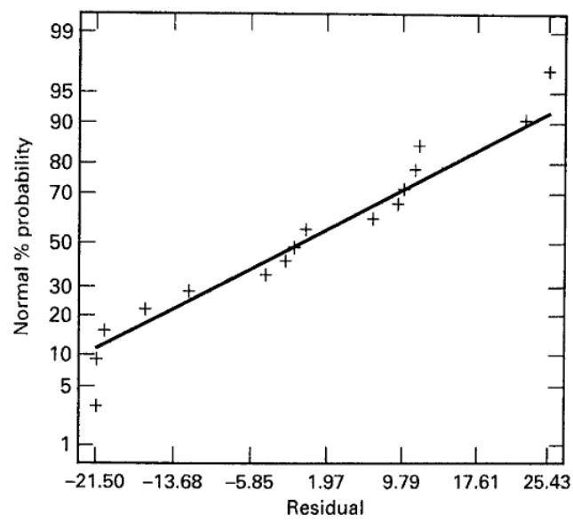
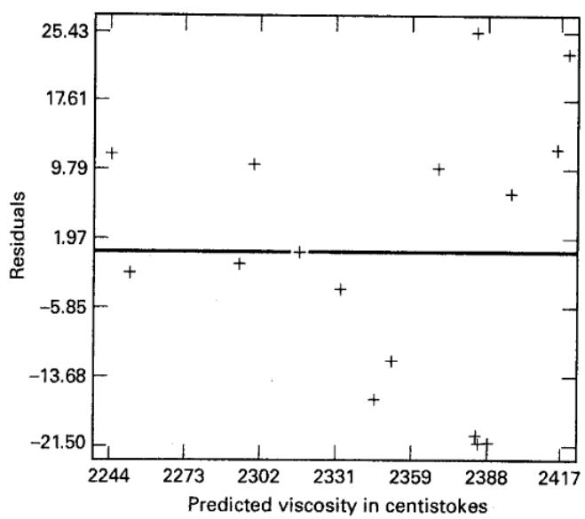
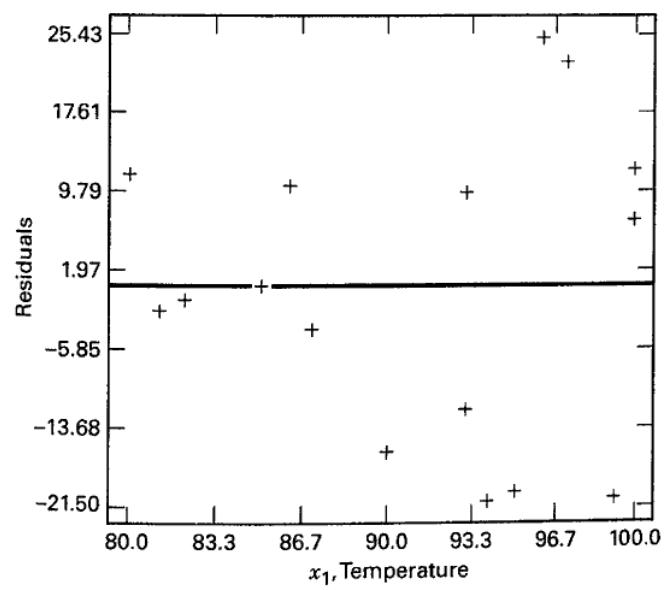
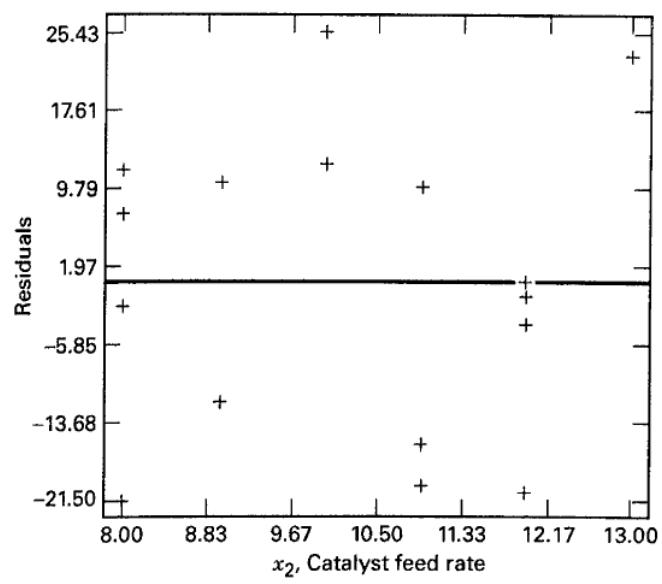
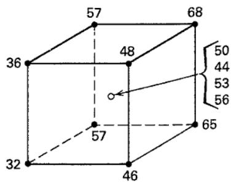

# 10.3 线性回归模型参数的估计

通常用**最小二乘法**估计多元线性回归模型的系数。设有 $n>k$ 个响应观测值 $y_1,\ldots,y_n$，每个 $y_i$ 都伴随各回归变量的一次观测；用 $x_{ij}$ 表示第 $i$ 次观测时变量 $x_j$ 的水平。数据形式见表 10.1。假定误差项满足 $E(\epsilon)=0$、$V(\epsilon)=\sigma^2$，且各 $\epsilon_i$ 互不相关。

**表 10.1** 多元线性回归的数据形式

<table><tr><td> $y$ </td><td> $x_{1}$ </td><td> $x_{2}$ </td><td> $\cdots$ </td><td> $x_{k}$ </td></tr><tr><td> $y_{1}$ </td><td> $x_{11}$ </td><td> $x_{12}$ </td><td> $\cdots$ </td><td> $x_{1k}$ </td></tr><tr><td> $y_{2}$ </td><td> $x_{21}$ </td><td> $x_{22}$ </td><td> $\cdots$ </td><td> $x_{2k}$ </td></tr><tr><td> $\vdots$ </td><td> $\vdots$ </td><td> $\vdots$ </td><td></td><td> $\vdots$ </td></tr><tr><td> $y_{n}$ </td><td> $x_{n1}$ </td><td> $x_{n2}$ </td><td> $\cdots$ </td><td> $x_{nk}$ </td></tr></table>

根据表 10.1，式（10.2）可写为

$$
y_i=\beta_0+\beta_1x_{i1}+\cdots+\beta_kx_{ik}+\epsilon_i
=\beta_0+\sum_{j=1}^k\beta_jx_{ij}+\epsilon_i,
\qquad i=1,\ldots,n.\tag{10.7}
$$

最小二乘法选择使误差平方和最小的系数。其目标函数为

$$
L=\sum_{i=1}^n\epsilon_i^2
=\sum_{i=1}^n\left(y_i-\beta_0-\sum_{j=1}^k\beta_jx_{ij}\right)^2.\tag{10.8}
$$

对 $\beta_0,\ldots,\beta_k$ 求极小值，所得估计量 $\hat\beta_0,\ldots,\hat\beta_k$ 应满足

$$
-2\sum_{i=1}^n\left(y_i-\hat\beta_0-\sum_{j=1}^k\hat\beta_jx_{ij}\right)=0,\tag{10.9a}
$$

以及

$$
-2\sum_{i=1}^n\left(y_i-\hat\beta_0-\sum_{\ell=1}^k\hat\beta_\ell x_{i\ell}\right)x_{ij}=0,
\qquad j=1,\ldots,k.\tag{10.9b}
$$

化简后得到 $p=k+1$ 个**最小二乘正规方程**，每个未知回归系数对应一个方程：

$$
\begin{aligned}
n\hat\beta_0+\sum_{j=1}^k\hat\beta_j\sum_{i=1}^nx_{ij}
&=\sum_{i=1}^ny_i,\\
\hat\beta_0\sum_{i=1}^nx_{ij}
+\sum_{\ell=1}^k\hat\beta_\ell\sum_{i=1}^nx_{ij}x_{i\ell}
&=\sum_{i=1}^nx_{ij}y_i,\quad j=1,\ldots,k.
\end{aligned}\tag{10.10}
$$

解这些方程便得到各回归系数的最小二乘估计。用矩阵形式表达会更简洁。令

$$
\mathbf y=
\begin{bmatrix}y_1\\y_2\\\vdots\\y_n\end{bmatrix},\quad
\mathbf X=
\begin{bmatrix}
1&x_{11}&\cdots&x_{1k}\\
1&x_{21}&\cdots&x_{2k}\\
\vdots&\vdots&&\vdots\\
1&x_{n1}&\cdots&x_{nk}
\end{bmatrix},\quad
\boldsymbol\beta=
\begin{bmatrix}\beta_0\\\beta_1\\\vdots\\\beta_k\end{bmatrix},\quad
\boldsymbol\epsilon=
\begin{bmatrix}\epsilon_1\\\epsilon_2\\\vdots\\\epsilon_n\end{bmatrix}.
$$

则模型为 $\mathbf y=\mathbf X\boldsymbol\beta+\boldsymbol\epsilon$。其中 $\mathbf y$、$\boldsymbol\epsilon$ 为 $n\times1$ 向量，$\mathbf X$ 为 $n\times p$ 矩阵，$\boldsymbol\beta$ 为 $p\times1$ 向量。最小二乘法求使下式最小的 $\hat{\boldsymbol\beta}$：

$$
L=\boldsymbol\epsilon'\boldsymbol\epsilon
=(\mathbf y-\mathbf X\boldsymbol\beta)'(\mathbf y-\mathbf X\boldsymbol\beta).
$$

展开得到

$$
L=\mathbf y'\mathbf y-2\boldsymbol\beta'\mathbf X'\mathbf y
+\boldsymbol\beta'\mathbf X'\mathbf X\boldsymbol\beta.\tag{10.11}
$$

这里利用了 $\boldsymbol\beta'\mathbf X'\mathbf y$ 是标量，等于其转置 $\mathbf y'\mathbf X\boldsymbol\beta$。对 $\boldsymbol\beta$ 求导并令其为零，有

$$
-2\mathbf X'\mathbf y+2\mathbf X'\mathbf X\hat{\boldsymbol\beta}=\mathbf0,
$$

即矩阵形式的正规方程

$$
\mathbf X'\mathbf X\hat{\boldsymbol\beta}=\mathbf X'\mathbf y.\tag{10.12}
$$

在 $\mathbf X'\mathbf X$ 可逆时，两边左乘其逆矩阵，得到[^1]

$$
\hat{\boldsymbol\beta}
=(\mathbf X'\mathbf X)^{-1}\mathbf X'\mathbf y.\tag{10.13}
$$

将式（10.12）的矩阵乘法展开，正好得到式（10.10）的标量方程。$\mathbf X'\mathbf X$ 是 $p\times p$ 对称矩阵，$\mathbf X'\mathbf y$ 是 $p\times1$ 列向量。前者的对角元素是 $\mathbf X$ 各列元素的平方和，非对角元素是相应两列元素的交叉乘积和；后者各元素是 $\mathbf X$ 相应列与观测值 $y_i$ 的交叉乘积和。

拟合值向量为

$$
\hat{\mathbf y}=\mathbf X\hat{\boldsymbol\beta},\tag{10.14}
$$

即 $\hat y_i=\hat\beta_0+\sum_{j=1}^k\hat\beta_jx_{ij}$。实际观测值与拟合值之差称为**残差**，$e_i=y_i-\hat y_i$，残差向量为

$$
\mathbf e=\mathbf y-\hat{\mathbf y}.\tag{10.15}
$$

### 估计 $\sigma^2$

通常还需要估计误差方差 $\sigma^2$。残差平方和为

$$
SS_E=\sum_{i=1}^n(y_i-\hat y_i)^2
=\sum_{i=1}^ne_i^2
=\mathbf e'\mathbf e.
$$

代入 $\mathbf e=\mathbf y-\mathbf X\hat{\boldsymbol\beta}$ 并展开，再利用正规方程 $\mathbf X'\mathbf X\hat{\boldsymbol\beta}=\mathbf X'\mathbf y$，得到

$$
SS_E=\mathbf y'\mathbf y-\hat{\boldsymbol\beta}'\mathbf X'\mathbf y.\tag{10.16}
$$

这个误差平方和对应 $n-p$ 个自由度。可以证明 $E(SS_E)=\sigma^2(n-p)$，因此 $\sigma^2$ 的无偏估计为

$$
\hat\sigma^2=\frac{SS_E}{n-p}.\tag{10.17}
$$

### 估计量的性质

最小二乘法得到的 $\hat{\boldsymbol\beta}$ 是 $\boldsymbol\beta$ 的无偏估计。由 $E(\boldsymbol\epsilon)=\mathbf0$ 与 $(\mathbf X'\mathbf X)^{-1}\mathbf X'\mathbf X=\mathbf I$ 可知

$$
E(\hat{\boldsymbol\beta})
=E[(\mathbf X'\mathbf X)^{-1}\mathbf X'(\mathbf X\boldsymbol\beta+\boldsymbol\epsilon)]
=\boldsymbol\beta.
$$

估计量的方差性质由协方差矩阵给出：

$$
\operatorname{Cov}(\hat{\boldsymbol\beta})
=E\!\left[
(\hat{\boldsymbol\beta}-E\hat{\boldsymbol\beta})
(\hat{\boldsymbol\beta}-E\hat{\boldsymbol\beta})'
\right].\tag{10.18}
$$

这是一个对称矩阵，其第 $i$ 个对角元素为 $\hat\beta_i$ 的方差，第 $(i,j)$ 个元素为 $\hat\beta_i$ 与 $\hat\beta_j$ 的协方差。具体地，

$$
\operatorname{Cov}(\hat{\boldsymbol\beta})
=\sigma^2(\mathbf X'\mathbf X)^{-1}.\tag{10.19}
$$

用式（10.17）的 $\hat\sigma^2$ 代替 $\sigma^2$[^2]，即可估计协方差矩阵；其对角元素的平方根就是各模型参数的标准误。


## 例 10.1

表 10.2 给出了聚合物黏度 $y$ 与两个过程变量——反应温度 $x_1$、催化剂进料速率 $x_2$——的 16 组观测。拟合模型

$$
y=\beta_0+\beta_1x_1+\beta_2x_2+\epsilon.
$$

**表 10.2** 例 10.1 的黏度数据（黏度单位：100 °C 时的厘斯托克斯）

<table><tr><td>观测序号</td><td>温度 ( $x_1$ , °C)</td><td>催化剂进料速率 ( $x_2$ , lb/h)</td><td>黏度</td></tr><tr><td>1</td><td>80</td><td>8</td><td>2256</td></tr><tr><td>2</td><td>93</td><td>9</td><td>2340</td></tr><tr><td>3</td><td>100</td><td>10</td><td>2426</td></tr><tr><td>4</td><td>82</td><td>12</td><td>2293</td></tr><tr><td>5</td><td>90</td><td>11</td><td>2330</td></tr><tr><td>6</td><td>99</td><td>8</td><td>2368</td></tr><tr><td>7</td><td>81</td><td>8</td><td>2250</td></tr><tr><td>8</td><td>96</td><td>10</td><td>2409</td></tr><tr><td>9</td><td>94</td><td>12</td><td>2364</td></tr><tr><td>10</td><td>93</td><td>11</td><td>2379</td></tr><tr><td>11</td><td>97</td><td>13</td><td>2440</td></tr><tr><td>12</td><td>95</td><td>11</td><td>2364</td></tr><tr><td>13</td><td>100</td><td>8</td><td>2404</td></tr><tr><td>14</td><td>85</td><td>12</td><td>2317</td></tr><tr><td>15</td><td>86</td><td>9</td><td>2309</td></tr><tr><td>16</td><td>87</td><td>12</td><td>2328</td></tr></table>

由表中数据构造 $\mathbf X$ 与 $\mathbf y$，计算得到

$$
\mathbf X'\mathbf X=
\begin{bmatrix}
16&1458&164\\
1458&133560&14946\\
164&14946&1726
\end{bmatrix},\qquad
\mathbf X'\mathbf y=
\begin{bmatrix}
37577\\3429550\\385562
\end{bmatrix}.
$$

进一步由式（10.13）求得[^3]

$$
(\mathbf X'\mathbf X)^{-1}\approx
\begin{bmatrix}
14.176004&-0.1297461&-0.2234529\\
-0.1297461&0.001429184&-0.0000476395\\
-0.2234529&-0.0000476395&0.02222381
\end{bmatrix},
\qquad
\hat{\boldsymbol\beta}\approx
\begin{bmatrix}
1566.07777\\7.62129\\8.58485
\end{bmatrix}.
$$

系数保留两位小数，拟合式为

$$
\hat y=1566.08+7.62x_1+8.58x_2.
$$

表 10.3 前三列给出实际响应 $y_i$、拟合值 $\hat y_i$ 和残差。图 10.1 是残差的正态概率图；图 10.2、10.3、10.4 分别是残差对拟合黏度、温度 $x_1$ 和进料速率 $x_2$ 的散点图。与分析设计试验一样，检查残差图是建立回归模型不可缺少的一步。这些图提示，观测黏度越大，其方差也趋于增大；图 10.3 进一步提示，黏度的波动随温度升高而增大。

**表 10.3** 例 10.1 的拟合值、残差及其他诊断量[^4]

<table><tr><td>观测序号 i</td><td> $y_i$ </td><td>拟合值  $\hat{y}_i$ </td><td>残差  $e_i$ </td><td> $h_{ii}$ </td><td>学生化残差</td><td> $D_i$ </td><td>R-student</td></tr><tr><td>1</td><td>2256</td><td>2244.5</td><td>11.5</td><td>0.350</td><td>0.87</td><td>0.137</td><td>0.87</td></tr><tr><td>2</td><td>2340</td><td>2352.1</td><td>-12.1</td><td>0.102</td><td>-0.78</td><td>0.023</td><td>-0.77</td></tr><tr><td>3</td><td>2426</td><td>2414.1</td><td>11.9</td><td>0.177</td><td>0.80</td><td>0.046</td><td>0.79</td></tr><tr><td>4</td><td>2293</td><td>2294.0</td><td>-1.0</td><td>0.251</td><td>-0.07</td><td>0.001</td><td>-0.07</td></tr><tr><td>5</td><td>2330</td><td>2346.4</td><td>-16.4</td><td>0.077</td><td>-1.05</td><td>0.030</td><td>-1.05</td></tr><tr><td>6</td><td>2368</td><td>2389.3</td><td>-21.3</td><td>0.265</td><td>-1.52</td><td>0.277</td><td>-1.61</td></tr><tr><td>7</td><td>2250</td><td>2252.1</td><td>-2.1</td><td>0.319</td><td>-0.15</td><td>0.004</td><td>-0.15</td></tr><tr><td>8</td><td>2409</td><td>2383.6</td><td>25.4</td><td>0.098</td><td>1.64</td><td>0.097</td><td>1.76</td></tr><tr><td>9</td><td>2364</td><td>2385.5</td><td>-21.5</td><td>0.142</td><td>-1.42</td><td>0.111</td><td>-1.48</td></tr><tr><td>10</td><td>2379</td><td>2369.3</td><td>9.7</td><td>0.080</td><td>0.62</td><td>0.011</td><td>0.60</td></tr><tr><td>11</td><td>2440</td><td>2416.9</td><td>23.1</td><td>0.278</td><td>1.66</td><td>0.354</td><td>1.80</td></tr><tr><td>12</td><td>2364</td><td>2384.5</td><td>-20.5</td><td>0.096</td><td>-1.32</td><td>0.062</td><td>-1.36</td></tr><tr><td>13</td><td>2404</td><td>2396.9</td><td>7.1</td><td>0.289</td><td>0.52</td><td>0.036</td><td>0.50</td></tr><tr><td>14</td><td>2317</td><td>2316.9</td><td>0.1</td><td>0.185</td><td>0.01</td><td>0.000</td><td>&lt;0.01</td></tr><tr><td>15</td><td>2309</td><td>2298.8</td><td>10.2</td><td>0.134</td><td>0.67</td><td>0.023</td><td>0.66</td></tr><tr><td>16</td><td>2328</td><td>2332.1</td><td>-4.1</td><td>0.156</td><td>-0.28</td><td>0.005</td><td>-0.27</td></tr></table>



**图 10.1** 例 10.1 残差的正态概率图



**图 10.2** 例 10.1 残差与拟合黏度的关系图



**图 10.3** 例 10.1 残差与温度 $x_1$ 的关系图



**图 10.4** 例 10.1 残差与进料速率 $x_2$ 的关系图

### 使用计算机

回归模型几乎总是借助 Minitab、JMP 等统计软件拟合。表 10.4 是例 10.1 的 Minitab 输出摘录。许多项目与前面设计试验的软件输出具有相似含义。本章后续将详细说明其中的方差分析和 $t$ 检验，以及这些数值的计算方法。

**表 10.4** 例 10.1 黏度回归模型的 Minitab 输出

```txt
Regression Analysis
The regression equation is
Viscosity = 1566 + 7.62 Temp + 8.58 Feed Rate
Predictor Coef Std. Dev. T P
Constant 1566.08 61.59 25.43 0.000
Temp 7.6213 0.6184 12.32 0.000
Feed Rat 8.585 2.439 3.52 0.004
S = 16.36 R-Sq = 92.7% R-Sq (adj) = 91.6%
Analysis of Variance
Source DF SS MS F P
Regression 2 44157 22079 82.50 0.000
Residual Error 13 3479 268
Total 15 47636
Source DF Seq SS
Temp 1 40841
Feed Rat 1 3316
```

### 设计试验中的回归模型拟合

前面多次用回归模型定量表达设计试验的结果。下面先给出一个完整例子，再通过三个简短例子展示回归分析在设计试验中的其他用途。


## 例 10.2 用回归分析 $2^3$ 因子设计

一位化学工程师研究某过程的产率，关注温度、压力和催化剂浓度三个过程变量。每个变量取低、高两个水平，工程师决定进行 $2^3$ 设计，并增加四个中心点。设计及产率见下表和图 10.5，表中同时给出自然水平与二水平因子设计常用的 $\pm1$ 编码。[^5]

<table><tr><td rowspan="2">试验序号</td><td colspan="3">过程变量</td><td colspan="3">编码变量</td><td rowspan="2">产率, y</td></tr><tr><td>温度 (°C)</td><td>压力 (psig)</td><td>浓度 (g/L)</td><td> $x_1$ </td><td> $x_2$ </td><td> $x_3$ </td></tr><tr><td>1</td><td>120</td><td>40</td><td>15</td><td>-1</td><td>-1</td><td>-1</td><td>32</td></tr><tr><td>2</td><td>160</td><td>40</td><td>15</td><td>1</td><td>-1</td><td>-1</td><td>46</td></tr><tr><td>3</td><td>120</td><td>80</td><td>15</td><td>-1</td><td>1</td><td>-1</td><td>57</td></tr><tr><td>4</td><td>160</td><td>80</td><td>15</td><td>1</td><td>1</td><td>-1</td><td>65</td></tr><tr><td>5</td><td>120</td><td>40</td><td>30</td><td>-1</td><td>-1</td><td>1</td><td>36</td></tr><tr><td>6</td><td>160</td><td>40</td><td>30</td><td>1</td><td>-1</td><td>1</td><td>48</td></tr><tr><td>7</td><td>120</td><td>80</td><td>30</td><td>-1</td><td>1</td><td>1</td><td>57</td></tr><tr><td>8</td><td>160</td><td>80</td><td>30</td><td>1</td><td>1</td><td>1</td><td>68</td></tr><tr><td>9</td><td>140</td><td>60</td><td>22.5</td><td>0</td><td>0</td><td>0</td><td>50</td></tr><tr><td>10</td><td>140</td><td>60</td><td>22.5</td><td>0</td><td>0</td><td>0</td><td>44</td></tr><tr><td>11</td><td>140</td><td>60</td><td>22.5</td><td>0</td><td>0</td><td>0</td><td>53</td></tr><tr><td>12</td><td>140</td><td>60</td><td>22.5</td><td>0</td><td>0</td><td>0</td><td>56</td></tr><tr><td colspan="8"> $x_1 = \frac{\text{Temp} - 140}{20}, x_2 = \frac{\text{Pressure} - 60}{20}, x_3 = \frac{\text{Conc} - 22.5}{7.5}$ </td></tr></table>



**图 10.5** 例 10.2 的试验设计

设拟合仅含主效应的模型

$$
y=\beta_0+\beta_1x_1+\beta_2x_2+\beta_3x_3+\epsilon.
$$

表中的 12 次试验给出设计矩阵 $\mathbf X$：前八行的第一列全为 1，后三列按因子水平取 $\pm1$；后四行是 $[1,0,0,0]$。由于 $2^3$ 设计是正交的，加入中心点后仍保持正交，因此

$$
\mathbf X'\mathbf X=\operatorname{diag}(12,8,8,8),\qquad
\mathbf X'\mathbf y=
\begin{bmatrix}612\\45\\85\\9\end{bmatrix}.
$$

逆矩阵也是对角的，故

$$
\hat{\boldsymbol\beta}
=(\mathbf X'\mathbf X)^{-1}\mathbf X'\mathbf y
=
\begin{bmatrix}
51.000\\5.625\\10.625\\1.125
\end{bmatrix},
$$

拟合模型为

$$
\hat y=51.000+5.625x_1+10.625x_2+1.125x_3.
$$

回归系数与通常的 $2^3$ 设计效应估计密切相关。例如，由图 10.5 可算出温度效应

$$
T=\bar y_{T^+}-\bar y_{T^-}
=56.75-45.50=11.25.
$$

$x_1$ 的回归系数正好是效应估计的一半，即 $11.25/2=5.625$。对编码为 $\pm1$ 的正交 $2^k$ 设计，这一关系普遍成立。前面第 6 至 8 章已用它得到多个二水平试验的回归模型、拟合值和残差；此例表明这些效应估计可视为最小二乘估计。

由 $(\mathbf X'\mathbf X)^{-1}$ 的对角元素可得

$$
V(\hat\beta_0)=\frac{\sigma^2}{12},
\qquad
V(\hat\beta_i)=\frac{\sigma^2}{8},\quad i=1,2,3.
$$

相应的相对方差分别为 $1/12$ 与 $1/8$。

例 10.2 中，$\mathbf X'\mathbf X$ 是对角矩阵，所以容易求逆。这种设计的优点不仅是计算简单，还在于不同回归系数的估计量互不相关，即 $\operatorname{Cov}(\hat\beta_i,\hat\beta_j)=0$（$i\ne j$）。如果能在收集数据前选择各 $x$ 变量的水平，就可以有意识地安排试验，使 $\mathbf X'\mathbf X$ 成为对角矩阵。

这在实践中往往不难做到。$\mathbf X'\mathbf X$ 的非对角元素是 $\mathbf X$ 各列的交叉乘积和，因此只需使不同列的内积为零，也就是使这些列相互正交。对于拟合给定回归模型具有这一性质的试验设计，称为**正交设计**。一般而言，$2^k$ 因子设计对于拟合相应的多元线性回归模型是正交设计。

当设计试验出现意外情况时，回归方法尤其有用。例 10.3 和例 10.4 将分别说明缺失观测与因子实际水平不准确时的处理方法。


## 例 10.3 有一个观测值缺失的 $2^3$ 因子设计

仍考虑例 10.2 中含四个中心点的 $2^3$ 设计。假设所有变量均取高水平的第 8 次试验观测值缺失。原因可能是测量系统读数错误、某个因子水平组合无法实现，或试验单元受损等。用剩余 11 个观测拟合相同的仅含主效应模型：

$$
y=\beta_0+\beta_1x_1+\beta_2x_2+\beta_3x_3+\epsilon.
$$

设计矩阵就是例 10.2 的 $\mathbf X$ 删除第 8 行，响应向量也删去第 8 个观测。此时

$$
\mathbf X'\mathbf X=
\begin{bmatrix}
11&-1&-1&-1\\
-1&7&-1&-1\\
-1&-1&7&-1\\
-1&-1&-1&7
\end{bmatrix},
\qquad
\mathbf X'\mathbf y=
\begin{bmatrix}
544\\-23\\17\\-59
\end{bmatrix}.
$$

缺失观测使设计不再正交。其逆矩阵为

$$
(\mathbf X'\mathbf X)^{-1}
=\frac1{104}
\begin{bmatrix}
10&2&2&2\\
2&16&3&3\\
2&3&16&3\\
2&3&3&16
\end{bmatrix}.
$$

按式（10.13）计算，得到[^6]

$$
\hat{\boldsymbol\beta}\approx
\begin{bmatrix}
51.05769\\5.71154\\10.71154\\1.21154
\end{bmatrix},
\qquad
\hat y=51.05769+5.71154x_1+10.71154x_2+1.21154x_3.
$$

与使用全部 12 个观测的例 10.2 相比，回归系数很接近，因此对因子效应的实际结论不会受到严重影响。不过，$\mathbf X'\mathbf X$ 及其逆矩阵不再是对角的，效应估计失去正交性，各回归系数的方差也比完整正交设计中更大。


## 例 10.4 设计因子的实际水平不准确

实施设计试验时，有时难以精确达到并保持规定的因子水平。小偏差通常无关紧要，大偏差则可能造成问题。当实际水平偏离设计值时，回归方法可用于分析所得数据。

表 10.5 给出例 10.2 中 $2^3$ 设计的一个变形：许多实际因子水平与原设计不完全一致，其中温度最难控制。仍拟合仅含主效应的模型

$$
y=\beta_0+\beta_1x_1+\beta_2x_2+\beta_3x_3+\epsilon.
$$

**表 10.5** 例 10.4 的试验设计[^7]

<table><tr><td rowspan="2">试验序号</td><td colspan="3">过程变量</td><td colspan="3">编码变量</td><td rowspan="2">产率 y</td></tr><tr><td>温度 (°C)</td><td>压力 (psig)</td><td>浓度 (g/L)</td><td> $x_1$ </td><td> $x_2$ </td><td> $x_3$ </td></tr><tr><td>1</td><td>125</td><td>41</td><td>14</td><td>-0.75</td><td>-0.95</td><td>-1.133</td><td>32</td></tr><tr><td>2</td><td>158</td><td>40</td><td>15</td><td>0.90</td><td>-1</td><td>-1</td><td>46</td></tr><tr><td>3</td><td>121</td><td>82</td><td>15</td><td>-0.95</td><td>1.1</td><td>-1</td><td>57</td></tr><tr><td>4</td><td>160</td><td>80</td><td>15</td><td>1</td><td>1</td><td>-1</td><td>65</td></tr><tr><td>5</td><td>118</td><td>39</td><td>33</td><td>-1.10</td><td>-1.05</td><td>1.4</td><td>36</td></tr><tr><td>6</td><td>163</td><td>40</td><td>30</td><td>1.15</td><td>-1</td><td>1</td><td>48</td></tr><tr><td>7</td><td>122</td><td>80</td><td>30</td><td>-0.90</td><td>1</td><td>1</td><td>57</td></tr><tr><td>8</td><td>165</td><td>83</td><td>30</td><td>1.25</td><td>1.15</td><td>1</td><td>68</td></tr><tr><td>9</td><td>140</td><td>60</td><td>22.5</td><td>0</td><td>0</td><td>0</td><td>50</td></tr><tr><td>10</td><td>140</td><td>60</td><td>22.5</td><td>0</td><td>0</td><td>0</td><td>44</td></tr><tr><td>11</td><td>140</td><td>60</td><td>22.5</td><td>0</td><td>0</td><td>0</td><td>53</td></tr><tr><td>12</td><td>140</td><td>60</td><td>22.5</td><td>0</td><td>0</td><td>0</td><td>56</td></tr></table>

用实际编码水平建立 $\mathbf X$，并沿用表中产率 $\mathbf y$，得到

$$
\mathbf X'\mathbf X\approx
\begin{bmatrix}
12&0.60&0.25&0.2670\\
0.60&8.18&0.31&-0.1403\\
0.25&0.31&8.5375&-0.3437\\
0.2670&-0.1403&-0.3437&9.2437
\end{bmatrix},
\qquad
\mathbf X'\mathbf y=
\begin{bmatrix}
612\\77.55\\100.7\\19.144
\end{bmatrix}.
$$

由式（10.13）得到

$$
\hat{\boldsymbol\beta}\approx
\begin{bmatrix}
50.49391\\5.40996\\10.16316\\1.07245
\end{bmatrix},
$$

所以系数保留两位小数的拟合式为[^8]

$$
\hat y=50.49+5.41x_1+10.16x_2+1.07x_3.
$$

与例 10.2 各因子水平恰好达到设计值时的模型相比，差别很小。未能精确达到目标水平，看来不会严重改变试验结果的实际解释。


## 例 10.5 分式因子设计中交互作用别名的分离

第 8 章指出，可通过**折叠**（fold over）分离分式因子设计中互为别名的交互作用。对分辨度 III 的设计，完整折叠需要再实施一个所有符号都与原分式相反的分式；合并后便能分离全部主效应与两因子交互作用。

完整折叠的困难在于新增试验与原设计一样多。通常只需增补更少的试验，就能分离某些特别关心的交互作用。**部分折叠**即为此而用。回归方法有助于理解部分折叠为何有效，有时还可找到试验次数更少的增广方案。

设已实施一个 $2_{\mathrm{IV}}^{4-1}$ 设计。表 8.3 给出定义关系 $I=ABCD$ 的主分式。前八次试验后，假设较大的效应为 A、B、C、D（这里忽略与主效应互为别名的三因子交互作用）以及别名链 $AB+CD$。其他两条别名链可以忽略，但 AB、CD 或二者中至少一个显然较大。若实施另一个分式，需要再做八次试验，之后可用全部 16 次试验估计主效应和两因子交互作用。另一种方案是只增加四次试验的部分折叠。

实际上，若只需分离 AB 与 CD，新增次数甚至可少于四次。考虑拟合

$$
y=\beta_0+\beta_1x_1+\beta_2x_2+\beta_3x_3+\beta_4x_4
+\beta_{12}x_1x_2+\beta_{34}x_3x_4+\epsilon,
$$

其中 $x_1,\ldots,x_4$ 分别是 A、B、C、D 的编码变量。表 8.3 的八次试验构成的设计矩阵各行如下：

| 试验 | 截距 | $x_1$ | $x_2$ | $x_3$ | $x_4$ | $x_1x_2$ | $x_3x_4$ |
| ---: | ---: | ---: | ---: | ---: | ---: | ---: | ---: |
| 1 | 1 | −1 | −1 | −1 | −1 | 1 | 1 |
| 2 | 1 | 1 | −1 | −1 | 1 | −1 | −1 |
| 3 | 1 | −1 | 1 | −1 | 1 | −1 | −1 |
| 4 | 1 | 1 | 1 | −1 | −1 | 1 | 1 |
| 5 | 1 | −1 | −1 | 1 | 1 | 1 | 1 |
| 6 | 1 | 1 | −1 | 1 | −1 | −1 | −1 |
| 7 | 1 | −1 | 1 | 1 | −1 | −1 | −1 |
| 8 | 1 | 1 | 1 | 1 | 1 | 1 | 1 |

$x_1x_2$ 列与 $x_3x_4$ 列完全相同，正是 AB 与 CD 互为别名的表现。设计矩阵的列因而线性相关，无法同时估计 $\beta_{12}$ 与 $\beta_{34}$。现在从另一分式增加一次试验，取 $(x_1,x_2,x_3,x_4)=(-1,-1,-1,1)$。其设计矩阵新行是

$$
[1,-1,-1,-1,1,1,-1].
$$

两条交互作用列不再相同，便可在模型中同时拟合 AB 与 CD；所得回归系数大小有助于判断哪个交互作用重要。

不过，只增加一次试验也有缺点。假如前八次与新增试验之间存在时间效应或区组效应，可在设计矩阵中增加一列区组指示：前八行取 $-1$，第九行取 $+1$。该列与各处理效应列的交叉乘积不为零，因而区组与处理不正交；实际上，区组列等于 $x_1x_2-x_3x_4-1$，加入区组效应后无法同时分离它与 AB、CD。要实现区组与处理效应正交，新增试验须使各处理效应列与区组列的交叉乘积为零；新增次数须为偶数。[^9]以下四个试验既可分离 AB 与 CD，也允许正交区组安排：

<table><tr><td> $x_{1}$ </td><td> $x_{2}$ </td><td> $x_{3}$ </td><td> $x_{4}$ </td></tr><tr><td>-1</td><td>-1</td><td>-1</td><td>1</td></tr><tr><td>1</td><td>-1</td><td>-1</td><td>-1</td></tr><tr><td>-1</td><td>1</td><td>1</td><td>1</td></tr><tr><td>1</td><td>1</td><td>1</td><td>-1</td></tr></table>

把这四行加入前述设计矩阵即可验证：新试验中四个主效应列及 AB、CD 两列的元素和均为零，因此区组与这些处理效应正交。两区组大小分别为 8 和 4，若还要使区组列与截距列正交，可以把区组编码改为前八行取 $-1$、后四行取 $+2$。就新增次数而言，这与部分折叠相同。

一般来说，检查分式因子设计中目标模型的设计矩阵，就能判断应增加哪些试验，以分离感兴趣的交互作用。后续给出的回归模型一般结果还能用于评价具体增广策略。计算机最优设计方法也可帮助构造用于分离效应的增广设计，参见第 8 章补充材料。

[^1]: 译者注：式（10.13）使用矩阵逆，隐含 $\mathbf X$ 满列秩的条件；仅有 $n>k$ 并不能保证可逆。

[^2]: 译者注：原文在式（10.19）后称 $\hat\sigma^2$ 来自式（10.12），但式（10.12）是正规方程；方差估计实际见式（10.17）。

[^3]: 译者注：原文 $\mathbf X'\mathbf X$ 逆矩阵的两个对称非对角元素分别印为 $-4.76947\times10^{-5}$ 与 $-4.763947\times10^{-5}$；按表 10.2 复算约为 $-4.763946\times10^{-5}$。

[^4]: 译者注：原文表 10.3 第 13 个观测的残差印为 17.1，但 $2404-2396.9=7.1$，学生化残差 0.52 也支持 7.1；译表据此修正。

[^5]: 译者注：原文例 10.2 的试验表中，第 2、3、6、7 次试验的压力自然水平与编码 $x_2$ 不一致；按编码式 $x_2=(\text{压力}-60)/20$ 及 $2^3$ 设计，译表将这四处自然水平分别改为 40、80、40、80 psig。图 10.5 的顶点响应也与此编码相符。

[^6]: 译者注：第 9 版原书例 10.3 的系数向量印为 $(51.25,5.75,10.75,1.25)'$，但它不满足该页给出的正规方程。按剩余 11 个观测复算，正确向量为 $(2655,297,557,63)'/52$，译文据此修正。英文分节稿标题中的 $2^4$ 也已按第 9 版的 $2^3$ 整理。

[^7]: 译者注：原文表 10.5 第 5 次试验的催化剂浓度为 33 g/L，按编码式 $x_3=(33-22.5)/7.5=1.4$，原表却写 1.14；后续设计矩阵也用 1.4，译表据此修正。

[^8]: 译者注：原文最后的拟合式把 $x_2$ 系数写作 10.61，但前一行估计为 10.16316，保留两位小数应为 10.16。计算还使用了第 1 次试验的三位小数编码 $x_3=-1.133$，因此中间矩阵与用未经舍入水平直接计算的结果略有差别。

[^9]: 译者注：原文称“要正交区组就必须增加偶数次试验”。偶数次是这里实现正交的必要条件，但并非任意偶数个新增试验都能使所有模型列与区组列正交；仍须逐列检查交叉乘积。
