CHAPTER 11

# Response Surface Methods and Designs

## CHAPTER LEARNING OBJECTIVES

1. Understand the sequential nature of most experimentation and how response surface methods play a key role in this process.

2. Know how to use steepest ascent to move from an initial estimate of the best operating conditions toward a region more likely to contain the optimum.

3. Know how to run an experiment to fit a second-order response surface model.

4. Know how to analyze a second-order model.

5. Know how to use multiple response optimization techniques.

6. Understand the important criteria for selecting a response surface design, including design rotatability.

7. Understand why orthogonal designs work well for fitting first-order response surface models.

8. Know the basic types of second-order response surface designs.

9. Understand the basic characteristics of mixture experiments.

10. Understand the use of Scheffé polynomials and the associated simplex lattice designs.

11. Know how to use optimal designs for experiments in constrained mixture regions.

## 11.1 Introduction to Response Surface Methodology

Response surface methodology, or RSM, is a collection of mathematical and statistical techniques useful for the modeling and analysis of problems in which a response of interest is influenced by several variables and the objective is to optimize this response. For example, suppose that a chemical engineer wishes to find the levels of temperature $(x_{1})$ and pressure $(x_{2})$ that maximize the yield (y) of a process. The process yield is a function of the levels of temperature and pressure, say

$$
y = f (x _ {1}, x _ {2}) + \epsilon
$$

where $\epsilon$ represents the noise or error observed in the response $y$ . If we denote the expected response by $E(y) = f(x_{1}, x_{2}) = \eta$ , then the surface represented by

$$
\eta = f (x _ {1}, x _ {2})
$$

is called a response surface.

We usually represent the response surface graphically, such as in Figure 11.1, where $\eta$ is plotted versus the levels of $x_{1}$ and $x_{2}$ . We have seen such response surface plots before, particularly in the chapters on factorial designs. To help visualize the shape of a response surface, we often plot the contours of the response surface as shown in Figure 11.2. In the contour plot, lines of constant response are drawn in the $x_{1}$ , $x_{2}$ plane. Each contour corresponds to a particular height of the response surface. We have also previously seen the utility of contour plots.

In most RSM problems, the form of the relationship between the response and the independent variables is unknown. Thus, the first step in RSM is to find a suitable approximation for the true functional relationship between y and the set of independent variables. Usually, a low-order polynomial in some region of the independent variables is employed. If the response is well modeled by a linear function of the independent variables, then the approximating function is the first-order model

$$
y = \beta_ {0} + \beta_ {1} x _ {1} + \beta_ {2} x _ {2} + \dots + \beta_ {k} x _ {k} + \epsilon\tag{11.1}
$$

If there is curvature in the system, then a polynomial of higher degree must be used, such as the second-order model

$$
y = \beta_ {0} + \sum_ {i = 1} ^ {k} \beta_ {i} x _ {i} + \sum_ {i = 1} ^ {k} \beta_ {i i} x _ {i} ^ {2} + \sum_ {i <   j} \beta_ {i j} x _ {i} x _ {j} + \epsilon\tag{11.2}
$$

Almost all RSM problems use one or both of these models. Of course, it is unlikely that a polynomial model will be a reasonable approximation of the true functional relationship over the entire space of the independent variables, but for a relatively small region they usually work quite well.

The method of least squares, discussed in Chapter 10, is used to estimate the parameters in the approximating polynomials. The response surface analysis is then performed using the fitted surface. If the fitted surface is an adequate approximation of the true response function, then analysis of the fitted surface will be approximately equivalent to analysis of the actual system. The model parameters can be estimated most effectively if proper experimental designs are used to collect the data. Designs for fitting response surfaces are called response surface designs. These designs are discussed in Section 11.4.

  
■ FIGURE 11.1 A three-dimensional response surface showing the expected yield ( $\eta$ ) as a function of temperature ( $x_{1}$ ) and pressure ( $x_{2}$ )

■ FIGURE 11.2 A contour plot of a response surface


RSM is a sequential procedure. Often, when we are at a point on the response surface that is remote from the optimum, such as the current operating conditions in Figure 11.3, there is little curvature in the system and the first-order model will be appropriate. Our objective here is to lead the experimenter rapidly and efficiently along a path of improvement toward the general vicinity of the optimum. Once the region of the optimum has been found, a more elaborate model, such as the second-order model, may be employed, and an analysis may be performed to locate the optimum. From Figure 11.3, we see that the analysis of a response surface can be thought of as “climbing a hill,” where the top of the hill represents the point of maximum response. If the true optimum is a point of minimum response, then we may think of “descending into a valley.”

The eventual objective of RSM is to determine the optimum operating conditions for the system or to determine a region of the factor space in which operating requirements are satisfied. More extensive presentations of RSM are in Khuri and Cornell (1996), Myers, Montgomery, and Anderson-Cook (2016), and Box and Draper (2007). The review paper by Myers et al. (2004) is also a useful reference.

■ FIGURE 11.3 The sequential nature of RSM


## 11.2 The Method of Steepest Ascent

Frequently, the initial estimate of the optimum operating conditions for the system will be far from the actual optimum. In such circumstances, the objective of the experimenter is to move rapidly to the general vicinity of the optimum. We wish to use a simple and economically efficient experimental procedure. When we are remote from the optimum, we usually assume that a first-order model is an adequate approximation to the true surface in a small region of the x's.

The method of steepest ascent is a procedure for moving sequentially in the direction of the maximum increase in the response. Of course, if minimization is desired, then we call this technique the method of steepest descent. The fitted first-order model is

$$
\hat {y} = \hat {\beta_ {0}} + \sum_ {i = 1} ^ {k} \hat {\beta_ {i}} x _ {i}\tag{11.3}
$$

and the first-order response surface, that is, the contours of $\hat{y}$ , is a series of parallel lines as shown in Figure 11.4. The direction of steepest ascent is the direction in which $\hat{y}$ increases most rapidly. This direction is normal to the fitted response surface. We usually take as the path of steepest ascent the line through the center of the region of interest and normal to the fitted surface. Thus, the steps along the path are proportional to the regression coefficients $\{\hat{\beta}_{i}\}$ . The actual step size is determined by the experimenter based on process knowledge or other practical considerations.

Experiments are conducted along the path of steepest ascent until no further increase in response is observed. Then a new first-order model may be fit, a new path of steepest ascent determined, and the procedure continued. Eventually, the experimenter will arrive in the vicinity of the optimum. This is usually indicated by lack of fit of a first-order model. At that time, additional experiments are conducted to obtain a more precise estimate of the optimum.

  
■ FIGURE 11.4 First-order response surface and path of steepest ascent

## EXAMPLE 11.1

A chemical engineer is interested in determining the operating conditions that maximize the yield of a process. Two controllable variables influence process yield: reaction time and reaction temperature. The engineer is currently operating the process with a reaction time of 35 minutes and a temperature of $155^{\circ}$ F, which result in yields of around 40 percent. Because it is unlikely that this region contains the optimum, she fits a first-order model and applies the method of steepest ascent.

The engineer decides that the region of exploration for fitting the first-order model should be (30, 40) minutes of reaction time and (150, 160) Fahrenheit. To simplify the calculations, the independent variables will be coded to the usual $(-1, 1)$ interval. Thus, if $\xi_{1}$ denotes the natural variable time and $\xi_{2}$ denotes the natural variable temperature, then the coded variables are

$$
x _ {1} = \frac {\xi_ {1} - 3 5}{5} \quad \text { and } \quad x _ {2} = \frac {\xi_ {2} - 1 5 5}{5}
$$

The experimental design is shown in Table 11.1. Note that the design used to collect these data is a $2^{2}$ factorial augmented by five center points. Replicates at the center are used to estimate the experimental error and to allow for checking the adequacy of the first-order model. Also, the design is centered about the current operating conditions for the process.

A first-order model may be fit to these data by least squares. Employing the methods for two-level designs, we obtain the following model in the coded variables:

$$
\hat {y} = 4 0. 4 4 + 0. 7 7 5 x _ {1} + 0. 3 2 5 x _ {2}
$$

Before exploring along the path of steepest ascent, the adequacy of the first-order model should be investigated. The $2^{2}$ design with center points allows the experimenter to do the following:

1. Obtain an estimate of error.

2. Check for interactions (cross-product terms) in the model.

3. Check for quadratic effects (curvature).

The replicates at the center can be used to calculate an estimate of error as follows:

$$
\begin{array}{r l} & (4 0. 3) ^ {2} + (4 0. 5) ^ {2} + (4 0. 7) ^ {2} + (4 0. 2) ^ {2} \\ \hat {\sigma} ^ {2} = & \frac {(4 0 . 6) ^ {2} - (2 0 2 . 3) ^ {2} / 5}{4} \\ = & 0. 0 4 3 0 \end{array}
$$

The first-order model assumes that the variables $x_{1}$ and $x_{2}$ have an additive effect on the response. Interaction between the variables would be represented by the coefficient $\beta_{12}$ of a cross-product term $x_{1}x_{2}$ added to the model. The least squares estimate of this coefficient is just one-half the interaction effect calculated as in an ordinary $2^{2}$ factorial design, or

$$
\begin{array}{r l} \hat {\beta} _ {1 2} & = \frac {1}{4} [ (1 \times 3 9. 3) + (1 \times 4 1. 5) + (- 1 \times 4 0. 0) + (- 1 \times 4 0. 9) ] \\ & = \frac {1}{4} (- 0. 1) = - 0. 2 5 \end{array}
$$

## TABLE 11.1

Process Data for Fitting the First-Order Model

<table><tr><td colspan="2">Natural Variables</td><td colspan="2">Coded Variables</td><td>Response</td></tr><tr><td> $\xi_1$ </td><td> $\xi_2$ </td><td> $x_1$ </td><td> $x_2$ </td><td>y</td></tr><tr><td>30</td><td>150</td><td>-1</td><td>-1</td><td>39.3</td></tr><tr><td>30</td><td>160</td><td>-1</td><td>1</td><td>40.0</td></tr><tr><td>40</td><td>150</td><td>1</td><td>-1</td><td>40.9</td></tr><tr><td>40</td><td>160</td><td>1</td><td>1</td><td>41.5</td></tr><tr><td>35</td><td>155</td><td>0</td><td>0</td><td>40.3</td></tr><tr><td>35</td><td>155</td><td>0</td><td>0</td><td>40.5</td></tr><tr><td>35</td><td>155</td><td>0</td><td>0</td><td>40.7</td></tr><tr><td>35</td><td>155</td><td>0</td><td>0</td><td>40.2</td></tr><tr><td>35</td><td>155</td><td>0</td><td>0</td><td>40.6</td></tr></table>

The single-degree-of-freedom sum of squares for interaction is

$$
S S _ {\text { Interaction }} = \frac {(- 0 . 1) ^ {2}}{4} = 0. 0 0 2 5
$$

Comparing $SS_{Interaction}$ to $\hat{\sigma}^2$ gives a lack-of-fit statistic

$$
F = \frac {S S _ {\text { Interaction }}}{\hat {\sigma} ^ {2}} = \frac {0 . 0 0 2 5}{0 . 0 4 3 0} = 0. 0 5 8
$$

which is small, indicating that interaction is negligible.

Another check of the adequacy of the straight-line model is obtained by applying the check for a pure quadratic curvature effect described in Section 6.8. Recall that this consists of comparing the average response at the four points in the factorial portion of the design, say $\overline{y}_{F}=40.425$ , with the average response at the design center, say $\overline{y}_{C}=40.46$ . If there is quadratic curvature in the true response function, then $\overline{y}_{F}-\overline{y}_{C}$ is a measure of this curvature. If $\beta_{11}$ and $\beta_{22}$ are the coefficients of the “pure quadratic” terms $x_{1}^{2}$ and $x_{2}^{2}$ , then $\overline{y}_{F}-\overline{y}_{C}$ is an estimate of $\beta_{11}+\beta_{22}$ . In our example, an estimate of the pure quadratic terms is

$$
\hat {\beta} _ {1 1} + \hat {\beta} _ {2 2} = \overline {{{{y}}}} _ {F} - \overline {{{{y}}}} _ {C} = 4 0. 4 2 5 - 4 0. 4 6 = - 0. 0 3 5
$$

The single-degree-of-freedom sum of squares associated with the null hypothesis, $H_{0}:\beta_{11}+\beta_{22}=0$ , is

$$
\begin{array}{r l} S S _ {\text {Pure Quadratic}} & = \frac {n _ {F} n _ {C} (\overline {{y}} _ {F} - \overline {{y}} _ {C}) ^ {2}}{n _ {F} + n _ {C}} \\ & = \frac {(4) (5) (- 0 . 0 3 5) ^ {2}}{4 + 5} = 0. 0 0 2 7 \end{array}
$$

where $n_{F}$ and $n_{C}$ are the number of points in the factorial portion and the number of center points, respectively. Because

$$
F = \frac {S S _ {\text { Pure   Quadratic }}}{\hat {\sigma} _ {2}} = \frac {0 . 0 0 2 7}{0 . 0 4 3 0} = 0. 0 6 3
$$

is small, there is no indication of a pure quadratic effect.

## TABLE 11.2

Analysis of Variance for the First-Order Model

The analysis of variance for this model is summarized in Table 11.2. Both the interaction and curvature checks are not significant, whereas the F-test for the overall regression is significant. Furthermore, the standard error of $\hat{\beta}_{1}$ and $\hat{\beta}_{2}$ is

$$
s e (\hat {\beta} _ {i}) = \sqrt {\frac {M S _ {E}}{4}} = \sqrt {\frac {\hat {\sigma} ^ {2}}{4}} = \sqrt {\frac {0 . 0 4 3 0}{4}} = 0. 1 0 \quad i = 1, 2
$$

Both regression coefficients $\hat{\beta}_{1}$ and $\hat{\beta}_{2}$ are large relative to their standard errors. At this point, we have no reason to question the adequacy of the first-order model.

To move away from the design center—the point $(x_{1}=0, x_{2}=0)$ —along the path of steepest ascent, we would move 0.775 units in the $x_{1}$ direction for every 0.325 units in the $x_{2}$ direction. Thus, the path of steepest ascent passes through the point $(x_{1}=0, x_{2}=0)$ and has a slope 0.325/0.775. The engineer decides to use 5 minutes of reaction time as the basic step size. Using the relationship between $\xi_{1}$ and $x_{1}$ , we see that 5 minutes of reaction time is equivalent to a step in the coded variable $x_{1}$ of $\Delta x_{1}=1$ . Therefore, the steps along the path of steepest ascent are $\Delta x_{1}=1.0000$ and $\Delta x_{2}=(0.325/0.775)=0.42$ .

The engineer computes points along this path and observes the yields at these points until a decrease in response is noted. The results are shown in Table 11.3 in both coded and natural variables. Although the coded variables are easier to manipulate mathematically, the natural variables must be used in running the process. Figure 11.5 plots the yield at each step along the path of steepest ascent. Increases in response are observed through the tenth step; however, all steps beyond this point result in a decrease in yield. Therefore, another first-order model should be fit in the general vicinity of the point ( $\xi_{1}=85$ , $\xi_{2}=175$ ).

<table><tr><td>Source of Variation</td><td>Sum of Squares</td><td>Degrees of Freedom</td><td>Mean Square</td><td> $F_0$ </td><td>P-Value</td></tr><tr><td>Model ( $\beta_1, \beta_2$ )</td><td>2.8250</td><td>2</td><td>1.4125</td><td>47.83</td><td>0.0002</td></tr><tr><td>Residual</td><td>0.1772</td><td>6</td><td></td><td></td><td></td></tr><tr><td>(Interaction)</td><td>(0.0025)</td><td>1</td><td>0.0025</td><td>0.058</td><td>0.8215</td></tr><tr><td>(Pure quadratic)</td><td>(0.0027)</td><td>1</td><td>0.0027</td><td>0.063</td><td>0.8142</td></tr><tr><td>(Pure error)</td><td>(0.1720)</td><td>4</td><td>0.0430</td><td></td><td></td></tr><tr><td>Total</td><td>3.0022</td><td>8</td><td></td><td></td><td></td></tr></table>

■ TABLE 11.3
Steepest Ascent Experiment for Example 11.1

<table><tr><td rowspan="2">Steps</td><td colspan="2">Coded Variables</td><td colspan="2">Natural Variables</td><td rowspan="2">Response y</td></tr><tr><td> $x_1$ </td><td> $x_2$ </td><td> $\xi_1$ </td><td> $\xi_2$ </td></tr><tr><td>Origin</td><td>0</td><td>0</td><td>35</td><td>155</td><td></td></tr><tr><td>Δ</td><td>1.00</td><td>0.42</td><td>5</td><td>2</td><td></td></tr><tr><td>Origin + Δ</td><td>1.00</td><td>0.42</td><td>40</td><td>157</td><td>41.0</td></tr><tr><td>Origin + 2Δ</td><td>2.00</td><td>0.84</td><td>45</td><td>159</td><td>42.9</td></tr><tr><td>Origin + 3Δ</td><td>3.00</td><td>1.26</td><td>50</td><td>161</td><td>47.1</td></tr><tr><td>Origin + 4Δ</td><td>4.00</td><td>1.68</td><td>55</td><td>163</td><td>49.7</td></tr><tr><td>Origin + 5Δ</td><td>5.00</td><td>2.10</td><td>60</td><td>165</td><td>53.8</td></tr><tr><td>Origin + 6Δ</td><td>6.00</td><td>2.52</td><td>65</td><td>167</td><td>59.9</td></tr><tr><td>Origin + 7Δ</td><td>7.00</td><td>2.94</td><td>70</td><td>169</td><td>65.0</td></tr><tr><td>Origin + 8Δ</td><td>8.00</td><td>3.36</td><td>75</td><td>171</td><td>70.4</td></tr><tr><td>Origin + 9Δ</td><td>9.00</td><td>3.78</td><td>80</td><td>173</td><td>77.6</td></tr><tr><td>Origin + 10Δ</td><td>10.00</td><td>4.20</td><td>85</td><td>175</td><td>80.3</td></tr><tr><td>Origin + 11Δ</td><td>11.00</td><td>4.62</td><td>90</td><td>179</td><td>76.2</td></tr><tr><td>Origin + 12Δ</td><td>12.00</td><td>5.04</td><td>95</td><td>181</td><td>75.1</td></tr></table>

  
■ FIGURE 11.5 Yield versus steps along the path of steepest ascent for Example 11.1

A new first-order model is fit around the point $(\xi_{1}=85,\xi_{2}=175)$ . The region of exploration for $\xi_{1}$ is [80, 90], and it is [170, 180] for $\xi_{2}$ . Thus, the coded variables are

$$
x _ {1} = \frac {\xi_ {1} - 8 5}{5} \quad \text { and } \quad x _ {2} = \frac {\xi_ {2} - 1 7 5}{5}
$$

Once again, a $2^{2}$ design with five center points is used. The experimental design is shown in Table 11.4.

The first-order model fit to the coded variables in Table 11.4 is

$$
\hat {y} = 7 8. 9 7 + 1. 0 0 x _ {1} + 0. 5 0 x _ {2}
$$

The analysis of variance for this model, including the interaction and pure quadratic term checks, is shown in Table 11.5. The interaction and pure quadratic checks imply that the first-order model is not an adequate approximation. This curvature in the true surface may indicate that we are near the optimum. At this point, additional analysis must be done to locate the optimum more precisely.

TABLE 11.4  
Data for Second First-Order Model

<table><tr><td colspan="2">Natural Variables</td><td colspan="2">Coded Variables</td><td rowspan="2">Response y</td></tr><tr><td> $\xi_1$ </td><td> $\xi_2$ </td><td> $x_1$ </td><td> $x_2$ </td></tr><tr><td>80</td><td>170</td><td>-1</td><td>-1</td><td>76.5</td></tr><tr><td>80</td><td>180</td><td>-1</td><td>1</td><td>77.0</td></tr><tr><td>90</td><td>170</td><td>1</td><td>-1</td><td>78.0</td></tr><tr><td>90</td><td>180</td><td>1</td><td>1</td><td>79.5</td></tr><tr><td>85</td><td>175</td><td>0</td><td>0</td><td>79.9</td></tr><tr><td>85</td><td>175</td><td>0</td><td>0</td><td>80.3</td></tr><tr><td>85</td><td>175</td><td>0</td><td>0</td><td>80.0</td></tr><tr><td>85</td><td>175</td><td>0</td><td>0</td><td>79.7</td></tr><tr><td>85</td><td>175</td><td>0</td><td>0</td><td>79.8</td></tr></table>

TABLE 11.5  
Analysis of Variance for the Second First-Order Model

<table><tr><td>Source of Variation</td><td>Sum of Squares</td><td>Degrees of Freedom</td><td>Mean Square</td><td> $F_0$ </td><td>P-Value</td></tr><tr><td>Regression</td><td>5.00</td><td>2</td><td></td><td></td><td></td></tr><tr><td>Residual</td><td>11.1200</td><td>6</td><td></td><td></td><td></td></tr><tr><td>(Interaction)</td><td>(0.2500)</td><td>1</td><td>0.2500</td><td>4.72</td><td>0.0955</td></tr><tr><td>(Pure quadratic)</td><td>(10.6580)</td><td>1</td><td>10.6580</td><td>201.09</td><td>0.0001</td></tr><tr><td>(Pure error)</td><td>(0.2120)</td><td>4</td><td>0.0530</td><td></td><td></td></tr><tr><td>Total</td><td>16.1200</td><td>8</td><td></td><td></td><td></td></tr></table>

We notice from Example 11.1 that the path of steepest ascent is proportional to the signs and magnitudes of the regression coefficients in the fitted first-order model

$$
\hat {y} = \hat {\beta_ {0}} + \sum_ {i = 1} ^ {k} \hat {\beta_ {i}} x _ {i}
$$

It is easy to give a general algorithm for determining the coordinates of a point on the path of steepest ascent. Assume that the point $x_{1}=x_{2}=\cdots=x_{k}=0$ is the base or origin point. Then

1. Choose a step size in one of the process variables, say $\Delta x_{j}$ . Usually, we would select the variable we know the most about, or we would select the variable that has the largest absolute regression coefficient $|\hat{\beta}_{j}|$ .

2. The step size in the other variables is

$$
\Delta x _ {i} = \frac {\hat {\beta} _ {i}}{\hat {\beta} _ {j} / \Delta x _ {j}} \quad i = 1, 2, \dots , k \quad i \neq j
$$

3. Convert the $\Delta x_{i}$ from coded variables to the natural variables.

To illustrate, consider the path of steepest ascent computed in Example 11.1. Because $x_{1}$ has the largest regression coefficient, we select reaction time as the variable in step 1 of the above procedure. Five minutes of reaction time is the step size (based on process knowledge). In terms of the coded variables, this is $\Delta x_{1} = 1.0$ . Therefore, from guideline 2, the step size in temperature is

$$
\Delta x _ {2} = \frac {\hat {\beta} _ {2}}{\hat {\beta} _ {1} / \Delta x _ {1}} = \frac {0 . 3 2 5}{(0 . 7 7 5 / 1 . 0)} = 0. 4 2
$$

To convert the coded step sizes $(\Delta x_{1} = 1.0$ and $\Delta x_{2} = 0.42)$ to the natural units of time and temperature, we use the relationships

$$
\Delta x _ {1} = \frac {\Delta \xi_ {1}}{5} \quad \text { and } \quad \Delta x _ {2} = \frac {\Delta \xi_ {2}}{5}
$$

which results in

$$
\Delta \xi_ {1} = \Delta x _ {1} (5) = 1. 0 (5) = 5 \mathrm{min}
$$

and

$$
\Delta \xi_ {2} = \Delta x _ {2} (5) = 0. 4 2 (5) = 2 ^ {\circ} \mathrm{F}
$$

## 11.3 Analysis of a Second-Order Response Surface

When the experimenter is relatively close to the optimum, a model that incorporates curvature is usually required to approximate the response. In most cases, the second-order model

$$
y = \beta_ {0} + \sum_ {i = 1} ^ {k} \beta_ {i} x _ {i} + \sum_ {i = 1} ^ {k} \beta_ {i i} x _ {i} ^ {2} + \sum_ {i <   j} \sum \beta_ {i j} x _ {i} x _ {j} + \epsilon\tag{11.4}
$$

is adequate. In this section, we will show how to use this fitted model to find the optimum set of operating conditions for the $x$ 's and to characterize the nature of the response surface.

## 11.3.1 Location of the Stationary Point

Suppose we wish to find the levels of $x_{1}, x_{2}, \ldots, x_{k}$ that optimize the predicted response. This point, if it exists, will be the set of $x_{1}, x_{2}, \ldots, x_{k}$ for which the partial derivatives $\partial\hat{y}/\partial x_{1} = \partial\hat{y}/\partial x_{2} = \cdots = \partial\hat{y}/\partial x_{k} = 0$ . This point, say $x_{1,s}, x_{2,s}, \ldots, x_{k,s}$ , is called the stationary point. The stationary point could represent a point of maximum response, a point of minimum response, or a saddle point. These three possibilities are shown in Figures 11.6, 11.7 and 11.8.


  
■ FIGURE 11.6 Response surface and contour plot illustrating a surface with a maximum

  
(a) Response surface

  
(b) Contour plot  
■ FIGURE 11.7 Response surface and contour plot illustrating a surface with a minimum


  
(b) Contour plot  
■ FIGURE 11.8 Response surface and contour plot illustrating a saddle point (or minimax)

Contour plots play a very important role in the study of the response surface. By generating contour plots using computer software for response surface analysis, the experimenter can usually characterize the shape of the surface and locate the optimum with reasonable precision.

We may obtain a general mathematical solution for the location of the stationary point. Writing the fitted second-order model in matrix notation, we have

$$
\hat {y} = \hat {\beta_ {0}} + \mathbf {x ^ {\prime} b} + \mathbf {x ^ {\prime} B x}\tag{11.5}
$$

where

$$
\mathbf {x} = \left[ \begin{array}{c} x _ {1} \\ x _ {2} \\ \vdots \\ x _ {k} \end{array} \right] \quad \mathbf {b} = \left[ \begin{array}{c} \hat {\beta} _ {1} \\ \hat {\beta} _ {2} \\ \vdots \\ \hat {\beta} _ {k} \end{array} \right] \quad \text {and} \quad \mathbf {B} = \left[ \begin{array}{c c c c} \hat {\beta} _ {1 1}, & \hat {\beta} _ {1 2} / 2, & \ldots , & \hat {\beta} _ {1 k} / 2 \\ & \beta_ {2 2}, & \ldots , & \hat {\beta} _ {2 k} / 2 \\ & & \ddots & \\ \text {sym.} & & & \hat {\beta} _ {k k} \end{array} \right]
$$

That is, b is a $(k \times 1)$ vector of the first-order regression coefficients and B is a $(k \times k)$ symmetric matrix whose main diagonal elements are the pure quadratic coefficients $(\hat{\beta}_{ii})$ and whose off-diagonal elements are one-half the mixed quadratic coefficients $(\hat{\beta}_{ij}, i \neq j)$ . The derivative of $\hat{y}$ with respect to the elements of the vector x equated to 0 is

$$
\frac {\partial \hat {y}}{\partial \mathbf {x}} = \mathbf {b} + 2 \mathbf {B x} = \mathbf {0}\tag{11.6}
$$

The stationary point is the solution to Equation 11.6, or

$$
\mathbf {x} _ {\mathrm{s}} = - \frac {1}{2} \mathbf {B} ^ {- 1} \mathbf {b}\tag{11.7}
$$

Furthermore, by substituting Equation 11.7 into Equation 11.5, we can find the predicted response at the stationary point as

$$
\hat {y} _ {\mathrm{s}} = \hat {\beta} _ {0} + \frac {1}{2} \mathbf {x} _ {\mathrm{s}} ^ {\prime} \mathbf {b}\tag{11.8}
$$

## 11.3.2 Characterizing the Response Surface

Once we have found the stationary point, it is usually necessary to characterize the response surface in the immediate vicinity of this point. By characterize, we mean determining whether the stationary point is a point of maximum or minimum response or a saddle point. We also usually want to study the relative sensitivity of the response to the variables $x_{1}, x_{2}, \ldots, x_{k}$ .

As we mentioned previously, the most straightforward way to do this is to examine a contour plot of the fitted model. If there are only two or three process variables (the x's), the construction and interpretation of this contour plot is relatively easy. However, even when there are relatively few variables, a more formal analysis, called the canonical analysis, can be useful.

It is helpful first to transform the model into a new coordinate system with the origin at the stationary point $x_{s}$ and then to rotate the axes of this system until they are parallel to the principal axes of the fitted response surface. This transformation is illustrated in Figure 11.9. We can show that this results in the fitted model

$$
\hat {y} = \hat {y} _ {\mathrm{s}} + \lambda_ {1} w _ {1} ^ {2} + \lambda_ {2} w _ {2} ^ {2} + \dots + \lambda_ {k} w _ {k} ^ {2}\tag{11.9}
$$

where the $\{w_i\}$ are the transformed independent variables and the $\{\lambda_i\}$ are constants. Equation 11.9 is called the canonical form of the model. Furthermore, the $\{\lambda_i\}$ are just the eigenvalues or characteristic roots of the matrix $\mathbf{B}$ .

The nature of the response surface can be determined from the stationary point and the signs and magnitudes of the $\{\lambda_{i}\}$ . First, suppose that the stationary point is within the region of exploration for fitting the second-order model. If the $\{\lambda_{i}\}$ are all positive, $x_{s}$ is a point of minimum response; if the $\{\lambda_{i}\}$ are all negative, $x_{s}$ is a point of maximum response; and if the $\{\lambda_{i}\}$ have different signs, $x_{s}$ is a saddle point. Furthermore, the surface is steepest in the $w_{i}$ direction for which $|\lambda_{i}|$ is the greatest. For example, Figure 11.9 depicts a system for which $x_{s}$ is a maximum ( $\lambda_{1}$ and $\lambda_{2}$ are negative) with $|\lambda_{1}| > |\lambda_{2}|$ .


■ FIGURE 11.9 Canonical form of the second-order model

## EXAMPLE 11.2

We will continue the analysis of the chemical process in Example 11.1. A second-order model in the variables $x_{1}$ and $x_{2}$ cannot be fit using the design in Table 11.4. The experimenter decides to augment this design with enough points to fit a second-order model. $^{1}$ She obtains four observations at $(x_{1}=0, x_{2}=\pm1.414)$ and $(x_{1}=\pm1.414, x_{2}=0)$ . The complete experiment is shown in Table 11.6, and the design is displayed in Figure 11.10. This design is called a central composite design (or CCD) and will be discussed in more detail in Section 11.4.2. In this second phase of the study, two additional responses were of interest: the viscosity and the molecular weight of the product. The responses are also shown in Table 11.6.

## TABLE 11.6

Central Composite Design for Example 11.2

<table><tr><td colspan="2">Natural Variables</td><td colspan="2">Coded Variables</td><td colspan="3">Responses</td></tr><tr><td> $\xi_1$ </td><td> $\xi_2$ </td><td> $x_1$ </td><td> $x_2$ </td><td> $y_1$  (Yield)</td><td> $y_2$  (Viscosity)</td><td> $y_3$  (Molecular Weight)</td></tr><tr><td>80</td><td>170</td><td>-1</td><td>-1</td><td>76.5</td><td>62</td><td>2940</td></tr><tr><td>80</td><td>180</td><td>-1</td><td>1</td><td>77.0</td><td>60</td><td>3470</td></tr><tr><td>90</td><td>170</td><td>1</td><td>-1</td><td>78.0</td><td>66</td><td>3680</td></tr><tr><td>90</td><td>180</td><td>1</td><td>1</td><td>79.5</td><td>59</td><td>3890</td></tr><tr><td>85</td><td>175</td><td>0</td><td>0</td><td>79.9</td><td>72</td><td>3480</td></tr><tr><td>85</td><td>175</td><td>0</td><td>0</td><td>80.3</td><td>69</td><td>3200</td></tr><tr><td>85</td><td>175</td><td>0</td><td>0</td><td>80.0</td><td>68</td><td>3410</td></tr><tr><td>85</td><td>175</td><td>0</td><td>0</td><td>79.7</td><td>70</td><td>3290</td></tr><tr><td>85</td><td>175</td><td>0</td><td>0</td><td>79.8</td><td>71</td><td>3500</td></tr><tr><td>92.07</td><td>175</td><td>1.414</td><td>0</td><td>78.4</td><td>68</td><td>3360</td></tr><tr><td>77.93</td><td>175</td><td>-1.414</td><td>0</td><td>75.6</td><td>71</td><td>3020</td></tr><tr><td>85</td><td>182.07</td><td>0</td><td>1.414</td><td>78.5</td><td>58</td><td>3630</td></tr><tr><td>85</td><td>167.93</td><td>0</td><td>-1.414</td><td>77.0</td><td>57</td><td>3150</td></tr></table>

■ FIGURE 11.10 Central composite design for Example 11.2

We will focus on fitting a quadratic model to the yield response $y_{1}$ (the other responses will be discussed in Section 11.3.4). We generally use computer software to fit a response surface and to construct the contour plots. Table 11.7 contains the output from Design-Expert. From examining this table, we notice that this software package first computes the “sequential or extra sums of squares” for the linear, quadratic, and cubic terms in the model (there is a warning message concerning aliasing in the cubic model because the CCD does not contain enough runs to support a full cubic model). On the basis of the small P-value for the quadratic terms, we decided to fit the second-order model to the yield response. The computer output shows the final model in terms of both the coded variables and the natural or actual factor levels.

Figure 11.11 shows the three-dimensional response surface plot and the contour plot for the yield response in terms of the process variables time and temperature. It is relatively easy to see from examining these figures that the optimum is very near $175^{\circ}$ F and 85 minutes of reaction time and that the response is at a maximum at this point. From examination of the contour plot, we note that the process may be slightly more sensitive to changes in reaction time than to changes in temperature.

We could also find the location of the stationary point using the general solution in Equation 11.7. Note that

$$
\mathbf {b} = \left[ \begin{array}{l} 0. 9 9 5 \\ 0. 5 1 5 \end{array} \right] \quad \mathbf {B} = \left[ \begin{array}{l l} - 1. 3 7 6 & 0. 1 2 5 0 \\ 0. 1 2 5 0 & - 1. 0 0 1 \end{array} \right]
$$

and from Equation 11.7, the stationary point is

$$
\begin{array}{r l} \mathbf {x} _ {s} & = - \frac {1}{2} \mathbf {B} ^ {- 1} \mathbf {b} \\ & = - \frac {1}{2} \left[ \begin{array}{l l} - 0. 7 3 4 5 & - 0. 0 9 1 7 \\ - 0. 0 9 1 7 & - 1. 0 0 9 6 \end{array} \right] \left[ \begin{array}{l} 0. 9 9 5 \\ 0. 5 1 5 \end{array} \right] = \left[ \begin{array}{l} 0. 3 8 9 \\ 0. 3 0 6 \end{array} \right] \end{array}
$$


That is, $x_{1,s} = 0.389$ and $x_{2,s} = 0.306$ . In terms of the natural variables, the stationary point is

$$
0. 3 8 9 = \frac {\xi_ {1} - 8 5}{5} \quad 0. 3 0 6 = \frac {\xi_ {1} - 1 7 5}{5}
$$

which yields $\xi_{1}=86.95\simeq87$ minutes of reaction time and $\xi_{2}=176.53\simeq176.5^{\circ}\mathrm{F}$ . This is very close to the stationary point found by visual examination of the contour plot in Figure 11.11. Using Equation 11.8, we may find the predicted response at the stationary point as $\hat{y}_{s}=80.21$ .

We may also use the canonical analysis described in this section to characterize the response surface. First, it is necessary to express the fitted model in canonical form (Equation 11.9). The eigenvalues $\lambda_{1}$ and $\lambda_{2}$ are the roots of the determinantal equation

$$
\begin{array}{c} {{| \mathbf {B} - \lambda \mathbf {I} | = 0}} \\ {{\left| \begin{array}{c c} {{- 1. 3 7 6 - \lambda}} & {{0. 1 2 5 0}} \\ {{0. 1 2 5 0}} & {{- 1. 0 0 1 - \lambda}} \end{array} \right| = 0}} \end{array}
$$

which reduces to

$$
\lambda^ {2} + 2. 3 7 8 8 \lambda + 1. 3 6 3 9 = 0
$$

The roots of this quadratic equation are $\lambda_{1} = -0.9634$ and $\lambda_{2} = -1.4141$ . Thus, the canonical form of the fitted model is

$$
\hat {y} = 8 0. 2 1 - 0. 9 6 3 4 w _ {1} ^ {2} - 1. 4 1 4 1 w _ {2} ^ {2}
$$

Because both $\lambda_{1}$ and $\lambda_{2}$ are negative and the stationary point is within the region of exploration, we conclude that the stationary point is a maximum.

TABLE 11.7  
Computer Output from Design-Expert for Fitting a Model to the Yield Response in Example 11.2

<table><tr><td>Source</td><td>Sum of Squares</td><td>DF</td><td>Mean Square</td><td>F Value</td><td>Prob &gt; F</td><td></td></tr><tr><td>Mean</td><td>80062.16</td><td>1</td><td>80062.16</td><td></td><td></td><td></td></tr><tr><td>Linear</td><td>10.04</td><td>2</td><td>5.02</td><td>2.69</td><td>0.1166</td><td></td></tr><tr><td>2FI</td><td>0.25</td><td>1</td><td>0.25</td><td>0.12</td><td>0.7350</td><td></td></tr><tr><td>Quadratic</td><td>17.95</td><td>2</td><td>8.98</td><td>126.88</td><td>&lt;0.001</td><td>Suggested</td></tr><tr><td>Cubic</td><td>2.042E-003</td><td>2</td><td>1.021E-003</td><td>0.010</td><td>0.9897</td><td>Aliased</td></tr><tr><td>Residual</td><td>0.49</td><td>5</td><td>0.099</td><td></td><td></td><td></td></tr><tr><td>Total</td><td>80090.90</td><td>13</td><td>6160.84</td><td></td><td></td><td></td></tr></table>

"Sequential Model Sum of Squares": Select the highest order polynomial where the additional terms are significant.

Lack-of-Fit Tests

<table><tr><td>Source</td><td>Sum of Squares</td><td>DF</td><td>Mean Square</td><td>F Value</td><td>Prob &gt; F</td><td></td></tr><tr><td>Linear</td><td>18.49</td><td>6</td><td>3.08</td><td>58.14</td><td>0.0008</td><td></td></tr><tr><td>2FI</td><td>18.24</td><td>5</td><td>3.65</td><td>68.82</td><td>0.0006</td><td></td></tr><tr><td>Quadratic</td><td>0.28</td><td>3</td><td>0.094</td><td>1.78</td><td>0.2897</td><td>Suggested</td></tr><tr><td>Cubic</td><td>0.28</td><td>1</td><td>0.28</td><td>5.31</td><td>0.0826</td><td>Aliased</td></tr><tr><td>Pure Error</td><td>0.21</td><td>4</td><td>0.053</td><td></td><td></td><td></td></tr></table>

"Lack-of-Fit Tests": Want the selected model to have insignificant lack-of-fit.

Model summary Statistics

<table><tr><td>Source</td><td>Std. Dev.</td><td>R-Squared</td><td>Adjusted R-Squared</td><td>Predicted R-Squared</td><td>PRESS</td><td></td></tr><tr><td>Linear</td><td>1.37</td><td>0.3494</td><td>0.2193</td><td>-0.0435</td><td>29.99</td><td></td></tr><tr><td>2FI</td><td>1.43</td><td>0.3581</td><td>0.1441</td><td>-0.2730</td><td>36.59</td><td></td></tr><tr><td>Quadratic</td><td>0.27</td><td>0.9828</td><td>0.9705</td><td>0.9184</td><td>2.35</td><td>Suggested</td></tr><tr><td>Cubic</td><td>0.31</td><td>0.9828</td><td>0.9588</td><td>0.3622</td><td>18.33</td><td>Aliased</td></tr></table>

"Model Summary Statistics": Focus on the model minimizing the "PRESS," or equivalently maximizing the "PRED R-SQR."  
Response: yield

## ANOVA for Response Surface Quadratic Model

Analysis of variance table [Partial sum of squares]

<table><tr><td>Source</td><td>Sum of Squares</td><td>DF</td><td>Mean Square</td><td>F Value</td><td>Prob &gt; F</td></tr><tr><td>Model</td><td>28.25</td><td>5</td><td>5.65</td><td>79.85</td><td>&lt;0.0001</td></tr><tr><td>A</td><td>7.92</td><td>1</td><td>7.92</td><td>111.93</td><td>&lt;0.0001</td></tr><tr><td>B</td><td>2.12</td><td>1</td><td>2.12</td><td>30.01</td><td>0.0009</td></tr><tr><td> $A^2$ </td><td>13.18</td><td>1</td><td>13.18</td><td>186.22</td><td>&lt;0.0001</td></tr><tr><td> $B^2$ </td><td>6.97</td><td>1</td><td>6.97</td><td>98.56</td><td>&lt;0.0001</td></tr><tr><td>AB</td><td>0.25</td><td>1</td><td>0.25</td><td>3.53</td><td>0.1022</td></tr><tr><td>Residual</td><td>0.50</td><td>7</td><td>0.071</td><td></td><td></td></tr><tr><td>Lack of Fit</td><td>0.28</td><td>3</td><td>0.094</td><td>1.78</td><td>0.2897</td></tr><tr><td>Pure Error</td><td>0.21</td><td>4</td><td>0.053</td><td></td><td></td></tr><tr><td>Cor Total</td><td>28.74</td><td>12</td><td></td><td></td><td></td></tr></table>

<table><tr><td>Std. Dev.</td><td>0.27</td><td>R-Squared</td><td>0.9828</td></tr><tr><td>Mean</td><td>78.48</td><td>Adj R-Squared</td><td>0.9705</td></tr><tr><td>C.V.</td><td>0.34</td><td>Pred R-Squared</td><td>0.9184</td></tr><tr><td>PRESS</td><td>2.35</td><td>Adeq Precision</td><td>23.018</td></tr></table>

■ TABLE 11.7 (Continued)

<table><tr><td>Factor</td><td>Coefficient Estimate</td><td>DF</td><td>Standard Error</td><td>95% CI Low</td><td>95% CI High</td><td>VIF</td></tr><tr><td>Intercept</td><td>79.94</td><td>1</td><td>0.12</td><td>79.66</td><td>80.22</td><td></td></tr><tr><td>A-time</td><td>0.99</td><td>1</td><td>0.094</td><td>0.77</td><td>1.22</td><td>1.00</td></tr><tr><td>B-temp</td><td>0.52</td><td>1</td><td>0.094</td><td>0.29</td><td>0.74</td><td>1.00</td></tr><tr><td> $A^{2}$ </td><td>-1.38</td><td>1</td><td>0.10</td><td>-1.61</td><td>-1.14</td><td>1.02</td></tr><tr><td> $B^{2}$ </td><td>-1.00</td><td>1</td><td>0.10</td><td>-1.24</td><td>-0.76</td><td>1.02</td></tr><tr><td>AB</td><td>0.25</td><td>1</td><td>0.13</td><td>-0.064</td><td>0.56</td><td>1.00</td></tr></table>

Final Equation in Terms of Coded Factors:

$$
+ 0. 9 9 \mathrm {\astA}
$$

$$
- 1. 0 0 * \mathbf {B} ^ {2}
$$

$$
+ 0. 2 5 \mathrm {\astA*B}
$$

Final Equation in Terms of Actual Factors:

yield =  
-1430.52285  
+7.80749 \* time  
+13.27053 \* temp  
-0.055050 \* time²  
-0.040050 \* temp²  
+0.010000 \* time \* temp

Diagnostics Case Statistics

<table><tr><td>Run Order</td><td>Standard Order</td><td>Actual Value</td><td>Predicted Value</td><td>Residual</td><td>Leverage</td><td>Student Residual</td><td>Cook&#x27;s Distance</td><td>Outlier t</td></tr><tr><td>8</td><td>1</td><td>76.50</td><td>76.30</td><td>0.20</td><td>0.625</td><td>1.213</td><td>0.409</td><td>1.264</td></tr><tr><td>6</td><td>2</td><td>78.00</td><td>77.79</td><td>0.21</td><td>0.625</td><td>1.275</td><td>0.452</td><td>1.347</td></tr><tr><td>9</td><td>3</td><td>77.00</td><td>76.83</td><td>0.17</td><td>0.625</td><td>1.027</td><td>0.293</td><td>1.032</td></tr><tr><td>11</td><td>4</td><td>79.50</td><td>79.32</td><td>0.18</td><td>0.625</td><td>1.089</td><td>0.329</td><td>1.106</td></tr><tr><td>12</td><td>5</td><td>75.60</td><td>75.78</td><td>-0.18</td><td>0.625</td><td>-1.107</td><td>0.341</td><td>-1.129</td></tr><tr><td>10</td><td>6</td><td>78.40</td><td>78.59</td><td>-0.19</td><td>0.625</td><td>-1.195</td><td>0.396</td><td>-1.240</td></tr><tr><td>7</td><td>7</td><td>77.00</td><td>77.21</td><td>-0.21</td><td>0.625</td><td>-1.283</td><td>0.457</td><td>-1.358</td></tr><tr><td>1</td><td>8</td><td>78.50</td><td>78.67</td><td>-0.17</td><td>0.625</td><td>-1.019</td><td>0.289</td><td>-1.023</td></tr><tr><td>5</td><td>9</td><td>79.90</td><td>79.94</td><td>-0.040</td><td>0.200</td><td>-0.168</td><td>0.001</td><td>-0.156</td></tr><tr><td>3</td><td>10</td><td>80.30</td><td>79.94</td><td>0.36</td><td>0.200</td><td>1.513</td><td>0.095</td><td>1.708</td></tr><tr><td>13</td><td>11</td><td>80.00</td><td>79.94</td><td>0.060</td><td>0.200</td><td>0.252</td><td>0.003</td><td>0.235</td></tr><tr><td>2</td><td>12</td><td>79.70</td><td>79.94</td><td>-0.24</td><td>0.200</td><td>-1.009</td><td>0.042</td><td>-1.010</td></tr><tr><td>4</td><td>13</td><td>79.80</td><td>79.94</td><td>-0.14</td><td>0.200</td><td>-0.588</td><td>0.014</td><td>0.559</td></tr></table>


  
■ FIGURE 11.11 Contour and response surface plots of the yield response, Example 11.2

In some RSM problems, it may be necessary to find the relationship between the canonical variables $\{w_{i}\}$ and the design variables $\{x_{i}\}$ . This is particularly true if it is impossible to operate the process at the stationary point. As an illustration, suppose that in Example 11.2 we could not operate the process at $\xi_{1}=87$ minutes and $\xi_{2}=176.5^{\circ}F$ because this combination of factors results in excessive cost. We now wish to “back away” from the stationary point to a point of lower cost without incurring large losses in yield. The canonical form of the model indicates that the surface is less sensitive to yield loss in the $w_{1}$ direction. Exploration of the canonical form requires converting points in the $(w_{1},w_{2})$ space to points in the $(x_{1},x_{2})$ space.

In general, the variables x are related to the canonical variables w by

$$
\mathbf {w} = \mathbf {M} ^ {\prime} (\mathbf {x} - \mathbf {x} _ {s})
$$

where $\mathbf{M}$ is a $(k\times k)$ orthogonal matrix. The columns of $\mathbf{M}$ are the normalized eigenvectors associated with the $\{\lambda_i\}$ . That is, if $\mathbf{m}_i$ is the $i$ th column of $\mathbf{M}$ , then $\mathbf{m}_i$ is the solution to

$$
(\mathbf {B} - \lambda_ {i} \mathbf {I}) \mathbf {m} _ {i} = \mathbf {0}\tag{11.10}
$$

for which $\sum_{j=1}^{k} m_{ji}^2 = 1$ .

We illustrate the procedure using the fitted second-order model in Example 11.2. For $\lambda_{1} = -0.9634$ , Equation 11.10 becomes

$$
\left[ \begin{array}{c c} (- 1. 3 7 6 + 0. 9 6 3 4) & 0. 1 2 5 0 \\ 0. 1 2 5 0 & (- 1. 0 0 1 + 0. 9 6 3 4) \end{array} \right] \left[ \begin{array}{c} m _ {1 1} \\ m _ {2 1} \end{array} \right] = \left[ \begin{array}{c} 0 \\ 0 \end{array} \right]
$$

or

$$
\begin{array}{r} - 0. 4 1 2 9 m _ {1 1} + 0. 1 2 5 0 m _ {2 1} = 0 \\ 0. 1 2 5 0 m _ {1 1} + 0. 0 3 7 7 m _ {2 1} = 0 \end{array}
$$

We wish to obtain the normalized solution to these equations, that is, the one for which $m_{11}^{2} + m_{21}^{2} = 1$ . There is no unique solution to these equations, so it is most convenient to assign an arbitrary value to one unknown, solve the system, and normalize the solution. Letting $m_{21}^{*} = 1$ , we find $m_{11}^{*} = 0.3027$ . To normalize this solution, we divide $m_{11}^{*}$ and $m_{21}^{*}$ by

$$
\sqrt {(m _ {1 1} ^ {*}) ^ {2} + (m _ {2 1} ^ {*}) ^ {2}} = \sqrt {(0 . 3 0 2 7) ^ {2} + (1) ^ {2}} = 1. 0 4 4 8
$$

This yields the normalized solution

$$
m _ {1 1} = \frac {m _ {1 1} ^ {*}}{1 . 0 4 4 8} = \frac {0 . 3 0 2 7}{1 . 0 4 4 8} = 0. 2 8 9 8
$$

and

$$
m _ {2 1} = \frac {m _ {2 1} ^ {*}}{1 . 0 4 4 8} = \frac {1}{1 . 0 4 4 8} = 0. 9 5 7 1
$$

which is the first column of the M matrix.

Using $\lambda_{2} = -1.4141$ , we can repeat the above procedure, obtaining $m_{12} = -0.9571$ and $m_{22} = 0.2898$ as the second column of M. Thus, we have

$$
\mathbf {M} = \left[ \begin{array}{c c} 0. 2 8 9 8 & - 0. 9 5 7 1 \\ 0. 9 5 7 1 & 0. 2 8 9 8 \end{array} \right]
$$

The relationship between the w and x variables is

$$
\left[ \begin{array}{c} w _ {1} \\ w _ {2} \end{array} \right] = \left[ \begin{array}{c c} 0. 2 8 9 8 & 0. 9 5 7 1 \\ - 0. 9 5 7 4 & 0. 2 8 9 8 \end{array} \right] \left[ \begin{array}{c} x _ {1} - 0. 3 8 9 \\ x _ {2} - 0. 3 0 6 \end{array} \right]
$$

or

$$
\begin{array}{c} w _ {1} = 0. 2 8 9 7 (x _ {1} - 0. 3 8 9) + 0. 9 5 7 1 (x _ {2} - 0. 3 0 6) \\ w _ {2} = - 0. 9 5 7 4 (x _ {1} - 0. 3 8 9) + 0. 2 8 8 8 (x _ {2} - 0. 3 0 6) \end{array}
$$

If we wished to explore the response surface in the vicinity of the stationary point, we could determine appropriate points at which to take observations in the $(w_{1}, w_{2})$ space and then use the above relationship to convert these points into the $(x_{1}, x_{2})$ space so that the runs may be made.

## 11.3.3 Ridge Systems

It is not unusual to encounter variations of the pure maximum, minimum, or saddle point response surfaces discussed in the previous section. Ridge systems, in particular, are fairly common. Consider the canonical form of the second-order model given previously in Equation 11.9:

$$
\hat {y} = \hat {y} _ {\mathrm{s}} + \lambda_ {1} w _ {1} ^ {2} + \lambda_ {2} w _ {2} ^ {2} + \dots + \lambda_ {k} w _ {k} ^ {2}
$$

Now suppose that the stationary point $x_{s}$ is within the region of experimentation; furthermore, let one or more of the $\lambda_{i}$ be very small (e.g., $\lambda_{i} \simeq 0$ ). The response variable is then very insensitive to the variables $w_{i}$ multiplied by the small $\lambda_{i}$ . A contour plot illustrating this situation is shown in Figure 11.12 for k = 2 variables with $\lambda_{1} = 0$ . (In practice, $\lambda_{1}$ would be close to but not exactly equal to zero.) The canonical model for this response surface is theoretically

$$
\hat {y} = \hat {y} _ {\mathrm{s}} + \lambda_ {2} w _ {2} ^ {2}
$$

with $\lambda_{2}$ negative. Notice that the severe elongation in the $w_{1}$ direction has resulted in a line of centers at $\hat{y}=70$ and the optimum may be taken anywhere along that line. This type of response surface is called a stationary ridge system.

  
■ FIGURE 11.12 A contour plot of a stationary ridge system

  
■ FIGURE 11.13 A contour plot of a rising ridge system

If the stationary point is far outside the region of exploration for fitting the second-order model and one (or more) $\lambda_{i}$ is near zero, then the surface may be a rising ridge. Figure 11.13 illustrates a rising ridge for k = 2 variables with $\lambda_{1}$ near zero and $\lambda_{2}$ negative. In this type of ridge system, we cannot draw inferences about the true surface or the stationary point because $x_{s}$ is outside the region where we have fit the model. However, further exploration is warranted in the $w_{1}$ direction. If $\lambda_{2}$ had been positive, we would call this system a falling ridge.

## 11.3.4 Multiple Responses

Many response surface problems involve the analysis of several responses. For instance, in Example 11.2, the experimenter measured three responses. In this example, we optimized the process with respect to only the yield response $y_{1}$ .

Simultaneous consideration of multiple responses involves first building an appropriate response surface model for each response and then trying to find a set of operating conditions that in some sense optimizes all responses or at least keeps them in desired ranges. An extensive treatment of the multiple response problem is given in Myers, Montgomery, and Anderson-Cook (2016).

We may obtain models for the viscosity and molecular weight responses ( $y_{2}$ and $y_{3}$ , respectively) in Example 11.2 as follows:

$$
\begin{array}{l} \hat {y} _ {2} = 7 0. 0 0 - 0. 1 6 x _ {2} - 0. 9 5 x _ {2} - 0. 6 9 x _ {1} ^ {2} - 6. 6 9 x _ {2} ^ {2} - 1. 2 5 x _ {1} x _ {2} \\ \hat {y} _ {3} = 3 3 8 6. 2 + 2 0 5. 1 x _ {1} + 1 7 7. 4 x _ {2} \end{array}
$$

In terms of the natural levels of time $(\xi_{1})$ and temperature $(\xi_{2})$ , these models are

$$
\begin{array}{r l} \hat {y} _ {2} & = - 9 0 3 0. 7 4 + 1 3. 3 9 3 \xi_ {1} + 9 7. 7 0 8 \xi_ {2} \\ & - 2. 7 5 \times 1 0 ^ {- 2} \xi_ {1} ^ {2} - 0. 2 6 7 5 7 \xi_ {2} ^ {2} - 5 \times 1 0 ^ {- 2} \xi_ {1} \xi_ {2} \end{array}
$$

and

$$
\hat {y} _ {3} = - 6 3 0 8. 8 + 4 1. 0 2 5 \xi_ {1} + 3 5. 4 7 3 \xi_ {2}
$$

Figures 11.14 and 11.15 present the contour and response surface plots for these models.

A relatively straightforward approach to optimizing several responses that works well when there are only a few process variables is to overlay the contour plots for each response. Figure 11.16 shows an overlay plot for the three responses in Example 11.2, with contours for which $y_{1}$ (yield) $\geq 78.5$ , $62 \leq y_{2}$ (viscosity) $\leq 68$ , and $y_{3}$ (molecular weight Mn) $\leq 3400$ . If these boundaries represent important conditions that must be met by the process, then as the unshaded portion of Figure 11.16 shows, a number of combinations of time and temperature will result in a satisfactory process. The experimenter can visually examine the contour plot to determine appropriate operating conditions. For example, it is likely that the experimenter would be most interested in the larger of the two feasible operating regions shown in Figure 11.16.

  
(a) The contour plot

  
(b) The response surface plot  
■ FIGURE 11.14 Contour plot and response surface plot of viscosity, Example 11.2

  
(a) The contour plot

  
(b) The response surface plot  
■ FIGURE 11.15 Contour plot and response surface plot of molecular weight, Example 11.2

When there are more than three design variables, overlaying contour plots becomes awkward because the contour plot is two dimensional, and k - 2 of the design variables must be held constant to construct the graph. Often a lot of trial and error is required to determine which factors to hold constant and what levels to select to obtain the best view of the surface. Therefore, there is practical interest in more formal optimization methods for multiple responses.


■ FIGURE 11.16 Region of the optimum found by overlaying yield, viscosity, and molecular weight response surfaces, Example 11.2

A popular approach is to formulate and solve the problem as a constrained optimization problem. To illustrate using Example 11.2, we might formulate the problem as

$$
\begin{array}{c} \text { Max } y _ {1} \\ \text { subject   to } \\ 6 2 \leq y _ {2} \leq 6 8 \\ y _ {3} \leq 3 4 0 0 \end{array}
$$

Many numerical techniques can be used to solve this problem. Sometimes these techniques are referred to as nonlinear programming methods. The Design-Expert software package solves this version of the problem using a direct search procedure. The two solutions found are

$$
\mathrm{time} = 8 3. 5 \quad \mathrm{temp} = 1 7 7. 1 \quad \hat {y} _ {1} = 7 9. 5
$$

and

$$
\mathrm{time} = 8 6. 6 \quad \mathrm{temp} = 1 7 2. 2 5 \quad \hat {y} _ {1} = 7 9. 5
$$

Notice that the first solution is in the upper (smaller) feasible region of the design space (refer to Figure 11.16), whereas the second solution is in the larger region. Both solutions are very near to the boundary of the constraints.

Another useful approach to optimization of multiple responses is to use the simultaneous optimization technique popularized by Derringer and Suich (1980). Their procedure makes use of desirability functions. The general approach is to first convert each response $y_{i}$ into an individual desirability function $d_{i}$ that varies over the range

$$
0 \leq d _ {i} \leq 1
$$

where if the response $y_{i}$ is at its goal or target, then $d_{i}=1$ and if the response is outside an acceptable region, $d_{i}=0$ . Then the design variables are chosen to maximize the overall desirability

$$
D = (d _ {1} \cdot d _ {2} \cdot \cdot \cdot d _ {m}) ^ {1 / m}
$$

where there are m responses. The overall desirability will be zero if any of the individual responses is undesirable.

The individual desirability functions are structured as shown in Figure 11.17. If the objective or target T for the response y is a maximum value,

$$
d = \left\{ \begin{array}{c c} 0 & y <   L \\ \left(\frac {y - L}{T - L}\right) ^ {r} & L \leq y \leq T \\ 1 & y > T \end{array} \right.\tag{11.11}
$$

when the weight r = 1, the desirability function is linear. Choosing r > 1 places more emphasis on being close to the target value and choosing 0 < r < 1 makes this less important. If the target for the response is a minimum value,

$$
d = \left\{ \begin{array}{c c} 1 & y <   T \\ \left(\frac {U - y}{U - T}\right) ^ {r} & T \leq y \leq U \\ 0 & y > U \end{array} \right.\tag{11.12}
$$

  
(a) Objective (target) is to maximize $y$

  
(b) Objective (target) is to minimize y

  
(c) Objective is for y to be as close as possible to the target  
■ FIGURE 11.17 Individual desirability functions for simultaneous optimization

The two-sided desirability function shown in Figure 11.17c assumes that the target is located between the lower $(L)$ and upper $(U)$ limits and is defined as

$$
d = \left\{ \begin{array}{c c} 0 & y <   L \\ \left(\frac {y - L}{T - L}\right) ^ {r _ {1}} & L \leq y \leq T \\ \left(\frac {U - y}{U - T}\right) ^ {r _ {2}} & T \leq y \leq U \\ 0 & y > U \end{array} \right.\tag{11.13}
$$

The Design-Expert software package was used to solve Example 11.2 using the desirability function approach. We chose T = 80 as the target for the yield response with U = 70 and set the weight for this individual desirability equal to unity. We set T = 65 for the viscosity response with L = 62 and U = 68 (to be consistent with specifications), with both weights $r_{1} = r_{2} = 1$ . Finally, we indicated that any molecular weight between 3200 and 3400 was acceptable. Two solutions were found.

## Solution 1

<table><tr><td rowspan="2">Solution 2</td><td>Time = 86.5 $\hat{y}_{1} = 78.8$ </td><td>Temp = 170.5 $\hat{y}_{2} = 65$ </td><td>D = 0.822 $\hat{y}_{3} = 3287$ </td></tr><tr><td>Time = 82 $\hat{y}_{1} = 78.5$ </td><td>Temp = 178.8 $\hat{y}_{2} = 65$ </td><td>D = 0.792 $\hat{y}_{3} = 3400$ </td></tr></table>

Solution 1 has the highest overall desirability. Notice that it results in on-target viscosity and acceptable molecular weight. This solution is in the larger of the two operating regions in Figure 11.16, whereas the second solution is in the smaller region. Figure 11.18 shows a response and contour plot of the overall desirability function D.


  
■ FIGURE 11.18 Desirability function response surface and contour plot for the problem in Example 11.2

## 11.4 Experimental Designs for Fitting Response Surfaces

Fitting and analyzing response surfaces is greatly facilitated by the proper choice of an experimental design. In this section, we discuss some aspects of selecting appropriate designs for fitting response surfaces.

When selecting a response surface design, some of the features of a desirable design are as follows:

1. Provides a reasonable distribution of data points (and hence information) throughout the region of interest

2. Allows model adequacy, including lack of fit, to be investigated

3. Allows experiments to be performed in blocks

4. Allows designs of higher order to be built up sequentially

5. Provides an internal estimate of error

6. Provides precise estimates of the model coefficients

7. Provides a good profile of the prediction variance throughout the experimental region

8. Provides reasonable robustness against outliers or missing values

9. Does not require a large number of runs

10. Does not require too many levels of the independent variables

11. Ensures simplicity of calculation of the model parameters

These features are sometimes conflicting, so judgment must often be applied in design selection. For more information on the choice of a response surface design, refer to Khuri and Cornell (1996), Myers, Montgomery, and Anderson-Cook (2016), and Box and Draper (2007).

## 11.4.1 Designs for Fitting the First-Order Model

Suppose we wish to fit the first-order model in k variables

$$
y = \beta_ {0} + \sum_ {i = 1} ^ {k} \beta_ {i} x _ {i} + \epsilon\tag{11.14}
$$

There is a unique class of designs that minimize the variance of the regression coefficients $\{\hat{\beta}_{i}\}$ . These are the orthogonal first-order designs. A first-order design is orthogonal if the off-diagonal elements of the $(\mathbf{X}'\mathbf{X})$ matrix are all zero. This implies that the cross products of the columns of the X matrix sum to zero.

The class of orthogonal first-order designs includes the $2^{k}$ factorial and fractions of the $2^{k}$ series in which main effects are not aliased with each other. In using these designs, we assume that the low and high levels of the k factors are coded to the usual $\pm1$ levels.

The $2^{k}$ design does not afford an estimate of the experimental error unless some runs are replicated. A common method of including replication in the $2^{k}$ design is to augment the design with several observations at the center (the point $x_{i}=0, i=1,2,\ldots,k$ ). The addition of center points to the $2^{k}$ design does not influence the $\{\hat{\beta}_{i}\}$ for $i\geq1$ , but the estimate of $\beta_{0}$ becomes the grand average of all observations. Furthermore, the addition of center points does not alter the orthogonality property of the design. Example 11.1 illustrates the use of a $2^{2}$ design augmented with five center points to fit a first-order model.

Another orthogonal first-order design is the simplex. The simplex is a regularly sided figure with $k + 1$ vertices in k dimensions. Thus, the simplex design for k = 2 is an equilateral triangle, and it is a regular tetrahedron for k = 3. Simplex designs in two and three dimensions are shown in Figure 11.19.

## 11.4.2 Designs for Fitting the Second-Order Model

We have informally introduced in Example 11.2 (and even earlier, in Example 6.6) the central composite design or CCD for fitting a second-order model. This is the most popular class of designs used for fitting these models. Generally, the CCD consists of a $2^{k}$ factorial (or fractional factorial of resolution V) with $n_{F}$ factorial runs, 2k axial or star runs, and $n_{C}$ center runs. Figure 11.20 shows the CCD for k = 2 and k = 3 factors.


  
■ FIGURE 11.19 The simplex design for (a) k = 2 variables and (b) k = 3 variables


  
■ FIGURE 11.20 Central composite designs for k = 2 and k = 3

The practical deployment of a CCD often arises through sequential experimentation, as in Examples 11.1 and 11.2. That is, a $2^{k}$ has been used to fit a first-order model, this model has exhibited lack of fit, and the axial runs are then added to allow the quadratic terms to be incorporated into the model. The CCD is a very efficient design for fitting the second-order model. There are two parameters in the design that must be specified: the distance $\alpha$ of the axial runs from the design center and the number of center points $n_{C}$ . We now discuss the choice of these two parameters.

Rotatability. It is important for the second-order model to provide good predictions throughout the region of interest. One way to define “good” is to require that the model should have a reasonably consistent and stable variance of the predicted response at points of interest x. Recall from Equation 10.40 that the variance of the predicted response at some point x is

$$
V [ \hat {y} (\mathbf {x}) ] = \sigma^ {2} \mathbf {x} ^ {\prime} (\mathbf {X} ^ {\prime} \mathbf {X}) ^ {- 1} \mathbf {x}\tag{11.15}
$$

Box and Hunter (1957) suggested that a second-order response surface design should be rotatable. This means that the $V[\hat{y}(\mathbf{x})]$ is the same at all points $\mathbf{x}$ that are at the same distance from the design center. That is, the variance of predicted response is constant on spheres.

Figure 11.21 shows contours of constant $\sqrt{V[\hat{y}(\mathbf{x})]}$ for the second-order model fit using the CCD in Example 11.2. Notice that the contours of constant standard deviation of predicted response are concentric circles. A design with this property will leave the variance of $\hat{y}$ unchanged when the design is rotated about the center $(0,0,\ldots,0)$ , hence the name rotatable design.

  
(a) Contours of $\sqrt{V[\hat{y}(\mathbf{x})]}$

  
(b) The response surface plot  
■ FIGURE 11.21 Contours of constant standard deviation of predicted response for the rotatable CCD, Example 11.2

Rotatability is a reasonable basis for the selection of a response surface design. Because the purpose of RSM is optimization and the location of the optimum is unknown prior to running the experiment, it makes sense to use a design that provides equal precision of estimation in all directions. (It can be shown that any first-order orthogonal design is rotatable.)

A central composite design is made rotatable by the choice of $\alpha$ . The value of $\alpha$ for rotatability depends on the number of points in the factorial portion of the design; in fact, $\alpha = (n_{F})^{1/4}$ yields a rotatable central composite design where $n_{F}$ is the number of points used in the factorial portion of the design.

The Spherical CCD. Rotatability is a spherical property; that is, it makes the most sense as a design criterion when the region of interest is a sphere. However, it is not important to have exact rotatability to have a good design. For a spherical region of interest, the best choice of $\alpha$ from a prediction variance viewpoint for the CCD is to set $\alpha = \sqrt{k}$ . This design, called a spherical CCD, puts all the factorial and axial design points on the surface of a sphere of radius $\sqrt{k}$ . For more discussion of this, see Myers, Montgomery, and Anderson-Cook (2016).

Center Runs in the CCD. The choice of $\alpha$ in the CCD is dictated primarily by the region of interest. When this region is a sphere, the design must include center runs to provide reasonably stable variance of the predicted response. Generally, three to five center runs are recommended.

The Box-Behnken Design. Box and Behnken (1960) have proposed some three-level designs for fitting response surfaces. These designs are formed by combining $2^{k}$ factorials with incomplete block designs. The resulting designs are usually very efficient in terms of the number of required runs, and they are either rotatable or nearly rotatable.

Table 11.8 shows a three-variable Box–Behnken design. The design is also shown geometrically in Figure 11.22. Notice that the Box–Behnken design is a spherical design, with all points lying on a sphere of radius $\sqrt{2}$ . Also, the Box–Behnken design does not contain any points at the vertices of the cubic region created by the upper and lower limits for each variable. This could be advantageous when the points on the corners of the cube represent factor-level combinations that are prohibitively expensive or impossible to test because of physical process constraints.

TABLE 11.8  
A Three-Variable Box-Behnken Design

<table><tr><td>Run</td><td> $x_{1}$ </td><td> $x_{2}$ </td><td> $x_{3}$ </td></tr><tr><td>1</td><td>-1</td><td>-1</td><td>0</td></tr><tr><td>2</td><td>-1</td><td>1</td><td>0</td></tr><tr><td>3</td><td>1</td><td>-1</td><td>0</td></tr><tr><td>4</td><td>1</td><td>1</td><td>0</td></tr><tr><td>5</td><td>-1</td><td>0</td><td>-1</td></tr><tr><td>6</td><td>-1</td><td>0</td><td>1</td></tr><tr><td>7</td><td>1</td><td>0</td><td>-1</td></tr><tr><td>8</td><td>1</td><td>0</td><td>1</td></tr><tr><td>9</td><td>0</td><td>-1</td><td>-1</td></tr><tr><td>10</td><td>0</td><td>-1</td><td>1</td></tr><tr><td>11</td><td>0</td><td>1</td><td>-1</td></tr><tr><td>12</td><td>0</td><td>1</td><td>1</td></tr><tr><td>13</td><td>0</td><td>0</td><td>0</td></tr><tr><td>14</td><td>0</td><td>0</td><td>0</td></tr><tr><td>15</td><td>0</td><td>0</td><td>0</td></tr></table>

Cuboidal Region of Interest. In many situations, the region of interest is cuboidal rather than spherical. In these cases, a useful variation of the central composite design is the face-centered central composite design or the face-centered cube, in which $\alpha = 1$ . This design locates the star or axial points on the centers of the faces of the cube, as shown in Figure 11.23 for k = 3. This variation of the central composite design is also sometimes used because it requires only three levels of each factor, and in practice it is frequently difficult to change factor levels. However, note that face-centered central composite designs are not rotatable.

The face-centered cube does not require as many center points as the spherical CCD. In practice, $n_{C}=2$ or 3 is sufficient to provide good variance of prediction throughout the experimental region. It should be noted that sometimes more center runs will be employed to give a reasonable estimate of experimental error. Figure 11.24 shows the square root of prediction variance $\sqrt{V[\hat{y}(\mathbf{x})]}$ for the face-centered cube for k=3 with $n_{C}=3$ center points. Notice that the standard deviation of predicted response is reasonably uniform over a relatively large portion of the design space.

  
■ FIGURE 11.22 A Box-Behnken design for three factors

  
■ FIGURE 11.23 A face-centered central composite design for k = 3

(a) Response surface  


  
(b) Contour plot  
■ FIGURE 11.24 Standard deviation of predicted response $\sqrt{V[\hat{y}(\mathbf{x})]}$ for the face-centered cube with $k=3$ , $n_{C}=3$ , and $x_{3}=0$

Other Designs. Many other response surface designs are occasionally useful in practice. For two variables, we could use designs consisting of points that are equally spaced on a circle and that form regular polygons. Because the design points are equidistant from the origin, these arrangements are often called equiradial designs.

For k = 2, a rotatable equiradial design is obtained by combining $n_{2} \geq 5$ points equally spaced on a circle with $n_{1} \geq 1$ points at the center of the circle. Particularly useful designs for k = 2 are the pentagon and the hexagon. These designs are shown in Figure 11.25. The small composite design is another alternative. The small composite design consists of a fractional factorial in the cube of resolution III\* (main effects aliased with two-factor interactions and no two-factor interactions aliased with each other) and the usual axial and center runs. While the small composite design may be of interest when it is important to reduce the number of runs these design do not enjoy good prediction variance properties relative to those of the CCD.

A small composite design for $k = 3$ factors is shown in Table 11.9. This design uses the standard one-half fraction of the $2^3$ in the cube because it meets the resolution III\* criteria. The design has four runs in the cube and six axial runs, and it must have at least one center point. Thus the design has a minimum of $N = 11$ trials, and the second-order model in $k = 3$ variables has $p = 10$ parameters to estimate, so this is a very efficient design with respect to the number

■ FIGURE 11.25 Equiradial designs for two variables. (a) Hexagon (b) Pentagon

  
(a)

  
(b)

TABLE 11.9  
A Small Composite Design for $k = 3$ Factors

<table><tr><td>Standard Order</td><td> $x_{1}$ </td><td> $x_{2}$ </td><td> $x_{3}$ </td></tr><tr><td>1</td><td>1.00</td><td>1.00</td><td>-1.00</td></tr><tr><td>2</td><td>1.00</td><td>-1.00</td><td>1.00</td></tr><tr><td>3</td><td>-1.00</td><td>1.00</td><td>1.00</td></tr><tr><td>4</td><td>-1.00</td><td>-1.00</td><td>-1.00</td></tr><tr><td>5</td><td>-1.73</td><td>0.00</td><td>0.00</td></tr><tr><td>6</td><td>1.73</td><td>0.00</td><td>0.00</td></tr><tr><td>7</td><td>0.00</td><td>-1.73</td><td>0.00</td></tr><tr><td>8</td><td>0.00</td><td>1.73</td><td>0.00</td></tr><tr><td>9</td><td>0.00</td><td>0.00</td><td>-1.73</td></tr><tr><td>10</td><td>0.00</td><td>0.00</td><td>1.73</td></tr><tr><td>11</td><td>0.00</td><td>0.00</td><td>0.00</td></tr><tr><td>12</td><td>0.00</td><td>0.00</td><td>0.00</td></tr><tr><td>13</td><td>0.00</td><td>0.00</td><td>0.00</td></tr><tr><td>14</td><td>0.00</td><td>0.00</td><td>0.00</td></tr></table>

of runs. The design in Table 11.9 has $n_C = 4$ center runs. We selected $\alpha = 1.73$ to give a spherical design because the small composite design cannot be made rotatable.  
The hybrid design is another alternative when it is important to reduce the number of runs. A hybrid design for k = 3 is shown in Table 11.10. Some of these designs have irregular levels, and this can be a limiting factor in their application. However, they are very small designs, and they have excellent prediction variance properties. For more details about small composite and hybrid designs, refer to Myers, Montgomery, and Anderson-Cook (2016).

Graphical Evaluation of Response Surface Designs. Response surface designs are most often used to build models for making predictions. Therefore, the prediction variance (defined in Equation 11.15) is of considerable importance in evaluating or comparing designs. Two-dimensional contour plots or three-dimensional response surface plots of prediction variance (or its square root, prediction standard deviation) such as Figures 11.21 and 11.24 can be of value in this. However, for a design in k factors, these plots allow only two design factors to be displayed on the plot. Because all remaining k - 2 factors are held constant, these plots give an incomplete picture of how the prediction variance is distributed over the design space. Both the fraction of design space (FDS) plot introduced in Section 6.7 and the variance dispersion graph (VDG) developed by Giovannitti-Jensen and Myers (1989) can be used to solve this problem.

TABLE 11.10  
A Hybrid Design for $k = 3$ Factors

<table><tr><td>Standard Order</td><td> $x_{1}$ </td><td> $x_{2}$ </td><td> $x_{3}$ </td></tr><tr><td>1</td><td>0.00</td><td>0.00</td><td>1.41</td></tr><tr><td>2</td><td>0.00</td><td>0.00</td><td>-1.41</td></tr><tr><td>3</td><td>-1.00</td><td>-1.00</td><td>0.71</td></tr><tr><td>4</td><td>1.00</td><td>-1.00</td><td>0.71</td></tr><tr><td>5</td><td>-1.00</td><td>1.00</td><td>0.71</td></tr><tr><td>6</td><td>1.00</td><td>1.00</td><td>0.71</td></tr><tr><td>7</td><td>1.41</td><td>0.00</td><td>-0.71</td></tr><tr><td>8</td><td>-1.41</td><td>0.00</td><td>-0.71</td></tr><tr><td>9</td><td>0.00</td><td>1.41</td><td>-0.71</td></tr><tr><td>10</td><td>0.00</td><td>-1.41</td><td>-0.71</td></tr><tr><td>11</td><td>0.00</td><td>0.00</td><td>0.00</td></tr></table>

A VDG is a graph displaying the minimum, maximum, and average prediction variance for a specific design and response model versus the distance of the design point from the center of the region. The distance or radius usually varies from zero (the design center) to $\sqrt{k}$ , which for a spherical design is the distance of the most remote point in the design from the center. It is customary to plot the scaled prediction variance (SPV)

$$
\frac {N V [ \hat {y} (\mathbf {x}) ]}{\sigma^ {2}} = N \mathbf {x} ^ {\prime} (\mathbf {X} ^ {\prime} \mathbf {X}) ^ {- 1} \mathbf {x}\tag{11.16}
$$

on a VDG. Notice that the SPV is the prediction variance in Equation 11.15 multiplied by the number of runs in the design $(N)$ and divided by the error variance $\sigma^{2}$ . Dividing by $\sigma^{2}$ eliminates an unknown parameter and multiplying by N often serves to facilitate comparing designs of different sizes.

Figure 11.26a is a VDG for the rotatable CCD with k = 3 variables and four center runs. Because the design is rotatable, the minimum, maximum, and average SPV are identical for all points that are at the same distance from the

■ FIGURE 11.26 Variance dispersion graphs. (a) the CCD with k = 3 and $\alpha = 1.68$ (four center runs). (b) The CCD with k = 3 and $\alpha = 1.732$ (four center runs)

  
(a)

  
(b)


■ FIGURE 11.27 Variance dispersion graph for CCD with k = 4 and $\alpha = 2$

center of the design, so there is only one line on the VDG. Notice how the graph displays the behavior of the SPV over the design space, with nearly constant variance out to a radius of approximately 1.2, and then increasing steadily from there out to the boundary of the design. Figure 11.26b is the VDG for a spherical CCD with k = 3 variables and four center runs. Notice that there is very little difference between the three lines for minimum, maximum, and average SPV, leading us to conclude that any practical difference between the rotatable and spherical versions of this design is very minimal.

Figure 11.27 is the VDG for the rotatable CCD with k = 4 factors. In this VDG, the number of center points in the design varies from $n_{C} = 1$ to $n_{C} = 5$ . The VDG shows clearly that a design with too few center points will have a very unstable distribution of prediction variance but that prediction variance quickly stabilizes with increasing values of $n_{C}$ . Using either four or five center runs will give reasonably stable prediction variance over the design region. VDGs have been used to study the effect of changing the number of center runs in response surface design, and the recommendations given earlier in the chapter are based on some of these studies.

## 11.4.3 Blocking in Response Surface Designs

When using response surface designs, it is often necessary to consider blocking to eliminate nuisance variables. For example, this problem may occur when a second-order design is assembled sequentially from a first-order design, as was illustrated in Examples 11.1 and 11.2. Considerable time may elapse between the running of the first-order design and the running of the supplemental experiments required to build up a second-order design, and test conditions may change during this time, thus necessitating blocking.

A response surface design is said to block orthogonally if it is divided into blocks such that block effects do not affect the parameter estimates of the response surface model. If a $2^{k}$ or $2^{k - p}$ design is used as a first-order response surface design, the methods of Chapter 7 may be used to arrange the runs in $2^{r}$ blocks. The center points in these designs should be allocated equally among the blocks.

For a second-order design to block orthogonally, two conditions must be satisfied. If there are $n_b$ observations in the $b$ th block, then these conditions are

1. Each block must be a first-order orthogonal design; that is,

$$
\sum_ {u = 1} ^ {n _ {b}} x _ {i u} x _ {j u} = 0 \quad i \neq j = 0, 1, \dots , k \quad \text { for   all } b
$$

where $x_{iu}$ and $x_{ju}$ are the levels of $i$ th and $j$ th variables in the $u$ th run of the experiment with $x_{0u} = 1$ for all $u$ .

2. The fraction of the total sum of squares for each variable contributed by every block must be equal to the fraction of the total observations that occur in the block; that is,

$$
\frac {\sum_ {u = 1} ^ {n _ {b}} x _ {i u} ^ {2}}{\sum_ {u = 1} ^ {N} x _ {i u} ^ {2}} = \frac {n _ {b}}{N} \quad i = 1, 2, \ldots , k \quad \text { for   all } b
$$

where N is the number of runs in the design.

As an example of applying these conditions, consider a rotatable central composite design in k = 2 variables with N = 12 runs. We may write the levels of $x_{1}$ and $x_{2}$ for this design in the design matrix

$$
\mathrm{D} = \left[ \begin{array}{c c} x _ {1} & x _ {2} \\ - 1 & - 1 \\ 1 & - 1 \\ - 1 & 1 \\ 1 & 1 \\ 0 & 0 \\ 0 & 0 \\ 1. 4 1 4 & 0 \\ - 1. 4 1 4 & 0 \\ 0 & 1. 4 1 4 \\ 0 & - 1. 4 1 4 \\ 0 & 0 \\ 0 & 0 \end{array} \right] \Bigg \} \text {Block 1}
$$

Notice that the design has been arranged in two blocks, with the first block consisting of the factorial portion of the design plus two center points and the second block consisting of the axial points plus two additional center points. It is clear that condition 1 is met; that is, both blocks are first-order orthogonal designs. To investigate condition 2, consider first block 1 and note that

$$
\sum_ {u = 1} ^ {n _ {1}} x _ {1 u} ^ {2} = \sum_ {u = 1} ^ {n _ {1}} x _ {2 u} ^ {2} = 4
$$

$$
\sum_ {u = 1} ^ {N} x _ {1 u} ^ {2} = \sum_ {u = 1} ^ {N} x _ {2 u} ^ {2} = 8 \quad \text {and} \quad n _ {1} = 6
$$

Therefore,

$$
\frac {\sum_ {u = 1} ^ {n _ {1}} x _ {i u} ^ {2}}{\sum_ {u = 1} ^ {n} x _ {i u} ^ {2}} = \frac {n _ {1}}{N}
$$

or

$$
\frac {4}{8} = \frac {6}{1 2}
$$

Thus, condition 2 is satisfied in block 1. For block 2, we have

$$
\sum_ {u = 1} ^ {n _ {2}} x _ {1 u} ^ {2} = \sum_ {u = 1} ^ {n _ {2}} x _ {2 u} ^ {2} = 4 \quad \text { and } \quad n _ {2} = 6
$$

Therefore,

$$
\frac {\sum_ {u = 1} ^ {n _ {2}} x _ {i u} ^ {2}}{\sum_ {u = 1} ^ {N} x _ {i u} ^ {2}} = \frac {n _ {2}}{N}
$$

or

$$
\frac {4}{8} = \frac {6}{1 2}
$$

Because condition 2 is also satisfied in block 2, this design blocks orthogonally.

In general, the central composite design can always be constructed to block orthogonally in two blocks, with the first block consisting of $n_{F}$ factorial points plus $n_{CF}$ center points and the second block consisting of $n_{A}=2k$ axial points plus $n_{CA}$ center points. The first condition for orthogonal blocking will always hold regardless of the value used for $\alpha$ in the design. For the second condition to hold,

$$
\frac {\sum_ {u} ^ {n _ {2}} x _ {i u} ^ {2}}{\sum_ {u} ^ {n _ {1}} x _ {i u} ^ {2}} = \frac {n _ {A} + n _ {C A}}{n _ {F} + n _ {C F}}\tag{11.17}
$$

The left-hand side of Equation 11.17 is $2\alpha^{2}/n_{F}$ , and after substituting in this quantity, we may solve the equation for the value of $\alpha$ that will result in orthogonal blocking as

$$
\alpha = \left[ \frac {n _ {F} (n _ {A} + n _ {C A})}{2 (n _ {F} + n _ {C F})} \right] ^ {1 / 2}\tag{11.18}
$$

This value of $\alpha$ does not, in general, result in a rotatable or spherical design. If the design is also required to be rotatable, then $\alpha = (n_{F})^{1/4}$ and

$$
(n _ {F}) ^ {1 / 2} = \frac {n _ {F} (n _ {A} + n _ {C A})}{2 (n _ {F} + n _ {C F})}\tag{11.19}
$$

It is not always possible to find a design that exactly satisfies Equation 11.19. For example, if $k = 3$ , $n_F = 8$ , and $n_A = 6$ , Equation 11.19 reduces to

$$
\begin{array}{r} (8) ^ {1 / 2} = \frac {8 (6 + n _ {C A})}{2 (8 + n _ {C F})} \\ 2. 8 3 = \frac {4 8 + 8 n _ {C A}}{1 6 + 2 n _ {C F}} \end{array}
$$

It is impossible to find values of $n_{CA}$ and $n_{CF}$ that exactly satisfy this last equation. However, note that if $n_{CF} = 3$ and $n_{CA} = 2$ , then the right-hand side is

$$
\frac {4 8 + 8 (2)}{1 6 + 2 (3)} = 2. 9 1
$$

so the design nearly blocks orthogonally. In practice, one could relax somewhat the requirement of either rotatability or orthogonal blocking without any major loss of information.

The central composite design is very versatile in its ability to accommodate blocking. If k is large enough, the factorial portion of the design can be divided into two or more blocks. (The number of factorial blocks must be a power of 2, with the axial portion forming a single block.) Table 11.11 presents several useful blocking arrangements for the central composite design.

TABLE 11.11  
Some Rotatable and Near-Rotatable Central Composite Designs That Block Orthogonally

<table><tr><td>k</td><td>2</td><td>3</td><td>4</td><td>5</td><td> $5\frac{1}{2}$  Rep.</td><td>6</td><td> $6\frac{1}{2}$  Rep.</td><td>7</td><td> $7\frac{1}{2}$  Rep.</td></tr><tr><td colspan="10">Factorial Block(s)</td></tr><tr><td> $n_F$ </td><td>4</td><td>8</td><td>16</td><td>32</td><td>16</td><td>64</td><td>32</td><td>128</td><td>64</td></tr><tr><td>Number of blocks</td><td>1</td><td>2</td><td>2</td><td>4</td><td>1</td><td>8</td><td>2</td><td>16</td><td>8</td></tr><tr><td>Number of points in each block</td><td>4</td><td>4</td><td>8</td><td>8</td><td>16</td><td>8</td><td>16</td><td>8</td><td>8</td></tr><tr><td>Number of center points in each block</td><td>3</td><td>2</td><td>2</td><td>2</td><td>6</td><td>1</td><td>4</td><td>1</td><td>1</td></tr><tr><td>Total number of points in each block</td><td>7</td><td>6</td><td>10</td><td>10</td><td>22</td><td>9</td><td>20</td><td>9</td><td>9</td></tr><tr><td colspan="10">Axial Block</td></tr><tr><td> $n_A$ </td><td>4</td><td>6</td><td>8</td><td>10</td><td>10</td><td>12</td><td>12</td><td>14</td><td>14</td></tr><tr><td> $n_{CA}$ </td><td>3</td><td>2</td><td>2</td><td>4</td><td>1</td><td>6</td><td>2</td><td>11</td><td>4</td></tr><tr><td>Total number of points in the axial block</td><td>7</td><td>8</td><td>10</td><td>14</td><td>11</td><td>18</td><td>14</td><td>25</td><td>18</td></tr><tr><td>Total number of points N in the design</td><td>14</td><td>20</td><td>30</td><td>54</td><td>33</td><td>90</td><td>54</td><td>169</td><td>80</td></tr><tr><td colspan="10">Values of α</td></tr><tr><td>Orthogonal blocking</td><td>1.4142</td><td>1.6330</td><td>2.0000</td><td>2.3664</td><td>2.0000</td><td>2.8284</td><td>2.3664</td><td>3.3333</td><td>2.8284</td></tr><tr><td>Rotatability</td><td>1.4142</td><td>1.6818</td><td>2.0000</td><td>2.3784</td><td>2.0000</td><td>2.8284</td><td>2.3784</td><td>3.3636</td><td>2.8284</td></tr></table>

There are two important points about the analysis of variance when the response surface design has been run in blocks. The first concerns the use of center points to calculate an estimate of pure error. Only center points that are run in the same block can be considered to be replicates, so the pure error term can only be calculated within each block. If the variability is consistent across blocks, then these pure error estimates could be pooled. The second point concerns the block effect. If the design blocks orthogonally in m blocks, the sum of squares for blocks is

$$
S S _ {\mathrm{Blocks}} = \sum_ {b = 1} ^ {m} \frac {B _ {b} ^ {2}}{n _ {b}} - \frac {G ^ {2}}{N}\tag{11.20}
$$

where $B_{b}$ is the total of the $n_{b}$ observations in the bth block and G is the grand total of all N observations in all m blocks. When blocks are not exactly orthogonal, the general regression significance test (the “extra sum of squares” method) described in Chapter 10 can be used.

## 11.4.4 Optimal Designs for Response Surfaces

The standard response surface designs discussed in the previous sections, such as the central composite design, the Box–Behnken design, and their variations (such as the face-centered cube), are widely used because they are quite general and flexible designs. If the experimental region is either a cube or a sphere, typically a standard response surface design will be applicable to the problem. However, occasionally an experimenter encounters a situation where a standard response surface design may not be the obvious choice. Optimal designs are an alternative to consider in these cases.

As we have noted before, there are several situations where some type of computer-generated design may be appropriate.

1. An irregular experimental region If the region of interest for the experiment is not a cube or a sphere, standard designs may not be the best choice. Irregular regions of interest occur fairly often. For example, an experimenter is investigating the properties of a particular adhesive. The adhesive is applied to two parts and then cured at an elevated temperature. The two factors of interest are the amount of adhesive applied and the cure temperature. Over the ranges of these two factors, taken as -1 to +1 on the usual coded variable scale, the experimenter knows that if too little adhesive is applied and the cure temperature is too low, the parts will not bond satisfactorily. In terms of the coded variables, this leads to a constraint on the design variables, say

$$
- 1. 5 \leq x _ {1} + x _ {2}
$$

where $x_{1}$ represents the application amount of adhesive and $x_{2}$ represents the temperature. Furthermore, if the temperature is too high and too much adhesive is applied, the parts will be either damaged by heat stress or an inadequate bond will result. Thus, there is another constraint on the factor levels

$$
x _ {1} + x _ {2} \leq 1
$$

Figure 11.28 shows the experimental region that results from applying these constraints. Notice that the constraints effectively remove two corners of the square, producing an irregular experimental region (sometimes these irregular regions are called “dented cans”). There is no standard response surface design that will exactly fit into this region.

2. A nonstandard model Usually an experimenter elects a first- or second-order response surface model, realizing that this empirical model is an approximation to the true underlying mechanism. However, sometimes the experimenter may have some special knowledge or insight about the process being studied that may suggest a nonstandard model. For example, the model

$$
\begin{array}{r} y = \beta_ {0} + \beta_ {1} x _ {1} + \beta_ {2} x _ {2} + \beta_ {1 2} x _ {1} x _ {2} + \beta_ {1 1} x _ {1} ^ {2} + \beta_ {2 2} x _ {2} ^ {2} \\ + \beta_ {1 1 2} x _ {1} ^ {2} x _ {2} + \beta_ {1 1 1 2} x _ {1} ^ {3} x _ {2} + \epsilon \end{array}
$$

may be of interest. The experimenter would be interested in obtaining an efficient design for fitting this reduced quartic model. As another illustration, sometimes we encounter response surface problems where some of the design factors are categorical variables. There are no standard response surface designs for this situation [refer to Myers, Montgomery, and Anderson-Cook (2009) for a discussion of categorical variables in response surface problems].

  
■ FIGURE 11.28 A constrained design region in two variables

3. Unusual sample size requirements Occasionally, an experimenter may need to reduce the number of runs required by a standard response surface design. For example, suppose we intend to fit a second-order model in four variables. The central composite design for this situation requires between 28 and 30 runs, depending on the number of center points selected. However, the model has only 15 terms. If the runs are extremely expensive or time-consuming, the experimenter will want a design with fewer trials. Although computer-generated designs can be used for this purpose, there are other approaches. For example, a small composite design can be constructed for four factors with 20 runs, including four center points, and a hybrid design with as few as 16 runs is also available. These may be superior choices to using a computer-generated design to reduce the number of trials.

There are several popular design optimality criteria. Perhaps the most widely used is the D-optimality criterion. A design is said to be D-optimal if

$$
| (\mathbf {X} ^ {\prime} \mathbf {X}) ^ {- 1} |
$$

is minimized. A D-optimal design minimizes the volume of the joint confidence region on the vector of regression coefficients. A measure of the relative efficiency of design 1 to design 2 according to the D-criterion is given by

$$
D _ {e} = \left(\frac {| (\mathbf {X} _ {2} ^ {\prime} \mathbf {X} _ {2}) ^ {- 1} |}{| (\mathbf {X} _ {1} ^ {\prime} \mathbf {X} _ {1}) ^ {- 1} |}\right) ^ {1 / p}\tag{11.21}
$$

where $X_{1}$ and $X_{2}$ are the X matrices for the two designs and p is the number of model parameters. Many popular software packages including JMP, Design-Expert, and Minitab will construct D-optimal designs.

The A-optimality criterion deals with only the variances of the regression coefficients. A design is A-optimal if it minimizes the sum of the main diagonal elements of $(\mathbf{X}^{\prime}\mathbf{X})^{-1}$ . (This is called the trace of $(\mathbf{X}^{\prime}\mathbf{X})^{-1}$ , usually denoted $\mathrm{tr}(\mathbf{X}^{\prime}\mathbf{X})^{-1}$ .) Thus, an A-optimal design minimizes the sum of the variances of the regression coefficients.

Because many response surface experiments are concerned with the prediction of the response, prediction variance criteria are of considerable practical interest. Perhaps the most popular of these is the G-optimality criterion. A design is said to be G-optimal if it minimizes the maximum scaled prediction variance over the design region; that is, if the maximum value of

$$
\frac {N V [ \hat {y} (\mathbf {x}) ]}{\sigma^ {2}}
$$

over the design region is a minimum, where $N$ is the number of points in the design. If the model has $p$ parameters, the $G$ -efficiency of a design is just

$$
G _ {e} = \frac {p}{\max \frac {N V [ \hat {y} (\mathbf {x}) ]}{\sigma^ {2}}}\tag{11.22}
$$

The V-criterion considers the prediction variance at a set of points of interest in the design region, say $x_{1}, x_{2}, \ldots, x_{m}$ . The set of points could be the candidate set from which the design was selected, or it could be some other collection of points that have specific meaning to the experimenter. A design that minimizes the average prediction variance over this set of m points is a V-optimal design.

As we observed in Chapter 6 (Section 6.7), an alternative to calculating the prediction variance at a finite set of points in the design space is to compute an average or integrated variance over the design space, say

$$
I = \frac {1}{A} \int_ {R} V [ \hat {y} (\mathbf {x}) ] d \mathbf {x}
$$

where R is the design region and A is the volume of the region. Note that this is a more general form of the I-criterion discussed in Chapter 6. The I-criterion is also sometimes called the IV or Q-criterion. JMP can construct I-optimal designs.

Generally, we think of the D-criteria as the most appropriate for first-order designs, as they are associated with parameter estimation, which is very important in screening situations where first-order models are most often used. The G and I criteria are prediction-oriented criteria, so they would be most likely used for second-order models, as second-order models are often used for optimization, and good prediction properties are essential for optimization. The I criteria is much easier to implement than G, and is available in several software packages.

One of the design construction methods is based on a point exchange algorithm. In the simplest form of this algorithm, a grid of candidate points is selected by the experimenter, and an initial design is selected (perhaps by random) from this set of points. Then the algorithm exchanges points that are in the grid but not in the design with points currently in the design in an effort to improve the selected optimality criterion. Because not every possible design is explicitly evaluated, there is no guarantee that an optimal design has been found, but the exchange procedure usually ensures that a design that is “close” to optimal results. The procedure is also sensitive to the grid of candidate points that have been specified. Some implementations repeat the design construction process several times, starting from different initial designs, to increase the likelihood that a final design that is very near the optimal will result.

Another way to construct optimal design is with a coordinate exchange algorithm. This method searches over each coordinate of every point in the initial design recursively until no improvement in the optimality criterion is found. The procedure is usually repeated several times with each cycle starting with a randomly generated initial design. Coordinate exchange is usually much more efficient than point exchange and is the standard method in many software packages.

To illustrate some of these ideas, consider the adhesive experiment discussed previously that led to the irregular experimental region in Figure 11.28. Suppose that the response of interest is pull-off force and that we wish to fit a second-order model to this response. In Figure 11.29a, we show a central composite design with four center points (12 runs total) inscribed inside this region. This is not a rotatable design, but it is the largest CCD that we can fit inside the design space. For this design, $|(\mathbf{X}'\mathbf{X})^{-1}| = 1.852$ E-2 and the trace of $(\mathbf{X}'\mathbf{X})^{-1}$ is 6.375. Also shown in Figure 11.29a are the contours of constant standard deviation of the predicted response, calculated assuming that $\sigma = 1$ . Figure 11.29b shows the corresponding response surface plot.

Figure 11.30a and Table 11.12 show a 12-run D-optimal design for this problem, generated with the Design-Expert software package. For this design, $|(\mathbf{X}^{\prime}\mathbf{X})^{-1}| = 2.153$ E-4. Notice that the D-criterion is considerably better for this design than for the inscribed CCD. The relative efficiency of the inscribed CCD to the D-optimal design is

  
(a) The design and contours of constant $\sqrt{V[\hat{y}(\mathbf{x})] / \sigma^2}$

  
(b) The response surface plot  
■ FIGURE 11.29 An inscribed central composite design for the constrained design region in Figure 11.28

  
(a) The design and contours of constant $\sqrt{V[\hat{y}(\mathbf{x})]/\sigma^{2}}$

  
(b) The response surface plot  
■ FIGURE 11.30 A D-optimal design for the constrained design region in Figure 11.28

$$
D _ {e} = \left(\frac {\left| (\mathbf {X} _ {2} ^ {\prime} \mathbf {X} _ {2}) ^ {- 1} \right|}{\left| (\mathbf {X} _ {1} ^ {\prime} \mathbf {X} _ {1}) ^ {- 1} \right|}\right) ^ {1 / p} = \left(\frac {0 . 0 0 0 2 1 5 3}{0 . 0 1 8 5 2}\right) ^ {1 / 6} = 0. 4 7 6
$$

That is, the inscribed CCD is only 47.6 percent as efficient as the D-optimal design. This implies that the CCD would have to be replicated 1/0.476 = 2.1 times (or approximately twice) to have the same precision of estimation for the regression coefficients as achieved with the D-optimal design. The trace of $(\mathbf{X}^{\prime}\mathbf{X})^{-1}$ is 2.516 for the D-optimal design, indicating that the sum of the variances of the regression coefficients is considerably smaller for this design than for the CCD. Figure 11.30a and b also shows the contours of constant standard deviation of predicted response and the associated response surface plot (assuming that $\sigma = 1$ ). Generally, the prediction standard deviation contours are lower for the D-optimal design than for the inscribed CCD, particularly near the boundaries of the region of interest where the inscribed CCD does not have any design points.

Figure 11.31a shows a third design, created by taking the two replicates at the corners of the region in the D-optimal design and moving them to the design center. This could be a useful idea because Figure 11.30b shows that the standard deviation of predicted response increases slightly near the center of the design region for the D-optimal design. Figure 11.31a also shows the contours of constant standard deviation of prediction for this modified D-optimal design, and Figure 11.31b shows the response surface plot. The D-criterion for this design is $|(\mathbf{X}^{\prime}\mathbf{X})^{-1}| = 3.71$ E-4, and the relative efficiency is

$$
D _ {e} = \left(\frac {| (\mathbf {X} _ {2} ^ {\prime} \mathbf {X} _ {2}) ^ {- 1} |}{| (\mathbf {X} _ {1} ^ {\prime} \mathbf {X} _ {1}) ^ {- 1} |}\right) ^ {1 / p} = \left(\frac {0 . 0 0 0 2 1 5 3}{0 . 0 0 0 3 7 1}\right) ^ {1 / 6} = 0. 9 1
$$

That is, this design is almost as efficient as the D-optimal design. The trace of $(\mathbf{X}^{\prime}\mathbf{X})^{-1}$ is 2.448 for this design, a slightly smaller value than was obtained for the D-optimal design. The contours of constant prediction standard deviation for this design visually look at least as good as those for the D-optimal design, particularly at the center of the region. This points out the necessity of design evaluation; that is, carefully examine the properties of a computer-generated design before you decide to use it.

TABLE 11.12  
A D-Optimal Design for the Constrained Region in Figure 11.26

<table><tr><td>Standard Order</td><td> $x_{1}$ </td><td> $x_{2}$ </td></tr><tr><td>1</td><td>-0.50</td><td>-1.00</td></tr><tr><td>2</td><td>1.00</td><td>0.00</td></tr><tr><td>3</td><td>-0.08</td><td>-0.08</td></tr><tr><td>4</td><td>-1.00</td><td>1.00</td></tr><tr><td>5</td><td>1.00</td><td>-1.00</td></tr><tr><td>6</td><td>0.00</td><td>1.00</td></tr><tr><td>7</td><td>-1.00</td><td>0.25</td></tr><tr><td>8</td><td>0.25</td><td>-1.00</td></tr><tr><td>9</td><td>-1.00</td><td>-0.50</td></tr><tr><td>10</td><td>1.00</td><td>0.00</td></tr><tr><td>11</td><td>0.00</td><td>1.00</td></tr><tr><td>12</td><td>-0.08</td><td>-0.08</td></tr></table>

  
(a) The design and contours of constant $\sqrt{V[\hat{y}(\mathbf{x})]/\sigma^{2}}$

  
(b) The response surface plot  
■ FIGURE 11.31 A modified D-optimal design for the constrained design region in Figure 11.28

## EXAMPLE 11.3

As an illustration of the different designs that can be constructed using both the D- and I-optimality criteria, suppose that we want to fit a second-order model in four factors on a cubic region. The standard design for this problem would be a face-centered cube, a design with 24 factorial and axial runs plus 2 or 3 center points, or a total of 26 or 27 runs. The second-order model in k = 4 factors has 15 parameters, so a minimal design must have 15 runs. Suppose that we want to employ a design with 16 runs. Since there is not a standard design available with 16 runs, we will consider using an optimal design.

Table 11.13 is the output from the JMP custom design tool for this problem, where a D-optimal design has been requested. A coordinate-exchange algorithm was used to used to construct the design. Immediately below the design matrix is the prediction variance profile, which shows the variance of the predicted response along each of the four directions. The crosshair on the plot has been set to coordinates that maximize the prediction variance. The fraction of design space plot follows, along with a table of relative variances of the model coefficients (that is, variance of the coefficients divided by $\sigma^{2}$ ).

■ TABLE 11.13
The D-Optimal Design

<table><tr><td colspan="5">Design Matrix</td></tr><tr><td>Run</td><td>X1</td><td>X2</td><td>X3</td><td>X4</td></tr><tr><td>1</td><td>1</td><td>1</td><td>1</td><td>1</td></tr><tr><td>2</td><td>1</td><td>-1</td><td>-1</td><td>1</td></tr><tr><td>3</td><td>1</td><td>1</td><td>-1</td><td>-1</td></tr><tr><td>4</td><td>-1</td><td>-1</td><td>1</td><td>-1</td></tr><tr><td>5</td><td>1</td><td>-1</td><td>1</td><td>-1</td></tr><tr><td>6</td><td>0</td><td>0</td><td>0</td><td>-1</td></tr><tr><td>7</td><td>0</td><td>0</td><td>1</td><td>0</td></tr><tr><td>8</td><td>0</td><td>1</td><td>-1</td><td>1</td></tr><tr><td>9</td><td>-1</td><td>1</td><td>-1</td><td>-1</td></tr><tr><td>10</td><td>-1</td><td>-1</td><td>-1</td><td>1</td></tr><tr><td>11</td><td>0</td><td>1</td><td>1</td><td>-1</td></tr><tr><td>12</td><td>0</td><td>-1</td><td>1</td><td>1</td></tr><tr><td>13</td><td>0</td><td>-1</td><td>-1</td><td>-1</td></tr><tr><td>14</td><td>1</td><td>1</td><td>0</td><td>0</td></tr><tr><td>15</td><td>1</td><td>0</td><td>-1</td><td>1</td></tr><tr><td>16</td><td>-1</td><td>1</td><td>1</td><td>1</td></tr></table>

Prediction variance profile  


Fraction of design space plot  


TABLE 11.13 (Continued)

<table><tr><td colspan="2">Relative Variance of Coefficients</td></tr><tr><td>Effect</td><td>Variance</td></tr><tr><td>Intercept</td><td>0.909</td></tr><tr><td>X1</td><td>0.115</td></tr><tr><td>X2</td><td>0.092</td></tr><tr><td>X3</td><td>0.088</td></tr><tr><td>X4</td><td>0.088</td></tr><tr><td>X1*X1</td><td>0.319</td></tr><tr><td>X1*X2</td><td>0.124</td></tr><tr><td>X2*X2</td><td>0.591</td></tr><tr><td>X1*X3</td><td>0.120</td></tr><tr><td>X2*X3</td><td>0.093</td></tr><tr><td>X3*X3</td><td>0.839</td></tr><tr><td>X1*X4</td><td>0.120</td></tr><tr><td>X2*X4</td><td>0.093</td></tr><tr><td>X3*X4</td><td>0.090</td></tr><tr><td>X4*X4</td><td>0.839</td></tr></table>

Table 11.14 is the JMP output for a 16-run I-optimal design. This table also contains the prediction variance profile showing the maximum prediction variance, the FDS plot, and the table of relative variance of the model coefficients. Several important differences between the D- and I-optimal designs can be observed. First, the D-optimal design has a smaller maximum prediction variance (1.806 versus 2.818), but from the FDS plot we observe that the variance near the center of the region is smaller for the I-optimal design. In other words, the I-optimal design has smaller prediction variance over most of the design space (leading to a smaller integrated or average variance) when compared to the D-optimal design but has a larger prediction variance at the extremes of the region. The relative variances of the coefficients for the I-optimal design are in almost all cases smaller than for the D-optimal design. This is not unexpected as the D-criterion focuses on minimizing the variances of the model coefficients while the I-criterion focuses on minimizing a measure of average prediction variance. This comparison also reveals why the I-criterion is generally preferable for second-order models or situations where prediction and/or optimization is required because it results in a design having small prediction variances over most of the design space and performs only poorly at the extremes.

TABLE 11.14 The I-Optimal Design

<table><tr><td colspan="5">Design Matrix</td></tr><tr><td>Run</td><td>X1</td><td>X2</td><td>X3</td><td>X4</td></tr><tr><td>1</td><td>0</td><td>1</td><td>1</td><td>1</td></tr><tr><td>2</td><td>0</td><td>1</td><td>-1</td><td>-1</td></tr><tr><td>3</td><td>-1</td><td>-1</td><td>0</td><td>-1</td></tr><tr><td>4</td><td>1</td><td>-1</td><td>-1</td><td>0</td></tr><tr><td>5</td><td>-1</td><td>-1</td><td>-1</td><td>1</td></tr><tr><td>6</td><td>-1</td><td>1</td><td>0</td><td>1</td></tr><tr><td>7</td><td>-1</td><td>1</td><td>1</td><td>-1</td></tr><tr><td>8</td><td>-1</td><td>0</td><td>1</td><td>1</td></tr><tr><td>9</td><td>1</td><td>1</td><td>-1</td><td>1</td></tr><tr><td>10</td><td>1</td><td>-1</td><td>1</td><td>1</td></tr><tr><td>11</td><td>1</td><td>1</td><td>0</td><td>0</td></tr><tr><td>12</td><td>-1</td><td>0</td><td>-1</td><td>0</td></tr><tr><td>13</td><td>0</td><td>0</td><td>0</td><td>0</td></tr><tr><td>14</td><td>0</td><td>-1</td><td>1</td><td>0</td></tr><tr><td>15</td><td>0</td><td>0</td><td>0</td><td>1</td></tr><tr><td>16</td><td>1</td><td>0</td><td>1</td><td>-1</td></tr></table>

Prediction variance profile  


Fraction of design space plot  


<table><tr><td colspan="2">Relative Variance of Coefficients</td></tr><tr><td>Effect</td><td>Variance</td></tr><tr><td>Intercept</td><td>0.508</td></tr><tr><td>X1</td><td>0.118</td></tr><tr><td>X2</td><td>0.118</td></tr><tr><td>X3</td><td>0.118</td></tr><tr><td>X4</td><td>0.121</td></tr><tr><td>X1*X1</td><td>0.379</td></tr><tr><td>X1*X2</td><td>0.174</td></tr><tr><td>X2*X2</td><td>0.379</td></tr><tr><td>X1*X3</td><td>0.174</td></tr><tr><td>X2*X3</td><td>0.174</td></tr><tr><td>X3*X3</td><td>0.379</td></tr><tr><td>X1*X4</td><td>0.186</td></tr><tr><td>X2*X4</td><td>0.186</td></tr><tr><td>X3*X4</td><td>0.186</td></tr><tr><td>X4*X4</td><td>0.399</td></tr></table>

General Structure of a Definitive Screening Design with m Factors

<table><tr><td rowspan="2">Fold-Over Pair</td><td rowspan="2">Run (i)</td><td colspan="5">Factor Levels</td></tr><tr><td> $x_{i,1}$ </td><td> $x_{i,2}$ </td><td> $x_{i,3}$ </td><td>...</td><td> $x_{i,m}$ </td></tr><tr><td rowspan="2">1</td><td>1</td><td>0</td><td>±1</td><td>±1</td><td>...</td><td>±1</td></tr><tr><td>2</td><td>0</td><td>≠1</td><td>≠1</td><td>...</td><td>≠1</td></tr><tr><td rowspan="2">2</td><td>3</td><td>±1</td><td>0</td><td>±1</td><td>...</td><td>±1</td></tr><tr><td>4</td><td>≠1</td><td>0</td><td>≠1</td><td>...</td><td>≠1</td></tr><tr><td rowspan="2">3</td><td>5</td><td>±1</td><td>±1</td><td>0</td><td>...</td><td>±1</td></tr><tr><td>6</td><td>≠1</td><td>≠1</td><td>0</td><td>...</td><td>≠1</td></tr><tr><td>⋮</td><td>⋮</td><td>⋮</td><td>⋮</td><td>⋮</td><td>..</td><td>⋮</td></tr><tr><td rowspan="2">m</td><td>2m - 1</td><td>±1</td><td>±1</td><td>±1</td><td>...</td><td>0</td></tr><tr><td>2m</td><td>≠1</td><td>≠1</td><td>≠1</td><td>...</td><td>0</td></tr><tr><td>Center point</td><td>2m + 1</td><td>0</td><td>0</td><td>0</td><td>...</td><td>0</td></tr></table>

These designs are an excellent compromise between resolution III fractions for screening and small RSM designs. They also admit the possibility of moving directly from screening to optimization using the results of a single experiment. Jones and Nachtsheim found these designs using an optimization technique they had previously developed for finding minimum aliasing designs [see Jones and Nachtsheim (2011a)]. Their algorithm minimizes the sum of the squares of the elements of the alias matrix subject to a constraint on the D-efficiency of the resulting design. Figure 11.32 shows these designs for the cases of 4 through 12 factors.

DSDs can also be constructed from conference matrices [see Xiao, Lin, and Bai (2012)]. A conference matrix $\mathbf{C}$ is an $n \times n$ matrix that has diagonal elements equal to zero and all off-diagonal elements equal to $\pm 1$ . They have the property that $\mathbf{C}'\mathbf{C}$ is a multiple of the identity matrix. For the $n \times n$ conference matrix $\mathbf{C}$ , $\mathbf{C}'\mathbf{C} = (n - 1)\mathbf{I}$ . Conference matrices first arose in connection with a problem in telephony. They were used in constructing ideal telephone conference networks from ideal transformers. These networks were represented by conference matrices. There are other applications.

The conference matrix of order 6 is given by:

$$
\left( \begin{array}{c c c c c c} 0 & + 1 & + 1 & + 1 & + 1 & + 1 \\ + 1 & 0 & + 1 & - 1 & - 1 & + 1 \\ + 1 & + 1 & 0 & + 1 & - 1 & - 1 \\ + 1 & - 1 & + 1 & 0 & + 1 & - 1 \\ + 1 & - 1 & - 1 & + 1 & 0 & + 1 \\ + 1 & + 1 & - 1 & - 1 & + 1 & 0 \end{array} \right)
$$

The 13-run 6-factor DSD can be found by folding over each row of this conference matrix and adding a row of zeros at the bottom. In general, if C is the conference matrix of order n, the m-factor definitive screening design matrix can be found as follows:

$$
\mathbf {D} = \left[ \begin{array}{c} \mathbf {C} \\ - \mathbf {C} \\ \mathbf {0} \end{array} \right]
$$

where 0 denotes the $1 \times n$ row vector of zeros and $m = 2n + 1$ .

Definitive screening designs are intended for use with continuous factors. However, DSDs can be modified to include two-level categorical variables. The process is straightforward. Begin by constructing the usual DSD for continuous factors, except adding two rows of zeros instead of one. Change the zeros in the columns for the categorical factors to either +1 or -1. If the zeros are the added rows of zeros, make all the categorical factors -1 for the first row

$$
m = 4
$$

$$
m = 5
$$

$$
\mathfrak {m} = 6
$$

$$
m = 7
$$

$$
\mathbf {m} = \mathbf {8}
$$

$$
1 \quad 0 + - -
$$

$$
1 0 + + - -
$$

$$
1 \quad 0 + - - - -
$$

$$
1 \quad 0 + - + - + -
$$

$$
2 \quad 0 - + +
$$

$$
2 \quad 0 - - + +
$$

$$
2 \quad 0 - + + + +
$$

$$
1 \quad 0 - + + - + + +
$$

$$
2 \quad 0 - + - + - +
$$

$$
3 - 0 - +
$$

$$
3 + 0 - - +
$$

$$
2 \quad 0 + - - + - -
$$

$$
3 + 0 - + + -
$$

$$
3 - 0 + - + + -
$$

$$
4 + 0 + -
$$

$$
3 - 0 - + + + + -
$$

$$
4 \quad - 0 + + -
$$

$$
4 \quad - 0 + - - +
$$

$$
4 + 0 - + - - +
$$

$$
4 + 0 + - - - - +
$$

$$
5 \quad - - 0 -
$$

$$
5 + - 0 + -
$$

$$
5 \quad - - 0 + - -
$$

$$
5 + - 0 + + + +
$$

$$
5 \quad - - 0 + + - - +
$$

$$
6 + + 0 +
$$

$$
6 - + 0 - +
$$

$$
6 \quad + + 0 - + +
$$

$$
6 - + 0 - - - -
$$

$$
6 \quad + + 0 - - + + -
$$

$$
7 - + + 0
$$

$$
7 + - + 0 +
$$

$$
7 - + + 0 + -
$$

$$
7 + - - 0 + - -
$$

$$
7 + - + 0 + + - -
$$

$$
8 + - 0
$$

$$
8 - + - 0 -
$$

$$
8 + - - 0 - +
$$

$$
8 - + + 0 - + +
$$

$$
9 0 0 0 0
$$

$$
8 \quad - + - 0 - - + +
$$

$$
9 \quad + + + + 0
$$

$$
9 + - + - 0 -
$$

$$
9 \quad - - + + 0 - -
$$

$$
9 \quad - - + - 0 - + -
$$

$$
1 0 - + - + 0 +
$$

$$
1 0 + + - - 0 + +
$$

$$
1 0 + + - + 0 + - +
$$

$$
1 1 0 0 0 0 0
$$

$$
1 1 + + + + - 0
$$

$$
1 1 - + - + + 0 +
$$

$$
1 1 + - - - + 0 + +
$$

$$
1 2 - - - - + 0
$$

$$
1 2 + - + - - 0 -
$$

$$
1 2 - + + + - 0 - -
$$

$$
1 3 0 0 0 0 0 0
$$

$$
1 3 + + + + + - 0
$$

$$
1 3 - + + - + + 0 +
$$

$$
1 4 - - - - - + 0
$$

$$
1 4 + - - + - - 0 -
$$

$$
1 5 0 0 0 0 0 0 0
$$

$$
1 5 + + + + + - + 0
$$

$$
1 6 - - - - - + - 0
$$

$$
1 7 0 0 0 0 0 0 0 0
$$

$$
\mathfrak {m} = 9
$$

$$
\mathbf {m} = 1 0
$$

$$
\mathbf {m} = 1 1
$$

$$
m = 1 2
$$

$$
1 \quad 0 + + + + + + + + +
$$

$$
2 \quad 0 - - - - - - -
$$

$$
0 + + - + + + + - +
$$

$$
2 \quad 0 - - + - - - - + -
$$

$$
1 \quad 0 - + - - - - - + - +
$$

$$
0 - - + - + - + + + - +
$$

$$
3 + 0 + - + - - + -
$$

$$
2 \quad 0 + - + + + + + - + -
$$

$$
3 + 0 - + + - + + - -
$$

$$
2 \quad 0 + + - + - + - - - + -
$$

$$
3 \quad - 0 -- + -- - + +
$$

$$
3 \quad - 0 + + + + + + + - - -
$$

$$
4 \quad - 0 - + - + + - +
$$

$$
4 \quad - 0 + - - + - - + +
$$

$$
4 + 0 + + - + + + + - -
$$

$$
4 + 0 - - - - - - - + + +
$$

$$
5 \quad - + 0 - + - + - -
$$

$$
5 \quad - + 0 - - - + - - -
$$

$$
5 \quad - - 0 + + + + - - - +
$$

$$
6 + - 0 + - + - + +
$$

$$
6 + - 0 + + + - + + +
$$

$$
6 \quad + + 0 - - - - + + + -
$$

$$
7 \quad - - + 0 + - - - +
$$

$$
6 \quad - - 0 + - - + - - + - -
$$

$$
7 \quad - + + 0 + - - + + -
$$

$$
7 \quad - - - 0 - + + - + + -
$$

$$
8 + + - 0 - + + + -
$$

$$
7 + - - 0 + - + - + - - +
$$

$$
8 + - - 0 - + + - - +
$$

$$
8 \quad + + + 0 + - - + - - +
$$

$$
9 + - + - 0 + + - -
$$

$$
- + + 0 - + - + - + + -
$$

$$
9 \quad - - - - 0 + + + + -
$$

$$
1 0 - + - + 0 - - + +
$$

$$
9 + - - + 0 + - + + + +
$$

$$
9 \quad + + + + 0 - + + + + + +
$$

$$
1 0 + + + + 0 - - - - +
$$

$$
1 1 - - - - + 0 + + +
$$

$$
1 0 - + + - 0 - + - - -
$$

$$
1 0 - - - - 0 + - - - - -
$$

$$
1 1 - + - + + 0 + - + +
$$

$$
1 2 + + + + - 0 - - -
$$

$$
1 1 - - + + - 0 - + - + -
$$

$$
1 1 + - + - + 0 + + - + - +
$$

$$
1 2 + - + - - 0 - + - -
$$

$$
1 3 + + - - + + 0 - +
$$

$$
1 2 + + - - + 0 + - + - +
$$

$$
1 2 - + - + - 0 - - + - + -
$$

$$
1 3 + + - - - - 0 + + +
$$

$$
1 4 - - + + - - 0 + -
$$

$$
1 3 - - - + + - 0 + + - -
$$

$$
1 3 + + + + - + 0 - - - - +
$$

$$
1 4 - - + + + + 0 - - -
$$

$$
1 5 - - - + + + - 0 -
$$

$$
1 4 + + + - - + 0 - - + +
$$

$$
1 4 \quad - - - - + - 0 + + + + -
$$

$$
1 5 + + + + - + + 0 + -
$$

$$
1 6 + + + - - - + 0 +
$$

$$
1 5 - + + + - - + 0 + + +
$$

$$
1 5 - - + + + - - 0 - - + +
$$

$$
1 6 - - - - + - - 0 - +
$$

$$
1 7 - + + - - + - + 0
$$

$$
1 6 + - - - + + - 0 - - -
$$

$$
1 6 + + - - - + + 0 + + - -
$$

$$
1 7 + + - - + + - - 0 -
$$

$$
1 7 - + - - - + - + 0 - +
$$

$$
1 8 + - - + + - + - 0
$$

$$
1 7 + - + + + + - - 0 + + -
$$

$$
1 8 - - + + - - + + 0 +
$$

$$
1 9 0 0 0 0 0 0 0 0
$$

$$
1 8 + - + + + - + - 0 + -
$$

$$
1 8 - + - - - - + + 0 - - +
$$

$$
1 9 + - + - + - + - + 0
$$

$$
1 9 + - - - - - + + - 0 +
$$

$$
2 0 - + - + - + - + - 0
$$

$$
2 0 - + + + + + - - + 0 -
$$

$$
2 0 - - + - - + + - + 0 + +
$$

$$
2 1 0 0 0 0 0 0 0 0 0 0
$$

$$
2 1 + + - + - - - - - 0
$$

$$
2 1 - + - + + + + - - + 0 +
$$

$$
2 2 + - + - - - - + + - 0 -
$$

$$
2 3 0 0 0 0 0 0 0 0 0 0
$$

$$
2 3 + - - + - + + + - - + 0
$$

$$
2 4 - + + - + - - - + + - 0
$$

FIGURE 11.32 Definitive Screening Designs for 4 Through 12 Factors

$$
2 5 0 0 0 0 0 0 0 0 0 0 0
$$

and +1 for the second row. If the zeros are from the conference matrix and its fold over, make the factor -1 for the first row and +1 for the second row.

As an example, consider a DSD for four continuous factors and two categorical factors. The DSD for six factors with the two added zeros is shown in the following display:

<table><tr><td>A</td><td>B</td><td>C</td><td>D</td><td>E</td><td>F</td></tr><tr><td>0</td><td>+1</td><td>+1</td><td>+1</td><td>+1</td><td>+1</td></tr><tr><td>+1</td><td>0</td><td>+1</td><td>-1</td><td>-1</td><td>+1</td></tr><tr><td>+1</td><td>+1</td><td>0</td><td>+1</td><td>-1</td><td>-1</td></tr><tr><td>+1</td><td>-1</td><td>+1</td><td>0</td><td>+1</td><td>-1</td></tr><tr><td>+1</td><td>-1</td><td>-1</td><td>+1</td><td>0</td><td>+1</td></tr><tr><td>+1</td><td>+1</td><td>-1</td><td>-1</td><td>+1</td><td>0</td></tr><tr><td>0</td><td>-1</td><td>-1</td><td>-1</td><td>-1</td><td>-1</td></tr><tr><td>-1</td><td>0</td><td>-1</td><td>+1</td><td>+1</td><td>-1</td></tr><tr><td>-1</td><td>-1</td><td>0</td><td>-1</td><td>+1</td><td>+1</td></tr><tr><td>-1</td><td>+1</td><td>-1</td><td>0</td><td>-1</td><td>+1</td></tr><tr><td>-1</td><td>+1</td><td>+1</td><td>-1</td><td>0</td><td>-1</td></tr><tr><td>-1</td><td>-1</td><td>+1</td><td>+1</td><td>-1</td><td>0</td></tr><tr><td>0</td><td>0</td><td>0</td><td>0</td><td>0</td><td>0</td></tr><tr><td>0</td><td>0</td><td>0</td><td>0</td><td>0</td><td>0</td></tr></table>

Now the zeros in the last two columns are changed to $\pm1$ in order to produce the categorical variables E and F. The design is

<table><tr><td>A</td><td>B</td><td>C</td><td>D</td><td>E</td><td>F</td></tr><tr><td>0</td><td>+1</td><td>+1</td><td>+1</td><td>+1</td><td>+1</td></tr><tr><td>+1</td><td>0</td><td>+1</td><td>-1</td><td>-1</td><td>+1</td></tr><tr><td>+1</td><td>+1</td><td>0</td><td>+1</td><td>-1</td><td>-1</td></tr><tr><td>+1</td><td>-1</td><td>+1</td><td>0</td><td>+1</td><td>-1</td></tr><tr><td>+1</td><td>-1</td><td>-1</td><td>+1</td><td>-1</td><td>+1</td></tr><tr><td>+1</td><td>+1</td><td>-1</td><td>-1</td><td>+1</td><td>-1</td></tr><tr><td>0</td><td>-1</td><td>-1</td><td>-1</td><td>-1</td><td>-1</td></tr><tr><td>-1</td><td>0</td><td>-1</td><td>+1</td><td>+1</td><td>-1</td></tr><tr><td>-1</td><td>-1</td><td>0</td><td>-1</td><td>+1</td><td>+1</td></tr><tr><td>-1</td><td>+1</td><td>-1</td><td>0</td><td>-1</td><td>+1</td></tr><tr><td>-1</td><td>+1</td><td>+1</td><td>-1</td><td>+1</td><td>-1</td></tr><tr><td>-1</td><td>-1</td><td>+1</td><td>+1</td><td>-1</td><td>+1</td></tr><tr><td>0</td><td>0</td><td>0</td><td>0</td><td>-1</td><td>-1</td></tr><tr><td>0</td><td>0</td><td>0</td><td>0</td><td>+1</td><td>+1</td></tr></table>

When two-level categorical variables are added to a DSD as shown, the main effects of the categorical factors have some correlation with other factors, but the correlations are small.

It is also possible to construct DSDs in orthogonal blocks. The procedure is as follows:

1. Start by repeating the steps for creating a design for continuous factors only except adding as many rows of zeros as there are blocks. Arrange the design in standard order.

2. Assign the first fold-over pair to the first block, the second fold-over pair to the second block, and so on until you get to the last block, then start over again assigning the next fold-over pair to the first block.

3. Assign each center run to a separate block.

As an example, consider a DSD for six factors in two blocks. The six-factor DSD in standard order with two added zeros is shown below:

<table><tr><td>A</td><td>B</td><td>C</td><td>D</td><td>E</td><td>F</td></tr><tr><td>0</td><td>+1</td><td>+1</td><td>+1</td><td>+1</td><td>+1</td></tr><tr><td>0</td><td>-1</td><td>-1</td><td>-1</td><td>-1</td><td>-1</td></tr><tr><td>+1</td><td>0</td><td>-1</td><td>+1</td><td>+1</td><td>-1</td></tr><tr><td>-1</td><td>0</td><td>+1</td><td>-1</td><td>-1</td><td>+1</td></tr><tr><td>+1</td><td>-1</td><td>0</td><td>-1</td><td>+1</td><td>+1</td></tr><tr><td>-1</td><td>+1</td><td>0</td><td>+1</td><td>-1</td><td>-1</td></tr><tr><td>+1</td><td>+1</td><td>-1</td><td>0</td><td>-1</td><td>+1</td></tr><tr><td>-1</td><td>-1</td><td>+1</td><td>0</td><td>+1</td><td>-1</td></tr><tr><td>+1</td><td>+1</td><td>+1</td><td>-1</td><td>0</td><td>-1</td></tr><tr><td>-1</td><td>-1</td><td>-1</td><td>+1</td><td>0</td><td>+1</td></tr><tr><td>+1</td><td>-1</td><td>+1</td><td>+1</td><td>-1</td><td>0</td></tr><tr><td>-1</td><td>+1</td><td>-1</td><td>-1</td><td>+1</td><td>0</td></tr><tr><td>0</td><td>o</td><td>0</td><td>0</td><td>0</td><td>0</td></tr><tr><td>0</td><td>0</td><td>0</td><td>0</td><td>0</td><td>0</td></tr></table>

Now arrange the blocks as described above, with the first fold-over pair forming the first block, the second fold-over pair forming the second block, and so on, and then finish by assigning the zeros to each block. The final design is as follows:

<table><tr><td>Block</td><td>A</td><td>B</td><td>C</td><td>D</td><td>E</td><td>F</td></tr><tr><td>1</td><td>0</td><td>+1</td><td>+1</td><td>+1</td><td>+1</td><td>+1</td></tr><tr><td>1</td><td>0</td><td>-1</td><td>-1</td><td>-1</td><td>-1</td><td>-1</td></tr><tr><td>2</td><td>+1</td><td>0</td><td>-1</td><td>+1</td><td>+1</td><td>-1</td></tr><tr><td>2</td><td>-1</td><td>0</td><td>+1</td><td>-1</td><td>-1</td><td>+1</td></tr><tr><td>1</td><td>+1</td><td>-1</td><td>0</td><td>-1</td><td>+1</td><td>+1</td></tr><tr><td>1</td><td>-1</td><td>+1</td><td>0</td><td>+1</td><td>-1</td><td>-1</td></tr><tr><td>2</td><td>+1</td><td>+1</td><td>-1</td><td>0</td><td>-1</td><td>+1</td></tr><tr><td>2</td><td>-1</td><td>-1</td><td>+1</td><td>0</td><td>+1</td><td>-1</td></tr><tr><td>1</td><td>+1</td><td>+1</td><td>+1</td><td>-1</td><td>0</td><td>-1</td></tr><tr><td>1</td><td>-1</td><td>-1</td><td>-1</td><td>+1</td><td>0</td><td>+1</td></tr><tr><td>2</td><td>+1</td><td>-1</td><td>+1</td><td>+1</td><td>-1</td><td>0</td></tr><tr><td>2</td><td>-1</td><td>+1</td><td>-1</td><td>-1</td><td>+1</td><td>0</td></tr><tr><td>1</td><td>0</td><td>0</td><td>0</td><td>0</td><td>0</td><td>0</td></tr><tr><td>2</td><td>0</td><td>0</td><td>0</td><td>0</td><td>0</td><td>0</td></tr></table>

## 11.5 Experiments with Computer Models

We customarily think of applying designed experiments to a physical process, such as chemical vapor deposition in semiconductor manufacturing, wave soldering, or machining. However, designed experiments can also be successfully applied to computer simulation models of physical systems. In such applications, the data from the experimental design is used to build a model of the system being modeled by the computer simulation—a metamodel—and optimization is carried out on the metamodel. The assumption is that if the computer simulation model is a faithful representation of the real system, then optimization of the model will result in adequate determination of the optimum conditions for the real system.

Generally, there are two types of simulation models, stochastic and deterministic. In a stochastic simulation model, the output responses are random variables. Examples include systems simulations such as the factory planning and scheduling models used in the semiconductor industry and traffic flow simulators employed by civil engineers, and Monte Carlo simulations that sample from probability distributions to study complex mathematical phenomena that do not have direct analytical solutions. Sometimes the output from a stochastic simulation model will be in the form of a time series. Often standard experimental design techniques can be applied to the output from a stochastic simulation model, although a number of specialized techniques have been developed. Sometimes polynomials of higher order than the usual quadratic response surface model are used.

In a deterministic simulation model, the output responses are not random variables; they are entirely deterministic quantities whose values are determined by the (often highly complex) mathematical models upon which the computer model is based. Deterministic simulation models are often used by engineers and scientists as computer-based design tools. Typical examples are circuit simulators used for designing electronic circuits and semiconductor devices, finite element analysis models for mechanical and structural design and computational models for physical phenomena such as fluid dynamics. These are often very complex models, requiring considerable computer resources and time to run.

As an example of a situation where a finite element analysis model may be employed, consider the problem of designing a turbine engine to contain a failed compressor rotor. Many factors may influence the design, such as engine operating conditions as well as the location, size, and material properties of surrounding parts. Figure 11.33 shows a cutaway view of a typical compressor containment model. Many parameters for each component are potentially important. The thickness, material type, and geometric feature (bend radius, bolt hole size and location, stiffening ribs or gussets, etc.) are engineering design parameters and, potentially, experimental factors that could be included in a response surface model. One can see that large numbers of factors are potentially important in the design of such a product. Furthermore, the sign or direction of the effect of many of these factors is unknown. For instance, setting factors that increase the axial stiffness of a backface (such as increasing the thickness of the transition duct) may help align a rotor fragment, centering the impact on the containment structure. On the other hand, the increased stiffness may nudge the fragment too much, causing it to miss the primary containment structure. From experience the design engineers may confidently assume that only a small number of these potentially important factors have a significant effect on the performance of the design in containing a failed part. Detailed analysis or testing of the turbine engine is needed to understand which factors are important and to quantify their effect on the design. The cost of building a prototype turbine engine frequently exceeds one million dollars, so studying the effects of these factors

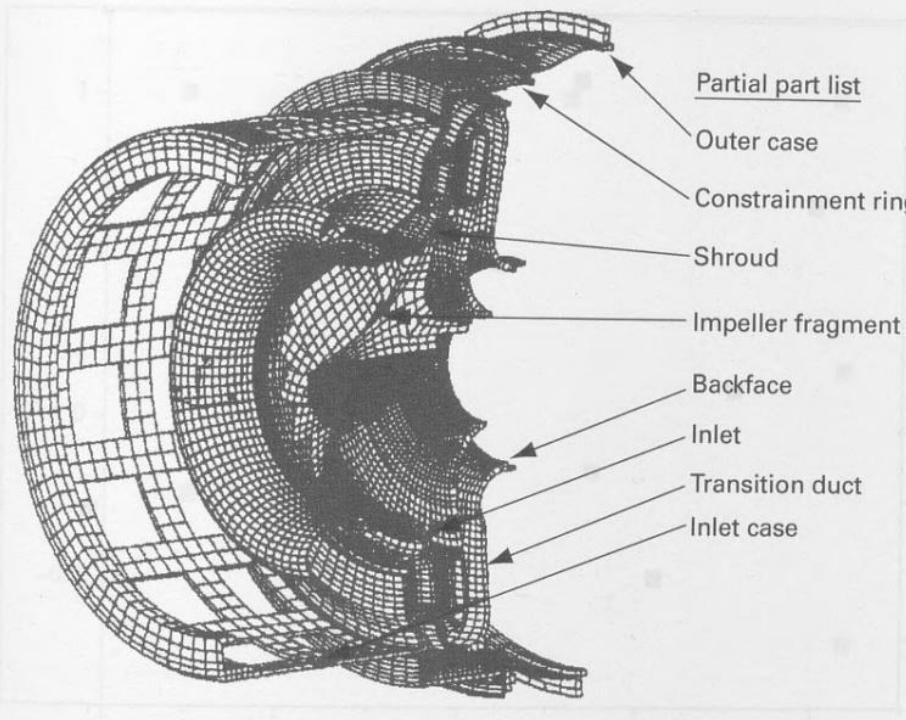

■ FIGURE 11.33 Finite element model for compressor containment analysis of a turbine engine and partial parts list

using a computer model is very attractive. The type of model used is called a finite element analysis model. Simulating a containment event with a finite element analysis model is very computationally intensive. The model shown in Figure 11.32 has over 100,000 elements and takes about 90 hours of computer time to model 2 ms of event time. Frequently as much as 10 ms of event time must be modeled. Clearly the need to limit experimentation or simulation is great. Therefore, the typical approach of factor screening followed by optimization might well be applied to this scenario.

Remember that the response surface approach is based on a philosophy of sequential experimentation, with the objective of approximating the response with a low-order polynomial in a relatively small region of interest that contains the optimum solution. Some computer experimenters advocate a somewhat different philosophy. They seek to find a model that approximates the true response surface over a much wider range of the design variables, sometimes extending over the entire region of operability. As mentioned earlier in this section, this can lead to situations where the model that is considered is much more complex than the first- and second-order polynomials typically employed in response surface methodology [see, for example, Barton (1992, 1994), Mitchell and Morris (1992), and Simpson and Peplinski (1997)].

The choice of a design for a computer simulation experiment presents some interesting alternatives. If the experimenter is considering a polynomial model, then an optimal design such as a $D$ -optimal or $I$ -optimal design is a possible choice. In recent years, various types of space-filling designs have been suggested for computer experiments. Space-filling designs are often thought to be particularly appropriate for deterministic computer models because in general they spread the design points out nearly evenly or uniformly (in some sense) throughout the region of experimentation. This is a desirable feature if the experimenter doesn't know the form of the model that is required, and believes that interesting phenomena are likely to be found in different regions of the experimental space. Furthermore, most space-filling designs do not contain any replicate runs. For a deterministic computer model this is desirable, because a single run of the computer model at a design point provides all of the information about the response at that point. Many space-filling designs do not contain replicates even if some factors are dropped and they are projected into lower dimensions.

The first space-filling design proposed was the Latin hypercube design [McKay, Conover, and Beckman (1979)]. A Latin hypercube in $n$ runs for $k$ factors in an $n \times k$ matrix where each column is a random permutation of the levels 1, 2, ..., n. JMP can create Latin hypercube designs. An example of a 10-run Latin hypercube design in two factors from JMP on the interval -1 to +1 is shown in Figure 11.34.

■ FIGURE 11.34 A 10-run Latin hypercube design

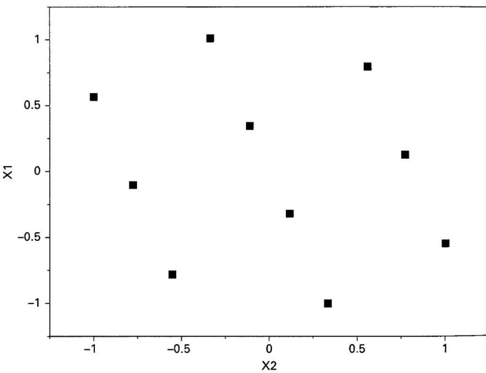

The sphere-packing design is chosen so that the minimum distance between pairs of points is maximized. These designs were proposed by Johnson, Moore, and Ylvisaker (1990) and are also called maximin designs. An example of a 10-run sphere-packing design in two factors constructed using JMP is shown in Figure 11.35.

Uniform designs were proposed by Fang (1980). These designs attempt to place the design points so that they are uniformly scattered through the regions as would a sample from a uniform distribution. There are a number of algorithms for creating these designs and several measures of uniformity. See the book by Fang, Li, and Sudjianto (2006). An example of a 10-run uniform design in two factors constructed using JMP is in Figure 11.36.

Maximum entropy designs were proposed by Shewry and Wynn (1987). Entropy can be thought of as a measure of the amount of information contained in the distribution of a data set. Suppose that the data comes from a normal distribution with mean vector $\mu$ and covariance matrix $\sigma^{2}\mathbf{R}(\boldsymbol{\theta})$ , where $\mathbf{R}(\boldsymbol{\theta})$ is a correlation matrix having elements

$$
r _ {i j} = e ^ {- \sum_ {s = 1} ^ {k} \theta_ {s} (x _ {i s} - x _ {j s}) ^ {2}}\tag{11.23}
$$

The quantities $r_{ij}$ are the correlations between the responses at two design points. The maximum entropy design maximizes the determinant of $\mathbf{R}(\boldsymbol{\theta})$ . Figure 11.37 shows a 10-run maximum entropy design in two factors created using JMP.

The Gaussian process model is often used to fit the data from a deterministic computer experiment. These models were introduced as models for computer experiments by Sacks et al. (1989). They are desirable because they provide an exact fit to the observations from the experiment. Now this is no assurance that they will interpolate well at locations in the region of interest where there is no data, and no one seriously believes that the Gaussian process model is the correct model for the relationship between the response and the design variables. However, the “exact fit” nature of the model and the fact that it only requires one parameter for each factor considered in the experiment have made it quite popular. The Gaussian process model is

$$
y = \mu + z (\mathbf {x})
$$

where $z(\mathbf{x})$ is a Gaussian stochastic process with covariance matrix $\sigma^{2}\mathbf{R}(\boldsymbol{\theta})$ , and the elements of $\mathbf{R}(\boldsymbol{\theta})$ are defined in Equation (11.23). The Gaussian process model is essentially a spatial correlation model, where the correlation of the

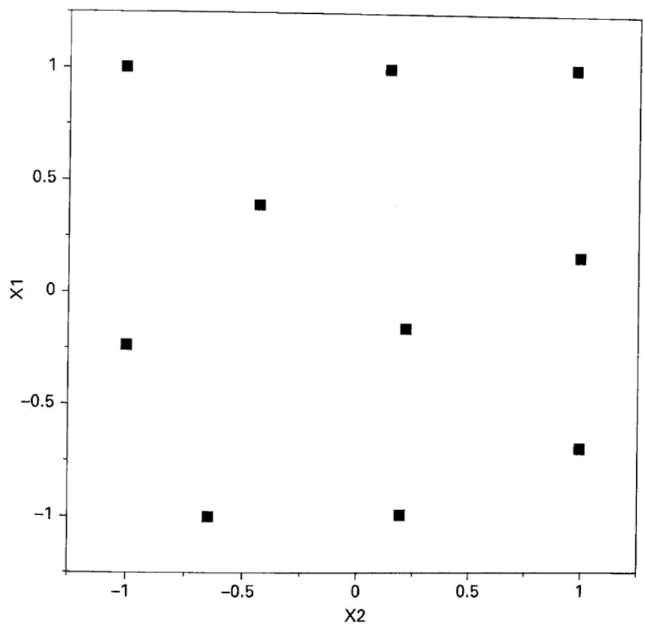

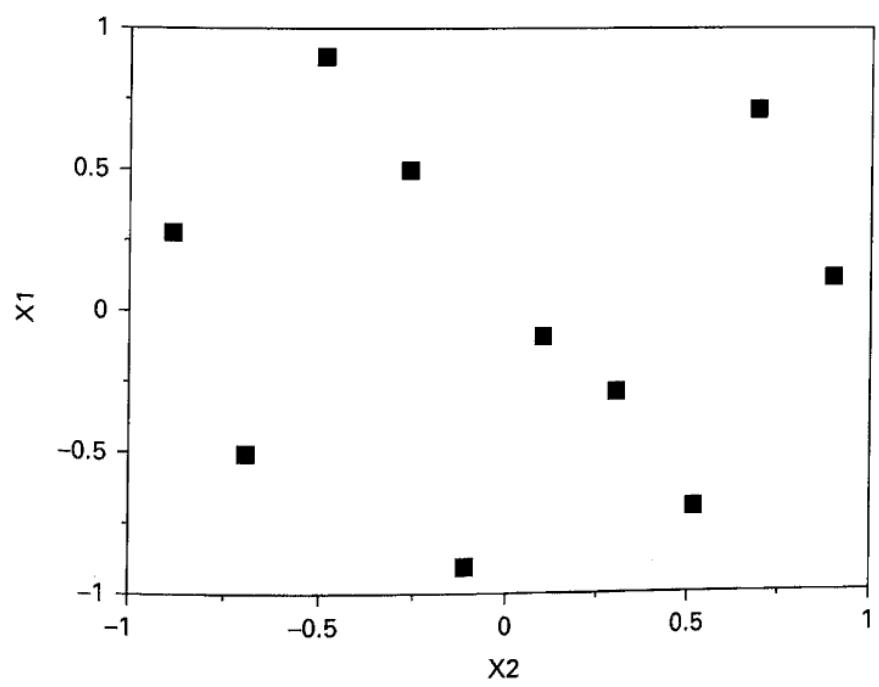  
■ FIGURE 11.36 A 10-run uniform design

■ FIGURE 11.37 A 10-run maximum entropy design

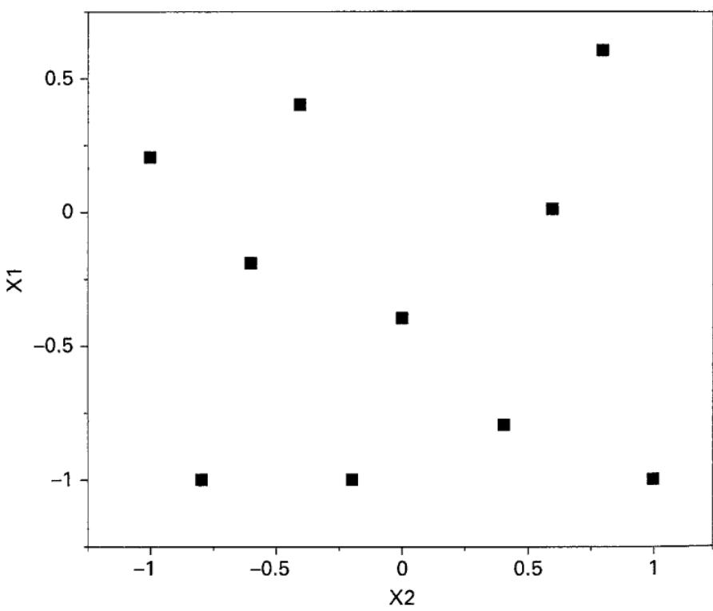

response between two observations decreases as the values of the design factors become further apart. When design points are close together, this causes ill-conditioning in the data for the Gaussian process model, much like multicollinearity resulting from predictors that are nearly linearly dependent in linear regression models. The parameters $\mu$ and $\theta_{s}$ , $s = 1, 2, \ldots, k$ are estimated using the method of maximum likelihood. Predicted values of the response at the point x are computed from

$$
\hat {y} (\mathbf {x}) = \hat {\mu} + \mathbf {r} ^ {\prime} (\mathbf {x}) \mathbf {R} (\hat {\pmb {\theta}}) ^ {- 1} (\mathbf {y} - \mathbf {j} \hat {\mu})
$$

where $\hat{\mu}$ and $\hat{\theta}$ are the maximum likelihood estimates of the model parameters $\mu$ and $\theta$ , and $\mathbf{r}'(\mathbf{x}) = [\mathrm{r}(\mathbf{x}_1, \mathbf{x}), \mathrm{r}(\mathbf{x}_2, \mathbf{x})\ldots, \mathrm{r}(\mathbf{x}_n, \mathbf{x})]$ . The prediction equation contains one model term for each design point in the original experiment. JMP will fit and provide predictions from the Gaussian process model. More details about the Gaussian process model are in Santner, Williams, and Notz (2003). A good review of designs for computer experiments and the Gaussian process model is Jones and Johnson (2009).

## EXAMPLE 11.4

The temperature in the exhaust from a jet turbine engine at different locations in the plume was studied using a computational fluid dynamics (CFD) model. The two design factors of interest were the locations in the plume (x and y coordinates, however, the y-axis was referred to by the experimenters as the R-axis or radial axis). Both location axes were coded to the -1, +1 interval. The experimenters used a 10-run sphere-packing design. The experimental design and the output obtained at these test conditions from the CFD model are shown in Table 11.16. Figure 11.38 shows the design.

JMP was used to fit the Gaussian process model to the temperature data. Some of the output is shown in Table 11.17. The plot of actual by predicted is obtained by “jackknifing” the predicted values; that is, each predicted value is obtained from a model that doesn’t contain that observation when the model parameters are estimated. The prediction model obtained from JMP is shown in Table 11.18. In this table, “X-axis” and “R-axis” refer to the coordinates in x and R where predictions are to be made.

■ TABLE 11.16
Sphere-Packing Design and the Temperature Responses in the CFD Experiment

<table><tr><td>x-axis</td><td>R-axis</td><td>Temperature</td></tr><tr><td>0.056</td><td>0.062</td><td>338.07</td></tr><tr><td>0.095</td><td>0.013</td><td>1613.04</td></tr><tr><td>0.077</td><td>0.062</td><td>335.91</td></tr><tr><td>0.095</td><td>0.061</td><td>327.82</td></tr><tr><td>0.090</td><td>0.037</td><td>449.23</td></tr><tr><td>0.072</td><td>0.038</td><td>440.58</td></tr><tr><td>0.064</td><td>0.015</td><td>1173.82</td></tr><tr><td>0.050</td><td>0.000</td><td>1140.36</td></tr><tr><td>0.050</td><td>0.035</td><td>453.83</td></tr><tr><td>0.079</td><td>0.000</td><td>1261.39</td></tr></table>

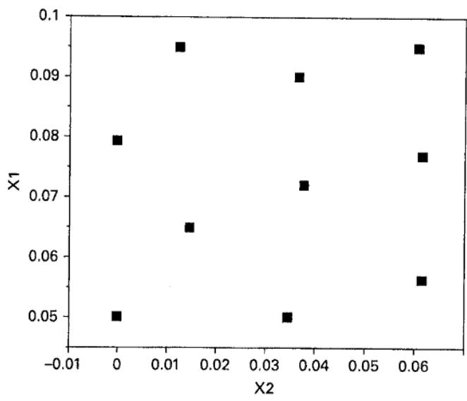  
■ FIGURE 11.38 The sphere-packing design for the CFD experiment

TABLE 11.17

JMP Output for the Gaussian Process Model for the CFD Experiment in Table 11.16

Gaussian Process

Actual by Predicted Plot

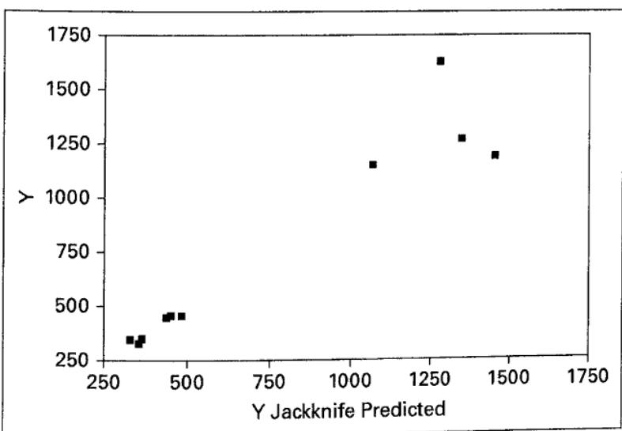

<table><tr><td colspan="6">Model Report</td></tr><tr><td>Column</td><td>Theta</td><td>Total Sensitivity</td><td>Main Effect</td><td>X-Axis Interaction</td><td>R-axis Interaction</td></tr><tr><td>X-axis</td><td>65.40254</td><td>0.0349982</td><td>0.0141129</td><td></td><td>0.0208852</td></tr><tr><td>R-axis</td><td>3603.2483</td><td>0.9858871</td><td>0.9650018</td><td>0.0208852</td><td></td></tr><tr><td>Mu</td><td>Sigma</td><td></td><td></td><td></td><td></td></tr><tr><td>734.54584</td><td>212205.18</td><td></td><td></td><td></td><td></td></tr><tr><td colspan="2">-2*LogLikelihood</td><td></td><td></td><td></td><td></td></tr><tr><td colspan="2">132.98004</td><td></td><td></td><td></td><td></td></tr></table>

```sql
TABLE 11.17 (Continued)
```

Contour Profiler

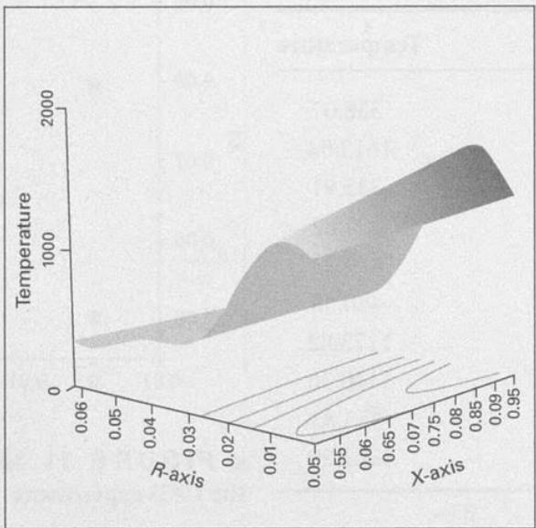

## TABLE 11.18

The JMP Gaussian Process Prediction Model for the CFD Experiment

<div class="mineru-algorithm" style="white-space: pre-wrap; font-family:monospace;">
$\hat{y}=734.545842514493+$
(-1943.3447961328 * Exp(-(65.4025404276544 * ((“X-Axis”) - 0.0560573769818389)^2 + 3603.24827558717 * (“R-Axis”) - 0.0618)^2)) +
3941.78888206788 * Exp(-(65.4025404276544 * ((“X-Axis”) - 0.0947)^2 + 3603.24827558717 * ((“R-axis”) - 0.0126487944665913)^2)) +
3488.57543918861 * Exp(-(65.4025404276544 * ((“X-Axis”) - 0.0765974898313444)^2 + 3603.24827558717 * ((“R-axis”) - 0.0618)^2)) + -
2040.39522592773 * Exp(-(65.4025404276544 * ((“X-Axis”) - 0.0947)^2 + 3603.24827558717 * ((“R-axis”) - 0.0608005210868486)^2)) +
-742.642897583584 * Exp(-(65.4025404276544 * ((“X-Axis”) - 0.898402482375096)^2 + 3603.24827558717 * (“R-axis”) - 0.0367246615426894)^2)) +
519.91871208163 * Exp(-(65.4025404276544 * ((“X-Axis”) - 0.0717377150616494)^2 + 3603.24827558717 * ((“R-axis”) - 0.377241897055609)^2)) +
-3082.85411601115 * Exp(-(65.4025404276544 * ((“X-Axis”) - 0.0644873310121405)^2 + 3603.24827558717 * (“R-axis”) - 0.0148210408248663)^2)) +
958.926988711818 * Exp(-(65.4025404276544 * ((“X-Axis”) - 0.0499)^2 + 3603.24827558717 * (“R-axis”)^2)) +
80.468182554262 * Exp(-(65.4025404276544 * ((“X-Axis”) - 0.0499)^2 + 3603.24827558717 * (“R-axis”) - 0.0347687447931648)^2)) +
-1180.44117607546 * Exp(-(65.4025404276544 * ((“X-Axis”) - 0.0790747191607881)^2 + 3603.24827558717 * (“R-axis”)^2)))
</div>

Experiments with computer models represent a relatively new and challenging area for both researchers and practitioners in RSM and in the broader engineering community. The use of well-designed experiments with engineering computer models for product design is potentially a very effective way to enhance the productivity of the engineering design and development community. Some useful references on the general subject of statistical design for computer experiments include Barton (1992, 1994), McKay, Beckman, and Conover (1979), Simpson and Peplinski (1997), Jones and Johnson (2009), Kennedy, Silvestrini, Montgomery, and Jones (2015), and Jones, Silvestrini, Montgomery, and Steinberg (2015).

## 11.6 Mixture Experiments

In previous sections, we have presented response surface designs for those situations in which the levels of each factor are independent of the levels of other factors. In mixture experiments, the factors are the components or ingredients of a mixture, and consequently their levels are not independent. For example, if $x_{1}, x_{2}, \ldots, x_{p}$ denote the proportions of p components of a mixture, then

$$
0 \leq x _ {i} \leq 1 \quad i = 1, 2, \dots , p
$$

and

$$
x _ {1} + x _ {2} + \dots + x _ {p} = 1 \quad (\text { i   .   e   . }, 1 0 0 \text { p   e   r   c   e   n   t })
$$

These restrictions are illustrated graphically in Figure 11.39 for p = 2 and p = 3 components. For two components, the factor space for the design includes all values of the two components that lie on the line segment $x_{1} + x_{2} = 1$ , with each component being bounded by 0 and 1. With three components, the mixture space is a triangle with vertices corresponding to formulations that are pure blends (mixtures that are 100 percent of a single component).

When there are three components of the mixture, the constrained experimental region can be conveniently represented on trilinear coordinate paper as shown in Figure 11.40. Each of the three sides of the graph in Figure 11.40 represents a mixture that has none of the three components (the component labeled on the opposite vertex). The nine grid lines in each direction mark off 10 percent increments in the respective components.

Simplex designs are used to study the effects of mixture components on the response variable. A $\{p,m\}$ simplex lattice design for p components consists of points defined by the following coordinate settings: the proportions assumed by each component take the $m+1$ equally spaced values from 0 to 1,

$$
x _ {i} = 0, \frac {1}{m}, \frac {2}{m}, \ldots , 1 \qquad i = 1, 2, \ldots , p\tag{11.24}
$$

and all possible combinations (mixtures) of the proportions from Equation 11.24 are used. As an example, let $p = 3$ and $m = 2$ . Then

$$
x _ {i} = 0, \frac {1}{2}, 1 \quad i = 1, 2, 3
$$

and the simplex lattice consists of the following six runs:

$$
(x _ {1}, x _ {2}, x _ {3}) = (1, 0, 0), (0, 1, 0), (0, 0, 1), \left(\frac {1}{2}, \frac {1}{2}, 0\right), \left(\frac {1}{2}, 0, \frac {1}{2}\right), \left(0, \frac {1}{2}, \frac {1}{2}\right)
$$

This design is shown in Figure 11.41. The three vertices $(1,0,0)$ , $(0,1,0)$ , and $(0,0,1)$ are the pure blends, whereas the points $\left(\frac{1}{2},\frac{1}{2},0\right)$ , $\left(\frac{1}{2},0,\frac{1}{2}\right)$ , and $\left(0,\frac{1}{2},\frac{1}{2}\right)$ are binary blends or two-component mixtures located at the midpoints of the three sides of the triangle. Figure 11.41 also shows the $\{3,3\}$ , $\{4,2\}$ , and $\{4,3\}$ simplex lattice designs. In general, the number of points in a $\{p,m\}$ simplex lattice design is

$$
N = \frac {(p + m - 1) !}{m ! (p - 1) !}
$$

An alternative to the simplex lattice design is the simplex centroid design. In a p-component simplex centroid design, there are $2^{p}-1$ points, corresponding to the p permutations of $(1,0,0,\ldots,0)$ , the $\binom{p}{2}$ permutations of $\left(\frac{1}{2},\frac{1}{2},0,\ldots,0\right)$ , the $\binom{p}{3}$ permutations of $\left(\frac{1}{3},\frac{1}{3},\frac{1}{3},0,\ldots,0\right),\ldots$ , and the overall centroid $\left(\frac{1}{p},\frac{1}{p},\ldots,\frac{1}{p}\right)$ . Figure 11.42 shows some simplex centroid designs.

  
(a)

  
■ FIGURE 11.39
Constrained factor space for mixtures with (a) p = 2 components and (b) p = 3 components

  
■ FIGURE 11.40 Trilinear coordinate system

  
■ FIGURE 11.41 Some simplex lattice designs for p = 3 and p = 4 components

  
■ FIGURE 11.42 Simplex centroid designs with (a) p = 3 components and (b) p = 4 components

A criticism of the simplex designs described above is that most of the experimental runs occur on the boundary of the region and, consequently, include only p - 1 of the p components. It is usually desirable to augment the simplex lattice or simplex centroid with additional points in the interior of the region where the blends will consist of all p mixture components. For more discussion, see Cornell (2002) and Myers, Montgomery, and Anderson-Cook (2009).

Mixture models differ from the usual polynomials employed in response surface work because of the constraint $\sum x_{i}=1$ . The standard forms of the mixture models that are in widespread use are

Linear

$$
E (y) = \sum_ {i = 1} ^ {p} \beta_ {i} x _ {i}\tag{11.25}
$$

Quadratic

$$
E (y) = \sum_ {i = 1} ^ {p} \beta_ {i} x _ {i} + \sum \sum_ {i <   j} ^ {p} \beta_ {i j} x _ {i} x _ {j}\tag{11.26}
$$

Full cubic

$$
\begin{array}{r l} & E (y) = \sum_ {i = 1} ^ {p} \beta_ {i} x _ {i} + \sum \sum_ {i <   j} ^ {p} \beta_ {i j} x _ {i} x _ {j} \\ & \qquad + \sum \sum_ {i <   j} ^ {p} \delta_ {i j} x _ {i} x _ {j} (x _ {i} - x _ {j}) \\ & \qquad + \sum \sum_ {i <   j <   k} \sum \beta_ {i j k} x _ {i} x _ {j} x _ {k} \end{array}\tag{11.27}
$$

Special cubic

$$
\begin{array}{l} E (y) = \sum_ {i = 1} ^ {p} \beta_ {i} x _ {i} + \sum \sum_ {i <   j} ^ {p} \beta_ {i j} x _ {i} x _ {j} \\ \qquad + \sum \sum_ {i <   j <   k} \sum \beta_ {i j k} x _ {i} x _ {j} x _ {k} \end{array}\tag{11.28}
$$

The terms in these models have relatively simple interpretations. In Equations 11.25 through 11.28, the parameter $\beta_{i}$ represents the expected response to the pure blend $x_{i} = 1$ and $x_{j} = 0$ when $j\neq i$ . The portion $\sum_{i = 1}^{p}\beta_{i}x_{i}$ is called the linear blending portion. When curvature arises from nonlinear blending between component pairs, the parameters $\beta_{ij}$ represent either synergistic or antagonistic blending. Higher order terms are frequently necessary in mixture models because (1) the phenomena studied may be complex and (2) the experimental region is frequently the entire operability region and therefore large, requiring an elaborate model.

## EXAMPLE 11.5 A Three-Component Mixture

Cornell (2002) describes a mixture experiment in which three components—polyethylene $(x_{1})$ , polystyrene $(x_{2})$ , and poly-propylene $(x_{3})$ —were blended to form fiber that will be spun into yarn for draperies. The response variable of interest is yarn elongation in kilograms of force applied. A $\{3, 2\}$ simplex lattice design is used to study the product. The design and the observed responses are shown in Table 11.19. Notice that all of the design points involve

## TABLE 11.19

The {3, 2} Simplex Lattice Design for the Yarn Elongation Problem

<table><tr><td rowspan="2">Design Point</td><td colspan="3">Component Proportions</td><td rowspan="2">Observed Elongation Values</td><td rowspan="2">Average Elongation Value (y)</td></tr><tr><td> $x_1$ </td><td> $x_2$ </td><td> $x_3$ </td></tr><tr><td>1</td><td>1</td><td>0</td><td>0</td><td>11.0, 12.4</td><td>11.7</td></tr><tr><td>2</td><td> $\frac{1}{2}$ </td><td> $\frac{1}{2}$ </td><td>0</td><td>15.0, 14.8, 16.1</td><td>15.3</td></tr><tr><td>3</td><td>0</td><td>1</td><td>0</td><td>8.8, 10.0</td><td>9.4</td></tr><tr><td>4</td><td>0</td><td> $\frac{1}{2}$ </td><td> $\frac{1}{2}$ </td><td>10.0, 9.7, 11.8</td><td>10.5</td></tr><tr><td>5</td><td>0</td><td>0</td><td>1</td><td>16.8, 16.0</td><td>16.4</td></tr><tr><td>6</td><td> $\frac{1}{2}$ </td><td>0</td><td> $\frac{1}{2}$ </td><td>17.7, 16.4, 16.6</td><td>16.9</td></tr></table>

either pure or binary blends; that is, at most only two of the three components are used in any formulation of the product. Replicate observations are also run, with two replicates at each of the pure blends and three replicates at each of the binary blends. The error standard deviation can be estimated from these replicate observations as = 0.85. Cornell fits the second-order mixture polynomial to the data, resulting in

$$
\begin{array}{c} \hat {y} = 1 1. 7 x _ {1} + 9. 4 x _ {2} + 1 6. 4 x _ {3} + 1 9. 0 x _ {1} x _ {2} \\ + 1 1. 4 x _ {1} x _ {3} - 9. 6 x _ {2} x _ {3} \end{array}
$$

This model can be shown to be an adequate representation of the response. Note that because $\hat{\beta}_{3} > \hat{\beta}_{1} > \hat{\beta}_{2}$ , we would conclude that component 3 (polypropylene) produces yarn with the highest elongation. Furthermore, because $\hat{\beta}_{12}$ and $\hat{\beta}_{13}$ are positive, blending components 1 and 2 or components 1 and 3 produces higher elongation values than would be expected just by averaging the elongations of the pure blends. This is an example of “synergistic” blending effects. Components 2 and 3 have antagonistic blending effects because $\hat{\beta}_{23}$ is negative.

Figure 11.43 plots the contours of elongation, and this may be helpful in interpreting the results. From examining the figure, we note that if maximum elongation is desired, a blend of components 1 and 3 should be chosen consisting of about 80 percent component 3 and 20 percent component 1.

  
■ FIGURE 11.43 Contours of constant estimated yarn elongation from the second-order mixture model for Example 11.5

We noted previously that the simplex lattice and simplex centroid designs are boundary point designs. If the experimenter wants to make predictions about the properties of complete mixtures, it would be highly desirable to have more runs in the interior of the simplex. We recommend augmenting the usual simplex designs with axial runs and the overall centroid (if the centroid is not already a design point).

The axis of component i is the line or ray extending from the base point $x_{i}=0$ , $x_{j}=1/(p-1)$ for all $j\neq i$ to the opposite vertex where $x_{i}=1$ , $x_{j}=0$ for all $j\neq i$ . The base point will always lie at the centroid of the $(p-2)$ -dimensional boundary of the simplex that is opposite the vertex $x_{i}=1$ , $x_{j}=0$ for all $j\neq i$ . [The boundary is sometimes called a $(p-2)$ -flat.] The length of the component axis is one unit. Axial points are positioned along the component axes at a distance $\Delta$ from the centroid. The maximum value for $\Delta$ is $(p-1)/p$ . We recommend that axial runs be placed midway between the centroid of the simplex and each vertex so that $\Delta=(p-1)/2p$ . Sometimes these points are called axial check blends because a fairly common practice is to exclude them when fitting the preliminary mixture model and then use the responses at these axial points to check the adequacy of the fit of the preliminary model.

Figure 11.44 shows the $\{3,2\}$ simplex lattice design augmented with the axial points. This design has 10 points, with four of these points in the interior of the simplex. The $\{3,3\}$ simplex lattice will support fitting the full cubic model, whereas the augmented simplex lattice will not; however, the augmented simplex lattice will allow the experimenter to fit the special cubic model or to add special quartic terms such as $\beta_{1233}x_{1}x_{2}x_{3}^{2}$ to the quadratic model. The augmented simplex lattice is superior for studying the response of complete mixtures in the sense that it can detect and model curvature in the interior of the triangle that cannot be accounted for by the terms in the full cubic model. The augmented simplex lattice has more power for detecting lack of fit than does the $\{3,3\}$ lattice. This is particularly useful when the experimenter is unsure about the proper model to use and also plans to sequentially build a model by starting with a simple polynomial (perhaps first order), test the model for lack of fit, and then augment the model with higher order terms, test the new model for lack of fit, and so forth.

In some mixture problems, constraints on the individual components arise. Lower bound constraints of the form

$$
l _ {i} \leq x _ {i} \leq 1 \quad i = 1, 2, \dots , p
$$

are fairly common. When only lower bound constraints are present, the feasible design region is still a simplex, but it is inscribed inside the original simplex region. This situation may be simplified by the introduction of pseudocomponents, defined as

$$
x _ {i} ^ {\prime} = \frac {x _ {i} - l _ {i}}{\left(1 - \sum_ {j = 1} ^ {p} l _ {j}\right)}\tag{11.29}
$$

■ FIGURE 11.44 An augmented simplex-lattice design  


with $\sum_{j=1}^{p} l_j < 1$ . Now

$$
x _ {1} ^ {\prime} + x _ {2} ^ {\prime} + \dots + x _ {p} ^ {\prime} = 1
$$

so the use of pseudocomponents allows the use of simplex-type designs when lower bounds are a part of the experimental situation. The formulations specified by the simplex design for the pseudocomponents are transformed into formulations for the original components by reversing the transformation Equation 11.29. That is, if $x_{i}^{\prime}$ is the value assigned to the $i$ th pseudocomponent on one of the runs in the experiment, the $i$ th original mixture component is

$$
x _ {i} = l _ {i} + \left(1 - \sum_ {j = 1} ^ {p} l _ {j}\right) x _ {i} ^ {\prime}\tag{11.30}
$$

If the components have both upper and lower bound constraints, the feasible region is no longer a simplex; instead, it will be an irregular polytope. Because the experimental region is not a “standard” shape, computer-generated optimal designs are very useful for these types of mixture problems.

## EXAMPLE 11.6 Paint Formulation

An experimenter is trying to optimize the formulation of automotive clear coat paint. These are complex products that have very specific performance requirements. Specifically, the customer wants the Knoop hardness to exceed 25 and the percentage of solids to be below 30. The clear coat is a three-component mixture, consisting of a monomer ( $x_{1}$ ), a crosslinker ( $x_{2}$ ), and a resin ( $x_{3}$ ). There are constraints on the component proportions:

$$
\begin{array}{r l} x _ {1} + x _ {2} + x _ {3} & = 1 0 0 \\ 5 \leq x _ {1} \leq 2 5 \\ 2 5 \leq x _ {2} \leq 4 0 \\ 5 0 \leq x _ {3} \leq 7 0 \end{array}
$$

The result is the constrained region of experimentation shown in Figure 11.45. Because the region of interest is not a simplex, we will use a D-optimal design for this problem. Assuming that both responses are likely to be modeled with a quadratic mixture model, we can generate the D-optimal design shown in Figure 11.39 using Design-Expert. We assumed that in addition to the six runs required to fit the quadratic mixture model, four additional distinct runs would be made to check for lack of fit and that four of these runs would be replicated to provide an estimate of pure error. Design-Expert used the vertices, the edge centers, the overall centroid, and the check runs (points located halfway between the centroid and the vertices) as the candidate points.

The 14-run design is shown in Table 11.20, along with the hardness and solids responses. The results of fitting quadratic models to both responses are summarized in Tables 11.21 and 11.22. Notice that quadratic models fit nicely to both the hardness and the solids responses. The fitted equations for both responses (in terms of the pseudocomponents) are shown in these tables. Contour plots of the responses are shown in Figures 11.46 and 11.47.

Figure 11.48 is an overlay plot of the two response surfaces, showing the Knoop hardness contour of 25 and the 30 percent contour for solids. The feasible region for this product is the unshaded region near the center of the plot. Obviously, there are a number of choices for the proportions of monomer, crosslinker, and resin for the clear coat that will give a product satisfying the performance requirements.

  
■ FIGURE 11.45 The constrained experimental region for the paint formulation problem in Example 11.6 (shown in the actual component scale)

TABLE 11.20  
A $D$ -Optimal Design for the Paint Formulation Problem in Example 11.5

<table><tr><td>Standard Order</td><td>Run</td><td>Monomer  $x_1$ </td><td>Crosslinker  $x_2$ </td><td>Resin  $x_3$ </td><td>Hardness  $y_1$ </td><td>Solids  $y_2$ </td></tr><tr><td>1</td><td>2</td><td>17.50</td><td>32.50</td><td>50.00</td><td>29</td><td>9.539</td></tr><tr><td>2</td><td>1</td><td>10.00</td><td>40.00</td><td>50.00</td><td>26</td><td>27.33</td></tr><tr><td>3</td><td>4</td><td>15.00</td><td>25.00</td><td>60.00</td><td>17</td><td>29.21</td></tr><tr><td>4</td><td>13</td><td>25.00</td><td>25.00</td><td>50.00</td><td>28</td><td>30.46</td></tr><tr><td>5</td><td>7</td><td>5.00</td><td>25.00</td><td>70.00</td><td>35</td><td>74.98</td></tr><tr><td>6</td><td>3</td><td>5.00</td><td>32.50</td><td>62.50</td><td>31</td><td>31.5</td></tr><tr><td>7</td><td>6</td><td>11.25</td><td>32.50</td><td>56.25</td><td>21</td><td>15.59</td></tr><tr><td>8</td><td>11</td><td>5.00</td><td>40.00</td><td>55.00</td><td>20</td><td>19.2</td></tr><tr><td>9</td><td>10</td><td>18.13</td><td>28.75</td><td>53.13</td><td>29</td><td>23.44</td></tr><tr><td>10</td><td>14</td><td>8.13</td><td>28.75</td><td>63.13</td><td>25</td><td>32.49</td></tr><tr><td>11</td><td>12</td><td>25.00</td><td>25.00</td><td>50.00</td><td>19</td><td>23.01</td></tr><tr><td>12</td><td>9</td><td>15.00</td><td>25.00</td><td>60.00</td><td>14</td><td>41.46</td></tr><tr><td>13</td><td>5</td><td>10.00</td><td>40.00</td><td>50.00</td><td>30</td><td>32.98</td></tr><tr><td>14</td><td>8</td><td>5.00</td><td>25.00</td><td>70.00</td><td>23</td><td>70.95</td></tr></table>

TABLE 11.21  
Model Fitting for the Hardness Response

<table><tr><td colspan="6">Response: hardness</td></tr><tr><td colspan="6">ANOVA for Mixture Quadratic Model</td></tr><tr><td colspan="6">Analysis of Variance Table [Partial sum of squares]</td></tr><tr><td>Source</td><td>Sum of Squares</td><td>DF</td><td>Mean Square</td><td>F Value</td><td>Prob &gt; F</td></tr><tr><td>Model</td><td>279.73</td><td>5</td><td>55.95</td><td>2.37</td><td>0.1329</td></tr><tr><td>Linear Mixture</td><td>29.13</td><td>2</td><td>14.56</td><td>0.62</td><td>0.5630</td></tr><tr><td>AB</td><td>72.61</td><td>1</td><td>72.61</td><td>3.08</td><td>0.1174</td></tr><tr><td>AC</td><td>179.67</td><td>1</td><td>179.67</td><td>7.62</td><td>0.0247</td></tr><tr><td>BC</td><td>8.26</td><td>1</td><td>8.26</td><td>0.35</td><td>0.5703</td></tr><tr><td>Residual</td><td>188.63</td><td>8</td><td>23.58</td><td></td><td></td></tr><tr><td>Lack of Fit</td><td>63.63</td><td>4</td><td>15.91</td><td>0.51</td><td>0.7354</td></tr><tr><td>Pure Error</td><td>125.00</td><td>4</td><td>31.25</td><td></td><td></td></tr><tr><td>Cor Total</td><td>468.36</td><td>13</td><td></td><td></td><td></td></tr><tr><td>Std. Dev.</td><td>4.86</td><td></td><td>R-Squared</td><td>0.5973</td><td></td></tr><tr><td>Mean</td><td>24.79</td><td></td><td>Adj R-Squared</td><td>0.3455</td><td></td></tr><tr><td>C.V.</td><td>19.59</td><td></td><td>Pred R-Squared</td><td>-0.3635</td><td></td></tr><tr><td>PRESS</td><td>638.60</td><td></td><td>Adeq Precision</td><td>4.975</td><td></td></tr><tr><td colspan="6">TABLE 11.21 (Continued)</td></tr><tr><td>Component</td><td>Coefficient Estimate</td><td>DF</td><td>Standard Error</td><td>95% CI Low</td><td>95% CI High</td></tr><tr><td>A-Monomer</td><td>23.81</td><td>1</td><td>3.36</td><td>16.07</td><td>31.55</td></tr><tr><td>B-Crosslinker</td><td>16.40</td><td>1</td><td>7.68</td><td>-1.32</td><td>34.12</td></tr><tr><td>C-Resin</td><td>29.45</td><td>1</td><td>3.36</td><td>21.71</td><td>37.19</td></tr><tr><td>AB</td><td>44.42</td><td>1</td><td>25.31</td><td>-13.95</td><td>102.80</td></tr><tr><td>AC</td><td>-44.01</td><td>1</td><td>15.94</td><td>-80.78</td><td>-7.25</td></tr><tr><td>BC</td><td>13.80</td><td>1</td><td>23.32</td><td>-39.97</td><td>67.57</td></tr><tr><td colspan="6">Final Equation in Terms of Pseudocomponents:</td></tr><tr><td></td><td colspan="5">hardness =+23.81 * A+16.40 * B+29.45 * C+44.42 * A * B-44.01 * A * C+13.80 * B * C</td></tr></table>

TABLE 11.22

<table><tr><td colspan="6">Response: solids</td></tr><tr><td colspan="6">ANOVA for Mixture Quadratic Model</td></tr><tr><td colspan="6">Analysis of Variance Table [Partial sum of squares]</td></tr><tr><td>Source</td><td>Sum of Squares</td><td>DF</td><td>Mean Square</td><td>F Value</td><td>Prob &gt; F</td></tr><tr><td>Model</td><td>4297.94</td><td>5</td><td>859.59</td><td>25.78</td><td>&lt;0.0001</td></tr><tr><td>Linear Mixture</td><td>2931.09</td><td>2</td><td>1465.66</td><td>43.95</td><td>&lt;0.0001</td></tr><tr><td>AB</td><td>211.20</td><td>1</td><td>211.20</td><td>6.33</td><td>0.0360</td></tr><tr><td>AC</td><td>285.67</td><td>1</td><td>285.67</td><td>8.57</td><td>0.0191</td></tr><tr><td>BC</td><td>1036.72</td><td>1</td><td>1036.72</td><td>31.09</td><td>0.0005</td></tr><tr><td>Residual</td><td>266.79</td><td>8</td><td>33.35</td><td></td><td></td></tr><tr><td>Lack of Fit</td><td>139.92</td><td>4</td><td>34.98</td><td>1.10</td><td>0.4633</td></tr><tr><td>Pure Error</td><td>126.86</td><td>4</td><td>31.72</td><td></td><td></td></tr><tr><td>Cor Total</td><td>4564.73</td><td>13</td><td></td><td></td><td></td></tr><tr><td>Std. Dev.</td><td>5.77</td><td></td><td>R-Squared</td><td>0.9416</td><td></td></tr><tr><td>Mean</td><td>33.01</td><td></td><td>Adj R-Squared</td><td>0.9050</td><td></td></tr><tr><td>C.V.</td><td>17.49</td><td></td><td>Pred R-Squared</td><td>0.7827</td><td></td></tr><tr><td>PRESS</td><td>991.86</td><td></td><td>Adeq Precision</td><td>15.075</td><td></td></tr><tr><td>Component</td><td>Coefficient Estimate</td><td>DF</td><td>Standard Error</td><td>95% CI Low</td><td>95% CI High</td></tr><tr><td>A-Monomer</td><td>26.53</td><td>1</td><td>3.99</td><td>17.32</td><td>35.74</td></tr><tr><td>B-Crosslinker</td><td>46.60</td><td>1</td><td>9.14</td><td>25.53</td><td>67.68</td></tr><tr><td>C-Resin</td><td>73.23</td><td>1</td><td>3.99</td><td>64.02</td><td>82.43</td></tr><tr><td>AB</td><td>-75.76</td><td>1</td><td>30.11</td><td>-145.19</td><td>-6.34</td></tr><tr><td>AC</td><td>-55.50</td><td>1</td><td>18.96</td><td>-99.22</td><td>-11.77</td></tr><tr><td>BC</td><td>-154.61</td><td>1</td><td>27.73</td><td>-218.56</td><td>-90.67</td></tr><tr><td colspan="6">Final Equation in Terms of Pseudocomponents:</td></tr><tr><td></td><td>solids =</td><td></td><td></td><td></td><td></td></tr><tr><td></td><td>+26.53 * A</td><td></td><td></td><td></td><td></td></tr><tr><td></td><td>+46.60 * B</td><td></td><td></td><td></td><td></td></tr><tr><td></td><td>+73.23 * C</td><td></td><td></td><td></td><td></td></tr><tr><td></td><td>-75.76 * A * B</td><td></td><td></td><td></td><td></td></tr><tr><td></td><td>-55.50 * A * C</td><td></td><td></td><td></td><td></td></tr><tr><td></td><td>-154.61 * B * C</td><td></td><td></td><td></td><td></td></tr></table>

In addition to the D- and I-optimal criteria, there are other criteria that can be used to construct mixture designs. Distance-based designs are an approach that spreads the design points out to maximize the distance between them. This often creates a design that has more runs in the interior of the region than does either the D- or the I-criteria. The extreme vertices approach constructs a design by starting with the vertices, adding the centers of the edges, and then adding the centroids of the sub-spaces until the desired number of design points has been reached. Space-filling strategies can also be used to construct a design. The space-filling algorithm in JMP essentially maximizes the product of the distances between all potential design points.

## TABLE 11.23

A 12-Run I-Optimal Design

<table><tr><td>Run</td><td>X1</td><td>X2</td><td>X3</td></tr><tr><td>1</td><td>0.5</td><td>0</td><td>0.5</td></tr><tr><td>2</td><td>1</td><td>0</td><td>0</td></tr><tr><td>3</td><td>0.33333333</td><td>0.33333333</td><td>0.33333333</td></tr><tr><td>4</td><td>0</td><td>0.5</td><td>0.5</td></tr><tr><td>5</td><td>0.5</td><td>0.5</td><td>0</td></tr><tr><td>6</td><td>0</td><td>0</td><td>1</td></tr><tr><td>7</td><td>0.5</td><td>0</td><td>0.5</td></tr><tr><td>8</td><td>0.5</td><td>0.5</td><td>0</td></tr><tr><td>9</td><td>0.33333333</td><td>0.333333333</td><td>0.333333333</td></tr><tr><td>10</td><td>0.33333333</td><td>0.333333333</td><td>0.333333333</td></tr><tr><td>11</td><td>0</td><td>1</td><td>0</td></tr><tr><td>12</td><td>0</td><td>0.5</td><td>0.5</td></tr></table>

To illustrate the space-filling criteria, suppose that we want to construct a three-component mixture design. Table 11.23 shows a 12-run I-optimal design and Table 11.24 shows a 12-run space-filling design. Figures 11.49 and 11.50 are graphical displays of the designs. The space-filling design has 12 distinct design points, all of which are in the interior of the simplex. The I-optimal design has only seven distinct design points consisting of three vertices, three centers of edges (binary blends) and the overall centroid. The centroid, which is the only interior point, is replicated three times and each edge center is replicated twice. Figure 11.51 is a fraction of design space plot for both designs. The space-filling design is the lower curve in the figure, indicating that it has a lower overall variance of prediction through most of the design space. The average prediction variance (relative to $\sigma$ ) for the I-optimal design is 0.318271 and for the space-filling design it is 0.190901. Space-filling designs for mixtures are often a good alternative to I-optimal designs.

## TABLE 11.24

A 12-Run Space-Filling Design

<table><tr><td>Run</td><td>X1</td><td>X2</td><td>X3</td></tr><tr><td>1</td><td>0.0566385525</td><td>0.5035563474</td><td>0.4398051002</td></tr><tr><td>2</td><td>0.1403888146</td><td>0.6848254125</td><td>0.174785773</td></tr><tr><td>3</td><td>0.5979278886</td><td>0.1685717851</td><td>0.2335003264</td></tr><tr><td>4</td><td>0.0021204609</td><td>0.277430271</td><td>0.7204492681</td></tr><tr><td>5</td><td>0.3064350687</td><td>0.1050457166</td><td>0.5885192147</td></tr><tr><td>6</td><td>0.6951342573</td><td>0.3036842719</td><td>0.0011814709</td></tr><tr><td>7</td><td>0.2684127928</td><td>0.3996327787</td><td>0.3319544285</td></tr><tr><td>8</td><td>0.0164724047</td><td>0.9652091258</td><td>0.0183184695</td></tr><tr><td>9</td><td>0.5236343265</td><td>0.002453615</td><td>0.4739120585</td></tr><tr><td>10</td><td>0.3942469565</td><td>0.5494100414</td><td>0.0563430022</td></tr><tr><td>11</td><td>0.8560801746</td><td>0.0425991599</td><td>0.1013206655</td></tr><tr><td>12</td><td>0.0976192298</td><td>0.0288613381</td><td>0.8735194321</td></tr></table>

■ FIGURE 11.49 A 12-run I-optimal design  
  
■ FIGURE 11.50 A 12-run space filling design

■ FIGURE 11.51 Variance of design space plot for the I-optimal design in Figure 11.49 and the space-filling design in Figure 11.50. The space-filling design is the lower curve


## 11.7 Evolutionary Operation

Response surface methodology is often applied to pilot plant operations by research and development personnel. When it is applied to a full-scale production process, it is usually done only once (or very infrequently) because the experimental procedure is relatively elaborate. However, conditions that were optimum for the pilot plant may not be optimum for the full-scale process. The pilot plant may produce 2 pounds of product per day, whereas the full-scale process may produce 2000 pounds per day. This “scale-up” of the pilot plant to the full-scale production process usually results in distortion of the optimum conditions. Even if the full-scale plant begins operation at the optimum, it will eventually “drift” away from that point because of variations in raw materials, environmental changes, and operating personnel.

A method is needed for the continuous monitoring and improvement of a full-scale process with the goal of moving the operating conditions toward the optimum or following a “drift.” The method should not require large or sudden changes in operating conditions that might disrupt production. Evolutionary operation (EVOP) was proposed by Box (1957) as such an operating procedure. It is designed as a method of routine plant operation that is carried out by manufacturing personnel with minimum assistance from the research and development staff.

EVOP consists of systematically introducing small changes in the levels of the operating variables under consideration. Usually, a $2^{k}$ design is employed to do this. The changes in the variables are assumed to be so small enough that serious disturbances in yield, quality, or quantity will not occur, yet large enough that potential improvements in process performance will eventually be discovered. Data are collected on the response variables of interest at each point of the $2^{k}$ design. When one observation has been taken at each design point, a cycle is said to have been completed. The effects and interactions of the process variables may then be computed. Eventually, after several cycles, the effect of one or more process variables or their interactions may appear to have a significant effect on the response. At this point, a decision may be made to change the basic operating conditions to improve the response. When improved conditions have been detected, a phase is said to have been completed.

In testing the significance of process variables and interactions, an estimate of experimental error is required. This is calculated from the cycle data. Also, the $2^{k}$ design is usually centered about the current best operating conditions. By comparing the response at this point with the $2^{k}$ points in the factorial portion, we may check on curvature or change in mean (CIM); that is, if the process is really centered at the maximum, say, then the response at the center should be significantly greater than the responses at the $2^{k}$ -peripheral points.

In theory, EVOP can be applied to k process variables. In practice, only two or three variables are usually considered. We will give an example of the procedure for two variables. Box and Draper (1969) give a detailed discussion of the three-variable case, including necessary forms and worksheets.

## EXAMPLE 11.7

Consider a chemical process whose yield is a function of temperature $(x_{1})$ and pressure $(x_{2})$ . The current operating conditions are $x_{1}=250^{\circ}F$ and $x_{2}=145$ psi. The EVOP procedure uses the $2^{2}$ design plus the center point shown in Figure 11.52. The cycle is completed by running each design point in numerical order $(1,2,3,4,5)$ . The yields in the first cycle are also shown in Figure 11.52.

The yields from the first cycle are entered in the EVOP calculation sheet, as shown in Table 11.25. At the end of the first cycle, no estimate of the standard deviation can be made. The effects and interactions for temperature and pressure are calculated in the usual manner for a $2^{2}$ design.

A second cycle is then run and the yield data entered in another EVOP calculation sheet, shown in Table 11.26. At the end of the second cycle, the experimental error can be estimated and the estimates of the effects compared to approximate 95 percent (two standard deviation) limits. Note that the range refers to the range of the differences in row (iv); thus, the range is $+1.0 - (-1.0) = 2.0$ . Because none of the effects in Table 11.26 exceed their error limits, the true effect is probably zero, and no changes in operating conditions are contemplated.

The results of a third cycle are shown in Table 11.27. The effect of pressure now exceeds its error limit and the temperature effect is equal to the error limit. A change in operating conditions is now probably justified.

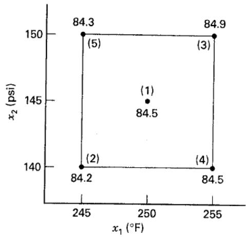  
EVOP Calculation Sheet for Example 11.7, $n = 1$  
■ FIGURE 11.52 A $2^{2}$ design for EVOP

## TABLE 11.25

<table><tr><td>[×K22]</td><td colspan="5">Cycle: n = 1Response: Yield</td><td>Phase: 1Date: 1/11/04</td></tr><tr><td></td><td colspan="5">Calculation of Averages</td><td>Calculation of Standard Deviation</td></tr><tr><td>Operating Conditions</td><td>(1)</td><td>(2)</td><td>(3)</td><td>(4)</td><td>(5)</td><td></td></tr><tr><td>(i) Previous cycle sum</td><td></td><td></td><td></td><td></td><td></td><td>Previous sum S =</td></tr><tr><td>(ii) Previous cycle average</td><td></td><td></td><td></td><td></td><td></td><td>Previous average S =</td></tr><tr><td>(iii) New observations</td><td>84.5</td><td>84.2</td><td>84.9</td><td>84.5</td><td>84.3</td><td>New S = range × f5,n =</td></tr><tr><td>(iv) Differences [(ii) - (iii)]</td><td></td><td></td><td></td><td></td><td></td><td>Range of (iv) =</td></tr><tr><td>(v) New sums [(i) + (iii)]</td><td>84.5</td><td>84.2</td><td>84.9</td><td>84.5</td><td>84.3</td><td>New sum S =</td></tr><tr><td>(vi) New averages [y̅i = (v)/n]</td><td>84.5</td><td>84.2</td><td>84.9</td><td>84.5</td><td>84.3</td><td>New average S =  $\frac{\text{New sum } S}{n-1}$ </td></tr><tr><td colspan="5">Calculation of Effects</td><td colspan="2">Calculation of Error Limits</td></tr><tr><td colspan="5">Temperature effect =  $\frac{1}{2}(\overline{y}_{3} + \overline{y}_{4} - \overline{y}_{2} - \overline{y}_{5}) = 0.45$ </td><td colspan="2">For new average =  $\frac{2}{\sqrt{n}}S =$ </td></tr><tr><td colspan="5">Pressure effect =  $\frac{1}{2}(\overline{y}_{3} + \overline{y}_{5} - \overline{y}_{2} - \overline{y}_{4}) = 0.25$ </td><td colspan="2">For new effects  $\frac{2}{\sqrt{n}}S =$ </td></tr><tr><td colspan="5">T × P interaction effect =  $\frac{1}{2}(\overline{y}_{2} + \overline{y}_{3} - \overline{y}_{4} - \overline{y}_{5}) = 0.15$ </td><td colspan="2"></td></tr><tr><td colspan="5">Change-in-mean effect =  $\frac{1}{5}(\overline{y}_{2} + \overline{y}_{3} + \overline{y}_{4} + \overline{y}_{5} - 4\overline{y}_{1}) = 0.02$ </td><td colspan="2">For change in mean  $\frac{1.78}{\sqrt{n}}S =$ </td></tr></table>

■ TABLE 11.26
EVOP Calculation Sheet for Example 11.7, n = 2

<table><tr><td>[CY3AT]</td><td colspan="5">Cycle: n = 1Response: Yield</td><td>Phase: 1Date: 1/11/04</td></tr><tr><td></td><td colspan="5">Calculation of Averages</td><td>Calculation of Standard Deviation</td></tr><tr><td>Operating Conditions</td><td>(1)</td><td>(2)</td><td>(3)</td><td>(4)</td><td>(5)</td><td></td></tr><tr><td>(i) Previous cycle sum</td><td>84.5</td><td>84.2</td><td>84.9</td><td>84.5</td><td>84.3</td><td>Previous sum S =</td></tr><tr><td>(ii) Previous cycle average</td><td>84.5</td><td>84.2</td><td>84.9</td><td>84.5</td><td>84.3</td><td>Previous average S =</td></tr><tr><td>(iii) New observations</td><td>84.9</td><td>84.6</td><td>85.9</td><td>83.5</td><td>84.0</td><td>New S = range × $f_{5,n}$ = 0.60</td></tr><tr><td>(iv) Differences [(ii) - (iii)]</td><td>-0.4</td><td>-0.4</td><td>-1.0</td><td>+1.0</td><td>0.3</td><td>Range of (iv) = 2.0</td></tr><tr><td>(v) New sums [(i) + (iii)]</td><td>169.4</td><td>168.8</td><td>170.8</td><td>168.0</td><td>168.3</td><td>New sum S = 0.60</td></tr><tr><td>(vi) New average [ $\overline{y}_{i}$  = (v)/n]</td><td>84.70</td><td>84.40</td><td>85.40</td><td>84.00</td><td>84.15</td><td>New average S =  $\frac{\text{New sum }S}{n-1}$  = 0.60</td></tr><tr><td colspan="5">Calculation of Effects</td><td colspan="2">Calculation of Error Limits</td></tr><tr><td colspan="5">Temperature effect =  $\frac{1}{2}(\overline{y}_{3}+\overline{y}_{4}-\overline{y}_{2}-\overline{y}_{5})$  = 0.43</td><td colspan="2">For new average =  $\frac{2}{\sqrt{n}}S$  = 0.85</td></tr><tr><td colspan="5">Pressure effect =  $\frac{1}{2}(\overline{y}_{3}+\overline{y}_{5}-\overline{y}_{2}-\overline{y}_{4})$  = 0.58</td><td colspan="2">For new effects  $\frac{2}{\sqrt{n}}S$  = 0.85</td></tr><tr><td colspan="5">T × P interaction effect =  $\frac{1}{2}(\overline{y}_{2}+\overline{y}_{3}-\overline{y}_{4}-\overline{y}_{5})$  = 0.83</td><td colspan="2"></td></tr><tr><td colspan="5">Change-in-mean effect =  $\frac{1}{5}(\overline{y}_{2}+\overline{y}_{3}-\overline{y}_{4}-\overline{y}_{5}-4\overline{y}_{1})$  = -0.17</td><td colspan="2">For change in mean  $\frac{1.78}{\sqrt{n}}S$  = 0.76</td></tr><tr><td colspan="7">■ TABLE 11.27EVOP Calculation Sheet for Example 11.7, n = 3</td></tr><tr><td>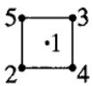</td><td colspan="5">Cycle: n = 1Response: Yield</td><td>Phase: 1Date: 1/11/04</td></tr><tr><td></td><td colspan="5">Calculation of Averages</td><td>Calculation of Standard Deviation</td></tr><tr><td>Operating Conditions</td><td>(1)</td><td>(2)</td><td>(3)</td><td>(4)</td><td>(5)</td><td></td></tr><tr><td>(i) Previous cycle sum</td><td>169.4</td><td>168.8</td><td>170.8</td><td>168.0</td><td>168.3</td><td>Previous sum S = 0.60</td></tr><tr><td>(ii) Previous cycle average</td><td>84.70</td><td>84.40</td><td>85.40</td><td>84.00</td><td>84.15</td><td>Previous average S = 0.60</td></tr><tr><td>(iii) New observations</td><td>85.0</td><td>84.0</td><td>86.6</td><td>84.9</td><td>85.2</td><td>New S = range × $f_{5,n}$  = 0.56</td></tr><tr><td>(iv) Differences [(ii) - (iii)]</td><td>-0.30</td><td>+0.40</td><td>-1.20</td><td>-0.90</td><td>-1.05</td><td>Range of (iv) = 1.60</td></tr><tr><td>(v) New sums [(i) + (iii)]</td><td>254.4</td><td>252.8</td><td>257.4</td><td>252.9</td><td>253.5</td><td>New sum S = 1.16</td></tr><tr><td>(vi) New averages [ $\overline{y}_{i}$  = (v)/n]</td><td>84.80</td><td>84.27</td><td>85.80</td><td>84.30</td><td>84.50</td><td>New average S =  $\frac{\text{New sum }S}{n-1}$  = 0.58</td></tr><tr><td colspan="5">Calculation of Effects</td><td colspan="2">Calculation of Error Limits</td></tr><tr><td colspan="5">Temperature effect =  $\frac{1}{2}(\overline{y}_{3}+\overline{y}_{4}-\overline{y}_{2}-\overline{y}_{5})$  = 0.67</td><td colspan="2">For new average =  $\frac{2}{\sqrt{n}}S$  = 0.67</td></tr><tr><td colspan="5">Pressure effect =  $\frac{1}{2}(\overline{y}_{3}+\overline{y}_{5}-\overline{y}_{2}-\overline{y}_{4})$  = 0.87</td><td colspan="2">For new effects  $\frac{2}{\sqrt{n}}S$  = 0.67</td></tr><tr><td colspan="5">T × P interaction effect =  $\frac{1}{2}(\overline{y}_{2}+\overline{y}_{3}-\overline{y}_{4}-\overline{y}_{5})$  = 0.64</td><td colspan="2"></td></tr><tr><td colspan="5">Change-in-mean effect =  $\frac{1}{5}(\overline{y}_{2}+\overline{y}_{3}+\overline{y}_{4}+\overline{y}_{5}-4\overline{y}_{1})$  = -0.07</td><td colspan="2">For change in mean  $\frac{1.78}{\sqrt{n}}S$  = 0.60</td></tr></table>

In light of the results, it seems reasonable to begin a new EVOP phase about point (3). Thus, $x_{1}=225^{\circ}F$ and $x_{2}=150$ psi would become the center of the $2^{2}$ design in the second phase.

An important aspect of EVOP is feeding the information generated back to the process operators and supervisors. This is accomplished by a prominently displayed EVOP information board. The information board for this example at the end of cycle 3 is shown in Table 11.28.

## TABLE 11.28

EVOP Information Board, Cycle 3  
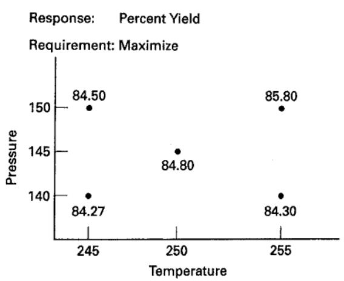

Error Limits for Averages: ±0.67

<table><tr><td>Effects with</td><td>Temperature</td><td>0.67 ± 0.67</td></tr><tr><td>95 percent error</td><td>Pressure</td><td>0.87 ± 0.67</td></tr><tr><td>Limits</td><td>T × P</td><td>0.64 ± 0.67</td></tr><tr><td></td><td>Change in mean</td><td>0.07 ± 0.60</td></tr><tr><td>Standard deviation</td><td>0.58</td><td></td></tr></table>

Most of the quantities on the EVOP calculation sheet follow directly from the analysis of the $2^{k}$ factorial design. For example, the variance of any effect, such as $\frac{1}{2}(\overline{y}_{3} + \overline{y}_{5} - \overline{y}_{2} - \overline{y}_{4})$ , is simply $\sigma^{2}/n$ where $\sigma^{2}$ is the variance of the observations (y). Thus, two standard deviation (corresponding to 95 percent) error limits on any effect would be $\pm2\sigma/\sqrt{n}$ . The variance of the change in mean is

$$
\begin{array}{r} V (\mathrm{CIM}) = V \left[ \frac {1}{5} (\overline {{y}} _ {2} + \overline {{y}} _ {3} + \overline {{y}} _ {4} + \overline {{y}} _ {5} - 4 \overline {{y}} _ {1}) \right] \\ = \frac {1}{2 5} (4 \sigma_ {\overline {{y}}} ^ {2} + 1 6 \sigma_ {\overline {{y}}} ^ {2}) = \left(\frac {2 0}{2 5}\right) \frac {\sigma^ {2}}{n} \end{array}
$$

Thus, two standard deviation error limits on the CIM are $\pm (2\sqrt{20 / 25})\sigma /\sqrt{n} = \pm 1.78\sigma /\sqrt{n}$ .

The standard deviation $\sigma$ is estimated by the range method. Let $y_{i}(n)$ denote the observation at the $i$ th design point in cycle $n$ and $\overline{y}_{i}(n)$ the corresponding average of $y_{i}(n)$ after $n$ cycles. The quantities in row (iv) of the EVOP calculation sheet are the differences $y_{i}(n) - \overline{y}_{i}(n - 1)$ . The variance of these differences is

$$
V [ y _ {i} (n) - \overline {{{{y}}}} _ {i} (n - 1) ] \equiv \sigma_ {D} ^ {2} = \sigma^ {2} \left[ 1 + \frac {1}{(n - 1)} \right] = \sigma^ {2} \frac {n}{(n - 1)}
$$

TABLE 11.29  
Values of $f_{k,n}$

<table><tr><td>n =</td><td>2</td><td>3</td><td>4</td><td>5</td><td>6</td><td>7</td><td>8</td><td>9</td><td>10</td></tr><tr><td>k = 5</td><td>0.30</td><td>0.35</td><td>0.37</td><td>0.38</td><td>0.39</td><td>0.40</td><td>0.40</td><td>0.40</td><td>0.41</td></tr><tr><td>9</td><td>0.24</td><td>0.27</td><td>0.29</td><td>0.30</td><td>0.31</td><td>0.31</td><td>0.31</td><td>0.32</td><td>0.32</td></tr><tr><td>10</td><td>0.23</td><td>0.26</td><td>0.28</td><td>0.29</td><td>0.30</td><td>0.30</td><td>0.30</td><td>0.31</td><td>0.31</td></tr></table>

The range of the differences, say $R_{D}$ , is related to the estimate of the standard deviation of the differences by $\hat{\sigma}_{D} = R_{D} / d_{2}$ . The factor $d_{2}$ depends on the number of observations used in computing $R_{D}$ . Now $R_{D} / d_{2} = \hat{\sigma}\sqrt{n / (n - 1)}$ , so

$$
\hat {\sigma} = \sqrt {\frac {(n - 1)}{n}} \frac {R _ {D}}{d _ {2}} = (f _ {k, n}) R _ {D} \equiv s
$$

can be used to estimate the standard deviation of the observations, where k denotes the number of points used in the design. For a $2^{2}$ design with one center point, we have k = 5 and for a $2^{3}$ design with one center point, we have k = 9. Values of $f_{k,n}$ are given in Table 11.29.