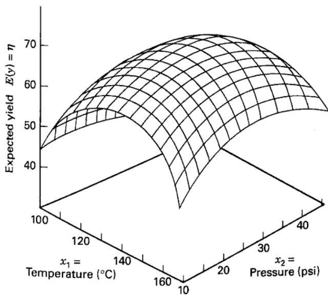
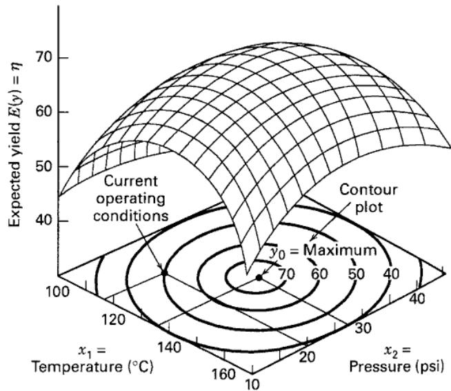
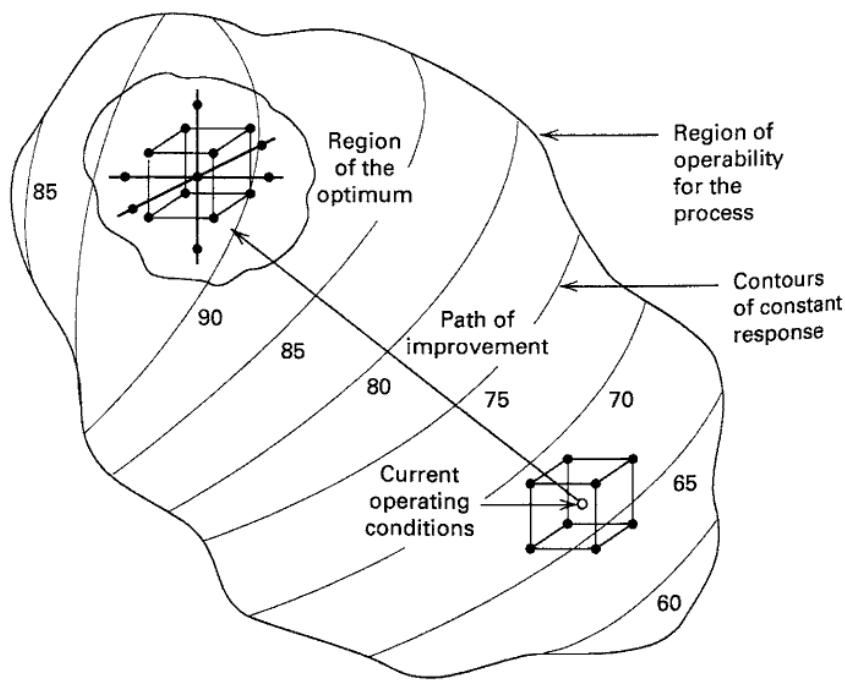

## 11.1 Introduction to Response Surface Methodology

Response surface methodology, or RSM, is a collection of mathematical and statistical techniques useful for the modeling and analysis of problems in which a response of interest is influenced by several variables and the objective is to optimize this response. For example, suppose that a chemical engineer wishes to find the levels of temperature $(x_{1})$ and pressure $(x_{2})$ that maximize the yield (y) of a process. The process yield is a function of the levels of temperature and pressure, say

$$
y = f (x _ {1}, x _ {2}) + \epsilon
$$

where $\epsilon$ represents the noise or error observed in the response $y$ . If we denote the expected response by $E(y) = f(x_{1}, x_{2}) = \eta$ , then the surface represented by

$$
\eta = f (x _ {1}, x _ {2})
$$

is called a response surface.

We usually represent the response surface graphically, such as in Figure 11.1, where $\eta$ is plotted versus the levels of $x_{1}$ and $x_{2}$ . We have seen such response surface plots before, particularly in the chapters on factorial designs. To help visualize the shape of a response surface, we often plot the contours of the response surface as shown in Figure 11.2. In the contour plot, lines of constant response are drawn in the $x_{1}$ , $x_{2}$ plane. Each contour corresponds to a particular height of the response surface. We have also previously seen the utility of contour plots.

In most RSM problems, the form of the relationship between the response and the independent variables is unknown. Thus, the first step in RSM is to find a suitable approximation for the true functional relationship between y and the set of independent variables. Usually, a low-order polynomial in some region of the independent variables is employed. If the response is well modeled by a linear function of the independent variables, then the approximating function is the first-order model

$$
y = \beta_ {0} + \beta_ {1} x _ {1} + \beta_ {2} x _ {2} + \dots + \beta_ {k} x _ {k} + \epsilon\tag{11.1}
$$

If there is curvature in the system, then a polynomial of higher degree must be used, such as the second-order model

$$
y = \beta_ {0} + \sum_ {i = 1} ^ {k} \beta_ {i} x _ {i} + \sum_ {i = 1} ^ {k} \beta_ {i i} x _ {i} ^ {2} + \sum_ {i <   j} \beta_ {i j} x _ {i} x _ {j} + \epsilon\tag{11.2}
$$

Almost all RSM problems use one or both of these models. Of course, it is unlikely that a polynomial model will be a reasonable approximation of the true functional relationship over the entire space of the independent variables, but for a relatively small region they usually work quite well.

The method of least squares, discussed in Chapter 10, is used to estimate the parameters in the approximating polynomials. The response surface analysis is then performed using the fitted surface. If the fitted surface is an adequate approximation of the true response function, then analysis of the fitted surface will be approximately equivalent to analysis of the actual system. The model parameters can be estimated most effectively if proper experimental designs are used to collect the data. Designs for fitting response surfaces are called response surface designs. These designs are discussed in Section 11.4.

  
■ FIGURE 11.1 A three-dimensional response surface showing the expected yield ( $\eta$ ) as a function of temperature ( $x_{1}$ ) and pressure ( $x_{2}$ )

■ FIGURE 11.2 A contour plot of a response surface

RSM is a sequential procedure. Often, when we are at a point on the response surface that is remote from the optimum, such as the current operating conditions in Figure 11.3, there is little curvature in the system and the first-order model will be appropriate. Our objective here is to lead the experimenter rapidly and efficiently along a path of improvement toward the general vicinity of the optimum. Once the region of the optimum has been found, a more elaborate model, such as the second-order model, may be employed, and an analysis may be performed to locate the optimum. From Figure 11.3, we see that the analysis of a response surface can be thought of as “climbing a hill,” where the top of the hill represents the point of maximum response. If the true optimum is a point of minimum response, then we may think of “descending into a valley.”

The eventual objective of RSM is to determine the optimum operating conditions for the system or to determine a region of the factor space in which operating requirements are satisfied. More extensive presentations of RSM are in Khuri and Cornell (1996), Myers, Montgomery, and Anderson-Cook (2016), and Box and Draper (2007). The review paper by Myers et al. (2004) is also a useful reference.

■ FIGURE 11.3 The sequential nature of RSM

