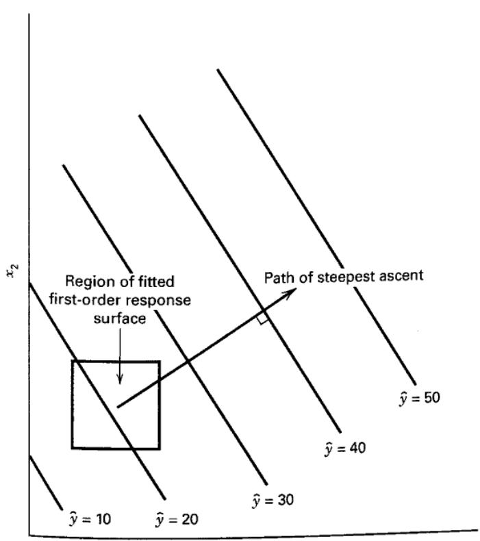
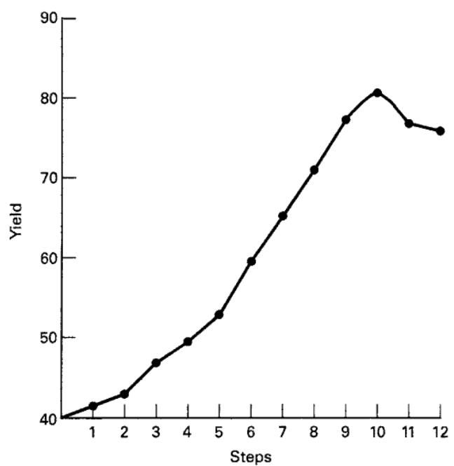

## 11.2 The Method of Steepest Ascent

Frequently, the initial estimate of the optimum operating conditions for the system will be far from the actual optimum. In such circumstances, the objective of the experimenter is to move rapidly to the general vicinity of the optimum. We wish to use a simple and economically efficient experimental procedure. When we are remote from the optimum, we usually assume that a first-order model is an adequate approximation to the true surface in a small region of the x's.

The method of steepest ascent is a procedure for moving sequentially in the direction of the maximum increase in the response. Of course, if minimization is desired, then we call this technique the method of steepest descent. The fitted first-order model is

$$
\hat {y} = \hat {\beta_ {0}} + \sum_ {i = 1} ^ {k} \hat {\beta_ {i}} x _ {i}\tag{11.3}
$$

and the first-order response surface, that is, the contours of $\hat{y}$ , is a series of parallel lines as shown in Figure 11.4. The direction of steepest ascent is the direction in which $\hat{y}$ increases most rapidly. This direction is normal to the fitted response surface. We usually take as the path of steepest ascent the line through the center of the region of interest and normal to the fitted surface. Thus, the steps along the path are proportional to the regression coefficients $\{\hat{\beta}_{i}\}$ . The actual step size is determined by the experimenter based on process knowledge or other practical considerations.

Experiments are conducted along the path of steepest ascent until no further increase in response is observed. Then a new first-order model may be fit, a new path of steepest ascent determined, and the procedure continued. Eventually, the experimenter will arrive in the vicinity of the optimum. This is usually indicated by lack of fit of a first-order model. At that time, additional experiments are conducted to obtain a more precise estimate of the optimum.

  
■ FIGURE 11.4 First-order response surface and path of steepest ascent

## EXAMPLE 11.1

A chemical engineer is interested in determining the operating conditions that maximize the yield of a process. Two controllable variables influence process yield: reaction time and reaction temperature. The engineer is currently operating the process with a reaction time of 35 minutes and a temperature of $155^{\circ}$ F, which result in yields of around 40 percent. Because it is unlikely that this region contains the optimum, she fits a first-order model and applies the method of steepest ascent.

The engineer decides that the region of exploration for fitting the first-order model should be (30, 40) minutes of reaction time and (150, 160) Fahrenheit. To simplify the calculations, the independent variables will be coded to the usual $(-1, 1)$ interval. Thus, if $\xi_{1}$ denotes the natural variable time and $\xi_{2}$ denotes the natural variable temperature, then the coded variables are

$$
x _ {1} = \frac {\xi_ {1} - 3 5}{5} \quad \text { and } \quad x _ {2} = \frac {\xi_ {2} - 1 5 5}{5}
$$

The experimental design is shown in Table 11.1. Note that the design used to collect these data is a $2^{2}$ factorial augmented by five center points. Replicates at the center are used to estimate the experimental error and to allow for checking the adequacy of the first-order model. Also, the design is centered about the current operating conditions for the process.

A first-order model may be fit to these data by least squares. Employing the methods for two-level designs, we obtain the following model in the coded variables:

$$
\hat {y} = 4 0. 4 4 + 0. 7 7 5 x _ {1} + 0. 3 2 5 x _ {2}
$$

Before exploring along the path of steepest ascent, the adequacy of the first-order model should be investigated. The $2^{2}$ design with center points allows the experimenter to do the following:

1. Obtain an estimate of error.

2. Check for interactions (cross-product terms) in the model.

3. Check for quadratic effects (curvature).

The replicates at the center can be used to calculate an estimate of error as follows:

$$
\begin{array}{r l} & (4 0. 3) ^ {2} + (4 0. 5) ^ {2} + (4 0. 7) ^ {2} + (4 0. 2) ^ {2} \\ \hat {\sigma} ^ {2} = & \frac {(4 0 . 6) ^ {2} - (2 0 2 . 3) ^ {2} / 5}{4} \\ = & 0. 0 4 3 0 \end{array}
$$

The first-order model assumes that the variables $x_{1}$ and $x_{2}$ have an additive effect on the response. Interaction between the variables would be represented by the coefficient $\beta_{12}$ of a cross-product term $x_{1}x_{2}$ added to the model. The least squares estimate of this coefficient is just one-half the interaction effect calculated as in an ordinary $2^{2}$ factorial design, or

$$
\begin{array}{r l} \hat {\beta} _ {1 2} & = \frac {1}{4} [ (1 \times 3 9. 3) + (1 \times 4 1. 5) + (- 1 \times 4 0. 0) + (- 1 \times 4 0. 9) ] \\ & = \frac {1}{4} (- 0. 1) = - 0. 2 5 \end{array}
$$

## TABLE 11.1

Process Data for Fitting the First-Order Model

<table><tr><td colspan="2">Natural Variables</td><td colspan="2">Coded Variables</td><td>Response</td></tr><tr><td> $\xi_1$ </td><td> $\xi_2$ </td><td> $x_1$ </td><td> $x_2$ </td><td>y</td></tr><tr><td>30</td><td>150</td><td>-1</td><td>-1</td><td>39.3</td></tr><tr><td>30</td><td>160</td><td>-1</td><td>1</td><td>40.0</td></tr><tr><td>40</td><td>150</td><td>1</td><td>-1</td><td>40.9</td></tr><tr><td>40</td><td>160</td><td>1</td><td>1</td><td>41.5</td></tr><tr><td>35</td><td>155</td><td>0</td><td>0</td><td>40.3</td></tr><tr><td>35</td><td>155</td><td>0</td><td>0</td><td>40.5</td></tr><tr><td>35</td><td>155</td><td>0</td><td>0</td><td>40.7</td></tr><tr><td>35</td><td>155</td><td>0</td><td>0</td><td>40.2</td></tr><tr><td>35</td><td>155</td><td>0</td><td>0</td><td>40.6</td></tr></table>

The single-degree-of-freedom sum of squares for interaction is

$$
S S _ {\text { Interaction }} = \frac {(- 0 . 1) ^ {2}}{4} = 0. 0 0 2 5
$$

Comparing $SS_{Interaction}$ to $\hat{\sigma}^2$ gives a lack-of-fit statistic

$$
F = \frac {S S _ {\text { Interaction }}}{\hat {\sigma} ^ {2}} = \frac {0 . 0 0 2 5}{0 . 0 4 3 0} = 0. 0 5 8
$$

which is small, indicating that interaction is negligible.

Another check of the adequacy of the straight-line model is obtained by applying the check for a pure quadratic curvature effect described in Section 6.8. Recall that this consists of comparing the average response at the four points in the factorial portion of the design, say $\overline{y}_{F}=40.425$ , with the average response at the design center, say $\overline{y}_{C}=40.46$ . If there is quadratic curvature in the true response function, then $\overline{y}_{F}-\overline{y}_{C}$ is a measure of this curvature. If $\beta_{11}$ and $\beta_{22}$ are the coefficients of the “pure quadratic” terms $x_{1}^{2}$ and $x_{2}^{2}$ , then $\overline{y}_{F}-\overline{y}_{C}$ is an estimate of $\beta_{11}+\beta_{22}$ . In our example, an estimate of the pure quadratic terms is

$$
\hat {\beta} _ {1 1} + \hat {\beta} _ {2 2} = \overline {{{{y}}}} _ {F} - \overline {{{{y}}}} _ {C} = 4 0. 4 2 5 - 4 0. 4 6 = - 0. 0 3 5
$$

The single-degree-of-freedom sum of squares associated with the null hypothesis, $H_{0}:\beta_{11}+\beta_{22}=0$ , is

$$
\begin{array}{r l} S S _ {\text {Pure Quadratic}} & = \frac {n _ {F} n _ {C} (\overline {{y}} _ {F} - \overline {{y}} _ {C}) ^ {2}}{n _ {F} + n _ {C}} \\ & = \frac {(4) (5) (- 0 . 0 3 5) ^ {2}}{4 + 5} = 0. 0 0 2 7 \end{array}
$$

where $n_{F}$ and $n_{C}$ are the number of points in the factorial portion and the number of center points, respectively. Because

$$
F = \frac {S S _ {\text { Pure   Quadratic }}}{\hat {\sigma} _ {2}} = \frac {0 . 0 0 2 7}{0 . 0 4 3 0} = 0. 0 6 3
$$

is small, there is no indication of a pure quadratic effect.

## TABLE 11.2

Analysis of Variance for the First-Order Model

The analysis of variance for this model is summarized in Table 11.2. Both the interaction and curvature checks are not significant, whereas the F-test for the overall regression is significant. Furthermore, the standard error of $\hat{\beta}_{1}$ and $\hat{\beta}_{2}$ is

$$
s e (\hat {\beta} _ {i}) = \sqrt {\frac {M S _ {E}}{4}} = \sqrt {\frac {\hat {\sigma} ^ {2}}{4}} = \sqrt {\frac {0 . 0 4 3 0}{4}} = 0. 1 0 \quad i = 1, 2
$$

Both regression coefficients $\hat{\beta}_{1}$ and $\hat{\beta}_{2}$ are large relative to their standard errors. At this point, we have no reason to question the adequacy of the first-order model.

To move away from the design center—the point $(x_{1}=0, x_{2}=0)$ —along the path of steepest ascent, we would move 0.775 units in the $x_{1}$ direction for every 0.325 units in the $x_{2}$ direction. Thus, the path of steepest ascent passes through the point $(x_{1}=0, x_{2}=0)$ and has a slope 0.325/0.775. The engineer decides to use 5 minutes of reaction time as the basic step size. Using the relationship between $\xi_{1}$ and $x_{1}$ , we see that 5 minutes of reaction time is equivalent to a step in the coded variable $x_{1}$ of $\Delta x_{1}=1$ . Therefore, the steps along the path of steepest ascent are $\Delta x_{1}=1.0000$ and $\Delta x_{2}=(0.325/0.775)=0.42$ .

The engineer computes points along this path and observes the yields at these points until a decrease in response is noted. The results are shown in Table 11.3 in both coded and natural variables. Although the coded variables are easier to manipulate mathematically, the natural variables must be used in running the process. Figure 11.5 plots the yield at each step along the path of steepest ascent. Increases in response are observed through the tenth step; however, all steps beyond this point result in a decrease in yield. Therefore, another first-order model should be fit in the general vicinity of the point ( $\xi_{1}=85$ , $\xi_{2}=175$ ).

<table><tr><td>Source of Variation</td><td>Sum of Squares</td><td>Degrees of Freedom</td><td>Mean Square</td><td> $F_0$ </td><td>P-Value</td></tr><tr><td>Model ( $\beta_1, \beta_2$ )</td><td>2.8250</td><td>2</td><td>1.4125</td><td>47.83</td><td>0.0002</td></tr><tr><td>Residual</td><td>0.1772</td><td>6</td><td></td><td></td><td></td></tr><tr><td>(Interaction)</td><td>(0.0025)</td><td>1</td><td>0.0025</td><td>0.058</td><td>0.8215</td></tr><tr><td>(Pure quadratic)</td><td>(0.0027)</td><td>1</td><td>0.0027</td><td>0.063</td><td>0.8142</td></tr><tr><td>(Pure error)</td><td>(0.1720)</td><td>4</td><td>0.0430</td><td></td><td></td></tr><tr><td>Total</td><td>3.0022</td><td>8</td><td></td><td></td><td></td></tr></table>

■ TABLE 11.3
Steepest Ascent Experiment for Example 11.1

<table><tr><td rowspan="2">Steps</td><td colspan="2">Coded Variables</td><td colspan="2">Natural Variables</td><td rowspan="2">Response y</td></tr><tr><td> $x_1$ </td><td> $x_2$ </td><td> $\xi_1$ </td><td> $\xi_2$ </td></tr><tr><td>Origin</td><td>0</td><td>0</td><td>35</td><td>155</td><td></td></tr><tr><td>Δ</td><td>1.00</td><td>0.42</td><td>5</td><td>2</td><td></td></tr><tr><td>Origin + Δ</td><td>1.00</td><td>0.42</td><td>40</td><td>157</td><td>41.0</td></tr><tr><td>Origin + 2Δ</td><td>2.00</td><td>0.84</td><td>45</td><td>159</td><td>42.9</td></tr><tr><td>Origin + 3Δ</td><td>3.00</td><td>1.26</td><td>50</td><td>161</td><td>47.1</td></tr><tr><td>Origin + 4Δ</td><td>4.00</td><td>1.68</td><td>55</td><td>163</td><td>49.7</td></tr><tr><td>Origin + 5Δ</td><td>5.00</td><td>2.10</td><td>60</td><td>165</td><td>53.8</td></tr><tr><td>Origin + 6Δ</td><td>6.00</td><td>2.52</td><td>65</td><td>167</td><td>59.9</td></tr><tr><td>Origin + 7Δ</td><td>7.00</td><td>2.94</td><td>70</td><td>169</td><td>65.0</td></tr><tr><td>Origin + 8Δ</td><td>8.00</td><td>3.36</td><td>75</td><td>171</td><td>70.4</td></tr><tr><td>Origin + 9Δ</td><td>9.00</td><td>3.78</td><td>80</td><td>173</td><td>77.6</td></tr><tr><td>Origin + 10Δ</td><td>10.00</td><td>4.20</td><td>85</td><td>175</td><td>80.3</td></tr><tr><td>Origin + 11Δ</td><td>11.00</td><td>4.62</td><td>90</td><td>179</td><td>76.2</td></tr><tr><td>Origin + 12Δ</td><td>12.00</td><td>5.04</td><td>95</td><td>181</td><td>75.1</td></tr></table>

  
■ FIGURE 11.5 Yield versus steps along the path of steepest ascent for Example 11.1

A new first-order model is fit around the point $(\xi_{1}=85,\xi_{2}=175)$ . The region of exploration for $\xi_{1}$ is [80, 90], and it is [170, 180] for $\xi_{2}$ . Thus, the coded variables are

$$
x _ {1} = \frac {\xi_ {1} - 8 5}{5} \quad \text { and } \quad x _ {2} = \frac {\xi_ {2} - 1 7 5}{5}
$$

Once again, a $2^{2}$ design with five center points is used. The experimental design is shown in Table 11.4.

The first-order model fit to the coded variables in Table 11.4 is

$$
\hat {y} = 7 8. 9 7 + 1. 0 0 x _ {1} + 0. 5 0 x _ {2}
$$

The analysis of variance for this model, including the interaction and pure quadratic term checks, is shown in Table 11.5. The interaction and pure quadratic checks imply that the first-order model is not an adequate approximation. This curvature in the true surface may indicate that we are near the optimum. At this point, additional analysis must be done to locate the optimum more precisely.

TABLE 11.4  
Data for Second First-Order Model

<table><tr><td colspan="2">Natural Variables</td><td colspan="2">Coded Variables</td><td rowspan="2">Response y</td></tr><tr><td> $\xi_1$ </td><td> $\xi_2$ </td><td> $x_1$ </td><td> $x_2$ </td></tr><tr><td>80</td><td>170</td><td>-1</td><td>-1</td><td>76.5</td></tr><tr><td>80</td><td>180</td><td>-1</td><td>1</td><td>77.0</td></tr><tr><td>90</td><td>170</td><td>1</td><td>-1</td><td>78.0</td></tr><tr><td>90</td><td>180</td><td>1</td><td>1</td><td>79.5</td></tr><tr><td>85</td><td>175</td><td>0</td><td>0</td><td>79.9</td></tr><tr><td>85</td><td>175</td><td>0</td><td>0</td><td>80.3</td></tr><tr><td>85</td><td>175</td><td>0</td><td>0</td><td>80.0</td></tr><tr><td>85</td><td>175</td><td>0</td><td>0</td><td>79.7</td></tr><tr><td>85</td><td>175</td><td>0</td><td>0</td><td>79.8</td></tr></table>

TABLE 11.5  
Analysis of Variance for the Second First-Order Model

<table><tr><td>Source of Variation</td><td>Sum of Squares</td><td>Degrees of Freedom</td><td>Mean Square</td><td> $F_0$ </td><td>P-Value</td></tr><tr><td>Regression</td><td>5.00</td><td>2</td><td></td><td></td><td></td></tr><tr><td>Residual</td><td>11.1200</td><td>6</td><td></td><td></td><td></td></tr><tr><td>(Interaction)</td><td>(0.2500)</td><td>1</td><td>0.2500</td><td>4.72</td><td>0.0955</td></tr><tr><td>(Pure quadratic)</td><td>(10.6580)</td><td>1</td><td>10.6580</td><td>201.09</td><td>0.0001</td></tr><tr><td>(Pure error)</td><td>(0.2120)</td><td>4</td><td>0.0530</td><td></td><td></td></tr><tr><td>Total</td><td>16.1200</td><td>8</td><td></td><td></td><td></td></tr></table>

We notice from Example 11.1 that the path of steepest ascent is proportional to the signs and magnitudes of the regression coefficients in the fitted first-order model

$$
\hat {y} = \hat {\beta_ {0}} + \sum_ {i = 1} ^ {k} \hat {\beta_ {i}} x _ {i}
$$

It is easy to give a general algorithm for determining the coordinates of a point on the path of steepest ascent. Assume that the point $x_{1}=x_{2}=\cdots=x_{k}=0$ is the base or origin point. Then

1. Choose a step size in one of the process variables, say $\Delta x_{j}$ . Usually, we would select the variable we know the most about, or we would select the variable that has the largest absolute regression coefficient $|\hat{\beta}_{j}|$ .

2. The step size in the other variables is

$$
\Delta x _ {i} = \frac {\hat {\beta} _ {i}}{\hat {\beta} _ {j} / \Delta x _ {j}} \quad i = 1, 2, \dots , k \quad i \neq j
$$

3. Convert the $\Delta x_{i}$ from coded variables to the natural variables.

To illustrate, consider the path of steepest ascent computed in Example 11.1. Because $x_{1}$ has the largest regression coefficient, we select reaction time as the variable in step 1 of the above procedure. Five minutes of reaction time is the step size (based on process knowledge). In terms of the coded variables, this is $\Delta x_{1} = 1.0$ . Therefore, from guideline 2, the step size in temperature is

$$
\Delta x _ {2} = \frac {\hat {\beta} _ {2}}{\hat {\beta} _ {1} / \Delta x _ {1}} = \frac {0 . 3 2 5}{(0 . 7 7 5 / 1 . 0)} = 0. 4 2
$$

To convert the coded step sizes $(\Delta x_{1} = 1.0$ and $\Delta x_{2} = 0.42)$ to the natural units of time and temperature, we use the relationships

$$
\Delta x _ {1} = \frac {\Delta \xi_ {1}}{5} \quad \text { and } \quad \Delta x _ {2} = \frac {\Delta \xi_ {2}}{5}
$$

which results in

$$
\Delta \xi_ {1} = \Delta x _ {1} (5) = 1. 0 (5) = 5 \mathrm{min}
$$

and

$$
\Delta \xi_ {2} = \Delta x _ {2} (5) = 0. 4 2 (5) = 2 ^ {\circ} \mathrm{F}
$$
