## 11.3 Analysis of a Second-Order Response Surface

When the experimenter is relatively close to the optimum, a model that incorporates curvature is usually required to approximate the response. In most cases, the second-order model

$$
y = \beta_ {0} + \sum_ {i = 1} ^ {k} \beta_ {i} x _ {i} + \sum_ {i = 1} ^ {k} \beta_ {i i} x _ {i} ^ {2} + \sum_ {i <   j} \sum \beta_ {i j} x _ {i} x _ {j} + \epsilon\tag{11.4}
$$

is adequate. In this section, we will show how to use this fitted model to find the optimum set of operating conditions for the $x$ 's and to characterize the nature of the response surface.

## 11.3.1 Location of the Stationary Point

Suppose we wish to find the levels of $x_{1}, x_{2}, \ldots, x_{k}$ that optimize the predicted response. This point, if it exists, will be the set of $x_{1}, x_{2}, \ldots, x_{k}$ for which the partial derivatives $\partial\hat{y}/\partial x_{1} = \partial\hat{y}/\partial x_{2} = \cdots = \partial\hat{y}/\partial x_{k} = 0$ . This point, say $x_{1,s}, x_{2,s}, \ldots, x_{k,s}$ , is called the stationary point. The stationary point could represent a point of maximum response, a point of minimum response, or a saddle point. These three possibilities are shown in Figures 11.6, 11.7 and 11.8.

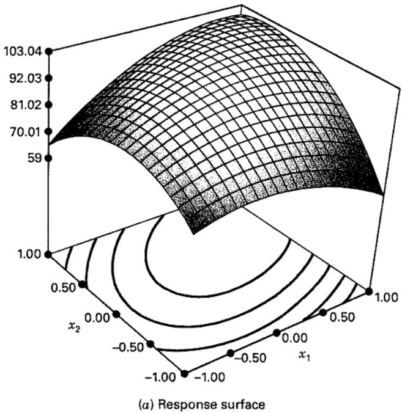

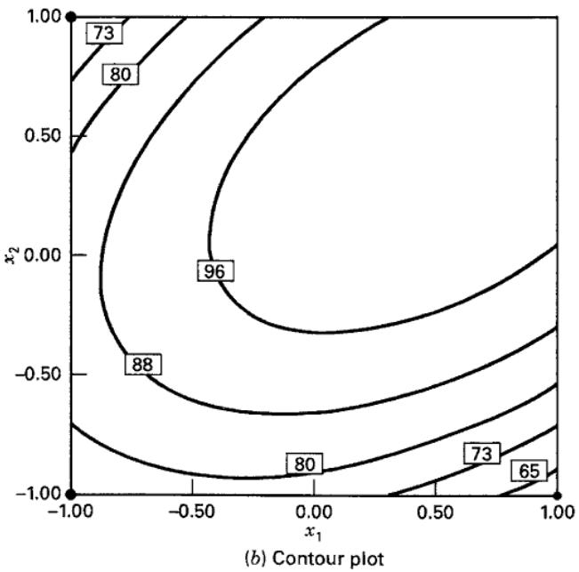  
■ FIGURE 11.6 Response surface and contour plot illustrating a surface with a maximum

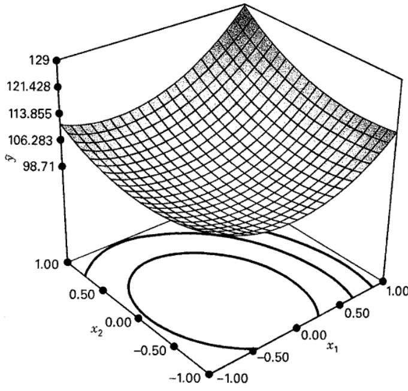  
(a) Response surface

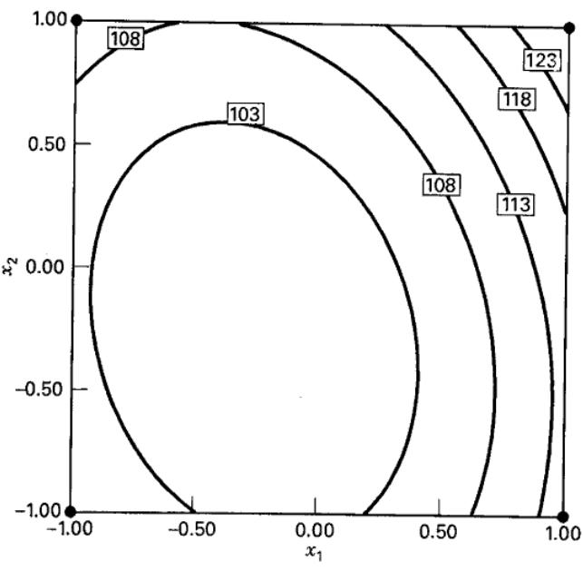  
(b) Contour plot  
■ FIGURE 11.7 Response surface and contour plot illustrating a surface with a minimum

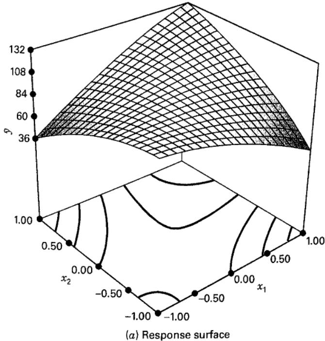

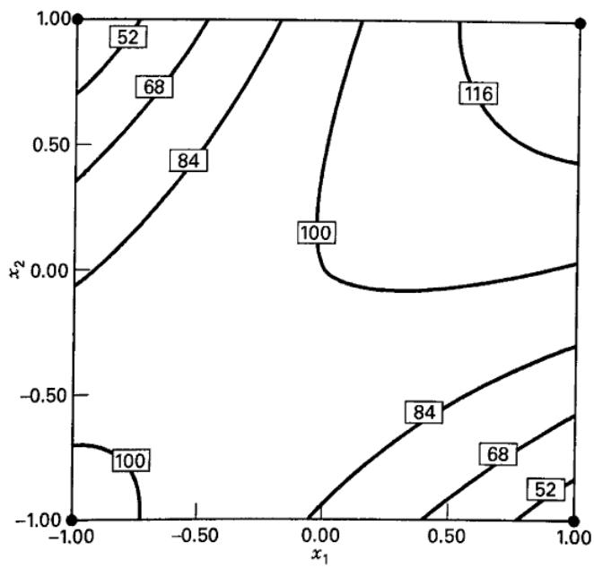  
(b) Contour plot  
■ FIGURE 11.8 Response surface and contour plot illustrating a saddle point (or minimax)

Contour plots play a very important role in the study of the response surface. By generating contour plots using computer software for response surface analysis, the experimenter can usually characterize the shape of the surface and locate the optimum with reasonable precision.

We may obtain a general mathematical solution for the location of the stationary point. Writing the fitted second-order model in matrix notation, we have

$$
\hat {y} = \hat {\beta_ {0}} + \mathbf {x ^ {\prime} b} + \mathbf {x ^ {\prime} B x}\tag{11.5}
$$

where

$$
\mathbf {x} = \left[ \begin{array}{c} x _ {1} \\ x _ {2} \\ \vdots \\ x _ {k} \end{array} \right] \quad \mathbf {b} = \left[ \begin{array}{c} \hat {\beta} _ {1} \\ \hat {\beta} _ {2} \\ \vdots \\ \hat {\beta} _ {k} \end{array} \right] \quad \text {and} \quad \mathbf {B} = \left[ \begin{array}{c c c c} \hat {\beta} _ {1 1}, & \hat {\beta} _ {1 2} / 2, & \ldots , & \hat {\beta} _ {1 k} / 2 \\ & \beta_ {2 2}, & \ldots , & \hat {\beta} _ {2 k} / 2 \\ & & \ddots & \\ \text {sym.} & & & \hat {\beta} _ {k k} \end{array} \right]
$$

That is, b is a $(k \times 1)$ vector of the first-order regression coefficients and B is a $(k \times k)$ symmetric matrix whose main diagonal elements are the pure quadratic coefficients $(\hat{\beta}_{ii})$ and whose off-diagonal elements are one-half the mixed quadratic coefficients $(\hat{\beta}_{ij}, i \neq j)$ . The derivative of $\hat{y}$ with respect to the elements of the vector x equated to 0 is

$$
\frac {\partial \hat {y}}{\partial \mathbf {x}} = \mathbf {b} + 2 \mathbf {B x} = \mathbf {0}\tag{11.6}
$$

The stationary point is the solution to Equation 11.6, or

$$
\mathbf {x} _ {\mathrm{s}} = - \frac {1}{2} \mathbf {B} ^ {- 1} \mathbf {b}\tag{11.7}
$$

Furthermore, by substituting Equation 11.7 into Equation 11.5, we can find the predicted response at the stationary point as

$$
\hat {y} _ {\mathrm{s}} = \hat {\beta} _ {0} + \frac {1}{2} \mathbf {x} _ {\mathrm{s}} ^ {\prime} \mathbf {b}\tag{11.8}
$$

## 11.3.2 Characterizing the Response Surface

Once we have found the stationary point, it is usually necessary to characterize the response surface in the immediate vicinity of this point. By characterize, we mean determining whether the stationary point is a point of maximum or minimum response or a saddle point. We also usually want to study the relative sensitivity of the response to the variables $x_{1}, x_{2}, \ldots, x_{k}$ .

As we mentioned previously, the most straightforward way to do this is to examine a contour plot of the fitted model. If there are only two or three process variables (the x's), the construction and interpretation of this contour plot is relatively easy. However, even when there are relatively few variables, a more formal analysis, called the canonical analysis, can be useful.

It is helpful first to transform the model into a new coordinate system with the origin at the stationary point $x_{s}$ and then to rotate the axes of this system until they are parallel to the principal axes of the fitted response surface. This transformation is illustrated in Figure 11.9. We can show that this results in the fitted model

$$
\hat {y} = \hat {y} _ {\mathrm{s}} + \lambda_ {1} w _ {1} ^ {2} + \lambda_ {2} w _ {2} ^ {2} + \dots + \lambda_ {k} w _ {k} ^ {2}\tag{11.9}
$$

where the $\{w_i\}$ are the transformed independent variables and the $\{\lambda_i\}$ are constants. Equation 11.9 is called the canonical form of the model. Furthermore, the $\{\lambda_i\}$ are just the eigenvalues or characteristic roots of the matrix $\mathbf{B}$ .

The nature of the response surface can be determined from the stationary point and the signs and magnitudes of the $\{\lambda_{i}\}$ . First, suppose that the stationary point is within the region of exploration for fitting the second-order model. If the $\{\lambda_{i}\}$ are all positive, $x_{s}$ is a point of minimum response; if the $\{\lambda_{i}\}$ are all negative, $x_{s}$ is a point of maximum response; and if the $\{\lambda_{i}\}$ have different signs, $x_{s}$ is a saddle point. Furthermore, the surface is steepest in the $w_{i}$ direction for which $|\lambda_{i}|$ is the greatest. For example, Figure 11.9 depicts a system for which $x_{s}$ is a maximum ( $\lambda_{1}$ and $\lambda_{2}$ are negative) with $|\lambda_{1}| > |\lambda_{2}|$ .

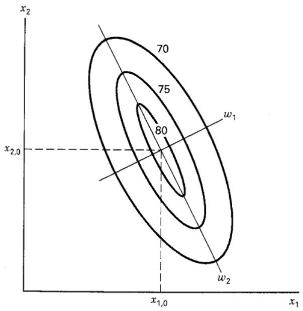

■ FIGURE 11.9 Canonical form of the second-order model

## EXAMPLE 11.2

We will continue the analysis of the chemical process in Example 11.1. A second-order model in the variables $x_{1}$ and $x_{2}$ cannot be fit using the design in Table 11.4. The experimenter decides to augment this design with enough points to fit a second-order model. $^{1}$ She obtains four observations at $(x_{1}=0, x_{2}=\pm1.414)$ and $(x_{1}=\pm1.414, x_{2}=0)$ . The complete experiment is shown in Table 11.6, and the design is displayed in Figure 11.10. This design is called a central composite design (or CCD) and will be discussed in more detail in Section 11.4.2. In this second phase of the study, two additional responses were of interest: the viscosity and the molecular weight of the product. The responses are also shown in Table 11.6.

## TABLE 11.6

Central Composite Design for Example 11.2

<table><tr><td colspan="2">Natural Variables</td><td colspan="2">Coded Variables</td><td colspan="3">Responses</td></tr><tr><td> $\xi_1$ </td><td> $\xi_2$ </td><td> $x_1$ </td><td> $x_2$ </td><td> $y_1$  (Yield)</td><td> $y_2$  (Viscosity)</td><td> $y_3$  (Molecular Weight)</td></tr><tr><td>80</td><td>170</td><td>-1</td><td>-1</td><td>76.5</td><td>62</td><td>2940</td></tr><tr><td>80</td><td>180</td><td>-1</td><td>1</td><td>77.0</td><td>60</td><td>3470</td></tr><tr><td>90</td><td>170</td><td>1</td><td>-1</td><td>78.0</td><td>66</td><td>3680</td></tr><tr><td>90</td><td>180</td><td>1</td><td>1</td><td>79.5</td><td>59</td><td>3890</td></tr><tr><td>85</td><td>175</td><td>0</td><td>0</td><td>79.9</td><td>72</td><td>3480</td></tr><tr><td>85</td><td>175</td><td>0</td><td>0</td><td>80.3</td><td>69</td><td>3200</td></tr><tr><td>85</td><td>175</td><td>0</td><td>0</td><td>80.0</td><td>68</td><td>3410</td></tr><tr><td>85</td><td>175</td><td>0</td><td>0</td><td>79.7</td><td>70</td><td>3290</td></tr><tr><td>85</td><td>175</td><td>0</td><td>0</td><td>79.8</td><td>71</td><td>3500</td></tr><tr><td>92.07</td><td>175</td><td>1.414</td><td>0</td><td>78.4</td><td>68</td><td>3360</td></tr><tr><td>77.93</td><td>175</td><td>-1.414</td><td>0</td><td>75.6</td><td>71</td><td>3020</td></tr><tr><td>85</td><td>182.07</td><td>0</td><td>1.414</td><td>78.5</td><td>58</td><td>3630</td></tr><tr><td>85</td><td>167.93</td><td>0</td><td>-1.414</td><td>77.0</td><td>57</td><td>3150</td></tr></table>

■ FIGURE 11.10 Central composite design for Example 11.2

We will focus on fitting a quadratic model to the yield response $y_{1}$ (the other responses will be discussed in Section 11.3.4). We generally use computer software to fit a response surface and to construct the contour plots. Table 11.7 contains the output from Design-Expert. From examining this table, we notice that this software package first computes the “sequential or extra sums of squares” for the linear, quadratic, and cubic terms in the model (there is a warning message concerning aliasing in the cubic model because the CCD does not contain enough runs to support a full cubic model). On the basis of the small P-value for the quadratic terms, we decided to fit the second-order model to the yield response. The computer output shows the final model in terms of both the coded variables and the natural or actual factor levels.

Figure 11.11 shows the three-dimensional response surface plot and the contour plot for the yield response in terms of the process variables time and temperature. It is relatively easy to see from examining these figures that the optimum is very near $175^{\circ}$ F and 85 minutes of reaction time and that the response is at a maximum at this point. From examination of the contour plot, we note that the process may be slightly more sensitive to changes in reaction time than to changes in temperature.

We could also find the location of the stationary point using the general solution in Equation 11.7. Note that

$$
\mathbf {b} = \left[ \begin{array}{l} 0. 9 9 5 \\ 0. 5 1 5 \end{array} \right] \quad \mathbf {B} = \left[ \begin{array}{l l} - 1. 3 7 6 & 0. 1 2 5 0 \\ 0. 1 2 5 0 & - 1. 0 0 1 \end{array} \right]
$$

and from Equation 11.7, the stationary point is

$$
\begin{array}{r l} \mathbf {x} _ {s} & = - \frac {1}{2} \mathbf {B} ^ {- 1} \mathbf {b} \\ & = - \frac {1}{2} \left[ \begin{array}{l l} - 0. 7 3 4 5 & - 0. 0 9 1 7 \\ - 0. 0 9 1 7 & - 1. 0 0 9 6 \end{array} \right] \left[ \begin{array}{l} 0. 9 9 5 \\ 0. 5 1 5 \end{array} \right] = \left[ \begin{array}{l} 0. 3 8 9 \\ 0. 3 0 6 \end{array} \right] \end{array}
$$

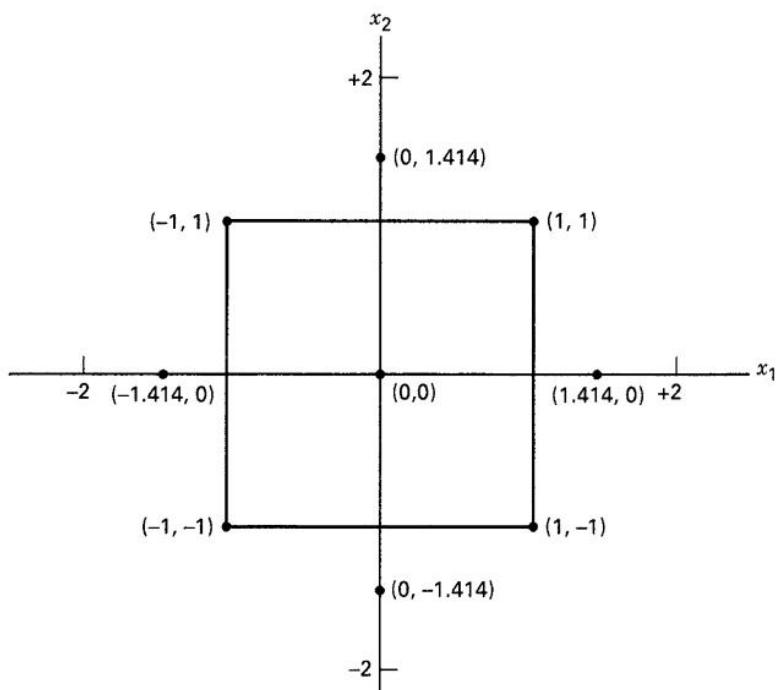

That is, $x_{1,s} = 0.389$ and $x_{2,s} = 0.306$ . In terms of the natural variables, the stationary point is

$$
0. 3 8 9 = \frac {\xi_ {1} - 8 5}{5} \quad 0. 3 0 6 = \frac {\xi_ {1} - 1 7 5}{5}
$$

which yields $\xi_{1}=86.95\simeq87$ minutes of reaction time and $\xi_{2}=176.53\simeq176.5^{\circ}\mathrm{F}$ . This is very close to the stationary point found by visual examination of the contour plot in Figure 11.11. Using Equation 11.8, we may find the predicted response at the stationary point as $\hat{y}_{s}=80.21$ .

We may also use the canonical analysis described in this section to characterize the response surface. First, it is necessary to express the fitted model in canonical form (Equation 11.9). The eigenvalues $\lambda_{1}$ and $\lambda_{2}$ are the roots of the determinantal equation

$$
\begin{array}{c} {{| \mathbf {B} - \lambda \mathbf {I} | = 0}} \\ {{\left| \begin{array}{c c} {{- 1. 3 7 6 - \lambda}} & {{0. 1 2 5 0}} \\ {{0. 1 2 5 0}} & {{- 1. 0 0 1 - \lambda}} \end{array} \right| = 0}} \end{array}
$$

which reduces to

$$
\lambda^ {2} + 2. 3 7 8 8 \lambda + 1. 3 6 3 9 = 0
$$

The roots of this quadratic equation are $\lambda_{1} = -0.9634$ and $\lambda_{2} = -1.4141$ . Thus, the canonical form of the fitted model is

$$
\hat {y} = 8 0. 2 1 - 0. 9 6 3 4 w _ {1} ^ {2} - 1. 4 1 4 1 w _ {2} ^ {2}
$$

Because both $\lambda_{1}$ and $\lambda_{2}$ are negative and the stationary point is within the region of exploration, we conclude that the stationary point is a maximum.

TABLE 11.7  
Computer Output from Design-Expert for Fitting a Model to the Yield Response in Example 11.2

<table><tr><td>Source</td><td>Sum of Squares</td><td>DF</td><td>Mean Square</td><td>F Value</td><td>Prob &gt; F</td><td></td></tr><tr><td>Mean</td><td>80062.16</td><td>1</td><td>80062.16</td><td></td><td></td><td></td></tr><tr><td>Linear</td><td>10.04</td><td>2</td><td>5.02</td><td>2.69</td><td>0.1166</td><td></td></tr><tr><td>2FI</td><td>0.25</td><td>1</td><td>0.25</td><td>0.12</td><td>0.7350</td><td></td></tr><tr><td>Quadratic</td><td>17.95</td><td>2</td><td>8.98</td><td>126.88</td><td>&lt;0.001</td><td>Suggested</td></tr><tr><td>Cubic</td><td>2.042E-003</td><td>2</td><td>1.021E-003</td><td>0.010</td><td>0.9897</td><td>Aliased</td></tr><tr><td>Residual</td><td>0.49</td><td>5</td><td>0.099</td><td></td><td></td><td></td></tr><tr><td>Total</td><td>80090.90</td><td>13</td><td>6160.84</td><td></td><td></td><td></td></tr></table>

"Sequential Model Sum of Squares": Select the highest order polynomial where the additional terms are significant.

Lack-of-Fit Tests

<table><tr><td>Source</td><td>Sum of Squares</td><td>DF</td><td>Mean Square</td><td>F Value</td><td>Prob &gt; F</td><td></td></tr><tr><td>Linear</td><td>18.49</td><td>6</td><td>3.08</td><td>58.14</td><td>0.0008</td><td></td></tr><tr><td>2FI</td><td>18.24</td><td>5</td><td>3.65</td><td>68.82</td><td>0.0006</td><td></td></tr><tr><td>Quadratic</td><td>0.28</td><td>3</td><td>0.094</td><td>1.78</td><td>0.2897</td><td>Suggested</td></tr><tr><td>Cubic</td><td>0.28</td><td>1</td><td>0.28</td><td>5.31</td><td>0.0826</td><td>Aliased</td></tr><tr><td>Pure Error</td><td>0.21</td><td>4</td><td>0.053</td><td></td><td></td><td></td></tr></table>

"Lack-of-Fit Tests": Want the selected model to have insignificant lack-of-fit.

Model summary Statistics

<table><tr><td>Source</td><td>Std. Dev.</td><td>R-Squared</td><td>Adjusted R-Squared</td><td>Predicted R-Squared</td><td>PRESS</td><td></td></tr><tr><td>Linear</td><td>1.37</td><td>0.3494</td><td>0.2193</td><td>-0.0435</td><td>29.99</td><td></td></tr><tr><td>2FI</td><td>1.43</td><td>0.3581</td><td>0.1441</td><td>-0.2730</td><td>36.59</td><td></td></tr><tr><td>Quadratic</td><td>0.27</td><td>0.9828</td><td>0.9705</td><td>0.9184</td><td>2.35</td><td>Suggested</td></tr><tr><td>Cubic</td><td>0.31</td><td>0.9828</td><td>0.9588</td><td>0.3622</td><td>18.33</td><td>Aliased</td></tr></table>

"Model Summary Statistics": Focus on the model minimizing the "PRESS," or equivalently maximizing the "PRED R-SQR."  
Response: yield

## ANOVA for Response Surface Quadratic Model

Analysis of variance table [Partial sum of squares]

<table><tr><td>Source</td><td>Sum of Squares</td><td>DF</td><td>Mean Square</td><td>F Value</td><td>Prob &gt; F</td></tr><tr><td>Model</td><td>28.25</td><td>5</td><td>5.65</td><td>79.85</td><td>&lt;0.0001</td></tr><tr><td>A</td><td>7.92</td><td>1</td><td>7.92</td><td>111.93</td><td>&lt;0.0001</td></tr><tr><td>B</td><td>2.12</td><td>1</td><td>2.12</td><td>30.01</td><td>0.0009</td></tr><tr><td> $A^2$ </td><td>13.18</td><td>1</td><td>13.18</td><td>186.22</td><td>&lt;0.0001</td></tr><tr><td> $B^2$ </td><td>6.97</td><td>1</td><td>6.97</td><td>98.56</td><td>&lt;0.0001</td></tr><tr><td>AB</td><td>0.25</td><td>1</td><td>0.25</td><td>3.53</td><td>0.1022</td></tr><tr><td>Residual</td><td>0.50</td><td>7</td><td>0.071</td><td></td><td></td></tr><tr><td>Lack of Fit</td><td>0.28</td><td>3</td><td>0.094</td><td>1.78</td><td>0.2897</td></tr><tr><td>Pure Error</td><td>0.21</td><td>4</td><td>0.053</td><td></td><td></td></tr><tr><td>Cor Total</td><td>28.74</td><td>12</td><td></td><td></td><td></td></tr></table>

<table><tr><td>Std. Dev.</td><td>0.27</td><td>R-Squared</td><td>0.9828</td></tr><tr><td>Mean</td><td>78.48</td><td>Adj R-Squared</td><td>0.9705</td></tr><tr><td>C.V.</td><td>0.34</td><td>Pred R-Squared</td><td>0.9184</td></tr><tr><td>PRESS</td><td>2.35</td><td>Adeq Precision</td><td>23.018</td></tr></table>

■ TABLE 11.7 (Continued)

<table><tr><td>Factor</td><td>Coefficient Estimate</td><td>DF</td><td>Standard Error</td><td>95% CI Low</td><td>95% CI High</td><td>VIF</td></tr><tr><td>Intercept</td><td>79.94</td><td>1</td><td>0.12</td><td>79.66</td><td>80.22</td><td></td></tr><tr><td>A-time</td><td>0.99</td><td>1</td><td>0.094</td><td>0.77</td><td>1.22</td><td>1.00</td></tr><tr><td>B-temp</td><td>0.52</td><td>1</td><td>0.094</td><td>0.29</td><td>0.74</td><td>1.00</td></tr><tr><td> $A^{2}$ </td><td>-1.38</td><td>1</td><td>0.10</td><td>-1.61</td><td>-1.14</td><td>1.02</td></tr><tr><td> $B^{2}$ </td><td>-1.00</td><td>1</td><td>0.10</td><td>-1.24</td><td>-0.76</td><td>1.02</td></tr><tr><td>AB</td><td>0.25</td><td>1</td><td>0.13</td><td>-0.064</td><td>0.56</td><td>1.00</td></tr></table>

Final Equation in Terms of Coded Factors:

$$
+ 0. 9 9 \mathrm {\astA}
$$

$$
- 1. 0 0 * \mathbf {B} ^ {2}
$$

$$
+ 0. 2 5 \mathrm {\astA*B}
$$

Final Equation in Terms of Actual Factors:

yield =  
-1430.52285  
+7.80749 \* time  
+13.27053 \* temp  
-0.055050 \* time²  
-0.040050 \* temp²  
+0.010000 \* time \* temp

Diagnostics Case Statistics

<table><tr><td>Run Order</td><td>Standard Order</td><td>Actual Value</td><td>Predicted Value</td><td>Residual</td><td>Leverage</td><td>Student Residual</td><td>Cook&#x27;s Distance</td><td>Outlier t</td></tr><tr><td>8</td><td>1</td><td>76.50</td><td>76.30</td><td>0.20</td><td>0.625</td><td>1.213</td><td>0.409</td><td>1.264</td></tr><tr><td>6</td><td>2</td><td>78.00</td><td>77.79</td><td>0.21</td><td>0.625</td><td>1.275</td><td>0.452</td><td>1.347</td></tr><tr><td>9</td><td>3</td><td>77.00</td><td>76.83</td><td>0.17</td><td>0.625</td><td>1.027</td><td>0.293</td><td>1.032</td></tr><tr><td>11</td><td>4</td><td>79.50</td><td>79.32</td><td>0.18</td><td>0.625</td><td>1.089</td><td>0.329</td><td>1.106</td></tr><tr><td>12</td><td>5</td><td>75.60</td><td>75.78</td><td>-0.18</td><td>0.625</td><td>-1.107</td><td>0.341</td><td>-1.129</td></tr><tr><td>10</td><td>6</td><td>78.40</td><td>78.59</td><td>-0.19</td><td>0.625</td><td>-1.195</td><td>0.396</td><td>-1.240</td></tr><tr><td>7</td><td>7</td><td>77.00</td><td>77.21</td><td>-0.21</td><td>0.625</td><td>-1.283</td><td>0.457</td><td>-1.358</td></tr><tr><td>1</td><td>8</td><td>78.50</td><td>78.67</td><td>-0.17</td><td>0.625</td><td>-1.019</td><td>0.289</td><td>-1.023</td></tr><tr><td>5</td><td>9</td><td>79.90</td><td>79.94</td><td>-0.040</td><td>0.200</td><td>-0.168</td><td>0.001</td><td>-0.156</td></tr><tr><td>3</td><td>10</td><td>80.30</td><td>79.94</td><td>0.36</td><td>0.200</td><td>1.513</td><td>0.095</td><td>1.708</td></tr><tr><td>13</td><td>11</td><td>80.00</td><td>79.94</td><td>0.060</td><td>0.200</td><td>0.252</td><td>0.003</td><td>0.235</td></tr><tr><td>2</td><td>12</td><td>79.70</td><td>79.94</td><td>-0.24</td><td>0.200</td><td>-1.009</td><td>0.042</td><td>-1.010</td></tr><tr><td>4</td><td>13</td><td>79.80</td><td>79.94</td><td>-0.14</td><td>0.200</td><td>-0.588</td><td>0.014</td><td>0.559</td></tr></table>

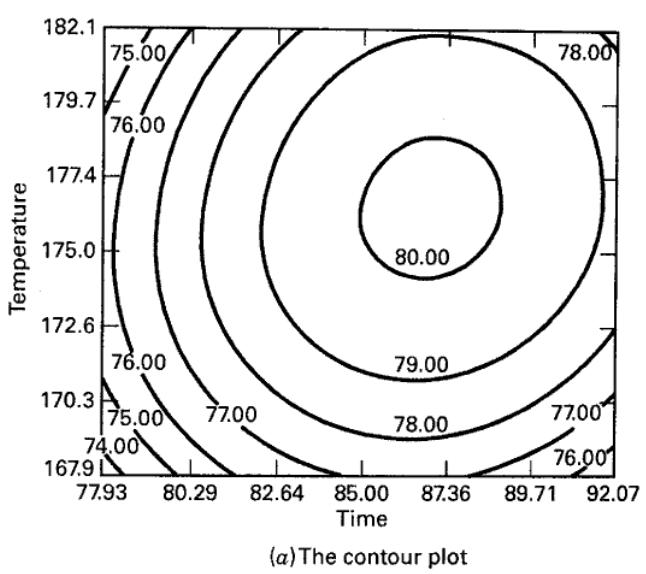

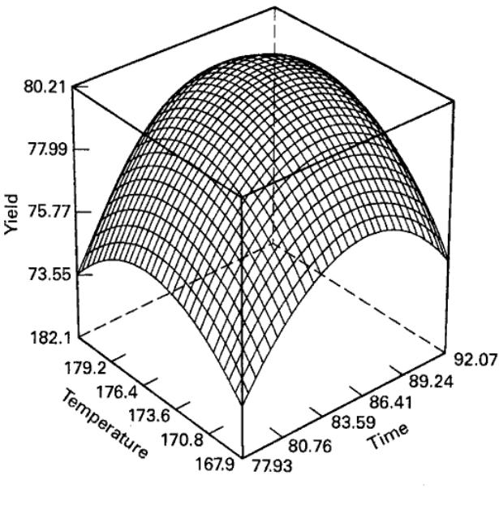  
■ FIGURE 11.11 Contour and response surface plots of the yield response, Example 11.2

In some RSM problems, it may be necessary to find the relationship between the canonical variables $\{w_{i}\}$ and the design variables $\{x_{i}\}$ . This is particularly true if it is impossible to operate the process at the stationary point. As an illustration, suppose that in Example 11.2 we could not operate the process at $\xi_{1}=87$ minutes and $\xi_{2}=176.5^{\circ}F$ because this combination of factors results in excessive cost. We now wish to “back away” from the stationary point to a point of lower cost without incurring large losses in yield. The canonical form of the model indicates that the surface is less sensitive to yield loss in the $w_{1}$ direction. Exploration of the canonical form requires converting points in the $(w_{1},w_{2})$ space to points in the $(x_{1},x_{2})$ space.

In general, the variables x are related to the canonical variables w by

$$
\mathbf {w} = \mathbf {M} ^ {\prime} (\mathbf {x} - \mathbf {x} _ {s})
$$

where $\mathbf{M}$ is a $(k\times k)$ orthogonal matrix. The columns of $\mathbf{M}$ are the normalized eigenvectors associated with the $\{\lambda_i\}$ . That is, if $\mathbf{m}_i$ is the $i$ th column of $\mathbf{M}$ , then $\mathbf{m}_i$ is the solution to

$$
(\mathbf {B} - \lambda_ {i} \mathbf {I}) \mathbf {m} _ {i} = \mathbf {0}\tag{11.10}
$$

for which $\sum_{j=1}^{k} m_{ji}^2 = 1$ .

We illustrate the procedure using the fitted second-order model in Example 11.2. For $\lambda_{1} = -0.9634$ , Equation 11.10 becomes

$$
\left[ \begin{array}{c c} (- 1. 3 7 6 + 0. 9 6 3 4) & 0. 1 2 5 0 \\ 0. 1 2 5 0 & (- 1. 0 0 1 + 0. 9 6 3 4) \end{array} \right] \left[ \begin{array}{c} m _ {1 1} \\ m _ {2 1} \end{array} \right] = \left[ \begin{array}{c} 0 \\ 0 \end{array} \right]
$$

or

$$
\begin{array}{r} - 0. 4 1 2 9 m _ {1 1} + 0. 1 2 5 0 m _ {2 1} = 0 \\ 0. 1 2 5 0 m _ {1 1} + 0. 0 3 7 7 m _ {2 1} = 0 \end{array}
$$

We wish to obtain the normalized solution to these equations, that is, the one for which $m_{11}^{2} + m_{21}^{2} = 1$ . There is no unique solution to these equations, so it is most convenient to assign an arbitrary value to one unknown, solve the system, and normalize the solution. Letting $m_{21}^{*} = 1$ , we find $m_{11}^{*} = 0.3027$ . To normalize this solution, we divide $m_{11}^{*}$ and $m_{21}^{*}$ by

$$
\sqrt {(m _ {1 1} ^ {*}) ^ {2} + (m _ {2 1} ^ {*}) ^ {2}} = \sqrt {(0 . 3 0 2 7) ^ {2} + (1) ^ {2}} = 1. 0 4 4 8
$$

This yields the normalized solution

$$
m _ {1 1} = \frac {m _ {1 1} ^ {*}}{1 . 0 4 4 8} = \frac {0 . 3 0 2 7}{1 . 0 4 4 8} = 0. 2 8 9 8
$$

and

$$
m _ {2 1} = \frac {m _ {2 1} ^ {*}}{1 . 0 4 4 8} = \frac {1}{1 . 0 4 4 8} = 0. 9 5 7 1
$$

which is the first column of the M matrix.

Using $\lambda_{2} = -1.4141$ , we can repeat the above procedure, obtaining $m_{12} = -0.9571$ and $m_{22} = 0.2898$ as the second column of M. Thus, we have

$$
\mathbf {M} = \left[ \begin{array}{c c} 0. 2 8 9 8 & - 0. 9 5 7 1 \\ 0. 9 5 7 1 & 0. 2 8 9 8 \end{array} \right]
$$

The relationship between the w and x variables is

$$
\left[ \begin{array}{c} w _ {1} \\ w _ {2} \end{array} \right] = \left[ \begin{array}{c c} 0. 2 8 9 8 & 0. 9 5 7 1 \\ - 0. 9 5 7 4 & 0. 2 8 9 8 \end{array} \right] \left[ \begin{array}{c} x _ {1} - 0. 3 8 9 \\ x _ {2} - 0. 3 0 6 \end{array} \right]
$$

or

$$
\begin{array}{c} w _ {1} = 0. 2 8 9 7 (x _ {1} - 0. 3 8 9) + 0. 9 5 7 1 (x _ {2} - 0. 3 0 6) \\ w _ {2} = - 0. 9 5 7 4 (x _ {1} - 0. 3 8 9) + 0. 2 8 8 8 (x _ {2} - 0. 3 0 6) \end{array}
$$

If we wished to explore the response surface in the vicinity of the stationary point, we could determine appropriate points at which to take observations in the $(w_{1}, w_{2})$ space and then use the above relationship to convert these points into the $(x_{1}, x_{2})$ space so that the runs may be made.

## 11.3.3 Ridge Systems

It is not unusual to encounter variations of the pure maximum, minimum, or saddle point response surfaces discussed in the previous section. Ridge systems, in particular, are fairly common. Consider the canonical form of the second-order model given previously in Equation 11.9:

$$
\hat {y} = \hat {y} _ {\mathrm{s}} + \lambda_ {1} w _ {1} ^ {2} + \lambda_ {2} w _ {2} ^ {2} + \dots + \lambda_ {k} w _ {k} ^ {2}
$$

Now suppose that the stationary point $x_{s}$ is within the region of experimentation; furthermore, let one or more of the $\lambda_{i}$ be very small (e.g., $\lambda_{i} \simeq 0$ ). The response variable is then very insensitive to the variables $w_{i}$ multiplied by the small $\lambda_{i}$ . A contour plot illustrating this situation is shown in Figure 11.12 for k = 2 variables with $\lambda_{1} = 0$ . (In practice, $\lambda_{1}$ would be close to but not exactly equal to zero.) The canonical model for this response surface is theoretically

$$
\hat {y} = \hat {y} _ {\mathrm{s}} + \lambda_ {2} w _ {2} ^ {2}
$$

with $\lambda_{2}$ negative. Notice that the severe elongation in the $w_{1}$ direction has resulted in a line of centers at $\hat{y}=70$ and the optimum may be taken anywhere along that line. This type of response surface is called a stationary ridge system.

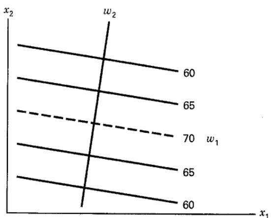  
■ FIGURE 11.12 A contour plot of a stationary ridge system

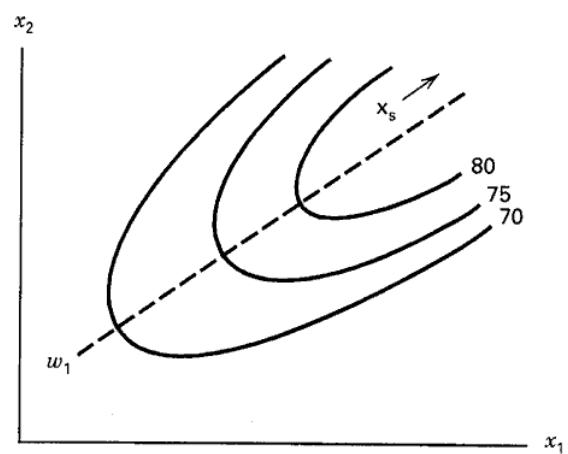  
■ FIGURE 11.13 A contour plot of a rising ridge system

If the stationary point is far outside the region of exploration for fitting the second-order model and one (or more) $\lambda_{i}$ is near zero, then the surface may be a rising ridge. Figure 11.13 illustrates a rising ridge for k = 2 variables with $\lambda_{1}$ near zero and $\lambda_{2}$ negative. In this type of ridge system, we cannot draw inferences about the true surface or the stationary point because $x_{s}$ is outside the region where we have fit the model. However, further exploration is warranted in the $w_{1}$ direction. If $\lambda_{2}$ had been positive, we would call this system a falling ridge.

## 11.3.4 Multiple Responses

Many response surface problems involve the analysis of several responses. For instance, in Example 11.2, the experimenter measured three responses. In this example, we optimized the process with respect to only the yield response $y_{1}$ .

Simultaneous consideration of multiple responses involves first building an appropriate response surface model for each response and then trying to find a set of operating conditions that in some sense optimizes all responses or at least keeps them in desired ranges. An extensive treatment of the multiple response problem is given in Myers, Montgomery, and Anderson-Cook (2016).

We may obtain models for the viscosity and molecular weight responses ( $y_{2}$ and $y_{3}$ , respectively) in Example 11.2 as follows:

$$
\begin{array}{l} \hat {y} _ {2} = 7 0. 0 0 - 0. 1 6 x _ {2} - 0. 9 5 x _ {2} - 0. 6 9 x _ {1} ^ {2} - 6. 6 9 x _ {2} ^ {2} - 1. 2 5 x _ {1} x _ {2} \\ \hat {y} _ {3} = 3 3 8 6. 2 + 2 0 5. 1 x _ {1} + 1 7 7. 4 x _ {2} \end{array}
$$

In terms of the natural levels of time $(\xi_{1})$ and temperature $(\xi_{2})$ , these models are

$$
\begin{array}{r l} \hat {y} _ {2} & = - 9 0 3 0. 7 4 + 1 3. 3 9 3 \xi_ {1} + 9 7. 7 0 8 \xi_ {2} \\ & - 2. 7 5 \times 1 0 ^ {- 2} \xi_ {1} ^ {2} - 0. 2 6 7 5 7 \xi_ {2} ^ {2} - 5 \times 1 0 ^ {- 2} \xi_ {1} \xi_ {2} \end{array}
$$

and

$$
\hat {y} _ {3} = - 6 3 0 8. 8 + 4 1. 0 2 5 \xi_ {1} + 3 5. 4 7 3 \xi_ {2}
$$

Figures 11.14 and 11.15 present the contour and response surface plots for these models.

A relatively straightforward approach to optimizing several responses that works well when there are only a few process variables is to overlay the contour plots for each response. Figure 11.16 shows an overlay plot for the three responses in Example 11.2, with contours for which $y_{1}$ (yield) $\geq 78.5$ , $62 \leq y_{2}$ (viscosity) $\leq 68$ , and $y_{3}$ (molecular weight Mn) $\leq 3400$ . If these boundaries represent important conditions that must be met by the process, then as the unshaded portion of Figure 11.16 shows, a number of combinations of time and temperature will result in a satisfactory process. The experimenter can visually examine the contour plot to determine appropriate operating conditions. For example, it is likely that the experimenter would be most interested in the larger of the two feasible operating regions shown in Figure 11.16.

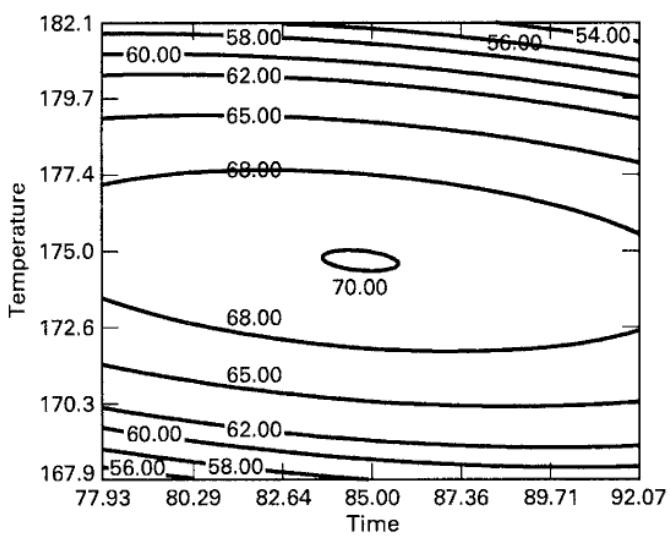  
(a) The contour plot

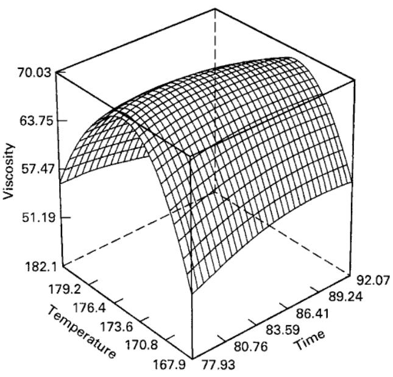  
(b) The response surface plot  
■ FIGURE 11.14 Contour plot and response surface plot of viscosity, Example 11.2

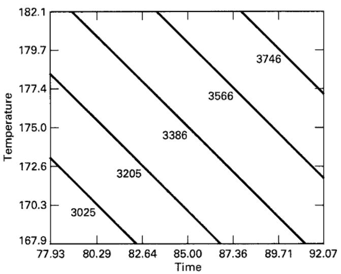  
(a) The contour plot

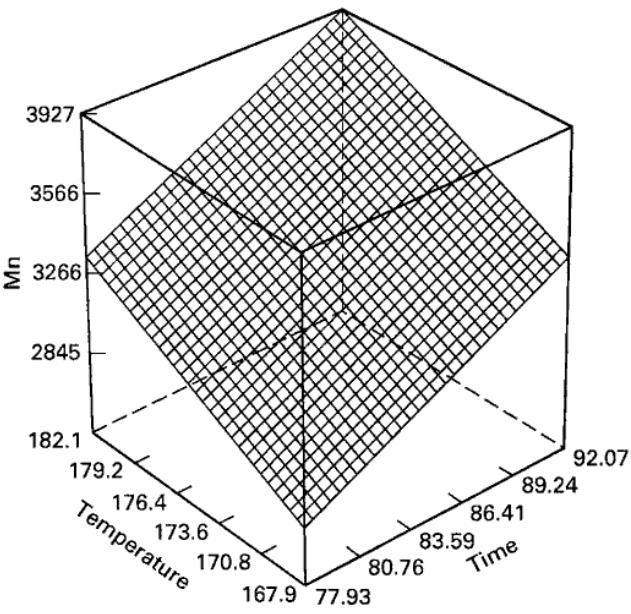  
(b) The response surface plot  
■ FIGURE 11.15 Contour plot and response surface plot of molecular weight, Example 11.2

When there are more than three design variables, overlaying contour plots becomes awkward because the contour plot is two dimensional, and k - 2 of the design variables must be held constant to construct the graph. Often a lot of trial and error is required to determine which factors to hold constant and what levels to select to obtain the best view of the surface. Therefore, there is practical interest in more formal optimization methods for multiple responses.

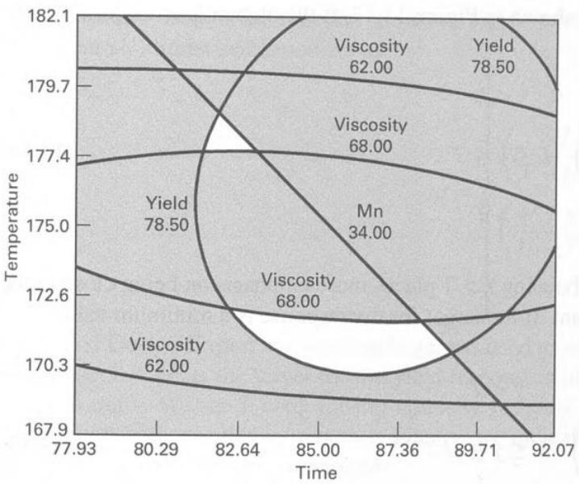

■ FIGURE 11.16 Region of the optimum found by overlaying yield, viscosity, and molecular weight response surfaces, Example 11.2

A popular approach is to formulate and solve the problem as a constrained optimization problem. To illustrate using Example 11.2, we might formulate the problem as

$$
\begin{array}{c} \text { Max } y _ {1} \\ \text { subject   to } \\ 6 2 \leq y _ {2} \leq 6 8 \\ y _ {3} \leq 3 4 0 0 \end{array}
$$

Many numerical techniques can be used to solve this problem. Sometimes these techniques are referred to as nonlinear programming methods. The Design-Expert software package solves this version of the problem using a direct search procedure. The two solutions found are

$$
\mathrm{time} = 8 3. 5 \quad \mathrm{temp} = 1 7 7. 1 \quad \hat {y} _ {1} = 7 9. 5
$$

and

$$
\mathrm{time} = 8 6. 6 \quad \mathrm{temp} = 1 7 2. 2 5 \quad \hat {y} _ {1} = 7 9. 5
$$

Notice that the first solution is in the upper (smaller) feasible region of the design space (refer to Figure 11.16), whereas the second solution is in the larger region. Both solutions are very near to the boundary of the constraints.

Another useful approach to optimization of multiple responses is to use the simultaneous optimization technique popularized by Derringer and Suich (1980). Their procedure makes use of desirability functions. The general approach is to first convert each response $y_{i}$ into an individual desirability function $d_{i}$ that varies over the range

$$
0 \leq d _ {i} \leq 1
$$

where if the response $y_{i}$ is at its goal or target, then $d_{i}=1$ and if the response is outside an acceptable region, $d_{i}=0$ . Then the design variables are chosen to maximize the overall desirability

$$
D = (d _ {1} \cdot d _ {2} \cdot \cdot \cdot d _ {m}) ^ {1 / m}
$$

where there are m responses. The overall desirability will be zero if any of the individual responses is undesirable.

The individual desirability functions are structured as shown in Figure 11.17. If the objective or target T for the response y is a maximum value,

$$
d = \left\{ \begin{array}{c c} 0 & y <   L \\ \left(\frac {y - L}{T - L}\right) ^ {r} & L \leq y \leq T \\ 1 & y > T \end{array} \right.\tag{11.11}
$$

when the weight r = 1, the desirability function is linear. Choosing r > 1 places more emphasis on being close to the target value and choosing 0 < r < 1 makes this less important. If the target for the response is a minimum value,

$$
d = \left\{ \begin{array}{c c} 1 & y <   T \\ \left(\frac {U - y}{U - T}\right) ^ {r} & T \leq y \leq U \\ 0 & y > U \end{array} \right.\tag{11.12}
$$

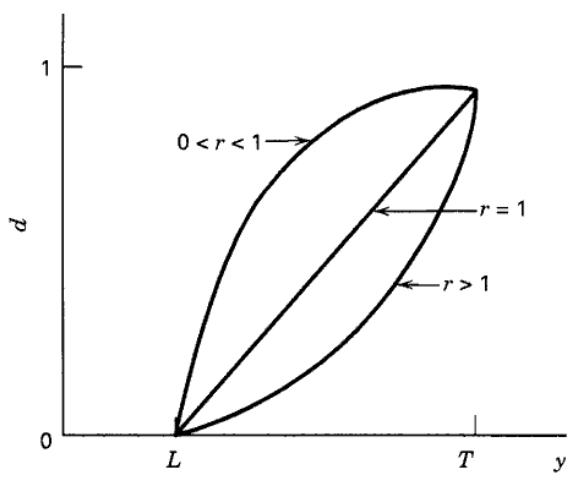  
(a) Objective (target) is to maximize $y$

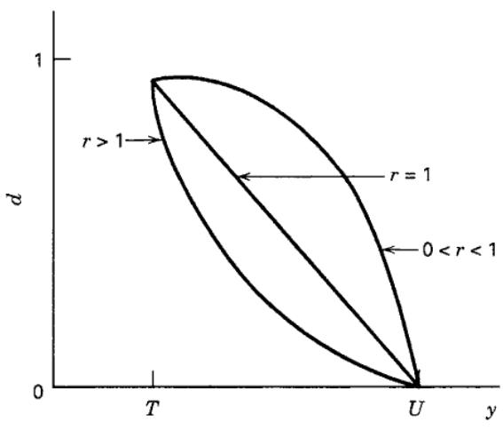  
(b) Objective (target) is to minimize y

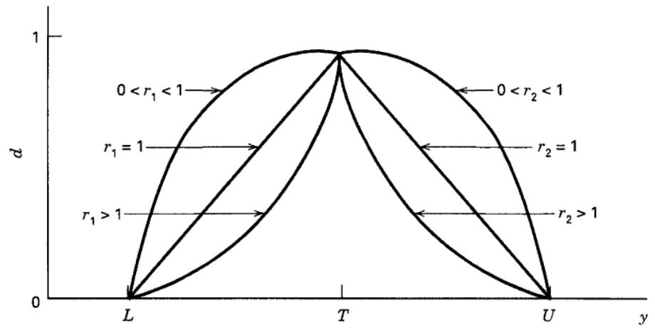  
(c) Objective is for y to be as close as possible to the target  
■ FIGURE 11.17 Individual desirability functions for simultaneous optimization

The two-sided desirability function shown in Figure 11.17c assumes that the target is located between the lower $(L)$ and upper $(U)$ limits and is defined as

$$
d = \left\{ \begin{array}{c c} 0 & y <   L \\ \left(\frac {y - L}{T - L}\right) ^ {r _ {1}} & L \leq y \leq T \\ \left(\frac {U - y}{U - T}\right) ^ {r _ {2}} & T \leq y \leq U \\ 0 & y > U \end{array} \right.\tag{11.13}
$$

The Design-Expert software package was used to solve Example 11.2 using the desirability function approach. We chose T = 80 as the target for the yield response with U = 70 and set the weight for this individual desirability equal to unity. We set T = 65 for the viscosity response with L = 62 and U = 68 (to be consistent with specifications), with both weights $r_{1} = r_{2} = 1$ . Finally, we indicated that any molecular weight between 3200 and 3400 was acceptable. Two solutions were found.

## Solution 1

<table><tr><td rowspan="2">Solution 2</td><td>Time = 86.5 $\hat{y}_{1} = 78.8$ </td><td>Temp = 170.5 $\hat{y}_{2} = 65$ </td><td>D = 0.822 $\hat{y}_{3} = 3287$ </td></tr><tr><td>Time = 82 $\hat{y}_{1} = 78.5$ </td><td>Temp = 178.8 $\hat{y}_{2} = 65$ </td><td>D = 0.792 $\hat{y}_{3} = 3400$ </td></tr></table>

Solution 1 has the highest overall desirability. Notice that it results in on-target viscosity and acceptable molecular weight. This solution is in the larger of the two operating regions in Figure 11.16, whereas the second solution is in the smaller region. Figure 11.18 shows a response and contour plot of the overall desirability function D.

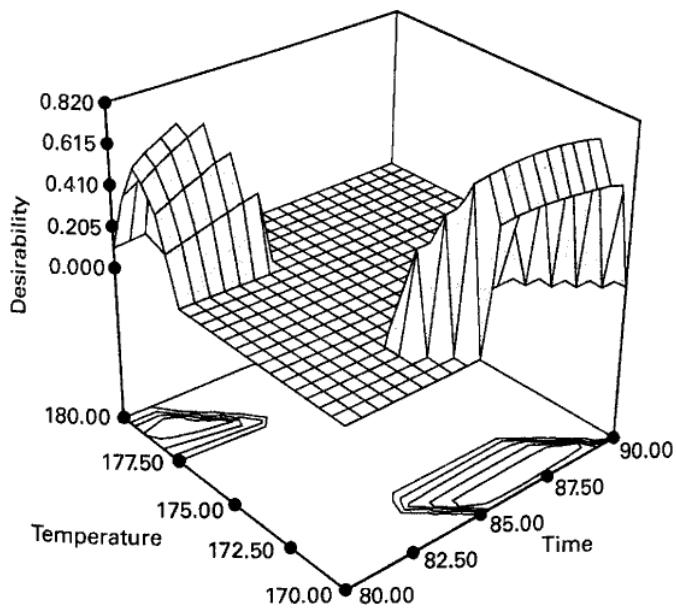

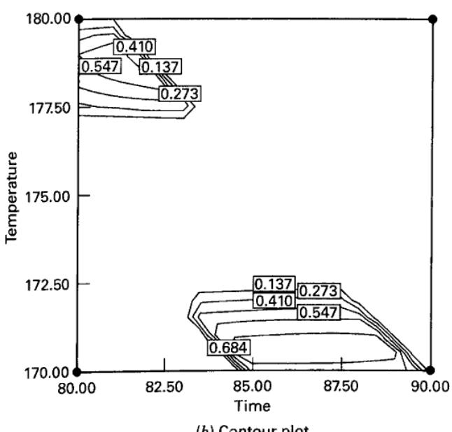  
■ FIGURE 11.18 Desirability function response surface and contour plot for the problem in Example 11.2
