## 11.4 Experimental Designs for Fitting Response Surfaces

Fitting and analyzing response surfaces is greatly facilitated by the proper choice of an experimental design. In this section, we discuss some aspects of selecting appropriate designs for fitting response surfaces.

When selecting a response surface design, some of the features of a desirable design are as follows:

1. Provides a reasonable distribution of data points (and hence information) throughout the region of interest

2. Allows model adequacy, including lack of fit, to be investigated

3. Allows experiments to be performed in blocks

4. Allows designs of higher order to be built up sequentially

5. Provides an internal estimate of error

6. Provides precise estimates of the model coefficients

7. Provides a good profile of the prediction variance throughout the experimental region

8. Provides reasonable robustness against outliers or missing values

9. Does not require a large number of runs

10. Does not require too many levels of the independent variables

11. Ensures simplicity of calculation of the model parameters

These features are sometimes conflicting, so judgment must often be applied in design selection. For more information on the choice of a response surface design, refer to Khuri and Cornell (1996), Myers, Montgomery, and Anderson-Cook (2016), and Box and Draper (2007).

## 11.4.1 Designs for Fitting the First-Order Model

Suppose we wish to fit the first-order model in k variables

$$
y = \beta_ {0} + \sum_ {i = 1} ^ {k} \beta_ {i} x _ {i} + \epsilon\tag{11.14}
$$

There is a unique class of designs that minimize the variance of the regression coefficients $\{\hat{\beta}_{i}\}$ . These are the orthogonal first-order designs. A first-order design is orthogonal if the off-diagonal elements of the $(\mathbf{X}'\mathbf{X})$ matrix are all zero. This implies that the cross products of the columns of the X matrix sum to zero.

The class of orthogonal first-order designs includes the $2^{k}$ factorial and fractions of the $2^{k}$ series in which main effects are not aliased with each other. In using these designs, we assume that the low and high levels of the k factors are coded to the usual $\pm1$ levels.

The $2^{k}$ design does not afford an estimate of the experimental error unless some runs are replicated. A common method of including replication in the $2^{k}$ design is to augment the design with several observations at the center (the point $x_{i}=0, i=1,2,\ldots,k$ ). The addition of center points to the $2^{k}$ design does not influence the $\{\hat{\beta}_{i}\}$ for $i\geq1$ , but the estimate of $\beta_{0}$ becomes the grand average of all observations. Furthermore, the addition of center points does not alter the orthogonality property of the design. Example 11.1 illustrates the use of a $2^{2}$ design augmented with five center points to fit a first-order model.

Another orthogonal first-order design is the simplex. The simplex is a regularly sided figure with $k + 1$ vertices in k dimensions. Thus, the simplex design for k = 2 is an equilateral triangle, and it is a regular tetrahedron for k = 3. Simplex designs in two and three dimensions are shown in Figure 11.19.

## 11.4.2 Designs for Fitting the Second-Order Model

We have informally introduced in Example 11.2 (and even earlier, in Example 6.6) the central composite design or CCD for fitting a second-order model. This is the most popular class of designs used for fitting these models. Generally, the CCD consists of a $2^{k}$ factorial (or fractional factorial of resolution V) with $n_{F}$ factorial runs, 2k axial or star runs, and $n_{C}$ center runs. Figure 11.20 shows the CCD for k = 2 and k = 3 factors.

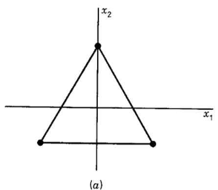

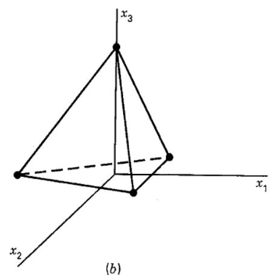  
■ FIGURE 11.19 The simplex design for (a) k = 2 variables and (b) k = 3 variables

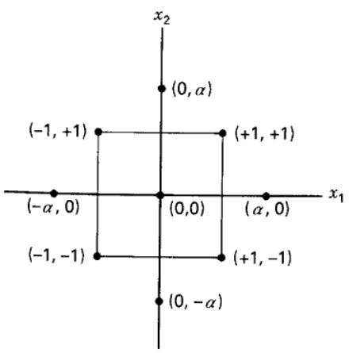

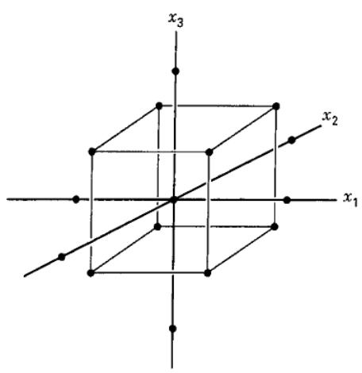  
■ FIGURE 11.20 Central composite designs for k = 2 and k = 3

The practical deployment of a CCD often arises through sequential experimentation, as in Examples 11.1 and 11.2. That is, a $2^{k}$ has been used to fit a first-order model, this model has exhibited lack of fit, and the axial runs are then added to allow the quadratic terms to be incorporated into the model. The CCD is a very efficient design for fitting the second-order model. There are two parameters in the design that must be specified: the distance $\alpha$ of the axial runs from the design center and the number of center points $n_{C}$ . We now discuss the choice of these two parameters.

Rotatability. It is important for the second-order model to provide good predictions throughout the region of interest. One way to define “good” is to require that the model should have a reasonably consistent and stable variance of the predicted response at points of interest x. Recall from Equation 10.40 that the variance of the predicted response at some point x is

$$
V [ \hat {y} (\mathbf {x}) ] = \sigma^ {2} \mathbf {x} ^ {\prime} (\mathbf {X} ^ {\prime} \mathbf {X}) ^ {- 1} \mathbf {x}\tag{11.15}
$$

Box and Hunter (1957) suggested that a second-order response surface design should be rotatable. This means that the $V[\hat{y}(\mathbf{x})]$ is the same at all points $\mathbf{x}$ that are at the same distance from the design center. That is, the variance of predicted response is constant on spheres.

Figure 11.21 shows contours of constant $\sqrt{V[\hat{y}(\mathbf{x})]}$ for the second-order model fit using the CCD in Example 11.2. Notice that the contours of constant standard deviation of predicted response are concentric circles. A design with this property will leave the variance of $\hat{y}$ unchanged when the design is rotated about the center $(0,0,\ldots,0)$ , hence the name rotatable design.

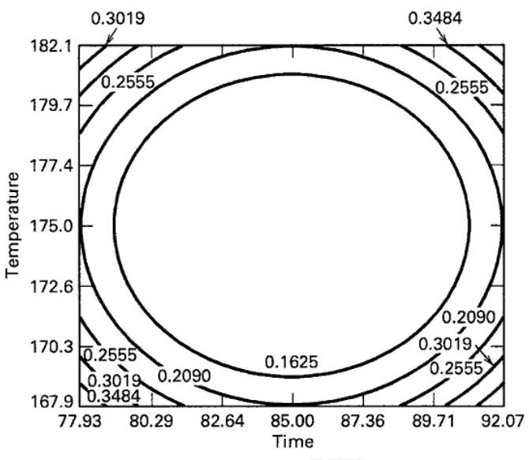  
(a) Contours of $\sqrt{V[\hat{y}(\mathbf{x})]}$

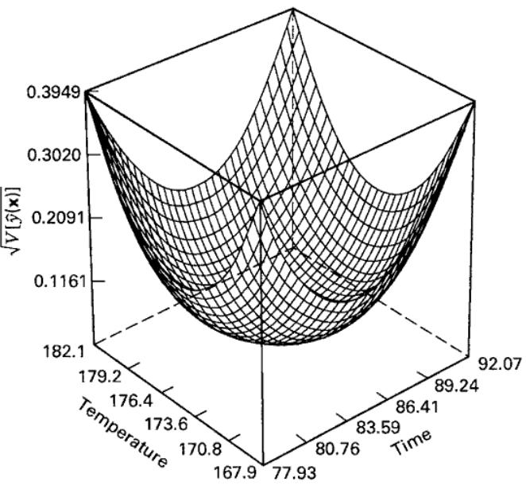  
(b) The response surface plot  
■ FIGURE 11.21 Contours of constant standard deviation of predicted response for the rotatable CCD, Example 11.2

Rotatability is a reasonable basis for the selection of a response surface design. Because the purpose of RSM is optimization and the location of the optimum is unknown prior to running the experiment, it makes sense to use a design that provides equal precision of estimation in all directions. (It can be shown that any first-order orthogonal design is rotatable.)

A central composite design is made rotatable by the choice of $\alpha$ . The value of $\alpha$ for rotatability depends on the number of points in the factorial portion of the design; in fact, $\alpha = (n_{F})^{1/4}$ yields a rotatable central composite design where $n_{F}$ is the number of points used in the factorial portion of the design.

The Spherical CCD. Rotatability is a spherical property; that is, it makes the most sense as a design criterion when the region of interest is a sphere. However, it is not important to have exact rotatability to have a good design. For a spherical region of interest, the best choice of $\alpha$ from a prediction variance viewpoint for the CCD is to set $\alpha = \sqrt{k}$ . This design, called a spherical CCD, puts all the factorial and axial design points on the surface of a sphere of radius $\sqrt{k}$ . For more discussion of this, see Myers, Montgomery, and Anderson-Cook (2016).

Center Runs in the CCD. The choice of $\alpha$ in the CCD is dictated primarily by the region of interest. When this region is a sphere, the design must include center runs to provide reasonably stable variance of the predicted response. Generally, three to five center runs are recommended.

The Box-Behnken Design. Box and Behnken (1960) have proposed some three-level designs for fitting response surfaces. These designs are formed by combining $2^{k}$ factorials with incomplete block designs. The resulting designs are usually very efficient in terms of the number of required runs, and they are either rotatable or nearly rotatable.

Table 11.8 shows a three-variable Box–Behnken design. The design is also shown geometrically in Figure 11.22. Notice that the Box–Behnken design is a spherical design, with all points lying on a sphere of radius $\sqrt{2}$ . Also, the Box–Behnken design does not contain any points at the vertices of the cubic region created by the upper and lower limits for each variable. This could be advantageous when the points on the corners of the cube represent factor-level combinations that are prohibitively expensive or impossible to test because of physical process constraints.

TABLE 11.8  
A Three-Variable Box-Behnken Design

<table><tr><td>Run</td><td> $x_{1}$ </td><td> $x_{2}$ </td><td> $x_{3}$ </td></tr><tr><td>1</td><td>-1</td><td>-1</td><td>0</td></tr><tr><td>2</td><td>-1</td><td>1</td><td>0</td></tr><tr><td>3</td><td>1</td><td>-1</td><td>0</td></tr><tr><td>4</td><td>1</td><td>1</td><td>0</td></tr><tr><td>5</td><td>-1</td><td>0</td><td>-1</td></tr><tr><td>6</td><td>-1</td><td>0</td><td>1</td></tr><tr><td>7</td><td>1</td><td>0</td><td>-1</td></tr><tr><td>8</td><td>1</td><td>0</td><td>1</td></tr><tr><td>9</td><td>0</td><td>-1</td><td>-1</td></tr><tr><td>10</td><td>0</td><td>-1</td><td>1</td></tr><tr><td>11</td><td>0</td><td>1</td><td>-1</td></tr><tr><td>12</td><td>0</td><td>1</td><td>1</td></tr><tr><td>13</td><td>0</td><td>0</td><td>0</td></tr><tr><td>14</td><td>0</td><td>0</td><td>0</td></tr><tr><td>15</td><td>0</td><td>0</td><td>0</td></tr></table>

Cuboidal Region of Interest. In many situations, the region of interest is cuboidal rather than spherical. In these cases, a useful variation of the central composite design is the face-centered central composite design or the face-centered cube, in which $\alpha = 1$ . This design locates the star or axial points on the centers of the faces of the cube, as shown in Figure 11.23 for k = 3. This variation of the central composite design is also sometimes used because it requires only three levels of each factor, and in practice it is frequently difficult to change factor levels. However, note that face-centered central composite designs are not rotatable.

The face-centered cube does not require as many center points as the spherical CCD. In practice, $n_{C}=2$ or 3 is sufficient to provide good variance of prediction throughout the experimental region. It should be noted that sometimes more center runs will be employed to give a reasonable estimate of experimental error. Figure 11.24 shows the square root of prediction variance $\sqrt{V[\hat{y}(\mathbf{x})]}$ for the face-centered cube for k=3 with $n_{C}=3$ center points. Notice that the standard deviation of predicted response is reasonably uniform over a relatively large portion of the design space.

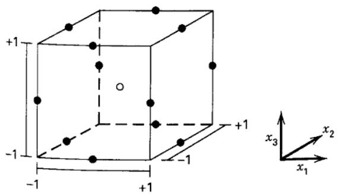  
■ FIGURE 11.22 A Box-Behnken design for three factors

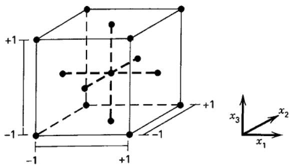  
■ FIGURE 11.23 A face-centered central composite design for k = 3

(a) Response surface  
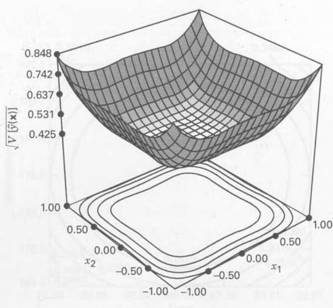

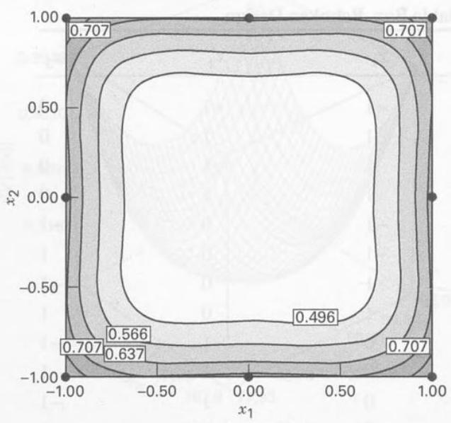  
(b) Contour plot  
■ FIGURE 11.24 Standard deviation of predicted response $\sqrt{V[\hat{y}(\mathbf{x})]}$ for the face-centered cube with $k=3$ , $n_{C}=3$ , and $x_{3}=0$

Other Designs. Many other response surface designs are occasionally useful in practice. For two variables, we could use designs consisting of points that are equally spaced on a circle and that form regular polygons. Because the design points are equidistant from the origin, these arrangements are often called equiradial designs.

For k = 2, a rotatable equiradial design is obtained by combining $n_{2} \geq 5$ points equally spaced on a circle with $n_{1} \geq 1$ points at the center of the circle. Particularly useful designs for k = 2 are the pentagon and the hexagon. These designs are shown in Figure 11.25. The small composite design is another alternative. The small composite design consists of a fractional factorial in the cube of resolution III\* (main effects aliased with two-factor interactions and no two-factor interactions aliased with each other) and the usual axial and center runs. While the small composite design may be of interest when it is important to reduce the number of runs these design do not enjoy good prediction variance properties relative to those of the CCD.

A small composite design for $k = 3$ factors is shown in Table 11.9. This design uses the standard one-half fraction of the $2^3$ in the cube because it meets the resolution III\* criteria. The design has four runs in the cube and six axial runs, and it must have at least one center point. Thus the design has a minimum of $N = 11$ trials, and the second-order model in $k = 3$ variables has $p = 10$ parameters to estimate, so this is a very efficient design with respect to the number

■ FIGURE 11.25 Equiradial designs for two variables. (a) Hexagon (b) Pentagon

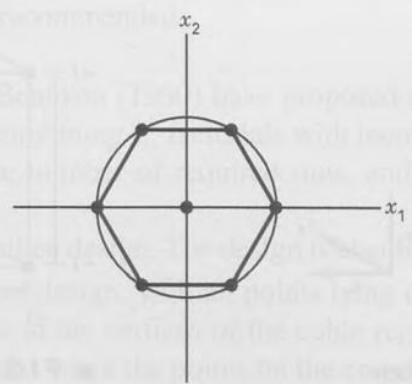  
(a)

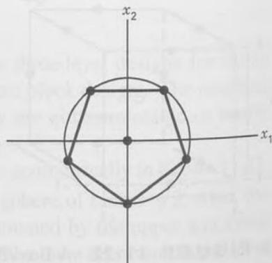  
(b)

TABLE 11.9  
A Small Composite Design for $k = 3$ Factors

<table><tr><td>Standard Order</td><td> $x_{1}$ </td><td> $x_{2}$ </td><td> $x_{3}$ </td></tr><tr><td>1</td><td>1.00</td><td>1.00</td><td>-1.00</td></tr><tr><td>2</td><td>1.00</td><td>-1.00</td><td>1.00</td></tr><tr><td>3</td><td>-1.00</td><td>1.00</td><td>1.00</td></tr><tr><td>4</td><td>-1.00</td><td>-1.00</td><td>-1.00</td></tr><tr><td>5</td><td>-1.73</td><td>0.00</td><td>0.00</td></tr><tr><td>6</td><td>1.73</td><td>0.00</td><td>0.00</td></tr><tr><td>7</td><td>0.00</td><td>-1.73</td><td>0.00</td></tr><tr><td>8</td><td>0.00</td><td>1.73</td><td>0.00</td></tr><tr><td>9</td><td>0.00</td><td>0.00</td><td>-1.73</td></tr><tr><td>10</td><td>0.00</td><td>0.00</td><td>1.73</td></tr><tr><td>11</td><td>0.00</td><td>0.00</td><td>0.00</td></tr><tr><td>12</td><td>0.00</td><td>0.00</td><td>0.00</td></tr><tr><td>13</td><td>0.00</td><td>0.00</td><td>0.00</td></tr><tr><td>14</td><td>0.00</td><td>0.00</td><td>0.00</td></tr></table>

of runs. The design in Table 11.9 has $n_C = 4$ center runs. We selected $\alpha = 1.73$ to give a spherical design because the small composite design cannot be made rotatable.  
The hybrid design is another alternative when it is important to reduce the number of runs. A hybrid design for k = 3 is shown in Table 11.10. Some of these designs have irregular levels, and this can be a limiting factor in their application. However, they are very small designs, and they have excellent prediction variance properties. For more details about small composite and hybrid designs, refer to Myers, Montgomery, and Anderson-Cook (2016).

Graphical Evaluation of Response Surface Designs. Response surface designs are most often used to build models for making predictions. Therefore, the prediction variance (defined in Equation 11.15) is of considerable importance in evaluating or comparing designs. Two-dimensional contour plots or three-dimensional response surface plots of prediction variance (or its square root, prediction standard deviation) such as Figures 11.21 and 11.24 can be of value in this. However, for a design in k factors, these plots allow only two design factors to be displayed on the plot. Because all remaining k - 2 factors are held constant, these plots give an incomplete picture of how the prediction variance is distributed over the design space. Both the fraction of design space (FDS) plot introduced in Section 6.7 and the variance dispersion graph (VDG) developed by Giovannitti-Jensen and Myers (1989) can be used to solve this problem.

TABLE 11.10  
A Hybrid Design for $k = 3$ Factors

<table><tr><td>Standard Order</td><td> $x_{1}$ </td><td> $x_{2}$ </td><td> $x_{3}$ </td></tr><tr><td>1</td><td>0.00</td><td>0.00</td><td>1.41</td></tr><tr><td>2</td><td>0.00</td><td>0.00</td><td>-1.41</td></tr><tr><td>3</td><td>-1.00</td><td>-1.00</td><td>0.71</td></tr><tr><td>4</td><td>1.00</td><td>-1.00</td><td>0.71</td></tr><tr><td>5</td><td>-1.00</td><td>1.00</td><td>0.71</td></tr><tr><td>6</td><td>1.00</td><td>1.00</td><td>0.71</td></tr><tr><td>7</td><td>1.41</td><td>0.00</td><td>-0.71</td></tr><tr><td>8</td><td>-1.41</td><td>0.00</td><td>-0.71</td></tr><tr><td>9</td><td>0.00</td><td>1.41</td><td>-0.71</td></tr><tr><td>10</td><td>0.00</td><td>-1.41</td><td>-0.71</td></tr><tr><td>11</td><td>0.00</td><td>0.00</td><td>0.00</td></tr></table>

A VDG is a graph displaying the minimum, maximum, and average prediction variance for a specific design and response model versus the distance of the design point from the center of the region. The distance or radius usually varies from zero (the design center) to $\sqrt{k}$ , which for a spherical design is the distance of the most remote point in the design from the center. It is customary to plot the scaled prediction variance (SPV)

$$
\frac {N V [ \hat {y} (\mathbf {x}) ]}{\sigma^ {2}} = N \mathbf {x} ^ {\prime} (\mathbf {X} ^ {\prime} \mathbf {X}) ^ {- 1} \mathbf {x}\tag{11.16}
$$

on a VDG. Notice that the SPV is the prediction variance in Equation 11.15 multiplied by the number of runs in the design $(N)$ and divided by the error variance $\sigma^{2}$ . Dividing by $\sigma^{2}$ eliminates an unknown parameter and multiplying by N often serves to facilitate comparing designs of different sizes.

Figure 11.26a is a VDG for the rotatable CCD with k = 3 variables and four center runs. Because the design is rotatable, the minimum, maximum, and average SPV are identical for all points that are at the same distance from the

■ FIGURE 11.26 Variance dispersion graphs. (a) the CCD with k = 3 and $\alpha = 1.68$ (four center runs). (b) The CCD with k = 3 and $\alpha = 1.732$ (four center runs)

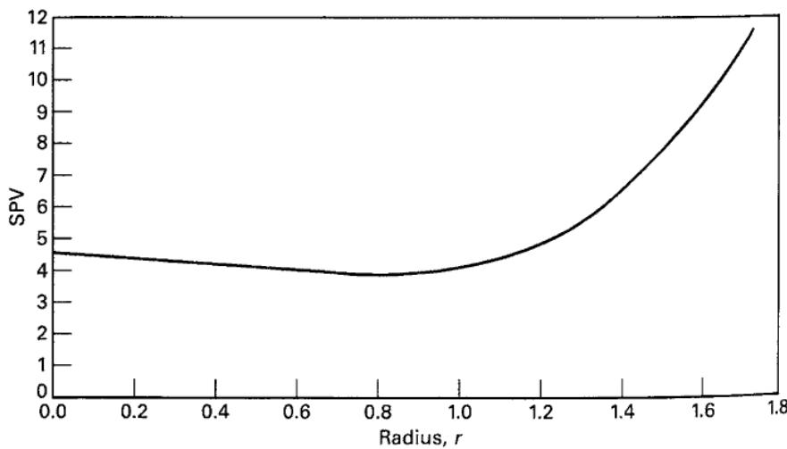  
(a)

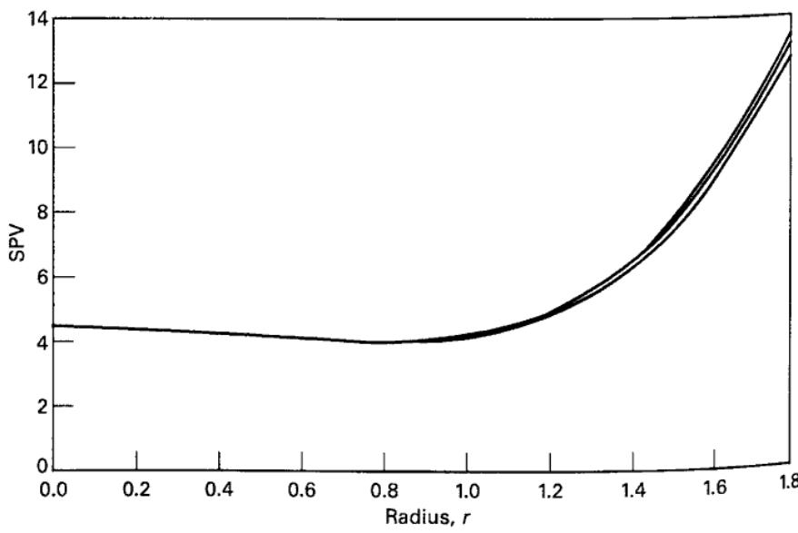  
(b)

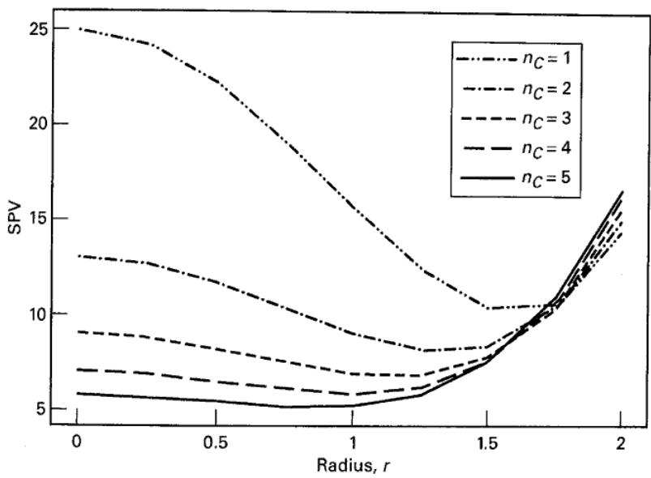

■ FIGURE 11.27 Variance dispersion graph for CCD with k = 4 and $\alpha = 2$

center of the design, so there is only one line on the VDG. Notice how the graph displays the behavior of the SPV over the design space, with nearly constant variance out to a radius of approximately 1.2, and then increasing steadily from there out to the boundary of the design. Figure 11.26b is the VDG for a spherical CCD with k = 3 variables and four center runs. Notice that there is very little difference between the three lines for minimum, maximum, and average SPV, leading us to conclude that any practical difference between the rotatable and spherical versions of this design is very minimal.

Figure 11.27 is the VDG for the rotatable CCD with k = 4 factors. In this VDG, the number of center points in the design varies from $n_{C} = 1$ to $n_{C} = 5$ . The VDG shows clearly that a design with too few center points will have a very unstable distribution of prediction variance but that prediction variance quickly stabilizes with increasing values of $n_{C}$ . Using either four or five center runs will give reasonably stable prediction variance over the design region. VDGs have been used to study the effect of changing the number of center runs in response surface design, and the recommendations given earlier in the chapter are based on some of these studies.

## 11.4.3 Blocking in Response Surface Designs

When using response surface designs, it is often necessary to consider blocking to eliminate nuisance variables. For example, this problem may occur when a second-order design is assembled sequentially from a first-order design, as was illustrated in Examples 11.1 and 11.2. Considerable time may elapse between the running of the first-order design and the running of the supplemental experiments required to build up a second-order design, and test conditions may change during this time, thus necessitating blocking.

A response surface design is said to block orthogonally if it is divided into blocks such that block effects do not affect the parameter estimates of the response surface model. If a $2^{k}$ or $2^{k - p}$ design is used as a first-order response surface design, the methods of Chapter 7 may be used to arrange the runs in $2^{r}$ blocks. The center points in these designs should be allocated equally among the blocks.

For a second-order design to block orthogonally, two conditions must be satisfied. If there are $n_b$ observations in the $b$ th block, then these conditions are

1. Each block must be a first-order orthogonal design; that is,

$$
\sum_ {u = 1} ^ {n _ {b}} x _ {i u} x _ {j u} = 0 \quad i \neq j = 0, 1, \dots , k \quad \text { for   all } b
$$

where $x_{iu}$ and $x_{ju}$ are the levels of $i$ th and $j$ th variables in the $u$ th run of the experiment with $x_{0u} = 1$ for all $u$ .

2. The fraction of the total sum of squares for each variable contributed by every block must be equal to the fraction of the total observations that occur in the block; that is,

$$
\frac {\sum_ {u = 1} ^ {n _ {b}} x _ {i u} ^ {2}}{\sum_ {u = 1} ^ {N} x _ {i u} ^ {2}} = \frac {n _ {b}}{N} \quad i = 1, 2, \ldots , k \quad \text { for   all } b
$$

where N is the number of runs in the design.

As an example of applying these conditions, consider a rotatable central composite design in k = 2 variables with N = 12 runs. We may write the levels of $x_{1}$ and $x_{2}$ for this design in the design matrix

$$
\mathrm{D} = \left[ \begin{array}{c c} x _ {1} & x _ {2} \\ - 1 & - 1 \\ 1 & - 1 \\ - 1 & 1 \\ 1 & 1 \\ 0 & 0 \\ 0 & 0 \\ 1. 4 1 4 & 0 \\ - 1. 4 1 4 & 0 \\ 0 & 1. 4 1 4 \\ 0 & - 1. 4 1 4 \\ 0 & 0 \\ 0 & 0 \end{array} \right] \Bigg \} \text {Block 1}
$$

Notice that the design has been arranged in two blocks, with the first block consisting of the factorial portion of the design plus two center points and the second block consisting of the axial points plus two additional center points. It is clear that condition 1 is met; that is, both blocks are first-order orthogonal designs. To investigate condition 2, consider first block 1 and note that

$$
\sum_ {u = 1} ^ {n _ {1}} x _ {1 u} ^ {2} = \sum_ {u = 1} ^ {n _ {1}} x _ {2 u} ^ {2} = 4
$$

$$
\sum_ {u = 1} ^ {N} x _ {1 u} ^ {2} = \sum_ {u = 1} ^ {N} x _ {2 u} ^ {2} = 8 \quad \text {and} \quad n _ {1} = 6
$$

Therefore,

$$
\frac {\sum_ {u = 1} ^ {n _ {1}} x _ {i u} ^ {2}}{\sum_ {u = 1} ^ {n} x _ {i u} ^ {2}} = \frac {n _ {1}}{N}
$$

or

$$
\frac {4}{8} = \frac {6}{1 2}
$$

Thus, condition 2 is satisfied in block 1. For block 2, we have

$$
\sum_ {u = 1} ^ {n _ {2}} x _ {1 u} ^ {2} = \sum_ {u = 1} ^ {n _ {2}} x _ {2 u} ^ {2} = 4 \quad \text { and } \quad n _ {2} = 6
$$

Therefore,

$$
\frac {\sum_ {u = 1} ^ {n _ {2}} x _ {i u} ^ {2}}{\sum_ {u = 1} ^ {N} x _ {i u} ^ {2}} = \frac {n _ {2}}{N}
$$

or

$$
\frac {4}{8} = \frac {6}{1 2}
$$

Because condition 2 is also satisfied in block 2, this design blocks orthogonally.

In general, the central composite design can always be constructed to block orthogonally in two blocks, with the first block consisting of $n_{F}$ factorial points plus $n_{CF}$ center points and the second block consisting of $n_{A}=2k$ axial points plus $n_{CA}$ center points. The first condition for orthogonal blocking will always hold regardless of the value used for $\alpha$ in the design. For the second condition to hold,

$$
\frac {\sum_ {u} ^ {n _ {2}} x _ {i u} ^ {2}}{\sum_ {u} ^ {n _ {1}} x _ {i u} ^ {2}} = \frac {n _ {A} + n _ {C A}}{n _ {F} + n _ {C F}}\tag{11.17}
$$

The left-hand side of Equation 11.17 is $2\alpha^{2}/n_{F}$ , and after substituting in this quantity, we may solve the equation for the value of $\alpha$ that will result in orthogonal blocking as

$$
\alpha = \left[ \frac {n _ {F} (n _ {A} + n _ {C A})}{2 (n _ {F} + n _ {C F})} \right] ^ {1 / 2}\tag{11.18}
$$

This value of $\alpha$ does not, in general, result in a rotatable or spherical design. If the design is also required to be rotatable, then $\alpha = (n_{F})^{1/4}$ and

$$
(n _ {F}) ^ {1 / 2} = \frac {n _ {F} (n _ {A} + n _ {C A})}{2 (n _ {F} + n _ {C F})}\tag{11.19}
$$

It is not always possible to find a design that exactly satisfies Equation 11.19. For example, if $k = 3$ , $n_F = 8$ , and $n_A = 6$ , Equation 11.19 reduces to

$$
\begin{array}{r} (8) ^ {1 / 2} = \frac {8 (6 + n _ {C A})}{2 (8 + n _ {C F})} \\ 2. 8 3 = \frac {4 8 + 8 n _ {C A}}{1 6 + 2 n _ {C F}} \end{array}
$$

It is impossible to find values of $n_{CA}$ and $n_{CF}$ that exactly satisfy this last equation. However, note that if $n_{CF} = 3$ and $n_{CA} = 2$ , then the right-hand side is

$$
\frac {4 8 + 8 (2)}{1 6 + 2 (3)} = 2. 9 1
$$

so the design nearly blocks orthogonally. In practice, one could relax somewhat the requirement of either rotatability or orthogonal blocking without any major loss of information.

The central composite design is very versatile in its ability to accommodate blocking. If k is large enough, the factorial portion of the design can be divided into two or more blocks. (The number of factorial blocks must be a power of 2, with the axial portion forming a single block.) Table 11.11 presents several useful blocking arrangements for the central composite design.

TABLE 11.11  
Some Rotatable and Near-Rotatable Central Composite Designs That Block Orthogonally

<table><tr><td>k</td><td>2</td><td>3</td><td>4</td><td>5</td><td> $5\frac{1}{2}$  Rep.</td><td>6</td><td> $6\frac{1}{2}$  Rep.</td><td>7</td><td> $7\frac{1}{2}$  Rep.</td></tr><tr><td colspan="10">Factorial Block(s)</td></tr><tr><td> $n_F$ </td><td>4</td><td>8</td><td>16</td><td>32</td><td>16</td><td>64</td><td>32</td><td>128</td><td>64</td></tr><tr><td>Number of blocks</td><td>1</td><td>2</td><td>2</td><td>4</td><td>1</td><td>8</td><td>2</td><td>16</td><td>8</td></tr><tr><td>Number of points in each block</td><td>4</td><td>4</td><td>8</td><td>8</td><td>16</td><td>8</td><td>16</td><td>8</td><td>8</td></tr><tr><td>Number of center points in each block</td><td>3</td><td>2</td><td>2</td><td>2</td><td>6</td><td>1</td><td>4</td><td>1</td><td>1</td></tr><tr><td>Total number of points in each block</td><td>7</td><td>6</td><td>10</td><td>10</td><td>22</td><td>9</td><td>20</td><td>9</td><td>9</td></tr><tr><td colspan="10">Axial Block</td></tr><tr><td> $n_A$ </td><td>4</td><td>6</td><td>8</td><td>10</td><td>10</td><td>12</td><td>12</td><td>14</td><td>14</td></tr><tr><td> $n_{CA}$ </td><td>3</td><td>2</td><td>2</td><td>4</td><td>1</td><td>6</td><td>2</td><td>11</td><td>4</td></tr><tr><td>Total number of points in the axial block</td><td>7</td><td>8</td><td>10</td><td>14</td><td>11</td><td>18</td><td>14</td><td>25</td><td>18</td></tr><tr><td>Total number of points N in the design</td><td>14</td><td>20</td><td>30</td><td>54</td><td>33</td><td>90</td><td>54</td><td>169</td><td>80</td></tr><tr><td colspan="10">Values of α</td></tr><tr><td>Orthogonal blocking</td><td>1.4142</td><td>1.6330</td><td>2.0000</td><td>2.3664</td><td>2.0000</td><td>2.8284</td><td>2.3664</td><td>3.3333</td><td>2.8284</td></tr><tr><td>Rotatability</td><td>1.4142</td><td>1.6818</td><td>2.0000</td><td>2.3784</td><td>2.0000</td><td>2.8284</td><td>2.3784</td><td>3.3636</td><td>2.8284</td></tr></table>

There are two important points about the analysis of variance when the response surface design has been run in blocks. The first concerns the use of center points to calculate an estimate of pure error. Only center points that are run in the same block can be considered to be replicates, so the pure error term can only be calculated within each block. If the variability is consistent across blocks, then these pure error estimates could be pooled. The second point concerns the block effect. If the design blocks orthogonally in m blocks, the sum of squares for blocks is

$$
S S _ {\mathrm{Blocks}} = \sum_ {b = 1} ^ {m} \frac {B _ {b} ^ {2}}{n _ {b}} - \frac {G ^ {2}}{N}\tag{11.20}
$$

where $B_{b}$ is the total of the $n_{b}$ observations in the bth block and G is the grand total of all N observations in all m blocks. When blocks are not exactly orthogonal, the general regression significance test (the “extra sum of squares” method) described in Chapter 10 can be used.

## 11.4.4 Optimal Designs for Response Surfaces

The standard response surface designs discussed in the previous sections, such as the central composite design, the Box–Behnken design, and their variations (such as the face-centered cube), are widely used because they are quite general and flexible designs. If the experimental region is either a cube or a sphere, typically a standard response surface design will be applicable to the problem. However, occasionally an experimenter encounters a situation where a standard response surface design may not be the obvious choice. Optimal designs are an alternative to consider in these cases.

As we have noted before, there are several situations where some type of computer-generated design may be appropriate.

1. An irregular experimental region If the region of interest for the experiment is not a cube or a sphere, standard designs may not be the best choice. Irregular regions of interest occur fairly often. For example, an experimenter is investigating the properties of a particular adhesive. The adhesive is applied to two parts and then cured at an elevated temperature. The two factors of interest are the amount of adhesive applied and the cure temperature. Over the ranges of these two factors, taken as -1 to +1 on the usual coded variable scale, the experimenter knows that if too little adhesive is applied and the cure temperature is too low, the parts will not bond satisfactorily. In terms of the coded variables, this leads to a constraint on the design variables, say

$$
- 1. 5 \leq x _ {1} + x _ {2}
$$

where $x_{1}$ represents the application amount of adhesive and $x_{2}$ represents the temperature. Furthermore, if the temperature is too high and too much adhesive is applied, the parts will be either damaged by heat stress or an inadequate bond will result. Thus, there is another constraint on the factor levels

$$
x _ {1} + x _ {2} \leq 1
$$

Figure 11.28 shows the experimental region that results from applying these constraints. Notice that the constraints effectively remove two corners of the square, producing an irregular experimental region (sometimes these irregular regions are called “dented cans”). There is no standard response surface design that will exactly fit into this region.

2. A nonstandard model Usually an experimenter elects a first- or second-order response surface model, realizing that this empirical model is an approximation to the true underlying mechanism. However, sometimes the experimenter may have some special knowledge or insight about the process being studied that may suggest a nonstandard model. For example, the model

$$
\begin{array}{r} y = \beta_ {0} + \beta_ {1} x _ {1} + \beta_ {2} x _ {2} + \beta_ {1 2} x _ {1} x _ {2} + \beta_ {1 1} x _ {1} ^ {2} + \beta_ {2 2} x _ {2} ^ {2} \\ + \beta_ {1 1 2} x _ {1} ^ {2} x _ {2} + \beta_ {1 1 1 2} x _ {1} ^ {3} x _ {2} + \epsilon \end{array}
$$

may be of interest. The experimenter would be interested in obtaining an efficient design for fitting this reduced quartic model. As another illustration, sometimes we encounter response surface problems where some of the design factors are categorical variables. There are no standard response surface designs for this situation [refer to Myers, Montgomery, and Anderson-Cook (2009) for a discussion of categorical variables in response surface problems].

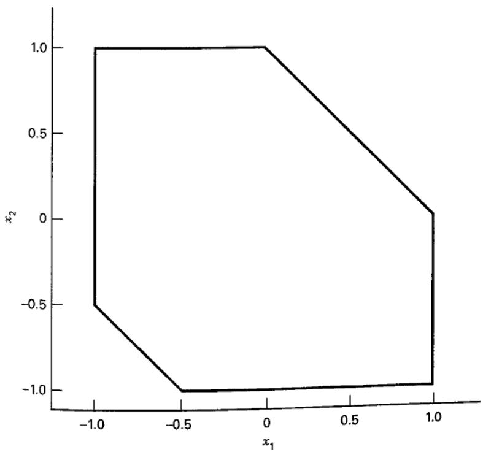  
■ FIGURE 11.28 A constrained design region in two variables

3. Unusual sample size requirements Occasionally, an experimenter may need to reduce the number of runs required by a standard response surface design. For example, suppose we intend to fit a second-order model in four variables. The central composite design for this situation requires between 28 and 30 runs, depending on the number of center points selected. However, the model has only 15 terms. If the runs are extremely expensive or time-consuming, the experimenter will want a design with fewer trials. Although computer-generated designs can be used for this purpose, there are other approaches. For example, a small composite design can be constructed for four factors with 20 runs, including four center points, and a hybrid design with as few as 16 runs is also available. These may be superior choices to using a computer-generated design to reduce the number of trials.

There are several popular design optimality criteria. Perhaps the most widely used is the D-optimality criterion. A design is said to be D-optimal if

$$
| (\mathbf {X} ^ {\prime} \mathbf {X}) ^ {- 1} |
$$

is minimized. A D-optimal design minimizes the volume of the joint confidence region on the vector of regression coefficients. A measure of the relative efficiency of design 1 to design 2 according to the D-criterion is given by

$$
D _ {e} = \left(\frac {| (\mathbf {X} _ {2} ^ {\prime} \mathbf {X} _ {2}) ^ {- 1} |}{| (\mathbf {X} _ {1} ^ {\prime} \mathbf {X} _ {1}) ^ {- 1} |}\right) ^ {1 / p}\tag{11.21}
$$

where $X_{1}$ and $X_{2}$ are the X matrices for the two designs and p is the number of model parameters. Many popular software packages including JMP, Design-Expert, and Minitab will construct D-optimal designs.

The A-optimality criterion deals with only the variances of the regression coefficients. A design is A-optimal if it minimizes the sum of the main diagonal elements of $(\mathbf{X}^{\prime}\mathbf{X})^{-1}$ . (This is called the trace of $(\mathbf{X}^{\prime}\mathbf{X})^{-1}$ , usually denoted $\mathrm{tr}(\mathbf{X}^{\prime}\mathbf{X})^{-1}$ .) Thus, an A-optimal design minimizes the sum of the variances of the regression coefficients.

Because many response surface experiments are concerned with the prediction of the response, prediction variance criteria are of considerable practical interest. Perhaps the most popular of these is the G-optimality criterion. A design is said to be G-optimal if it minimizes the maximum scaled prediction variance over the design region; that is, if the maximum value of

$$
\frac {N V [ \hat {y} (\mathbf {x}) ]}{\sigma^ {2}}
$$

over the design region is a minimum, where $N$ is the number of points in the design. If the model has $p$ parameters, the $G$ -efficiency of a design is just

$$
G _ {e} = \frac {p}{\max \frac {N V [ \hat {y} (\mathbf {x}) ]}{\sigma^ {2}}}\tag{11.22}
$$

The V-criterion considers the prediction variance at a set of points of interest in the design region, say $x_{1}, x_{2}, \ldots, x_{m}$ . The set of points could be the candidate set from which the design was selected, or it could be some other collection of points that have specific meaning to the experimenter. A design that minimizes the average prediction variance over this set of m points is a V-optimal design.

As we observed in Chapter 6 (Section 6.7), an alternative to calculating the prediction variance at a finite set of points in the design space is to compute an average or integrated variance over the design space, say

$$
I = \frac {1}{A} \int_ {R} V [ \hat {y} (\mathbf {x}) ] d \mathbf {x}
$$

where R is the design region and A is the volume of the region. Note that this is a more general form of the I-criterion discussed in Chapter 6. The I-criterion is also sometimes called the IV or Q-criterion. JMP can construct I-optimal designs.

Generally, we think of the D-criteria as the most appropriate for first-order designs, as they are associated with parameter estimation, which is very important in screening situations where first-order models are most often used. The G and I criteria are prediction-oriented criteria, so they would be most likely used for second-order models, as second-order models are often used for optimization, and good prediction properties are essential for optimization. The I criteria is much easier to implement than G, and is available in several software packages.

One of the design construction methods is based on a point exchange algorithm. In the simplest form of this algorithm, a grid of candidate points is selected by the experimenter, and an initial design is selected (perhaps by random) from this set of points. Then the algorithm exchanges points that are in the grid but not in the design with points currently in the design in an effort to improve the selected optimality criterion. Because not every possible design is explicitly evaluated, there is no guarantee that an optimal design has been found, but the exchange procedure usually ensures that a design that is “close” to optimal results. The procedure is also sensitive to the grid of candidate points that have been specified. Some implementations repeat the design construction process several times, starting from different initial designs, to increase the likelihood that a final design that is very near the optimal will result.

Another way to construct optimal design is with a coordinate exchange algorithm. This method searches over each coordinate of every point in the initial design recursively until no improvement in the optimality criterion is found. The procedure is usually repeated several times with each cycle starting with a randomly generated initial design. Coordinate exchange is usually much more efficient than point exchange and is the standard method in many software packages.

To illustrate some of these ideas, consider the adhesive experiment discussed previously that led to the irregular experimental region in Figure 11.28. Suppose that the response of interest is pull-off force and that we wish to fit a second-order model to this response. In Figure 11.29a, we show a central composite design with four center points (12 runs total) inscribed inside this region. This is not a rotatable design, but it is the largest CCD that we can fit inside the design space. For this design, $|(\mathbf{X}'\mathbf{X})^{-1}| = 1.852$ E-2 and the trace of $(\mathbf{X}'\mathbf{X})^{-1}$ is 6.375. Also shown in Figure 11.29a are the contours of constant standard deviation of the predicted response, calculated assuming that $\sigma = 1$ . Figure 11.29b shows the corresponding response surface plot.

Figure 11.30a and Table 11.12 show a 12-run D-optimal design for this problem, generated with the Design-Expert software package. For this design, $|(\mathbf{X}^{\prime}\mathbf{X})^{-1}| = 2.153$ E-4. Notice that the D-criterion is considerably better for this design than for the inscribed CCD. The relative efficiency of the inscribed CCD to the D-optimal design is

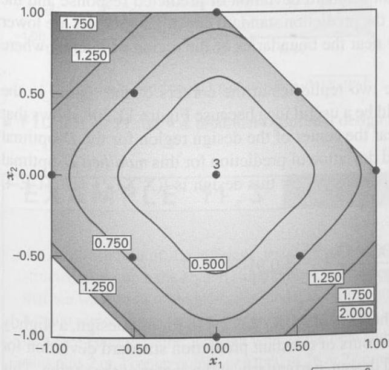  
(a) The design and contours of constant $\sqrt{V[\hat{y}(\mathbf{x})] / \sigma^2}$

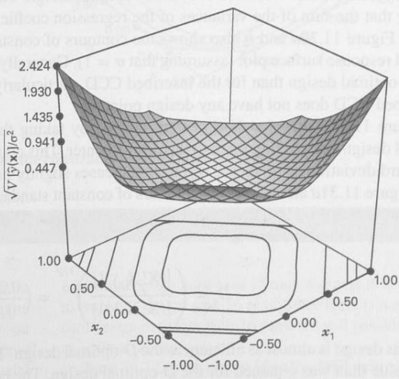  
(b) The response surface plot  
■ FIGURE 11.29 An inscribed central composite design for the constrained design region in Figure 11.28

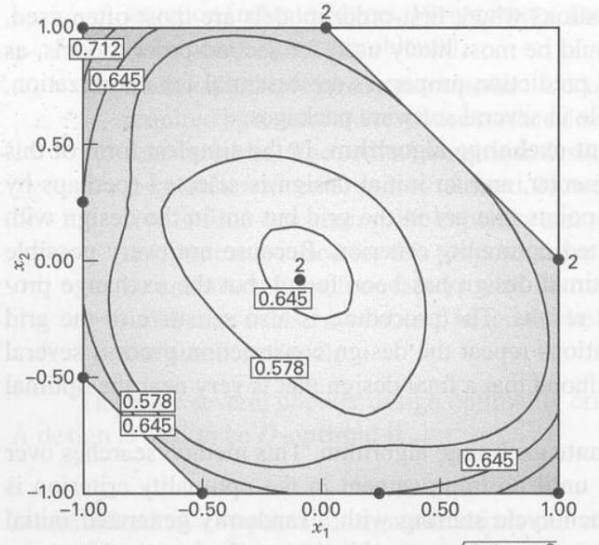  
(a) The design and contours of constant $\sqrt{V[\hat{y}(\mathbf{x})]/\sigma^{2}}$

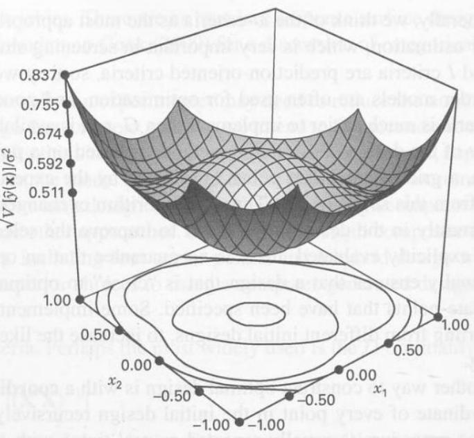  
(b) The response surface plot  
■ FIGURE 11.30 A D-optimal design for the constrained design region in Figure 11.28

$$
D _ {e} = \left(\frac {\left| (\mathbf {X} _ {2} ^ {\prime} \mathbf {X} _ {2}) ^ {- 1} \right|}{\left| (\mathbf {X} _ {1} ^ {\prime} \mathbf {X} _ {1}) ^ {- 1} \right|}\right) ^ {1 / p} = \left(\frac {0 . 0 0 0 2 1 5 3}{0 . 0 1 8 5 2}\right) ^ {1 / 6} = 0. 4 7 6
$$

That is, the inscribed CCD is only 47.6 percent as efficient as the D-optimal design. This implies that the CCD would have to be replicated 1/0.476 = 2.1 times (or approximately twice) to have the same precision of estimation for the regression coefficients as achieved with the D-optimal design. The trace of $(\mathbf{X}^{\prime}\mathbf{X})^{-1}$ is 2.516 for the D-optimal design, indicating that the sum of the variances of the regression coefficients is considerably smaller for this design than for the CCD. Figure 11.30a and b also shows the contours of constant standard deviation of predicted response and the associated response surface plot (assuming that $\sigma = 1$ ). Generally, the prediction standard deviation contours are lower for the D-optimal design than for the inscribed CCD, particularly near the boundaries of the region of interest where the inscribed CCD does not have any design points.

Figure 11.31a shows a third design, created by taking the two replicates at the corners of the region in the D-optimal design and moving them to the design center. This could be a useful idea because Figure 11.30b shows that the standard deviation of predicted response increases slightly near the center of the design region for the D-optimal design. Figure 11.31a also shows the contours of constant standard deviation of prediction for this modified D-optimal design, and Figure 11.31b shows the response surface plot. The D-criterion for this design is $|(\mathbf{X}^{\prime}\mathbf{X})^{-1}| = 3.71$ E-4, and the relative efficiency is

$$
D _ {e} = \left(\frac {| (\mathbf {X} _ {2} ^ {\prime} \mathbf {X} _ {2}) ^ {- 1} |}{| (\mathbf {X} _ {1} ^ {\prime} \mathbf {X} _ {1}) ^ {- 1} |}\right) ^ {1 / p} = \left(\frac {0 . 0 0 0 2 1 5 3}{0 . 0 0 0 3 7 1}\right) ^ {1 / 6} = 0. 9 1
$$

That is, this design is almost as efficient as the D-optimal design. The trace of $(\mathbf{X}^{\prime}\mathbf{X})^{-1}$ is 2.448 for this design, a slightly smaller value than was obtained for the D-optimal design. The contours of constant prediction standard deviation for this design visually look at least as good as those for the D-optimal design, particularly at the center of the region. This points out the necessity of design evaluation; that is, carefully examine the properties of a computer-generated design before you decide to use it.

TABLE 11.12  
A D-Optimal Design for the Constrained Region in Figure 11.26

<table><tr><td>Standard Order</td><td> $x_{1}$ </td><td> $x_{2}$ </td></tr><tr><td>1</td><td>-0.50</td><td>-1.00</td></tr><tr><td>2</td><td>1.00</td><td>0.00</td></tr><tr><td>3</td><td>-0.08</td><td>-0.08</td></tr><tr><td>4</td><td>-1.00</td><td>1.00</td></tr><tr><td>5</td><td>1.00</td><td>-1.00</td></tr><tr><td>6</td><td>0.00</td><td>1.00</td></tr><tr><td>7</td><td>-1.00</td><td>0.25</td></tr><tr><td>8</td><td>0.25</td><td>-1.00</td></tr><tr><td>9</td><td>-1.00</td><td>-0.50</td></tr><tr><td>10</td><td>1.00</td><td>0.00</td></tr><tr><td>11</td><td>0.00</td><td>1.00</td></tr><tr><td>12</td><td>-0.08</td><td>-0.08</td></tr></table>

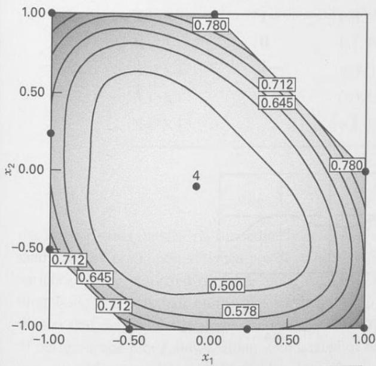  
(a) The design and contours of constant $\sqrt{V[\hat{y}(\mathbf{x})]/\sigma^{2}}$

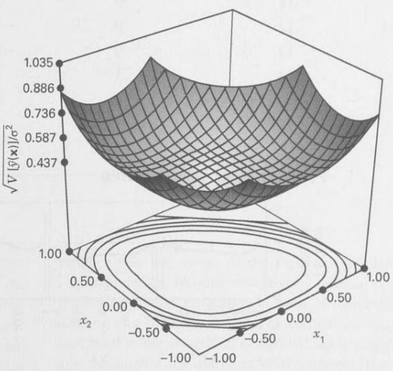  
(b) The response surface plot  
■ FIGURE 11.31 A modified D-optimal design for the constrained design region in Figure 11.28

## EXAMPLE 11.3

As an illustration of the different designs that can be constructed using both the D- and I-optimality criteria, suppose that we want to fit a second-order model in four factors on a cubic region. The standard design for this problem would be a face-centered cube, a design with 24 factorial and axial runs plus 2 or 3 center points, or a total of 26 or 27 runs. The second-order model in k = 4 factors has 15 parameters, so a minimal design must have 15 runs. Suppose that we want to employ a design with 16 runs. Since there is not a standard design available with 16 runs, we will consider using an optimal design.

Table 11.13 is the output from the JMP custom design tool for this problem, where a D-optimal design has been requested. A coordinate-exchange algorithm was used to used to construct the design. Immediately below the design matrix is the prediction variance profile, which shows the variance of the predicted response along each of the four directions. The crosshair on the plot has been set to coordinates that maximize the prediction variance. The fraction of design space plot follows, along with a table of relative variances of the model coefficients (that is, variance of the coefficients divided by $\sigma^{2}$ ).

■ TABLE 11.13
The D-Optimal Design

<table><tr><td colspan="5">Design Matrix</td></tr><tr><td>Run</td><td>X1</td><td>X2</td><td>X3</td><td>X4</td></tr><tr><td>1</td><td>1</td><td>1</td><td>1</td><td>1</td></tr><tr><td>2</td><td>1</td><td>-1</td><td>-1</td><td>1</td></tr><tr><td>3</td><td>1</td><td>1</td><td>-1</td><td>-1</td></tr><tr><td>4</td><td>-1</td><td>-1</td><td>1</td><td>-1</td></tr><tr><td>5</td><td>1</td><td>-1</td><td>1</td><td>-1</td></tr><tr><td>6</td><td>0</td><td>0</td><td>0</td><td>-1</td></tr><tr><td>7</td><td>0</td><td>0</td><td>1</td><td>0</td></tr><tr><td>8</td><td>0</td><td>1</td><td>-1</td><td>1</td></tr><tr><td>9</td><td>-1</td><td>1</td><td>-1</td><td>-1</td></tr><tr><td>10</td><td>-1</td><td>-1</td><td>-1</td><td>1</td></tr><tr><td>11</td><td>0</td><td>1</td><td>1</td><td>-1</td></tr><tr><td>12</td><td>0</td><td>-1</td><td>1</td><td>1</td></tr><tr><td>13</td><td>0</td><td>-1</td><td>-1</td><td>-1</td></tr><tr><td>14</td><td>1</td><td>1</td><td>0</td><td>0</td></tr><tr><td>15</td><td>1</td><td>0</td><td>-1</td><td>1</td></tr><tr><td>16</td><td>-1</td><td>1</td><td>1</td><td>1</td></tr></table>

Prediction variance profile  
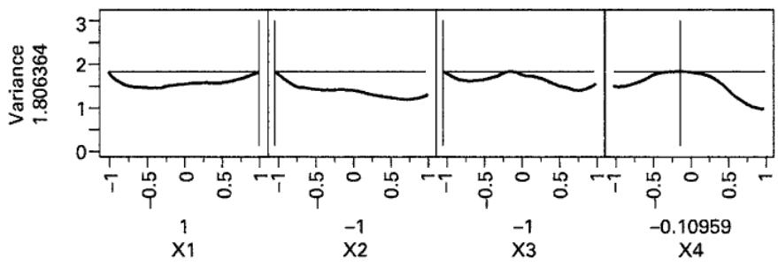

Fraction of design space plot  
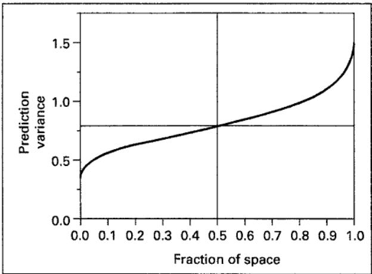

TABLE 11.13 (Continued)

<table><tr><td colspan="2">Relative Variance of Coefficients</td></tr><tr><td>Effect</td><td>Variance</td></tr><tr><td>Intercept</td><td>0.909</td></tr><tr><td>X1</td><td>0.115</td></tr><tr><td>X2</td><td>0.092</td></tr><tr><td>X3</td><td>0.088</td></tr><tr><td>X4</td><td>0.088</td></tr><tr><td>X1*X1</td><td>0.319</td></tr><tr><td>X1*X2</td><td>0.124</td></tr><tr><td>X2*X2</td><td>0.591</td></tr><tr><td>X1*X3</td><td>0.120</td></tr><tr><td>X2*X3</td><td>0.093</td></tr><tr><td>X3*X3</td><td>0.839</td></tr><tr><td>X1*X4</td><td>0.120</td></tr><tr><td>X2*X4</td><td>0.093</td></tr><tr><td>X3*X4</td><td>0.090</td></tr><tr><td>X4*X4</td><td>0.839</td></tr></table>

Table 11.14 is the JMP output for a 16-run I-optimal design. This table also contains the prediction variance profile showing the maximum prediction variance, the FDS plot, and the table of relative variance of the model coefficients. Several important differences between the D- and I-optimal designs can be observed. First, the D-optimal design has a smaller maximum prediction variance (1.806 versus 2.818), but from the FDS plot we observe that the variance near the center of the region is smaller for the I-optimal design. In other words, the I-optimal design has smaller prediction variance over most of the design space (leading to a smaller integrated or average variance) when compared to the D-optimal design but has a larger prediction variance at the extremes of the region. The relative variances of the coefficients for the I-optimal design are in almost all cases smaller than for the D-optimal design. This is not unexpected as the D-criterion focuses on minimizing the variances of the model coefficients while the I-criterion focuses on minimizing a measure of average prediction variance. This comparison also reveals why the I-criterion is generally preferable for second-order models or situations where prediction and/or optimization is required because it results in a design having small prediction variances over most of the design space and performs only poorly at the extremes.

TABLE 11.14 The I-Optimal Design

<table><tr><td colspan="5">Design Matrix</td></tr><tr><td>Run</td><td>X1</td><td>X2</td><td>X3</td><td>X4</td></tr><tr><td>1</td><td>0</td><td>1</td><td>1</td><td>1</td></tr><tr><td>2</td><td>0</td><td>1</td><td>-1</td><td>-1</td></tr><tr><td>3</td><td>-1</td><td>-1</td><td>0</td><td>-1</td></tr><tr><td>4</td><td>1</td><td>-1</td><td>-1</td><td>0</td></tr><tr><td>5</td><td>-1</td><td>-1</td><td>-1</td><td>1</td></tr><tr><td>6</td><td>-1</td><td>1</td><td>0</td><td>1</td></tr><tr><td>7</td><td>-1</td><td>1</td><td>1</td><td>-1</td></tr><tr><td>8</td><td>-1</td><td>0</td><td>1</td><td>1</td></tr><tr><td>9</td><td>1</td><td>1</td><td>-1</td><td>1</td></tr><tr><td>10</td><td>1</td><td>-1</td><td>1</td><td>1</td></tr><tr><td>11</td><td>1</td><td>1</td><td>0</td><td>0</td></tr><tr><td>12</td><td>-1</td><td>0</td><td>-1</td><td>0</td></tr><tr><td>13</td><td>0</td><td>0</td><td>0</td><td>0</td></tr><tr><td>14</td><td>0</td><td>-1</td><td>1</td><td>0</td></tr><tr><td>15</td><td>0</td><td>0</td><td>0</td><td>1</td></tr><tr><td>16</td><td>1</td><td>0</td><td>1</td><td>-1</td></tr></table>

Prediction variance profile  
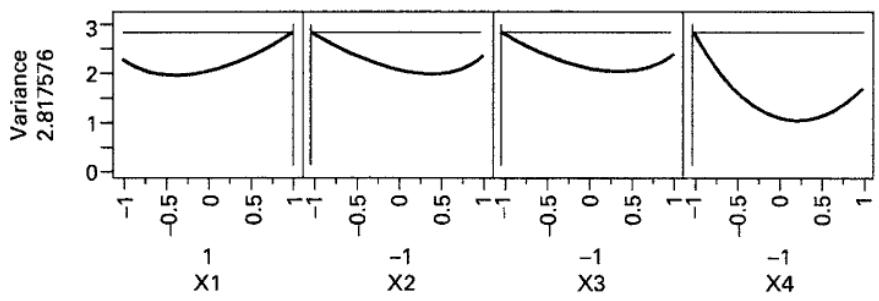

Fraction of design space plot  
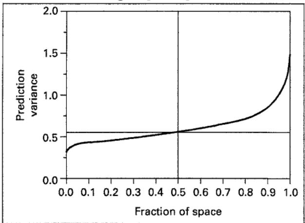

<table><tr><td colspan="2">Relative Variance of Coefficients</td></tr><tr><td>Effect</td><td>Variance</td></tr><tr><td>Intercept</td><td>0.508</td></tr><tr><td>X1</td><td>0.118</td></tr><tr><td>X2</td><td>0.118</td></tr><tr><td>X3</td><td>0.118</td></tr><tr><td>X4</td><td>0.121</td></tr><tr><td>X1*X1</td><td>0.379</td></tr><tr><td>X1*X2</td><td>0.174</td></tr><tr><td>X2*X2</td><td>0.379</td></tr><tr><td>X1*X3</td><td>0.174</td></tr><tr><td>X2*X3</td><td>0.174</td></tr><tr><td>X3*X3</td><td>0.379</td></tr><tr><td>X1*X4</td><td>0.186</td></tr><tr><td>X2*X4</td><td>0.186</td></tr><tr><td>X3*X4</td><td>0.186</td></tr><tr><td>X4*X4</td><td>0.399</td></tr></table>

General Structure of a Definitive Screening Design with m Factors

<table><tr><td rowspan="2">Fold-Over Pair</td><td rowspan="2">Run (i)</td><td colspan="5">Factor Levels</td></tr><tr><td> $x_{i,1}$ </td><td> $x_{i,2}$ </td><td> $x_{i,3}$ </td><td>...</td><td> $x_{i,m}$ </td></tr><tr><td rowspan="2">1</td><td>1</td><td>0</td><td>±1</td><td>±1</td><td>...</td><td>±1</td></tr><tr><td>2</td><td>0</td><td>≠1</td><td>≠1</td><td>...</td><td>≠1</td></tr><tr><td rowspan="2">2</td><td>3</td><td>±1</td><td>0</td><td>±1</td><td>...</td><td>±1</td></tr><tr><td>4</td><td>≠1</td><td>0</td><td>≠1</td><td>...</td><td>≠1</td></tr><tr><td rowspan="2">3</td><td>5</td><td>±1</td><td>±1</td><td>0</td><td>...</td><td>±1</td></tr><tr><td>6</td><td>≠1</td><td>≠1</td><td>0</td><td>...</td><td>≠1</td></tr><tr><td>⋮</td><td>⋮</td><td>⋮</td><td>⋮</td><td>⋮</td><td>..</td><td>⋮</td></tr><tr><td rowspan="2">m</td><td>2m - 1</td><td>±1</td><td>±1</td><td>±1</td><td>...</td><td>0</td></tr><tr><td>2m</td><td>≠1</td><td>≠1</td><td>≠1</td><td>...</td><td>0</td></tr><tr><td>Center point</td><td>2m + 1</td><td>0</td><td>0</td><td>0</td><td>...</td><td>0</td></tr></table>

These designs are an excellent compromise between resolution III fractions for screening and small RSM designs. They also admit the possibility of moving directly from screening to optimization using the results of a single experiment. Jones and Nachtsheim found these designs using an optimization technique they had previously developed for finding minimum aliasing designs [see Jones and Nachtsheim (2011a)]. Their algorithm minimizes the sum of the squares of the elements of the alias matrix subject to a constraint on the D-efficiency of the resulting design. Figure 11.32 shows these designs for the cases of 4 through 12 factors.

DSDs can also be constructed from conference matrices [see Xiao, Lin, and Bai (2012)]. A conference matrix $\mathbf{C}$ is an $n \times n$ matrix that has diagonal elements equal to zero and all off-diagonal elements equal to $\pm 1$ . They have the property that $\mathbf{C}'\mathbf{C}$ is a multiple of the identity matrix. For the $n \times n$ conference matrix $\mathbf{C}$ , $\mathbf{C}'\mathbf{C} = (n - 1)\mathbf{I}$ . Conference matrices first arose in connection with a problem in telephony. They were used in constructing ideal telephone conference networks from ideal transformers. These networks were represented by conference matrices. There are other applications.

The conference matrix of order 6 is given by:

$$
\left( \begin{array}{c c c c c c} 0 & + 1 & + 1 & + 1 & + 1 & + 1 \\ + 1 & 0 & + 1 & - 1 & - 1 & + 1 \\ + 1 & + 1 & 0 & + 1 & - 1 & - 1 \\ + 1 & - 1 & + 1 & 0 & + 1 & - 1 \\ + 1 & - 1 & - 1 & + 1 & 0 & + 1 \\ + 1 & + 1 & - 1 & - 1 & + 1 & 0 \end{array} \right)
$$

The 13-run 6-factor DSD can be found by folding over each row of this conference matrix and adding a row of zeros at the bottom. In general, if C is the conference matrix of order n, the m-factor definitive screening design matrix can be found as follows:

$$
\mathbf {D} = \left[ \begin{array}{c} \mathbf {C} \\ - \mathbf {C} \\ \mathbf {0} \end{array} \right]
$$

where 0 denotes the $1 \times n$ row vector of zeros and $m = 2n + 1$ .

Definitive screening designs are intended for use with continuous factors. However, DSDs can be modified to include two-level categorical variables. The process is straightforward. Begin by constructing the usual DSD for continuous factors, except adding two rows of zeros instead of one. Change the zeros in the columns for the categorical factors to either +1 or -1. If the zeros are the added rows of zeros, make all the categorical factors -1 for the first row

$$
m = 4
$$

$$
m = 5
$$

$$
\mathfrak {m} = 6
$$

$$
m = 7
$$

$$
\mathbf {m} = \mathbf {8}
$$

$$
1 \quad 0 + - -
$$

$$
1 0 + + - -
$$

$$
1 \quad 0 + - - - -
$$

$$
1 \quad 0 + - + - + -
$$

$$
2 \quad 0 - + +
$$

$$
2 \quad 0 - - + +
$$

$$
2 \quad 0 - + + + +
$$

$$
1 \quad 0 - + + - + + +
$$

$$
2 \quad 0 - + - + - +
$$

$$
3 - 0 - +
$$

$$
3 + 0 - - +
$$

$$
2 \quad 0 + - - + - -
$$

$$
3 + 0 - + + -
$$

$$
3 - 0 + - + + -
$$

$$
4 + 0 + -
$$

$$
3 - 0 - + + + + -
$$

$$
4 \quad - 0 + + -
$$

$$
4 \quad - 0 + - - +
$$

$$
4 + 0 - + - - +
$$

$$
4 + 0 + - - - - +
$$

$$
5 \quad - - 0 -
$$

$$
5 + - 0 + -
$$

$$
5 \quad - - 0 + - -
$$

$$
5 + - 0 + + + +
$$

$$
5 \quad - - 0 + + - - +
$$

$$
6 + + 0 +
$$

$$
6 - + 0 - +
$$

$$
6 \quad + + 0 - + +
$$

$$
6 - + 0 - - - -
$$

$$
6 \quad + + 0 - - + + -
$$

$$
7 - + + 0
$$

$$
7 + - + 0 +
$$

$$
7 - + + 0 + -
$$

$$
7 + - - 0 + - -
$$

$$
7 + - + 0 + + - -
$$

$$
8 + - 0
$$

$$
8 - + - 0 -
$$

$$
8 + - - 0 - +
$$

$$
8 - + + 0 - + +
$$

$$
9 0 0 0 0
$$

$$
8 \quad - + - 0 - - + +
$$

$$
9 \quad + + + + 0
$$

$$
9 + - + - 0 -
$$

$$
9 \quad - - + + 0 - -
$$

$$
9 \quad - - + - 0 - + -
$$

$$
1 0 - + - + 0 +
$$

$$
1 0 + + - - 0 + +
$$

$$
1 0 + + - + 0 + - +
$$

$$
1 1 0 0 0 0 0
$$

$$
1 1 + + + + - 0
$$

$$
1 1 - + - + + 0 +
$$

$$
1 1 + - - - + 0 + +
$$

$$
1 2 - - - - + 0
$$

$$
1 2 + - + - - 0 -
$$

$$
1 2 - + + + - 0 - -
$$

$$
1 3 0 0 0 0 0 0
$$

$$
1 3 + + + + + - 0
$$

$$
1 3 - + + - + + 0 +
$$

$$
1 4 - - - - - + 0
$$

$$
1 4 + - - + - - 0 -
$$

$$
1 5 0 0 0 0 0 0 0
$$

$$
1 5 + + + + + - + 0
$$

$$
1 6 - - - - - + - 0
$$

$$
1 7 0 0 0 0 0 0 0 0
$$

$$
\mathfrak {m} = 9
$$

$$
\mathbf {m} = 1 0
$$

$$
\mathbf {m} = 1 1
$$

$$
m = 1 2
$$

$$
1 \quad 0 + + + + + + + + +
$$

$$
2 \quad 0 - - - - - - -
$$

$$
0 + + - + + + + - +
$$

$$
2 \quad 0 - - + - - - - + -
$$

$$
1 \quad 0 - + - - - - - + - +
$$

$$
0 - - + - + - + + + - +
$$

$$
3 + 0 + - + - - + -
$$

$$
2 \quad 0 + - + + + + + - + -
$$

$$
3 + 0 - + + - + + - -
$$

$$
2 \quad 0 + + - + - + - - - + -
$$

$$
3 \quad - 0 -- + -- - + +
$$

$$
3 \quad - 0 + + + + + + + - - -
$$

$$
4 \quad - 0 - + - + + - +
$$

$$
4 \quad - 0 + - - + - - + +
$$

$$
4 + 0 + + - + + + + - -
$$

$$
4 + 0 - - - - - - - + + +
$$

$$
5 \quad - + 0 - + - + - -
$$

$$
5 \quad - + 0 - - - + - - -
$$

$$
5 \quad - - 0 + + + + - - - +
$$

$$
6 + - 0 + - + - + +
$$

$$
6 + - 0 + + + - + + +
$$

$$
6 \quad + + 0 - - - - + + + -
$$

$$
7 \quad - - + 0 + - - - +
$$

$$
6 \quad - - 0 + - - + - - + - -
$$

$$
7 \quad - + + 0 + - - + + -
$$

$$
7 \quad - - - 0 - + + - + + -
$$

$$
8 + + - 0 - + + + -
$$

$$
7 + - - 0 + - + - + - - +
$$

$$
8 + - - 0 - + + - - +
$$

$$
8 \quad + + + 0 + - - + - - +
$$

$$
9 + - + - 0 + + - -
$$

$$
- + + 0 - + - + - + + -
$$

$$
9 \quad - - - - 0 + + + + -
$$

$$
1 0 - + - + 0 - - + +
$$

$$
9 + - - + 0 + - + + + +
$$

$$
9 \quad + + + + 0 - + + + + + +
$$

$$
1 0 + + + + 0 - - - - +
$$

$$
1 1 - - - - + 0 + + +
$$

$$
1 0 - + + - 0 - + - - -
$$

$$
1 0 - - - - 0 + - - - - -
$$

$$
1 1 - + - + + 0 + - + +
$$

$$
1 2 + + + + - 0 - - -
$$

$$
1 1 - - + + - 0 - + - + -
$$

$$
1 1 + - + - + 0 + + - + - +
$$

$$
1 2 + - + - - 0 - + - -
$$

$$
1 3 + + - - + + 0 - +
$$

$$
1 2 + + - - + 0 + - + - +
$$

$$
1 2 - + - + - 0 - - + - + -
$$

$$
1 3 + + - - - - 0 + + +
$$

$$
1 4 - - + + - - 0 + -
$$

$$
1 3 - - - + + - 0 + + - -
$$

$$
1 3 + + + + - + 0 - - - - +
$$

$$
1 4 - - + + + + 0 - - -
$$

$$
1 5 - - - + + + - 0 -
$$

$$
1 4 + + + - - + 0 - - + +
$$

$$
1 4 \quad - - - - + - 0 + + + + -
$$

$$
1 5 + + + + - + + 0 + -
$$

$$
1 6 + + + - - - + 0 +
$$

$$
1 5 - + + + - - + 0 + + +
$$

$$
1 5 - - + + + - - 0 - - + +
$$

$$
1 6 - - - - + - - 0 - +
$$

$$
1 7 - + + - - + - + 0
$$

$$
1 6 + - - - + + - 0 - - -
$$

$$
1 6 + + - - - + + 0 + + - -
$$

$$
1 7 + + - - + + - - 0 -
$$

$$
1 7 - + - - - + - + 0 - +
$$

$$
1 8 + - - + + - + - 0
$$

$$
1 7 + - + + + + - - 0 + + -
$$

$$
1 8 - - + + - - + + 0 +
$$

$$
1 9 0 0 0 0 0 0 0 0
$$

$$
1 8 + - + + + - + - 0 + -
$$

$$
1 8 - + - - - - + + 0 - - +
$$

$$
1 9 + - + - + - + - + 0
$$

$$
1 9 + - - - - - + + - 0 +
$$

$$
2 0 - + - + - + - + - 0
$$

$$
2 0 - + + + + + - - + 0 -
$$

$$
2 0 - - + - - + + - + 0 + +
$$

$$
2 1 0 0 0 0 0 0 0 0 0 0
$$

$$
2 1 + + - + - - - - - 0
$$

$$
2 1 - + - + + + + - - + 0 +
$$

$$
2 2 + - + - - - - + + - 0 -
$$

$$
2 3 0 0 0 0 0 0 0 0 0 0
$$

$$
2 3 + - - + - + + + - - + 0
$$

$$
2 4 - + + - + - - - + + - 0
$$

FIGURE 11.32 Definitive Screening Designs for 4 Through 12 Factors

$$
2 5 0 0 0 0 0 0 0 0 0 0 0
$$

and +1 for the second row. If the zeros are from the conference matrix and its fold over, make the factor -1 for the first row and +1 for the second row.

As an example, consider a DSD for four continuous factors and two categorical factors. The DSD for six factors with the two added zeros is shown in the following display:

<table><tr><td>A</td><td>B</td><td>C</td><td>D</td><td>E</td><td>F</td></tr><tr><td>0</td><td>+1</td><td>+1</td><td>+1</td><td>+1</td><td>+1</td></tr><tr><td>+1</td><td>0</td><td>+1</td><td>-1</td><td>-1</td><td>+1</td></tr><tr><td>+1</td><td>+1</td><td>0</td><td>+1</td><td>-1</td><td>-1</td></tr><tr><td>+1</td><td>-1</td><td>+1</td><td>0</td><td>+1</td><td>-1</td></tr><tr><td>+1</td><td>-1</td><td>-1</td><td>+1</td><td>0</td><td>+1</td></tr><tr><td>+1</td><td>+1</td><td>-1</td><td>-1</td><td>+1</td><td>0</td></tr><tr><td>0</td><td>-1</td><td>-1</td><td>-1</td><td>-1</td><td>-1</td></tr><tr><td>-1</td><td>0</td><td>-1</td><td>+1</td><td>+1</td><td>-1</td></tr><tr><td>-1</td><td>-1</td><td>0</td><td>-1</td><td>+1</td><td>+1</td></tr><tr><td>-1</td><td>+1</td><td>-1</td><td>0</td><td>-1</td><td>+1</td></tr><tr><td>-1</td><td>+1</td><td>+1</td><td>-1</td><td>0</td><td>-1</td></tr><tr><td>-1</td><td>-1</td><td>+1</td><td>+1</td><td>-1</td><td>0</td></tr><tr><td>0</td><td>0</td><td>0</td><td>0</td><td>0</td><td>0</td></tr><tr><td>0</td><td>0</td><td>0</td><td>0</td><td>0</td><td>0</td></tr></table>

Now the zeros in the last two columns are changed to $\pm1$ in order to produce the categorical variables E and F. The design is

<table><tr><td>A</td><td>B</td><td>C</td><td>D</td><td>E</td><td>F</td></tr><tr><td>0</td><td>+1</td><td>+1</td><td>+1</td><td>+1</td><td>+1</td></tr><tr><td>+1</td><td>0</td><td>+1</td><td>-1</td><td>-1</td><td>+1</td></tr><tr><td>+1</td><td>+1</td><td>0</td><td>+1</td><td>-1</td><td>-1</td></tr><tr><td>+1</td><td>-1</td><td>+1</td><td>0</td><td>+1</td><td>-1</td></tr><tr><td>+1</td><td>-1</td><td>-1</td><td>+1</td><td>-1</td><td>+1</td></tr><tr><td>+1</td><td>+1</td><td>-1</td><td>-1</td><td>+1</td><td>-1</td></tr><tr><td>0</td><td>-1</td><td>-1</td><td>-1</td><td>-1</td><td>-1</td></tr><tr><td>-1</td><td>0</td><td>-1</td><td>+1</td><td>+1</td><td>-1</td></tr><tr><td>-1</td><td>-1</td><td>0</td><td>-1</td><td>+1</td><td>+1</td></tr><tr><td>-1</td><td>+1</td><td>-1</td><td>0</td><td>-1</td><td>+1</td></tr><tr><td>-1</td><td>+1</td><td>+1</td><td>-1</td><td>+1</td><td>-1</td></tr><tr><td>-1</td><td>-1</td><td>+1</td><td>+1</td><td>-1</td><td>+1</td></tr><tr><td>0</td><td>0</td><td>0</td><td>0</td><td>-1</td><td>-1</td></tr><tr><td>0</td><td>0</td><td>0</td><td>0</td><td>+1</td><td>+1</td></tr></table>

When two-level categorical variables are added to a DSD as shown, the main effects of the categorical factors have some correlation with other factors, but the correlations are small.

It is also possible to construct DSDs in orthogonal blocks. The procedure is as follows:

1. Start by repeating the steps for creating a design for continuous factors only except adding as many rows of zeros as there are blocks. Arrange the design in standard order.

2. Assign the first fold-over pair to the first block, the second fold-over pair to the second block, and so on until you get to the last block, then start over again assigning the next fold-over pair to the first block.

3. Assign each center run to a separate block.

As an example, consider a DSD for six factors in two blocks. The six-factor DSD in standard order with two added zeros is shown below:

<table><tr><td>A</td><td>B</td><td>C</td><td>D</td><td>E</td><td>F</td></tr><tr><td>0</td><td>+1</td><td>+1</td><td>+1</td><td>+1</td><td>+1</td></tr><tr><td>0</td><td>-1</td><td>-1</td><td>-1</td><td>-1</td><td>-1</td></tr><tr><td>+1</td><td>0</td><td>-1</td><td>+1</td><td>+1</td><td>-1</td></tr><tr><td>-1</td><td>0</td><td>+1</td><td>-1</td><td>-1</td><td>+1</td></tr><tr><td>+1</td><td>-1</td><td>0</td><td>-1</td><td>+1</td><td>+1</td></tr><tr><td>-1</td><td>+1</td><td>0</td><td>+1</td><td>-1</td><td>-1</td></tr><tr><td>+1</td><td>+1</td><td>-1</td><td>0</td><td>-1</td><td>+1</td></tr><tr><td>-1</td><td>-1</td><td>+1</td><td>0</td><td>+1</td><td>-1</td></tr><tr><td>+1</td><td>+1</td><td>+1</td><td>-1</td><td>0</td><td>-1</td></tr><tr><td>-1</td><td>-1</td><td>-1</td><td>+1</td><td>0</td><td>+1</td></tr><tr><td>+1</td><td>-1</td><td>+1</td><td>+1</td><td>-1</td><td>0</td></tr><tr><td>-1</td><td>+1</td><td>-1</td><td>-1</td><td>+1</td><td>0</td></tr><tr><td>0</td><td>o</td><td>0</td><td>0</td><td>0</td><td>0</td></tr><tr><td>0</td><td>0</td><td>0</td><td>0</td><td>0</td><td>0</td></tr></table>

Now arrange the blocks as described above, with the first fold-over pair forming the first block, the second fold-over pair forming the second block, and so on, and then finish by assigning the zeros to each block. The final design is as follows:

<table><tr><td>Block</td><td>A</td><td>B</td><td>C</td><td>D</td><td>E</td><td>F</td></tr><tr><td>1</td><td>0</td><td>+1</td><td>+1</td><td>+1</td><td>+1</td><td>+1</td></tr><tr><td>1</td><td>0</td><td>-1</td><td>-1</td><td>-1</td><td>-1</td><td>-1</td></tr><tr><td>2</td><td>+1</td><td>0</td><td>-1</td><td>+1</td><td>+1</td><td>-1</td></tr><tr><td>2</td><td>-1</td><td>0</td><td>+1</td><td>-1</td><td>-1</td><td>+1</td></tr><tr><td>1</td><td>+1</td><td>-1</td><td>0</td><td>-1</td><td>+1</td><td>+1</td></tr><tr><td>1</td><td>-1</td><td>+1</td><td>0</td><td>+1</td><td>-1</td><td>-1</td></tr><tr><td>2</td><td>+1</td><td>+1</td><td>-1</td><td>0</td><td>-1</td><td>+1</td></tr><tr><td>2</td><td>-1</td><td>-1</td><td>+1</td><td>0</td><td>+1</td><td>-1</td></tr><tr><td>1</td><td>+1</td><td>+1</td><td>+1</td><td>-1</td><td>0</td><td>-1</td></tr><tr><td>1</td><td>-1</td><td>-1</td><td>-1</td><td>+1</td><td>0</td><td>+1</td></tr><tr><td>2</td><td>+1</td><td>-1</td><td>+1</td><td>+1</td><td>-1</td><td>0</td></tr><tr><td>2</td><td>-1</td><td>+1</td><td>-1</td><td>-1</td><td>+1</td><td>0</td></tr><tr><td>1</td><td>0</td><td>0</td><td>0</td><td>0</td><td>0</td><td>0</td></tr><tr><td>2</td><td>0</td><td>0</td><td>0</td><td>0</td><td>0</td><td>0</td></tr></table>
