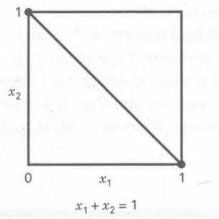
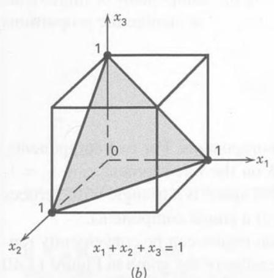
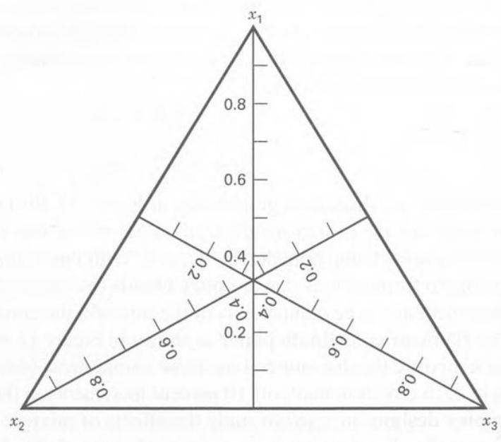
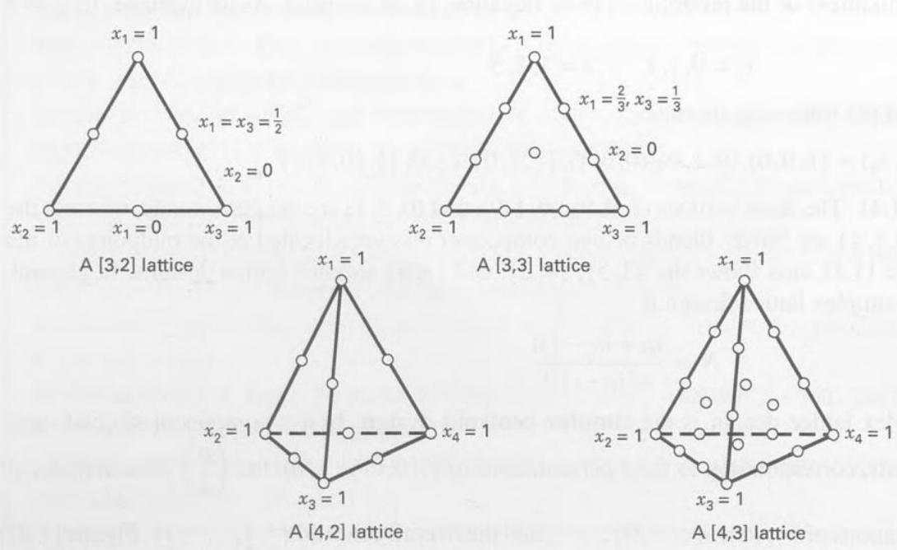
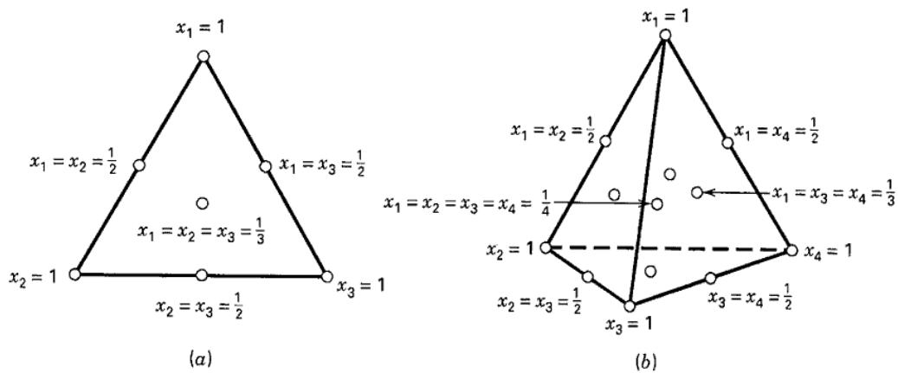
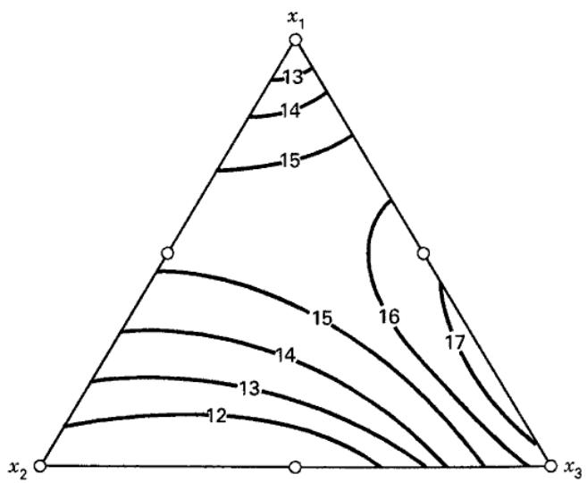
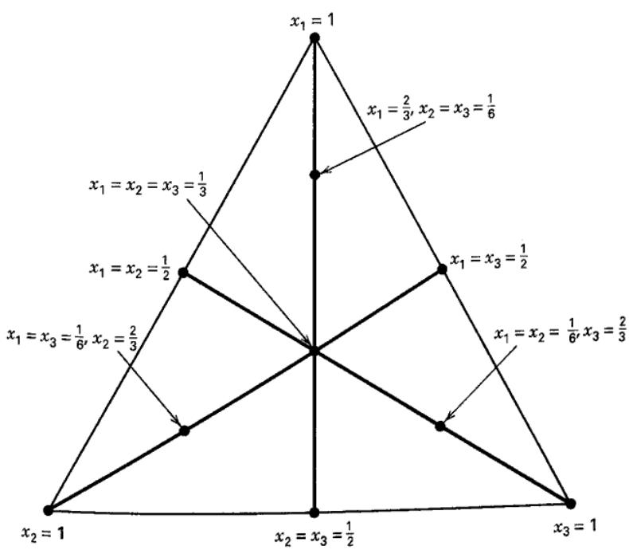
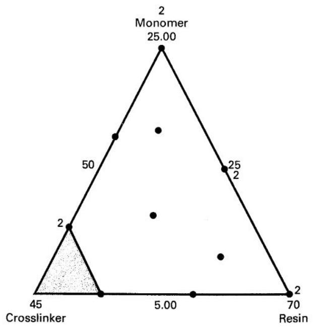
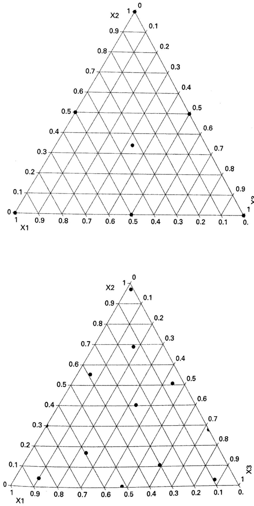
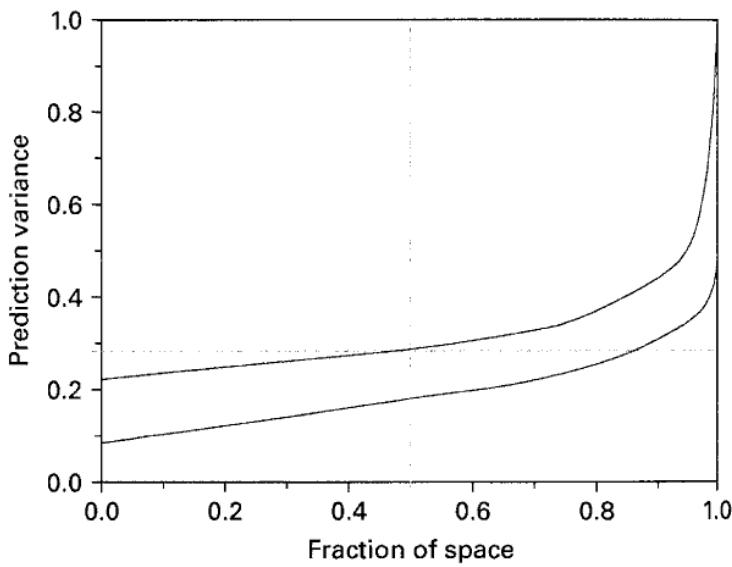

## 11.6 Mixture Experiments

In previous sections, we have presented response surface designs for those situations in which the levels of each factor are independent of the levels of other factors. In mixture experiments, the factors are the components or ingredients of a mixture, and consequently their levels are not independent. For example, if $x_{1}, x_{2}, \ldots, x_{p}$ denote the proportions of p components of a mixture, then

$$
0 \leq x _ {i} \leq 1 \quad i = 1, 2, \dots , p
$$

and

$$
x _ {1} + x _ {2} + \dots + x _ {p} = 1 \quad (\text { i   .   e   . }, 1 0 0 \text { p   e   r   c   e   n   t })
$$

These restrictions are illustrated graphically in Figure 11.39 for p = 2 and p = 3 components. For two components, the factor space for the design includes all values of the two components that lie on the line segment $x_{1} + x_{2} = 1$ , with each component being bounded by 0 and 1. With three components, the mixture space is a triangle with vertices corresponding to formulations that are pure blends (mixtures that are 100 percent of a single component).

When there are three components of the mixture, the constrained experimental region can be conveniently represented on trilinear coordinate paper as shown in Figure 11.40. Each of the three sides of the graph in Figure 11.40 represents a mixture that has none of the three components (the component labeled on the opposite vertex). The nine grid lines in each direction mark off 10 percent increments in the respective components.

Simplex designs are used to study the effects of mixture components on the response variable. A $\{p,m\}$ simplex lattice design for p components consists of points defined by the following coordinate settings: the proportions assumed by each component take the $m+1$ equally spaced values from 0 to 1,

$$
x _ {i} = 0, \frac {1}{m}, \frac {2}{m}, \ldots , 1 \qquad i = 1, 2, \ldots , p\tag{11.24}
$$

and all possible combinations (mixtures) of the proportions from Equation 11.24 are used. As an example, let $p = 3$ and $m = 2$ . Then

$$
x _ {i} = 0, \frac {1}{2}, 1 \quad i = 1, 2, 3
$$

and the simplex lattice consists of the following six runs:

$$
(x _ {1}, x _ {2}, x _ {3}) = (1, 0, 0), (0, 1, 0), (0, 0, 1), \left(\frac {1}{2}, \frac {1}{2}, 0\right), \left(\frac {1}{2}, 0, \frac {1}{2}\right), \left(0, \frac {1}{2}, \frac {1}{2}\right)
$$

This design is shown in Figure 11.41. The three vertices $(1,0,0)$ , $(0,1,0)$ , and $(0,0,1)$ are the pure blends, whereas the points $\left(\frac{1}{2},\frac{1}{2},0\right)$ , $\left(\frac{1}{2},0,\frac{1}{2}\right)$ , and $\left(0,\frac{1}{2},\frac{1}{2}\right)$ are binary blends or two-component mixtures located at the midpoints of the three sides of the triangle. Figure 11.41 also shows the $\{3,3\}$ , $\{4,2\}$ , and $\{4,3\}$ simplex lattice designs. In general, the number of points in a $\{p,m\}$ simplex lattice design is

$$
N = \frac {(p + m - 1) !}{m ! (p - 1) !}
$$

An alternative to the simplex lattice design is the simplex centroid design. In a p-component simplex centroid design, there are $2^{p}-1$ points, corresponding to the p permutations of $(1,0,0,\ldots,0)$ , the $\binom{p}{2}$ permutations of $\left(\frac{1}{2},\frac{1}{2},0,\ldots,0\right)$ , the $\binom{p}{3}$ permutations of $\left(\frac{1}{3},\frac{1}{3},\frac{1}{3},0,\ldots,0\right),\ldots$ , and the overall centroid $\left(\frac{1}{p},\frac{1}{p},\ldots,\frac{1}{p}\right)$ . Figure 11.42 shows some simplex centroid designs.

  
(a)

  
■ FIGURE 11.39
Constrained factor space for mixtures with (a) p = 2 components and (b) p = 3 components

  
■ FIGURE 11.40 Trilinear coordinate system

  
■ FIGURE 11.41 Some simplex lattice designs for p = 3 and p = 4 components

  
■ FIGURE 11.42 Simplex centroid designs with (a) p = 3 components and (b) p = 4 components

A criticism of the simplex designs described above is that most of the experimental runs occur on the boundary of the region and, consequently, include only p - 1 of the p components. It is usually desirable to augment the simplex lattice or simplex centroid with additional points in the interior of the region where the blends will consist of all p mixture components. For more discussion, see Cornell (2002) and Myers, Montgomery, and Anderson-Cook (2009).

Mixture models differ from the usual polynomials employed in response surface work because of the constraint $\sum x_{i}=1$ . The standard forms of the mixture models that are in widespread use are

Linear

$$
E (y) = \sum_ {i = 1} ^ {p} \beta_ {i} x _ {i}\tag{11.25}
$$

Quadratic

$$
E (y) = \sum_ {i = 1} ^ {p} \beta_ {i} x _ {i} + \sum \sum_ {i <   j} ^ {p} \beta_ {i j} x _ {i} x _ {j}\tag{11.26}
$$

Full cubic

$$
\begin{array}{r l} & E (y) = \sum_ {i = 1} ^ {p} \beta_ {i} x _ {i} + \sum \sum_ {i <   j} ^ {p} \beta_ {i j} x _ {i} x _ {j} \\ & \qquad + \sum \sum_ {i <   j} ^ {p} \delta_ {i j} x _ {i} x _ {j} (x _ {i} - x _ {j}) \\ & \qquad + \sum \sum_ {i <   j <   k} \sum \beta_ {i j k} x _ {i} x _ {j} x _ {k} \end{array}\tag{11.27}
$$

Special cubic

$$
\begin{array}{l} E (y) = \sum_ {i = 1} ^ {p} \beta_ {i} x _ {i} + \sum \sum_ {i <   j} ^ {p} \beta_ {i j} x _ {i} x _ {j} \\ \qquad + \sum \sum_ {i <   j <   k} \sum \beta_ {i j k} x _ {i} x _ {j} x _ {k} \end{array}\tag{11.28}
$$

The terms in these models have relatively simple interpretations. In Equations 11.25 through 11.28, the parameter $\beta_{i}$ represents the expected response to the pure blend $x_{i} = 1$ and $x_{j} = 0$ when $j\neq i$ . The portion $\sum_{i = 1}^{p}\beta_{i}x_{i}$ is called the linear blending portion. When curvature arises from nonlinear blending between component pairs, the parameters $\beta_{ij}$ represent either synergistic or antagonistic blending. Higher order terms are frequently necessary in mixture models because (1) the phenomena studied may be complex and (2) the experimental region is frequently the entire operability region and therefore large, requiring an elaborate model.

## EXAMPLE 11.5 A Three-Component Mixture

Cornell (2002) describes a mixture experiment in which three components—polyethylene $(x_{1})$ , polystyrene $(x_{2})$ , and poly-propylene $(x_{3})$ —were blended to form fiber that will be spun into yarn for draperies. The response variable of interest is yarn elongation in kilograms of force applied. A $\{3, 2\}$ simplex lattice design is used to study the product. The design and the observed responses are shown in Table 11.19. Notice that all of the design points involve

## TABLE 11.19

The {3, 2} Simplex Lattice Design for the Yarn Elongation Problem

<table><tr><td rowspan="2">Design Point</td><td colspan="3">Component Proportions</td><td rowspan="2">Observed Elongation Values</td><td rowspan="2">Average Elongation Value (y)</td></tr><tr><td> $x_1$ </td><td> $x_2$ </td><td> $x_3$ </td></tr><tr><td>1</td><td>1</td><td>0</td><td>0</td><td>11.0, 12.4</td><td>11.7</td></tr><tr><td>2</td><td> $\frac{1}{2}$ </td><td> $\frac{1}{2}$ </td><td>0</td><td>15.0, 14.8, 16.1</td><td>15.3</td></tr><tr><td>3</td><td>0</td><td>1</td><td>0</td><td>8.8, 10.0</td><td>9.4</td></tr><tr><td>4</td><td>0</td><td> $\frac{1}{2}$ </td><td> $\frac{1}{2}$ </td><td>10.0, 9.7, 11.8</td><td>10.5</td></tr><tr><td>5</td><td>0</td><td>0</td><td>1</td><td>16.8, 16.0</td><td>16.4</td></tr><tr><td>6</td><td> $\frac{1}{2}$ </td><td>0</td><td> $\frac{1}{2}$ </td><td>17.7, 16.4, 16.6</td><td>16.9</td></tr></table>

either pure or binary blends; that is, at most only two of the three components are used in any formulation of the product. Replicate observations are also run, with two replicates at each of the pure blends and three replicates at each of the binary blends. The error standard deviation can be estimated from these replicate observations as = 0.85. Cornell fits the second-order mixture polynomial to the data, resulting in

$$
\begin{array}{c} \hat {y} = 1 1. 7 x _ {1} + 9. 4 x _ {2} + 1 6. 4 x _ {3} + 1 9. 0 x _ {1} x _ {2} \\ + 1 1. 4 x _ {1} x _ {3} - 9. 6 x _ {2} x _ {3} \end{array}
$$

This model can be shown to be an adequate representation of the response. Note that because $\hat{\beta}_{3} > \hat{\beta}_{1} > \hat{\beta}_{2}$ , we would conclude that component 3 (polypropylene) produces yarn with the highest elongation. Furthermore, because $\hat{\beta}_{12}$ and $\hat{\beta}_{13}$ are positive, blending components 1 and 2 or components 1 and 3 produces higher elongation values than would be expected just by averaging the elongations of the pure blends. This is an example of “synergistic” blending effects. Components 2 and 3 have antagonistic blending effects because $\hat{\beta}_{23}$ is negative.

Figure 11.43 plots the contours of elongation, and this may be helpful in interpreting the results. From examining the figure, we note that if maximum elongation is desired, a blend of components 1 and 3 should be chosen consisting of about 80 percent component 3 and 20 percent component 1.

  
■ FIGURE 11.43 Contours of constant estimated yarn elongation from the second-order mixture model for Example 11.5

We noted previously that the simplex lattice and simplex centroid designs are boundary point designs. If the experimenter wants to make predictions about the properties of complete mixtures, it would be highly desirable to have more runs in the interior of the simplex. We recommend augmenting the usual simplex designs with axial runs and the overall centroid (if the centroid is not already a design point).

The axis of component i is the line or ray extending from the base point $x_{i}=0$ , $x_{j}=1/(p-1)$ for all $j\neq i$ to the opposite vertex where $x_{i}=1$ , $x_{j}=0$ for all $j\neq i$ . The base point will always lie at the centroid of the $(p-2)$ -dimensional boundary of the simplex that is opposite the vertex $x_{i}=1$ , $x_{j}=0$ for all $j\neq i$ . [The boundary is sometimes called a $(p-2)$ -flat.] The length of the component axis is one unit. Axial points are positioned along the component axes at a distance $\Delta$ from the centroid. The maximum value for $\Delta$ is $(p-1)/p$ . We recommend that axial runs be placed midway between the centroid of the simplex and each vertex so that $\Delta=(p-1)/2p$ . Sometimes these points are called axial check blends because a fairly common practice is to exclude them when fitting the preliminary mixture model and then use the responses at these axial points to check the adequacy of the fit of the preliminary model.

Figure 11.44 shows the $\{3,2\}$ simplex lattice design augmented with the axial points. This design has 10 points, with four of these points in the interior of the simplex. The $\{3,3\}$ simplex lattice will support fitting the full cubic model, whereas the augmented simplex lattice will not; however, the augmented simplex lattice will allow the experimenter to fit the special cubic model or to add special quartic terms such as $\beta_{1233}x_{1}x_{2}x_{3}^{2}$ to the quadratic model. The augmented simplex lattice is superior for studying the response of complete mixtures in the sense that it can detect and model curvature in the interior of the triangle that cannot be accounted for by the terms in the full cubic model. The augmented simplex lattice has more power for detecting lack of fit than does the $\{3,3\}$ lattice. This is particularly useful when the experimenter is unsure about the proper model to use and also plans to sequentially build a model by starting with a simple polynomial (perhaps first order), test the model for lack of fit, and then augment the model with higher order terms, test the new model for lack of fit, and so forth.

In some mixture problems, constraints on the individual components arise. Lower bound constraints of the form

$$
l _ {i} \leq x _ {i} \leq 1 \quad i = 1, 2, \dots , p
$$

are fairly common. When only lower bound constraints are present, the feasible design region is still a simplex, but it is inscribed inside the original simplex region. This situation may be simplified by the introduction of pseudocomponents, defined as

$$
x _ {i} ^ {\prime} = \frac {x _ {i} - l _ {i}}{\left(1 - \sum_ {j = 1} ^ {p} l _ {j}\right)}\tag{11.29}
$$

■ FIGURE 11.44 An augmented simplex-lattice design  

with $\sum_{j=1}^{p} l_j < 1$ . Now

$$
x _ {1} ^ {\prime} + x _ {2} ^ {\prime} + \dots + x _ {p} ^ {\prime} = 1
$$

so the use of pseudocomponents allows the use of simplex-type designs when lower bounds are a part of the experimental situation. The formulations specified by the simplex design for the pseudocomponents are transformed into formulations for the original components by reversing the transformation Equation 11.29. That is, if $x_{i}^{\prime}$ is the value assigned to the $i$ th pseudocomponent on one of the runs in the experiment, the $i$ th original mixture component is

$$
x _ {i} = l _ {i} + \left(1 - \sum_ {j = 1} ^ {p} l _ {j}\right) x _ {i} ^ {\prime}\tag{11.30}
$$

If the components have both upper and lower bound constraints, the feasible region is no longer a simplex; instead, it will be an irregular polytope. Because the experimental region is not a “standard” shape, computer-generated optimal designs are very useful for these types of mixture problems.

## EXAMPLE 11.6 Paint Formulation

An experimenter is trying to optimize the formulation of automotive clear coat paint. These are complex products that have very specific performance requirements. Specifically, the customer wants the Knoop hardness to exceed 25 and the percentage of solids to be below 30. The clear coat is a three-component mixture, consisting of a monomer ( $x_{1}$ ), a crosslinker ( $x_{2}$ ), and a resin ( $x_{3}$ ). There are constraints on the component proportions:

$$
\begin{array}{r l} x _ {1} + x _ {2} + x _ {3} & = 1 0 0 \\ 5 \leq x _ {1} \leq 2 5 \\ 2 5 \leq x _ {2} \leq 4 0 \\ 5 0 \leq x _ {3} \leq 7 0 \end{array}
$$

The result is the constrained region of experimentation shown in Figure 11.45. Because the region of interest is not a simplex, we will use a D-optimal design for this problem. Assuming that both responses are likely to be modeled with a quadratic mixture model, we can generate the D-optimal design shown in Figure 11.39 using Design-Expert. We assumed that in addition to the six runs required to fit the quadratic mixture model, four additional distinct runs would be made to check for lack of fit and that four of these runs would be replicated to provide an estimate of pure error. Design-Expert used the vertices, the edge centers, the overall centroid, and the check runs (points located halfway between the centroid and the vertices) as the candidate points.

The 14-run design is shown in Table 11.20, along with the hardness and solids responses. The results of fitting quadratic models to both responses are summarized in Tables 11.21 and 11.22. Notice that quadratic models fit nicely to both the hardness and the solids responses. The fitted equations for both responses (in terms of the pseudocomponents) are shown in these tables. Contour plots of the responses are shown in Figures 11.46 and 11.47.

Figure 11.48 is an overlay plot of the two response surfaces, showing the Knoop hardness contour of 25 and the 30 percent contour for solids. The feasible region for this product is the unshaded region near the center of the plot. Obviously, there are a number of choices for the proportions of monomer, crosslinker, and resin for the clear coat that will give a product satisfying the performance requirements.

  
■ FIGURE 11.45 The constrained experimental region for the paint formulation problem in Example 11.6 (shown in the actual component scale)

TABLE 11.20  
A $D$ -Optimal Design for the Paint Formulation Problem in Example 11.5

<table><tr><td>Standard Order</td><td>Run</td><td>Monomer  $x_1$ </td><td>Crosslinker  $x_2$ </td><td>Resin  $x_3$ </td><td>Hardness  $y_1$ </td><td>Solids  $y_2$ </td></tr><tr><td>1</td><td>2</td><td>17.50</td><td>32.50</td><td>50.00</td><td>29</td><td>9.539</td></tr><tr><td>2</td><td>1</td><td>10.00</td><td>40.00</td><td>50.00</td><td>26</td><td>27.33</td></tr><tr><td>3</td><td>4</td><td>15.00</td><td>25.00</td><td>60.00</td><td>17</td><td>29.21</td></tr><tr><td>4</td><td>13</td><td>25.00</td><td>25.00</td><td>50.00</td><td>28</td><td>30.46</td></tr><tr><td>5</td><td>7</td><td>5.00</td><td>25.00</td><td>70.00</td><td>35</td><td>74.98</td></tr><tr><td>6</td><td>3</td><td>5.00</td><td>32.50</td><td>62.50</td><td>31</td><td>31.5</td></tr><tr><td>7</td><td>6</td><td>11.25</td><td>32.50</td><td>56.25</td><td>21</td><td>15.59</td></tr><tr><td>8</td><td>11</td><td>5.00</td><td>40.00</td><td>55.00</td><td>20</td><td>19.2</td></tr><tr><td>9</td><td>10</td><td>18.13</td><td>28.75</td><td>53.13</td><td>29</td><td>23.44</td></tr><tr><td>10</td><td>14</td><td>8.13</td><td>28.75</td><td>63.13</td><td>25</td><td>32.49</td></tr><tr><td>11</td><td>12</td><td>25.00</td><td>25.00</td><td>50.00</td><td>19</td><td>23.01</td></tr><tr><td>12</td><td>9</td><td>15.00</td><td>25.00</td><td>60.00</td><td>14</td><td>41.46</td></tr><tr><td>13</td><td>5</td><td>10.00</td><td>40.00</td><td>50.00</td><td>30</td><td>32.98</td></tr><tr><td>14</td><td>8</td><td>5.00</td><td>25.00</td><td>70.00</td><td>23</td><td>70.95</td></tr></table>

TABLE 11.21  
Model Fitting for the Hardness Response

<table><tr><td colspan="6">Response: hardness</td></tr><tr><td colspan="6">ANOVA for Mixture Quadratic Model</td></tr><tr><td colspan="6">Analysis of Variance Table [Partial sum of squares]</td></tr><tr><td>Source</td><td>Sum of Squares</td><td>DF</td><td>Mean Square</td><td>F Value</td><td>Prob &gt; F</td></tr><tr><td>Model</td><td>279.73</td><td>5</td><td>55.95</td><td>2.37</td><td>0.1329</td></tr><tr><td>Linear Mixture</td><td>29.13</td><td>2</td><td>14.56</td><td>0.62</td><td>0.5630</td></tr><tr><td>AB</td><td>72.61</td><td>1</td><td>72.61</td><td>3.08</td><td>0.1174</td></tr><tr><td>AC</td><td>179.67</td><td>1</td><td>179.67</td><td>7.62</td><td>0.0247</td></tr><tr><td>BC</td><td>8.26</td><td>1</td><td>8.26</td><td>0.35</td><td>0.5703</td></tr><tr><td>Residual</td><td>188.63</td><td>8</td><td>23.58</td><td></td><td></td></tr><tr><td>Lack of Fit</td><td>63.63</td><td>4</td><td>15.91</td><td>0.51</td><td>0.7354</td></tr><tr><td>Pure Error</td><td>125.00</td><td>4</td><td>31.25</td><td></td><td></td></tr><tr><td>Cor Total</td><td>468.36</td><td>13</td><td></td><td></td><td></td></tr><tr><td>Std. Dev.</td><td>4.86</td><td></td><td>R-Squared</td><td>0.5973</td><td></td></tr><tr><td>Mean</td><td>24.79</td><td></td><td>Adj R-Squared</td><td>0.3455</td><td></td></tr><tr><td>C.V.</td><td>19.59</td><td></td><td>Pred R-Squared</td><td>-0.3635</td><td></td></tr><tr><td>PRESS</td><td>638.60</td><td></td><td>Adeq Precision</td><td>4.975</td><td></td></tr><tr><td colspan="6">TABLE 11.21 (Continued)</td></tr><tr><td>Component</td><td>Coefficient Estimate</td><td>DF</td><td>Standard Error</td><td>95% CI Low</td><td>95% CI High</td></tr><tr><td>A-Monomer</td><td>23.81</td><td>1</td><td>3.36</td><td>16.07</td><td>31.55</td></tr><tr><td>B-Crosslinker</td><td>16.40</td><td>1</td><td>7.68</td><td>-1.32</td><td>34.12</td></tr><tr><td>C-Resin</td><td>29.45</td><td>1</td><td>3.36</td><td>21.71</td><td>37.19</td></tr><tr><td>AB</td><td>44.42</td><td>1</td><td>25.31</td><td>-13.95</td><td>102.80</td></tr><tr><td>AC</td><td>-44.01</td><td>1</td><td>15.94</td><td>-80.78</td><td>-7.25</td></tr><tr><td>BC</td><td>13.80</td><td>1</td><td>23.32</td><td>-39.97</td><td>67.57</td></tr><tr><td colspan="6">Final Equation in Terms of Pseudocomponents:</td></tr><tr><td></td><td colspan="5">hardness =+23.81 * A+16.40 * B+29.45 * C+44.42 * A * B-44.01 * A * C+13.80 * B * C</td></tr></table>

TABLE 11.22

<table><tr><td colspan="6">Response: solids</td></tr><tr><td colspan="6">ANOVA for Mixture Quadratic Model</td></tr><tr><td colspan="6">Analysis of Variance Table [Partial sum of squares]</td></tr><tr><td>Source</td><td>Sum of Squares</td><td>DF</td><td>Mean Square</td><td>F Value</td><td>Prob &gt; F</td></tr><tr><td>Model</td><td>4297.94</td><td>5</td><td>859.59</td><td>25.78</td><td>&lt;0.0001</td></tr><tr><td>Linear Mixture</td><td>2931.09</td><td>2</td><td>1465.66</td><td>43.95</td><td>&lt;0.0001</td></tr><tr><td>AB</td><td>211.20</td><td>1</td><td>211.20</td><td>6.33</td><td>0.0360</td></tr><tr><td>AC</td><td>285.67</td><td>1</td><td>285.67</td><td>8.57</td><td>0.0191</td></tr><tr><td>BC</td><td>1036.72</td><td>1</td><td>1036.72</td><td>31.09</td><td>0.0005</td></tr><tr><td>Residual</td><td>266.79</td><td>8</td><td>33.35</td><td></td><td></td></tr><tr><td>Lack of Fit</td><td>139.92</td><td>4</td><td>34.98</td><td>1.10</td><td>0.4633</td></tr><tr><td>Pure Error</td><td>126.86</td><td>4</td><td>31.72</td><td></td><td></td></tr><tr><td>Cor Total</td><td>4564.73</td><td>13</td><td></td><td></td><td></td></tr><tr><td>Std. Dev.</td><td>5.77</td><td></td><td>R-Squared</td><td>0.9416</td><td></td></tr><tr><td>Mean</td><td>33.01</td><td></td><td>Adj R-Squared</td><td>0.9050</td><td></td></tr><tr><td>C.V.</td><td>17.49</td><td></td><td>Pred R-Squared</td><td>0.7827</td><td></td></tr><tr><td>PRESS</td><td>991.86</td><td></td><td>Adeq Precision</td><td>15.075</td><td></td></tr><tr><td>Component</td><td>Coefficient Estimate</td><td>DF</td><td>Standard Error</td><td>95% CI Low</td><td>95% CI High</td></tr><tr><td>A-Monomer</td><td>26.53</td><td>1</td><td>3.99</td><td>17.32</td><td>35.74</td></tr><tr><td>B-Crosslinker</td><td>46.60</td><td>1</td><td>9.14</td><td>25.53</td><td>67.68</td></tr><tr><td>C-Resin</td><td>73.23</td><td>1</td><td>3.99</td><td>64.02</td><td>82.43</td></tr><tr><td>AB</td><td>-75.76</td><td>1</td><td>30.11</td><td>-145.19</td><td>-6.34</td></tr><tr><td>AC</td><td>-55.50</td><td>1</td><td>18.96</td><td>-99.22</td><td>-11.77</td></tr><tr><td>BC</td><td>-154.61</td><td>1</td><td>27.73</td><td>-218.56</td><td>-90.67</td></tr><tr><td colspan="6">Final Equation in Terms of Pseudocomponents:</td></tr><tr><td></td><td>solids =</td><td></td><td></td><td></td><td></td></tr><tr><td></td><td>+26.53 * A</td><td></td><td></td><td></td><td></td></tr><tr><td></td><td>+46.60 * B</td><td></td><td></td><td></td><td></td></tr><tr><td></td><td>+73.23 * C</td><td></td><td></td><td></td><td></td></tr><tr><td></td><td>-75.76 * A * B</td><td></td><td></td><td></td><td></td></tr><tr><td></td><td>-55.50 * A * C</td><td></td><td></td><td></td><td></td></tr><tr><td></td><td>-154.61 * B * C</td><td></td><td></td><td></td><td></td></tr></table>

In addition to the D- and I-optimal criteria, there are other criteria that can be used to construct mixture designs. Distance-based designs are an approach that spreads the design points out to maximize the distance between them. This often creates a design that has more runs in the interior of the region than does either the D- or the I-criteria. The extreme vertices approach constructs a design by starting with the vertices, adding the centers of the edges, and then adding the centroids of the sub-spaces until the desired number of design points has been reached. Space-filling strategies can also be used to construct a design. The space-filling algorithm in JMP essentially maximizes the product of the distances between all potential design points.

## TABLE 11.23

A 12-Run I-Optimal Design

<table><tr><td>Run</td><td>X1</td><td>X2</td><td>X3</td></tr><tr><td>1</td><td>0.5</td><td>0</td><td>0.5</td></tr><tr><td>2</td><td>1</td><td>0</td><td>0</td></tr><tr><td>3</td><td>0.33333333</td><td>0.33333333</td><td>0.33333333</td></tr><tr><td>4</td><td>0</td><td>0.5</td><td>0.5</td></tr><tr><td>5</td><td>0.5</td><td>0.5</td><td>0</td></tr><tr><td>6</td><td>0</td><td>0</td><td>1</td></tr><tr><td>7</td><td>0.5</td><td>0</td><td>0.5</td></tr><tr><td>8</td><td>0.5</td><td>0.5</td><td>0</td></tr><tr><td>9</td><td>0.33333333</td><td>0.333333333</td><td>0.333333333</td></tr><tr><td>10</td><td>0.33333333</td><td>0.333333333</td><td>0.333333333</td></tr><tr><td>11</td><td>0</td><td>1</td><td>0</td></tr><tr><td>12</td><td>0</td><td>0.5</td><td>0.5</td></tr></table>

To illustrate the space-filling criteria, suppose that we want to construct a three-component mixture design. Table 11.23 shows a 12-run I-optimal design and Table 11.24 shows a 12-run space-filling design. Figures 11.49 and 11.50 are graphical displays of the designs. The space-filling design has 12 distinct design points, all of which are in the interior of the simplex. The I-optimal design has only seven distinct design points consisting of three vertices, three centers of edges (binary blends) and the overall centroid. The centroid, which is the only interior point, is replicated three times and each edge center is replicated twice. Figure 11.51 is a fraction of design space plot for both designs. The space-filling design is the lower curve in the figure, indicating that it has a lower overall variance of prediction through most of the design space. The average prediction variance (relative to $\sigma$ ) for the I-optimal design is 0.318271 and for the space-filling design it is 0.190901. Space-filling designs for mixtures are often a good alternative to I-optimal designs.

## TABLE 11.24

A 12-Run Space-Filling Design

<table><tr><td>Run</td><td>X1</td><td>X2</td><td>X3</td></tr><tr><td>1</td><td>0.0566385525</td><td>0.5035563474</td><td>0.4398051002</td></tr><tr><td>2</td><td>0.1403888146</td><td>0.6848254125</td><td>0.174785773</td></tr><tr><td>3</td><td>0.5979278886</td><td>0.1685717851</td><td>0.2335003264</td></tr><tr><td>4</td><td>0.0021204609</td><td>0.277430271</td><td>0.7204492681</td></tr><tr><td>5</td><td>0.3064350687</td><td>0.1050457166</td><td>0.5885192147</td></tr><tr><td>6</td><td>0.6951342573</td><td>0.3036842719</td><td>0.0011814709</td></tr><tr><td>7</td><td>0.2684127928</td><td>0.3996327787</td><td>0.3319544285</td></tr><tr><td>8</td><td>0.0164724047</td><td>0.9652091258</td><td>0.0183184695</td></tr><tr><td>9</td><td>0.5236343265</td><td>0.002453615</td><td>0.4739120585</td></tr><tr><td>10</td><td>0.3942469565</td><td>0.5494100414</td><td>0.0563430022</td></tr><tr><td>11</td><td>0.8560801746</td><td>0.0425991599</td><td>0.1013206655</td></tr><tr><td>12</td><td>0.0976192298</td><td>0.0288613381</td><td>0.8735194321</td></tr></table>

■ FIGURE 11.49 A 12-run I-optimal design  
  
■ FIGURE 11.50 A 12-run space filling design

■ FIGURE 11.51 Variance of design space plot for the I-optimal design in Figure 11.49 and the space-filling design in Figure 11.50. The space-filling design is the lower curve

