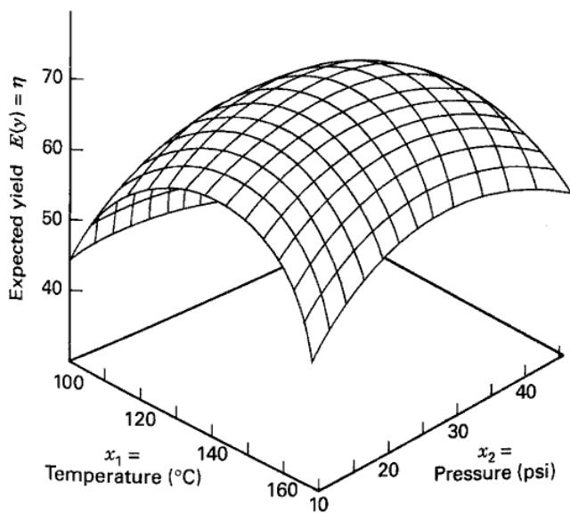
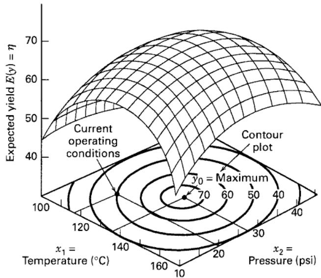
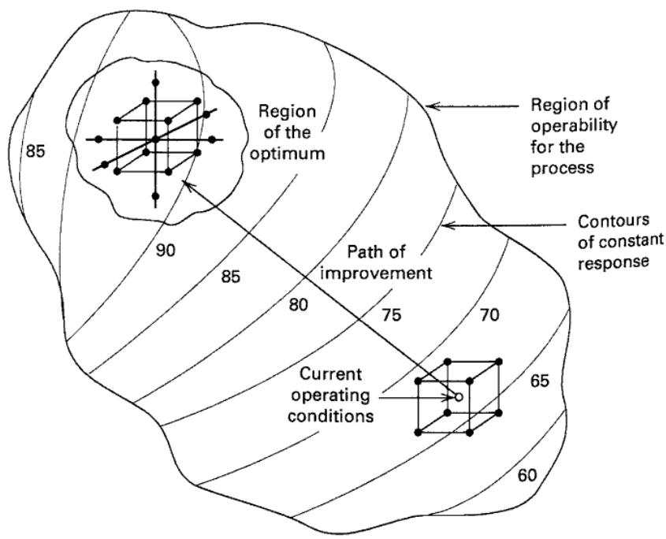

# 11.1 响应面方法导论

**响应面方法**（response surface methodology，RSM）是一组数学与统计技术，适用于对以下问题建模和分析：某个感兴趣的响应受多个变量影响，研究目标是优化该响应。例如，化学工程师希望找到使过程产率 $y$ 最大的温度 $x_1$ 和压力 $x_2$ 水平。产率是温度、压力水平的函数，即

$$
y = f (x _ {1}, x _ {2}) + \epsilon
$$

其中，$\epsilon$ 表示响应 $y$ 中观测到的噪声或误差。若将响应的期望记为 $E(y)=f(x_1,x_2)=\eta$，则由下式表示的曲面

$$
\eta = f (x _ {1}, x _ {2})
$$

称为**响应面**。

通常用图形表示响应面，例如图 11.1 给出了 $\eta$ 随 $x_1,x_2$ 水平变化的曲面。前面尤其在因子设计各章中，已经见过这类图。为了更清楚地显示响应面的形状，常绘制图 11.2 那样的等高线图：在 $x_1,x_2$ 平面上画出响应值相同的曲线，每条曲线对应响应面的一个高度。前文也已说明等高线图的用途。

大多数 RSM 问题中，响应与自变量之间关系的形式未知。因此，第一步是为响应 $y$ 与自变量之间的真实函数关系寻找合适的近似。通常在自变量的某个区域内采用低阶多项式。若自变量的线性函数能够很好地描述响应，则采用**一阶模型**：

$$
y = \beta_ {0} + \beta_ {1} x _ {1} + \beta_ {2} x _ {2} + \dots + \beta_ {k} x _ {k} + \epsilon\tag{11.1}
$$

若系统存在曲率，则必须使用更高阶的多项式，例如**二阶模型**：

$$
y = \beta_ {0} + \sum_ {i = 1} ^ {k} \beta_ {i} x _ {i} + \sum_ {i = 1} ^ {k} \beta_ {i i} x _ {i} ^ {2} + \sum_ {i <   j} \beta_ {i j} x _ {i} x _ {j} + \epsilon\tag{11.2}
$$

几乎所有 RSM 问题都会用到这两个模型中的一个或两个。当然，多项式模型不太可能在整个自变量空间内都很好地近似真实函数，但在较小的区域内通常表现良好。

用第 10 章讨论的最小二乘法估计近似多项式的参数，再根据拟合曲面进行响应面分析。若拟合曲面充分近似真实响应函数，则分析拟合曲面就近似于分析实际系统。采用适当的试验设计收集数据，可以更有效地估计模型参数。这类设计称为**响应面设计**，将在 11.4 节讨论。

  
**图 11.1** 期望产率 $\eta$ 随温度 $x_1$ 和压力 $x_2$ 变化的三维响应面

**图 11.2** 响应面的等高线图

RSM 是一种**序贯程序**。当响应面上的当前点远离最优点时，例如图 11.3 中的当前操作条件，系统的局部曲率通常较小，一阶模型较为合适。此时的目标是引导试验者沿改进路径快速、有效地接近最优点所在的区域。找到该区域后，可采用二阶模型等更精细的模型，并通过分析定位最优点。从图 11.3 可见，响应面分析可以看作“爬山”，山顶代表最大响应点；若目标是最小响应，则可以看作“下到谷底”。

RSM 的最终目标是确定系统的最优操作条件，或找出满足操作要求的因子空间区域。更详细的论述可参见 Khuri 和 Cornell（1996）、Myers、Montgomery 和 Anderson-Cook（2016），以及 Box 和 Draper（2007）；Myers 等（2004）的综述也很有参考价值。

**图 11.3** RSM 的序贯性质

