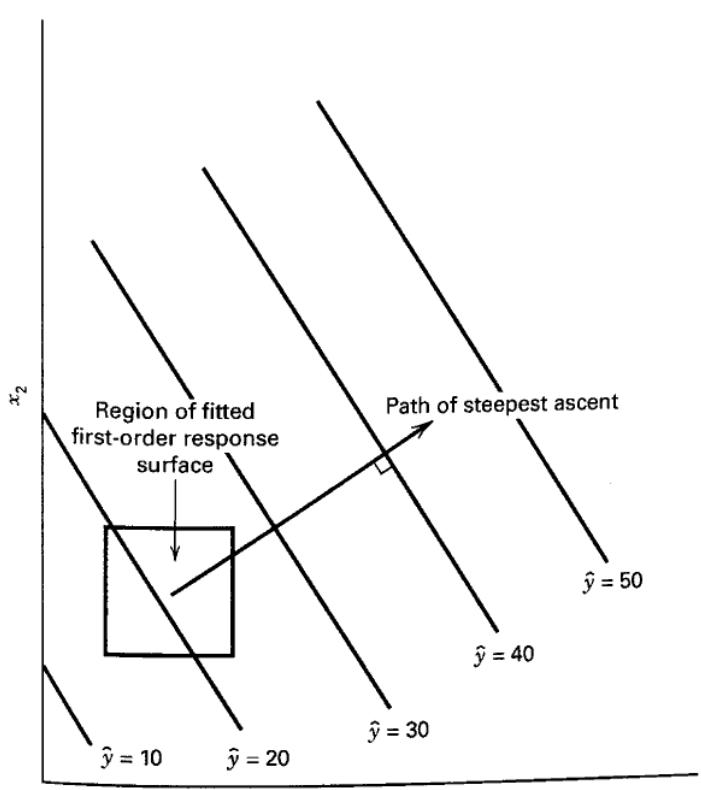
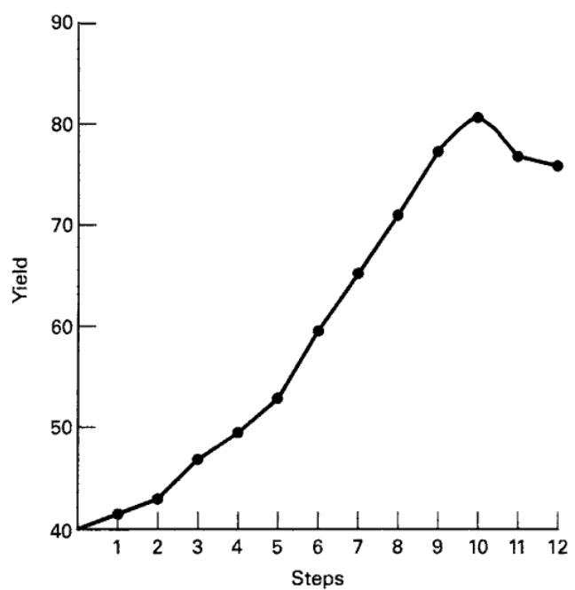

# 11.2 最速上升法

对系统最优操作条件的初步估计往往远离真正的最优点。此时，试验者希望采用简单、经济而有效的程序，迅速移向最优点附近。在远离最优点的地方，通常假定一阶模型能够在 $x$ 变量的一个小区域内充分近似真实响应面。

**最速上升法**是沿响应增加最快的方向序贯移动的方法。若目标是最小化响应，则称为**最速下降法**。拟合的一阶模型为

$$
\hat {y} = \hat {\beta_ {0}} + \sum_ {i = 1} ^ {k} \hat {\beta_ {i}} x _ {i}\tag{11.3}
$$

一阶响应面的等高线是一组平行直线，如图 11.4 所示。最速上升方向是 $\hat y$ 增加最快的方向，在因子平面中垂直于等高线。通常选择通过研究区域中心、垂直于等高线的直线作为最速上升路径。因此，路径上各变量的步长与回归系数 $\{\hat\beta_i\}$ 成比例。实际步长由试验者根据过程知识及其他实际考虑确定。

沿最速上升路径开展试验，直到不再观察到响应增加。随后可以重新拟合一阶模型，确定新的最速上升路径，并继续这一过程。最终将到达最优点附近，通常表现为一阶模型出现失拟。这时应增加试验，以更精确地估计最优点。

  
**图 11.4** 一阶响应面与最速上升路径

## 例 11.1

一位化学工程师希望确定使过程产率最大的操作条件。反应时间和反应温度是影响产率的两个可控变量。当前反应时间为 35 分钟，温度为 155 °F，产率约为 40%。由于该区域不太可能包含最优点，工程师拟合一阶模型，并采用最速上升法。

工程师选择反应时间 30～40 分钟、温度 150～160 °F 作为拟合一阶模型的探索区域。为简化计算，将自变量编码到常用的 $[-1,1]$ 区间。若 $\xi_1$ 为自然变量时间，$\xi_2$ 为自然变量温度，则编码变量为

$$
x _ {1} = \frac {\xi_ {1} - 35}{5} \quad \text{且} \quad x _ {2} = \frac {\xi_ {2} - 155}{5}
$$

试验设计见表 11.1：在 $2^2$ 因子设计上增加五次中心点试验。中心点重复用于估计试验误差，并检查一阶模型是否充分。设计中心就是过程的当前操作条件。

用最小二乘法拟合这些数据。采用二水平设计的计算方法，得到编码变量下的一阶模型：

$$
\hat {y} = 40.44 + 0.775 x _ {1} + 0.325 x _ {2}
$$

沿最速上升路径探索前，应先检查一阶模型是否充分。含中心点的 $2^2$ 设计可以用于：

1. 估计误差。

2. 检查模型中的交互作用（交叉乘积项）。

3. 检查二次效应（曲率）。

利用中心点重复估计误差：

$$
\begin{array}{r l} & (40.3) ^ {2} + (40.5) ^ {2} + (40.7) ^ {2} + (40.2) ^ {2} \\ \hat {\sigma} ^ {2} = & \frac {(40.6) ^ {2} - (202.3) ^ {2} / 5}{4} \\ = & 0.0430 \end{array}
$$

一阶模型假设 $x_1,x_2$ 对响应的效应具有可加性。若存在交互作用，则应在模型中加入交叉乘积项 $\beta_{12}x_1x_2$。该系数的最小二乘估计，等于按通常 $2^2$ 因子设计计算的交互作用效应的一半，即

$$
\hat\sigma^2=\frac{40.3^2+40.5^2+40.7^2+40.2^2+40.6^2-202.3^2/5}{4}=0.0430
$$

**表 11.1**

用于拟合一阶模型的过程数据

<table><tr><td colspan="2">自然变量</td><td colspan="2">编码变量</td><td>响应</td></tr><tr><td>$\xi_1$</td><td>$\xi_2$</td><td>$x_1$</td><td>$x_2$</td><td>y</td></tr><tr><td>30</td><td>150</td><td>-1</td><td>-1</td><td>39.3</td></tr><tr><td>30</td><td>160</td><td>-1</td><td>1</td><td>40.0</td></tr><tr><td>40</td><td>150</td><td>1</td><td>-1</td><td>40.9</td></tr><tr><td>40</td><td>160</td><td>1</td><td>1</td><td>41.5</td></tr><tr><td>35</td><td>155</td><td>0</td><td>0</td><td>40.3</td></tr><tr><td>35</td><td>155</td><td>0</td><td>0</td><td>40.5</td></tr><tr><td>35</td><td>155</td><td>0</td><td>0</td><td>40.7</td></tr><tr><td>35</td><td>155</td><td>0</td><td>0</td><td>40.2</td></tr><tr><td>35</td><td>155</td><td>0</td><td>0</td><td>40.6</td></tr></table>

交互作用的单自由度平方和为

$$
SS _ {\text{交互作用}} = \frac {(- 0.1) ^ {2}}{4} = 0.0025
$$

将 $SS_{\text{交互作用}}$ 与 $\hat\sigma^2$ 比较，得到失拟检验统计量

$$
F = \frac {SS _ {\text{交互作用}}}{\hat {\sigma} ^ {2}} = \frac {0.0025}{0.0430} = 0.058
$$

该值很小，说明交互作用可以忽略。

还可利用 6.8 节的纯二次曲率检验检查直线模型是否充分。具体做法是比较设计中四个因子点的平均响应 $\bar y_F=40.425$ 与中心点的平均响应 $\bar y_C=40.46$。若真实响应函数有二次曲率，$\bar y_F-\bar y_C$ 就是曲率的度量。若 $\beta_{11},\beta_{22}$ 分别为纯二次项 $x_1^2,x_2^2$ 的系数，则这个差是 $\beta_{11}+\beta_{22}$ 的估计。本例中，

$$
\hat {\beta} _ {11} + \hat {\beta} _ {22} = \overline {{{{y}}}} _ {F} - \overline {{{{y}}}} _ {C} = 40.425 - 40.46 = - 0.035
$$

原假设 $H_0:\beta_{11}+\beta_{22}=0$ 对应的单自由度平方和为

$$
\begin{array}{r l} SS _ {\text{纯二次项}} & = \frac {n _ {F} n _ {C} (\overline {{y}} _ {F} - \overline {{y}} _ {C}) ^ {2}}{n _ {F} + n _ {C}} \\ & = \frac {(4) (5) (- 0.035) ^ {2}}{4 + 5} = 0.0027 \end{array}
$$

其中，$n_F,n_C$ 分别为因子部分的试验次数与中心点试验次数。由于

$$
F = \frac {SS _ {\text{纯二次项}}}{\hat {\sigma} ^ {2}} = \frac {0.0027}{0.0430} = 0.063
$$

很小，没有证据表明存在纯二次效应。

**表 11.2**

一阶模型的方差分析

模型的方差分析汇总于表 11.2。交互作用与曲率检验均不显著，而整体回归的 F 检验显著。此外，$\hat\beta_1,\hat\beta_2$ 的标准误为

$$
\operatorname{se}(\hat {\beta} _ {i}) = \sqrt {\frac {MS _ {E}}{4}} = \sqrt {\frac {\hat {\sigma} ^ {2}}{4}} = \sqrt {\frac {0.0430}{4}} = 0.10 \quad i = 1, 2
$$

两个回归系数相对于各自的标准误都较大。目前没有理由怀疑一阶模型是否充分。

从设计中心 $(x_1,x_2)=(0,0)$ 沿最速上升路径移动时，$x_1$ 每变化 0.775 个单位，$x_2$ 就变化 0.325 个单位。因此该路径通过原点，斜率为 $0.325/0.775$。工程师选择反应时间 5 分钟作为基本步长。由 $\xi_1$ 与 $x_1$ 的关系可知，5 分钟对应编码变量的步长 $\Delta x_1=1$，所以路径步长为 $\Delta x_1=1.0000$、$\Delta x_2=0.325/0.775\approx0.42$。

工程师计算路径上的试验点，并逐点观察产率，直到响应开始下降。表 11.3 同时给出编码变量与自然变量下的结果。编码变量便于数学运算，但实施试验时必须使用自然变量。图 11.5 绘出各步的产率。响应一直增加到第十步，之后均下降。因此，应在 $(\xi_1,\xi_2)=(85,175)$ 附近重新拟合一阶模型。

<table><tr><td>变异来源</td><td>平方和</td><td>自由度</td><td>均方</td><td>$F_0$</td><td>P 值</td></tr><tr><td>模型（ $\beta_1, \beta_2$ )</td><td>2.8250</td><td>2</td><td>1.4125</td><td>47.83</td><td>0.0002</td></tr><tr><td>残差</td><td>0.1772</td><td>6</td><td></td><td></td><td></td></tr><tr><td>（交互作用）</td><td>(0.0025)</td><td>1</td><td>0.0025</td><td>0.058</td><td>0.8215</td></tr><tr><td>（纯二次项）</td><td>(0.0027)</td><td>1</td><td>0.0027</td><td>0.063</td><td>0.8142</td></tr><tr><td>（纯误差）</td><td>(0.1720)</td><td>4</td><td>0.0430</td><td></td><td></td></tr><tr><td>总计</td><td>3.0022</td><td>8</td><td></td><td></td><td></td></tr></table>

**表 11.3**
例 11.1 的最速上升试验

表中自然温度采用约整后的 2 °F 步长，编码温度列则保留理论步长约 0.42，两列并非精确换算。最后两步按同一自然步长改为 177 °F 和 179 °F。[^1]

<table><tr><td rowspan="2">步数</td><td colspan="2">编码变量</td><td colspan="2">自然变量</td><td rowspan="2">响应 y</td></tr><tr><td>$x_1$</td><td>$x_2$</td><td>$\xi_1$</td><td>$\xi_2$</td></tr><tr><td>起点</td><td>0</td><td>0</td><td>35</td><td>155</td><td></td></tr><tr><td>Δ</td><td>1.00</td><td>0.42</td><td>5</td><td>2</td><td></td></tr><tr><td>起点 + Δ</td><td>1.00</td><td>0.42</td><td>40</td><td>157</td><td>41.0</td></tr><tr><td>起点 + 2Δ</td><td>2.00</td><td>0.84</td><td>45</td><td>159</td><td>42.9</td></tr><tr><td>起点 + 3Δ</td><td>3.00</td><td>1.26</td><td>50</td><td>161</td><td>47.1</td></tr><tr><td>起点 + 4Δ</td><td>4.00</td><td>1.68</td><td>55</td><td>163</td><td>49.7</td></tr><tr><td>起点 + 5Δ</td><td>5.00</td><td>2.10</td><td>60</td><td>165</td><td>53.8</td></tr><tr><td>起点 + 6Δ</td><td>6.00</td><td>2.52</td><td>65</td><td>167</td><td>59.9</td></tr><tr><td>起点 + 7Δ</td><td>7.00</td><td>2.94</td><td>70</td><td>169</td><td>65.0</td></tr><tr><td>起点 + 8Δ</td><td>8.00</td><td>3.36</td><td>75</td><td>171</td><td>70.4</td></tr><tr><td>起点 + 9Δ</td><td>9.00</td><td>3.78</td><td>80</td><td>173</td><td>77.6</td></tr><tr><td>起点 + 10Δ</td><td>10.00</td><td>4.20</td><td>85</td><td>175</td><td>80.3</td></tr><tr><td>起点 + 11Δ</td><td>11.00</td><td>4.62</td><td>90</td><td>177</td><td>76.2</td></tr><tr><td>起点 + 12Δ</td><td>12.00</td><td>5.04</td><td>95</td><td>179</td><td>75.1</td></tr></table>

  
**图 11.5** 例 11.1 中产率随最速上升步数的变化

以 $(\xi_1,\xi_2)=(85,175)$ 为中心拟合新的一阶模型。$\xi_1$ 的探索区域为 $[80,90]$，$\xi_2$ 的探索区域为 $[170,180]$。因此编码变量为

$$
x _ {1} = \frac {\xi_ {1} - 85}{5} \quad \text{且} \quad x _ {2} = \frac {\xi_ {2} - 175}{5}
$$

再次采用含五次中心点试验的 $2^2$ 设计，试验安排见表 11.4。

根据表 11.4 的编码变量拟合的一阶模型为

$$
\hat {y} = 78.97 + 1.00 x _ {1} + 0.50 x _ {2}
$$

表 11.5 给出了模型的方差分析，包括交互作用与纯二次效应检验。检验结果表明一阶模型不能充分近似响应。真实曲面的曲率提示我们可能已经接近最优点，需要进一步分析以更精确地定位。

**表 11.4**
第二个一阶模型的数据

<table><tr><td colspan="2">自然变量</td><td colspan="2">编码变量</td><td rowspan="2">响应 y</td></tr><tr><td>$\xi_1$</td><td>$\xi_2$</td><td>$x_1$</td><td>$x_2$</td></tr><tr><td>80</td><td>170</td><td>-1</td><td>-1</td><td>76.5</td></tr><tr><td>80</td><td>180</td><td>-1</td><td>1</td><td>77.0</td></tr><tr><td>90</td><td>170</td><td>1</td><td>-1</td><td>78.0</td></tr><tr><td>90</td><td>180</td><td>1</td><td>1</td><td>79.5</td></tr><tr><td>85</td><td>175</td><td>0</td><td>0</td><td>79.9</td></tr><tr><td>85</td><td>175</td><td>0</td><td>0</td><td>80.3</td></tr><tr><td>85</td><td>175</td><td>0</td><td>0</td><td>80.0</td></tr><tr><td>85</td><td>175</td><td>0</td><td>0</td><td>79.7</td></tr><tr><td>85</td><td>175</td><td>0</td><td>0</td><td>79.8</td></tr></table>

**表 11.5**
第二个一阶模型的方差分析

<table><tr><td>变异来源</td><td>平方和</td><td>自由度</td><td>均方</td><td>$F_0$</td><td>P 值</td></tr><tr><td>回归</td><td>5.00</td><td>2</td><td></td><td></td><td></td></tr><tr><td>残差</td><td>11.1200</td><td>6</td><td></td><td></td><td></td></tr><tr><td>（交互作用）</td><td>(0.2500)</td><td>1</td><td>0.2500</td><td>4.72</td><td>0.0955</td></tr><tr><td>（纯二次项）</td><td>(10.6580)</td><td>1</td><td>10.6580</td><td>201.09</td><td>0.0001</td></tr><tr><td>（纯误差）</td><td>(0.2120)</td><td>4</td><td>0.0530</td><td></td><td></td></tr><tr><td>总计</td><td>16.1200</td><td>8</td><td></td><td></td><td></td></tr></table>

从例 11.1 可见，最速上升路径由拟合一阶模型中回归系数的符号与大小决定，各变量步长与这些系数成比例：

$$
\hat {y} = \hat {\beta_ {0}} + \sum_ {i = 1} ^ {k} \hat {\beta_ {i}} x _ {i}
$$

可以给出确定最速上升路径坐标的一般算法。假定 $x_1=x_2=\cdots=x_k=0$ 为基点或原点，则：

1. 选择一个过程变量的步长，例如 $\Delta x_j$。通常选择最熟悉的变量，或绝对回归系数 $|\hat\beta_j|$ 最大的变量。

2. 其他变量的步长为

$$
\Delta x _ {i} = \frac {\hat {\beta} _ {i}}{\hat {\beta} _ {j} / \Delta x _ {j}} \quad i = 1, 2, \dots , k \quad i \neq j
$$

3. 将编码变量步长 $\Delta x_i$ 换算为自然变量步长。

以例 11.1 为例，$x_1$ 的回归系数最大，因此第一步选择反应时间。根据过程知识取步长为 5 分钟，在编码变量下即为 $\Delta x_1=1.0$。由第二步可知，温度步长为

$$
\Delta x _ {2} = \frac {\hat {\beta} _ {2}}{\hat {\beta} _ {1} / \Delta x _ {1}} = \frac {0.325}{(0.775 / 1.0)} = 0.42
$$

将编码步长 $\Delta x_1=1.0$、$\Delta x_2=0.42$ 换算为时间和温度的自然单位时，利用

$$
\Delta x _ {1} = \frac {\Delta \xi_ {1}}{5} \quad \text{且} \quad \Delta x _ {2} = \frac {\Delta \xi_ {2}}{5}
$$

得到

$$
\Delta \xi_ {1} = \Delta x _ {1} (5) = 1.0 (5) = 5 \mathrm{min}
$$

以及

$$
\Delta \xi_ {2} = \Delta x _ {2} (5) = 0.42 (5) = 2.1 ^ {\circ} \mathrm{F} \approx 2 ^ {\circ} \mathrm{F}
$$

[^1]: 译者注：原书表 11.3 最后两步温度为 179 °F、181 °F，与起点 155 °F 及每步 2 °F 不一致；这里按所列步长修正。交互作用系数由对比值 −0.1 除以 4 得 −0.025，原书误列为 −0.25。
