# 11.3 二阶响应面的分析

当试验者已比较接近最优点时，通常需要包含曲率的模型来近似响应。在大多数情况下，二阶模型

$$
y = \beta_ {0} + \sum_ {i = 1} ^ {k} \beta_ {i} x _ {i} + \sum_ {i = 1} ^ {k} \beta_ {i i} x _ {i} ^ {2} + \sum_ {i < j} \beta_ {i j} x _ {i} x _ {j} + \epsilon\tag{11.4}
$$

已经足够。本节介绍如何利用拟合模型确定各个 $x$ 的最优操作条件，并描述响应面的性质。

## 11.3.1 驻点的位置

假设要寻找使预测响应达到最优的 $x_1,x_2,\ldots,x_k$ 水平。如果这样的点存在，则在该点有 $\partial\hat y/\partial x_1=\partial\hat y/\partial x_2=\cdots=\partial\hat y/\partial x_k=0$。这一点记为 $x_{1,s},x_{2,s},\ldots,x_{k,s}$，称为**驻点**。驻点可能是响应的极大值点、极小值点或鞍点。这三种情形分别见图 11.6、11.7 和 11.8。

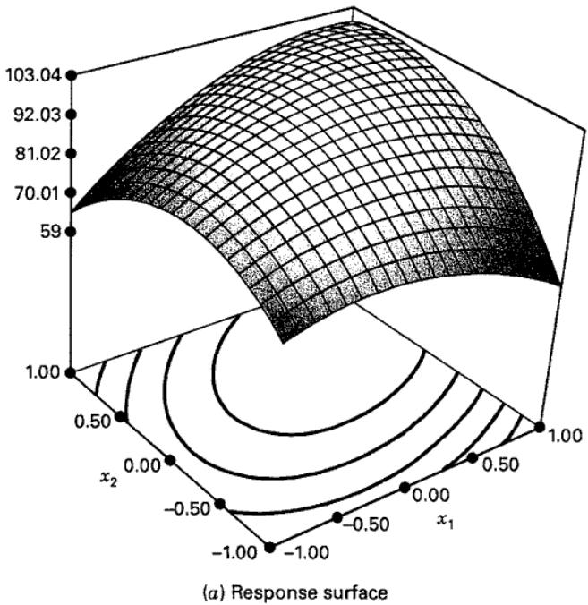

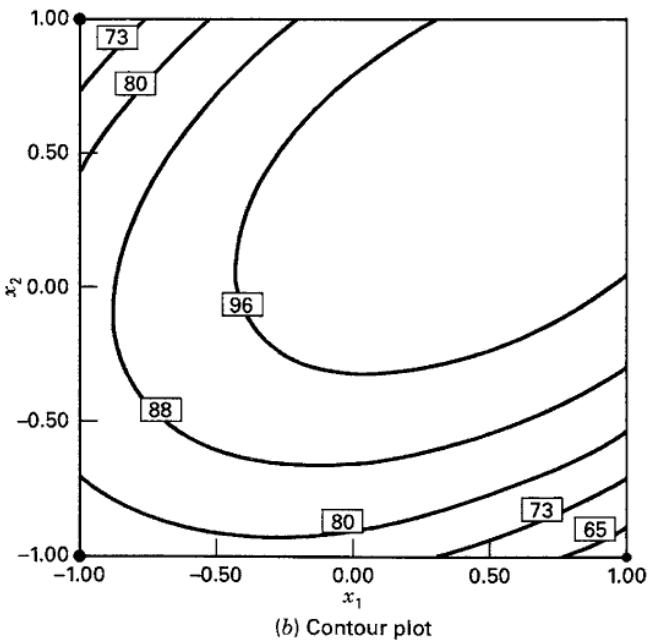  
图 11.6 具有极大值的响应面及其等高线图

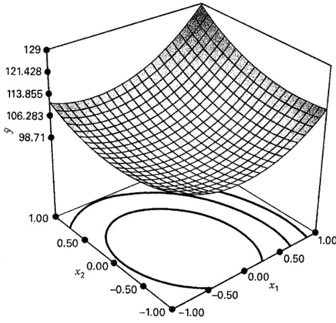  
（a）响应面

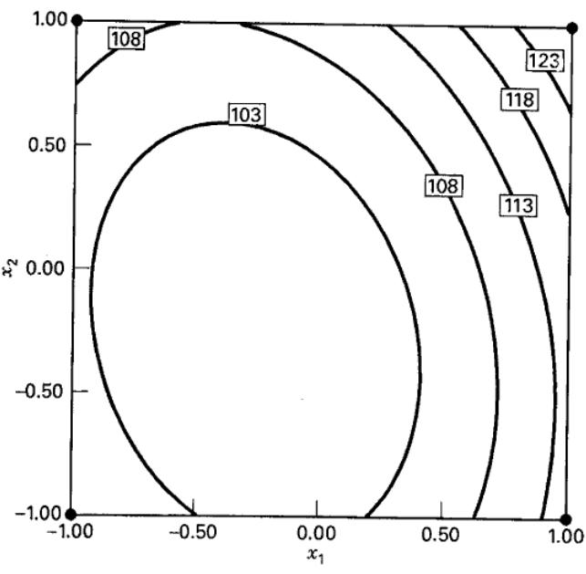  
（b）等高线图
图 11.7 具有极小值的响应面及其等高线图

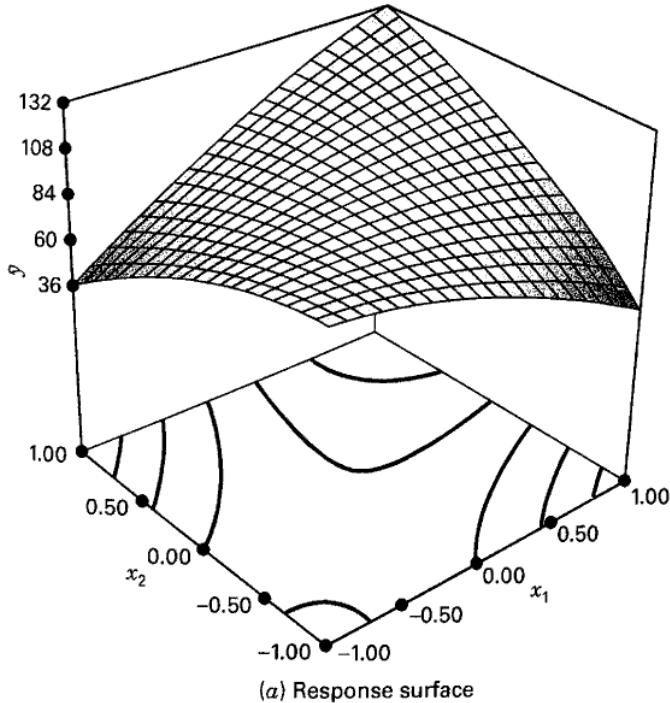

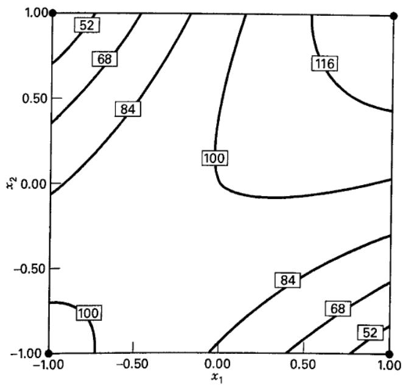  
（b）等高线图
图 11.8 具有鞍点（极小极大点）的响应面及其等高线图

等高线图在响应面研究中具有非常重要的作用。借助响应面分析软件绘制等高线图，试验者通常能够描述曲面的形状，并以合理的精度确定最优点的位置。

驻点的位置可以用一般的数学方法求出。将拟合的二阶模型写成矩阵形式，有

$$
\hat {y} = \hat {\beta_ {0}} + \mathbf {x ^ {\prime} b} + \mathbf {x ^ {\prime} B x}\tag{11.5}
$$

其中

$$
\mathbf {x} = \left[ \begin{array}{c} x _ {1} \\ x _ {2} \\ \vdots \\ x _ {k} \end{array} \right] \quad \mathbf {b} = \left[ \begin{array}{c} \hat {\beta} _ {1} \\ \hat {\beta} _ {2} \\ \vdots \\ \hat {\beta} _ {k} \end{array} \right] \quad \text{且} \quad \mathbf {B} = \left[ \begin{array}{c c c c} \hat {\beta} _ {11}, & \hat {\beta} _ {12} / 2, & \ldots , & \hat {\beta} _ {1 k} / 2 \\ & \hat{\beta}_{22}, & \ldots , & \hat {\beta} _ {2 k} / 2 \\ & & \ddots & \\ \text{对称} & & & \hat {\beta} _ {k k} \end{array} \right]
$$

即 $\mathbf b$ 是由一阶回归系数组成的 $k\times1$ 向量，$\mathbf B$ 是一个 $k\times k$ 对称矩阵，其主对角线元素为纯二次项系数 $\hat\beta_{ii}$，非对角线元素为混合二次项系数 $\hat\beta_{ij}$（$i\ne j$）的一半。将 $\hat y$ 对向量 $\mathbf x$ 各分量的导数置为零，得到

$$
\frac {\partial \hat {y}}{\partial \mathbf {x}} = \mathbf {b} + 2 \mathbf {B x} = \mathbf {0}\tag{11.6}
$$

驻点是式（11.6）的解，即

$$
\mathbf {x} _ {\mathrm{s}} = - \frac {1}{2} \mathbf {B} ^ {- 1} \mathbf {b}\tag{11.7}
$$

此外，将式（11.7）代入式（11.5），可得到驻点处的预测响应：

$$
\hat {y} _ {\mathrm{s}} = \hat {\beta} _ {0} + \frac {1}{2} \mathbf {x} _ {\mathrm{s}} ^ {\prime} \mathbf {b}\tag{11.8}
$$

## 11.3.2 响应面性质的判定

找到驻点后，通常还需要判定其邻域内响应面的性质，即确定该驻点是响应的极大值点、极小值点还是鞍点。我们通常也希望研究响应对变量 $x_1,x_2,\ldots,x_k$ 的相对敏感程度。

如前所述，最直接的方法是检查拟合模型的等高线图。若只有两个或三个过程变量（各个 $x$），等高线图的绘制和解释相对容易。不过，即使变量较少，一种更正式的分析方法——**典则分析**——也可能很有用。

首先将模型变换到以驻点 $\mathbf x_s$ 为原点的新坐标系，再旋转坐标轴，使其与拟合响应面的主轴平行。这一变换如图 11.9 所示。可以证明，变换后的拟合模型为

$$
\hat {y} = \hat {y} _ {\mathrm{s}} + \lambda_ {1} w _ {1} ^ {2} + \lambda_ {2} w _ {2} ^ {2} + \dots + \lambda_ {k} w _ {k} ^ {2}\tag{11.9}
$$

其中，$\{w_i\}$ 是变换后的自变量，$\{\lambda_i\}$ 为常数。式（11.9）称为模型的**典则形式**。此外，$\{\lambda_i\}$ 正是矩阵 $\mathbf B$ 的特征值或特征根。

可以根据驻点以及 $\{\lambda_i\}$ 的符号和大小判定响应面的性质。首先假定驻点位于拟合二阶模型的探索区域内。如果所有 $\lambda_i$ 均为正，$\mathbf x_s$ 是极小值点；如果全部为负，则是极大值点；如果有正有负，则是鞍点。此外，$|\lambda_i|$ 最大所对应的 $w_i$ 方向是曲面最陡峭的方向。例如，图 11.9 中的 $\mathbf x_s$ 是极大值点（$\lambda_1$ 和 $\lambda_2$ 均为负），且 $|\lambda_1|>|\lambda_2|$。

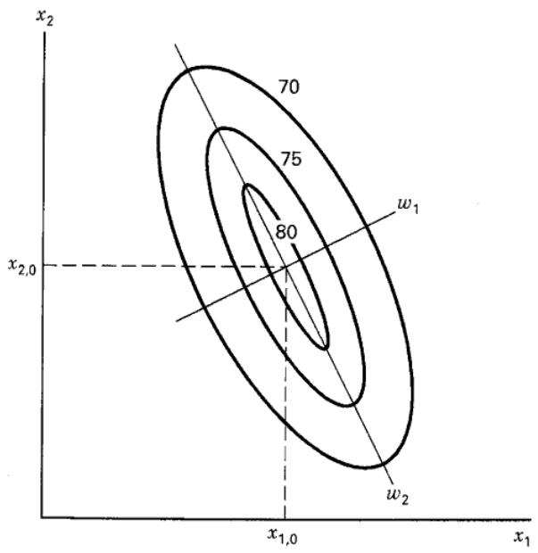

图 11.9 二阶模型的典则形式

## 例 11.2

继续分析例 11.1 中的化学过程。仅用表 11.4 的设计无法拟合关于 $x_1$ 和 $x_2$ 的二阶模型。试验者决定增补足够的试验点，以便拟合二阶模型。[^1]她在 $(x_1=0,x_2=\pm1.414)$ 和 $(x_1=\pm1.414,x_2=0)$ 处增加四次观测。完整试验见表 11.6，设计见图 11.10。这种设计称为**中心复合设计**（CCD），将在第 11.4.2 节进一步讨论。在研究的第二阶段，还关注产品的黏度和分子量这两个响应；相应数据也列在表 11.6 中。

## 表 11.6

例 11.2 的中心复合设计

<table><tr><td colspan="2">自然变量</td><td colspan="2">编码变量</td><td colspan="3">响应</td></tr><tr><td>$\xi_1$</td><td>$\xi_2$</td><td>$x_1$</td><td>$x_2$</td><td>$y_1$  (Yield)</td><td>$y_2$  (Viscosity)</td><td>$y_3$  (Molecular Weight)</td></tr><tr><td>80</td><td>170</td><td>-1</td><td>-1</td><td>76.5</td><td>62</td><td>2940</td></tr><tr><td>80</td><td>180</td><td>-1</td><td>1</td><td>77.0</td><td>60</td><td>3470</td></tr><tr><td>90</td><td>170</td><td>1</td><td>-1</td><td>78.0</td><td>66</td><td>3680</td></tr><tr><td>90</td><td>180</td><td>1</td><td>1</td><td>79.5</td><td>59</td><td>3890</td></tr><tr><td>85</td><td>175</td><td>0</td><td>0</td><td>79.9</td><td>72</td><td>3480</td></tr><tr><td>85</td><td>175</td><td>0</td><td>0</td><td>80.3</td><td>69</td><td>3200</td></tr><tr><td>85</td><td>175</td><td>0</td><td>0</td><td>80.0</td><td>68</td><td>3410</td></tr><tr><td>85</td><td>175</td><td>0</td><td>0</td><td>79.7</td><td>70</td><td>3290</td></tr><tr><td>85</td><td>175</td><td>0</td><td>0</td><td>79.8</td><td>71</td><td>3500</td></tr><tr><td>92.07</td><td>175</td><td>1.414</td><td>0</td><td>78.4</td><td>68</td><td>3360</td></tr><tr><td>77.93</td><td>175</td><td>-1.414</td><td>0</td><td>75.6</td><td>71</td><td>3020</td></tr><tr><td>85</td><td>182.07</td><td>0</td><td>1.414</td><td>78.5</td><td>58</td><td>3630</td></tr><tr><td>85</td><td>167.93</td><td>0</td><td>-1.414</td><td>77.0</td><td>57</td><td>3150</td></tr></table>

图 11.10 例 11.2 的中心复合设计

下面着重为产率响应 $y_1$ 拟合二次模型（另外两个响应将在第 11.3.4 节讨论）。通常使用计算机软件拟合响应面并绘制等高线图。表 11.7 给出了 Design-Expert 的输出。该软件首先计算模型中线性项、二次项和三次项的“序贯平方和（附加平方和）”。由于 CCD 的试验次数不足以支持完整三次模型，软件对三次模型给出了混杂警告。根据二次项很小的 $P$ 值，决定为产率拟合二阶模型。计算机输出分别给出了以编码变量和自然变量（实际因子水平）表示的最终模型。

图 11.11 给出了以过程变量时间和温度表示的产率三维响应面和等高线图。从图中容易看出，最优点非常接近温度 $175^\circ\mathrm F$、反应时间 85 分钟的位置，而且该点是响应的极大值点。从等高线图还可看出，该过程对反应时间变化的敏感程度可能略高于对温度变化的敏感程度。

也可以利用式（11.7）的一般解确定驻点的位置。注意到（纯二次系数多保留两位，以便与特征值计算一致）

$$
\mathbf {b} = \left[ \begin{array}{l} 0.995 \\ 0.515 \end{array} \right] \quad \mathbf {B} = \left[ \begin{array}{l l} - 1.37625 & 0.1250 \\ 0.1250 & - 1.00125 \end{array} \right]
$$

由式（11.7），驻点为

$$
\begin{array}{r l} \mathbf {x} _ {s} & = - \frac {1}{2} \mathbf {B} ^ {- 1} \mathbf {b} \\ & = - \frac {1}{2} \left[ \begin{array}{l l} - 0.7345 & - 0.0917 \\ - 0.0917 & - 1.0096 \end{array} \right] \left[ \begin{array}{l} 0.995 \\ 0.515 \end{array} \right] = \left[ \begin{array}{l} 0.389 \\ 0.306 \end{array} \right] \end{array}
$$

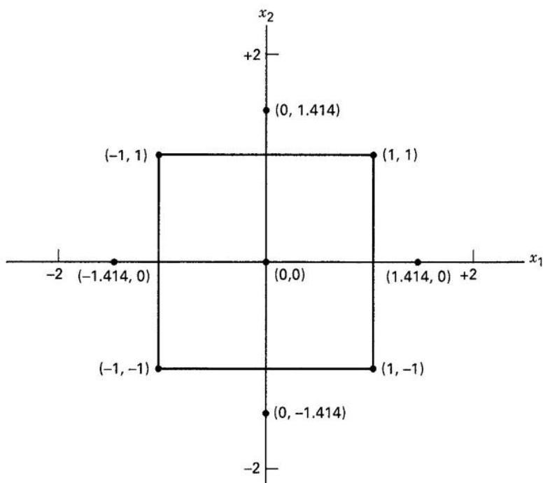

即 $x_{1,s}=0.389$、$x_{2,s}=0.306$。用自然变量表示，驻点满足

$$
0.389 = \frac {\xi_ {1} - 85}{5} \quad 0.306 = \frac {\xi_ {2} - 175}{5}
$$

因而反应时间为 $\xi_1=86.95\simeq87$ 分钟，温度为 $\xi_2=176.53\simeq176.5^\circ\mathrm F$。这与目测图 11.11 等高线图所确定的驻点非常接近。利用式（11.8），可得驻点处的预测响应 $\hat y_s=80.21$。

还可以采用本节介绍的典则分析来判定响应面的性质。首先需要将拟合模型写成典则形式（式 11.9）。特征值 $\lambda_1$ 和 $\lambda_2$ 是下列行列式方程的根：

$$
\begin{array}{c} {{| \mathbf {B} - \lambda \mathbf {I} | = 0}} \\ {{\left| \begin{array}{c c} {{- 1.37625 - \lambda}} & {{0.1250}} \\ {{0.1250}} & {{- 1.00125 - \lambda}} \end{array} \right| = 0}} \end{array}
$$

化简得到

$$
\lambda^ {2} + 2.3775 \lambda + 1.3623453 = 0
$$

此二次方程的根为 $\lambda_1=-0.9634$、$\lambda_2=-1.4141$。因此，拟合模型的典则形式为

$$
\hat {y} = 80.21 - 0.9634 w _ {1} ^ {2} - 1.4141 w _ {2} ^ {2}
$$

因为两个特征值均为负，且驻点位于探索区域内，所以可断定该驻点是极大值点。

表 11.7
使用 Design-Expert 为例 11.2 的产率响应拟合模型的计算机输出

<table><tr><td>来源</td><td>平方和</td><td>DF</td><td>均方</td><td>F 值</td><td>P 值</td><td></td></tr><tr><td>均值</td><td>80062.16</td><td>1</td><td>80062.16</td><td></td><td></td><td></td></tr><tr><td>线性</td><td>10.04</td><td>2</td><td>5.02</td><td>2.69</td><td>0.1166</td><td></td></tr><tr><td>2FI</td><td>0.25</td><td>1</td><td>0.25</td><td>0.12</td><td>0.7350</td><td></td></tr><tr><td>二次</td><td>17.95</td><td>2</td><td>8.98</td><td>126.88</td><td>&lt;0.001</td><td>建议</td></tr><tr><td>三次</td><td>2.042E-003</td><td>2</td><td>1.021E-003</td><td>0.010</td><td>0.9897</td><td>混杂</td></tr><tr><td>残差</td><td>0.49</td><td>5</td><td>0.099</td><td></td><td></td><td></td></tr><tr><td>总计</td><td>80090.90</td><td>13</td><td>6160.84</td><td></td><td></td><td></td></tr></table>

“序贯模型平方和”：选择附加项仍显著的最高阶多项式。

失拟检验

<table><tr><td>来源</td><td>平方和</td><td>DF</td><td>均方</td><td>F 值</td><td>P 值</td><td></td></tr><tr><td>线性</td><td>18.49</td><td>6</td><td>3.08</td><td>58.14</td><td>0.0008</td><td></td></tr><tr><td>2FI</td><td>18.24</td><td>5</td><td>3.65</td><td>68.82</td><td>0.0006</td><td></td></tr><tr><td>二次</td><td>0.28</td><td>3</td><td>0.094</td><td>1.78</td><td>0.2898</td><td>建议</td></tr><tr><td>三次</td><td>0.28</td><td>1</td><td>0.28</td><td>5.31</td><td>0.0826</td><td>混杂</td></tr><tr><td>纯误差</td><td>0.21</td><td>4</td><td>0.053</td><td></td><td></td><td></td></tr></table>

“失拟检验”：所选模型的失拟应不显著。

模型汇总统计量

<table><tr><td>来源</td><td>标准差</td><td>R²</td><td>调整 R²</td><td>预测 R²</td><td>PRESS</td><td></td></tr><tr><td>线性</td><td>1.37</td><td>0.3494</td><td>0.2193</td><td>-0.0435</td><td>29.99</td><td></td></tr><tr><td>2FI</td><td>1.43</td><td>0.3581</td><td>0.1441</td><td>-0.2730</td><td>36.59</td><td></td></tr><tr><td>二次</td><td>0.27</td><td>0.9828</td><td>0.9705</td><td>0.9184</td><td>2.35</td><td>建议</td></tr><tr><td>三次</td><td>0.31</td><td>0.9828</td><td>0.9588</td><td>0.3622</td><td>18.33</td><td>混杂</td></tr></table>

“模型汇总统计量”：重点选择使 PRESS 最小，或等价地使预测 $R^2$ 最大的模型。
响应：产率

## 响应面二次模型的方差分析

方差分析表〔偏平方和〕

<table><tr><td>来源</td><td>平方和</td><td>DF</td><td>均方</td><td>F 值</td><td>P 值</td></tr><tr><td>模型</td><td>28.25</td><td>5</td><td>5.65</td><td>79.85</td><td>&lt;0.0001</td></tr><tr><td>A</td><td>7.92</td><td>1</td><td>7.92</td><td>111.93</td><td>&lt;0.0001</td></tr><tr><td>B</td><td>2.12</td><td>1</td><td>2.12</td><td>30.01</td><td>0.0009</td></tr><tr><td>$A^2$</td><td>13.18</td><td>1</td><td>13.18</td><td>186.22</td><td>&lt;0.0001</td></tr><tr><td>$B^2$</td><td>6.97</td><td>1</td><td>6.97</td><td>98.56</td><td>&lt;0.0001</td></tr><tr><td>AB</td><td>0.25</td><td>1</td><td>0.25</td><td>3.53</td><td>0.1022</td></tr><tr><td>残差</td><td>0.50</td><td>7</td><td>0.071</td><td></td><td></td></tr><tr><td>失拟</td><td>0.28</td><td>3</td><td>0.094</td><td>1.78</td><td>0.2898</td></tr><tr><td>纯误差</td><td>0.21</td><td>4</td><td>0.053</td><td></td><td></td></tr><tr><td>校正总计</td><td>28.74</td><td>12</td><td></td><td></td><td></td></tr></table>

<table><tr><td>标准差</td><td>0.27</td><td>R²</td><td>0.9828</td></tr><tr><td>均值</td><td>78.48</td><td>调整 R²</td><td>0.9705</td></tr><tr><td>C.V.</td><td>0.34</td><td>预测 R²</td><td>0.9184</td></tr><tr><td>PRESS</td><td>2.35</td><td>充分精度</td><td>23.018</td></tr></table>

表 11.7（续）

<table><tr><td>因子</td><td>系数估计</td><td>DF</td><td>标准误</td><td>95% 置信下限</td><td>95% 置信上限</td><td>VIF</td></tr><tr><td>截距</td><td>79.94</td><td>1</td><td>0.12</td><td>79.66</td><td>80.22</td><td></td></tr><tr><td>A—时间</td><td>0.99</td><td>1</td><td>0.094</td><td>0.77</td><td>1.22</td><td>1.00</td></tr><tr><td>B—温度</td><td>0.52</td><td>1</td><td>0.094</td><td>0.29</td><td>0.74</td><td>1.00</td></tr><tr><td>$A^{2}$</td><td>-1.38</td><td>1</td><td>0.10</td><td>-1.61</td><td>-1.14</td><td>1.02</td></tr><tr><td>$B^{2}$</td><td>-1.00</td><td>1</td><td>0.10</td><td>-1.24</td><td>-0.76</td><td>1.02</td></tr><tr><td>AB</td><td>0.25</td><td>1</td><td>0.13</td><td>-0.064</td><td>0.56</td><td>1.00</td></tr></table>

以编码因子表示的最终方程：

$$
\hat y_1=79.94+0.995x_1+0.515x_2-1.37625x_1^2-1.00125x_2^2+0.250x_1x_2
$$

以实际因子表示的最终方程：

产率 =
-1430.52285
+7.80749 × 时间
+13.27053 × 温度
-0.055050 × 时间²
-0.040050 × 温度²
+0.010000 × 时间 × 温度

个案诊断统计量

<table><tr><td>试验顺序</td><td>标准顺序</td><td>实际值</td><td>预测值</td><td>残差</td><td>杠杆值</td><td>学生化残差</td><td>Cook 距离</td><td>异常值 t</td></tr><tr><td>8</td><td>1</td><td>76.50</td><td>76.30</td><td>0.20</td><td>0.625</td><td>1.213</td><td>0.409</td><td>1.264</td></tr><tr><td>6</td><td>2</td><td>78.00</td><td>77.79</td><td>0.21</td><td>0.625</td><td>1.275</td><td>0.452</td><td>1.347</td></tr><tr><td>9</td><td>3</td><td>77.00</td><td>76.83</td><td>0.17</td><td>0.625</td><td>1.027</td><td>0.293</td><td>1.032</td></tr><tr><td>11</td><td>4</td><td>79.50</td><td>79.32</td><td>0.18</td><td>0.625</td><td>1.089</td><td>0.329</td><td>1.106</td></tr><tr><td>12</td><td>5</td><td>75.60</td><td>75.78</td><td>-0.18</td><td>0.625</td><td>-1.107</td><td>0.341</td><td>-1.129</td></tr><tr><td>10</td><td>6</td><td>78.40</td><td>78.59</td><td>-0.19</td><td>0.625</td><td>-1.195</td><td>0.396</td><td>-1.240</td></tr><tr><td>7</td><td>7</td><td>77.00</td><td>77.21</td><td>-0.21</td><td>0.625</td><td>-1.283</td><td>0.457</td><td>-1.358</td></tr><tr><td>1</td><td>8</td><td>78.50</td><td>78.67</td><td>-0.17</td><td>0.625</td><td>-1.019</td><td>0.289</td><td>-1.023</td></tr><tr><td>5</td><td>9</td><td>79.90</td><td>79.94</td><td>-0.040</td><td>0.200</td><td>-0.168</td><td>0.001</td><td>-0.156</td></tr><tr><td>3</td><td>10</td><td>80.30</td><td>79.94</td><td>0.36</td><td>0.200</td><td>1.513</td><td>0.095</td><td>1.708</td></tr><tr><td>13</td><td>11</td><td>80.00</td><td>79.94</td><td>0.060</td><td>0.200</td><td>0.252</td><td>0.003</td><td>0.235</td></tr><tr><td>2</td><td>12</td><td>79.70</td><td>79.94</td><td>-0.24</td><td>0.200</td><td>-1.009</td><td>0.042</td><td>-1.010</td></tr><tr><td>4</td><td>13</td><td>79.80</td><td>79.94</td><td>-0.14</td><td>0.200</td><td>-0.588</td><td>0.014</td><td>0.559</td></tr></table>

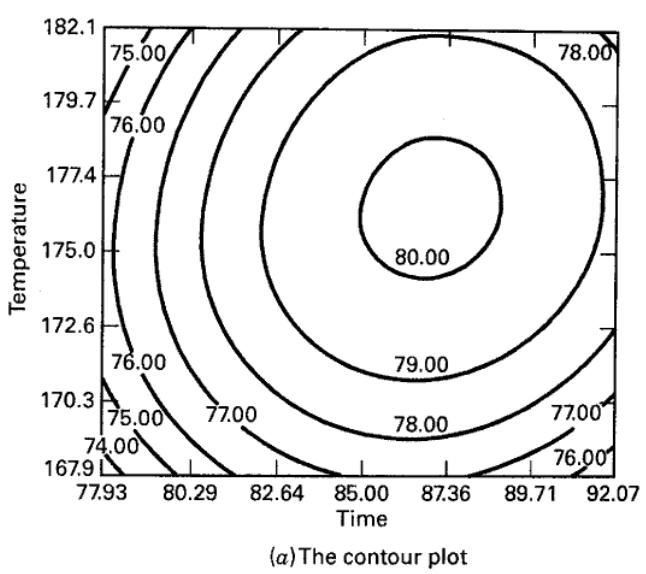

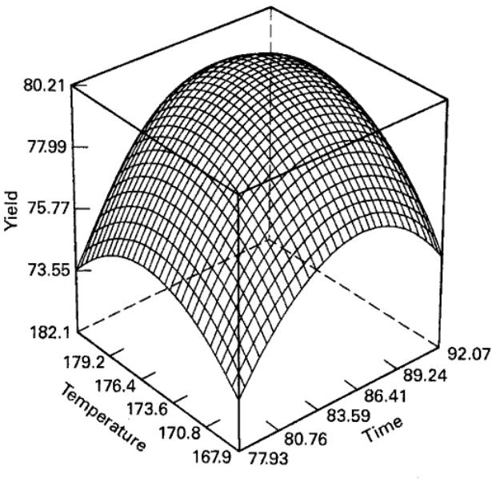  
图 11.11 例 11.2 中产率响应的等高线图与响应面图

某些响应面问题需要确定典则变量 $\{w_i\}$ 与设计变量 $\{x_i\}$ 之间的关系。如果无法在驻点处运行过程，这一点尤其重要。例如，假定例 11.2 中反应时间 87 分钟、温度 $176.5^\circ\mathrm F$ 的因子组合成本过高，无法采用。此时希望从驻点“退回”到成本较低的位置，同时避免产率大幅降低。模型的典则形式表明，沿 $w_1$ 方向移动引起的产率损失较小。要利用典则形式进行探索，需要将 $(w_1,w_2)$ 空间中的点换算为 $(x_1,x_2)$ 空间中的点。

一般而言，变量 $\mathbf x$ 与典则变量 $\mathbf w$ 的关系为

$$
\mathbf {w} = \mathbf {M} ^ {\prime} (\mathbf {x} - \mathbf {x} _ {s})
$$

其中 $\mathbf M$ 为 $k\times k$ 正交矩阵。$\mathbf M$ 的各列是与 $\{\lambda_i\}$ 对应的归一化特征向量。即，若 $\mathbf m_i$ 为 $\mathbf M$ 的第 $i$ 列，则它满足

$$
(\mathbf {B} - \lambda_ {i} \mathbf {I}) \mathbf {m} _ {i} = \mathbf {0}\tag{11.10}
$$

并且 $\sum_{j=1}^k m_{ji}^2=1$。

以例 11.2 的拟合二阶模型说明这一过程。当 $\lambda_1=-0.9634$ 时，式（11.10）变为

$$
\left[ \begin{array}{c c} (- 1.37625 + 0.9634) & 0.1250 \\ 0.1250 & (- 1.00125 + 0.9634) \end{array} \right] \left[ \begin{array}{c} m _ {11} \\ m _ {21} \end{array} \right] = \left[ \begin{array}{c} 0 \\ 0 \end{array} \right]
$$

即

$$
\begin{array}{r} - 0.4129 m _ {11} + 0.1250 m _ {21} = 0 \\ 0.1250 m _ {11} - 0.0379 m _ {21} = 0 \end{array}
$$

我们需要这些方程的归一化解，即满足 $m_{11}^2+m_{21}^2=1$ 的解。这些方程的解并不唯一，因此最方便的方法是为其中一个未知数任意赋值，解出其余未知数，再将解归一化。令 $m_{21}^*=1$，可得 $m_{11}^*=0.3027$。将二者除以

$$
\sqrt {(m _ {11} ^ {*}) ^ {2} + (m _ {21} ^ {*}) ^ {2}} = \sqrt {(0.3027) ^ {2} + (1) ^ {2}} = 1.0448
$$

可得到归一化解

$$
m _ {11} = \frac {m _ {11} ^ {*}}{1.0448} = \frac {0.3027}{1.0448} = 0.2898
$$

以及

$$
m _ {21} = \frac {m _ {21} ^ {*}}{1.0448} = \frac {1}{1.0448} = 0.9571
$$

这就是矩阵 $\mathbf M$ 的第一列。

对 $\lambda_2=-1.4141$ 重复上述过程，可得矩阵 $\mathbf M$ 的第二列为 $m_{12}=-0.9571$、$m_{22}=0.2898$。因此

$$
\mathbf {M} = \left[ \begin{array}{c c} 0.2898 & - 0.9571 \\ 0.9571 & 0.2898 \end{array} \right]
$$

变量 $\mathbf w$ 与 $\mathbf x$ 的关系为

$$
\left[ \begin{array}{c} w _ {1} \\ w _ {2} \end{array} \right] = \left[ \begin{array}{c c} 0.2898 & 0.9571 \\ - 0.9571 & 0.2898 \end{array} \right] \left[ \begin{array}{c} x _ {1} - 0.389 \\ x _ {2} - 0.306 \end{array} \right]
$$

即

$$
\begin{array}{c} w _ {1} = 0.2898 (x _ {1} - 0.389) + 0.9571 (x _ {2} - 0.306) \\ w _ {2} = - 0.9571 (x _ {1} - 0.389) + 0.2898 (x _ {2} - 0.306) \end{array}
$$

如果希望探索驻点附近的响应面，可以先在 $(w_1,w_2)$ 空间中确定适当的观测点，再利用上述关系将这些点转换到 $(x_1,x_2)$ 空间，以便实际开展试验。

## 11.3.3 脊形系统

除上一节讨论的典型极大值、极小值和鞍点响应面之外，还经常遇到这些曲面的变形，尤其是脊形系统。考虑前面式（11.9）给出的二阶模型典则形式：

$$
\hat {y} = \hat {y} _ {\mathrm{s}} + \lambda_ {1} w _ {1} ^ {2} + \lambda_ {2} w _ {2} ^ {2} + \dots + \lambda_ {k} w _ {k} ^ {2}
$$

假定驻点 $\mathbf x_s$ 位于试验区域内，且一个或多个 $\lambda_i$ 非常小（例如 $\lambda_i\simeq0$）。此时，响应变量对与这些小特征值相乘的变量 $w_i$ 非常不敏感。图 11.12 给出了 $k=2$、$\lambda_1=0$ 时的等高线图。（实际中，$\lambda_1$ 通常接近零而不恰好等于零。）理论上，这一响应面的典则模型为

$$
\hat {y} = \hat {y} _ {\mathrm{s}} + \lambda_ {2} w _ {2} ^ {2}
$$

其中 $\lambda_2$ 为负。注意，曲面沿 $w_1$ 方向严重拉长，在 $\hat y=70$ 处形成一条中心线，最优点可取该线上的任何一点。这种响应面称为**平稳脊形系统**。

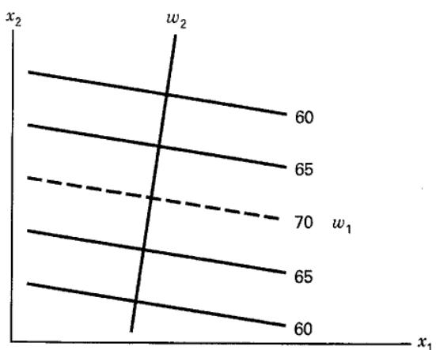  
图 11.12 平稳脊形系统的等高线图

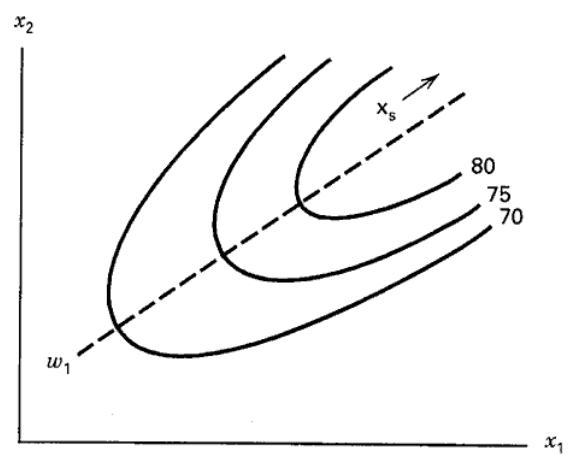  
图 11.13 上升脊形系统的等高线图

如果驻点远在拟合二阶模型的探索区域之外，且一个或多个 $\lambda_i$ 接近零，则曲面可能呈上升脊形。图 11.13 给出了 $k=2$、$\lambda_1$ 接近零、$\lambda_2$ 为负时的上升脊形。在这种系统中，由于 $\mathbf x_s$ 位于模型拟合区域之外，不能对真实曲面或驻点作出推断，但值得沿 $w_1$ 方向进一步探索。如果 $\lambda_2$ 为正，则称为下降脊形系统。

## 11.3.4 多响应问题

许多响应面问题涉及多个响应的分析。例如，例 11.2 中测量了三个响应，但前面的过程优化只考虑产率响应 $y_1$。

同时考虑多个响应时，首先为每个响应建立适当的响应面模型，然后寻找一组操作条件，使所有响应在某种意义上达到最优，或至少保持在期望的范围内。Myers、Montgomery 和 Anderson-Cook（2016）详细讨论了多响应问题。

例 11.2 中黏度和分子量响应（分别为 $y_2$ 和 $y_3$）的模型为

$$
\begin{array}{l} \hat {y} _ {2} = 70.00 - 0.16 x _ {1} - 0.95 x _ {2} - 0.69 x _ {1} ^ {2} - 6.69 x _ {2} ^ {2} - 1.25 x _ {1} x _ {2} \\ \hat {y} _ {3} = 3386.2 + 205.1 x _ {1} + 177.4 x _ {2} \end{array}
$$

用时间 $\xi_1$ 和温度 $\xi_2$ 的自然水平表示，这些模型为

$$
\begin{array}{r l} \hat {y} _ {2} & = - 9030.74 + 13.393 \xi_ {1} + 97.708 \xi_ {2} \\ & - 2.75 \times 10 ^ {- 2} \xi_ {1} ^ {2} - 0.26757 \xi_ {2} ^ {2} - 5 \times 10 ^ {- 2} \xi_ {1} \xi_ {2} \end{array}
$$

以及

$$
\hat {y} _ {3} = - 6308.8 + 41.025 \xi_ {1} + 35.473 \xi_ {2}
$$

图 11.14 和 11.15 给出了这些模型的等高线图和响应面图。

当过程变量较少时，一种相对直接且有效的多响应优化方法是叠加各响应的等高线图。图 11.16 叠加了例 11.2 中三个响应的等高线，所采用的边界为产率 $y_1\ge78.5$、黏度 $62\le y_2\le68$ 和分子量 $y_3\le3400$。如果这些边界代表过程必须满足的重要条件，则如图 11.16 的未加阴影区域所示，有多个时间与温度的组合能够使过程达到要求。试验者可以目测等高线图，选择适当的操作条件。例如，图中两个可行操作区域中，较大的区域很可能更受关注。

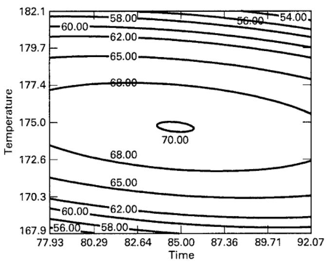  
（a）等高线图

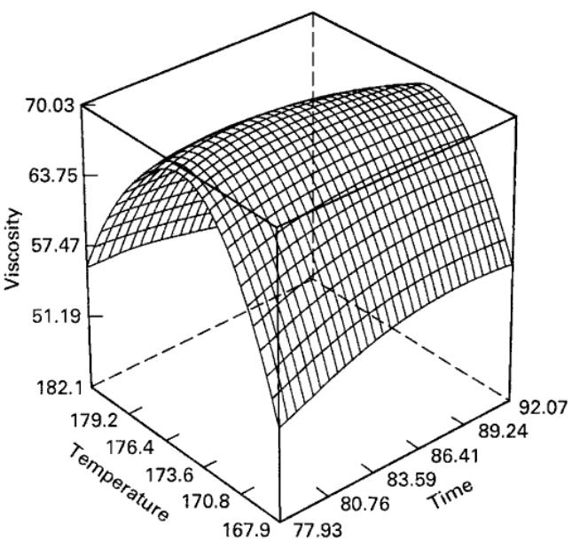  
（b）响应面图
图 11.14 例 11.2 中黏度的等高线图与响应面图

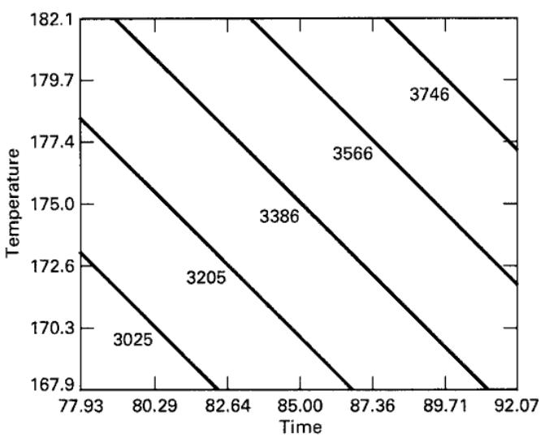  
（a）等高线图

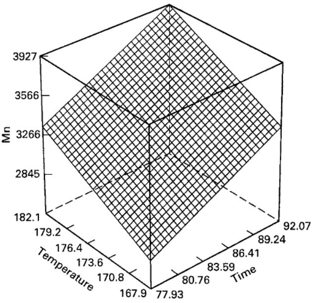  
（b）响应面图
图 11.15 例 11.2 中分子量的等高线图与响应面图

设计变量超过三个时，叠加等高线图会变得不便，因为等高线图是二维的，绘图时必须固定其余 $k-2$ 个设计变量。往往需要反复尝试，才能确定应固定哪些因子，以及选择什么水平才能最好地展示曲面。因此，在实践中需要更正式的多响应优化方法。

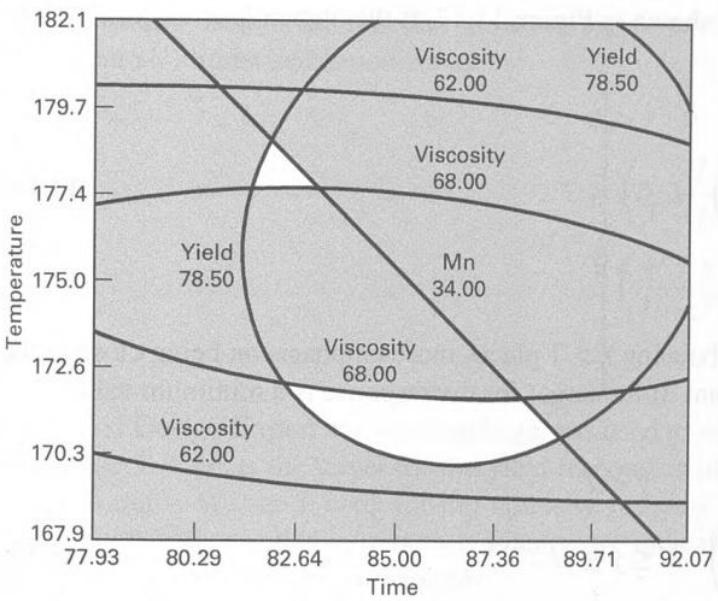

图 11.16 例 11.2 中叠加产率、黏度和分子量响应面所得的最优区域

一种常用方法是将问题表述为约束优化问题并求解。以例 11.2 为例，可以写成

$$
\begin{array}{c} \text{最大化} y _ {1} \\ \text{约束条件} \\ 62 \leq y _ {2} \leq 68 \\ y _ {3} \leq 3400 \end{array}
$$

有多种数值方法可以求解这类问题，有时统称为非线性规划方法。Design-Expert 使用直接搜索程序求解这一形式的问题，得到两个解：

$$
\text{时间} = 83.5 \quad \text{温度} = 177.1 \quad \hat {y} _ {1} = 79.5
$$

以及

$$
\text{时间} = 86.6 \quad \text{温度} = 172.25 \quad \hat {y} _ {1} = 79.5
$$

第一个解位于设计空间中上方较小的可行区域（见图 11.16），第二个解位于较大的区域。两个解都非常接近约束边界。

另一种有用的方法是 Derringer 和 Suich（1980）推广的同时优化技术，其核心是**满意度函数**。首先将每个响应 $y_i$ 转换为单项满意度函数 $d_i$，其取值范围为

$$
0 \leq d _ {i} \leq 1
$$

当响应 $y_i$ 达到目标值时，$d_i=1$；当响应超出可接受区域时，$d_i=0$。然后选择设计变量，使总体满意度达到最大：

$$
D = (d _ {1} \cdot d _ {2} \cdot \cdot \cdot d _ {m}) ^ {1 / m}
$$

其中 $m$ 为响应数。如果任何一个单项响应不可接受，则总体满意度为零。

单项满意度函数的形式如图 11.17 所示。若响应 $y$ 的目标是达到最大值 $T$，则

$$
d = \left\{ \begin{array}{c c} 0 & y <   L \\ \left(\frac {y - L}{T - L}\right) ^ {r} & L \leq y \leq T \\ 1 & y > T \end{array} \right.\tag{11.11}
$$

当权重 $r=1$ 时，满意度函数是线性的。选择 $r>1$ 会更强调接近目标值，而选择 $0<r<1$ 则降低这一要求。若响应的目标是达到最小值，则

$$
d = \left\{ \begin{array}{c c} 1 & y <   T \\ \left(\frac {U - y}{U - T}\right) ^ {r} & T \leq y \leq U \\ 0 & y > U \end{array} \right.\tag{11.12}
$$

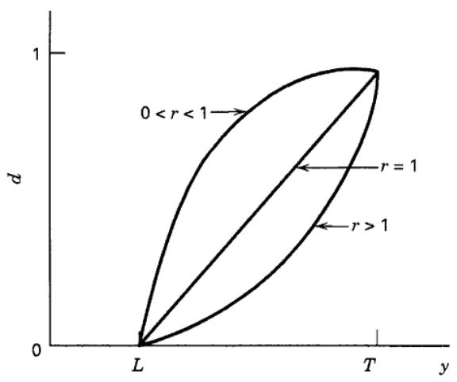  
（a）目标是使 $y$ 最大

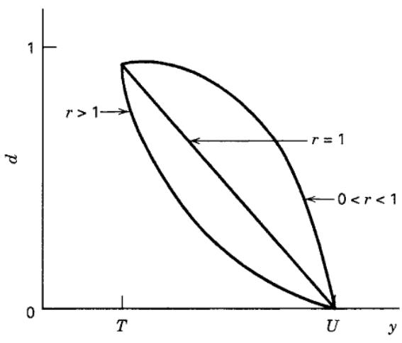  
（b）目标是使 $y$ 最小

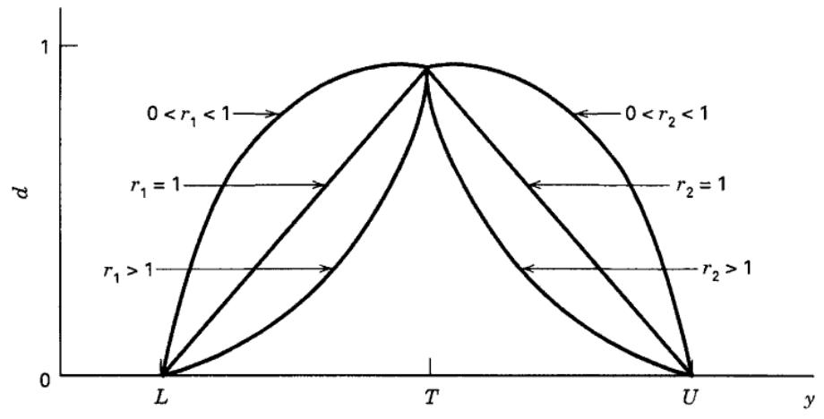  
（c）目标是使 $y$ 尽可能接近目标值
图 11.17 用于同时优化的单项满意度函数

图 11.17c 中的双侧满意度函数假定目标值位于下限 $L$ 与上限 $U$ 之间，其定义为

$$
d = \left\{ \begin{array}{c c} 0 & y <   L \\ \left(\frac {y - L}{T - L}\right) ^ {r _ {1}} & L \leq y \leq T \\ \left(\frac {U - y}{U - T}\right) ^ {r _ {2}} & T \leq y \leq U \\ 0 & y > U \end{array} \right.\tag{11.13}
$$

利用 Design-Expert 的满意度函数方法求解例 11.2。对产率响应，取目标值 $T=80$、下限 $L=70$，并将这一单项满意度的权重设为 1。对黏度响应，取 $T=65$、$L=62$、$U=68$，以符合规格要求，且两侧权重均为 $r_1=r_2=1$。最后规定，分子量在 3200～3400 之间均可接受。计算得到两个解。

## 解 1

<table><tr><td rowspan="2">解 2</td><td>Time = 86.5 $\hat{y}_{1} = 78.8$</td><td>Temp = 170.5 $\hat{y}_{2} = 65$</td><td>D = 0.822 $\hat{y}_{3} = 3287$</td></tr><tr><td>Time = 82 $\hat{y}_{1} = 78.5$</td><td>Temp = 178.8 $\hat{y}_{2} = 65$</td><td>D = 0.792 $\hat{y}_{3} = 3400$</td></tr></table>

解 1 的总体满意度最高，黏度恰好达到目标值，分子量也在可接受范围内。这个解位于图 11.16 中较大的操作区域，第二个解位于较小区域。图 11.18 给出了总体满意度函数 $D$ 的响应面图和等高线图。

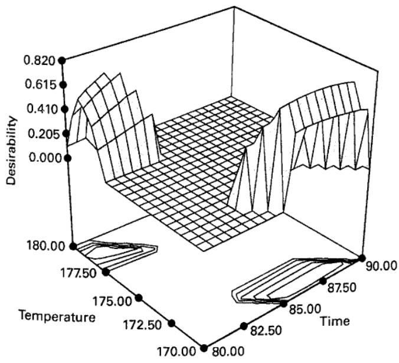

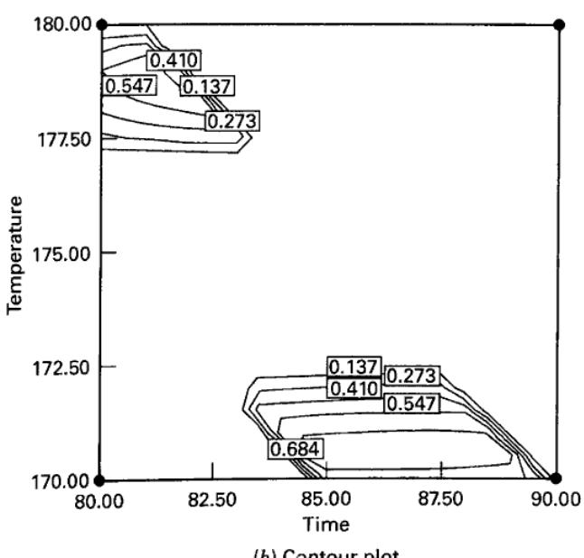  
图 11.18 例 11.2 中总体满意度函数的响应面图与等高线图

[^1]: 工程师在实施原来的九次试验时，几乎同时进行了另外四次观测。如果两组试验相隔较长时间，就需要采用区组安排；详见第 11.4.3 节。
