# 11.4 用于拟合响应面的试验设计

适当选择试验设计能够大大方便响应面的拟合与分析。本节讨论为拟合响应面选择合适设计时需要考虑的一些问题。

理想的响应面设计应具有以下特点：

1. 在整个关注区域内合理分布数据点，从而合理分布信息。

2. 能够考察模型的充分性，包括失拟情况。

3. 允许分区组实施试验。

4. 允许按序贯方式逐步构造更高阶的设计。

5. 能够由试验本身估计误差。

6. 能够精确估计模型系数。

7. 在整个试验区域内具有良好的预测方差分布。

8. 对异常值或缺失值具有合理的稳健性。

9. 所需试验次数较少。

10. 自变量所需水平数不宜过多。

11. 模型参数的计算应简便。

这些特点有时彼此冲突，因此选择设计时往往需要作出权衡。关于响应面设计的选择，可参阅 Khuri 和 Cornell（1996）、Myers、Montgomery 和 Anderson-Cook（2016），以及 Box 和 Draper（2007）。

## 11.4.1 用于拟合一阶模型的设计

假设要拟合含 $k$ 个变量的一阶模型

$$
y = \beta_ {0} + \sum_ {i = 1} ^ {k} \beta_ {i} x _ {i} + \epsilon\tag{11.14}
$$

有一类特殊设计能使回归系数 $\{\hat\beta_i\}$ 的方差达到最小，即**正交一阶设计**。如果矩阵 $\mathbf X'\mathbf X$ 的非对角线元素均为零，则一阶设计是正交的。这意味着 $\mathbf X$ 矩阵不同列之间的交叉乘积之和为零。

正交一阶设计包括 $2^k$ 析因设计，以及主效应之间互不混杂的 $2^k$ 系列部分析因设计。采用这些设计时，假定 $k$ 个因子的低、高水平按通常方式编码为 $-1$ 和 $+1$。

如果没有重复试验，$2^k$ 设计不能估计试验误差。常用的重复方法是在设计中增加若干中心点观测，即 $x_i=0$（$i=1,2,\ldots,k$）处的观测。增加中心点不影响 $i\ge1$ 时的 $\hat\beta_i$，但 $\beta_0$ 的估计变为全部观测值的总平均。同时，增加中心点不改变设计的正交性。例 11.1 展示了在 $2^2$ 设计中增加五个中心点以拟合一阶模型的做法。

另一种正交一阶设计是**单纯形设计**。单纯形是在 $k$ 维空间中具有 $k+1$ 个顶点的正则几何体。因此，$k=2$ 时为等边三角形，$k=3$ 时为正四面体。二维和三维单纯形设计见图 11.19。

## 11.4.2 用于拟合二阶模型的设计

例 11.2（以及更早的例 6.6）已初步介绍了用于拟合二阶模型的中心复合设计（CCD）。这是拟合此类模型最常用的设计。一般而言，CCD 由一个含 $n_F$ 次析因试验的 $2^k$ 析因设计（或分辨度 V 的部分析因设计）、$2k$ 次轴点（星点）试验和 $n_C$ 次中心点试验构成。图 11.20 给出了 $k=2$ 和 $k=3$ 时的 CCD。

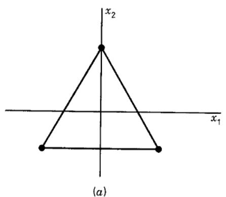

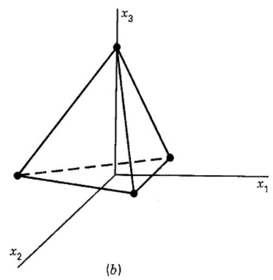  
图 11.19 单纯形设计：（a）$k=2$；（b）$k=3$

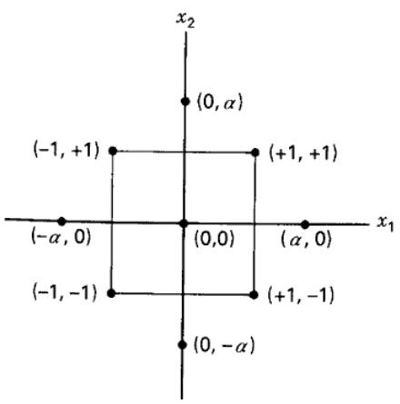

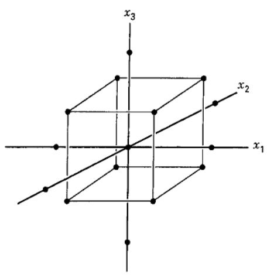  
图 11.20 两因子与三因子的中心复合设计

实践中，CCD 经常通过序贯试验形成，如例 11.1 和例 11.2：先用 $2^k$ 设计拟合一阶模型，发现失拟后，再增补轴点，以便在模型中加入二次项。CCD 对拟合二阶模型非常有效。需要指定的两个设计参数是轴点到设计中心的距离 $\alpha$ 和中心点数 $n_C$。下面讨论这两个参数的选择。

**可旋转性。** 二阶模型应在整个关注区域内提供良好的预测。一种衡量“良好”的方式是要求关注点 $\mathbf x$ 处预测响应的方差具有合理的一致性和稳定性。由式（10.40），点 $\mathbf x$ 处的预测响应方差为

$$
V [ \hat {y} (\mathbf {x}) ] = \sigma^ {2} \mathbf {x} ^ {\prime} (\mathbf {X} ^ {\prime} \mathbf {X}) ^ {- 1} \mathbf {x}\tag{11.15}
$$

Box 和 Hunter（1957）建议二阶响应面设计应具有**可旋转性**，即所有与设计中心距离相同的点 $\mathbf x$ 都具有相同的 $V[\hat y(\mathbf x)]$。换言之，预测响应方差在同一球面上保持不变。

图 11.21 给出了例 11.2 中用 CCD 拟合二阶模型时 $\sqrt{V[\hat y(\mathbf x)]}$ 的等值线。预测响应标准差的等值线是同心圆。当设计绕中心 $(0,0,\ldots,0)$ 旋转时，具有此性质的设计不会改变 $\hat y$ 的方差，因此称为可旋转设计。

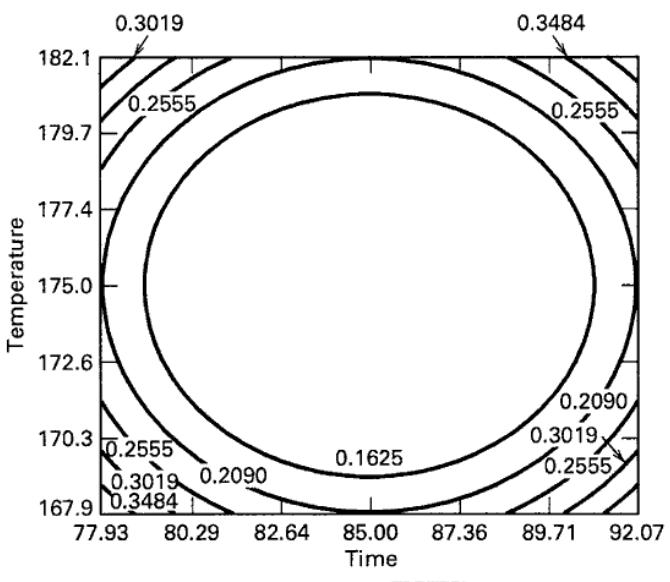  
（a）$\sqrt{V[\hat y(\mathbf x)]}$ 的等值线

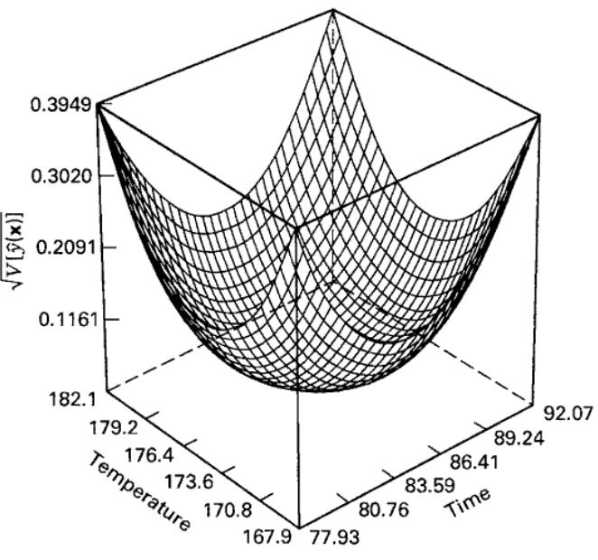  
（b）响应面图
图 11.21 例 11.2 中可旋转 CCD 的预测响应标准差等值线

可旋转性是选择响应面设计的合理依据。响应面方法的目的是优化，而试验前并不知道最优点的位置，因此使用在各个方向上提供相同估计精度的设计是合理的。（可以证明，任何正交一阶设计都具有可旋转性。）

通过选择 $\alpha$，可以使中心复合设计具有可旋转性。所需 $\alpha$ 取决于设计中析因部分的点数；具体而言，取 $\alpha=n_F^{1/4}$ 即可得到可旋转 CCD，其中 $n_F$ 为析因部分所用的点数。

**球形 CCD。** 可旋转性是一种球面性质，因此关注区域为球形时，这一设计准则最有意义。不过，良好设计并不一定要严格满足可旋转性。对于球形关注区域，从预测方差角度看，CCD 最好的选择是 $\alpha=\sqrt{k}$。这种设计称为**球形 CCD**，所有析因点和轴点都位于半径为 $\sqrt{k}$ 的球面上。进一步讨论见 Myers、Montgomery 和 Anderson-Cook（2016）。

**CCD 中的中心点试验。** CCD 中 $\alpha$ 的选择主要取决于关注区域。当区域为球形时，必须包含中心点试验，以使预测响应方差较为稳定。通常建议安排三至五次中心点试验。

**Box–Behnken 设计。** Box 和 Behnken（1960）提出了一些拟合响应面的三水平设计。它们由 $2^k$ 析因设计与不完全区组设计组合而成，通常在试验次数方面非常有效，并且具有可旋转性或近似可旋转性。

表 11.8 给出了三变量 Box–Behnken 设计，其几何形式见图 11.22。该设计属于球形设计，除中心点外，各点均位于半径为 $\sqrt2$ 的球面上。此外，它不包含由各变量上下限确定的立方体区域的顶点。当这些角点对应的因子组合成本过高，或因实际过程约束而无法试验时，这可能是一个优点。

表 11.8
三变量 Box–Behnken 设计

<table><tr><td>试验</td><td>$x_{1}$</td><td>$x_{2}$</td><td>$x_{3}$</td></tr><tr><td>1</td><td>-1</td><td>-1</td><td>0</td></tr><tr><td>2</td><td>-1</td><td>1</td><td>0</td></tr><tr><td>3</td><td>1</td><td>-1</td><td>0</td></tr><tr><td>4</td><td>1</td><td>1</td><td>0</td></tr><tr><td>5</td><td>-1</td><td>0</td><td>-1</td></tr><tr><td>6</td><td>-1</td><td>0</td><td>1</td></tr><tr><td>7</td><td>1</td><td>0</td><td>-1</td></tr><tr><td>8</td><td>1</td><td>0</td><td>1</td></tr><tr><td>9</td><td>0</td><td>-1</td><td>-1</td></tr><tr><td>10</td><td>0</td><td>-1</td><td>1</td></tr><tr><td>11</td><td>0</td><td>1</td><td>-1</td></tr><tr><td>12</td><td>0</td><td>1</td><td>1</td></tr><tr><td>13</td><td>0</td><td>0</td><td>0</td></tr><tr><td>14</td><td>0</td><td>0</td><td>0</td></tr><tr><td>15</td><td>0</td><td>0</td><td>0</td></tr></table>

**立方体关注区域。** 在许多场合，关注区域是立方体而不是球体。此时，一种有用的 CCD 变形是**面心中心复合设计**，也称面心立方体设计，其中 $\alpha=1$。轴点位于立方体各面的中心，$k=3$ 的情形见图 11.23。由于每个因子只需三个水平，而实际中改变因子水平往往比较困难，因此也常采用这种设计。不过，面心 CCD 不具有可旋转性。

面心立方体设计所需中心点少于球形 CCD。在实践中，$n_C=2$ 或 3 即可在整个试验区域内提供良好的预测方差。有时也会增加中心点次数，以便合理估计试验误差。图 11.24 给出了 $k=3$、$n_C=3$ 时面心立方体设计的预测标准差 $\sqrt{V[\hat y(\mathbf x)]}$。可以看到，它在相当大的设计空间内较为均匀。

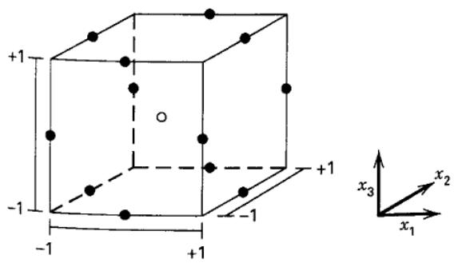  
图 11.22 三因子 Box–Behnken 设计

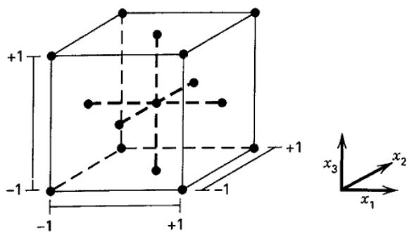  
图 11.23 三因子面心中心复合设计

（a）响应面
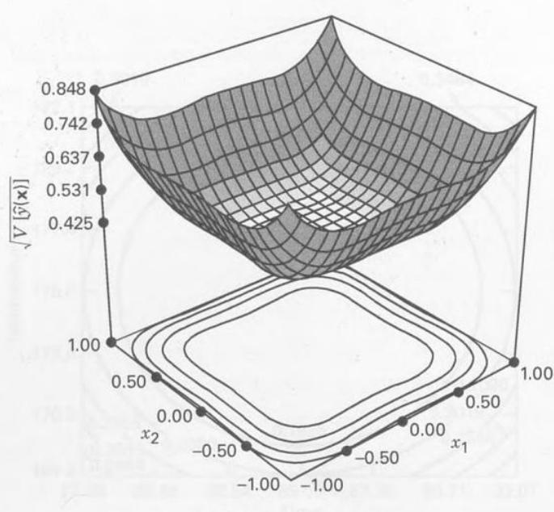

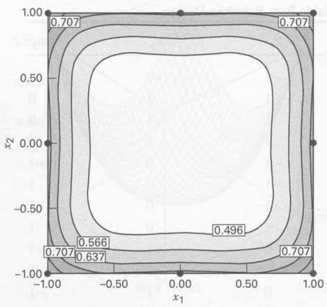  
（b）等高线图
图 11.24 $k=3$、$n_C=3$、$x_3=0$ 时面心立方体设计的预测响应标准差 $\sqrt{V[\hat y(\mathbf x)]}$

**其他设计。** 还有许多响应面设计在实践中偶尔有用。对两个变量，可以采用在圆周上等间距布点、构成正多边形的设计。由于各设计点与原点等距，这类安排常称为**等半径设计**。

当 $k=2$ 时，将圆周上等间距分布的 $n_2\ge5$ 个点与圆心处的 $n_1\ge1$ 个点组合，即可得到可旋转等半径设计。尤其有用的是图 11.25 中的正五边形和正六边形设计。另一种选择是**小型复合设计**，它由立方体内分辨度为 III* 的部分析因设计（主效应与二因子交互作用混杂，但二因子交互作用彼此不混杂）、通常的轴点和中心点构成。需要减少试验次数时，这种设计可能有吸引力，但其预测方差性质不如 CCD。

表 11.9 给出了三因子小型复合设计。立方体部分采用标准 $2^3$ 二分之一实施，因为它满足分辨度 III* 的要求。设计包含四个立方体点、六个轴点，并至少需要一个中心点。因此最少需要 $N=11$ 次试验，而三变量二阶模型有 $p=10$ 个待估参数，从试验次数角度看相当有效。

图 11.25 两变量等半径设计：（a）正六边形；（b）正五边形

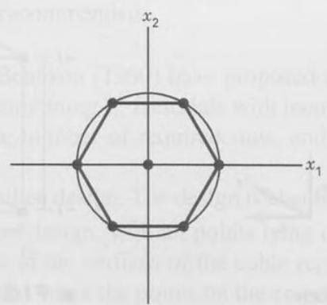  
（a）

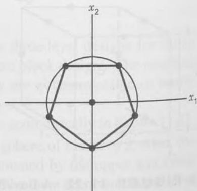  
（b）

表 11.9
三因子小型复合设计

<table><tr><td>标准顺序</td><td>$x_{1}$</td><td>$x_{2}$</td><td>$x_{3}$</td></tr><tr><td>1</td><td>1.00</td><td>1.00</td><td>-1.00</td></tr><tr><td>2</td><td>1.00</td><td>-1.00</td><td>1.00</td></tr><tr><td>3</td><td>-1.00</td><td>1.00</td><td>1.00</td></tr><tr><td>4</td><td>-1.00</td><td>-1.00</td><td>-1.00</td></tr><tr><td>5</td><td>-1.73</td><td>0.00</td><td>0.00</td></tr><tr><td>6</td><td>1.73</td><td>0.00</td><td>0.00</td></tr><tr><td>7</td><td>0.00</td><td>-1.73</td><td>0.00</td></tr><tr><td>8</td><td>0.00</td><td>1.73</td><td>0.00</td></tr><tr><td>9</td><td>0.00</td><td>0.00</td><td>-1.73</td></tr><tr><td>10</td><td>0.00</td><td>0.00</td><td>1.73</td></tr><tr><td>11</td><td>0.00</td><td>0.00</td><td>0.00</td></tr><tr><td>12</td><td>0.00</td><td>0.00</td><td>0.00</td></tr><tr><td>13</td><td>0.00</td><td>0.00</td><td>0.00</td></tr><tr><td>14</td><td>0.00</td><td>0.00</td><td>0.00</td></tr></table>

表 11.9 的设计安排了 $n_C=4$ 次中心点试验。由于小型复合设计无法做成可旋转设计，取 $\alpha=1.73$，使其成为球形设计。
当减少试验次数很重要时，**混合设计**是另一种选择。表 11.10 给出了三因子混合设计。部分设计采用不规则水平，可能限制实际应用。不过，这些设计规模很小，并具有优良的预测方差性质。关于小型复合设计和混合设计的更多内容，见 Myers、Montgomery 和 Anderson-Cook（2016）。

**响应面设计的图形评价。** 响应面设计最常用于建立预测模型，因此式（11.15）定义的预测方差在设计评价和比较中十分重要。图 11.21 和图 11.24 这样的预测方差（或其平方根，即预测标准差）的二维等高线图、三维响应面图有一定价值。但对于 $k$ 因子设计，图中只能显示两个因子，其余 $k-2$ 个因子必须固定，因此无法完整显示预测方差在设计空间内的分布。第 6.7 节介绍的设计空间比例图（FDS），以及 Giovannitti-Jensen 和 Myers（1989）提出的方差分散图（VDG），能够解决这一问题。

表 11.10
三因子混合设计

<table><tr><td>标准顺序</td><td>$x_{1}$</td><td>$x_{2}$</td><td>$x_{3}$</td></tr><tr><td>1</td><td>0.00</td><td>0.00</td><td>1.41</td></tr><tr><td>2</td><td>0.00</td><td>0.00</td><td>-1.41</td></tr><tr><td>3</td><td>-1.00</td><td>-1.00</td><td>0.71</td></tr><tr><td>4</td><td>1.00</td><td>-1.00</td><td>0.71</td></tr><tr><td>5</td><td>-1.00</td><td>1.00</td><td>0.71</td></tr><tr><td>6</td><td>1.00</td><td>1.00</td><td>0.71</td></tr><tr><td>7</td><td>1.41</td><td>0.00</td><td>-0.71</td></tr><tr><td>8</td><td>-1.41</td><td>0.00</td><td>-0.71</td></tr><tr><td>9</td><td>0.00</td><td>1.41</td><td>-0.71</td></tr><tr><td>10</td><td>0.00</td><td>-1.41</td><td>-0.71</td></tr><tr><td>11</td><td>0.00</td><td>0.00</td><td>0.00</td></tr></table>

VDG 显示特定设计和响应模型的最小、最大及平均预测方差随设计点到区域中心距离的变化。距离（半径）通常从零（设计中心）变化到 $\sqrt{k}$，后者是球形设计中最远设计点到中心的距离。通常绘制的是尺度化预测方差（SPV）：

$$
\frac {N V [ \hat {y} (\mathbf {x}) ]}{\sigma^ {2}} = N \mathbf {x} ^ {\prime} (\mathbf {X} ^ {\prime} \mathbf {X}) ^ {- 1} \mathbf {x}\tag{11.16}
$$

即在 VDG 上绘制上述量。SPV 等于式（11.15）的预测方差乘以设计的试验次数 $N$，再除以误差方差 $\sigma^2$。除以 $\sigma^2$ 可以消去未知参数，而乘以 $N$ 通常便于比较不同规模的设计。

图 11.26a 是三变量、四次中心点试验的可旋转 CCD 的 VDG。由于设计可旋转，所有距设计中心相同距离的点，其最小、最大和平均 SPV 都相同。

图 11.26 方差分散图：（a）$k=3$、$\alpha=1.68$ 的 CCD（四次中心点试验）；（b）$k=3$、$\alpha=1.732$ 的 CCD（四次中心点试验）

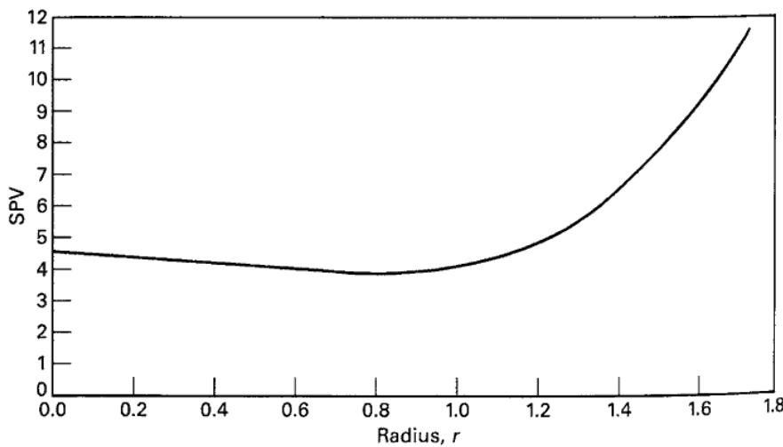  
（a）

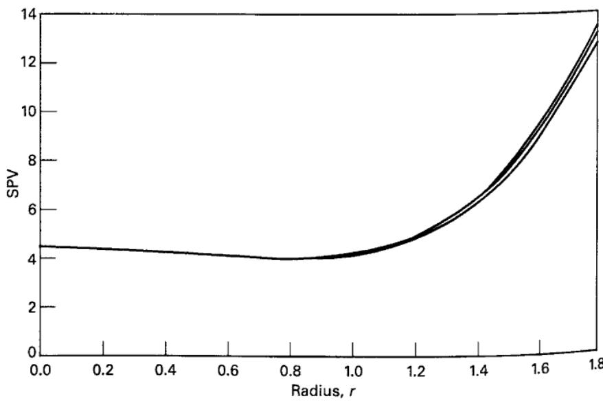  
（b）

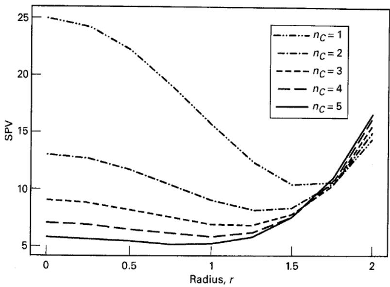

图 11.27 $k=4$、$\alpha=2$ 时 CCD 的方差分散图

因此 VDG 只有一条曲线。图中清楚显示了 SPV 在设计空间内的变化：半径约为 1.2 以内，方差基本保持恒定；此后直到设计边界，方差不断增大。图 11.26b 是三变量、四次中心点试验的球形 CCD 的 VDG。其最小、最大和平均 SPV 三条曲线差别很小，说明可旋转形式与球形形式在实际中几乎没有差别。

图 11.27 是四因子可旋转 CCD 的 VDG，中心点数由 $n_C=1$ 变到 $n_C=5$。图中清楚表明，中心点过少时，预测方差分布很不稳定；增加中心点后，预测方差会迅速稳定。四至五次中心点试验可在整个设计区域内提供较稳定的预测方差。VDG 已用于研究响应面设计中中心点次数的影响，本章前面的建议部分基于这些研究。

## 11.4.3 响应面设计中的区组安排

使用响应面设计时，经常需要通过区组安排消除干扰变量的影响。例如，由一阶设计序贯扩充为二阶设计时就可能出现这一问题，如例 11.1 和例 11.2。实施一阶设计与实施二阶模型所需增补试验之间可能相隔较长时间，试验条件也可能发生变化，因此需要分区组。

如果响应面设计划分为若干区组后，区组效应不影响响应面模型的参数估计，则称设计能够**正交分区组**。如果采用 $2^k$ 或 $2^{k-p}$ 设计作为一阶响应面设计，可用第 7 章的方法将试验安排在 $2^r$ 个区组内，中心点应均匀分配给各区组。

二阶设计要正交分区组，必须满足两个条件。若第 $b$ 个区组有 $n_b$ 次观测，则条件为：

1. 每个区组都必须是一阶正交设计，即

$$
\sum_ {u = 1} ^ {n _ {b}} x _ {i u} x _ {j u} = 0 \quad i \neq j = 0, 1, \dots , k \quad \text{对所有} b
$$

其中 $x_{iu}$ 和 $x_{ju}$ 为第 $u$ 次试验中第 $i$ 和第 $j$ 个变量的水平，且对所有 $u$ 都有 $x_{0u}=1$。

2. 每个区组对各变量总平方和的贡献比例，必须等于该区组观测数占总观测数的比例，即

$$
\frac {\sum_ {u = 1} ^ {n _ {b}} x _ {i u} ^ {2}}{\sum_ {u = 1} ^ {N} x _ {i u} ^ {2}} = \frac {n _ {b}}{N} \quad i = 1, 2, \ldots , k \quad \text{对所有} b
$$

其中 $N$ 为设计的总试验次数。

以两个变量、$N=12$ 次试验的可旋转 CCD 为例，说明这些条件的应用。设计矩阵中 $x_1$ 和 $x_2$ 的水平为

$$
\mathrm{D} = \left[ \begin{array}{c c} x _ {1} & x _ {2} \\ - 1 & - 1 \\ 1 & - 1 \\ - 1 & 1 \\ 1 & 1 \\ 0 & 0 \\ 0 & 0 \\ 1.414 & 0 \\ - 1.414 & 0 \\ 0 & 1.414 \\ 0 & - 1.414 \\ 0 & 0 \\ 0 & 0 \end{array} \right] 
$$

上述矩阵前六行为区组 1，后六行为区组 2。设计被安排在两个区组中：第一个区组为析因部分加两个中心点，第二个区组为轴点加另外两个中心点。显然，两个区组都是一阶正交设计，满足条件 1。检查条件 2 时，先考虑第一个区组，注意到

$$
\sum_ {u = 1} ^ {n _ {1}} x _ {1 u} ^ {2} = \sum_ {u = 1} ^ {n _ {1}} x _ {2 u} ^ {2} = 4
$$

$$
\sum_ {u = 1} ^ {N} x _ {1 u} ^ {2} = \sum_ {u = 1} ^ {N} x _ {2 u} ^ {2} = 8 \quad \text{且} \quad n _ {1} = 6
$$

因此

$$
\frac {\sum_ {u = 1} ^ {n _ {1}} x _ {i u} ^ {2}}{\sum_ {u = 1} ^ {n} x _ {i u} ^ {2}} = \frac {n _ {1}}{N}
$$

即

$$
\frac {4}{8} = \frac {6}{12}
$$

所以第一个区组满足条件 2。对第二个区组，有

$$
\sum_ {u = 1} ^ {n _ {2}} x _ {1 u} ^ {2} = \sum_ {u = 1} ^ {n _ {2}} x _ {2 u} ^ {2} = 4 \quad \text{且} \quad n _ {2} = 6
$$

因此

$$
\frac {\sum_ {u = 1} ^ {n _ {2}} x _ {i u} ^ {2}}{\sum_ {u = 1} ^ {N} x _ {i u} ^ {2}} = \frac {n _ {2}}{N}
$$

即

$$
\frac {4}{8} = \frac {6}{12}
$$

第二个区组也满足条件 2，所以该设计能够正交分区组。

一般而言，CCD 总能构造成两个正交区组：第一个区组含 $n_F$ 个析因点和 $n_{CF}$ 个中心点，第二个区组含 $n_A=2k$ 个轴点和 $n_{CA}$ 个中心点。无论 $\alpha$ 取何值，条件 1 总成立。要使条件 2 成立，必须有

$$
\frac {\sum_ {u} ^ {n _ {2}} x _ {i u} ^ {2}}{\sum_ {u} ^ {n _ {1}} x _ {i u} ^ {2}} = \frac {n _ {A} + n _ {C A}}{n _ {F} + n _ {C F}}\tag{11.17}
$$

式（11.17）左边为 $2\alpha^2/n_F$。代入后，可求出实现正交分区组所需的 $\alpha$：

$$
\alpha = \left[ \frac {n _ {F} (n _ {A} + n _ {C A})}{2 (n _ {F} + n _ {C F})} \right] ^ {1 / 2}\tag{11.18}
$$

这一 $\alpha$ 一般不能同时保证设计可旋转或为球形。如果还要求设计可旋转，则 $\alpha=n_F^{1/4}$，并有

$$
(n _ {F}) ^ {1 / 2} = \frac {n _ {F} (n _ {A} + n _ {C A})}{2 (n _ {F} + n _ {C F})}\tag{11.19}
$$

并非总能找到严格满足式（11.19）的设计。例如，当 $k=3$、$n_F=8$、$n_A=6$ 时，式（11.19）化为

$$
\begin{array}{r} (8) ^ {1 / 2} = \frac {8 (6 + n _ {C A})}{2 (8 + n _ {C F})} \\ 2.83 = \frac {48 + 8 n _ {C A}}{16 + 2 n _ {C F}} \end{array}
$$

不可能找到严格满足此式的 $n_{CA}$ 和 $n_{CF}$。不过，若取 $n_{CF}=3$、$n_{CA}=2$，则右边为

$$
\frac {48 + 8 (2)}{16 + 2 (3)} = 2.91
$$

因而设计近似正交分区组。在实际中，可以适当放宽可旋转性或正交分区组的要求，而不会造成明显的信息损失。

CCD 的区组安排十分灵活。如果 $k$ 足够大，析因部分可划分为两个或更多区组。（析因区组数必须为 2 的幂，轴点部分单独构成一个区组。）表 11.11 给出了若干有用的 CCD 区组安排。

表 11.11
若干能够正交分区组的可旋转或近似可旋转中心复合设计

<table><tr><td>k</td><td>2</td><td>3</td><td>4</td><td>5</td><td>$5\frac{1}{2}$  Rep.</td><td>6</td><td>$6\frac{1}{2}$  Rep.</td><td>7</td><td>$7\frac{1}{2}$  Rep.</td></tr><tr><td colspan="10">析因区组</td></tr><tr><td>$n_F$</td><td>4</td><td>8</td><td>16</td><td>32</td><td>16</td><td>64</td><td>32</td><td>128</td><td>64</td></tr><tr><td>区组数</td><td>1</td><td>2</td><td>2</td><td>4</td><td>1</td><td>8</td><td>2</td><td>16</td><td>8</td></tr><tr><td>各区组点数</td><td>4</td><td>4</td><td>8</td><td>8</td><td>16</td><td>8</td><td>16</td><td>8</td><td>8</td></tr><tr><td>各区组中心点数</td><td>3</td><td>2</td><td>2</td><td>2</td><td>6</td><td>1</td><td>4</td><td>1</td><td>1</td></tr><tr><td>各区组总点数</td><td>7</td><td>6</td><td>10</td><td>10</td><td>22</td><td>9</td><td>20</td><td>9</td><td>9</td></tr><tr><td colspan="10">轴点区组</td></tr><tr><td>$n_A$</td><td>4</td><td>6</td><td>8</td><td>10</td><td>10</td><td>12</td><td>12</td><td>14</td><td>14</td></tr><tr><td>$n_{CA}$</td><td>3</td><td>2</td><td>2</td><td>4</td><td>1</td><td>6</td><td>2</td><td>11</td><td>4</td></tr><tr><td>轴点区组总点数</td><td>7</td><td>8</td><td>10</td><td>14</td><td>11</td><td>18</td><td>14</td><td>25</td><td>18</td></tr><tr><td>设计总点数 N</td><td>14</td><td>20</td><td>30</td><td>54</td><td>33</td><td>90</td><td>54</td><td>169</td><td>80</td></tr><tr><td colspan="10">α 值</td></tr><tr><td>正交分区组</td><td>1.4142</td><td>1.6330</td><td>2.0000</td><td>2.3664</td><td>2.0000</td><td>2.8284</td><td>2.3664</td><td>3.3333</td><td>2.8284</td></tr><tr><td>可旋转性</td><td>1.4142</td><td>1.6818</td><td>2.0000</td><td>2.3784</td><td>2.0000</td><td>2.8284</td><td>2.3784</td><td>3.3636</td><td>2.8284</td></tr></table>

分区组实施响应面设计时，方差分析有两点需要注意。第一，利用中心点估计纯误差时，只有同一区组中的中心点才可视为重复观测，因此只能在区组内部计算纯误差项。如果各区组的变异程度一致，可以合并这些纯误差估计。第二，关于区组效应：如果设计正交分为 $m$ 个区组，则区组平方和为

$$
SS _ {\text{区组}} = \sum_ {b = 1} ^ {m} \frac {B _ {b} ^ {2}}{n _ {b}} - \frac {G ^ {2}}{N}\tag{11.20}
$$

其中 $B_b$ 为第 $b$ 个区组 $n_b$ 次观测的总和，$G$ 为全部 $m$ 个区组中 $N$ 次观测的总和。区组并非严格正交时，可以采用第 10 章介绍的一般回归显著性检验，即附加平方和方法。

## 11.4.4 响应面的最优设计

前面讨论的标准响应面设计，如 CCD、Box–Behnken 设计及其变形（例如面心立方体设计），因通用性和灵活性较好而得到广泛应用。如果试验区域是立方体或球体，通常可采用标准响应面设计。但有时标准设计并非显然适合，此时可以考虑最优设计。

如前所述，以下几种情形适合考虑计算机生成的设计。

1. **不规则试验区域。** 如果关注区域不是立方体或球体，标准设计可能不是最佳选择。不规则区域经常出现。例如，研究某种胶黏剂的性质时，先将胶黏剂涂在两个零件上，再在高温下固化。关注的两个因子为胶黏剂用量与固化温度。若其范围按通常方式编码为 $-1$ 至 $+1$，试验者知道用量过少且温度过低时，零件不能充分黏合。这导致设计变量的约束，例如

$$
- 1.5 \leq x _ {1} + x _ {2}
$$

其中 $x_1$ 表示胶黏剂用量，$x_2$ 表示温度。如果温度过高且用量过大，零件可能因热应力受损，或黏合效果不佳。因此还存在另一个因子水平约束：

$$
x _ {1} + x _ {2} \leq 1
$$

图 11.28 给出了这些约束形成的试验区域。约束实际上截去了正方形的两个角，形成不规则区域（这类区域有时称为“凹陷罐形”区域）。没有一种标准响应面设计恰好适应该区域。

2. **非标准模型。** 试验者通常选择一阶或二阶响应面模型，并认识到这种经验模型只是对真实机制的近似。不过，对过程的特殊知识或认识有时可能提示采用非标准模型。例如，可能关注下列模型：

$$
\begin{array}{r} y = \beta_ {0} + \beta_ {1} x _ {1} + \beta_ {2} x _ {2} + \beta_ {12} x _ {1} x _ {2} + \beta_ {11} x _ {1} ^ {2} + \beta_ {22} x _ {2} ^ {2} \\ + \beta_ {112} x _ {1} ^ {2} x _ {2} + \beta_ {1112} x _ {1} ^ {3} x _ {2} + \epsilon \end{array}
$$

此时希望找到能够有效拟合这一简化四阶模型的设计。另一个例子是某些设计因子为分类变量的响应面问题；这类情形没有现成的标准响应面设计〔分类变量的讨论见 Myers、Montgomery 和 Anderson-Cook（2009）〕。

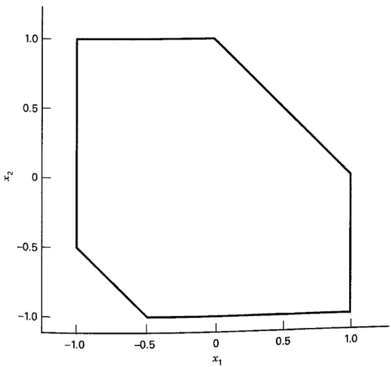  
图 11.28 两变量的受约束设计区域

3. **特殊的试验次数要求。** 有时需要减少标准响应面设计的试验次数。例如，为四个变量拟合二阶模型时，CCD 根据中心点数需要 28～30 次试验，但模型只有 15 个项。如果每次试验非常昂贵或耗时，就希望采用更少的试验。计算机生成设计可以用于这一目的，但也有其他方法。例如，含四次中心点试验的四因子小型复合设计只需 20 次试验，还有仅需 16 次的混合设计。这些选择可能比专门用计算机生成设计减少次数更合适。

常用的设计最优性准则有若干种，其中最广泛使用的可能是 **D 最优准则**。如果设计使

$$
| (\mathbf {X} ^ {\prime} \mathbf {X}) ^ {- 1} |
$$

达到最小，则称其为 D 最优设计。D 最优设计使回归系数向量的联合置信区域体积最小。按 D 准则，设计 1 相对于设计 2 的效率为

$$
D _ {e} = \left(\frac {| (\mathbf {X} _ {2} ^ {\prime} \mathbf {X} _ {2}) ^ {- 1} |}{| (\mathbf {X} _ {1} ^ {\prime} \mathbf {X} _ {1}) ^ {- 1} |}\right) ^ {1 / p}\tag{11.21}
$$

其中 $\mathbf X_1$ 和 $\mathbf X_2$ 为两个设计的模型矩阵，$p$ 为模型参数数目。JMP、Design-Expert 和 Minitab 等常用软件均可构造 D 最优设计。

**A 最优准则**只考虑回归系数的方差。如果设计使 $(\mathbf X'\mathbf X)^{-1}$ 的主对角线元素之和最小，则为 A 最优设计。这个和称为矩阵的迹，通常记为 $\operatorname{tr}[(\mathbf X'\mathbf X)^{-1}]$。因此，A 最优设计使回归系数方差之和最小。

由于很多响应面试验关注响应预测，预测方差准则具有很大的实际意义。其中常用的是 **G 最优准则**：若设计使整个设计区域内的最大尺度化预测方差最小，则称为 G 最优设计。即使下式在设计区域内的最大值达到最小：

$$
\frac {N V [ \hat {y} (\mathbf {x}) ]}{\sigma^ {2}}
$$

其中 $N$ 为设计点数。预测方差公式中的向量应为包含截距及全部模型项的回归向量 $\mathbf f(\mathbf x)$；原书沿用 $\mathbf x$ 作为简写。如果模型有 $p$ 个参数，则设计的 G 效率为

$$
G _ {e} = \frac {p}{\max \frac {N V [ \hat {y} (\mathbf {x}) ]}{\sigma^ {2}}}\tag{11.22}
$$

**V 准则**考虑设计区域内一组关注点 $\mathbf x_1,\mathbf x_2,\ldots,\mathbf x_m$ 处的预测方差。这组点可以是选择设计时的候选点集，也可以是对试验者有特定意义的其他点集。使这 $m$ 个点的平均预测方差最小的设计称为 V 最优设计。

如第 6.7 节所述，除了计算设计空间中有限点集的预测方差，还可计算整个设计空间上的平均方差或积分方差：

$$
I = \frac {1}{A} \int_ {R} V [ \hat {y} (\mathbf {x}) ] d \mathbf {x}
$$

其中 $R$ 为设计区域，$A$ 为区域体积。这是第 6 章 I 准则的更一般形式。I 准则有时也称 IV 准则或 Q 准则。JMP 可以构造 I 最优设计。

一般认为，D 准则最适合一阶设计，因为它关注参数估计，而参数估计在通常采用一阶模型的筛选问题中十分重要。G 和 I 准则侧重预测，因此更适合用于二阶模型；二阶模型常用于优化，良好的预测性质对优化至关重要。I 准则比 G 准则更容易实现，已有多种软件支持。

一种设计构造方法基于**点交换算法**。最简单的形式是：试验者先指定候选点网格，再从中选择一个初始设计（可能随机选择）；随后，用网格中未被选入设计的点替换现有设计点，以改进选定的最优性准则。由于并未明确评价所有可能设计，不能保证找到真正的最优设计，但通常可得到接近最优的设计。结果也受候选点网格的影响。有些实现会从不同初始设计出发，重复构造多次，以提高最终设计接近最优的可能性。

另一种方法是**坐标交换算法**。它反复搜索初始设计中每个点的各个坐标，直到最优性准则不再改善。通常重复运行多次，每次从随机生成的初始设计开始。坐标交换通常比点交换有效得多，是许多软件采用的标准方法。

以形成图 11.28 不规则试验区域的胶黏剂试验说明这些思想。假设响应为拉脱力，希望拟合二阶模型。图 11.29a 给出了内接于该区域的 CCD，含四个中心点，共 12 次试验。它不具有可旋转性，但已是该空间内能容纳的最大 CCD。其 $|(\mathbf X'\mathbf X)^{-1}|=1.852\times10^{-2}$，矩阵的迹为 6.375。图中还给出了假定 $\sigma=1$ 时预测响应标准差的等值线，图 11.29b 为相应的响应面图。

图 11.30a 和表 11.12 给出了用 Design-Expert 生成的 12 次试验 D 最优设计，其 $|(\mathbf X'\mathbf X)^{-1}|=2.153\times10^{-4}$。按 D 准则，它明显优于内接 CCD。内接 CCD 相对于 D 最优设计的效率为

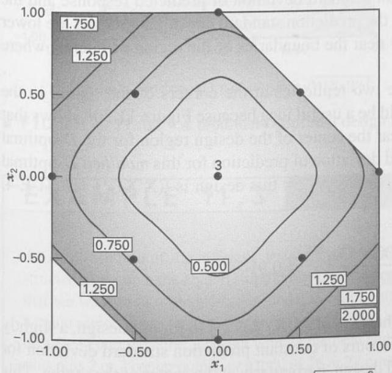  
（a）设计及 $\sqrt{V[\hat y(\mathbf x)]/\sigma^2}$ 的等值线

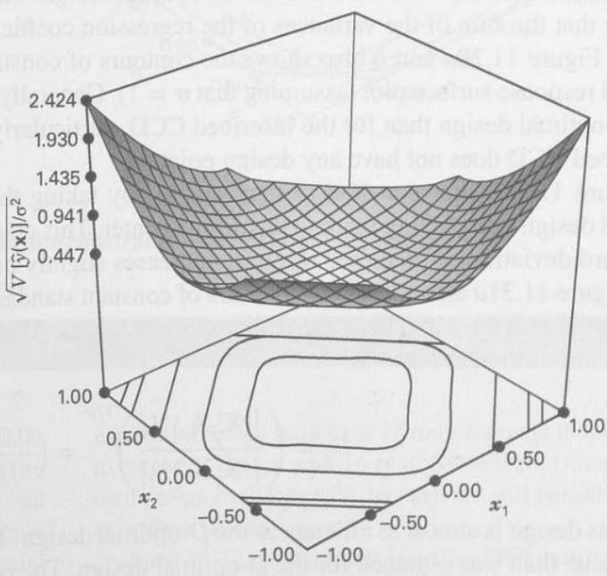  
（b）响应面图
图 11.29 图 11.28 受约束区域中的内接中心复合设计

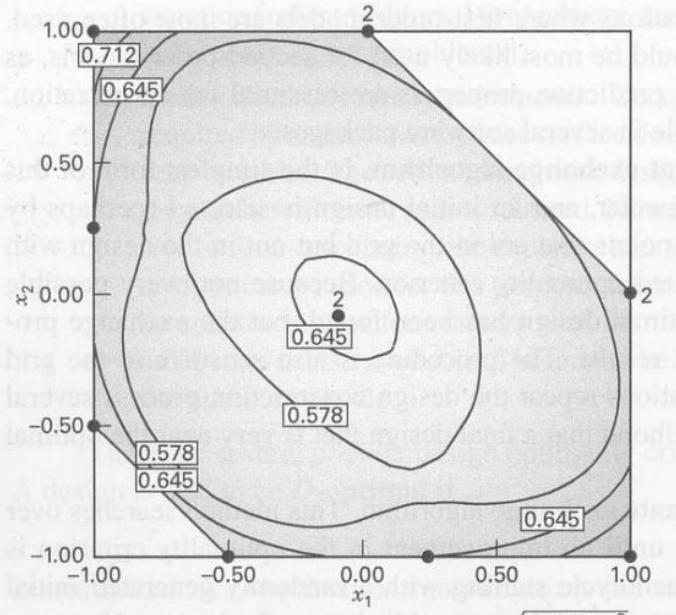  
（a）设计及 $\sqrt{V[\hat y(\mathbf x)]/\sigma^2}$ 的等值线

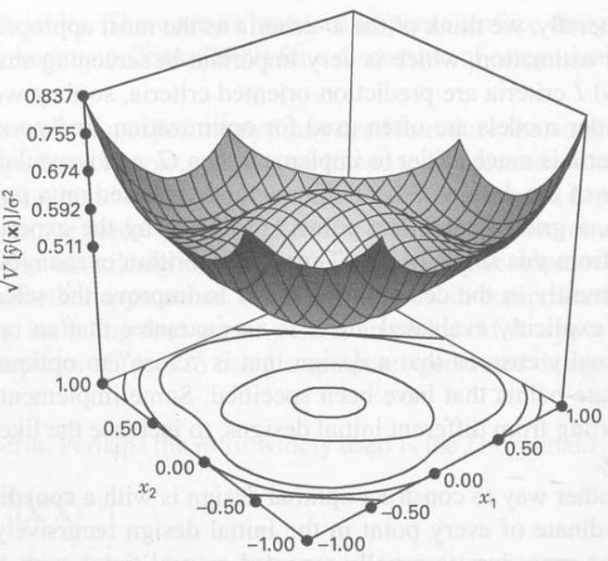  
（b）响应面图
图 11.30 图 11.28 受约束区域的 D 最优设计

$$
D _ {e} = \left(\frac {\left| (\mathbf {X} _ {2} ^ {\prime} \mathbf {X} _ {2}) ^ {- 1} \right|}{\left| (\mathbf {X} _ {1} ^ {\prime} \mathbf {X} _ {1}) ^ {- 1} \right|}\right) ^ {1 / p} = \left(\frac {0.0002153}{0.01852}\right) ^ {1 / 6} = 0.476
$$

即内接 CCD 的效率仅为 D 最优设计的 47.6%。这意味着 CCD 需要重复 $1/0.476=2.1$ 次（约两次），才能达到 D 最优设计相同的回归系数估计精度。D 最优设计的矩阵迹为 2.516，表明回归系数方差之和明显小于 CCD。图 11.30a、b 还给出了假定 $\sigma=1$ 时的预测响应标准差等值线及相应响应面。总体而言，D 最优设计的预测标准差低于内接 CCD，特别是在内接 CCD 没有设计点的关注区域边界附近。

图 11.31a 给出了第三种设计：将 D 最优设计区域角点上的两次重复移到设计中心。图 11.30b 显示 D 最优设计在区域中心附近的预测标准差略有增加，因此这种调整可能有用。图 11.31a 给出了修改后设计的预测标准差等值线，图 11.31b 为响应面图。该设计的 D 准则值为 $|(\mathbf X'\mathbf X)^{-1}|=3.71\times10^{-4}$，相对效率为

$$
D _ {e} = \left(\frac {| (\mathbf {X} _ {2} ^ {\prime} \mathbf {X} _ {2}) ^ {- 1} |}{| (\mathbf {X} _ {1} ^ {\prime} \mathbf {X} _ {1}) ^ {- 1} |}\right) ^ {1 / p} = \left(\frac {0.0002153}{0.000371}\right) ^ {1 / 6} = 0.91
$$

因此，它几乎与 D 最优设计同样有效。其矩阵迹为 2.448，略小于 D 最优设计。目测预测标准差等值线，其表现至少不逊于 D 最优设计，尤其是在区域中心。这说明评价设计十分必要：决定采用计算机生成的设计之前，应仔细检查其性质。

表 11.12
图 11.28 受约束区域的 D 最优设计

<table><tr><td>标准顺序</td><td>$x_{1}$</td><td>$x_{2}$</td></tr><tr><td>1</td><td>-0.50</td><td>-1.00</td></tr><tr><td>2</td><td>1.00</td><td>0.00</td></tr><tr><td>3</td><td>-0.08</td><td>-0.08</td></tr><tr><td>4</td><td>-1.00</td><td>1.00</td></tr><tr><td>5</td><td>1.00</td><td>-1.00</td></tr><tr><td>6</td><td>0.00</td><td>1.00</td></tr><tr><td>7</td><td>-1.00</td><td>0.25</td></tr><tr><td>8</td><td>0.25</td><td>-1.00</td></tr><tr><td>9</td><td>-1.00</td><td>-0.50</td></tr><tr><td>10</td><td>1.00</td><td>0.00</td></tr><tr><td>11</td><td>0.00</td><td>1.00</td></tr><tr><td>12</td><td>-0.08</td><td>-0.08</td></tr></table>

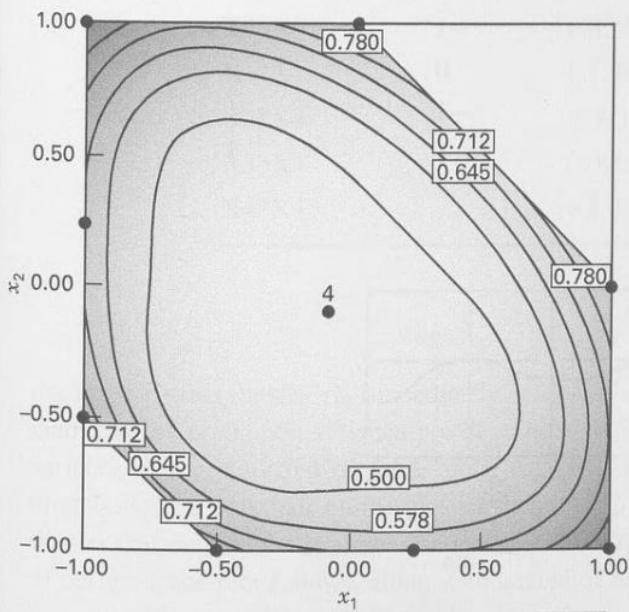  
（a）设计及 $\sqrt{V[\hat y(\mathbf x)]/\sigma^2}$ 的等值线

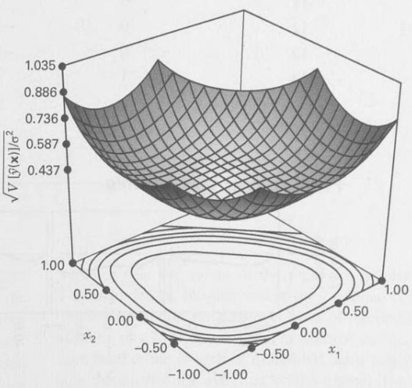  
（b）响应面图
图 11.31 图 11.28 受约束区域的修改 D 最优设计

## 例 11.3

为说明 D 与 I 最优准则能够构造怎样不同的设计，假设希望在立方体区域中拟合四因子二阶模型。标准选择是面心立方体设计，包含 24 次析因与轴点试验，再加两至三个中心点，共 26 或 27 次。四因子二阶模型有 15 个参数，因此最小设计需要 15 次试验。假定希望采用 16 次试验的设计；由于没有相应的标准设计，因此考虑最优设计。

表 11.13 是 JMP 定制设计工具生成 D 最优设计的输出，采用坐标交换算法。设计矩阵下方是预测方差剖面图，显示四个方向上的预测响应方差。图中的十字定位线设在使预测方差最大的坐标处。之后依次给出 FDS 图和模型系数的相对方差表，即系数方差除以 $\sigma^2$。

表 11.13
D 最优设计

<table><tr><td colspan="5">设计矩阵</td></tr><tr><td>试验</td><td>X1</td><td>X2</td><td>X3</td><td>X4</td></tr><tr><td>1</td><td>1</td><td>1</td><td>1</td><td>1</td></tr><tr><td>2</td><td>1</td><td>-1</td><td>-1</td><td>1</td></tr><tr><td>3</td><td>1</td><td>1</td><td>-1</td><td>-1</td></tr><tr><td>4</td><td>-1</td><td>-1</td><td>1</td><td>-1</td></tr><tr><td>5</td><td>1</td><td>-1</td><td>1</td><td>-1</td></tr><tr><td>6</td><td>0</td><td>0</td><td>0</td><td>-1</td></tr><tr><td>7</td><td>0</td><td>0</td><td>1</td><td>0</td></tr><tr><td>8</td><td>0</td><td>1</td><td>-1</td><td>1</td></tr><tr><td>9</td><td>-1</td><td>1</td><td>-1</td><td>-1</td></tr><tr><td>10</td><td>-1</td><td>-1</td><td>-1</td><td>1</td></tr><tr><td>11</td><td>0</td><td>1</td><td>1</td><td>-1</td></tr><tr><td>12</td><td>0</td><td>-1</td><td>1</td><td>1</td></tr><tr><td>13</td><td>0</td><td>-1</td><td>-1</td><td>-1</td></tr><tr><td>14</td><td>1</td><td>1</td><td>0</td><td>0</td></tr><tr><td>15</td><td>1</td><td>0</td><td>-1</td><td>1</td></tr><tr><td>16</td><td>-1</td><td>1</td><td>1</td><td>1</td></tr></table>

预测方差剖面图
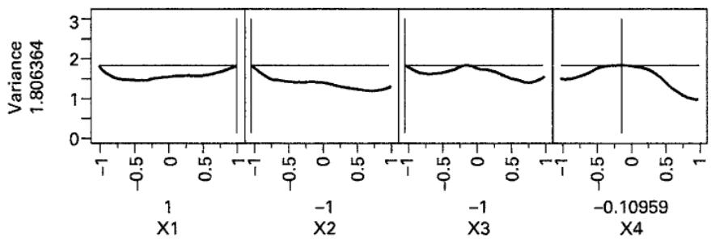

设计空间比例图
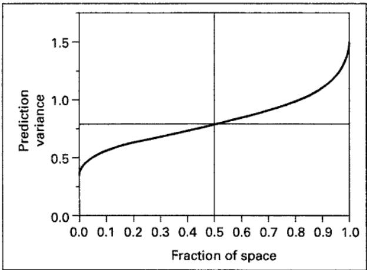

表 11.13（续）

<table><tr><td colspan="2">系数相对方差</td></tr><tr><td>效应</td><td>方差</td></tr><tr><td>截距</td><td>0.909</td></tr><tr><td>X1</td><td>0.115</td></tr><tr><td>X2</td><td>0.092</td></tr><tr><td>X3</td><td>0.088</td></tr><tr><td>X4</td><td>0.088</td></tr><tr><td>X1*X1</td><td>0.319</td></tr><tr><td>X1*X2</td><td>0.124</td></tr><tr><td>X2*X2</td><td>0.591</td></tr><tr><td>X1*X3</td><td>0.120</td></tr><tr><td>X2*X3</td><td>0.093</td></tr><tr><td>X3*X3</td><td>0.839</td></tr><tr><td>X1*X4</td><td>0.120</td></tr><tr><td>X2*X4</td><td>0.093</td></tr><tr><td>X3*X4</td><td>0.090</td></tr><tr><td>X4*X4</td><td>0.839</td></tr></table>

表 11.14 是 JMP 生成的 16 次试验 I 最优设计输出，也包含最大预测方差对应的剖面图、FDS 图和系数相对方差表。两种设计有几个重要差别：D 最优设计的最大预测方差较小（1.806 对 2.818），但 FDS 图表明 I 最优设计在区域中心附近的方差较小。换言之，相比 D 最优设计，I 最优设计在大部分设计空间内具有较小的预测方差，因而积分方差或平均方差较小，但在区域极端位置的预测方差较大。I 最优设计的系数相对方差几乎都小于 D 最优设计。这并不矛盾：D 准则最小化的是系数联合置信区域的体积，I 准则则最小化平均预测方差。比较还说明，对于二阶模型或需要预测、优化的情形，I 准则通常更合适，因为它在大部分设计空间内的预测方差较小，仅在极端位置表现较差。

表 11.14 I 最优设计

<table><tr><td colspan="5">设计矩阵</td></tr><tr><td>试验</td><td>X1</td><td>X2</td><td>X3</td><td>X4</td></tr><tr><td>1</td><td>0</td><td>1</td><td>1</td><td>1</td></tr><tr><td>2</td><td>0</td><td>1</td><td>-1</td><td>-1</td></tr><tr><td>3</td><td>-1</td><td>-1</td><td>0</td><td>-1</td></tr><tr><td>4</td><td>1</td><td>-1</td><td>-1</td><td>0</td></tr><tr><td>5</td><td>-1</td><td>-1</td><td>-1</td><td>1</td></tr><tr><td>6</td><td>-1</td><td>1</td><td>0</td><td>1</td></tr><tr><td>7</td><td>-1</td><td>1</td><td>1</td><td>-1</td></tr><tr><td>8</td><td>-1</td><td>0</td><td>1</td><td>1</td></tr><tr><td>9</td><td>1</td><td>1</td><td>-1</td><td>1</td></tr><tr><td>10</td><td>1</td><td>-1</td><td>1</td><td>1</td></tr><tr><td>11</td><td>1</td><td>1</td><td>0</td><td>0</td></tr><tr><td>12</td><td>-1</td><td>0</td><td>-1</td><td>0</td></tr><tr><td>13</td><td>0</td><td>0</td><td>0</td><td>0</td></tr><tr><td>14</td><td>0</td><td>-1</td><td>1</td><td>0</td></tr><tr><td>15</td><td>0</td><td>0</td><td>0</td><td>1</td></tr><tr><td>16</td><td>1</td><td>0</td><td>1</td><td>-1</td></tr></table>

预测方差剖面图
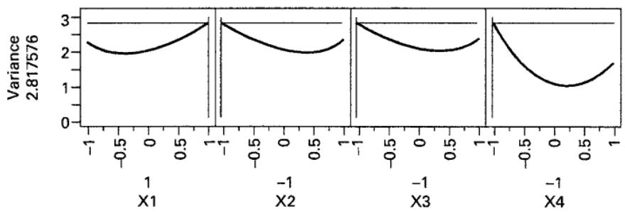

设计空间比例图
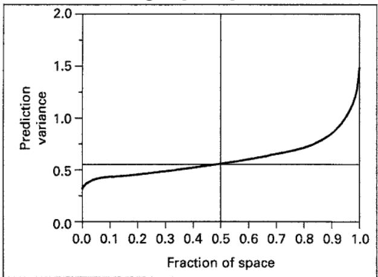

<table><tr><td colspan="2">系数相对方差</td></tr><tr><td>效应</td><td>方差</td></tr><tr><td>截距</td><td>0.508</td></tr><tr><td>X1</td><td>0.118</td></tr><tr><td>X2</td><td>0.118</td></tr><tr><td>X3</td><td>0.118</td></tr><tr><td>X4</td><td>0.121</td></tr><tr><td>X1*X1</td><td>0.379</td></tr><tr><td>X1*X2</td><td>0.174</td></tr><tr><td>X2*X2</td><td>0.379</td></tr><tr><td>X1*X3</td><td>0.174</td></tr><tr><td>X2*X3</td><td>0.174</td></tr><tr><td>X3*X3</td><td>0.379</td></tr><tr><td>X1*X4</td><td>0.186</td></tr><tr><td>X2*X4</td><td>0.186</td></tr><tr><td>X3*X4</td><td>0.186</td></tr><tr><td>X4*X4</td><td>0.399</td></tr></table>

## 确定性筛选设计

Jones 和 Nachtsheim（2011）提出了一类适用于定量因子、可用最优设计算法构造的响应面设计，称为**确定性筛选设计**（DSD）。它们规模较小，能够有效筛选较多因子，也能在不增加试验的情况下估计二阶效应，因此可视为“一步响应面设计”。表 11.15 给出其一般结构。

对于 $m$ 个因子，设计由 $m$ 对折叠试验和一个总体中心点组成，共 $2m+1$ 次。除中心点外，每次试验恰有一个因子取中心水平，其余取极端水平。这些设计具有以下性质：

1. 试验次数仅比因子数的两倍多一次，因此规模很小。
2. 主效应与二因子交互作用完全独立；无论交互作用是否纳入模型，活跃二因子交互作用都不使主效应估计产生偏倚。
3. 二因子交互作用之间不完全混杂，但可能相关。
4. 在仅由线性和纯二次主效应项组成的模型中，可以估计所有纯二次效应。
5. 纯二次效应与主效应正交，与交互作用可能相关，但不完全混杂。
6. 当因子数为六个或更多时，能够以很高统计效率估计涉及任意三个或更少因子的完整二次模型。

**表 11.15** $m$ 因子确定性筛选设计的一般结构

<table><tr><td rowspan="2">折叠对</td><td rowspan="2">试验（i）</td><td colspan="5">因子水平</td></tr><tr><td>$x_{i,1}$</td><td>$x_{i,2}$</td><td>$x_{i,3}$</td><td>...</td><td>$x_{i,m}$</td></tr><tr><td rowspan="2">1</td><td>1</td><td>0</td><td>±1</td><td>±1</td><td>...</td><td>±1</td></tr><tr><td>2</td><td>0</td><td>∓1</td><td>∓1</td><td>...</td><td>∓1</td></tr><tr><td rowspan="2">2</td><td>3</td><td>±1</td><td>0</td><td>±1</td><td>...</td><td>±1</td></tr><tr><td>4</td><td>∓1</td><td>0</td><td>∓1</td><td>...</td><td>∓1</td></tr><tr><td rowspan="2">3</td><td>5</td><td>±1</td><td>±1</td><td>0</td><td>...</td><td>±1</td></tr><tr><td>6</td><td>∓1</td><td>∓1</td><td>0</td><td>...</td><td>∓1</td></tr><tr><td>⋮</td><td>⋮</td><td>⋮</td><td>⋮</td><td>⋮</td><td>..</td><td>⋮</td></tr><tr><td rowspan="2">m</td><td>2m - 1</td><td>±1</td><td>±1</td><td>±1</td><td>...</td><td>0</td></tr><tr><td>2m</td><td>∓1</td><td>∓1</td><td>∓1</td><td>...</td><td>0</td></tr><tr><td>中心点</td><td>2m + 1</td><td>0</td><td>0</td><td>0</td><td>...</td><td>0</td></tr></table>

这些设计在用于筛选的分辨度 III 部分实施与小型响应面设计之间提供了很好的折中，也可能利用一次试验的结果直接从筛选转向优化。Jones 和 Nachtsheim 采用此前开发的最小混杂设计优化技术找到这些设计〔见 Jones 和 Nachtsheim（2011a）〕。该算法在约束 D 效率的条件下，使混杂矩阵各元素的平方和最小。图 11.32 给出了 4～12 因子的设计。

确定性筛选设计（DSD）也可以由**会议矩阵**构造〔见 Xiao、Lin 和 Bai（2012）〕。会议矩阵 $\mathbf C$ 是一个 $n\times n$ 矩阵，对角线元素为零，非对角线元素均为 $\pm1$，并满足 $\mathbf C'\mathbf C=(n-1)\mathbf I$，即其交叉乘积矩阵为单位矩阵的倍数。会议矩阵最初源于电话通信问题，用于通过理想变压器构造理想的电话会议网络，并以矩阵表示这些网络；它也有其他应用。

六阶会议矩阵为

$$
\left( \begin{array}{c c c c c c} 0 & + 1 & + 1 & + 1 & + 1 & + 1 \\ + 1 & 0 & + 1 & - 1 & - 1 & + 1 \\ + 1 & + 1 & 0 & + 1 & - 1 & - 1 \\ + 1 & - 1 & + 1 & 0 & + 1 & - 1 \\ + 1 & - 1 & - 1 & + 1 & 0 & + 1 \\ + 1 & + 1 & - 1 & - 1 & + 1 & 0 \end{array} \right)
$$

将此会议矩阵各行折叠，再在末尾增加一行零，即可得到 13 次试验的六因子 DSD。一般而言，若 $\mathbf C$ 为 $n$ 阶会议矩阵，则 $n$ 因子的确定性筛选设计矩阵为

$$
\mathbf {D} = \left[ \begin{array}{c} \mathbf {C} \\ - \mathbf {C} \\ \mathbf {0} \end{array} \right]
$$

其中 $\mathbf0$ 为 $1\times n$ 零行向量，总试验次数为 $2n+1$。

DSD 原本用于连续因子，但可以修改以包含两水平分类变量。过程很简单：先按连续因子构造通常的 DSD，但增加两行零而不是一行。然后将分类因子列中的零改为 $+1$ 或 $-1$。对增加的两行零，第一行所有分类因子均设为 $-1$。

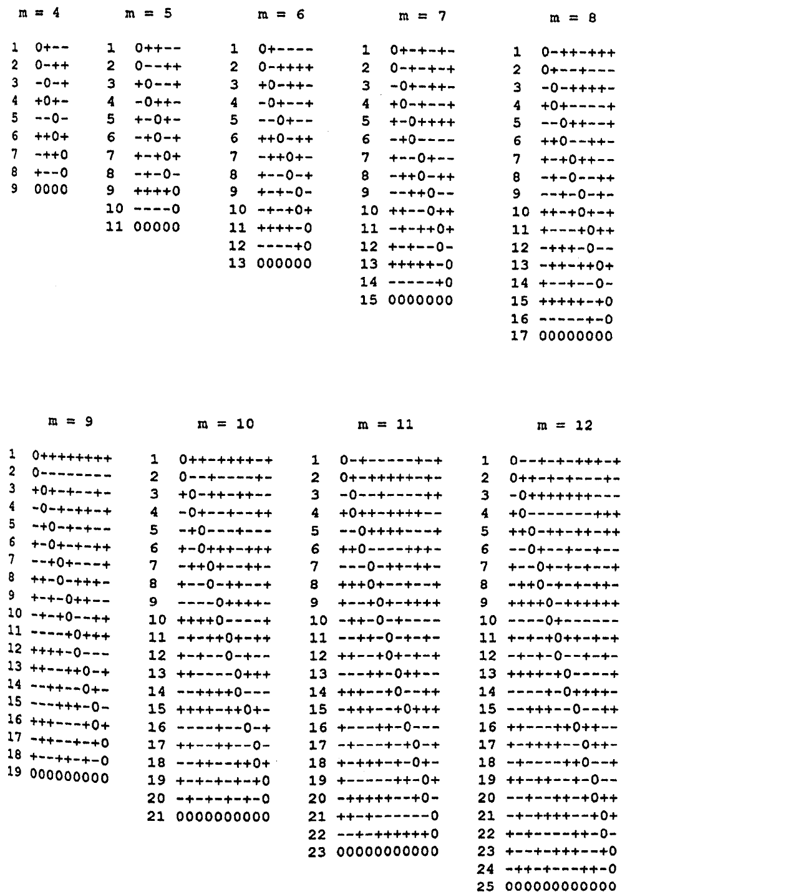

**图 11.32** 4～12 因子的确定性筛选设计。

第二行均设为 $+1$。对于会议矩阵及其折叠部分中的零，相应因子在第一行设为 $-1$，折叠行设为 $+1$。

例如，考虑四个连续因子与两个分类因子的 DSD。六因子 DSD 加上两行零后如下：

<table><tr><td>A</td><td>B</td><td>C</td><td>D</td><td>E</td><td>F</td></tr><tr><td>0</td><td>+1</td><td>+1</td><td>+1</td><td>+1</td><td>+1</td></tr><tr><td>+1</td><td>0</td><td>+1</td><td>-1</td><td>-1</td><td>+1</td></tr><tr><td>+1</td><td>+1</td><td>0</td><td>+1</td><td>-1</td><td>-1</td></tr><tr><td>+1</td><td>-1</td><td>+1</td><td>0</td><td>+1</td><td>-1</td></tr><tr><td>+1</td><td>-1</td><td>-1</td><td>+1</td><td>0</td><td>+1</td></tr><tr><td>+1</td><td>+1</td><td>-1</td><td>-1</td><td>+1</td><td>0</td></tr><tr><td>0</td><td>-1</td><td>-1</td><td>-1</td><td>-1</td><td>-1</td></tr><tr><td>-1</td><td>0</td><td>-1</td><td>+1</td><td>+1</td><td>-1</td></tr><tr><td>-1</td><td>-1</td><td>0</td><td>-1</td><td>+1</td><td>+1</td></tr><tr><td>-1</td><td>+1</td><td>-1</td><td>0</td><td>-1</td><td>+1</td></tr><tr><td>-1</td><td>+1</td><td>+1</td><td>-1</td><td>0</td><td>-1</td></tr><tr><td>-1</td><td>-1</td><td>+1</td><td>+1</td><td>-1</td><td>0</td></tr><tr><td>0</td><td>0</td><td>0</td><td>0</td><td>0</td><td>0</td></tr><tr><td>0</td><td>0</td><td>0</td><td>0</td><td>0</td><td>0</td></tr></table>

将最后两列的零改为 $\pm1$，即可得到分类变量 $E$ 和 $F$。设计为

<table><tr><td>A</td><td>B</td><td>C</td><td>D</td><td>E</td><td>F</td></tr><tr><td>0</td><td>+1</td><td>+1</td><td>+1</td><td>+1</td><td>+1</td></tr><tr><td>+1</td><td>0</td><td>+1</td><td>-1</td><td>-1</td><td>+1</td></tr><tr><td>+1</td><td>+1</td><td>0</td><td>+1</td><td>-1</td><td>-1</td></tr><tr><td>+1</td><td>-1</td><td>+1</td><td>0</td><td>+1</td><td>-1</td></tr><tr><td>+1</td><td>-1</td><td>-1</td><td>+1</td><td>-1</td><td>+1</td></tr><tr><td>+1</td><td>+1</td><td>-1</td><td>-1</td><td>+1</td><td>-1</td></tr><tr><td>0</td><td>-1</td><td>-1</td><td>-1</td><td>-1</td><td>-1</td></tr><tr><td>-1</td><td>0</td><td>-1</td><td>+1</td><td>+1</td><td>-1</td></tr><tr><td>-1</td><td>-1</td><td>0</td><td>-1</td><td>+1</td><td>+1</td></tr><tr><td>-1</td><td>+1</td><td>-1</td><td>0</td><td>-1</td><td>+1</td></tr><tr><td>-1</td><td>+1</td><td>+1</td><td>-1</td><td>+1</td><td>-1</td></tr><tr><td>-1</td><td>-1</td><td>+1</td><td>+1</td><td>-1</td><td>+1</td></tr><tr><td>0</td><td>0</td><td>0</td><td>0</td><td>-1</td><td>-1</td></tr><tr><td>0</td><td>0</td><td>0</td><td>0</td><td>+1</td><td>+1</td></tr></table>

按上述方式加入两水平分类变量后，这些变量的主效应与其他因子存在一定相关，但相关程度很小。

DSD 也可以构造为正交区组。步骤如下：

1. 按仅含连续因子的构造步骤进行，但增加的零行数等于区组数。将设计按标准顺序排列。

2. 将第一对折叠试验分配到第一个区组，第二对分配到第二个区组，依次类推；到最后一个区组后，从第一个区组重新开始循环分配。

3. 将各次中心点试验分别分配到不同区组。

例如，考虑六因子、两个区组的 DSD。按标准顺序排列并增加两行零的设计如下：

<table><tr><td>A</td><td>B</td><td>C</td><td>D</td><td>E</td><td>F</td></tr><tr><td>0</td><td>+1</td><td>+1</td><td>+1</td><td>+1</td><td>+1</td></tr><tr><td>0</td><td>-1</td><td>-1</td><td>-1</td><td>-1</td><td>-1</td></tr><tr><td>+1</td><td>0</td><td>-1</td><td>+1</td><td>+1</td><td>-1</td></tr><tr><td>-1</td><td>0</td><td>+1</td><td>-1</td><td>-1</td><td>+1</td></tr><tr><td>+1</td><td>-1</td><td>0</td><td>-1</td><td>+1</td><td>+1</td></tr><tr><td>-1</td><td>+1</td><td>0</td><td>+1</td><td>-1</td><td>-1</td></tr><tr><td>+1</td><td>+1</td><td>-1</td><td>0</td><td>-1</td><td>+1</td></tr><tr><td>-1</td><td>-1</td><td>+1</td><td>0</td><td>+1</td><td>-1</td></tr><tr><td>+1</td><td>+1</td><td>+1</td><td>-1</td><td>0</td><td>-1</td></tr><tr><td>-1</td><td>-1</td><td>-1</td><td>+1</td><td>0</td><td>+1</td></tr><tr><td>+1</td><td>-1</td><td>+1</td><td>+1</td><td>-1</td><td>0</td></tr><tr><td>-1</td><td>+1</td><td>-1</td><td>-1</td><td>+1</td><td>0</td></tr><tr><td>0</td><td>0</td><td>0</td><td>0</td><td>0</td><td>0</td></tr><tr><td>0</td><td>0</td><td>0</td><td>0</td><td>0</td><td>0</td></tr></table>

然后按上述方法分区组：第一对折叠试验组成第一个区组，第二对组成第二个区组，依次交替，最后将两个零行分别分配到两个区组。最终设计如下：

<table><tr><td>区组</td><td>A</td><td>B</td><td>C</td><td>D</td><td>E</td><td>F</td></tr><tr><td>1</td><td>0</td><td>+1</td><td>+1</td><td>+1</td><td>+1</td><td>+1</td></tr><tr><td>1</td><td>0</td><td>-1</td><td>-1</td><td>-1</td><td>-1</td><td>-1</td></tr><tr><td>2</td><td>+1</td><td>0</td><td>-1</td><td>+1</td><td>+1</td><td>-1</td></tr><tr><td>2</td><td>-1</td><td>0</td><td>+1</td><td>-1</td><td>-1</td><td>+1</td></tr><tr><td>1</td><td>+1</td><td>-1</td><td>0</td><td>-1</td><td>+1</td><td>+1</td></tr><tr><td>1</td><td>-1</td><td>+1</td><td>0</td><td>+1</td><td>-1</td><td>-1</td></tr><tr><td>2</td><td>+1</td><td>+1</td><td>-1</td><td>0</td><td>-1</td><td>+1</td></tr><tr><td>2</td><td>-1</td><td>-1</td><td>+1</td><td>0</td><td>+1</td><td>-1</td></tr><tr><td>1</td><td>+1</td><td>+1</td><td>+1</td><td>-1</td><td>0</td><td>-1</td></tr><tr><td>1</td><td>-1</td><td>-1</td><td>-1</td><td>+1</td><td>0</td><td>+1</td></tr><tr><td>2</td><td>+1</td><td>-1</td><td>+1</td><td>+1</td><td>-1</td><td>0</td></tr><tr><td>2</td><td>-1</td><td>+1</td><td>-1</td><td>-1</td><td>+1</td><td>0</td></tr><tr><td>1</td><td>0</td><td>0</td><td>0</td><td>0</td><td>0</td><td>0</td></tr><tr><td>2</td><td>0</td><td>0</td><td>0</td><td>0</td><td>0</td><td>0</td></tr></table>
