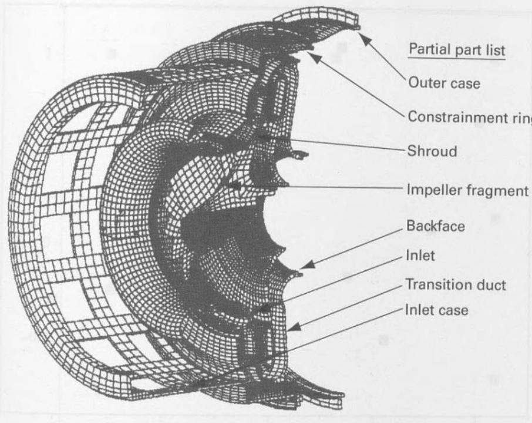
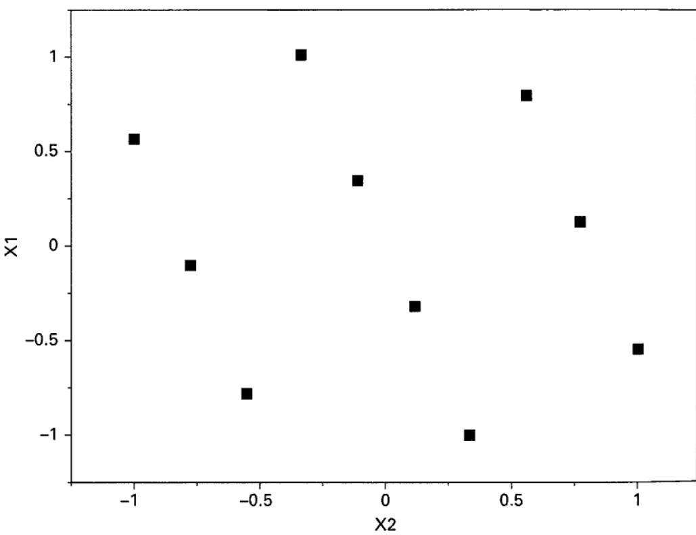
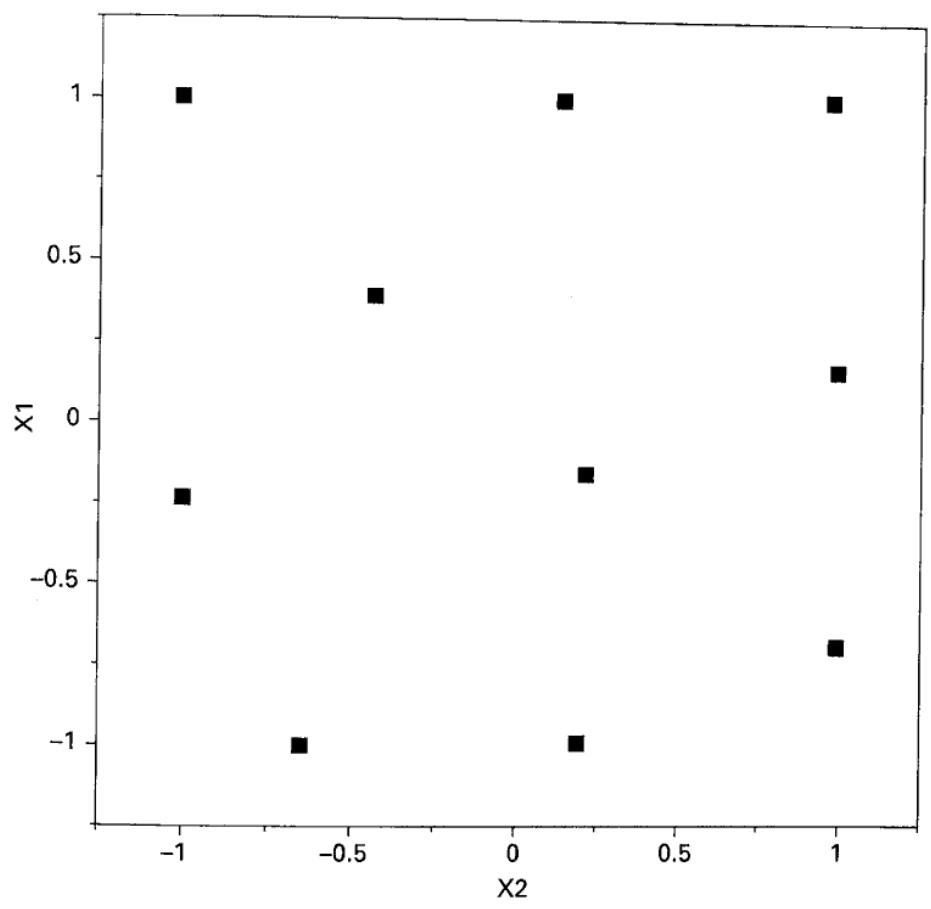
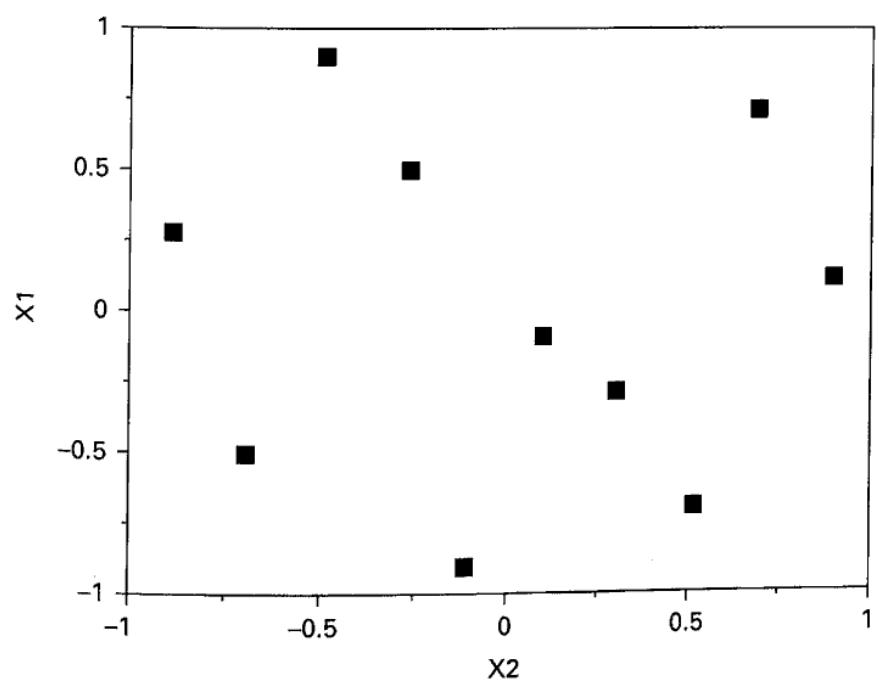
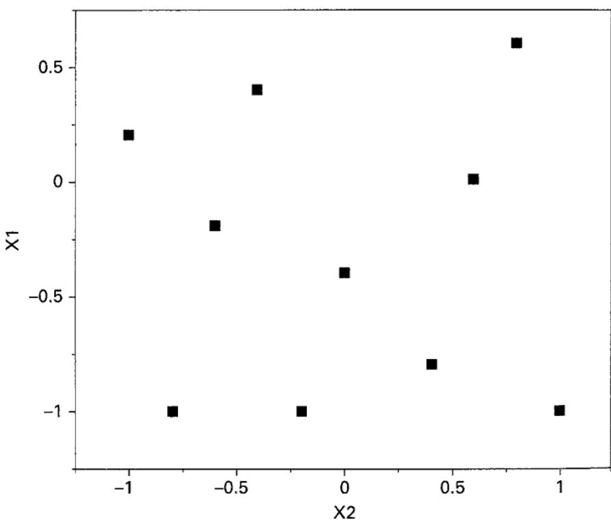
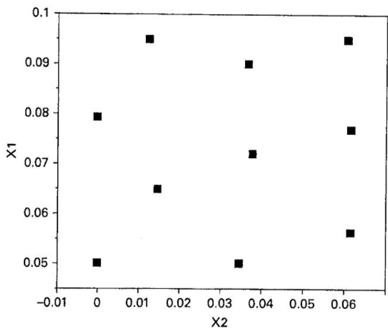
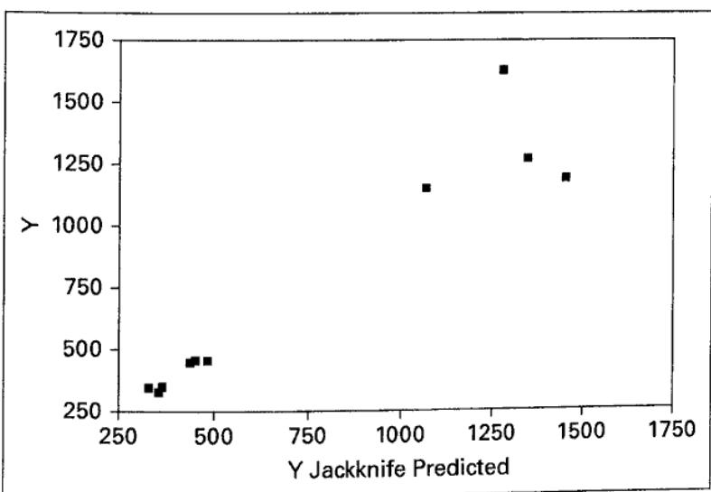
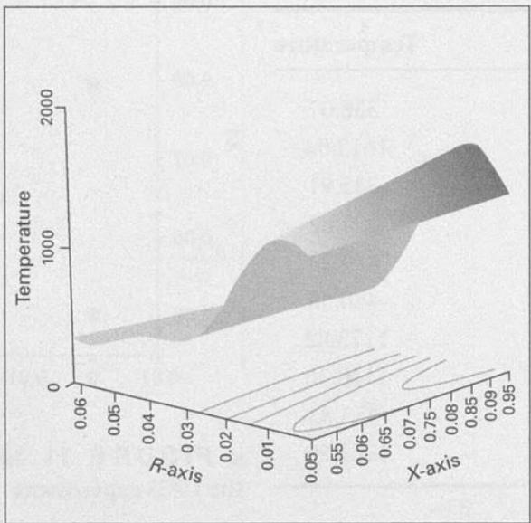

# 11.5 计算机模型试验

通常想到的试验设计应用对象是物理过程，例如半导体制造中的化学气相沉积、波峰焊或机械加工。不过，试验设计也可以成功应用于物理系统的计算机仿真模型。在这种应用中，利用试验设计所得数据为计算机仿真所描述的系统建立一个**元模型**，然后对元模型进行优化。其前提是：如果计算机仿真模型忠实地代表真实系统，则对模型的优化能够合理确定真实系统的最优条件。

仿真模型一般分为随机模型和确定性模型。在**随机仿真模型**中，输出响应是随机变量。例如，半导体行业的工厂规划与调度模型、土木工程师使用的交通流仿真，以及通过从概率分布中抽样来研究没有直接解析解的复杂数学现象的蒙特卡洛仿真，都属于这一类。有时输出呈时间序列形式。标准试验设计方法常可用于随机仿真输出，尽管也已发展出许多专门技术。有时还会采用高于通常二次响应面模型的多项式。

在**确定性仿真模型**中，输出响应不是随机变量，而是完全由计算机模型所依据的数学模型决定的量；这些数学模型往往非常复杂。工程师和科学家常将确定性仿真作为计算机辅助设计工具。典型例子包括电子电路与半导体器件的电路仿真、机械与结构设计的有限元分析，以及流体动力学等物理现象的计算模型。这些模型通常很复杂，运行需要大量计算资源和时间。

以设计能够包容失效压气机转子碎片的涡轮发动机为例，说明有限元模型的应用。许多因子会影响设计，如发动机运行条件，以及周围零件的位置、尺寸和材料性质。图 11.33 是典型压气机包容模型的剖面图。每个部件都有许多可能重要的参数，包括厚度、材料类型和几何特征（弯曲半径、螺栓孔尺寸与位置、加强筋或角撑等）；这些既是工程设计参数，也可能作为响应面模型的试验因子。可见，潜在重要因子很多，而且很多效应的方向未知。例如，提高背面轴向刚度（如增加过渡管厚度）可能有助于校正转子碎片姿态，使其在包容结构中心撞击；但过高刚度也可能使碎片偏转过度，避开主要包容结构。根据经验，工程师可能确信只有少量潜在因子对包容失效部件的性能有显著影响。需要详细分析或测试，才能确定重要因子并量化其效应。制造一台发动机原型的成本经常超过一百万美元，因此研究这些因子时



图 11.33 涡轮发动机压气机包容分析的有限元模型及部分零件清单

采用计算机模型很有吸引力，这类模型称为有限元分析模型。用它模拟一次包容事件需要大量计算。图 11.33 的模型包含十多万个单元，模拟 2 毫秒事件约需 90 小时计算时间，而往往需要模拟长达 10 毫秒的事件。显然，减少试验或仿真次数十分必要，因此可以采用先筛选因子、再优化的典型方法。

响应面方法基于序贯试验思想，目的是在包含最优解的较小关注区域内，用低阶多项式近似响应。部分计算机试验研究者主张不同的思路：在设计变量更广的范围内，甚至整个可操作区域内，寻找逼近真实响应面的模型。如本节前面所述，这可能需要比通常一阶、二阶多项式复杂得多的模型〔例如 Barton（1992，1994）、Mitchell 和 Morris（1992），以及 Simpson 和 Peplinski（1997）〕。

计算机仿真试验的设计有一些有趣的选择。如果考虑多项式模型，可以选择 D 最优或 I 最优设计。近年来，计算机试验提出了多种**空间填充设计**。它们在整个试验区域内按某种意义近似均匀地分布设计点，因此通常被认为尤其适用于确定性计算机模型。当试验者不知道所需模型形式，并认为不同区域都可能出现值得研究的现象时，这种性质很理想。另外，大多数空间填充设计没有重复试验。对确定性模型，这是有利的，因为在一个设计点运行一次，就已获得该点响应的全部信息。许多空间填充设计即使删去部分因子并投影到低维空间，也不会产生重复点。

最早提出的空间填充设计是**拉丁超立方设计**〔McKay、Conover 和 Beckman（1979）〕。含 $n$ 次试验、$k$ 个因子的拉丁超立方是一个 $n\times k$ 矩阵，每列都是水平 $1,2,\ldots,n$ 的随机排列。JMP 可以生成这种设计。图 11.34 给出了 JMP 在 $[-1,+1]$ 区间生成的两因子、10 次试验拉丁超立方设计。

图 11.34 10 次试验的拉丁超立方设计



**球堆积设计**使所有点对之间的最小距离达到最大。Johnson、Moore 和 Ylvisaker（1990）提出了这类设计，也称最大最小距离设计。图 11.35 给出了 JMP 构造的两因子、10 次试验球堆积设计。



**图 11.35** 10 次试验的球堆积设计。

**均匀设计**由 Fang（1980）提出，其目标是使设计点如均匀分布样本一样均匀散布在区域内。已有多种构造算法和均匀性度量，可参阅 Fang、Li 和 Sudjianto（2006）。图 11.36 给出了 JMP 构造的两因子、10 次试验均匀设计。

**最大熵设计**由 Shewry 和 Wynn（1987）提出。熵可以理解为数据分布所包含信息量的一种度量。假设数据来自均值向量为 $\boldsymbol\mu$、协方差矩阵为 $\sigma^2\mathbf R(\boldsymbol\theta)$ 的正态分布，其中相关矩阵 $\mathbf R(\boldsymbol\theta)$ 的元素为

$$
r _ {i j} = e ^ {- \sum_ {s = 1} ^ {k} \theta_ {s} (x _ {i s} - x _ {j s}) ^ {2}}\tag{11.23}
$$

$r_{ij}$ 表示两个设计点响应之间的相关系数。最大熵设计使 $\mathbf R(\boldsymbol\theta)$ 的行列式最大。图 11.37 给出了 JMP 生成的两因子、10 次试验最大熵设计。

**高斯过程模型**常用于拟合确定性计算机试验数据。Sacks 等（1989）将其引入计算机试验。它能够精确拟合试验观测值，这是一个优点，但并不能保证在没有数据的位置具有良好的插值效果；也不能因此认为它就是响应与设计变量关系的真实模型。不过，模型的精确拟合性质，以及每个试验因子只需一个相关参数的特点，使其广受欢迎。高斯过程模型为

$$
y = \mu + z (\mathbf {x})
$$

其中 $z(\mathbf x)$ 是协方差矩阵为 $\sigma^2\mathbf R(\boldsymbol\theta)$ 的高斯随机过程，$\mathbf R(\boldsymbol\theta)$ 的元素由式（11.23）定义。高斯过程模型本质上是空间相关模型：两个观测响应之间的相关性

  
图 11.36 10 次试验的均匀设计

图 11.37 10 次试验的最大熵设计



随设计因子值之间的距离增大而减小。当设计点过于接近时，会导致高斯过程模型的数值病态，类似于线性回归中预测变量近似线性相关造成的多重共线性。参数 $\mu$ 和 $\theta_s$（$s=1,2,\ldots,k$）采用最大似然法估计。点 $\mathbf x$ 处的预测响应为

$$
\hat {y} (\mathbf {x}) = \hat {\mu} + \mathbf {r} ^ {\prime} (\mathbf {x}) \mathbf {R} (\hat {\pmb {\theta}}) ^ {- 1} (\mathbf {y} - \mathbf {j} \hat {\mu})
$$

其中 $\hat\mu$ 和 $\hat{\boldsymbol\theta}$ 为模型参数的最大似然估计，$\mathbf r'(\mathbf x)=[r(\mathbf x_1,\mathbf x),r(\mathbf x_2,\mathbf x),\ldots,r(\mathbf x_n,\mathbf x)]$。预测方程对原试验的每个设计点包含一个模型项。JMP 可以拟合高斯过程模型并进行预测。更多细节见 Santner、Williams 和 Notz（2003）；Jones 和 Johnson（2009）对计算机试验设计与高斯过程模型作了很好的综述。

## 例 11.4

使用计算流体动力学（CFD）模型研究喷气涡轮发动机尾流中不同位置的温度。两个设计因子为尾流中的位置坐标 $x$ 和 $y$，不过试验者将 $y$ 轴称为 $R$ 轴或径向轴。两轴均编码到 $[-1,+1]$ 区间，采用 10 次试验的球堆积设计。试验设计及相应条件下的 CFD 输出见表 11.16，设计图见图 11.38。

用 JMP 为温度数据拟合高斯过程模型，部分输出见表 11.17。“实际值对预测值”图采用刀切法计算预测值，即每次估计模型参数时剔除相应观测，再预测该观测。JMP 得到的预测模型见表 11.18，其中“X 轴”和“R 轴”表示待预测位置的坐标。

表 11.16
CFD 试验的球堆积设计及温度响应

<table><tr><td>X 轴</td><td>R 轴</td><td>温度</td></tr><tr><td>0.056</td><td>0.062</td><td>338.07</td></tr><tr><td>0.095</td><td>0.013</td><td>1613.04</td></tr><tr><td>0.077</td><td>0.062</td><td>335.91</td></tr><tr><td>0.095</td><td>0.061</td><td>327.82</td></tr><tr><td>0.090</td><td>0.037</td><td>449.23</td></tr><tr><td>0.072</td><td>0.038</td><td>440.58</td></tr><tr><td>0.064</td><td>0.015</td><td>1173.82</td></tr><tr><td>0.050</td><td>0.000</td><td>1140.36</td></tr><tr><td>0.050</td><td>0.035</td><td>453.83</td></tr><tr><td>0.079</td><td>0.000</td><td>1261.39</td></tr></table>

  
图 11.38 CFD 试验的球堆积设计

表 11.17

表 11.16 CFD 试验高斯过程模型的 JMP 输出

高斯过程

实际值对预测值图



<table><tr><td colspan="6">模型报告</td></tr><tr><td>列</td><td>θ</td><td>总敏感度</td><td>主效应</td><td>X 轴交互作用</td><td>R 轴交互作用</td></tr><tr><td>X 轴</td><td>65.40254</td><td>0.0349982</td><td>0.0141129</td><td></td><td>0.0208852</td></tr><tr><td>R 轴</td><td>3603.2483</td><td>0.9858871</td><td>0.9650018</td><td>0.0208852</td><td></td></tr><tr><td>Mu</td><td>σ</td><td></td><td></td><td></td><td></td></tr><tr><td>734.54584</td><td>212205.18</td><td></td><td></td><td></td><td></td></tr><tr><td colspan="2">-2 × 对数似然</td><td></td><td></td><td></td><td></td></tr><tr><td colspan="2">132.98004</td><td></td><td></td><td></td><td></td></tr></table>

```sql
TABLE 11.17 (Continued)
```

等高线剖面图



## 表 11.18

CFD 试验的 JMP 高斯过程预测模型

令 $x$、$r$ 为待预测位置的 X 轴、R 轴坐标，则原软件输出可整理为

$$
\hat y(x,r)=734.545842514493+\sum_{i=1}^{10}a_i\exp\left[-65.4025404276544(x-x_i)^2-3603.24827558717(r-r_i)^2\right].
$$

| $i$ | $a_i$ | $x_i$ | $r_i$ |
| --- | --- | --- | --- |
| 1 | -1943.3447961328 | 0.0560573769818389 | 0.0618 |
| 2 | 3941.78888206788 | 0.0947 | 0.0126487944665913 |
| 3 | 3488.57543918861 | 0.0765974898313444 | 0.0618 |
| 4 | -2040.39522592773 | 0.0947 | 0.0608005210868486 |
| 5 | -742.642897583584 | 0.0898402482375096 | 0.0367246615426894 |
| 6 | 519.91871208163 | 0.0717377150616494 | 0.0377241897055609 |
| 7 | -3082.85411601115 | 0.0644873310121405 | 0.0148210408248663 |
| 8 | 958.926988711818 | 0.0499 | 0 |
| 9 | 80.468182554262 | 0.0499 | 0.0347687447931648 |
| 10 | -1180.44117607546 | 0.0790747191607881 | 0 |

表 11.18 的原展开式有括号错误和两处小数点错位；上式按高斯核结构及表 11.16 的坐标恢复，并能在十个设计点重现所列温度（与两位小数数据的差小于 0.005）。[^1]


对响应面领域及更广泛工程界的研究者和实践者而言，计算机模型试验是一个相对较新且富有挑战的领域。在工程计算机模型中使用良好设计的试验来开展产品设计，可能有效提高工程设计与开发的生产率。统计计算机试验设计的相关参考文献包括 Barton（1992，1994）、McKay、Beckman 和 Conover（1979）、Simpson 和 Peplinski（1997）、Jones 和 Johnson（2009）、Kennedy、Silvestrini、Montgomery 和 Jones（2015），以及 Jones、Silvestrini、Montgomery 和 Steinberg（2015）。

[^1]: 译者注：原书第 5 项的 X 坐标印作 0.898402482375096，第 6 项的 R 坐标印作 0.377241897055609；根据设计表的小数范围、原数字顺序及插值复算，恢复为 0.0898402482375096 和 0.0377241897055609。
