# 11.6 混料试验

前面介绍的响应面设计适用于各因子水平可以独立变化的情形。在**混料试验**中，因子是混合物的组分，因此各水平并不独立。例如，若 $x_1,x_2,\ldots,x_p$ 表示混合物中 $p$ 个组分的比例，则

$$
0 \leq x _ {i} \leq 1 \quad i = 1, 2, \dots , p
$$

且

$$
x _ {1} + x _ {2} + \dots + x _ {p} = 1 \quad (\text{即}, 100 \text{百分比})
$$

图 11.39 分别展示了两组分和三组分时的约束。两组分设计的因子空间是线段 $x_1+x_2=1$，各组分均在 0～1 之间。三组分的混料空间是三角形，其顶点对应纯组分配方，即某一组分占 100%。

三组分混合物的受约束试验区域可方便地用三线坐标图表示，如图 11.40。三条边各表示缺少一个组分的混合物，该组分标在对面的顶点上。每个方向的九条网格线将相应组分按 10% 的增量划分。

单纯形设计用于研究混合物组分对响应变量的影响。$p$ 个组分的 $\{p,m\}$ **单纯形格点设计**按下述坐标设置布点：各组分比例取 0～1 之间 $m+1$ 个等间距值，

$$
x _ {i} = 0, \frac {1}{m}, \frac {2}{m}, \ldots , 1 \qquad i = 1, 2, \ldots , p\tag{11.24}
$$

并采用式（11.24）中比例的所有满足总和为 1 的组合。例如，令 $p=3$、$m=2$，则

$$
x _ {i} = 0, \frac {1}{2}, 1 \quad i = 1, 2, 3
$$

单纯形格点包含以下六次试验：

$$
(x _ {1}, x _ {2}, x _ {3}) = (1, 0, 0), (0, 1, 0), (0, 0, 1), \left(\frac {1}{2}, \frac {1}{2}, 0\right), \left(\frac {1}{2}, 0, \frac {1}{2}\right), \left(0, \frac {1}{2}, \frac {1}{2}\right)
$$

该设计见图 11.41。三个顶点 $(1,0,0)$、$(0,1,0)$ 和 $(0,0,1)$ 为纯组分，三条边中点 $(1/2,1/2,0)$、$(1/2,0,1/2)$ 和 $(0,1/2,1/2)$ 为二元混合物。图 11.41 还给出了 $\{3,3\}$、$\{4,2\}$ 和 $\{4,3\}$ 单纯形格点设计。一般而言，$\{p,m\}$ 单纯形格点设计的点数为

$$
N = \frac {(p + m - 1) !}{m ! (p - 1) !}
$$

另一种选择是**单纯形重心设计**。$p$ 组分设计有 $2^p-1$ 个点，包括 $(1,0,\ldots,0)$ 的 $p$ 种排列、$(1/2,1/2,0,\ldots,0)$ 的 $\binom p2$ 种排列、$(1/3,1/3,1/3,0,\ldots,0)$ 的 $\binom p3$ 种排列，依此类推，以及总体重心 $(1/p,1/p,\ldots,1/p)$。若干单纯形重心设计见图 11.42。

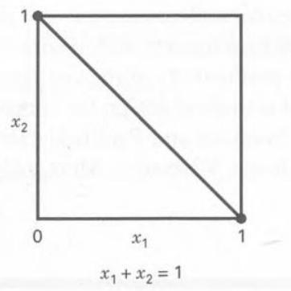  
（a）

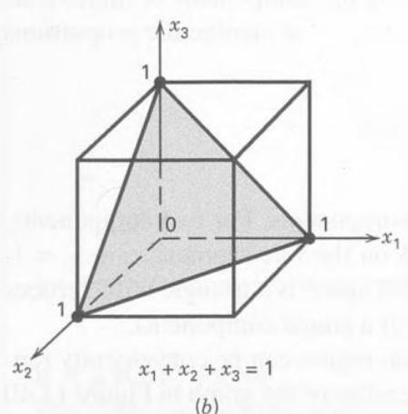  
图 11.39
混料的受约束因子空间：（a）两组分；（b）三组分

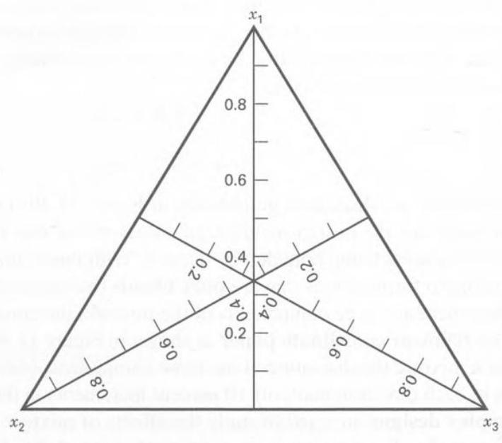  
图 11.40 三线坐标系

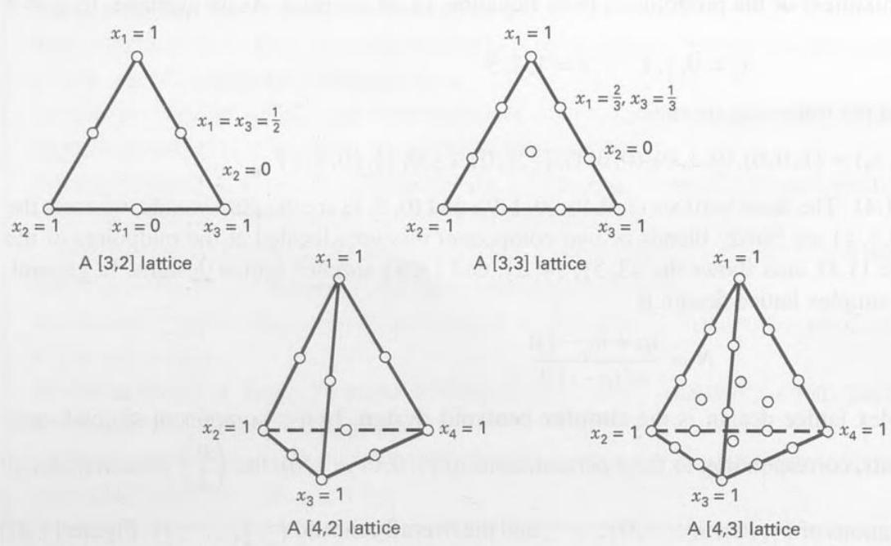  
图 11.41 若干三组分与四组分单纯形格点设计

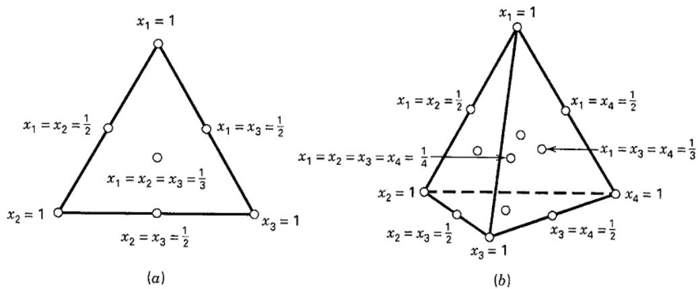  
图 11.42 单纯形重心设计：（a）三组分；（b）四组分

上述单纯形设计的一个不足是，大多数试验位于区域边界，因此每次至多包含 $p$ 个组分中的 $p-1$ 个。通常应在区域内部增加试验点，使配方包含全部 $p$ 个组分。进一步讨论见 Cornell（2002）和 Myers、Montgomery、Anderson-Cook（2009）。

由于约束 $\sum x_i=1$，混料模型不同于通常的响应面多项式。广泛使用的标准混料模型形式如下。

线性模型

$$
E (y) = \sum_ {i = 1} ^ {p} \beta_ {i} x _ {i}\tag{11.25}
$$

二次模型

$$
E (y) = \sum_ {i = 1} ^ {p} \beta_ {i} x _ {i} + \sum \sum_ {i <   j} ^ {p} \beta_ {i j} x _ {i} x _ {j}\tag{11.26}
$$

完整三次模型

$$
\begin{array}{r l} & E (y) = \sum_ {i = 1} ^ {p} \beta_ {i} x _ {i} + \sum \sum_ {i <   j} ^ {p} \beta_ {i j} x _ {i} x _ {j} \\ & \qquad + \sum \sum_ {i <   j} ^ {p} \delta_ {i j} x _ {i} x _ {j} (x _ {i} - x _ {j}) \\ & \qquad + \sum \sum_ {i <   j <   k} \sum \beta_ {i j k} x _ {i} x _ {j} x _ {k} \end{array}\tag{11.27}
$$

特殊三次模型

$$
\begin{array}{l} E (y) = \sum_ {i = 1} ^ {p} \beta_ {i} x _ {i} + \sum \sum_ {i <   j} ^ {p} \beta_ {i j} x _ {i} x _ {j} \\ \qquad + \sum \sum_ {i <   j <   k} \sum \beta_ {i j k} x _ {i} x _ {j} x _ {k} \end{array}\tag{11.28}
$$

这些模型的各项有比较直观的解释。在式（11.25）～（11.28）中，$\beta_i$ 表示纯组分 $x_i=1$、其余 $x_j=0$ 时的期望响应。$\sum_{i=1}^p\beta_i x_i$ 称为线性混合部分。若组分对之间的非线性混合引起曲率，则 $\beta_{ij}$ 表示协同或拮抗混合效应。混料模型经常需要高阶项，原因有二：研究现象可能复杂；试验区域往往涵盖整个可操作区域，范围较大，需要更精细的模型。

## 例 11.5 三组分混合物

Cornell（2002）介绍了一项混料试验：将聚乙烯 $x_1$、聚苯乙烯 $x_2$ 和聚丙烯 $x_3$ 混合制成纤维，再纺成窗帘用纱。关注的响应是以所施加的千克力表示的纱线伸长性能。采用 $\{3,2\}$ 单纯形格点设计研究产品，设计与响应见表 11.19。所有设计点都涉及

## 表 11.19

纱线伸长问题的 $\{3,2\}$ 单纯形格点设计

<table><tr><td rowspan="2">设计点</td><td colspan="3">组分比例</td><td rowspan="2">伸长性能观测值</td><td rowspan="2">平均伸长性能（y）</td></tr><tr><td>$x_1$</td><td>$x_2$</td><td>$x_3$</td></tr><tr><td>1</td><td>1</td><td>0</td><td>0</td><td>11.0, 12.4</td><td>11.7</td></tr><tr><td>2</td><td>$\frac{1}{2}$</td><td>$\frac{1}{2}$</td><td>0</td><td>15.0, 14.8, 16.1</td><td>15.3</td></tr><tr><td>3</td><td>0</td><td>1</td><td>0</td><td>8.8, 10.0</td><td>9.4</td></tr><tr><td>4</td><td>0</td><td>$\frac{1}{2}$</td><td>$\frac{1}{2}$</td><td>10.0, 9.7, 11.8</td><td>10.5</td></tr><tr><td>5</td><td>0</td><td>0</td><td>1</td><td>16.8, 16.0</td><td>16.4</td></tr><tr><td>6</td><td>$\frac{1}{2}$</td><td>0</td><td>$\frac{1}{2}$</td><td>17.7, 16.4, 16.6</td><td>16.9</td></tr></table>

纯组分或二元混合物，即每种配方至多使用三组分中的两个。在各纯组分处安排两次重复，各二元混合物处安排三次重复。由这些重复观测估计误差标准差，得 $\hat\sigma=0.85$。Cornell 拟合二阶混料多项式，得到

$$
\begin{array}{c} \hat {y} = 11.7 x _ {1} + 9.4 x _ {2} + 16.4 x _ {3} + 19.0 x _ {1} x _ {2} \\ + 11.4 x _ {1} x _ {3} - 9.6 x _ {2} x _ {3} \end{array}
$$

可以证明，该模型充分描述了响应。由于 $\hat\beta_3>\hat\beta_1>\hat\beta_2$，可断定组分 3（聚丙烯）制得的纱线伸长性能最高。此外，$\hat\beta_{12}$ 和 $\hat\beta_{13}$ 为正，说明组分 1 与 2 或组分 1 与 3 混合后，响应高于仅按纯组分响应加权平均所预测的值，属于协同混合效应。由于 $\hat\beta_{23}$ 为负，组分 2 与 3 存在拮抗混合效应。

图 11.43 给出了伸长性能等高线，有助于解释结果。如果希望响应最大，应选择约含 80% 组分 3、20% 组分 1 的混合物。

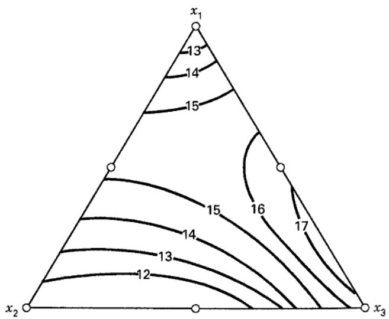  
图 11.43 例 11.5 二阶混料模型预测的纱线伸长性能等高线

单纯形格点设计和重心设计主要采用边界点。如果希望预测完整混合物的性质，最好增加单纯形内部的试验。建议在通常的单纯形设计中增加轴点，并在尚未包含总体重心时加入重心。

第 $i$ 个组分的轴线从基点 $x_i=0$、其余 $x_j=1/(p-1)$ 延伸到对面顶点 $x_i=1$、其余 $x_j=0$。基点总是位于该顶点对面的 $(p-2)$ 维边界的重心上，该边界有时称为 $(p-2)$ 维平坦面。按组分比例坐标，轴线长为一个单位。轴点布置在组分轴线上距总体重心 $\Delta$ 的位置，$\Delta$ 最大为 $(p-1)/p$。建议将轴点取在重心与各顶点的中点，即 $\Delta=(p-1)/(2p)$。这些点有时称为**轴向检验配方**，因为常见做法是在初步拟合时不使用它们，再用轴点响应检查初步模型的充分性。

图 11.44 是增加轴点后的 $\{3,2\}$ 单纯形格点设计，共 10 个点，其中四个在内部。$\{3,3\}$ 格点设计能够拟合完整三次模型，而增广设计不能；但增广设计可以拟合特殊三次模型，或在二次模型中加入 $\beta_{1233}x_1x_2x_3^2$ 等特殊四次项。在研究完整混合物响应方面，增广格点设计能够检测并描述三角形内部那些完整三次模型项无法解释的曲率，因而具有优势。它检测失拟的能力也强于 $\{3,3\}$ 格点设计。当试验者不确定适当模型，并打算从简单多项式（可能为一阶）开始，先检验失拟，再逐步加入高阶项并重新检验时，这一点特别有用。

某些混料问题对各组分还有额外约束。以下形式的下限约束

$$
l _ {i} \leq x _ {i} \leq 1 \quad i = 1, 2, \dots , p
$$

十分常见。只有下限约束时，可行设计区域仍为单纯形，但内接于原单纯形。引入**伪组分**可简化问题，其定义为

$$
x _ {i} ^ {\prime} = \frac {x _ {i} - l _ {i}}{\left(1 - \sum_ {j = 1} ^ {p} l _ {j}\right)}\tag{11.29}
$$

图 11.44 增广单纯形格点设计
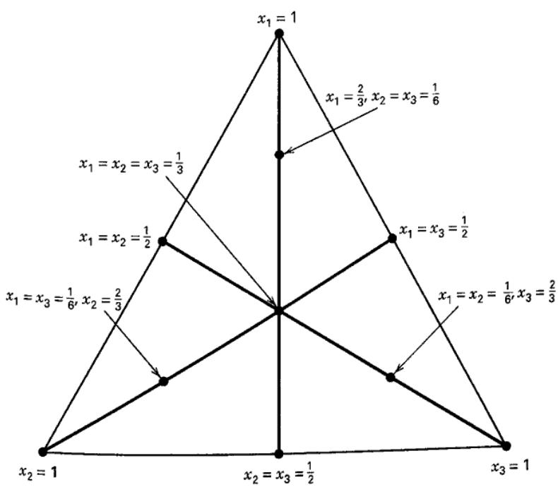

其中 $\sum_{j=1}^p l_j<1$。此时

$$
x _ {1} ^ {\prime} + x _ {2} ^ {\prime} + \dots + x _ {p} ^ {\prime} = 1
$$

因而有下限约束时，利用伪组分仍可采用单纯形设计。通过式（11.29）的逆变换，将伪组分配方转回原组分配方。若某次试验中第 $i$ 个伪组分取值为 $x_i'$，则原组分为

$$
x _ {i} = l _ {i} + \left(1 - \sum_ {j = 1} ^ {p} l _ {j}\right) x _ {i} ^ {\prime}\tag{11.30}
$$

若组分同时有上限和下限，可行区域不再是单纯形，而是不规则多面体。由于区域形状不标准，计算机生成的最优设计对这类混料问题非常有用。

## 例 11.6 涂料配方

试验者希望优化汽车透明面漆配方。这类产品复杂，性能要求明确：客户要求努氏硬度超过 25，固体含量低于 30%。透明面漆由单体 $x_1$、交联剂 $x_2$ 和树脂 $x_3$ 三个组分组成，比例受到以下约束：

$$
\begin{array}{r l} x _ {1} + x _ {2} + x _ {3} & = 100 \\ 5 \leq x _ {1} \leq 25 \\ 25 \leq x _ {2} \leq 40 \\ 50 \leq x _ {3} \leq 70 \end{array}
$$

由此形成图 11.45 的受约束试验区域。由于关注区域不是单纯形，采用 D 最优设计。假定两个响应均可用二次混料模型描述，可通过 Design-Expert 生成图 11.45 所示区域内的设计。除拟合二次混料模型所需的六次试验外，再增加四个不同的试验点检查失拟，并重复其中四次试验以估计纯误差。候选点包括顶点、边中点、总体重心，以及位于重心与顶点中间的检验点。

表 11.20 给出了 14 次试验的设计及硬度、固体含量响应。两个响应的二次模型拟合结果分别见表 11.21 和表 11.22，均拟合良好。表中列出了以伪组分表示的拟合方程，响应等高线图见图 11.46 和图 11.47。

图 11.48 叠加了两个响应面，显示努氏硬度为 25 和固体含量为 30% 的等高线。产品的可行区域是图中央附近的未加阴影区域。显然，单体、交联剂和树脂存在多种比例组合，均可使透明面漆满足性能要求。

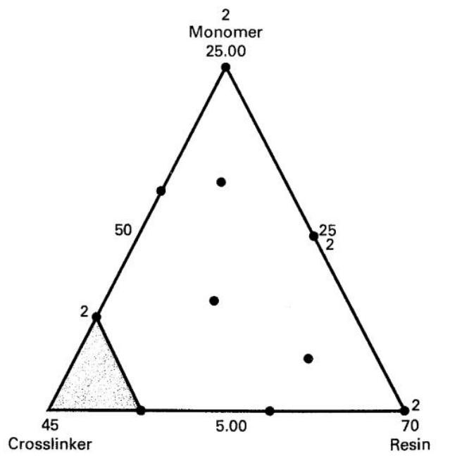  
图 11.45 例 11.6 涂料配方的受约束试验区域（采用实际组分比例）

表 11.20
例 11.6 涂料配方问题的 D 最优设计

<table><tr><td>标准顺序</td><td>试验</td><td>单体  $x_1$</td><td>交联剂  $x_2$</td><td>树脂  $x_3$</td><td>Hardness  $y_1$</td><td>Solids  $y_2$</td></tr><tr><td>1</td><td>2</td><td>17.50</td><td>32.50</td><td>50.00</td><td>29</td><td>9.539</td></tr><tr><td>2</td><td>1</td><td>10.00</td><td>40.00</td><td>50.00</td><td>26</td><td>27.33</td></tr><tr><td>3</td><td>4</td><td>15.00</td><td>25.00</td><td>60.00</td><td>17</td><td>29.21</td></tr><tr><td>4</td><td>13</td><td>25.00</td><td>25.00</td><td>50.00</td><td>28</td><td>30.46</td></tr><tr><td>5</td><td>7</td><td>5.00</td><td>25.00</td><td>70.00</td><td>35</td><td>74.98</td></tr><tr><td>6</td><td>3</td><td>5.00</td><td>32.50</td><td>62.50</td><td>31</td><td>31.5</td></tr><tr><td>7</td><td>6</td><td>11.25</td><td>32.50</td><td>56.25</td><td>21</td><td>15.59</td></tr><tr><td>8</td><td>11</td><td>5.00</td><td>40.00</td><td>55.00</td><td>20</td><td>19.2</td></tr><tr><td>9</td><td>10</td><td>18.13</td><td>28.75</td><td>53.13</td><td>29</td><td>23.44</td></tr><tr><td>10</td><td>14</td><td>8.13</td><td>28.75</td><td>63.13</td><td>25</td><td>32.49</td></tr><tr><td>11</td><td>12</td><td>25.00</td><td>25.00</td><td>50.00</td><td>19</td><td>23.01</td></tr><tr><td>12</td><td>9</td><td>15.00</td><td>25.00</td><td>60.00</td><td>14</td><td>41.46</td></tr><tr><td>13</td><td>5</td><td>10.00</td><td>40.00</td><td>50.00</td><td>30</td><td>32.98</td></tr><tr><td>14</td><td>8</td><td>5.00</td><td>25.00</td><td>70.00</td><td>23</td><td>70.95</td></tr></table>

表 11.21
硬度响应的模型拟合

<table><tr><td colspan="6">响应：硬度</td></tr><tr><td colspan="6">二次混料模型的方差分析</td></tr><tr><td colspan="6">方差分析表〔偏平方和〕</td></tr><tr><td>来源</td><td>平方和</td><td>DF</td><td>均方</td><td>F 值</td><td>P 值</td></tr><tr><td>模型</td><td>279.73</td><td>5</td><td>55.95</td><td>2.37</td><td>0.1329</td></tr><tr><td>线性混料模型</td><td>29.13</td><td>2</td><td>14.56</td><td>0.62</td><td>0.5630</td></tr><tr><td>AB</td><td>72.61</td><td>1</td><td>72.61</td><td>3.08</td><td>0.1174</td></tr><tr><td>AC</td><td>179.67</td><td>1</td><td>179.67</td><td>7.62</td><td>0.0247</td></tr><tr><td>BC</td><td>8.26</td><td>1</td><td>8.26</td><td>0.35</td><td>0.5703</td></tr><tr><td>残差</td><td>188.63</td><td>8</td><td>23.58</td><td></td><td></td></tr><tr><td>失拟</td><td>63.63</td><td>4</td><td>15.91</td><td>0.51</td><td>0.7354</td></tr><tr><td>纯误差</td><td>125.00</td><td>4</td><td>31.25</td><td></td><td></td></tr><tr><td>校正总计</td><td>468.36</td><td>13</td><td></td><td></td><td></td></tr><tr><td>标准差</td><td>4.86</td><td></td><td>R²</td><td>0.5973</td><td></td></tr><tr><td>均值</td><td>24.79</td><td></td><td>调整 R²</td><td>0.3455</td><td></td></tr><tr><td>C.V.</td><td>19.59</td><td></td><td>预测 R²</td><td>-0.3635</td><td></td></tr><tr><td>PRESS</td><td>638.60</td><td></td><td>充分精度</td><td>4.975</td><td></td></tr><tr><td colspan="6">表 11.21（续）</td></tr><tr><td>组分</td><td>系数估计</td><td>DF</td><td>标准误</td><td>95% 置信下限</td><td>95% 置信上限</td></tr><tr><td>A—单体</td><td>23.81</td><td>1</td><td>3.36</td><td>16.07</td><td>31.55</td></tr><tr><td>B—交联剂</td><td>16.40</td><td>1</td><td>7.68</td><td>-1.32</td><td>34.12</td></tr><tr><td>C—树脂</td><td>29.45</td><td>1</td><td>3.36</td><td>21.71</td><td>37.19</td></tr><tr><td>AB</td><td>44.42</td><td>1</td><td>25.31</td><td>-13.95</td><td>102.80</td></tr><tr><td>AC</td><td>-44.01</td><td>1</td><td>15.94</td><td>-80.78</td><td>-7.25</td></tr><tr><td>BC</td><td>13.80</td><td>1</td><td>23.32</td><td>-39.97</td><td>67.57</td></tr><tr><td colspan="6">以伪组分表示的最终方程：</td></tr><tr><td></td><td colspan="5">硬度 =+23.81 * A+16.40 * B+29.45 * C+44.42 * A * B-44.01 * A * C+13.80 * B * C</td></tr></table>

表 11.22 固体含量响应的模型拟合

<table><tr><td colspan="6">响应：固体含量</td></tr><tr><td colspan="6">二次混料模型的方差分析</td></tr><tr><td colspan="6">方差分析表〔偏平方和〕</td></tr><tr><td>来源</td><td>平方和</td><td>DF</td><td>均方</td><td>F 值</td><td>P 值</td></tr><tr><td>模型</td><td>4297.94</td><td>5</td><td>859.59</td><td>25.78</td><td>&lt;0.0001</td></tr><tr><td>线性混料模型</td><td>2931.09</td><td>2</td><td>1465.66</td><td>43.95</td><td>&lt;0.0001</td></tr><tr><td>AB</td><td>211.20</td><td>1</td><td>211.20</td><td>6.33</td><td>0.0360</td></tr><tr><td>AC</td><td>285.67</td><td>1</td><td>285.67</td><td>8.57</td><td>0.0191</td></tr><tr><td>BC</td><td>1036.72</td><td>1</td><td>1036.72</td><td>31.09</td><td>0.0005</td></tr><tr><td>残差</td><td>266.79</td><td>8</td><td>33.35</td><td></td><td></td></tr><tr><td>失拟</td><td>139.92</td><td>4</td><td>34.98</td><td>1.10</td><td>0.4633</td></tr><tr><td>纯误差</td><td>126.86</td><td>4</td><td>31.72</td><td></td><td></td></tr><tr><td>校正总计</td><td>4564.73</td><td>13</td><td></td><td></td><td></td></tr><tr><td>标准差</td><td>5.77</td><td></td><td>R²</td><td>0.9416</td><td></td></tr><tr><td>均值</td><td>33.01</td><td></td><td>调整 R²</td><td>0.9050</td><td></td></tr><tr><td>C.V.</td><td>17.49</td><td></td><td>预测 R²</td><td>0.7827</td><td></td></tr><tr><td>PRESS</td><td>991.86</td><td></td><td>充分精度</td><td>15.075</td><td></td></tr><tr><td>组分</td><td>系数估计</td><td>DF</td><td>标准误</td><td>95% 置信下限</td><td>95% 置信上限</td></tr><tr><td>A—单体</td><td>26.53</td><td>1</td><td>3.99</td><td>17.32</td><td>35.74</td></tr><tr><td>B—交联剂</td><td>46.60</td><td>1</td><td>9.14</td><td>25.53</td><td>67.68</td></tr><tr><td>C—树脂</td><td>73.23</td><td>1</td><td>3.99</td><td>64.02</td><td>82.43</td></tr><tr><td>AB</td><td>-75.76</td><td>1</td><td>30.11</td><td>-145.19</td><td>-6.34</td></tr><tr><td>AC</td><td>-55.50</td><td>1</td><td>18.96</td><td>-99.22</td><td>-11.77</td></tr><tr><td>BC</td><td>-154.61</td><td>1</td><td>27.73</td><td>-218.56</td><td>-90.67</td></tr><tr><td colspan="6">以伪组分表示的最终方程：</td></tr><tr><td></td><td>固体含量 =</td><td></td><td></td><td></td><td></td></tr><tr><td></td><td>+26.53 * A</td><td></td><td></td><td></td><td></td></tr><tr><td></td><td>+46.60 * B</td><td></td><td></td><td></td><td></td></tr><tr><td></td><td>+73.23 * C</td><td></td><td></td><td></td><td></td></tr><tr><td></td><td>-75.76 * A * B</td><td></td><td></td><td></td><td></td></tr><tr><td></td><td>-55.50 * A * C</td><td></td><td></td><td></td><td></td></tr><tr><td></td><td>-154.61 * B * C</td><td></td><td></td><td></td><td></td></tr></table>

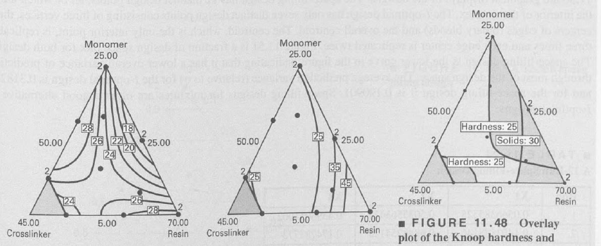

**图 11.46～11.48** 从左至右分别为努氏硬度等高线、固体含量等高线、二者叠加得到的可行区域。

除 D 和 I 准则之外，还有其他准则可用于混料设计。基于距离的设计使设计点尽量分散、点间距离尽量大，通常比 D 或 I 准则形成更多内部点。极端顶点法先取顶点，再加入边中点及各子空间重心，直至达到所需点数。也可使用空间填充策略；JMP 的空间填充算法本质上使候选设计点之间距离的乘积最大。

## 表 11.23

12 次试验的 I 最优设计

<table><tr><td>试验</td><td>X1</td><td>X2</td><td>X3</td></tr><tr><td>1</td><td>0.5</td><td>0</td><td>0.5</td></tr><tr><td>2</td><td>1</td><td>0</td><td>0</td></tr><tr><td>3</td><td>0.33333333</td><td>0.33333333</td><td>0.33333333</td></tr><tr><td>4</td><td>0</td><td>0.5</td><td>0.5</td></tr><tr><td>5</td><td>0.5</td><td>0.5</td><td>0</td></tr><tr><td>6</td><td>0</td><td>0</td><td>1</td></tr><tr><td>7</td><td>0.5</td><td>0</td><td>0.5</td></tr><tr><td>8</td><td>0.5</td><td>0.5</td><td>0</td></tr><tr><td>9</td><td>0.33333333</td><td>0.333333333</td><td>0.333333333</td></tr><tr><td>10</td><td>0.33333333</td><td>0.333333333</td><td>0.333333333</td></tr><tr><td>11</td><td>0</td><td>1</td><td>0</td></tr><tr><td>12</td><td>0</td><td>0.5</td><td>0.5</td></tr></table>

为说明空间填充准则，考虑三组分混料设计。表 11.23 给出 12 次试验的 I 最优设计，表 11.24 给出 12 次试验的空间填充设计，图形分别见图 11.49 和图 11.50。空间填充设计有 12 个不同的点，均位于单纯形内部。I 最优设计仅有七个不同点，包括三个顶点、三个边中点（二元混合物）和总体重心；唯一的内部点重心安排三次试验，各边中点安排两次试验。图 11.51 是两个设计的 FDS 图，下方曲线对应空间填充设计，表明其在大部分设计空间内的预测方差较低。相对于误差方差 $\sigma^2$，I 最优设计的平均预测方差为 0.318271，空间填充设计为 0.190901。因此，混料空间填充设计常是 I 最优设计的良好替代选择。

## 表 11.24

12 次试验的空间填充设计

<table><tr><td>试验</td><td>X1</td><td>X2</td><td>X3</td></tr><tr><td>1</td><td>0.0566385525</td><td>0.5035563474</td><td>0.4398051002</td></tr><tr><td>2</td><td>0.1403888146</td><td>0.6848254125</td><td>0.174785773</td></tr><tr><td>3</td><td>0.5979278886</td><td>0.1685717851</td><td>0.2335003264</td></tr><tr><td>4</td><td>0.0021204609</td><td>0.277430271</td><td>0.7204492681</td></tr><tr><td>5</td><td>0.3064350687</td><td>0.1050457166</td><td>0.5885192147</td></tr><tr><td>6</td><td>0.6951342573</td><td>0.3036842719</td><td>0.0011814709</td></tr><tr><td>7</td><td>0.2684127928</td><td>0.3996327787</td><td>0.3319544285</td></tr><tr><td>8</td><td>0.0164724047</td><td>0.9652091258</td><td>0.0183184695</td></tr><tr><td>9</td><td>0.5236343265</td><td>0.002453615</td><td>0.4739120585</td></tr><tr><td>10</td><td>0.3942469565</td><td>0.5494100414</td><td>0.0563430022</td></tr><tr><td>11</td><td>0.8560801746</td><td>0.0425991599</td><td>0.1013206655</td></tr><tr><td>12</td><td>0.0976192298</td><td>0.0288613381</td><td>0.8735194321</td></tr></table>

图 11.49 12 次试验的 I 最优设计
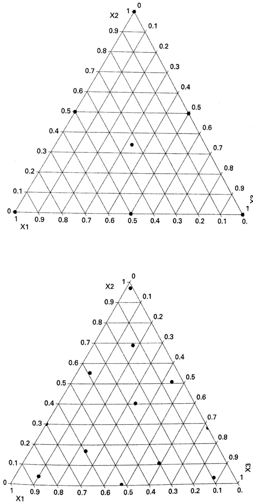  
图 11.50 12 次试验的空间填充设计

图 11.51 图 11.49 的 I 最优设计与图 11.50 的空间填充设计的 FDS 图；下方曲线为空间填充设计

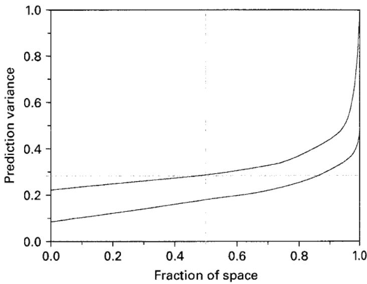
