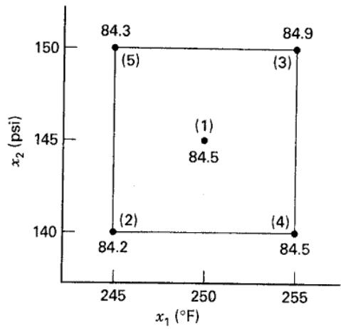
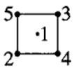
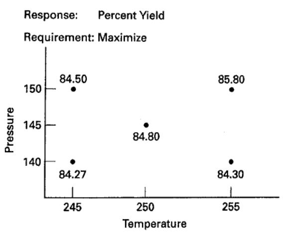

# 11.7 渐进调优法

研发人员经常将响应面方法用于中试装置。应用于全规模生产过程时，由于试验程序较复杂，通常只实施一次或极少实施。然而，中试最优条件未必适用于全规模过程：中试装置可能每天生产 2 磅产品，正式装置却每天生产 2000 磅。这种放大通常会改变最优条件。即使正式装置从最优点开始运行，也最终可能由于原料变化、环境变化和操作人员差异而偏离该点。

因此，需要一种持续监控和改进正式生产过程的方法，使操作条件逐步趋向最优点，或跟踪最优点的漂移。该方法不应要求可能扰乱生产的大幅或突然改变。Box（1957）提出的**渐进调优法**（EVOP）正是这种操作程序，旨在由生产人员实施日常过程改进，仅需研发人员少量协助。

EVOP 系统地对所研究操作变量的水平作小幅调整，通常采用 $2^k$ 设计。调整幅度应小到不会严重影响产率、质量或产量，又应大到最终能够发现潜在改善。在各设计点收集关注响应，每个点完成一次观测即完成一个**循环**，然后计算过程变量的效应和交互作用。经过若干循环，某个变量或交互作用可能对响应呈现显著影响，此时可决定改变基本操作条件以改善响应。当发现改善后的条件时，称完成一个**阶段**。

检验过程变量与交互作用的显著性需要估计试验误差，可由循环数据计算。$2^k$ 设计通常以当前最佳条件为中心。比较该中心点与析因部分各点的响应，可以检查曲率或**均值变化**（CIM）。例如，若过程确实以极大值点为中心，则中心响应应显著大于周围 $2^k$ 个点的响应。

理论上，EVOP 可用于 $k$ 个过程变量；实际中通常仅考虑两个或三个。本节给出两变量实例。Box 和 Draper（1969）详细讨论了三变量情形，并提供所需表格和工作表。

## 例 11.7

某化学过程的产率取决于温度 $x_1$ 和压力 $x_2$。当前条件为 $250^\circ\mathrm F$ 和 145 psi。EVOP 采用图 11.52 中的 $2^2$ 设计加中心点，按设计点编号 1、2、3、4、5 顺序运行一次即完成一个循环。图中还给出了第一个循环的产率。

将第一循环的产率填入表 11.25 的 EVOP 计算表。此时还无法估计标准差。温度、压力效应及其交互作用按通常的 $2^2$ 设计方法计算。

再实施第二循环，将数据填入表 11.26。此时可以估计试验误差，并将效应估计与近似 95%（两个标准差）的误差界限比较。这里的极差是第（iv）行各差值的极差，即 $1.0-(-1.0)=2.0$。表 11.26 中没有效应超出误差界限，因此真实效应可能为零，暂不改变操作条件。

第三循环结果见表 11.27。压力效应已超出误差界限，温度效应恰好等于界限，因此现在可能有理由改变操作条件。

  
例 11.7 的 EVOP 计算表，$n=1$
图 11.52 EVOP 的 $2^2$ 设计

## 表 11.25

<table><tr><td>[×K22]</td><td colspan="5">循环：n = 1；响应：产率</td><td>阶段：1；日期：2004 年 1 月 11 日</td></tr><tr><td></td><td colspan="5">平均值的计算</td><td>标准差的计算</td></tr><tr><td>操作条件</td><td>(1)</td><td>(2)</td><td>(3)</td><td>(4)</td><td>(5)</td><td></td></tr><tr><td>（i）上一循环累计和</td><td></td><td></td><td></td><td></td><td></td><td>上一累计和 S =</td></tr><tr><td>（ii）上一循环平均值</td><td></td><td></td><td></td><td></td><td></td><td>上一平均值 S =</td></tr><tr><td>（iii）新观测值</td><td>84.5</td><td>84.2</td><td>84.9</td><td>84.5</td><td>84.3</td><td>新的 S = 极差 × f5,n =</td></tr><tr><td>（iv）差值〔（ii）−（iii）〕</td><td></td><td></td><td></td><td></td><td></td><td>下列行的极差 (iv) =</td></tr><tr><td>（v）新的累计和〔（i）+（iii）〕</td><td>84.5</td><td>84.2</td><td>84.9</td><td>84.5</td><td>84.3</td><td>新累计和 S =</td></tr><tr><td>（vi）新的平均值〔ȳᵢ =（v）/n〕</td><td>84.5</td><td>84.2</td><td>84.9</td><td>84.5</td><td>84.3</td><td>New average S =  $\frac{\text{新累计和 } S}{n-1}$</td></tr><tr><td colspan="5">效应的计算</td><td colspan="2">误差界限的计算</td></tr><tr><td colspan="5">Temperature effect =  $\frac{1}{2}(\overline{y}_{3} + \overline{y}_{4} - \overline{y}_{2} - \overline{y}_{5}) = 0.45$</td><td colspan="2">For new average =  $\frac{2}{\sqrt{n}}S =$</td></tr><tr><td colspan="5">Pressure effect =  $\frac{1}{2}(\overline{y}_{3} + \overline{y}_{5} - \overline{y}_{2} - \overline{y}_{4}) = 0.25$</td><td colspan="2">For new effects  $\frac{2}{\sqrt{n}}S =$</td></tr><tr><td colspan="5">T × P interaction effect =  $\frac{1}{2}(\overline{y}_{2} + \overline{y}_{3} - \overline{y}_{4} - \overline{y}_{5}) = 0.15$</td><td colspan="2"></td></tr><tr><td colspan="5">Change-in-mean effect =  $\frac{1}{5}(\overline{y}_{2} + \overline{y}_{3} + \overline{y}_{4} + \overline{y}_{5} - 4\overline{y}_{1}) = 0.02$</td><td colspan="2">For change in mean  $\frac{1.78}{\sqrt{n}}S =$</td></tr></table>

表 11.26
例 11.7 的 EVOP 计算表，$n=2$

<table><tr><td>[CY3AT]</td><td colspan="5">循环：n = 1；响应：产率</td><td>阶段：1；日期：2004 年 1 月 11 日</td></tr><tr><td></td><td colspan="5">平均值的计算</td><td>标准差的计算</td></tr><tr><td>操作条件</td><td>(1)</td><td>(2)</td><td>(3)</td><td>(4)</td><td>(5)</td><td></td></tr><tr><td>（i）上一循环累计和</td><td>84.5</td><td>84.2</td><td>84.9</td><td>84.5</td><td>84.3</td><td>上一累计和 S =</td></tr><tr><td>（ii）上一循环平均值</td><td>84.5</td><td>84.2</td><td>84.9</td><td>84.5</td><td>84.3</td><td>上一平均值 S =</td></tr><tr><td>（iii）新观测值</td><td>84.9</td><td>84.6</td><td>85.9</td><td>83.5</td><td>84.0</td><td>新的 S = 极差 × $f_{5,n}$ = 0.60</td></tr><tr><td>（iv）差值〔（ii）−（iii）〕</td><td>-0.4</td><td>-0.4</td><td>-1.0</td><td>+1.0</td><td>0.3</td><td>下列行的极差 (iv) = 2.0</td></tr><tr><td>（v）新的累计和〔（i）+（iii）〕</td><td>169.4</td><td>168.8</td><td>170.8</td><td>168.0</td><td>168.3</td><td>新累计和 S = 0.60</td></tr><tr><td>(vi) New average [ $\overline{y}_{i}$  = (v)/n]</td><td>84.70</td><td>84.40</td><td>85.40</td><td>84.00</td><td>84.15</td><td>New average S =  $\frac{\text{新累计和 }S}{n-1}$  = 0.60</td></tr><tr><td colspan="5">效应的计算</td><td colspan="2">误差界限的计算</td></tr><tr><td colspan="5">Temperature effect =  $\frac{1}{2}(\overline{y}_{3}+\overline{y}_{4}-\overline{y}_{2}-\overline{y}_{5})$  = 0.43</td><td colspan="2">For new average =  $\frac{2}{\sqrt{n}}S$  = 0.85</td></tr><tr><td colspan="5">Pressure effect =  $\frac{1}{2}(\overline{y}_{3}+\overline{y}_{5}-\overline{y}_{2}-\overline{y}_{4})$  = 0.58</td><td colspan="2">For new effects  $\frac{2}{\sqrt{n}}S$  = 0.85</td></tr><tr><td colspan="5">T × P interaction effect =  $\frac{1}{2}(\overline{y}_{2}+\overline{y}_{3}-\overline{y}_{4}-\overline{y}_{5})$  = 0.83</td><td colspan="2"></td></tr><tr><td colspan="5">Change-in-mean effect =  $\frac{1}{5}(\overline{y}_{2}+\overline{y}_{3}-\overline{y}_{4}-\overline{y}_{5}-4\overline{y}_{1})$  = -0.17</td><td colspan="2">For change in mean  $\frac{1.78}{\sqrt{n}}S$  = 0.76</td></tr><tr><td colspan="7">表 11.27 例 11.7 的 EVOP 计算表，n = 3</td></tr><tr><td></td><td colspan="5">循环：n = 1；响应：产率</td><td>阶段：1；日期：2004 年 1 月 11 日</td></tr><tr><td></td><td colspan="5">平均值的计算</td><td>标准差的计算</td></tr><tr><td>操作条件</td><td>(1)</td><td>(2)</td><td>(3)</td><td>(4)</td><td>(5)</td><td></td></tr><tr><td>（i）上一循环累计和</td><td>169.4</td><td>168.8</td><td>170.8</td><td>168.0</td><td>168.3</td><td>上一累计和 S = 0.60</td></tr><tr><td>（ii）上一循环平均值</td><td>84.70</td><td>84.40</td><td>85.40</td><td>84.00</td><td>84.15</td><td>上一平均值 S = 0.60</td></tr><tr><td>（iii）新观测值</td><td>85.0</td><td>84.0</td><td>86.6</td><td>84.9</td><td>85.2</td><td>新的 S = 极差 × $f_{5,n}$  = 0.56</td></tr><tr><td>（iv）差值〔（ii）−（iii）〕</td><td>-0.30</td><td>+0.40</td><td>-1.20</td><td>-0.90</td><td>-1.05</td><td>下列行的极差 (iv) = 1.60</td></tr><tr><td>（v）新的累计和〔（i）+（iii）〕</td><td>254.4</td><td>252.8</td><td>257.4</td><td>252.9</td><td>253.5</td><td>新累计和 S = 1.16</td></tr><tr><td>(vi) New averages [ $\overline{y}_{i}$  = (v)/n]</td><td>84.80</td><td>84.27</td><td>85.80</td><td>84.30</td><td>84.50</td><td>New average S =  $\frac{\text{新累计和 }S}{n-1}$  = 0.58</td></tr><tr><td colspan="5">效应的计算</td><td colspan="2">误差界限的计算</td></tr><tr><td colspan="5">Temperature effect =  $\frac{1}{2}(\overline{y}_{3}+\overline{y}_{4}-\overline{y}_{2}-\overline{y}_{5})$  = 0.67</td><td colspan="2">For new average =  $\frac{2}{\sqrt{n}}S$  = 0.67</td></tr><tr><td colspan="5">Pressure effect =  $\frac{1}{2}(\overline{y}_{3}+\overline{y}_{5}-\overline{y}_{2}-\overline{y}_{4})$  = 0.87</td><td colspan="2">For new effects  $\frac{2}{\sqrt{n}}S$  = 0.67</td></tr><tr><td colspan="5">T × P interaction effect =  $\frac{1}{2}(\overline{y}_{2}+\overline{y}_{3}-\overline{y}_{4}-\overline{y}_{5})$  = 0.64</td><td colspan="2"></td></tr><tr><td colspan="5">Change-in-mean effect =  $\frac{1}{5}(\overline{y}_{2}+\overline{y}_{3}+\overline{y}_{4}+\overline{y}_{5}-4\overline{y}_{1})$  = -0.07</td><td colspan="2">For change in mean  $\frac{1.78}{\sqrt{n}}S$  = 0.60</td></tr></table>

根据这些结果，以点 3 为中心开始新的 EVOP 阶段是合理的。因此，第二阶段 $2^2$ 设计的中心改为 $225^\circ\mathrm F$ 和 150 psi。

EVOP 的一个重要方面是将所得信息反馈给操作人员和主管，通常通过醒目展示的信息板实现。例中第三循环结束时的信息板见表 11.28。

## 表 11.28

第三循环的 EVOP 信息板

平均值的误差界限：±0.67

<table><tr><td>与下列因子的效应</td><td>温度</td><td>0.67 ± 0.67</td></tr><tr><td>95% 误差</td><td>压力</td><td>0.87 ± 0.67</td></tr><tr><td>界限</td><td>T × P</td><td>0.64 ± 0.67</td></tr><tr><td></td><td>均值变化</td><td>0.07 ± 0.60</td></tr><tr><td>标准差</td><td>0.58</td><td></td></tr></table>

EVOP 计算表的大多数量可直接由 $2^k$ 析因分析得到。例如，任一效应（如 $\tfrac12(\bar y_3+\bar y_5-\bar y_2-\bar y_4)$）的方差为 $\sigma^2/n$，其中 $\sigma^2$ 是观测值 $y$ 的方差。因此，任一效应的两个标准差误差界限（约对应 95%）为 $\pm2\sigma/\sqrt n$。均值变化的方差为

$$
\begin{array}{r} V (\mathrm{CIM}) = V \left[ \frac {1}{5} (\overline {{y}} _ {2} + \overline {{y}} _ {3} + \overline {{y}} _ {4} + \overline {{y}} _ {5} - 4 \overline {{y}} _ {1}) \right] \\ = \frac {1}{25} (4 \sigma_ {\overline {{y}}} ^ {2} + 16 \sigma_ {\overline {{y}}} ^ {2}) = \left(\frac {20}{25}\right) \frac {\sigma^ {2}}{n} \end{array}
$$

因此，CIM 的两个标准差误差界限为 $\pm2\sqrt{20/25}\,\sigma/\sqrt n=\pm1.78\sigma/\sqrt n$。

标准差 $\sigma$ 采用极差法估计。记 $y_i(n)$ 为第 $n$ 循环第 $i$ 个设计点的观测，$\bar y_i(n)$ 为完成 $n$ 个循环后该点的平均值。计算表第（iv）行是差值 $y_i(n)-\bar y_i(n-1)$，其方差为

$$
V [ y _ {i} (n) - \overline {{{{y}}}} _ {i} (n - 1) ] \equiv \sigma_ {D} ^ {2} = \sigma^ {2} \left[ 1 + \frac {1}{(n - 1)} \right] = \sigma^ {2} \frac {n}{(n - 1)}
$$

表 11.29
$f_{k,n}$ 的数值

<table><tr><td>n =</td><td>2</td><td>3</td><td>4</td><td>5</td><td>6</td><td>7</td><td>8</td><td>9</td><td>10</td></tr><tr><td>k = 5</td><td>0.30</td><td>0.35</td><td>0.37</td><td>0.38</td><td>0.39</td><td>0.40</td><td>0.40</td><td>0.40</td><td>0.41</td></tr><tr><td>9</td><td>0.24</td><td>0.27</td><td>0.29</td><td>0.30</td><td>0.31</td><td>0.31</td><td>0.31</td><td>0.32</td><td>0.32</td></tr><tr><td>10</td><td>0.23</td><td>0.26</td><td>0.28</td><td>0.29</td><td>0.30</td><td>0.30</td><td>0.30</td><td>0.31</td><td>0.31</td></tr></table>

差值的极差记为 $R_D$，它与差值标准差估计的关系为 $\hat\sigma_D=R_D/d_2$。因子 $d_2$ 取决于计算极差所用的观测数。由 $R_D/d_2=\hat\sigma\sqrt{n/(n-1)}$，得到

$$
\hat {\sigma} = \sqrt {\frac {(n - 1)}{n}} \frac {R _ {D}}{d _ {2}} = (f _ {k, n}) R _ {D} \equiv s
$$

可据此估计观测值标准差，其中本式的 $k$ 表示设计点数。$2^2$ 设计加一个中心点时 $k=5$，$2^3$ 设计加一个中心点时 $k=9$。$f_{k,n}$ 的数值见表 11.29。
