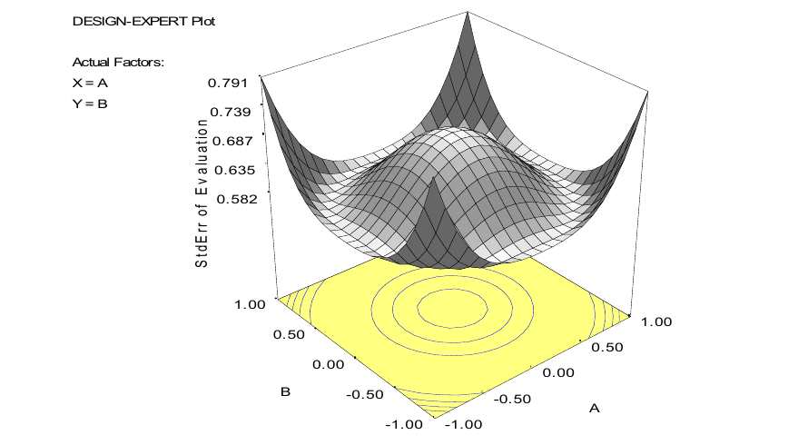
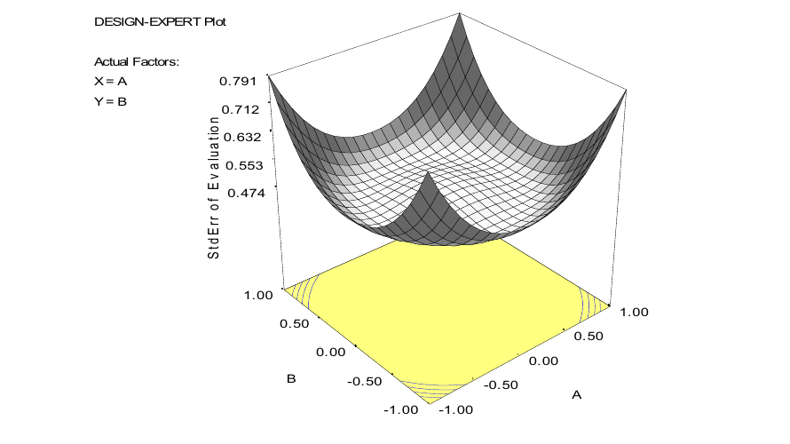
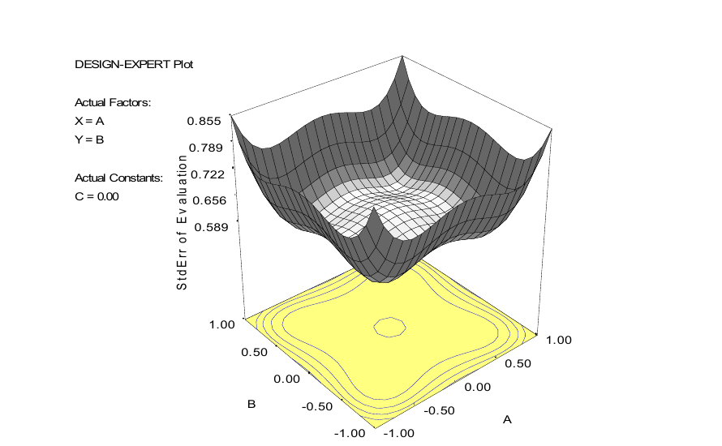
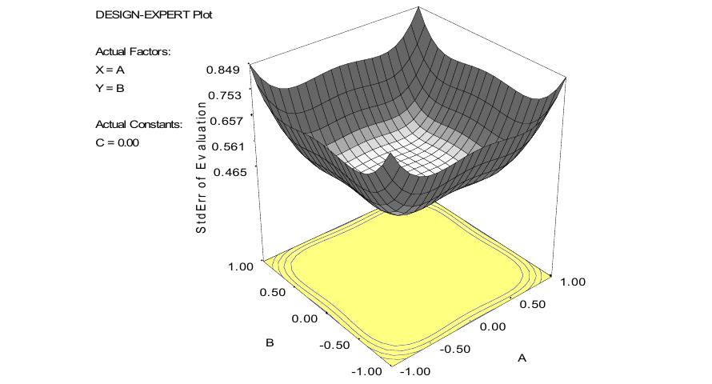
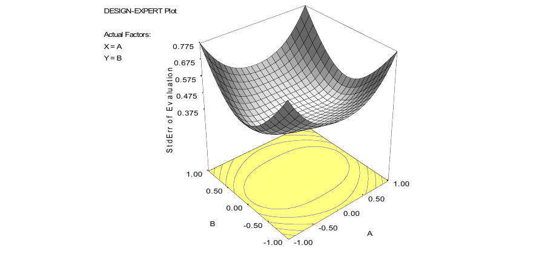

# 第 11 章补充材料

> 本页译自原书配套补充材料 Chapter 11, Supplemental Text Material。

## S11.1 最速上升法

最速上升法可按如下方式推导。假设已经拟合一阶模型

$$
\hat y=\hat\beta_0+\sum_{i=1}^k\hat\beta_i x_i,
$$

希望确定一条从设计区域中心 $\mathbf x=\mathbf0$ 出发、使预测响应增加最快的路径。一阶模型无界，因此不能直接寻找使预测响应最大的变量值。改为在半径为 $r$ 的超球面上求最大值，即

$$
\max_{\mathbf x}\ \hat\beta_0+\sum_{i=1}^k\hat\beta_i x_i,
\qquad \text{约束条件：}\sum_{i=1}^k x_i^2=r^2.
$$

引入拉格朗日乘子 $\lambda$，写为

$$
G=\hat\beta_0+\sum_{i=1}^k\hat\beta_i x_i
-\lambda\left(\sum_{i=1}^k x_i^2-r^2\right).
$$

其偏导数为

$$
\frac{\partial G}{\partial x_i}=\hat\beta_i-2\lambda x_i,
\quad i=1,2,\ldots,k,
\qquad
\frac{\partial G}{\partial\lambda}=-\left(\sum_{i=1}^k x_i^2-r^2\right).
$$

令偏导数为零，得到

$$
x_i=\frac{\hat\beta_i}{2\lambda},\quad i=1,2,\ldots,k,
\qquad \sum_{i=1}^k x_i^2=r^2.
$$

第一个方程说明，超球面上该点的坐标与回归系数的符号和大小成比例；常数 $2\lambda$ 只决定超球面的半径。第二个方程说明该点满足约束。因此，前面对最速上升法的直观描述有严格的数学依据。取对应最大值的正乘子时，方向为 $\hat{\boldsymbol\beta}$，且 $\mathbf x=r\hat{\boldsymbol\beta}/\|\hat{\boldsymbol\beta}\|$。

## S11.2 二阶响应面模型的典则形式

式（11.9）给出了十分有用的二阶响应面模型典则形式，它由原编码坐标轴先平移、再旋转得到。下面说明这一结果。

将二阶模型写为

$$
\hat y=\hat\beta_0+\mathbf x'\hat{\boldsymbol\beta}+\mathbf x'\mathbf B\mathbf x.
$$

令 $\mathbf z=\mathbf x-\mathbf x_s$，将坐标原点平移到驻点，则

$$
\begin{aligned}
\hat y
&=\hat\beta_0+(\mathbf z+\mathbf x_s)'\hat{\boldsymbol\beta}
+(\mathbf z+\mathbf x_s)'\mathbf B(\mathbf z+\mathbf x_s)\\
&=\hat\beta_0+\mathbf x_s'\hat{\boldsymbol\beta}+\mathbf x_s'\mathbf B\mathbf x_s
+\mathbf z'\hat{\boldsymbol\beta}+\mathbf z'\mathbf B\mathbf z
+2\mathbf x_s'\mathbf B\mathbf z\\
&=\hat y_s+\mathbf z'\mathbf B\mathbf z.
\end{aligned}
$$

最后一步利用式（11.7）给出的 $2\mathbf x_s'\mathbf B\mathbf z=-\mathbf z'\hat{\boldsymbol\beta}$。再旋转新坐标轴，使其平行于等高线系统的主轴。令 $\mathbf w=\mathbf M'\mathbf z$，其中

$$
\mathbf M'\mathbf B\mathbf M=\boldsymbol\Lambda.
$$

$\boldsymbol\Lambda$ 是以 $\mathbf B$ 的特征值 $\lambda_1,\ldots,\lambda_k$ 为对角线元素的对角矩阵，$\mathbf M$ 的列为归一化特征向量。由于 $\mathbf z=\mathbf M\mathbf w$，有

$$
\hat y=\hat y_s+\mathbf z'\mathbf B\mathbf z
=\hat y_s+\mathbf w'\mathbf M'\mathbf B\mathbf M\mathbf w
=\hat y_s+\mathbf w'\boldsymbol\Lambda\mathbf w
=\hat y_s+\sum_{i=1}^k\lambda_i w_i^2,
$$

这就是式（11.9）。[^1]

## S11.3 中心复合设计中的中心点

第 11.4.2 节讨论了拟合二阶模型的设计，其中 CCD 十分重要。一般建议安排 $3\le n_C\le5$ 次中心点试验。中心点能够稳定预测方差，使其在设计中心附近较大的区域内近似恒定。

假设考虑两变量 CCD，但只安排 $n_C=2$ 次中心点试验。下面是 Design-Expert 生成的预测响应尺度化标准差图。

上图中央有明显的隆起，表示模型在探索区域中心附近的预测精度较低，而该区域很可能正是试验者关注的位置。这是中心点过少造成的。如果增加到 $n_C=4$，则得到下图。

增加两次中心点试验后，关注区域内的预测标准差更平坦、更稳定。对于所有非中心设计点都位于同一球面上的 CCD，至少需要一个中心点，否则 $\mathbf X'\mathbf X$ 奇异。不过，中心点数还会影响预测方差等其他性质。

## S11.4 面心立方体中的中心点试验

面心立方体是 $\alpha=1$ 的 CCD，属于立方体区域设计，而不是所有非中心点位于同一球面上的设计。它甚至可以不含中心点。下图是三变量、$n_C=0$ 的预测标准差。

即使没有中心点，探索区域中心附近的预测标准差也相对恒定。由于设计不可旋转，标准差等值线不是同心圆。

虽然没有中心点也能拟合模型，但这通常不是理想选择。两至三个中心点一般效果较好。下面的图是含两个中心点的面心立方体，其表现很好。

## S11.5 关于可旋转性的说明

可旋转性是响应面设计预测方差的一种性质：若设计可旋转，则所有距设计中心相同距离的点，其预测方差相同。

一个容易忽略的事实是，可旋转性同时依赖于设计和模型。例如，实施可旋转 CCD 后，如果拟合删减的二阶模型，方差等值线不再保持球形。下面展示了两变量可旋转 CCD 在缺少一个纯二次项时的尺度化预测标准差。

尽管采用了可旋转设计，其预测标准差等值线仍不是圆。

[^1]: 译者注：补充材料推导中的中间式误写为 $\mathbf w'\mathbf M'\mathbf B\mathbf M\mathbf z$；根据 $\mathbf z=\mathbf M\mathbf w$，末尾应为 $\mathbf w$，此处已修正。
