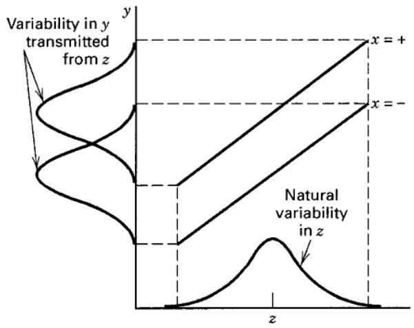
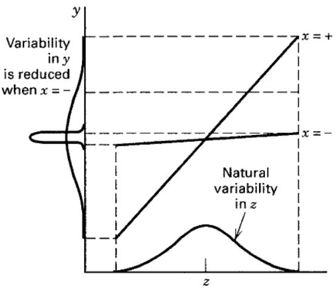

CHAPTER 12

# Robust Parameter Design and Process Robustness Studies

CHAPTER LEARNING OBJECTIVES

1. Understand the basic philosophy of robust parameter design and process robustness.

2. Know the difference between signal and noise factors.

3. Understand the idea behind crossed array designs.

4. Know the problems introduced by using signal-to-noise ratios as response variables.

5. Know how to design a combined array experiment.

6. Know how to obtain a model for the process mean and a model for the process variance from a response model obtained from the combined array design.

## 12.1 Introduction

Robust parameter design (RPD) is an approach to product realization activities that focuses on choosing the levels of controllable factors (or parameters) in a process or a product to achieve two objectives: (1) to ensure that the mean of the output response is at a desired level or target and (2) to ensure that the variability around this target value is as small as possible. When an RPD study is conducted on a process, it is usually called a process robustness study. The general RPD problem was developed by a Japanese engineer, Genichi Taguchi, and introduced in the United States in the 1980s (see Taguchi and Wu, 1980; Taguchi, 1987). Taguchi proposed an approach to solving the RPD problem based on designed experiments and some novel methods for analysis of the resulting data. His philosophy and technical methods generated widespread interest among engineers and statisticians, and during the 1980s his methodology was used at many large corporations, including AT&T Bell Laboratories, Ford Motor Company, and Xerox. These techniques generated controversy and debate in the statistical and engineering communities. The controversy was not about the basic RPD problem, which is an extremely important one, but rather about the experimental procedures and the data analysis methods that Taguchi advocated. Extensive analysis revealed that Taguchi's technical methods were usually inefficient and, in many cases, ineffective. Consequently, a period of extensive research and development on new approaches to the RPD problem followed. From these efforts, response surface methodology (RSM) emerged as an approach to the RPD problem that not only allows us to employ Taguchi's robust design concept but also provides a sounder and more efficient approach to design and analysis.

This chapter is about the RSM approach to the RPD problem. More information about the original Taguchi approach, including discussion that identifies the pitfalls and inefficiencies of his methods, is presented in the supplemental text material for this chapter. Other useful references include Hunter (1985, 1989), Box (1988), Box, Bisgaard, and Fung (1988), Pignatiello and Ramberg (1992), Montgomery (1999), Myers, Montgomery, and Anderson-Cook (2016), and the panel discussion edited by Nair (1992).

In a robust design problem, the focus is usually on one or more of the following:

1. Designing systems that are insensitive to environmental factors that can affect performance once the system is deployed in the field. An example is the development of an exterior paint that should exhibit long life when exposed to a variety of weather conditions. Because the weather conditions are not entirely predictable, and certainly not constant, the product formulator wants the paint to be robust against or withstand a wide range of temperature, humidity, and precipitation factors that affect the wear and finish of the paint.

2. Designing products so that they are insensitive to variability transmitted by the components of the system. An example is designing an electronic amplifier so that the output voltage is as close as possible to the desired target regardless of the variability in the electrical parameters of the transistors, resistors, and power supplies that are the components of the system.

3. Designing processes so that the manufactured product will be as close as possible to the desired target specifications, even though some process variables (such as temperature) or raw material properties are impossible to control precisely.

4. Determining the operating conditions for a process so that the critical process characteristics are as close as possible to the desired target values and the variability around this target is minimized. Examples of this type of problem occur frequently. For example, in semiconductor manufacturing we want the oxide thickness on a wafer to be as close as possible to the target mean thickness, and we want the variability in thickness across the wafer (a measure of uniformity) to be as small as possible.

RPD problems are not new. Product and process designers/developers have been concerned about robustness issues for decades, and efforts to solve the problem long predate Taguchi's contributions. One of the classical approaches used to achieve robustness is to redesign the product using stronger components, or components with tighter tolerances, or to use different materials. However, this may lead to problems with overdesign, resulting in a product that is more expensive, that is more difficult to manufacture, or suffers a weight and subsequent performance penalty. Sometimes different design methods or incorporation of new technology into the design can be exploited. For example, for many years automobile speedometers were driven by a metal cable, and over time the lubricant in the cable deteriorated, which could lead to operating noise in cold weather or erratic measurement of vehicle speed. Sometimes the cable would break, resulting in an expensive repair. This is an example of robustness problems caused by product aging. Modern automobiles use electronic speedometers that are not subject to these problems. In a process environment, older equipment may be replaced with new tools, which may improve process robustness but usually at a significant cost. Another possibility may be to exercise tighter control over the variables that impact robustness. For example, if variations in environmental conditions cause problems with robustness, then those conditions may have to be controlled more tightly. The use of clean rooms in semiconductor manufacturing is a result of efforts to control environmental conditions. In some cases, effort will be directed to controlling raw material properties or process variables more tightly if these factors impact robustness. These classical approaches are still useful, but Taguchi's principal contribution was the recognition that experimental design and other statistical tools could be applied to the problem in many cases.

An important aspect of Taguchi's approach was his notion that certain types of variables cause variability in important system response variables. We refer to these types of variables as noise variables or uncontrollable variables. We have discussed this concept before—for example, see Figure 1.1 These noise factors are often functions of environmental conditions such as temperature or relative humidity. They may be properties of raw materials that vary from batch to batch or over time in the process. They may be process variables that are difficult to control or to keep at specified targets. In some cases, they may involve the way the consumer handles or uses the product. Noise variables may often be controlled at the research or development level, but they cannot be controlled at the production or product use level. An integral part of the RPD problem is identifying the controllable variables and the noise variables that affect process or product performance and then finding the settings for the controllable variables that minimize the variability transmitted from the noise variables.

As an illustration of controllable and noise variables, consider a product developer who is formulating a cake mix. The developer must specify the ingredients and composition of the cake mix, including the amounts of flour, sugar, dry milk, hydrogenated oils, corn starch, and flavorings. These variables can be controlled reasonably easily when the cake mix is manufactured. When the consumer bakes the cake, water and eggs are added, the mixture of wet and dry ingredients is blended into cake batter, and the cake is baked in an oven at a specified temperature for a specified time. The product formulator cannot control exactly how much water is added to the dry cake mix, how well the wet and dry ingredients are blended, or the exact baking time or oven temperature. Target values for these variables can be and usually are specified, but they are really noise variables, as there will be variation (perhaps considerable variation) in the levels of these factors that are used by different customers. Therefore, the product formulator has a robust design problem. The objective is to formulate a cake mix that will perform well and meet or exceed customer expectations regardless of the variability transmitted into the final cake by the noise variables.

## 12.2 Crossed Array Designs

The original Taguchi methodology for the RPD problem revolved around the use of a statistical design for the controllable variables and another statistical design for the noise variables. Then these two designs were “crossed”; that is, every treatment combination in the design for the controllable variables was run in combination with every treatment combination in the noise variable design. This type of experimental design was called a crossed array design.

We will illustrate the crossed array design approach using the leaf spring experiment originally introduced as Problem 8.9. In this experiment, five factors were studied to determine their effect on the free height of a leaf spring used in an automotive application. There were five factors in the experiment: A = furnace temperature, B = heating time, C = transfer time, D = hold down time, and E = quench oil temperature. This was originally an RPD problem, and quench oil temperature was the noise variable. The data from this experiment are shown in Table 12.1. The design for the controllable factors is a $2^{4-1}$ fractional factorial design with generator D = ABC. This is called the inner array design. The design for the single noise factor is a $2^{1}$ design, and it is called the outer array design. Notice how each run in the outer array is performed for all eight treatment combinations in the inner array, producing the crossed array structure. In the leaf spring experiment, each of the 16 distinct design points was replicated three times, resulting in 48 observations on free height.

An important point about the crossed array design is that it provides information about interactions between controllable factors and noise factors. These interactions are crucial to the solution of an RPD problem. For example, consider the two-factor interaction graphs in Figure 12.1, where x is the controllable factor and z is the noise factor. In Figure 12.1a, there is no interaction between x and z; therefore, there is no setting for the controllable variable x that will affect the variability transmitted to the response by the variability in the noise factor z. However, in Figure 12.1b, there is a strong interaction between x and z. Note that when x is set to its low level, there is much less variability in the response variable than when x is at the high level. Thus, unless there is at least one controllable factor—noise factor interaction—there is no robust design problem. As we will subsequently see, focusing on identifying and modeling these interactions is one of the keys to an efficient and effective approach to solving the RPD problem.

TABLE 12.1  
The Leaf Spring Experiment

<table><tr><td>A</td><td>B</td><td>C</td><td>D</td><td>E = -</td><td>E = +</td><td> $\bar{y}$ </td><td> $s^2$ </td></tr><tr><td>-</td><td>-</td><td>-</td><td>-</td><td>7.78, 7.78, 7.81</td><td>7.50, 7.25, 7.12</td><td>7.54</td><td>0.090</td></tr><tr><td>+</td><td>-</td><td>-</td><td>+</td><td>8.15, 8.18, 7.88</td><td>7.88, 7.88, 7.44</td><td>7.90</td><td>0.071</td></tr><tr><td>-</td><td>+</td><td>-</td><td>+</td><td>7.50, 7.56, 7.50</td><td>7.50, 7.56, 7.50</td><td>7.52</td><td>0.001</td></tr><tr><td>+</td><td>+</td><td>-</td><td>-</td><td>7.59, 7.56, 7.75</td><td>7.63, 7.75, 7.56</td><td>7.64</td><td>0.008</td></tr><tr><td>-</td><td>-</td><td>+</td><td>+</td><td>7.54, 8.00, 7.88</td><td>7.32, 7.44, 7.44</td><td>7.60</td><td>0.074</td></tr><tr><td>+</td><td>-</td><td>+</td><td>-</td><td>7.69, 8.09, 8.06</td><td>7.56, 7.69, 7.62</td><td>7.79</td><td>0.053</td></tr><tr><td>-</td><td>+</td><td>+</td><td>-</td><td>7.56, 7.52, 7.44</td><td>7.18, 7.18, 7.25</td><td>7.36</td><td>0.030</td></tr><tr><td>+</td><td>+</td><td>+</td><td>+</td><td>7.56, 7.81, 7.69</td><td>7.81, 7.50, 7.59</td><td>7.66</td><td>0.017</td></tr></table>

  
(a) No control × noise interaction

  
(b) Significant control × noise interaction  
■ FIGURE 12.1 The role of the control × noise interaction in robust design

Table 12.2 presents another example of an RPD problem, taken from Byrne and Taguchi (1987). This problem involved the development of an elastomeric connector that would deliver the required pull-off force when assembled with a nylon tube. There are four controllable factors, each at three levels ( $A =$ interference, $B =$ connector wall thickness, $C =$ insertion depth, and $D =$ percent adhesive), and three noise or uncontrollable factors, each at two levels ( $E =$ conditioning time, $F =$ conditioning temperature, and $G =$ conditioning relative humidity). Panel (a) of Table 12.2 contains the inner array design for the controllable factors. Notice that the design is a three-level fractional factorial, and specifically, it is a $3^{4-2}$ design. Panel (b) of Table 12.2 contains a $2^3$ outer array design for the noise factors. Now as before, each run in the inner array is performed for all treatment combinations in the outer array, producing the crossed array design with 72 observations on pull-off force shown in the table.

Examination of the crossed array design in Table 12.2 reveals a major problem with the Taguchi design strategy; namely, the crossed array approach can lead to a very large experiment. In our example, there are only seven factors, yet the design has 72 runs. Furthermore, the inner array design is a $3^{4-2}$ resolution III design (see Chapter 9 for discussion of this design), so in spite of the large number of runs, we cannot obtain any information about interactions among the controllable variables. Indeed, even information about the main effects is potentially tainted because the main effects are heavily aliased with the two-factor interactions. In Section 12.4, we will introduce the combined array design, which is generally much more efficient than the crossed array.

TABLE 12.2  
The Design for the Connector Pull-Off Force Experiment

<table><tr><td colspan="13">(b) Outer Array</td><td></td></tr><tr><td></td><td></td><td></td><td></td><td></td><td>E</td><td>-</td><td>-</td><td>-</td><td>-</td><td>+</td><td>+</td><td>+</td><td>+</td></tr><tr><td></td><td></td><td></td><td></td><td></td><td>F</td><td>-</td><td>-</td><td>+</td><td>+</td><td>-</td><td>-</td><td>+</td><td>+</td></tr><tr><td></td><td></td><td></td><td></td><td></td><td>G</td><td>-</td><td>+</td><td>-</td><td>+</td><td>-</td><td>-</td><td>-</td><td>+</td></tr><tr><td colspan="5">(a) Inner Array</td><td></td><td></td><td></td><td></td><td></td><td></td><td></td><td></td><td></td></tr><tr><td>Run</td><td>A</td><td>B</td><td>C</td><td>D</td><td></td><td></td><td></td><td></td><td></td><td></td><td></td><td></td><td></td></tr><tr><td>1</td><td>-1</td><td>-1</td><td>-1</td><td>-1</td><td></td><td>15.6</td><td>9.5</td><td>16.9</td><td>19.9</td><td>19.6</td><td>19.6</td><td>20.0</td><td>19.1</td></tr><tr><td>2</td><td>-1</td><td>0</td><td>0</td><td>0</td><td></td><td>15.0</td><td>16.2</td><td>19.4</td><td>19.2</td><td>19.7</td><td>19.8</td><td>24.2</td><td>21.9</td></tr><tr><td>3</td><td>-1</td><td>+1</td><td>+1</td><td>+1</td><td></td><td>16.3</td><td>16.7</td><td>19.1</td><td>15.6</td><td>22.6</td><td>18.2</td><td>23.3</td><td>20.4</td></tr><tr><td>4</td><td>0</td><td>-1</td><td>0</td><td>+1</td><td></td><td>18.3</td><td>17.4</td><td>18.9</td><td>18.6</td><td>21.0</td><td>18.9</td><td>23.2</td><td>24.7</td></tr><tr><td>5</td><td>0</td><td>0</td><td>+1</td><td>-1</td><td></td><td>19.7</td><td>18.6</td><td>19.4</td><td>25.1</td><td>25.6</td><td>21.4</td><td>27.5</td><td>25.3</td></tr><tr><td>6</td><td>0</td><td>+1</td><td>-1</td><td>0</td><td></td><td>16.2</td><td>16.3</td><td>20.0</td><td>19.8</td><td>14.7</td><td>19.6</td><td>22.5</td><td>24.7</td></tr><tr><td>7</td><td>+1</td><td>-1</td><td>+1</td><td>0</td><td></td><td>16.4</td><td>19.1</td><td>18.4</td><td>23.6</td><td>16.8</td><td>18.6</td><td>24.3</td><td>21.6</td></tr><tr><td>8</td><td>+1</td><td>0</td><td>-1</td><td>+1</td><td></td><td>14.2</td><td>15.6</td><td>15.1</td><td>16.8</td><td>17.8</td><td>19.6</td><td>23.2</td><td>24.2</td></tr><tr><td>9</td><td>+1</td><td>+1</td><td>0</td><td>-1</td><td></td><td>16.1</td><td>19.9</td><td>19.3</td><td>17.3</td><td>23.1</td><td>22.7</td><td>22.6</td><td>28.6</td></tr></table>

## 12.3 Analysis of the Crossed Array Design

Taguchi proposed that we summarize the data from a crossed array experiment with two statistics: the average of each observation in the inner array across all runs in the outer array and a summary statistic that attempted to combine information about the mean and variance, called the signal-to-noise ratio. These signal-to-noise ratios are purportedly defined so that a maximum value of the ratio minimizes variability transmitted from the noise variables. Then an analysis is performed to determine which settings of the controllable factors result in (1) the mean as close as possible to the desired target and (2) a maximum value of the signal-to-noise ratio. Signal-to-noise ratios are problematic; they can result in confounding of location and dispersion effects, and they often do not produce the desired result of finding a solution to the RPD problem that minimizes the transmitted variability. This is discussed in detail in the supplemental material for this chapter.

A more appropriate analysis for a crossed array design is to model the mean and variance of the response directly, where the sample mean and the sample variance for each observation in the inner array are computed across all runs in the outer array. Because of the crossed array structure, the sample means $\overline{y}_i$ and variances $s_i^2$ are computed over the same levels of the noise variables, so any differences between these quantities are due to differences in the levels of the controllable variables. Consequently, choosing the levels of the controllable variables to optimize the mean and simultaneously minimize the variability is a valid approach.

To illustrate this approach, consider the leaf spring experiment in Table 12.1. The last two columns of this table show the sample means $\overline{y}_i$ and variances $s_i^2$ for each run in the inner array. Figure 12.2 is the half-normal probability plot of the effects for the mean free height response. Clearly, factors $A$ , $B$ , and $D$ have important effects. Since these factors are aliased with three-factor interactions, it seems reasonable to conclude that these effects are real. The model for the mean free height response is

$$
\hat {\overline {{y}}} _ {i} = 7. 6 3 + 0. 1 2 x _ {1} - 0. 0 8 1 x _ {2} + 0. 0 4 4 x _ {4}
$$

  
■ FIGURE 12.2 Half-normal plot of effect, mean free height response  
■ FIGURE 12.3 Half-normal plot of effects, $\ln (s_i^2)$ response

where the x's represent the original design factors A, B, and D. Because the sample variance does not have a normal distribution (it is scaled chi-square), it is usually best to analyze the natural log of the variance. Figure 12.3 is the half-normal probability plot of the effects of the $\ln(s_{i}^{2})$ response. The only significant effect is factor B. The model for the $\ln(s_{i}^{2})$ response is

$$
\widehat {\ln (s _ {i} ^ {2})} = - 3. 7 4 - 1. 0 9 x _ {2}
$$

Figure 12.4 is a contour plot of the mean free height in terms of factors A and B with factor D = 0, and Figure 12.5 is a plot of the variance response in the original scale. Clearly, the variance of the free height decreases as the heating time (factor B) increases.

Suppose that the objective of the experimenter is to find a set of conditions that results in a mean free height between 7.74 and 7.76 inches, with minimum variability. This is a standard multiple response optimization problem and can be solved by any of the methods for solving these problems described in Chapter 11. Figure 12.6 is an overlay plot of the two responses, with factor D = hold down time held constant at the high level. By also selecting A = temperature at the high level and B = heating time at 0.50 (in coded units), we can achieve a mean free height between the desired limits with variance of approximately 0.0138.

A disadvantage of the mean and variance modeling approach using the crossed array design is that it does not take direct advantage of the interactions between controllable variables and noise variables. In some instances, it can even mask these relationships. Furthermore, the variance response is likely to have a nonlinear relationship with the controllable variables (see Figure 12.5, for example), and this can complicate the modeling process. In the next section, we introduce an alternative design strategy and modeling approach that overcomes these issues.

  
■ FIGURE 12.4 Contour plot of the mean free height response with D = hold down time = 0

  
■ FIGURE 12.5 Plot of the variance of free height versus x = heating time (B)

  
■ FIGURE 12.6 Overlay plot of the mean free height and variance of free height with $x_{4}=$ hold down time $(D)$ at the high level

## 12.4 Combined Array Designs and the Response Model Approach

As noted in the previous section, interactions between controllable and noise factors are the key to a robust design problem. Therefore, it is logical to use a model for the response that includes both controllable and noise factors and their interactions. To illustrate, suppose that we have two controllable factors $x_{1}$ and $x_{2}$ and a single noise factor $z_{1}$ . We assume that both control and noise factors are expressed as the usual coded variables (that is, they are centered at zero and have lower and upper limits at $\pm a$ ). If we wish to consider a first-order model involving the controllable and noise variables, a logical model is

$$
y = \beta_ {0} + \beta_ {1} x _ {1} + \beta_ {2} x _ {2} + \beta_ {1 2} x _ {1} x _ {2} + \gamma_ {1} z _ {1} + \delta_ {1 1} x _ {1} z _ {1} + \delta_ {2 1} x _ {2} z _ {1} + \epsilon\tag{12.1}
$$

Notice that this model has the main effects of both controllable factors and their interaction, the main effect of the noise variable, and interactions between the both controllable and noise variables. This type of model, incorporating both controllable and noise variables, is often called a response model. Unless at least one of the regression coefficients $\delta_{11}$ and $\delta_{21}$ is nonzero, there will be no robust design problem.

An important advantage of the response model approach is that both the controllable factors and the noise factors can be placed in a single experimental design; that is, the inner and outer array structure of the Taguchi approach can be avoided. We usually call the design containing both controllable and noise factors a combined array design.

As mentioned previously, we assume that noise variables are random variables, although they are controllable for purposes of an experiment. Specifically, we assume that the noise variables are expressed in coded units, they have expected value zero, and variance $\sigma_{z}^{2}$ , and if there are several noise variables, they have zero covariances. Under these assumptions, it is easy to find a model for the mean response just by taking the expected value of y in Equation 12.1. This yields

$$
E _ {z} (y) = \beta_ {0} + \beta_ {1} x _ {1} + \beta_ {2} x _ {2} + \beta_ {1 2} x _ {1} x _ {2}\tag{12.2}
$$

where the z subscript on the expectation operator is a reminder to take expected value with respect to both random variables in Equation 12.1, $z_{1}$ and $\epsilon$ . To find a model for the variance of the response y, we use the transmission of error approach. First, expand the response model Equation 12.1 in a first-order Taylor series around $z_{1}=0$ . This gives

$$
\begin{array}{r l} & y \cong y _ {z = 0} + \frac {d y}{d z _ {1}} (z _ {1} - 0) + R + \epsilon \\ & \quad \cong \beta_ {0} + \beta_ {1} x _ {1} + \beta_ {2} x _ {2} + \beta_ {1 2} x _ {1} x _ {2} \\ & \qquad + (\gamma_ {1} + \delta_ {1 1} x _ {1} + \delta_ {2 1} x _ {2}) z _ {1} + R + \epsilon \end{array}
$$

where R is the remainder term in the Taylor series. As is the usual practice, we will ignore the remainder term. Now the variance of y can be obtained by applying the variance operator across this last expression (without R). The resulting variance model is

$$
V _ {z} (y) = \sigma_ {z} ^ {2} (\gamma_ {1} + \delta_ {1 1} x _ {1} + \delta_ {2 1} x _ {2}) ^ {2} + \sigma^ {2}\tag{12.3}
$$

Once again, we have used the z subscript on the variance operator as a reminder that both $z_{1}$ and $\epsilon$ are random variables. Equations 12.2 and 12.3 are simple models for the mean and variance of the response variable of interest. Note the following:

1. The mean and variance models involve only the controllable variables. This means that we can potentially set the controllable variables to achieve a target value of the mean and minimize the variability transmitted by the noise variable.

2. Although the variance model involves only the controllable variables, it also involves the interaction regression coefficients between the controllable and noise variables. This is how the noise variable influences the response.

3. The variance model is a quadratic function of the controllable variables.

4. The variance model (apart from $\sigma^{2}$ ) is just the square of the slope of the fitted response model in the direction of the noise variable.

To use these models operationally, we would

1. Perform an experiment and fit an appropriate response model, such as Equation 12.1.

2. Replace the unknown regression coefficients in the mean and variance models with their least squares estimates from the response model and replace $\sigma^{2}$ in the variance model by the residual mean square found when fitting the response model.

3. Optimize the mean and variance model using the standard multiple response optimization methods discussed in Section 11.3.4.

It is very easy to generalize these results. Suppose that there are k controllable variables and r noise variables. We will write the general response model involving these variables as

$$
y (\mathbf {x}, \mathbf {z}) = f (\mathbf {x}) + h (\mathbf {x}, \mathbf {z}) + \epsilon\tag{12.4}
$$

where $f(\mathbf{x})$ is the portion of the model that involves only the controllable variables and $h(\mathbf{x}, \mathbf{z})$ are the terms that involve the main effects of the noise factors and the interactions between the controllable and noise factors. Typically, the structure for $h(\mathbf{x}, \mathbf{z})$ is

$$
h (\mathbf {x}, \mathbf {z}) = \sum_ {i = 1} ^ {r} \gamma_ {i} z _ {i} + \sum_ {i = 1} ^ {k} \sum_ {j = 1} ^ {r} \delta_ {i j} x _ {i} z _ {j}
$$

The structure for $f(\mathbf{x})$ will depend on what type of model for the controllable variables the experimenter thinks is appropriate. The logical choices are the first-order model with interaction and the second-order model. If we assume that the noise variables have mean zero, variances $\sigma_{z_{i}}^{2}$ , and zero covariances and that the noise variables and the random errors $\epsilon$ have zero covariances, then the mean model for the response is just

$$
E _ {z} [ y (\mathbf {x}, \mathbf {z}) ] = f (\mathbf {x})\tag{12.5}
$$

and the variance model for the response is

$$
V _ {z} [ y (\mathbf {x}, \mathbf {z}) ] = \sum_ {i = 1} ^ {r} \left[ \frac {\partial y (\mathbf {x} , \mathbf {z})}{\partial z _ {i}} \right] ^ {2} \sigma_ {z _ {i}} ^ {2} + \sigma^ {2}\tag{12.6}
$$

Myers, Montgomery, and Anderson-Cook (2016) give a slightly more general form for Equation (12.6) based on applying a conditional variance operator directly to the response model.

## EXAMPLE 12.1

To illustrate the foregoing procedure, reconsider Example 6.2 in which four factors were studied in a $2^{4}$ factorial design to investigate their effect on the filtration rate of a chemical product. We will assume that factor A, temperature, is potentially difficult to control in the full-scale process, but it can be controlled during the experiment (which was performed in a pilot plant). The other three factors, pressure (B), concentration (C), and stirring rate (D), are easy to control. Thus, the noise factor $z_{1}$ is temperature, and the controllable variables $x_{1}, x_{2}$ , and $x_{3}$ are pressure, concentration, and stirring rate, respectively. Because both the controllable factors and the noise factor are in the same design, the $2^{4}$ factorial design used in this experiment is an example of a combined array design.

Using the results from Example 6.2, the response model is

$$
\begin{array}{r l} \hat {y} (\mathbf {x}, z _ {1}) & = 7 0. 0 6 + \left(\frac {2 1 . 6 2 5}{2}\right) z _ {1} \\ & \quad + \left(\frac {9 . 8 7 5}{2}\right) x _ {2} + \left(\frac {1 4 . 6 2 5}{2}\right) x _ {3} \\ & \quad - \left(\frac {1 8 . 1 2 5}{2}\right) x _ {2} z _ {1} + \left(\frac {1 6 . 6 2 5}{2}\right) x _ {3} z _ {1} \\ & = 7 0. 0 6 + 1 0. 8 1 z _ {1} + 4. 9 4 x _ {2} + 7. 3 1 x _ {3} \\ & \quad - 9. 0 6 x _ {2} z _ {1} + 8. 3 1 x _ {3} z _ {1} \end{array}
$$

Using Equations 12.5 and 12.6, we can find the mean and variance models as

$$
E _ {z} [ y (\mathbf {x}, z _ {1}) ] = 7 0. 0 6 + 4. 9 4 x _ {2} + 7. 3 1 x _ {3}
$$

and

$$
\begin{array}{r l} V _ {z} [ y (\mathbf {x}, z _ {1}) ] & = \sigma_ {z} ^ {2} (1 0. 8 1 - 9. 0 6 x _ {2} + 8. 3 1 x _ {3}) ^ {2} + \sigma^ {2} \\ & = \sigma_ {z} ^ {2} (1 1 6. 9 1 + 8 2. 0 8 x _ {2} ^ {2} + 6 9. 0 6 x _ {3} ^ {2} \\ & - 1 9 5. 8 8 x _ {2} + 1 7 9. 6 6 x _ {3} - 1 5 0. 5 8 x _ {2} x _ {3}) + \sigma^ {2} \end{array}
$$

respectively. Now assume that the low and high levels of the noise variable temperature have been run at one standard deviation on either side of its typical or average value, so that $\sigma_{z}^{2}=1$ and use $\hat{\sigma}^{2}=19.51$ (this is the residual mean square obtained by fitting the response model). Therefore, the variance model becomes

$$
\begin{array}{r} V _ {z} [ y (\mathbf {x}, z _ {1}) ] = 1 3 6. 4 2 - 1 9 5. 8 8 x _ {2} + 1 7 9. 6 6 x _ {3} \\ - 1 5 0. 5 8 x _ {2} x _ {3} + 8 2. 0 8 x _ {2} ^ {2} + 6 9. 0 6 x _ {3} ^ {2} \end{array}
$$

Figure 12.7 presents a contour plot from the Design-Expert software package of the response contours from the mean model. To construct this plot, we held the noise factor (temperature) at zero and the nonsignificant controllable factor (pressure) at zero. Notice that mean filtration rate increases as both concentration and stirring rate increase. Design-Expert will also automatically construct plots of the square root of the variance contours, which it labels propagation of error, or POE. Obviously, the POE is just the standard deviation of the transmitted variability in the response as a function of the controllable variables. Figure 12.8 shows a contour plot and a three-dimensional response surface plot of the POE, obtained from Design-Expert. (In this plot, the noise variable is held constant at zero, as explained previously.)

Suppose that the experimenter wants to maintain a mean filtration rate of about 75 and minimize the variability around this value. Figure 12.9 shows an overlay plot of the contours of mean filtration rate and the POE as a function of concentration and stirring rate, the significant controllable variables. To achieve the desired objectives, it will be necessary to hold concentration at the high level and stirring rate very near the middle level.

## ■ FIGURE 12.7 Contours of constant mean filtration rate, Example 12.1, with $x_{1}=$ temperature = 0

  
(b) Response surface plot

■ FIGURE 12.8 Contour plot and response surface of propagation of error for Example 12.1, with $x_{1}$ = temperature = 0  
  
■ FIGURE 12.9 Overlay plot of mean and POE contours for filtration rate, Example 12.1, with $x_{1} = temperature = 0$

We observe that the standard deviation of the filtration rate response in Example 12.1 is still very large. This illustrates that sometimes a process robustness study may not yield an entirely satisfactory solution. It may still be necessary to employ other measures to achieve satisfactory process performance, such as controlling temperature more precisely in the full-scale process.

Example 12.1 illustrates the use of a first-order model with interaction as the model for the controllable factors $f(\mathbf{x})$ . We now present an example adapted from Montgomery (1999) that involves a second-order model.

## EXAMPLE 12.2

An experiment was run in a semiconductor manufacturing facility involving two controllable variables and three noise variables. The combined array design used by the experimenters is shown in Table 12.3. The design is a 23-run variation of a central composite design that was created by starting with a standard central composite design (CCD) for five factors (the cube portion is a $2^{5-1}$ ) and deleting the axial runs associated with the three noise variables. This design will support a response model that has a second-order model in the controllable variables, the main effects of the three

## TABLE 12.3

Combined Array Experiment with Two Controllable Variables and Three Noise Variables, Example 12.2

<table><tr><td>Run Number</td><td> $x_1$ </td><td> $x_2$ </td><td> $z_1$ </td><td> $z_2$ </td><td> $z_3$ </td><td>y</td></tr><tr><td>1</td><td>-1.00</td><td>-1.00</td><td>-1.00</td><td>-1.00</td><td>1.00</td><td>44.2</td></tr><tr><td>2</td><td>1.00</td><td>-1.00</td><td>-1.00</td><td>-1.00</td><td>-1.00</td><td>30.0</td></tr><tr><td>3</td><td>-1.00</td><td>1.00</td><td>-1.00</td><td>-1.00</td><td>-1.00</td><td>30.0</td></tr><tr><td>4</td><td>1.00</td><td>1.00</td><td>-1.00</td><td>-1.00</td><td>1.00</td><td>35.4</td></tr><tr><td>5</td><td>-1.00</td><td>-1.00</td><td>1.00</td><td>-1.00</td><td>-1.00</td><td>49.8</td></tr><tr><td>6</td><td>1.00</td><td>-1.00</td><td>1.00</td><td>-1.00</td><td>1.00</td><td>36.3</td></tr><tr><td>7</td><td>-1.00</td><td>1.00</td><td>1.00</td><td>-1.00</td><td>1.00</td><td>41.3</td></tr><tr><td>8</td><td>1.00</td><td>1.00</td><td>1.00</td><td>-1.00</td><td>-1.00</td><td>31.4</td></tr><tr><td>9</td><td>-1.00</td><td>-1.00</td><td>-1.00</td><td>1.00</td><td>-1.00</td><td>43.5</td></tr><tr><td>10</td><td>1.00</td><td>-1.00</td><td>-1.00</td><td>1.00</td><td>1.00</td><td>36.1</td></tr><tr><td>11</td><td>-1.00</td><td>1.00</td><td>-1.00</td><td>1.00</td><td>1.00</td><td>22.7</td></tr><tr><td>12</td><td>1.00</td><td>1.00</td><td>-1.00</td><td>1.00</td><td>-1.00</td><td>16.0</td></tr><tr><td>13</td><td>-1.00</td><td>-1.00</td><td>1.00</td><td>1.00</td><td>1.00</td><td>43.2</td></tr><tr><td>14</td><td>1.00</td><td>-1.00</td><td>1.00</td><td>1.00</td><td>-1.00</td><td>30.3</td></tr><tr><td>15</td><td>-1.00</td><td>1.00</td><td>1.00</td><td>1.00</td><td>-1.00</td><td>30.1</td></tr><tr><td>16</td><td>1.00</td><td>1.00</td><td>1.00</td><td>1.00</td><td>1.00</td><td>39.2</td></tr><tr><td>17</td><td>-2.00</td><td>0.00</td><td>0.00</td><td>0.00</td><td>0.00</td><td>46.1</td></tr><tr><td>18</td><td>2.00</td><td>0.00</td><td>0.00</td><td>0.00</td><td>0.00</td><td>36.1</td></tr><tr><td>19</td><td>0.00</td><td>-2.00</td><td>0.00</td><td>0.00</td><td>0.00</td><td>47.4</td></tr><tr><td>20</td><td>0.00</td><td>2.00</td><td>0.00</td><td>0.00</td><td>0.00</td><td>31.5</td></tr><tr><td>21</td><td>0.00</td><td>0.00</td><td>0.00</td><td>0.00</td><td>0.00</td><td>30.8</td></tr><tr><td>22</td><td>0.00</td><td>0.00</td><td>0.00</td><td>0.00</td><td>0.00</td><td>30.7</td></tr><tr><td>23</td><td>0.00</td><td>0.00</td><td>0.00</td><td>0.00</td><td>0.00</td><td>31.0</td></tr></table>

noise variables, and the interactions between the control and noise factors. The fitted response model is

$$
\begin{array}{r l} \hat {y} (\mathbf {x}, \mathbf {z}) & = 3 0. 3 7 - 2. 9 2 x _ {1} - 4. 1 3 x _ {2} \\ & + 2. 6 0 x _ {1} ^ {2} + 2. 1 8 x _ {2} ^ {2} + 2. 8 7 x _ {1} x _ {2} \\ & + 2. 7 3 z _ {1} - 2. 3 3 z _ {2} + 2. 3 3 z _ {3} - 0. 2 7 x _ {1} z _ {1} \\ & + 0. 8 9 x _ {1} z _ {2} + 2. 5 8 x _ {1} z _ {3} \\ & + 2. 0 1 x _ {2} z _ {1} - 1. 4 3 x _ {2} z _ {2} + 1. 5 6 x _ {2} z _ {3} \end{array}
$$

The mean and variance models are

$$
\begin{array}{r} E _ {z} [ y (\mathbf {x}, \mathbf {z}) ] = 3 0. 3 7 - 2. 9 2 x _ {1} - 4. 1 3 x _ {2} \\ + 2. 6 0 x _ {1} ^ {2} + 2. 1 8 x _ {2} ^ {2} + 2. 8 7 x _ {1} x _ {2} \end{array}
$$

and

$$
\begin{array}{r} V _ {z} [ y (\mathbf {x}, \mathbf {z}) ] = 1 9. 2 6 + 6. 4 0 x _ {1} + 2 4. 9 1 x _ {2} + 7. 5 2 x _ {1} ^ {2} \\ + 8. 5 2 x _ {2} ^ {2} + 4. 4 2 x _ {1} x _ {2} \end{array}
$$

where we have substituted parameter estimates from the fitted response model into the equations for the mean and variance models and, as in the previous example, assumed that $\sigma_{z}^{2}=1$ . Figures 12.10 and 12.11 (from Design-Expert) present contour plots of the process mean and POE (remember POE is the square root of the variance response surface) generated from these models.

In this problem, it is desirable to keep the process mean below 30. From inspection of Figures 12.10 and 12.11, it is clear that some trade-off will be necessary if we wish to make the process variance small. Because there are only two controllable variables, a logical way to accomplish this trade-off is to overlay the contours of constant mean response and constant variance, as shown in Figure 12.12. This plot shows the contours for which the process mean is less than or equal to 30 and the process standard deviation is less than or equal to 5. The region bounded by these contours would represent a typical operating region of low mean response and low process variance.

  
■ FIGURE 12.10 Contour plot of the mean model, Example 12.2

  
■ FIGURE 12.11 Contour plot of the POE, Example 12.2

  
■ FIGURE 12.12 Overlay of the mean and POE contours for Example 12.2, with the open region indicating satisfactory operating conditions for process mean and variance

## 12.5 Choice of Designs

The selection of the experimental design is a very important aspect of an RPD problem. Generally, the combined array approach will result in smaller designs that will be obtained with a crossed array. Also, the response modeling approach allows the direct incorporation of the controllable factor–noise factor interactions, which is usually superior to direct mean and variance modeling. Therefore, our comments in this section are confined to combined arrays.

If all of the design factors are at two levels, a resolution V design is a good choice for an RPD study, for it allows all main effects and two-factor interactions to be estimated, assuming that three-factor and higher interactions are negligible. Standard $2_{V}^{k-p}$ fractional factorial designs can be good choices in some cases. For example, with five factors, this design requires 16 runs. However, with six or more factors, the standard $2_{V}^{k-p}$ designs are rather large. As noted in Chapter 8, the software package Design-Expert contains smaller two-level resolution V designs. Table 12.4 is the design from this package for seven factors, which requires 30 runs. This design will accommodate any combination of controllable and noise variables totaling seven and allow all seven main effects and all two-factor interactions between these factors to be estimated.

TABLE 12.4  
A Resolution V Design in Seven Factors and 30 Runs

<table><tr><td>A</td><td>B</td><td>C</td><td>D</td><td>E</td><td>F</td><td>G</td><td></td></tr><tr><td></td><td></td><td></td><td></td><td></td><td></td><td></td><td></td></tr><tr><td></td><td></td><td></td><td></td><td></td><td></td><td></td><td></td></tr><tr><td></td><td></td><td></td><td></td><td></td><td></td><td></td><td></td></tr><tr><td></td><td></td><td></td><td></td><td></td><td></td><td></td><td></td></tr><tr><td></td><td></td><td></td><td></td><td></td><td></td><td></td><td></td></tr><tr><td></td><td></td><td></td><td></td><td></td><td></td><td></td><td></td></tr><tr><td></td><td></td><td></td><td></td><td></td><td></td><td></td><td></td></tr><tr><td></td><td></td><td></td><td></td><td></td><td></td><td></td><td></td></tr><tr><td></td><td></td><td></td><td></td><td></td><td></td><td></td><td></td></tr><tr><td></td><td></td><td></td><td></td><td></td><td></td><td></td><td></td></tr><tr><td></td><td></td><td></td><td></td><td></td><td></td><td></td><td></td></tr><tr><td></td><td></td><td></td><td></td><td></td><td></td><td></td><td></td></tr><tr><td></td><td></td><td></td><td></td><td></td><td></td><td></td><td></td></tr><tr><td></td><td></td><td></td><td></td><td></td><td></td><td></td><td></td></tr><tr><td></td><td></td><td></td><td></td><td></td><td></td><td></td><td></td></tr><tr><td></td><td></td><td></td><td></td><td></td><td></td><td></td><td></td></tr><tr><td></td><td></td><td></td><td></td><td></td><td></td><td></td><td></td></tr><tr><td></td><td></td><td></td><td></td><td></td><td></td><td></td><td></td></tr><tr><td></td><td></td><td></td><td></td><td></td><td></td><td></td><td></td></tr><tr><td></td><td></td><td></td><td></td><td></td><td></td><td></td><td></td></tr><tr><td></td><td></td><td></td><td></td><td></td><td></td><td></td><td></td></tr><tr><td></td><td></td><td></td><td></td><td></td><td></td><td></td><td></td></tr></table>

Sometimes a design with fewer runs can be employed. For example, suppose that there are three controllable variables $(A, B, \text{and } C)$ and four noise variables $(D, E, F, \text{and } G)$ . It is only necessary to estimate the main effects and two-factor interactions of the controllable variables (six parameters), the main effects of the noise variables (four parameters), and the interactions between the controllable and noise variables (12 parameters). Including the intercept, only 23 parameters must be estimated. Often very nice designs for these problems can be constructed using either the D- or I-optimality criterion.

Table 12.5 is a D-optimal design with 23 runs for this situation. In this design, there are no two-factor interactions involving the controllable factors aliased with each other or with two-factor interactions involving control and noise variables. However, these main effects and two-factor interactions are aliased with the two-factor interactions involving the noise factors, so the usefulness of this design depends on the assumption that two-factor interactions involving only the noise factors are negligible.

When it is of interest to fit a complete second-order model in the controllable variables, the CCD is a logical basis for selecting the experimental design. The CCD can be modified as in Example 12.2 by using only the axial runs in the directions of the controllable variables. For example, if there were three controllable variables and four noise variables, adding six axial runs for factors A, B, and C along with four center runs to the 30-run design in Table 12.4 would produce a very nice design for fitting the response model. The resulting design would have 40 runs, and the response model would have 26 parameters.

A D-Optimal Design with 23 Runs for Three Controllable and Four Noise Variables  
TABLE 12.5

<table><tr><td>A</td><td>B</td><td>C</td><td>D</td><td>E</td><td>F</td><td>G</td></tr><tr><td>-</td><td>+</td><td>-</td><td>+</td><td>+</td><td>+</td><td>+</td></tr><tr><td>+</td><td>-</td><td>-</td><td>+</td><td>+</td><td>+</td><td>+</td></tr><tr><td>-</td><td>-</td><td>+</td><td>-</td><td>-</td><td>+</td><td>+</td></tr><tr><td>+</td><td>+</td><td>-</td><td>-</td><td>-</td><td>-</td><td>+</td></tr><tr><td>-</td><td>+</td><td>+</td><td>-</td><td>-</td><td>-</td><td>+</td></tr><tr><td>+</td><td>+</td><td>-</td><td>+</td><td>-</td><td>+</td><td>-</td></tr><tr><td>+</td><td>+</td><td>+</td><td>-</td><td>-</td><td>-</td><td>-</td></tr><tr><td>+</td><td>-</td><td>-</td><td>-</td><td>-</td><td>+</td><td>-</td></tr><tr><td>+</td><td>-</td><td>+</td><td>-</td><td>-</td><td>-</td><td>+</td></tr><tr><td>-</td><td>-</td><td>+</td><td>-</td><td>-</td><td>-</td><td>-</td></tr><tr><td>-</td><td>+</td><td>+</td><td>-</td><td>+</td><td>+</td><td>-</td></tr><tr><td>-</td><td>-</td><td>+</td><td>+</td><td>+</td><td>-</td><td>+</td></tr><tr><td>-</td><td>-</td><td>-</td><td>-</td><td>+</td><td>-</td><td>-</td></tr><tr><td>-</td><td>+</td><td>-</td><td>+</td><td>+</td><td>-</td><td>-</td></tr><tr><td>-</td><td>-</td><td>-</td><td>+</td><td>-</td><td>+</td><td>-</td></tr><tr><td>+</td><td>-</td><td>+</td><td>+</td><td>-</td><td>+</td><td>-</td></tr><tr><td>-</td><td>+</td><td>+</td><td>+</td><td>-</td><td>+</td><td>-</td></tr><tr><td>-</td><td>-</td><td>-</td><td>-</td><td>-</td><td>-</td><td>+</td></tr><tr><td>+</td><td>-</td><td>+</td><td>-</td><td>+</td><td>+</td><td>-</td></tr><tr><td>+</td><td>-</td><td>-</td><td>+</td><td>+</td><td>-</td><td>-</td></tr><tr><td>+</td><td>+</td><td>-</td><td>-</td><td>+</td><td>+</td><td>+</td></tr><tr><td>-</td><td>+</td><td>-</td><td>-</td><td>-</td><td>+</td><td>-</td></tr><tr><td>+</td><td>+</td><td>+</td><td>+</td><td>+</td><td>-</td><td>+</td></tr></table>

Other methods can be used to construct designs for the second-order case. For example, suppose that there are three controllable factors and two noise factors. A modified CCD would have 16 runs (a $2^{5-1}$ ) in the cube, six axial runs in the directions of the controllable variables, and (say) four center runs. This yields a design with 26 runs to estimate a model with 18 parameters. Another alternative would be to use a small composite design in the cube (11 runs), along with the six axial runs in the directions of the controllable variables and the four center runs. This results in a design with only 21 runs. A D-optimal or I-optimal approach could also be used. The 18-run design in Table 12.6 was constructed using Design-Expert. Note that this is a saturated design. Remember that as the design gets smaller, in general the parameters in the response model may not be estimated as well as they would have been with a larger design, and the variance of the predicted response may also be larger. For more information on designs for RPD and process robustness studies, see Myers, Montgomery, and Anderson-Cook (2016) and the references therein.

TABLE 12.6  
A D-Optimal Design for Fitting a Second-Order Response Model with Three Control and Two Noise Variables

<table><tr><td>A</td><td>B</td><td>C</td><td>D</td><td>E</td></tr><tr><td>+</td><td>+</td><td>+</td><td>+</td><td>-</td></tr><tr><td>+</td><td>+</td><td>-</td><td>+</td><td>+</td></tr><tr><td>+</td><td>-</td><td>-</td><td>+</td><td>-</td></tr><tr><td>0</td><td>-</td><td>+</td><td>-</td><td>-</td></tr><tr><td>+</td><td>+</td><td>+</td><td>-</td><td>+</td></tr><tr><td>-</td><td>-</td><td>-</td><td>+</td><td>+</td></tr><tr><td>-</td><td>+</td><td>-</td><td>+</td><td>-</td></tr><tr><td>-</td><td>-</td><td>+</td><td>+</td><td>-</td></tr><tr><td>+</td><td>+</td><td>-</td><td>-</td><td>-</td></tr><tr><td>+</td><td>-</td><td>-</td><td>-</td><td>+</td></tr><tr><td>+</td><td>-</td><td>0</td><td>-</td><td>-</td></tr><tr><td>-</td><td>-</td><td>-</td><td>-</td><td>-</td></tr><tr><td>-</td><td>+</td><td>-</td><td>-</td><td>+</td></tr><tr><td>-</td><td>-</td><td>+</td><td>-</td><td>+</td></tr><tr><td>+</td><td>0</td><td>+</td><td>-</td><td>-</td></tr><tr><td>0</td><td>0</td><td>0</td><td>0</td><td>+</td></tr><tr><td>-</td><td>+</td><td>+</td><td>+</td><td>+</td></tr><tr><td>-</td><td>+</td><td>+</td><td>-</td><td>-</td></tr></table>