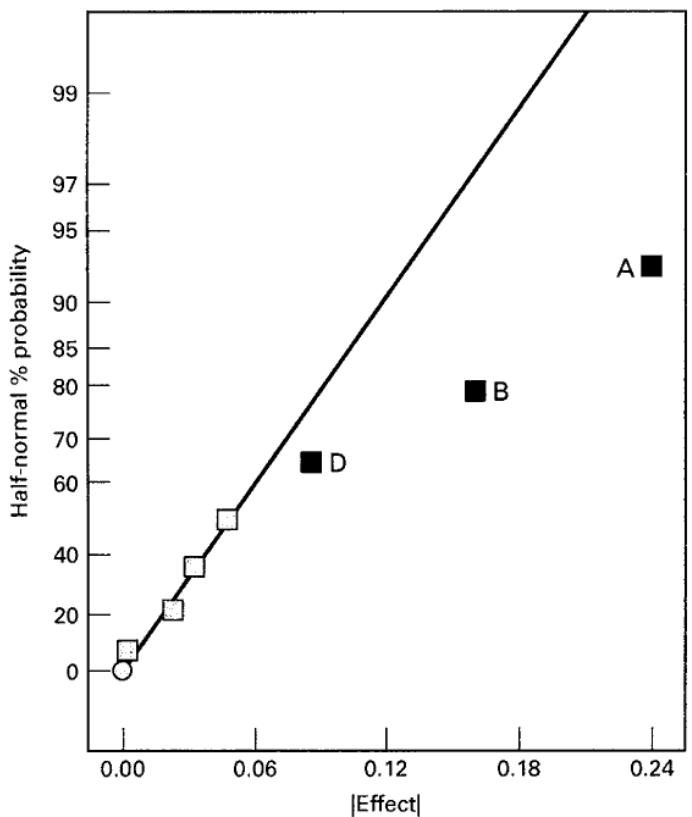
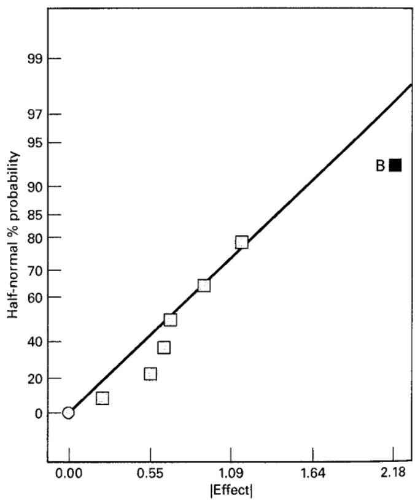
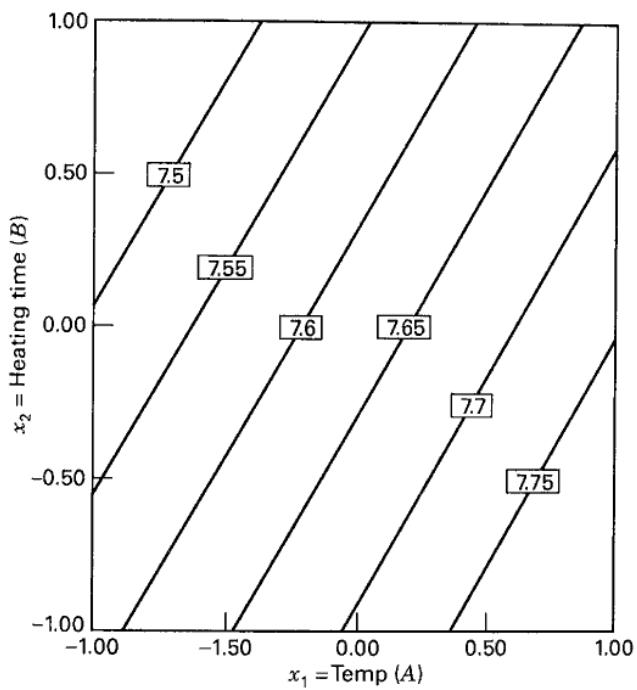
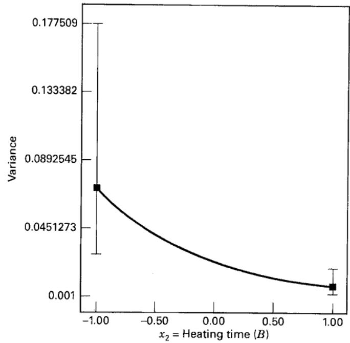
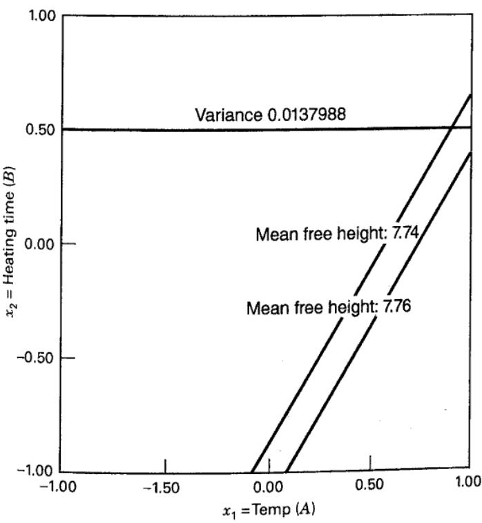

## 12.3 Analysis of the Crossed Array Design

Taguchi proposed that we summarize the data from a crossed array experiment with two statistics: the average of each observation in the inner array across all runs in the outer array and a summary statistic that attempted to combine information about the mean and variance, called the signal-to-noise ratio. These signal-to-noise ratios are purportedly defined so that a maximum value of the ratio minimizes variability transmitted from the noise variables. Then an analysis is performed to determine which settings of the controllable factors result in (1) the mean as close as possible to the desired target and (2) a maximum value of the signal-to-noise ratio. Signal-to-noise ratios are problematic; they can result in confounding of location and dispersion effects, and they often do not produce the desired result of finding a solution to the RPD problem that minimizes the transmitted variability. This is discussed in detail in the supplemental material for this chapter.

A more appropriate analysis for a crossed array design is to model the mean and variance of the response directly, where the sample mean and the sample variance for each observation in the inner array are computed across all runs in the outer array. Because of the crossed array structure, the sample means $\overline{y}_i$ and variances $s_i^2$ are computed over the same levels of the noise variables, so any differences between these quantities are due to differences in the levels of the controllable variables. Consequently, choosing the levels of the controllable variables to optimize the mean and simultaneously minimize the variability is a valid approach.

To illustrate this approach, consider the leaf spring experiment in Table 12.1. The last two columns of this table show the sample means $\overline{y}_i$ and variances $s_i^2$ for each run in the inner array. Figure 12.2 is the half-normal probability plot of the effects for the mean free height response. Clearly, factors $A$ , $B$ , and $D$ have important effects. Since these factors are aliased with three-factor interactions, it seems reasonable to conclude that these effects are real. The model for the mean free height response is

$$
\hat {\overline {{y}}} _ {i} = 7. 6 3 + 0. 1 2 x _ {1} - 0. 0 8 1 x _ {2} + 0. 0 4 4 x _ {4}
$$

  
■ FIGURE 12.2 Half-normal plot of effect, mean free height response  
■ FIGURE 12.3 Half-normal plot of effects, $\ln (s_i^2)$ response

where the x's represent the original design factors A, B, and D. Because the sample variance does not have a normal distribution (it is scaled chi-square), it is usually best to analyze the natural log of the variance. Figure 12.3 is the half-normal probability plot of the effects of the $\ln(s_{i}^{2})$ response. The only significant effect is factor B. The model for the $\ln(s_{i}^{2})$ response is

$$
\widehat {\ln (s _ {i} ^ {2})} = - 3. 7 4 - 1. 0 9 x _ {2}
$$

Figure 12.4 is a contour plot of the mean free height in terms of factors A and B with factor D = 0, and Figure 12.5 is a plot of the variance response in the original scale. Clearly, the variance of the free height decreases as the heating time (factor B) increases.

Suppose that the objective of the experimenter is to find a set of conditions that results in a mean free height between 7.74 and 7.76 inches, with minimum variability. This is a standard multiple response optimization problem and can be solved by any of the methods for solving these problems described in Chapter 11. Figure 12.6 is an overlay plot of the two responses, with factor D = hold down time held constant at the high level. By also selecting A = temperature at the high level and B = heating time at 0.50 (in coded units), we can achieve a mean free height between the desired limits with variance of approximately 0.0138.

A disadvantage of the mean and variance modeling approach using the crossed array design is that it does not take direct advantage of the interactions between controllable variables and noise variables. In some instances, it can even mask these relationships. Furthermore, the variance response is likely to have a nonlinear relationship with the controllable variables (see Figure 12.5, for example), and this can complicate the modeling process. In the next section, we introduce an alternative design strategy and modeling approach that overcomes these issues.

  
■ FIGURE 12.4 Contour plot of the mean free height response with D = hold down time = 0

  
■ FIGURE 12.5 Plot of the variance of free height versus x = heating time (B)

  
■ FIGURE 12.6 Overlay plot of the mean free height and variance of free height with $x_{4}=$ hold down time $(D)$ at the high level
