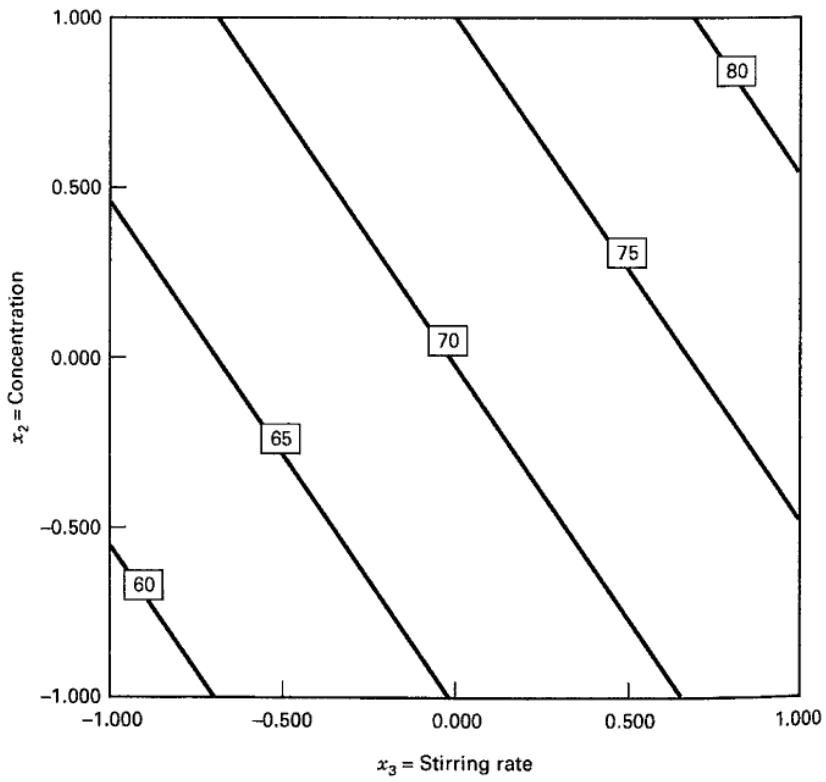
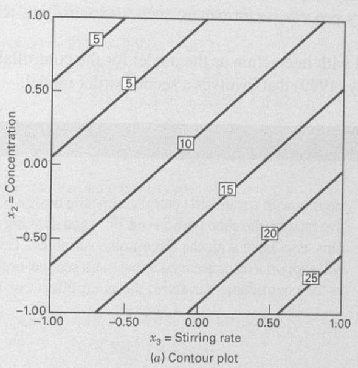
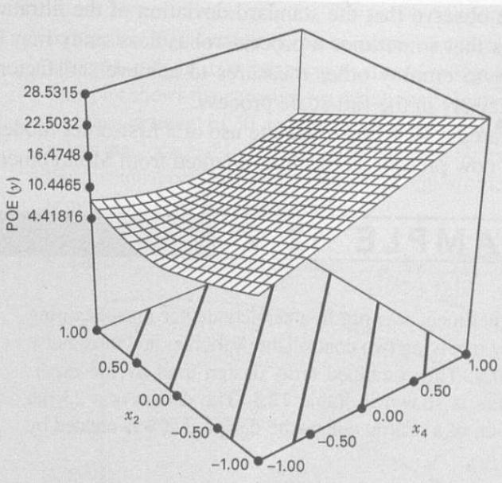
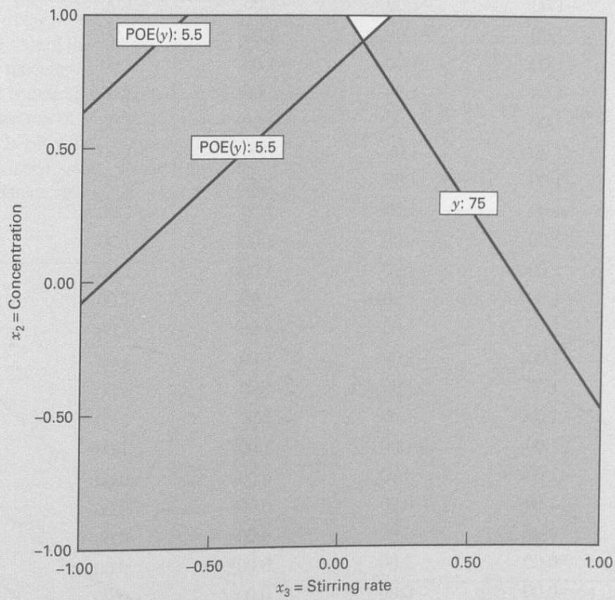
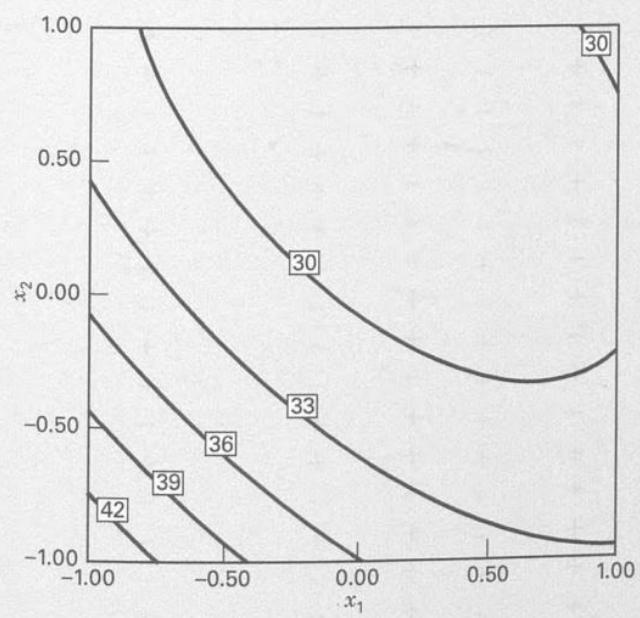
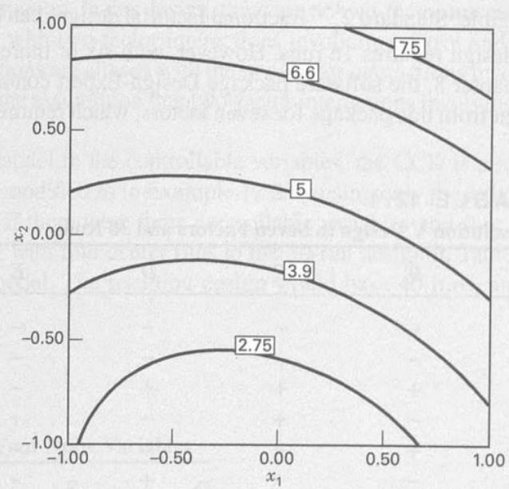
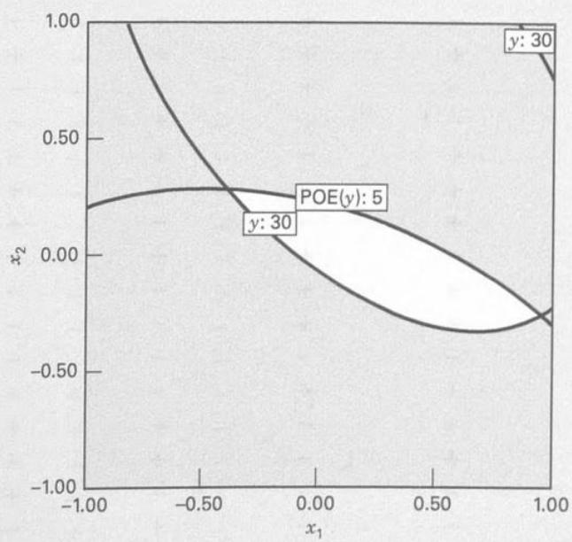

## 12.4 Combined Array Designs and the Response Model Approach

As noted in the previous section, interactions between controllable and noise factors are the key to a robust design problem. Therefore, it is logical to use a model for the response that includes both controllable and noise factors and their interactions. To illustrate, suppose that we have two controllable factors $x_{1}$ and $x_{2}$ and a single noise factor $z_{1}$ . We assume that both control and noise factors are expressed as the usual coded variables (that is, they are centered at zero and have lower and upper limits at $\pm a$ ). If we wish to consider a first-order model involving the controllable and noise variables, a logical model is

$$
y = \beta_ {0} + \beta_ {1} x _ {1} + \beta_ {2} x _ {2} + \beta_ {1 2} x _ {1} x _ {2} + \gamma_ {1} z _ {1} + \delta_ {1 1} x _ {1} z _ {1} + \delta_ {2 1} x _ {2} z _ {1} + \epsilon\tag{12.1}
$$

Notice that this model has the main effects of both controllable factors and their interaction, the main effect of the noise variable, and interactions between the both controllable and noise variables. This type of model, incorporating both controllable and noise variables, is often called a response model. Unless at least one of the regression coefficients $\delta_{11}$ and $\delta_{21}$ is nonzero, there will be no robust design problem.

An important advantage of the response model approach is that both the controllable factors and the noise factors can be placed in a single experimental design; that is, the inner and outer array structure of the Taguchi approach can be avoided. We usually call the design containing both controllable and noise factors a combined array design.

As mentioned previously, we assume that noise variables are random variables, although they are controllable for purposes of an experiment. Specifically, we assume that the noise variables are expressed in coded units, they have expected value zero, and variance $\sigma_{z}^{2}$ , and if there are several noise variables, they have zero covariances. Under these assumptions, it is easy to find a model for the mean response just by taking the expected value of y in Equation 12.1. This yields

$$
E _ {z} (y) = \beta_ {0} + \beta_ {1} x _ {1} + \beta_ {2} x _ {2} + \beta_ {1 2} x _ {1} x _ {2}\tag{12.2}
$$

where the z subscript on the expectation operator is a reminder to take expected value with respect to both random variables in Equation 12.1, $z_{1}$ and $\epsilon$ . To find a model for the variance of the response y, we use the transmission of error approach. First, expand the response model Equation 12.1 in a first-order Taylor series around $z_{1}=0$ . This gives

$$
\begin{array}{r l} & y \cong y _ {z = 0} + \frac {d y}{d z _ {1}} (z _ {1} - 0) + R + \epsilon \\ & \quad \cong \beta_ {0} + \beta_ {1} x _ {1} + \beta_ {2} x _ {2} + \beta_ {1 2} x _ {1} x _ {2} \\ & \qquad + (\gamma_ {1} + \delta_ {1 1} x _ {1} + \delta_ {2 1} x _ {2}) z _ {1} + R + \epsilon \end{array}
$$

where R is the remainder term in the Taylor series. As is the usual practice, we will ignore the remainder term. Now the variance of y can be obtained by applying the variance operator across this last expression (without R). The resulting variance model is

$$
V _ {z} (y) = \sigma_ {z} ^ {2} (\gamma_ {1} + \delta_ {1 1} x _ {1} + \delta_ {2 1} x _ {2}) ^ {2} + \sigma^ {2}\tag{12.3}
$$

Once again, we have used the z subscript on the variance operator as a reminder that both $z_{1}$ and $\epsilon$ are random variables. Equations 12.2 and 12.3 are simple models for the mean and variance of the response variable of interest. Note the following:

1. The mean and variance models involve only the controllable variables. This means that we can potentially set the controllable variables to achieve a target value of the mean and minimize the variability transmitted by the noise variable.

2. Although the variance model involves only the controllable variables, it also involves the interaction regression coefficients between the controllable and noise variables. This is how the noise variable influences the response.

3. The variance model is a quadratic function of the controllable variables.

4. The variance model (apart from $\sigma^{2}$ ) is just the square of the slope of the fitted response model in the direction of the noise variable.

To use these models operationally, we would

1. Perform an experiment and fit an appropriate response model, such as Equation 12.1.

2. Replace the unknown regression coefficients in the mean and variance models with their least squares estimates from the response model and replace $\sigma^{2}$ in the variance model by the residual mean square found when fitting the response model.

3. Optimize the mean and variance model using the standard multiple response optimization methods discussed in Section 11.3.4.

It is very easy to generalize these results. Suppose that there are k controllable variables and r noise variables. We will write the general response model involving these variables as

$$
y (\mathbf {x}, \mathbf {z}) = f (\mathbf {x}) + h (\mathbf {x}, \mathbf {z}) + \epsilon\tag{12.4}
$$

where $f(\mathbf{x})$ is the portion of the model that involves only the controllable variables and $h(\mathbf{x}, \mathbf{z})$ are the terms that involve the main effects of the noise factors and the interactions between the controllable and noise factors. Typically, the structure for $h(\mathbf{x}, \mathbf{z})$ is

$$
h (\mathbf {x}, \mathbf {z}) = \sum_ {i = 1} ^ {r} \gamma_ {i} z _ {i} + \sum_ {i = 1} ^ {k} \sum_ {j = 1} ^ {r} \delta_ {i j} x _ {i} z _ {j}
$$

The structure for $f(\mathbf{x})$ will depend on what type of model for the controllable variables the experimenter thinks is appropriate. The logical choices are the first-order model with interaction and the second-order model. If we assume that the noise variables have mean zero, variances $\sigma_{z_{i}}^{2}$ , and zero covariances and that the noise variables and the random errors $\epsilon$ have zero covariances, then the mean model for the response is just

$$
E _ {z} [ y (\mathbf {x}, \mathbf {z}) ] = f (\mathbf {x})\tag{12.5}
$$

and the variance model for the response is

$$
V _ {z} [ y (\mathbf {x}, \mathbf {z}) ] = \sum_ {i = 1} ^ {r} \left[ \frac {\partial y (\mathbf {x} , \mathbf {z})}{\partial z _ {i}} \right] ^ {2} \sigma_ {z _ {i}} ^ {2} + \sigma^ {2}\tag{12.6}
$$

Myers, Montgomery, and Anderson-Cook (2016) give a slightly more general form for Equation (12.6) based on applying a conditional variance operator directly to the response model.

## EXAMPLE 12.1

To illustrate the foregoing procedure, reconsider Example 6.2 in which four factors were studied in a $2^{4}$ factorial design to investigate their effect on the filtration rate of a chemical product. We will assume that factor A, temperature, is potentially difficult to control in the full-scale process, but it can be controlled during the experiment (which was performed in a pilot plant). The other three factors, pressure (B), concentration (C), and stirring rate (D), are easy to control. Thus, the noise factor $z_{1}$ is temperature, and the controllable variables $x_{1}, x_{2}$ , and $x_{3}$ are pressure, concentration, and stirring rate, respectively. Because both the controllable factors and the noise factor are in the same design, the $2^{4}$ factorial design used in this experiment is an example of a combined array design.

Using the results from Example 6.2, the response model is

$$
\begin{array}{r l} \hat {y} (\mathbf {x}, z _ {1}) & = 7 0. 0 6 + \left(\frac {2 1 . 6 2 5}{2}\right) z _ {1} \\ & \quad + \left(\frac {9 . 8 7 5}{2}\right) x _ {2} + \left(\frac {1 4 . 6 2 5}{2}\right) x _ {3} \\ & \quad - \left(\frac {1 8 . 1 2 5}{2}\right) x _ {2} z _ {1} + \left(\frac {1 6 . 6 2 5}{2}\right) x _ {3} z _ {1} \\ & = 7 0. 0 6 + 1 0. 8 1 z _ {1} + 4. 9 4 x _ {2} + 7. 3 1 x _ {3} \\ & \quad - 9. 0 6 x _ {2} z _ {1} + 8. 3 1 x _ {3} z _ {1} \end{array}
$$

Using Equations 12.5 and 12.6, we can find the mean and variance models as

$$
E _ {z} [ y (\mathbf {x}, z _ {1}) ] = 7 0. 0 6 + 4. 9 4 x _ {2} + 7. 3 1 x _ {3}
$$

and

$$
\begin{array}{r l} V _ {z} [ y (\mathbf {x}, z _ {1}) ] & = \sigma_ {z} ^ {2} (1 0. 8 1 - 9. 0 6 x _ {2} + 8. 3 1 x _ {3}) ^ {2} + \sigma^ {2} \\ & = \sigma_ {z} ^ {2} (1 1 6. 9 1 + 8 2. 0 8 x _ {2} ^ {2} + 6 9. 0 6 x _ {3} ^ {2} \\ & - 1 9 5. 8 8 x _ {2} + 1 7 9. 6 6 x _ {3} - 1 5 0. 5 8 x _ {2} x _ {3}) + \sigma^ {2} \end{array}
$$

respectively. Now assume that the low and high levels of the noise variable temperature have been run at one standard deviation on either side of its typical or average value, so that $\sigma_{z}^{2}=1$ and use $\hat{\sigma}^{2}=19.51$ (this is the residual mean square obtained by fitting the response model). Therefore, the variance model becomes

$$
\begin{array}{r} V _ {z} [ y (\mathbf {x}, z _ {1}) ] = 1 3 6. 4 2 - 1 9 5. 8 8 x _ {2} + 1 7 9. 6 6 x _ {3} \\ - 1 5 0. 5 8 x _ {2} x _ {3} + 8 2. 0 8 x _ {2} ^ {2} + 6 9. 0 6 x _ {3} ^ {2} \end{array}
$$

Figure 12.7 presents a contour plot from the Design-Expert software package of the response contours from the mean model. To construct this plot, we held the noise factor (temperature) at zero and the nonsignificant controllable factor (pressure) at zero. Notice that mean filtration rate increases as both concentration and stirring rate increase. Design-Expert will also automatically construct plots of the square root of the variance contours, which it labels propagation of error, or POE. Obviously, the POE is just the standard deviation of the transmitted variability in the response as a function of the controllable variables. Figure 12.8 shows a contour plot and a three-dimensional response surface plot of the POE, obtained from Design-Expert. (In this plot, the noise variable is held constant at zero, as explained previously.)

Suppose that the experimenter wants to maintain a mean filtration rate of about 75 and minimize the variability around this value. Figure 12.9 shows an overlay plot of the contours of mean filtration rate and the POE as a function of concentration and stirring rate, the significant controllable variables. To achieve the desired objectives, it will be necessary to hold concentration at the high level and stirring rate very near the middle level.

## ■ FIGURE 12.7 Contours of constant mean filtration rate, Example 12.1, with $x_{1}=$ temperature = 0

  
(b) Response surface plot

■ FIGURE 12.8 Contour plot and response surface of propagation of error for Example 12.1, with $x_{1}$ = temperature = 0  
  
■ FIGURE 12.9 Overlay plot of mean and POE contours for filtration rate, Example 12.1, with $x_{1} = temperature = 0$

We observe that the standard deviation of the filtration rate response in Example 12.1 is still very large. This illustrates that sometimes a process robustness study may not yield an entirely satisfactory solution. It may still be necessary to employ other measures to achieve satisfactory process performance, such as controlling temperature more precisely in the full-scale process.

Example 12.1 illustrates the use of a first-order model with interaction as the model for the controllable factors $f(\mathbf{x})$ . We now present an example adapted from Montgomery (1999) that involves a second-order model.

## EXAMPLE 12.2

An experiment was run in a semiconductor manufacturing facility involving two controllable variables and three noise variables. The combined array design used by the experimenters is shown in Table 12.3. The design is a 23-run variation of a central composite design that was created by starting with a standard central composite design (CCD) for five factors (the cube portion is a $2^{5-1}$ ) and deleting the axial runs associated with the three noise variables. This design will support a response model that has a second-order model in the controllable variables, the main effects of the three

## TABLE 12.3

Combined Array Experiment with Two Controllable Variables and Three Noise Variables, Example 12.2

<table><tr><td>Run Number</td><td> $x_1$ </td><td> $x_2$ </td><td> $z_1$ </td><td> $z_2$ </td><td> $z_3$ </td><td>y</td></tr><tr><td>1</td><td>-1.00</td><td>-1.00</td><td>-1.00</td><td>-1.00</td><td>1.00</td><td>44.2</td></tr><tr><td>2</td><td>1.00</td><td>-1.00</td><td>-1.00</td><td>-1.00</td><td>-1.00</td><td>30.0</td></tr><tr><td>3</td><td>-1.00</td><td>1.00</td><td>-1.00</td><td>-1.00</td><td>-1.00</td><td>30.0</td></tr><tr><td>4</td><td>1.00</td><td>1.00</td><td>-1.00</td><td>-1.00</td><td>1.00</td><td>35.4</td></tr><tr><td>5</td><td>-1.00</td><td>-1.00</td><td>1.00</td><td>-1.00</td><td>-1.00</td><td>49.8</td></tr><tr><td>6</td><td>1.00</td><td>-1.00</td><td>1.00</td><td>-1.00</td><td>1.00</td><td>36.3</td></tr><tr><td>7</td><td>-1.00</td><td>1.00</td><td>1.00</td><td>-1.00</td><td>1.00</td><td>41.3</td></tr><tr><td>8</td><td>1.00</td><td>1.00</td><td>1.00</td><td>-1.00</td><td>-1.00</td><td>31.4</td></tr><tr><td>9</td><td>-1.00</td><td>-1.00</td><td>-1.00</td><td>1.00</td><td>-1.00</td><td>43.5</td></tr><tr><td>10</td><td>1.00</td><td>-1.00</td><td>-1.00</td><td>1.00</td><td>1.00</td><td>36.1</td></tr><tr><td>11</td><td>-1.00</td><td>1.00</td><td>-1.00</td><td>1.00</td><td>1.00</td><td>22.7</td></tr><tr><td>12</td><td>1.00</td><td>1.00</td><td>-1.00</td><td>1.00</td><td>-1.00</td><td>16.0</td></tr><tr><td>13</td><td>-1.00</td><td>-1.00</td><td>1.00</td><td>1.00</td><td>1.00</td><td>43.2</td></tr><tr><td>14</td><td>1.00</td><td>-1.00</td><td>1.00</td><td>1.00</td><td>-1.00</td><td>30.3</td></tr><tr><td>15</td><td>-1.00</td><td>1.00</td><td>1.00</td><td>1.00</td><td>-1.00</td><td>30.1</td></tr><tr><td>16</td><td>1.00</td><td>1.00</td><td>1.00</td><td>1.00</td><td>1.00</td><td>39.2</td></tr><tr><td>17</td><td>-2.00</td><td>0.00</td><td>0.00</td><td>0.00</td><td>0.00</td><td>46.1</td></tr><tr><td>18</td><td>2.00</td><td>0.00</td><td>0.00</td><td>0.00</td><td>0.00</td><td>36.1</td></tr><tr><td>19</td><td>0.00</td><td>-2.00</td><td>0.00</td><td>0.00</td><td>0.00</td><td>47.4</td></tr><tr><td>20</td><td>0.00</td><td>2.00</td><td>0.00</td><td>0.00</td><td>0.00</td><td>31.5</td></tr><tr><td>21</td><td>0.00</td><td>0.00</td><td>0.00</td><td>0.00</td><td>0.00</td><td>30.8</td></tr><tr><td>22</td><td>0.00</td><td>0.00</td><td>0.00</td><td>0.00</td><td>0.00</td><td>30.7</td></tr><tr><td>23</td><td>0.00</td><td>0.00</td><td>0.00</td><td>0.00</td><td>0.00</td><td>31.0</td></tr></table>

noise variables, and the interactions between the control and noise factors. The fitted response model is

$$
\begin{array}{r l} \hat {y} (\mathbf {x}, \mathbf {z}) & = 3 0. 3 7 - 2. 9 2 x _ {1} - 4. 1 3 x _ {2} \\ & + 2. 6 0 x _ {1} ^ {2} + 2. 1 8 x _ {2} ^ {2} + 2. 8 7 x _ {1} x _ {2} \\ & + 2. 7 3 z _ {1} - 2. 3 3 z _ {2} + 2. 3 3 z _ {3} - 0. 2 7 x _ {1} z _ {1} \\ & + 0. 8 9 x _ {1} z _ {2} + 2. 5 8 x _ {1} z _ {3} \\ & + 2. 0 1 x _ {2} z _ {1} - 1. 4 3 x _ {2} z _ {2} + 1. 5 6 x _ {2} z _ {3} \end{array}
$$

The mean and variance models are

$$
\begin{array}{r} E _ {z} [ y (\mathbf {x}, \mathbf {z}) ] = 3 0. 3 7 - 2. 9 2 x _ {1} - 4. 1 3 x _ {2} \\ + 2. 6 0 x _ {1} ^ {2} + 2. 1 8 x _ {2} ^ {2} + 2. 8 7 x _ {1} x _ {2} \end{array}
$$

and

$$
\begin{array}{r} V _ {z} [ y (\mathbf {x}, \mathbf {z}) ] = 1 9. 2 6 + 6. 4 0 x _ {1} + 2 4. 9 1 x _ {2} + 7. 5 2 x _ {1} ^ {2} \\ + 8. 5 2 x _ {2} ^ {2} + 4. 4 2 x _ {1} x _ {2} \end{array}
$$

where we have substituted parameter estimates from the fitted response model into the equations for the mean and variance models and, as in the previous example, assumed that $\sigma_{z}^{2}=1$ . Figures 12.10 and 12.11 (from Design-Expert) present contour plots of the process mean and POE (remember POE is the square root of the variance response surface) generated from these models.

In this problem, it is desirable to keep the process mean below 30. From inspection of Figures 12.10 and 12.11, it is clear that some trade-off will be necessary if we wish to make the process variance small. Because there are only two controllable variables, a logical way to accomplish this trade-off is to overlay the contours of constant mean response and constant variance, as shown in Figure 12.12. This plot shows the contours for which the process mean is less than or equal to 30 and the process standard deviation is less than or equal to 5. The region bounded by these contours would represent a typical operating region of low mean response and low process variance.

  
■ FIGURE 12.10 Contour plot of the mean model, Example 12.2

  
■ FIGURE 12.11 Contour plot of the POE, Example 12.2

  
■ FIGURE 12.12 Overlay of the mean and POE contours for Example 12.2, with the open region indicating satisfactory operating conditions for process mean and variance
