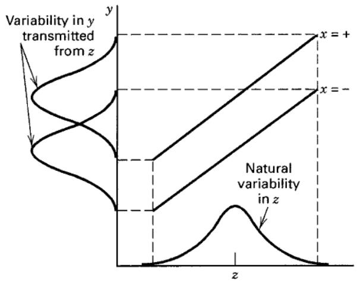
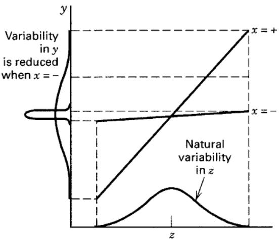

# 12.2 交叉阵列设计

田口最初的 RPD 方法分别为可控变量和噪声变量建立统计设计，再将二者“交叉”：可控变量设计中的每个处理组合，都与噪声变量设计中的每个处理组合配合实施。这种试验设计称为**交叉阵列设计**。

用习题 8.9 首次介绍的板簧试验说明这种方法。试验研究五个因子对汽车板簧自由高度的影响：$A$ 为炉温、$B$ 为加热时间、$C$ 为转移时间、$D$ 为压紧时间、$E$ 为淬火油温。原问题属于 RPD，淬火油温是噪声变量。数据见表 12.1。可控因子的设计为生成元 $D=ABC$ 的 $2^{4-1}$ 部分析因设计，称为**内阵列**；单个噪声因子采用 $2^1$ 设计，称为**外阵列**。外阵列中的每次试验都配合内阵列的八个处理组合实施，形成交叉结构。16 个不同设计点各重复三次，共得到 48 个自由高度观测值。

交叉阵列的重要特点是提供可控因子与噪声因子交互作用的信息，这些交互作用对解决 RPD 问题至关重要。图 12.1 中，$x$ 为可控因子，$z$ 为噪声因子。图 12.1a 不存在交互作用，因此无论怎样设置 $x$，都无法改变 $z$ 的变异向响应传递的程度。图 12.1b 有强交互作用，$x$ 取低水平时响应变异远小于取高水平时。因此，在这里所考虑的模型中，至少需要一个可控因子与噪声因子的交互作用，才能通过可控因子设置改善稳健性。后面将看到，识别和建模这些交互作用，是有效解决 RPD 问题的关键。

表 12.1
板簧试验

<table><tr><td>A</td><td>B</td><td>C</td><td>D</td><td>E = -</td><td>E = +</td><td>$\bar{y}$</td><td>$s^2$</td></tr><tr><td>-</td><td>-</td><td>-</td><td>-</td><td>7.78, 7.78, 7.81</td><td>7.50, 7.25, 7.12</td><td>7.54</td><td>0.090</td></tr><tr><td>+</td><td>-</td><td>-</td><td>+</td><td>8.15, 8.18, 7.88</td><td>7.88, 7.88, 7.44</td><td>7.90</td><td>0.071</td></tr><tr><td>-</td><td>+</td><td>-</td><td>+</td><td>7.50, 7.56, 7.50</td><td>7.50, 7.56, 7.50</td><td>7.52</td><td>0.001</td></tr><tr><td>+</td><td>+</td><td>-</td><td>-</td><td>7.59, 7.56, 7.75</td><td>7.63, 7.75, 7.56</td><td>7.64</td><td>0.008</td></tr><tr><td>-</td><td>-</td><td>+</td><td>+</td><td>7.54, 8.00, 7.88</td><td>7.32, 7.44, 7.44</td><td>7.60</td><td>0.074</td></tr><tr><td>+</td><td>-</td><td>+</td><td>-</td><td>7.69, 8.09, 8.06</td><td>7.56, 7.69, 7.62</td><td>7.79</td><td>0.053</td></tr><tr><td>-</td><td>+</td><td>+</td><td>-</td><td>7.56, 7.52, 7.44</td><td>7.18, 7.18, 7.25</td><td>7.36</td><td>0.030</td></tr><tr><td>+</td><td>+</td><td>+</td><td>+</td><td>7.56, 7.81, 7.69</td><td>7.81, 7.50, 7.59</td><td>7.66</td><td>0.017</td></tr></table>

  
（a）无可控因子 × 噪声因子交互作用

  
（b）有显著的可控因子 × 噪声因子交互作用
图 12.1 可控因子与噪声因子交互作用在稳健设计中的作用

表 12.2 是 Byrne 和 Taguchi（1987）的另一个 RPD 实例，目标是开发与尼龙管装配后能达到所需拉脱力的弹性连接器。四个可控因子各有三个水平：$A$ 为过盈量、$B$ 为连接器壁厚、$C$ 为插入深度、$D$ 为胶黏剂百分比。三个噪声因子各有两个水平：$E$ 为调理时间、$F$ 为调理温度、$G$ 为调理相对湿度。表 12.2a 为可控因子的内阵列，是 $3^{4-2}$ 三水平部分析因设计；表 12.2b 为噪声因子的 $2^3$ 外阵列。内阵列各处理都与外阵列全部处理组合配合实施，共形成 72 个拉脱力观测值。

表 12.2 揭示了田口设计策略的一个主要问题：交叉阵列可能导致试验规模非常大。本例只有七个因子，却需要 72 次试验。而且内阵列是分辨度 III 的 $3^{4-2}$ 设计（见第 9 章），尽管次数很多，仍无法获取可控变量交互作用的独立信息；主效应也因与二因子交互作用严重混杂而可能受到污染。第 12.4 节将介绍通常更有效的联合阵列设计。

表 12.2
连接器拉脱力试验的设计

<table><tr><td colspan="13">（b）外阵列</td><td></td></tr><tr><td></td><td></td><td></td><td></td><td></td><td>E</td><td>-</td><td>-</td><td>-</td><td>-</td><td>+</td><td>+</td><td>+</td><td>+</td></tr><tr><td></td><td></td><td></td><td></td><td></td><td>F</td><td>-</td><td>-</td><td>+</td><td>+</td><td>-</td><td>-</td><td>+</td><td>+</td></tr><tr><td></td><td></td><td></td><td></td><td></td><td>G</td><td>-</td><td>+</td><td>-</td><td>+</td><td>-</td><td>+</td><td>-</td><td>+</td></tr><tr><td colspan="5">（a）内阵列</td><td></td><td></td><td></td><td></td><td></td><td></td><td></td><td></td><td></td></tr><tr><td>试验</td><td>A</td><td>B</td><td>C</td><td>D</td><td></td><td></td><td></td><td></td><td></td><td></td><td></td><td></td><td></td></tr><tr><td>1</td><td>-1</td><td>-1</td><td>-1</td><td>-1</td><td></td><td>15.6</td><td>9.5</td><td>16.9</td><td>19.9</td><td>19.6</td><td>19.6</td><td>20.0</td><td>19.1</td></tr><tr><td>2</td><td>-1</td><td>0</td><td>0</td><td>0</td><td></td><td>15.0</td><td>16.2</td><td>19.4</td><td>19.2</td><td>19.7</td><td>19.8</td><td>24.2</td><td>21.9</td></tr><tr><td>3</td><td>-1</td><td>+1</td><td>+1</td><td>+1</td><td></td><td>16.3</td><td>16.7</td><td>19.1</td><td>15.6</td><td>22.6</td><td>18.2</td><td>23.3</td><td>20.4</td></tr><tr><td>4</td><td>0</td><td>-1</td><td>0</td><td>+1</td><td></td><td>18.3</td><td>17.4</td><td>18.9</td><td>18.6</td><td>21.0</td><td>18.9</td><td>23.2</td><td>24.7</td></tr><tr><td>5</td><td>0</td><td>0</td><td>+1</td><td>-1</td><td></td><td>19.7</td><td>18.6</td><td>19.4</td><td>25.1</td><td>25.6</td><td>21.4</td><td>27.5</td><td>25.3</td></tr><tr><td>6</td><td>0</td><td>+1</td><td>-1</td><td>0</td><td></td><td>16.2</td><td>16.3</td><td>20.0</td><td>19.8</td><td>14.7</td><td>19.6</td><td>22.5</td><td>24.7</td></tr><tr><td>7</td><td>+1</td><td>-1</td><td>+1</td><td>0</td><td></td><td>16.4</td><td>19.1</td><td>18.4</td><td>23.6</td><td>16.8</td><td>18.6</td><td>24.3</td><td>21.6</td></tr><tr><td>8</td><td>+1</td><td>0</td><td>-1</td><td>+1</td><td></td><td>14.2</td><td>15.6</td><td>15.1</td><td>16.8</td><td>17.8</td><td>19.6</td><td>23.2</td><td>24.2</td></tr><tr><td>9</td><td>+1</td><td>+1</td><td>0</td><td>-1</td><td></td><td>16.1</td><td>19.9</td><td>19.3</td><td>17.3</td><td>23.1</td><td>22.7</td><td>22.6</td><td>28.6</td></tr></table>
