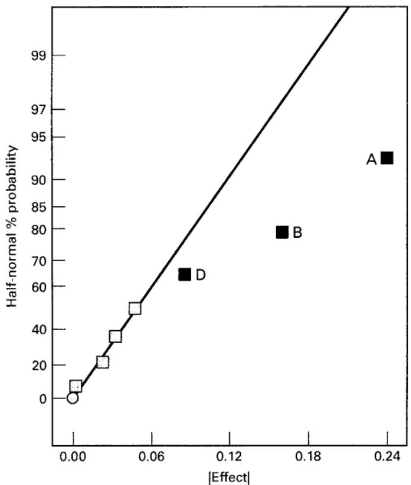
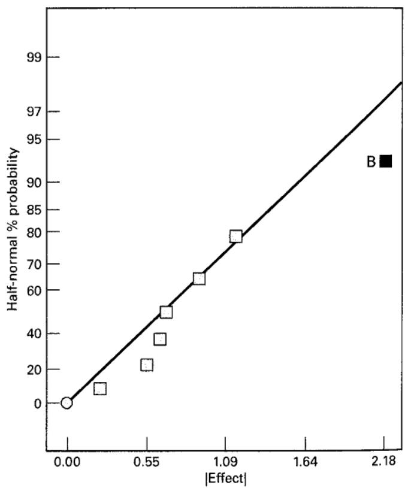
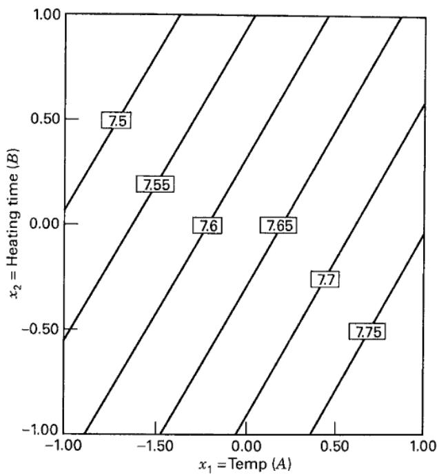
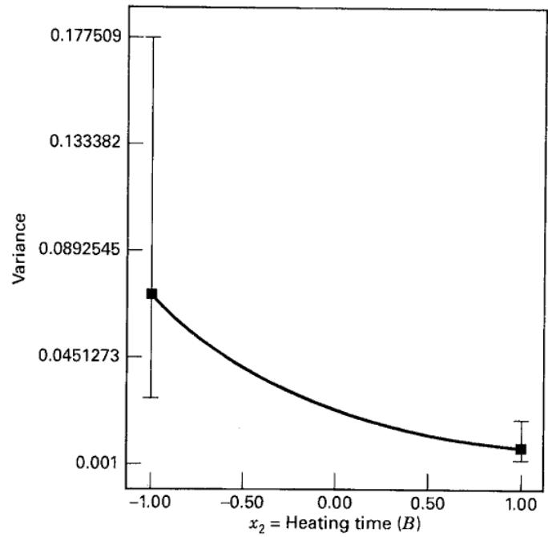
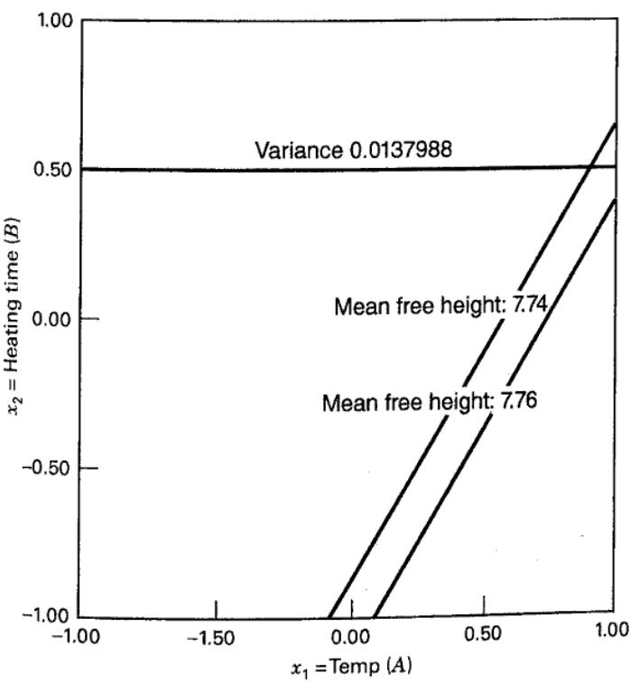

# 12.3 交叉阵列设计的分析

田口建议用两个统计量汇总交叉阵列数据：内阵列各处理在所有外阵列试验上的平均值，以及试图综合均值与方差信息的**信噪比**。这些比值的定义意在通过最大化信噪比，减小噪声传递的变异。随后确定可控因子设置，使均值尽量接近目标且信噪比最大。然而，信噪比存在问题：可能混淆位置效应与离散程度效应，也往往不能实现使传递变异最小的 RPD 目标。本章补充材料对此有详细讨论。

更适当的方法是直接为响应均值和方差建模：对内阵列每个处理，利用所有外阵列观测计算样本均值和样本方差。由于交叉结构，各 $\bar y_i$ 和 $s_i^2$ 都基于相同的噪声水平，因而其差别源于可控变量水平的不同。因此，选择可控变量水平以优化均值并同时减小变异，是合理的方法。

以表 12.1 的板簧试验为例。最后两列给出了内阵列各处理的样本均值与方差。图 12.2 是平均自由高度效应的半正态概率图，明显重要的因子为 $A$、$B$ 和 $D$。这些因子与三因子交互作用混杂，因此将其视为真实主效应是合理的。平均自由高度模型为

$$
\hat {\overline {{y}}} _ {i} = 7.63 + 0.12 x _ {1} - 0.081 x _ {2} + 0.044 x _ {4}
$$

  
图 12.2 平均自由高度响应效应的半正态图
图 12.3 $\ln(s_i^2)$ 响应效应的半正态图

其中各 $x$ 对应原设计因子 $A$、$B$ 和 $D$。由于样本方差不服从正态分布，而是尺度化卡方分布，通常最好分析方差的自然对数。图 12.3 是 $\ln(s_i^2)$ 响应效应的半正态图，唯一显著的效应为 $B$，模型为

$$
\widehat {\ln (s _ {i} ^ {2})} = - 3.74 - 1.09 x _ {2}
$$

图 12.4 在 $D=0$ 时绘制关于 $A$、$B$ 的平均自由高度等高线；图 12.5 为原尺度上的方差响应。显然，随加热时间（$B$）增加，自由高度方差减小。

假设希望平均自由高度在 7.74～7.76 英寸之间，同时变异最小。这是标准多响应优化问题，可用第 11 章任一相关方法求解。图 12.6 是两个响应的叠加图，其中 $D$（压紧时间）固定为高水平。若同时将 $A$（温度）设为高水平、$B$（加热时间）设为编码值 0.50，则平均自由高度满足要求，方差约为 0.0138。

用交叉阵列直接拟合均值和方差的不足是，没有直接利用可控变量与噪声变量的交互作用，有时甚至会掩盖这种关系。此外，方差与可控变量往往呈非线性关系（如图 12.5），使建模复杂。下一节介绍能够克服这些问题的替代设计与建模策略。

  
图 12.4 $D$（压紧时间）为零时平均自由高度的等高线图

  
图 12.5 自由高度方差随加热时间 $B$ 的变化

  
图 12.6 $x_4$（压紧时间 $D$）为高水平时平均自由高度与方差的叠加图
