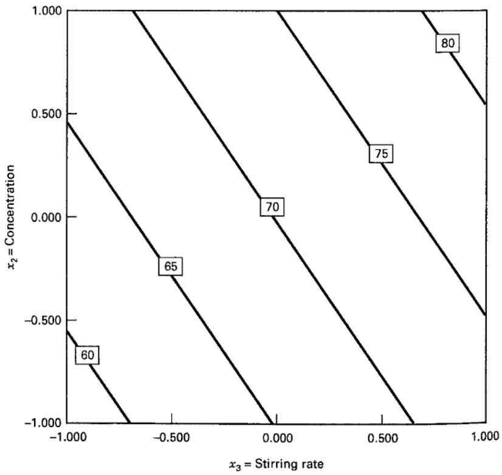
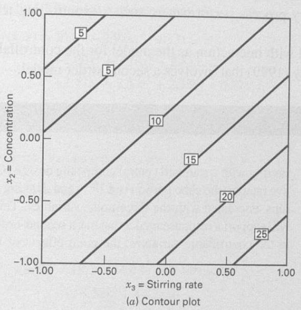
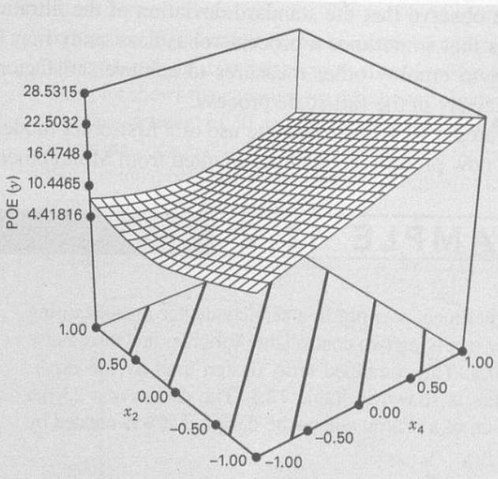
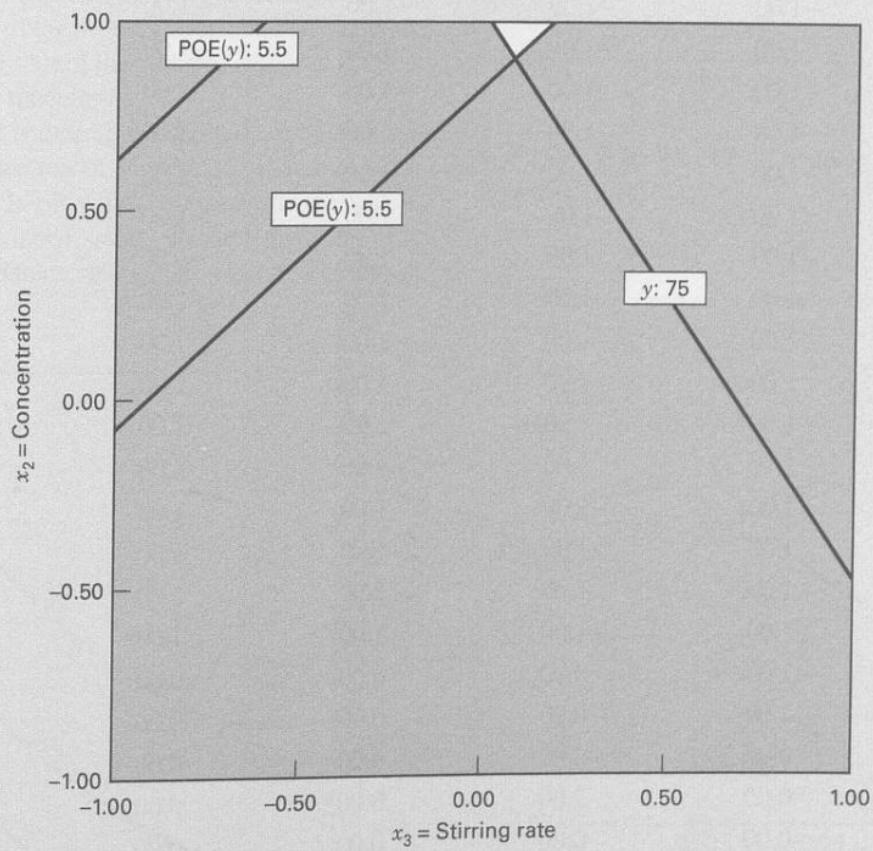
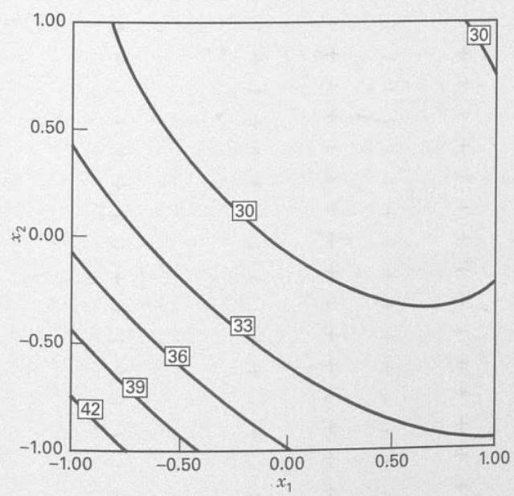
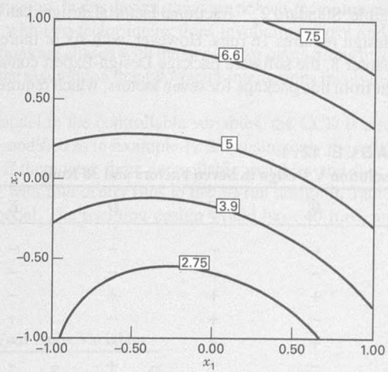
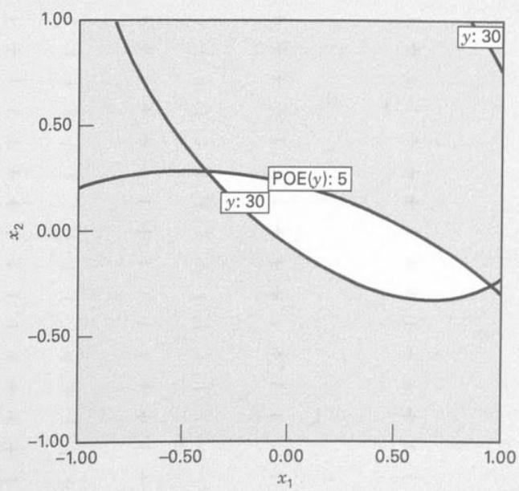

# 12.4 联合阵列设计与响应模型方法

如前所述，可控因子与噪声因子的交互作用是稳健设计的关键。因此，采用同时包含可控因子、噪声因子及其交互作用的响应模型是合理的。假设有两个可控因子 $x_1$、$x_2$ 和一个噪声因子 $z_1$，均采用通常的编码变量，即以零为中心、上下限为 $\pm a$。若考虑含可控与噪声变量的一阶及交互作用模型，则可写成

$$
y = \beta_ {0} + \beta_ {1} x _ {1} + \beta_ {2} x _ {2} + \beta_ {12} x _ {1} x _ {2} + \gamma_ {1} z _ {1} + \delta_ {11} x _ {1} z _ {1} + \delta_ {21} x _ {2} z _ {1} + \epsilon\tag{12.1}
$$

模型包含两个可控因子的主效应及其交互作用、噪声变量主效应，以及可控因子与噪声因子的交互作用。这种同时包含可控和噪声变量的模型通常称为**响应模型**。在这一模型中，只有 $\delta_{11}$、$\delta_{21}$ 至少一个非零，才能通过可控因子设置改变噪声传递的变异。

响应模型方法的一个重要优点是，可控因子与噪声因子可放入同一个试验设计，从而避免田口方法的内、外阵列结构。这种同时包含两类因子的设计通常称为**联合阵列设计**。

如前所述，噪声变量虽然在试验中可控，实际仍被视为随机变量。具体假定它们采用编码单位，期望为零、方差为 $\sigma_z^2$；若有多个噪声变量，则两两协方差为零。在这些假设下，对式（12.1）取期望即可得到均值模型：

$$
E _ {z} (y) = \beta_ {0} + \beta_ {1} x _ {1} + \beta_ {2} x _ {2} + \beta_ {12} x _ {1} x _ {2}\tag{12.2}
$$

期望算子的下标 $z$ 提醒我们，要对式（12.1）中的 $z_1$ 与 $\epsilon$ 两个随机量同时取期望，并假定二者不相关。为求响应方差，采用**误差传递法**：先将响应模型在 $z_1=0$ 附近作一阶泰勒展开，得到

$$
\begin{array}{r l} & y \cong y _ {z = 0} + \frac {d y}{d z _ {1}} (z _ {1} - 0) + R + \epsilon \\ & \quad \cong \beta_ {0} + \beta_ {1} x _ {1} + \beta_ {2} x _ {2} + \beta_ {12} x _ {1} x _ {2} \\ & \qquad + (\gamma_ {1} + \delta_ {11} x _ {1} + \delta_ {21} x _ {2}) z _ {1} + R + \epsilon \end{array}
$$

其中 $R$ 为余项。按通常做法忽略余项，再对上式取方差，得到

$$
V _ {z} (y) = \sigma_ {z} ^ {2} (\gamma_ {1} + \delta_ {11} x _ {1} + \delta_ {21} x _ {2}) ^ {2} + \sigma^ {2}\tag{12.3}
$$

方差算子的下标 $z$ 同样提醒我们，$z_1$ 和 $\epsilon$ 均为随机量。式（12.2）和（12.3）是响应均值和方差的简单模型，有以下特点：

1. 均值与方差模型都仅包含可控变量，因此可能通过设置可控变量实现目标均值，并使噪声传递的变异最小。

2. 虽然方差模型只包含可控变量，但包含可控因子与噪声因子交互作用的回归系数，这正是噪声影响响应的途径。

3. 方差模型是可控变量的二次函数。

4. 除残差方差 $\sigma^2$ 外，方差模型等于拟合响应模型沿噪声方向的斜率平方，再乘以噪声方差 $\sigma_z^2$。

实际使用这些模型时，步骤为：

1. 实施试验，拟合适当的响应模型，例如式（12.1）。

2. 用响应模型的最小二乘估计替换均值、方差模型中的未知回归系数，用拟合响应模型的残差均方替换方差模型中的 $\sigma^2$。

3. 采用第 11.3.4 节的标准多响应优化方法，优化均值和方差模型。

这些结果很容易推广。假设有 $k$ 个可控变量和 $r$ 个噪声变量，一般响应模型写为

$$
y (\mathbf {x}, \mathbf {z}) = f (\mathbf {x}) + h (\mathbf {x}, \mathbf {z}) + \epsilon\tag{12.4}
$$

其中 $f(\mathbf x)$ 仅包含可控变量，$h(\mathbf x,\mathbf z)$ 包含噪声因子主效应及可控因子与噪声因子的交互作用。通常取

$$
h (\mathbf {x}, \mathbf {z}) = \sum_ {i = 1} ^ {r} \gamma_ {i} z _ {i} + \sum_ {i = 1} ^ {k} \sum_ {j = 1} ^ {r} \delta_ {i j} x _ {i} z _ {j}
$$

$f(\mathbf x)$ 的形式取决于试验者认为适当的可控变量模型，合理选择包括带交互作用的一阶模型和二阶模型。假定噪声变量均值为零、方差为 $\sigma_{z_i}^2$、两两协方差为零，且噪声变量与随机误差 $\epsilon$ 的协方差也为零，则响应均值模型为

$$
E _ {z} [ y (\mathbf {x}, \mathbf {z}) ] = f (\mathbf {x})\tag{12.5}
$$

响应方差模型为

$$
V _ {z} [ y (\mathbf {x}, \mathbf {z}) ] = \sum_ {i = 1} ^ {r} \left[ \frac {\partial y (\mathbf {x} , \mathbf {z})}{\partial z _ {i}} \right] ^ {2} \sigma_ {z _ {i}} ^ {2} + \sigma^ {2}\tag{12.6}
$$

Myers、Montgomery 和 Anderson-Cook（2016）直接对响应模型应用条件方差算子，给出了式（12.6）稍为一般的形式。

## 例 12.1

重新考虑例 6.2：采用 $2^4$ 析因设计研究四个因子对化学产品过滤速率的影响。假定 $A$（温度）在正式生产中难以控制，但在中试试验中可以控制；$B$（压力）、$C$（浓度）和 $D$（搅拌速率）容易控制。因此，噪声因子 $z_1$ 为温度，可控变量 $x_1,x_2,x_3$ 分别为压力、浓度和搅拌速率。两类因子位于同一设计中，所以该 $2^4$ 设计是联合阵列的例子。

根据例 6.2 的结果，响应模型为

$$
\begin{array}{r l} \hat {y} (\mathbf {x}, z _ {1}) & = 70.06 + \left(\frac {21.625}{2}\right) z _ {1} \\ & \quad + \left(\frac {9.875}{2}\right) x _ {2} + \left(\frac {14.625}{2}\right) x _ {3} \\ & \quad - \left(\frac {18.125}{2}\right) x _ {2} z _ {1} + \left(\frac {16.625}{2}\right) x _ {3} z _ {1} \\ & = 70.06 + 10.81 z _ {1} + 4.94 x _ {2} + 7.31 x _ {3} \\ & \quad - 9.06 x _ {2} z _ {1} + 8.31 x _ {3} z _ {1} \end{array}
$$

由式（12.5）和（12.6）可得均值与方差模型，分别为

$$
E _ {z} [ y (\mathbf {x}, z _ {1}) ] = 70.06 + 4.94 x _ {2} + 7.31 x _ {3}
$$

以及

$$
\begin{array}{r l} V _ {z} [ y (\mathbf {x}, z _ {1}) ] & = \sigma_ {z} ^ {2} (10.81 - 9.06 x _ {2} + 8.31 x _ {3}) ^ {2} + \sigma^ {2} \\ & = \sigma_ {z} ^ {2} (116.91 + 82.08 x _ {2} ^ {2} + 69.06 x _ {3} ^ {2} \\ & - 195.88 x _ {2} + 179.66 x _ {3} - 150.58 x _ {2} x _ {3}) + \sigma^ {2} \end{array}
$$

假定噪声温度的低、高水平分别位于其典型均值两侧一个标准差的位置，因此 $\sigma_z^2=1$；再采用拟合响应模型所得的残差均方 $\hat\sigma^2=19.51$，则方差模型为

$$
\begin{array}{r} V _ {z} [ y (\mathbf {x}, z _ {1}) ] = 136.42 - 195.88 x _ {2} + 179.66 x _ {3} \\ - 150.58 x _ {2} x _ {3} + 82.08 x _ {2} ^ {2} + 69.06 x _ {3} ^ {2} \end{array}
$$

图 12.7 是 Design-Expert 根据均值模型绘制的过滤速率等高线。绘图时将噪声因子温度和不显著的可控因子压力都固定为零。浓度和搅拌速率越高，平均过滤速率越大。软件还自动绘制方差平方根的等高线，并称为**误差传播**（POE）。POE 就是噪声传递到响应中的标准差，以可控变量为自变量。图 12.8 给出了 POE 等高线与三维响应面，其中噪声变量按上述方法固定为零。

假设希望平均过滤速率维持在约 75，同时使其变异最小。图 12.9 叠加了平均过滤速率和 POE 关于浓度、搅拌速率这两个显著可控变量的等高线。要达到目标，需将浓度保持在高水平，搅拌速率保持在中间水平附近。

图 12.7 例 12.1 的平均过滤速率等高线，噪声变量 $z_1$（温度）为零

  
（b）响应面图

图 12.8 例 12.1 的 POE 等高线与响应面，$z_1$（温度）为零
  
图 12.9 例 12.1 的平均过滤速率与 POE 等高线叠加图，$z_1$（温度）为零

例 12.1 中过滤速率的标准差仍很大，说明过程稳健性研究有时无法提供完全令人满意的解。可能还需采用其他措施，例如在正式生产中更精确地控制温度，才能达到满意性能。

例 12.1 的可控因子部分 $f(\mathbf x)$ 使用带交互作用的一阶模型。下面给出一个改编自 Montgomery（1999）、采用二阶模型的实例。

## 例 12.2

某半导体工厂实施了一项包含两个可控变量和三个噪声变量的试验，联合阵列见表 12.3。该设计是 CCD 的 23 次试验变形：从五因子标准 CCD（立方体部分为 $2^{5-1}$ 设计）出发，删除三个噪声变量方向的轴点。设计能够支持一个包括可控变量二阶模型、三个噪声变量主效应

## 表 12.3

例 12.2：两个可控变量与三个噪声变量的联合阵列试验

<table><tr><td>试验编号</td><td>$x_1$</td><td>$x_2$</td><td>$z_1$</td><td>$z_2$</td><td>$z_3$</td><td>y</td></tr><tr><td>1</td><td>-1.00</td><td>-1.00</td><td>-1.00</td><td>-1.00</td><td>1.00</td><td>44.2</td></tr><tr><td>2</td><td>1.00</td><td>-1.00</td><td>-1.00</td><td>-1.00</td><td>-1.00</td><td>30.0</td></tr><tr><td>3</td><td>-1.00</td><td>1.00</td><td>-1.00</td><td>-1.00</td><td>-1.00</td><td>30.0</td></tr><tr><td>4</td><td>1.00</td><td>1.00</td><td>-1.00</td><td>-1.00</td><td>1.00</td><td>35.4</td></tr><tr><td>5</td><td>-1.00</td><td>-1.00</td><td>1.00</td><td>-1.00</td><td>-1.00</td><td>49.8</td></tr><tr><td>6</td><td>1.00</td><td>-1.00</td><td>1.00</td><td>-1.00</td><td>1.00</td><td>36.3</td></tr><tr><td>7</td><td>-1.00</td><td>1.00</td><td>1.00</td><td>-1.00</td><td>1.00</td><td>41.3</td></tr><tr><td>8</td><td>1.00</td><td>1.00</td><td>1.00</td><td>-1.00</td><td>-1.00</td><td>31.4</td></tr><tr><td>9</td><td>-1.00</td><td>-1.00</td><td>-1.00</td><td>1.00</td><td>-1.00</td><td>43.5</td></tr><tr><td>10</td><td>1.00</td><td>-1.00</td><td>-1.00</td><td>1.00</td><td>1.00</td><td>36.1</td></tr><tr><td>11</td><td>-1.00</td><td>1.00</td><td>-1.00</td><td>1.00</td><td>1.00</td><td>22.7</td></tr><tr><td>12</td><td>1.00</td><td>1.00</td><td>-1.00</td><td>1.00</td><td>-1.00</td><td>16.0</td></tr><tr><td>13</td><td>-1.00</td><td>-1.00</td><td>1.00</td><td>1.00</td><td>1.00</td><td>43.2</td></tr><tr><td>14</td><td>1.00</td><td>-1.00</td><td>1.00</td><td>1.00</td><td>-1.00</td><td>30.3</td></tr><tr><td>15</td><td>-1.00</td><td>1.00</td><td>1.00</td><td>1.00</td><td>-1.00</td><td>30.1</td></tr><tr><td>16</td><td>1.00</td><td>1.00</td><td>1.00</td><td>1.00</td><td>1.00</td><td>39.2</td></tr><tr><td>17</td><td>-2.00</td><td>0.00</td><td>0.00</td><td>0.00</td><td>0.00</td><td>46.1</td></tr><tr><td>18</td><td>2.00</td><td>0.00</td><td>0.00</td><td>0.00</td><td>0.00</td><td>36.1</td></tr><tr><td>19</td><td>0.00</td><td>-2.00</td><td>0.00</td><td>0.00</td><td>0.00</td><td>47.4</td></tr><tr><td>20</td><td>0.00</td><td>2.00</td><td>0.00</td><td>0.00</td><td>0.00</td><td>31.5</td></tr><tr><td>21</td><td>0.00</td><td>0.00</td><td>0.00</td><td>0.00</td><td>0.00</td><td>30.8</td></tr><tr><td>22</td><td>0.00</td><td>0.00</td><td>0.00</td><td>0.00</td><td>0.00</td><td>30.7</td></tr><tr><td>23</td><td>0.00</td><td>0.00</td><td>0.00</td><td>0.00</td><td>0.00</td><td>31.0</td></tr></table>

及可控因子与噪声因子交互作用的响应模型。拟合模型为

$$
\begin{array}{r l} \hat {y} (\mathbf {x}, \mathbf {z}) & = 30.37 - 2.92 x _ {1} - 4.13 x _ {2} \\ & + 2.60 x _ {1} ^ {2} + 2.18 x _ {2} ^ {2} + 2.87 x _ {1} x _ {2} \\ & + 2.73 z _ {1} - 2.33 z _ {2} + 2.33 z _ {3} - 0.27 x _ {1} z _ {1} \\ & + 0.89 x _ {1} z _ {2} + 2.58 x _ {1} z _ {3} \\ & + 2.01 x _ {2} z _ {1} - 1.43 x _ {2} z _ {2} + 1.56 x _ {2} z _ {3} \end{array}
$$

均值与方差模型分别为

$$
\begin{array}{r} E _ {z} [ y (\mathbf {x}, \mathbf {z}) ] = 30.37 - 2.92 x _ {1} - 4.13 x _ {2} \\ + 2.60 x _ {1} ^ {2} + 2.18 x _ {2} ^ {2} + 2.87 x _ {1} x _ {2} \end{array}
$$

以及

$$
\begin{array}{r} V _ {z} [ y (\mathbf {x}, \mathbf {z}) ] = 19.26 + 6.40 x _ {1} + 24.91 x _ {2} + 7.52 x _ {1} ^ {2} \\ + 8.52 x _ {2} ^ {2} + 4.42 x _ {1} x _ {2} \end{array}
$$

上式已代入响应模型的参数估计，并与前例一样假定 $\sigma_z^2=1$。图 12.10 和图 12.11 是 Design-Expert 根据这些模型绘制的过程均值与 POE 等高线。POE 是方差响应面的平方根。

希望将过程均值保持在 30 以下。从图 12.10 和图 12.11 可见，若还要使过程方差较小，必须作出一定权衡。由于只有两个可控变量，可以叠加均值与方差等高线，如图 12.12。图中边界对应过程均值不大于 30、标准差不大于 5；这些等高线围成的区域是兼具较低均值和较小方差的典型操作区域。

  
图 12.10 例 12.2 均值模型的等高线图

  
图 12.11 例 12.2 的 POE 等高线图

  
图 12.12 例 12.2 均值与 POE 等高线的叠加图，空白区域表示均值与方差均满足要求的操作条件
