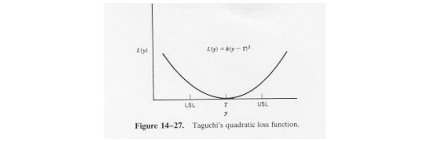
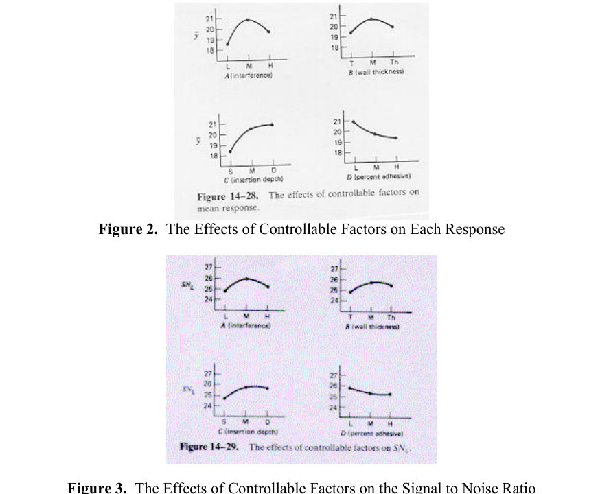
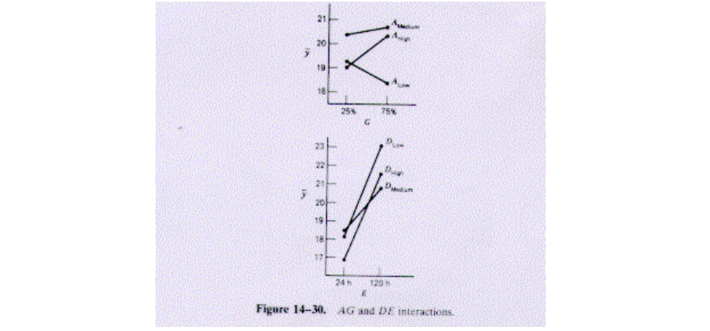
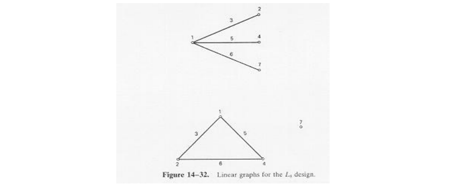
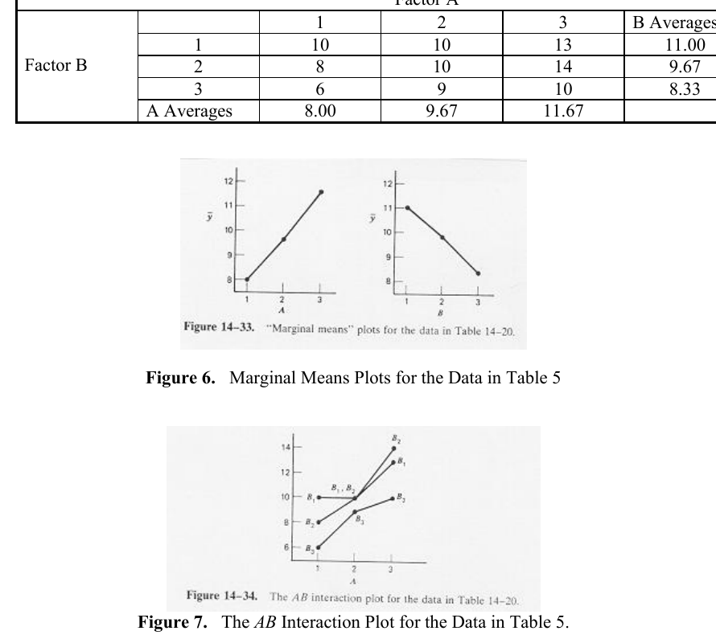

# 第 12 章补充材料

> 本页译自原书配套补充材料 Chapter 12, Supplemental Text Material。补充材料沿用了部分旧版交叉引用，译文按本项目章节编号修正。

## S12.1 田口的稳健参数设计方法

本书一直强调试验设计在产品和过程改进中的重要性。如今，许多工程师和科学家在正规技术教育中会接触统计试验设计，但在 1960～1980 年间，试验设计乃至统计方法远没有现在普及。

20 世纪 80 年代初，日本工程师田口玄一提出用试验设计实现以下目标：

1. 使产品或过程对环境条件具有稳健性。
2. 使产品对部件变异具有稳健性。
3. 使目标值附近的变异最小。

这些与正文第 12.1 节讨论的目标基本一致。田口提出的问题具有工程意义，基本思想也合理。但同行评审发现，他倡导的某些新数据分析方法和试验设计方法不必要地复杂、低效，有时甚至无效。本节简要介绍其质量工程思想和参数设计实例，并借实例说明具体技术的问题。如正文第 12 章所示，可将其合理的工程思想与更有效的响应面设计、分析方法结合。

田口的质量工程思想适用范围很广。他将产品或过程开发分为**系统设计、参数设计和公差设计**三个阶段。系统设计利用科学和工程原理确定基本配置。例如，测量未知电阻时，可确定采用惠斯通电桥；设计印刷电路板装配过程时，则确定需要哪些轴向插装机、表面贴装机和波峰焊设备。

参数设计确定系统参数的具体值，例如电桥的标称电阻和电源值，或电路板装配所需贴装机的数量与类型。通常希望选择这些标称参数，使不可控或噪声变量传递的变异最小。

公差设计确定最合适的参数公差。例如，在惠斯通电桥中识别最敏感部件及其公差要求；若某个部件对电路性能影响很小，则可采用较宽公差。

田口建议在这一过程中，尤其是参数设计和公差设计阶段，使用统计试验设计。本节关注参数设计。这里的“最佳”产品或过程，是指投入日常运行后，对不可控因素不敏感、具有稳健性的产品或过程。

稳健设计并非新概念。工程师一直努力使产品在不可控条件下正常工作，例如商用运输机在雷暴与晴朗空气中都应保持良好飞行性能。田口的贡献是认识到，试验设计可以作为工程设计过程的正式组成部分，帮助实现这一目标。

减少变异是其思想的重要组成部分。产品或过程的每项性能通常有目标值或标称值，希望减少目标附近的变异。田口用损失函数描述偏离目标的后果，损失指消费者使用质量特性偏离标称值的产品时给社会造成的成本。这与传统观点不同。他采用二次损失函数

$$
L(y)=k(y-T)^2,
$$

如图 S12.1。即使 $y$ 仅小幅偏离目标 $T$，也产生损失；传统做法通常只在超出上下规格限时施加惩罚，即 $y>USL$ 或 $y<LSL$。减少变异、降低成本的思想，与 Deming 和 Juran 的持续改进理念完全一致。

**图 S12.1** 田口的二次损失函数。

这一思想包含三个核心观点：产品和过程应抵御外部变异；试验设计是实现该目标的工程工具；围绕目标运行比仅仅符合规格更重要。这些观点合理而有价值，试验设计可以帮助将其落实。下面讨论其具体技术，并说明可以怎样改进。

## S12.2 田口的具体技术

### 一个实例

使用正文中的连接器拉脱力试验说明田口技术。详细背景见 Byrne 和 S. Taguchi 在 *Quality Progress* 1987 年 12 月发表的“The Taguchi Approach to Parameter Design”（第 19～26 页）。目标是将弹性连接器装配到尼龙管上，使拉脱性能适用于汽车发动机，具体希望拉脱力最大。四个可控因子和三个噪声因子见表 S12.1。希望找到既能提供最大拉脱力，又最不受噪声影响的可控因子水平。噪声虽然在日常运行中不可控，但试验时可以控制。可控因子各取三个水平，噪声因子各取两个水平。

**表 S12.1** 参数设计实例的因子与水平

| 可控因子 | 水平 1 | 水平 2 | 水平 3 |
| --- | --- | --- | --- |
| A：过盈量 | 低 | 中 | 高 |
| B：连接器壁厚 | 薄 | 中 | 厚 |
| C：插入深度 | 浅 | 中 | 深 |
| D：连接器预浸液中胶黏剂百分比 | 低 | 中 | 高 |

| 噪声因子 | 水平 1 | 水平 2 |
| --- | --- | --- |
| E：调理时间 | 24 h | 120 h |
| F：调理温度 | 72 °F | 150 °F |
| G：调理相对湿度 | 25% | 75% |

田口分别为可控与噪声因子选择一个设计，称为**正交表**，用 1、2、3 表示水平。这里分别采用标准 $3^{4-2}$ 部分析因设计和 $2^3$ 析因设计，即 $L_9$ 与 $L_8$ 正交表。

**表 S12.2a** 可控因子的 $L_9$ 内阵列

| 试验 | A | B | C | D |
| --- | --- | --- | --- | --- |
| 1 | 1 | 1 | 1 | 1 |
| 2 | 1 | 2 | 2 | 2 |
| 3 | 1 | 3 | 3 | 3 |
| 4 | 2 | 1 | 2 | 3 |
| 5 | 2 | 2 | 3 | 1 |
| 6 | 2 | 3 | 1 | 2 |
| 7 | 3 | 1 | 3 | 2 |
| 8 | 3 | 2 | 1 | 3 |
| 9 | 3 | 3 | 2 | 1 |

**表 S12.2b** 噪声因子的 $L_8$ 外阵列及各列

| 试验 | E | F | EF | G | EG | FG | EFG |
| --- | --- | --- | --- | --- | --- | --- | --- |
| 1 | 1 | 1 | 1 | 1 | 1 | 1 | 1 |
| 2 | 1 | 1 | 1 | 2 | 2 | 2 | 2 |
| 3 | 1 | 2 | 2 | 1 | 1 | 2 | 2 |
| 4 | 1 | 2 | 2 | 2 | 2 | 1 | 1 |
| 5 | 2 | 1 | 2 | 1 | 2 | 1 | 2 |
| 6 | 2 | 1 | 2 | 2 | 1 | 2 | 1 |
| 7 | 2 | 2 | 1 | 1 | 2 | 2 | 1 |
| 8 | 2 | 2 | 1 | 2 | 1 | 1 | 2 |

将两个设计组合，形成**交叉阵列**或**乘积阵列**：内阵列的九次试验各与外阵列八个条件配合，总共 72 次，观测拉脱力如下。

**表 S12.3** 内、外阵列参数设计的拉脱力响应。列 $y_1$～$y_8$ 对应表 S12.2b 的外阵列顺序。

| 内阵列试验 | $y_1$ | $y_2$ | $y_3$ | $y_4$ | $y_5$ | $y_6$ | $y_7$ | $y_8$ | $\bar y$ | $SN_L$ |
| --- | --- | --- | --- | --- | --- | --- | --- | --- | --- | --- |
| 1 | 15.6 | 9.5 | 16.9 | 19.9 | 19.6 | 19.6 | 20.0 | 19.1 | 17.525 | 24.025 |
| 2 | 15.0 | 16.2 | 19.4 | 19.2 | 19.7 | 19.8 | 24.2 | 21.9 | 19.425 | 25.500 |
| 3 | 16.3 | 16.7 | 19.1 | 15.6 | 22.6 | 18.2 | 23.3 | 20.4 | 19.025 | 25.335 |
| 4 | 18.3 | 17.4 | 18.9 | 18.6 | 21.0 | 18.9 | 23.2 | 24.7 | 20.125 | 25.904 |
| 5 | 19.7 | 18.6 | 19.4 | 25.1 | 25.6 | 21.4 | 27.5 | 25.3 | 22.825 | 26.908 |
| 6 | 16.2 | 16.3 | 20.0 | 19.8 | 14.7 | 19.6 | 22.5 | 24.7 | 19.225 | 25.326 |
| 7 | 16.4 | 19.1 | 18.4 | 23.6 | 16.8 | 18.6 | 24.3 | 21.6 | 19.850 | 25.711 |
| 8 | 14.2 | 15.6 | 15.1 | 16.8 | 17.8 | 19.6 | 23.2 | 24.2 | 18.313 | 24.828 |
| 9 | 16.1 | 19.9 | 19.3 | 17.3 | 23.1 | 22.7 | 22.6 | 28.6 | 21.200 | 26.152 |

### 数据分析与结论

田口建议分析内阵列各处理的平均响应，并通过适当信噪比分析变异。信噪比由二次损失函数导出，常用的三种形式为：

$$
\begin{aligned}
\text{望目特性：}\quad SN_T&=10\log_{10}\left(\frac{\bar y^2}{S^2}\right),\\
\text{望大特性：}\quad SN_L&=-10\log_{10}\left(\frac1n\sum_{i=1}^n\frac1{y_i^2}\right),\\
\text{望小特性：}\quad SN_S&=-10\log_{10}\left(\frac1n\sum_{i=1}^n y_i^2\right).
\end{aligned}
$$

这些比值采用分贝尺度。希望减少固定目标附近的变异时用 $SN_T$，响应越大越好时用 $SN_L$，越小越好时用 $SN_S$。田口以适当信噪比最大的因子水平作为最优设置。本例希望拉脱力最大，因此使用 $SN_L$；表 S12.3 最后两列给出各内阵列处理的均值和信噪比。[^1]

田口方法的使用者常用方差分析识别影响均值与信噪比的因子，也常绘制各因子的边际均值图，如图 S12.2、S12.3，再从图中逐个“选出优胜水平”。本例 $A$、$C$ 的效应较大。最大化 $SN_L$ 会选择过盈量中等、插入深、壁厚中等、胶黏剂低；最大化平均拉脱力则选择过盈量中等、插入深度中等、壁厚中等、胶黏剂低。插入中等和深的差别很小。这一做法意在同时提高均值和减少变异。

**图 S12.2、S12.3** 可控因子对平均响应与信噪比的影响。

田口方法的倡导者认为，使用信噪比通常无需检查具体的可控—噪声交互作用，但也承认有时检查交互作用能改善过程理解。此研究发现 $AG$ 和 $DE$ 较大。图 S12.4 表明，过盈量中等时拉脱力最高，斜率接近零，因此相对湿度影响最小；胶黏剂低时，无论调理时间如何，拉脱力都较高。

**图 S12.4** $AG$ 与 $DE$ 交互作用。

考虑成本等因素后，最终选择过盈量中等、壁薄、插入深度中等、胶黏剂低。壁薄比中等便宜得多，而中等插入深度被认为比深插入的变异略小。原内阵列没有该组合，因此补做五次确认试验，噪声因子均取低水平。作者报告确认结果良好。

### 对田口试验策略与设计的评价

田口参数设计使用正交表，除 $L_8$、$L_9$ 外还有 $L_4$、$L_{12}$、$L_{16}$、$L_{18}$、$L_{27}$ 等。这些设计并非田口发明：例如 $L_8$ 为 $2_{\mathrm{III}}^{7-4}$ 部分析因设计，$L_9$ 为 $3_{\mathrm{III}}^{4-2}$ 设计，$L_{12}$ 为 Plackett–Burman 设计，$L_{16}$ 为 $2_{\mathrm{III}}^{15-11}$ 设计。Box、Bisgaard 和 Fung（1988）追溯了其来源。

如正文第 8、9 章所述，部分设计的混杂结构复杂，尤其 $L_{12}$ 和所有三水平设计，会使二因子交互作用与主效应部分混杂。若某些交互作用较大，可能得出错误结论。

田口主张不必明确考虑二因子交互作用，认为通过适当定义响应与设计因子，或采用滑动水平设置，可以消除交互作用。例如，压力与温度独立变化时很可能有交互作用，若根据压力水平选择温度水平，则可能减弱它。但除非过程知识非常充分，这两种方法通常很难实施。没有充分处理可控因子潜在交互作用，是该参数设计方法的主要弱点。

田口更倾向于采用三水平因子估计曲率，而不是为交互作用设计试验。在 Byrne 和 Taguchi 的例子中，四个可控因子均取三水平，三个噪声因子以两水平全析因实施。记可控因子为 $x_1,\ldots,x_4$，噪声为 $z_1,z_2,z_3$，该设计可支持如下形式的模型：

$$
y=\beta_0+\sum_{j=1}^4\beta_jx_j+\sum_{j=1}^4\beta_{jj}x_j^2
+\sum_{i=1}^3\gamma_i z_i+\sum_{i<j}\gamma_{ij}z_i z_j
+\sum_{i=1}^3\sum_{j=1}^4\delta_{ij}z_i x_j+\epsilon.
$$

可估计可控因子的线性和二次效应，却不能独立估计其二因子交互作用，因为后者与主效应混杂；噪声主效应、噪声之间的二因子交互作用，以及可控—噪声交互作用也可纳入，但相关估计仍须结合混杂结构理解。忽略可控因子交互作用可能不明智。

这种策略值得商榷，因为交互作用本身也是曲率的一种形式。更稳妥的策略是先识别重要主效应和交互作用，在有曲率证据后，再对重要变量考察二次项。这样通常试验更少、解释更简单，也更有助于理解过程。

交叉阵列规模大也是一个问题：本例研究七个因子需要 72 次试验，却仍无法估计四个可控因子间的交互作用。存在更好的替代设计。例如，将七个因子全部取两水平放入联合阵列，采用 $2_{\mathrm{IV}}^{7-2}$ 设计，只需 32 次。表 S12.4 给出定义关系及低阶混杂关系。

**表 S12.4** 替代参数设计：七因子、32 次试验的四分之一实施，分辨度 IV

$$
I=ABCDF=ABDEG=CEFG.
$$

| 低阶效应 | 与之混杂的低阶效应 | 低阶效应 | 与之混杂的低阶效应 |
| --- | --- | --- | --- |
| A | — | AF | BCD |
| B | — | AG | BDE |
| C | EFG | BC | ADF |
| D | — | BD | ACF、AEG |
| E | CFG | BE | ADG |
| F | CEG | BF | ACD |
| G | CEF | BG | ADE |
| AB | CDF、DEG | CD | ABF |
| AC | BDF | CE | FG |
| AD | BCF、BEG | CF | ABD、EG |
| AE | BDG | CG | EF |
| DE | ABG | DF | ABC |
| DG | ABE | ACE | AFG |
| ACG | AEF | BCE | BFG |
| BCG | BEF | CDE | DFG |
| CDG | DEF | | |

表中仅列三阶及以下关系，“—”表示没有三阶及以下的混杂伙伴。因子分配可采用两种方案：

1. 可控因子分配给 $C,E,F,G$，噪声分配给 $A,B,D$。所有可控—噪声交互作用可估计，所有可控主效应不与二因子交互作用混杂。
2. 可控因子分配给 $A,B,C,D$，噪声分配给 $E,F,G$。可控主效应及其二因子交互作用可估计，噪声主效应也不与二因子交互作用混杂；仅 $CE,CF,CG$ 三个可控—噪声交互作用与噪声之间交互作用混杂。

两种安排都比内、外阵列的混杂结构清楚，而所需试验不到一半。通常没有必要使用交叉阵列；正文的联合阵列几乎总能大幅减少规模，并获得更有利于理解过程的信息。进一步讨论见 Myers 和 Montgomery（2002）。也可以选择支持噪声变量完整二次模型及全部可控—噪声交互作用的联合阵列。

另一个问题是实施顺序。为保证试验有效，应随机化运行次序；但交叉阵列可能没有完全随机化。例如，可能先固定内阵列某行的可控水平，再实施全部外阵列；也可能先固定外阵列某列的噪声水平，再实施全部内阵列。选择往往取决于哪类因子更容易改变。两种做法都会引入**裂区结构**，若分析未考虑这一点，结论可能误导。没有证据表明田口方法倡导者普遍采用裂区分析，而田口又常低估随机化的重要性，因此实际中可能无意形成裂区并错误分析。裂区设计见正文第 14 章，稳健设计中的相关参考为 Box 和 Jones（1992）。

田口参数设计的另一个方面是用**线点图**分配正交表的列。图 S12.5 为 $L_8$ 的线点图，各编号表示设计列，连接两个节点的线段对应这两列的交互作用。先将变量分配到节点，再用剩余线段；分配节点时，将可能重要的交互作用所对应线段划去。

**图 S12.5** $L_8$ 设计的线点图。

例如，第 3 列含第 1、2 列的交互作用，第 5 列含第 1、4 列的交互作用。若有四个因子，可分配到 1、2、4、7 列，保证主效应不与二因子交互作用混杂，但图中未清楚显示全部交互作用混杂：第 3 列含 1–2 和 4–7，第 5 列含 1–4 和 2–7，第 6 列含 1–7 和 2–4。四因子八次试验是分辨度 IV 设计，二因子交互作用成对混杂。要完整理解，还需查补充交互作用表。

Taguchi（1986）为各推荐正交表给出了线点图，但似乎主要凭经验构造，可能导致低效设计。例如，其汽车发动机试验〔Taguchi 和 Wu，1980〕及切削工具试验〔Taguchi，1986〕都用 16 次试验，却安排为主效应与二因子交互作用混杂的分辨度 III；常规构造本可得到分辨度 IV，使主效应不与二因子交互作用混杂。线点图未必给出最好设计。更好的方法是直接使用列出设计及完整混杂结构的表，如附录表 XII；这类表容易构造，多种普及且价格较低的软件均可显示。

### 对田口数据分析方法的评价

田口的一些分析方法值得质疑。例如，部分方差分析变形已知会产生错误结果，属性数据和寿命试验也有专门但有争议的方法。详细评价见 Box、Bisgaard 和 Fung（1988）、Myers 和 Montgomery（2002）及其参考文献。下面关注三个方面：用边际均值优化水平、信噪比，以及方差分析中的某些用法。

先考虑边际均值图和逐个“选择优胜水平”的优化方式。设两个因子各有三个水平，数据如表 S12.5。根据图 S12.6，若要最大化 $y$，会选择 $A_3B_1$；但直接检查数据或图 S12.7 的交互作用，真正最大的是 $A_3B_2$。边际均值选水平不能保证最优。确认试验也无法提供这种保证，因为可能只确认了一个与最优相差很大的响应。更合适的方法是正文第 11 章介绍的响应面优化。

**表 S12.5** 边际均值图的数据

| B 水平 | A=1 | A=2 | A=3 | B 平均值 |
| --- | --- | --- | --- | --- |
| 1 | 10 | 10 | 13 | 11.00 |
| 2 | 8 | 10 | 14 | 10.67 |
| 3 | 6 | 9 | 10 | 8.33 |
| A 平均值 | 8.00 | 9.67 | 12.33 | |

**图 S12.6、S12.7** 表 S12.5 的边际均值图与 $AB$ 交互作用图。[^2]

田口以信噪比作为各种情形的性能度量，声称最大化适当比值可减少变异。先考虑望目比值 $SN_T=10\log_{10}(\bar y^2/S^2)$，它用于减少固定目标附近的变异。田口认为均值和标准差常相关，例如均值越大标准差越大，此时不宜先直接最小化标准差，再把均值调到目标。

他据经验提出两阶段优化：先识别影响 $SN_T$ 的控制因子并最大化比值，再识别影响均值但不影响比值的信号因子，用它们将均值调到目标。如果这种划分成立，$SN_T$ 属于**与调整无关的性能度量**（PERMIA）〔Leon 等，1987〕，信号因子就是调整因子。

信噪比的动机是分离位置和离散程度效应。使用 $SN_T$ 与分析原数据对数的标准差有密切关系，隐含认为对数变换可以分离两类效应，但并无保证。更稳妥的方法是实际研究适当的变换。

注意

$$
SN_T=10\log_{10}(\bar y^2)-10\log_{10}(S^2).
$$

如果均值固定在目标，则最大化比值等价于最小化 $\log(S^2)$。直接分析对数方差计算更少、更直观，也更清楚地显示哪些因子影响变异，有助于理解过程。直接最小化它还能避免某些因子仅将均值推高、并未降低方差，却因比值增大而误判。一般而言，若响应可写为

$$
y=\mu(\mathbf x_d,\mathbf x_a)\epsilon(\mathbf x_d),
$$

其中 $\mathbf x_d$ 影响离散程度，$\mathbf x_a$ 为不影响变异的调整因子，且均值可借调整因子保持在目标，则最大化 $SN_T$ 可与降低标准差相对应。考虑到其他潜在问题，正文建议直接以标准差或其对数为响应更稳妥。更多讨论见 Myers 和 Montgomery（2002）。

$SN_L$ 和 $SN_S$ 问题更大：可能无法识别离散程度效应，却只识别影响均值的位置效应。以望小比值为例：

$$
SN_S=-10\log_{10}\left(\frac1n\sum_{i=1}^n y_i^2\right).
$$

其依据是非负响应的二次损失

$$
L=C\frac1n\sum_{i=1}^n y_i^2,
\qquad
\log_{10}L=\log_{10}C+\log_{10}\left(\frac1n\sum_{i=1}^n y_i^2\right),
$$

其中 $C$ 为常数。因此 $SN_S=10\log_{10}C-10\log_{10}L$，最大化比值确实最小化损失。但

$$
\frac1n\sum_{i=1}^n y_i^2
=\bar y^2+\frac1n\left(\sum_{i=1}^n y_i^2-n\bar y^2\right)
=\bar y^2+\frac{n-1}{n}S^2.
$$

所以，以 $SN_S$ 为响应混淆了位置与离散程度效应。拉脱力例子的 $SN_L$ 也呈现这一问题：均值与比值随各因子的变化形状近似相同，说明主要测量位置效应。由于比值包含 $y^2$ 或 $1/y^2$，对异常值或接近零的值非常敏感，且不具有原响应线性变换下的不变性。作者强烈建议不使用这些比值。

更好的方法是分别建立 $\bar y$ 与 $\log(S^2)$ 的响应面模型。如果没有各设计点的重复，可以采用残差分析估计变异。另一种十分有效的方法是正文介绍的响应模型：在一个模型中同时包含可控因子和噪声变量，再导出均值与方差响应面，并用标准响应面方法优化。

最后讨论田口的一些方差分析用法。Quinlan（1985）在美国供应商协会田口方法研讨会上报告了速度表软轴质量改进试验，希望减小塑料外壳收缩，因为收缩过大导致噪声。设计采用 $L_{16}$，即 $2_{\mathrm{III}}^{15-11}$。每个条件下生产 3000 英尺产品，取四个样本测量收缩，再计算均值和 $SN_S$。

他以 $SN_S$ 为响应，将绝对值最小的七个效应对应均方合并为误差，结果其余八个因子全部显著，按大小依次为 $E,G,K,A,C,F,D,H$；也指出 $E,G$ 最重要。

这种事后选择最小均方再合并的方法，早已知道会严重偏倚方差分析检验。表 S12.6 给出 15 个独立标准正态随机数，平方即相应单自由度均方。星号标出绝对值最小的七个，合并得到

$$
MS_E=\frac{0.5088}{7}=0.0727.
$$

用它除其余八个均方得到 $F$ 比。由于 $F_{0.05,1,7}=5.59$，八个效应中竟有五个在 0.05 水平显著，尽管数据全部来自均值为零的正态分布，没有真实非零效应。

**表 S12.6** 均方的选择性合并

| 独立 $N(0,1)$ 随机数 | 单自由度均方 | $F_0$ |
| --- | --- | --- |
| -0.8607 | 0.7408 | 10.19 |
| -0.8820 | 0.7779 | 10.70 |
| 0.3608* | 0.1302 | |
| 0.0227* | 0.0005 | |
| 0.1903* | 0.0362 | |
| -0.3071* | 0.0943 | |
| 1.2075 | 1.4581 | 20.06 |
| 0.5641 | 0.3182 | 4.38 |
| -0.3936* | 0.1549 | |
| -0.6940 | 0.4816 | 6.63 |
| -0.3028* | 0.0917 | |
| 0.5832 | 0.3401 | 4.68 |
| 0.0324* | 0.0010 | |
| 1.0202 | 1.0408 | 14.32 |
| -0.6347 | 0.4028 | 5.54 |

这种分析几乎必然导致错误结论。效应正态概率图能够避免不合理的均方合并，方法简单且易解释。Box（1988）对 Quinlan 数据的重新分析正确识别了 $E,G$，还发现原分析未揭示的结果。将无关因子误判为显著，会严重影响试验设计增进过程知识的作用；分析应使学习更容易，而不是更困难。

### 最后的讨论

以上批评针对田口参数设计的具体试验设计和分析技术，其总体思想本身是合理的。

当田口争论最激烈时，许多公司报告应用成功。既然技术有不足，为何仍成功？倡导者常以“有效”回应批评。但最佳猜测和单因子轮换法也偶尔产生好结果，这不足以证明其优良。很多成功应用发生在此前缺少良好试验设计实践的行业，原先采用猜测、单因子或无结构方法；田口方法基于析因设计，因而常胜过被替代的方法。析因设计的力量很强，即使使用低效，也常能取得结果。

田口参数设计常需 70 次以上的大型试验。高产量、低成本制造环境中，如果 72 次与 16 或 32 次同样容易，规模大可能不是实际障碍。但在航空航天、化工、电子与半导体等低产量或高成本环境中，低效可能十分严重。

最后还应关注学习。如果重要交互作用混杂，即使得到好结果，也可能不知道原因：短期解决了问题，却没有积累对未来极有价值的过程知识。

因此，应支持田口的质量工程思想，同时采用更简单、有效、易学易用的方法落实。正文的响应面建模框架适合过程优化，也完全可以用于稳健参数设计。

## 补充参考文献

Leon, R. V., A. C. Shoemaker, and R. N. Kackar (1987). “Performance Measures Independent of Adjustment.” *Technometrics*, 29, 253–265.

Quinlan, J. (1985). “Product Improvement by Application of Taguchi Methods.” *Third Supplier Symposium on Taguchi Methods*, American Supplier Institute, Inc., Dearborn, MI.

Box, G. E. P., and S. Jones (1992). “Split-Plot Designs for Robust Product Experimentation.” *Journal of Applied Statistics*, 19, 3–26.

[^1]: 译者注：补充材料表 3 的第 2、7、8 行均值与所列观测不一致，译文按八个观测重新计算为 19.425、19.850 和 18.313；第 2、8 行信噪比相应复算为 25.500 和 24.828。望小信噪比原公式误标为 $SN_L$，已按定义改为 $SN_S$。

[^2]: 译者注：补充材料表 5 的 $B=2$ 行均值和 $A=3$ 列均值误列为 9.67 和 11.67，按原数据应为 10.67 和 12.33。保留的教材原图沿用其原始均值，阅读图 S12.6 时应以修正后的表格为准。表 4 将 $AE=BDG$ 误写成 $AF=BDG$，译文按定义关系修正。
