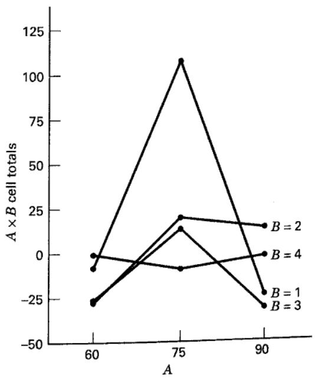
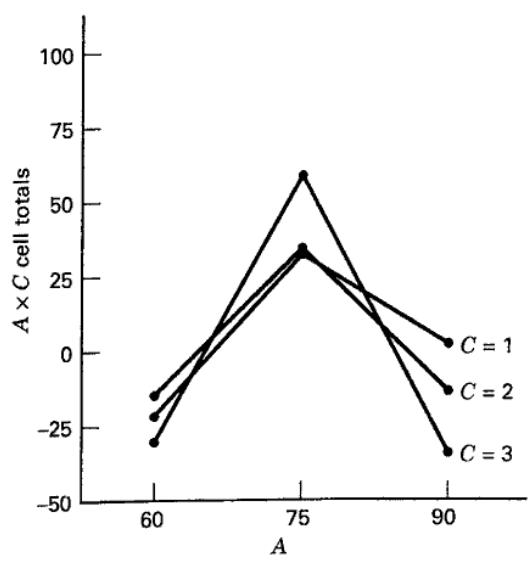

CHAPTER 13

# Experiments with Random Factors

CHAPTER LEARNING OBJECTIVES

1. Understand the difference between fixed and random factors.

2. Know the difference between the inference spaces for fixed and random factors.

3. Understand the methods-of-moments (ANOVA) approach to estimate variance components.

4. Understand how the REML method for variance component estimation works.

5. Know how to analyze an experiment with both fixed and random factors.

## 13.1 Random Effects Models

Throughout most of this book we have assumed that the factors in an experiment were fixed factors; that is, the levels of the factors used by the experimenter were the specific levels of interest. The implication of this, of course, is that the statistical inferences made about these factors are confined to the specific levels studied. That is, if three material types are investigated as in the battery life experiment of Example 5.1, our conclusions are valid only about those specific material types. A variation of this occurs when the factor or factors are quantitative. In these situations, we often use a regression model relating the response to the factors to predict the response over the region spanned by the factor levels used in the experimental design. Several examples of this were presented in Chapters 5 through 9. In general, with a fixed effect, we say that the inference space of the experiment is the specific set of factor levels investigated.

In some experimental situations, the factor levels are chosen at random from a larger population of possible levels, and the experimenter wishes to draw conclusions about the entire population of levels, not just those that were used in the experimental design. In this situation, the factor is said to be a random factor. We introduced a simple situation in Chapter 3, a single-factor experiment where the factor is random, and we used this to introduce the random effects model for the analysis of variance and components of variance. We have also discussed experiments where blocks are random. However, random factors also occur regularly in factorial experiments as well as in other types of experiments. In this chapter, we focus on methods for the design and analysis of factorial experiments with random factors. In Chapter 14, we will present nested and split-plot designs, two situations where random factors are frequently encountered in practice.

## 13.2 The Two-Factor Factorial with Random Factors

Suppose that we have two factors, A and B and that both factors have a large number of levels that are of interest (as in Chapter 3, we will assume that the number of levels is infinite). We will choose at random a levels of factor A and b levels of factor B and arrange these factor levels in a factorial experimental design. If the experiment is replicated n times, we may represent the observations by the linear model

$$
y _ {i j k} = \mu + \tau_ {i} + \beta_ {j} + (\tau \beta) _ {i j} + \epsilon_ {i j k} \left\{ \begin{array}{l} i = 1, 2, \ldots , a \\ j = 1, 2, \ldots , b \\ k = 1, 2, \ldots , n \end{array} \right.\tag{13.1}
$$

where the model parameters $\tau_{i},\beta_{j},(\tau\beta)_{ij}$ , and $\epsilon_{ijk}$ are all independent random variables. We are also going to assume that the random variables $\tau_{i},\beta_{j},(\tau\beta)_{ij}$ , and $\epsilon_{ijk}$ are normally distributed with mean zero and variances given by $V(\tau_{i})=\sigma_{\tau}^{2},V(\beta_{j})=\sigma_{\beta}^{2},V[(\tau\beta)_{ij}]=\sigma_{\tau\beta}^{2}$ , and $V(\epsilon_{ijk})=\sigma^{2}$ . Therefore, the variance of any observation is

$$
V (y _ {i j k}) = \sigma_ {\tau} ^ {2} + \sigma_ {\beta} ^ {2} + \sigma_ {\tau \beta} ^ {2} + \sigma^ {2}\tag{13.2}
$$

and $\sigma_{\tau}^{2}, \sigma_{\beta}^{2}, \sigma_{\tau \beta}^{2}$ , and $\sigma^{2}$ are the variance components. The hypotheses that we are interested in testing are $H_{0}: \sigma_{\tau}^{2} = 0$ , $H_{0}: \sigma_{\beta}^{2} = 0$ , and $H_{0}: \sigma_{\tau \beta}^{2} = 0$ . Notice the similarity to the single-factor random effects model.

The numerical calculations in the analysis of variance remain unchanged; that is, $SS_{A}$ , $SS_{B}$ , $SS_{AB}$ , $SS_{\tau}$ , and $SS_{E}$ are all calculated as in the fixed effects case. However, to form the test statistics, we must examine the expected mean squares. It may be shown that

$$
\begin{array}{r} E (M S _ {A}) = \sigma^ {2} + n \sigma_ {\tau \beta} ^ {2} + b n \sigma_ {\tau} ^ {2} \\ E (M S _ {B}) = \sigma^ {2} + n \sigma_ {\tau \beta} ^ {2} + a n \sigma_ {\beta} ^ {2} \\ E (M S _ {A B}) = \sigma^ {2} + n \sigma_ {\tau \beta} ^ {2} \end{array}\tag{13.3}
$$

and

$$
E (M S _ {E}) = \sigma^ {2}
$$

From the expected mean squares, we see that the appropriate statistic for testing the no-interaction hypothesis $H_0 \colon \sigma_{\tau \beta}^2 = 0$ is

$$
F _ {0} = \frac {M S _ {A B}}{M S _ {E}}\tag{13.4}
$$

because under $H_{0}$ both numerator and denominator of $F_{0}$ have expectation $\sigma^{2}$ , and only if $H_{0}$ is false $E(MS_{AB})$ is greater than $E(MS_{E})$ . The ratio $F_{0}$ is distributed as $F_{(a-1)(b-1),ab(n-1)}$ . Similarly, for testing $H_{0}: \sigma_{\tau}^{2}=0$ we would use

$$
F _ {0} = \frac {M S _ {A}}{M S _ {A B}}\tag{13.5}
$$

which is distributed as $F_{a - 1,(a - 1)(b - 1)}$ , and for testing $H_0: \sigma_\beta^2 = 0$ the statistic is

$$
F _ {0} = \frac {M S _ {B}}{M S _ {A B}}\tag{13.6}
$$

which is distributed as $F_{b-1,(a-1)(b-1)}$ . These are all upper-tail, one-tail tests. Notice that these test statistics are not the same as those used if both factors A and B are fixed. The expected mean squares are always used as a guide to test statistic construction.

In many experiments involving random factors, interest centers at least as much on estimating the variance components as on hypothesis testing. Recall from Chapter 3 that there are two approaches to variance component estimation. The variance components may be estimated by the analysis of variance method, that is, by equating the observed mean squares in the lines of the analysis of variance table to their expected values and solving for the variance components. This yields

$$
\begin{array}{r l} & {\hat {\sigma} ^ {2} = M S _ {E}} \\ & {\hat {\sigma} _ {\tau \beta} ^ {2} = \frac {M S _ {A B} - M S _ {E}}{n}} \\ & {\hat {\sigma} _ {\beta} ^ {2} = \frac {M S _ {B} - M S _ {A B}}{a n}} \\ & {\hat {\sigma} _ {\tau} ^ {2} = \frac {M S _ {A} - M S _ {A B}}{b n}} \end{array}\tag{13.7}
$$

as the point estimates of the variance components in the two-factor random effects model. These are moment estimators. Some computer programs use this method. This will be illustrated in the following Example 13.1.

## EXAMPLE 13.1 A Measurement Systems Capability Study

Statistically designed experiments are frequently used to investigate the sources of variability that affect a system. A common industrial application is to use a designed experiment to study the components of variability in a measurement system. These studies are often called gauge capability studies or gauge repeatability and reproducibility (R&R) studies because these are the components of variability that are of interest (for more discussion of gauge R&R studies, see the supplemental material for this chapter).

A typical gauge R&R experiment from Montgomery (2009) is shown in Table 13.1. An instrument or gauge is

## TABLE 13.1

The Measurement Systems Capability Experiment in Example 13.2

<table><tr><td>Part Number</td><td colspan="2">Operator 1</td><td colspan="2">Operator 2</td><td colspan="2">Operator 3</td></tr><tr><td>1</td><td>21</td><td>20</td><td>20</td><td>20</td><td>19</td><td>21</td></tr><tr><td>2</td><td>24</td><td>23</td><td>24</td><td>24</td><td>23</td><td>24</td></tr><tr><td>3</td><td>20</td><td>21</td><td>19</td><td>21</td><td>20</td><td>22</td></tr><tr><td>4</td><td>27</td><td>27</td><td>28</td><td>26</td><td>27</td><td>28</td></tr><tr><td>5</td><td>19</td><td>18</td><td>19</td><td>18</td><td>18</td><td>21</td></tr><tr><td>6</td><td>23</td><td>21</td><td>24</td><td>21</td><td>23</td><td>22</td></tr><tr><td>7</td><td>22</td><td>21</td><td>22</td><td>24</td><td>22</td><td>20</td></tr><tr><td>8</td><td>19</td><td>17</td><td>18</td><td>20</td><td>19</td><td>18</td></tr><tr><td>9</td><td>24</td><td>23</td><td>25</td><td>23</td><td>24</td><td>24</td></tr><tr><td>10</td><td>25</td><td>23</td><td>26</td><td>25</td><td>24</td><td>25</td></tr><tr><td>11</td><td>21</td><td>20</td><td>20</td><td>20</td><td>21</td><td>20</td></tr><tr><td>12</td><td>18</td><td>19</td><td>17</td><td>19</td><td>18</td><td>19</td></tr><tr><td>13</td><td>23</td><td>25</td><td>25</td><td>25</td><td>25</td><td>25</td></tr><tr><td>14</td><td>24</td><td>24</td><td>23</td><td>25</td><td>24</td><td>25</td></tr><tr><td>15</td><td>29</td><td>30</td><td>30</td><td>28</td><td>31</td><td>30</td></tr><tr><td>16</td><td>26</td><td>26</td><td>25</td><td>26</td><td>25</td><td>27</td></tr><tr><td>17</td><td>20</td><td>20</td><td>19</td><td>20</td><td>20</td><td>20</td></tr><tr><td>18</td><td>19</td><td>21</td><td>19</td><td>19</td><td>21</td><td>23</td></tr><tr><td>19</td><td>25</td><td>26</td><td>25</td><td>24</td><td>25</td><td>25</td></tr><tr><td>20</td><td>19</td><td>19</td><td>18</td><td>17</td><td>19</td><td>17</td></tr></table>

used to measure a critical dimension on a part. Twenty parts have been selected from the production process, and three randomly selected operators measure each part twice with this gauge. The order in which the measurements are made is completely randomized, so this is a two-factor factorial experiment with design factors parts and operators, with two replications. Both parts and operators are random factors. The variance component identity in Equation 13.1 applies; namely,

$$
\sigma_ {y} ^ {2} = \sigma_ {\tau} ^ {2} + \sigma_ {\beta} ^ {2} + \sigma_ {\tau \beta} ^ {2} + \sigma^ {2}
$$

where $\sigma_{y}^{2}$ is the total variability (including variability due to the different parts, variability due to the different operators, and variability due to the gauge), $\sigma_{\tau}^{2}$ is the variance component for parts, $\sigma_{\beta}^{2}$ is the variance component for operators, $\sigma_{\tau\beta}^{2}$ is the variance component that represents interaction between parts and operators, and $\sigma^{2}$ is the random experimental error. Typically, the variance component $\sigma^{2}$ is called the gauge repeatability because $\sigma^{2}$ can be thought of as reflecting the variation observed when the same part is measured by the same operator, and

$$
\sigma_ {\beta} ^ {2} + \sigma_ {\tau \beta} ^ {2}
$$

is usually called the reproducibility of the gauge because it reflects the additional variability in the measurement system resulting from use of the instrument by the operator. These experiments are usually performed with the objective of estimating the variance components.

Table 13.2 shows the ANOVA for this experiment. The computations were performed using the Balanced ANOVA routine in Minitab. Based on the P-values, we conclude that the effect of parts is large, operators may have a small effect, and no significant part–operator interaction takes place. We may use Equation 13.7 to estimate the variance components as follows:

$$
\begin{array}{r l} & {\hat {\sigma} _ {\tau} ^ {2} = \frac {6 2 . 3 9 - 0 . 7 1}{(3) (2)} = 1 0. 2 8} \\ & {\hat {\sigma} _ {\beta} ^ {2} = \frac {1 . 3 1 - 0 . 7 1}{(2 0) (2)} = 0. 0 1 5} \\ & {\hat {\sigma} _ {\tau \beta} ^ {2} = \frac {0 . 7 1 - 0 . 9 9}{2} = - 0. 1 4} \end{array}
$$

and

$$
\hat {\sigma} ^ {2} = 0. 9 9
$$

The bottom portion of the Minitab output in Table 13.2 contains the expected mean squares for the random model, with numbers in parentheses representing the variance components [(4) represents $\sigma^2$ , (3) represents $\sigma_{\tau\beta}^2$ , etc.].

## TABLE 13.2

## Analysis of Variance (Minitab Balanced ANOVA) for Example 13.1

```txt
Analysis of Variance (Balanced Designs)

Factor Type Levels Values
part random 20 1 2 3 4 5 6 7
8 9 10 11 12 13 14
15 16 17 18 19 20
operator random 3 1 2 3

Analysis of Variance for y

Source DF SS MS F P
part 19 1185.425 62.391 87.65 0.000
operator 2 2.617 1.308 1.84 0.173
part*operator 38 27.050 0.712 0.72 0.861
Error 60 59.500 0.992
Total 119 1274.592

Source Variance Error Expected Mean Square for Each Term
component term (using unrestricted model)
1 part 10.2798 3 (4) + 2(3) + 6(1)
2 operator 0.0149 3 (4) + 2(3) + 40(2)
3 part*operator -0.1399 4 (4) + 2(3)
4 Error 0.9917 (4)
```

The estimates of the variance components are also given, along with the error term that was used in testing that variance component in the analysis of variance. We will discuss the terminology unrestricted model later; it has no relevance in random models.

Notice that the estimate of one of the variance components, $\sigma_{\tau\beta}^{2}$ , is negative. This is certainly not reasonable because by definition variances are nonnegative. Unfortunately, negative estimates of variance components can result when we use the analysis of variance method of estimation (this is considered one of its drawbacks). We can deal with this negative result in a variety of ways. One possibility is to assume that the negative estimate means that the variance component is really zero and just set it to zero, leaving the other nonnegative estimates unchanged. Another approach is to estimate the variance components with a method that assures nonnegative estimates (this can be done with the maximum likelihood approach). Finally, we could note that the P-value for the interaction term in Table 13.2 is very large, take this as evidence that $\sigma_{\tau\beta}^{2}$ really is zero and that there is no interaction effect, and then fit a reduced model of the form

$$
y _ {i j k} = \mu + \tau_ {i} + \beta_ {j} + \epsilon_ {i j k}
$$

Analysis of Variance for the Reduced Model, Example 13.1

## TABLE 13.3

that does not include the interaction term. This is a relatively easy approach and one that often works nearly as well as more sophisticated methods.

Table 13.3 shows the analysis of variance for the reduced model. Because there is no interaction term in the model, both main effects are tested against the error term, and the estimates of the variance components are

$$
\begin{array}{l} \hat {\sigma} _ {\tau} ^ {2} = \frac {6 2 . 3 9 - 0 . 8 8}{(3) (2)} = 1 0. 2 5 \\ \hat {\sigma} _ {\beta} ^ {2} = \frac {1 . 3 1 - 0 . 8 8}{(2 0) (2)} = 0. 0 1 0 8 \\ \hat {\sigma} ^ {2} = 0. 8 8 \end{array}
$$

Finally, we could estimate the variance of the gauge as the sum of the variance component estimates $\hat{\sigma}^{2}$ and $\hat{\sigma}_{\beta}^{2}$ as

$$
\begin{array}{r l} \hat {\sigma} _ {\text { gauge }} ^ {2} & = \hat {\sigma} ^ {2} + \hat {\sigma} _ {\beta} ^ {2} \\ & = 0. 8 8 + 0. 0 1 0 8 \\ & = 0. 8 9 0 8 \end{array}
$$

The variability in the gauge appears small relative to the variability in the product. This is generally a desirable situation, implying that the gauge is capable of distinguishing among different grades of product.

```txt
Analysis of Variance (Balanced Designs)

Factor Type Levels Values
part random 20 1 2 3 4 5 6 7
8 9 10 11 12 13 14
15 16 17 18 19 20
operator random 3 1 2 3

Analysis of Variance for y

Source DF SS MS F P
part 19 1185.425 62.391 70.64 0.000
operator 2 2.617 1.308 1.48 0.232
Error 98 86.550 0.883
Total 119 1274.592

Source Variance Error Expected Mean Square for
component term Each Term (using
unrestricted model)
1 part 10.2513 3 (3) + 6(1)
2 operator 0.0106 3 (3) + 40(2)
3 error 0.8832 (3)
```

Measurement system capability studies are a very common application of designed experiments. These experiments almost always involve random effects. For more information about measurement systems experiments and a bibliography, see Burdick, Borror, and Montgomery (2003).

The other method for variance component estimation is the method of maximum likelihood, which was introduced in Chapter 3. This method is superior to the method of moments approach, because it produces estimators that are approximately normally distributed and it is easy to obtain their standard errors. Therefore, finding confidence intervals on the variance components is straightforward.

To illustrate how this method applies to an experimental design model with random effects, consider a two-factor model where both factors are random and a = b = n = 2. The model is

$$
y _ {i j k} = \mu + \tau_ {i} + \beta_ {j} + (\tau \beta) _ {i j} + \epsilon_ {i j k}
$$

with $i = 1,2,j = 1,2$ , and $k = 1,2$ . The variance of any observation is

$$
V (y _ {i j k}) = \sigma_ {y} ^ {2} = \sigma_ {\tau} ^ {2} + \sigma_ {\beta} ^ {2} + \sigma_ {\tau \beta} ^ {2} + \sigma^ {2}
$$

and the covariances are

$$
\begin{array}{r l r} \mathrm{Cov} (y _ {i j k}, y _ {i ^ {\prime} j ^ {\prime} k ^ {\prime}}) & = \sigma_ {\tau} ^ {2} + \sigma_ {\beta} ^ {2} + \sigma_ {\tau \beta} ^ {2} & i = i ^ {\prime}, j = j ^ {\prime}, k \neq k ^ {\prime} \\ & = \sigma_ {\tau} ^ {2} & i = i ^ {\prime}, j \neq j ^ {\prime} \\ & = \sigma_ {\beta} ^ {2} & i \neq i ^ {\prime}, j = j ^ {\prime} \\ & = 0 & i \neq i ^ {\prime}, j \neq j ^ {\prime} \end{array}
$$

It is convenient to think of the observations as an $8 \times 1$ vector, say

$$
\mathbf {y} = \left[ \begin{array}{c} y _ {1 1 1} \\ y _ {1 1 2} \\ y _ {2 1 1} \\ y _ {2 1 2} \\ y _ {1 2 1} \\ y _ {1 2 2} \\ y _ {2 2 1} \\ y _ {2 2 2} \end{array} \right]
$$

and the variances and covariances can be expressed as an $8 \times 8$ covariance matrix

$$
\boldsymbol {\Sigma} = \left[ \begin{array}{c c} \boldsymbol {\Sigma} _ {1 1} & \boldsymbol {\Sigma} _ {1 2} \\ \boldsymbol {\Sigma} _ {2 1} & \boldsymbol {\Sigma} _ {2 2} \end{array} \right]
$$

where $\Sigma_{11},\Sigma_{22},\Sigma_{12}$ , and $\Sigma_{21} = \Sigma_{12}^{\prime}$ are $4\times 4$ matrices defined as follows:

$$
\begin{array}{r} \sum_ {1 1} = \sum_ {2 2} = \left[ \begin{array}{c c c c} \sigma^ {2} & \sigma_ {\tau} ^ {2} + \sigma_ {\beta} ^ {2} + \sigma_ {\tau \beta} ^ {2} & \sigma_ {\tau} ^ {2} & \sigma_ {\tau} ^ {2} \\ \sigma_ {\tau} ^ {2} + \sigma_ {\beta} ^ {2} + \sigma_ {\tau \beta} ^ {2} & \sigma_ {\tau} ^ {2} & \sigma_ {\tau} ^ {2} & \sigma_ {\tau} ^ {2} \\ \sigma_ {\tau} ^ {2} & \sigma_ {\tau} ^ {2} & \sigma_ {y} ^ {2} & \sigma_ {\tau} ^ {2} + \sigma_ {\beta} ^ {2} + \sigma_ {\tau \beta} ^ {2} \\ \sigma_ {\tau} ^ {2} & \sigma_ {\tau} ^ {2} & \sigma_ {\tau} ^ {2} + \sigma_ {\beta} ^ {2} + \sigma_ {\tau \beta} ^ {2} & \sigma_ {y} ^ {2} \\ \end{array} \right] \\ \sum_ {1 2} = \left[ \begin{array}{l l l l} \sigma_ {\beta} ^ {2} & \sigma_ {\beta} ^ {2} & 0 & 0 \\ \sigma_ {\beta} ^ {2} & \sigma_ {\beta} ^ {2} & 0 & 0 \\ 0 & 0 & \sigma_ {\beta} ^ {2} & \sigma_ {\beta} ^ {2} \\ 0 & 0 & \sigma_ {\beta} ^ {2} & \sigma_ {\beta} ^ {2} \end{array} \right] \end{array}
$$

and $\Sigma_{21}$ is just the transpose of $\Sigma_{12}$ . Now each observation is normally distributed with variance $\sigma_{y}^{2}$ , and if we assume that all N = abn observations have a joint normal distribution, then the likelihood function for the random model becomes

$$
L (\boldsymbol {\mu}, \sigma_ {\tau} ^ {2}, \sigma_ {\beta} ^ {2}, \sigma_ {\tau \beta} ^ {2}, \sigma^ {2}) = \frac {1}{(2 \pi) ^ {n / 2} | \boldsymbol {\Sigma} | ^ {1 / 2}} \exp \left[ - \frac {1}{2} (\mathbf {y} - \mathbf {j} _ {N} \boldsymbol {\mu}) ^ {\prime} \boldsymbol {\Sigma} ^ {- 1} (\mathbf {y} - \mathbf {j} _ {N} \boldsymbol {\mu}) \right]
$$

where $j_{N}$ is an $N \times 1$ vector of 1s. The maximum likelihood estimates of $\mu, \sigma_{\tau}^{2}, \sigma_{\beta}^{2}, \sigma_{\tau\beta}^{2}$ , and $\sigma^{2}$ are those values of these parameters that maximize the likelihood function. In some situations, it would also be desirable to restrict the variance component estimates to nonnegative values.

Estimating variance components by maximum likelihood requires specialized computer software. JMP computes maximum likelihood estimates of the variance components in random or mixed models using the residual maximum likelihood (REML) method.

Table 13.4 is the output from JMP for the two-factor random effects experiment in Example 13.1. The output contains some model summary statistics, and the estimates of the individual variance components, which agree with those obtained via the ANOVA method in Example 13.1 (REML and the ANOVA method will agree for point estimation in balanced designs). Other information includes the ratio of each variance component to the estimated

## TABLE 13.4

JMP REML Analysis for the Two-Factor Random Model in Example 13.1

<table><tr><td colspan="8">Response Y</td></tr><tr><td colspan="8">Whole Model</td></tr><tr><td colspan="8">Summary of Fit</td></tr><tr><td>RSquare</td><td></td><td>0.910717</td><td></td><td></td><td></td><td></td><td></td></tr><tr><td>RSquare Adj</td><td></td><td>0.910717</td><td></td><td></td><td></td><td></td><td></td></tr><tr><td>Root Mean Square Error</td><td></td><td>0.995825</td><td></td><td></td><td></td><td></td><td></td></tr><tr><td>Mean of Response</td><td></td><td>22.39167</td><td></td><td></td><td></td><td></td><td></td></tr><tr><td>Observations (or Sum Wgts)</td><td></td><td>120</td><td></td><td></td><td></td><td></td><td></td></tr><tr><td colspan="8">Parameter Estimates</td></tr><tr><td>Term</td><td>Estimate</td><td>Std Error</td><td>DFDen</td><td>t Ratio</td><td>Prob &gt; |t|</td><td></td><td></td></tr><tr><td>Intercept</td><td>22.391667</td><td>0.724496</td><td>19.28</td><td>30.91</td><td>&lt;.0001*</td><td></td><td></td></tr><tr><td colspan="8">REML Variance Component Estimates</td></tr><tr><td>Random Effect</td><td>Var Ratio</td><td>Var Component</td><td>Std Error</td><td>95% Lower</td><td>95% Upper</td><td>Pct of Total</td><td></td></tr><tr><td>Parts</td><td>10.36621</td><td>10.279825</td><td>3.3738173</td><td>3.6672642</td><td>16.892385</td><td>92.225</td><td></td></tr><tr><td>Operators</td><td>0.0150376</td><td>0.0149123</td><td>0.0329622</td><td>-0.049692</td><td>0.0795169</td><td>0.134</td><td></td></tr><tr><td>Parts*Operators</td><td>-0.141088</td><td>-0.139912</td><td>0.1219114</td><td>-0.378854</td><td>0.0990296</td><td>-1.255</td><td></td></tr><tr><td>Residual</td><td></td><td>0.9916667</td><td>0.1810527</td><td>0.7143057</td><td>1.4697982</td><td>8.897</td><td></td></tr><tr><td>Total</td><td></td><td>11.146491</td><td></td><td></td><td></td><td>100.000</td><td></td></tr><tr><td colspan="8">-2 LogLikelihood = 408.14904346</td></tr><tr><td colspan="8">Covariance Matrix of Variance Component Estimates</td></tr><tr><td>Random Effect</td><td>Parts</td><td>Operators</td><td>Parts*Operators</td><td>Residual</td><td></td><td></td><td></td></tr><tr><td>Parts</td><td>11.382643</td><td>0.0001111</td><td>-0.002222</td><td>3.125e-14</td><td></td><td></td><td></td></tr><tr><td>Operators</td><td>0.0001111</td><td>0.0010865</td><td>-0.000333</td><td>6.126e-17</td><td></td><td></td><td></td></tr><tr><td>Parts*Operators</td><td>-0.002222</td><td>-0.000333</td><td>0.0148624</td><td>-0.01639</td><td></td><td></td><td></td></tr><tr><td>Residual</td><td>3.125e-14</td><td>6.126e-17</td><td>-0.01639</td><td>0.0327801</td><td></td><td></td><td></td></tr></table>

residual error variance, the standard error of each variance component, upper and lower bounds of a large-sample 95 percent confidence interval on each variance component, the percent of total variability accounted for by each variance component and the covariance matrix of the variance component estimates. The square roots of the diagonal elements of the matrix are the standard errors. The lower and upper bounds on the large-sample CI are found from

$$
L = \hat {\sigma} _ {i} ^ {2} - Z _ {a / 2} s e (\hat {\sigma} _ {i} ^ {2}) \mathrm{and} U = \hat {\sigma} _ {i} ^ {2} + Z _ {a / 2} s e (\hat {\sigma} _ {i} ^ {2})
$$

The 95 percent CI on the interaction variance component includes zero, evidence that this variance component is likely zero. Furthermore, the CI on the operator variance component also includes zero, and although its point estimate is positive, it would not be unreasonable to assume that this variance component is also zero.

## 13.3 The Two-Factor Mixed Model

We now consider the situation where one of the factors A is fixed and the other factor B is random. This is called the mixed model analysis of variance. The linear statistical model is

$$
y _ {i j k} = \mu + \tau_ {i} + \beta_ {j} + (\tau \beta) _ {i j} + \epsilon_ {i j k} \left\{ \begin{array}{l} i = 1, 2, \ldots , a \\ j = 1, 2, \ldots , b \\ k = 1, 2, \ldots , n \end{array} \right.\tag{13.8}
$$

Here $\tau_{i}$ is a fixed effect, $\beta_{j}$ is a random effect, the interaction $(\tau\beta)_{ij}$ is assumed to be a random effect, and $\epsilon_{ijk}$ is a random error. We also assume that the $\{\tau_{i}\}$ are fixed effects such that $\sum_{i=1}^{a}\tau_{i}=0$ and $\beta_{j}$ is a NID(0, $\sigma_{\beta}^{2}$ ) random variable. The interaction effect, $(\tau\beta)_{ij}$ , is a normal random variable with mean 0 and variance $[(a-1)/a]\sigma_{\tau\beta}^{2}$ ; however, summing the interaction component over the fixed factor equals zero. That is,

$$
\sum_ {i = 1} ^ {a} (\tau \beta) _ {i j} = (\tau \beta) _ {. j} = 0 \quad j = 1, 2, \dots , b
$$

This restriction implies that certain interaction elements at different levels of the fixed factor are not independent. In fact, we may show that

$$
\mathrm{Cov} [ (\tau \beta) _ {i j}, (\tau \beta) _ {i ^ {\prime} j} ] = - \frac {1}{a} \sigma_ {\tau \beta} ^ {2} i \neq i ^ {\prime}
$$

The covariance between $(\tau\beta)_{ij'}$ and $(\tau\beta)_{ij'}$ for $j \neq j'$ is zero, and the random error $\epsilon_{ijk}$ is NID(0, $\sigma^{2}$ ). Because the sum of the interaction effects over the levels of the fixed factor equals zero, this version of the mixed model is often called the restricted model.

In this model, the variance of $(\tau\beta)_{ij}$ is defined as $[(a-1)/a]\sigma_{\tau\beta}^{2}$ rather than $\sigma_{\tau\beta}^{2}$ to simplify the expected mean squares. The assumption $(\tau\beta)_{,j}=0$ also has an effect on the expected mean squares, which we may show are

$$
\begin{array}{r l r} & & b n \sum_ {i = 1} ^ {a} \tau_ {i} ^ {2} \\ & & E (M S _ {A}) = \sigma^ {2} + n \sigma_ {\tau \beta} ^ {2} + \frac {a - 1}{b n \sigma_ {\tau \beta} ^ {2}} \\ & & E (M S _ {B}) = \sigma^ {2} + a n \sigma_ {\beta} ^ {2} \\ & & E (M S _ {A B}) = \sigma^ {2} + n \sigma_ {\tau \beta} ^ {2} \end{array}\tag{13.9}
$$

and

$$
E (M S _ {E}) = \sigma^ {2}
$$

$$
F _ {0} = \frac {M S _ {A}}{M S _ {A B}}
$$

Therefore, the appropriate test statistic for testing that the means of the fixed factor effects are equal, or $H_0: \tau_i = 0$ ,

for which the reference distribution is $F_{a - 1,(a - 1)(b - 1)}$ . For testing $H_0\colon \sigma_\beta^2 = 0$ , the test statistic is

$$
F _ {0} = \frac {M S _ {B}}{M S _ {E}}
$$

with reference distribution $F_{b-1,ab(n-1)}$ . Finally, for testing the interaction hypothesis $H_{0}: \sigma_{\tau\beta}^{2} = 0$ , we would use

$$
F _ {0} = \frac {M S _ {A B}}{M S _ {E}}
$$

which has reference distribution $F_{(a - 1)(b - 1),ab(n - 1)}$ .

In the mixed model, it is possible to estimate the fixed factor effects as

$$
\begin{array}{l} \hat {\mu} = \overline {{y}} _ {\dots} \\ \hat {\tau} _ {i} = \overline {{y}} _ {i..} - \overline {{y}} _ {\dots} i = 1, 2, \ldots , a \end{array}\tag{13.10}
$$

The variance components $\sigma_{\beta}^{2}, \sigma_{\tau\beta}^{2}$ , and $\sigma^{2}$ may be estimated using the analysis of variance method. Eliminating the first equation from Equations 13.9 leaves three equations in three unknowns, whose solutions are

$$
\begin{array}{r} \hat {\sigma} _ {\beta} ^ {2} = \frac {M S _ {B} - M S _ {E}}{a n} \\ \hat {\sigma} _ {\tau \beta} ^ {2} = \frac {M S _ {A B} - M S _ {E}}{n} \end{array}\tag{13.11}
$$

and

$$
\hat {\sigma} ^ {2} = M S _ {E}
$$

This general approach can be used to estimate the variance components in any mixed model. After eliminating the mean squares containing fixed factors, there will always be a set of equations remaining that can be solved for the variance components.

In mixed models, the experimenter may be interested in testing hypotheses or constructing confidence intervals about individual treatment means for the fixed factor. In using such procedures, care must be exercised to use the proper standard error of the treatment mean. The standard error of the fixed effect treatment mean is

$$
\left[ \frac {\text { Mean   square   for   testing   the   fixed   effect }}{\text { Number   of   observations   in   each   treatment   mean }} \right] ^ {1 / 2} = \sqrt {\frac {M S _ {A B}}{b n}}
$$

Notice that this is just the standard error that we would use if this was a fixed effects model, except that $MS_{E}$ has been replaced by the mean square used for hypothesis testing.

EXAMPLE 13.2

The Measurement Systems Capability Experiment Revisited

Reconsider the gauge R&R experiment described in Example 13.1. Suppose now that only three operators use this gauge, so the operators are a fixed factor. However, because the parts are chosen at random, the experiment now involves a mixed model.

The ANOVA for the mixed model is shown in Table 13.5. The computations were performed using the Balanced ANOVA routine in Minitab. We specified that the restricted model be used in the Minitab analysis. Minitab also generated the expected mean squares for this model. In the Minitab output, the quantity Q[2] indicates a quadratic expression involving the fixed factor effect operator. That is, $Q[2] = \sum_{j=1}^{b} \beta_j^2 / (b - 1)$ . The conclusions are similar to Example 13.1. The variance components may be estimated from Equation 13.11 as

$$
\begin{array}{r l} \hat {\sigma} _ {\text { Parts }} ^ {2} & = \frac {M S _ {\text { Parts }} - M S _ {E}}{a n} = \frac {6 2 . 3 9 - 0 . 9 9}{(3) (2)} = 1 0. 2 3 \\ \hat {\sigma} _ {\text { Parts } \times \text { operators }} ^ {2} & = \frac {M S _ {\text { Parts } \times \text { operators }} - M S _ {E}}{n} \\ & = \frac {0 . 7 1 - 0 . 9 9}{2} = - 0. 1 4 \\ \hat {\sigma} ^ {2} & = M S _ {E} = 0. 9 9 \end{array}
$$

These results are also given in the Minitab output. Once again, a negative estimate of the interaction variance component results. An appropriate course of action would be to fit a reduced model, as we did in Example 13.1. In the case of a mixed model with two factors, this leads to the same results as in Example 13.1.

## TABLE 13.5

Analysis of Variance (Minitab) for the Mixed Model in Example 13.2. The Restricted Model Is Assumed

```txt
Analysis of Variance (Balanced Designs)

Factor Type Levels Values
part random 20 1 2 3 4 5 6 7
8 9 10 11 12 13 14
15 16 17 18 19 20
operator fixed 3 1 2 3

Analysis of Variance for y

Source DF SS MS F P
part 19 1185.425 62.391 62.92 0.000
operator 2 2.617 1.308 1.84 0.173
part*operator 38 27.050 0.712 0.72 0.861
Error 60 59.500 0.992
Total 119 1274.592

Source Variance Error Expected Mean Square for Each Term component term (using restricted model)
1 part 10.2332 4 (4) + 6(1)
2 operator 3 (4) + 2(3) + 40Q[2]
3 part*operator -0.1399 4 (4) + 2(3)
4 Error 0.9917 (4)
```

Alternate Mixed Models. Several different versions of the mixed model have been proposed. These models differ from the restricted version of the mixed model discussed previously in the assumptions made about the random components. One of these alternate models is now briefly discussed.

Consider the model

$$
y _ {i j k} = \mu + \alpha_ {i} + \gamma_ {j} + (\alpha \gamma) _ {i j} + \epsilon_ {i j k}
$$

where the $\alpha_{i}(i=1,2,\ldots,a)$ are fixed effects such that $\sum_{i=1}^{a}\alpha_{i}=0$ and $\gamma_{j},(\alpha\gamma)_{ij}$ , and $\epsilon_{ijk}$ are uncorrelated random variables having zero means and variances $V(\gamma_{j})=\sigma_{\gamma}^{2},V[(\alpha\gamma)_{ij}]=\sigma_{\alpha\gamma}^{2}$ , and $V(\epsilon_{ijk})=\sigma^{2}$ . Note that the restriction imposed previously on the interaction effect is not used here; consequently, this version of the mixed model is often called the unrestricted mixed model.

We can show that expected mean squares for this model are (refer to the supplemental text material for this chapter)

$$
\begin{array}{r} {b n \sum_ {i = 1} ^ {a} \alpha_ {i} ^ {2}} \\ {E (M S _ {A}) = \sigma^ {2} + n \sigma_ {\alpha \gamma} ^ {2} + \frac {}{a - 1}} \\ {E (M S _ {B}) = \sigma^ {2} + n \sigma_ {\alpha \gamma} ^ {2} + a n \sigma_ {\gamma} ^ {2}} \\ {E (M S _ {A B}) = \sigma^ {2} + n \sigma_ {\alpha \gamma} ^ {2}} \end{array}\tag{13.12}
$$

and

$$
E (M S _ {E}) = \sigma^ {2}
$$

Comparing these expected mean squares with those in Equation 13.9, we note that the only obvious difference is the presence of the variance component $\sigma_{\alpha\gamma}^{2}$ in the expected mean square for the random effect. (Actually, there are other differences because of the different definitions of the variance of the interaction effect in the two models.) Consequently, we would test the hypothesis that the variance component for the random effect equals zero ( $H_{0}: \sigma_{\gamma}^{2} = 0$ ) using the statistic

$$
F _ {0} = \frac {M S _ {B}}{M S _ {A B}}
$$

as contrasted with testing $H_0$ : $\sigma_{\beta}^{2} = 0$ with $F_0 = MS_B / MS_E$ in the restricted model.

The parameters in the two models are closely related. In fact, we may show that

$$
\begin{array}{r} \tau_ {i} = \alpha_ {i} \\ \beta_ {j} = \gamma_ {j} + (\overline {{\alpha \gamma}}) _ {. j} \\ (\tau \beta) _ {i j} = (\alpha \gamma) _ {i j} - (\overline {{\alpha \gamma}}) _ {. j} \\ \sigma_ {\gamma} ^ {2} = \sigma_ {\beta} ^ {2} + \frac {1}{a} \sigma_ {\alpha \gamma} ^ {2} \end{array}
$$

and

$$
\sigma_ {\tau \beta} ^ {2} = \sigma_ {\alpha \gamma} ^ {2}
$$

The analysis of variance method may be used to estimate the variance components. Referring to the expected mean squares, we find that the only change from Equations 13.11 is that

$$
\hat {\sigma} _ {\gamma} ^ {2} = \frac {M S _ {B} - M S _ {A B}}{a n}\tag{13.13}
$$

Both of these models are special cases of the mixed model proposed by Scheffé (1956a, 1959). This model assumes that the observations may be represented by

$$
y _ {i j k} = m _ {i j} + \epsilon_ {i j k} \left\{ \begin{array}{l} i = 1, 2, \ldots , a \\ j = 1, 2, \ldots , b \\ k = 1, 2, \ldots , n \end{array} \right.
$$

where $m_{ij}$ and $\epsilon_{ijk}$ are independent random variables. The structure of $m_{ij}$ is

$$
\begin{array}{c} {m _ {i j} = \mu + \tau_ {i} + b _ {j} + c _ {i j}} \\ {E (m _ {i j}) = \mu + \tau_ {i}} \\ {\sum_ {i = 1} ^ {a} \tau_ {i} = 0} \end{array}
$$

and

$$
c _ {\cdot j} = 0 \quad j = 1, 2, \dots , b
$$

The variances and covariances of $b_{j}$ and $c_{ij}$ are expressed through the covariances of the $m_{ij}$ . Furthermore, the random effect parameters in other formulations of the mixed model can be related to $b_{j}$ and $c_{ij}$ . The statistical analysis of Scheffé's model is identical to that of our restricted model, except that in general the statistic $MS_A / MS_{AB}$ is not always distributed as $F$ when $H_0: \tau_i = 0$ is true.

In light of this multiplicity of mixed models, a logical question is: Which model should one use? This author prefers the restricted model, although both restricted and unrestricted models are widely encountered in the literature. The restricted model is actually slightly more general than the unrestricted model, because in the restricted model the covariance between two observations from the same level of the random factor can be either positive or negative, whereas this covariance can only be positive in the unrestricted model. If the correlative structure of the random components is not large, then either mixed model is appropriate, and there are only minor differences between these models. On the contrary, the unrestricted form of the mixed model is preferred when the design is unbalanced, because it is easier to work with, and some computer packages always assume the unrestricted model when displaying expected mean squares. (SAS is an example, JMP uses the unrestricted model, and the default in Minitab is the unrestricted model, although that can be easily changed.) When we subsequently refer to mixed models, we assume the restricted model structure. However, if there are large correlations in the data, then Scheffé's model may have to be employed. The choice of model should always be dictated by the data. The article by Hocking (1973) is a clear summary of various mixed models.

## EXAMPLE 13.3 The Unrestricted Model

Some computer software packages support only one mixed model. Minitab supports both the restricted and unrestricted model, although as noted above the default is to the unrestricted model. Table 13.6 shows the Minitab output for the experiment in Example 13.2 using the unrestricted model. Note that the expected mean squares are in agreement with those in Equation 13.12. The conclusions are identical to those from the restricted model analysis, and the variance component estimates are very similar.

## TABLE 13.6

Analysis of the Experiment in Example 13.2 Using the Unrestricted Model

```txt
Analysis of Variance (Balanced Designs)

Factor Type Levels Values
Part random 20 1 2 3 4 5 6 7
8 9 10 11 12 13 14
15 16 17 18 19 20
operator fixed 3 1 2 3

Analysis of Variance for y

Source DF SS MS F P
part 19 1185.425 62.391 87.65 0.000
operator 2 2.617 1.308 1.84 0.173
part*operator 38 27.050 0.712 0.72 0.861
Error 60 59.500 0.992
Total 119 1274.592

Source Variance Error Expected Mean Square for Each Term component term (using unrestricted model)
1 part 10.2798 3 (4) + 2(3) + 6(1)
2 operator 3 (4) + 2(3) + Q[2]
3 part*operator -0.1399 4 (4) + 2(3)
4 Error 0.9917 (4)
```

## TABLE 13.7

JMP Output for the Two-Factor Mixed Model in Example 13.2

<table><tr><td colspan="7">Response Y</td></tr><tr><td colspan="7">Summary of Fit</td></tr><tr><td>RSquare</td><td></td><td>0.911896</td><td></td><td></td><td></td><td></td></tr><tr><td>RSquare Adj</td><td></td><td>0.91039</td><td></td><td></td><td></td><td></td></tr><tr><td>Root Mean Square Error</td><td></td><td>0.995825</td><td></td><td></td><td></td><td></td></tr><tr><td>Mean of Response</td><td></td><td>22.39167</td><td></td><td></td><td></td><td></td></tr><tr><td>Observations (or Sum Wgts)</td><td></td><td>120</td><td></td><td></td><td></td><td></td></tr><tr><td colspan="7">REML Variance Component Estimates</td></tr><tr><td>Random Effect</td><td>Var Ratio</td><td>Var Component</td><td>Std Error</td><td>95% Lower</td><td>95% Upper</td><td>Pct of Total</td></tr><tr><td>Parts</td><td>10.36621</td><td>10.279825</td><td>3.3738173</td><td>3.6672642</td><td>16.892385</td><td>92.348</td></tr><tr><td>Parts*Operators</td><td>-0.141088</td><td>-0.139912</td><td>0.1219114</td><td>-0.378854</td><td>0.0990296</td><td>-1.257</td></tr><tr><td>Residual</td><td></td><td>0.9916667</td><td>0.1810527</td><td>0.7143057</td><td>1.4697982</td><td>8.909</td></tr><tr><td>Total</td><td>11.131579</td><td></td><td></td><td></td><td></td><td>100.000</td></tr><tr><td colspan="7">-2 LogLikelihood = 410.4121524</td></tr><tr><td colspan="7">Covariance Matrix of Variance Component Estimates</td></tr><tr><td>Random Effect</td><td>Parts</td><td>Parts*Operators</td><td></td><td>Residual</td><td></td><td></td></tr><tr><td>Parts</td><td>11.382643</td><td>-0.002222</td><td></td><td>2.659e-14</td><td></td><td></td></tr><tr><td>Parts*Operators</td><td>-0.002222</td><td>0.0148624</td><td></td><td>-0.01639</td><td></td><td></td></tr><tr><td>Residual</td><td>2.659e-14</td><td>-0.01639</td><td></td><td>0.0327801</td><td></td><td></td></tr><tr><td colspan="7">Fixed Effects Tests</td></tr><tr><td>Source</td><td>Nparm</td><td>DF</td><td>DFDen</td><td>F Ratio</td><td>Prob &gt; F</td><td></td></tr><tr><td>Operators</td><td>2</td><td>2</td><td>38</td><td>1.8380</td><td>0.1730</td><td></td></tr></table>

## 13.4 Rules for Expected Mean Squares

An important part of any experimental design problem is conducting the analysis of variance. This involves determining the sum of squares for each component in the model and the number of degrees of freedom associated with each sum of squares. Then, to construct appropriate test statistics, the expected mean squares must be determined. In complex design situations, particularly those involving random or mixed models, it is frequently helpful to have a formal procedure for this process.

We will present a set of rules for writing down the number of degrees of freedom for each model term and the expected mean squares for any balanced factorial, nested, $^{1}$ or nested factorial experiment. (Note that partially balanced arrangements, such as Latin squares and incomplete block designs, are specifically excluded.) Other rules are available; for example, see Scheffé (1959), Bennett and Franklin (1954), Cornfield and Tukey (1956), and Searle (1971a, 1971b). By examining the expected mean squares, one may develop the appropriate statistic for testing hypotheses about any model parameter. The test statistic is a ratio of mean squares that is chosen such that the expected value of the numerator mean square differs from the expected value of the denominator mean square only by the variance component or the fixed factor in which we are interested.

It is always possible to determine the expected mean squares in any model as we did in Chapter 3—that is, by the direct application of the expectation operator. This brute force method, as it is often called, can be very tedious. The rules that follow always produce the expected mean squares without resorting to the brute force approach, and they are relatively simple to use. We illustrate the rules using the two-factor fixed effects factorial model assuming that there are n replicates.

Rule 1. The error term in the model is $\epsilon_{ij\ldots m}$ , where the subscript $m$ denotes the replication subscript. For the two-factor model, this rule implies that the error term is $\epsilon_{ijk}$ . The variance component associated with $\epsilon_{ij\ldots m}$ is $\sigma^2$ .

Rule 2. In addition to an overall mean ( $\mu$ ) and an error term $\epsilon_{ij\ldots m}$ , the model contains all the main effects and any interactions that the experimenter assumes exist. If all possible interactions between k factors exist, then there are $\binom{k}{2}$ two-factor interactions, $\binom{k}{3}$ three-factor interactions, $\ldots$ , 1 k-factor interaction. If one of the factors in a term appears in parentheses, then there is no interaction between that factor and the other factors in that term.

Rule 3. For each term in the model other than $\mu$ and the error term, divide the subscripts into three classes: (a) live—those subscripts that are present in the term and are not in parentheses; (b) dead—those subscripts that are present in the term and are in parentheses; and (c) absent—those subscripts that are present in the model but not in that particular term. Note that the two-factor fixed effects model has no dead subscripts, but we will encounter such models later. Thus, in the two-factor model, for the term $(\tau\beta)_{ij}$ , i and j are live and k is absent.

Rule 4. Degrees of freedom. The number of degrees of freedom for any effect in the model is the product of the number of levels associated with each dead subscript and the number of levels minus 1 associated with each live subscript. For example, the number of degrees of freedom associated with $(\tau\beta)_{ij}$ is $(a-1)(b-1)$ . The number of degrees of freedom for error is obtained by subtracting the sum of all other degrees of freedom from N-1, where N is the total number of observations.

Rule 5. Each term in the model has either a variance component (random effect) or a fixed factor (fixed effect) associated with it. If an interaction contains at least one random effect, the entire interaction is considered as random. A variance component has Greek letters as subscripts to identify the particular random effect. Thus, in a two-factor mixed model with factor A fixed and factor B random, the variance component for B is $\sigma_{\beta}^{2}$ , and the variance component for AB is $\sigma_{\tau\beta}^{2}$ . A fixed effect is always represented by the sum of squares of the model components associated with that factor divided by its degrees of freedom. In our example, the fixed effect for A is

$$
\frac {\sum_ {i = 1} ^ {a} \tau_ {i} ^ {2}}{a - 1}
$$

Rule 6. Expected mean squares. There is an expected mean square for each model component. The expected mean square for error is $E(MS_{E}) = \sigma^{2}$ . In the case of the restricted model, for every other model term, the expected mean square contains $\sigma^{2}$ plus either the variance component or the fixed effect component for that term, plus those components for all other model terms that contain the effect in question and that involve no interactions with other fixed effects. The coefficient of each variance component or fixed effect is the number of observations at each distinct value of that component.

To illustrate for the case of the two-factor fixed effects model, consider finding the interaction expected mean square, $E(MS_{AB})$ . The expected mean square will contain only the fixed effect for the AB interaction (because no other model terms contain AB) plus $\sigma^{2}$ , and the fixed effect for AB will be multiplied by n because there are n observations at each distinct value of the interaction component (the n observations in each cell). Thus, the expected mean square for AB is

$$
E (M S _ {A B}) = \sigma^ {2} + \frac {n \sum_ {i = 1} ^ {a} \sum_ {j = 1} ^ {b} (\tau \beta) _ {i j} ^ {2}}{(a - 1) (b - 1)}
$$

As another illustration of the two-factor fixed effects model, the expected mean square for the main effect of A would be

$$
E (M S _ {A}) = \sigma^ {2} + \frac {b n \sum_ {i = 1} ^ {a} \tau_ {i} ^ {2}}{(a - 1)}
$$

The multiplier in the numerator is bn because there are bn observations at each level of A. The AB interaction term is not included in the expected mean square because while it does include the effect in question (A), factor B is a fixed effect.

To illustrate how Rule 6 applies to a model with random effects, consider the two-factor random model. The expected mean square for the AB interaction would be

$$
E (M S _ {A B}) = \sigma^ {2} + n \sigma_ {\tau \beta} ^ {2}
$$

and the expected mean square for the main effect of A would be

$$
E (M S _ {A}) = \sigma^ {2} + n \sigma_ {\tau \beta} ^ {2} + b n \sigma_ {\tau} ^ {2}
$$

Note that the variance component for the AB interaction term is included because A is included in AB and B is a random effect.

Now consider the restricted form of the two-factor mixed model. Once again, the expected mean square for the AB interaction term is

$$
E (M S _ {A B}) = \sigma^ {2} + n \sigma_ {\tau \beta} ^ {2}
$$

For the main effect of $A$ , the fixed factor, the expected mean square is

$$
E (M S _ {A}) = \sigma^ {2} + n \sigma_ {\tau \beta} ^ {2} + \frac {b n \sum_ {i = 1} ^ {a} \tau_ {i} ^ {2}}{a - 1}
$$

The interaction variance component is included because $A$ is included in $AB$ and $B$ is a random effect. For the main effect of $B$ , the expected mean square is

$$
E (M S _ {B}) = \sigma^ {2} + a n \sigma_ {\beta} ^ {2}
$$

Here the interaction variance component is not included, because while B is included in AB, A is a fixed effect. Please note that these expected mean squares agree with those given previously for the two-factor mixed model in Equation 13.9.

Rule 6 can be easily modified to give expected mean squares for the unrestricted form of the mixed model. Simply include the term for the effect in question, plus all the terms that contain this effect as long as there is at least one random factor. To illustrate, consider the unrestricted form of the two-factor mixed model. The expected mean square for the two-factor interaction term is

$$
E (M S _ {A B}) = \sigma^ {2} + n \sigma_ {\tau \beta} ^ {2}
$$

(Please recall the difference in notation for model components between the restricted and unrestricted models.) For the main effect of A, the fixed factor, the expected mean square is

$$
E (M S _ {A}) = \sigma^ {2} + n \sigma_ {\tau \beta} ^ {2} + \frac {b n \sum_ {i = 1} ^ {a} \tau_ {i} ^ {2}}{a - 1}
$$

and for the main effect of the random factor B, the expected mean square would be

$$
E (M S _ {B}) = \sigma^ {2} + n \sigma_ {\tau \beta} ^ {2} + a n \sigma_ {\beta} ^ {2}
$$

Note that these are the expected mean squares given previously in Equation 13.12 for the unrestricted mixed model.

## EXAMPLE 13.4

Consider a three-factor factorial experiment with a levels of factor A, b levels of factor B, c levels of factor C, and n replicates. The analysis of this design, assuming that all the factors are fixed effects, is given in Section 5.4. We now determine the expected mean squares assuming that all the factors are random. The appropriate statistical model is

$$
\begin{array}{r} y _ {i j k l} = \mu + \tau_ {i} + \beta_ {j} + \gamma_ {k} + (\tau \beta) _ {i j} \\ + (\tau \gamma) _ {i k} + (\beta \gamma) _ {j k} + (\tau \beta \gamma) _ {i j k} + \epsilon_ {i j k l} \end{array}
$$

Using the rules previously described, the expected mean squares are shown in Table 13.8.

We notice, by examining the expected mean squares in Table 13.8, that if A, B, and C are all random factors, then no exact test exists for the main effects. That is, if we wish to test the hypothesis $\sigma_{\tau}^{2}=0$ , we cannot form a ratio of two expected mean squares such that the only term in the numerator that is not in the denominator is $bcn\sigma_{\tau}^{2}$ . The same phenomenon occurs for the main effects of B and C. Notice that proper tests do exist for the two- and three-factor interactions. However, it is likely that tests on the main effects are of central importance to the experimenter. Therefore, how should the main effects be tested? This problem is considered in the next section.

## TABLE 13.8

Expected Mean Squares for the Three-Factor Random Effects Model

<table><tr><td>Model Term</td><td>Factor</td><td>Expected Mean Squares</td></tr><tr><td> $\tau_i$ </td><td>A, main effect</td><td> $\sigma^2 + cn\sigma_{\tau\beta}^2 + bn\sigma_{\tau\gamma}^2 + n\sigma_{\tau\beta\gamma}^2 + bcn\sigma_{\tau}^2$ </td></tr><tr><td> $\beta_j$ </td><td>B, main effect</td><td> $\sigma^2 + cn\sigma_{\tau\beta}^2 + an\sigma_{\beta\gamma}^2 + n\sigma_{\tau\beta\gamma}^2 + acn\sigma_{\beta}^2$ </td></tr><tr><td> $\gamma_k$ </td><td>C, main effect</td><td> $\sigma^2 + bn\sigma_{\tau\gamma}^2 + an\sigma_{\beta\gamma}^2 + n\sigma_{\tau\beta\gamma}^2 + abn\sigma_{\gamma}^2$ </td></tr><tr><td> $(\tau\beta)_{ij}$ </td><td>AB, two-factor interaction</td><td> $\sigma^2 + n\sigma_{\tau\beta\gamma}^2 + cn\sigma_{\tau\beta}^2$ </td></tr><tr><td> $(\tau\gamma)_{ik}$ </td><td>AC, two-factor interaction</td><td> $\sigma^2 + n\sigma_{\tau\beta\gamma}^2 + bn\sigma_{\tau\gamma}^2$ </td></tr><tr><td> $(\beta\gamma)_{jk}$ </td><td>BC, two-factor interaction</td><td> $\sigma^2 + n\sigma_{\tau\beta\gamma}^2 + an\sigma_{\beta\gamma}^2$ </td></tr><tr><td> $(\tau\beta\gamma)_{ijk}$ </td><td>ABC, three-factor interaction</td><td> $\sigma^2 + n\sigma_{\tau\beta\gamma}^2$ </td></tr><tr><td> $\epsilon_{ijkl}$ </td><td>Error</td><td> $\sigma^2$ </td></tr></table>

## 13.5 Approximate $F$ -Tests

In factorial experiments with three or more factors involving a random or mixed model and certain other more complex designs, there are frequently no exact test statistics for certain effects in the models. One possible solution to this dilemma is to assume that certain interactions are negligible. To illustrate, if we could reasonably assume that all the two-factor interactions in Example 13.4 are negligible, then we could set $\sigma_{\tau\beta}^{2} = \sigma_{\tau\gamma}^{2} = \sigma_{\beta\gamma}^{2} = 0$ , and tests for main effects could be conducted.

Although this seems to be an attractive possibility, we must point out that there must be something in the nature of the process—or some strong prior knowledge—for us to assume that one or more of the interactions are negligible. In general, this assumption is not easily made, nor should it be taken lightly. We should not eliminate certain interactions from the model without conclusive evidence that it is appropriate to do so. A procedure advocated by some experimenters is to test the interactions first, then set at zero those interactions found to be insignificant, and then assume that these interactions are zero when testing other effects in the same experiment. Although sometimes done in practice, this procedure can be dangerous because any decision regarding an interaction is subject to both type I and type II errors.

A variation of this idea is to pool certain mean squares in the analysis of variance to obtain an estimate of error with more degrees of freedom. For instance, suppose that in Example 13.5 the test statistic $F_{0} = MS_{ABC}/MS_{E}$ was not significant. Thus, $H_{0}: \sigma_{\tau\beta\gamma}^{2} = 0$ is not rejected, and both $MS_{ABC}$ and $MS_{E}$ estimate the error variance $\sigma^{2}$ .

The experimenter might consider pooling or combining $MS_{ABC}$ and $MS_{E}$ according to

$$
M S _ {E ^ {\prime}} = \frac {a b c (n - 1) M S _ {E} + (a - 1) (b - 1) (c - 1) M S _ {A B C}}{a b c (n - 1) + (a - 1) (b - 1) (c - 1)}
$$

so that $E(MS_{E'}) = \sigma^2$ . Note that $MS_{E'}$ has $abc(n - 1) + (a - 1)(b - 1)(c - 1)$ degrees of freedom, compared to $abc(n - 1)$ degrees of freedom for the original $MS_E$ .

The danger of pooling is that one may make a type II error and combine the mean square for a factor that really is significant with error, thus obtaining a new residual mean square $(MS_{E'})$ that is too large. This will make other significant effects more difficult to detect. On the contrary, if the original error mean square has a very small number of degrees of freedom (e.g., less than six), the experimenter may have much to gain by pooling because it could potentially increase the precision of further tests considerably. A reasonably practical procedure is as follows. If the original error mean square has six or more degrees of freedom, do not pool. If the original error mean square has fewer than six degrees of freedom, pool only if the F-statistic for the mean square to be pooled is not significant at a large value of $\alpha$ , such as $\alpha = 0.25$ .

If we cannot assume that certain interactions are negligible and we still need to make inferences about those effects for which exact tests do not exist, a procedure attributed to Satterthwaite (1946) can be employed. Satterthwaite's method uses linear combinations of mean squares, for example,

$$
M S ^ {\prime} = M S _ {r} + \dots + M S _ {s}\tag{13.14}
$$

and

$$
M S ^ {\prime \prime} = M S _ {u} + \dots + M S _ {v}\tag{13.15}
$$

where the mean squares in Equations 13.14 and 13.15 are chosen so that $E(MS') - E(MS'')$ is equal to a multiple of the effect (the model parameter or variance component) considered in the null hypothesis. Then the test statistic would be

$$
F = \frac {M S ^ {\prime}}{M S ^ {\prime \prime}}\tag{13.16}
$$

which is distributed approximately as $F_{p,q}$ , where

$$
p = \frac {(M S _ {r} + \cdot \cdot \cdot + M S _ {s}) ^ {2}}{M S _ {r} ^ {2} / f _ {r} + \cdot \cdot \cdot + M S _ {s} ^ {2} / f _ {s}}\tag{13.17}
$$

and

$$
q = \frac {(M S _ {u} + \cdots + M S _ {v}) ^ {2}}{M S _ {u} ^ {2} / f _ {u} + \cdots + M S _ {v} ^ {2} / f _ {v}}\tag{13.18}
$$

In $p$ and $q, f_i$ is the number of degrees of freedom associated with the mean square $MS_i$ . There is no assurance that $p$ and $q$ will be integers, so it may be necessary to interpolate in the tables of the $F$ distribution. For example, in the three-factor random effects model (Table 13.9), it is relatively easy to see that an appropriate test statistic for $H_0: \sigma_\tau^2 = 0$ would be $F = MS' / MS''$ , with

$$
M S ^ {\prime} = M S _ {A} + M S _ {A B C}
$$

and

$$
M S ^ {\prime \prime} = M S _ {A B} + M S _ {A C}
$$

The degrees of freedom for $F$ would be computed from Equations 13.17 and 13.18.

The degrees of freedom for $F$ would be computed from the first degree. The theory underlying this test is that both the numerator and the denominator of the test statistic (Equation 13.16) are distributed approximately as multiples of chi-square random variables, and because no mean square appears in both the numerator and denominator of Equation 13.16, the numerator and denominator are independent. Thus, $F$ in Equation 13.16 is distributed approximately as $F_{p,q}$ . Satterthwaite remarks that caution should be used in applying the procedure when some of the mean squares in $MS'$ and $MS''$ are involved negatively. Gaylor and Hopper (1969) report that if $MS' = MS_1 - MS_2$ , then Satterthwaite's approximation holds reasonably well if

$$
\frac {M S _ {1}}{M S _ {2}} > F _ {0. 0 2 5, f _ {2}, f _ {1}} \times F _ {0. 5 0, f _ {2}, f _ {2}}
$$

and if $f_{1} \leq 100$ and $f_{2} \geq f_{1} / 2$ .

## EXAMPLE 13.5

The pressure drop measured across an expansion valve in a turbine is being studied. The design engineer considers the important variables that influence pressure drop reading to be gas temperature on the inlet side (A), operator (B), and the specific pressure gauge used by the operator (C). These three factors are arranged in a factorial design, with gas temperature fixed, and operator and pressure gauge random. The coded data for two replicates are shown in Table 13.9. The linear model for this design is

$$
\begin{array}{r} y _ {i j k l} = \mu + \tau_ {i} + \beta_ {j} + \gamma_ {k} + (\tau \beta) _ {i j} \\ + (\tau \gamma) _ {i k} + (\beta \gamma) _ {j k} + (\tau \beta \gamma) _ {i j k} + \epsilon_ {i j k l} \end{array}
$$

where $\tau_{i}$ is the effect of the gas temperature (A), $\beta_{j}$ is the operator effect (B), and $\gamma_{k}$ is the effect of the pressure gauge (C).

The analysis of variance is shown in Table 13.10. A column entitled Expected Mean Squares has been added to this table, and the entries in this column are derived using the rules discussed in Section 13.4. From the Expected Mean Squares column, we observe that exact tests exist for all effects except the main effect A. Results for these tests are shown in Table 13.10. To test the gas temperature effect, or

$H_0: \tau_i = 0$ , we could use the statistic

$$
F = \frac {M S ^ {\prime}}{M S ^ {\prime \prime}}
$$

where

$$
M S ^ {\prime} = M S _ {A} + M S _ {A B C}
$$

and

$$
M S ^ {\prime \prime} = M S _ {A B} + M S _ {A C}
$$

because

$$
E (M S ^ {\prime}) - E (M S ^ {\prime \prime}) = \frac {b c n \Sigma \tau_ {i} ^ {2}}{a - 1}
$$

To determine the test statistic for $H_0$ : $\tau_i = 0$ , we compute

$$
\begin{array}{r l} M S ^ {\prime} & = M S _ {A} + M S _ {A B C} \\ & = 5 1 1. 6 8 + 1 3. 8 4 = 5 2 5. 5 2 \\ M S ^ {\prime \prime} & = M S _ {A B} + M S _ {A C} \\ & = 2 0 2. 0 0 + 3 4. 4 7 = 2 3 6. 4 7 \end{array}
$$

and

$$
F = \frac {M S ^ {\prime}}{M S ^ {\prime \prime}} = \frac {5 2 5 . 5 2}{2 3 6 . 4 7} = 2. 2 2
$$

## TABLE 13.9

Coded Pressure Drop Data for the Turbine Experiment

<table><tr><td rowspan="4">Pressure Gauge (C)</td><td colspan="12">Gas Temperature (A)</td></tr><tr><td colspan="4">60°F</td><td colspan="4">75°F</td><td colspan="4">90°F</td></tr><tr><td colspan="4">Operator (B)</td><td colspan="4">Operator (B)</td><td colspan="4">Operator (B)</td></tr><tr><td>1</td><td>2</td><td>3</td><td>4</td><td>1</td><td>2</td><td>3</td><td>4</td><td>1</td><td>2</td><td>3</td><td>4</td></tr><tr><td>1</td><td>-2</td><td>0</td><td>-1</td><td>4</td><td>14</td><td>6</td><td>1</td><td>-7</td><td>-8</td><td>-2</td><td>-1</td><td>-2</td></tr><tr><td></td><td>-3</td><td>-9</td><td>-8</td><td>4</td><td>14</td><td>0</td><td>2</td><td>6</td><td>-8</td><td>20</td><td>-2</td><td>1</td></tr><tr><td>2</td><td>-6</td><td>-5</td><td>-8</td><td>-3</td><td>22</td><td>8</td><td>6</td><td>-5</td><td>-8</td><td>1</td><td>-9</td><td>-8</td></tr><tr><td></td><td>4</td><td>-1</td><td>-2</td><td>-7</td><td>24</td><td>6</td><td>2</td><td>2</td><td>3</td><td>-7</td><td>-8</td><td>3</td></tr><tr><td>3</td><td>-1</td><td>-4</td><td>0</td><td>-2</td><td>20</td><td>2</td><td>3</td><td>-5</td><td>-2</td><td>-1</td><td>-4</td><td>1</td></tr><tr><td></td><td>-2</td><td>-8</td><td>-7</td><td>4</td><td>16</td><td>0</td><td>0</td><td>-1</td><td>-1</td><td>-2</td><td>-7</td><td>3</td></tr></table>

TABLE 13.10  
Analysis of Variance for the Pressure Drop Data

<table><tr><td>Source of Variation</td><td>Sum of Squares</td><td>Degrees of Freedom</td><td>Expected Mean Squares</td><td>Mean Square</td><td> $F_0$ </td><td>P-value</td></tr><tr><td>Temperature, A</td><td>1023.36</td><td>2</td><td> $\sigma^2 + bn\sigma_{\tau \gamma}^2 + cn\sigma_{\tau \beta}^2 + n\sigma_{\tau \beta \gamma}^2 + \frac{bcn\Sigma\tau_i^2}{a-1}$ </td><td>511.68</td><td>2.22</td><td>0.17</td></tr><tr><td>Operator, B</td><td>423.82</td><td>3</td><td> $\sigma^2 + an\sigma_{\beta \gamma}^2 + acn\sigma_\beta^2$ </td><td>141.27</td><td>4.05</td><td>0.07</td></tr><tr><td>Pressure gauge, C</td><td>7.19</td><td>2</td><td> $\sigma^2 + an\sigma_{\beta \gamma}^2 + abn\sigma_\gamma^2$ </td><td>3.60</td><td>0.10</td><td>0.90</td></tr><tr><td>AB</td><td>1211.97</td><td>6</td><td> $\sigma^2 + n\sigma_{\tau \beta \gamma}^2 + cn\sigma_{\tau \beta}^2$ </td><td>202.00</td><td>14.59</td><td>&lt;0.01</td></tr><tr><td>AC</td><td>137.89</td><td>4</td><td> $\sigma^2 + n\sigma_{\tau \beta \gamma}^2 + bn\sigma_{\tau \gamma}^2$ </td><td>34.47</td><td>2.49</td><td>0.10</td></tr><tr><td>BC</td><td>209.47</td><td>6</td><td> $\sigma^2 + an\sigma_{\beta \gamma}^2$ </td><td>34.91</td><td>1.63</td><td>0.17</td></tr><tr><td>ABC</td><td>166.11</td><td>12</td><td> $\sigma^2 + n\sigma_{\tau \beta \gamma}^2$ </td><td>13.84</td><td>0.65</td><td>0.79</td></tr><tr><td>Error</td><td>770.50</td><td>36</td><td> $\sigma^2$ </td><td>21.40</td><td></td><td></td></tr><tr><td>Total</td><td>3950.32</td><td>71</td><td></td><td></td><td></td><td></td></tr></table>

The degrees of freedom for this statistic are found from Equations 13.17 and 13.18 as follows:

$$
\begin{array}{r l} p & = \frac {(M S _ {A} + M S _ {A B C}) ^ {2}}{(M S _ {A} ^ {2} / 2) + (M S _ {A B C} ^ {2} / 1 2)} \\ & = \frac {(5 2 5 . 5 2) ^ {2}}{[ (5 1 1 . 6 8) ^ {2} / 2 ] + [ (1 3 . 8 4) ^ {2} / 1 2 ]} = 2. 1 1 \simeq 2 \end{array}
$$

and

$$
\begin{array}{r l} & {q = \frac {(M S _ {A B} + M S _ {A C}) ^ {2}}{(M S _ {A B} ^ {2} / 6) + (M S _ {A C} ^ {2} / 4)}} \\ & {\quad = \frac {(2 3 6 . 4 7) ^ {2}}{[ (2 0 2 . 0 0) ^ {2} / 6 ] + [ (3 4 . 4 7) ^ {2} / 4 ]} = 7. 8 8 \simeq 8} \end{array}
$$

Comparing $F = 2.22$ to $F_{0.05,2,8} = 4.46$ , we cannot reject $H_0$ . The $P$ -value is approximately 0.17.

The AB, or temperature–operator interaction is large, and there is some indication of an AC, or temperature–gauge interaction. The graphical analysis of the AB and AC interactions, shown in Figure 13.1, indicates that the effect of temperature may be large when operator 1 and gauge 3 are used. Thus, it seems possible that the main effects of temperature and operator are masked by the large AB interaction.



  
■ FIGURE 13.1 Interactions in pressure drop experiment

Table 13.11 presents the Minitab Balanced ANOVA output for the experiment in Example 13.5. We have specified the restricted model. Q[1] represents the fixed effect of gas pressure. Notice that the entries in the analysis of variance table are in general agreement with those in Table 13.10, except for the F-test on gas temperature (factor A). Minitab notes that the test is not an exact test (which we see from the expected mean squares). The Synthesized Test constructed by Minitab is actually Satterthwaite's procedure, but it uses a different test statistic than we did. Note that, from the Minitab output, the error mean square for testing factor A is

$$
(4) + (5) - (7) = M S _ {A B} + M S _ {A C} - M S _ {A B C}
$$

for which the expected value is

$$
\begin{array}{r} E [ (4) + (5) - (7) ] = \sigma^ {2} + n \sigma_ {\tau \beta \gamma} ^ {2} + c n \sigma_ {\tau \beta} ^ {2} + \sigma^ {2} + n \sigma_ {\tau \beta \gamma} ^ {2} \\ + b n \sigma_ {\tau \gamma} ^ {2} - (\sigma^ {2} + n \sigma_ {\tau \beta \gamma} ^ {2}) \\ = \sigma^ {2} + n \sigma_ {\tau \beta \gamma} ^ {2} + c n \sigma_ {\tau \beta} ^ {2} + b n \sigma_ {\tau \gamma} ^ {2} \end{array}
$$

which is an appropriate error mean square for testing the mean effect of $A$ . This nicely illustrates that there can be more than one way to construct the synthetic mean squares used in Satterthwaite's procedure. However, we would generally prefer the linear combination of mean squares we selected instead of the one chosen by Minitab because it does not have any mean squares involved negatively in the linear combinations.

The analysis of Example 13.5, assuming the unrestricted model, is presented in Table 13.12. The principal difference from the restricted model is that now the expected values of the mean squares for all three mean effects are such that no exact test exists. In the restricted model, the two random mean effects could be tested against their interaction, but now the expected mean square for $B$ involves $\sigma_{\tau \beta \gamma}^2$ and $\sigma_{\tau \beta}^2$ , and the expected mean square for $C$ involves $\sigma_{\tau \beta \gamma}^2$ and $\sigma_{\tau \gamma}^2$ . Once again, Minitab constructs synthetic mean squares and tests these effects with Satterthwaite's procedure. The overall conclusions are not radically different from the restricted model analysis, other than the large change in the estimate of the operator variance component. The unrestricted model produces a negative estimate of $\sigma_{\beta}^2$ . Because the gauge factor is not significant in either analysis, it is possible that some model reduction is in order.

## 13.6 Some Additional Topics on Estimation of Variance Components

As we have previously observed, estimating the variance components in a random or mixed model is frequently a subject of considerable importance to the experimenter. In this section, we present some further results and techniques useful in estimating variance components. We concentrate on procedures for finding confidence intervals on variance components.

## 13.6.1 Approximate Confidence Intervals on Variance Components

When the single-factor random effects model was introduced in Chapter 1, we presented exact $100(1 - \alpha)$ percent confidence intervals for $\sigma^2$ and for other functions of the variance components in that simple experimental design. It is always possible to find an exact confidence interval on any function of the variance components that is the expected value of one of the mean squares in the analysis of variance. For example, consider the error mean square. Because $E(MS_E) = \sigma^2$ , we can always find an exact confidence interval on $\sigma^2$ because the quantity

$$
f _ {E} M S _ {E} / \sigma^ {2} = f _ {E} \hat {\sigma} ^ {2} / \sigma^ {2}
$$

has a chi-square distribution with $f_{E}$ degrees of freedom. The exact $100(1 - \alpha)$ percent confidence interval is

$$
\frac {f _ {E} M S _ {E}}{\mathbf {X} _ {\alpha / 2 , f _ {E}} ^ {2}} \leq \sigma^ {2} \leq \frac {f _ {e} M S _ {E}}{\mathbf {X} _ {1 - \alpha , f _ {E}} ^ {2}}\tag{13.19}
$$

■ TABLE 13.11
Minitab Balanced ANOVA for Example 13.5, Restricted Model  
```txt
Analysis of Variance (Balanced Designs)

Factor Type Levels Values
GasT fixed 3 60 75 90
Operator random 4 1 2 3 4
Gauge random 3 1 2 3

Analysis of Variance for Drop

Source DF SS MS F P
GasT 2 1023.36 511.68 2.30 0.171 ×
Operator 3 423.82 141.27 4.05 0.069
Gauge 2 7.19 3.60 0.10 0.904
GasT*Operator 6 1211.97 202.00 14.59 0.000
GasT*Gauge 4 137.89 34.47 2.49 0.099
Operator*Gauge 6 209.47 34.91 1.63 0.167
GasT*Operator*Gauge 12 166.11 13.84 0.65 0.788
Error 36 770.50 21.40
Total 71 3950.32

× Not an exact F test

Source Variance Error Expected Mean Square for Each Term component term (using restricted model)
1 Gas T * (8) + 2(7) + 8(5) + 6(4) + 24Q[1]
2 Operator 5.909 6 (8) + 6(6) + 18(2)
3 Gauge -1.305 6 (8) + 6(6) + 24(3)
4 GasT*Operator 31.359 7 (8) + 2(7) + 6(4)
5 GasT*Gauge 2.579 7 (8) + 2(7) + 8(5)
6 Operator*Gauge 2.252 8 (8) + 6(6)
7 GasT*Operator*Gauge -3.780 8 (8) + 2(7)
8 Error 21.403 (8)

* Synthesized Test

Error Terms for Synthesized Tests

Source Error DF Error MS Synthesis of Error MS
1 GasT 6.97 222.63 (4) + (5) - (7)
```

Unfortunately, in more complex experiments involving several design factors, it is generally not possible to find exact confidence intervals on the variance components of interest because these variances are not the expected value of a single mean square from the analysis of variance. The advantage of the REML method is that it produces standard errors of the variance component estimates, so finding approximate confidence intervals is easy. The concepts underlying Satterthwaite's approximate "pseudo" $F$ -tests, introduced in Section 13.5, can also be employed to construct approximate confidence intervals on variance components for which no exact CI is available and as an alternative to REML if it is not available.

Recall that Satterthwaite's method uses two linear combinations of mean squares

$$
M S ^ {\prime} = M S _ {r} + \dots + M S _ {s}
$$

and

$$
M S ^ {\prime \prime} = M S _ {u} + \dots + M S _ {v}
$$

## TABLE 13.12

## Minitab Balanced ANOVA for Example 13.5, Unrestricted Model

```csv
Analysis of Variance (Balanced Designs)

Factor Type Levels Values
GasT fixed 3 60 75 90
Operator random 4 1 2 3 4
Gauge random 3 1 2 3

Analysis of Variance for Drop

Source DF SS MS F P
GasT 2 1023.36 511.68 2.30 0.171 ×
Operator 3 423.82 141.27 0.63 0.616 ×
Gauge 2 7.19 3.60 0.06 0.938 ×
GasT*Operator 6 1211.97 202.00 14.59 0.000
GasT*Gauge 4 137.89 34.47 2.49 0.099
Operator*Gauge 6 209.47 34.91 2.52 0.081
GasT*Operator*Gauge 12 166.11 13.84 0.65 0.788
Error 36 770.50 21.40
Total 71 3950.32

× Not an exact F test

Source Variance Error Expected Mean Square for Each Term component term (using unrestricted model)
1 Gas T * (8) + 2(7) + 8(5) + 6(4) + Q[1]
2 Operator -4.544 * (8) + 2(7) + 6(6) + 6(4) + 18(2)
3 Gauge -2.164 * (8) + 2(7) + 6(6) + 8(5) + 24(3)
4 GasT*Operator 31.359 7 (8) + 2(7) + 6(4)
5 GasT*Gauge 2.579 7 (8) + 2(7) + 8(5)
6 Operator*Gauge 3.512 7 (8) + 2(7) + 6(6)
7 GasT*Operator*Gauge -3.780 8 (8) + 2(7)
8 Error 21.403 (8)

* Synthesized Test

Error Terms for Synthesized Tests

Source Error DF Error MS Synthesis of Error MS
1 GasT 6.97 222.63 (4) + (5) - (7)
2 Operator 7.09 223.06 (4) + (6) - (7)
3 Gauge 5.98 55.54 (5) + (6) - (7)
```

with the test statistic

$$
F = \frac {M S ^ {\prime}}{M S ^ {\prime \prime}}
$$

having an approximate F distribution. Using appropriate degrees of freedom for $MS'$ and $MS''$ , defined in Equations 13.17 and 13.18, we can use this F-statistic in an approximate test of the significance of the parameter or variance component of interest.

For testing the significance of a variance component, say $\sigma_{0}^{2}$ , the two linear combinations, $MS'$ and $MS''$ are chosen such that the difference in their expected values is equal to a multiple of the component, say

$$
E (M S ^ {\prime}) - E (M S ^ {\prime \prime}) = k \sigma_ {\sigma} ^ {2}
$$

or

$$
\sigma_ {0} ^ {2} = \frac {E (M S ^ {\prime}) - E (M S ^ {\prime \prime})}{k}\tag{13.20}
$$

Equation 13.20 provides a basis for a point estimate of $\sigma_0^2$ :

$$
\begin{array}{r l} \hat {\sigma} _ {0} ^ {2} & = \frac {M S ^ {\prime} - M S ^ {\prime \prime}}{k} \\ & = \frac {1}{k} M S _ {r} + \dots + \frac {1}{k} M S _ {s} - \frac {1}{k} M S _ {u} - \dots - \frac {1}{k} M S _ {v} \end{array}\tag{13.21}
$$

The mean squares $(MS_{i})$ in Equation 13.21 are independent with $f_{i}MS_{i}/\sigma_{i}^{2}=SS_{i}/\sigma_{i}^{2}$ having chi-square distributions with $f_{i}$ degrees of freedom. The estimate of the variance component, $\hat{\sigma}_{0}^{2}$ , is a linear combination of multiples of the mean squares, and $r\hat{\sigma}_{0}^{2}/\sigma_{0}^{2}$ has an approximate chi-square distribution with r degrees of freedom, where

$$
\begin{array}{l} r = \frac {(\hat {\sigma} _ {0} ^ {2}) ^ {2}}{\sum_ {i = 1} ^ {m} \frac {1}{k ^ {2}} \frac {M S _ {i} ^ {2}}{f _ {i}}} \\ = \frac {(M S _ {r} + \cdots + M S _ {s} - M S _ {u} - \cdots - M S _ {v}) ^ {2}}{\frac {M S _ {r} ^ {2}}{f _ {r}} + \cdots + \frac {M S _ {s} ^ {2}}{f _ {s}} + \frac {M S _ {u} ^ {2}}{f _ {u}} + \cdots + \frac {M S _ {v} ^ {2}}{f _ {v}}} \end{array}\tag{13.22}
$$

This result can only be used if $\hat{\sigma}_0^2 > 0$ . As $r$ will usually not be an integer, interpolation from the chi-square tables will generally be required. Graybill (1961) derives a general result for $r$ .

Now because $r\hat{\sigma}_0^2 /\sigma^2$ has an approximate chi-square distribution with $r$ degrees of freedom,

$$
P \left\{\chi_ {1 - \alpha / 2, r} ^ {2} \leq \frac {r \hat {\sigma} _ {0} ^ {2}}{\sigma_ {0} ^ {2}} \leq \chi_ {\alpha / 2, r} ^ {2} \right\} = 1 - \alpha
$$

and

$$
P \left\{\frac {r \hat {\sigma} _ {0} ^ {2}}{\chi_ {\alpha / 2 , r} ^ {2}} \leq \hat {\sigma} _ {0} ^ {2} \leq \frac {r \hat {\sigma} _ {0} ^ {2}}{\chi_ {1 - \alpha / 2 , r} ^ {2}} \right\} = 1 - \alpha
$$

Therefore, an approximate $100(1 - \alpha)$ percent confidence interval on $\sigma_0^2$ is

$$
\frac {r \hat {\sigma} _ {0} ^ {2}}{\chi_ {\alpha / 2 , r} ^ {2}} \leq \hat {\sigma} _ {0} ^ {2} \leq \frac {r \hat {\sigma} _ {0} ^ {2}}{\chi_ {1 - \alpha / 2 , r} ^ {2}}\tag{13.23}
$$

## EXAMPLE 13.6

To illustrate this procedure, reconsider the experiment in Example 13.5, where a three-factor mixed model is used on a study of the pressure drop across an expansion valve of a turbine. The model is

$$
\begin{array}{r} y _ {i j k l} = \mu + \tau_ {i} + \beta_ {j} + \gamma_ {k} + (\tau \beta) _ {i j} + (\tau \gamma) _ {i k} + (\beta \gamma) _ {j k} \\ + (\tau \beta \gamma) _ {i j k} + \epsilon_ {i j k l} \end{array}
$$

where $\tau_{i}$ is a fixed effect and all other effects are random. We will find an approximate confidence interval on $\sigma_{\tau\beta}^{2}$ . Using the expected mean squares in Table 13.10, we note that the difference in the expected values of the mean squares for the two-way interaction effect AB and the three-way interaction effect ABC is a multiple of the variance component of interest, $\sigma_{\tau\beta}^{2}$ :

$$
\begin{array}{r l} E (M S _ {A B}) - E (M S _ {A B C}) & = \sigma^ {2} + n \sigma_ {\tau \beta \gamma} ^ {2} + c n \sigma_ {\tau \beta} ^ {2} - (\sigma^ {2} + n \sigma_ {\tau \beta \gamma} ^ {2}) \\ & = c n \sigma_ {\tau \beta} ^ {2} \end{array}
$$

Therefore, the point estimate of $\sigma_{\tau \beta}^2$ is

$$
\hat {\sigma} _ {\tau \beta} ^ {2} = \frac {M S _ {A B} - M S _ {A B C}}{c n} = \frac {2 0 2 . 0 0 - 1 3 . 8 4}{(3) (2)} = 3 1. 3 6
$$

and

$$
\begin{array}{l} r = \frac {(M S _ {A B} - M S _ {A B C}) ^ {2}}{\frac {M S _ {A B} ^ {2}}{(a - 1) (b - 1)} + \frac {M S _ {A B C} ^ {2}}{(a - 1) (b - 1) (c - 1)}} \\ = \frac {(2 0 2 . 0 0 - 1 3 . 8 4) ^ {2}}{\frac {(2 0 2 . 0 0) ^ {2}}{(2) (3)} + \frac {(1 3 . 8 4) ^ {2}}{(2) (3) (2)}} = 5. 1 9 \end{array}
$$

The approximate 95 percent confidence interval on $\sigma_{\tau\beta}^{2}$ is then found from Equation 13.23 as follows:

$$
\begin{array}{c} \frac {r \hat {\sigma} _ {\tau \beta} ^ {2}}{\chi_ {0 . 0 2 5 , r} ^ {2}} \leq \sigma_ {\tau \beta} ^ {2} \leq \frac {r \hat {\sigma} _ {\tau \beta} ^ {2}}{\chi_ {0 . 9 7 5 , r} ^ {2}} \\ \frac {(5 . 1 9) (3 1 . 3 6)}{1 3 . 1 4} \leq \sigma_ {\tau \beta} ^ {2} \leq \frac {(5 . 1 9) (3 1 . 3 6)}{0 . 9 0} \\ 1 2. 3 9 \leq \sigma_ {\tau \beta} ^ {2} \leq 1 8 0. 8 4 \end{array}
$$

This result is consistent with the results of the exact F-test on $\sigma_{\tau\beta}^{2}$ , in that there is strong evidence that this variance component is not zero.

## 13.6.2 The Modified Large-Sample Method

The Satterthwaite method in the previous section is a relatively simple way to find an approximate confidence interval on a variance component that can be expressed as a linear combination of mean squares, say

$$
\hat {\sigma} _ {0} ^ {2} = \sum_ {i = 1} ^ {Q} c _ {i} M S _ {i}\tag{13.24}
$$

The Satterthwaite method works well when the degrees of freedom on each mean square $MS_{i}$ are all relatively large and when the constants $c_{i}$ in Equation 13.24 are all positive. However, often some of the $c_{i}$ are negative. Graybill and Wang (1980) proposed a procedure called the modified large-sample method, which can be a very useful alternative to Satterthwaite's method. If all of the constants $c_{i}$ in Equation 13.24 are positive, then the approximate $100(1 - \alpha)$ percent modified large-sample confidence interval on $\sigma_0^2$ is

$$
\hat {\sigma} _ {0} ^ {2} - \sqrt {\sum_ {i = 1} ^ {Q} G _ {i} ^ {2} c _ {i} ^ {2} M S _ {i} ^ {2}} \leq \sigma_ {0} ^ {2} \leq \hat {\sigma} _ {0} ^ {2} + \sqrt {\sum_ {i = 1} ^ {Q} H _ {i} ^ {2} c _ {i} ^ {2} M S _ {i} ^ {2}}\tag{13.25}
$$

where

$$
G _ {i} = 1 - \frac {1}{f _ {\alpha , f _ {i} , \infty}} \quad \text { and } \quad H _ {i} = \frac {1}{F _ {1 - \alpha , f _ {i} , \infty}} - 1
$$

Note that an F random variable with an infinite number of denominator degrees of freedom is equivalent to a chi-square random variable divided by its degrees of freedom.

Now consider the more general case of Equation 13.24, where the constants $c_{i}$ are unrestricted in sign. This may be written as

$$
\hat {\sigma} _ {0} ^ {2} = \sum_ {i = 1} ^ {P} c _ {i} M S _ {i} - \sum_ {j = P + 1} ^ {Q} c _ {j} M S _ {j} \quad c _ {i,} c _ {j} \geq 0\tag{13.26}
$$

Ting et al. (1990) give an approximate $100(1 - \alpha)$ percent lower confidence limit on $\sigma_0^2$ as

$$
L = \hat {\sigma} _ {0} ^ {2} - \sqrt {V _ {L}}\tag{13.27}
$$

where

$$
\begin{array}{l} V _ {L} = \sum_ {i = 1} ^ {P} G _ {i} ^ {2} c _ {i} ^ {2} M S _ {i} ^ {2} + \sum_ {j = P + 1} ^ {Q} H _ {j} ^ {2} c _ {j} ^ {2} M S _ {j} ^ {2} + \sum_ {i = 1} ^ {P} \sum_ {j = P + 1} ^ {Q} G _ {i j} ^ {2} c _ {i} c _ {j} M S _ {i} M S _ {j} \\ \qquad + \sum_ {i = 1} ^ {P - 1} \sum_ {t > 1} ^ {P} G _ {i t} ^ {*} c _ {i} c _ {t} M S _ {i} M S _ {t} \\ G _ {i} = 1 - \frac {1}{F _ {\alpha , f _ {i} , \infty}} \\ H _ {j} = \frac {1}{F _ {1 - \alpha , f _ {i} , \infty}} - 1 \\ G _ {i j} = \frac {(F _ {\alpha , f _ {i} , f _ {j}} - 1) ^ {2} - G _ {i} ^ {2} F _ {\alpha , f _ {i} , f _ {j}} ^ {2} - H _ {j} ^ {2}}{F _ {\alpha , f _ {i} , f _ {j}}} \\ G _ {i t} ^ {*} = \left[ \left(\frac {1}{F _ {\alpha , f _ {i} + f _ {t} , \infty}}\right) ^ {2} \frac {(f _ {i} + f _ {i}) ^ {2}}{f _ {i} f _ {t}} - \frac {G _ {i} ^ {2} f _ {i}}{f _ {t}} - \frac {G _ {i} ^ {2} f _ {i}}{f _ {t}} \right] (P - 1), \\ \text {if P > 1 and G_{it} ^{*} = 0 if P = 1} \end{array}
$$

These results can also be extended to include approximate confidence intervals on ratios of variance components. For a complete account of these methods, refer to the excellent book by Burdick and Graybill (1992). Also see the supplemental material for this chapter.

## EXAMPLE 13.7

To illustrate the modified large-sample method, reconsider the three-factor mixed model in Example 13.5. We will find an approximate 95 percent lower confidence interval on $\sigma_{\tau \beta}^2$ . Recall that the point estimate of $\sigma_{\tau \beta}^2$ is

$$
\hat {\sigma} _ {\tau \beta} ^ {2} = \frac {M S _ {A B} - M S _ {A B C}}{c n} = \frac {2 0 2 . 0 0 - 1 3 . 8 4}{(3) (2)} = 3 1. 3 5 9
$$

Therefore, in the notation of Equation 13.26, $c_{1} = c_{2} = \frac{1}{6}$ , and

$$
\begin{array}{l} G _ {1} = 1 - \frac {1}{F _ {0 . 0 5 , 6 , \infty}} = 1 - \frac {1}{2 . 1} = 0. 5 2 4 \\ H _ {2} = \frac {1}{F _ {0 . 9 5 , 1 2 , \infty}} - 1 = \frac {1}{0 . 4 3 5} - 1 = 1. 3 0 \\ G _ {1 2} = \frac {(F _ {0 . 0 5 , 6 , 1 2} - 1) ^ {2} - (G _ {1}) ^ {2} F _ {0 . 0 5 , 6 . 1 2} ^ {2} - (H _ {2}) ^ {2}}{F _ {0 . 0 5 , 6 , 1 2}} \\ = \frac {(3 . 0 0 - 1) ^ {2} - (0 . 5 2 4) ^ {2} (3 . 0 0) ^ {2} - (1 . 3) ^ {2}}{3 . 0 0} = - 0. 0 5 4 \\ G _ {1 t} ^ {*} = 0 \end{array}
$$

From Equation 13.27

$$
\begin{array}{r l} & V _ {L} = G _ {1} ^ {2} c _ {1} ^ {2} M S _ {A B} ^ {2} + H _ {2} ^ {2} c _ {2} ^ {2} M S _ {A B C} ^ {2} + G _ {1 2} c _ {1} c _ {2} M S _ {A B} M S _ {A B C} \\ & \quad = (0. 5 2 4) ^ {2} (1 / 6) ^ {2} (2 0 2. 0 0) ^ {2} + (1. 3) ^ {2} (1 / 6) ^ {2} (1 3. 8 4) ^ {2} \\ & \quad \quad + (- 0. 0 5 4) (1 / 6) (1 / 6) (2 0 2. 0 0) (1 3. 8 4) \\ & \quad = 3 1 6. 0 2 \end{array}
$$

So an approximate 95 percent lower confidence limit on $\sigma_{\tau \beta}^2$ is

$$
L = \hat {\sigma} _ {\tau \beta} ^ {2} - \sqrt {V _ {L}} = 3 1. 3 6 - \sqrt {3 1 6 . 0 2} = 1 3. 5 8
$$

This result is consistent with the results of the exact $F$ -test for this effect.