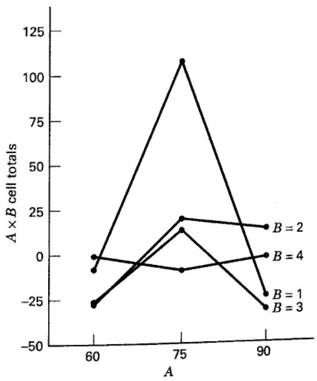
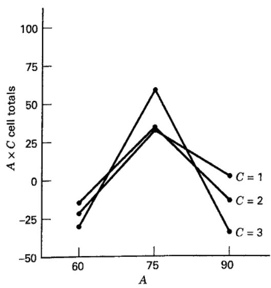

# 13.5 近似 F 检验

在含随机模型或混合模型的三个及以上因子的析因试验，以及某些更复杂的设计中，模型中的一些效应常没有精确检验统计量。一种可能的解决办法是假定某些交互作用可以忽略。例如，若有充分理由认为例 13.4 中所有两因子交互作用均可忽略，则可令 $\sigma_{\tau\beta}^2=\sigma_{\tau\gamma}^2=\sigma_{\beta\gamma}^2=0$，从而检验各主效应。

这一办法看似很有吸引力，但必须有过程本身的依据或充分的先验知识，才能假定一个或多个交互作用可忽略。一般而言，这不是一个可以轻率作出的假定。没有充分证据时，不应从模型中删除交互作用。一些试验者主张先检验交互作用，将不显著的交互作用置为零，再在检验同一试验的其他效应时把这些交互作用视为零。这种做法在实践中虽有人使用，却有风险，因为有关交互作用的判断同样可能犯第一类或第二类错误。

这一思路的另一种形式是合并方差分析中的某些均方，以获得自由度更多的误差估计。例如，假定例 13.4 中统计量 $F_0=MS_{ABC}/MS_E$ 不显著，则不能拒绝 $H_0:\sigma_{\tau\beta\gamma}^2=0$，此时可把 $MS_{ABC}$ 和 $MS_E$ 都视为 $\sigma^2$ 的估计。

试验者可能考虑按下式合并 $MS_{ABC}$ 与 $MS_E$：

$$
M S _ {E ^ {\prime}} = \frac {a b c (n - 1) M S _ {E} + (a - 1) (b - 1) (c - 1) M S _ {A B C}}{a b c (n - 1) + (a - 1) (b - 1) (c - 1)}
$$

若被合并的效应确实为零，则 $E(MS_{E'})=\sigma^2$。新均方 $MS_{E'}$ 的自由度为 $abc(n-1)+(a-1)(b-1)(c-1)$，而原误差均方 $MS_E$ 的自由度为 $abc(n-1)$。

合并的风险在于：若犯了第二类错误，将实际显著因子的均方并入误差，就会使新的残差均方 $MS_{E'}$ 偏大，从而更难发现其他显著效应。另一方面，若原误差均方的自由度很少，例如少于 6，合并可能大幅提高后续检验的精度。一个较实用的原则是：原误差自由度至少为 6 时，不合并；少于 6 时，只有待合并均方的 F 检验在较大的显著性水平（如 $\alpha=0.25$）下仍不显著，才考虑合并。

若不能假定某些交互作用可忽略，又需要对没有精确检验的效应作推断，可采用 Satterthwaite（1946）的方法。该方法使用均方的线性组合，例如

$$
M S ^ {\prime} = M S _ {r} + \dots + M S _ {s}\tag{13.14}
$$

以及

$$
M S ^ {\prime \prime} = M S _ {u} + \dots + M S _ {v}\tag{13.15}
$$

选择式（13.14）和式（13.15）中的均方，使 $E(MS')-E(MS'')$ 等于原假设所涉及效应（模型参数或方差分量）的某个倍数。然后使用检验统计量

$$
F = \frac {M S ^ {\prime}}{M S ^ {\prime \prime}}\tag{13.16}
$$

它近似服从 $F_{p,q}$ 分布，其中

$$
p = \frac {(M S _ {r} + \cdot \cdot \cdot + M S _ {s}) ^ {2}}{M S _ {r} ^ {2} / f _ {r} + \cdot \cdot \cdot + M S _ {s} ^ {2} / f _ {s}}\tag{13.17}
$$

以及

$$
q = \frac {(M S _ {u} + \cdots + M S _ {v}) ^ {2}}{M S _ {u} ^ {2} / f _ {u} + \cdots + M S _ {v} ^ {2} / f _ {v}}\tag{13.18}
$$

其中，$f_i$ 是均方 $MS_i$ 的自由度。$p,q$ 不一定是整数，因此查 F 分布表时可能需要插值。例如，对于三因子随机效应模型（表 13.8），不难看出，检验 $H_0:\sigma_\tau^2=0$ 的适当统计量为 $F=MS'/MS''$，其中

$$
M S ^ {\prime} = M S _ {A} + M S _ {A B C}
$$

以及

$$
M S ^ {\prime \prime} = M S _ {A B} + M S _ {A C}
$$

F 统计量的自由度由式（13.17）和式（13.18）计算。

这一检验的理论依据是：式（13.16）的分子和分母均近似服从某个倍数的卡方分布，而且没有均方同时出现在分子和分母中，所以二者相互独立。因此，F 近似服从 $F_{p,q}$ 分布。Satterthwaite 提醒，当 $MS'$ 或 $MS''$ 的组合中某些均方带负系数时，应谨慎使用。Gaylor 和 Hopper（1969）指出，当 $MS'=MS_1-MS_2$ 时，如果

$$
\frac {M S _ {1}}{M S _ {2}} > F _ {0.025, f _ {2}, f _ {1}} \times F _ {0.50, f _ {2}, f _ {2}}
$$

且 $f_1\le100$、$f_2\ge f_1/2$，则 Satterthwaite 近似的效果较好。

## 例 13.5

现研究涡轮膨胀阀两端测得的压降。设计工程师认为影响压降读数的重要变量是入口侧气体温度（A）、操作员（B），以及操作员使用的压力表（C）。将三个因子安排成析因设计，其中气体温度固定，操作员和压力表随机。两次重复的编码数据列于表 13.9。该设计的线性模型为

$$
\begin{array}{r} y _ {i j k l} = \mu + \tau_ {i} + \beta_ {j} + \gamma_ {k} + (\tau \beta) _ {i j} \\ + (\tau \gamma) _ {i k} + (\beta \gamma) _ {j k} + (\tau \beta \gamma) _ {i j k} + \epsilon_ {i j k l} \end{array}
$$

其中，$\tau_i$ 为气体温度 A 的效应，$\beta_j$ 为操作员 B 的效应，$\gamma_k$ 为压力表 C 的效应。

表 13.10 给出了方差分析，并增加了“期望均方”一列，其各项按第 13.4 节的规则推导。由这一列可知，除 A 主效应外，其他效应都有精确检验，结果也列于表中。检验气体温度效应，即

$H_0:\tau_i=0$，可采用统计量

$$
F = \frac {M S ^ {\prime}}{M S ^ {\prime \prime}}
$$

其中

$$
M S ^ {\prime} = M S _ {A} + M S _ {A B C}
$$

以及

$$
M S ^ {\prime \prime} = M S _ {A B} + M S _ {A C}
$$

因为

$$
E (M S ^ {\prime}) - E (M S ^ {\prime \prime}) = \frac {b c n \Sigma \tau_ {i} ^ {2}}{a - 1}
$$

为得到检验 $H_0:\tau_i=0$ 的统计量，计算

$$
\begin{array}{r l} M S ^ {\prime} & = M S _ {A} + M S _ {A B C} \\ & = 511.68 + 13.84 = 525.52 \\ M S ^ {\prime \prime} & = M S _ {A B} + M S _ {A C} \\ & = 202.00 + 34.47 = 236.47 \end{array}
$$

以及

$$
F = \frac {M S ^ {\prime}}{M S ^ {\prime \prime}} = \frac {525.52}{236.47} = 2.22
$$

## 表 13.9

涡轮试验的编码压降数据

<table><tr><td rowspan="4">压力表 (C)</td><td colspan="12">气体温度 (A)</td></tr><tr><td colspan="4">60°F</td><td colspan="4">75°F</td><td colspan="4">90°F</td></tr><tr><td colspan="4">操作员 (B)</td><td colspan="4">操作员 (B)</td><td colspan="4">操作员 (B)</td></tr><tr><td>1</td><td>2</td><td>3</td><td>4</td><td>1</td><td>2</td><td>3</td><td>4</td><td>1</td><td>2</td><td>3</td><td>4</td></tr><tr><td>1</td><td>-2</td><td>0</td><td>-1</td><td>4</td><td>14</td><td>6</td><td>1</td><td>-7</td><td>-8</td><td>-2</td><td>-1</td><td>-2</td></tr><tr><td></td><td>-3</td><td>-9</td><td>-8</td><td>4</td><td>14</td><td>0</td><td>2</td><td>6</td><td>-8</td><td>20</td><td>-2</td><td>1</td></tr><tr><td>2</td><td>-6</td><td>-5</td><td>-8</td><td>-3</td><td>22</td><td>8</td><td>6</td><td>-5</td><td>-8</td><td>1</td><td>-9</td><td>-8</td></tr><tr><td></td><td>4</td><td>-1</td><td>-2</td><td>-7</td><td>24</td><td>6</td><td>2</td><td>2</td><td>3</td><td>-7</td><td>-8</td><td>3</td></tr><tr><td>3</td><td>-1</td><td>-4</td><td>0</td><td>-2</td><td>20</td><td>2</td><td>3</td><td>-5</td><td>-2</td><td>-1</td><td>-4</td><td>1</td></tr><tr><td></td><td>-2</td><td>-8</td><td>-7</td><td>4</td><td>16</td><td>0</td><td>0</td><td>-1</td><td>-1</td><td>-2</td><td>-7</td><td>3</td></tr></table>

表 13.10
压降数据的方差分析

<table><tr><td>变异来源</td><td>平方和</td><td>自由度</td><td>期望均方</td><td>均方</td><td>$F_0$</td><td>P 值</td></tr><tr><td>温度, A</td><td>1023.36</td><td>2</td><td>$\sigma^2 + bn\sigma_{\tau \gamma}^2 + cn\sigma_{\tau \beta}^2 + n\sigma_{\tau \beta \gamma}^2 + \frac{bcn\σ\tau_i^2}{a-1}$</td><td>511.68</td><td>2.22</td><td>0.17</td></tr><tr><td>操作员, B</td><td>423.82</td><td>3</td><td>$\sigma^2 + an\sigma_{\beta \gamma}^2 + acn\sigma_\beta^2$</td><td>141.27</td><td>4.05</td><td>0.07</td></tr><tr><td>压力计，C</td><td>7.19</td><td>2</td><td>$\sigma^2 + an\sigma_{\beta \gamma}^2 + abn\sigma_\gamma^2$</td><td>3.60</td><td>0.10</td><td>0.90</td></tr><tr><td>AB</td><td>1211.97</td><td>6</td><td>$\sigma^2 + n\sigma_{\tau \beta \gamma}^2 + cn\sigma_{\tau \beta}^2$</td><td>202.00</td><td>14.59</td><td>&lt;0.01</td></tr><tr><td>AC</td><td>137.89</td><td>4</td><td>$\sigma^2 + n\sigma_{\tau \beta \gamma}^2 + bn\sigma_{\tau \gamma}^2$</td><td>34.47</td><td>2.49</td><td>0.10</td></tr><tr><td>BC</td><td>209.47</td><td>6</td><td>$\sigma^2 + an\sigma_{\beta \gamma}^2$</td><td>34.91</td><td>1.63</td><td>0.17</td></tr><tr><td>ABC</td><td>166.11</td><td>12</td><td>$\sigma^2 + n\sigma_{\tau \beta \gamma}^2$</td><td>13.84</td><td>0.65</td><td>0.79</td></tr><tr><td>误差</td><td>770.50</td><td>36</td><td>$\sigma^2$</td><td>21.40</td><td></td><td></td></tr><tr><td>总计</td><td>3950.32</td><td>71</td><td></td><td></td><td></td><td></td></tr></table>

按式（13.17）和式（13.18）求统计量的自由度：

$$
\begin{array}{r l} p & = \frac {(M S _ {A} + M S _ {A B C}) ^ {2}}{(M S _ {A} ^ {2} / 2) + (M S _ {A B C} ^ {2} / 12)} \\ & = \frac {(525.52) ^ {2}}{[ (511.68) ^ {2} / 2 ] + [ (13.84) ^ {2} / 12 ]} = 2.11 \simeq 2 \end{array}
$$

以及

$$
\begin{array}{r l} & {q = \frac {(M S _ {A B} + M S _ {A C}) ^ {2}}{(M S _ {A B} ^ {2} / 6) + (M S _ {A C} ^ {2} / 4)}} \\ & {\quad = \frac {(236.47) ^ {2}}{[ (202.00) ^ {2} / 6 ] + [ (34.47) ^ {2} / 4 ]} = 7.88 \simeq 8} \end{array}
$$

将 $F=2.22$ 与 $F_{0.05,2,8}=4.46$ 比较，不能拒绝 $H_0$。P 值约为 0.17。

AB，即温度与操作员的交互作用很大；AC，即温度与压力表的交互作用也有一定迹象。图 13.1 的 AB 和 AC 交互作用图表明，当使用操作员 1 和压力表 3 时，温度效应可能很大。因此，较大的 AB 交互作用可能掩盖了温度和操作员的主效应。

  
图 13.1 压降试验中的交互作用

表 13.11 给出了例 13.5 的 Minitab 平衡方差分析输出，这里指定采用受限模型。$Q[1]$ 表示气体温度的固定效应。除气体温度（因子 A）的 F 检验外，输出中的方差分析与表 13.10 基本一致。Minitab 指出这一检验不是精确检验，这也可由期望均方看出。Minitab 构造的“合成检验”实际上采用了 Satterthwaite 方法，但所用统计量与我们不同。由输出可知，检验 A 的误差均方为

$$
(4) + (5) - (7) = M S _ {A B} + M S _ {A C} - M S _ {A B C}
$$

其期望值为

$$
\begin{array}{r} E [ (4) + (5) - (7) ] = \sigma^ {2} + n \sigma_ {\tau \beta \gamma} ^ {2} + c n \sigma_ {\tau \beta} ^ {2} + \sigma^ {2} + n \sigma_ {\tau \beta \gamma} ^ {2} \\ + b n \sigma_ {\tau \gamma} ^ {2} - (\sigma^ {2} + n \sigma_ {\tau \beta \gamma} ^ {2}) \\ = \sigma^ {2} + n \sigma_ {\tau \beta \gamma} ^ {2} + c n \sigma_ {\tau \beta} ^ {2} + b n \sigma_ {\tau \gamma} ^ {2} \end{array}
$$

因而可以作为检验 A 主效应的误差均方。这说明，Satterthwaite 方法中的合成均方可以有多种构造方式。不过，我们通常更倾向于前面选用的线性组合，因为其中没有带负系数的均方。

表 13.12 给出了例 13.5 采用非受限模型时的分析。与受限模型的主要区别是，三个主效应现在都没有精确检验。在受限模型中，两个随机主效应可用其交互作用作检验；而在非受限模型中，B 的期望均方包含 $\sigma_{\tau\beta\gamma}^2$ 和 $\sigma_{\tau\beta}^2$，C 的期望均方包含 $\sigma_{\tau\beta\gamma}^2$ 和 $\sigma_{\tau\gamma}^2$。Minitab 再次构造合成均方，使用 Satterthwaite 方法检验这些效应。除操作员方差分量的估计变化很大外，总体结论与受限模型相差不大。非受限模型给出了负的 $\sigma_\beta^2$ 估计。由于两种分析中的压力表因子都不显著，可能适合进一步简化模型。
