CHAPTER 14

# Nested and Split-Plot Designs

## CHAPTER LEARNING OBJECTIVES

1. Know how to identify a nested factor.

2. Understand what can happen if an experimenter makes the common mistake of failing to properly identify and treat a nested factor in an experiment.

3. Know how to analyze a two-stage nested design.

4. Understand how a split-plot design handles easy-to-change and hard-to-change factors in an experiment.

5. Understand why there are two sources of variability in a split-plot experiment.

6. Know how to construct and analyze a split-plot design.

This chapter introduces two important types of experimental designs, the nested design and the split-plot design. Both of these designs find reasonably widespread application in the industrial use of designed experiments. They also frequently involve one or more random factors, and so some of the concepts introduced in Chapter 13 will find application here.

## 14.1 The Two-Stage Nested Design

In certain multifactor experiments, the levels of one factor (e.g., factor B) are similar but not identical for different levels of another factor (e.g., A). Such an arrangement is called a nested, or hierarchical design, with the levels of factor B nested under the levels of factor A. For example, consider a company that purchases its raw material from three different suppliers. The company wishes to determine whether the purity of the raw material is the same from each supplier. There are four batches of raw material available from each supplier, and three determinations of purity are to be taken from each batch. The situation is depicted in Figure 14.1.

This is a two-stage nested design, with batches nested under suppliers. At first glance, you may ask why this is not a factorial experiment. If this were a factorial, then batch 1 would always refer to the same batch, batch 2 would always refer to the same batch, and so on. This is clearly not the case because the batches from each supplier are unique for that particular supplier. That is, batch 1 from supplier 1 has no connection with batch 1 from any other supplier, batch 2 from supplier 1 has no connection with batch 2 from any other supplier, and so forth. To emphasize

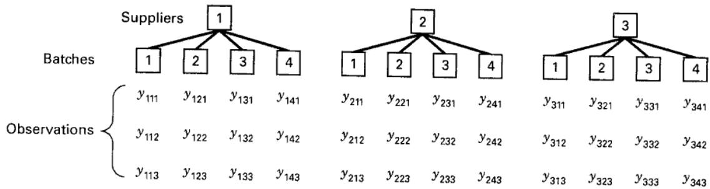

■ FIGURE 14.1 A two-stage nested design

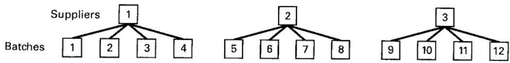  
■ FIGURE 14.2 Alternate layout for the two-stage nested design

the fact that the batches from each supplier are different batches, we may renumber the batches as 1, 2, 3, and 4 from supplier 1; 5, 6, 7, and 8 from supplier 2; and 9, 10, 11, and 12 from supplier 3, as shown in Figure 14.2.

Sometimes we may not know whether a factor is crossed in a factorial arrangement or nested. If the levels of the factor can be renumbered arbitrarily as in Figure 14.2, then the factor is nested.

## 14.1.1 Statistical Analysis

The linear statistical model for the two-stage nested design is

$$
y _ {i j k} = \mu + \tau_ {i} + \beta_ {j (i)} + \epsilon_ {(i j) k} \left\{ \begin{array}{l} i = 1, 2, \dots , a \\ j = 1, 2, \dots , b \\ k = 1, 2, \dots , n \end{array} \right.\tag{14.1}
$$

That is, there are a levels of factor A, b levels of factor B nested under each level of A, and n replicates. The subscript $j(i)$ indicates that the jth level of factor B is nested under the ith level of factor A. It is convenient to think of the replicates as being nested within the combination of levels of A and B; thus, the subscript $(ij)k$ is used for the error term. This is a balanced nested design because there are an equal number of levels of B within each level of A and an equal number of replicates. Because not every level of factor B appears with every level of factor A, there can be no interaction between A and B.

We may write the total corrected sum of squares as

$$
\sum_ {i = 1} ^ {a} \sum_ {j = 1} ^ {b} \sum_ {k = 1} ^ {n} (y _ {i j k} - \overline {{y}} _ {\dots}) ^ {2} = \sum_ {i = 1} ^ {a} \sum_ {j = 1} ^ {b} \sum_ {k = 1} ^ {n} [ (\overline {{y}} _ {i..} - \overline {{y}} _ {\dots}) + (\overline {{y}} _ {i j.} - \overline {{y}} _ {i.}) + (y _ {i j k} - \overline {{y}} _ {i j.}) ] ^ {2}\tag{14.2}
$$

Expanding the right-hand side of Equation 14.2 yields

$$
\begin{array}{r} \sum_ {i = 1} ^ {a} \sum_ {j = 1} ^ {b} \sum_ {k = 1} ^ {n} (y _ {i j k} - \overline {{y}} _ {\dots}) ^ {2} = b n \sum_ {i = 1} ^ {a} (\overline {{y}} _ {i..} - \overline {{y}} _ {\dots}) ^ {2} + n \sum_ {i = 1} ^ {a} \sum_ {j = 1} ^ {b} (\overline {{y}} _ {i j.} - \overline {{y}} _ {i..}) ^ {2} \\ + \sum_ {i = 1} ^ {a} \sum_ {j = 1} ^ {b} \sum_ {k = 1} ^ {n} (y _ {i j k} - \overline {{y}} _ {i j.}) ^ {2} \end{array}\tag{14.3}
$$

because the three cross-product terms are zero. Equation 14.3 indicates that the total sum of squares can be partitioned into a sum of squares due to factor A, a sum of squares due to factor B under the levels of A, and a sum of squares due to error. Symbolically, we may write Equation 14.3 as

$$
S S _ {T} = S S _ {A} + S S _ {B (A)} + S S _ {E}\tag{14.4}
$$

There are abn-1 degrees of freedom for $SS_{T}$ , a-1 degrees of freedom for $SS_{A}$ , $a(b-1)$ degrees of freedom for $SS_{B(A)}$ , and $ab(n-1)$ degrees of freedom for error. Note that $abn-1=(a-1)+a(b-1)+ab(n-1)$ . If the errors are $\mathrm{NID}(0,\sigma^{2})$ , we may divide each sum of squares on the right of Equation 14.4 by its degrees of freedom to obtain independently distributed mean squares such that the ratio of any two mean squares is distributed as F.

The appropriate statistics for testing the effects of factors A and B depend on whether A and B are fixed or random. If factors A and B are fixed, we assume that $\sum_{i=1}^{a}\tau_{i}=0$ and $\sum_{j=1}^{b}\beta_{j(i)}=0\;(i=1,2,\ldots,a)$ . That is, the A treatment effects sum to zero, and the B treatment effects sum to zero within each level of A. Alternatively, if A and B are random, we assume that $\tau_{i}$ is $\mathrm{NID}(0,\sigma_{\tau}^{2})$ and $\beta_{j(i)}$ is $\mathrm{NID}(0,\sigma_{\beta}^{2})$ . Mixed models with A fixed and B random are also widely encountered. The expected mean squares can be determined by a straightforward application of the rules in Chapter 13. Table 14.1 gives the expected mean squares for these situations.

Table 14.1 indicates that if the levels of A and B are fixed, $H_{0}$ : $\tau_{i}=0$ is tested by $MS_{A}/MS_{E}$ and $H_{0}$ : $\beta_{j(i)}=0$ is tested by $MS_{B(A)}/MS_{E}$ . If A is a fixed factor and B is random, then $H_{0}$ : $\tau_{i}=0$ is tested by $MS_{A}/MS_{B(A)}$ and $H_{0}$ : $\sigma_{\beta}^{2}=0$ is tested by $MS_{B(A)}/MS_{E}$ . Finally, if both A and B are random factors, we test $H_{0}$ : $\sigma_{\tau}^{2}=0$ by $MS_{A}/MS_{B(A)}$ and $H_{0}$ : $\sigma_{\beta}^{2}=0$ by $MS_{B(A)}/MS_{E}$ . The test procedure is summarized in an analysis of variance table as shown in Table 14.2. Computing formulas for the sums of squares may be obtained by expanding the quantities in Equation 14.3 and simplifying. They are

$$
S S _ {A} = \frac {1}{b n} \sum_ {i = 1} ^ {a} y _ {i..} ^ {2} - \frac {y _ {. . .} ^ {2}}{a b n}\tag{14.5}
$$

$$
S S _ {B (A)} = \frac {1}{n} \sum_ {i = 1} ^ {a} \sum_ {j = 1} ^ {b} y _ {i j..} ^ {2} - \frac {1}{b n} \sum_ {i = 1} ^ {a} y _ {i..} ^ {2}\tag{14.6}
$$

$$
S S _ {E} = \sum_ {i = 1} ^ {a} \sum_ {j = 1} ^ {b} \sum_ {k = 1} ^ {n} y _ {i j k} ^ {2} - \frac {1}{n} \sum_ {i = 1} ^ {a} \sum_ {j = 1} ^ {b} y _ {i j.} ^ {2}\tag{14.7}
$$

TABLE 14.1  
Expected Mean Squares in the Two-Stage Nested Design

<table><tr><td>E(MS)</td><td>A FixedB Fixed</td><td>A FixedB Random</td><td>A RandomB Random</td></tr><tr><td> $E(MS_A)$ </td><td> $\sigma^2 + \frac{bn\Sigma\tau_i^2}{a-1}$ </td><td> $\sigma^2 + n\sigma_\beta^2 + \frac{bn\Sigma\tau_i^2}{a-1}$ </td><td> $\sigma^2 + n\sigma_\beta^2 + bn\sigma_\tau^2$ </td></tr><tr><td> $E(MS_{B(A)})$ </td><td> $\sigma^2 + \frac{n\Sigma\Sigma\beta_{j(i)}^2}{a(b-1)}$ </td><td> $\sigma^2 + n\sigma_\beta^2$ </td><td> $\sigma^2 + n\sigma_\beta^2$ </td></tr><tr><td> $E(MS_E)$ </td><td> $\sigma^2$ </td><td> $\sigma^2$ </td><td> $\sigma^2$ </td></tr></table>

TABLE 14.2  
Analysis of Variance Table for the Two-Stage Nested Design

<table><tr><td>Source of Variation</td><td>Sum of Squares</td><td>Degrees of Freedom</td><td>Mean Square</td></tr><tr><td>A</td><td> $bn \sum (\overline{y}_{i..} - \overline{y}_{...})^{2}$ </td><td>a-1</td><td> $MS_{A}$ </td></tr><tr><td>B within A</td><td> $n \sum \sum (\overline{y}_{ij.} - \overline{y}_{i..})^{2}$ </td><td>a(b-1)</td><td> $MS_{B(A)}$ </td></tr><tr><td>Error</td><td> $\sum \sum \sum (y_{ijk} - \overline{y}_{ij.})^{2}$ </td><td>ab(n-1)</td><td> $MS_{E}$ </td></tr><tr><td>Total</td><td> $\sum \sum \sum (y_{ijk} - \overline{y}_{...})^{2}$ </td><td>abn-1</td><td></td></tr></table>

$$
S S _ {T} = \sum_ {i = 1} ^ {a} \sum_ {j = 1} ^ {b} \sum_ {k = 1} ^ {n} y _ {i j k} ^ {2} - \frac {y _ {\dots} ^ {2}}{a b n}\tag{14.8}
$$

We see that Equation 14.6 for $SS_{B(A)}$ can be written as

$$
S S _ {B (A)} = \sum_ {i = 1} ^ {a} \left[ \frac {1}{n} \sum_ {j = 1} ^ {b} y _ {i j \cdot} ^ {2} - \frac {y _ {i \cdot \cdot} ^ {2}}{b n} \right]
$$

This expresses the idea that $SS_{B(A)}$ is the sum of squares between levels of B for each level of A, summed over all the levels of A.

## EXAMPLE 14.1

Consider a company that buys raw material in batches from three different suppliers. The purity of this raw material varies considerably, which causes problems in manufacturing the finished product. We wish to determine whether the variability in purity is attributable to differences between the suppliers. Four batches of raw material are selected at random from each supplier, and three determinations of purity are made on each batch. This is, of course, a two-stage nested design. The data, after coding by subtracting 93, are shown in Table 14.3. The sums of squares are computed as follows:

$$
\begin{array}{r l} S S _ {T} & = \sum_ {i = 1} ^ {a} \sum_ {j = 1} ^ {b} \sum_ {k = 1} ^ {n} y _ {i j k} ^ {2} - \frac {y _ {\cdots} ^ {2}}{a b n} \\ & = 1 5 3. 0 0 - \frac {(1 3) ^ {2}}{3 6} = 1 4 8. 3 1 \\ S S _ {A} & = \frac {1}{b n} \sum_ {i = 1} ^ {a} y _ {i \cdot \cdot} ^ {2} - \frac {y _ {\cdot \cdot} ^ {2}}{a b n} \\ & = \frac {1}{(4) (3)} [ (- 5) ^ {2} + (4) ^ {2} + (1 4) ^ {2} ] - \frac {(1 3) ^ {2}}{3 6} = 1 5. 0 6 \end{array}
$$

$$
\begin{array}{r l} S S _ {B (A)} & = \frac {1}{n} \sum_ {i = 1} ^ {a} \sum_ {j = 1} ^ {b} y _ {i j \cdot} ^ {2} - \frac {1}{b n} \sum_ {i = 1} ^ {a} y _ {i \cdot \cdot} ^ {2} \\ & = \frac {1}{3} [ (0) ^ {2} + (- 9) ^ {2} + (- 1) ^ {2} + \dots + (2) ^ {2} + (6) ^ {2} ] \\ & - 1 9. 7 5 = 6 9. 9 2 \end{array}
$$

and

$$
\begin{array}{c} S S _ {E} = \sum_ {i = 1} ^ {a} \sum_ {j = 1} ^ {b} \sum_ {k = 1} ^ {n} y _ {i j k} ^ {2} - \frac {1}{n} \sum_ {i = 1} ^ {a} \sum_ {j = 1} ^ {b} y _ {i j.} ^ {2} \\ = 1 5 3. 0 0 - 8 9. 6 7 = 6 3. 3 3 \end{array}
$$

The analysis of variance is summarized in Table 14.4. Suppliers are fixed and batches are random, so the expected mean squares are obtained from the middle column of Table 14.1. They are repeated for convenience in Table 14.4. From examining the P-values, we would conclude that there is no significant effect on purity due to suppliers, but the purity of batches of raw material from the same supplier does differ significantly.

■ TABLE 14.3
Coded Purity Data for Example 14.1 (Code: $y_{ijk} = Purity - 93$ )

<table><tr><td rowspan="2"></td><td rowspan="2">Batches</td><td colspan="4">Supplier 1</td><td colspan="4">Supplier 2</td><td colspan="4">Supplier 3</td></tr><tr><td>1</td><td>2</td><td>3</td><td>4</td><td>1</td><td>2</td><td>3</td><td>4</td><td>1</td><td>2</td><td>3</td><td>4</td></tr><tr><td></td><td></td><td>1</td><td>-2</td><td>-2</td><td>1</td><td>1</td><td>0</td><td>-1</td><td>0</td><td>2</td><td>-2</td><td>1</td><td>3</td></tr><tr><td></td><td></td><td>-1</td><td>-3</td><td>0</td><td>4</td><td>-2</td><td>4</td><td>0</td><td>3</td><td>4</td><td>0</td><td>-1</td><td>2</td></tr><tr><td></td><td></td><td>0</td><td>-4</td><td>1</td><td>0</td><td>-3</td><td>2</td><td>-2</td><td>2</td><td>0</td><td>2</td><td>2</td><td>1</td></tr><tr><td>Batch totals</td><td> $y_{ij}$ </td><td>0</td><td>-9</td><td>-1</td><td>5</td><td>-4</td><td>6</td><td>-3</td><td>5</td><td>6</td><td>0</td><td>2</td><td>6</td></tr><tr><td>Supplier totals</td><td> $y_{i..}$ </td><td></td><td></td><td>-5</td><td></td><td></td><td></td><td>4</td><td></td><td></td><td></td><td>14</td><td></td></tr></table>

## TABLE 14.4

Analysis of Variance for the Data in Example 14.1

<table><tr><td>Source of Variation</td><td>Sum of Squares</td><td>Degrees of Freedom</td><td>Mean Square</td><td>Expected Mean Square</td><td> $F_0$ </td><td>P-Value</td></tr><tr><td>Suppliers</td><td>15.06</td><td>2</td><td>7.53</td><td> $\sigma^2 + 3\sigma_\beta^2 + 6\Sigma\tau_i^2$ </td><td>0.97</td><td>0.42</td></tr><tr><td>Batches (within suppliers)</td><td>69.92</td><td>9</td><td>7.77</td><td> $\sigma^2 + 3\sigma_\beta^2$ </td><td>2.94</td><td>0.02</td></tr><tr><td>Error</td><td>63.33</td><td>24</td><td>2.64</td><td> $\sigma^2$ </td><td></td><td></td></tr><tr><td>Total</td><td>148.31</td><td>35</td><td></td><td></td><td></td><td></td></tr></table>

The practical implications of this experiment and the analysis are very important. The objective of the experimenter is to find the source of the variability in raw material purity. If it results from differences among suppliers, we may be able to solve the problem by selecting the “best” supplier. However, that solution is not applicable here because the major source of variability is the batch-to-batch purity variation within suppliers. Therefore, we must attack the problem by working with the suppliers to reduce their batch-to-batch variability. This may involve modifications to the suppliers’ production processes or their internal quality assurance system.

Notice what would have happened if we had incorrectly analyzed this design as a two-factor factorial experiment. If batches are considered to be crossed with suppliers, we obtain batch totals of 2, -3, -2, and 16, with each batch × suppliers cell containing three replicates. Thus, a sum of squares due to batches and an interaction sum of squares can be computed. The complete factorial analysis of variance is shown in Table 14.5, assuming the mixed model.

## TABLE 14.5

Incorrect Analysis of the Two-Stage Nested Design in Example 14.1 as a Factorial (Suppliers Fixed, Batches Random)

<table><tr><td>Source of Variation</td><td>Sum of Squares</td><td>Degrees of Freedom</td><td>Mean Square</td><td> $F_0$ </td><td>P-Value</td></tr><tr><td>Suppliers (S)</td><td>15.06</td><td>2</td><td>7.53</td><td>1.02</td><td>0.42</td></tr><tr><td>Batches (B)</td><td>25.64</td><td>3</td><td>8.55</td><td>3.24</td><td>0.04</td></tr><tr><td>S × B interaction</td><td>44.28</td><td>6</td><td>7.38</td><td>2.80</td><td>0.03</td></tr><tr><td>Error</td><td>63.33</td><td>24</td><td>2.64</td><td></td><td></td></tr><tr><td>Total</td><td>148.31</td><td>35</td><td></td><td></td><td></td></tr></table>

This analysis indicates that batches differ significantly and that there is a significant interaction between batches and suppliers. However, it is difficult to give a practical interpretation of the batches $\times$ suppliers interaction. For example, does this significant interaction mean that the supplier effect is not constant from batch to batch? Furthermore, the significant interaction coupled with the nonsignificant supplier effect could lead the analyst to conclude that suppliers really differ but their effect is masked by the significant interaction.

Computing. Some statistical software packages will perform the analysis for a nested design. Table 14.6 presents the output from the Balanced ANOVA procedure in Minitab (using the restricted model). The numerical results are in agreement with the manual calculations reported in Table 14.4. Minitab also reports the expected mean squares in the lower portion of Table 14.6. Remember that the symbol Q[1] is a quadratic term that represents the fixed effect of suppliers, so in our notation

$$
Q [ 1 ] = \frac {\sum_ {i = 1} ^ {a} \tau_ {i} ^ {2}}{a - 1}
$$

Therefore, the fixed effect term in the Minitab expected mean square for suppliers 12Q[1] = 12 $\sum_{i=1}^{3}\tau_{i}^{2}/(3-1)=6\sum_{i=1}^{3}\tau_{i}^{2}$ , which matches the result given by the algorithm in Table 14.4.

Sometimes a specialized computer program for analyzing nested designs is not available. However, notice from comparing Tables 14.4 and 14.5 that

$$
S S _ {B} + S S _ {S \times B} = 2 5. 6 4 + 4 4. 2 8 = 6 9. 9 2 \equiv S S _ {B (S)}
$$

## TABLE 14.6

Minitab Output (Balanced ANOVA) for Example 14.1

<table><tr><td colspan="7">Analysis of Variance (Balanced Designs)</td></tr><tr><td>Factor</td><td>Type</td><td>Levels</td><td>Values</td><td></td><td></td><td></td></tr><tr><td>Supplier</td><td>fixed</td><td>3</td><td>1</td><td>2</td><td>3</td><td></td></tr><tr><td>Batch(Supplier)</td><td>random</td><td>4</td><td>1</td><td>2</td><td>3</td><td>4</td></tr><tr><td colspan="7">Analysis of Variance for Purity</td></tr><tr><td>Source</td><td>DF</td><td>SS</td><td>MS</td><td>F</td><td>P</td><td></td></tr><tr><td>Supplier</td><td>2</td><td>15.056</td><td>7.528</td><td>0.97</td><td>0.416</td><td></td></tr><tr><td>Batch(Supplier)</td><td>9</td><td>69.917</td><td>7.769</td><td>2.94</td><td>0.017</td><td></td></tr><tr><td>Error</td><td>24</td><td>63.333</td><td>2.639</td><td></td><td></td><td></td></tr><tr><td>Total</td><td>35</td><td>148.306</td><td></td><td></td><td></td><td></td></tr><tr><td>Source</td><td>Variance component</td><td>Error term</td><td colspan="4">Expected Mean Square for Each Term(using restricted model)</td></tr><tr><td>1 Supplier</td><td></td><td>2</td><td colspan="4">(3) + 3(2) + 12Q[1]</td></tr><tr><td>2 Batch(Supplier)</td><td>1.710</td><td>3</td><td colspan="4">(3) + 3(2)</td></tr><tr><td>3 Error</td><td>2.639</td><td></td><td colspan="4">(3)</td></tr></table>

That is, the sum of squares for batches within suppliers consists of the sum of squares of the batches plus the sum of squares for the batches $\times$ suppliers interaction. The degrees of freedom have a similar property; that is,

$$
\frac {\text { B   a   t   c   h   e   s }}{3} + \frac {\text { B   a   t   c   h   e   s } \times \text { S   u   p   p   l   i   e   r   s }}{6} = \frac {\text { B   a   t   c   h   e   s   w   i   t   h   i   n   S   u   p   p   l   i   e   r   s }}{9}
$$

Therefore, a computer program for analyzing factorial designs could also be used for the analysis of nested designs by pooling the “main effect” of the nested factor and interactions of that factor with the factor under which it is nested.

## 14.1.2 Diagnostic Checking

The major tool used in diagnostic checking is residual analysis. For the two-stage nested design, the residuals are

$$
e _ {i j k} = y _ {i j k} - \hat {y} _ {i j k}
$$

The fitted value is

$$
\hat {y} _ {i j k} = \hat {\mu} + \hat {\tau} _ {i} + \hat {\beta} _ {j (i)}
$$

and if we make the usual restrictions on the model parameters $(\Sigma_{i}\hat{\tau}_{i}=0$ and $\Sigma_{j}\hat{\beta}_{j(i)}=0,i=1,2,\ldots,a)$ , then $\hat{\mu}=\overline{y}_{\ldots},\hat{\tau}_{i}=\overline{y}_{i\ldots}-\overline{y}_{\ldots}$ , and $\hat{\beta}_{j(i)}=\overline{y}_{ij.}-\overline{y}_{i\ldots}$ . Consequently, the fitted value is

$$
\hat {y} _ {i j k} = \overline {{y}} _ {\dots} + (\overline {{y}} _ {i..} - \overline {{y}} _ {\dots}) + (\overline {{y}} _ {i j.} - \overline {{y}} _ {i..}) = \overline {{y}} _ {i j.}
$$

Thus, the residuals from the two-stage nested design are

$$
e _ {i j k} = y _ {i j k} - \overline {{y}} _ {i j}.\tag{14.9}
$$

where $\overline{y}_{ij}$ . are the individual batch averages.

The observations, fitted values, and residuals for the purity data in Example 14.1 follow:

<table><tr><td>Observed Value  $y_{ijk}$ </td><td>Fitted Value  $\hat{y}_{ijk} = \bar{y}_{ij}$ </td><td> $e_{ijk} = y_{ijk} - \bar{y}_{ij}$ </td></tr><tr><td>1</td><td>0.00</td><td>1.00</td></tr><tr><td>-1</td><td>0.00</td><td>-1.00</td></tr><tr><td>0</td><td>0.00</td><td>0.00</td></tr><tr><td>-2</td><td>-3.00</td><td>1.00</td></tr><tr><td>-3</td><td>-3.00</td><td>0.00</td></tr><tr><td>-4</td><td>-3.00</td><td>-1.00</td></tr><tr><td>-2</td><td>-0.33</td><td>-1.67</td></tr><tr><td>0</td><td>-0.33</td><td>0.33</td></tr><tr><td>1</td><td>-0.33</td><td>1.33</td></tr><tr><td>1</td><td>1.67</td><td>-0.67</td></tr><tr><td>4</td><td>1.67</td><td>2.33</td></tr><tr><td>0</td><td>1.67</td><td>-1.67</td></tr><tr><td>1</td><td>-1.33</td><td>2.33</td></tr><tr><td>-2</td><td>-1.33</td><td>-0.67</td></tr><tr><td>-3</td><td>-1.33</td><td>-1.67</td></tr><tr><td>0</td><td>2.00</td><td>-2.00</td></tr><tr><td>4</td><td>2.00</td><td>2.00</td></tr><tr><td>2</td><td>2.00</td><td>0.00</td></tr><tr><td>-1</td><td>-1.00</td><td>0.00</td></tr><tr><td>0</td><td>-1.00</td><td>1.00</td></tr><tr><td>-2</td><td>-1.00</td><td>-1.00</td></tr><tr><td>0</td><td>1.67</td><td>-1.67</td></tr><tr><td>3</td><td>1.67</td><td>1.33</td></tr><tr><td>2</td><td>1.67</td><td>0.33</td></tr><tr><td>2</td><td>2.00</td><td>0.00</td></tr><tr><td>4</td><td>2.00</td><td>2.00</td></tr><tr><td>0</td><td>2.00</td><td>-2.00</td></tr><tr><td>-2</td><td>0.00</td><td>-2.00</td></tr><tr><td>0</td><td>0.00</td><td>0.00</td></tr><tr><td>2</td><td>0.00</td><td>2.00</td></tr><tr><td>1</td><td>0.67</td><td>0.33</td></tr><tr><td>-1</td><td>0.67</td><td>-1.67</td></tr><tr><td>2</td><td>0.67</td><td>1.33</td></tr><tr><td>3</td><td>2.00</td><td>1.00</td></tr><tr><td>2</td><td>2.00</td><td>0.00</td></tr><tr><td>1</td><td>2.00</td><td>-1.00</td></tr></table>

The usual diagnostic checks—including normal probability plots, checking for outliers, and plotting the residuals versus fitted values—may now be performed. As an illustration, the residuals are plotted versus the fitted values and against the levels of the supplier factor in Figure 14.3.

In a problem situation such as that described in Example 14.1, the residual plots are particularly useful because of the additional diagnostic information they contain. For instance, the analysis of variance has indicated that the mean purity of all three suppliers does not differ but that there is statistically significant batch-to-batch variability (that is, $\sigma_{\beta}^{2} > 0$ ). But, is the variability within batches the same for all suppliers? In effect, we have assumed this to be the case and if it's not true, we would certainly like to know it because it has considerable practical impact on our interpretation of the results of the experiment. The plot of residuals versus suppliers in Figure 14.3b is a simple but effective way to check this assumption. Because the spread of the residuals is about the same for all three suppliers, we would conclude that the batch-to-batch variability in purity is about the same for all three suppliers.

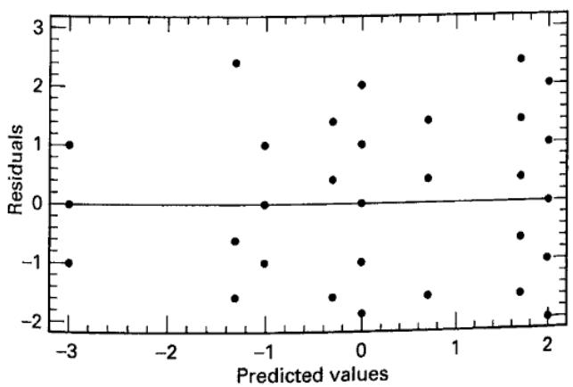  
(a) Plot of residuals versus the predicted values  
■ FIGURE 14.3 Residual plots for Example 14.1

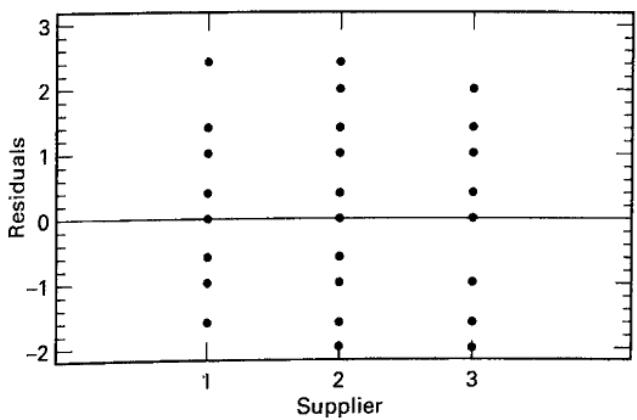  
(b) Plot of residuals versus supplier

## 14.1.3 Variance Components

For the random effects case, the analysis of variance method can be used to estimate the variance components $\sigma^{2}$ , $\sigma_{\beta}^{2}$ , and $\sigma_{\tau}^{2}$ . The maximum likelihood (REML) procedure could also be used. Applying the ANOVA method and using the expected mean squares in the last column of Table 14.1, we obtain

$$
\hat {\sigma} ^ {2} = M S _ {E}\tag{14.10}
$$

$$
\hat {\sigma} _ {\beta} ^ {2} = \frac {M S _ {B (A)} - M S _ {E}}{n}\tag{14.11}
$$

and

$$
\hat {\sigma} _ {\tau} ^ {2} = \frac {M S _ {A} - M S _ {B (A)}}{b n}\tag{14.12}
$$

Many applications of nested designs involve a mixed model, with the main factor (A) fixed and the nested factor (B) random. This is the case for the problem described in Example 14.1, where suppliers (factor A) are fixed, and batches of raw material (factor B) are random. The effects of the suppliers may be estimated by

$$
\begin{array}{l} \hat {\tau} _ {1} = \overline {{y}} _ {1..} - \overline {{y}} _ {...} = \frac {- 5}{1 2} - \frac {1 3}{3 6} = \frac {- 2 8}{3 6} \\ \hat {\tau} _ {2} = \overline {{y}} _ {2..} - \overline {{y}} _ {...} = \frac {4}{1 2} - \frac {1 3}{3 6} = \frac {- 1}{3 6} \\ \hat {\tau} _ {3} = \overline {{y}} _ {3..} - \overline {{y}} _ {...} = \frac {1 4}{1 2} - \frac {1 3}{3 6} = \frac {2 9}{3 6} \end{array}
$$

To estimate the variance components $\sigma^{2}$ and $\sigma_{\beta}^{2}$ , we eliminate the line in the analysis of variance table pertaining to suppliers and apply the analysis of variance estimation method to the next two lines. This yields

$$
\hat {\sigma} ^ {2} = M S _ {E} = 2. 6 4
$$

and

$$
\hat {\sigma} _ {\beta} ^ {2} = \frac {M S _ {B (A)} - M S _ {E}}{n} = \frac {7 . 7 7 - 2 . 6 4}{3} = 1. 7 1
$$

These results are also shown in the lower portion of the Minitab output in Table 14.6. From the analysis in Example 14.1, we know that the $\tau_{i}$ does not differ significantly from zero, whereas the variance component $\sigma_{\beta}^{2}$ is greater than zero.

To illustrate the REML method for a nested design, reconsider the experiment in Example 14.1 with suppliers fixed and batches random. The REML output from JMP is shown in Table 14.7. The REML estimates of the variance components agree with the ANOVA estimates, but the REML procedure provides confidence intervals. The fixed effects test on suppliers indicates that there is no significant difference in mean purity among the three suppliers. The 95 percent confidence interval on batches within suppliers has a lower bound that is just less than zero, but the batches within suppliers variance component accounts for about 40 percent of the total variability so there is some evidence that batches within suppliers exhibit some meaningful variability.

## 14.1.4 Staggered Nested Designs

A potential problem in the application of nested designs is that sometimes to get a reasonable number of degrees of freedom at the highest level, we can end up with many degrees of freedom (perhaps too many) at lower stages. To illustrate, suppose that we are investigating potential differences in chemical analysis among different lots of material. We plan to take five samples per lot, and each sample will be measured twice. If we want to estimate a variance component for lots, then 10 lots would not be an unreasonable choice. This results in 9 degrees of freedom for lots, 40 degrees of freedom for samples, and 50 degrees of freedom for measurements.

One way to avoid this is to use a particular type of unbalanced nested design called a staggered nested design. An example of a staggered nested design is shown in Figure 14.4. Notice that only two samples are taken from each lot; one of the samples is measured twice, whereas the other sample is measured once. If there are a lots, then there will be a - 1 degrees of freedom for lots (or, in general, the upper stage), and all lower stages will have exactly a degrees of freedom. For more information on the use and analysis of these designs, see Bainbridge (1965), Smith and Beverly (1981), and Nelson (1983, 1995a, 1995b). The supplemental text material for this chapter contains a complete example of a staggered nested design.

■ TABLE 14.7
JMP Output for the Nested Design in Example 14.1, Suppliers Fixed and Batches Random

<table><tr><td colspan="7">Response Y</td></tr><tr><td colspan="7">Summary of Fit</td></tr><tr><td>RSquare</td><td colspan="6">0.518555</td></tr><tr><td>RSquare Adj</td><td colspan="6">0.489376</td></tr><tr><td>Root Mean Square Error</td><td colspan="6">1.624466</td></tr><tr><td>Mean of Response</td><td colspan="6">0.361111</td></tr><tr><td>Observations (or Sum Wgts)</td><td colspan="6">36</td></tr><tr><td colspan="7">REML Variance Component Estimates</td></tr><tr><td>Random Effect</td><td>Var Ratio</td><td>Var Component</td><td>Std Error</td><td>95% Lower</td><td>95% Upper</td><td>Pct of Total</td></tr><tr><td>Supplier [Batches]</td><td>0.6479532</td><td>1.7098765</td><td>1.2468358</td><td>-0.733922</td><td>4.1536747</td><td>39.319</td></tr><tr><td>Residual</td><td></td><td>2.6388889</td><td>0.7617816</td><td>1.6089119</td><td>5.1070532</td><td>60.681</td></tr><tr><td>Total</td><td></td><td>4.3487654</td><td></td><td></td><td></td><td>100.000</td></tr><tr><td colspan="7">-2 LogLikelihood = 145.04119391</td></tr><tr><td colspan="7">Covariance Matrix of Variance Component Estimates</td></tr><tr><td>Random Effect</td><td>Supplier [Batches]</td><td colspan="5">Residual</td></tr><tr><td>Supplier [Batches]</td><td>1.5545995</td><td colspan="5">-0.193437</td></tr><tr><td>Residual</td><td>-0.193437</td><td colspan="5">0.5803112</td></tr><tr><td colspan="7">Fixed Effect Tests</td></tr><tr><td>Source Nparm</td><td>DF</td><td>DFDen</td><td>F Ratio</td><td colspan="3">Prob &gt; F</td></tr><tr><td>Supplier 2</td><td>2</td><td>9</td><td>0.9690</td><td colspan="3">0.4158</td></tr></table>

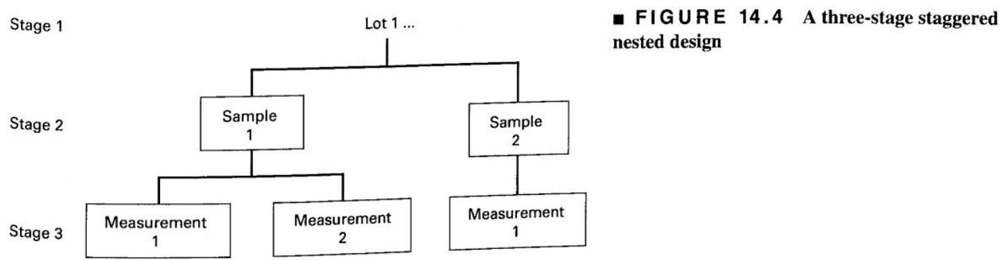

## 14.2 The General m-Stage Nested Design

The results of Section 14.1 can be easily extended to the case of m completely nested factors. Such a design would be called an m-stage nested design. As an example, suppose a foundry wishes to investigate the hardness of two different formulations of a metal alloy. Three heats of each alloy formulation are prepared, two ingots are selected at random from each heat for testing, and two hardness measurements are made on each ingot. The situation is illustrated in Figure 14.5.

In this experiment, heats are nested under the levels of the factor alloy formulation, and ingots are nested under the levels of the factor heats. Thus, this is a three-stage nested design with two replicates.

The model for the general three-stage nested design is

$$
y _ {i j k l} = \mu + \tau_ {i} + \beta_ {j (i)} + \gamma_ {k (i j)} + \epsilon_ {(i j k) l} \left\{ \begin{array}{l} i = 1, 2, \ldots , a \\ j = 1, 2, \ldots , b \\ k = 1, 2, \ldots , c \\ l = 1, 2, \ldots , n \end{array} \right.\tag{14.13}
$$

For our example, $\tau_{i}$ is the effect of the ith alloy formulation, $\beta_{j(i)}$ is the effect of the jth heat within the ith alloy, $\gamma_{k(ij)}$ is the effect of the kth ingot within the jth heat and ith alloy, and $\epsilon_{(ijk)l}$ is the usual NID(0, $\sigma^{2}$ ) error term. Extension of this model to m factors is straightforward.

Notice that in the above example, the overall variability in hardness consists of three components: one that results from alloy formulations, one that results from heats, and one that results from analytical test error. These components of the variability in overall hardness are illustrated in Figure 14.6.

This example demonstrates how the nested design is often used in analyzing processes to identify the major sources of variability in the output. For instance, if the alloy formulation variance component is large, then this implies that overall hardness variability could be reduced by using only one alloy formulation.

The calculation of the sums of squares and the analysis of variance for the m-stage nested design are similar to the analysis presented in Section 14.1. For example, the analysis of variance for the three-stage nested design is summarized in Table 14.8. Definitions of the sums of squares are also shown in this table. Notice that they are a simple extension of the formulas for the two-stage nested design. Many statistics software packages will perform the calculations.

To determine the proper test statistics, we must find the expected mean squares using the methods of Chapter 13. For example, if factors A and B are fixed and factor C is random, then the expected mean squares are as shown in Table 14.9. This table indicates the proper test statistics for this situation.

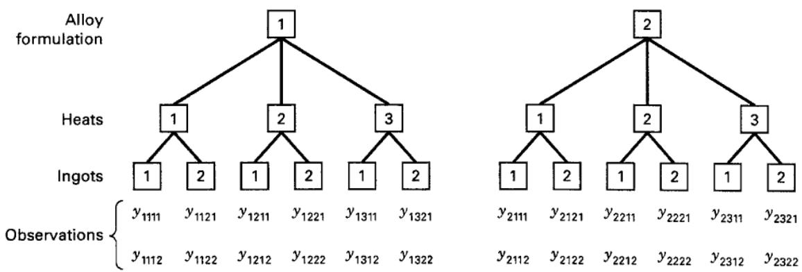  
■ FIGURE 14.5 A three-stage nested design

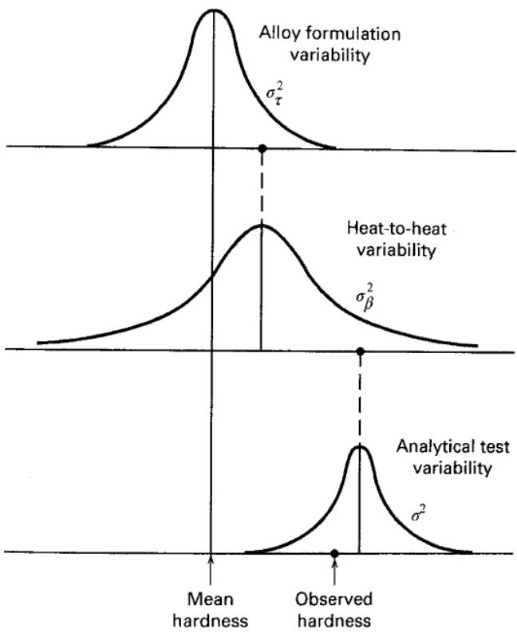  
■ FIGURE 14.6 Sources of variation in the three-stage nested design example  
TABLE 14.8

Analysis of Variance for the Three-Stage Nested Design

<table><tr><td>Source of Variation</td><td>Sum of Squares</td><td>Degrees of Freedom</td><td>Mean Square</td></tr><tr><td>A</td><td> $bcn\sum_{i}(\overline{y}_{i...}-\overline{y}_{...})^{2}$ </td><td>a-1</td><td> $MS_{A}$ </td></tr><tr><td>B (within A)</td><td> $cn\sum_{i}\sum_{j}(\overline{y}_{ij..}-\overline{y}_{i...})^{2}$ </td><td>a(b-1)</td><td> $MS_{B(A)}$ </td></tr><tr><td>C (within B)</td><td> $n\sum_{i}\sum_{j}\sum_{k}(\overline{y}_{ijk.}-\overline{y}_{ij..})^{2}$ </td><td>ab(c-1)</td><td> $MS_{C(B)}$ </td></tr><tr><td>Error</td><td> $\sum_{i}\sum_{j}\sum_{k}\sum_{l}(y_{ijkl}-\overline{y}_{ijk.})^{2}$ </td><td>abc(n-1)</td><td> $MS_{E}$ </td></tr><tr><td>Total</td><td> $\sum_{i}\sum_{j}\sum_{k}\sum_{l}(y_{ijkl}-\overline{y}_{....})^{2}$ </td><td>abcn-1</td><td></td></tr></table>

TABLE 14.9

Expected Mean Squares for a Three-Stage Nested Design with $A$ and $B$ Fixed and $C$ Random

<table><tr><td>Model Term</td><td>Expected Mean Square</td></tr><tr><td> $\tau_{i}$ </td><td> $\sigma^{2} + n\sigma_{\gamma}^{2} + \frac{bcn\Sigma\tau_{i}^{2}}{a-1}$ </td></tr><tr><td> $\beta_{j(i)}$ </td><td> $\sigma^{2} + n\sigma_{\gamma}^{2} + \frac{cn\Sigma\Sigma\beta_{j(i)}^{2}}{a(b-1)}$ </td></tr><tr><td> $\gamma_{k(ij)}$ </td><td> $\sigma^{2} + n\sigma_{\gamma}^{2}$ </td></tr><tr><td> $\epsilon_{l(ijk)}$ </td><td> $\sigma^{2}$ </td></tr></table>

## 14.3 Designs with Both Nested and Factorial Factors

Occasionally in a multifactor experiment, some factors are arranged in a factorial layout and other factors are nested. We sometimes call these designs nested-factorial designs. The statistical analysis of one such design with three factors is illustrated in the following example.

## EXAMPLE 14.2

An industrial engineer is studying the hand insertion of electronic components on printed circuit boards to improve the speed of the assembly operation. He has designed three assembly fixtures and two workplace layouts that seem promising. Operators are required to perform the assembly, and it is decided to randomly select four operators for each fixture–layout combination. However, because the workplaces are in different locations within the plant, it is difficult to use the same four operators for each layout. Therefore, the four operators chosen for layout 1 are different individuals from the four operators chosen for layout 2. Because there are only three fixtures and two layouts, but the operators are chosen at random, this is a mixed model. The treatment combinations in this design are run in random order, and two replicates are obtained. The assembly times are measured in seconds and are shown in Table 14.10.

In this experiment, operators are nested within the levels of layouts, whereas fixtures and layouts are arranged in a factorial. Thus, this design has both nested and factorial factors. The linear model for this design is

$$
y _ {i j k l} = \mu + \tau_ {i} + \beta_ {j} + \gamma_ {k (j)} + (\tau \beta) _ {i j} + (\tau \gamma) _ {i k (j)} + \epsilon_ {(i j k) l} \left\{ \begin{array}{l} i = 1, 2, 3 \\ j = 1, 2 \\ k = 1, 2, 3, 4 \\ l = 1, 2 \end{array} \right.\tag{14.14}
$$

where $\tau_{i}$ is the effect of the ith fixture, $\beta_{j}$ is the effect of the jth layout, $\gamma_{k(j)}$ is the effect of the kth operator within the jth level of layout, $(\tau\beta)_{ij}$ is the fixture × layout interaction, $(\tau\gamma)_{ik(j)}$ is the fixture × operators within layout interaction, and $\epsilon_{(ijk)l}$ is the usual error term. Notice that no layout × operator interaction can exist because all the operators do not use all the layouts. Similarly, there can be no three-way fixture × layout × operator interaction. The expected mean squares are shown in Table 14.11 using

## TABLE 14.11

Expected Mean Squares for Example 14.2

<table><tr><td>Model Term</td><td>Expected Mean Square</td></tr><tr><td> $\tau_i$ </td><td> $\sigma^2 + 2\sigma_{\tau\gamma}^2 + 8\sum \tau_i^2$ </td></tr><tr><td> $\beta_j$ </td><td> $\sigma^2 + 6\sigma_\gamma^2 + 24\sum \beta_j^2$ </td></tr><tr><td> $\gamma_{k(j)}$ </td><td> $\sigma^2 + 6\sigma_\gamma^2$ </td></tr><tr><td> $(\tau\beta)_{ij}$ </td><td> $\sigma^2 + 2\sigma_{\tau\gamma}^2 + 4\sum \sum (\tau\beta)_{ij}^2$ </td></tr><tr><td> $(\tau\gamma)_{ik(j)}$ </td><td> $\sigma^2 + 2\sigma_{\tau\gamma}^2$ </td></tr><tr><td> $\epsilon_{(ijk)l}$ </td><td> $\sigma^2$ </td></tr></table>

## TABLE 14.10

Assembly Time Data for Example 14.2

<table><tr><td rowspan="2">Operator</td><td colspan="4">Layout 1</td><td colspan="4">Layout 2</td><td rowspan="2"> $y_{i\cdots}$ </td></tr><tr><td>1</td><td>2</td><td>3</td><td>4</td><td>1</td><td>2</td><td>3</td><td>4</td></tr><tr><td rowspan="2">Fixture 1</td><td>22</td><td>23</td><td>28</td><td>25</td><td>26</td><td>27</td><td>28</td><td>24</td><td>404</td></tr><tr><td>24</td><td>24</td><td>29</td><td>23</td><td>28</td><td>25</td><td>25</td><td>23</td><td></td></tr><tr><td rowspan="2">Fixture 2</td><td>30</td><td>29</td><td>30</td><td>27</td><td>29</td><td>30</td><td>24</td><td>28</td><td>447</td></tr><tr><td>27</td><td>28</td><td>32</td><td>25</td><td>28</td><td>27</td><td>23</td><td>30</td><td></td></tr><tr><td rowspan="2">Fixture 3</td><td>25</td><td>24</td><td>27</td><td>26</td><td>27</td><td>26</td><td>24</td><td>28</td><td>401</td></tr><tr><td>21</td><td>22</td><td>25</td><td>23</td><td>25</td><td>24</td><td>27</td><td>27</td><td></td></tr><tr><td>Operator totals,  $y_{jk}$ .</td><td>149</td><td>150</td><td>171</td><td>149</td><td>163</td><td>159</td><td>151</td><td>160</td><td></td></tr><tr><td>Layout totals,  $y_{j\cdots}$ </td><td colspan="4">619</td><td colspan="4">633</td><td>1252 =  $y_{\cdots}$ </td></tr></table>

the methods of Chapter 13 and assuming a restricted mixed model. The proper test statistic for any effect or interaction can be found from the inspection of this table.

The complete analysis of variance is shown in Table 14.12. We see that assembly fixtures are significant and that operators within layouts also differ significantly. There is also a significant interaction between fixtures and operators within layouts, indicating that the effects of the different fixtures are not the same for all operators. The workplace layouts seem to have little effect on the assembly time. Therefore, to minimize assembly time, we should concentrate on fixture types 1 and 3. (Note that the fixture totals in Table 14.9 are smaller for fixture types 1 and 3 than for type 2. This difference in fixture type means could be formally tested using multiple comparisons.) Furthermore, the interaction between operators and fixtures implies that some operators are more effective than others using the same fixtures. Perhaps these operator–fixture effects could be isolated and the less effective operators' performance improved by retraining them.

## TABLE 14.12

Analysis of Variance for Example 14.2

<table><tr><td>Source of Variation</td><td>Sum of Squares</td><td>Degrees of Freedom</td><td>Mean Square</td><td> $F_0$ </td><td>P-Value</td></tr><tr><td>Fixtures (F)</td><td>82.80</td><td>2</td><td>41.40</td><td>7.54</td><td>0.01</td></tr><tr><td>Layouts (L)</td><td>4.08</td><td>1</td><td>4.09</td><td>0.34</td><td>0.58</td></tr><tr><td>Operators (within layouts), O(L)</td><td>71.91</td><td>6</td><td>11.99</td><td>5.15</td><td>&lt;0.01</td></tr><tr><td>FL</td><td>19.04</td><td>2</td><td>9.52</td><td>1.73</td><td>0.22</td></tr><tr><td>FO(L)</td><td>65.84</td><td>12</td><td>5.49</td><td>2.36</td><td>0.04</td></tr><tr><td>Error</td><td>56.00</td><td>24</td><td>2.33</td><td></td><td></td></tr><tr><td>Total</td><td>299.67</td><td>47</td><td></td><td></td><td></td></tr></table>

Computing. A number of statistical software packages can easily analyze nested-factorial designs, including both Minitab and JMP. Table 14.13 presents the output from Minitab (Balanced ANOVA), assuming the restricted form of the mixed model, for Example 14.2. The expected mean squares in the bottom portion of Table 14.13 agree with those shown in Table 14.10. $Q[1]$ , $Q[3]$ , and $Q[4]$ are the fixed-factor effects for layouts, fixtures, and layouts × fixtures, respectively. The estimates of the variance components are

Operator (layout):

Fixture × operator (layout):

Error:

$$
\begin{array}{r} \sigma_ {\gamma} ^ {2} = 1. 6 0 9 \\ \sigma_ {\tau \gamma} ^ {2} = 1. 5 7 6 \\ \sigma^ {2} = 2. 3 3 3 \end{array}
$$

Table 14.14 presents the Minitab analysis of Example 14.2 using the unrestricted form of the mixed model. The expected mean squares in the lower portion of this table are slightly different from those reported for the restricted model, and so the construction of the test statistic will be slightly different for the operators (layout) factor. Specifically, the F ratio denominator for operators (layout) is the fixtures × operators (layout) interaction in the restricted model (12 degrees of freedom for error), and it is the layout × fixtures interaction in the unrestricted model (2 degrees of freedom for error). Because $MS_{layout \times fixture} > MS_{fixture \times operator(layout)}$ and it has fewer degrees of freedom, we now find that the operator within layout effect is only significant at about the 12 percent level (the P-value was 0.002 in the restricted model analysis). Furthermore, the variance component estimate $\hat{\sigma}_{\gamma}^{2}=1.083$ is smaller. However, because there is a large fixture effect and a significant fixture × operator (layout) interaction, we would still suspect an operator effect, and so the practical conclusions from this experiment are not greatly affected by choosing either the restricted or the unrestricted form of the mixed model. The quantities Q[1,4] and Q[3,4] are fixed-type quadratic terms containing the interaction effect of layouts × fixtures.

TABLE 14.13  
Minitab Balanced ANOVA Analysis of Example 14.2 Using the Restricted Model

<table><tr><td colspan="6">Analysis of Variance (Balanced Designs)</td></tr><tr><td>Factor</td><td>Type</td><td>Levels</td><td>Values</td><td></td><td></td></tr><tr><td>Layout</td><td>fixed</td><td>2</td><td>1</td><td>2</td><td></td></tr><tr><td>Operator(Layout)</td><td>random</td><td>4</td><td>1</td><td>2</td><td>3</td></tr><tr><td>Fixture</td><td>fixed</td><td>3</td><td>1</td><td>2</td><td>3</td></tr><tr><td colspan="6">Analysis of Variance for Time</td></tr><tr><td>Source</td><td>DF</td><td>SS</td><td>MS</td><td>F</td><td>P</td></tr><tr><td>Layout</td><td>1</td><td>4.083</td><td>4.083</td><td>-0.34</td><td>0.581</td></tr><tr><td>Operator(Layout)</td><td>6</td><td>71.917</td><td>11.986</td><td>5.14</td><td>0.002</td></tr><tr><td>Fixture</td><td>2</td><td>82.792</td><td>41.396</td><td>7.55</td><td>0.008</td></tr><tr><td>Layout*Fixture</td><td>2</td><td>19.042</td><td>9.521</td><td>1.74</td><td>0.218</td></tr><tr><td>Fixture*Operator(Layout)</td><td>12</td><td>65.833</td><td>5.486</td><td>2.35</td><td>0.036</td></tr><tr><td>Error</td><td>24</td><td>56.000</td><td>2.333</td><td></td><td></td></tr><tr><td>Total</td><td>47</td><td>299.667</td><td></td><td></td><td></td></tr><tr><td>Source</td><td colspan="2">Variance component</td><td>Error term</td><td colspan="2">Expected Mean Square for Each Term (using restricted model)</td></tr><tr><td>1 Layout</td><td colspan="2"></td><td>2</td><td colspan="2">(6) + 6(2) + 24Q[1]</td></tr><tr><td>2 Operator(Layout)</td><td colspan="2">1.609</td><td>6</td><td colspan="2">(6) + 6(2)</td></tr><tr><td>3 Fixture</td><td colspan="2"></td><td>5</td><td colspan="2">(6) + 2(5) + 16Q[3]</td></tr><tr><td>4 Layout*Fixture</td><td colspan="2"></td><td>5</td><td colspan="2">(6) + 2(5) + 8Q[4]</td></tr><tr><td>5 Fixture*Operator(Layout)</td><td colspan="2">1.576</td><td>6</td><td colspan="2">(6) + 2(5)</td></tr><tr><td>6 Error</td><td colspan="2">2.333</td><td></td><td colspan="2">(6)</td></tr></table>

Table 14.15 presents the JMP output for Example 14.3. Because JMP uses the unrestricted form of the mixed model, estimates of the variance components agree with the Minitab ANOVA estimates in Table 14.14, but the REML procedure is a preferred analysis because it provides confidence intervals. The fixed effects tests indicate that there is a strong fixture effect, and even though the confidence intervals on the operators (layout) and the fixture × operators (layout) interaction variance components includes zero, we would be reluctant to discount an operator effect and an interaction because these two variance components account for over 50 percent of the total variability.

If no specialized software such as JMP or Minitab is available, then a program for analyzing factorial experiments can be used to analyze experiments with nested and factorial factors. For instance, the experiment in Example 14.2 could be considered as a three-factor factorial, with fixtures (F), operators (O), and layouts (L) as the factors.

■ TABLE 14.14
Minitab Balanced ANOVA Analysis of Example 14.2 Using the Unrestricted Model

<table><tr><td colspan="6">Analysis of Variance (Balanced Designs)</td></tr><tr><td>Factor</td><td>Type</td><td>Levels</td><td>Values</td><td></td><td></td></tr><tr><td>Layout</td><td>fixed</td><td>2</td><td>1</td><td>2</td><td></td></tr><tr><td>Operator(Layout)</td><td>random</td><td>4</td><td>1</td><td>2</td><td>3</td></tr><tr><td>Fixture</td><td>fixed</td><td>3</td><td>1</td><td>2</td><td>3</td></tr><tr><td colspan="6">Analysis of Variance for Time</td></tr><tr><td>Source</td><td>DF</td><td>SS</td><td>MS</td><td>F</td><td>P</td></tr><tr><td>Layout</td><td>1</td><td>4.083</td><td>4.083</td><td>0.34</td><td>0.581</td></tr><tr><td>Operator(Layout)</td><td>6</td><td>71.917</td><td>11.986</td><td>2.18</td><td>0.117</td></tr><tr><td>Fixture</td><td>2</td><td>82.792</td><td>41.396</td><td>7.55</td><td>0.008</td></tr><tr><td>Layout*Fixture</td><td>2</td><td>19.042</td><td>9.521</td><td>1.74</td><td>0.218</td></tr><tr><td>Fixture*Operator(Layout)</td><td>12</td><td>65.833</td><td>5.486</td><td>2.35</td><td>0.036</td></tr><tr><td>Error</td><td>24</td><td>56.000</td><td>2.333</td><td></td><td></td></tr><tr><td>Total</td><td>47</td><td>299.667</td><td></td><td></td><td></td></tr><tr><td>Source</td><td></td><td></td><td colspan="3">Expected Mean Square</td></tr><tr><td></td><td>Variance component</td><td>Error term</td><td colspan="3">for Each Term (using unrestricted model)</td></tr><tr><td>1 Layout</td><td></td><td>2</td><td colspan="3">(6) + 2(5) + 6(2) + Q[1,4]</td></tr><tr><td>2 Operator(Layout)</td><td>1.083</td><td>5</td><td colspan="3">(6) + 2(5) + 6(2)</td></tr><tr><td>3 Fixture</td><td></td><td>5</td><td colspan="3">(6) + 2(5) + Q[3,4]</td></tr><tr><td>4 Layout*Fixture</td><td></td><td>5</td><td colspan="3">(6) + 2(5) + Q[4]</td></tr><tr><td>5 Fixture*Operator(Layout)</td><td>1.576</td><td>6</td><td colspan="3">(6) + 2(5)</td></tr><tr><td>6 Error</td><td>2.333</td><td></td><td colspan="3">(6)</td></tr></table>

Then certain sums of squares and degrees of freedom from the factorial analysis would be pooled to form the appropriate quantities required for the design with nested and factorial factors as follows:

<table><tr><td colspan="2">Factorial Analysis</td><td colspan="2">Nested-Factorial Analysis</td></tr><tr><td>Sum of Squares</td><td>Degrees of Freedom</td><td>Sum of Squares</td><td>Degrees of Freedom</td></tr><tr><td> $SS_{F}$ </td><td>2</td><td> $SS_{F}$ </td><td>2</td></tr><tr><td> $SS_{L}$ </td><td>1</td><td> $SS_{L}$ </td><td>1</td></tr><tr><td> $SS_{FL}$ </td><td>2</td><td> $SS_{FL}$ </td><td>2</td></tr><tr><td> $SS_{O}$ </td><td>3</td><td></td><td></td></tr><tr><td> $SS_{LO}$ </td><td>3</td><td> $SS_{O(L)} = SS_{O} + SS_{LO}$ </td><td>6</td></tr><tr><td> $SS_{FO}$ </td><td>6</td><td></td><td></td></tr><tr><td> $SS_{FOL}$ </td><td>6</td><td> $SS_{FO(L)} = SS_{FO} + SS_{FOL}$ </td><td>12</td></tr><tr><td> $SS_{E}$ </td><td>24</td><td> $SS_{E}$ </td><td>24</td></tr><tr><td> $SS_{T}$ </td><td>47</td><td> $SS_{T}$ </td><td>47</td></tr></table>

■ TABLE 14.15
JMP Output for Example 14.2

<table><tr><td colspan="2">Summary of Fit</td></tr><tr><td>RSquare</td><td>0.764291</td></tr><tr><td>RSquare Adj</td><td>0.73623</td></tr><tr><td>Root Mean Square Error</td><td>1.527525</td></tr><tr><td>Mean of Response</td><td>26.08333</td></tr><tr><td>Observations for (or Sum Wgts)</td><td>48</td></tr></table>

<table><tr><td colspan="7">REML Variance Component Estimates</td></tr><tr><td>Random Effect</td><td>Var Ratio</td><td>Var Component</td><td>Std Error</td><td>95% Lower</td><td>95% Upper</td><td>Pct of Total</td></tr><tr><td>Operator[Layout]</td><td>0.4642857</td><td>1.0833333</td><td>1.2122659</td><td>-1.292708</td><td>3.4593745</td><td>21.697</td></tr><tr><td>Operator*Fixture[Layout]</td><td>0.6755952</td><td>1.5763889</td><td>1.1693951</td><td>-0.715625</td><td>3.8684033</td><td>31.572</td></tr><tr><td>Residual</td><td></td><td>2.3333333</td><td>0.6735753</td><td>1.4226169</td><td>4.5157102</td><td>46.732</td></tr><tr><td>Total</td><td></td><td>4.9930556</td><td></td><td></td><td></td><td>100.000</td></tr></table>

-2 LogLikelihood = 195.88509411

<table><tr><td colspan="4">Covariance Matrix of Variance Component Estimates</td></tr><tr><td>Random Effect</td><td>Operator[Layout]</td><td>Operator*Fixture[Layout]</td><td>Residual</td></tr><tr><td>Operator[Layout]</td><td>1.4695886</td><td>-0.41802</td><td>3.608e-15</td></tr><tr><td>Operator*Fixture[Layout]</td><td>-0.41802</td><td>1.3674849</td><td>-0.226852</td></tr><tr><td>Residual</td><td>3.608e-15</td><td>-0.226852</td><td>0.4537037</td></tr></table>

<table><tr><td colspan="6">Fixed Effect Tests</td></tr><tr><td>Source</td><td>Nparm</td><td>DF</td><td>DFDen</td><td>F Ratio</td><td>Prob &gt; F</td></tr><tr><td>Layout</td><td>1</td><td>1</td><td>6</td><td>0.3407</td><td>0.5807</td></tr><tr><td>Fixture</td><td>2</td><td>2</td><td>12</td><td>7.5456</td><td>0.0076*</td></tr><tr><td>Layout*Fixture</td><td>2</td><td>2</td><td>12</td><td>1.7354</td><td>0.2178</td></tr></table>

## 14.4 The Split-Plot Design

In some multifactor factorial experiments, we may be unable to completely randomize the order of the runs. This often results in a generalization of the factorial design called a split-plot design.

As an example, consider a paper manufacturer who is interested in three different pulp preparation methods (the methods differ in the amount of hardwood in the pulp mixture) and four different cooking temperatures for the pulp and who wishes to study the effect of these two factors on the tensile strength of the paper. Each replicate of a factorial experiment requires 12 observations, and the experimenter has decided to run three replicates. This will require a total of 36 runs. The experimenter decides to conduct the experiment as follows. A batch of pulp is produced by one of the three methods under study. Then this batch is divided into four samples, and each sample is cooked at one of the four temperatures. Then a second batch of pulp is made up using another of the three methods. This second batch is also divided into four samples that are tested at the four temperatures. The process is then repeated, until all three replicates (36 runs) of the experiment are obtained. The data are shown in Table 14.16.

TABLE 14.16  
The Experiment on the Tensile Strength of Paper

<table><tr><td rowspan="2">Pulp Preparation Method</td><td colspan="3">Replicate 1</td><td colspan="3">Replicate 2</td><td colspan="3">Replicate 3</td></tr><tr><td>1</td><td>2</td><td>3</td><td>1</td><td>2</td><td>3</td><td>1</td><td>2</td><td>3</td></tr><tr><td>Temperature (°F)</td><td></td><td></td><td></td><td></td><td></td><td></td><td></td><td></td><td></td></tr><tr><td>200</td><td>30</td><td>34</td><td>29</td><td>28</td><td>31</td><td>31</td><td>31</td><td>35</td><td>32</td></tr><tr><td>225</td><td>35</td><td>41</td><td>26</td><td>32</td><td>36</td><td>30</td><td>37</td><td>40</td><td>34</td></tr><tr><td>250</td><td>37</td><td>38</td><td>33</td><td>40</td><td>42</td><td>32</td><td>41</td><td>39</td><td>39</td></tr><tr><td>275</td><td>36</td><td>42</td><td>36</td><td>41</td><td>40</td><td>40</td><td>40</td><td>44</td><td>45</td></tr></table>

Initially, we might consider this to be a factorial experiment with three levels of preparation method (factor A) and four levels of temperature (factor B). If this is the case, then the order of experimentation within each replicate should be completely randomized. That is, we should randomly select a treatment combination (a preparation method and a temperature) and obtain an observation, then we should randomly select another treatment combination and obtain a second observation, and so on, until all 36 observations have been taken. However, the experimenter did not collect the data this way. He made up a batch of pulp and obtained observations for all four temperatures from that batch. Because of the economics of preparing the batches and the size of the batches, this is the only feasible way to run this experiment. A completely randomized factorial experiment would require 36 batches of pulp, which is completely unrealistic. The split-plot design requires only 9 batches total. Obviously, the split-plot design has resulted in considerable experimental efficiency.

The design used in our example is a split-plot design. In this split-plot design, we have nine whole plots, and the preparation methods are called the whole plot or main treatments. Each whole plot is divided into four parts called subplots (or split-plots), and one temperature is assigned to each. Temperature is called the subplot treatment. Note that if other uncontrolled or undesigned factors are present and if these uncontrolled factors vary as the pulp preparation methods are changed, then any effect of the undesigned factors on the response will be completely confounded with the effect of the pulp preparation methods. Because the whole plot treatments in a split-plot design are confounded with the whole plots and the subplot treatments are not confounded, it is best to assign the factor we are most interested in to the subplots, if possible.

This example is fairly typical of how the split-plot design is used in an industrial setting. Notice that the two factors were essentially “applied” at different times. Consequently, a split-plot design can be viewed as two experiments “combined” or superimposed on each other. One “experiment” has the whole-plot factor applied to the large experimental units (or it is a factor whose levels are hard to change) and the other “experiment” has the subplot factor applied to the smaller experimental units (or it is a factor whose levels are easy to change).

The linear model for the split-plot design is

$$
\begin{array}{l} y _ {i j k} = \mu + \tau_ {i} + \beta_ {j} + (\tau \beta) _ {i j} + \gamma_ {k} + (\tau \gamma) _ {i k} \\ \qquad + (\beta \gamma) _ {j k} + (\tau \beta \gamma) _ {i j k} + \epsilon_ {i j k} \left\{ \begin{array}{l} i = 1, 2, \ldots , r \\ j = 1, 2, \ldots , a \\ k = 1, 2, \ldots , b \end{array} \right. \end{array}\tag{14.15}
$$

where $\tau_{i}, \beta_{j}$ , and $(\tau\beta)_{ij}$ represent the whole plot and correspond, respectively, to replicates, main treatments (factor A), and whole-plot error (replicates $\times A$ ), and $\gamma_{k}, (\tau\gamma)_{ik}, (\beta\gamma)_{jk}$ , and $(\tau\beta\gamma)_{ijk}$ represent the subplot and correspond, respectively, to the subplot treatment (factor B), the replicates $\times B$ and AB interactions, and the subplot error

## TABLE 14.17

Expected Mean Squares for Split-Plot Design

<table><tr><td></td><td>Model Term</td><td>Expected Mean Square</td></tr><tr><td rowspan="3">Whole plot</td><td> $\tau_{i}$ </td><td> $\sigma^{2} + ab\sigma_{\tau}^{2}$ </td></tr><tr><td> $\beta_{j}$ </td><td> $\sigma^{2} + b\sigma_{\tau\beta}^{2} + \frac{rb\sum\beta_{j}^{2}}{a-1}$ </td></tr><tr><td> $(\tau\beta)_{ij}$ </td><td> $\sigma^{2} + b\sigma_{\tau\beta}^{2}$ </td></tr><tr><td rowspan="5">Subplot</td><td> $\gamma_{k}$ </td><td> $\sigma^{2} + a\sigma_{\tau\gamma}^{2} + \frac{ra\sum\gamma_{k}^{2}}{(b-1)}$ </td></tr><tr><td> $(\tau\gamma)_{ik}$ </td><td> $\sigma^{2} + a\sigma_{\tau\gamma}^{2}$ </td></tr><tr><td> $(\beta\gamma)_{jk}$ </td><td> $\sigma^{2} + \sigma_{\tau\beta\gamma}^{2} + \frac{r\sum\sum(\beta\gamma)_{jk}^{2}}{(a-1)(b-1)}$ </td></tr><tr><td> $(\tau\beta\gamma)_{ijk}$ </td><td> $\sigma^{2} + \sigma_{\tau\beta\gamma}^{2}$ </td></tr><tr><td> $\epsilon_{(ijk)h}$ </td><td> $\sigma^{2}$  (not estimable)</td></tr></table>

(replicates × AB). Note that the whole-plot error is the replicates × A interaction and the subplot error is the three-factor interaction replicates × AB. The sums of squares for these factors are computed as in the three-way analysis of variance without replication.

The expected mean squares for the split-plot design, with replicates random and main treatments and subplot treatments fixed, are shown in Table 14.17. Note that the main factor (A) in the whole plot is tested against the whole-plot error, whereas the subtreatment (B) is tested against the replicates × subtreatment interaction. The AB interaction is tested against the subplot error. Notice that there are no tests for the replicate effect (A) or the replicate × subtreatment (AC) interaction.

The analysis of variance for the tensile strength data in Table 14.16 is summarized in Table 14.18. Because both preparation methods and temperatures are fixed and replicates are random, the expected mean squares in Table 14.17 apply. The mean square for preparation methods is compared to the whole-plot error mean square, and the

## TABLE 14.18

Analysis of Variance for the Split-Plot Design Using the Tensile Strength Data from Table 14.14

<table><tr><td>Source of Variation</td><td>Sum of Squares</td><td>Degrees of Freedom</td><td>Mean Square</td><td> $F_0$ </td><td>P-Value</td></tr><tr><td>Replicates</td><td>77.55</td><td>2</td><td>38.78</td><td></td><td></td></tr><tr><td>Preparation method (A)</td><td>128.39</td><td>2</td><td>64.20</td><td>7.08</td><td>0.05</td></tr><tr><td>Whole-plot error (replicates × A)</td><td>36.28</td><td>4</td><td>9.07</td><td></td><td></td></tr><tr><td>Temperature (B)</td><td>434.08</td><td>3</td><td>144.69</td><td>41.94</td><td>&lt;0.01</td></tr><tr><td>Replicates × B</td><td>20.67</td><td>6</td><td>3.45</td><td></td><td></td></tr><tr><td>AB</td><td>75.17</td><td>6</td><td>12.53</td><td>2.96</td><td>0.05</td></tr><tr><td>Subplot error (replicates × AB)</td><td>50.83</td><td>12</td><td>4.24</td><td></td><td></td></tr><tr><td>Total</td><td>822.97</td><td>35</td><td></td><td></td><td></td></tr></table>

mean square for temperatures is compared to the replicate $\times$ temperature (AC) mean square. Finally, the preparation method $\times$ temperature mean square is tested against the subplot error. Both preparation methods and temperature have a significant effect on strength, and their interaction is significant.

Note from Table 14.18 that the subplot error (4.24) is less than the whole-plot error (9.07). This is the usual case in split-plot designs because the subplots are generally more homogeneous than the whole plots. This results in two different error structures for the experiment. Because the subplot treatments are compared with greater precision, it is preferable to assign the treatment we are most interested in to the subplots, if possible.

Some authors propose a slightly different statistical model for the split-plot design, say

$$
y _ {i j k} = \mu + \tau_ {i} + \beta_ {j} + (\tau \beta) _ {i j} + \gamma_ {k} + (\beta \gamma) _ {j k} + \epsilon_ {i j k} \quad \left\{ \begin{array}{l} i = 1, 2, \ldots , r \\ j = 1, 2, \ldots , a \\ k = 1, 2, \ldots , b \end{array} \right.\tag{14.16}
$$

In this model, $(\tau\beta)_{ij}$ is still the whole-plot error, but the replicates $\times B$ and replicates $\times AB$ interactions have essentially been pooled with $\epsilon_{ijk}$ to form the subplot error. If we denote the variance of the subplot error term $\epsilon_{ijk}$ by $\sigma_{\epsilon}^{2}$ and make the same assumptions as for model (Equation 14.15), the expected mean squares become

<table><tr><td>Factor</td><td> $E(MS)$ </td></tr><tr><td> $\tau_i$  (Replicates)</td><td> $\sigma_\epsilon^2 + ab\sigma_\tau^2$ </td></tr><tr><td> $\beta_j(A)$ </td><td> $\sigma_\epsilon^2 + b\sigma_\tau^\beta^2 + \frac{rb\sum\beta_j^2}{a-1}$ </td></tr><tr><td> $(\tau\beta)_{ij}$ </td><td> $\sigma_\epsilon^2 + b\sigma_\tau^\beta^2$  (whole-plot error)</td></tr><tr><td> $\gamma_k(B)$ </td><td> $\sigma_\epsilon^2 + \frac{ra\sum\gamma_k^2}{ab-1}$ </td></tr><tr><td> $(\beta\gamma)_{jk}(AB)$ </td><td> $\sigma_\epsilon^2 + \frac{r\sum\sum(\beta\gamma)_{jk}^2}{(a-1)(b-1)}$ </td></tr><tr><td> $\epsilon_{ijk}$ </td><td> $\sigma_\epsilon^2$  (subplot error)</td></tr></table>

Notice that now both the subplot treatment $(B)$ and the $AB$ interaction are tested against the subplot error mean square. If one is reasonably comfortable with the assumption that the interactions of replicates $\times B$ and replicates $\times AB$ interactions are negligible, then this alternative model is entirely satisfactory.

Because there are two variance components in the split-plot design, REML can be used to estimate them. JMP implements the REML method for the split-plot design using the model in Equation 14.16. Table 14.19 is the JMP output for the split-plot design in Table 14.16. The advantage of the REML method is that explicit estimates of the whole-plot and subplot variance components are provided along with standard errors and approximate confidence intervals.

Sometimes experimenters do not recognize the very specific structure of split-plot designs. They know that there is one (or perhaps more) hard-to-change factor involved in the experiment but they do not design the experiment as a split plot. They set up a standard factorial and then reorder the runs to minimize the number of times that the hard-to-change factor must be changed. Then they run the experiment creating an “inadvertent” split-plot and analyze the data as if it were a standard factorial (that is, a completely randomized design or a CRD).

Suppose that this happened with the experiment in Table 14.16. The experimenters made up three batches of pulp in each replicate and then randomized the levels of temperature within each batch, resulting in the split-plot design in Table 14.16. The standard factorial analysis of this experiment as a two-factor completely randomized factorial design shown in Table 14.20. Recall that in the correct split-plot analysis both the whole-plot and subplot factors and their interaction were significant. However, in the incorrect analysis the interaction is not significant.

<table><tr><td colspan="2">Response Strength</td></tr><tr><td colspan="2">Summary of Fit</td></tr><tr><td>RSquare</td><td>0.903675</td></tr><tr><td>RSquare Adj</td><td>0.859526</td></tr><tr><td>Root Mean Square Error</td><td>1.993043</td></tr><tr><td>Mean of Response</td><td>36.02778</td></tr><tr><td>Observations (or Sum Wgts)</td><td>36</td></tr></table>

TABLE 14.19  
MP Output for the Split-Plot Design in Table 14.16

<table><tr><td colspan="7">REML Variance Component Estimates</td></tr><tr><td>Random Effect</td><td>Var Ratio</td><td>Var Component</td><td>Std Error</td><td>95% Lower</td><td>95% Upper</td><td>Pct of Total</td></tr><tr><td>Whole Plots</td><td>0.6232517</td><td>2.4756944</td><td>3.2753747</td><td>-3.94404</td><td>8.8954289</td><td>32.059</td></tr><tr><td>Subplots</td><td>0.3208042</td><td>1.2743056</td><td>1.6370817</td><td>-1.934375</td><td>4.4829857</td><td>16.502</td></tr><tr><td>Residual</td><td></td><td>3.9722222</td><td>1.3240741</td><td>2.2679421</td><td>8.6869402</td><td>51.439</td></tr><tr><td>Total</td><td></td><td>7.7222222</td><td></td><td></td><td></td><td>100.000</td></tr></table>

-2 LogLikelihood = 139.36226272

<table><tr><td colspan="4">Covariance Matrix of Variance Component Estimates</td></tr><tr><td>Random Effect</td><td>Whole Plots</td><td>Subplots</td><td>Residual</td></tr><tr><td>Whole Plots</td><td>10.72808</td><td>-0.856821</td><td>-9.84e-14</td></tr><tr><td>Subplots</td><td>-0.856821</td><td>2.6800365</td><td>-0.438293</td></tr><tr><td>Residual</td><td>-9.84e-14</td><td>-0.438293</td><td>1.7531722</td></tr></table>

<table><tr><td colspan="6">Fixed Effect Tests</td></tr><tr><td>Source</td><td>Nparm</td><td>DF</td><td>DFDen</td><td>F Ratio</td><td>Prob &gt; F</td></tr><tr><td>Method</td><td>2</td><td>2</td><td>4</td><td>7.0781</td><td>0.0485*</td></tr><tr><td>Temp</td><td>3</td><td>3</td><td>18</td><td>36.4266</td><td>&lt;.0001*</td></tr><tr><td>Temp*Method</td><td>6</td><td>6</td><td>18</td><td>3.1538</td><td>0.0271*</td></tr></table>

Generally, in “inadvertent” split plots, we will tend to make too many type I errors for the whole-plot factors concluding that unimportant factors are important) and too many type II errors for the subplot factors (failing to identify significant effects). In our example, we did properly identify the pulp preparation methods (the whole-plot actor) as important, but we did not identify the significant interaction, which is a subplot factor. This emphasizes the importance of correctly designing and analyzing experiments involving split plots.

The split-plot design has an agricultural heritage, with the whole plots usually being large areas of land and the subplots being smaller areas of land within the large areas. For example, several varieties of a crop could be planted in different fields (whole plots), one variety to a field. Then each field could be divided into, say, four subplots, and each subplot could be treated with a different type of fertilizer. Here the crop varieties are the main treatments and the ifferent fertilizers are the subtreatments.

Analysis of the Split-Plot Design in Table 14.16 as a CRD

<table><tr><td colspan="6">Summary of Fit</td></tr><tr><td>RSquare</td><td></td><td>0.7748</td><td></td><td></td><td></td></tr><tr><td>RSquare Adj</td><td></td><td>0.671583</td><td></td><td></td><td></td></tr><tr><td>Root Mean Square Error</td><td></td><td>2.778889</td><td></td><td></td><td></td></tr><tr><td>Mean of Response</td><td></td><td>36.02778</td><td></td><td></td><td></td></tr><tr><td>Observations (or Sum Wgts)</td><td></td><td>36</td><td></td><td></td><td></td></tr><tr><td colspan="6">Analysis of Variance</td></tr><tr><td>Source</td><td>DF</td><td>Sum of Squares</td><td>Mean Square</td><td>F Ratio</td><td></td></tr><tr><td>Model</td><td>11</td><td>637.63889</td><td>57.9672</td><td>7.5065</td><td></td></tr><tr><td>Error</td><td>24</td><td>185.33333</td><td>7.7222</td><td></td><td></td></tr><tr><td></td><td></td><td></td><td></td><td>Prob &gt; F</td><td></td></tr><tr><td>C. Total</td><td>35</td><td>822.97222</td><td></td><td>&lt;.0001*</td><td></td></tr><tr><td colspan="6">Effect Tests</td></tr><tr><td>Source</td><td>Nparm</td><td>DF</td><td>Sum of Squares</td><td>F Ratio</td><td>Prob &gt; F</td></tr><tr><td>Method</td><td>2</td><td>2</td><td>128.38889</td><td>8.3129</td><td>0.0018*</td></tr><tr><td>Temp</td><td>3</td><td>3</td><td>434.08333</td><td>18.7374</td><td>&lt;.0001</td></tr><tr><td>Temp*Method</td><td>6</td><td>6</td><td>75.16667</td><td>1.6223</td><td>0.1843</td></tr></table>

Despite its agricultural basis, the split-plot design is useful in many scientific and industrial experiments. In these experimental settings, it is not unusual to find that some factors require large experimental units, whereas other factors require small experimental units, such as in the tensile strength problem described above. Alternatively, we sometimes find that complete randomization is not feasible because it is more difficult to change the levels of some factors than others. The hard-to-vary factors form the whole plots, whereas the easy-to-vary factors are run in the subplots. The review paper by Jones and Nachtsheim (2009) is an excellent source of information and key references on split-plot designs.

In principle, we must carefully consider how the experiment must be conducted and incorporate all restrictions on randomization into the analysis. We illustrate this point using a modification of the eye focus time experiment in Chapter 6. Suppose there are only two factors: visual acuity (A) and illumination level (B). A factorial experiment with a levels of acuity, b levels of illumination, and n replicates would require that all abn observations be taken in random order. However, in the test apparatus, it is fairly difficult to adjust these two factors to different levels, so the experimenter decides to obtain the n replicates by adjusting the device to one of the a acuities and one of the b illumination levels and running all n observations at once. In the factorial design, the error actually represents the scatter or noise in the system plus the ability of the subject to reproduce the same focus time. The model for the factorial design could be written as

$$
y _ {i j k} = \mu + \tau_ {i} + \beta_ {j} + (\tau \beta) _ {i j} + \phi_ {i j k} + \theta_ {i j k} \quad \left\{ \begin{array}{l} i = 1, 2, \ldots , a \\ j = 1, 2, \ldots , b \\ k = 1, 2, \ldots , n \end{array} \right.\tag{14.17}
$$

where $\phi_{ijk}$ represents the scatter or noise in the system that results from “experimental error” (that is, our failure to duplicate exactly the same levels of acuity and illumination on different runs, variability in environmental conditions, and the like), and $\theta_{ijk}$ represents the “reproducibility error” of the subject. Usually, we combine these components into one overall error term, say $\epsilon_{ijk} = \phi_{ijk} + \theta_{ijk}$ . Assume that $V(\epsilon_{ijk}) = \sigma^2 = \sigma_\phi^2 + \sigma_\theta^2$ . Now, in the factorial design, the error mean square has expectation $\sigma^2 = \sigma_\phi^2 + \sigma_\theta^2$ , with $ab(n - 1)$ degrees of freedom.

If we restrict the randomization as in the second design above, then the “error” mean square in the analysis of variance provides an estimate of the “reproducibility error” $\sigma_{\theta}^{2}$ with $ab(n-1)$ degrees of freedom, but it yields no information on the “experimental error” $\sigma_{\phi}^{2}$ . Thus, the mean square for error in this second design is too small; consequently, we will wrongly reject the null hypothesis very frequently. As pointed out by John (1971), this design is similar to a split-plot design with ab whole plots, each divided into n subplots, and no subtreatment. The situation is also similar to subsampling, as described by Ostle (1963). Assuming that A and B are fixed, we find that the expected mean squares in this case are

$$
\begin{array}{r l} & E (M S _ {A}) = \sigma_ {\theta} ^ {2} + n \sigma_ {\phi} ^ {2} + \frac {b n \sum \tau_ {i} ^ {2}}{a - 1} \\ & E (M S _ {B}) = \sigma_ {\theta} ^ {2} + n \sigma_ {\phi} ^ {2} + \frac {a n \sum \beta_ {j} ^ {2}}{b - 1} \\ & E (M S _ {A B}) = \sigma_ {\theta} ^ {2} + n \sigma_ {\phi} ^ {2} + \frac {n \sum \sum (\tau \beta) _ {i j} ^ {2}}{(a - 1) (b - 1)} \\ & E (M S _ {E}) = \sigma_ {\theta} ^ {2} \end{array}\tag{14.18}
$$

Thus, there are no tests on the main effects unless interaction is negligible. The situation is exactly that of a two-way analysis of variance with one observation per cell. If both factors are random, then the main effects may be tested against the AB interaction. If only one factor is random, then the fixed factor can be tested against the AB interaction.

In general, if one analyzes a factorial design and all the main effects and interactions are significant, then one should examine carefully how the experiment was actually conducted. There may be randomization restrictions in the model not accounted for in the analysis, and consequently, the data should not be analyzed as a factorial.

## 14.5 Other Variations of the Split-Plot Design

## 14.5.1 Split-Plot Designs with More Than Two Factors

Sometimes we find that either the whole plot or the subplot will contain two or more factors, arranged in a factorial structure. As an example, consider an experiment conducted on a furnace to grow an oxide on a silicon wafer. The response variables of interest are oxide layer thickness and layer uniformity. There are four design factors: temperature (A), gas flow (B), time (C), and wafer position in the furnace (D). The experimenter plans to run a $2^{4}$ factorial design with two replicates (32 trials). Now factors A and B (temperature and gas flow) are difficult to change, whereas C and D (time and wafer position) are easy to change. This leads to the split-plot design shown in Figure 14.7. Notice that both replicates of the experiment are split into four whole plots, each containing one combination of the settings of temperature and gas flow. Once these levels are chosen, each whole plot is split into four subplots and a $2^{2}$ factorial in the factors time and wafer position is conducted, where the treatment combinations in the subplot are tested in random order. Only four changes in temperature and gas flow are made in each replicate, whereas the levels of time and wafer position are completely randomized.

A model for this experiment, consistent with Equation 14.16, is

$$
\begin{array}{r l} & y _ {i j k l m} = \mu + \tau_ {i} + \beta_ {j} + \gamma_ {k} + (\beta \gamma) _ {j k} + \theta_ {i j k} + \delta_ {l} + \lambda_ {m} + (\delta \lambda) _ {l m} \\ & \qquad + (\beta \delta) _ {j l} + (\beta \lambda) _ {j m} + (\gamma \delta) _ {k l} + (\delta \lambda) _ {l m} + (\beta \gamma \delta) _ {j k l} + (\beta \gamma \lambda) _ {j k m} \\ & \qquad + (\beta \delta \lambda) _ {j l m} + (\gamma \delta \lambda) _ {k l m} + (\beta \gamma \delta \lambda) _ {j k l m} + \epsilon_ {i j k l m} \left\{ \begin{array}{l l} i = 1, 2 \\ j = 1, 2 \\ k = 1, 2 \\ l = 1, 2 \\ m = 1, 2 \end{array} \right. \end{array}\tag{14.19}
$$

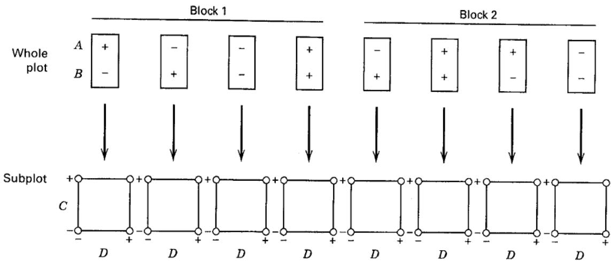  
■ FIGURE 14.7 A split-plot design with four design factors, two in the whole plot and two in the subplot

where $\tau_{i}$ represents the replicate effect, $\beta_{j}$ and $\gamma_{k}$ represent the whole-plot main effects, $\theta_{ijk}$ is the whole-plot error, $\delta_{l}$ and $\lambda_{m}$ represent the subplot main effects, and $\epsilon_{ijklm}$ is the subplot error. We have included all interactions between the four design factors. Table 14.21 presents the analysis of variance for this design, assuming that replicates are random and all design factors are fixed effects. In this table, $\sigma_{\theta}^{2}$ and $\sigma_{\epsilon}^{2}$ represent the variances of the whole-plot and subplot errors, respectively, $\sigma_{\tau}^{2}$ is the variance of the block effects, and (for simplicity) we have used capital Latin letters to denote fixed-type effects. The whole-plot main effects and interaction are tested against the whole-plot error, whereas the subplot factors and all other interactions are tested against the subplot error. If some of the design factors are random, the test statistics will be different. In some cases, there will be no exact $F$ -tests and Satterthwaite's procedure (described in Chapter 13) should be used.

TABLE 14.21  
An Abbreviated Analysis for a Split-Plot Design with Factors $A$ and $B$ in the Whole Plots and Factors $C$ and $D$ in the Subplots (Refer to Figure 14.7)

<table><tr><td>Source of Variation</td><td>Sum of Squares</td><td>Degrees of Freedom</td><td>Expected Mean Square</td></tr><tr><td>Replicates ( $\tau_i$ )</td><td> $SS_{Replicates}$ </td><td>1</td><td> $\sigma_c^2 + 16\sigma_\tau^2$ </td></tr><tr><td> $A(\beta_j)$ </td><td> $SS_A$ </td><td>1</td><td> $\sigma_c^2 + 8\sigma_\theta^2 + A$ </td></tr><tr><td> $B(\gamma_k)$ </td><td> $SS_B$ </td><td>1</td><td> $\sigma_c^2 + 8\sigma_\theta^2 + B$ </td></tr><tr><td>AB</td><td> $SS_{AB}$ </td><td>1</td><td> $\sigma_c^2 + 8\sigma_\theta^2 + AB$ </td></tr><tr><td>Whole-plot error ( $\theta_{ijk}$ )</td><td> $SS_{WP}$ </td><td>3</td><td> $\sigma_c^2 + 8\sigma_\theta^2$ </td></tr><tr><td> $C(\delta_l)$ </td><td> $SS_C$ </td><td>1</td><td> $\sigma_c^2 + C$ </td></tr><tr><td> $D(\lambda_m)$ </td><td> $SS_D$ </td><td>1</td><td> $\sigma_c^2 + D$ </td></tr><tr><td>CD</td><td> $SS_{CD}$ </td><td>1</td><td> $\sigma_c^2 + CD$ </td></tr><tr><td>AC</td><td> $SS_{AC}$ </td><td>1</td><td> $\sigma_c^2 + AC$ </td></tr><tr><td>BC</td><td> $SS_{BC}$ </td><td>1</td><td> $\sigma_c^2 + BC$ </td></tr><tr><td>AD</td><td> $SS_{AD}$ </td><td>1</td><td> $\sigma_c^2 + AD$ </td></tr><tr><td>BD</td><td> $SS_{BD}$ </td><td>1</td><td> $\sigma_c^2 + BD$ </td></tr><tr><td>ABC</td><td> $SS_{ABC}$ </td><td>1</td><td> $\sigma_c^2 + ABC$ </td></tr><tr><td>ABD</td><td> $SS_{ABD}$ </td><td>1</td><td> $\sigma_c^2 + ABD$ </td></tr><tr><td>ACD</td><td> $SS_{ACD}$ </td><td>1</td><td> $\sigma_c^2 + ACD$ </td></tr><tr><td>BCD</td><td> $SS_{BCD}$ </td><td>1</td><td> $\sigma_c^2 + BCD$ </td></tr><tr><td>ABCD</td><td> $SS_{ABCD}$ </td><td>1</td><td> $\sigma_c^2 + ABCD$ </td></tr><tr><td>Subplot error ( $\epsilon_{ijklm}$ )</td><td> $SS_{SP}$ </td><td>12</td><td> $\sigma_c^2$ </td></tr><tr><td>Total</td><td> $SS_T$ </td><td>31</td><td></td></tr></table>

Factorial experiments with three or more factors in a split-plot structure tend to be rather large experiments. On the other hand, the split-plot structure often makes it easier to conduct a larger experiment. For instance, in the oxide furnace example, the experimenters only have to change the hard-to-change factors (A and B) eight times, so perhaps a 32-run experiment is not too unreasonable.

As the number of factors in the experiment grows, the experimenter may consider using a fractional factorial experiment in the split-plot setting. As an illustration, consider the experiment that was originally described in Problem 8.7. This is a $2^{5-1}$ fractional factorial experiment conducted to study the effect of heat-treating process variables on the height of truck springs. The factors are A = transfer time, B = heating time, C = oil quench temperature, D = temperature, and E = hold down time. Suppose that factors A, B, and C are very hard to change and that the other two factors D and E are easy to change. For example, it might be necessary to first manufacture the springs by varying factors A, B, and C, and then hold those factors fixed while varying factors D and E in a subsequent experiment.

We consider a modification of that experiment because the original experimenters may not have run it as a split plot and because they did not use the design generator that we are going to use. Let the whole-plot factors be denoted by A, B, and C and the split-plot factors be denoted by D and E (the bold symbol is used to help us identify the easy-to-change factors). We will select the design generator $E = ABCD$ . The layout of this design has eight whole plots (the eight combinations of factors A, B, and C each at two levels). Each whole plot is divided into two subplots, and a combination of the factors D and E are tested in each split plot. (The exact treatment combinations depend on the signs on the treatment combinations for the whole-plot factors through the generator.)

Assume that all three-, four-, and five-factor interactions are negligible. If this assumption is reasonable, then all whole-plot factors A, B, and C and their two-factor interactions can be estimated in the whole plot. If the design is replicated, these effects would be tested against the whole-plot error. Alternatively, if the design is unreplicated, their effects could be assessed via a normal probability plot (or possibly by Lenth's method). The subplot factors D and E and their two-factor interaction DE can also be estimated. However, since DE = ABC, the DE interaction needs to be treated as a whole-plot term. There are six two-factor interactions of whole-plot and split-plot factors that can also be estimated: AD, AE, BD, BE, CD, and CE. In general, it turns out that any split-plot main effect or interaction that is aliased with whole-plot main effects or interactions involving only whole-plot factors would be compared to the whole-plot error. Furthermore, split-plot main effects or interactions involving at least one split-plot factor that are not aliased with whole-plot main effects or interactions involving only whole-plot factors are compared to the split-plot error. See Bisgaard (2000) for a thorough discussion. Therefore, in our problem, all of the effects D, E, AD, AE, BD, BE, CD, and CE are compared to the split-plot error. Alternatively, they could be assessed via a normal probability plot.

Recently, several papers have appeared on the subject of fractional factorials and response surface experiments in split plots. The papers by Vining, Kowalski, and Montgomery (2005), Vining and Kowalski (2008), Macharia and Goos (2010), Bisgaard (2000), Bingham and Sitter (1999), Huang, Chen, and Voelkel (1999), and Almimi, Kulahci, and Montgomery (2008a, b, 2009) are recommended.

## EXAMPLE 14.3

The factors affecting uniformity in a single-wafer plasma etching process are being investigated. Three factors on the etching tool are relatively difficult to change from run to run: A = electrode gap, B = gas flow, and C = pressure. Two other factors are easy to change from run to run: D = time and E = RF (radio frequency) power. The experimenters want to use a fractional factorial experiment to investigate these five factors because the number of test wafers available is limited. The hard-to-change factors also indicate that a split-plot design should be considered. The experimenters decide to use the strategy discussed above: a $2^{5-1}$ design with factors A, B, and C in the whole plots and factors D and E in the subplots. The design generator is $E = ABCD$ . This produces a 16-run fractional factorial with eight whole plots. Every whole plot contains one of the eight treatment combinations from a complete $2^{3}$ factorial design in factors A, B, and C. Each whole plot is divided into two subplots, with one of the treatment combinations for factors D and E in each subplot. The design and the resulting uniformity data are shown in Table 14.22. The eight whole plots were run in random order, but once a whole plot configuration for factors A, B, and C was set up on the etching tool, both subplot runs were made (also in random order).

The statistical analysis of this experiment involves keeping the whole-plot and subplot factors separate. We assume that all interactions beyond order two are negligible. Table 14.23 lists the effect estimates separated into whole-plot and subplot terms. Furthermore, available degrees of freedom are used to estimate effects, so we cannot estimate either the whole-plot or the subplot error. Therefore, we must use normal probability plots to evaluate the effects. Figure 14.8a is a half-normal probability plot of the effect estimates for only the whole-plot factors, ignoring the factors in the subplots. Notice that factors A, B, and the AB interaction have large effects. Figure 14.8b is a half-normal probability plot of the subplot effects D and E, and the interactions involving those factors, DE, AD, AE, BD, BE, CD, and CE. Only the main effect of E and the AE interaction are large.

Figures 14.9a and 14.9b are the two-factor interaction plots of the intersections AB and AE. The experimenter's objective is to minimize the uniformity response, so Figure 14.9a suggests that either level of factor A = electrode

TABLE 14.22  
The $2^{5-1}$ Split-Plot Experiment for the Plasma Etching Tool

<table><tr><td rowspan="2">Whole Plots</td><td colspan="3">Whole-Plot Factors</td><td colspan="2">Subplot Factors</td><td rowspan="2">Uniformity</td></tr><tr><td>A</td><td>B</td><td>C</td><td>D</td><td>E</td></tr><tr><td rowspan="2">1</td><td>-</td><td>-</td><td>-</td><td>-</td><td>+</td><td>40.85</td></tr><tr><td>-</td><td>-</td><td>-</td><td>+</td><td>-</td><td>41.07</td></tr><tr><td rowspan="2">2</td><td>+</td><td>-</td><td>-</td><td>-</td><td>-</td><td>35.67</td></tr><tr><td>+</td><td>-</td><td>-</td><td>+</td><td>+</td><td>51.15</td></tr><tr><td rowspan="2">3</td><td>-</td><td>+</td><td>-</td><td>-</td><td>-</td><td>41.80</td></tr><tr><td>-</td><td>+</td><td>-</td><td>+</td><td>+</td><td>37.01</td></tr><tr><td rowspan="2">4</td><td>+</td><td>+</td><td>-</td><td>-</td><td>+</td><td>91.09</td></tr><tr><td>+</td><td>+</td><td>-</td><td>+</td><td>-</td><td>48.67</td></tr><tr><td rowspan="2">5</td><td>-</td><td>-</td><td>+</td><td>-</td><td>-</td><td>40.32</td></tr><tr><td>-</td><td>-</td><td>+</td><td>+</td><td>+</td><td>43.34</td></tr><tr><td rowspan="2">6</td><td>+</td><td>-</td><td>+</td><td>-</td><td>+</td><td>62.46</td></tr><tr><td>+</td><td>-</td><td>+</td><td>+</td><td>-</td><td>38.08</td></tr><tr><td rowspan="2">7</td><td>-</td><td>+</td><td>+</td><td>-</td><td>+</td><td>31.99</td></tr><tr><td>-</td><td>+</td><td>+</td><td>+</td><td>-</td><td>41.03</td></tr><tr><td rowspan="2">8</td><td>+</td><td>+</td><td>+</td><td>-</td><td>-</td><td>70.31</td></tr><tr><td>+</td><td>+</td><td>+</td><td>+</td><td>+</td><td>81.03</td></tr></table>

TABLE 14.23  
Effects for Plasma Etching Experiment Separated into Whole-Plot and Subplot Effects

<table><tr><td>Term</td><td>Parameter Estimates</td><td>Type of Term</td></tr><tr><td>Intercept</td><td>49.73875</td><td></td></tr><tr><td>Gap (A)</td><td>10.0625</td><td>Whole</td></tr><tr><td>Gas flow (B)</td><td>5.6275</td><td>Whole</td></tr><tr><td>Pressure (C)</td><td>1.325</td><td>Whole</td></tr><tr><td>Time (D)</td><td>-2.0725</td><td>Subplot</td></tr><tr><td>RF power (E)</td><td>5.12625</td><td>Subplot</td></tr><tr><td>AB</td><td>7.34625</td><td>Whole</td></tr><tr><td>AC</td><td>1.83125</td><td>Whole</td></tr><tr><td>AD</td><td>-3.00875</td><td>Subplot</td></tr><tr><td>AE</td><td>6.505</td><td>Subplot</td></tr><tr><td>BC</td><td>-0.60125</td><td>Whole</td></tr><tr><td>BD</td><td>-1.35875</td><td>Subplot</td></tr><tr><td>BE</td><td>-0.2125</td><td>Subplot</td></tr><tr><td>CD</td><td>1.86625</td><td>Subplot</td></tr><tr><td>CE</td><td>-1.485</td><td>Subplot</td></tr><tr><td>DE</td><td>0.34</td><td>Whole</td></tr></table>

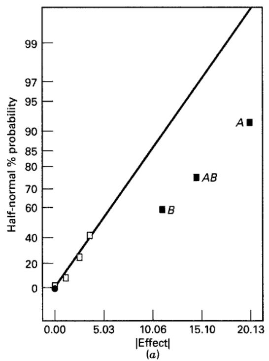  
■ FIGURE 14.8 Half-normal plots of the effects from the $2^{5-1}$ split-plot experiment in Example 14.3. (a) Whole-plot effects. (b) Subplot effects

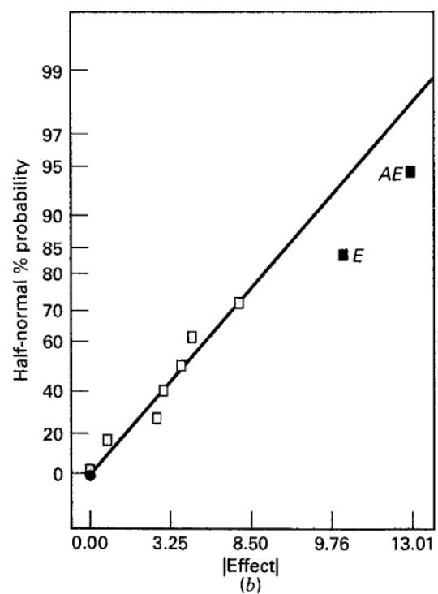

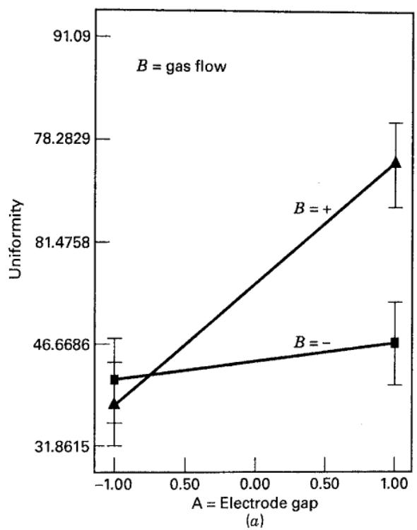

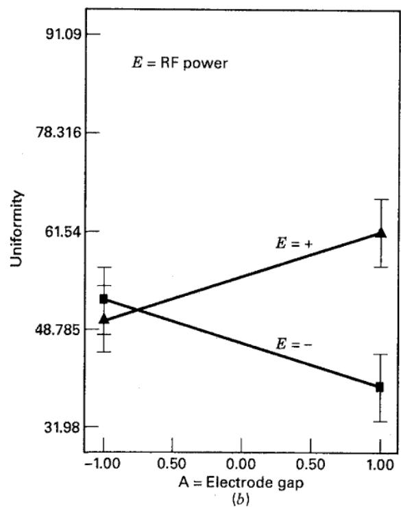  
■ FIGURE 14.9 Two-factor interaction graphs for the $2^{5-1}$ split-plot experiment in Example 14.3. (a) AB interaction. (b) AE interaction

gap will be effective as long as B = gas flow is at the low level. However, if B is at the high level, then A must be at the low level to achieve low uniformity. Figure 14.9b indicates that controlling E = RF power at the low level is effective in reducing uniformity, particularly if A is at the high level. However, if E is at the high level, A must be at the low level. Therefore, the results of this screening experiment indicate that three of the five original factors significantly impact etch uniformity. Furthermore, the treatment combination A high, B low, and E low or A low, B high, and E high will produce low levels of the uniformity response.

The design in Example 14.3 can be constructed as a D-optimal design using JMP, by specifying A, B, and C to be hard-to-change factors and D and E to be easy-to-change factors, and requiring eight whole plots and 16 runs. The default design that JMP recommends for this problem is a 32-run design with eight whole plots and four subplots per whole plot. This design is a full factorial and because of the additional runs, it allows the estimation of both the whole-plot and the subplot error terms. The default design is shown in Table 14.24. Note that both designs require eight whole plots, as they have exactly the same number of changes in the hard-to-change factors. So there may be little practical difference in the resources required to run the two designs.

## 14.5.2 The Split-Split-Plot Design

The concept of split-plot designs can be extended to situations in which randomization restrictions may occur at any number of levels within the experiment. If there are two levels of randomization restrictions, the layout is called a split-split-plot design. The following example illustrates such a design.

Optimal design tools are an important and useful way to construct split-plot designs. Optimal design tools using the coordinate exchange algorithm are very efficient and available in JMP. An alternate construction tool using integer programming has been developed by Capehart et al. (2011).

TABLE 14.24  
Default Design from JMP for the Plasma Etching Experiment

<table><tr><td rowspan="2">Whole Plots</td><td colspan="3">Whole-Plot Factors</td><td colspan="2">Subplot Factors</td></tr><tr><td>A</td><td>B</td><td>C</td><td>D</td><td>E</td></tr><tr><td>1</td><td>-</td><td>-</td><td>-</td><td>-</td><td>-</td></tr><tr><td></td><td></td><td></td><td></td><td>-</td><td>+</td></tr><tr><td></td><td></td><td></td><td></td><td>+</td><td>-</td></tr><tr><td></td><td></td><td></td><td></td><td>+</td><td>+</td></tr><tr><td>2</td><td>-</td><td>-</td><td>+</td><td>-</td><td>-</td></tr><tr><td></td><td></td><td></td><td></td><td>-</td><td>+</td></tr><tr><td></td><td></td><td></td><td></td><td>+</td><td>-</td></tr><tr><td></td><td></td><td></td><td></td><td>+</td><td>+</td></tr><tr><td>3</td><td>-</td><td>+</td><td>-</td><td>-</td><td>-</td></tr><tr><td></td><td></td><td></td><td></td><td>-</td><td>+</td></tr><tr><td></td><td></td><td></td><td></td><td>+</td><td>-</td></tr><tr><td></td><td></td><td></td><td></td><td>+</td><td>+</td></tr><tr><td>4</td><td>-</td><td>+</td><td>+</td><td>-</td><td>-</td></tr><tr><td></td><td></td><td></td><td></td><td>-</td><td>+</td></tr><tr><td></td><td></td><td></td><td></td><td>+</td><td>-</td></tr><tr><td></td><td></td><td></td><td></td><td>+</td><td>+</td></tr><tr><td>5</td><td>+</td><td>-</td><td>-</td><td>-</td><td>-</td></tr><tr><td></td><td></td><td></td><td></td><td>-</td><td>+</td></tr><tr><td></td><td></td><td></td><td></td><td>+</td><td>-</td></tr><tr><td></td><td></td><td></td><td></td><td>+</td><td>+</td></tr><tr><td>6</td><td>+</td><td>-</td><td>+</td><td>-</td><td>-</td></tr><tr><td></td><td></td><td></td><td></td><td>-</td><td>+</td></tr><tr><td></td><td></td><td></td><td></td><td>+</td><td>-</td></tr><tr><td></td><td></td><td></td><td></td><td>+</td><td>+</td></tr><tr><td>7</td><td>+</td><td>+</td><td>-</td><td>-</td><td>-</td></tr><tr><td></td><td></td><td></td><td></td><td>-</td><td>+</td></tr><tr><td></td><td></td><td></td><td></td><td>+</td><td>-</td></tr><tr><td></td><td></td><td></td><td></td><td>+</td><td>+</td></tr><tr><td>8</td><td>+</td><td>+</td><td>+</td><td>-</td><td>-</td></tr><tr><td></td><td></td><td></td><td></td><td>-</td><td>+</td></tr><tr><td></td><td></td><td></td><td></td><td>+</td><td>-</td></tr><tr><td></td><td></td><td></td><td></td><td>+</td><td>+</td></tr></table>

## EXAMPLE 14.4

A researcher is studying the absorption times of a particular type of antibiotic capsule. There are three technicians, three dosage strengths, and four capsule wall thicknesses of interest to the researcher. Each replicate of a factorial experiment would require 36 observations. The experimenter has decided on four replicates, and it is necessary to run each replicate on a different day. Note that the days can be considered as blocks. Within a replicate (or a block) (day), the experiment is performed by assigning a unit of antibiotic to a technician who conducts the experiment on the three dosage strengths and the four wall thicknesses. Once a particular dosage strength is formulated, all four wall thicknesses are tested at that strength. Then another dosage strength is selected and all four wall thicknesses are tested. Finally, the third dosage strength and the four wall thicknesses are tested. Meanwhile, two other laboratory technicians also follow this plan, each starting with a unit of antibiotic.

Note that there are two randomization restrictions within each replicate (or block): technician and dosage strength.

The whole plots correspond to the technician. The order in which the technicians are assigned the units of antibiotic is randomly determined. The dosage strengths form three subplots. Dosage strength may be randomly assigned to a subplot. Finally, within a particular dosage strength, the four capsule wall thicknesses are tested in random order, forming four sub-subplots. The wall thicknesses are usually called sub-subtreatments. Because there are two randomization restrictions in the experiment (some authors say two "splits" in the design), the design is called a split-split-plot design. Figure 14.10 illustrates the randomization restrictions and experimental layout in this design.

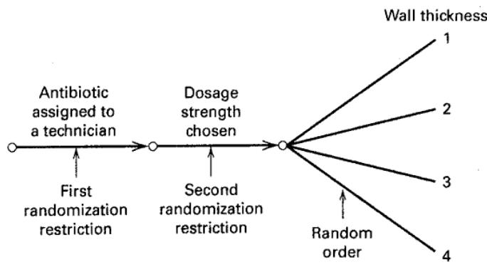

<table><tr><td rowspan="2">Blocks</td><td rowspan="2">Dosage strength</td><td colspan="3">1</td><td colspan="3">2</td><td colspan="3">3</td></tr><tr><td>1</td><td>2</td><td>3</td><td>1</td><td>2</td><td>3</td><td>1</td><td>2</td><td>3</td></tr><tr><td rowspan="4">1</td><td rowspan="4">Wall thicknesses</td><td>1</td><td>1</td><td>1</td><td>1</td><td>1</td><td>1</td><td>1</td><td>1</td><td>1</td></tr><tr><td>2</td><td>2</td><td>2</td><td>2</td><td>2</td><td>2</td><td>2</td><td>2</td><td>2</td></tr><tr><td>3</td><td>3</td><td>3</td><td>3</td><td>3</td><td>3</td><td>3</td><td>3</td><td>3</td></tr><tr><td>4</td><td>4</td><td>4</td><td>4</td><td>4</td><td>4</td><td>4</td><td>4</td><td>4</td></tr><tr><td rowspan="4">2</td><td rowspan="4">Wall thicknesses</td><td>1</td><td>1</td><td>1</td><td>1</td><td>1</td><td>1</td><td>1</td><td>1</td><td>1</td></tr><tr><td>2</td><td>2</td><td>2</td><td>2</td><td>2</td><td>2</td><td>2</td><td>2</td><td>2</td></tr><tr><td>3</td><td>3</td><td>3</td><td>3</td><td>3</td><td>3</td><td>3</td><td>3</td><td>3</td></tr><tr><td>4</td><td>4</td><td>4</td><td>4</td><td>4</td><td>4</td><td>4</td><td>4</td><td>4</td></tr><tr><td rowspan="4">3</td><td rowspan="4">Wall thicknesses</td><td>1</td><td>1</td><td>1</td><td>1</td><td>1</td><td>1</td><td>1</td><td>1</td><td>1</td></tr><tr><td>2</td><td>2</td><td>2</td><td>2</td><td>2</td><td>2</td><td>2</td><td>2</td><td>2</td></tr><tr><td>3</td><td>3</td><td>3</td><td>3</td><td>3</td><td>3</td><td>3</td><td>3</td><td>3</td></tr><tr><td>4</td><td>4</td><td>4</td><td>4</td><td>4</td><td>4</td><td>4</td><td>4</td><td>4</td></tr><tr><td rowspan="4">4</td><td rowspan="4">Wall thicknesses</td><td>1</td><td>1</td><td>1</td><td>1</td><td>1</td><td>1</td><td>1</td><td>1</td><td>1</td></tr><tr><td>2</td><td>2</td><td>2</td><td>2</td><td>2</td><td>2</td><td>2</td><td>2</td><td>2</td></tr><tr><td>3</td><td>3</td><td>3</td><td>3</td><td>3</td><td>3</td><td>3</td><td>3</td><td>3</td></tr><tr><td>4</td><td>4</td><td>4</td><td>4</td><td>4</td><td>4</td><td>4</td><td>4</td><td>4</td></tr></table>

■ FIGURE 14.10 A split-split-plot design

A linear statistical model for the split-split-plot design is

$$
\begin{array}{l} y _ {i j k h} = \mu + \tau_ {i} + \beta_ {j} + (\tau \beta) _ {i j} + \gamma_ {k} + (\tau \gamma) _ {i k} + (\beta \gamma) _ {j k} + (\tau \beta \gamma) _ {i j k} \\ \qquad + \delta_ {h} + (\tau \delta) _ {i h} + (\beta \delta) _ {j h} \\ \qquad + (\tau \beta \delta) _ {i j h} + (\gamma \delta) _ {k h} + (\tau \gamma \delta) _ {i k h} + (\beta \gamma \delta) _ {j k h} \\ \qquad + (\tau \beta \gamma \delta) _ {i j k h} + \epsilon_ {i j k h} \left\{ \begin{array}{l l} i = 1, 2, \ldots , r \\ j = 1, 2, \ldots , a \\ k = 1, 2, \ldots , b \\ h = 1, 2, \ldots , c \end{array} \right. \end{array}\tag{14.20}
$$

where $\tau_{i}, \beta_{j}$ , and $(\tau\beta)_{ij}$ represent the whole plot and correspond to replicates or blocks, main treatments (factor A), and whole-plot error (replicates (or blocks) × A), respectively; $\gamma_{k}, (\tau\gamma)_{ik}, (\beta\gamma)_{jk}$ , and $(\tau\beta\gamma)_{ijk}$ represent the subplot and correspond to the subplot treatment (factor B), the replicates (or blocks) × B and AB interactions, and the subplot error, respectively; and $\delta_{h}$ and the remaining parameters correspond to the sub-subplot and represent, respectively, the sub-subplot treatment (factor C) and the remaining interactions. The four-factor interaction $(\tau\beta\gamma\delta)_{ijkh}$ is called the sub-subplot error.

The expected mean squares are as shown in Table 14.25, assuming that the replicates (blocks) are random and that the other design factors are fixed. Tests on the main treatments, subtreatments, sub-subtreatments and their interactions

## TABLE 14.25

Expected Mean Squares for the Split-Split-Plot Design

<table><tr><td></td><td>Model Term</td><td>Expected Mean Square</td></tr><tr><td rowspan="3">Whole plot</td><td> $\tau_i$ </td><td> $\sigma^2 + abc\sigma_\tau^2$ </td></tr><tr><td> $\beta_j$ </td><td> $\sigma^2 + bc\sigma_\tau^\beta^2 + \frac{rbc\sum\beta_j^2}{(a-1)}$ </td></tr><tr><td> $(\tau\beta)_{ij}$ </td><td> $\sigma^2 + bc\sigma_\tau^\beta^2$ </td></tr><tr><td rowspan="4">Subplot</td><td> $\gamma_k$ </td><td> $\sigma^2 + ac\sigma_\tau^\gamma^2 + \frac{rac\sum\gamma_k^2}{(b-1)}$ </td></tr><tr><td> $(\tau\gamma)_{ik}$ </td><td> $\sigma^2 + ac\sigma_\tau^\gamma^2$ </td></tr><tr><td> $(\beta\gamma)_{jk}$ </td><td> $\sigma^2 + c\sigma_\tau^\beta^\gamma^2 + \frac{rc\sum\sum(\beta\gamma)_{jh}^2}{(a-1)(b-1)}$ </td></tr><tr><td> $(\tau\beta\gamma)_{ijk}$ </td><td> $\sigma^2 + c\sigma_\tau^\beta^\gamma^2$ </td></tr><tr><td rowspan="9">Sub-subplot</td><td> $\delta_h$ </td><td> $\sigma^2 + ab\sigma_\tau^\delta^2 + \frac{rab\sum\delta_k^2}{(c-1)}$ </td></tr><tr><td> $(\tau\delta)_{ih}$ </td><td> $\sigma^2 + ab\sigma_\tau^\delta^2$ </td></tr><tr><td> $(\beta\delta)_{jh}$ </td><td> $\sigma^2 + b\sigma_\tau^\beta^\delta^2 + \frac{rb\sum\sum(\beta\delta)_{jh}^2}{(a-1)(c-1)}$ </td></tr><tr><td> $(\tau\beta\delta)_{ijh}$ </td><td> $\sigma^2 + b\sigma_\tau^\beta^\delta^2$ </td></tr><tr><td> $(\gamma\delta)_{kh}$ </td><td> $\sigma^2 + a\sigma_\tau^\gamma^\delta^2 + \frac{ra\sum\sum(\gamma\delta)_{kh}^2}{(b-1)(c-1)}$ </td></tr><tr><td> $(\tau\gamma\delta)_{ikh}$ </td><td> $\sigma^2 + a\sigma_\tau^\gamma^\delta^2$ </td></tr><tr><td> $(\beta\gamma\delta)_{jkh}$ </td><td> $\sigma^2 + \sigma_\tau^\beta^\gamma^\delta^2 + \frac{r\sum\sum\sum(\beta\gamma\delta)_{ijk}^2}{(a-1)(b-1)(c-1)}$ </td></tr><tr><td> $(\tau\beta\gamma\delta)_{ijkh}$ </td><td> $\sigma^2 + \sigma_\tau^\beta^\gamma^\delta$ </td></tr><tr><td> $\epsilon_{l(i j kh)}$ </td><td> $\sigma^2 \text{(not estimable)}$ </td></tr></table>

are obvious from inspection of this table. Note that no tests on replicates or blocks or interactions involving replicates or blocks exist.

The statistical analysis of a split-split-plot design is like that of a single replicate of a four-factor factorial. The number of degrees of freedom for each test is determined in the usual manner. To illustrate, in Example 14.4, where we had four replicates, three technicians, three dosage strengths, and four wall thicknesses, we would have only $(r-1)(a-1)=(4-1)(3-1)=6$ whole-plot error degrees of freedom for testing technicians. This is a relatively small number of degrees of freedom, and the experimenter might consider using additional replicates to increase the precision of the test. If there are a replicates, we will have $2(r-1)$ degrees of freedom for whole-plot error. Thus, five replicates yield $2(5-1)=8$ error degrees of freedom, six replicates yield $2(6-1)=10$ error degrees of freedom, seven replicates yield $2(7-1)=12$ error degrees of freedom, and so on. Consequently, we would probably not want to run fewer than four replicates because this would yield only four error degrees of freedom. Each additional replicate allows us to gain two degrees of freedom for error. If we could afford to run five replicates, we could increase the precision of the test by one-third (from six to eight degrees of freedom). Also, in going from five to six replicates, there is an additional 25 percent gain in precision. If resources permit, the experimenter should run five or six replicates.

## 14.5.3 The Strip-Split-Plot Design

The strip-split-plot design has had an extensive application in the agricultural sciences, but it finds occasional use in industrial experimentation. In the simplest case, we have two factors A and B. Factor A is applied to whole plots just as in the standard split-plot design. Then factor B is applied to strips (which are really just another set of whole plots) that are orthogonal to the original whole plots used for factor A. Figure 14.11 illustrates a situation in which both factors A and B have three levels. Note that the levels of factor A are confounded with the whole plots, and the levels of factor B are confounded with the strips (which can be thought of as a second set of whole plots).

A model for the strip-split plot design in Figure 14.11, assuming $r$ replicates, $a$ levels of factor $A$ , and $b$ levels of factor $B$ , is

$$
y _ {i j k} = \mu + \tau_ {i} + \beta_ {j} + (\tau \beta) _ {i j} + \gamma_ {k} + (\tau \gamma) _ {i k} + (\beta \gamma) _ {j k} + \epsilon_ {i j k} \quad \left\{ \begin{array}{l l} i = 1, 2, \ldots , r \\ j = 1, 2, \ldots , a \\ k = 1, 2, \ldots , b \end{array} \right.
$$

where $(\tau\beta)_{ij}$ and $(\tau\gamma)_{ik}$ are whole-plot errors for factors A and B, respectively, and $\epsilon_{ijk}$ is a “subplot” error used to test the AB interaction. Table 14.26 shows an abbreviated analysis of variance assuming A and B are fixed factors and replicates are random. The replicates are sometimes considered as blocks.

## ■ FIGURE 14.11 One replicate (block) of a strip-split-plot design

<table><tr><td rowspan="2"></td><td colspan="3">Whole plots</td></tr><tr><td> $A_3$ </td><td> $A_1$ </td><td> $A_2$ </td></tr><tr><td> $B_1$ </td><td> $A_3B_1$ </td><td> $A_1B_1$ </td><td> $A_2B_1$ </td></tr><tr><td> $B_3$ </td><td> $A_3B_3$ </td><td> $A_1B_3$ </td><td> $A_2B_3$ </td></tr><tr><td> $B_2$ </td><td> $A_3B_2$ </td><td> $A_1B_2$ </td><td> $A_2B_2$ </td></tr></table>

TABLE 14.26  
An Abbreviated Analysis of Variance for a Strip-Split-Plot Design

<table><tr><td>Source of Variation</td><td>Sum of Squares</td><td>Degrees of Freedom</td><td>Expected Mean Square</td></tr><tr><td>Replicates (or blocks)</td><td> $SS_{Replicates}$ </td><td>r-1</td><td> $\sigma_{\epsilon}^{2}+ab\sigma_{\tau}^{2}$ </td></tr><tr><td>A</td><td> $SS_{A}$ </td><td>a-1</td><td> $\sigma_{\epsilon}^{2}+b\sigma_{\tau\beta}^{2}+\frac{rb\sum\beta_{j}^{2}}{a-1}$ </td></tr><tr><td>Whole-plot error $_{A}$ </td><td> $SS_{WP_{A}}$ </td><td>(r-1)(a-1)</td><td> $\sigma_{\epsilon}^{2}+b\sigma_{\tau\beta}^{2}$ </td></tr><tr><td>B</td><td> $SS_{B}$ </td><td>b-1</td><td> $\sigma_{\epsilon}^{2}+a\sigma_{\tau\gamma}^{2}+\frac{ra\sum\gamma_{k}^{2}}{b-1}$ </td></tr><tr><td>Whole-plot error $_{B}$ </td><td> $SS_{WP_{B}}$ </td><td>(r-1)(b-1)</td><td> $\sigma_{\epsilon}^{2}+a\sigma_{\tau\gamma}^{2}$ </td></tr><tr><td>AB</td><td> $SS_{AB}$ </td><td>(a-1)(b-1)</td><td> $\sigma_{\epsilon}^{2}+\frac{r\sum\sum(\tau\beta)_{jk}^{2}}{(a-1)(b-1)}$ </td></tr><tr><td>Subplot error</td><td> $SS_{SP}$ </td><td>(r-1)(a-1)(b-1)</td><td> $\sigma_{\epsilon}^{2}$ </td></tr><tr><td>Total</td><td> $SS_{T}$ </td><td>rab-1</td><td></td></tr></table>