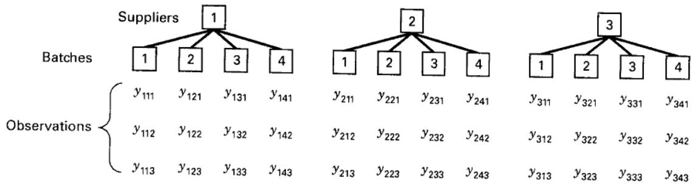
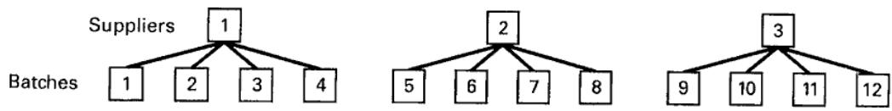
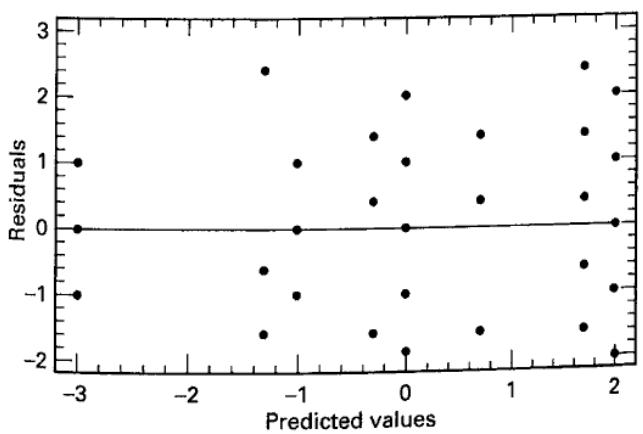
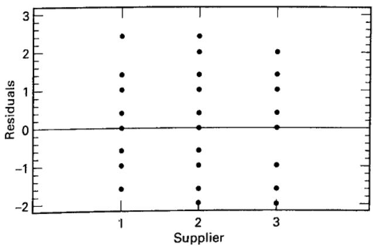
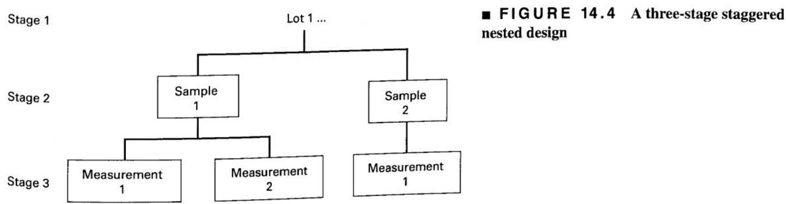

# 14.1 两阶段嵌套设计

在某些多因子试验中，一个因子（如 B）的水平在另一个因子（如 A）的不同水平下虽相似，却并不相同。这种安排称为**嵌套设计**或**分层设计**，即 B 的水平嵌套在 A 的水平之下。例如，某公司从三家供应商采购原材料，希望确定各供应商的原材料纯度是否相同。每家供应商有四批原材料，每批测定三次纯度，安排见图 14.1。

这是批次嵌套在供应商之下的两阶段嵌套设计。乍看之下，你可能会问：为何不是析因试验？若是析因试验，批次 1 始终应指同一批，批次 2 也始终应指同一批，依此类推。实际并非如此，各供应商的批次只属于该供应商。供应商 1 的批次 1 与其他供应商的批次 1 没有联系，其批次 2 也与其他供应商的批次 2 没有联系。为强调

图 14.1 两阶段嵌套设计

  
图 14.2 两阶段嵌套设计的另一种排列

各供应商的批次是不同批次这一事实，可以将供应商 1 的批次编号为 1、2、3、4，供应商 2 的编号为 5、6、7、8，供应商 3 的编号为 9、10、11、12，如图 14.2 所示。

有时不易判断某因子是析因安排中的交叉因子还是嵌套因子。若其水平可像图 14.2 那样任意重新编号而不改变设计，则它是嵌套因子。

## 14.1.1 统计分析

两阶段嵌套设计的线性统计模型为

$$
y _ {i j k} = \mu + \tau_ {i} + \beta_ {j (i)} + \epsilon_ {(i j) k} \left\{ \begin{array}{l} i = 1, 2, \dots , a \\ j = 1, 2, \dots , b \\ k = 1, 2, \dots , n \end{array} \right.\tag{14.1}
$$

即 A 有 $a$ 个水平，A 的每个水平之下嵌套 B 的 $b$ 个水平，每个组合重复 $n$ 次。下标 $j(i)$ 表明 B 的第 $j$ 个水平嵌套在 A 的第 $i$ 个水平之下。将重复也看作嵌套在 A、B 水平组合之内较为方便，因此误差项使用下标 $(ij)k$。由于 A 的各水平下都有相同数量的 B 水平，且重复数相同，这是**平衡嵌套设计**。B 的各水平并不与 A 的所有水平交叉，因而不能单独定义 A 与 B 的交互作用。

总校正平方和可写为

$$
\sum_ {i = 1} ^ {a} \sum_ {j = 1} ^ {b} \sum_ {k = 1} ^ {n} (y _ {i j k} - \overline {{y}} _ {\dots}) ^ {2} = \sum_ {i = 1} ^ {a} \sum_ {j = 1} ^ {b} \sum_ {k = 1} ^ {n} [ (\overline {{y}} _ {i..} - \overline {{y}} _ {\dots}) + (\overline {{y}} _ {i j.} - \overline {{y}} _ {i..}) + (y _ {i j k} - \overline {{y}} _ {i j.}) ] ^ {2}\tag{14.2}
$$

展开式（14.2）的右端，得到

$$
\begin{array}{r} \sum_ {i = 1} ^ {a} \sum_ {j = 1} ^ {b} \sum_ {k = 1} ^ {n} (y _ {i j k} - \overline {{y}} _ {\dots}) ^ {2} = b n \sum_ {i = 1} ^ {a} (\overline {{y}} _ {i..} - \overline {{y}} _ {\dots}) ^ {2} + n \sum_ {i = 1} ^ {a} \sum_ {j = 1} ^ {b} (\overline {{y}} _ {i j.} - \overline {{y}} _ {i..}) ^ {2} \\ + \sum_ {i = 1} ^ {a} \sum_ {j = 1} ^ {b} \sum_ {k = 1} ^ {n} (y _ {i j k} - \overline {{y}} _ {i j.}) ^ {2} \end{array}\tag{14.3}
$$

因为三个交叉乘积项均为零。式（14.3）表明，总平方和可分解为 A 的平方和、A 各水平之下 B 的平方和，以及误差平方和。用符号表示为

$$
S S _ {T} = S S _ {A} + S S _ {B (A)} + S S _ {E}\tag{14.4}
$$

$SS_T$ 的自由度为 $abn-1$，$SS_A$ 的自由度为 $a-1$，$SS_{B(A)}$ 的自由度为 $a(b-1)$，误差自由度为 $ab(n-1)$，且 $abn-1=(a-1)+a(b-1)+ab(n-1)$。若误差独立服从 $N(0,\sigma^2)$，将式（14.4）右端各平方和除以相应自由度，便得到相互独立的均方；在相应原假设及同尺度条件下，适当均方的比值服从 F 分布。

检验 A 和 B 效应所用的统计量取决于它们是固定还是随机。若 A、B 固定，假定 $\sum_{i=1}^a\tau_i=0$，且 $\sum_{j=1}^b\beta_{j(i)}=0\ (i=1,2,\ldots,a)$，即 A 的处理效应之和为零，且 A 的每个水平内 B 的处理效应之和为零。若二者随机，则假定 $\tau_i$ 独立服从 $N(0,\sigma_\tau^2)$，$\beta_{j(i)}$ 独立服从 $N(0,\sigma_\beta^2)$。A 固定、B 随机的混合模型也很常见。按第 13 章的规则即可求得期望均方，表 14.1 给出了这些情形的结果。

由表 14.1 可知，若 A、B 均固定，检验 $H_0:\tau_i=0$ 使用 $MS_A/MS_E$，检验 $H_0:\beta_{j(i)}=0$ 使用 $MS_{B(A)}/MS_E$。若 A 固定而 B 随机，前者使用 $MS_A/MS_{B(A)}$，检验 $H_0:\sigma_\beta^2=0$ 使用 $MS_{B(A)}/MS_E$。若 A、B 均随机，检验 $H_0:\sigma_\tau^2=0$ 使用 $MS_A/MS_{B(A)}$，检验 $H_0:\sigma_\beta^2=0$ 使用 $MS_{B(A)}/MS_E$。表 14.2 汇总了这些检验。展开并化简式（14.3），可得平方和的计算公式：

$$
S S _ {A} = \frac {1}{b n} \sum_ {i = 1} ^ {a} y _ {i..} ^ {2} - \frac {y _ {. . .} ^ {2}}{a b n}\tag{14.5}
$$

$$
S S _ {B (A)} = \frac {1}{n} \sum_ {i = 1} ^ {a} \sum_ {j = 1} ^ {b} y _ {i j.} ^ {2} - \frac {1}{b n} \sum_ {i = 1} ^ {a} y _ {i..} ^ {2}\tag{14.6}
$$

$$
S S _ {E} = \sum_ {i = 1} ^ {a} \sum_ {j = 1} ^ {b} \sum_ {k = 1} ^ {n} y _ {i j k} ^ {2} - \frac {1}{n} \sum_ {i = 1} ^ {a} \sum_ {j = 1} ^ {b} y _ {i j.} ^ {2}\tag{14.7}
$$

表 14.1
两阶段嵌套设计的期望均方

<table><tr><td>E(MS)</td><td>A 固定、B 固定</td><td>A 固定、B 随机</td><td>A 随机、B 随机</td></tr><tr><td>$E(MS_A)$</td><td>$\sigma^2 + \frac{bn\σ\tau_i^2}{a-1}$</td><td>$\sigma^2 + n\sigma_\beta^2 + \frac{bn\σ\tau_i^2}{a-1}$</td><td>$\sigma^2 + n\sigma_\beta^2 + bn\sigma_\tau^2$</td></tr><tr><td>$E(MS_{B(A)})$</td><td>$\sigma^2 + \frac{n\σ\σ\beta_{j(i)}^2}{a(b-1)}$</td><td>$\sigma^2 + n\sigma_\beta^2$</td><td>$\sigma^2 + n\sigma_\beta^2$</td></tr><tr><td>$E(MS_E)$</td><td>$\sigma^2$</td><td>$\sigma^2$</td><td>$\sigma^2$</td></tr></table>

表 14.2
两阶段嵌套设计的方差分析表

<table><tr><td>变异来源</td><td>平方和</td><td>自由度</td><td>均方</td></tr><tr><td>A</td><td>$bn \sum (\overline{y}_{i..} - \overline{y}_{...})^{2}$</td><td>a-1</td><td>$MS_{A}$</td></tr><tr><td>B（A 内）</td><td>$n \sum \sum (\overline{y}_{ij.} - \overline{y}_{i..})^{2}$</td><td>a(b-1)</td><td>$MS_{B(A)}$</td></tr><tr><td>误差</td><td>$\sum \sum \sum (y_{ijk} - \overline{y}_{ij.})^{2}$</td><td>ab(n-1)</td><td>$MS_{E}$</td></tr><tr><td>总计</td><td>$\sum \sum \sum (y_{ijk} - \overline{y}_{...})^{2}$</td><td>abn-1</td><td></td></tr></table>

$$
S S _ {T} = \sum_ {i = 1} ^ {a} \sum_ {j = 1} ^ {b} \sum_ {k = 1} ^ {n} y _ {i j k} ^ {2} - \frac {y _ {\dots} ^ {2}}{a b n}\tag{14.8}
$$

式（14.6）中的 $SS_{B(A)}$ 还可写为

$$
S S _ {B (A)} = \sum_ {i = 1} ^ {a} \left[ \frac {1}{n} \sum_ {j = 1} ^ {b} y _ {i j \cdot} ^ {2} - \frac {y _ {i \cdot \cdot} ^ {2}}{b n} \right]
$$

这说明，$SS_{B(A)}$ 是先在 A 的每个水平内计算 B 各水平之间的平方和，再对 A 的全部水平求和。

## 例 14.1

某公司从三家供应商按批次采购原材料。原材料纯度变异很大，给成品制造带来困难。我们希望确定纯度变异是否来自供应商之间的差异。从每家供应商随机选取四批原材料，每批测定三次纯度。这是两阶段嵌套设计。表 14.3 给出了减去 93 后的编码数据。平方和计算如下：

$$
\begin{array}{r l} S S _ {T} & = \sum_ {i = 1} ^ {a} \sum_ {j = 1} ^ {b} \sum_ {k = 1} ^ {n} y _ {i j k} ^ {2} - \frac {y _ {\cdots} ^ {2}}{a b n} \\ & = 153.00 - \frac {(13) ^ {2}}{36} = 148.31 \\ S S _ {A} & = \frac {1}{b n} \sum_ {i = 1} ^ {a} y _ {i \cdot \cdot} ^ {2} - \frac {y _ {\cdot \cdot} ^ {2}}{a b n} \\ & = \frac {1}{(4) (3)} [ (- 5) ^ {2} + (4) ^ {2} + (14) ^ {2} ] - \frac {(13) ^ {2}}{36} = 15.06 \end{array}
$$

$$
\begin{array}{r l} S S _ {B (A)} & = \frac {1}{n} \sum_ {i = 1} ^ {a} \sum_ {j = 1} ^ {b} y _ {i j \cdot} ^ {2} - \frac {1}{b n} \sum_ {i = 1} ^ {a} y _ {i \cdot \cdot} ^ {2} \\ & = \frac {1}{3} [ (0) ^ {2} + (- 9) ^ {2} + (- 1) ^ {2} + \dots + (2) ^ {2} + (6) ^ {2} ] \\ & - 19.75 = 69.92 \end{array}
$$

以及

$$
\begin{array}{c} S S _ {E} = \sum_ {i = 1} ^ {a} \sum_ {j = 1} ^ {b} \sum_ {k = 1} ^ {n} y _ {i j k} ^ {2} - \frac {1}{n} \sum_ {i = 1} ^ {a} \sum_ {j = 1} ^ {b} y _ {i j.} ^ {2} \\ = 153.00 - 89.67 = 63.33 \end{array}
$$

方差分析汇总于表 14.4。供应商固定、批次随机，因此采用表 14.1 中间一列的期望均方；为方便起见，表 14.4 也列出了它们。由 P 值可知，供应商对纯度没有显著效应，但同一供应商不同原材料批次的纯度存在显著差异。

表 14.3
例 14.1 的编码纯度数据（编码：$y_{ijk}=\text{纯度}-93$）

<table><tr><td rowspan="2"></td><td rowspan="2">批次</td><td colspan="4">供应商 1</td><td colspan="4">供应商 2</td><td colspan="4">供应商 3</td></tr><tr><td>1</td><td>2</td><td>3</td><td>4</td><td>1</td><td>2</td><td>3</td><td>4</td><td>1</td><td>2</td><td>3</td><td>4</td></tr><tr><td></td><td></td><td>1</td><td>-2</td><td>-2</td><td>1</td><td>1</td><td>0</td><td>-1</td><td>0</td><td>2</td><td>-2</td><td>1</td><td>3</td></tr><tr><td></td><td></td><td>-1</td><td>-3</td><td>0</td><td>4</td><td>-2</td><td>4</td><td>0</td><td>3</td><td>4</td><td>0</td><td>-1</td><td>2</td></tr><tr><td></td><td></td><td>0</td><td>-4</td><td>1</td><td>0</td><td>-3</td><td>2</td><td>-2</td><td>2</td><td>0</td><td>2</td><td>2</td><td>1</td></tr><tr><td>批次合计</td><td>$y_{ij}$</td><td>0</td><td>-9</td><td>-1</td><td>5</td><td>-4</td><td>6</td><td>-3</td><td>5</td><td>6</td><td>0</td><td>2</td><td>6</td></tr><tr><td>供应商合计</td><td>$y_{i..}$</td><td></td><td></td><td>-5</td><td></td><td></td><td></td><td>4</td><td></td><td></td><td></td><td>14</td><td></td></tr></table>

## 表 14.4

例 14.1 数据的方差分析

<table><tr><td>变异来源</td><td>平方和</td><td>自由度</td><td>均方</td><td>期望均方</td><td>$F_0$</td><td>P 值</td></tr><tr><td>供应商</td><td>15.06</td><td>2</td><td>7.53</td><td>$\sigma^2 + 3\sigma_\beta^2 + 6\σ\tau_i^2$</td><td>0.97</td><td>0.42</td></tr><tr><td>批次（供应商内）</td><td>69.92</td><td>9</td><td>7.77</td><td>$\sigma^2 + 3\sigma_\beta^2$</td><td>2.94</td><td>0.02</td></tr><tr><td>误差</td><td>63.33</td><td>24</td><td>2.64</td><td>$\sigma^2$</td><td></td><td></td></tr><tr><td>总计</td><td>148.31</td><td>35</td><td></td><td></td><td></td><td></td></tr></table>

该试验及其分析有重要的实际意义。试验者希望找出原材料纯度变异的来源。若变异来自供应商之间的差异，选择“最佳”供应商或许可以解决问题。然而，这里主要的变异来源是各供应商内部的批间纯度变异，所以这一办法并不适用。我们必须与供应商合作，降低其批间变异，可能需要改进供应商的生产过程或内部质量保证体系。

看看若误将此设计当作两因子析因试验分析，会发生什么。若认为批次与供应商交叉，可得到批次总和 2、−3、−2、16，每个“批次 × 供应商”单元有三次重复，于是可计算批次平方和与交互作用平方和。假定混合模型时，这一错误析因分析的完整方差分析见表 14.5。

## 表 14.5

将例 14.1 的两阶段嵌套设计误作析因设计的分析（供应商固定，批次随机）

<table><tr><td>变异来源</td><td>平方和</td><td>自由度</td><td>均方</td><td>$F_0$</td><td>P 值</td></tr><tr><td>供应商 (S)</td><td>15.06</td><td>2</td><td>7.53</td><td>1.02</td><td>0.42</td></tr><tr><td>批次 (B)</td><td>25.64</td><td>3</td><td>8.55</td><td>3.24</td><td>0.04</td></tr><tr><td>S × B 交互作用</td><td>44.28</td><td>6</td><td>7.38</td><td>2.80</td><td>0.03</td></tr><tr><td>误差</td><td>63.33</td><td>24</td><td>2.64</td><td></td><td></td></tr><tr><td>总计</td><td>148.31</td><td>35</td><td></td><td></td><td></td></tr></table>

这一分析表明，批次有显著差异，批次与供应商之间还有显著交互作用。但这种交互作用很难作实际解释。例如，它是否意味着供应商效应随批次变化？而显著交互作用与不显著供应商效应同时出现，还可能使分析者误以为供应商其实有差异，只是效应被交互作用掩盖了。

**计算机计算。** 一些统计软件能够直接分析嵌套设计。表 14.6 给出了 Minitab 平衡方差分析程序的输出，采用受限模型。数值结果与表 14.4 的手算结果一致。输出下部还给出了期望均方。$Q[1]$ 是表示供应商固定效应的二次项，用本书记号表示为

$$
Q [ 1 ] = \frac {\sum_ {i = 1} ^ {a} \tau_ {i} ^ {2}}{a - 1}
$$

因此，Minitab 中供应商期望均方的固定效应项为 $12Q[1]=12\sum_{i=1}^3\tau_i^2/(3-1)=6\sum_{i=1}^3\tau_i^2$，与表 14.4 按规则得到的结果相同。

有时无法使用专门分析嵌套设计的软件。不过，比较表 14.4 与表 14.5 可以发现，

$$
S S _ {B} + S S _ {S \times B} = 25.64 + 44.28 = 69.92 \equiv S S _ {B (S)}
$$

## 表 14.6

例 14.1 的 Minitab 输出（平衡方差分析）

<table><tr><td colspan="7">方差分析（平衡设计）</td></tr><tr><td>因子</td><td>类型</td><td>水平</td><td>数值</td><td></td><td></td><td></td></tr><tr><td>供应商</td><td>固定</td><td>3</td><td>1</td><td>2</td><td>3</td><td></td></tr><tr><td>批次(供应商)</td><td>随机</td><td>4</td><td>1</td><td>2</td><td>3</td><td>4</td></tr><tr><td colspan="7">纯度的方差分析</td></tr><tr><td>来源</td><td>自由度</td><td>平方和</td><td>均方</td><td>F</td><td>P 值</td><td></td></tr><tr><td>供应商</td><td>2</td><td>15.056</td><td>7.528</td><td>0.97</td><td>0.416</td><td></td></tr><tr><td>批次(供应商)</td><td>9</td><td>69.917</td><td>7.769</td><td>2.94</td><td>0.017</td><td></td></tr><tr><td>误差</td><td>24</td><td>63.333</td><td>2.639</td><td></td><td></td><td></td></tr><tr><td>总计</td><td>35</td><td>148.306</td><td></td><td></td><td></td><td></td></tr><tr><td>来源</td><td>方差分量</td><td>误差项</td><td colspan="4">各模型项的期望均方（受限模型）</td></tr><tr><td>1 供应商</td><td></td><td>2</td><td colspan="4">(3) + 3(2) + 12Q[1]</td></tr><tr><td>2 批次(供应商)</td><td>1.710</td><td>3</td><td colspan="4">(3) + 3(2)</td></tr><tr><td>3 误差</td><td>2.639</td><td></td><td colspan="4">(3)</td></tr></table>

即供应商内部批次的平方和等于批次平方和与“批次 × 供应商”交互作用平方和之和。自由度也有类似关系：

$$
\operatorname{df}_B+\operatorname{df}_{S\times B}=3+6=9=\operatorname{df}_{B(S)}
$$

因此，可通过合并嵌套因子的“主效应”和它与上层因子的交互作用，用析因设计分析程序完成嵌套设计的分析。

## 14.1.2 诊断检查

诊断检查的主要工具是残差分析。两阶段嵌套设计的残差为

$$
e _ {i j k} = y _ {i j k} - \hat {y} _ {i j k}
$$

拟合值为

$$
\hat {y} _ {i j k} = \hat {\mu} + \hat {\tau} _ {i} + \hat {\beta} _ {j (i)}
$$

若采用通常的参数约束 $\sum_i\hat\tau_i=0$ 和 $\sum_j\hat\beta_{j(i)}=0\ (i=1,2,\ldots,a)$，则 $\hat\mu=\bar y_{\cdots}$、$\hat\tau_i=\bar y_{i\cdot\cdot}-\bar y_{\cdots}$、$\hat\beta_{j(i)}=\bar y_{ij\cdot}-\bar y_{i\cdot\cdot}$。因此，拟合值为

$$
\hat {y} _ {i j k} = \overline {{y}} _ {\dots} + (\overline {{y}} _ {i..} - \overline {{y}} _ {\dots}) + (\overline {{y}} _ {i j.} - \overline {{y}} _ {i..}) = \overline {{y}} _ {i j.}
$$

所以两阶段嵌套设计的残差为

$$
e_{ijk}=y_{ijk}-\bar y_{ij\cdot}\tag{14.9}
$$

其中，$\bar y_{ij\cdot}$ 是各批次的平均值。

例 14.1 纯度数据的观测值、拟合值与残差如下：

<table><tr><td>Observed 值  $y_{ijk}$</td><td>拟合值  $\hat{y}_{ijk} = \bar{y}_{ij}$</td><td>$e_{ijk} = y_{ijk} - \bar{y}_{ij}$</td></tr><tr><td>1</td><td>0.00</td><td>1.00</td></tr><tr><td>-1</td><td>0.00</td><td>-1.00</td></tr><tr><td>0</td><td>0.00</td><td>0.00</td></tr><tr><td>-2</td><td>-3.00</td><td>1.00</td></tr><tr><td>-3</td><td>-3.00</td><td>0.00</td></tr><tr><td>-4</td><td>-3.00</td><td>-1.00</td></tr><tr><td>-2</td><td>-0.33</td><td>-1.67</td></tr><tr><td>0</td><td>-0.33</td><td>0.33</td></tr><tr><td>1</td><td>-0.33</td><td>1.33</td></tr><tr><td>1</td><td>1.67</td><td>-0.67</td></tr><tr><td>4</td><td>1.67</td><td>2.33</td></tr><tr><td>0</td><td>1.67</td><td>-1.67</td></tr><tr><td>1</td><td>-1.33</td><td>2.33</td></tr><tr><td>-2</td><td>-1.33</td><td>-0.67</td></tr><tr><td>-3</td><td>-1.33</td><td>-1.67</td></tr><tr><td>0</td><td>2.00</td><td>-2.00</td></tr><tr><td>4</td><td>2.00</td><td>2.00</td></tr><tr><td>2</td><td>2.00</td><td>0.00</td></tr><tr><td>-1</td><td>-1.00</td><td>0.00</td></tr><tr><td>0</td><td>-1.00</td><td>1.00</td></tr><tr><td>-2</td><td>-1.00</td><td>-1.00</td></tr><tr><td>0</td><td>1.67</td><td>-1.67</td></tr><tr><td>3</td><td>1.67</td><td>1.33</td></tr><tr><td>2</td><td>1.67</td><td>0.33</td></tr><tr><td>2</td><td>2.00</td><td>0.00</td></tr><tr><td>4</td><td>2.00</td><td>2.00</td></tr><tr><td>0</td><td>2.00</td><td>-2.00</td></tr><tr><td>-2</td><td>0.00</td><td>-2.00</td></tr><tr><td>0</td><td>0.00</td><td>0.00</td></tr><tr><td>2</td><td>0.00</td><td>2.00</td></tr><tr><td>1</td><td>0.67</td><td>0.33</td></tr><tr><td>-1</td><td>0.67</td><td>-1.67</td></tr><tr><td>2</td><td>0.67</td><td>1.33</td></tr><tr><td>3</td><td>2.00</td><td>1.00</td></tr><tr><td>2</td><td>2.00</td><td>0.00</td></tr><tr><td>1</td><td>2.00</td><td>-1.00</td></tr></table>

现在可以进行通常的诊断检查，包括正态概率图、异常值检查，以及残差对拟合值的散点图。图 14.3 给出了残差对拟合值及对供应商水平的图。

对例 14.1 这类问题，残差图尤其有用，因为它能提供额外的诊断信息。方差分析表明，三家供应商的平均纯度没有显著差异，但存在显著的批间变异，即 $\sigma_\beta^2>0$。不过，各供应商的批内变异是否相同？分析中实际上假定相同；若不成立，就会影响试验结果的实际解释。图 14.3b 的残差对供应商图是检查这一假定的简单而有效的方法。三家供应商的残差散布大致相同，因此可以认为其**批内**纯度变异相近。[^1]

  
（a）残差对预测值的图
图 14.3 例 14.1 的残差图

  
（b）残差对供应商的图

## 14.1.3 方差分量

对随机效应模型，可用方差分析法估计方差分量 $\sigma^2,\sigma_\beta^2,\sigma_\tau^2$，也可采用 REML 方法。利用表 14.1 最后一列的期望均方，方差分析法得到

$$
\hat {\sigma} ^ {2} = M S _ {E}\tag{14.10}
$$

$$
\hat {\sigma} _ {\beta} ^ {2} = \frac {M S _ {B (A)} - M S _ {E}}{n}\tag{14.11}
$$

以及

$$
\hat {\sigma} _ {\tau} ^ {2} = \frac {M S _ {A} - M S _ {B (A)}}{b n}\tag{14.12}
$$

嵌套设计的许多应用涉及主因子 A 固定、嵌套因子 B 随机的混合模型。例 14.1 就是如此：供应商 A 固定，原材料批次 B 随机。供应商效应可估计为

$$
\begin{array}{l} \hat {\tau} _ {1} = \overline {{y}} _ {1..} - \overline {{y}} _ {...} = \frac {- 5}{12} - \frac {13}{36} = \frac {- 28}{36} \\ \hat {\tau} _ {2} = \overline {{y}} _ {2..} - \overline {{y}} _ {...} = \frac {4}{12} - \frac {13}{36} = \frac {- 1}{36} \\ \hat {\tau} _ {3} = \overline {{y}} _ {3..} - \overline {{y}} _ {...} = \frac {14}{12} - \frac {13}{36} = \frac {29}{36} \end{array}
$$

为估计 $\sigma^2$ 和 $\sigma_\beta^2$，去掉方差分析表中的供应商一行，对后两行应用方差分析估计法，得到

$$
\hat {\sigma} ^ {2} = M S _ {E} = 2.64
$$

以及

$$
\hat {\sigma} _ {\beta} ^ {2} = \frac {M S _ {B (A)} - M S _ {E}}{n} = \frac {7.77 - 2.64}{3} = 1.71
$$

表 14.6 的 Minitab 输出下部也给出了这些结果。由例 14.1 的分析可知，$\tau_i$ 与零没有显著差异，而方差分量 $\sigma_\beta^2$ 大于零。

为说明嵌套设计中的 REML 方法，再考虑供应商固定、批次随机的例 14.1。表 14.7 给出了 JMP 的 REML 输出。方差分量的 REML 估计与方差分析估计一致，但 REML 还提供置信区间。供应商的固定效应检验表明，三家供应商的平均纯度没有显著差异。供应商内部批次方差分量的 95% 置信区间下限略小于零，但该分量约占总变异的 40%，因此仍有证据表明供应商内部批次之间存在有实际意义的变异。

## 14.1.4 交错嵌套设计

嵌套设计的一个潜在问题是：为使最高层有合理的自由度，较低层可能产生过多自由度。例如，研究不同材料批号在化学分析结果上的差异，计划每个批号取五个样品，每个样品测量两次。若要估计批号方差分量，选择 10 个批号是合理的，但会产生批号自由度 9、样品自由度 40、测量自由度 50。

避免这一问题的一种方法是采用称为**交错嵌套设计**的特殊不平衡嵌套设计。图 14.4 给出一个例子：每个批号只取两个样品，其中一个测量两次，另一个只测量一次。若有 $a$ 个批号，则批号（一般为最高层）的自由度为 $a-1$，以下各层的自由度恰为 $a$。有关这类设计的应用与分析，参见 Bainbridge（1965）、Smith 和 Beverly（1981）以及 Nelson（1983，1995a，1995b）。本章补充材料给出了完整例子。

表 14.7
例 14.1 嵌套设计的 JMP 输出：供应商固定，批次随机

<table><tr><td colspan="7">响应 Y</td></tr><tr><td colspan="7">拟合汇总</td></tr><tr><td>R²</td><td colspan="6">0.518555</td></tr><tr><td>调整后的 R²</td><td colspan="6">0.489376</td></tr><tr><td>均方误差平方根</td><td colspan="6">1.624466</td></tr><tr><td>响应均值</td><td colspan="6">0.361111</td></tr><tr><td>观测数（或权重和）</td><td colspan="6">36</td></tr><tr><td colspan="7">REML 方差分量估计</td></tr><tr><td>随机 效应</td><td>方差比</td><td>方差分量</td><td>标准误</td><td>95% 下限</td><td>95% 上限</td><td>占总方差百分比</td></tr><tr><td>供应商 [批次]</td><td>0.6479532</td><td>1.7098765</td><td>1.2468358</td><td>-0.733922</td><td>4.1536747</td><td>39.319</td></tr><tr><td>残差</td><td></td><td>2.6388889</td><td>0.7617816</td><td>1.6089119</td><td>5.1070532</td><td>60.681</td></tr><tr><td>总计</td><td></td><td>4.3487654</td><td></td><td></td><td></td><td>100.000</td></tr><tr><td colspan="7">-2 对数似然 = 145.04119391</td></tr><tr><td colspan="7">方差分量估计的协方差矩阵</td></tr><tr><td>随机 效应</td><td>供应商 [批次]</td><td colspan="5">残差</td></tr><tr><td>供应商 [批次]</td><td>1.5545995</td><td colspan="5">-0.193437</td></tr><tr><td>残差</td><td>-0.193437</td><td colspan="5">0.5803112</td></tr><tr><td colspan="7">固定效应检验</td></tr><tr><td>来源 参数数</td><td>自由度</td><td>分母自由度</td><td>F 比值</td><td colspan="3">P 值</td></tr><tr><td>供应商 2</td><td>2</td><td>9</td><td>0.9690</td><td colspan="3">0.4158</td></tr></table>

  
图 14.4 三级交错嵌套设计

[^1]: 译者注：原文此处将批内变异误称为批间变异。残差 $y_{ijk}-\bar y_{ij\cdot}$ 描述的是同批号内的变异，已据此修正。
