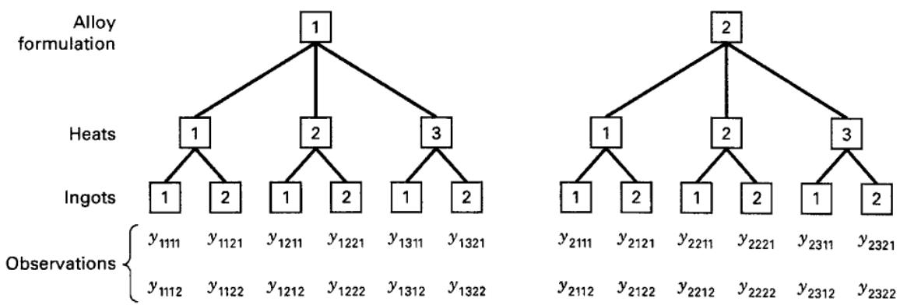
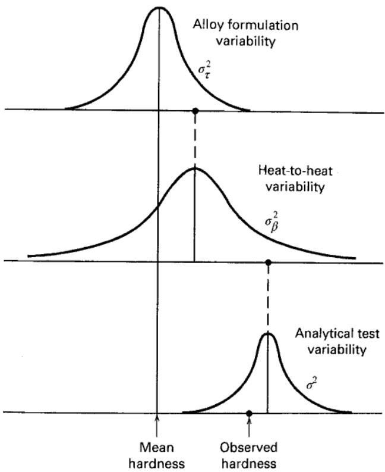

# 14.2 一般的 m 阶段嵌套设计

第 14.1 节的结果容易推广到 $m$ 个完全嵌套因子的情形，称为 **$m$ 阶段嵌套设计**。例如，某铸造厂希望研究两种金属合金配方的硬度。每种配方熔炼三炉，每炉随机选取两个铸锭进行试验，每个铸锭测量两次硬度，安排见图 14.5。

炉次嵌套在合金配方之下，铸锭嵌套在炉次之下，因此这是重复两次的三阶段嵌套设计。

一般三阶段嵌套设计的模型为

$$
y _ {i j k l} = \mu + \tau_ {i} + \beta_ {j (i)} + \gamma_ {k (i j)} + \epsilon_ {(i j k) l} \left\{ \begin{array}{l} i = 1, 2, \ldots , a \\ j = 1, 2, \ldots , b \\ k = 1, 2, \ldots , c \\ l = 1, 2, \ldots , n \end{array} \right.\tag{14.13}
$$

在本例中，$\tau_i$ 是第 $i$ 种合金配方的效应，$\beta_{j(i)}$ 是该配方内第 $j$ 炉的效应，$\gamma_{k(ij)}$ 是该配方第 $j$ 炉中第 $k$ 个铸锭的效应，$\epsilon_{(ijk)l}$ 是通常的独立 $N(0,\sigma^2)$ 误差项。推广到 $m$ 个因子是直接的。

上例的硬度总变异来自合金配方、炉次、铸锭以及分析测量误差等层次。图 14.6 示意了这些变异来源。

这个例子说明，嵌套设计常用于分析过程并识别输出变异的主要来源。例如，若合金配方的方差分量较大，则只使用一种配方可能降低硬度总变异。

$m$ 阶段嵌套设计的平方和计算与方差分析类似于第 14.1 节。例如，表 14.8 汇总了三阶段嵌套设计的方差分析，并列出平方和定义。这些公式是两阶段公式的简单推广，许多统计软件都能完成计算。

为确定适当的检验统计量，必须用第 13 章的方法求期望均方。例如，A、B 固定而 C 随机时，期望均方见表 14.9，据此可选择检验统计量。

  
图 14.5 三阶段嵌套设计

  
图 14.6 三阶段嵌套设计例子中的变异来源
表 14.8

三阶段嵌套设计的方差分析

<table><tr><td>变异来源</td><td>平方和</td><td>自由度</td><td>均方</td></tr><tr><td>A</td><td>$bcn\sum_{i}(\overline{y}_{i...}-\overline{y}_{...})^{2}$</td><td>a-1</td><td>$MS_{A}$</td></tr><tr><td>B（A 内）</td><td>$cn\sum_{i}\sum_{j}(\overline{y}_{ij..}-\overline{y}_{i...})^{2}$</td><td>a(b-1)</td><td>$MS_{B(A)}$</td></tr><tr><td>C（B 内）</td><td>$n\sum_{i}\sum_{j}\sum_{k}(\overline{y}_{ijk.}-\overline{y}_{ij..})^{2}$</td><td>ab(c-1)</td><td>$MS_{C(B)}$</td></tr><tr><td>误差</td><td>$\sum_{i}\sum_{j}\sum_{k}\sum_{l}(y_{ijkl}-\overline{y}_{ijk.})^{2}$</td><td>abc(n-1)</td><td>$MS_{E}$</td></tr><tr><td>总计</td><td>$\sum_{i}\sum_{j}\sum_{k}\sum_{l}(y_{ijkl}-\overline{y}_{....})^{2}$</td><td>abcn-1</td><td></td></tr></table>

表 14.9

A、B 固定而 C 随机的三阶段嵌套设计的期望均方

<table><tr><td>模型项</td><td>期望均方</td></tr><tr><td>$\tau_{i}$</td><td>$\sigma^{2} + n\sigma_{\gamma}^{2} + \frac{bcn\σ\tau_{i}^{2}}{a-1}$</td></tr><tr><td>$\beta_{j(i)}$</td><td>$\sigma^{2} + n\sigma_{\gamma}^{2} + \frac{cn\σ\σ\beta_{j(i)}^{2}}{a(b-1)}$</td></tr><tr><td>$\gamma_{k(ij)}$</td><td>$\sigma^{2} + n\sigma_{\gamma}^{2}$</td></tr><tr><td>$\epsilon_{l(ijk)}$</td><td>$\sigma^{2}$</td></tr></table>
