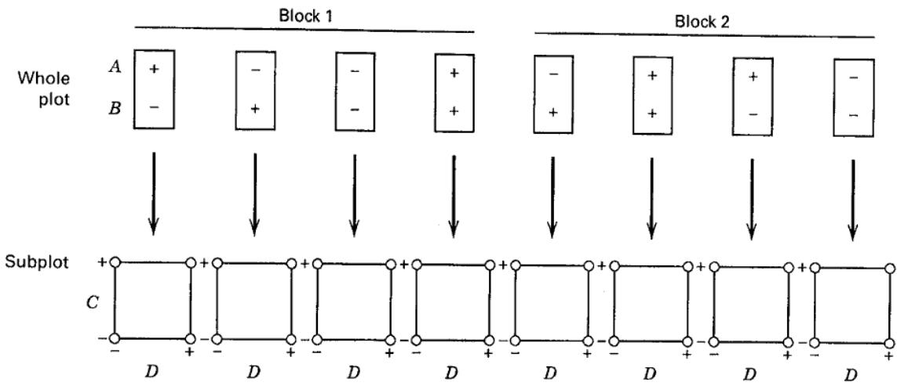
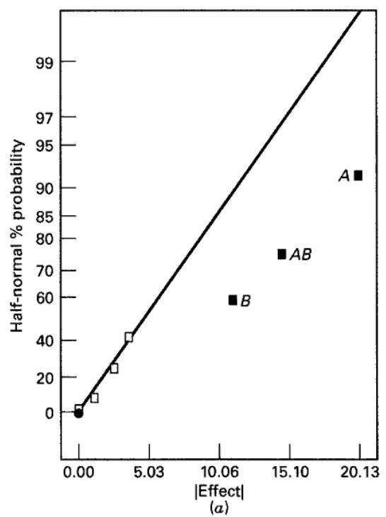
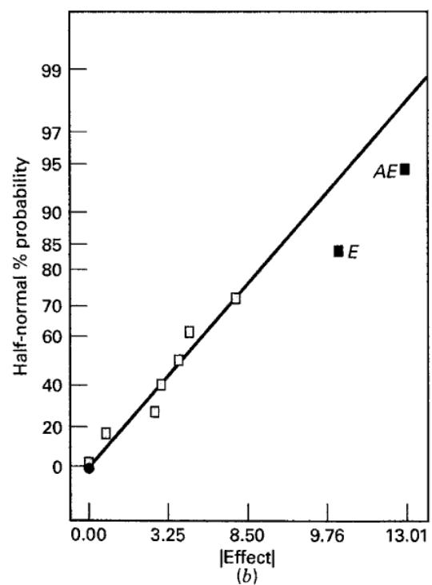
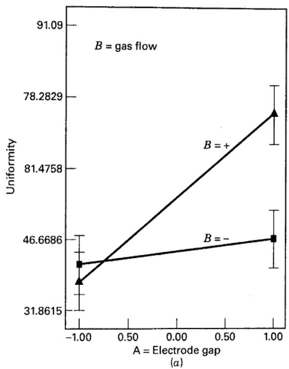
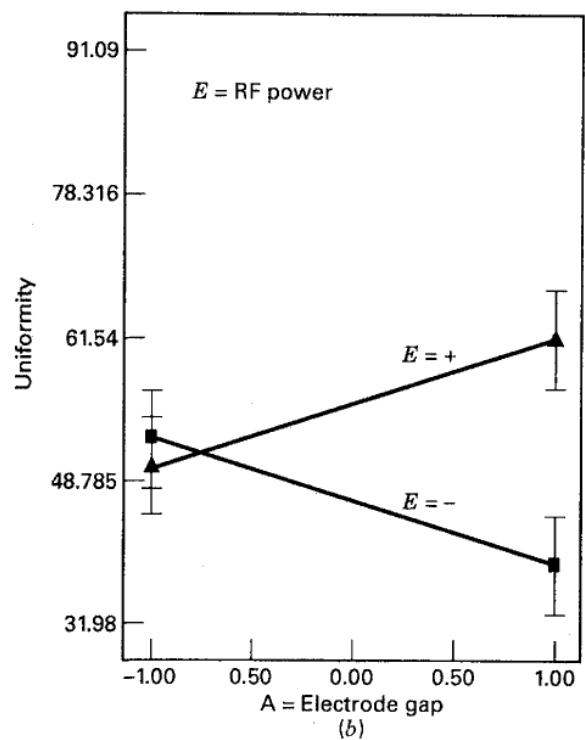
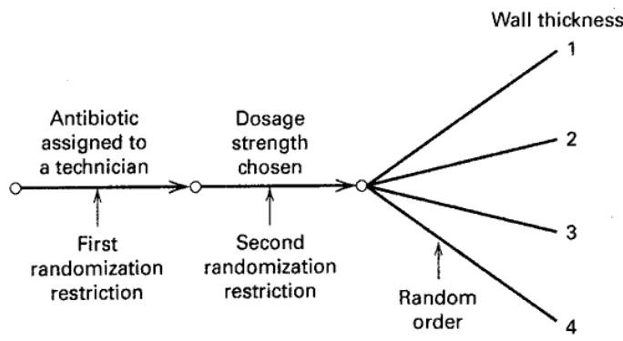

# 14.5 裂区设计的其他变形

## 14.5.1 含两个以上因子的裂区设计

有时整区或子区包含按析因结构安排的两个及以上因子。例如，在炉中使硅片生长氧化层，关注氧化层厚度与均匀性。四个设计因子是温度 A、气体流量 B、时间 C 和硅片在炉内的位置 D。计划进行重复两次的 $2^4$ 析因试验，共 32 次。A、B 难以改变，C、D 易于改变，因而采用图 14.7 的裂区设计。每次重复分成四个整区，分别对应温度和气体流量的一个组合。设定后，将整区分为四个子区，在时间和硅片位置上进行 $2^2$ 析因试验，子区组合按随机次序运行。每次重复只需设置四组温度和气体流量组合，而时间和位置在各整区内部随机化。

与式（14.16）一致的模型为

$$
\begin{array}{r l} & y _ {i j k l m} = \mu + \tau_ {i} + \beta_ {j} + \gamma_ {k} + (\beta \gamma) _ {j k} + \theta_ {i j k} + \delta_ {l} + \lambda_ {m} + (\delta \lambda) _ {l m} \\ & \qquad + (\beta \delta) _ {j l} + (\beta \lambda) _ {j m} + (\gamma \delta) _ {k l} + (\gamma \lambda) _ {k m} + (\beta \gamma \delta) _ {j k l} + (\beta \gamma \lambda) _ {j k m} \\ & \qquad + (\beta \delta \lambda) _ {j l m} + (\gamma \delta \lambda) _ {k l m} + (\beta \gamma \delta \lambda) _ {j k l m} + \epsilon_ {i j k l m} \left\{ \begin{array}{l l} i = 1, 2 \\ j = 1, 2 \\ k = 1, 2 \\ l = 1, 2 \\ m = 1, 2 \end{array} \right. \end{array}\tag{14.19}
$$

  
图 14.7 四因子裂区设计：两个因子在整区，两个因子在子区

其中，$\tau_i$ 是重复效应，$\beta_j,\gamma_k$ 是整区主效应，$\theta_{ijk}$ 是整区误差，$\delta_l,\lambda_m$ 是子区主效应，$\epsilon_{ijklm}$ 是子区误差。模型包含四个设计因子之间的全部交互作用。重复随机、全部设计因子固定时，方差分析见表 14.21。[^1] $\sigma_\theta^2,\sigma_\epsilon^2$ 分别是整区和子区误差方差，$\sigma_\tau^2$ 是区组效应方差；为简化记号，用大写拉丁字母表示固定效应分量。整区主效应及其交互作用用整区误差检验，子区因子及其他交互作用用子区误差检验。若某些设计因子随机，检验统计量将不同；有时没有精确 F 检验，需要采用第 13 章的 Satterthwaite 方法。

表 14.21
A、B 在整区、C、D 在子区的裂区设计的简略方差分析（见图 14.7）

<table><tr><td>变异来源</td><td>平方和</td><td>自由度</td><td>期望均方</td></tr><tr><td>重复 ( $\tau_i$ )</td><td>$SS_{\text{重复}}$</td><td>1</td><td>$\sigma_\epsilon^2 + 4\sigma_\theta^2 + 16\sigma_\tau^2$</td></tr><tr><td>$A(\beta_j)$</td><td>$SS_A$</td><td>1</td><td>$\sigma_\epsilon^2 + 4\sigma_\theta^2 + A$</td></tr><tr><td>$B(\gamma_k)$</td><td>$SS_B$</td><td>1</td><td>$\sigma_\epsilon^2 + 4\sigma_\theta^2 + B$</td></tr><tr><td>AB</td><td>$SS_{AB}$</td><td>1</td><td>$\sigma_\epsilon^2 + 4\sigma_\theta^2 + AB$</td></tr><tr><td>整区误差 ( $\theta_{ijk}$ )</td><td>$SS_{WP}$</td><td>3</td><td>$\sigma_\epsilon^2 + 4\sigma_\theta^2$</td></tr><tr><td>$C(\delta_l)$</td><td>$SS_C$</td><td>1</td><td>$\sigma_\epsilon^2 + C$</td></tr><tr><td>$D(\lambda_m)$</td><td>$SS_D$</td><td>1</td><td>$\sigma_\epsilon^2 + D$</td></tr><tr><td>CD</td><td>$SS_{CD}$</td><td>1</td><td>$\sigma_\epsilon^2 + CD$</td></tr><tr><td>AC</td><td>$SS_{AC}$</td><td>1</td><td>$\sigma_\epsilon^2 + AC$</td></tr><tr><td>BC</td><td>$SS_{BC}$</td><td>1</td><td>$\sigma_\epsilon^2 + BC$</td></tr><tr><td>AD</td><td>$SS_{AD}$</td><td>1</td><td>$\sigma_\epsilon^2 + AD$</td></tr><tr><td>BD</td><td>$SS_{BD}$</td><td>1</td><td>$\sigma_\epsilon^2 + BD$</td></tr><tr><td>ABC</td><td>$SS_{ABC}$</td><td>1</td><td>$\sigma_\epsilon^2 + ABC$</td></tr><tr><td>ABD</td><td>$SS_{ABD}$</td><td>1</td><td>$\sigma_\epsilon^2 + ABD$</td></tr><tr><td>ACD</td><td>$SS_{ACD}$</td><td>1</td><td>$\sigma_\epsilon^2 + ACD$</td></tr><tr><td>BCD</td><td>$SS_{BCD}$</td><td>1</td><td>$\sigma_\epsilon^2 + BCD$</td></tr><tr><td>ABCD</td><td>$SS_{ABCD}$</td><td>1</td><td>$\sigma_\epsilon^2 + ABCD$</td></tr><tr><td>子区误差 ( $\epsilon_{ijklm}$ )</td><td>$SS_{SP}$</td><td>12</td><td>$\sigma_\epsilon^2$</td></tr><tr><td>总计</td><td>$SS_T$</td><td>31</td><td></td></tr></table>

裂区结构中含三个及以上因子的析因试验往往规模较大，但裂区结构也常使大试验更易实施。例如，氧化炉试验只需设置八组难以改变的 A、B 组合，所以 32 次试验也许并不过大。

随着因子数增加，可考虑在裂区结构中使用分式析因设计。例如，习题 8.7 的 $2^{5-1}$ 分式析因试验研究热处理变量对卡车弹簧高度的影响：A 为转移时间，B 为加热时间，C 为油淬温度，D 为温度，E 为压紧时间。假定 A、B、C 很难改变，D、E 易于改变。例如，必须先按 A、B、C 的不同设置制造弹簧，再固定这些设置，在后续试验中改变 D、E。

这里修改原试验，因为原试验者未必按裂区方式运行，且所用生成元不同。用 A、B、C 表示整区因子，用 $\boldsymbol D,\boldsymbol E$ 表示子区因子，以粗体帮助识别易于改变的因子。选择生成元 $E=ABCD$。设计有八个整区，对应 A、B、C 的全部二水平组合；每个整区分成两个子区，各运行一个 D、E 组合。具体组合由整区处理符号通过生成元决定。

假定所有三、四、五因子交互作用均可忽略，则可在整区层估计 A、B、C 及它们的两因子交互作用。若设计有重复，以整区误差检验；若无重复，可用正态概率图或 Lenth 方法评价。D、E 及其交互作用 DE 也可估计，但因 $DE=ABC$，DE 必须作为整区项处理。还可估计六个整区与子区因子的两因子交互作用：AD、AE、BD、BE、CD、CE。一般而言，若子区主效应或交互作用与仅含整区因子的效应互为别名，应以整区误差比较；至少含一个子区因子且不与纯整区效应互为别名的项，则与子区误差比较。详见 Bisgaard（2000）。因此，本例的 D、E、AD、AE、BD、BE、CD、CE 使用子区误差，也可用正态概率图评价。

关于裂区结构中的分式析因试验与响应面试验，可参见 Vining、Kowalski 和 Montgomery（2005），Vining 和 Kowalski（2008），Macharia 和 Goos（2010），Bisgaard（2000），Bingham 和 Sitter（1999），Huang、Chen 和 Voelkel（1999），以及 Almimi、Kulahci 和 Montgomery（2008a，b，2009）。

## 例 14.3

现研究影响单片等离子刻蚀过程均匀性的因子。刻蚀设备上的三个因子较难逐次改变：电极间隙 A、气体流量 B 和压力 C；时间 D 与射频功率 E 易于改变。由于试验硅片有限，计划用分式析因试验研究五个因子，同时考虑裂区结构。采用前述方案：$2^{5-1}$ 设计，A、B、C 在整区，D、E 在子区，生成元 $E=ABCD$。所得设计有 16 次试验、八个整区，各整区对应 A、B、C 的一个完整 $2^3$ 析因组合，并分成两个子区，各运行一个 D、E 组合。设计与均匀性数据见表 14.22。八个整区按随机次序运行；在某个整区的 A、B、C 设置完成后，再以随机次序运行其两个子区。

分析必须区分整区与子区效应，并假定二阶以上交互作用可忽略。表 14.23 按误差层列出了效应估计。所有可用自由度都用于估计效应，无法估计整区或子区误差，因此使用概率图评价效应。图 14.8a 是整区效应的半正态概率图，A、B 和 AB 的效应较大；DE 因与 ABC 互为别名，也归于整区层。图 14.8b 是子区效应 D、E、AD、AE、BD、BE、CD、CE 的半正态概率图，其中仅 E 和 AE 较大。[^2]

图 14.9a、b 分别为 AB 与 AE 的交互作用图。试验者希望使均匀性指标尽量小，图 14.9a 表明，只要气体流量 B 处于低水平，电极间隙 A 的任一水平

表 14.22
等离子刻蚀设备的 $2^{5-1}$ 裂区试验

<table><tr><td rowspan="2">整区</td><td colspan="3">整区因子</td><td colspan="2">子区因子</td><td rowspan="2">均匀度</td></tr><tr><td>A</td><td>B</td><td>C</td><td>D</td><td>E</td></tr><tr><td rowspan="2">1</td><td>-</td><td>-</td><td>-</td><td>-</td><td>+</td><td>40.85</td></tr><tr><td>-</td><td>-</td><td>-</td><td>+</td><td>-</td><td>41.07</td></tr><tr><td rowspan="2">2</td><td>+</td><td>-</td><td>-</td><td>-</td><td>-</td><td>35.67</td></tr><tr><td>+</td><td>-</td><td>-</td><td>+</td><td>+</td><td>51.15</td></tr><tr><td rowspan="2">3</td><td>-</td><td>+</td><td>-</td><td>-</td><td>-</td><td>41.80</td></tr><tr><td>-</td><td>+</td><td>-</td><td>+</td><td>+</td><td>37.01</td></tr><tr><td rowspan="2">4</td><td>+</td><td>+</td><td>-</td><td>-</td><td>+</td><td>91.09</td></tr><tr><td>+</td><td>+</td><td>-</td><td>+</td><td>-</td><td>48.67</td></tr><tr><td rowspan="2">5</td><td>-</td><td>-</td><td>+</td><td>-</td><td>-</td><td>40.32</td></tr><tr><td>-</td><td>-</td><td>+</td><td>+</td><td>+</td><td>43.34</td></tr><tr><td rowspan="2">6</td><td>+</td><td>-</td><td>+</td><td>-</td><td>+</td><td>62.46</td></tr><tr><td>+</td><td>-</td><td>+</td><td>+</td><td>-</td><td>38.08</td></tr><tr><td rowspan="2">7</td><td>-</td><td>+</td><td>+</td><td>-</td><td>+</td><td>31.99</td></tr><tr><td>-</td><td>+</td><td>+</td><td>+</td><td>-</td><td>41.03</td></tr><tr><td rowspan="2">8</td><td>+</td><td>+</td><td>+</td><td>-</td><td>-</td><td>70.31</td></tr><tr><td>+</td><td>+</td><td>+</td><td>+</td><td>+</td><td>81.03</td></tr></table>

表 14.23
按整区效应与子区效应划分的等离子刻蚀试验效应

<table><tr><td>模型项</td><td>参数估计</td><td>模型项类型</td></tr><tr><td>截距</td><td>49.73875</td><td></td></tr><tr><td>Gap (A)</td><td>10.0625</td><td>整区</td></tr><tr><td>气体流量（B）</td><td>5.6275</td><td>整区</td></tr><tr><td>压力 (C)</td><td>1.325</td><td>整区</td></tr><tr><td>时间 (D)</td><td>-2.0725</td><td>子区</td></tr><tr><td>射频功率（E）</td><td>5.12625</td><td>子区</td></tr><tr><td>AB</td><td>7.34625</td><td>整区</td></tr><tr><td>AC</td><td>1.83125</td><td>整区</td></tr><tr><td>AD</td><td>-3.00875</td><td>子区</td></tr><tr><td>AE</td><td>6.505</td><td>子区</td></tr><tr><td>BC</td><td>-0.60125</td><td>整区</td></tr><tr><td>BD</td><td>-1.35875</td><td>子区</td></tr><tr><td>BE</td><td>-0.2125</td><td>子区</td></tr><tr><td>CD</td><td>1.86625</td><td>子区</td></tr><tr><td>CE</td><td>-1.485</td><td>子区</td></tr><tr><td>DE</td><td>0.34</td><td>整区</td></tr></table>

  
图 14.8 例 14.3 的 $2^{5-1}$ 裂区试验效应的半正态概率图：（a）整区效应；（b）子区效应

  
图 14.9 例 14.3 的 $2^{5-1}$ 裂区试验的两因子交互作用图：（a）AB；（b）AE

都可得到较低响应。但若 B 为高水平，A 必须为低水平。图 14.9b 表明，将射频功率 E 控制在低水平能降低响应，尤其在 A 为高水平时；若 E 为高水平，则 A 必须为低水平。因此，五个因子中有三个显著影响刻蚀均匀性。A 高、B 低、E 低，或 A 低、B 高、E 高的组合可产生较低的均匀性响应。

可用 JMP 构造例 14.3 的 D 最优设计：指定 A、B、C 难以改变，D、E 易于改变，要求八个整区、16 次试验。JMP 对此问题默认建议 32 次试验、八个整区、每个整区四个子区的完整析因设计，见表 14.24。增加的试验允许估计整区和子区误差。两种设计的整区数均为八，难以改变因子的设置次数相同，因此实际所需资源可能相差不大。

## 14.5.2 再裂区设计

裂区设计可推广到试验内多个层次存在随机化限制的情形。若有两个层次的随机化限制，称为**再裂区设计**。下面给出例子。

最优设计工具是构造裂区设计的重要方法。采用坐标交换算法的工具效率很高，JMP 中已实现。Capehart 等（2011）还开发了使用整数规划的构造方法。

表 14.24
JMP 为等离子刻蚀试验给出的默认设计

<table><tr><td rowspan="2">整区</td><td colspan="3">整区因子</td><td colspan="2">子区因子</td></tr><tr><td>A</td><td>B</td><td>C</td><td>D</td><td>E</td></tr><tr><td>1</td><td>-</td><td>-</td><td>-</td><td>-</td><td>-</td></tr><tr><td></td><td></td><td></td><td></td><td>-</td><td>+</td></tr><tr><td></td><td></td><td></td><td></td><td>+</td><td>-</td></tr><tr><td></td><td></td><td></td><td></td><td>+</td><td>+</td></tr><tr><td>2</td><td>-</td><td>-</td><td>+</td><td>-</td><td>-</td></tr><tr><td></td><td></td><td></td><td></td><td>-</td><td>+</td></tr><tr><td></td><td></td><td></td><td></td><td>+</td><td>-</td></tr><tr><td></td><td></td><td></td><td></td><td>+</td><td>+</td></tr><tr><td>3</td><td>-</td><td>+</td><td>-</td><td>-</td><td>-</td></tr><tr><td></td><td></td><td></td><td></td><td>-</td><td>+</td></tr><tr><td></td><td></td><td></td><td></td><td>+</td><td>-</td></tr><tr><td></td><td></td><td></td><td></td><td>+</td><td>+</td></tr><tr><td>4</td><td>-</td><td>+</td><td>+</td><td>-</td><td>-</td></tr><tr><td></td><td></td><td></td><td></td><td>-</td><td>+</td></tr><tr><td></td><td></td><td></td><td></td><td>+</td><td>-</td></tr><tr><td></td><td></td><td></td><td></td><td>+</td><td>+</td></tr><tr><td>5</td><td>+</td><td>-</td><td>-</td><td>-</td><td>-</td></tr><tr><td></td><td></td><td></td><td></td><td>-</td><td>+</td></tr><tr><td></td><td></td><td></td><td></td><td>+</td><td>-</td></tr><tr><td></td><td></td><td></td><td></td><td>+</td><td>+</td></tr><tr><td>6</td><td>+</td><td>-</td><td>+</td><td>-</td><td>-</td></tr><tr><td></td><td></td><td></td><td></td><td>-</td><td>+</td></tr><tr><td></td><td></td><td></td><td></td><td>+</td><td>-</td></tr><tr><td></td><td></td><td></td><td></td><td>+</td><td>+</td></tr><tr><td>7</td><td>+</td><td>+</td><td>-</td><td>-</td><td>-</td></tr><tr><td></td><td></td><td></td><td></td><td>-</td><td>+</td></tr><tr><td></td><td></td><td></td><td></td><td>+</td><td>-</td></tr><tr><td></td><td></td><td></td><td></td><td>+</td><td>+</td></tr><tr><td>8</td><td>+</td><td>+</td><td>+</td><td>-</td><td>-</td></tr><tr><td></td><td></td><td></td><td></td><td>-</td><td>+</td></tr><tr><td></td><td></td><td></td><td></td><td>+</td><td>-</td></tr><tr><td></td><td></td><td></td><td></td><td>+</td><td>+</td></tr></table>

## 例 14.4

研究某种抗生素胶囊的吸收时间，关注三名技术员、三种剂量和四种胶囊壁厚。一次完整析因重复需要 36 个观测，计划重复四次，每次必须在不同日期进行，因此日期可作为区组。每个重复（日期区组）中，给每名技术员分配一份抗生素，由其在三种剂量、四种壁厚下试验。先配制一种剂量，再测试全部四种壁厚；然后选另一剂量，同样测试四种壁厚；最后完成第三剂量。其他两名技术员各用自己的一份抗生素按同一方案进行。

每个重复或区组中有两层随机化限制：技术员和剂量。

技术员对应整区，以随机次序分配抗生素。剂量形成三个子区，可随机分配到子区。每种剂量内，四种壁厚按随机次序测试，构成四个再子区，壁厚通常称为再子区处理。由于有两层随机化限制（有些作者称为两次“裂分”），该设计称为再裂区设计。图 14.10 示意其随机化限制和布局。

<table><tr><td rowspan="2">区组</td><td rowspan="2">剂量强度</td><td colspan="3">1</td><td colspan="3">2</td><td colspan="3">3</td></tr><tr><td>1</td><td>2</td><td>3</td><td>1</td><td>2</td><td>3</td><td>1</td><td>2</td><td>3</td></tr><tr><td rowspan="4">1</td><td rowspan="4">壁厚</td><td>1</td><td>1</td><td>1</td><td>1</td><td>1</td><td>1</td><td>1</td><td>1</td><td>1</td></tr><tr><td>2</td><td>2</td><td>2</td><td>2</td><td>2</td><td>2</td><td>2</td><td>2</td><td>2</td></tr><tr><td>3</td><td>3</td><td>3</td><td>3</td><td>3</td><td>3</td><td>3</td><td>3</td><td>3</td></tr><tr><td>4</td><td>4</td><td>4</td><td>4</td><td>4</td><td>4</td><td>4</td><td>4</td><td>4</td></tr><tr><td rowspan="4">2</td><td rowspan="4">壁厚</td><td>1</td><td>1</td><td>1</td><td>1</td><td>1</td><td>1</td><td>1</td><td>1</td><td>1</td></tr><tr><td>2</td><td>2</td><td>2</td><td>2</td><td>2</td><td>2</td><td>2</td><td>2</td><td>2</td></tr><tr><td>3</td><td>3</td><td>3</td><td>3</td><td>3</td><td>3</td><td>3</td><td>3</td><td>3</td></tr><tr><td>4</td><td>4</td><td>4</td><td>4</td><td>4</td><td>4</td><td>4</td><td>4</td><td>4</td></tr><tr><td rowspan="4">3</td><td rowspan="4">壁厚</td><td>1</td><td>1</td><td>1</td><td>1</td><td>1</td><td>1</td><td>1</td><td>1</td><td>1</td></tr><tr><td>2</td><td>2</td><td>2</td><td>2</td><td>2</td><td>2</td><td>2</td><td>2</td><td>2</td></tr><tr><td>3</td><td>3</td><td>3</td><td>3</td><td>3</td><td>3</td><td>3</td><td>3</td><td>3</td></tr><tr><td>4</td><td>4</td><td>4</td><td>4</td><td>4</td><td>4</td><td>4</td><td>4</td><td>4</td></tr><tr><td rowspan="4">4</td><td rowspan="4">壁厚</td><td>1</td><td>1</td><td>1</td><td>1</td><td>1</td><td>1</td><td>1</td><td>1</td><td>1</td></tr><tr><td>2</td><td>2</td><td>2</td><td>2</td><td>2</td><td>2</td><td>2</td><td>2</td><td>2</td></tr><tr><td>3</td><td>3</td><td>3</td><td>3</td><td>3</td><td>3</td><td>3</td><td>3</td><td>3</td></tr><tr><td>4</td><td>4</td><td>4</td><td>4</td><td>4</td><td>4</td><td>4</td><td>4</td><td>4</td></tr></table>

图 14.10 再裂区设计

再裂区设计的线性统计模型为

$$
\begin{array}{l} y _ {i j k h} = \mu + \tau_ {i} + \beta_ {j} + (\tau \beta) _ {i j} + \gamma_ {k} + (\tau \gamma) _ {i k} + (\beta \gamma) _ {j k} + (\tau \beta \gamma) _ {i j k} \\ \qquad + \delta_ {h} + (\tau \delta) _ {i h} + (\beta \delta) _ {j h} \\ \qquad + (\tau \beta \delta) _ {i j h} + (\gamma \delta) _ {k h} + (\tau \gamma \delta) _ {i k h} + (\beta \gamma \delta) _ {j k h} \\ \qquad + (\tau \beta \gamma \delta) _ {i j k h} + \epsilon_ {i j k h} \left\{ \begin{array}{l l} i = 1, 2, \ldots , r \\ j = 1, 2, \ldots , a \\ k = 1, 2, \ldots , b \\ h = 1, 2, \ldots , c \end{array} \right. \end{array}\tag{14.20}
$$

其中，$\tau_i,\beta_j,(\tau\beta)_{ij}$ 属于整区层，分别对应重复或区组、主处理 A、整区误差（重复 × A）；$\gamma_k,(\tau\gamma)_{ik},(\beta\gamma)_{jk},(\tau\beta\gamma)_{ijk}$ 属于子区层，分别对应子区处理 B、重复 × B、AB 和子区误差；$\delta_h$ 及其余参数属于再子区层，分别表示再子区处理 C 和其余交互作用。四因子交互作用 $(\tau\beta\gamma\delta)_{ijkh}$ 称为再子区误差。

假定重复（区组）随机、其余设计因子固定，期望均方见表 14.25。主处理、子区处理、再子区处理及其交互作用的检验

## 表 14.25

再裂区设计的期望均方

<table><tr><td></td><td>模型项</td><td>期望均方</td></tr><tr><td rowspan="3">整区</td><td>$\tau_i$</td><td>$\sigma^2 + abc\sigma_\tau^2$</td></tr><tr><td>$\beta_j$</td><td>$\sigma^2 + bc\sigma_\tau^\beta^2 + \frac{rbc\sum\beta_j^2}{(a-1)}$</td></tr><tr><td>$(\tau\beta)_{ij}$</td><td>$\sigma^2 + bc\sigma_\tau^\beta^2$</td></tr><tr><td rowspan="4">子区</td><td>$\gamma_k$</td><td>$\sigma^2 + ac\sigma_\tau^\gamma^2 + \frac{rac\sum\gamma_k^2}{(b-1)}$</td></tr><tr><td>$(\tau\gamma)_{ik}$</td><td>$\sigma^2 + ac\sigma_\tau^\gamma^2$</td></tr><tr><td>$(\beta\gamma)_{jk}$</td><td>$\sigma^2 + c\sigma_\tau^\beta^\gamma^2 + \frac{rc\sum\sum(\beta\gamma)_{jh}^2}{(a-1)(b-1)}$</td></tr><tr><td>$(\tau\beta\gamma)_{ijk}$</td><td>$\sigma^2 + c\sigma_\tau^\beta^\gamma^2$</td></tr><tr><td rowspan="9">再裂区</td><td>$\delta_h$</td><td>$\sigma^2 + ab\sigma_\tau^\delta^2 + \frac{rab\sum\delta_k^2}{(c-1)}$</td></tr><tr><td>$(\tau\delta)_{ih}$</td><td>$\sigma^2 + ab\sigma_\tau^\delta^2$</td></tr><tr><td>$(\beta\delta)_{jh}$</td><td>$\sigma^2 + b\sigma_\tau^\beta^\delta^2 + \frac{rb\sum\sum(\beta\delta)_{jh}^2}{(a-1)(c-1)}$</td></tr><tr><td>$(\tau\beta\delta)_{ijh}$</td><td>$\sigma^2 + b\sigma_\tau^\beta^\delta^2$</td></tr><tr><td>$(\gamma\delta)_{kh}$</td><td>$\sigma^2 + a\sigma_\tau^\gamma^\delta^2 + \frac{ra\sum\sum(\gamma\delta)_{kh}^2}{(b-1)(c-1)}$</td></tr><tr><td>$(\tau\gamma\delta)_{ikh}$</td><td>$\sigma^2 + a\sigma_\tau^\gamma^\delta^2$</td></tr><tr><td>$(\beta\gamma\delta)_{jkh}$</td><td>$\sigma^2 + \sigma_\tau^\beta^\gamma^\delta^2 + \frac{r\sum\sum\sum(\beta\gamma\delta)_{ijk}^2}{(a-1)(b-1)(c-1)}$</td></tr><tr><td>$(\tau\beta\gamma\delta)_{ijkh}$</td><td>$\sigma^2 + \sigma_\tau^\beta^\gamma^\delta$</td></tr><tr><td>$\epsilon_{l(i j kh)}$</td><td>$\sigma^2 \text{(not estimable)}$</td></tr></table>

可直接由表中确定。重复或区组以及涉及重复或区组的交互作用，没有相应检验。

再裂区设计的统计分析类似于单次重复的四因子析因试验，各检验自由度按通常方法确定。例 14.4 有四次重复、三名技术员、三种剂量和四种壁厚，检验技术员效应的整区误差自由度只有 $(r-1)(a-1)=(4-1)(3-1)=6$，相对较少。可增加重复以提高精度。若有 $r$ 次重复，整区误差自由度为 $2(r-1)$，因此五、六、七次重复分别提供 8、10、12 个自由度。少于四次重复会使误差自由度至多为 4，通常不宜采用。每增加一次重复，增加两个误差自由度。由四次增至五次，自由度从 6 增至 8，增加三分之一；由五次增至六次，再增加 25%。若资源允许，宜进行五或六次重复。

## 14.5.3 条带裂区设计

**条带裂区设计**广泛用于农业，有时也用于工业。最简单的情形含两个因子 A、B：A 像通常裂区设计那样施加于整区，B 则施加于与 A 的整区方向垂直的条带，即另一组整区。图 14.11 给出了 A、B 各三个水平的情形。A 的水平与一组整区对应，B 的水平与另一组条带对应。

对图 14.11 的设计，设有 $r$ 次重复、A 有 $a$ 个水平、B 有 $b$ 个水平，模型为

$$
y _ {i j k} = \mu + \tau_ {i} + \beta_ {j} + (\tau \beta) _ {i j} + \gamma_ {k} + (\tau \gamma) _ {i k} + (\beta \gamma) _ {j k} + \epsilon_ {i j k} \quad \left\{ \begin{array}{l l} i = 1, 2, \ldots , r \\ j = 1, 2, \ldots , a \\ k = 1, 2, \ldots , b \end{array} \right.
$$

其中，$(\tau\beta)_{ij}$ 和 $(\tau\gamma)_{ik}$ 分别是 A、B 的整区误差，$\epsilon_{ijk}$ 是用于检验 AB 交互作用的“子区”误差。A、B 固定且重复随机时，简略方差分析见表 14.26。重复有时也作为区组。

图 14.11 条带裂区设计的一次重复（区组）

<table><tr><td rowspan="2"></td><td colspan="3">整区</td></tr><tr><td>$A_3$</td><td>$A_1$</td><td>$A_2$</td></tr><tr><td>$B_1$</td><td>$A_3B_1$</td><td>$A_1B_1$</td><td>$A_2B_1$</td></tr><tr><td>$B_3$</td><td>$A_3B_3$</td><td>$A_1B_3$</td><td>$A_2B_3$</td></tr><tr><td>$B_2$</td><td>$A_3B_2$</td><td>$A_1B_2$</td><td>$A_2B_2$</td></tr></table>

表 14.26
条带裂区设计的简略方差分析

<table><tr><td>变异来源</td><td>平方和</td><td>自由度</td><td>期望均方</td></tr><tr><td>重复（或区组）</td><td>$SS_{\text{重复}}$</td><td>r-1</td><td>$\sigma_{\epsilon}^{2}+ab\sigma_{\tau}^{2}$</td></tr><tr><td>A</td><td>$SS_{A}$</td><td>a-1</td><td>$\sigma_{\epsilon}^{2}+b\sigma_{\tau\beta}^{2}+\frac{rb\sum\beta_{j}^{2}}{a-1}$</td></tr><tr><td>整区误差 $_{A}$</td><td>$SS_{WP_{A}}$</td><td>(r-1)(a-1)</td><td>$\sigma_{\epsilon}^{2}+b\sigma_{\tau\beta}^{2}$</td></tr><tr><td>B</td><td>$SS_{B}$</td><td>b-1</td><td>$\sigma_{\epsilon}^{2}+a\sigma_{\tau\gamma}^{2}+\frac{ra\sum\gamma_{k}^{2}}{b-1}$</td></tr><tr><td>整区误差 $_{B}$</td><td>$SS_{WP_{B}}$</td><td>(r-1)(b-1)</td><td>$\sigma_{\epsilon}^{2}+a\sigma_{\tau\gamma}^{2}$</td></tr><tr><td>AB</td><td>$SS_{AB}$</td><td>(a-1)(b-1)</td><td>$\sigma_{\epsilon}^{2}+\frac{r\sum\sum(\tau\beta)_{jk}^{2}}{(a-1)(b-1)}$</td></tr><tr><td>子区误差</td><td>$SS_{SP}$</td><td>(r-1)(a-1)(b-1)</td><td>$\sigma_{\epsilon}^{2}$</td></tr><tr><td>总计</td><td>$SS_{T}$</td><td>rab-1</td><td></td></tr></table>

[^1]: 译者注：每个整区有 $2\times2=4$ 个子区观测，整区误差方差在相关期望均方中的系数应为 4，原表的 8 已更正；重复均方还应含 $4\sigma_\theta^2$。

[^2]: 译者注：DE 与整区交互作用 ABC 互为别名，属于整区层；原文列举子区效应时误含 DE，已按表 14.23 修正。
