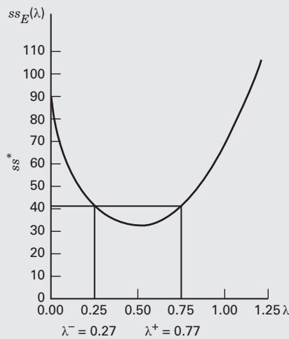
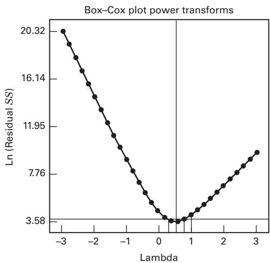

CHAPTER 15

# Other Design and Analysis Topics

## CHAPTER OUTLINE

- **15.1 NONNORMAL RESPONSES AND TRANSFORMATIONS**
  - 15.1.1 Selecting a Transformation: The Box–Cox Method
  - 15.1.2 The Generalized Linear Model
- **15.2 UNBALANCED DATA IN A FACTORIAL DESIGN**
  - 15.2.1 Proportional Data: An Easy Case
  - 15.2.2 Approximate Methods
  - 15.2.3 The Exact Method
- **15.3 THE ANALYSIS OF COVARIANCE**
  - 15.3.1 Description of the Procedure
  - 15.3.2 Computer Solution
  - 15.3.3 Development by the General Regression Significance Test
  - 15.3.4 Factorial Experiments with Covariates
- **15.4 REPEATED MEASURES**
- **SUPPLEMENTAL MATERIAL FOR CHAPTER 15**
  - S15.1 The Form of a Transformation
  - S15.2 Selecting $\lambda$ in the Box–Cox Method
  - S15.3 Generalized Linear Models
    - S15.3.1 Models with a Binary Response Variable
    - S15.3.2 Estimating the Parameters in a Logistic Regression Model
    - S15.3.3 Interpreting the Parameters in a Logistic Regression Model
    - S15.3.4 Hypothesis Tests on Model Parameters
    - S15.3.5 Poisson Regression
    - S15.3.6 The Generalized Linear Model
    - S15.3.7 Link Functions and Linear Predictors
    - S15.3.8 Parameter Estimation in the Generalized Linear Model
    - S15.3.9 Prediction and Estimation with the Generalized Linear Model
    - S15.3.10 Residual Analysis in the Generalized Linear Model
  - S15.4 Unbalanced Data in a Factorial Design
    - S15.4.1 The Regression Model Approach
    - S15.4.2 The Type 3 Analysis
    - S15.4.3 Type 1, Type 2, Type 3 and Type 4 Sums of Squares
    - S15.4.4 Analysis of Unbalanced Data using the Means Model

The supplemental material is on the textbook website www.wiley.com/college/montgomery.

## CHAPTER LEARNING OBJECTIVES

1. Know how to use the Box-Cox method to select a variance—stabilizing transformation.

2. Understand how the generalized linear model can be used to analyze some experiments with nonnormal response distributions.

3. Understand some basic analysis methods for unbalanced factorial designs.

4. Know how to analyze an experiment with a covariate.

5. Know how to design an experiment when the values of the covariate are known in advance.

6. Know how to analyze a single-factor design with repeated measures of the response.

he subject of statistically designed experiments is an extensive one. The previous chapters have provided an introductory presentation of many of the basic concepts and methods, yet in some cases we have only been able to provide an overview. For example, there are book-length presentations of topics such as response surface methodology, mixture experiments, variance component estimation, and optimal design. In this chapter, we provide an overview of several other topics that the experimenter may potentially find useful.

## 15.1 Nonnormal Responses and Transformations

## 15.1.1 Selecting a Transformation: The Box–Cox Method

In Section 3.4.3, we discussed the problem of nonconstant variance in the response variable y from a designed experi ment and noted that this is a departure from the standard analysis of variance assumptions. This inequality of variance problem occurs relatively often in practice, often in conjunction with a nonnormal response variable. Examples would include a count of defects or particles, proportion data such as yield or fraction defective, or a response variable that follows some skewed distribution (one “tail” of the response distribution is longer than the other). We introduced transformation of the response variable as an appropriate method for stabilizing the variance of the response. Two methods for selecting the form of the transformation were discussed—an empirical graphical technique and essentially trial and error in which the experimenter simply tries one or more transformations, selecting the one tha produces the most satisfactory or pleasing plot of residuals versus the fitted response.

Generally, transformations are used for three purposes: stabilizing response variance, making the distribution of the response variable closer to the normal distribution, and improving the fit of the model to the data. This last objective could include model simplification, say by eliminating interaction terms. Sometimes a transformation will be reasonably effective in simultaneously accomplishing more than one of these objectives.

We have noted that the power family of transformations $\boldsymbol { y } ^ { * } = \boldsymbol { y } ^ { \lambda }$ is very useful, where $\lambda$ is the paramete of the transformation to be determined (e.g., $\lambda = 1/2$ means use the square root of the original response). Box and Cox (1964) have shown how the transformation parameter $\lambda$ may be estimated simultaneously with the other model parameters (overall mean and treatment effects). The theory underlying their method uses the method of maximum likelihood. The actual computational procedure consists of performing, for various values of $\lambda$, a standard analysis of variance on

$$
y ^ {(\lambda)} = \left\{ \begin{array}{l l} \frac {y ^ {\lambda} - 1}{\lambda \dot {y} ^ {\lambda - 1}} & \lambda \neq 0 \\ \dot {y} \ln y & \lambda = 0 \end{array} \right.\tag{15.1}
$$

where $\dot { y } = \ln ^ { - 1 } [ ( 1 / n ) \Sigma$ ln y] is the geometric mean of the observations. The maximum likelihood estimate of $\lambda$ is the value for which the error sum of squares, say $S S _ { E } ( \lambda )$ , is a minimum. This value of $\lambda$ is usually found by plotting a graph of $S S _ { E } ( \lambda )$ versus $\lambda$ and then reading the value of $\lambda$ that minimizes $S S _ { E } ( \lambda )$ from the graph. Usually between 10 and 20 values of $\lambda$ are sufficient for estimating the optimum value. A second iteration using a finer mesh of values can be performed if a more accurate estimate of $\lambda$ is necessary.

Notice that we cannot select the value of $\lambda$ by directly comparing the error sums of squares from analysis of variance on $y ^ { \lambda }$ because for each value of $\lambda ,$ , the error sum of squares is measured on a different scale. Furthermore, a problem arises in y when $\lambda = 0$ , namely, as $\lambda$ approaches zero, $y ^ { \lambda }$ approaches unity. That is, when $\lambda = 0 .$ , all the response values are a constant. The component $( y ^ { \lambda } - 1 ) / \lambda$ of Equation 15.1 alleviates this problem because as $\lambda$ tend to zero, $( y ^ { \lambda } - 1 ) / \lambda$ goes to a limit of ln y. The divisor component $\displaystyle { \dot { y } } ^ { \lambda - 1 }$ in Equation 15.1 rescales the responses so tha the error sums of squares are directly comparable.

In using the Box–Cox method, we recommend that the experimenter use simple choices for $\lambda$ because the practical difference between $\lambda = 0 . 5$ and $\lambda = 0 . 5 8$ is likely to be small, but the square root transformation $( \lambda = 0 . 5 )$ is much easier to interpret. Obviously, values of $\lambda$ close to unity would suggest that no transformation is necessary.

Once a value of $\lambda$ is selected by the Box–Cox method, the experimenter can analyze the data using $y ^ { \lambda }$ as the response unless of course $\lambda = 0 ,$ , in which case he can use ln y. It is perfectly acceptable to use $y ^ { ( \lambda ) }$ as the actual response, although the model parameter estimates will have a scale difference and origin shift in comparison to the results obtained using $y ^ { \lambda }$ (or ln y).

An approximate 100(1 − $\alpha$) percent confidence interval for λ can be found by computing

$$
S S ^ {*} = S S _ {E} (\lambda) \left(1 + \frac {t _ {\alpha / 2 , \nu} ^ {2}}{\nu}\right)\tag{15.2}
$$

where $\nu$ is the number of degrees of freedom, and plotting a line parallel to the λ axis at height $S S ^ { * }$ on the graph of $S S _ { E } ( \lambda )$ versus λ. Then, by locating the points on the λ axis where $S S ^ { * }$ cuts the curve $S S _ { E } ( \lambda )$ , we can read confidence limits on λ directly from the graph. If this confidence interval includes the value $\lambda = 1$ , this implies (as noted above) that the data do not support the need for transformation.

## EXAMPLE 15.1

We will illustrate the Box–Cox procedure using the peak discharge data originally presented in Example 3.5. Recall that this is a single-factor experiment (see Table 3.7 for the original data). Using Equation 15.1, we computed values of $S S _ { E } ( \lambda )$ for various values of λ:

<table><tr><td> $\lambda$ </td><td> $\mathrm{SS}_{\mathrm{E}}(\lambda)$ </td></tr><tr><td>-1.00</td><td>7922.11</td></tr><tr><td>-0.50</td><td>687.10</td></tr><tr><td>-0.25</td><td>232.52</td></tr><tr><td>0.00</td><td>91.96</td></tr><tr><td>0.25</td><td>46.99</td></tr><tr><td>0.50</td><td>35.42</td></tr><tr><td>0.75</td><td>40.61</td></tr><tr><td>1.00</td><td>62.08</td></tr><tr><td>1.25</td><td>109.82</td></tr><tr><td>1.50</td><td>208.12</td></tr></table>

A graph of values close to the minimum is shown in Figure 15.1, from which it is seen that $\lambda = 0 . 5 2$ gives a minimum value of approximately $S S _ { E } ( \lambda ) = 3 5 . 0 0 .$ . An approximate 95 percent confidence interval on λ is found by calculating the quantity $S S ^ { * }$ from Equation 15.2 as follows:

$$
\begin{array}{l} S S ^ {*} = S S _ {E} (\lambda) \left(1 + \frac {t _ {0 . 0 2 5 , 2 0} ^ {2}}{2 0}\right) \\ = 3 5. 0 0 \left[ 1 + \frac {(2 . 0 8 6) ^ {2}}{2 0} \right] \\ = 4 2. 6 1 \end{array}
$$

By plotting $S S ^ { * }$ on the graph in Figure 15.1 and reading the points on the λ scale where this line intersects the curve, we obtain lower and upper confidence limits on λ of $\lambda ^ { - } = 0 . 2 7$ and $\lambda ^ { + } = 0 . 7 7$ Because these confidence limits do not include the value 1, use of a transformation is indicated, and the square root transformation $( \lambda = 0 . 5 0 )$ ) actually used is easily justified.

  
FIGURE 15.1 Plot of $S S _ { E } ( \lambda )$ versus $\lambda$ for Example 15.1

Design-Expert plot Peak discharge

Lambda current =1 Best = 0.541377 Low CI = 0.291092 High CI = 0.791662 Recommend transformation Square root (Lambda = 0.5)

  
FIGURE 15.2 Output from Design-Expert for the Box–Cox procedur

Some computer programs include the Box–Cox procedure for selecting a power family transformation. Figure 15.2 presents the output from this procedure as implemented in Design-Expert for the peak discharge data. The results agree closely with the manual calculations summarized in Example 15.1. Notice that the vertical scale of the graph in Figure 15.2 is $\ln [ S S _ { E } ( \lambda ) ]$

## 15.1.2 The Generalized Linear Model

Data transformations are often a very effective way to deal with the problem of nonnormal responses and the associated inequality of variance. As we have seen in the previous section, the Box–Cox method is an easy and effective way to select the form of the transformation. However, the use of a data transformation poses some problems

One problem is that the experimenter may be uncomfortable in working with the response in the transformed scale. That is, he or she is interested in the number of defects, not the square root of the number of defects, or in resistivity instead of the logarithm of resistivity. On the other hand, if a transformation is really successful and improves the analysis and the associated model for the response, experimenters will usually quickly adopt the new metric.

A more serious problem is that a transformation can result in a nonsensical value for the response variable over some portion of the design factor space that is of interest to the experimenter. For example, suppose that we have used the square root transformation in an experiment involving the number of defects observed on semiconductor wafers, and for some portion of the region of interest the predicted square root of the count of defects is negative. This i likely to occur for situations where the actual number of defects observed is small. Consequently, the model for the experiment has produced an obviously unreliable prediction in the very region where we would like this model to have good predictive performance.

Finally, as noted in Section 15.1.1, we often use transformations to stabilize variance, induce normality, and simplify the model. There is no assurance that a transformation will effectively accomplish all of these obiectives simultaneously.

An alternative to the typical approach of data transformation followed by standard least squares analysis of the transformed response is to use the generalized linear model (GLM). This is an approach developed by Nelder and Wedderburn (1972) that essentially unifies linear and nonlinear models with both normal and nonnormal responses. McCullagh and Nelder (1989) and Myers, et al. (2010) give comprehensive presentations of generalized linear models, and Myers and Montgomery (1997) provide a tutorial. More details are also given in the supplemental text materia for this chapter. We will provide an overview of the concepts and illustrate them with three short examples.

A generalized linear model is basically a regression model (an experimental design model is also a regression model). Like all regression models, it is made up of a random component (what we have usually called the error term) and a function of the design factors (the x’s) and some unknown parameters (the $\beta ^ { \ast } \mathrm { s } )$ . In a standard normal-theory linear regression model, we write

$$
y = \beta_ {0} + \beta_ {1} x _ {1} + \beta_ {2} x _ {2} + \dots + \beta_ {k} x _ {k} + \epsilon\tag{15.3}
$$

where the error term $\epsilon$ is assumed to have a normal distribution with mean zero and constant variance, and the mean of the response variable y is

$$
E (y) = \mu = \beta_ {0} + \beta_ {1} x _ {1} + \beta_ {2} x _ {2} + \dots + \beta_ {k} x _ {k} = \mathbf {x} ^ {\prime} \pmb {\beta}\tag{15.4}
$$

The portion $\mathbf { x } ^ { \prime } \boldsymbol { \beta }$ of Equation (15.4) is called the linear predictor. The generalized linear model contains Equation (15.3) as a special case.

In a GLM, the response variable can have any distribution that is a member of the exponential family. This family includes the normal, Poisson, binomial, exponential, and gamma distributions, so the exponential family is a very rich and flexible collection of distributions applicable to many experimental situations. Also, the relationship between the response mean $\mu$ and the linear predictor $\mathbf { x } ^ { \prime } \boldsymbol { \beta }$ is determined by a link function.

$$
g (\mu) = \mathbf {x} ^ {\prime} \boldsymbol {\beta}\tag{15.5}
$$

The regression model that represents the mean response is then given by

$$
E (y) = \mu = g ^ {- 1} (\mathbf {x} ^ {\prime} \pmb {\beta})\tag{15.6}
$$

For example, the link function leading to the ordinary linear regression model in Equation 15.3 is called the identity link because $\mu = g ^ { - 1 } ( \mathbf { x } ^ { \prime } { \boldsymbol { \beta } } ) = \mathbf { x } ^ { \prime } { \boldsymbol { \beta } } .$ As another example, the log link

$$
\ln (\mu) = \mathbf {x} ^ {\prime} \boldsymbol {\beta}\tag{15.7}
$$

produces the model

$$
\mu = e ^ {\mathbf {x} ^ {\prime} \beta}\tag{15.8}
$$

The log link is often used with count data (Poisson response) and with continuous responses that have a distribution that has a long tail to the right (the exponential or gamma distribution). Another important link function used with binomial data is the logit link

$$
\ln \left(\frac {\mu}{1 - \mu}\right) = \mathbf {x} ^ {\prime} \boldsymbol {\beta}\tag{15.9}
$$

This choice of link function leads to the model

$$
\mu = \frac {1}{1 + e ^ {- {\bf x} ^ {\prime} \beta}}\tag{15.10}
$$

Many choices of link function are possible, but it must always be monotonic and differentiable. Also, note that in a generalized linear model, the variance of the response variable does not have to be a constant; it can be a function of the mean (and the predictor variables through the link function). For example, if the response is Poisson, the variance of the response is exactly equal to the mean.

To use a generalized linear model in practice, the experimenter must specify a response distribution and a link function. Then the model fitting or parameter estimation is done by the method of maximum likelihood, which for the exponential family turns out to be an iterative version of weighted least squares. For ordinary linear regression or experimental design models with a normal response variable, this reduces to standard least squares. Using an approach that is analogous to the analysis of variance for normal-theory data, we can perform inference and diagnostic checking for a GLM. Refer to Myers and Montgomery (1997) and Myers, et al. (2010) for the details and examples. Two softwar packages that support the generalized linear model nicely are SAS (PROC GENMOD) and JMP.

## EXAMPLE 15.2

A consumer products company is studying the factors that impact the chances that a customer will redeem a coupon for one of its personal care products. $\mathrm { ~ A ~ } 2 ^ { 3 }$ factorial experiment was conducted to investigate the following variables: A = coupon value (low, high), B = length of time for which the coupon is valid, and C = ease of use (easy, hard). A total of 1000 customers were randomly selected for each of the eight cells of the $2 ^ { 3 }$ design, and the response is the number of coupons redeemed. The experimental results are shown in Table 15.1.

## TABLE 15.1

Design and Data for the Coupon Redemption Experiment

<table><tr><td>A</td><td>B</td><td>C</td><td>Number of Coupons Redeemed</td></tr><tr><td>-</td><td>-</td><td>-</td><td>200</td></tr><tr><td>+</td><td>-</td><td>-</td><td>250</td></tr><tr><td>-</td><td>+</td><td>-</td><td>265</td></tr><tr><td>+</td><td>+</td><td>-</td><td>347</td></tr><tr><td>-</td><td>-</td><td>+</td><td>210</td></tr><tr><td>+</td><td>-</td><td>+</td><td>286</td></tr><tr><td>-</td><td>+</td><td>+</td><td>271</td></tr><tr><td>+</td><td>+</td><td>+</td><td>326</td></tr></table>

We can think of the response as the number of successes out of 1000 Bernoulli trials in each cell of the design, so a reasonable model for the response is a generalized linear model with a binomial response distribution and a logit link. This particular form of the GLM is usually called logistic regression.

Minitab and JMP will fit logistic regression models. The experimenters decided to fit a model involving only the main effects and two-factor interactions. Therefore, the model for the expected response is

$$
E (y) = \frac {1}{1 + \exp \left[ - \left(\beta_ {0} + \sum_ {i = 1} ^ {3} \beta_ {i} x _ {i} + \sum_ {i <  } ^ {2} \sum_ {j = 2} ^ {3} \beta_ {i j} x _ {i} x _ {j}\right) \right]}
$$

Table 15.2 presents a portion of the Minitab output for the data in Table 15.1. The upper portion of the table fits the full model involving all three main effects and the three two-factor interactions. Notice that the output contains a display of the estimated model coefficients and their standard errors. It turns out that the ratio of the estimated regression coefficient to its standard error (a t-like ratio) has an asymptotically normal distribution under the null hypothesis that the regression coefficient is equal to zero. Thus, the ratios $Z = \hat { \beta } / s e ( \hat { \beta } )$ can be used to test the contribution that each main effect and interaction term is significant. Here, the word “asymptotic” means when the sample size is large. Now the sample size here is certainly not large, and we should be careful about interpreting the P-values associated with these t-like ratios, but these statistics can be used as a guide to the analysis of the data. The P-values in the table indicate that the intercept, the main effects of A and B, and the BC interaction are significant.

The goodness-of-fit section of the table presents three different test statistics (Pearson, Deviance, and Hosmer–Lemeshow) that measure the overall adequacy of the model. All of the P-values for these goodness-of-fit statistics are large, implying that the model is satisfactory. The bottom portion of the table presents the analysis for a reduced model containing the three main effects and the BC interaction (factor C was included to maintain model hierarchy). The fitted model is

$$
\begin{array}{l} \hat {y} = \frac {1}{1 + \exp [ - (- 1 . 0 1 + 0 . 1 6 9 x _ {1} + 0 . 1 6 9 x _ {2} + 0 . 0 2 3 x _ {3} - 0 . 0 4 1 x _ {2} x _ {3}) ]} \\ = \frac {1}{1 + \exp (+ 1 . 0 1 - 0 . 1 6 9 x _ {1} - 0 . 1 6 9 x _ {2} - 0 . 0 2 3 x _ {3} + 0 . 0 4 1 x _ {2} x _ {3})} \end{array}
$$

Since the effects of C and the BC interaction are very small, these terms could likely be dropped from the model with no major consequences.

Minitab reports an odds ratio for each regression model coefficient. The odds ratio follows directly from the logit link in Equation 15.9 and is interpreted much like factor

```txt
■ TABLE 15.2
Minitab Output for the Coupon Redemption Experiment
```

<table><tr><td colspan="8">Binary Logistic Regression: Full Model</td></tr><tr><td colspan="8">Link Function: Logit</td></tr><tr><td colspan="8">Response Information</td></tr><tr><td>Variable</td><td>Value</td><td>Count</td><td></td><td></td><td></td><td></td><td></td></tr><tr><td>C5</td><td>Success</td><td>2155</td><td></td><td></td><td></td><td></td><td></td></tr><tr><td></td><td>Failure</td><td>5845</td><td></td><td></td><td></td><td></td><td></td></tr><tr><td>C6</td><td>Total</td><td>8000</td><td></td><td></td><td></td><td></td><td></td></tr><tr><td colspan="8">Logistic Regression Table</td></tr><tr><td>Predictor</td><td>Coef</td><td>SE Coef</td><td>Z</td><td>P</td><td>Odds Ratio</td><td>95% Lower</td><td>CI Upper</td></tr><tr><td>Constant</td><td>-1.01154</td><td>0.0255150</td><td>-39.65</td><td>0.000</td><td></td><td></td><td></td></tr><tr><td>A</td><td>0.169208</td><td>0.0255092</td><td>6.63</td><td>0.000</td><td>1.18</td><td>1.13</td><td>1.25</td></tr><tr><td>B</td><td>0.169622</td><td>0.0255150</td><td>6.65</td><td>0.000</td><td>1.18</td><td>1.13</td><td>1.25</td></tr><tr><td>C</td><td>0.0233173</td><td>0.0255099</td><td>0.91</td><td>0.361</td><td>1.02</td><td>0.97</td><td>1.08</td></tr><tr><td>A*B</td><td>-0.0062854</td><td>0.0255122</td><td>-0.25</td><td>0.805</td><td>0.99</td><td>0.95</td><td>1.04</td></tr><tr><td>A*C</td><td>-0.0027726</td><td>0.0254324</td><td>-0.11</td><td>0.913</td><td>1.00</td><td>0.95</td><td>1.05</td></tr><tr><td>B*C</td><td>-0.0410198</td><td>0.0254339</td><td>-1.61</td><td>0.107</td><td>0.96</td><td>0.91</td><td>1.01</td></tr><tr><td colspan="8">Log-Likelihood = -4615.310</td></tr><tr><td colspan="8">Goodness-of-Fit Tests</td></tr><tr><td>Method</td><td>Chi-Square</td><td>DF</td><td>P</td><td></td><td></td><td></td><td></td></tr><tr><td>Pearson</td><td>1.46458</td><td>1</td><td>0.226</td><td></td><td></td><td></td><td></td></tr><tr><td>Deviance</td><td>1.46451</td><td>1</td><td>0.226</td><td></td><td></td><td></td><td></td></tr><tr><td>Hosmer-Lemeshow</td><td>1.46458</td><td>6</td><td>0.962</td><td></td><td></td><td></td><td></td></tr></table>

Binary Logistic Regression: Reduced Model Involving A, B, C, and BC effect estimates in standard two-level designs. For factor A, it can be interpreted as the ratio of the odds of redeeming a coupon of high value $( x _ { 1 } = + 1 )$ to the odds of redeeming a coupon of value $x _ { 1 } = 0$ . The computed value of the odds ratio is $e ^ { \hat { \beta } _ { 1 } } = e ^ { 0 . 1 6 8 7 6 \hat { 5 } } = 1 . 1 8$ . The quantity $e ^ { 2 \hat { \beta } _ { 1 } } = e ^ { 2 ( 0 . 1 6 8 7 6 5 ) } = 1 . 4 0$ is the ratio of the odds of redeeming a coupon of high value $( x _ { 1 } = + 1 )$ to the odds of redeeming a coupon of low value $( x _ { 1 } = - 1 )$ . Thus, a high-value coupon increases the odds of redemption by about 40 percent.

```csv
Link Function: Logit
Response Information
Variable Value Count
C5 Success 2155
Failure 5845
C6 Total 8000
Logistic Regression Table
Predictor Coef SE Coef Z P Odds 95% CI
Constant -1.01142 0.0255076 -39.65 0.000 Ratio Lower Upper
A 0.168675 0.0254235 6.63 0.000 1.18 1.13 1.24
B 0.169116 0.0254321 6.65 0.000 1.18 1.13 1.24
C 0.0230825 0.0254306 0.91 0.364 1.02 0.97 1.08
B*C -0.0409711 0.0254307 -1.61 0.107 0.96 0.91 1.01
Log-Likelihood = -4615.346
Goodness-of-Fit Tests
Method Chi-Square DF P
Pearson 1.53593 3 0.674
Deviance 1.53602 3 0.674
Hosmer-Lemeshow 1.53593 6 0.957
```

Logistic regression is widely used and may be the most common application of the GLM. It finds wide application in the biomedical field with dose-response studies (where the design factor is the dose of a particular therapeutic treatment and the response is whether or not the patient responds successfully to the treatment). Many reliability engineering experiments involve binary (success–failure) data, such as when units of products or components are subjected to a stress or load and the response is whether or not the unit fails.

## EXAMPLE 15.3 The Grill Defects Experiment

Problem 8.29 introduced an experiment to study the effects of nine factors on defects in sheet-molded grill opening panels. Bisgaard and Fuller (1994) performed an interesting and useful analysis of these data to illustrate the value of data transformation in a designed experiment. As we observed in Problem 8.29 part (f), they used a modification of the square root transformation that led to the model

$$
\widehat {(\sqrt {y} + \sqrt {y + 1}) / 2} = 2. 5 1 3 - 0. 9 9 6 x _ {4} - 1. 2 1 x _ {6} - 0. 7 7 2 x _ {2} x _ {7}
$$

where, as usual, the x’s represent the coded design factors. This transformation does an excellent job of stabilizing the variance of the number of defectives. The first two panels of Table 15.3 present some information about this model. Under the “Transformed” heading, the first column contains the predicted response. Notice that there are two negative predicted values. The “Untransformed” heading presents the untransformed predicted values, along with 95 percent confidence intervals on the mean response at each of the 16 design points. Because there were some negative predicted values and negative lower confidence limits, we were unable to compute values for all of the entries in this panel of the table.

The response is essentially a square root of the count of defects. A negative predicted value is clearly illogical. Notice that this is occurring where the observed counts were small. If it is important to use the model to predict performance in this region, the model may be unreliable. This should not be taken as a criticism of either the original experimenters or Bisgaard and Fuller’s analysis. This was an extremely successful screening experiment that clearly defined the important processing variables. Prediction was not the original goal, nor was it the goal of the analysis done by Bisgaard and Fuller.

If obtaining a prediction model had been important, however, a generalized linear model would probably have been a good alternative to the transformation approach. Myers and Montgomery use a log link (Equation 15.7) and Poisson response to fit exactly the same linear predictor as given by Bisgaard and Fuller. This produces the model

$$
\hat {y} = e ^ {(1. 1 2 8 - 0. 8 9 6 x _ {4} - 1. 1 7 6 x _ {6} - 0. 7 3 7 x _ {2} x _ {7})}
$$

The third panel of Table 15.3 contains the predicted values from this model and the 95 percent confidence intervals on the mean response at each point in the design. These results were obtained from SAS PROC GENMOD. JMP will also fit the Poisson regression model. There are no negative predicted values (assured by the choice of link function) and no negative lower confidence limits. The last panel of the table compares the lengths of the 95 percent confidence intervals for the untransformed response and the GLM. Notice that the confidence intervals for the generalized linear model are uniformly shorter than their least squares counterparts. This is a strong indication that the generalized linear model approach has explained more variability and produced a superior model compared to the transformation approach.

## TABLE 15.3

Least Squares and Generalized Linear Model Analysis for the Grill Opening Panels Experiment

<table><tr><td rowspan="3">Observation</td><td colspan="4">Using Least Squares Methods with Freeman and Tukey Modified Square Root Data Transformation</td><td rowspan="2" colspan="2">Generalized Linear Model (Poisson Response, Log Link)</td><td rowspan="2" colspan="2">Length of the 95% Confidence Interval</td></tr><tr><td colspan="2">Transformed</td><td colspan="2">Untransformed</td></tr><tr><td>Predicted Value</td><td>95% Confidence Interval</td><td>Predicted Value</td><td>95% Confidence Interval</td><td>Predicted Value</td><td>95% Confidence Interval</td><td>Least Squares</td><td>GLM</td></tr><tr><td>1</td><td>5.50</td><td>(4.14, 6.85)</td><td>29.70</td><td>(16.65, 46.41)</td><td>51.26</td><td>(42.45, 61.90)</td><td>29.76</td><td>19.45</td></tr><tr><td>2</td><td>3.95</td><td>(2.60, 5.31)</td><td>15.12</td><td>(6.25, 27.65)</td><td>11.74</td><td>(8.14, 16.94)</td><td>21.39</td><td>8.80</td></tr><tr><td>3</td><td>1.52</td><td>(0.17, 2.88)</td><td>1.84</td><td>(1.69, 7.78)</td><td>1.12</td><td>(0.60, 2.08)</td><td>6.09</td><td>1.47</td></tr><tr><td>4</td><td>3.07</td><td>(1.71, 4.42)</td><td>8.91</td><td>(2.45, 19.04)</td><td>4.88</td><td>(2.87, 8.32)</td><td>16.59</td><td>5.45</td></tr><tr><td>5</td><td>1.52</td><td>(0.17, 2.88)</td><td>1.84</td><td>(1.69, 7.78)</td><td>1.12</td><td>(0.60, 2.08)</td><td>6.09</td><td>1.47</td></tr><tr><td>6</td><td>3.07</td><td>(1.71, 4.42)</td><td>8.91</td><td>(2.45, 19.04)</td><td>4.88</td><td>(2.87, 8.32)</td><td>16.59</td><td>5.45</td></tr><tr><td>7</td><td>5.50</td><td>(4.14, 6.85)</td><td>29.70</td><td>(16.65, 46.41)</td><td>51.26</td><td>(42.45, 61.90)</td><td>29.76</td><td>19.45</td></tr><tr><td>8</td><td>3.95</td><td>(2.60, 5.31)</td><td>15.12</td><td>(6.25, 27.65)</td><td>11.74</td><td>(8.14, 16.94)</td><td>21.39</td><td>8.80</td></tr><tr><td>9</td><td>1.08</td><td>(-0.28, 2.43)</td><td>0.71</td><td>(*, 5.41)</td><td>0.81</td><td>(0.42, 1.56)</td><td>*</td><td>1.13</td></tr><tr><td>10</td><td>-0.47</td><td>(-1.82, 0.89)</td><td>*</td><td>(*, 0.36)</td><td>0.19</td><td>(0.09, 0.38)</td><td>*</td><td>0.29</td></tr><tr><td>11</td><td>1.96</td><td>(0.61, 3.31)</td><td>3.36</td><td>(0.04, 10.49)</td><td>1.96</td><td>(1.16, 3.30)</td><td>10.45</td><td>2.14</td></tr><tr><td>12</td><td>3.50</td><td>(2.15, 4.86)</td><td>11.78</td><td>(4.13, 23.10)</td><td>8.54</td><td>(5.62, 12.98)</td><td>18.96</td><td>7.35</td></tr><tr><td>13</td><td>1.96</td><td>(0.61, 3.31)</td><td>3.36</td><td>(0.04, 10.49)</td><td>1.96</td><td>(1.16, 3.30)</td><td>10.45</td><td>2.14</td></tr><tr><td>14</td><td>3.50</td><td>(2.15, 4.86)</td><td>11.78</td><td>(4.13, 23.10)</td><td>8.54</td><td>(5.62, 12.98)</td><td>18.97</td><td>7.35</td></tr><tr><td>15</td><td>1.08</td><td>(-0.28, 2.43)</td><td>0.71</td><td>(*, 5.41)</td><td>0.81</td><td>(0.42, 1.56)</td><td>*</td><td>1.13</td></tr><tr><td>16</td><td>-0.47</td><td>(-1.82, 0.89)</td><td>*</td><td>(*, 0.36)</td><td>0.19</td><td>(0.09, 0.38)</td><td>*</td><td>0.29</td></tr></table>

## EXAMPLE 15.4 The Worsted Yarn Experiment

Table 15.4 presents a $3 ^ { 3 }$ factorial design conducted to investigate the performance of worsted yarn under cycles of repeated loading. The experiment is described thoroughly by Box and Draper (2007). The response is the number of cycles to failure. Reliability data such as this is typically nonnegative and continuous and often follows a distribution with a long right tail.

The data were initially analyzed using the standard (least squares) approach, and data transformation was necessary to stabilize the variance. The natural log of the cycles to failure data is found to yield an adequate model in terms of overall model fit and satisfactory residual plots. The model is

$$
\ln \hat {y} = 6. 3 3 + 0. 8 2 x _ {1} - 0. 6 3 x _ {2} - 0. 3 8 x _ {3}
$$

or in terms of the original response, cycles to failure,

$$
\hat {y} = e ^ {6. 3 3 + 0. 8 2 x _ {1} - 0. 6 3 x _ {2} - 0. 3 8 x _ {3}}
$$

<table><tr><td>Run</td><td> $x_{1}$ </td><td> $x_{2}$ </td><td> $x_{3}$ </td><td>Cycles to Failure</td><td>Natural Log of Cycles to Failure</td></tr><tr><td>1</td><td>-1</td><td>-1</td><td>-1</td><td>674</td><td>6.51</td></tr><tr><td>2</td><td>-1</td><td>-1</td><td>0</td><td>370</td><td>5.91</td></tr><tr><td>3</td><td>-1</td><td>-1</td><td>1</td><td>292</td><td>5.68</td></tr><tr><td>4</td><td>-1</td><td>0</td><td>-1</td><td>338</td><td>5.82</td></tr><tr><td>5</td><td>-1</td><td>0</td><td>0</td><td>266</td><td>5.58</td></tr><tr><td>6</td><td>-1</td><td>0</td><td>1</td><td>210</td><td>5.35</td></tr><tr><td>7</td><td>-1</td><td>1</td><td>-1</td><td>170</td><td>5.14</td></tr><tr><td>8</td><td>-1</td><td>1</td><td>0</td><td>118</td><td>4.77</td></tr><tr><td>9</td><td>-1</td><td>1</td><td>1</td><td>90</td><td>4.50</td></tr><tr><td>10</td><td>0</td><td>-1</td><td>-1</td><td>1414</td><td>7.25</td></tr><tr><td>11</td><td>0</td><td>-1</td><td>0</td><td>1198</td><td>7.09</td></tr><tr><td>12</td><td>0</td><td>-1</td><td>1</td><td>634</td><td>6.45</td></tr><tr><td>13</td><td>0</td><td>0</td><td>-1</td><td>1022</td><td>6.93</td></tr><tr><td>14</td><td>0</td><td>0</td><td>0</td><td>620</td><td>6.43</td></tr><tr><td>15</td><td>0</td><td>0</td><td>1</td><td>438</td><td>6.08</td></tr><tr><td>16</td><td>0</td><td>1</td><td>-1</td><td>442</td><td>6.09</td></tr><tr><td>17</td><td>0</td><td>1</td><td>0</td><td>332</td><td>5.81</td></tr><tr><td>18</td><td>0</td><td>1</td><td>1</td><td>220</td><td>5.39</td></tr></table>

<table><tr><td>19</td><td>1</td><td>-1</td><td>-1</td><td>3636</td><td>8.20</td></tr><tr><td>20</td><td>1</td><td>-1</td><td>0</td><td>3184</td><td>8.07</td></tr><tr><td>21</td><td>1</td><td>-1</td><td>1</td><td>2000</td><td>7.60</td></tr><tr><td>22</td><td>1</td><td>0</td><td>-1</td><td>1568</td><td>7.36</td></tr><tr><td>23</td><td>1</td><td>0</td><td>0</td><td>1070</td><td>6.98</td></tr><tr><td>24</td><td>1</td><td>0</td><td>1</td><td>566</td><td>6.34</td></tr><tr><td>25</td><td>1</td><td>1</td><td>-1</td><td>1140</td><td>7.04</td></tr><tr><td>26</td><td>1</td><td>1</td><td>0</td><td>884</td><td>6.78</td></tr><tr><td>27</td><td>1</td><td>1</td><td>1</td><td>360</td><td>5.89</td></tr></table>

This experiment was also analyzed using the generalized linear model and selecting the gamma response distribution and the log link. We used exactly the same model form found by least squares analysis of the log-transformed response. The model that resulted is

$$
\hat {y} = e ^ {6. 3 5 + 0. 8 4 x _ {1} - 0. 6 3 x _ {2} - 0. 3 9 x _ {3}}
$$

Table 15.5 presents the predicted values from the least squares model and the generalized linear model, along with 95 percent confidence intervals on the mean response at each of the 27 points in the design. A comparison of the lengths of the confidence intervals reveals that the generalized linear model is likely to be a better predictor than the least squares model.

TABLE 15.5  
Least Squares and Generalized Linear Model Analysis for the Worsted Yarn Experiment

<table><tr><td rowspan="3">Obs.</td><td colspan="4">Least Squares Methods with Log Data Transformation</td><td rowspan="2" colspan="2">Generalized Linear Model</td><td rowspan="2" colspan="2">Length of the 95% Confidence Interval</td></tr><tr><td colspan="2">Transformed</td><td colspan="2">Untransformed</td></tr><tr><td>Predicted Value</td><td>95% Confidence Interval</td><td>Predicted Value</td><td>95% Confidence Interval</td><td>Predicted Value</td><td>95% Confidence Interval</td><td>Least Squares</td><td>GLM</td></tr><tr><td>1</td><td>2.83</td><td>(2.76, 2.91)</td><td>682.50</td><td>(573.85, 811.52)</td><td>680.52</td><td>(583.83, 793.22)</td><td>237.67</td><td>209.39</td></tr><tr><td>2</td><td>2.66</td><td>(2.60, 2.73)</td><td>460.26</td><td>(397.01, 533.46)</td><td>463.00</td><td>(407.05, 526.64)</td><td>136.45</td><td>119.59</td></tr><tr><td>3</td><td>2.49</td><td>(2.42, 2.57)</td><td>310.38</td><td>(260.98, 369.06)</td><td>315.01</td><td>(271.49, 365.49)</td><td>108.09</td><td>94.00</td></tr><tr><td>4</td><td>2.56</td><td>(2.50, 2.62)</td><td>363.25</td><td>(313.33, 421.11)</td><td>361.96</td><td>(317.75, 412.33)</td><td>107.79</td><td>94.58</td></tr><tr><td>5</td><td>2.39</td><td>(2.34, 2.44)</td><td>244.96</td><td>(217.92, 275.30)</td><td>246.26</td><td>(222.55, 272.51)</td><td>57.37</td><td>49.96</td></tr><tr><td>6</td><td>2.22</td><td>(2.15, 2.28)</td><td>165.20</td><td>(142.50, 191.47)</td><td>167.55</td><td>(147.67, 190.10)</td><td>48.97</td><td>42.42</td></tr><tr><td>7</td><td>2.29</td><td>(2.21, 2.36)</td><td>193.33</td><td>(162.55, 229.93)</td><td>192.52</td><td>(165.69, 223.70)</td><td>67.38</td><td>58.01</td></tr><tr><td>8</td><td>2.12</td><td>(2.05, 2.18)</td><td>130.38</td><td>(112.46, 151.15)</td><td>130.98</td><td>(115.43, 148.64)</td><td>38.69</td><td>33.22</td></tr></table>

TABLE 15.5 (Continued)

<table><tr><td rowspan="3">Obs.</td><td colspan="4">Least Squares Methods with Log Data Transformation</td><td rowspan="2" colspan="2">Generalized Linear Model</td><td rowspan="2" colspan="2">Length of the 95% Confidence Interval</td></tr><tr><td colspan="2">Transformed</td><td colspan="2">Untransformed</td></tr><tr><td>Predicted Value</td><td>95% Confidence Interval</td><td>Predicted Value</td><td>95% Confidence Interval</td><td>Predicted Value</td><td>95% Confidence Interval</td><td>Least Squares</td><td>GLM</td></tr><tr><td>9</td><td>1.94</td><td>(1.87, 2.02)</td><td>87.92</td><td>(73.93, 104.54)</td><td>89.12</td><td>(76.87, 103.32)</td><td>30.62</td><td>26.45</td></tr><tr><td>10</td><td>3.20</td><td>(3.13, 3.26)</td><td>1569.28</td><td>(1353.94, 1819.28)</td><td>1580.00</td><td>(1390.00, 1797.00)</td><td>465.34</td><td>407.00</td></tr><tr><td>11</td><td>3.02</td><td>(2.97, 3.08)</td><td>1058.28</td><td>(941.67, 1189.60)</td><td>1075.00</td><td>(972.52, 1189.00)</td><td>247.92</td><td>216.48</td></tr><tr><td>12</td><td>2.85</td><td>(2.79, 2.92)</td><td>713.67</td><td>(615.60, 827.37)</td><td>731.50</td><td>(644.35, 830.44)</td><td>211.77</td><td>186.09</td></tr><tr><td>13</td><td>2.92</td><td>(2.87, 2.97)</td><td>835.41</td><td>(743.19, 938.86)</td><td>840.54</td><td>(759.65, 930.04)</td><td>195.67</td><td>170.39</td></tr><tr><td>14</td><td>2.75</td><td>(2.72, 2.78)</td><td>563.25</td><td>(523.24, 606.46)</td><td>571.87</td><td>(536.67, 609.38)</td><td>83.22</td><td>72.70</td></tr><tr><td>15</td><td>2.58</td><td>(2.53, 2.63)</td><td>379.84</td><td>(337.99, 426.97)</td><td>389.08</td><td>(351.64, 430.51)</td><td>88.99</td><td>78.87</td></tr><tr><td>16</td><td>2.65</td><td>(2.58, 2.71)</td><td>444.63</td><td>(383.53, 515.35)</td><td>447.07</td><td>(393.81, 507.54)</td><td>131.82</td><td>113.74</td></tr><tr><td>17</td><td>2.48</td><td>(2.43, 2.53)</td><td>299.85</td><td>(266.75, 336.98)</td><td>304.17</td><td>(275.13, 336.28)</td><td>70.23</td><td>61.15</td></tr><tr><td>18</td><td>2.31</td><td>(2.24, 2.37)</td><td>202.16</td><td>(174.42, 234.37)</td><td>206.95</td><td>(182.03, 235.27)</td><td>59.95</td><td>53.23</td></tr><tr><td>19</td><td>3.56</td><td>(3.48, 3.63)</td><td>3609.11</td><td>(3034.59, 4292.40)</td><td>3670.00</td><td>(3165.00, 4254.00)</td><td>1257.81</td><td>1089.00</td></tr><tr><td>20</td><td>3.39</td><td>(3.32, 3.45)</td><td>2433.88</td><td>(2099.42, 2821.63)</td><td>2497.00</td><td>(2200.00, 2833.00)</td><td>722.21</td><td>633.00</td></tr><tr><td>21</td><td>3.22</td><td>(3.14, 3.29)</td><td>1641.35</td><td>(1380.07, 1951.64)</td><td>1699.00</td><td>(1462.00, 1974.00)</td><td>571.57</td><td>512.00</td></tr><tr><td>22</td><td>3.28</td><td>(3.22, 3.35)</td><td>1920.88</td><td>(1656.91, 2226.90)</td><td>1952.00</td><td>(1720.00, 2215.00)</td><td>569.98</td><td>495.00</td></tr><tr><td>23</td><td>3.11</td><td>(3.06, 3.16)</td><td>1295.39</td><td>(1152.66, 1455.79)</td><td>1328.00</td><td>(1200.00, 1470.00)</td><td>303.14</td><td>270.00</td></tr><tr><td>24</td><td>2.94</td><td>(2.88, 3.01)</td><td>873.57</td><td>(753.53, 1012.74)</td><td>903.51</td><td>(793.15, 1029.00)</td><td>259.22</td><td>235.85</td></tr><tr><td>25</td><td>3.01</td><td>(2.93, 3.08)</td><td>1022.35</td><td>(859.81, 1215.91)</td><td>1038.00</td><td>(894.79, 1205.00)</td><td>356.10</td><td>310.21</td></tr><tr><td>26</td><td>2.84</td><td>(2.77, 2.90)</td><td>689.45</td><td>(594.70, 799.28)</td><td>706.34</td><td>(620.99, 803.43)</td><td>204.58</td><td>182.44</td></tr><tr><td>27</td><td>2.67</td><td>(2.59, 2.74)</td><td>464.94</td><td>(390.93, 552.97)</td><td>480.57</td><td>(412.29, 560.15)</td><td>162.04</td><td>147.86</td></tr></table>

Generalized linear models have found extensive application in biomedical and pharmaceutical research and development. As more software packages incorporate this capability, it will find widespread application in the genera industrial research and development environment. The examples in this section used standard experimental design in conjunction with a response distribution from the exponential family. When the experimenter knows in advance that a GLM analysis will be required, it is possible to design the experiment with this in mind. Optimal designs for GLMs are a special type of optimal design for a nonlinear model. For more discussion and examples, see Johnson and Montgomery (2009, 2010).

## 15.2 Unbalanced Data in a Factorial Design

The primary focus of this book has been the analysis of balanced factorial designs—that is, cases where ther are an equal number of observations n in each cell. However, it is not unusual to encounter situations where the number of observations in the cells is unequal. These unbalanced factorial designs occur for various reasons

For example, the experimenter may have designed a balanced experiment initially, but because of unforeseen problems in running the experiment, resulting in the loss of some observations, he or she ends up with unbalanced data. On the other hand, some unbalanced experiments are deliberately designed that way. For instance, certain treatment combinations may be more expensive or more difficult to run than others, so fewer observations may be taken in those cells. Alternatively, some treatment combinations may be of greater interest to the experimenter because they represent new or unexplored conditions, and so the experimenter may elect to obtain additional replication in those cells.

The orthogonality property of main effects and interactions present in balanced data does not carry over to the unbalanced case. This means that the usual analysis of variance techniques do not apply. Consequently, the analysi of unbalanced factorials is much more difficult than that for balanced designs.

In this section, we give a brief overview of methods for dealing with unbalanced factorials, concentrating on the case of the two-factor fixed effects model. Suppose that the number of observations in the ijth cell is $n _ { i j } .$ . Furthermore, let $\begin{array} { r } { n _ { i \cdot } = \sum _ { j = 1 } ^ { b } n _ { i j } } \end{array}$ be the number of observations in the ith row (the ith level of factor A), $\begin{array} { r } { n _ { \cdot j } = \sum _ { i = 1 } ^ { a } n _ { i j } } \end{array}$ be the number of observations in the jth column (the jth level of factor B), and $\begin{array} { r } { n _ { \bullet \bullet } = \sum _ { i = 1 } ^ { a } \sum _ { j = 1 } ^ { b } n _ { i j } } \end{array}$ be the total number of observations.

## 15.2.1 Proportional Data: An Easy Case

One situation involving unbalanced data presents little difficulty in analysis; this is the case of proportional data. That is, the number of observations in the ijth cell is

$$
n _ {i j} = \frac {n _ {i \cdot} n _ {\cdot j}}{n _ {\cdot \cdot}}\tag{15.11}
$$

This condition implies that the number of observations in any two rows or columns is proportional. When proportional data occur, the standard analysis of variance can be employed. Only minor modifications are required in the manua computing formulas for the sums of squares, which become

$$
\begin{array}{l} S S _ {T} = \sum_ {i = 1} ^ {a} \sum_ {j = 1} ^ {b} \sum_ {k = 1} ^ {n _ {i j}} y _ {i j k} ^ {2} - \frac {y ^ {2} \ldots}{n _ {\cdot \cdot}} \\ S S _ {A} = \sum_ {i = 1} ^ {a} \frac {y _ {i \cdot \cdot} ^ {2}}{n _ {i \cdot}} - \frac {y ^ {2} \ldots}{n _ {\cdot \cdot}} \\ S S _ {B} = \sum_ {j = 1} ^ {b} \frac {y _ {\cdot j \cdot} ^ {2}}{n _ {\cdot j}} - \frac {y ^ {2} \ldots}{n _ {\cdot \cdot}} \\ S S _ {A B} = \sum_ {i = 1} ^ {a} \sum_ {j = 1} ^ {b} \frac {y _ {i j \cdot} ^ {2}}{n _ {i j}} - \frac {y ^ {2} \ldots}{n _ {\cdot \cdot}} - S S _ {A} - S S _ {B} \\ S S _ {E} = S S _ {T} - S S _ {A} - S S _ {B} - S S _ {A B} \\ = \sum_ {i = 1} ^ {a} \sum_ {j = 1} ^ {b} \sum_ {k = 1} ^ {n _ {i j}} y _ {i j k} ^ {2} - \sum_ {i = 1} ^ {a} \sum_ {j = 1} ^ {b} \frac {y _ {i j \cdot} ^ {2}}{n _ {i j}} \end{array}
$$

This produces an ANOVA based on a sequential model fitting analysis, with factor A fit before factor B (an alterna tive would be to use an “adjusted” model fitting strategy similar to the one used with incomplete block designs in Chapter 4—both procedures can be implemented using the Minitab Balanced ANOVA routine).

As an example of proportional data, consider the battery design experiment in Example 5.1. A modified version of the original data is shown in Table 15.6. Clearly, the data are proportional; for example, in cell 1,1 we have

$$
n _ {1 1} = \frac {n _ {1 .} n _ {. 1}}{n _ {. .}} = \frac {1 0 (8)}{2 0} = 4
$$

## TABLE 15.6

Battery Design Experiment with Proportional Data

<table><tr><td rowspan="2">Material Type</td><td colspan="6">Temperature, (°F)</td></tr><tr><td colspan="2">15</td><td colspan="2">70</td><td colspan="2">125</td></tr><tr><td rowspan="3">1</td><td colspan="2"> $n_{11} = 4$ </td><td colspan="2"> $n_{12} = 4$ </td><td colspan="2"> $n_{13} = 2$ </td></tr><tr><td>130</td><td>155</td><td>34</td><td>40</td><td></td><td></td></tr><tr><td>74</td><td>180</td><td>80</td><td>75</td><td>70</td><td>58</td></tr><tr><td rowspan="2">2</td><td colspan="2"> $n_{21} = 2$ </td><td colspan="2"> $n_{22} = 2$ </td><td colspan="2"> $n_{23} = 1$ </td></tr><tr><td>159</td><td>126</td><td>136</td><td>115</td><td colspan="2">45</td></tr><tr><td rowspan="2">3</td><td colspan="2"> $n_{31} = 2$ </td><td colspan="2"> $n_{32} = 2$ </td><td colspan="2"> $n_{33} = 1$ </td></tr><tr><td>138</td><td>160</td><td>150</td><td>139</td><td colspan="2">96</td></tr><tr><td rowspan="2"></td><td colspan="2"> $n_{.1} = 8$ </td><td colspan="2"> $n_{.2} = 8$ </td><td colspan="2"> $n_{.3} = 4$ </td></tr><tr><td colspan="2"> $y_{.1.} = 1122$ </td><td colspan="2"> $y_{.2.} = 769$ </td><td colspan="2"> $y_{.3.} = 269$ </td></tr></table>

observations. The results of applying the usual analysis of variance to these data are shown in Table 15.7. Both materia type and temperature are significant, and the interaction is only significant at about $\alpha = 0 . 1 7$ . Therefore, the conclusions mostly agree with the analysis of the full data set in Example 5.1, except that the interaction effect is not significant.

## 15.2.2 Approximate Methods

When unbalanced data are not too far from the balanced case, it is sometimes possible to use approximate procedures that convert the unbalanced problem into a balanced one. This, of course, makes the analysis only approximate, but the analysis of balanced data is so easy that we are frequently tempted to use this approach. In practice, we must decide when the data are not sufficiently different from the balanced case to make the degree of approximation introduced relatively unimportant. We now briefly describe some of these approximate methods. We assume that every cell has a least one observation $( \mathrm { i } . \mathrm { e } . , n _ { i j } \geq 1 )$

Estimating Missing Observations. If only a few $n _ { i j }$ are different, a reasonable procedure is to estimate the missing values. For example, consider the unbalanced design in Table 15.8. Clearly, estimating the single missing value in cell 2,2 is a reasonable approach. For a model with interaction, the estimate of the missing value in the ijth cell tha minimizes the error sum of squares is ${ \overline { { y } } } _ { i j } .$ . That is, we estimate the missing value by taking the average of the observation that are available in that cell.

The estimated value is treated just like actual data. The only modification to the analysis of variance is to reduce the error degrees of freedom by the number of missing observations that have been estimated. For example, if w estimate the missing value in cell 2,2 in Table 15.8, we would use 26 error degrees of freedom instead of 27.

## TABLE 15.7

Analysis of Variance for Battery Design Data in Table 15.6

<table><tr><td>Source of Variance</td><td>Sum of Squares</td><td>Degrees of Freedom</td><td>Mean Square</td><td> $F_0$ </td></tr><tr><td>Material types</td><td>7,811.6</td><td>2</td><td>3,905.8</td><td>4.78</td></tr><tr><td>Temperature</td><td>16,090.9</td><td>2</td><td>8,045.5</td><td>9.85</td></tr><tr><td>Interaction</td><td>6,266.5</td><td>4</td><td>1,566.6</td><td>1.92</td></tr><tr><td>Error</td><td>8,981.0</td><td>11</td><td>816.5</td><td></td></tr><tr><td>Total</td><td>39,150.0</td><td>19</td><td></td><td></td></tr></table>

The $\boldsymbol { n } _ { i j }$ Values for an Unbalanced Design

<table><tr><td rowspan="2">Rows</td><td colspan="3">Columns</td></tr><tr><td>1</td><td>2</td><td>3</td></tr><tr><td>1</td><td>4</td><td>4</td><td>4</td></tr><tr><td>2</td><td>4</td><td>3</td><td>4</td></tr><tr><td>3</td><td>4</td><td>4</td><td>4</td></tr></table>

The $\boldsymbol { n } _ { i j }$ Values for an Unbalanced Design

<table><tr><td rowspan="2">Rows</td><td colspan="3">Columns</td></tr><tr><td>1</td><td>2</td><td>3</td></tr><tr><td>1</td><td>4</td><td>4</td><td>4</td></tr><tr><td>2</td><td>4</td><td>5</td><td>4</td></tr><tr><td>3</td><td>4</td><td>4</td><td>4</td></tr></table>

Setting Data Aside. Consider the data in Table 15.9. Note that cell 2,2 has only one more observation than the others. Estimating missing values for the remaining eight cells is probably not a good idea here because this would result in estimates constituting about 18 percent of the final data. An alternative is to set aside one of the observations in cell 2,2, giving a balanced design with $n = 4$ replicates.

The observation that is set aside should be chosen randomly. Furthermore, rather than completely discarding the observation, we could return it to the design, and then randomly choose another observation to set aside and repeat the analysis. And, we hope, these two analyses will not lead to conflicting interpretations of the data. If they do, we suspect that the observation that was set aside is an outlier or a wild value and should be handled accordingly. In practice, this confusion is unlikely to occur when only small numbers of observations are set aside and the variability within the cells is small.

Method ofUnweighted Means. In this approach, introduced by Yates (1934), the cell averages are treated as data and are subjected to a standard balanced data analysis to obtain sums of squares for rows, columns, and interaction. The error mean square is found as

$$
M S _ {E} = \frac {\sum_ {i = 1} ^ {a} \sum_ {j = 1} ^ {b} \sum_ {k = 1} ^ {n _ {i j}} (y _ {i j k} - \overline {{y}} _ {i j \cdot}) ^ {2}}{n _ {\cdot \cdot} - a b}\tag{15.12}
$$

Now $M S _ { E }$ estimates $\sigma ^ { 2 }$ , the variance of $y _ { i j k }$ , an individual observation. However, we have done an analysis of variance on the cell averages, and because the variance of the average in the ijth cell is $\sigma ^ { 2 } / n _ { i j }$ , the error mean square actually used in the analysis of variance should be an estimate of the average variance of the $\overline { { y } } _ { i j } .$ , say

$$
\overline {{V}} (\overline {{y}} _ {i j \cdot}) = \frac {\sum_ {i = 1} ^ {a} \sum_ {j = 1} ^ {b} \sigma^ {2} / n _ {i j}}{a b} = \frac {\sigma^ {2}}{a b} \sum_ {i = 1} ^ {a} \sum_ {j = 1} ^ {b} \frac {1}{n _ {i j}}\tag{15.13}
$$

Using $M S _ { E }$ from Equation 15.12 to estimate $\sigma ^ { 2 }$ in Equation 15.13, we obtain

$$
M S _ {E} ^ {\prime} = \frac {M S _ {E}}{a b} \sum_ {i = 1} ^ {a} \sum_ {j = 1} ^ {b} \frac {1}{n _ {i j}}\tag{15.14}
$$

as the error mean square (with $n _ { * } - a b$ degrees of freedom) to use in the analysis of variance.

The method of unweighted means is an approximate procedure because the sums of squares for rows, columns, and interaction are not distributed as chi-square random variables. The primary advantage of the method seems to be its computational simplicity. When the $n _ { i j }$ are not dramatically different, the method of unweighted means often work reasonably well.

A related technique is the weighted squares of means method, also proposed by Yates (1934). This technique is also based on the sums of squares of the cell means, but the terms in the sums of squares are weighted in inverse proportion to their variances. For further details of the procedure, see Searle (1971) and Speed, Hocking, and Hackney (1978).

## 15.2.3 The Exact Method

In situations where approximate methods are inappropriate, such as when empty cells occur (some $n _ { i j } = 0 )$ or when the $n _ { i j }$ are dramatically different, the experimenter must use an exact analysis. The approach used to develop sums of squares for testing main effects and interactions is to represent the analysis of variance model as a regression model, fit that model to the data, and use the general regression significance test approach. However, this may be done in several ways, and these methods may result in different values for the sums of squares. Furthermore, the hypotheses that ar being tested are not always direct analogs of those for the balanced case, nor are they always easily interpretable. For further reading on the subject, see the supplemental text material for this chapter. Other good references are Searl (1971); Hocking and Speed (1975); Hocking, Hackney, and Speed (1978); Speed, Hocking, and Hackney (1978); Searle, Speed, and Henderson (1981); Milliken and Johnson (1984); and Searle (1987). The SAS system of statistica software provides an excellent approach to the analysis of unbalanced data through PROC GLM.

## 15.3 The Analysis of Covariance

In Chapters 2 and 4, we introduced the use of the blocking principle to improve the precision with which comparisons between treatments are made. The paired t-test was the procedure illustrated in Chapter 2, and the randomized block design was presented in Chapter 4. In general, the blocking principle can be used to eliminate the effect of controllable nuisance factors. The analysis of covariance (ANCOVA) is another technique that is occasionally useful for improving the precision of an experiment. Suppose that in an experiment with a response variable y there is anothe variable say x and that y is linearly related to x Furthermore suppose that x cannot be controlled by the experi menter but can be observed along with y. The variable x is called a covariate or concomitant variable. The analysis of covariance involves adjusting the observed response variable for the effect of the concomitant variable. If such an adjustment is not performed, the concomitant variable could inflate the error mean square and make true differences in the response due to treatments harder to detect. Thus, the analysis of covariance is a method of adjusting for the effects of an uncontrollable nuisance variable. As we will see, the procedure is a combination of analysis of variance and regression analysis.

As an example of an experiment in which the analysis of covariance may be employed, consider a study performed to determine if there is a difference in the strength of a monofilament fiber produced by three different machines. The data from this experiment are shown in Table 15.10. Figure 15.3 presents a scatter diagram of strength

## TABLE 15.10

Breaking Strength Data (y = Strength in Pounds and x = Diameter in $1 0 ^ { - 3 }$ in.)

<table><tr><td colspan="2">Machine 1</td><td colspan="2">Machine 2</td><td colspan="2">Machine 3</td></tr><tr><td>y</td><td>x</td><td>y</td><td>x</td><td>y</td><td>x</td></tr><tr><td>36</td><td>20</td><td>40</td><td>22</td><td>35</td><td>21</td></tr><tr><td>41</td><td>25</td><td>48</td><td>28</td><td>37</td><td>23</td></tr><tr><td>39</td><td>24</td><td>39</td><td>22</td><td>42</td><td>26</td></tr><tr><td>42</td><td>25</td><td>45</td><td>30</td><td>34</td><td>21</td></tr><tr><td>49</td><td>32</td><td>44</td><td>28</td><td>32</td><td>15</td></tr><tr><td>207</td><td>126</td><td>216</td><td>130</td><td>180</td><td>106</td></tr></table>

  
FIGURE 15.3 Breaking strength (y) versus fiber diameter (x)  
(y) versus the diameter (or thickness) of the sample. Clearly, the strength of the fiber is also affected by its thickness; consequently, a thicker fiber will generally be stronger than a thinner one. The analysis of covariance could be used to remove the effect of thickness (x) on strength (y) when testing for differences in strength between machines

## 15.3.1 Description of the Procedure

The basic procedure for the analysis of covariance is now described and illustrated for a single-factor experiment with one covariate. Assuming that there is a linear relationship between the response and the covariate, we find that an appropriate statistical model is

$$
y _ {i j} = \mu + \tau_ {i} + \beta (x _ {i j} - \overline {{x}} _ {\cdot \cdot}) + \epsilon_ {i j} \left\{ \begin{array}{l l} i = 1, 2, \ldots , a \\ j = 1, 2, \ldots , n \end{array} \right.\tag{15.15}
$$

where $y _ { i j }$ is the jth observation on the response variable taken under the ith treatment or level of the single factor, $x _ { i j }$ is the measurement made on the covariate or concomitant variable corresponding to $y _ { i j }$ (i.e., the ijth run), ${ \overline { { x } } } _ { \ast }$ is the mean of the $x _ { i j }$ values, $\mu$ is an overall mean, $\tau _ { i }$ is the effect of the ith treatment, $\beta$ is a linear regression coefficient indicating the dependency of $y _ { i j }$ on $x _ { i j } ,$ , and $\epsilon _ { i j }$ is a random error component. We assume that the errors $\epsilon _ { i j }$ are $\mathrm { N I D } ( 0 , \sigma ^ { 2 } )$ ), that the slope $\beta \neq 0$ and the true relationship between $y _ { i j }$ and $x _ { i j }$ is linear, that the regression coefficients for each treatment are identical, that the treatment effects sum to zero $\dot { ( \Sigma _ { i = 1 } ^ { a } \tau _ { i } = 0 ) }$ , and that the concomitant variable $x _ { i j }$ is not affected by the treatments.

This model assumes that all treatment regression lines have identical slopes. If the treatments interact with the covariates, this can result in nonidentical slopes. Covariance analysis is not appropriate in these cases. Estimating and comparing different regression models is the correct approach.

Equation 15.15 assumes a linear relationship between y and x. However, any other relationship such as a quadratic (for example) could be used.

Notice from Equation 15.15 that the analysis of covariance model is a combination of the linear models employed in analysis of variance and regression. That is, we have treatment effects $\{ \tau _ { i } \}$ as in a single-factor analysis of variance and a regression coefficient $\beta$ as in a regression equation. The concomitant variable in Equation 15.15 is expressed as $( x _ { i j } - \overline { { x } } _ { \cdots } )$ instead of $x _ { i j }$ so that the parameter $\mu$ is preserved as the overall mean. The model could have been written as

$$
y _ {i j} = \mu^ {\prime} + \tau_ {i} + \beta x _ {i j} + \epsilon_ {i j} \left\{ \begin{array}{l l} i = 1, 2, \ldots , a \\ j = 1, 2, \ldots , n \end{array} \right.\tag{15.16}
$$

where $\mu ^ { \prime }$ is a constant not equal to the overall mean, which for this model is $\mu ^ { \prime } + \beta \overline { { x } } .$ . Equation 15.15 is more widely found in the literature

To describe the analysis, we introduce the following notation:

$$
S _ {y y} = \sum_ {i = 1} ^ {a} \sum_ {j = 1} ^ {n} (y _ {i j} - \bar {y} _ {\cdot \cdot}) ^ {2} = \sum_ {i = 1} ^ {a} \sum_ {j = 1} ^ {n} y _ {i j} ^ {2} - \frac {y _ {\cdot \cdot} ^ {2}}{a n}\tag{15.17}
$$

$$
S _ {x x} = \sum_ {i = 1} ^ {a} \sum_ {j = 1} ^ {n} (x _ {i j} - \bar {x} _ {\cdot \cdot}) ^ {2} = \sum_ {i = 1} ^ {a} \sum_ {j = 1} ^ {n} x _ {i j} ^ {2} - \frac {x _ {\cdot \cdot} ^ {2}}{a n}\tag{15.18}
$$

$$
S _ {x y} = \sum_ {i = 1} ^ {a} \sum_ {j = 1} ^ {n} (x _ {i j} - \overline {{x}} _ {\cdot \cdot}) (y _ {i j} - \overline {{y}} _ {\cdot \cdot}) = \sum_ {i = 1} ^ {a} \sum_ {j = 1} ^ {n} x _ {i j} y _ {i j} - \frac {(x _ {\cdot \cdot}) (y _ {\cdot \cdot})}{a n}\tag{15.19}
$$

$$
T _ {y y} = n \sum_ {i = 1} ^ {a} (\overline {{y}} _ {i \cdot} - \overline {{y}} _ {\cdot \cdot}) ^ {2} = \frac {1}{n} \sum_ {i = 1} ^ {a} y _ {i \cdot} ^ {2} - \frac {y _ {\cdot \cdot} ^ {2}}{a n}\tag{15.20}
$$

$$
T _ {x x} = n \sum_ {i = 1} ^ {a} (\overline {{x}} _ {i \cdot} - \overline {{x}} _ {\cdot \cdot}) ^ {2} = \frac {1}{n} \sum_ {i = 1} ^ {a} x _ {i \cdot} ^ {2} - \frac {x _ {\cdot \cdot} ^ {2}}{a n}\tag{15.21}
$$

$$
T _ {x y} = n \sum_ {i = 1} ^ {a} (\overline {{x}} _ {i.} - \overline {{x}} _ {..}) (\overline {{y}} _ {i.} - \overline {{y}} _ {..}) = \frac {1}{n} \sum_ {i = 1} ^ {a} (x _ {i.}) (y _ {i.}) - \frac {(x _ {. .}) (y _ {. .})}{a n}\tag{15.22}
$$

$$
E _ {y y} = \sum_ {i = 1} ^ {a} \sum_ {j = 1} ^ {n} (y _ {i j} - \overline {{y}} _ {i.}) ^ {2} = S _ {y y} - T _ {y y}\tag{15.23}
$$

$$
E _ {x x} = \sum_ {i = 1} ^ {a} \sum_ {j = 1} ^ {n} (x _ {i j} - \overline {{x}} _ {i.}) ^ {2} = S _ {x x} - T _ {x x}\tag{15.24}
$$

$$
E _ {x y} = \sum_ {i = 1} ^ {a} \sum_ {j = 1} ^ {n} (x _ {i j} - \overline {{x}} _ {i.}) (y _ {i j} - \overline {{y}} _ {i.}) = S _ {x y} - T _ {x y}\tag{15.25}
$$

Note that, in general, $S = T + E ,$ , where the symbols S, T, and E are used to denote sums of squares and cross products for total, treatments, and error, respectively. The sums of squares for x and $y$ must be nonnegative; however, the sums of cross products (xy) may be negative.

We now show how the analysis of covariance adjusts the response variable for the effect of the covariate. Consider the full model (Equation 15.15). The least squares estimators of $\mu , \tau _ { i }$ , and $\beta$ are $\hat { \mu } = \overline { { y } } _ { \ldots } , \hat { \tau } _ { i } = \overline { { y } } _ { i \cdot } - \overline { { y } } _ { \ldots } - \hat { \beta } ( \overline { { x } } _ { i \cdot } - \overline { { x } } _ { \ldots } )$ , and

$$
\hat {\beta} = \frac {E _ {x y}}{E _ {x x}}\tag{15.26}
$$

The error sum of squares in this model is

$$
S S _ {E} = E _ {y y} - (E _ {x y}) ^ {2} / E _ {x x}\tag{15.27}
$$

with $a ( n - 1 ) - 1$ degrees of freedom. The experimental error variance is estimated by

$$
M S _ {E} = \frac {S S _ {E}}{a (n - 1) - 1}
$$

Now suppose that there is no treatment effect. The model (Equation 15.15) would then be

$$
y _ {i j} = \mu + \beta (x _ {i j} - \overline {{x}} _ {\cdot \cdot}) + \epsilon_ {i j}\tag{15.28}
$$

and it can be shown that the least squares estimators of $\mu$ and $\beta$ are ${ \hat { \mu } } = { \overline { { y } } } .$ <sub>••</sub> and $\hat { \beta } = S _ { x y } / S _ { x x }$ . The sum of squares for error in this reduced model is

$$
S S _ {E} ^ {\prime} = S _ {y y} - (S _ {x y}) ^ {2} / S _ {x x}\tag{15.29}
$$

with $a n - 2$ degrees of freedom. In Equation 15.29, the quantity $( S _ { x y } ) ^ { 2 } / S _ { x x }$ is the reduction in the sum of squares of y obtained through the linear regression of y on x. Furthermore, note that $S S _ { E }$ is smaller than $S S _ { E } ^ { \prime }$ [because the mode (Equation 15.15) contains additional parameters $\{ \tau _ { i } \} ]$ and that the quantity $S S _ { E } ^ { \prime } - S S _ { E }$ is a reduction in sum of squares due to the $\{ \tau _ { i } \}$ . Therefore, the difference between $S S _ { E } ^ { \prime }$ and $S S _ { E }$ , that is, $S S _ { E } ^ { \prime } - S S _ { E } ,$ , provides a sum of squares with $a - 1$ degrees of freedom for testing the hypothesis of no treatment effects. Consequently, to test $\begin{array} { r } { H _ { 0 } \colon \tau _ { i } = 0 } \end{array}$ , compute

$$
F _ {0} = \frac {(S S _ {E} ^ {\prime} - S S _ {E}) / (a - 1)}{S S _ {E} / [ a (n - 1) - 1 ]}\tag{15.30}
$$

which, if the null hypothesis is true, is distributed as $F _ { a - 1 , a ( n - 1 ) - 1 }$ . Thus, we reject $H _ { 0 } \colon \tau _ { i } = 0 \mathrm { i f } F _ { 0 } > F _ { \alpha , a - 1 , a ( n - 1 ) - 1 } .$ The P-value approach could also be used.

It is instructive to examine the display in Table 15.11. In this table we have presented the analysis of covariance as an “adjusted” analysis of variance. In the source of variation column, the total variability is measured by $S _ { y y }$ with $a n - 1$ degrees of freedom. The source of variation “regression” has the sum of squares $( S _ { x y } ) ^ { 2 } / S _ { x x }$ with one degree of freedom. If there were no concomitant variable, we would have $S _ { x y } = S _ { x x } = E _ { x y } = E _ { x x } = 0$ . Then the sum of squares for error would be simply $E _ { y y }$ and the sum of squares for treatments would be $\dot { S _ { y y } } - E _ { y y } = T _ { y y }$ . However, because of the presence of the concomitant variable, we must “adjust” $S _ { y y }$ and $E _ { y y }$ for the regression of y on x as shown in Table 15.11. The adjusted error sum of squares has $a ( n - 1 ) - 1$ degrees of freedom instead of $a ( n - 1 )$ ) degrees of freedom because an additional parameter (the slope $\beta )$ is fitted to the data.

Manual computations are usually displayed in an analysis of covariance table such as Table 15.12. This layout is employed because it conveniently summarizes all the required sums of squares and cross products as well as the sums of squares for testing hypotheses about treatment effects. In addition to testing the hypothesis that there are no differences in the treatment effects, we frequently find it useful in interpreting the data to present the adjusted treatment means. These adjusted means are computed according to

$$
\mathrm{Adjusted} \overline {{y}} _ {i.} = \overline {{y}} _ {i.} - \hat {\beta} (\overline {{x}} _ {i.} - \overline {{x}} _ {..}) \quad i = 1, 2, \ldots , a\tag{15.31}
$$

where $\hat { \beta } = E _ { x y } / E _ { x x }$ . This adjusted treatment mean is the least squares estimator o $\mu + \tau _ { i } , i = 1 , 2 , \ldots , a .$ , in the model (Equation 15.15). The standard error of any adjusted treatment mean is

$$
S _ {\mathrm{adj} \overline {{y}} _ {i \cdot}} = \left[ M S _ {E} \left(\frac {1}{n} + \frac {(\overline {{x}} _ {i \cdot} - \overline {{x}} _ {\cdot \cdot}) ^ {2}}{E _ {x x}}\right) \right] ^ {1 / 2}\tag{15.32}
$$

## TABLE 15.11

Analysis of Covariance as an “Adjusted” Analysis of Variance

<table><tr><td>Source of Variation</td><td>Sum of Squares</td><td>Degrees of Freedom</td><td>Mean Square</td><td> $F_0$ </td></tr><tr><td>Regression</td><td> $(S_{xy})^2/S_{xx}$ </td><td>1</td><td></td><td></td></tr><tr><td>Treatments</td><td> $SS_E' - SS_E = S_{yy} - (S_{xy})^2/S_{xx} - [E_{yy} - (E_{xy})^2/E_{xx}]$ </td><td>a-1</td><td> $\frac{SS_E' - SS_E}{a-1}$ </td><td> $\frac{(SS_E' - SS_E)/(a-1)}{MS_E}$ </td></tr><tr><td>Error</td><td> $SS_E = E_{yy} - (E_{xy})^2/E_{xx}$ </td><td>a(n-1)-1</td><td> $MS_E = \frac{SS_E}{a(n-1)-1}$ </td><td></td></tr><tr><td>Total</td><td> $S_{yy}$ </td><td>an-1</td><td></td><td></td></tr></table>

## TABLE 15.12

Analysis of Covariance for a Single-Factor Experiment with One Covariate

<table><tr><td rowspan="2">Source of Variation</td><td rowspan="2">Degrees of Freedom</td><td colspan="3">Sums of Squares and Products</td><td colspan="3">Adjusted for Regression</td></tr><tr><td>x</td><td>xy</td><td>y</td><td>y</td><td>Degrees of Freedom</td><td>Mean Square</td></tr><tr><td>Treatments</td><td>a-1</td><td> $T_{xx}$ </td><td> $T_{xy}$ </td><td> $T_{yy}$ </td><td></td><td></td><td></td></tr><tr><td>Error</td><td>a(n-1)</td><td> $E_{xx}$ </td><td> $E_{xy}$ </td><td> $E_{yy}$ </td><td> $SS_E = E_{yy} - (E_{xy})^2 / E_{xx}$ </td><td>a(n-1)-1</td><td> $MS_E = \frac{SS_E}{a(n-1)-1}$ </td></tr><tr><td>Total</td><td>an-1</td><td> $S_{xx}$ </td><td> $S_{xy}$ </td><td> $S_{yy}$ </td><td> $SS'_E = S_{yy} - (S_{xy})^2 / S_{xx}$ </td><td>an-2</td><td></td></tr><tr><td colspan="5">Adjusted treatments</td><td> $SS'_E - SS_E$ </td><td>a-1</td><td> $\frac{SS'_E - SS_E}{a-1}$ </td></tr></table>

Finally, we recall that the regression coefficient $\beta$ in the model (Equation 15.15) has been assumed to be nonzero. W may test the hypothesis $H _ { 0 } \colon \beta = 0$ by using the test statistic

$$
F _ {0} = \frac {(E _ {x y}) ^ {2} / E _ {x x}}{M S _ {E}}
$$

which under the null hypothesis is distributed as $F _ { 1 , a ( n - 1 ) - 1 }$ . Thus, we reject $H _ { 0 } \colon \beta = 0 \mathrm { i f } F _ { 0 } > F _ { \alpha , 1 , a ( n - 1 ) - 1 } .$

(15.33)

## EXAMPLE 15.5

Consider the experiment described at the beginning of Section 15.3. Three different machines produce a monofilament fiber for a textile company. The process engineer is interested in determining if there is a difference in the breaking strength o the fiber produced by the three machines. However, the strength of a fiber is related to its diameter, with thicker fibers being generally stronger than thinner ones. A random sample of five fiber specimens is selected from each machine. The fiber strength (y) and the corresponding diameter (x) for each specimen are shown in Table 15.10.

The scatter diagram of breaking strength versus the fiber diameter (Figure 15.3) shows a strong suggestion of a linear relationship between breaking strength and diameter, and it seems appropriate to remove the effect of diameter on strength by an analysis of covariance. Assuming that a linear relationship between breaking strength and diameter is appropriate, we see that the model is

$$
y _ {i j} = \mu + \tau_ {i} + \beta (x _ {i j} - \overline {{x}} _ {\cdot \cdot}) + \epsilon_ {i j} \quad \left\{ \begin{array}{c} i = 1, 2, 3 \\ j = 1, 2, \ldots , 5 \end{array} \right.
$$

Using Equations 15.17 through 15.25, we may compute

$$
S _ {y y} = \sum_ {i = 1} ^ {3} \sum_ {j = 1} ^ {5} y _ {i j} ^ {2} - \frac {y _ {\cdot \cdot} ^ {2}}{a n} = (3 6) ^ {2} + (4 1) ^ {2} + \dots + (3 2) ^ {2} - \frac {(6 0 3) ^ {2}}{(3) (5)} = 3 4 6. 4 0
$$

$$
S _ {x x} = \sum_ {i = 1} ^ {3} \sum_ {j = 1} ^ {5} x _ {i j} ^ {2} - \frac {x _ {\cdot \cdot} ^ {2}}{a n} = (2 0) ^ {2} + (2 5) ^ {2} + \dots + (1 5) ^ {2} - \frac {(3 6 2) ^ {2}}{(3) (5)} = 2 6 1. 7 3
$$

$$
S _ {x y} = \sum_ {i = 1} ^ {3} \sum_ {j = 1} ^ {5} x _ {i j} y _ {i j} - \frac {(x _ {\cdot \cdot}) (y _ {\cdot \cdot})}{a n} = (2 0) (3 6) + (2 5) (4 1) + \dots + (1 5) (3 2) - \frac {(3 6 2) (6 0 3)}{(3) (5)} = 2 8 2. 6 0
$$

$$
T _ {y y} = \frac {1}{n} \sum_ {i = 1} ^ {3} y _ {i \cdot} ^ {2} - \frac {y _ {\cdot \cdot} ^ {2}}{a n} = \frac {1}{5} [ (2 0 7) ^ {2} + (2 1 6) ^ {2} + (1 8 0) ^ {2} ] - \frac {(6 0 3) ^ {2}}{(3) (5)} = 1 4 0. 4 0
$$

$$
T _ {x x} = \frac {1}{n} \sum_ {i = 1} ^ {3} x _ {i \cdot} ^ {2} - \frac {x _ {\cdot \cdot} ^ {2}}{a n} = \frac {1}{5} [ (1 2 6) ^ {2} + (1 3 0) ^ {2} + (1 0 6) ^ {2} ] - \frac {(3 6 2) ^ {2}}{(3) (5)} = 6 6. 1 3
$$

$$
T _ {x y} = \frac {1}{n} \sum_ {i = 1} ^ {3} x _ {i}. y _ {i}. - \frac {(x . . .) (y . . .)}{a n} = \frac {1}{5} [ (1 2 6) (2 0 7) + (1 3 0) (2 1 6) + (1 0 6) (1 8 4) ] - \frac {(3 6 2) (6 0 3)}{(3) (5)} = 9 6. 0 0
$$

$$
E _ {y y} = S _ {y y} - T _ {y y} = 3 4 6. 4 0 - 1 4 0. 4 0 = 2 0 6. 0 0
$$

$$
E _ {x x} = S _ {x x} - T _ {x x} = 2 6 1. 7 3 - 6 6. 1 3 = 1 9 5. 6 0
$$

$$
E _ {x y} = S _ {x y} - T _ {x y} = 2 8 2. 6 0 - 9 6. 0 0 = 1 8 6. 6 0
$$

From Equation 15.29, we find

$$
\begin{array}{r l} S S _ {E} ^ {\prime} & = S _ {y y} - (S _ {x y}) ^ {2} / S _ {x x} \\ & = 3 4 6. 4 0 - (2 8 2. 6 0) ^ {2} / 2 6 1. 7 3 \\ & = 4 1. 2 7 \end{array}
$$

with $a n - 2 = ( 3 ) ( 5 ) - 2 = 1 3$ degrees of freedom; and from Equation 15.27, we find

$$
\begin{array}{r l} S S _ {E} & = E _ {y y} - (E _ {x y}) ^ {2} / E _ {x x} \\ & = 2 0 6. 0 0 - (1 8 6. 6 0) ^ {2} / 1 9 5. 6 0 \\ & = 2 7. 9 9 \end{array}
$$

with $a ( n - 1 ) - 1 = 3 ( 5 - 1 ) - 1 = 1 1$ degrees of freedom.

## TABLE 15.13

Analysis of Covariance for the Breaking Strength Data

<table><tr><td rowspan="2">Source of Variation</td><td rowspan="2">Degrees of Freedom</td><td colspan="3">Sums of Squares and Products</td><td colspan="3">Adjusted for Regression</td><td rowspan="2"> $F_0$ </td><td rowspan="2">P-Value</td></tr><tr><td>x</td><td>xy</td><td>y</td><td>y</td><td>Degrees of Freedom</td><td>Mean Square</td></tr><tr><td>Machines</td><td>2</td><td>66.13</td><td>96.00</td><td>140.40</td><td></td><td></td><td></td><td></td><td></td></tr><tr><td>Error</td><td>12</td><td>195.60</td><td>186.60</td><td>206.00</td><td>27.99</td><td>11</td><td>2.54</td><td></td><td></td></tr><tr><td>Total</td><td>14</td><td>261.73</td><td>282.60</td><td>346.40</td><td>41.27</td><td>13</td><td></td><td></td><td></td></tr><tr><td>Adjusted machines</td><td></td><td></td><td></td><td></td><td>13.28</td><td>2</td><td>6.64</td><td>2.61</td><td>0.1181</td></tr></table>

The sum of squares for testing $H _ { 0 } \colon \tau _ { 1 } = \tau _ { 2 } = \tau _ { 3 } = 0$ is

$$
\begin{array}{r} S S _ {E} ^ {\prime} - S S _ {E} = 4 1. 2 7 - 2 7. 9 9 \\ = 1 3. 2 8 \end{array}
$$

with $a - 1 = 3 - 1 = 2$ degrees of freedom. These calculations are summarized in Table 15.13.

To test the hypothesis that machines differ in the breaking strength of fiber produced, that is, $H _ { 0 } \colon \tau _ { i } = 0 .$ , we compute the test statistic from Equation 15.30 as

$$
\begin{array}{c} F _ {0} = \frac {(S S _ {E} ^ {\prime} - S S _ {E}) / (a - 1)}{S S _ {E} / [ a (n - 1) - 1 ]} \\ = \frac {1 3 . 2 8 / 2}{2 7 . 9 9 / 1 1} = \frac {6 . 6 4}{2 . 5 4} = 2. 6 1 \end{array}
$$

Comparing this to $F _ { 0 . 1 0 , 2 , 1 1 } = 2 . 8 6 .$ , we find that the null hypothesis cannot be rejected. The P-value of this test statistic is 0.1181. Thus, there is no strong evidence that the fibers produced by the three machines differ in breaking strength.

The estimate of the regression coefficient is computed from Equation 15.26 as

$$
\hat {\beta} = \frac {E _ {x y}}{E _ {x x}} = \frac {1 8 6 . 6 0}{1 9 5 . 6 0} = 0. 9 5 4 0
$$

We may test the hypothesis $H _ { 0 } \colon \beta = 0$ by using Equation 15.33. The test statistic is

$$
F _ {0} = \frac {(E _ {x y}) ^ {2} / E _ {x x}}{M S _ {E}} = \frac {(1 8 6 . 6 0) ^ {2} / 1 9 5 . 6 0}{2 . 5 4} = 7 0. 0 8
$$

and because $F _ { 0 . 0 1 , 1 , 1 1 } = 9 . 6 5$ , we reject the hypothesis that $\beta = 0$ . Therefore, there is a linear relationship between breaking strength and diameter, and the adjustment provided by the analysis of covariance was necessary.

The adjusted treatment means may be computed from Equation 15.31. These adjusted means are

$$
\begin{array}{r l} \text { Adjusted } \overline {{y}} _ {1.} & = \overline {{y}} _ {1.} - \hat {\beta} (\overline {{x}} _ {1.} - \overline {{x}} _ {..}) \\ & = 4 1. 4 0 - (0. 9 5 4 0) (2 5. 2 0 - 2 4. 1 3) = 4 0. 3 8 \end{array}
$$

$$
\begin{array}{r l} \text { Adjusted } \overline {{y}} _ {2.} & = \overline {{y}} _ {2.} - \hat {\beta} (\overline {{x}} _ {2.} - \overline {{x}} _ {..}) \\ & = 4 3. 2 0 - (0. 9 5 4 0) (2 6. 0 0 - 2 4. 1 3) = 4 1. 4 2 \end{array}
$$

and

$$
\begin{array}{r l} \text { Adjusted } \overline {{y}} _ {3.} & = \overline {{y}} _ {3.} - \hat {\beta} (\overline {{x}} _ {3.} - \overline {{x}} _ {..}) \\ & = 3 6. 0 0 - (0. 9 5 4 0) (2 1. 2 0 - 2 4. 1 3) = 3 8. 8 0 \end{array}
$$

Comparing the adjusted treatment means with the unadjusted treatment means (the $\overline { { y } } _ { i \bullet } )$ , we note that the adjusted means are much closer together, another indication that the covariance analysis was necessary.

A basic assumption in the analysis of covariance is that the treatments do not influence the covariate x because the technique removes the effect of variations in the $\overline { { x } } _ { i \cdot }$ . However, if the variability in the $\overline { { x } } _ { i \cdot }$ is due in part to the treatments, then analysis o covariance removes part of the treatment effect. Thus, we must be reasonably sure that the treatments do not affect the values $x _ { i j } .$ . In some experiments this may be obvious from the nature of the covariate, whereas in others it may be more doubtful. In our example, there may be a difference in fiber diameter $( x _ { i j } )$ between the three machines. In such cases, Cochran and Cox (1957) suggest that an analysis of variance on the $x _ { i j }$ values may be helpful in determining the validity of this assumption. For our problem, this procedure yields

$$
F _ {0} = \frac {6 6 . 1 3 / 2}{1 9 5 . 6 0 / 1 2} = \frac {3 3 . 0 7}{1 6 . 3 0} = 2. 0 3
$$

which is less than $F _ { 0 . 1 0 , 2 , 1 2 } = 2 . 8 1$ , so there is no reason to believe that machines produce fibers of different diameters.

Diagnostic checking of the covariance model is based on residual analysis. For the covariance model, the residuals are

$$
e _ {i j} = y _ {i j} - \hat {y} _ {i j}
$$

where the fitted values are

$$
\begin{array}{r} \hat {y} _ {i j} = \hat {\mu} + \hat {\tau} _ {i} + \hat {\beta} (x _ {i j} - \overline {{x}} _ {\cdot \cdot}) = \overline {{y}} _ {\cdot \cdot} + [ \overline {{y}} _ {i \cdot} - \overline {{y}} _ {\cdot \cdot} - \hat {\beta} (\overline {{x}} _ {i \cdot} - \overline {{x}} _ {\cdot \cdot}) ] \\ + \hat {\beta} (x _ {i j} - \overline {{x}} _ {\cdot \cdot}) = \overline {{y}} _ {i \cdot} + \hat {\beta} (x _ {i j} - \overline {{x}} _ {i \cdot}) \end{array}
$$

Thus,

$$
e _ {i j} = y _ {i j} - \overline {{y}} _ {i \cdot} - \hat {\beta} (x _ {i j} - \overline {{x}} _ {i \cdot})\tag{15.34}
$$

To illustrate the use of Equation 15.34, the residual for the first observation from the first machine in Example 15.5 is

$$
\begin{array}{r l} & e _ {1 1} = y _ {1 1} - \overline {{y}} _ {1.} - \hat {\beta} (x _ {1 1} - \overline {{x}} _ {1.}) = 3 6 - 4 1. 4 - (0. 9 5 4 0) (2 0 - 2 5. 2) \\ & \quad = 3 6 - 3 6. 4 3 9 2 = - 0. 4 3 9 2 \end{array}
$$

A complete listing of observations, fitted values, and residuals is given in the following table:

<table><tr><td>Observed Value,  $y_{ij}$ </td><td>Fitted Value,  $\hat{y}_{ij}$ </td><td>Residual,  $e_{ij} = y_{ij} - \hat{y}_{ij}$ </td></tr><tr><td>36</td><td>36.4392</td><td>-0.4392</td></tr><tr><td>41</td><td>41.2092</td><td>-0.2092</td></tr><tr><td>39</td><td>40.2552</td><td>-1.2552</td></tr><tr><td>42</td><td>41.2092</td><td>0.7908</td></tr><tr><td>49</td><td>47.8871</td><td>1.1129</td></tr><tr><td>40</td><td>39.3840</td><td>0.6160</td></tr><tr><td>48</td><td>45.1079</td><td>2.8921</td></tr><tr><td>39</td><td>39.3840</td><td>-0.3840</td></tr><tr><td>45</td><td>47.0159</td><td>-2.0159</td></tr><tr><td>44</td><td>45.1079</td><td>-1.1079</td></tr><tr><td>35</td><td>35.8092</td><td>-0.8092</td></tr><tr><td>37</td><td>37.7171</td><td>-0.7171</td></tr><tr><td>42</td><td>40.5791</td><td>1.4209</td></tr><tr><td>34</td><td>35.8092</td><td>-1.8092</td></tr><tr><td>32</td><td>30.0852</td><td>1.9148</td></tr></table>

The residuals are plotted versus the fitted values $\hat { y } _ { i j }$ in Figure 15.4, versus the covariate $x _ { i j }$ in Figure 15.5 and versus the machines in Figure 15.6. A normal probability plot of the residuals is shown in Figure 15.7. These plots do not reveal any major departures from the assumptions, so we conclude that the covariance model (Equation 15.15) is appropriate for the breaking strength data.

It is interesting to note what would have happened in this experiment if an analysis of covariance had not been per formed, that is, if the breaking strength data (y) had been analyzed as a completely randomized single-factor experiment in which the covariate x was ignored. The analysis of variance of the breaking strength data is shown in Table 15.14. We immediately notice that the error estimate is much longer in the CRD analysis (17.17 versus 2.54). This is a reflection of the effectiveness of analysis of covariance in reducing error variability. We would also conclude, based on the CRD analysis, that machines differ significantly in the strength of fiber produced. This is exactly opposite the conclu sion reached by the covariance analysis. If we suspected that the machines differed significantly in their effect on fibe strength, then we would try to equalize the strength output of the three machines. However, in this problem the machines do not differ in the strength of fiber produced after the linear effect of fiber diameter is removed. It would be helpful to reduce the within-machine fiber diameter variability because this would probably reduce the strength variability in the fiber.

  
FIGURE 15.4 Plot of residuals versus fitted values for Example 15.5

  
FIGURE 15.5 Plot of residuals versus fiber diameter x for Example 15.5

  
FIGURE 15.6 Plot of residuals versus machine

  
FIGURE 15.7 Normal probability plot of residuals from Example 15.5

TABLE 15.14  
Incorrect Analysis of the Breaking Strength Data as a Single-Factor Experiment

<table><tr><td>Source of Variation</td><td>Sum of Squares</td><td>Degrees of Freedom</td><td>Mean Square</td><td> $F_0$ </td><td>P-Value</td></tr><tr><td>Machines</td><td>140.40</td><td>2</td><td>70.20</td><td>4.09</td><td>0.0442</td></tr><tr><td>Error</td><td>206.00</td><td>12</td><td>17.17</td><td></td><td></td></tr><tr><td>Total</td><td>346.40</td><td>14</td><td></td><td></td><td></td></tr></table>

Analysis of Covariance as an Alternative to Blocking In some situations, the experimenter may have a choice between either running a completely randomized design with a covariate or running a randomized block design with the covariate used in some fashion to form the blocks. If the relationship between the covariate and the response is really well-approximated by a straight line and that is the form of the covariance model that the experimente chooses, then either of these approaches is about equally effective. However, if the relationship isn’t linear and a linear model is assumed, the analysis of covariance will be outperformed in error reduction by the randomized block design. Randomized block designs do not make any explicit assumptions about relationships between the nuisance variables (covariates) and the response. Generally, a randomized block design will have fewer degrees if freedom fo error than a covariance model but the resulting loss of statistical power is usually quite small

## 15.3.2 Computer Solution

Several computer software packages now available can perform the analysis of covariance. The output from the Minitab General Linear Models procedure for the data in Example 15.4 is shown in Table 15.15. This output is very similar to

## TABLE 15.15

Minitab Output (Analysis of Covariance) for Example 15.5

```csv
General Linear Model
Factor Type Levels Values
Machine fixed 3 1 2 3
Analysis of Variance for Strength, using Adjusted SS for Tests
Source DF Seq SS Adj SS Adj MS F P
Diameter 1 305.13 178.01 178.01 69.97 0.000
Machine 2 13.28 13.28 6.64 2.61 0.118
Error 11 27.99 27.99 2.54
Total 14 346.40
Term Coef Std. Dev. T P
Constant 17.177 2.783 6.17 0.000
Diameter 0.9540 0.1140 8.36 0.000
Machine
1 0.1824 0.5950 0.31 0.765
2 1.2192 0.6201 1.97 0.075
Means for Covariates
Covariate Mean Std. Dev.
Diameter 24.13 4.324
Least Squares Means for Strength
Machine Mean Std. Dev.
1 40.38 0.7236
2 41.42 0.7444
3 38.80 0.7879
```

those presented previously. In the section of the output entitled “Analysis of Variance,” the “Seq ${ \bf S } { \bf S } '$ correspond to a “sequential” partitioning of the overall model sum of squares, say

$$
\begin{array}{r l} S S (\text { Model }) & = S S (\text { Diameter }) + S S (\text { Machine } | \text { Diameter }) \\ & = 3 0 5. 1 3 + 1 3. 2 8 \\ & = 3 1 8. 4 1 \end{array}
$$

whereas the “Adj SS” corresponds to the “extra” sum of squares for each factor, that is,

$$
S S (\text { Machine } | \text { Diameter }) = 1 3. 2 8
$$

and

$$
S S (\text { Diameter } | \text { Machine }) = 1 7 8. 0 1
$$

Note that SS (Machine|Diameter) is the correct sum of squares to use for testing for no machine effect, and SS (Diameter|Machine) is the correct sum of squares to use for testing the hypothesis that $\beta = 0$ . The test statistics in Table 15.15 differ slightly from those computed manually because of rounding.

The program also computes the adjusted treatment means from Equation 15.31 (Minitab refers to those as least squares means on the sample output) and the standard errors. The program will also compare all pairs of treatmen means using the pairwise multiple comparison procedures discussed in Chapter 3.

## 15.3.3 Development by the General Regression Significance Test

It is possible to develop formally the ANCOVA procedure for testing $H _ { 0 } \colon \tau _ { i } = 0$ in the covariance model

$$
y _ {i j} = \mu + \tau_ {i} + \beta (x _ {i j} - \overline {{x}} _ {\cdot \cdot}) + \epsilon_ {i j} \quad \left\{ \begin{array}{l} i = 1, 2, \ldots , a \\ j = 1, 2, \ldots , n \end{array} \right.\tag{15.35}
$$

using the general regression significance test. Consider estimating the parameters in the model (Equation 15.15) by least squares. The least squares function is

$$
L = \sum_ {i = 1} ^ {a} \sum_ {j = 1} ^ {n} [ y _ {i j} - \mu - \tau_ {i} - \beta (x _ {i j} - \overline {{x}} _ {\cdot \cdot}) ] ^ {2}\tag{15.36}
$$

and from $\partial L / \partial \mu = \partial L / \partial \tau _ { i } = \partial L / \partial \beta = 0$ , we obtain the normal equations

$$
\mu \colon a n \hat {\mu} + n \sum_ {i = 1} ^ {a} \hat {\tau} _ {i} = y..\tag{15.37a}
$$

$$
\tau_ {i} \colon n \hat {\mu} + n \hat {\tau} _ {i} + \hat {\beta} \sum_ {j = 1} ^ {n} (x _ {i j} - \overline {{x}} _ {\cdot \cdot}) = y _ {i}. \quad i = 1, 2, \dots , a\tag{15.37b}
$$

$$
\beta \colon \sum_ {i = 1} ^ {a} \hat {\tau} _ {i} \sum_ {j = 1} ^ {n} (x _ {i j} - \overline {{x}} _ {\cdot \cdot}) + \hat {\beta} S _ {x x} = S _ {x y}\tag{15.37c}
$$

Adding the a equations in Equation 15.37b, we obtain Equation 15.37a because $\begin{array} { r } { \sum _ { i = 1 } ^ { a } \sum _ { j = 1 } ^ { n } ( x _ { i j } - \overline { { x } } _ { \ast } ) = 0 } \end{array}$ , so there is one linear dependency in the normal equations. Therefore, it is necessary to augment Equations 15.37 with a linearly independent equation to obtain a solution. A logical side condition is $\textstyle \sum _ { i = 1 } ^ { a ^ { - } } \hat { \tau } _ { i } = \bar { 0 }$

Using this condition, we obtain from Equation 15.37a

$$
\hat {\mu} = \overline {{y}} _ {\cdot \cdot}\tag{15.38a}
$$

and from Equation 15.37b

$$
\hat {\tau} _ {i} = \overline {{y}} _ {i \cdot} - \overline {{y}} _ {\cdot \cdot} - \hat {\beta} (\overline {{x}} _ {i \cdot} - \overline {{x}} _ {\cdot \cdot})\tag{15.38b}
$$

Equation 15.37c may be rewritten as

$$
\sum_ {i = 1} ^ {a} (\overline {{y}} _ {i \cdot} - \overline {{y}} _ {\cdot \cdot}) \sum_ {j = 1} ^ {n} (x _ {i j} - \overline {{x}} _ {\cdot \cdot}) - \hat {\beta} \sum_ {i = 1} ^ {a} (\overline {{x}} _ {i \cdot} - \overline {{x}} _ {\cdot \cdot}) \sum_ {j = 1} ^ {n} (x _ {i j} - \overline {{x}} _ {\cdot \cdot}) + \hat {\beta} S _ {x x} = S _ {x y}
$$

after substituting for $\hat { \tau } _ { i } .$ But we see that

$$
\sum_ {i = 1} ^ {a} (\overline {{y}} _ {i \cdot} - \overline {{y}} _ {\cdot \cdot}) \sum_ {j = 1} ^ {n} (x _ {i j} - \overline {{x}} _ {\cdot \cdot}) = T _ {x y}
$$

and

$$
\sum_ {i = 1} ^ {a} (\overline {{x}} _ {i \cdot} - \overline {{x}} _ {\cdot \cdot}) \sum_ {j = 1} ^ {n} (x _ {i j} - \overline {{x}} _ {\cdot \cdot}) = T _ {x x}
$$

Therefore, the solution to Equation 15.37c is

$$
\hat {\beta} = \frac {S _ {x y} - T _ {x y}}{S _ {x x} - T _ {x x}} = \frac {E _ {x y}}{E _ {x x}}
$$

which was the result given previously in Section 15.3.1, Equation 15.26.

We may express the reduction in the total sum of squares due to fitting the full model (Equation 15.15) as

$$
\begin{array}{l} R (\mu , \tau , \beta) = \hat {\mu} y _ {\cdot \cdot} + \sum_ {i = 1} ^ {a} \hat {\tau} _ {i} y _ {i \cdot} + \hat {\beta} S _ {x y} \\ \qquad = (\overline {{y}} _ {\cdot \cdot}) y _ {\cdot \cdot} + \sum_ {i = 1} ^ {a} [ \overline {{y}} _ {i \cdot} - \overline {{y}} _ {\cdot \cdot} - (E _ {x y} / E _ {x x}) (\overline {{x}} _ {i \cdot} - \overline {{x}} _ {\cdot \cdot}) ] y _ {i \cdot} + (E _ {x y} / E _ {x x}) S _ {x y} \\ \qquad = y _ {\cdot \cdot} ^ {2} / a n + \sum_ {i = 1} ^ {a} (\overline {{y}} _ {i \cdot} - \overline {{y}} _ {\cdot \cdot}) y _ {i \cdot} - (E _ {x y} / E _ {x x}) \sum_ {i = 1} ^ {a} (\overline {{x}} _ {i \cdot} - \overline {{x}} _ {\cdot \cdot}) y _ {i \cdot} + (E _ {x y} / E _ {x x}) S _ {x y} \\ \qquad = y _ {\cdot \cdot} ^ {2} / a n + T _ {y y} - (E _ {x y} / E _ {x x}) (T _ {x y} - S _ {x y}) \\ \qquad = y _ {\cdot \cdot} ^ {2} / a n + T _ {y y} + (E _ {x y}) ^ {2} / E _ {x x} \end{array}
$$

This sum of squares has $a + 1$ degrees of freedom because the rank of the normal equations is $a + 1$ . The error sum of squares for this model is

$$
\begin{array}{l} S S _ {E} = \sum_ {i = 1} ^ {a} \sum_ {j = 1} ^ {n} y _ {i j} ^ {2} - R (\mu , \tau , \beta) \\ = \sum_ {i = 1} ^ {a} \sum_ {j = 1} ^ {n} y _ {i j} ^ {2} - y _ {\cdot \cdot} ^ {2} / a n - T _ {y y} - (E _ {x y}) ^ {2} / E _ {x x} \\ = S _ {y y} - T _ {y y} - (E _ {x y}) ^ {2} / E _ {x x} \\ = E _ {y y} - (E _ {x y}) ^ {2} / E _ {x x} \end{array}\tag{15.39}
$$

with $a n - ( a + 1 ) = a ( n - 1 ) - 1$ degrees of freedom. This quantity was obtained previously as Equation 15.27.

Now consider the model restricted to the null hypothesis, that is, to $H _ { 0 } \colon \tau _ { 1 } = \tau _ { 2 } = \cdot \cdot \cdot = \tau _ { a } = 0$ . This reduced model is

$$
y _ {i j} = \mu + \beta (x _ {i j} - \overline {{x}} _ {\cdot \cdot}) + \epsilon_ {i j} \left\{ \begin{array}{l l} i = 1, 2, \ldots , a \\ j = 1, 2, \ldots , n \end{array} \right.\tag{15.40}
$$

This is a simple linear regression model, and the least squares normal equations for this model are

$$
a n \hat {\mu} = y _ {..}\tag{15.41a}
$$

$$
\hat {\beta} S _ {x x} = S _ {x y}\tag{15.41b}
$$

The solutions to these equations are ${ \hat { \mu } } = { \overline { { y } } } .$ and $\hat { \beta } = S _ { x y } / S _ { x x }$ , and the reduction in the total sum of squares due to fitting the reduced model is

$$
\begin{array}{r l} & R (\mu , \beta) = \hat {\mu} y _ {\cdot \cdot} + \hat {\beta} S _ {x y} \\ & \qquad = (\overline {{y}} _ {\cdot \cdot}) y _ {\cdot \cdot} + (S _ {x y} / S _ {x x}) S _ {x y} \\ & \qquad = y _ {\cdot \cdot} ^ {2} / a n + (S _ {x y}) ^ {2} / S _ {x x} \end{array}\tag{15.42}
$$

This sum of squares has two degrees of freedom.

We may find the appropriate sum of squares for testing $H _ { 0 } \colon \tau _ { 1 } = \tau _ { 2 } = \cdot \cdot \cdot = \tau _ { a } = 0$ as

$$
\begin{array}{r l} & R (\tau | \mu , \beta) = R (\mu , \tau , \beta) - R (\mu , \beta) \\ & \qquad = y _ {\cdot \cdot} ^ {2} / a n + T _ {y y} + (E _ {x y}) ^ {2} / E _ {x x} - y _ {\cdot \cdot} ^ {2} / a n - (S _ {x y}) ^ {2} / S _ {x x} \\ & \qquad = S _ {y y} - (S _ {x y}) ^ {2} / S _ {x x} - [ E _ {y y} - (E _ {x y}) ^ {2} / E _ {x x} ] \end{array}\tag{15.43}
$$

using $T _ { y y } = S _ { y y } - E _ { y y }$ . Note that $R ( \tau | \mu , \beta )$ has $a + 1 - 2 = a - 1$ degrees of freedom and is identical to the sum of squares given by $S \bar { S _ { E } ^ { \prime } } - S \bar { S } _ { E }$ in Section 15.3.1. Thus, the test statistic fo $H _ { 0 } \colon \tau _ { i } = 0$ is

$$
F _ {0} = \frac {R (\tau | \mu , \beta) / (a - 1)}{S S _ {E} / [ a (n - 1) - 1 ]} = \frac {(S S _ {E} ^ {\prime} - S S _ {E}) / (a - 1)}{S S _ {E} / [ a (n - 1) - 1 ]}\tag{15.44}
$$

which we gave previously as Equation 15.30. Therefore, by using the general regression significance test, we have justified the heuristic development of the analysis of covariance in Section 15.3.1.

## 15.3.4 Factorial Experiments with Covariates

Analysis of covariance can be applied to more complex treatment structures, such as factorial designs. Provided enough data exists for every treatment combination, nearly any complex treatment structure can be analyzed through the analysis of covariance approach. We now show how the analysis of covariance could be used in the most common family of factorial designs used in industrial experimentation, the $2 ^ { k }$ factorials.

Imposing the assumption that the covariate affects the response variable identically across all treatment combi nations, an analysis of covariance table similar to the procedure given in Section 15.3.1 could be performed. The only difference would be the treatment sum of squares. For a $. 2 ^ { 2 }$ factorial with n replicates, the treatment sum of squares $( T _ { y y } )$ would be $( 1 / n ) \sum _ { i = 1 } ^ { 2 } \sum _ { j = 1 } ^ { 2 } y _ { i j \ast } ^ { 2 } - y _ { \cdot \cdot \cdot } ^ { 2 } / ( 2 ) ( 2 ) n$ . This quantity is the sum of the sums of squares for factors A, $B ,$ and the AB interaction. The adjusted treatment sum of squares could then be partitioned into individual effect components, that is, adjusted main effects sum of squares $S S _ { A }$ and $S S _ { B } ,$ , and an adjusted interaction sum of squares, $S S _ { A B } ^ { }$

The amount of replication is a key issue when broadening the design structure of the treatments. Consider a $2 ^ { 3 }$ factorial arrangement. A minimum of two replicates is needed to evaluate all treatment combinations with a separate covariate for each treatment combination (covariate by treatment interaction). This is equivalent to fitting a simple regression model to each treatment combination or design cell. With two observations per cell, one degree of freedom is used to estimate the intercept (the treatment effect) and the other is used to estimate the slope (the covariate effect) With this saturated model, no degrees of freedom are available to estimate the error. Thus, at least three replicates are needed for a complete analysis of covariance, assuming the most general case. This problem becomes more pronounced as the number of distinct design cells (treatment combinations) and covariates increases.

If the amount of replication is limited, various assumptions can be made to allow some useful analysis. The simplest assumption (and typically the worst) that can be made is that the covariate has no effect. If the covariate is erroneously not considered, the entire analysis and subsequent conclusions could be dramatically in error. Another choice is to assume that there is no treatment by covariate interaction. Even if this assumption is incorrect, the average affect of the covariate across all treatments will still increase the precision of the estimation and testing of the treatment effects. One disadvantage of this assumption is that if several treatment levels interac with the covariate, the various terms may cancel one another out and the covariate term, if estimated alone with no interaction, may be insignificant. A third choice would be to assume some of the factors (such as some two-factor and higher interactions) are insignificant. This allows some degrees of freedom to be used to estimate error.

This course of action, however, should be undertaken carefully and the subsequent models evaluated thoroughly because the estimation of error will be relatively imprecise unless enough degrees of freedom are allocated for it. With two replicates, each of these assumptions will free some degrees of freedom to estimate error and allow useful hypothesis tests to be performed. Which assumption to enforce should be dictated by the experimental situation and how much risk the experimenter is willing to assume. We caution that in the effects model-building strategy if a treatment factor is eliminated, then the resulting two “replicates” of each original $2 ^ { 3 }$ are not truly replicates. These “hidden replicates” do free $\nu$1 degrees of freedom for parameter estimation but should not be used as replicates to estimate pure error because the execution of the original design may not have been randomized that way.

To illustrate some of these ideas, consider the $2 ^ { 3 }$ factorial design with two replicates and a covariate shown in Table 15.16. If the response variable y is analyzed without accounting for the covariate, the following model results:

$$
\hat {y} = 2 5. 0 3 + 1 1. 2 0 A + 1 8. 0 5 B + 7. 2 4 C - 1 8. 9 1 A B + 1 4. 8 0 A C
$$

The overall model is significant at the $\alpha = 0 . 0 1$ level with $R ^ { 2 } = 0 . 7 8 6$ and $M S _ { E } = 4 7 0 . 8 2$ . The residual analysis indi cates no problem with this model except the observation with $y = 1 0 3 . 0 1$ is unusual.

If the second assumption, common slopes with no treatment by covariate interaction, is chosen, the full effects model and the covariate effect can be estimated. The JMP output is shown in Table 15.17. Notice that the $M S _ { E }$ has been reduced considerably by considering the covariate. The final resulting analysis after sequentially removing each nonsignificant interaction and the main effect C is shown in Table 15.18. This reduced model provides an even smaller $M S _ { E }$ than does the full model with the covariate in Table 15.17.

Finally, we could consider a third course of action, assuming certain interaction terms are negligible. We consider the full model that allows for different slopes between treatments and treatment by covariate interaction. We assume that the three-factor interactions (both ABC and ABCx) are not significant and use their associated degrees of freedom to estimate error in the most general effects model that can be fit. This is often a practical assumption. Three-factor and higher interactions are usually negligible in most experimental settings. We used JMP for the analysis, and the result are shown in Table 15.19. The type III sums of squares are the adjusted sums of squares that we require.

With a near-saturated model, the estimate of error will be fairly imprecise. Even with only a few terms being individually significant at the $\alpha = 0 . 0 5$ level, the overall sense is that this model is better than the two previous scenarios

## TABLE 15.16

Response and Covariate Data for a $2 ^ { 3 }$ with 2 Replicate

<table><tr><td>A</td><td>B</td><td>C</td><td>x</td><td>y</td></tr><tr><td>-1</td><td>-1</td><td>-1</td><td>4.05</td><td>-30.73</td></tr><tr><td>1</td><td>-1</td><td>-1</td><td>0.36</td><td>9.07</td></tr><tr><td>-1</td><td>1</td><td>-1</td><td>5.03</td><td>39.72</td></tr><tr><td>1</td><td>1</td><td>-1</td><td>1.96</td><td>16.30</td></tr><tr><td>-1</td><td>-1</td><td>1</td><td>5.38</td><td>-26.39</td></tr><tr><td>1</td><td>-1</td><td>1</td><td>8.63</td><td>54.58</td></tr><tr><td>-1</td><td>1</td><td>1</td><td>4.10</td><td>44.54</td></tr><tr><td>1</td><td>1</td><td>1</td><td>11.44</td><td>66.20</td></tr><tr><td>-1</td><td>-1</td><td>-1</td><td>3.58</td><td>-26.46</td></tr><tr><td>1</td><td>-1</td><td>-1</td><td>1.06</td><td>10.94</td></tr><tr><td>-1</td><td>1</td><td>-1</td><td>15.53</td><td>103.01</td></tr><tr><td>1</td><td>1</td><td>-1</td><td>2.92</td><td>20.44</td></tr><tr><td>-1</td><td>-1</td><td>1</td><td>2.48</td><td>-8.94</td></tr><tr><td>1</td><td>-1</td><td>1</td><td>13.64</td><td>73.72</td></tr><tr><td>-1</td><td>1</td><td>1</td><td>-0.67</td><td>15.89</td></tr><tr><td>1</td><td>1</td><td>1</td><td>5.13</td><td>38.57</td></tr></table>

TABLE 15.17  
JMP Analysis of Covariance for the Experiment in Table 15.16, Assuming a Common Slope

<table><tr><td colspan="5">Response Y</td></tr><tr><td colspan="5">Summary of Fit</td></tr><tr><td>RSquare</td><td colspan="4">0.971437</td></tr><tr><td>RSquare Adj</td><td colspan="4">0.938795</td></tr><tr><td>Root Mean Square Error</td><td colspan="4">9.47287</td></tr><tr><td>Mean of Response</td><td colspan="4">25.02875</td></tr><tr><td>Observations (or Sum Wgts)</td><td colspan="4">16</td></tr><tr><td colspan="5">Analysis of Variance</td></tr><tr><td>Source</td><td>DF</td><td>Sum of Squares</td><td>Mean Square</td><td>F Ratio</td></tr><tr><td>Model</td><td>8</td><td>21363.834</td><td>2670.48</td><td>29.7595</td></tr><tr><td>Error</td><td>7</td><td>628.147</td><td>89.74</td><td>Prob &gt; F</td></tr><tr><td>C. Total</td><td>15</td><td>21991.981</td><td></td><td>&lt;.0001*</td></tr><tr><td colspan="5">Parameter Estimates</td></tr><tr><td>Term</td><td>Estimate</td><td>Std Error</td><td>t Ratio</td><td>Prob &gt; |t|</td></tr><tr><td>Intercept</td><td>-1.015872</td><td>5.454106</td><td>-0.19</td><td>0.8575</td></tr><tr><td>X</td><td>4.9245327</td><td>0.928977</td><td>5.30</td><td>0.0011*</td></tr><tr><td>X1</td><td>9.4566966</td><td>2.39091</td><td>3.96</td><td>0.0055*</td></tr><tr><td>X2</td><td>16.128277</td><td>2.395946</td><td>6.73</td><td>0.0003*</td></tr><tr><td>X3</td><td>2.4287693</td><td>2.536347</td><td>0.96</td><td>0.3702</td></tr><tr><td>X1*X2</td><td>-15.59941</td><td>2.448939</td><td>-6.37</td><td>0.0004*</td></tr><tr><td>X1*X3</td><td>-0.419306</td><td>3.72135</td><td>-0.11</td><td>0.9135</td></tr><tr><td>X2*X3</td><td>-0.863837</td><td>2.824779</td><td>-0.31</td><td>0.7686</td></tr><tr><td>X1*X2*X3</td><td>1.469927</td><td>2.4156</td><td>0.61</td><td>0.5621</td></tr><tr><td colspan="5">Sorted Parameter Estimates</td></tr><tr><td>Term</td><td>Estimate</td><td>Std Error</td><td>t Ratio</td><td>Prob &gt; |t|</td></tr><tr><td>X2</td><td>16.128277</td><td>2.395946</td><td>6.73</td><td>0.0003*</td></tr><tr><td>X1*X2</td><td>-15.59941</td><td>2.448939</td><td>-6.37</td><td>0.0004*</td></tr><tr><td>x</td><td>4.9245327</td><td>0.928977</td><td>5.30</td><td>0.0011*</td></tr><tr><td>X1</td><td>9.4566966</td><td>2.39091</td><td>3.96</td><td>0.0055*</td></tr><tr><td>X3</td><td>2.4287693</td><td>2.536347</td><td>0.96</td><td>0.3702</td></tr><tr><td>X1*X2*X3</td><td>1.469927</td><td>2.4156</td><td>0.61</td><td>0.5621</td></tr><tr><td>X2*X3</td><td>-0.863837</td><td>2.824779</td><td>-0.31</td><td>0.7686</td></tr><tr><td>X1*X3</td><td>-0.419306</td><td>3.72135</td><td>-0.11</td><td>0.9135</td></tr></table>

TABLE 15.18  
JMP Analysis of Covariance, Reduced Model for the Experiment in Table 15.16

<table><tr><td colspan="2">Response Y</td></tr><tr><td colspan="2">Whole Model</td></tr><tr><td colspan="2">Summary of Fit</td></tr><tr><td>RSquare</td><td>0.96529</td></tr><tr><td>RSquare Adj</td><td>0.952668</td></tr><tr><td>Root Mean Square Error</td><td>8.330324</td></tr><tr><td>Mean of Response</td><td>25.02875</td></tr><tr><td>Observations (or Sum Wgts)</td><td>16</td></tr></table>

<table><tr><td colspan="5">Analysis of Variance</td></tr><tr><td>Source</td><td>DF</td><td>Sum of Squares</td><td>Mean Square</td><td>F Ratio</td></tr><tr><td>Model</td><td>4</td><td>21228.644</td><td>5307.16</td><td>76.4783</td></tr><tr><td>Error</td><td>11</td><td>763.337</td><td>69.39</td><td>Prob &gt; F</td></tr><tr><td>C. Total</td><td>15</td><td>21991.981</td><td></td><td>&lt;.0001*</td></tr></table>

TABLE 15.19  
JMP Output for the Experiment in Table 15.16

<table><tr><td colspan="2">Response Y</td></tr><tr><td colspan="2">Summary of Fit</td></tr><tr><td>RSquare</td><td>0.999872</td></tr><tr><td>RSquare Adj</td><td>0.999044</td></tr><tr><td>Root Mean Square Error</td><td>1.18415</td></tr><tr><td>Mean of Response</td><td>25.02875</td></tr><tr><td>Observations (or Sum Wgts)</td><td>16</td></tr></table>

<table><tr><td colspan="5">Analysis of Variance</td></tr><tr><td>Source</td><td>DF</td><td>Sum of Squares</td><td>Mean Square</td><td>F Ratio</td></tr><tr><td>Model</td><td>13</td><td>21989.177</td><td>1691.48</td><td>1206.292</td></tr><tr><td>Error</td><td>2</td><td>2.804</td><td>1.40</td><td>Prob &gt; F</td></tr><tr><td>C. Total</td><td>15</td><td>21991.981</td><td></td><td>0.0008*</td></tr></table>

TABLE 15.19 (Continued)

<table><tr><td colspan="6">Parameter Estimates</td></tr><tr><td>Term</td><td>Estimate</td><td>Std Error</td><td>t Ratio</td><td colspan="2">Prob &gt; |t|</td></tr><tr><td>Intercept</td><td>10.063551</td><td>1.018886</td><td>9.88</td><td colspan="2">0.0101*</td></tr><tr><td>x</td><td>2.1420242</td><td>0.361866</td><td>5.92</td><td colspan="2">0.0274*</td></tr><tr><td>X1</td><td>13.887593</td><td>1.29103</td><td>10.76</td><td colspan="2">0.0085*</td></tr><tr><td>X2</td><td>19.4443</td><td>1.12642</td><td>17.26</td><td colspan="2">0.0033*</td></tr><tr><td>X3</td><td>5.0908008</td><td>1.114861</td><td>4.57</td><td colspan="2">0.0448*</td></tr><tr><td>X1*X2</td><td>-19.59556</td><td>0.701412</td><td>-27.94</td><td colspan="2">0.0013*</td></tr><tr><td>X1*X3</td><td>-0.23434</td><td>1.259161</td><td>-0.19</td><td colspan="2">0.8695</td></tr><tr><td>X2*X3</td><td>-0.368071</td><td>0.887678</td><td>-0.41</td><td colspan="2">0.7186</td></tr><tr><td>X1*(x-5.28875)</td><td>2.1171372</td><td>0.429771</td><td>4.93</td><td colspan="2">0.0388*</td></tr><tr><td>X2*(x-5.28875)</td><td>3.0175357</td><td>0.364713</td><td>8.27</td><td colspan="2">0.0143*</td></tr><tr><td>X3*(x-5.28875)</td><td>-0.096716</td><td>0.356887</td><td>-0.27</td><td colspan="2">0.8118</td></tr><tr><td>X1*X2*(x-5.28875)</td><td>-2.949107</td><td>0.190284</td><td>-15.50</td><td colspan="2">0.0041*</td></tr><tr><td>X1*X3*(x-5.28875)</td><td>-0.012116</td><td>0.415868</td><td>-0.03</td><td colspan="2">0.9794</td></tr><tr><td>X2*X3*(x-5.28875)</td><td>0.0848196</td><td>0.401999</td><td>0.21</td><td colspan="2">0.8524</td></tr><tr><td colspan="6">Sorted Parameter Estimates</td></tr><tr><td>Term</td><td>Estimate</td><td>Std Error</td><td>t Ratio</td><td colspan="2">Prob &gt; |t|</td></tr><tr><td>X1*X2</td><td>-19.59556</td><td>0.701412</td><td>-27.94</td><td colspan="2">0.0013*</td></tr><tr><td>X2</td><td>19.4443</td><td>1.12642</td><td>17.26</td><td colspan="2">0.0033*</td></tr><tr><td>X1*X2*(x-5.28875)</td><td>-2.949107</td><td>0.190284</td><td>-15.50</td><td colspan="2">0.0041*</td></tr><tr><td>X1</td><td>13.887593</td><td>1.29103</td><td>10.76</td><td colspan="2">0.0085*</td></tr><tr><td>X2*(x-5.28875)</td><td>3.0175357</td><td>0.364713</td><td>8.27</td><td colspan="2">0.0143*</td></tr><tr><td>x</td><td>2.1420242</td><td>0.361866</td><td>5.92</td><td colspan="2">0.0274*</td></tr><tr><td>X1*(x-5.28875)</td><td>2.1171372</td><td>0.429771</td><td>4.93</td><td colspan="2">0.0388*</td></tr><tr><td>X3</td><td>5.0908008</td><td>1.114861</td><td>4.57</td><td colspan="2">0.0448*</td></tr><tr><td>X2*X3</td><td>-0.368071</td><td>0.887678</td><td>-0.41</td><td colspan="2">0.7186</td></tr><tr><td>X3*(x-5.28875)</td><td>-0.096716</td><td>0.356887</td><td>-0.27</td><td colspan="2">0.8118</td></tr><tr><td>X2*X3*(x-5.28875)</td><td>0.0848196</td><td>0.401999</td><td>0.21</td><td colspan="2">0.8524</td></tr><tr><td>X1*X3*</td><td>-0.23434</td><td>1.259161</td><td>-0.19</td><td colspan="2">0.8695</td></tr><tr><td>X1*X3*(x-5.28875)</td><td>-0.012116</td><td>0.415868</td><td>-0.03</td><td colspan="2">0.9794</td></tr></table>

(based on $R ^ { 2 }$ and the mean square for error). Because the treatment effects aspect of the model is of more interest, we sequentially remove terms from the covariate portion of the model to add degrees of freedom to the estimate of error. If we sequentially remove the ACx term followed by BCx, the $M S _ { E }$ decreases and several terms are insignificant. The final model is shown in Table 15.20 after sequentially removing Cx, AC, and BC

This example emphasizes the need to have degrees of freedom available to estimate experimental error in order to increase the precision of the hypothesis tests associated with the individual terms in the model. This process should be done sequentially to avoid eliminating significant terms masked by a poor estimate of error.

Reviewing the results obtained from the three approaches, we note that each method successively improves the model fit in this example. If there is a strong reason to believe that the covariate does not interact with the factors, it may

## TABLE 15.20

JMP Output for the Experiment in Table 15.16, Reduced Model

<table><tr><td colspan="6">Response Y</td></tr><tr><td colspan="6">Summary of Fit</td></tr><tr><td>RSquare</td><td colspan="5">0.999743</td></tr><tr><td>RSquare Adj</td><td colspan="5">0.99945</td></tr><tr><td>Root Mean Square Error</td><td colspan="5">0.898184</td></tr><tr><td>Mean of Response</td><td colspan="5">25.02875</td></tr><tr><td>Observations (or Sum Wgts)</td><td colspan="5">16</td></tr><tr><td colspan="6">Analysis of Variance</td></tr><tr><td>Source</td><td>DF</td><td>Sum of Squares</td><td>Mean Square</td><td>F Ratio</td><td></td></tr><tr><td>Model</td><td>8</td><td>21986.334</td><td>2748.29</td><td>3406.688</td><td></td></tr><tr><td>Error</td><td>7</td><td>5.647</td><td>0.81</td><td>Prob &gt; F</td><td></td></tr><tr><td>C. Total</td><td>15</td><td>21991.981</td><td></td><td>&lt;.0001*</td><td></td></tr><tr><td colspan="6">Parameter Estimates</td></tr><tr><td>Term</td><td>Estimate</td><td>Std Error</td><td>t Ratio</td><td>Prob &gt; |t|</td><td></td></tr><tr><td>Intercept</td><td>10.234044</td><td>0.544546</td><td>18.79</td><td>&lt;.0001*</td><td></td></tr><tr><td>x</td><td>2.05036</td><td>0.118305</td><td>17.33</td><td>&lt;.0001*</td><td></td></tr><tr><td>X1</td><td>13.694768</td><td>0.273254</td><td>50.12</td><td>&lt;.0001*</td><td></td></tr><tr><td>X2</td><td>19.709839</td><td>0.272411</td><td>72.35</td><td>&lt;.0001*</td><td></td></tr><tr><td>X3</td><td>5.4433644</td><td>0.321496</td><td>16.93</td><td>&lt;.0001*</td><td></td></tr><tr><td>X1*X2</td><td>-19.40839</td><td>0.27236</td><td>-71.26</td><td>&lt;.0001*</td><td></td></tr><tr><td>X1*(x-5.28875)</td><td>2.0628522</td><td>0.121193</td><td>17.02</td><td>&lt;.0001*</td><td></td></tr><tr><td>X2*(x-5.28875)</td><td>3.0321079</td><td>0.116027</td><td>26.13</td><td>&lt;.0001*</td><td></td></tr><tr><td>X1*X2*(x-5.28875)</td><td>-3.031387</td><td>0.11686</td><td>-25.94</td><td>&lt;.0001*</td><td></td></tr><tr><td colspan="6">Sorted Parameter Estimates</td></tr><tr><td>Term</td><td>Estimate</td><td>Std Error</td><td>t Ratio</td><td></td><td>Prob &gt; |t|</td></tr><tr><td>X2</td><td>19.709839</td><td>0.272411</td><td>72.35</td><td></td><td>&lt;.0001*</td></tr><tr><td>X1*X2</td><td>-19.40839</td><td>0.27236</td><td>-71.26</td><td></td><td>&lt;.0001*</td></tr><tr><td>X1</td><td>13.694768</td><td>0.273254</td><td>50.12</td><td></td><td>&lt;.0001*</td></tr><tr><td>X2(x-5.28875)</td><td>3.0321079</td><td>0.116027</td><td>26.13</td><td></td><td>&lt;.0001*</td></tr><tr><td>X1*X2*(x-5.28875)</td><td>-3.031387</td><td>0.11686</td><td>-25.94</td><td></td><td>&lt;.0001*</td></tr><tr><td>x</td><td>2.05036</td><td>0.118305</td><td>17.33</td><td></td><td>&lt;.0001*</td></tr><tr><td>X1*(x-5.28875)</td><td>2.0628522</td><td>0.121193</td><td>17.02</td><td></td><td>&lt;.0001*</td></tr><tr><td>X3</td><td>5.4433644</td><td>0.321496</td><td>16.93</td><td></td><td>&lt;.0001*</td></tr></table>

be best to make that assumption at the outset of the analysis. This choice may also be dictated by software. Although experimental design software packages may only be able to model covariates that do not interact with treatments, the analyst may have a reasonable chance of identifying the major factors influencing the process, even if there is some covariate by treatment interaction. We also note that all the usual tests of model adequacy are still appropriate and are strongly recommended as part of the ANCOVA model building process.

Another situation involving covariates arises often in practice. The experimenter has available a collection of experimental units, and these units can be described or characterized by some measured quantities than have the potential to affect the outcome of the experiment in which they are used. This happens frequently in clinical studies where the experimental units are patients and they are characterized in terms of factors such as gender, age, blood pressure, weight, or other parameters relevant to the specific study. The design factors for the experiment can include type of pharmacological agent, dosage, and how frequently the dose is administered. The experimenter wants to selec a subset of the experimental units that is optimal with respect to the design factors that are to be studied. In this type o problem the experimenter knows the values of the covariates in advance of running the experiment and wants to obtain the best possible design taking the values of the covariates into account. This design problem can be solved using th D-optimality criterion (the mathematical details are beyond the scope of this book, but see the supplemental material for this chapter).

To illustrate, suppose that a chemical manufacturer is producing an additive for motor oil. He knows that final properties of his additive depend on two design factors that he can control and also to some extent on the viscosity and molecular weight of one of the basic raw materials. There are 40 samples of this raw material available for use in his experiment. Table 15.21 contains the viscosity and molecular weight measurements for the 40 raw material samples.

Figure 15.8 is a scatter plot of the viscosity and molecular weight data in Table 15.21. As the manufacturer suspects, there is a relationship between the two quantities.

## TABLE 15.21

Viscosity and Molecular Weight Data

<table><tr><td>Sample</td><td>Viscosity</td><td>Molecular Weight</td></tr><tr><td>1</td><td>32</td><td>1264</td></tr><tr><td>2*</td><td>33.5</td><td>1250</td></tr><tr><td>3</td><td>37</td><td>1290</td></tr><tr><td>4*</td><td>30.9</td><td>1250</td></tr><tr><td>5*</td><td>50</td><td>1325</td></tr><tr><td>6</td><td>37</td><td>1296</td></tr><tr><td>7</td><td>55</td><td>1340</td></tr><tr><td>8</td><td>58</td><td>1359</td></tr><tr><td>9*</td><td>46</td><td>1278</td></tr><tr><td>10</td><td>44</td><td>1260</td></tr><tr><td>11*</td><td>58.3</td><td>1329</td></tr><tr><td>12</td><td>31.9</td><td>1250</td></tr><tr><td>13*</td><td>32.5</td><td>1246</td></tr><tr><td>14*</td><td>59</td><td>1304</td></tr><tr><td>15*</td><td>57.8</td><td>1303</td></tr><tr><td>16*</td><td>60</td><td>1336</td></tr><tr><td>17</td><td>33</td><td>1275</td></tr><tr><td>18*</td><td>36</td><td>1290</td></tr><tr><td>19</td><td>57.1</td><td>1326</td></tr><tr><td>20</td><td>58.3</td><td>1330</td></tr><tr><td>21*</td><td>32</td><td>1264</td></tr><tr><td>22*</td><td>33.5</td><td>1250</td></tr><tr><td>23*</td><td>37</td><td>1290</td></tr><tr><td>24*</td><td>30.9</td><td>1250</td></tr><tr><td>25*</td><td>50</td><td>1325</td></tr><tr><td>26*</td><td>37</td><td>1296</td></tr><tr><td>27*</td><td>55</td><td>1340</td></tr><tr><td>28</td><td>58</td><td>1359</td></tr><tr><td>29*</td><td>46</td><td>1278</td></tr><tr><td>30</td><td>44</td><td>1260</td></tr><tr><td>31</td><td>58.3</td><td>1329</td></tr><tr><td>32</td><td>31.9</td><td>1250</td></tr><tr><td>33</td><td>32.5</td><td>1246</td></tr><tr><td>34</td><td>59</td><td>1304</td></tr><tr><td>35</td><td>57.8</td><td>1303</td></tr><tr><td>36</td><td>60</td><td>1336</td></tr><tr><td>37</td><td>33</td><td>1275</td></tr><tr><td>38*</td><td>36</td><td>1290</td></tr><tr><td>39*</td><td>57.1</td><td>1326</td></tr><tr><td>40</td><td>58.3</td><td>1330</td></tr></table>

  
FIGURE 15.8 Scatter plot of the viscosity versus molecular weight data from Table 15.2

There are two quantitative factors $x _ { 3 }$ and $x _ { 4 }$ that the manufacturer suspects affect the final properties of his product. He wants to conduct a factorial experiment to study these two factors. Each run of the experiment will requir one sample of the available 40 samples of raw material. He feels that a 20-run experiment will be adequate to investigate the effects of the two factors. Table 15.22 is the D-optimal design from JMP assuming a main effects plus two-factor interaction in the design factors and a sample size of 20. The 20 raw material samples that are selected by the D-optima algorithm are indicated in Table 15.21 with asterisks in the sample column. Figure 15.9 is the scatter plot of viscosity versus molecular weight with the selected samples shown in larger dots. Notice that the selected samples “spread out” over the boundary of the convex hull of points. This is consistent with the tendency of D-optimal designs to spread observations to the boundaries of the experimental region. The design points selected in the two factors $x _ { 3 }$ and $x _ { 4 }$ correspond to a $2 ^ { 2 }$ factorial experiment with n = 5 replicates.

Table 15.23 presents the relative variance of the coefficients for the model for the D-optimal design. Notic that the design factors are all estimated with the best possible precision (relative varianc $: = 1 / N = 1 / 2 0 = 0 . 0 5 )$ while the covariates are estimated with different precisions that depends on their spread in the original set of 40 samples. The alias matrix is shown in Table 15.24. The numbers in the table are the correlations between model terms. All correlations are small, a consequence of the D-optimality criterion spreading the design points out as much as possible.

## TABLE 15.22

The 20-Run D-Optimal Design from JMP

<table><tr><td>Run</td><td>Viscosity</td><td>Molecular Weight</td><td> $X_3$ </td><td> $X_4$ </td></tr><tr><td>1</td><td>44</td><td>1260</td><td>1</td><td>1</td></tr><tr><td>2</td><td>32.5</td><td>1246</td><td>1</td><td>-1</td></tr><tr><td>3</td><td>36</td><td>1290</td><td>-1</td><td>-1</td></tr><tr><td>4</td><td>60</td><td>1336</td><td>-1</td><td>1</td></tr><tr><td>5</td><td>30.9</td><td>1250</td><td>1</td><td>1</td></tr><tr><td>6</td><td>33.5</td><td>1250</td><td>-1</td><td>1</td></tr><tr><td>7</td><td>59</td><td>1304</td><td>-1</td><td>-1</td></tr><tr><td>8</td><td>58</td><td>1359</td><td>1</td><td>1</td></tr><tr><td>9</td><td>37</td><td>1290</td><td>-1</td><td>1</td></tr><tr><td>10</td><td>33</td><td>1275</td><td>1</td><td>-1</td></tr><tr><td>11</td><td>58.3</td><td>1330</td><td>1</td><td>-1</td></tr><tr><td>12</td><td>32</td><td>1264</td><td>-1</td><td>-1</td></tr><tr><td>13</td><td>57.1</td><td>1326</td><td>1</td><td>-1</td></tr><tr><td>14</td><td>58.3</td><td>1329</td><td>-1</td><td>1</td></tr><tr><td>15</td><td>46</td><td>1278</td><td>-1</td><td>-1</td></tr><tr><td>16</td><td>57.8</td><td>1303</td><td>1</td><td>1</td></tr><tr><td>17</td><td>31.9</td><td>1250</td><td>-1</td><td>1</td></tr><tr><td>18</td><td>37</td><td>1296</td><td>1</td><td>1</td></tr><tr><td>19</td><td>55</td><td>1340</td><td>-1</td><td>-1</td></tr><tr><td>20</td><td>50</td><td>1325</td><td>1</td><td>-1</td></tr></table>


FIGURE 15.9 Scatter plot of the viscosity versus molecular weight data from Table 15.21, with the selected design points shown as larger dots

TABLE 15.23  
Relative Variances of the Coefficients for the D-Optimal Design in Table 15.22

<table><tr><td>Effect</td><td>Relative Variance</td></tr><tr><td>Intercept</td><td>0.058</td></tr><tr><td>Viscosity</td><td>0.314</td></tr><tr><td>Molecular weight</td><td>0.516</td></tr><tr><td> $X_{3}$ </td><td>0.050</td></tr><tr><td> $X_{4}$ </td><td>0.050</td></tr><tr><td> $X_{3}X_{4}$ </td><td>0.050</td></tr></table>

TABLE 15.24  
The Alias Matrix

<table><tr><td>Effect</td><td>12</td><td>13</td><td>14</td><td>23</td><td>24</td><td>34</td></tr><tr><td>Intercept</td><td>0.417</td><td>0.066</td><td>0.007</td><td>0.084</td><td>0.005</td><td>0</td></tr><tr><td>Viscosity</td><td>-0.19</td><td>-0.2</td><td>-0.15</td><td>-0.24</td><td>-0.18</td><td></td></tr><tr><td>Molecular weight</td><td>0.094</td><td>0.252</td><td>0.33</td><td>0.387</td><td>0.415</td><td>0</td></tr><tr><td> $X_{3}$ </td><td>0.011</td><td>-0.01</td><td>0.008</td><td>-0.14</td><td>-0.02</td><td>0</td></tr><tr><td> $X_{4}$ </td><td>0.063</td><td>0.019</td><td>0.005</td><td>0</td><td>-0.12</td><td>0</td></tr><tr><td> $X_{3}X_{4}$ </td><td>-0.09</td><td>-0.03</td><td>-0.04</td><td>-0.04</td><td>-0.042</td><td>1</td></tr></table>

## 15.4 Repeated Measures

In experimental work in the social and behavioral sciences and some aspects of engineering the physical sciences, and business, the experimental units are frequently people. Because of differences in experience, training, or background, the differences in the responses of different people to the same treatment may be very large in some experimental situa tions. Unless it is controlled, this variability between people would become part of the experimental error, and in some cases, it would significantly inflate the error mean square, making it more difficult to detect real differences between treatments. In many repeated measures the experimental units are not necessarily people; they could be different stores in a marketing study, or plants, or experimental animals, and so on. We typically think of these experimental unit as subjects.

It is possible to control this variability between people or “projects” by using a design in which each of the a treatments is used on each person. Such a design is called a repeated measures design. In this section, we give a brief introduction to repeated measures experiments with a single factor.

Suppose that an experiment involves a treatments and every treatment is to be used exactly once on each of n subjects. The data would appear as in Table 15.25. Note that the observation $y _ { i j }$ represents the response of subject j to treatment i and that only n subjects are used. The model that we use for this design is

$$
y _ {i j} = \mu + \tau_ {i} + \beta_ {j} + \epsilon_ {i j}\tag{15.45}
$$

where $\tau _ { i }$ is the effect of the ith treatment and $\beta _ { j }$ is a parameter associated with thejth subject. We assume that treatments are fixed (so $\textstyle \sum _ { i = 1 } ^ { a } \tau _ { i } = 0 )$ and that the subjects employed are a random sample of subjects from some larger population of potential subjects. Thus, the subjects collectively represent a random effect, so we assume that the mean of $\beta _ { j }$ is zero and that the variance of $\beta _ { j }$ is $\sigma _ { \beta } ^ { 2 } .$ . Because the term $\beta _ { j }$ is common to all a measurements on the same subject, th covariance between $y _ { i j }$ and $y _ { i ^ { \prime } j }$ is not, in general, zero. It is customary to assume that the covariance between $y _ { i j }$ and $y _ { i ^ { \prime } j }$ is constant across all treatments and subjects

Consider an analysis of variance partitioning of the total sum of squares, say

$$
\sum_ {i = 1} ^ {a} \sum_ {j = 1} ^ {n} (y _ {i j} - \overline {{y}} _ {\cdot .}) ^ {2} = a \sum_ {j = 1} ^ {n} (\overline {{y}} _ {\cdot j} - \overline {{y}} _ {\cdot .}) ^ {2} + \sum_ {i = 1} ^ {a} \sum_ {j = 1} ^ {n} (y _ {i j} - \overline {{y}} _ {\cdot j}) ^ {2}\tag{15.46}
$$

We may view the first term on the right-hand side of Equation 15.46 as a sum of squares that results from differences between subjects and the second term as a sum of squares of differences within subjects. That is,

$$
S S _ {T} = S S _ {\text { Between   Subjects }} + S S _ {\text { Within   Subjects }}
$$

## TABLE 15.25

Data for a Single-Factor Repeated Measures Design

<table><tr><td rowspan="2">Treatment</td><td colspan="3">Subject</td><td rowspan="2">n</td><td rowspan="2">Treatment Totals</td></tr><tr><td>1</td><td>2</td><td> $\cdots$ </td></tr><tr><td>1</td><td> $y_{11}$ </td><td> $y_{12}$ </td><td> $\cdots$ </td><td> $y_{1n}$ </td><td> $y_{1.}$ </td></tr><tr><td>2</td><td> $y_{21}$ </td><td> $y_{22}$ </td><td> $\cdots$ </td><td> $y_{2n}$ </td><td> $y_{2.}$ </td></tr><tr><td> $\vdots$ </td><td> $\vdots$ </td><td> $\vdots$ </td><td></td><td> $\vdots$ </td><td> $\vdots$ </td></tr><tr><td>a</td><td> $y_{a1}$ </td><td> $y_{a2}$ </td><td></td><td> $y_{an}$ </td><td> $y_{a.}$ </td></tr><tr><td>Subject totals</td><td> $y_{.1}$ </td><td> $y_{.2}$ </td><td> $\cdots$ </td><td> $y_{..n}$ </td><td> $y_{..}$ </td></tr></table>

The sums of squares $S S _ { \mathrm { B e t w e e n S u b j e c t s } }$ and $S S _ { \mathrm { { W i t h i n } \thinspace S u b j e c t s } }$ are statistically independent, with degrees of freedom

$$
a n - 1 = (n - 1) + n (a - 1)
$$

The differences within subjects depend on both differences in treatment effects and uncontrolled variabil ity (noise or error). Therefore, we may decompose the sum of squares resulting from differences within subject as follows:

$$
\sum_ {i = 1} ^ {a} \sum_ {j = 1} ^ {n} (y _ {i j} - \overline {{y}} _ {. j}) ^ {2} = n \sum_ {i = 1} ^ {a} (\overline {{y}} _ {i.} - \overline {{y}} _ {..}) ^ {2} + \sum_ {i = 1} ^ {a} \sum_ {j = 1} ^ {n} (y _ {i j} - \overline {{y}} _ {i.} - \overline {{y}} _ {. j} + \overline {{y}} _ {..}) ^ {2}\tag{15.47}
$$

The first term on the right-hand side of Equation 15.47 measures the contribution of the difference between treatment means to $S S _ { \mathrm { { W i t h i n } \thinspace S u b j e c t s } } .$ , and the second term is the residual variation due to error. Both components of $S S _ { \mathrm { { W i t h i n } \thinspace S u b j e c t s } }$ are independent. Thus,

$$
S S _ {\mathrm{WithinSubjects}} = S S _ {\mathrm{Treatments}} + S S _ {E}
$$

with the degrees of freedom given by

$$
n (a - 1) = (a - 1) + (a - 1) (n - 1)
$$

respectively.

To test the hypothesis of no treatment effect, that is,

$$
\begin{array}{l} H _ {0} \colon \tau_ {1} = \tau_ {2} = \dots = \tau_ {a} = 0 \\ H _ {1} \colon \text {   At   least   one   } \tau_ {i} \neq 0 \end{array}
$$

we would use the ratio

$$
F _ {0} = \frac {S S _ {\text { Treatment }} / (a - 1)}{S S _ {E} / (a - 1) (n - 1)} = \frac {M S _ {\text { Treatments }}}{M S _ {E}}\tag{15.48}
$$

## TABLE 15.26

Analysis of Variance for a Single-Factor Repeated Measures Design

<table><tr><td>Source of Variation</td><td>Sums of Squares</td><td>Degrees of Freedom</td><td>Mean Square</td><td> $F_0$ </td></tr><tr><td>1. Between subjects</td><td> $\sum_{j=1}^{n} \frac{y_{\cdot j}^2}{a} - \frac{y_{\cdot\cdot}^2}{an}$ </td><td>n-1</td><td></td><td></td></tr><tr><td>2. Within subjects</td><td> $\sum_{i=1}^{a} \sum_{j=1}^{n} y_{ij}^2 - \sum_{j=1}^{n} \frac{y_{\cdot j}^2}{a}$ </td><td>n(a-1)</td><td></td><td></td></tr><tr><td>3. Treatments</td><td> $\sum_{i=1}^{a} \frac{y_{i\cdot}^2}{n} - \frac{y_{\cdot\cdot}^2}{an}$ </td><td>a-1</td><td> $MS_{Treatment} = \frac{SS_{Treatment}}{a-1}$ </td><td> $\frac{MS_{Treatment}}{MS_E}$ </td></tr><tr><td>4. Error</td><td>Subtraction: line (2)-line (3)</td><td>(a-1)(n-1)</td><td> $MS_E = \frac{SS_E}{(a-1)(n-1)}$ </td><td></td></tr><tr><td>5. Total</td><td> $\sum_{i=1}^{a} \sum_{j=1}^{n} y_{ij}^2 - \frac{y_{\cdot\cdot}^2}{an}$ </td><td>an-1</td><td></td><td></td></tr></table>


If the model errors are normally distributed, then under the null hypothesis, $\begin{array} { r } { H _ { 0 } \colon \tau _ { i } = 0 } \end{array}$ , the statistic $F _ { 0 }$ follows an $F _ { a - 1 , ( a - 1 ) ( n - 1 ) }$ distribution. The null hypothesis would be rejected i $F _ { 0 } > F _ { \alpha , a - 1 , ( a - 1 ) ( n - 1 ) } .$

The analysis of variance procedure is summarized in Table 15.26, which also gives convenient computing formulas for the sums of squares. Readers should recognize the analysis of variance for a single-factor design with repeated measures as equivalent to the analysis for a randomized complete block design, with subjects considered to be the blocks. Residual analysis and model adequacy checking is done exactly as in the RCBD.

## 15.5 Problems

15.1 Reconsider the experiment in Problem 5.29. Use the Box–Cox procedure to determine whether a transformation on the response is appropriate (or useful) in the analysis of the data from this experiment.

15.2 In Example 6.3 we selected a log transformation for demonstrate that this is an appropriate data transformation.

15.3 Reconsider the smelting process experiment in Problem 8.27, where $\mathrm { a } 2 ^ { 6 - 3 }$ fractional factorial design was used to study the weight of packing material that is stuck to carbon anodes after baking. Each of the eight runs in the design was replicated three times, and both the average weight and the range of the weights at each test combination were treated as response variables. Is there any indication that a transformation is required for either response?

15.4 In Problem 8.28 a replicated fractional factorial design was used to study substrate camber in semiconductor manufacturing. Both the mean and standard deviation of the camber measurements were used as response variables. Is there any indication that a transformation is required for either response?

15.5 Reconsider the photoresist experiment in Problem 8.29. Use the variance of the resist thickness at each test combination as the response variable. Is there any indication that a transformation is required?

15.6 In the grill defects experiment described in Problem 8.51, a variation of the square root transformation was employed in the analysis of the data. Use the Box–Cox method to determine whether this is the appropriate transformation.

15.7 In the central composite design of Problem 11.14, two responses were obtained, the mean and variance of an oxide thickness. Use the Box–Cox method to investigate the potential usefulness of transformation for both of these responses. Is the log transformation suggested in part (c) of that problem appropriate?

15.8 In the $3 ^ { 3 }$ factorial design of Problem 12.11, one of the responses is standard deviation. Use the Box–Cox method to investigate the usefulness of transformations for this response.

Would your answer change if we used the variance as the response?

15.9 Problem 12.9 suggests using ln $( s ^ { 2 } )$ as the response [refer to part (b)]. Does the Box–Cox method indicate that a transformation is appropriate?

15.10 Myers, et al. (2010) describe an experiment to study spermatozoa survival. The design factors are the amount of sodium citrate, the amount of glycerol, and equilibrium time, each at two levels. The response variable is the number of spermatozoa that survive out of 50 that were tested at each set of conditions. The data are shown in the following table:

<table><tr><td>Sodium Citrate</td><td>Glycerol</td><td>Equilibrium Time</td><td>Number Survived</td></tr><tr><td>-</td><td>-</td><td>-</td><td>34</td></tr><tr><td>+</td><td>-</td><td>-</td><td>20</td></tr><tr><td>-</td><td>+</td><td>-</td><td>8</td></tr><tr><td>+</td><td>+</td><td>-</td><td>21</td></tr><tr><td>-</td><td>-</td><td>+</td><td>30</td></tr><tr><td>+</td><td>-</td><td>+</td><td>20</td></tr><tr><td>-</td><td>+</td><td>+</td><td>10</td></tr><tr><td>+</td><td>+</td><td>+</td><td>25</td></tr></table>

Analyze the data from this experiment with logistic regression.

15.11 A soft drink distributor is studying the effectiveness of delivery methods. Three different types of hand trucks have been developed, and an experiment is performed in the company’s methods engineering laboratory. The variable o interest is the delivery time in minutes (y); however, delivery time is also strongly related to the case volume delivered (x). Each hand truck is used four times and the data that follow are obtained. Analyze these data and draw appropriate conclusions. Use α = 0.05