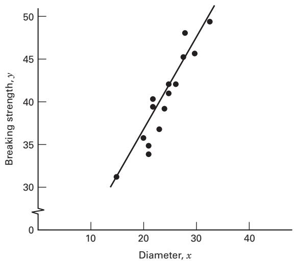
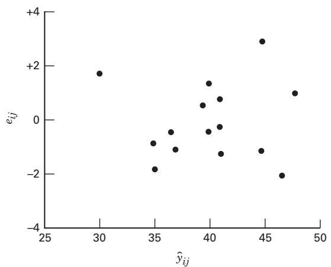
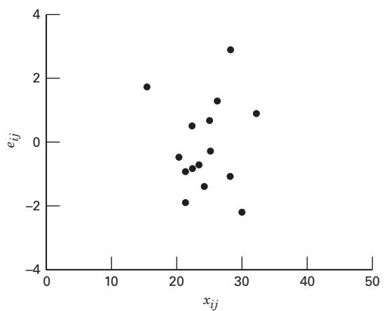
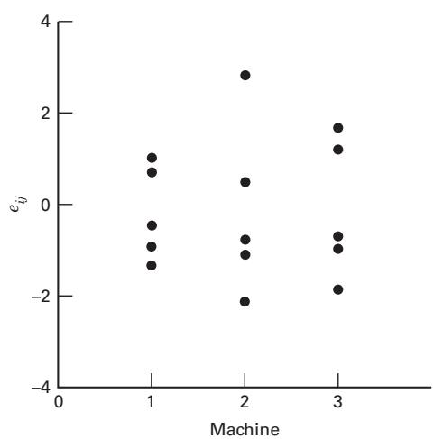
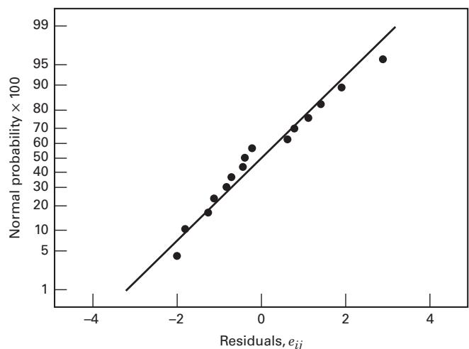
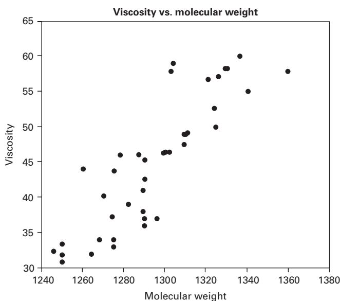
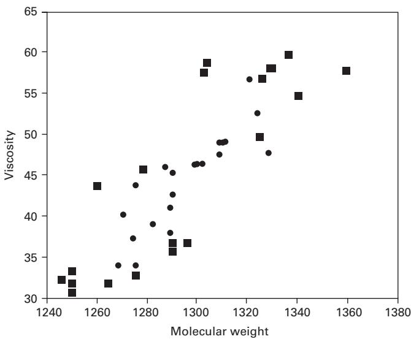

## 15.3 The Analysis of Covariance

In Chapters 2 and 4, we introduced the use of the blocking principle to improve the precision with which comparisons between treatments are made. The paired t-test was the procedure illustrated in Chapter 2, and the randomized block design was presented in Chapter 4. In general, the blocking principle can be used to eliminate the effect of controllable nuisance factors. The analysis of covariance (ANCOVA) is another technique that is occasionally useful for improving the precision of an experiment. Suppose that in an experiment with a response variable y there is anothe variable say x and that y is linearly related to x Furthermore suppose that x cannot be controlled by the experi menter but can be observed along with y. The variable x is called a covariate or concomitant variable. The analysis of covariance involves adjusting the observed response variable for the effect of the concomitant variable. If such an adjustment is not performed, the concomitant variable could inflate the error mean square and make true differences in the response due to treatments harder to detect. Thus, the analysis of covariance is a method of adjusting for the effects of an uncontrollable nuisance variable. As we will see, the procedure is a combination of analysis of variance and regression analysis.

As an example of an experiment in which the analysis of covariance may be employed, consider a study performed to determine if there is a difference in the strength of a monofilament fiber produced by three different machines. The data from this experiment are shown in Table 15.10. Figure 15.3 presents a scatter diagram of strength

## TABLE 15.10

Breaking Strength Data (y = Strength in Pounds and x = Diameter in $1 0 ^ { - 3 }$ in.)

<table><tr><td colspan="2">Machine 1</td><td colspan="2">Machine 2</td><td colspan="2">Machine 3</td></tr><tr><td>y</td><td>x</td><td>y</td><td>x</td><td>y</td><td>x</td></tr><tr><td>36</td><td>20</td><td>40</td><td>22</td><td>35</td><td>21</td></tr><tr><td>41</td><td>25</td><td>48</td><td>28</td><td>37</td><td>23</td></tr><tr><td>39</td><td>24</td><td>39</td><td>22</td><td>42</td><td>26</td></tr><tr><td>42</td><td>25</td><td>45</td><td>30</td><td>34</td><td>21</td></tr><tr><td>49</td><td>32</td><td>44</td><td>28</td><td>32</td><td>15</td></tr><tr><td>207</td><td>126</td><td>216</td><td>130</td><td>180</td><td>106</td></tr></table>

  
FIGURE 15.3 Breaking strength (y) versus fiber diameter (x)  
(y) versus the diameter (or thickness) of the sample. Clearly, the strength of the fiber is also affected by its thickness; consequently, a thicker fiber will generally be stronger than a thinner one. The analysis of covariance could be used to remove the effect of thickness (x) on strength (y) when testing for differences in strength between machines

## 15.3.1 Description of the Procedure

The basic procedure for the analysis of covariance is now described and illustrated for a single-factor experiment with one covariate. Assuming that there is a linear relationship between the response and the covariate, we find that an appropriate statistical model is

$$
y _ {i j} = \mu + \tau_ {i} + \beta (x _ {i j} - \overline {{x}} _ {\cdot \cdot}) + \epsilon_ {i j} \left\{ \begin{array}{l l} i = 1, 2, \ldots , a \\ j = 1, 2, \ldots , n \end{array} \right.\tag{15.15}
$$

where $y _ { i j }$ is the jth observation on the response variable taken under the ith treatment or level of the single factor, $x _ { i j }$ is the measurement made on the covariate or concomitant variable corresponding to $y _ { i j }$ (i.e., the ijth run), ${ \overline { { x } } } _ { \ast }$ is the mean of the $x _ { i j }$ values, $\mu$ is an overall mean, $\tau _ { i }$ is the effect of the ith treatment, $\beta$ is a linear regression coefficient indicating the dependency of $y _ { i j }$ on $x _ { i j } ,$ , and $\epsilon _ { i j }$ is a random error component. We assume that the errors $\epsilon _ { i j }$ are $\mathrm { N I D } ( 0 , \sigma ^ { 2 } )$ ), that the slope $\beta \neq 0$ and the true relationship between $y _ { i j }$ and $x _ { i j }$ is linear, that the regression coefficients for each treatment are identical, that the treatment effects sum to zero $\dot { ( \Sigma _ { i = 1 } ^ { a } \tau _ { i } = 0 ) }$ , and that the concomitant variable $x _ { i j }$ is not affected by the treatments.

This model assumes that all treatment regression lines have identical slopes. If the treatments interact with the covariates, this can result in nonidentical slopes. Covariance analysis is not appropriate in these cases. Estimating and comparing different regression models is the correct approach.

Equation 15.15 assumes a linear relationship between y and x. However, any other relationship such as a quadratic (for example) could be used.

Notice from Equation 15.15 that the analysis of covariance model is a combination of the linear models employed in analysis of variance and regression. That is, we have treatment effects $\{ \tau _ { i } \}$ as in a single-factor analysis of variance and a regression coefficient $\beta$ as in a regression equation. The concomitant variable in Equation 15.15 is expressed as $( x _ { i j } - \overline { { x } } _ { \cdots } )$ instead of $x _ { i j }$ so that the parameter $\mu$ is preserved as the overall mean. The model could have been written as

$$
y _ {i j} = \mu^ {\prime} + \tau_ {i} + \beta x _ {i j} + \epsilon_ {i j} \left\{ \begin{array}{l l} i = 1, 2, \ldots , a \\ j = 1, 2, \ldots , n \end{array} \right.\tag{15.16}
$$

where $\mu ^ { \prime }$ is a constant not equal to the overall mean, which for this model is $\mu ^ { \prime } + \beta \overline { { x } } .$ . Equation 15.15 is more widely found in the literature

To describe the analysis, we introduce the following notation:

$$
S _ {y y} = \sum_ {i = 1} ^ {a} \sum_ {j = 1} ^ {n} (y _ {i j} - \bar {y} _ {\cdot \cdot}) ^ {2} = \sum_ {i = 1} ^ {a} \sum_ {j = 1} ^ {n} y _ {i j} ^ {2} - \frac {y _ {\cdot \cdot} ^ {2}}{a n}\tag{15.17}
$$

$$
S _ {x x} = \sum_ {i = 1} ^ {a} \sum_ {j = 1} ^ {n} (x _ {i j} - \bar {x} _ {\cdot \cdot}) ^ {2} = \sum_ {i = 1} ^ {a} \sum_ {j = 1} ^ {n} x _ {i j} ^ {2} - \frac {x _ {\cdot \cdot} ^ {2}}{a n}\tag{15.18}
$$

$$
S _ {x y} = \sum_ {i = 1} ^ {a} \sum_ {j = 1} ^ {n} (x _ {i j} - \overline {{x}} _ {\cdot \cdot}) (y _ {i j} - \overline {{y}} _ {\cdot \cdot}) = \sum_ {i = 1} ^ {a} \sum_ {j = 1} ^ {n} x _ {i j} y _ {i j} - \frac {(x _ {\cdot \cdot}) (y _ {\cdot \cdot})}{a n}\tag{15.19}
$$

$$
T _ {y y} = n \sum_ {i = 1} ^ {a} (\overline {{y}} _ {i \cdot} - \overline {{y}} _ {\cdot \cdot}) ^ {2} = \frac {1}{n} \sum_ {i = 1} ^ {a} y _ {i \cdot} ^ {2} - \frac {y _ {\cdot \cdot} ^ {2}}{a n}\tag{15.20}
$$

$$
T _ {x x} = n \sum_ {i = 1} ^ {a} (\overline {{x}} _ {i \cdot} - \overline {{x}} _ {\cdot \cdot}) ^ {2} = \frac {1}{n} \sum_ {i = 1} ^ {a} x _ {i \cdot} ^ {2} - \frac {x _ {\cdot \cdot} ^ {2}}{a n}\tag{15.21}
$$

$$
T _ {x y} = n \sum_ {i = 1} ^ {a} (\overline {{x}} _ {i.} - \overline {{x}} _ {..}) (\overline {{y}} _ {i.} - \overline {{y}} _ {..}) = \frac {1}{n} \sum_ {i = 1} ^ {a} (x _ {i.}) (y _ {i.}) - \frac {(x _ {. .}) (y _ {. .})}{a n}\tag{15.22}
$$

$$
E _ {y y} = \sum_ {i = 1} ^ {a} \sum_ {j = 1} ^ {n} (y _ {i j} - \overline {{y}} _ {i.}) ^ {2} = S _ {y y} - T _ {y y}\tag{15.23}
$$

$$
E _ {x x} = \sum_ {i = 1} ^ {a} \sum_ {j = 1} ^ {n} (x _ {i j} - \overline {{x}} _ {i.}) ^ {2} = S _ {x x} - T _ {x x}\tag{15.24}
$$

$$
E _ {x y} = \sum_ {i = 1} ^ {a} \sum_ {j = 1} ^ {n} (x _ {i j} - \overline {{x}} _ {i.}) (y _ {i j} - \overline {{y}} _ {i.}) = S _ {x y} - T _ {x y}\tag{15.25}
$$

Note that, in general, $S = T + E ,$ , where the symbols S, T, and E are used to denote sums of squares and cross products for total, treatments, and error, respectively. The sums of squares for x and $y$ must be nonnegative; however, the sums of cross products (xy) may be negative.

We now show how the analysis of covariance adjusts the response variable for the effect of the covariate. Consider the full model (Equation 15.15). The least squares estimators of $\mu , \tau _ { i }$ , and $\beta$ are $\hat { \mu } = \overline { { y } } _ { \ldots } , \hat { \tau } _ { i } = \overline { { y } } _ { i \cdot } - \overline { { y } } _ { \ldots } - \hat { \beta } ( \overline { { x } } _ { i \cdot } - \overline { { x } } _ { \ldots } )$ , and

$$
\hat {\beta} = \frac {E _ {x y}}{E _ {x x}}\tag{15.26}
$$

The error sum of squares in this model is

$$
S S _ {E} = E _ {y y} - (E _ {x y}) ^ {2} / E _ {x x}\tag{15.27}
$$

with $a ( n - 1 ) - 1$ degrees of freedom. The experimental error variance is estimated by

$$
M S _ {E} = \frac {S S _ {E}}{a (n - 1) - 1}
$$

Now suppose that there is no treatment effect. The model (Equation 15.15) would then be

$$
y _ {i j} = \mu + \beta (x _ {i j} - \overline {{x}} _ {\cdot \cdot}) + \epsilon_ {i j}\tag{15.28}
$$

and it can be shown that the least squares estimators of $\mu$ and $\beta$ are ${ \hat { \mu } } = { \overline { { y } } } .$ <sub>••</sub> and $\hat { \beta } = S _ { x y } / S _ { x x }$ . The sum of squares for error in this reduced model is

$$
S S _ {E} ^ {\prime} = S _ {y y} - (S _ {x y}) ^ {2} / S _ {x x}\tag{15.29}
$$

with $a n - 2$ degrees of freedom. In Equation 15.29, the quantity $( S _ { x y } ) ^ { 2 } / S _ { x x }$ is the reduction in the sum of squares of y obtained through the linear regression of y on x. Furthermore, note that $S S _ { E }$ is smaller than $S S _ { E } ^ { \prime }$ [because the mode (Equation 15.15) contains additional parameters $\{ \tau _ { i } \} ]$ and that the quantity $S S _ { E } ^ { \prime } - S S _ { E }$ is a reduction in sum of squares due to the $\{ \tau _ { i } \}$ . Therefore, the difference between $S S _ { E } ^ { \prime }$ and $S S _ { E }$ , that is, $S S _ { E } ^ { \prime } - S S _ { E } ,$ , provides a sum of squares with $a - 1$ degrees of freedom for testing the hypothesis of no treatment effects. Consequently, to test $\begin{array} { r } { H _ { 0 } \colon \tau _ { i } = 0 } \end{array}$ , compute

$$
F _ {0} = \frac {(S S _ {E} ^ {\prime} - S S _ {E}) / (a - 1)}{S S _ {E} / [ a (n - 1) - 1 ]}\tag{15.30}
$$

which, if the null hypothesis is true, is distributed as $F _ { a - 1 , a ( n - 1 ) - 1 }$ . Thus, we reject $H _ { 0 } \colon \tau _ { i } = 0 \mathrm { i f } F _ { 0 } > F _ { \alpha , a - 1 , a ( n - 1 ) - 1 } .$ The P-value approach could also be used.

It is instructive to examine the display in Table 15.11. In this table we have presented the analysis of covariance as an “adjusted” analysis of variance. In the source of variation column, the total variability is measured by $S _ { y y }$ with $a n - 1$ degrees of freedom. The source of variation “regression” has the sum of squares $( S _ { x y } ) ^ { 2 } / S _ { x x }$ with one degree of freedom. If there were no concomitant variable, we would have $S _ { x y } = S _ { x x } = E _ { x y } = E _ { x x } = 0$ . Then the sum of squares for error would be simply $E _ { y y }$ and the sum of squares for treatments would be $\dot { S _ { y y } } - E _ { y y } = T _ { y y }$ . However, because of the presence of the concomitant variable, we must “adjust” $S _ { y y }$ and $E _ { y y }$ for the regression of y on x as shown in Table 15.11. The adjusted error sum of squares has $a ( n - 1 ) - 1$ degrees of freedom instead of $a ( n - 1 )$ ) degrees of freedom because an additional parameter (the slope $\beta )$ is fitted to the data.

Manual computations are usually displayed in an analysis of covariance table such as Table 15.12. This layout is employed because it conveniently summarizes all the required sums of squares and cross products as well as the sums of squares for testing hypotheses about treatment effects. In addition to testing the hypothesis that there are no differences in the treatment effects, we frequently find it useful in interpreting the data to present the adjusted treatment means. These adjusted means are computed according to

$$
\mathrm{Adjusted} \overline {{y}} _ {i.} = \overline {{y}} _ {i.} - \hat {\beta} (\overline {{x}} _ {i.} - \overline {{x}} _ {..}) \quad i = 1, 2, \ldots , a\tag{15.31}
$$

where $\hat { \beta } = E _ { x y } / E _ { x x }$ . This adjusted treatment mean is the least squares estimator o $\mu + \tau _ { i } , i = 1 , 2 , \ldots , a .$ , in the model (Equation 15.15). The standard error of any adjusted treatment mean is

$$
S _ {\mathrm{adj} \overline {{y}} _ {i \cdot}} = \left[ M S _ {E} \left(\frac {1}{n} + \frac {(\overline {{x}} _ {i \cdot} - \overline {{x}} _ {\cdot \cdot}) ^ {2}}{E _ {x x}}\right) \right] ^ {1 / 2}\tag{15.32}
$$

## TABLE 15.11

Analysis of Covariance as an “Adjusted” Analysis of Variance

<table><tr><td>Source of Variation</td><td>Sum of Squares</td><td>Degrees of Freedom</td><td>Mean Square</td><td> $F_0$ </td></tr><tr><td>Regression</td><td> $(S_{xy})^2/S_{xx}$ </td><td>1</td><td></td><td></td></tr><tr><td>Treatments</td><td> $SS_E' - SS_E = S_{yy} - (S_{xy})^2/S_{xx} - [E_{yy} - (E_{xy})^2/E_{xx}]$ </td><td>a-1</td><td> $\frac{SS_E' - SS_E}{a-1}$ </td><td> $\frac{(SS_E' - SS_E)/(a-1)}{MS_E}$ </td></tr><tr><td>Error</td><td> $SS_E = E_{yy} - (E_{xy})^2/E_{xx}$ </td><td>a(n-1)-1</td><td> $MS_E = \frac{SS_E}{a(n-1)-1}$ </td><td></td></tr><tr><td>Total</td><td> $S_{yy}$ </td><td>an-1</td><td></td><td></td></tr></table>

## TABLE 15.12

Analysis of Covariance for a Single-Factor Experiment with One Covariate

<table><tr><td rowspan="2">Source of Variation</td><td rowspan="2">Degrees of Freedom</td><td colspan="3">Sums of Squares and Products</td><td colspan="3">Adjusted for Regression</td></tr><tr><td>x</td><td>xy</td><td>y</td><td>y</td><td>Degrees of Freedom</td><td>Mean Square</td></tr><tr><td>Treatments</td><td>a-1</td><td> $T_{xx}$ </td><td> $T_{xy}$ </td><td> $T_{yy}$ </td><td></td><td></td><td></td></tr><tr><td>Error</td><td>a(n-1)</td><td> $E_{xx}$ </td><td> $E_{xy}$ </td><td> $E_{yy}$ </td><td> $SS_E = E_{yy} - (E_{xy})^2 / E_{xx}$ </td><td>a(n-1)-1</td><td> $MS_E = \frac{SS_E}{a(n-1)-1}$ </td></tr><tr><td>Total</td><td>an-1</td><td> $S_{xx}$ </td><td> $S_{xy}$ </td><td> $S_{yy}$ </td><td> $SS'_E = S_{yy} - (S_{xy})^2 / S_{xx}$ </td><td>an-2</td><td></td></tr><tr><td colspan="5">Adjusted treatments</td><td> $SS'_E - SS_E$ </td><td>a-1</td><td> $\frac{SS'_E - SS_E}{a-1}$ </td></tr></table>

Finally, we recall that the regression coefficient $\beta$ in the model (Equation 15.15) has been assumed to be nonzero. W may test the hypothesis $H _ { 0 } \colon \beta = 0$ by using the test statistic

$$
F _ {0} = \frac {(E _ {x y}) ^ {2} / E _ {x x}}{M S _ {E}}
$$

which under the null hypothesis is distributed as $F _ { 1 , a ( n - 1 ) - 1 }$ . Thus, we reject $H _ { 0 } \colon \beta = 0 \mathrm { i f } F _ { 0 } > F _ { \alpha , 1 , a ( n - 1 ) - 1 } .$

(15.33)

## EXAMPLE 15.5

Consider the experiment described at the beginning of Section 15.3. Three different machines produce a monofilament fiber for a textile company. The process engineer is interested in determining if there is a difference in the breaking strength o the fiber produced by the three machines. However, the strength of a fiber is related to its diameter, with thicker fibers being generally stronger than thinner ones. A random sample of five fiber specimens is selected from each machine. The fiber strength (y) and the corresponding diameter (x) for each specimen are shown in Table 15.10.

The scatter diagram of breaking strength versus the fiber diameter (Figure 15.3) shows a strong suggestion of a linear relationship between breaking strength and diameter, and it seems appropriate to remove the effect of diameter on strength by an analysis of covariance. Assuming that a linear relationship between breaking strength and diameter is appropriate, we see that the model is

$$
y _ {i j} = \mu + \tau_ {i} + \beta (x _ {i j} - \overline {{x}} _ {\cdot \cdot}) + \epsilon_ {i j} \quad \left\{ \begin{array}{c} i = 1, 2, 3 \\ j = 1, 2, \ldots , 5 \end{array} \right.
$$

Using Equations 15.17 through 15.25, we may compute

$$
S _ {y y} = \sum_ {i = 1} ^ {3} \sum_ {j = 1} ^ {5} y _ {i j} ^ {2} - \frac {y _ {\cdot \cdot} ^ {2}}{a n} = (3 6) ^ {2} + (4 1) ^ {2} + \dots + (3 2) ^ {2} - \frac {(6 0 3) ^ {2}}{(3) (5)} = 3 4 6. 4 0
$$

$$
S _ {x x} = \sum_ {i = 1} ^ {3} \sum_ {j = 1} ^ {5} x _ {i j} ^ {2} - \frac {x _ {\cdot \cdot} ^ {2}}{a n} = (2 0) ^ {2} + (2 5) ^ {2} + \dots + (1 5) ^ {2} - \frac {(3 6 2) ^ {2}}{(3) (5)} = 2 6 1. 7 3
$$

$$
S _ {x y} = \sum_ {i = 1} ^ {3} \sum_ {j = 1} ^ {5} x _ {i j} y _ {i j} - \frac {(x _ {\cdot \cdot}) (y _ {\cdot \cdot})}{a n} = (2 0) (3 6) + (2 5) (4 1) + \dots + (1 5) (3 2) - \frac {(3 6 2) (6 0 3)}{(3) (5)} = 2 8 2. 6 0
$$

$$
T _ {y y} = \frac {1}{n} \sum_ {i = 1} ^ {3} y _ {i \cdot} ^ {2} - \frac {y _ {\cdot \cdot} ^ {2}}{a n} = \frac {1}{5} [ (2 0 7) ^ {2} + (2 1 6) ^ {2} + (1 8 0) ^ {2} ] - \frac {(6 0 3) ^ {2}}{(3) (5)} = 1 4 0. 4 0
$$

$$
T _ {x x} = \frac {1}{n} \sum_ {i = 1} ^ {3} x _ {i \cdot} ^ {2} - \frac {x _ {\cdot \cdot} ^ {2}}{a n} = \frac {1}{5} [ (1 2 6) ^ {2} + (1 3 0) ^ {2} + (1 0 6) ^ {2} ] - \frac {(3 6 2) ^ {2}}{(3) (5)} = 6 6. 1 3
$$

$$
T _ {x y} = \frac {1}{n} \sum_ {i = 1} ^ {3} x _ {i}. y _ {i}. - \frac {(x . . .) (y . . .)}{a n} = \frac {1}{5} [ (1 2 6) (2 0 7) + (1 3 0) (2 1 6) + (1 0 6) (1 8 4) ] - \frac {(3 6 2) (6 0 3)}{(3) (5)} = 9 6. 0 0
$$

$$
E _ {y y} = S _ {y y} - T _ {y y} = 3 4 6. 4 0 - 1 4 0. 4 0 = 2 0 6. 0 0
$$

$$
E _ {x x} = S _ {x x} - T _ {x x} = 2 6 1. 7 3 - 6 6. 1 3 = 1 9 5. 6 0
$$

$$
E _ {x y} = S _ {x y} - T _ {x y} = 2 8 2. 6 0 - 9 6. 0 0 = 1 8 6. 6 0
$$

From Equation 15.29, we find

$$
\begin{array}{r l} S S _ {E} ^ {\prime} & = S _ {y y} - (S _ {x y}) ^ {2} / S _ {x x} \\ & = 3 4 6. 4 0 - (2 8 2. 6 0) ^ {2} / 2 6 1. 7 3 \\ & = 4 1. 2 7 \end{array}
$$

with $a n - 2 = ( 3 ) ( 5 ) - 2 = 1 3$ degrees of freedom; and from Equation 15.27, we find

$$
\begin{array}{r l} S S _ {E} & = E _ {y y} - (E _ {x y}) ^ {2} / E _ {x x} \\ & = 2 0 6. 0 0 - (1 8 6. 6 0) ^ {2} / 1 9 5. 6 0 \\ & = 2 7. 9 9 \end{array}
$$

with $a ( n - 1 ) - 1 = 3 ( 5 - 1 ) - 1 = 1 1$ degrees of freedom.

## TABLE 15.13

Analysis of Covariance for the Breaking Strength Data

<table><tr><td rowspan="2">Source of Variation</td><td rowspan="2">Degrees of Freedom</td><td colspan="3">Sums of Squares and Products</td><td colspan="3">Adjusted for Regression</td><td rowspan="2"> $F_0$ </td><td rowspan="2">P-Value</td></tr><tr><td>x</td><td>xy</td><td>y</td><td>y</td><td>Degrees of Freedom</td><td>Mean Square</td></tr><tr><td>Machines</td><td>2</td><td>66.13</td><td>96.00</td><td>140.40</td><td></td><td></td><td></td><td></td><td></td></tr><tr><td>Error</td><td>12</td><td>195.60</td><td>186.60</td><td>206.00</td><td>27.99</td><td>11</td><td>2.54</td><td></td><td></td></tr><tr><td>Total</td><td>14</td><td>261.73</td><td>282.60</td><td>346.40</td><td>41.27</td><td>13</td><td></td><td></td><td></td></tr><tr><td>Adjusted machines</td><td></td><td></td><td></td><td></td><td>13.28</td><td>2</td><td>6.64</td><td>2.61</td><td>0.1181</td></tr></table>

The sum of squares for testing $H _ { 0 } \colon \tau _ { 1 } = \tau _ { 2 } = \tau _ { 3 } = 0$ is

$$
\begin{array}{r} S S _ {E} ^ {\prime} - S S _ {E} = 4 1. 2 7 - 2 7. 9 9 \\ = 1 3. 2 8 \end{array}
$$

with $a - 1 = 3 - 1 = 2$ degrees of freedom. These calculations are summarized in Table 15.13.

To test the hypothesis that machines differ in the breaking strength of fiber produced, that is, $H _ { 0 } \colon \tau _ { i } = 0 .$ , we compute the test statistic from Equation 15.30 as

$$
\begin{array}{c} F _ {0} = \frac {(S S _ {E} ^ {\prime} - S S _ {E}) / (a - 1)}{S S _ {E} / [ a (n - 1) - 1 ]} \\ = \frac {1 3 . 2 8 / 2}{2 7 . 9 9 / 1 1} = \frac {6 . 6 4}{2 . 5 4} = 2. 6 1 \end{array}
$$

Comparing this to $F _ { 0 . 1 0 , 2 , 1 1 } = 2 . 8 6 .$ , we find that the null hypothesis cannot be rejected. The P-value of this test statistic is 0.1181. Thus, there is no strong evidence that the fibers produced by the three machines differ in breaking strength.

The estimate of the regression coefficient is computed from Equation 15.26 as

$$
\hat {\beta} = \frac {E _ {x y}}{E _ {x x}} = \frac {1 8 6 . 6 0}{1 9 5 . 6 0} = 0. 9 5 4 0
$$

We may test the hypothesis $H _ { 0 } \colon \beta = 0$ by using Equation 15.33. The test statistic is

$$
F _ {0} = \frac {(E _ {x y}) ^ {2} / E _ {x x}}{M S _ {E}} = \frac {(1 8 6 . 6 0) ^ {2} / 1 9 5 . 6 0}{2 . 5 4} = 7 0. 0 8
$$

and because $F _ { 0 . 0 1 , 1 , 1 1 } = 9 . 6 5$ , we reject the hypothesis that $\beta = 0$ . Therefore, there is a linear relationship between breaking strength and diameter, and the adjustment provided by the analysis of covariance was necessary.

The adjusted treatment means may be computed from Equation 15.31. These adjusted means are

$$
\begin{array}{r l} \text { Adjusted } \overline {{y}} _ {1.} & = \overline {{y}} _ {1.} - \hat {\beta} (\overline {{x}} _ {1.} - \overline {{x}} _ {..}) \\ & = 4 1. 4 0 - (0. 9 5 4 0) (2 5. 2 0 - 2 4. 1 3) = 4 0. 3 8 \end{array}
$$

$$
\begin{array}{r l} \text { Adjusted } \overline {{y}} _ {2.} & = \overline {{y}} _ {2.} - \hat {\beta} (\overline {{x}} _ {2.} - \overline {{x}} _ {..}) \\ & = 4 3. 2 0 - (0. 9 5 4 0) (2 6. 0 0 - 2 4. 1 3) = 4 1. 4 2 \end{array}
$$

and

$$
\begin{array}{r l} \text { Adjusted } \overline {{y}} _ {3.} & = \overline {{y}} _ {3.} - \hat {\beta} (\overline {{x}} _ {3.} - \overline {{x}} _ {..}) \\ & = 3 6. 0 0 - (0. 9 5 4 0) (2 1. 2 0 - 2 4. 1 3) = 3 8. 8 0 \end{array}
$$

Comparing the adjusted treatment means with the unadjusted treatment means (the $\overline { { y } } _ { i \bullet } )$ , we note that the adjusted means are much closer together, another indication that the covariance analysis was necessary.

A basic assumption in the analysis of covariance is that the treatments do not influence the covariate x because the technique removes the effect of variations in the $\overline { { x } } _ { i \cdot }$ . However, if the variability in the $\overline { { x } } _ { i \cdot }$ is due in part to the treatments, then analysis o covariance removes part of the treatment effect. Thus, we must be reasonably sure that the treatments do not affect the values $x _ { i j } .$ . In some experiments this may be obvious from the nature of the covariate, whereas in others it may be more doubtful. In our example, there may be a difference in fiber diameter $( x _ { i j } )$ between the three machines. In such cases, Cochran and Cox (1957) suggest that an analysis of variance on the $x _ { i j }$ values may be helpful in determining the validity of this assumption. For our problem, this procedure yields

$$
F _ {0} = \frac {6 6 . 1 3 / 2}{1 9 5 . 6 0 / 1 2} = \frac {3 3 . 0 7}{1 6 . 3 0} = 2. 0 3
$$

which is less than $F _ { 0 . 1 0 , 2 , 1 2 } = 2 . 8 1$ , so there is no reason to believe that machines produce fibers of different diameters.

Diagnostic checking of the covariance model is based on residual analysis. For the covariance model, the residuals are

$$
e _ {i j} = y _ {i j} - \hat {y} _ {i j}
$$

where the fitted values are

$$
\begin{array}{r} \hat {y} _ {i j} = \hat {\mu} + \hat {\tau} _ {i} + \hat {\beta} (x _ {i j} - \overline {{x}} _ {\cdot \cdot}) = \overline {{y}} _ {\cdot \cdot} + [ \overline {{y}} _ {i \cdot} - \overline {{y}} _ {\cdot \cdot} - \hat {\beta} (\overline {{x}} _ {i \cdot} - \overline {{x}} _ {\cdot \cdot}) ] \\ + \hat {\beta} (x _ {i j} - \overline {{x}} _ {\cdot \cdot}) = \overline {{y}} _ {i \cdot} + \hat {\beta} (x _ {i j} - \overline {{x}} _ {i \cdot}) \end{array}
$$

Thus,

$$
e _ {i j} = y _ {i j} - \overline {{y}} _ {i \cdot} - \hat {\beta} (x _ {i j} - \overline {{x}} _ {i \cdot})\tag{15.34}
$$

To illustrate the use of Equation 15.34, the residual for the first observation from the first machine in Example 15.5 is

$$
\begin{array}{r l} & e _ {1 1} = y _ {1 1} - \overline {{y}} _ {1.} - \hat {\beta} (x _ {1 1} - \overline {{x}} _ {1.}) = 3 6 - 4 1. 4 - (0. 9 5 4 0) (2 0 - 2 5. 2) \\ & \quad = 3 6 - 3 6. 4 3 9 2 = - 0. 4 3 9 2 \end{array}
$$

A complete listing of observations, fitted values, and residuals is given in the following table:

<table><tr><td>Observed Value,  $y_{ij}$ </td><td>Fitted Value,  $\hat{y}_{ij}$ </td><td>Residual,  $e_{ij} = y_{ij} - \hat{y}_{ij}$ </td></tr><tr><td>36</td><td>36.4392</td><td>-0.4392</td></tr><tr><td>41</td><td>41.2092</td><td>-0.2092</td></tr><tr><td>39</td><td>40.2552</td><td>-1.2552</td></tr><tr><td>42</td><td>41.2092</td><td>0.7908</td></tr><tr><td>49</td><td>47.8871</td><td>1.1129</td></tr><tr><td>40</td><td>39.3840</td><td>0.6160</td></tr><tr><td>48</td><td>45.1079</td><td>2.8921</td></tr><tr><td>39</td><td>39.3840</td><td>-0.3840</td></tr><tr><td>45</td><td>47.0159</td><td>-2.0159</td></tr><tr><td>44</td><td>45.1079</td><td>-1.1079</td></tr><tr><td>35</td><td>35.8092</td><td>-0.8092</td></tr><tr><td>37</td><td>37.7171</td><td>-0.7171</td></tr><tr><td>42</td><td>40.5791</td><td>1.4209</td></tr><tr><td>34</td><td>35.8092</td><td>-1.8092</td></tr><tr><td>32</td><td>30.0852</td><td>1.9148</td></tr></table>

The residuals are plotted versus the fitted values $\hat { y } _ { i j }$ in Figure 15.4, versus the covariate $x _ { i j }$ in Figure 15.5 and versus the machines in Figure 15.6. A normal probability plot of the residuals is shown in Figure 15.7. These plots do not reveal any major departures from the assumptions, so we conclude that the covariance model (Equation 15.15) is appropriate for the breaking strength data.

It is interesting to note what would have happened in this experiment if an analysis of covariance had not been per formed, that is, if the breaking strength data (y) had been analyzed as a completely randomized single-factor experiment in which the covariate x was ignored. The analysis of variance of the breaking strength data is shown in Table 15.14. We immediately notice that the error estimate is much longer in the CRD analysis (17.17 versus 2.54). This is a reflection of the effectiveness of analysis of covariance in reducing error variability. We would also conclude, based on the CRD analysis, that machines differ significantly in the strength of fiber produced. This is exactly opposite the conclu sion reached by the covariance analysis. If we suspected that the machines differed significantly in their effect on fibe strength, then we would try to equalize the strength output of the three machines. However, in this problem the machines do not differ in the strength of fiber produced after the linear effect of fiber diameter is removed. It would be helpful to reduce the within-machine fiber diameter variability because this would probably reduce the strength variability in the fiber.

  
FIGURE 15.4 Plot of residuals versus fitted values for Example 15.5

  
FIGURE 15.5 Plot of residuals versus fiber diameter x for Example 15.5

  
FIGURE 15.6 Plot of residuals versus machine

  
FIGURE 15.7 Normal probability plot of residuals from Example 15.5

TABLE 15.14  
Incorrect Analysis of the Breaking Strength Data as a Single-Factor Experiment

<table><tr><td>Source of Variation</td><td>Sum of Squares</td><td>Degrees of Freedom</td><td>Mean Square</td><td> $F_0$ </td><td>P-Value</td></tr><tr><td>Machines</td><td>140.40</td><td>2</td><td>70.20</td><td>4.09</td><td>0.0442</td></tr><tr><td>Error</td><td>206.00</td><td>12</td><td>17.17</td><td></td><td></td></tr><tr><td>Total</td><td>346.40</td><td>14</td><td></td><td></td><td></td></tr></table>

Analysis of Covariance as an Alternative to Blocking In some situations, the experimenter may have a choice between either running a completely randomized design with a covariate or running a randomized block design with the covariate used in some fashion to form the blocks. If the relationship between the covariate and the response is really well-approximated by a straight line and that is the form of the covariance model that the experimente chooses, then either of these approaches is about equally effective. However, if the relationship isn’t linear and a linear model is assumed, the analysis of covariance will be outperformed in error reduction by the randomized block design. Randomized block designs do not make any explicit assumptions about relationships between the nuisance variables (covariates) and the response. Generally, a randomized block design will have fewer degrees if freedom fo error than a covariance model but the resulting loss of statistical power is usually quite small

## 15.3.2 Computer Solution

Several computer software packages now available can perform the analysis of covariance. The output from the Minitab General Linear Models procedure for the data in Example 15.4 is shown in Table 15.15. This output is very similar to

## TABLE 15.15

Minitab Output (Analysis of Covariance) for Example 15.5

```csv
General Linear Model
Factor Type Levels Values
Machine fixed 3 1 2 3
Analysis of Variance for Strength, using Adjusted SS for Tests
Source DF Seq SS Adj SS Adj MS F P
Diameter 1 305.13 178.01 178.01 69.97 0.000
Machine 2 13.28 13.28 6.64 2.61 0.118
Error 11 27.99 27.99 2.54
Total 14 346.40
Term Coef Std. Dev. T P
Constant 17.177 2.783 6.17 0.000
Diameter 0.9540 0.1140 8.36 0.000
Machine
1 0.1824 0.5950 0.31 0.765
2 1.2192 0.6201 1.97 0.075
Means for Covariates
Covariate Mean Std. Dev.
Diameter 24.13 4.324
Least Squares Means for Strength
Machine Mean Std. Dev.
1 40.38 0.7236
2 41.42 0.7444
3 38.80 0.7879
```

those presented previously. In the section of the output entitled “Analysis of Variance,” the “Seq ${ \bf S } { \bf S } '$ correspond to a “sequential” partitioning of the overall model sum of squares, say

$$
\begin{array}{r l} S S (\text { Model }) & = S S (\text { Diameter }) + S S (\text { Machine } | \text { Diameter }) \\ & = 3 0 5. 1 3 + 1 3. 2 8 \\ & = 3 1 8. 4 1 \end{array}
$$

whereas the “Adj SS” corresponds to the “extra” sum of squares for each factor, that is,

$$
S S (\text { Machine } | \text { Diameter }) = 1 3. 2 8
$$

and

$$
S S (\text { Diameter } | \text { Machine }) = 1 7 8. 0 1
$$

Note that SS (Machine|Diameter) is the correct sum of squares to use for testing for no machine effect, and SS (Diameter|Machine) is the correct sum of squares to use for testing the hypothesis that $\beta = 0$ . The test statistics in Table 15.15 differ slightly from those computed manually because of rounding.

The program also computes the adjusted treatment means from Equation 15.31 (Minitab refers to those as least squares means on the sample output) and the standard errors. The program will also compare all pairs of treatmen means using the pairwise multiple comparison procedures discussed in Chapter 3.

## 15.3.3 Development by the General Regression Significance Test

It is possible to develop formally the ANCOVA procedure for testing $H _ { 0 } \colon \tau _ { i } = 0$ in the covariance model

$$
y _ {i j} = \mu + \tau_ {i} + \beta (x _ {i j} - \overline {{x}} _ {\cdot \cdot}) + \epsilon_ {i j} \quad \left\{ \begin{array}{l} i = 1, 2, \ldots , a \\ j = 1, 2, \ldots , n \end{array} \right.\tag{15.35}
$$

using the general regression significance test. Consider estimating the parameters in the model (Equation 15.15) by least squares. The least squares function is

$$
L = \sum_ {i = 1} ^ {a} \sum_ {j = 1} ^ {n} [ y _ {i j} - \mu - \tau_ {i} - \beta (x _ {i j} - \overline {{x}} _ {\cdot \cdot}) ] ^ {2}\tag{15.36}
$$

and from $\partial L / \partial \mu = \partial L / \partial \tau _ { i } = \partial L / \partial \beta = 0$ , we obtain the normal equations

$$
\mu \colon a n \hat {\mu} + n \sum_ {i = 1} ^ {a} \hat {\tau} _ {i} = y..\tag{15.37a}
$$

$$
\tau_ {i} \colon n \hat {\mu} + n \hat {\tau} _ {i} + \hat {\beta} \sum_ {j = 1} ^ {n} (x _ {i j} - \overline {{x}} _ {\cdot \cdot}) = y _ {i}. \quad i = 1, 2, \dots , a\tag{15.37b}
$$

$$
\beta \colon \sum_ {i = 1} ^ {a} \hat {\tau} _ {i} \sum_ {j = 1} ^ {n} (x _ {i j} - \overline {{x}} _ {\cdot \cdot}) + \hat {\beta} S _ {x x} = S _ {x y}\tag{15.37c}
$$

Adding the a equations in Equation 15.37b, we obtain Equation 15.37a because $\begin{array} { r } { \sum _ { i = 1 } ^ { a } \sum _ { j = 1 } ^ { n } ( x _ { i j } - \overline { { x } } _ { \ast } ) = 0 } \end{array}$ , so there is one linear dependency in the normal equations. Therefore, it is necessary to augment Equations 15.37 with a linearly independent equation to obtain a solution. A logical side condition is $\textstyle \sum _ { i = 1 } ^ { a ^ { - } } \hat { \tau } _ { i } = \bar { 0 }$

Using this condition, we obtain from Equation 15.37a

$$
\hat {\mu} = \overline {{y}} _ {\cdot \cdot}\tag{15.38a}
$$

and from Equation 15.37b

$$
\hat {\tau} _ {i} = \overline {{y}} _ {i \cdot} - \overline {{y}} _ {\cdot \cdot} - \hat {\beta} (\overline {{x}} _ {i \cdot} - \overline {{x}} _ {\cdot \cdot})\tag{15.38b}
$$

Equation 15.37c may be rewritten as

$$
\sum_ {i = 1} ^ {a} (\overline {{y}} _ {i \cdot} - \overline {{y}} _ {\cdot \cdot}) \sum_ {j = 1} ^ {n} (x _ {i j} - \overline {{x}} _ {\cdot \cdot}) - \hat {\beta} \sum_ {i = 1} ^ {a} (\overline {{x}} _ {i \cdot} - \overline {{x}} _ {\cdot \cdot}) \sum_ {j = 1} ^ {n} (x _ {i j} - \overline {{x}} _ {\cdot \cdot}) + \hat {\beta} S _ {x x} = S _ {x y}
$$

after substituting for $\hat { \tau } _ { i } .$ But we see that

$$
\sum_ {i = 1} ^ {a} (\overline {{y}} _ {i \cdot} - \overline {{y}} _ {\cdot \cdot}) \sum_ {j = 1} ^ {n} (x _ {i j} - \overline {{x}} _ {\cdot \cdot}) = T _ {x y}
$$

and

$$
\sum_ {i = 1} ^ {a} (\overline {{x}} _ {i \cdot} - \overline {{x}} _ {\cdot \cdot}) \sum_ {j = 1} ^ {n} (x _ {i j} - \overline {{x}} _ {\cdot \cdot}) = T _ {x x}
$$

Therefore, the solution to Equation 15.37c is

$$
\hat {\beta} = \frac {S _ {x y} - T _ {x y}}{S _ {x x} - T _ {x x}} = \frac {E _ {x y}}{E _ {x x}}
$$

which was the result given previously in Section 15.3.1, Equation 15.26.

We may express the reduction in the total sum of squares due to fitting the full model (Equation 15.15) as

$$
\begin{array}{l} R (\mu , \tau , \beta) = \hat {\mu} y _ {\cdot \cdot} + \sum_ {i = 1} ^ {a} \hat {\tau} _ {i} y _ {i \cdot} + \hat {\beta} S _ {x y} \\ \qquad = (\overline {{y}} _ {\cdot \cdot}) y _ {\cdot \cdot} + \sum_ {i = 1} ^ {a} [ \overline {{y}} _ {i \cdot} - \overline {{y}} _ {\cdot \cdot} - (E _ {x y} / E _ {x x}) (\overline {{x}} _ {i \cdot} - \overline {{x}} _ {\cdot \cdot}) ] y _ {i \cdot} + (E _ {x y} / E _ {x x}) S _ {x y} \\ \qquad = y _ {\cdot \cdot} ^ {2} / a n + \sum_ {i = 1} ^ {a} (\overline {{y}} _ {i \cdot} - \overline {{y}} _ {\cdot \cdot}) y _ {i \cdot} - (E _ {x y} / E _ {x x}) \sum_ {i = 1} ^ {a} (\overline {{x}} _ {i \cdot} - \overline {{x}} _ {\cdot \cdot}) y _ {i \cdot} + (E _ {x y} / E _ {x x}) S _ {x y} \\ \qquad = y _ {\cdot \cdot} ^ {2} / a n + T _ {y y} - (E _ {x y} / E _ {x x}) (T _ {x y} - S _ {x y}) \\ \qquad = y _ {\cdot \cdot} ^ {2} / a n + T _ {y y} + (E _ {x y}) ^ {2} / E _ {x x} \end{array}
$$

This sum of squares has $a + 1$ degrees of freedom because the rank of the normal equations is $a + 1$ . The error sum of squares for this model is

$$
\begin{array}{l} S S _ {E} = \sum_ {i = 1} ^ {a} \sum_ {j = 1} ^ {n} y _ {i j} ^ {2} - R (\mu , \tau , \beta) \\ = \sum_ {i = 1} ^ {a} \sum_ {j = 1} ^ {n} y _ {i j} ^ {2} - y _ {\cdot \cdot} ^ {2} / a n - T _ {y y} - (E _ {x y}) ^ {2} / E _ {x x} \\ = S _ {y y} - T _ {y y} - (E _ {x y}) ^ {2} / E _ {x x} \\ = E _ {y y} - (E _ {x y}) ^ {2} / E _ {x x} \end{array}\tag{15.39}
$$

with $a n - ( a + 1 ) = a ( n - 1 ) - 1$ degrees of freedom. This quantity was obtained previously as Equation 15.27.

Now consider the model restricted to the null hypothesis, that is, to $H _ { 0 } \colon \tau _ { 1 } = \tau _ { 2 } = \cdot \cdot \cdot = \tau _ { a } = 0$ . This reduced model is

$$
y _ {i j} = \mu + \beta (x _ {i j} - \overline {{x}} _ {\cdot \cdot}) + \epsilon_ {i j} \left\{ \begin{array}{l l} i = 1, 2, \ldots , a \\ j = 1, 2, \ldots , n \end{array} \right.\tag{15.40}
$$

This is a simple linear regression model, and the least squares normal equations for this model are

$$
a n \hat {\mu} = y _ {..}\tag{15.41a}
$$

$$
\hat {\beta} S _ {x x} = S _ {x y}\tag{15.41b}
$$

The solutions to these equations are ${ \hat { \mu } } = { \overline { { y } } } .$ and $\hat { \beta } = S _ { x y } / S _ { x x }$ , and the reduction in the total sum of squares due to fitting the reduced model is

$$
\begin{array}{r l} & R (\mu , \beta) = \hat {\mu} y _ {\cdot \cdot} + \hat {\beta} S _ {x y} \\ & \qquad = (\overline {{y}} _ {\cdot \cdot}) y _ {\cdot \cdot} + (S _ {x y} / S _ {x x}) S _ {x y} \\ & \qquad = y _ {\cdot \cdot} ^ {2} / a n + (S _ {x y}) ^ {2} / S _ {x x} \end{array}\tag{15.42}
$$

This sum of squares has two degrees of freedom.

We may find the appropriate sum of squares for testing $H _ { 0 } \colon \tau _ { 1 } = \tau _ { 2 } = \cdot \cdot \cdot = \tau _ { a } = 0$ as

$$
\begin{array}{r l} & R (\tau | \mu , \beta) = R (\mu , \tau , \beta) - R (\mu , \beta) \\ & \qquad = y _ {\cdot \cdot} ^ {2} / a n + T _ {y y} + (E _ {x y}) ^ {2} / E _ {x x} - y _ {\cdot \cdot} ^ {2} / a n - (S _ {x y}) ^ {2} / S _ {x x} \\ & \qquad = S _ {y y} - (S _ {x y}) ^ {2} / S _ {x x} - [ E _ {y y} - (E _ {x y}) ^ {2} / E _ {x x} ] \end{array}\tag{15.43}
$$

using $T _ { y y } = S _ { y y } - E _ { y y }$ . Note that $R ( \tau | \mu , \beta )$ has $a + 1 - 2 = a - 1$ degrees of freedom and is identical to the sum of squares given by $S \bar { S _ { E } ^ { \prime } } - S \bar { S } _ { E }$ in Section 15.3.1. Thus, the test statistic fo $H _ { 0 } \colon \tau _ { i } = 0$ is

$$
F _ {0} = \frac {R (\tau | \mu , \beta) / (a - 1)}{S S _ {E} / [ a (n - 1) - 1 ]} = \frac {(S S _ {E} ^ {\prime} - S S _ {E}) / (a - 1)}{S S _ {E} / [ a (n - 1) - 1 ]}\tag{15.44}
$$

which we gave previously as Equation 15.30. Therefore, by using the general regression significance test, we have justified the heuristic development of the analysis of covariance in Section 15.3.1.

## 15.3.4 Factorial Experiments with Covariates

Analysis of covariance can be applied to more complex treatment structures, such as factorial designs. Provided enough data exists for every treatment combination, nearly any complex treatment structure can be analyzed through the analysis of covariance approach. We now show how the analysis of covariance could be used in the most common family of factorial designs used in industrial experimentation, the $2 ^ { k }$ factorials.

Imposing the assumption that the covariate affects the response variable identically across all treatment combi nations, an analysis of covariance table similar to the procedure given in Section 15.3.1 could be performed. The only difference would be the treatment sum of squares. For a $. 2 ^ { 2 }$ factorial with n replicates, the treatment sum of squares $( T _ { y y } )$ would be $( 1 / n ) \sum _ { i = 1 } ^ { 2 } \sum _ { j = 1 } ^ { 2 } y _ { i j \ast } ^ { 2 } - y _ { \cdot \cdot \cdot } ^ { 2 } / ( 2 ) ( 2 ) n$ . This quantity is the sum of the sums of squares for factors A, $B ,$ and the AB interaction. The adjusted treatment sum of squares could then be partitioned into individual effect components, that is, adjusted main effects sum of squares $S S _ { A }$ and $S S _ { B } ,$ , and an adjusted interaction sum of squares, $S S _ { A B } ^ { }$

The amount of replication is a key issue when broadening the design structure of the treatments. Consider a $2 ^ { 3 }$ factorial arrangement. A minimum of two replicates is needed to evaluate all treatment combinations with a separate covariate for each treatment combination (covariate by treatment interaction). This is equivalent to fitting a simple regression model to each treatment combination or design cell. With two observations per cell, one degree of freedom is used to estimate the intercept (the treatment effect) and the other is used to estimate the slope (the covariate effect) With this saturated model, no degrees of freedom are available to estimate the error. Thus, at least three replicates are needed for a complete analysis of covariance, assuming the most general case. This problem becomes more pronounced as the number of distinct design cells (treatment combinations) and covariates increases.

If the amount of replication is limited, various assumptions can be made to allow some useful analysis. The simplest assumption (and typically the worst) that can be made is that the covariate has no effect. If the covariate is erroneously not considered, the entire analysis and subsequent conclusions could be dramatically in error. Another choice is to assume that there is no treatment by covariate interaction. Even if this assumption is incorrect, the average affect of the covariate across all treatments will still increase the precision of the estimation and testing of the treatment effects. One disadvantage of this assumption is that if several treatment levels interac with the covariate, the various terms may cancel one another out and the covariate term, if estimated alone with no interaction, may be insignificant. A third choice would be to assume some of the factors (such as some two-factor and higher interactions) are insignificant. This allows some degrees of freedom to be used to estimate error.

This course of action, however, should be undertaken carefully and the subsequent models evaluated thoroughly because the estimation of error will be relatively imprecise unless enough degrees of freedom are allocated for it. With two replicates, each of these assumptions will free some degrees of freedom to estimate error and allow useful hypothesis tests to be performed. Which assumption to enforce should be dictated by the experimental situation and how much risk the experimenter is willing to assume. We caution that in the effects model-building strategy if a treatment factor is eliminated, then the resulting two “replicates” of each original $2 ^ { 3 }$ are not truly replicates. These “hidden replicates” do free $\nu$1 degrees of freedom for parameter estimation but should not be used as replicates to estimate pure error because the execution of the original design may not have been randomized that way.

To illustrate some of these ideas, consider the $2 ^ { 3 }$ factorial design with two replicates and a covariate shown in Table 15.16. If the response variable y is analyzed without accounting for the covariate, the following model results:

$$
\hat {y} = 2 5. 0 3 + 1 1. 2 0 A + 1 8. 0 5 B + 7. 2 4 C - 1 8. 9 1 A B + 1 4. 8 0 A C
$$

The overall model is significant at the $\alpha = 0 . 0 1$ level with $R ^ { 2 } = 0 . 7 8 6$ and $M S _ { E } = 4 7 0 . 8 2$ . The residual analysis indi cates no problem with this model except the observation with $y = 1 0 3 . 0 1$ is unusual.

If the second assumption, common slopes with no treatment by covariate interaction, is chosen, the full effects model and the covariate effect can be estimated. The JMP output is shown in Table 15.17. Notice that the $M S _ { E }$ has been reduced considerably by considering the covariate. The final resulting analysis after sequentially removing each nonsignificant interaction and the main effect C is shown in Table 15.18. This reduced model provides an even smaller $M S _ { E }$ than does the full model with the covariate in Table 15.17.

Finally, we could consider a third course of action, assuming certain interaction terms are negligible. We consider the full model that allows for different slopes between treatments and treatment by covariate interaction. We assume that the three-factor interactions (both ABC and ABCx) are not significant and use their associated degrees of freedom to estimate error in the most general effects model that can be fit. This is often a practical assumption. Three-factor and higher interactions are usually negligible in most experimental settings. We used JMP for the analysis, and the result are shown in Table 15.19. The type III sums of squares are the adjusted sums of squares that we require.

With a near-saturated model, the estimate of error will be fairly imprecise. Even with only a few terms being individually significant at the $\alpha = 0 . 0 5$ level, the overall sense is that this model is better than the two previous scenarios

## TABLE 15.16

Response and Covariate Data for a $2 ^ { 3 }$ with 2 Replicate

<table><tr><td>A</td><td>B</td><td>C</td><td>x</td><td>y</td></tr><tr><td>-1</td><td>-1</td><td>-1</td><td>4.05</td><td>-30.73</td></tr><tr><td>1</td><td>-1</td><td>-1</td><td>0.36</td><td>9.07</td></tr><tr><td>-1</td><td>1</td><td>-1</td><td>5.03</td><td>39.72</td></tr><tr><td>1</td><td>1</td><td>-1</td><td>1.96</td><td>16.30</td></tr><tr><td>-1</td><td>-1</td><td>1</td><td>5.38</td><td>-26.39</td></tr><tr><td>1</td><td>-1</td><td>1</td><td>8.63</td><td>54.58</td></tr><tr><td>-1</td><td>1</td><td>1</td><td>4.10</td><td>44.54</td></tr><tr><td>1</td><td>1</td><td>1</td><td>11.44</td><td>66.20</td></tr><tr><td>-1</td><td>-1</td><td>-1</td><td>3.58</td><td>-26.46</td></tr><tr><td>1</td><td>-1</td><td>-1</td><td>1.06</td><td>10.94</td></tr><tr><td>-1</td><td>1</td><td>-1</td><td>15.53</td><td>103.01</td></tr><tr><td>1</td><td>1</td><td>-1</td><td>2.92</td><td>20.44</td></tr><tr><td>-1</td><td>-1</td><td>1</td><td>2.48</td><td>-8.94</td></tr><tr><td>1</td><td>-1</td><td>1</td><td>13.64</td><td>73.72</td></tr><tr><td>-1</td><td>1</td><td>1</td><td>-0.67</td><td>15.89</td></tr><tr><td>1</td><td>1</td><td>1</td><td>5.13</td><td>38.57</td></tr></table>

TABLE 15.17  
JMP Analysis of Covariance for the Experiment in Table 15.16, Assuming a Common Slope

<table><tr><td colspan="5">Response Y</td></tr><tr><td colspan="5">Summary of Fit</td></tr><tr><td>RSquare</td><td colspan="4">0.971437</td></tr><tr><td>RSquare Adj</td><td colspan="4">0.938795</td></tr><tr><td>Root Mean Square Error</td><td colspan="4">9.47287</td></tr><tr><td>Mean of Response</td><td colspan="4">25.02875</td></tr><tr><td>Observations (or Sum Wgts)</td><td colspan="4">16</td></tr><tr><td colspan="5">Analysis of Variance</td></tr><tr><td>Source</td><td>DF</td><td>Sum of Squares</td><td>Mean Square</td><td>F Ratio</td></tr><tr><td>Model</td><td>8</td><td>21363.834</td><td>2670.48</td><td>29.7595</td></tr><tr><td>Error</td><td>7</td><td>628.147</td><td>89.74</td><td>Prob &gt; F</td></tr><tr><td>C. Total</td><td>15</td><td>21991.981</td><td></td><td>&lt;.0001*</td></tr><tr><td colspan="5">Parameter Estimates</td></tr><tr><td>Term</td><td>Estimate</td><td>Std Error</td><td>t Ratio</td><td>Prob &gt; |t|</td></tr><tr><td>Intercept</td><td>-1.015872</td><td>5.454106</td><td>-0.19</td><td>0.8575</td></tr><tr><td>X</td><td>4.9245327</td><td>0.928977</td><td>5.30</td><td>0.0011*</td></tr><tr><td>X1</td><td>9.4566966</td><td>2.39091</td><td>3.96</td><td>0.0055*</td></tr><tr><td>X2</td><td>16.128277</td><td>2.395946</td><td>6.73</td><td>0.0003*</td></tr><tr><td>X3</td><td>2.4287693</td><td>2.536347</td><td>0.96</td><td>0.3702</td></tr><tr><td>X1*X2</td><td>-15.59941</td><td>2.448939</td><td>-6.37</td><td>0.0004*</td></tr><tr><td>X1*X3</td><td>-0.419306</td><td>3.72135</td><td>-0.11</td><td>0.9135</td></tr><tr><td>X2*X3</td><td>-0.863837</td><td>2.824779</td><td>-0.31</td><td>0.7686</td></tr><tr><td>X1*X2*X3</td><td>1.469927</td><td>2.4156</td><td>0.61</td><td>0.5621</td></tr><tr><td colspan="5">Sorted Parameter Estimates</td></tr><tr><td>Term</td><td>Estimate</td><td>Std Error</td><td>t Ratio</td><td>Prob &gt; |t|</td></tr><tr><td>X2</td><td>16.128277</td><td>2.395946</td><td>6.73</td><td>0.0003*</td></tr><tr><td>X1*X2</td><td>-15.59941</td><td>2.448939</td><td>-6.37</td><td>0.0004*</td></tr><tr><td>x</td><td>4.9245327</td><td>0.928977</td><td>5.30</td><td>0.0011*</td></tr><tr><td>X1</td><td>9.4566966</td><td>2.39091</td><td>3.96</td><td>0.0055*</td></tr><tr><td>X3</td><td>2.4287693</td><td>2.536347</td><td>0.96</td><td>0.3702</td></tr><tr><td>X1*X2*X3</td><td>1.469927</td><td>2.4156</td><td>0.61</td><td>0.5621</td></tr><tr><td>X2*X3</td><td>-0.863837</td><td>2.824779</td><td>-0.31</td><td>0.7686</td></tr><tr><td>X1*X3</td><td>-0.419306</td><td>3.72135</td><td>-0.11</td><td>0.9135</td></tr></table>

TABLE 15.18  
JMP Analysis of Covariance, Reduced Model for the Experiment in Table 15.16

<table><tr><td colspan="2">Response Y</td></tr><tr><td colspan="2">Whole Model</td></tr><tr><td colspan="2">Summary of Fit</td></tr><tr><td>RSquare</td><td>0.96529</td></tr><tr><td>RSquare Adj</td><td>0.952668</td></tr><tr><td>Root Mean Square Error</td><td>8.330324</td></tr><tr><td>Mean of Response</td><td>25.02875</td></tr><tr><td>Observations (or Sum Wgts)</td><td>16</td></tr></table>

<table><tr><td colspan="5">Analysis of Variance</td></tr><tr><td>Source</td><td>DF</td><td>Sum of Squares</td><td>Mean Square</td><td>F Ratio</td></tr><tr><td>Model</td><td>4</td><td>21228.644</td><td>5307.16</td><td>76.4783</td></tr><tr><td>Error</td><td>11</td><td>763.337</td><td>69.39</td><td>Prob &gt; F</td></tr><tr><td>C. Total</td><td>15</td><td>21991.981</td><td></td><td>&lt;.0001*</td></tr></table>

TABLE 15.19  
JMP Output for the Experiment in Table 15.16

<table><tr><td colspan="2">Response Y</td></tr><tr><td colspan="2">Summary of Fit</td></tr><tr><td>RSquare</td><td>0.999872</td></tr><tr><td>RSquare Adj</td><td>0.999044</td></tr><tr><td>Root Mean Square Error</td><td>1.18415</td></tr><tr><td>Mean of Response</td><td>25.02875</td></tr><tr><td>Observations (or Sum Wgts)</td><td>16</td></tr></table>

<table><tr><td colspan="5">Analysis of Variance</td></tr><tr><td>Source</td><td>DF</td><td>Sum of Squares</td><td>Mean Square</td><td>F Ratio</td></tr><tr><td>Model</td><td>13</td><td>21989.177</td><td>1691.48</td><td>1206.292</td></tr><tr><td>Error</td><td>2</td><td>2.804</td><td>1.40</td><td>Prob &gt; F</td></tr><tr><td>C. Total</td><td>15</td><td>21991.981</td><td></td><td>0.0008*</td></tr></table>

TABLE 15.19 (Continued)

<table><tr><td colspan="6">Parameter Estimates</td></tr><tr><td>Term</td><td>Estimate</td><td>Std Error</td><td>t Ratio</td><td colspan="2">Prob &gt; |t|</td></tr><tr><td>Intercept</td><td>10.063551</td><td>1.018886</td><td>9.88</td><td colspan="2">0.0101*</td></tr><tr><td>x</td><td>2.1420242</td><td>0.361866</td><td>5.92</td><td colspan="2">0.0274*</td></tr><tr><td>X1</td><td>13.887593</td><td>1.29103</td><td>10.76</td><td colspan="2">0.0085*</td></tr><tr><td>X2</td><td>19.4443</td><td>1.12642</td><td>17.26</td><td colspan="2">0.0033*</td></tr><tr><td>X3</td><td>5.0908008</td><td>1.114861</td><td>4.57</td><td colspan="2">0.0448*</td></tr><tr><td>X1*X2</td><td>-19.59556</td><td>0.701412</td><td>-27.94</td><td colspan="2">0.0013*</td></tr><tr><td>X1*X3</td><td>-0.23434</td><td>1.259161</td><td>-0.19</td><td colspan="2">0.8695</td></tr><tr><td>X2*X3</td><td>-0.368071</td><td>0.887678</td><td>-0.41</td><td colspan="2">0.7186</td></tr><tr><td>X1*(x-5.28875)</td><td>2.1171372</td><td>0.429771</td><td>4.93</td><td colspan="2">0.0388*</td></tr><tr><td>X2*(x-5.28875)</td><td>3.0175357</td><td>0.364713</td><td>8.27</td><td colspan="2">0.0143*</td></tr><tr><td>X3*(x-5.28875)</td><td>-0.096716</td><td>0.356887</td><td>-0.27</td><td colspan="2">0.8118</td></tr><tr><td>X1*X2*(x-5.28875)</td><td>-2.949107</td><td>0.190284</td><td>-15.50</td><td colspan="2">0.0041*</td></tr><tr><td>X1*X3*(x-5.28875)</td><td>-0.012116</td><td>0.415868</td><td>-0.03</td><td colspan="2">0.9794</td></tr><tr><td>X2*X3*(x-5.28875)</td><td>0.0848196</td><td>0.401999</td><td>0.21</td><td colspan="2">0.8524</td></tr><tr><td colspan="6">Sorted Parameter Estimates</td></tr><tr><td>Term</td><td>Estimate</td><td>Std Error</td><td>t Ratio</td><td colspan="2">Prob &gt; |t|</td></tr><tr><td>X1*X2</td><td>-19.59556</td><td>0.701412</td><td>-27.94</td><td colspan="2">0.0013*</td></tr><tr><td>X2</td><td>19.4443</td><td>1.12642</td><td>17.26</td><td colspan="2">0.0033*</td></tr><tr><td>X1*X2*(x-5.28875)</td><td>-2.949107</td><td>0.190284</td><td>-15.50</td><td colspan="2">0.0041*</td></tr><tr><td>X1</td><td>13.887593</td><td>1.29103</td><td>10.76</td><td colspan="2">0.0085*</td></tr><tr><td>X2*(x-5.28875)</td><td>3.0175357</td><td>0.364713</td><td>8.27</td><td colspan="2">0.0143*</td></tr><tr><td>x</td><td>2.1420242</td><td>0.361866</td><td>5.92</td><td colspan="2">0.0274*</td></tr><tr><td>X1*(x-5.28875)</td><td>2.1171372</td><td>0.429771</td><td>4.93</td><td colspan="2">0.0388*</td></tr><tr><td>X3</td><td>5.0908008</td><td>1.114861</td><td>4.57</td><td colspan="2">0.0448*</td></tr><tr><td>X2*X3</td><td>-0.368071</td><td>0.887678</td><td>-0.41</td><td colspan="2">0.7186</td></tr><tr><td>X3*(x-5.28875)</td><td>-0.096716</td><td>0.356887</td><td>-0.27</td><td colspan="2">0.8118</td></tr><tr><td>X2*X3*(x-5.28875)</td><td>0.0848196</td><td>0.401999</td><td>0.21</td><td colspan="2">0.8524</td></tr><tr><td>X1*X3*</td><td>-0.23434</td><td>1.259161</td><td>-0.19</td><td colspan="2">0.8695</td></tr><tr><td>X1*X3*(x-5.28875)</td><td>-0.012116</td><td>0.415868</td><td>-0.03</td><td colspan="2">0.9794</td></tr></table>

(based on $R ^ { 2 }$ and the mean square for error). Because the treatment effects aspect of the model is of more interest, we sequentially remove terms from the covariate portion of the model to add degrees of freedom to the estimate of error. If we sequentially remove the ACx term followed by BCx, the $M S _ { E }$ decreases and several terms are insignificant. The final model is shown in Table 15.20 after sequentially removing Cx, AC, and BC

This example emphasizes the need to have degrees of freedom available to estimate experimental error in order to increase the precision of the hypothesis tests associated with the individual terms in the model. This process should be done sequentially to avoid eliminating significant terms masked by a poor estimate of error.

Reviewing the results obtained from the three approaches, we note that each method successively improves the model fit in this example. If there is a strong reason to believe that the covariate does not interact with the factors, it may

## TABLE 15.20

JMP Output for the Experiment in Table 15.16, Reduced Model

<table><tr><td colspan="6">Response Y</td></tr><tr><td colspan="6">Summary of Fit</td></tr><tr><td>RSquare</td><td colspan="5">0.999743</td></tr><tr><td>RSquare Adj</td><td colspan="5">0.99945</td></tr><tr><td>Root Mean Square Error</td><td colspan="5">0.898184</td></tr><tr><td>Mean of Response</td><td colspan="5">25.02875</td></tr><tr><td>Observations (or Sum Wgts)</td><td colspan="5">16</td></tr><tr><td colspan="6">Analysis of Variance</td></tr><tr><td>Source</td><td>DF</td><td>Sum of Squares</td><td>Mean Square</td><td>F Ratio</td><td></td></tr><tr><td>Model</td><td>8</td><td>21986.334</td><td>2748.29</td><td>3406.688</td><td></td></tr><tr><td>Error</td><td>7</td><td>5.647</td><td>0.81</td><td>Prob &gt; F</td><td></td></tr><tr><td>C. Total</td><td>15</td><td>21991.981</td><td></td><td>&lt;.0001*</td><td></td></tr><tr><td colspan="6">Parameter Estimates</td></tr><tr><td>Term</td><td>Estimate</td><td>Std Error</td><td>t Ratio</td><td>Prob &gt; |t|</td><td></td></tr><tr><td>Intercept</td><td>10.234044</td><td>0.544546</td><td>18.79</td><td>&lt;.0001*</td><td></td></tr><tr><td>x</td><td>2.05036</td><td>0.118305</td><td>17.33</td><td>&lt;.0001*</td><td></td></tr><tr><td>X1</td><td>13.694768</td><td>0.273254</td><td>50.12</td><td>&lt;.0001*</td><td></td></tr><tr><td>X2</td><td>19.709839</td><td>0.272411</td><td>72.35</td><td>&lt;.0001*</td><td></td></tr><tr><td>X3</td><td>5.4433644</td><td>0.321496</td><td>16.93</td><td>&lt;.0001*</td><td></td></tr><tr><td>X1*X2</td><td>-19.40839</td><td>0.27236</td><td>-71.26</td><td>&lt;.0001*</td><td></td></tr><tr><td>X1*(x-5.28875)</td><td>2.0628522</td><td>0.121193</td><td>17.02</td><td>&lt;.0001*</td><td></td></tr><tr><td>X2*(x-5.28875)</td><td>3.0321079</td><td>0.116027</td><td>26.13</td><td>&lt;.0001*</td><td></td></tr><tr><td>X1*X2*(x-5.28875)</td><td>-3.031387</td><td>0.11686</td><td>-25.94</td><td>&lt;.0001*</td><td></td></tr><tr><td colspan="6">Sorted Parameter Estimates</td></tr><tr><td>Term</td><td>Estimate</td><td>Std Error</td><td>t Ratio</td><td></td><td>Prob &gt; |t|</td></tr><tr><td>X2</td><td>19.709839</td><td>0.272411</td><td>72.35</td><td></td><td>&lt;.0001*</td></tr><tr><td>X1*X2</td><td>-19.40839</td><td>0.27236</td><td>-71.26</td><td></td><td>&lt;.0001*</td></tr><tr><td>X1</td><td>13.694768</td><td>0.273254</td><td>50.12</td><td></td><td>&lt;.0001*</td></tr><tr><td>X2(x-5.28875)</td><td>3.0321079</td><td>0.116027</td><td>26.13</td><td></td><td>&lt;.0001*</td></tr><tr><td>X1*X2*(x-5.28875)</td><td>-3.031387</td><td>0.11686</td><td>-25.94</td><td></td><td>&lt;.0001*</td></tr><tr><td>x</td><td>2.05036</td><td>0.118305</td><td>17.33</td><td></td><td>&lt;.0001*</td></tr><tr><td>X1*(x-5.28875)</td><td>2.0628522</td><td>0.121193</td><td>17.02</td><td></td><td>&lt;.0001*</td></tr><tr><td>X3</td><td>5.4433644</td><td>0.321496</td><td>16.93</td><td></td><td>&lt;.0001*</td></tr></table>

be best to make that assumption at the outset of the analysis. This choice may also be dictated by software. Although experimental design software packages may only be able to model covariates that do not interact with treatments, the analyst may have a reasonable chance of identifying the major factors influencing the process, even if there is some covariate by treatment interaction. We also note that all the usual tests of model adequacy are still appropriate and are strongly recommended as part of the ANCOVA model building process.

Another situation involving covariates arises often in practice. The experimenter has available a collection of experimental units, and these units can be described or characterized by some measured quantities than have the potential to affect the outcome of the experiment in which they are used. This happens frequently in clinical studies where the experimental units are patients and they are characterized in terms of factors such as gender, age, blood pressure, weight, or other parameters relevant to the specific study. The design factors for the experiment can include type of pharmacological agent, dosage, and how frequently the dose is administered. The experimenter wants to selec a subset of the experimental units that is optimal with respect to the design factors that are to be studied. In this type o problem the experimenter knows the values of the covariates in advance of running the experiment and wants to obtain the best possible design taking the values of the covariates into account. This design problem can be solved using th D-optimality criterion (the mathematical details are beyond the scope of this book, but see the supplemental material for this chapter).

To illustrate, suppose that a chemical manufacturer is producing an additive for motor oil. He knows that final properties of his additive depend on two design factors that he can control and also to some extent on the viscosity and molecular weight of one of the basic raw materials. There are 40 samples of this raw material available for use in his experiment. Table 15.21 contains the viscosity and molecular weight measurements for the 40 raw material samples.

Figure 15.8 is a scatter plot of the viscosity and molecular weight data in Table 15.21. As the manufacturer suspects, there is a relationship between the two quantities.

## TABLE 15.21

Viscosity and Molecular Weight Data

<table><tr><td>Sample</td><td>Viscosity</td><td>Molecular Weight</td></tr><tr><td>1</td><td>32</td><td>1264</td></tr><tr><td>2*</td><td>33.5</td><td>1250</td></tr><tr><td>3</td><td>37</td><td>1290</td></tr><tr><td>4*</td><td>30.9</td><td>1250</td></tr><tr><td>5*</td><td>50</td><td>1325</td></tr><tr><td>6</td><td>37</td><td>1296</td></tr><tr><td>7</td><td>55</td><td>1340</td></tr><tr><td>8</td><td>58</td><td>1359</td></tr><tr><td>9*</td><td>46</td><td>1278</td></tr><tr><td>10</td><td>44</td><td>1260</td></tr><tr><td>11*</td><td>58.3</td><td>1329</td></tr><tr><td>12</td><td>31.9</td><td>1250</td></tr><tr><td>13*</td><td>32.5</td><td>1246</td></tr><tr><td>14*</td><td>59</td><td>1304</td></tr><tr><td>15*</td><td>57.8</td><td>1303</td></tr><tr><td>16*</td><td>60</td><td>1336</td></tr><tr><td>17</td><td>33</td><td>1275</td></tr><tr><td>18*</td><td>36</td><td>1290</td></tr><tr><td>19</td><td>57.1</td><td>1326</td></tr><tr><td>20</td><td>58.3</td><td>1330</td></tr><tr><td>21*</td><td>32</td><td>1264</td></tr><tr><td>22*</td><td>33.5</td><td>1250</td></tr><tr><td>23*</td><td>37</td><td>1290</td></tr><tr><td>24*</td><td>30.9</td><td>1250</td></tr><tr><td>25*</td><td>50</td><td>1325</td></tr><tr><td>26*</td><td>37</td><td>1296</td></tr><tr><td>27*</td><td>55</td><td>1340</td></tr><tr><td>28</td><td>58</td><td>1359</td></tr><tr><td>29*</td><td>46</td><td>1278</td></tr><tr><td>30</td><td>44</td><td>1260</td></tr><tr><td>31</td><td>58.3</td><td>1329</td></tr><tr><td>32</td><td>31.9</td><td>1250</td></tr><tr><td>33</td><td>32.5</td><td>1246</td></tr><tr><td>34</td><td>59</td><td>1304</td></tr><tr><td>35</td><td>57.8</td><td>1303</td></tr><tr><td>36</td><td>60</td><td>1336</td></tr><tr><td>37</td><td>33</td><td>1275</td></tr><tr><td>38*</td><td>36</td><td>1290</td></tr><tr><td>39*</td><td>57.1</td><td>1326</td></tr><tr><td>40</td><td>58.3</td><td>1330</td></tr></table>

  
FIGURE 15.8 Scatter plot of the viscosity versus molecular weight data from Table 15.2

There are two quantitative factors $x _ { 3 }$ and $x _ { 4 }$ that the manufacturer suspects affect the final properties of his product. He wants to conduct a factorial experiment to study these two factors. Each run of the experiment will requir one sample of the available 40 samples of raw material. He feels that a 20-run experiment will be adequate to investigate the effects of the two factors. Table 15.22 is the D-optimal design from JMP assuming a main effects plus two-factor interaction in the design factors and a sample size of 20. The 20 raw material samples that are selected by the D-optima algorithm are indicated in Table 15.21 with asterisks in the sample column. Figure 15.9 is the scatter plot of viscosity versus molecular weight with the selected samples shown in larger dots. Notice that the selected samples “spread out” over the boundary of the convex hull of points. This is consistent with the tendency of D-optimal designs to spread observations to the boundaries of the experimental region. The design points selected in the two factors $x _ { 3 }$ and $x _ { 4 }$ correspond to a $2 ^ { 2 }$ factorial experiment with n = 5 replicates.

Table 15.23 presents the relative variance of the coefficients for the model for the D-optimal design. Notic that the design factors are all estimated with the best possible precision (relative varianc $: = 1 / N = 1 / 2 0 = 0 . 0 5 )$ while the covariates are estimated with different precisions that depends on their spread in the original set of 40 samples. The alias matrix is shown in Table 15.24. The numbers in the table are the correlations between model terms. All correlations are small, a consequence of the D-optimality criterion spreading the design points out as much as possible.

## TABLE 15.22

The 20-Run D-Optimal Design from JMP

<table><tr><td>Run</td><td>Viscosity</td><td>Molecular Weight</td><td> $X_3$ </td><td> $X_4$ </td></tr><tr><td>1</td><td>44</td><td>1260</td><td>1</td><td>1</td></tr><tr><td>2</td><td>32.5</td><td>1246</td><td>1</td><td>-1</td></tr><tr><td>3</td><td>36</td><td>1290</td><td>-1</td><td>-1</td></tr><tr><td>4</td><td>60</td><td>1336</td><td>-1</td><td>1</td></tr><tr><td>5</td><td>30.9</td><td>1250</td><td>1</td><td>1</td></tr><tr><td>6</td><td>33.5</td><td>1250</td><td>-1</td><td>1</td></tr><tr><td>7</td><td>59</td><td>1304</td><td>-1</td><td>-1</td></tr><tr><td>8</td><td>58</td><td>1359</td><td>1</td><td>1</td></tr><tr><td>9</td><td>37</td><td>1290</td><td>-1</td><td>1</td></tr><tr><td>10</td><td>33</td><td>1275</td><td>1</td><td>-1</td></tr><tr><td>11</td><td>58.3</td><td>1330</td><td>1</td><td>-1</td></tr><tr><td>12</td><td>32</td><td>1264</td><td>-1</td><td>-1</td></tr><tr><td>13</td><td>57.1</td><td>1326</td><td>1</td><td>-1</td></tr><tr><td>14</td><td>58.3</td><td>1329</td><td>-1</td><td>1</td></tr><tr><td>15</td><td>46</td><td>1278</td><td>-1</td><td>-1</td></tr><tr><td>16</td><td>57.8</td><td>1303</td><td>1</td><td>1</td></tr><tr><td>17</td><td>31.9</td><td>1250</td><td>-1</td><td>1</td></tr><tr><td>18</td><td>37</td><td>1296</td><td>1</td><td>1</td></tr><tr><td>19</td><td>55</td><td>1340</td><td>-1</td><td>-1</td></tr><tr><td>20</td><td>50</td><td>1325</td><td>1</td><td>-1</td></tr></table>



FIGURE 15.9 Scatter plot of the viscosity versus molecular weight data from Table 15.21, with the selected design points shown as larger dots

TABLE 15.23  
Relative Variances of the Coefficients for the D-Optimal Design in Table 15.22

<table><tr><td>Effect</td><td>Relative Variance</td></tr><tr><td>Intercept</td><td>0.058</td></tr><tr><td>Viscosity</td><td>0.314</td></tr><tr><td>Molecular weight</td><td>0.516</td></tr><tr><td> $X_{3}$ </td><td>0.050</td></tr><tr><td> $X_{4}$ </td><td>0.050</td></tr><tr><td> $X_{3}X_{4}$ </td><td>0.050</td></tr></table>

TABLE 15.24  
The Alias Matrix

<table><tr><td>Effect</td><td>12</td><td>13</td><td>14</td><td>23</td><td>24</td><td>34</td></tr><tr><td>Intercept</td><td>0.417</td><td>0.066</td><td>0.007</td><td>0.084</td><td>0.005</td><td>0</td></tr><tr><td>Viscosity</td><td>-0.19</td><td>-0.2</td><td>-0.15</td><td>-0.24</td><td>-0.18</td><td></td></tr><tr><td>Molecular weight</td><td>0.094</td><td>0.252</td><td>0.33</td><td>0.387</td><td>0.415</td><td>0</td></tr><tr><td> $X_{3}$ </td><td>0.011</td><td>-0.01</td><td>0.008</td><td>-0.14</td><td>-0.02</td><td>0</td></tr><tr><td> $X_{4}$ </td><td>0.063</td><td>0.019</td><td>0.005</td><td>0</td><td>-0.12</td><td>0</td></tr><tr><td> $X_{3}X_{4}$ </td><td>-0.09</td><td>-0.03</td><td>-0.04</td><td>-0.04</td><td>-0.042</td><td>1</td></tr></table>
