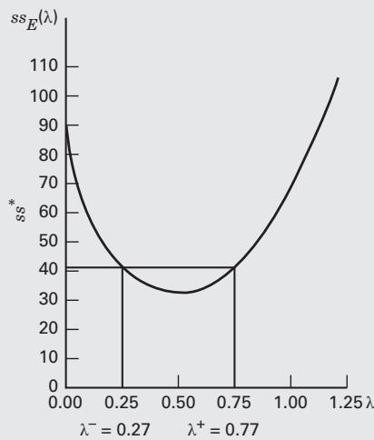
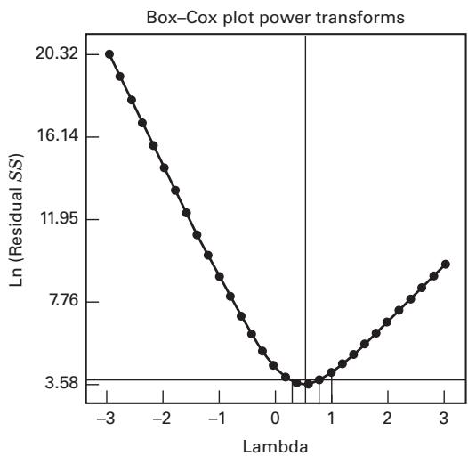

# 15.1 非正态响应与变换

## 15.1.1 选择变换：Box–Cox 方法

第 3.4.3 节讨论了试验响应 $y$ 的方差不恒定问题，指出这违背通常方差分析的假定。实践中方差不齐很常见，且常伴随非正态响应。例如，缺陷数或粒子数，产率或不合格品率等比例数据，以及服从偏态分布的响应（一侧尾部比另一侧长）。我们介绍了通过变换响应来稳定方差，并讨论两种选择变换形式的方法：经验图解法，以及尝试一种或多种变换、选择能产生最满意的残差对拟合响应图的试探法。

变换通常有三个目的：稳定响应方差，使响应分布更接近正态，以及改善模型拟合。最后一个目的还可能包括简化模型，例如消除交互作用项。有时一种变换能同时有效实现其中多个目的。

幂变换族 $y^*=y^\lambda$ 很有用，其中 $\lambda$ 是待确定的变换参数；例如 $\lambda=1/2$ 表示对原响应开平方。Box 和 Cox（1964）说明，可将 $\lambda$ 与其他模型参数（总体均值和处理效应）同时估计，其理论基于极大似然法。实际计算是在不同 $\lambda$ 下，对下列变换值进行标准方差分析：

$$
y ^ {(\lambda)} = \left\{ \begin{array}{l l} \frac {y ^ {\lambda} - 1}{\lambda \dot {y} ^ {\lambda - 1}} & \lambda \neq 0 \\ \dot {y} \ln y & \lambda = 0 \end{array} \right.\tag{15.1}
$$

其中，$\dot y=\exp[(1/n)\sum\ln y]$ 是观测值的几何平均数。使误差平方和 $SS_E(\lambda)$ 最小的 $\lambda$ 就是极大似然估计。通常绘制 $SS_E(\lambda)$ 对 $\lambda$ 的图，从图中读出最小点。一般取 10～20 个 $\lambda$ 值即可估计最优值；若需要更准确，可在其附近采用更密的网格进一步搜索。

不能直接比较对 $y^\lambda$ 作方差分析的误差平方和来选择 $\lambda$，因为不同 $\lambda$ 对应不同尺度。另外，$\lambda\to0$ 时 $y^\lambda\to1$，在 $\lambda=0$ 时响应全为常数。式（15.1）中的 $(y^\lambda-1)/\lambda$ 解决了这一问题，其极限为 $\ln y$。分母中的 $\dot y^{\lambda-1}$ 调整响应尺度，使不同变换的误差平方和可直接比较。

使用 Box–Cox 方法时，建议选择简单的 $\lambda$ 值。例如 0.5 与 0.58 的实际差别可能很小，但平方根变换（$\lambda=0.5$）更易解释。接近 1 的 $\lambda$ 则表明可能无需变换。

选定 $\lambda$ 后，可用 $y^\lambda$ 分析数据；若 $\lambda=0$，用 $\ln y$。也可以直接以 $y^{(\lambda)}$ 作响应，但与 $y^\lambda$ 或 $\ln y$ 的结果相比，模型参数估计会有尺度和原点的变化。

$\lambda$ 的近似 $100(1-\alpha)\%$ 置信区间可按下式构造：

$$
S S ^ {*} = S S _ {E} (\lambda) \left(1 + \frac {t _ {\alpha / 2 , \nu} ^ {2}}{\nu}\right)\tag{15.2}
$$

其中，$\nu$ 是误差自由度。在 $SS_E(\lambda)$ 对 $\lambda$ 的图上，于高度 $SS^*$ 画平行于横轴的直线。它与曲线交点对应的 $\lambda$ 就是置信限。若区间包含 $\lambda=1$，则数据没有充分证据支持必须作变换。

## 例 15.1

用例 3.5 的峰值流量数据说明 Box–Cox 方法。这是单因子试验，原数据见表 3.7。按式（15.1）对若干 $\lambda$ 计算 $SS_E(\lambda)$：

<table><tr><td>$\lambda$</td><td>$\mathrm{SS}_{\mathrm{E}}(\lambda)$</td></tr><tr><td>-1.00</td><td>7922.11</td></tr><tr><td>-0.50</td><td>687.10</td></tr><tr><td>-0.25</td><td>232.52</td></tr><tr><td>0.00</td><td>91.96</td></tr><tr><td>0.25</td><td>46.99</td></tr><tr><td>0.50</td><td>35.42</td></tr><tr><td>0.75</td><td>40.61</td></tr><tr><td>1.00</td><td>62.08</td></tr><tr><td>1.25</td><td>109.82</td></tr><tr><td>1.50</td><td>208.12</td></tr></table>

最小值附近的图见图 15.1。$\lambda=0.52$ 时，$SS_E(\lambda)$ 约为 35.00。按式（15.2）计算近似 95% 置信区间的界线：

$$
\begin{array}{l} S S ^ {*} = S S _ {E} (\lambda) \left(1 + \frac {t _ {0.025 , 20} ^ {2}}{20}\right) \\ = 35.00 \left[ 1 + \frac {(2.086) ^ {2}}{20} \right] \\ = 42.61 \end{array}
$$

将 $SS^*$ 画在图 15.1 上，读出它与曲线交点对应的 $\lambda$，得到下限 $\lambda^-=0.27$、上限 $\lambda^+=0.77$。区间不包含 1，表明需要变换；实际采用的平方根变换（$\lambda=0.50$）有充分依据。

  
图 15.1 例 15.1 的 $SS_E(\lambda)$ 对 $\lambda$ 图

Design-Expert 图：峰值流量

当前 $\lambda=1$；最佳值 0.541377；置信下限 0.291092，上限 0.791662；建议使用平方根变换（$\lambda=0.5$）。

  
图 15.2 Design-Expert 的 Box–Cox 方法输出

一些软件包含用于选择幂变换的 Box–Cox 程序。图 15.2 给出了 Design-Expert 对峰值流量数据的输出，结果与例 15.1 的手算较接近。图中的纵轴为 $\ln[SS_E(\lambda)]$。

## 15.1.2 广义线性模型

数据变换常能有效处理非正态响应及伴随的方差不齐。上一节的 Box–Cox 方法简单而有效，但数据变换也存在一些问题。

首先，试验者可能不习惯在变换尺度上解释响应。他们关注的是缺陷数而非缺陷数的平方根，或电阻率而非其对数。不过，若变换确实改善了分析和响应模型，试验者通常很快就会接受新尺度。

更严重的是，变换模型可能在所关注设计区域的某些部分给出没有实际意义的响应。例如，对硅片缺陷数使用平方根变换后，在某些区域预测的缺陷数平方根为负，尤其容易发生在实际缺陷数较小的区域。这样，模型偏偏在我们希望预测良好的区域给出明显不可靠的结果。

最后，变换常被用来稳定方差、改善正态性和简化模型，但无法保证同一种变换同时有效实现全部目标。

除“先变换、再对变换响应作通常最小二乘分析”外，还可采用**广义线性模型（GLM）**。Nelder 和 Wedderburn（1972）提出这一方法，将正态和非正态响应的相关模型纳入统一框架。完整讨论见 McCullagh 和 Nelder（1989）以及 Myers 等（2010）；Myers 和 Montgomery（1997）提供了教程。本章补充材料还有更多细节。下面概述概念并用三个简短例子说明。

广义线性模型本质上是回归模型，试验设计模型也属于回归模型。它包含随机分量，以及设计因子 $x$ 和未知参数 $\beta$ 的函数。通常基于正态理论的线性回归模型写为

$$
y = \beta_ {0} + \beta_ {1} x _ {1} + \beta_ {2} x _ {2} + \dots + \beta_ {k} x _ {k} + \epsilon\tag{15.3}
$$

假定误差 $\epsilon$ 均值为零、方差恒定且服从正态分布，响应均值为

$$
E (y) = \mu = \beta_ {0} + \beta_ {1} x _ {1} + \beta_ {2} x _ {2} + \dots + \beta_ {k} x _ {k} = \mathbf {x} ^ {\prime} \pmb {\beta}\tag{15.4}
$$

式（15.4）中的 $\boldsymbol x'\boldsymbol\beta$ 称为**线性预测子**。广义线性模型包含式（15.3）这一特例。

GLM 的响应可服从指数族中的任一分布，包括正态、Poisson、二项、指数和 gamma 分布。这是一组丰富而灵活、适用于许多试验场景的分布。响应均值 $\mu$ 与线性预测子之间的关系由**链接函数**确定。

$$
g (\mu) = \mathbf {x} ^ {\prime} \boldsymbol {\beta}\tag{15.5}
$$

表示平均响应的回归模型为

$$
E (y) = \mu = g ^ {- 1} (\mathbf {x} ^ {\prime} \pmb {\beta})\tag{15.6}
$$

例如，产生式（15.3）普通线性回归模型的函数称为**恒等链接**，因为 $\mu=g^{-1}(\boldsymbol x'\boldsymbol\beta)=\boldsymbol x'\boldsymbol\beta$。又如，对数链接

$$
\ln (\mu) = \mathbf {x} ^ {\prime} \boldsymbol {\beta}\tag{15.7}
$$

产生模型

$$
\mu = e ^ {\mathbf {x} ^ {\prime} \beta}\tag{15.8}
$$

对数链接常用于计数数据（Poisson 响应），以及具有较长右尾的连续响应（指数或 gamma 分布）。用于二项数据的另一种重要函数是 **logit 链接**：

$$
\ln \left(\frac {\mu}{1 - \mu}\right) = \mathbf {x} ^ {\prime} \boldsymbol {\beta}\tag{15.9}
$$

它产生模型

$$
\mu = \frac {1}{1 + e ^ {- {\bf x} ^ {\prime} \beta}}\tag{15.10}
$$

链接函数有多种选择，但必须单调且可微。GLM 的响应方差不必恒定，可以是均值的函数，并通过链接函数依赖于预测变量。例如，Poisson 响应的方差恰等于均值。

实际使用 GLM 时，须指定响应分布与链接函数，再用极大似然法拟合模型或估计参数。对指数族，这通常通过迭代加权最小二乘实现。正态响应的普通线性回归或试验设计模型退化为标准最小二乘。可采用类似正态理论方差分析的方式进行推断与诊断，详见 Myers 和 Montgomery（1997）及 Myers 等（2010）。SAS 的 PROC GENMOD 和 JMP 都支持广义线性模型。

## 例 15.2

某消费品公司研究影响顾客兑现个人护理产品优惠券可能性的因子。进行 $2^3$ 析因试验，A 为优惠券面额（低、高），B 为有效期，C 为使用难易程度（容易、困难）。八个单元各随机选取 1000 名顾客，响应为兑现优惠券的人数，结果见表 15.1。

## 表 15.1

优惠券兑现试验的设计与数据

<table><tr><td>A</td><td>B</td><td>C</td><td>优惠券兑现人数</td></tr><tr><td>-</td><td>-</td><td>-</td><td>200</td></tr><tr><td>+</td><td>-</td><td>-</td><td>250</td></tr><tr><td>-</td><td>+</td><td>-</td><td>265</td></tr><tr><td>+</td><td>+</td><td>-</td><td>347</td></tr><tr><td>-</td><td>-</td><td>+</td><td>210</td></tr><tr><td>+</td><td>-</td><td>+</td><td>286</td></tr><tr><td>-</td><td>+</td><td>+</td><td>271</td></tr><tr><td>+</td><td>+</td><td>+</td><td>326</td></tr></table>

各单元响应可看作 1000 次 Bernoulli 试验中的成功次数，因此合理的模型是具有二项响应分布和 logit 链接的 GLM。这一形式通常称为 **Logistic 回归**。

Minitab 和 JMP 均可拟合 Logistic 回归。试验者决定只包含主效应和两因子交互作用，预期响应模型为

$$
\pi=\frac{E(y)}{1000}=\frac{1}{1+\exp[-(\beta_0+\sum_{i=1}^3\beta_i x_i+\sum_{1\leq i<j\leq3}\beta_{ij}x_ix_j)]}
$$

表 15.2 给出了部分 Minitab 输出。上部拟合含三个主效应和三个两因子交互作用的完整模型，并列出系数估计及标准误。在系数等于零的原假设下，$Z=\hat\beta/\operatorname{se}(\hat\beta)$ 渐近服从标准正态分布，可检验各主效应和交互作用。“渐近”指样本量足够大时。这里仅有八个不同设计点，但各点包含 1000 次二项试验；判断近似是否适用还应考虑成功和失败次数及模型条件。[^1] 表中 P 值表明，截距及 A、B 主效应显著；BC 的 P 值为 0.107，在 5% 水平下不显著。[^2]

拟合优度部分给出 Pearson、离差和 Hosmer–Lemeshow 三种统计量，衡量模型的整体适合程度。P 值均较大，未发现模型明显不适合的证据。表下部给出只含三个主效应和 BC 的简化模型；为保持模型层级，保留 C。拟合模型为

$$
\begin{array}{l} \hat {\pi} = \frac {1}{1 + \exp [ - (- 1.01 + 0.169 x _ {1} + 0.169 x _ {2} + 0.023 x _ {3} - 0.041 x _ {2} x _ {3}) ]} \\ = \frac {1}{1 + \exp (+ 1.01 - 0.169 x _ {1} - 0.169 x _ {2} - 0.023 x _ {3} + 0.041 x _ {2} x _ {3})} \end{array}
$$

C 和 BC 均未达到 5% 显著性水平；是否保留 BC，还应结合模型层级、拟合优度和预测目的判断。

Minitab 为每个回归系数报告一个**优势比**（odds ratio），它直接来自式（15.9）的 logit 链接，其解释类似于标准二水平设计中的因子效应。

## 表 15.2

优惠券兑现试验的 Minitab 输出

<table><tr><td colspan="8">二元 Logistic 回归：完整模型</td></tr><tr><td colspan="8">链接函数：Logit</td></tr><tr><td colspan="8">响应信息</td></tr><tr><td>变量</td><td>值</td><td>计数</td><td></td><td></td><td></td><td></td><td></td></tr><tr><td>C5</td><td>成功</td><td>2155</td><td></td><td></td><td></td><td></td><td></td></tr><tr><td></td><td>失败</td><td>5845</td><td></td><td></td><td></td><td></td><td></td></tr><tr><td>C6</td><td>总计</td><td>8000</td><td></td><td></td><td></td><td></td><td></td></tr><tr><td colspan="8">Logistic 回归表</td></tr><tr><td>预测变量</td><td>系数</td><td>系数标准误</td><td>Z</td><td>P 值</td><td>优势比</td><td>95% 下限</td><td>置信上限</td></tr><tr><td>常数项</td><td>-1.01154</td><td>0.0255150</td><td>-39.65</td><td>0.000</td><td></td><td></td><td></td></tr><tr><td>A</td><td>0.169208</td><td>0.0255092</td><td>6.63</td><td>0.000</td><td>1.18</td><td>1.13</td><td>1.25</td></tr><tr><td>B</td><td>0.169622</td><td>0.0255150</td><td>6.65</td><td>0.000</td><td>1.18</td><td>1.13</td><td>1.25</td></tr><tr><td>C</td><td>0.0233173</td><td>0.0255099</td><td>0.91</td><td>0.361</td><td>1.02</td><td>0.97</td><td>1.08</td></tr><tr><td>A*B</td><td>-0.0062854</td><td>0.0255122</td><td>-0.25</td><td>0.805</td><td>0.99</td><td>0.95</td><td>1.04</td></tr><tr><td>A*C</td><td>-0.0027726</td><td>0.0254324</td><td>-0.11</td><td>0.913</td><td>1.00</td><td>0.95</td><td>1.05</td></tr><tr><td>B*C</td><td>-0.0410198</td><td>0.0254339</td><td>-1.61</td><td>0.107</td><td>0.96</td><td>0.91</td><td>1.01</td></tr><tr><td colspan="8">对数似然 = -4615.310</td></tr><tr><td colspan="8">拟合优度检验</td></tr><tr><td>方法</td><td>卡方统计量</td><td>自由度</td><td>P 值</td><td></td><td></td><td></td><td></td></tr><tr><td>Pearson</td><td>1.46458</td><td>1</td><td>0.226</td><td></td><td></td><td></td><td></td></tr><tr><td>离差</td><td>1.46451</td><td>1</td><td>0.226</td><td></td><td></td><td></td><td></td></tr><tr><td>Hosmer-Lemeshow</td><td>1.46458</td><td>6</td><td>0.962</td><td></td><td></td><td></td><td></td></tr></table>

表 15.2 的下部为含 A、B、C、BC 的简化二元 Logistic 回归。对 A，$e^{\hat\beta_1}=e^{0.168765}=1.18$ 表示编码变量增加一个单位的优势比，即面额从 $x_1=0$ 到 $x_1=+1$ 的变化。高水平 $+1$ 相对低水平 $-1$ 的优势比则为 $e^{2\hat\beta_1}=e^{2(0.168765)}=1.40$，因此高面额使兑现的优势约增加 40%。

```csv
Link Function: Logit
Response Information
Variable Value Count
C5 Success 2155
Failure 5845
C6 Total 8000
Logistic Regression Table
Predictor Coef SE Coef Z P Odds 95% CI
Constant -1.01142 0.0255076 -39.65 0.000 Ratio Lower Upper
A 0.168675 0.0254235 6.63 0.000 1.18 1.13 1.24
B 0.169116 0.0254321 6.65 0.000 1.18 1.13 1.24
C 0.0230825 0.0254306 0.91 0.364 1.02 0.97 1.08
B*C -0.0409711 0.0254307 -1.61 0.107 0.96 0.91 1.01
Log-Likelihood = -4615.346
Goodness-of-Fit Tests
Method Chi-Square DF P
Pearson 1.53593 3 0.674
Deviance 1.53602 3 0.674
Hosmer-Lemeshow 1.53593 6 0.957
```

Logistic 回归应用广泛，可能是最常见的 GLM 应用。生物医学中的剂量与反应研究经常使用它，其中因子为治疗剂量，响应为治疗是否成功。可靠性工程试验也常有成功或失败的二元数据，例如产品或元件承受某种应力后是否失效。

## 例 15.3 格栅缺陷试验

习题 8.29 介绍了研究九个因子对片状模塑格栅开口面板缺陷影响的试验。Bisgaard 和 Fuller（1994）用这些数据说明变换在试验分析中的价值。该习题（f）中采用修正的平方根变换，得到模型

$$
\widehat {(\sqrt {y} + \sqrt {y + 1}) / 2} = 2.513 - 0.996 x _ {4} - 1.21 x _ {6} - 0.772 x _ {2} x _ {7}
$$

其中，$x$ 为编码设计因子。该变换很好地稳定了缺陷数的方差。表 15.3 前两个部分给出模型信息：“变换后”部分第一列为预测响应，其中有两个负值；“原尺度”部分给出反变换后的预测及 16 个设计点平均响应的 95% 置信区间。由于一些预测值和置信下限为负，部分条目无法作有效反变换。

响应本质上是缺陷数的平方根，负预测显然没有意义，而这些预测出现在观测计数较小的区域。若需在此区域预测，模型可能不可靠。这不是对原试验或 Bisgaard、Fuller 分析的否定：该筛选试验非常成功，清楚识别了重要过程变量；预测既不是原试验的目标，也不是那次分析的目标。

若目标包括预测，GLM 很可能比变换方法更合适。Myers 和 Montgomery 采用式（15.7）的对数链接和 Poisson 响应，拟合与 Bisgaard、Fuller 完全相同的线性预测子，得到

$$
\hat {y} = e ^ {(1.128 - 0.896 x _ {4} - 1.176 x _ {6} - 0.737 x _ {2} x _ {7})}
$$

表 15.3 第三部分给出各设计点的预测及平均响应 95% 置信区间，由 SAS PROC GENMOD 计算；JMP 也能拟合 Poisson 回归。链接函数保证预测非负，置信下限也没有负值。最后一部分比较原尺度最小二乘模型与 GLM 的区间长度，GLM 的区间均更短。在所采用分布假定适用时，这表明 GLM 在本例中提供了更精确的平均响应估计。

## 表 15.3

格栅开口面板试验的最小二乘与广义线性模型分析

<table><tr><td rowspan="3">观测值</td><td colspan="4">采用 Freeman–Tukey 修正平方根变换的最小二乘法</td><td rowspan="2" colspan="2">广义线性模型（Poisson 响应、对数链接）</td><td rowspan="2" colspan="2">95% 置信区间长度</td></tr><tr><td colspan="2">变换后</td><td colspan="2">原尺度</td></tr><tr><td>预测值</td><td>95% 置信区间</td><td>预测值</td><td>95% 置信区间</td><td>预测值</td><td>95% 置信区间</td><td>最小二乘</td><td>GLM</td></tr><tr><td>1</td><td>5.50</td><td>(4.14, 6.85)</td><td>29.70</td><td>(16.65, 46.41)</td><td>51.26</td><td>(42.45, 61.90)</td><td>29.76</td><td>19.45</td></tr><tr><td>2</td><td>3.95</td><td>(2.60, 5.31)</td><td>15.12</td><td>(6.25, 27.65)</td><td>11.74</td><td>(8.14, 16.94)</td><td>21.39</td><td>8.80</td></tr><tr><td>3</td><td>1.52</td><td>(0.17, 2.88)</td><td>1.84</td><td>(1.69, 7.78)</td><td>1.12</td><td>(0.60, 2.08)</td><td>6.09</td><td>1.47</td></tr><tr><td>4</td><td>3.07</td><td>(1.71, 4.42)</td><td>8.91</td><td>(2.45, 19.04)</td><td>4.88</td><td>(2.87, 8.32)</td><td>16.59</td><td>5.45</td></tr><tr><td>5</td><td>1.52</td><td>(0.17, 2.88)</td><td>1.84</td><td>(1.69, 7.78)</td><td>1.12</td><td>(0.60, 2.08)</td><td>6.09</td><td>1.47</td></tr><tr><td>6</td><td>3.07</td><td>(1.71, 4.42)</td><td>8.91</td><td>(2.45, 19.04)</td><td>4.88</td><td>(2.87, 8.32)</td><td>16.59</td><td>5.45</td></tr><tr><td>7</td><td>5.50</td><td>(4.14, 6.85)</td><td>29.70</td><td>(16.65, 46.41)</td><td>51.26</td><td>(42.45, 61.90)</td><td>29.76</td><td>19.45</td></tr><tr><td>8</td><td>3.95</td><td>(2.60, 5.31)</td><td>15.12</td><td>(6.25, 27.65)</td><td>11.74</td><td>(8.14, 16.94)</td><td>21.39</td><td>8.80</td></tr><tr><td>9</td><td>1.08</td><td>(-0.28, 2.43)</td><td>0.71</td><td>(*, 5.41)</td><td>0.81</td><td>(0.42, 1.56)</td><td>*</td><td>1.13</td></tr><tr><td>10</td><td>-0.47</td><td>(-1.82, 0.89)</td><td>*</td><td>(*, 0.36)</td><td>0.19</td><td>(0.09, 0.38)</td><td>*</td><td>0.29</td></tr><tr><td>11</td><td>1.96</td><td>(0.61, 3.31)</td><td>3.36</td><td>(0.04, 10.49)</td><td>1.96</td><td>(1.16, 3.30)</td><td>10.45</td><td>2.14</td></tr><tr><td>12</td><td>3.50</td><td>(2.15, 4.86)</td><td>11.78</td><td>(4.13, 23.10)</td><td>8.54</td><td>(5.62, 12.98)</td><td>18.96</td><td>7.35</td></tr><tr><td>13</td><td>1.96</td><td>(0.61, 3.31)</td><td>3.36</td><td>(0.04, 10.49)</td><td>1.96</td><td>(1.16, 3.30)</td><td>10.45</td><td>2.14</td></tr><tr><td>14</td><td>3.50</td><td>(2.15, 4.86)</td><td>11.78</td><td>(4.13, 23.10)</td><td>8.54</td><td>(5.62, 12.98)</td><td>18.97</td><td>7.35</td></tr><tr><td>15</td><td>1.08</td><td>(-0.28, 2.43)</td><td>0.71</td><td>(*, 5.41)</td><td>0.81</td><td>(0.42, 1.56)</td><td>*</td><td>1.13</td></tr><tr><td>16</td><td>-0.47</td><td>(-1.82, 0.89)</td><td>*</td><td>(*, 0.36)</td><td>0.19</td><td>(0.09, 0.38)</td><td>*</td><td>0.29</td></tr></table>

## 例 15.4 精纺毛纱试验

表 15.4 给出一个 $3^3$ 析因设计，研究精纺毛纱在重复加载下的性能，详见 Box 和 Draper（2007）。响应为失效前经历的循环数。这类可靠性数据通常为非负值，并常呈较长右尾；这里将较大的循环计数按连续响应近似处理。

最初采用标准最小二乘分析，需要变换来稳定方差。对循环数取自然对数后，模型拟合与残差图均较满意，得到

$$
\ln \hat {y} = 6.33 + 0.82 x _ {1} - 0.63 x _ {2} - 0.38 x _ {3}
$$

以原响应，即失效循环数表示为

$$
\hat {y} = e ^ {6.33 + 0.82 x _ {1} - 0.63 x _ {2} - 0.38 x _ {3}}
$$

## 表 15.4

精纺毛纱试验的设计、失效循环数及自然对数

<table><tr><td>试验</td><td>$x_{1}$</td><td>$x_{2}$</td><td>$x_{3}$</td><td>失效前循环数</td><td>失效前循环数的自然对数</td></tr><tr><td>1</td><td>-1</td><td>-1</td><td>-1</td><td>674</td><td>6.51</td></tr><tr><td>2</td><td>-1</td><td>-1</td><td>0</td><td>370</td><td>5.91</td></tr><tr><td>3</td><td>-1</td><td>-1</td><td>1</td><td>292</td><td>5.68</td></tr><tr><td>4</td><td>-1</td><td>0</td><td>-1</td><td>338</td><td>5.82</td></tr><tr><td>5</td><td>-1</td><td>0</td><td>0</td><td>266</td><td>5.58</td></tr><tr><td>6</td><td>-1</td><td>0</td><td>1</td><td>210</td><td>5.35</td></tr><tr><td>7</td><td>-1</td><td>1</td><td>-1</td><td>170</td><td>5.14</td></tr><tr><td>8</td><td>-1</td><td>1</td><td>0</td><td>118</td><td>4.77</td></tr><tr><td>9</td><td>-1</td><td>1</td><td>1</td><td>90</td><td>4.50</td></tr><tr><td>10</td><td>0</td><td>-1</td><td>-1</td><td>1414</td><td>7.25</td></tr><tr><td>11</td><td>0</td><td>-1</td><td>0</td><td>1198</td><td>7.09</td></tr><tr><td>12</td><td>0</td><td>-1</td><td>1</td><td>634</td><td>6.45</td></tr><tr><td>13</td><td>0</td><td>0</td><td>-1</td><td>1022</td><td>6.93</td></tr><tr><td>14</td><td>0</td><td>0</td><td>0</td><td>620</td><td>6.43</td></tr><tr><td>15</td><td>0</td><td>0</td><td>1</td><td>438</td><td>6.08</td></tr><tr><td>16</td><td>0</td><td>1</td><td>-1</td><td>442</td><td>6.09</td></tr><tr><td>17</td><td>0</td><td>1</td><td>0</td><td>332</td><td>5.81</td></tr><tr><td>18</td><td>0</td><td>1</td><td>1</td><td>220</td><td>5.39</td></tr></table>

<table><tr><td>19</td><td>1</td><td>-1</td><td>-1</td><td>3636</td><td>8.20</td></tr><tr><td>20</td><td>1</td><td>-1</td><td>0</td><td>3184</td><td>8.07</td></tr><tr><td>21</td><td>1</td><td>-1</td><td>1</td><td>2000</td><td>7.60</td></tr><tr><td>22</td><td>1</td><td>0</td><td>-1</td><td>1568</td><td>7.36</td></tr><tr><td>23</td><td>1</td><td>0</td><td>0</td><td>1070</td><td>6.98</td></tr><tr><td>24</td><td>1</td><td>0</td><td>1</td><td>566</td><td>6.34</td></tr><tr><td>25</td><td>1</td><td>1</td><td>-1</td><td>1140</td><td>7.04</td></tr><tr><td>26</td><td>1</td><td>1</td><td>0</td><td>884</td><td>6.78</td></tr><tr><td>27</td><td>1</td><td>1</td><td>1</td><td>360</td><td>5.89</td></tr></table>

还可以选择 gamma 响应分布和对数链接进行 GLM 分析，采用与对数变换后最小二乘相同的模型项，得到

$$
\hat {y} = e ^ {6.35 + 0.84 x _ {1} - 0.63 x _ {2} - 0.39 x _ {3}}
$$

表 15.5 给出两种模型在 27 个设计点的预测和平均响应 95% 置信区间。区间长度比较表明，GLM 可能比最小二乘模型提供更精确的预测。

表 15.5
精纺毛纱试验的最小二乘与广义线性模型分析

<table><tr><td rowspan="3">观测序号</td><td colspan="4">对数变换后的最小二乘法</td><td rowspan="2" colspan="2">广义线性模型</td><td rowspan="2" colspan="2">95% 置信区间长度</td></tr><tr><td colspan="2">变换后</td><td colspan="2">原尺度</td></tr><tr><td>预测值</td><td>95% 置信区间</td><td>预测值</td><td>95% 置信区间</td><td>预测值</td><td>95% 置信区间</td><td>最小二乘</td><td>GLM</td></tr><tr><td>1</td><td>2.83</td><td>(2.76, 2.91)</td><td>682.50</td><td>(573.85, 811.52)</td><td>680.52</td><td>(583.83, 793.22)</td><td>237.67</td><td>209.39</td></tr><tr><td>2</td><td>2.66</td><td>(2.60, 2.73)</td><td>460.26</td><td>(397.01, 533.46)</td><td>463.00</td><td>(407.05, 526.64)</td><td>136.45</td><td>119.59</td></tr><tr><td>3</td><td>2.49</td><td>(2.42, 2.57)</td><td>310.38</td><td>(260.98, 369.06)</td><td>315.01</td><td>(271.49, 365.49)</td><td>108.09</td><td>94.00</td></tr><tr><td>4</td><td>2.56</td><td>(2.50, 2.62)</td><td>363.25</td><td>(313.33, 421.11)</td><td>361.96</td><td>(317.75, 412.33)</td><td>107.79</td><td>94.58</td></tr><tr><td>5</td><td>2.39</td><td>(2.34, 2.44)</td><td>244.96</td><td>(217.92, 275.30)</td><td>246.26</td><td>(222.55, 272.51)</td><td>57.37</td><td>49.96</td></tr><tr><td>6</td><td>2.22</td><td>(2.15, 2.28)</td><td>165.20</td><td>(142.50, 191.47)</td><td>167.55</td><td>(147.67, 190.10)</td><td>48.97</td><td>42.42</td></tr><tr><td>7</td><td>2.29</td><td>(2.21, 2.36)</td><td>193.33</td><td>(162.55, 229.93)</td><td>192.52</td><td>(165.69, 223.70)</td><td>67.38</td><td>58.01</td></tr><tr><td>8</td><td>2.12</td><td>(2.05, 2.18)</td><td>130.38</td><td>(112.46, 151.15)</td><td>130.98</td><td>(115.43, 148.64)</td><td>38.69</td><td>33.22</td></tr></table>

表 15.5（续）

<table><tr><td rowspan="3">观测序号</td><td colspan="4">对数变换后的最小二乘法</td><td rowspan="2" colspan="2">广义线性模型</td><td rowspan="2" colspan="2">95% 置信区间长度</td></tr><tr><td colspan="2">变换后</td><td colspan="2">原尺度</td></tr><tr><td>预测值</td><td>95% 置信区间</td><td>预测值</td><td>95% 置信区间</td><td>预测值</td><td>95% 置信区间</td><td>最小二乘</td><td>GLM</td></tr><tr><td>9</td><td>1.94</td><td>(1.87, 2.02)</td><td>87.92</td><td>(73.93, 104.54)</td><td>89.12</td><td>(76.87, 103.32)</td><td>30.62</td><td>26.45</td></tr><tr><td>10</td><td>3.20</td><td>(3.13, 3.26)</td><td>1569.28</td><td>(1353.94, 1819.28)</td><td>1580.00</td><td>(1390.00, 1797.00)</td><td>465.34</td><td>407.00</td></tr><tr><td>11</td><td>3.02</td><td>(2.97, 3.08)</td><td>1058.28</td><td>(941.67, 1189.60)</td><td>1075.00</td><td>(972.52, 1189.00)</td><td>247.92</td><td>216.48</td></tr><tr><td>12</td><td>2.85</td><td>(2.79, 2.92)</td><td>713.67</td><td>(615.60, 827.37)</td><td>731.50</td><td>(644.35, 830.44)</td><td>211.77</td><td>186.09</td></tr><tr><td>13</td><td>2.92</td><td>(2.87, 2.97)</td><td>835.41</td><td>(743.19, 938.86)</td><td>840.54</td><td>(759.65, 930.04)</td><td>195.67</td><td>170.39</td></tr><tr><td>14</td><td>2.75</td><td>(2.72, 2.78)</td><td>563.25</td><td>(523.24, 606.46)</td><td>571.87</td><td>(536.67, 609.38)</td><td>83.22</td><td>72.70</td></tr><tr><td>15</td><td>2.58</td><td>(2.53, 2.63)</td><td>379.84</td><td>(337.99, 426.97)</td><td>389.08</td><td>(351.64, 430.51)</td><td>88.99</td><td>78.87</td></tr><tr><td>16</td><td>2.65</td><td>(2.58, 2.71)</td><td>444.63</td><td>(383.53, 515.35)</td><td>447.07</td><td>(393.81, 507.54)</td><td>131.82</td><td>113.74</td></tr><tr><td>17</td><td>2.48</td><td>(2.43, 2.53)</td><td>299.85</td><td>(266.75, 336.98)</td><td>304.17</td><td>(275.13, 336.28)</td><td>70.23</td><td>61.15</td></tr><tr><td>18</td><td>2.31</td><td>(2.24, 2.37)</td><td>202.16</td><td>(174.42, 234.37)</td><td>206.95</td><td>(182.03, 235.27)</td><td>59.95</td><td>53.23</td></tr><tr><td>19</td><td>3.56</td><td>(3.48, 3.63)</td><td>3609.11</td><td>(3034.59, 4292.40)</td><td>3670.00</td><td>(3165.00, 4254.00)</td><td>1257.81</td><td>1089.00</td></tr><tr><td>20</td><td>3.39</td><td>(3.32, 3.45)</td><td>2433.88</td><td>(2099.42, 2821.63)</td><td>2497.00</td><td>(2200.00, 2833.00)</td><td>722.21</td><td>633.00</td></tr><tr><td>21</td><td>3.22</td><td>(3.14, 3.29)</td><td>1641.35</td><td>(1380.07, 1951.64)</td><td>1699.00</td><td>(1462.00, 1974.00)</td><td>571.57</td><td>512.00</td></tr><tr><td>22</td><td>3.28</td><td>(3.22, 3.35)</td><td>1920.88</td><td>(1656.91, 2226.90)</td><td>1952.00</td><td>(1720.00, 2215.00)</td><td>569.98</td><td>495.00</td></tr><tr><td>23</td><td>3.11</td><td>(3.06, 3.16)</td><td>1295.39</td><td>(1152.66, 1455.79)</td><td>1328.00</td><td>(1200.00, 1470.00)</td><td>303.14</td><td>270.00</td></tr><tr><td>24</td><td>2.94</td><td>(2.88, 3.01)</td><td>873.57</td><td>(753.53, 1012.74)</td><td>903.51</td><td>(793.15, 1029.00)</td><td>259.22</td><td>235.85</td></tr><tr><td>25</td><td>3.01</td><td>(2.93, 3.08)</td><td>1022.35</td><td>(859.81, 1215.91)</td><td>1038.00</td><td>(894.79, 1205.00)</td><td>356.10</td><td>310.21</td></tr><tr><td>26</td><td>2.84</td><td>(2.77, 2.90)</td><td>689.45</td><td>(594.70, 799.28)</td><td>706.34</td><td>(620.99, 803.43)</td><td>204.58</td><td>182.44</td></tr><tr><td>27</td><td>2.67</td><td>(2.59, 2.74)</td><td>464.94</td><td>(390.93, 552.97)</td><td>480.57</td><td>(412.29, 560.15)</td><td>162.04</td><td>147.86</td></tr></table>

GLM 已广泛用于生物医学与制药研发。随着软件支持增加，也将更多用于工业研发。本节用标准试验设计结合指数族响应分布。若预先知道需要 GLM 分析，可在设计时考虑这一点。GLM 的最优设计属于非线性模型最优设计的一种，更多讨论与例子见 Johnson 和 Montgomery（2009，2010）。

[^1]: 译者注：二项模型的正态近似依赖各组成功和失败次数及拟合条件；不能单以不同设计点只有八个就判定样本量不足。

[^2]: 译者注：原正文把 BC 列为显著效应，与表 15.2 的 P=0.107 不符，已据输出修正。兑现比例为 $\pi=E(y)/1000$；Logistic 公式给出的是该概率，兑现数量的期望为 $1000\pi$。
