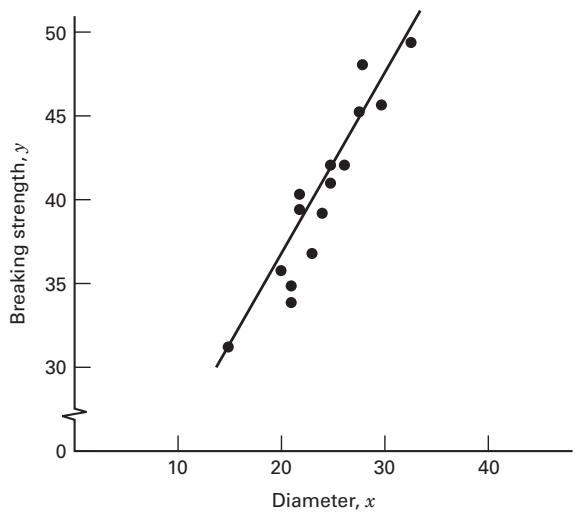
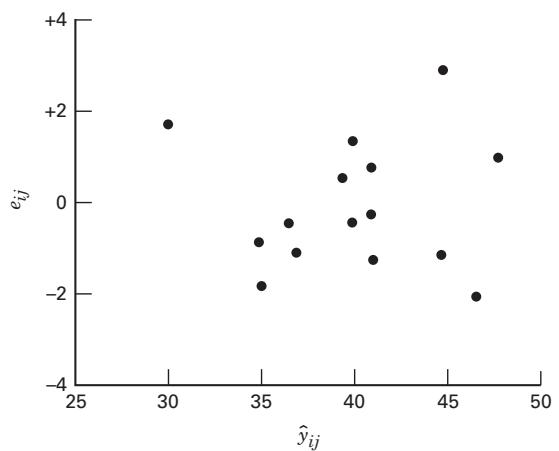
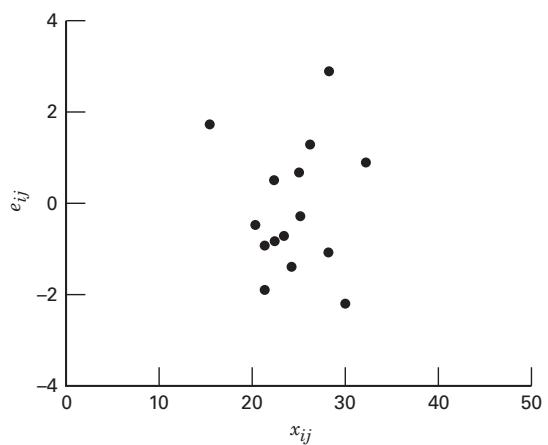
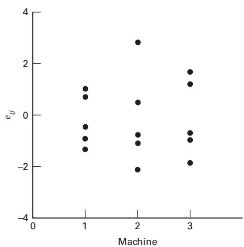
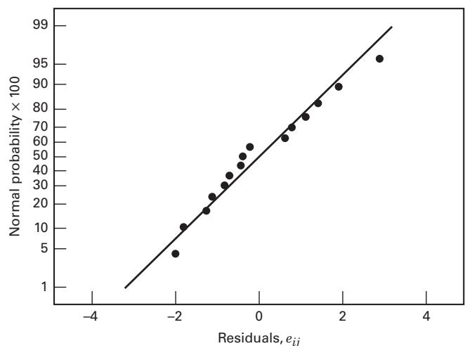
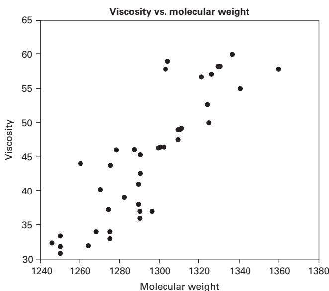
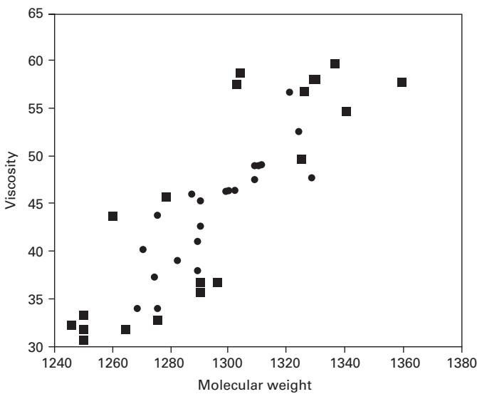

# 15.3 协方差分析

第 2、4 章介绍了用分区组原则提高处理比较精度的方法，分别以配对 t 检验和随机区组设计说明。分区组可以消除可控制干扰因子的影响。**协方差分析（ANCOVA）**是另一种有时能提高试验精度的方法。设响应 $y$ 与另一变量 $x$ 有线性关系，试验者不能控制 $x$，却能与 $y$ 一起观测。$x$ 称为**协变量**或伴随变量。协方差分析调整响应以消除协变量的影响；若不调整，协变量可能增大误差均方，使处理引起的真实响应差异更难发现。因此，它用于调整不可控制干扰变量的效应，本质上结合了方差分析和回归分析。

例如，研究三台机器生产的单丝纤维强度是否不同，数据见表 15.10。图 15.3 是强度 $y$ 对样品直径或粗细 $x$ 的散点图。纤维强度显然受粗细影响，粗纤维通常比细纤维强。检验机器之间的强度差异时，可用协方差分析去除直径 $x$ 对强度 $y$ 的影响。

## 表 15.10

断裂强度数据（$y$：强度，磅；$x$：直径，$10^{-3}$ 英寸）

<table><tr><td colspan="2">机器 1</td><td colspan="2">机器 2</td><td colspan="2">机器 3</td></tr><tr><td>y</td><td>x</td><td>y</td><td>x</td><td>y</td><td>x</td></tr><tr><td>36</td><td>20</td><td>40</td><td>22</td><td>35</td><td>21</td></tr><tr><td>41</td><td>25</td><td>48</td><td>28</td><td>37</td><td>23</td></tr><tr><td>39</td><td>24</td><td>39</td><td>22</td><td>42</td><td>26</td></tr><tr><td>42</td><td>25</td><td>45</td><td>30</td><td>34</td><td>21</td></tr><tr><td>49</td><td>32</td><td>44</td><td>28</td><td>32</td><td>15</td></tr><tr><td>207</td><td>126</td><td>216</td><td>130</td><td>180</td><td>106</td></tr></table>

  
图 15.3 断裂强度 y 对纤维直径 x 的图

## 15.3.1 方法说明

下面以单因子、单协变量试验介绍基本方法。假定响应与协变量有线性关系，适当模型为

$$
y _ {i j} = \mu + \tau_ {i} + \beta (x _ {i j} - \overline {{x}} _ {\cdot \cdot}) + \epsilon_ {i j} \left\{ \begin{array}{l l} i = 1, 2, \ldots , a \\ j = 1, 2, \ldots , n \end{array} \right.\tag{15.15}
$$

其中，$y_{ij}$ 是第 $i$ 个处理下的第 $j$ 个响应观测，$x_{ij}$ 是同一次试验的协变量观测，$\bar x_{\cdot\cdot}$ 是全部 $x$ 的均值，$\mu$ 是总体均值，$\tau_i$ 是第 $i$ 个处理效应，$\beta$ 是表示响应对协变量依赖关系的线性回归系数，$\epsilon_{ij}$ 为随机误差。假定误差独立服从 $N(0,\sigma^2)$，$\beta\ne0$ 且真实关系为线性，各处理回归斜率相同，$\sum_{i=1}^a\tau_i=0$，并且协变量不受处理影响。

模型假定各处理回归线斜率相同。若处理与协变量交互作用，使斜率不同，则不宜采用这种共同斜率的协方差分析，应估计并比较不同的回归模型。

式（15.15）假定线性关系，也可使用其他形式，例如二次关系。

协方差分析模型结合了方差分析中的处理效应与回归模型中的系数 $\beta$。将协变量写为 $x_{ij}-\bar x_{\cdot\cdot}$ 而非 $x_{ij}$，是为了使 $\mu$ 仍表示共同协变量均值处的总体均值。模型也可写为

$$
y _ {i j} = \mu^ {\prime} + \tau_ {i} + \beta x _ {i j} + \epsilon_ {i j} \left\{ \begin{array}{l l} i = 1, 2, \ldots , a \\ j = 1, 2, \ldots , n \end{array} \right.\tag{15.16}
$$

其中，$\mu'$ 是截距，不等于总体均值；后者为 $\mu'+\beta\bar x_{\cdot\cdot}$。文献更常采用式（15.15）。

为说明分析，定义下列记号：

$$
S _ {y y} = \sum_ {i = 1} ^ {a} \sum_ {j = 1} ^ {n} (y _ {i j} - \bar {y} _ {\cdot \cdot}) ^ {2} = \sum_ {i = 1} ^ {a} \sum_ {j = 1} ^ {n} y _ {i j} ^ {2} - \frac {y _ {\cdot \cdot} ^ {2}}{a n}\tag{15.17}
$$

$$
S _ {x x} = \sum_ {i = 1} ^ {a} \sum_ {j = 1} ^ {n} (x _ {i j} - \bar {x} _ {\cdot \cdot}) ^ {2} = \sum_ {i = 1} ^ {a} \sum_ {j = 1} ^ {n} x _ {i j} ^ {2} - \frac {x _ {\cdot \cdot} ^ {2}}{a n}\tag{15.18}
$$

$$
S _ {x y} = \sum_ {i = 1} ^ {a} \sum_ {j = 1} ^ {n} (x _ {i j} - \overline {{x}} _ {\cdot \cdot}) (y _ {i j} - \overline {{y}} _ {\cdot \cdot}) = \sum_ {i = 1} ^ {a} \sum_ {j = 1} ^ {n} x _ {i j} y _ {i j} - \frac {(x _ {\cdot \cdot}) (y _ {\cdot \cdot})}{a n}\tag{15.19}
$$

$$
T _ {y y} = n \sum_ {i = 1} ^ {a} (\overline {{y}} _ {i \cdot} - \overline {{y}} _ {\cdot \cdot}) ^ {2} = \frac {1}{n} \sum_ {i = 1} ^ {a} y _ {i \cdot} ^ {2} - \frac {y _ {\cdot \cdot} ^ {2}}{a n}\tag{15.20}
$$

$$
T _ {x x} = n \sum_ {i = 1} ^ {a} (\overline {{x}} _ {i \cdot} - \overline {{x}} _ {\cdot \cdot}) ^ {2} = \frac {1}{n} \sum_ {i = 1} ^ {a} x _ {i \cdot} ^ {2} - \frac {x _ {\cdot \cdot} ^ {2}}{a n}\tag{15.21}
$$

$$
T _ {x y} = n \sum_ {i = 1} ^ {a} (\overline {{x}} _ {i.} - \overline {{x}} _ {..}) (\overline {{y}} _ {i.} - \overline {{y}} _ {..}) = \frac {1}{n} \sum_ {i = 1} ^ {a} (x _ {i.}) (y _ {i.}) - \frac {(x _ {. .}) (y _ {. .})}{a n}\tag{15.22}
$$

$$
E _ {y y} = \sum_ {i = 1} ^ {a} \sum_ {j = 1} ^ {n} (y _ {i j} - \overline {{y}} _ {i.}) ^ {2} = S _ {y y} - T _ {y y}\tag{15.23}
$$

$$
E _ {x x} = \sum_ {i = 1} ^ {a} \sum_ {j = 1} ^ {n} (x _ {i j} - \overline {{x}} _ {i.}) ^ {2} = S _ {x x} - T _ {x x}\tag{15.24}
$$

$$
E _ {x y} = \sum_ {i = 1} ^ {a} \sum_ {j = 1} ^ {n} (x _ {i j} - \overline {{x}} _ {i.}) (y _ {i j} - \overline {{y}} _ {i.}) = S _ {x y} - T _ {x y}\tag{15.25}
$$

一般有 $S=T+E$，分别用 S、T、E 表示总、处理和误差的平方和及交叉乘积和。x、y 的平方和非负，而 xy 的交叉乘积和可为负。

现在说明如何调整协变量效应。对完整模型（15.15），最小二乘估计为 $\hat\mu=\bar y_{\cdot\cdot}$、$\hat\tau_i=\bar y_{i\cdot}-\bar y_{\cdot\cdot}-\hat\beta(\bar x_{i\cdot}-\bar x_{\cdot\cdot})$，以及

$$
\hat {\beta} = \frac {E _ {x y}}{E _ {x x}}\tag{15.26}
$$

模型的误差平方和为

$$
S S _ {E} = E _ {y y} - (E _ {x y}) ^ {2} / E _ {x x}\tag{15.27}
$$

自由度为 $a(n-1)-1$，试验误差方差估计为

$$
M S _ {E} = \frac {S S _ {E}}{a (n - 1) - 1}
$$

假定没有处理效应，则模型变为

$$
y _ {i j} = \mu + \beta (x _ {i j} - \overline {{x}} _ {\cdot \cdot}) + \epsilon_ {i j}\tag{15.28}
$$

最小二乘估计为 $\hat\mu=\bar y_{\cdot\cdot}$、$\hat\beta=S_{xy}/S_{xx}$。这一简化模型的误差平方和为

$$
S S _ {E} ^ {\prime} = S _ {y y} - (S _ {x y}) ^ {2} / S _ {x x}\tag{15.29}
$$

自由度为 $an-2$。式（15.29）中，$S_{xy}^2/S_{xx}$ 是通过 y 对 x 的线性回归减少的平方和。完整模型包含额外处理参数，所以 $SS_E\le SS_E'$，二者之差就是加入处理效应带来的平方和减少量。该差有 $a-1$ 个自由度，可用于检验无处理效应假设。因此，检验 $H_0:\tau_i=0$ 时，计算

$$
F _ {0} = \frac {(S S _ {E} ^ {\prime} - S S _ {E}) / (a - 1)}{S S _ {E} / [ a (n - 1) - 1 ]}\tag{15.30}
$$

原假设成立时，它服从 $F_{a-1,a(n-1)-1}$ 分布。当 $F_0>F_{\alpha,a-1,a(n-1)-1}$ 时拒绝 $H_0$，也可用 P 值判断。

表 15.11 将协方差分析表示为“调整后的”方差分析。总变异为 $S_{yy}$，自由度 $an-1$；回归平方和为 $S_{xy}^2/S_{xx}$，自由度 1。若没有协变量，误差平方和为 $E_{yy}$，处理平方和为 $S_{yy}-E_{yy}=T_{yy}$。有协变量时，应按表中方式扣除回归所解释的部分，调整 $S_{yy}$ 与 $E_{yy}$。由于额外估计了斜率，调整误差自由度为 $a(n-1)-1$，少于原来的 $a(n-1)$。

手算通常采用表 15.12 的布局，方便汇总所需平方和、交叉乘积和及处理检验平方和。除检验处理差异外，报告调整处理均值也有助于解释结果。调整均值为

$$
\text{调整后的} \overline {{y}} _ {i.} = \overline {{y}} _ {i.} - \hat {\beta} (\overline {{x}} _ {i.} - \overline {{x}} _ {..}) \quad i = 1, 2, \ldots , a\tag{15.31}
$$

其中 $\hat\beta=E_{xy}/E_{xx}$。它是式（15.15）中 $\mu+\tau_i$ 的最小二乘估计。任一调整处理均值的标准误为

$$
S _ {\text{调整} \overline {{y}} _ {i \cdot}} = \left[ M S _ {E} \left(\frac {1}{n} + \frac {(\overline {{x}} _ {i \cdot} - \overline {{x}} _ {\cdot \cdot}) ^ {2}}{E _ {x x}}\right) \right] ^ {1 / 2}\tag{15.32}
$$

## 表 15.11

将协方差分析表示为“调整后的”方差分析

<table><tr><td>变异来源</td><td>平方和</td><td>自由度</td><td>均方</td><td>$F_0$</td></tr><tr><td>回归</td><td>$(S_{xy})^2/S_{xx}$</td><td>1</td><td></td><td></td></tr><tr><td>处理</td><td>$SS_E' - SS_E = S_{yy} - (S_{xy})^2/S_{xx} - [E_{yy} - (E_{xy})^2/E_{xx}]$</td><td>a-1</td><td>$\frac{SS_E' - SS_E}{a-1}$</td><td>$\frac{(SS_E' - SS_E)/(a-1)}{MS_E}$</td></tr><tr><td>误差</td><td>$SS_E = E_{yy} - (E_{xy})^2/E_{xx}$</td><td>a(n-1)-1</td><td>$MS_E = \frac{SS_E}{a(n-1)-1}$</td><td></td></tr><tr><td>总计</td><td>$S_{yy}$</td><td>an-1</td><td></td><td></td></tr></table>

## 表 15.12

单因子、单协变量试验的协方差分析

<table><tr><td rowspan="2">变异来源</td><td rowspan="2">自由度</td><td colspan="3">平方和与乘积和</td><td colspan="3">经回归调整</td></tr><tr><td>x</td><td>xy</td><td>y</td><td>y</td><td>自由度</td><td>均方</td></tr><tr><td>处理</td><td>a-1</td><td>$T_{xx}$</td><td>$T_{xy}$</td><td>$T_{yy}$</td><td></td><td></td><td></td></tr><tr><td>误差</td><td>a(n-1)</td><td>$E_{xx}$</td><td>$E_{xy}$</td><td>$E_{yy}$</td><td>$SS_E = E_{yy} - (E_{xy})^2 / E_{xx}$</td><td>a(n-1)-1</td><td>$MS_E = \frac{SS_E}{a(n-1)-1}$</td></tr><tr><td>总计</td><td>an-1</td><td>$S_{xx}$</td><td>$S_{xy}$</td><td>$S_{yy}$</td><td>$SS'_E = S_{yy} - (S_{xy})^2 / S_{xx}$</td><td>an-2</td><td></td></tr><tr><td colspan="5">调整后的处理效应</td><td>$SS'_E - SS_E$</td><td>a-1</td><td>$\frac{SS'_E - SS_E}{a-1}$</td></tr></table>

前面假定 $\beta\ne0$。可以用下列统计量检验 $H_0:\beta=0$：

$$
F _ {0} = \frac {(E _ {x y}) ^ {2} / E _ {x x}}{M S _ {E}}\tag{15.33}
$$

原假设下服从 $F_{1,a(n-1)-1}$ 分布，因此当 $F_0>F_{\alpha,1,a(n-1)-1}$ 时拒绝原假设。


## 例 15.5

考虑本节开头的试验。某纺织公司用三台机器生产单丝纤维，过程工程师希望确定三台机器的纤维断裂强度是否不同。然而，强度与直径有关，粗纤维一般更强。从各机器随机抽取五个样品，每个样品的强度 y 与直径 x 见表 15.10。

图 15.3 显示强度与直径有较明显的线性关系，适合用协方差分析去除直径影响。假定线性关系适当，模型为

$$
y _ {i j} = \mu + \tau_ {i} + \beta (x _ {i j} - \overline {{x}} _ {\cdot \cdot}) + \epsilon_ {i j} \quad \left\{ \begin{array}{c} i = 1, 2, 3 \\ j = 1, 2, \ldots , 5 \end{array} \right.
$$

利用式（15.17）～（15.25），计算

$$
S _ {y y} = \sum_ {i = 1} ^ {3} \sum_ {j = 1} ^ {5} y _ {i j} ^ {2} - \frac {y _ {\cdot \cdot} ^ {2}}{a n} = (36) ^ {2} + (41) ^ {2} + \dots + (32) ^ {2} - \frac {(603) ^ {2}}{(3) (5)} = 346.40
$$

$$
S _ {x x} = \sum_ {i = 1} ^ {3} \sum_ {j = 1} ^ {5} x _ {i j} ^ {2} - \frac {x _ {\cdot \cdot} ^ {2}}{a n} = (20) ^ {2} + (25) ^ {2} + \dots + (15) ^ {2} - \frac {(362) ^ {2}}{(3) (5)} = 261.73
$$

$$
S _ {x y} = \sum_ {i = 1} ^ {3} \sum_ {j = 1} ^ {5} x _ {i j} y _ {i j} - \frac {(x _ {\cdot \cdot}) (y _ {\cdot \cdot})}{a n} = (20) (36) + (25) (41) + \dots + (15) (32) - \frac {(362) (603)}{(3) (5)} = 282.60
$$

$$
T _ {y y} = \frac {1}{n} \sum_ {i = 1} ^ {3} y _ {i \cdot} ^ {2} - \frac {y _ {\cdot \cdot} ^ {2}}{a n} = \frac {1}{5} [ (207) ^ {2} + (216) ^ {2} + (180) ^ {2} ] - \frac {(603) ^ {2}}{(3) (5)} = 140.40
$$

$$
T _ {x x} = \frac {1}{n} \sum_ {i = 1} ^ {3} x _ {i \cdot} ^ {2} - \frac {x _ {\cdot \cdot} ^ {2}}{a n} = \frac {1}{5} [ (126) ^ {2} + (130) ^ {2} + (106) ^ {2} ] - \frac {(362) ^ {2}}{(3) (5)} = 66.13
$$

$$
T _ {x y} = \frac {1}{n} \sum_ {i = 1} ^ {3} x _ {i}. y _ {i}. - \frac {(x . . .) (y . . .)}{a n} = \frac {1}{5} [ (126) (207) + (130) (216) + (106) (180) ] - \frac {(362) (603)}{(3) (5)} = 96.00
$$

$$
E _ {y y} = S _ {y y} - T _ {y y} = 346.40 - 140.40 = 206.00
$$

$$
E _ {x x} = S _ {x x} - T _ {x x} = 261.73 - 66.13 = 195.60
$$

$$
E _ {x y} = S _ {x y} - T _ {x y} = 282.60 - 96.00 = 186.60
$$

由式（15.29），

$$
\begin{array}{r l} S S _ {E} ^ {\prime} & = S _ {y y} - (S _ {x y}) ^ {2} / S _ {x x} \\ & = 346.40 - (282.60) ^ {2} / 261.73 \\ & = 41.27 \end{array}
$$

自由度为 $an-2=3\times5-2=13$；由式（15.27），

$$
\begin{array}{r l} S S _ {E} & = E _ {y y} - (E _ {x y}) ^ {2} / E _ {x x} \\ & = 206.00 - (186.60) ^ {2} / 195.60 \\ & = 27.99 \end{array}
$$

自由度为 $a(n-1)-1=3(5-1)-1=11$。

## 表 15.13

断裂强度数据的协方差分析

<table><tr><td rowspan="2">变异来源</td><td rowspan="2">自由度</td><td colspan="3">平方和与乘积和</td><td colspan="3">经回归调整</td><td rowspan="2">$F_0$</td><td rowspan="2">P 值</td></tr><tr><td>x</td><td>xy</td><td>y</td><td>y</td><td>自由度</td><td>均方</td></tr><tr><td>机器</td><td>2</td><td>66.13</td><td>96.00</td><td>140.40</td><td></td><td></td><td></td><td></td><td></td></tr><tr><td>误差</td><td>12</td><td>195.60</td><td>186.60</td><td>206.00</td><td>27.99</td><td>11</td><td>2.54</td><td></td><td></td></tr><tr><td>总计</td><td>14</td><td>261.73</td><td>282.60</td><td>346.40</td><td>41.27</td><td>13</td><td></td><td></td><td></td></tr><tr><td>调整后的机器效应</td><td></td><td></td><td></td><td></td><td>13.28</td><td>2</td><td>6.64</td><td>2.61</td><td>0.1181</td></tr></table>

检验 $H_0:\tau_1=\tau_2=\tau_3=0$ 的平方和为

$$
\begin{array}{r} S S _ {E} ^ {\prime} - S S _ {E} = 41.27 - 27.99 \\ = 13.28 \end{array}
$$

自由度为 $a-1=2$。结果汇总于表 15.13。

按式（15.30）检验机器的纤维断裂强度是否不同：

$$
\begin{array}{c} F _ {0} = \frac {(S S _ {E} ^ {\prime} - S S _ {E}) / (a - 1)}{S S _ {E} / [ a (n - 1) - 1 ]} \\ = \frac {13.28 / 2}{27.99 / 11} = \frac {6.64}{2.54} = 2.61 \end{array}
$$

与 $F_{0.10,2,11}=2.86$ 比较，不能拒绝原假设；P 值为 0.1181。因此，没有充分证据表明三台机器生产的纤维在调整直径后具有不同断裂强度。

由式（15.26）估计回归系数：

$$
\hat {\beta} = \frac {E _ {x y}}{E _ {x x}} = \frac {186.60}{195.60} = 0.9540
$$

利用式（15.33）检验 $H_0:\beta=0$：

$$
F _ {0} = \frac {(E _ {x y}) ^ {2} / E _ {x x}}{M S _ {E}} = \frac {(186.60) ^ {2} / 195.60}{2.54} = 70.08
$$

因 $F_{0.01,1,11}=9.65$，拒绝原假设，表明断裂强度与直径有线性关系，需要作协方差调整。

按式（15.31）求调整处理均值：

$$
\begin{array}{r l} \text{调整后的} \overline {{y}} _ {1.} & = \overline {{y}} _ {1.} - \hat {\beta} (\overline {{x}} _ {1.} - \overline {{x}} _ {..}) \\ & = 41.40 - (0.9540) (25.20 - 24.13) = 40.38 \end{array}
$$

$$
\begin{array}{r l} \text{调整后的} \overline {{y}} _ {2.} & = \overline {{y}} _ {2.} - \hat {\beta} (\overline {{x}} _ {2.} - \overline {{x}} _ {..}) \\ & = 43.20 - (0.9540) (26.00 - 24.13) = 41.42 \end{array}
$$

以及

$$
\begin{array}{r l} \text{调整后的} \overline {{y}} _ {3.} & = \overline {{y}} _ {3.} - \hat {\beta} (\overline {{x}} _ {3.} - \overline {{x}} _ {..}) \\ & = 36.00 - (0.9540) (21.20 - 24.13) = 38.80 \end{array}
$$

调整均值比未调整均值 $\bar y_{i\cdot}$ 更接近，进一步说明协方差分析的必要性。

协方差分析的基本假定是处理不影响协变量 x，因为该方法去除了协变量组均值变化的效应。若 x 的变异部分来自处理，则会同时去除部分处理效应。因此，应有充分理由认为处理不影响协变量。有时协变量的性质可保证这一点，有时则不确定。本例三台机器可能产生不同直径。Cochran 和 Cox（1957）建议对 x 作方差分析，辅助检查该假定。本例得到

$$
F _ {0} = \frac {66.13 / 2}{195.60 / 12} = \frac {33.07}{16.30} = 2.03
$$

小于 $F_{0.10,2,12}=2.81$，未发现机器之间平均直径存在显著差异，但不显著并不证明完全无差异。

协方差模型的诊断基于残差分析，残差为

$$
e _ {i j} = y _ {i j} - \hat {y} _ {i j}
$$

其中拟合值为

$$
\begin{array}{r} \hat {y} _ {i j} = \hat {\mu} + \hat {\tau} _ {i} + \hat {\beta} (x _ {i j} - \overline {{x}} _ {\cdot \cdot}) = \overline {{y}} _ {\cdot \cdot} + [ \overline {{y}} _ {i \cdot} - \overline {{y}} _ {\cdot \cdot} - \hat {\beta} (\overline {{x}} _ {i \cdot} - \overline {{x}} _ {\cdot \cdot}) ] \\ + \hat {\beta} (x _ {i j} - \overline {{x}} _ {\cdot \cdot}) = \overline {{y}} _ {i \cdot} + \hat {\beta} (x _ {i j} - \overline {{x}} _ {i \cdot}) \end{array}
$$

因此，

$$
e _ {i j} = y _ {i j} - \overline {{y}} _ {i \cdot} - \hat {\beta} (x _ {i j} - \overline {{x}} _ {i \cdot})\tag{15.34}
$$

按式（15.34），例 15.5 中机器 1 的第一个观测残差为

$$
\begin{array}{r l} & e _ {11} = y _ {11} - \overline {{y}} _ {1.} - \hat {\beta} (x _ {11} - \overline {{x}} _ {1.}) = 36 - 41.4 - (0.9540) (20 - 25.2) \\ & \quad = 36 - 36.4392 = - 0.4392 \end{array}
$$

全部观测、拟合值与残差如下：

<table><tr><td>Observed 值,  $y_{ij}$</td><td>拟合值,  $\hat{y}_{ij}$</td><td>残差,  $e_{ij} = y_{ij} - \hat{y}_{ij}$</td></tr><tr><td>36</td><td>36.4392</td><td>-0.4392</td></tr><tr><td>41</td><td>41.2092</td><td>-0.2092</td></tr><tr><td>39</td><td>40.2552</td><td>-1.2552</td></tr><tr><td>42</td><td>41.2092</td><td>0.7908</td></tr><tr><td>49</td><td>47.8871</td><td>1.1129</td></tr><tr><td>40</td><td>39.3840</td><td>0.6160</td></tr><tr><td>48</td><td>45.1079</td><td>2.8921</td></tr><tr><td>39</td><td>39.3840</td><td>-0.3840</td></tr><tr><td>45</td><td>47.0159</td><td>-2.0159</td></tr><tr><td>44</td><td>45.1079</td><td>-1.1079</td></tr><tr><td>35</td><td>35.8092</td><td>-0.8092</td></tr><tr><td>37</td><td>37.7171</td><td>-0.7171</td></tr><tr><td>42</td><td>40.5791</td><td>1.4209</td></tr><tr><td>34</td><td>35.8092</td><td>-1.8092</td></tr><tr><td>32</td><td>30.0852</td><td>1.9148</td></tr></table>

图 15.4 是残差对拟合值图，图 15.5 是残差对协变量图，图 15.6 是残差对机器图，图 15.7 是正态概率图。均未显示严重偏离假定，因此协方差模型（15.15）适用于这些数据。

若忽略协变量，把强度当作完全随机化单因子数据分析，会怎样？结果见表 15.14。误差均方由协方差分析中的 2.54 增至 17.17，说明协方差分析有效降低了误差变异。错误的单因子分析还会认为机器之间强度显著不同，与调整后的结论相反，从而可能错误地采取均衡三台机器强度的措施。实际在去除直径线性影响后，没有显著机器差异。减少各机器内部的直径变异更可能降低纤维强度变异。

  
图 15.4 例 15.5 的残差对拟合值图

  
图 15.5 例 15.5 的残差对纤维直径图

  
图 15.6 残差对机器图

  
图 15.7 例 15.5 残差的正态概率图

表 15.14
将断裂强度数据误作单因子试验的分析

<table><tr><td>变异来源</td><td>平方和</td><td>自由度</td><td>均方</td><td>$F_0$</td><td>P 值</td></tr><tr><td>机器</td><td>140.40</td><td>2</td><td>70.20</td><td>4.09</td><td>0.0442</td></tr><tr><td>误差</td><td>206.00</td><td>12</td><td>17.17</td><td></td><td></td></tr><tr><td>总计</td><td>346.40</td><td>14</td><td></td><td></td><td></td></tr></table>

**协方差分析作为分区组的替代。** 有时可以选择带协变量的完全随机化设计，或利用协变量构造随机区组设计。若响应与协变量确实近似线性，且使用线性协方差模型，两者的效果可能接近。若关系非线性却仍假定线性，随机区组设计通常更能降低误差，因为它不明确要求干扰变量与响应之间具有某种函数关系。随机区组设计的误差自由度通常较少，但由此造成的功效损失往往较小。

## 15.3.2 计算机求解

多种软件可以完成协方差分析。表 15.15 给出了 Minitab 一般线性模型程序对例 15.5 的输出，它与

## 表 15.15

例 15.5 的 Minitab 协方差分析输出

```csv
General Linear Model
Factor Type Levels Values
Machine fixed 3 1 2 3
Analysis of Variance for Strength, using Adjusted SS for Tests
Source DF Seq SS Adj SS Adj MS F P
Diameter 1 305.13 178.01 178.01 69.97 0.000
Machine 2 13.28 13.28 6.64 2.61 0.118
Error 11 27.99 27.99 2.54
Total 14 346.40
Term Coef Std. Dev. T P
Constant 17.177 2.783 6.17 0.000
Diameter 0.9540 0.1140 8.36 0.000
Machine
1 0.1824 0.5950 0.31 0.765
2 1.2192 0.6201 1.97 0.075
Means for Covariates
Covariate Mean Std. Dev.
Diameter 24.13 4.324
Least Squares Means for Strength
Machine Mean Std. Dev.
1 40.38 0.7236
2 41.42 0.7444
3 38.80 0.7879
```

前面结果相似。“方差分析”中的 Seq SS 表示模型平方和的顺序分解，即

$$
\begin{array}{r l} S S (\text{Model}) & = S S (\text{Diameter}) + S S (\text{机器} | \text{Diameter}) \\ & = 305.13 + 13.28 \\ & = 318.41 \end{array}
$$

Adj SS 表示各因子的额外平方和，即

$$
S S (\text{机器} | \text{Diameter}) = 13.28
$$

以及

$$
S S (\text{Diameter} | \text{机器}) = 178.01
$$

$SS(\text{机器}\mid\text{直径})$ 是检验无机器效应的正确平方和，$SS(\text{直径}\mid\text{机器})$ 是检验 $\beta=0$ 的正确平方和。软件与手算统计量稍有不同，是舍入造成的。

程序还计算式（15.31）的调整处理均值（输出称为最小二乘均值）及标准误，并可用第 3 章的成对多重比较方法比较所有处理均值对。

## 15.3.3 利用一般回归显著性检验推导

可以用一般回归显著性检验，正式推导协方差模型中检验 $H_0:\tau_i=0$ 的方法。模型为

$$
y _ {i j} = \mu + \tau_ {i} + \beta (x _ {i j} - \overline {{x}} _ {\cdot \cdot}) + \epsilon_ {i j} \quad \left\{ \begin{array}{l} i = 1, 2, \ldots , a \\ j = 1, 2, \ldots , n \end{array} \right.\tag{15.35}
$$

考虑用最小二乘法估计式（15.15）的参数，最小二乘目标函数为

$$
L = \sum_ {i = 1} ^ {a} \sum_ {j = 1} ^ {n} [ y _ {i j} - \mu - \tau_ {i} - \beta (x _ {i j} - \overline {{x}} _ {\cdot \cdot}) ] ^ {2}\tag{15.36}
$$

令 $\partial L/\partial\mu=\partial L/\partial\tau_i=\partial L/\partial\beta=0$，得到正规方程

$$
\mu \colon a n \hat {\mu} + n \sum_ {i = 1} ^ {a} \hat {\tau} _ {i} = y..\tag{15.37a}
$$

$$
\tau_ {i} \colon n \hat {\mu} + n \hat {\tau} _ {i} + \hat {\beta} \sum_ {j = 1} ^ {n} (x _ {i j} - \overline {{x}} _ {\cdot \cdot}) = y _ {i}. \quad i = 1, 2, \dots , a\tag{15.37b}
$$

$$
\beta \colon \sum_ {i = 1} ^ {a} \hat {\tau} _ {i} \sum_ {j = 1} ^ {n} (x _ {i j} - \overline {{x}} _ {\cdot \cdot}) + \hat {\beta} S _ {x x} = S _ {x y}\tag{15.37c}
$$

将式（15.37b）的 $a$ 个方程相加，因 $\sum_{i=1}^a\sum_{j=1}^n(x_{ij}-\bar x_{\cdot\cdot})=0$，得到式（15.37a）。正规方程有一个线性依赖，需要增加一个线性独立的约束求解。自然的约束为 $\sum_{i=1}^a\hat\tau_i=0$。

采用这一约束，由式（15.37a）得

$$
\hat {\mu} = \overline {{y}} _ {\cdot \cdot}\tag{15.38a}
$$

由式（15.37b）得

$$
\hat {\tau} _ {i} = \overline {{y}} _ {i \cdot} - \overline {{y}} _ {\cdot \cdot} - \hat {\beta} (\overline {{x}} _ {i \cdot} - \overline {{x}} _ {\cdot \cdot})\tag{15.38b}
$$

将 $\hat\tau_i$ 代入，式（15.37c）可写为

$$
\sum_ {i = 1} ^ {a} (\overline {{y}} _ {i \cdot} - \overline {{y}} _ {\cdot \cdot}) \sum_ {j = 1} ^ {n} (x _ {i j} - \overline {{x}} _ {\cdot \cdot}) - \hat {\beta} \sum_ {i = 1} ^ {a} (\overline {{x}} _ {i \cdot} - \overline {{x}} _ {\cdot \cdot}) \sum_ {j = 1} ^ {n} (x _ {i j} - \overline {{x}} _ {\cdot \cdot}) + \hat {\beta} S _ {x x} = S _ {x y}
$$

注意，

$$
\sum_ {i = 1} ^ {a} (\overline {{y}} _ {i \cdot} - \overline {{y}} _ {\cdot \cdot}) \sum_ {j = 1} ^ {n} (x _ {i j} - \overline {{x}} _ {\cdot \cdot}) = T _ {x y}
$$

以及

$$
\sum_ {i = 1} ^ {a} (\overline {{x}} _ {i \cdot} - \overline {{x}} _ {\cdot \cdot}) \sum_ {j = 1} ^ {n} (x _ {i j} - \overline {{x}} _ {\cdot \cdot}) = T _ {x x}
$$

因此，式（15.37c）的解为

$$
\hat {\beta} = \frac {S _ {x y} - T _ {x y}}{S _ {x x} - T _ {x x}} = \frac {E _ {x y}}{E _ {x x}}
$$

即第 15.3.1 节式（15.26）的结果。

拟合完整模型（15.15）带来的未校正平方和减少量可写为

$$
\begin{array}{l} R (\mu , \tau , \beta) = \hat {\mu} y _ {\cdot \cdot} + \sum_ {i = 1} ^ {a} \hat {\tau} _ {i} y _ {i \cdot} + \hat {\beta} S _ {x y} \\ \qquad = (\overline {{y}} _ {\cdot \cdot}) y _ {\cdot \cdot} + \sum_ {i = 1} ^ {a} [ \overline {{y}} _ {i \cdot} - \overline {{y}} _ {\cdot \cdot} - (E _ {x y} / E _ {x x}) (\overline {{x}} _ {i \cdot} - \overline {{x}} _ {\cdot \cdot}) ] y _ {i \cdot} + (E _ {x y} / E _ {x x}) S _ {x y} \\ \qquad = y _ {\cdot \cdot} ^ {2} / a n + \sum_ {i = 1} ^ {a} (\overline {{y}} _ {i \cdot} - \overline {{y}} _ {\cdot \cdot}) y _ {i \cdot} - (E _ {x y} / E _ {x x}) \sum_ {i = 1} ^ {a} (\overline {{x}} _ {i \cdot} - \overline {{x}} _ {\cdot \cdot}) y _ {i \cdot} + (E _ {x y} / E _ {x x}) S _ {x y} \\ \qquad = y _ {\cdot \cdot} ^ {2} / a n + T _ {y y} - (E _ {x y} / E _ {x x}) (T _ {x y} - S _ {x y}) \\ \qquad = y _ {\cdot \cdot} ^ {2} / a n + T _ {y y} + (E _ {x y}) ^ {2} / E _ {x x} \end{array}
$$

正规方程的秩为 $a+1$，因此这一未校正回归平方和有 $a+1$ 个自由度。误差平方和为

$$
\begin{array}{l} S S _ {E} = \sum_ {i = 1} ^ {a} \sum_ {j = 1} ^ {n} y _ {i j} ^ {2} - R (\mu , \tau , \beta) \\ = \sum_ {i = 1} ^ {a} \sum_ {j = 1} ^ {n} y _ {i j} ^ {2} - y _ {\cdot \cdot} ^ {2} / a n - T _ {y y} - (E _ {x y}) ^ {2} / E _ {x x} \\ = S _ {y y} - T _ {y y} - (E _ {x y}) ^ {2} / E _ {x x} \\ = E _ {y y} - (E _ {x y}) ^ {2} / E _ {x x} \end{array}\tag{15.39}
$$

自由度为 $an-(a+1)=a(n-1)-1$，与式（15.27）相同。

现在考虑原假设 $H_0:\tau_1=\cdots=\tau_a=0$ 下的简化模型：

$$
y _ {i j} = \mu + \beta (x _ {i j} - \overline {{x}} _ {\cdot \cdot}) + \epsilon_ {i j} \left\{ \begin{array}{l l} i = 1, 2, \ldots , a \\ j = 1, 2, \ldots , n \end{array} \right.\tag{15.40}
$$

这是简单线性回归，正规方程为

$$
a n \hat {\mu} = y _ {..}\tag{15.41a}
$$

$$
\hat {\beta} S _ {x x} = S _ {x y}\tag{15.41b}
$$

解为 $\hat\mu=\bar y_{\cdot\cdot}$、$\hat\beta=S_{xy}/S_{xx}$，拟合简化模型的未校正平方和减少量为

$$
\begin{array}{r l} & R (\mu , \beta) = \hat {\mu} y _ {\cdot \cdot} + \hat {\beta} S _ {x y} \\ & \qquad = (\overline {{y}} _ {\cdot \cdot}) y _ {\cdot \cdot} + (S _ {x y} / S _ {x x}) S _ {x y} \\ & \qquad = y _ {\cdot \cdot} ^ {2} / a n + (S _ {x y}) ^ {2} / S _ {x x} \end{array}\tag{15.42}
$$

它有两个自由度。

因此，检验无处理效应的平方和为

$$
\begin{array}{r l} & R (\tau | \mu , \beta) = R (\mu , \tau , \beta) - R (\mu , \beta) \\ & \qquad = y _ {\cdot \cdot} ^ {2} / a n + T _ {y y} + (E _ {x y}) ^ {2} / E _ {x x} - y _ {\cdot \cdot} ^ {2} / a n - (S _ {x y}) ^ {2} / S _ {x x} \\ & \qquad = S _ {y y} - (S _ {x y}) ^ {2} / S _ {x x} - [ E _ {y y} - (E _ {x y}) ^ {2} / E _ {x x} ] \end{array}\tag{15.43}
$$

这里用了 $T_{yy}=S_{yy}-E_{yy}$。$R(\tau\mid\mu,\beta)$ 有 $a+1-2=a-1$ 个自由度，与第 15.3.1 节的 $SS_E'-SS_E$ 相同。检验统计量为

$$
F _ {0} = \frac {R (\tau | \mu , \beta) / (a - 1)}{S S _ {E} / [ a (n - 1) - 1 ]} = \frac {(S S _ {E} ^ {\prime} - S S _ {E}) / (a - 1)}{S S _ {E} / [ a (n - 1) - 1 ]}\tag{15.44}
$$

即式（15.30）。这就用一般回归显著性检验验证了前面的直观推导。

## 15.3.4 含协变量的析因试验

协方差分析也适用于析因设计等更复杂的处理结构。只要各组合有足够数据，几乎任何复杂结构都可用这一方法分析。下面讨论工业中最常用的 $2^k$ 析因设计。

若假定协变量在各处理组合下对响应的影响相同，可采用类似第 15.3.1 节的分析，区别在于处理平方和。重复 $n$ 次的 $2^2$ 析因设计有 $T_{yy}=(1/n)\sum_{i=1}^2\sum_{j=1}^2y_{ij\cdot}^2-y_{\cdots}^2/(4n)$，它等于 A、B 和 AB 平方和之和。调整处理平方和也可进一步分析为调整主效应与交互作用分量；各项的检验应通过相应完整和简化模型比较构造。

推广处理结构时，重复数是关键。例如，$2^3$ 设计若允许各单元有独立协变量斜率，即处理与协变量交互作用，至少需要每单元两次观测才能拟合截距和斜率。但此时模型饱和，没有误差自由度。因此，最一般的完整分析至少需要三次重复。单元数与协变量数增加时，这一问题更突出。

若重复有限，可施加假定。最简单、通常也最差的是忽略协变量；若假定错误，结论可能严重偏差。另一办法是假定没有处理与协变量交互作用，估计共同平均斜率。即使真实斜率略有不同，这也可能改善处理估计与检验；但若交互作用较强，不同斜率可能抵消，使仅估计共同协变量项时看不出显著性。第三种办法是假定某些两因子或高阶交互作用可忽略，释放误差自由度。

必须谨慎采用这些办法，并充分检查模型，因为误差自由度不足时估计不精确。两次重复下，各种假定都能释放自由度以进行检验；选择应依据试验实际和可接受风险。删除一个处理因子形成的“隐藏重复”并非真正重复，虽可释放参数估计自由度，却不能自动当作纯误差重复，因为原试验未必按这种方式随机化。

以表 15.16 的重复两次、含协变量的 $2^3$ 设计说明。若忽略协变量，响应模型为

$$
\hat {y} = 25.03 + 11.20 A + 18.05 B + 7.24 C - 18.91 A B + 14.80 A C
$$

整体模型在 $\alpha=0.01$ 水平显著，$R^2=0.786$，$MS_E=470.82$。残差分析除 $y=103.01$ 的观测异常外，没有明显问题。

若假定共同斜率、没有处理与协变量交互作用，可以估计完整效应模型和协变量项，JMP 输出见表 15.17。考虑协变量后，$MS_E$ 大幅降低。依次删除不显著交互作用和 C 主效应，得到表 15.18 的简化模型，误差均方进一步减小。

第三种方法允许各处理有不同斜率，但假定 ABC 和 ABCx 均不显著，用其自由度估计误差。这在许多场合是实用的假定，因为高阶交互作用常较小。JMP 结果见表 15.19，第 III 类平方和就是所需调整平方和。

模型接近饱和，误差估计较不精确。虽然只有少数项在 $\alpha=0.05$ 下单独显著，整体上该模型

## 表 15.16

重复两次的 $2^3$ 设计的响应与协变量数据

<table><tr><td>A</td><td>B</td><td>C</td><td>x</td><td>y</td></tr><tr><td>-1</td><td>-1</td><td>-1</td><td>4.05</td><td>-30.73</td></tr><tr><td>1</td><td>-1</td><td>-1</td><td>0.36</td><td>9.07</td></tr><tr><td>-1</td><td>1</td><td>-1</td><td>5.03</td><td>39.72</td></tr><tr><td>1</td><td>1</td><td>-1</td><td>1.96</td><td>16.30</td></tr><tr><td>-1</td><td>-1</td><td>1</td><td>5.38</td><td>-26.39</td></tr><tr><td>1</td><td>-1</td><td>1</td><td>8.63</td><td>54.58</td></tr><tr><td>-1</td><td>1</td><td>1</td><td>4.10</td><td>44.54</td></tr><tr><td>1</td><td>1</td><td>1</td><td>11.44</td><td>66.20</td></tr><tr><td>-1</td><td>-1</td><td>-1</td><td>3.58</td><td>-26.46</td></tr><tr><td>1</td><td>-1</td><td>-1</td><td>1.06</td><td>10.94</td></tr><tr><td>-1</td><td>1</td><td>-1</td><td>15.53</td><td>103.01</td></tr><tr><td>1</td><td>1</td><td>-1</td><td>2.92</td><td>20.44</td></tr><tr><td>-1</td><td>-1</td><td>1</td><td>2.48</td><td>-8.94</td></tr><tr><td>1</td><td>-1</td><td>1</td><td>13.64</td><td>73.72</td></tr><tr><td>-1</td><td>1</td><td>1</td><td>-0.67</td><td>15.89</td></tr><tr><td>1</td><td>1</td><td>1</td><td>5.13</td><td>38.57</td></tr></table>

表 15.17
表 15.16 试验的 JMP 协方差分析：共同斜率模型

<table><tr><td colspan="5">响应 Y</td></tr><tr><td colspan="5">拟合汇总</td></tr><tr><td>R²</td><td colspan="4">0.971437</td></tr><tr><td>调整后的 R²</td><td colspan="4">0.938795</td></tr><tr><td>均方误差平方根</td><td colspan="4">9.47287</td></tr><tr><td>响应均值</td><td colspan="4">25.02875</td></tr><tr><td>观测数（或权重和）</td><td colspan="4">16</td></tr><tr><td colspan="5">方差分析</td></tr><tr><td>来源</td><td>自由度</td><td>平方和</td><td>均方</td><td>F 比值</td></tr><tr><td>模型</td><td>8</td><td>21363.834</td><td>2670.48</td><td>29.7595</td></tr><tr><td>误差</td><td>7</td><td>628.147</td><td>89.74</td><td>P 值</td></tr><tr><td>C. 总计</td><td>15</td><td>21991.981</td><td></td><td>&lt;.0001*</td></tr><tr><td colspan="5">参数估计</td></tr><tr><td>模型项</td><td>估计</td><td>标准误</td><td>t 比值</td><td>双侧 P 值</td></tr><tr><td>截距</td><td>-1.015872</td><td>5.454106</td><td>-0.19</td><td>0.8575</td></tr><tr><td>X</td><td>4.9245327</td><td>0.928977</td><td>5.30</td><td>0.0011*</td></tr><tr><td>X1</td><td>9.4566966</td><td>2.39091</td><td>3.96</td><td>0.0055*</td></tr><tr><td>X2</td><td>16.128277</td><td>2.395946</td><td>6.73</td><td>0.0003*</td></tr><tr><td>X3</td><td>2.4287693</td><td>2.536347</td><td>0.96</td><td>0.3702</td></tr><tr><td>X1*X2</td><td>-15.59941</td><td>2.448939</td><td>-6.37</td><td>0.0004*</td></tr><tr><td>X1*X3</td><td>-0.419306</td><td>3.72135</td><td>-0.11</td><td>0.9135</td></tr><tr><td>X2*X3</td><td>-0.863837</td><td>2.824779</td><td>-0.31</td><td>0.7686</td></tr><tr><td>X1*X2*X3</td><td>1.469927</td><td>2.4156</td><td>0.61</td><td>0.5621</td></tr><tr><td colspan="5">排序后的参数估计</td></tr><tr><td>模型项</td><td>估计</td><td>标准误</td><td>t 比值</td><td>双侧 P 值</td></tr><tr><td>X2</td><td>16.128277</td><td>2.395946</td><td>6.73</td><td>0.0003*</td></tr><tr><td>X1*X2</td><td>-15.59941</td><td>2.448939</td><td>-6.37</td><td>0.0004*</td></tr><tr><td>x</td><td>4.9245327</td><td>0.928977</td><td>5.30</td><td>0.0011*</td></tr><tr><td>X1</td><td>9.4566966</td><td>2.39091</td><td>3.96</td><td>0.0055*</td></tr><tr><td>X3</td><td>2.4287693</td><td>2.536347</td><td>0.96</td><td>0.3702</td></tr><tr><td>X1*X2*X3</td><td>1.469927</td><td>2.4156</td><td>0.61</td><td>0.5621</td></tr><tr><td>X2*X3</td><td>-0.863837</td><td>2.824779</td><td>-0.31</td><td>0.7686</td></tr><tr><td>X1*X3</td><td>-0.419306</td><td>3.72135</td><td>-0.11</td><td>0.9135</td></tr></table>

表 15.18
表 15.16 试验的 JMP 协方差分析：简化模型

<table><tr><td colspan="2">响应 Y</td></tr><tr><td colspan="2">整体模型</td></tr><tr><td colspan="2">拟合汇总</td></tr><tr><td>R²</td><td>0.96529</td></tr><tr><td>调整后的 R²</td><td>0.952668</td></tr><tr><td>均方误差平方根</td><td>8.330324</td></tr><tr><td>响应均值</td><td>25.02875</td></tr><tr><td>观测数（或权重和）</td><td>16</td></tr></table>

<table><tr><td colspan="5">方差分析</td></tr><tr><td>来源</td><td>自由度</td><td>平方和</td><td>均方</td><td>F 比值</td></tr><tr><td>模型</td><td>4</td><td>21228.644</td><td>5307.16</td><td>76.4783</td></tr><tr><td>误差</td><td>11</td><td>763.337</td><td>69.39</td><td>P 值</td></tr><tr><td>C. 总计</td><td>15</td><td>21991.981</td><td></td><td>&lt;.0001*</td></tr></table>

表 15.19
表 15.16 试验的 JMP 输出

<table><tr><td colspan="2">响应 Y</td></tr><tr><td colspan="2">拟合汇总</td></tr><tr><td>R²</td><td>0.999872</td></tr><tr><td>调整后的 R²</td><td>0.999044</td></tr><tr><td>均方误差平方根</td><td>1.18415</td></tr><tr><td>响应均值</td><td>25.02875</td></tr><tr><td>观测数（或权重和）</td><td>16</td></tr></table>

<table><tr><td colspan="5">方差分析</td></tr><tr><td>来源</td><td>自由度</td><td>平方和</td><td>均方</td><td>F 比值</td></tr><tr><td>模型</td><td>13</td><td>21989.177</td><td>1691.48</td><td>1206.292</td></tr><tr><td>误差</td><td>2</td><td>2.804</td><td>1.40</td><td>P 值</td></tr><tr><td>C. 总计</td><td>15</td><td>21991.981</td><td></td><td>0.0008*</td></tr></table>

表 15.19（续）

<table><tr><td colspan="6">参数估计</td></tr><tr><td>模型项</td><td>估计</td><td>标准误</td><td>t 比值</td><td colspan="2">双侧 P 值</td></tr><tr><td>截距</td><td>10.063551</td><td>1.018886</td><td>9.88</td><td colspan="2">0.0101*</td></tr><tr><td>x</td><td>2.1420242</td><td>0.361866</td><td>5.92</td><td colspan="2">0.0274*</td></tr><tr><td>X1</td><td>13.887593</td><td>1.29103</td><td>10.76</td><td colspan="2">0.0085*</td></tr><tr><td>X2</td><td>19.4443</td><td>1.12642</td><td>17.26</td><td colspan="2">0.0033*</td></tr><tr><td>X3</td><td>5.0908008</td><td>1.114861</td><td>4.57</td><td colspan="2">0.0448*</td></tr><tr><td>X1*X2</td><td>-19.59556</td><td>0.701412</td><td>-27.94</td><td colspan="2">0.0013*</td></tr><tr><td>X1*X3</td><td>-0.23434</td><td>1.259161</td><td>-0.19</td><td colspan="2">0.8695</td></tr><tr><td>X2*X3</td><td>-0.368071</td><td>0.887678</td><td>-0.41</td><td colspan="2">0.7186</td></tr><tr><td>X1*(x-5.28875)</td><td>2.1171372</td><td>0.429771</td><td>4.93</td><td colspan="2">0.0388*</td></tr><tr><td>X2*(x-5.28875)</td><td>3.0175357</td><td>0.364713</td><td>8.27</td><td colspan="2">0.0143*</td></tr><tr><td>X3*(x-5.28875)</td><td>-0.096716</td><td>0.356887</td><td>-0.27</td><td colspan="2">0.8118</td></tr><tr><td>X1*X2*(x-5.28875)</td><td>-2.949107</td><td>0.190284</td><td>-15.50</td><td colspan="2">0.0041*</td></tr><tr><td>X1*X3*(x-5.28875)</td><td>-0.012116</td><td>0.415868</td><td>-0.03</td><td colspan="2">0.9794</td></tr><tr><td>X2*X3*(x-5.28875)</td><td>0.0848196</td><td>0.401999</td><td>0.21</td><td colspan="2">0.8524</td></tr><tr><td colspan="6">排序后的参数估计</td></tr><tr><td>模型项</td><td>估计</td><td>标准误</td><td>t 比值</td><td colspan="2">双侧 P 值</td></tr><tr><td>X1*X2</td><td>-19.59556</td><td>0.701412</td><td>-27.94</td><td colspan="2">0.0013*</td></tr><tr><td>X2</td><td>19.4443</td><td>1.12642</td><td>17.26</td><td colspan="2">0.0033*</td></tr><tr><td>X1*X2*(x-5.28875)</td><td>-2.949107</td><td>0.190284</td><td>-15.50</td><td colspan="2">0.0041*</td></tr><tr><td>X1</td><td>13.887593</td><td>1.29103</td><td>10.76</td><td colspan="2">0.0085*</td></tr><tr><td>X2*(x-5.28875)</td><td>3.0175357</td><td>0.364713</td><td>8.27</td><td colspan="2">0.0143*</td></tr><tr><td>x</td><td>2.1420242</td><td>0.361866</td><td>5.92</td><td colspan="2">0.0274*</td></tr><tr><td>X1*(x-5.28875)</td><td>2.1171372</td><td>0.429771</td><td>4.93</td><td colspan="2">0.0388*</td></tr><tr><td>X3</td><td>5.0908008</td><td>1.114861</td><td>4.57</td><td colspan="2">0.0448*</td></tr><tr><td>X2*X3</td><td>-0.368071</td><td>0.887678</td><td>-0.41</td><td colspan="2">0.7186</td></tr><tr><td>X3*(x-5.28875)</td><td>-0.096716</td><td>0.356887</td><td>-0.27</td><td colspan="2">0.8118</td></tr><tr><td>X2*X3*(x-5.28875)</td><td>0.0848196</td><td>0.401999</td><td>0.21</td><td colspan="2">0.8524</td></tr><tr><td>X1*X3*</td><td>-0.23434</td><td>1.259161</td><td>-0.19</td><td colspan="2">0.8695</td></tr><tr><td>X1*X3*(x-5.28875)</td><td>-0.012116</td><td>0.415868</td><td>-0.03</td><td colspan="2">0.9794</td></tr></table>

按 $R^2$ 和误差均方判断，比前两种模型更好。因更关注处理效应，依次删除协变量部分的项以增加误差自由度。先去掉 ACx，再去掉 BCx，误差均方减小，一些项不显著；再依次删除 Cx、AC、BC，得到表 15.20 的最终模型。

这强调了保留足够误差自由度的重要性，以提高各项检验的精度。原书采用逐项删除，以避免误差估计不良时一次删掉被掩盖的显著项；分析时仍须考虑数据驱动选择对后续推断的影响。

本例三种方法依次改善拟合。若有充分理由认为协变量不与因子交互作用，可能

## 表 15.20

表 15.16 试验的 JMP 输出：简化模型

<table><tr><td colspan="6">响应 Y</td></tr><tr><td colspan="6">拟合汇总</td></tr><tr><td>R²</td><td colspan="5">0.999743</td></tr><tr><td>调整后的 R²</td><td colspan="5">0.99945</td></tr><tr><td>均方误差平方根</td><td colspan="5">0.898184</td></tr><tr><td>响应均值</td><td colspan="5">25.02875</td></tr><tr><td>观测数（或权重和）</td><td colspan="5">16</td></tr><tr><td colspan="6">方差分析</td></tr><tr><td>来源</td><td>自由度</td><td>平方和</td><td>均方</td><td>F 比值</td><td></td></tr><tr><td>模型</td><td>8</td><td>21986.334</td><td>2748.29</td><td>3406.688</td><td></td></tr><tr><td>误差</td><td>7</td><td>5.647</td><td>0.81</td><td>P 值</td><td></td></tr><tr><td>C. 总计</td><td>15</td><td>21991.981</td><td></td><td>&lt;.0001*</td><td></td></tr><tr><td colspan="6">参数估计</td></tr><tr><td>模型项</td><td>估计</td><td>标准误</td><td>t 比值</td><td>双侧 P 值</td><td></td></tr><tr><td>截距</td><td>10.234044</td><td>0.544546</td><td>18.79</td><td>&lt;.0001*</td><td></td></tr><tr><td>x</td><td>2.05036</td><td>0.118305</td><td>17.33</td><td>&lt;.0001*</td><td></td></tr><tr><td>X1</td><td>13.694768</td><td>0.273254</td><td>50.12</td><td>&lt;.0001*</td><td></td></tr><tr><td>X2</td><td>19.709839</td><td>0.272411</td><td>72.35</td><td>&lt;.0001*</td><td></td></tr><tr><td>X3</td><td>5.4433644</td><td>0.321496</td><td>16.93</td><td>&lt;.0001*</td><td></td></tr><tr><td>X1*X2</td><td>-19.40839</td><td>0.27236</td><td>-71.26</td><td>&lt;.0001*</td><td></td></tr><tr><td>X1*(x-5.28875)</td><td>2.0628522</td><td>0.121193</td><td>17.02</td><td>&lt;.0001*</td><td></td></tr><tr><td>X2*(x-5.28875)</td><td>3.0321079</td><td>0.116027</td><td>26.13</td><td>&lt;.0001*</td><td></td></tr><tr><td>X1*X2*(x-5.28875)</td><td>-3.031387</td><td>0.11686</td><td>-25.94</td><td>&lt;.0001*</td><td></td></tr><tr><td colspan="6">排序后的参数估计</td></tr><tr><td>模型项</td><td>估计</td><td>标准误</td><td>t 比值</td><td></td><td>双侧 P 值</td></tr><tr><td>X2</td><td>19.709839</td><td>0.272411</td><td>72.35</td><td></td><td>&lt;.0001*</td></tr><tr><td>X1*X2</td><td>-19.40839</td><td>0.27236</td><td>-71.26</td><td></td><td>&lt;.0001*</td></tr><tr><td>X1</td><td>13.694768</td><td>0.273254</td><td>50.12</td><td></td><td>&lt;.0001*</td></tr><tr><td>X2(x-5.28875)</td><td>3.0321079</td><td>0.116027</td><td>26.13</td><td></td><td>&lt;.0001*</td></tr><tr><td>X1*X2*(x-5.28875)</td><td>-3.031387</td><td>0.11686</td><td>-25.94</td><td></td><td>&lt;.0001*</td></tr><tr><td>x</td><td>2.05036</td><td>0.118305</td><td>17.33</td><td></td><td>&lt;.0001*</td></tr><tr><td>X1*(x-5.28875)</td><td>2.0628522</td><td>0.121193</td><td>17.02</td><td></td><td>&lt;.0001*</td></tr><tr><td>X3</td><td>5.4433644</td><td>0.321496</td><td>16.93</td><td></td><td>&lt;.0001*</td></tr></table>

应从一开始就采用该假定。软件能力也可能影响选择。即使软件只能拟合无协变量与处理交互作用的模型，仍可能识别主要过程因子。协方差模型建立过程中，通常的模型适合性检查仍然适用，并应认真进行。

实际中还有另一类协变量问题：有一组可用试验单位，其预先测得的特征可能影响响应。例如临床研究中的受试者有性别、年龄、血压、体重等特征；设计因子可能是药物类型、剂量、给药频率。希望从可用单位中选择一个对子集试验最合适的集合。协变量在试验前已知，希望把它们纳入设计优化。这可用 D 最优性准则解决，数学细节超出本书范围，可参见补充材料。

例如，某制造商生产发动机油添加剂，知道其最终性能依赖于两个可控制设计因子，也一定程度依赖某原材料的黏度与分子量。有 40 份原材料样品可供试验，测量值见表 15.21。

图 15.8 是表 15.21 黏度与分子量的散点图，两者确有关系。

## 表 15.21

黏度与分子量数据

<table><tr><td>样品</td><td>黏度</td><td>分子量</td></tr><tr><td>1</td><td>32</td><td>1264</td></tr><tr><td>2*</td><td>33.5</td><td>1250</td></tr><tr><td>3</td><td>37</td><td>1290</td></tr><tr><td>4*</td><td>30.9</td><td>1250</td></tr><tr><td>5*</td><td>50</td><td>1325</td></tr><tr><td>6</td><td>37</td><td>1296</td></tr><tr><td>7</td><td>55</td><td>1340</td></tr><tr><td>8</td><td>58</td><td>1359</td></tr><tr><td>9*</td><td>46</td><td>1278</td></tr><tr><td>10</td><td>44</td><td>1260</td></tr><tr><td>11*</td><td>58.3</td><td>1329</td></tr><tr><td>12</td><td>31.9</td><td>1250</td></tr><tr><td>13*</td><td>32.5</td><td>1246</td></tr><tr><td>14*</td><td>59</td><td>1304</td></tr><tr><td>15*</td><td>57.8</td><td>1303</td></tr><tr><td>16*</td><td>60</td><td>1336</td></tr><tr><td>17</td><td>33</td><td>1275</td></tr><tr><td>18*</td><td>36</td><td>1290</td></tr><tr><td>19</td><td>57.1</td><td>1326</td></tr><tr><td>20</td><td>58.3</td><td>1330</td></tr><tr><td>21*</td><td>32</td><td>1264</td></tr><tr><td>22*</td><td>33.5</td><td>1250</td></tr><tr><td>23*</td><td>37</td><td>1290</td></tr><tr><td>24*</td><td>30.9</td><td>1250</td></tr><tr><td>25*</td><td>50</td><td>1325</td></tr><tr><td>26*</td><td>37</td><td>1296</td></tr><tr><td>27*</td><td>55</td><td>1340</td></tr><tr><td>28</td><td>58</td><td>1359</td></tr><tr><td>29*</td><td>46</td><td>1278</td></tr><tr><td>30</td><td>44</td><td>1260</td></tr><tr><td>31</td><td>58.3</td><td>1329</td></tr><tr><td>32</td><td>31.9</td><td>1250</td></tr><tr><td>33</td><td>32.5</td><td>1246</td></tr><tr><td>34</td><td>59</td><td>1304</td></tr><tr><td>35</td><td>57.8</td><td>1303</td></tr><tr><td>36</td><td>60</td><td>1336</td></tr><tr><td>37</td><td>33</td><td>1275</td></tr><tr><td>38*</td><td>36</td><td>1290</td></tr><tr><td>39*</td><td>57.1</td><td>1326</td></tr><tr><td>40</td><td>58.3</td><td>1330</td></tr></table>

  
图 15.8 表 15.21 黏度与分子量数据的散点图

制造商认为两个定量因子 $x_3,x_4$ 影响产品性能，希望做析因试验。每次试验消耗一份原材料，计划 20 次。表 15.22 是 JMP 生成的 D 最优设计，模型包含设计因子主效应、两因子交互作用及协变量。被选中的 20 份样品在表 15.21 中以星号标记，图 15.9 以较大点表示。选中点较多位于原样品点凸包边界，符合 D 最优设计趋向于将观测分散到区域边界的特点。$x_3,x_4$ 上的设计为重复五次的 $2^2$ 析因设计。

表 15.23 给出模型系数的相对方差。设计因子达到相对方差 $1/N=1/20=0.05$，协变量的估计精度则依赖其在原始样品中的分布。表 15.24 给出别名矩阵，用于评价所拟合模型与其他候选模型项之间的关系。不能一般地把别名矩阵元素等同于模型项的相关系数；其定义见第 9 章。[^1]

## 表 15.22

JMP 给出的 20 次试验 D 最优设计

<table><tr><td>试验</td><td>黏度</td><td>分子量</td><td>$X_3$</td><td>$X_4$</td></tr><tr><td>1</td><td>44</td><td>1260</td><td>1</td><td>1</td></tr><tr><td>2</td><td>32.5</td><td>1246</td><td>1</td><td>-1</td></tr><tr><td>3</td><td>36</td><td>1290</td><td>-1</td><td>-1</td></tr><tr><td>4</td><td>60</td><td>1336</td><td>-1</td><td>1</td></tr><tr><td>5</td><td>30.9</td><td>1250</td><td>1</td><td>1</td></tr><tr><td>6</td><td>33.5</td><td>1250</td><td>-1</td><td>1</td></tr><tr><td>7</td><td>59</td><td>1304</td><td>-1</td><td>-1</td></tr><tr><td>8</td><td>58</td><td>1359</td><td>1</td><td>1</td></tr><tr><td>9</td><td>37</td><td>1290</td><td>-1</td><td>1</td></tr><tr><td>10</td><td>33</td><td>1275</td><td>1</td><td>-1</td></tr><tr><td>11</td><td>58.3</td><td>1330</td><td>1</td><td>-1</td></tr><tr><td>12</td><td>32</td><td>1264</td><td>-1</td><td>-1</td></tr><tr><td>13</td><td>57.1</td><td>1326</td><td>1</td><td>-1</td></tr><tr><td>14</td><td>58.3</td><td>1329</td><td>-1</td><td>1</td></tr><tr><td>15</td><td>46</td><td>1278</td><td>-1</td><td>-1</td></tr><tr><td>16</td><td>57.8</td><td>1303</td><td>1</td><td>1</td></tr><tr><td>17</td><td>31.9</td><td>1250</td><td>-1</td><td>1</td></tr><tr><td>18</td><td>37</td><td>1296</td><td>1</td><td>1</td></tr><tr><td>19</td><td>55</td><td>1340</td><td>-1</td><td>-1</td></tr><tr><td>20</td><td>50</td><td>1325</td><td>1</td><td>-1</td></tr></table>



图 15.9 表 15.21 黏度与分子量数据的散点图：较大点为选中的设计点

表 15.23
表 15.22 D 最优设计中各系数的相对方差

<table><tr><td>效应</td><td>相对方差</td></tr><tr><td>截距</td><td>0.058</td></tr><tr><td>黏度</td><td>0.314</td></tr><tr><td>分子量</td><td>0.516</td></tr><tr><td>$X_{3}$</td><td>0.050</td></tr><tr><td>$X_{4}$</td><td>0.050</td></tr><tr><td>$X_{3}X_{4}$</td><td>0.050</td></tr></table>

表 15.24
别名矩阵

<table><tr><td>效应</td><td>12</td><td>13</td><td>14</td><td>23</td><td>24</td><td>34</td></tr><tr><td>截距</td><td>0.417</td><td>0.066</td><td>0.007</td><td>0.084</td><td>0.005</td><td>0</td></tr><tr><td>黏度</td><td>-0.19</td><td>-0.2</td><td>-0.15</td><td>-0.24</td><td>-0.18</td><td></td></tr><tr><td>分子量</td><td>0.094</td><td>0.252</td><td>0.33</td><td>0.387</td><td>0.415</td><td>0</td></tr><tr><td>$X_{3}$</td><td>0.011</td><td>-0.01</td><td>0.008</td><td>-0.14</td><td>-0.02</td><td>0</td></tr><tr><td>$X_{4}$</td><td>0.063</td><td>0.019</td><td>0.005</td><td>0</td><td>-0.12</td><td>0</td></tr><tr><td>$X_{3}X_{4}$</td><td>-0.09</td><td>-0.03</td><td>-0.04</td><td>-0.04</td><td>-0.042</td><td>1</td></tr></table>

[^1]: 译者注：别名矩阵为 $(X^{\prime}X)^{-1}X^{\prime}Z$，描述遗漏模型项对所拟合系数的贡献；除特定标准化条件外，其元素不是一般意义的相关系数。详见第 9 章。
