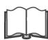

# 15.4 重复测量

社会与行为科学，以及工程、自然科学和商业中的一些试验，常以人为试验单位。经验、训练和背景不同，可能使不同人对同一处理的响应差异很大。若不控制，个体间变异将并入试验误差，可能显著增大误差均方，使真实处理差异更难发现。重复测量的单位也不一定是人，可以是营销研究中的商店、植物、试验动物等，统称为**受试单位**。

让每个受试单位都接受全部 $a$ 个处理，可以控制单位间变异，这称为**重复测量设计**。本节简要介绍单因子重复测量试验。

设有 $a$ 个处理，$n$ 个受试单位，每个单位恰好接受每个处理一次，数据布局见表 15.25。$y_{ij}$ 是单位 j 对处理 i 的响应，实际只使用 n 个单位。模型为

$$
y _ {i j} = \mu + \tau_ {i} + \beta_ {j} + \epsilon_ {i j}\tag{15.45}
$$

其中，$\tau_i$ 是处理 i 的效应，$\beta_j$ 是单位 j 的效应。假定处理固定，$\sum_{i=1}^a\tau_i=0$；受试单位从较大总体随机抽取，构成随机效应，$E(\beta_j)=0$、$V(\beta_j)=\sigma_\beta^2$。同一单位的全部 a 次测量共有 $\beta_j$，因此其响应之间通常有非零协方差。这里假定该协方差在不同处理与单位之间相同。

考虑总平方和的分解：

$$
\sum_ {i = 1} ^ {a} \sum_ {j = 1} ^ {n} (y _ {i j} - \overline {{y}} _ {\cdot .}) ^ {2} = a \sum_ {j = 1} ^ {n} (\overline {{y}} _ {\cdot j} - \overline {{y}} _ {\cdot .}) ^ {2} + \sum_ {i = 1} ^ {a} \sum_ {j = 1} ^ {n} (y _ {i j} - \overline {{y}} _ {\cdot j}) ^ {2}\tag{15.46}
$$

式（15.46）右端第一项是单位间差异平方和，第二项是单位内差异平方和，即

$$
S S _ {T} = S S _ {\text{受试单位间}} + S S _ {\text{受试单位内}}
$$

## 表 15.25

单因子重复测量设计的数据布局

<table><tr><td rowspan="2">处理</td><td colspan="3">受试单位</td><td rowspan="2">n</td><td rowspan="2">处理合计</td></tr><tr><td>1</td><td>2</td><td>$\cdots$</td></tr><tr><td>1</td><td>$y_{11}$</td><td>$y_{12}$</td><td>$\cdots$</td><td>$y_{1n}$</td><td>$y_{1.}$</td></tr><tr><td>2</td><td>$y_{21}$</td><td>$y_{22}$</td><td>$\cdots$</td><td>$y_{2n}$</td><td>$y_{2.}$</td></tr><tr><td>$\vdots$</td><td>$\vdots$</td><td>$\vdots$</td><td></td><td>$\vdots$</td><td>$\vdots$</td></tr><tr><td>a</td><td>$y_{a1}$</td><td>$y_{a2}$</td><td></td><td>$y_{an}$</td><td>$y_{a.}$</td></tr><tr><td>受试单位合计</td><td>$y_{.1}$</td><td>$y_{.2}$</td><td>$\cdots$</td><td>$y_{..n}$</td><td>$y_{..}$</td></tr></table>

单位间平方和与单位内平方和相互独立，自由度为

$$
a n - 1 = (n - 1) + n (a - 1)
$$

单位内差异同时来自处理效应差异和未控制变异（噪声或误差），因此进一步分解为

$$
\sum_ {i = 1} ^ {a} \sum_ {j = 1} ^ {n} (y _ {i j} - \overline {{y}} _ {. j}) ^ {2} = n \sum_ {i = 1} ^ {a} (\overline {{y}} _ {i.} - \overline {{y}} _ {..}) ^ {2} + \sum_ {i = 1} ^ {a} \sum_ {j = 1} ^ {n} (y _ {i j} - \overline {{y}} _ {i.} - \overline {{y}} _ {. j} + \overline {{y}} _ {..}) ^ {2}\tag{15.47}
$$

式（15.47）第一项衡量处理均值差异的贡献，第二项为残余误差变异，二者相互独立。因此，

$$
S S _ {\text{受试单位内}} = S S _ {\text{处理}} + S S _ {E}
$$

对应自由度分别为

$$
n (a - 1) = (a - 1) + (a - 1) (n - 1)
$$

检验无处理效应假设，即

$$
\begin{array}{l} H _ {0} \colon \tau_ {1} = \tau_ {2} = \dots = \tau_ {a} = 0 \\ H _ {1} \colon \text{至少一个} \tau_ {i} \neq 0 \end{array}
$$

使用比值

$$
F _ {0} = \frac {S S _ {\text{处理}} / (a - 1)}{S S _ {E} / (a - 1) (n - 1)} = \frac {M S _ {\text{处理}}}{M S _ {E}}\tag{15.48}
$$

## 表 15.26

单因子重复测量设计的方差分析

<table><tr><td>变异来源</td><td>平方和</td><td>自由度</td><td>均方</td><td>$F_0$</td></tr><tr><td>1. 受试者间</td><td>$\sum_{j=1}^{n} \frac{y_{\cdot j}^2}{a} - \frac{y_{\cdot\cdot}^2}{an}$</td><td>n-1</td><td></td><td></td></tr><tr><td>2. 受试者内</td><td>$\sum_{i=1}^{a} \sum_{j=1}^{n} y_{ij}^2 - \sum_{j=1}^{n} \frac{y_{\cdot j}^2}{a}$</td><td>n(a-1)</td><td></td><td></td></tr><tr><td>3. 处理</td><td>$\sum_{i=1}^{a} \frac{y_{i\cdot}^2}{n} - \frac{y_{\cdot\cdot}^2}{an}$</td><td>a-1</td><td>$MS_{\text{处理}} = \frac{SS_{\text{处理}}}{a-1}$</td><td>$\frac{MS_{\text{处理}}}{MS_E}$</td></tr><tr><td>4. 误差</td><td>差：第（2）行 − 第（3）行</td><td>(a-1)(n-1)</td><td>$MS_E = \frac{SS_E}{(a-1)(n-1)}$</td><td></td></tr><tr><td>5. 总计</td><td>$\sum_{i=1}^{a} \sum_{j=1}^{n} y_{ij}^2 - \frac{y_{\cdot\cdot}^2}{an}$</td><td>an-1</td><td></td><td></td></tr></table>

在这里的独立正态误差及共同协方差结构假定下，原假设成立时 $F_0$ 服从 $F_{a-1,(a-1)(n-1)}$ 分布。当 $F_0>F_{\alpha,a-1,(a-1)(n-1)}$ 时拒绝原假设。

方差分析汇总于表 15.26，并给出平方和计算公式。该分析相当于将受试单位作为区组的随机完全区组设计，残差分析和模型检查也相同。实际重复测量若具有更复杂的相关结构，应另行检查这一协方差假定。
